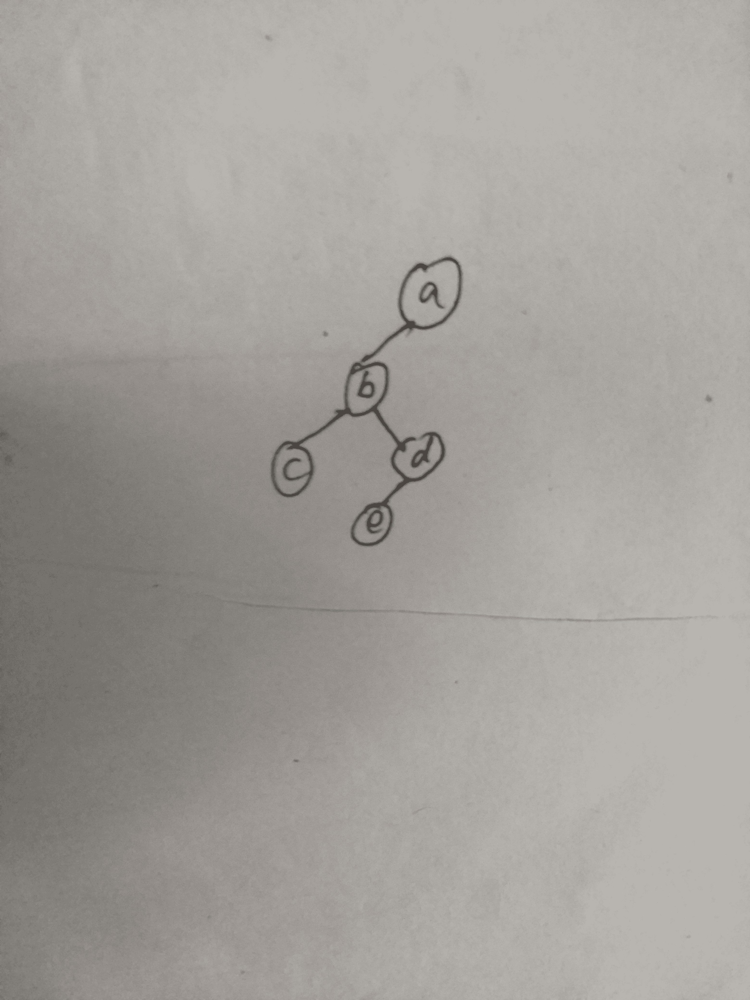
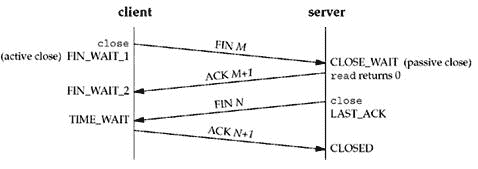

# 美团 2017 秋招笔试真题-后台开发

## 1

下述解决死锁的方法中，属于死锁预防策略的是？

正确答案: B   你的答案: 空 (错误)

```cpp
银行家算法
```

```cpp
资源有序分配法 
```

```cpp
 资源分配图化简法
```

```cpp
 撤消进程法
```

本题知识点

Java 工程师 C++工程师 安卓工程师 iOS 工程师 运维工程师 前端工程师 算法工程师 PHP 工程师 美团 美团 Java 工程师 C++工程师 安卓工程师 iOS 工程师 运维工程师 前端工程师 算法工程师 PHP 工程师 美团 美团 Java 工程师 C++工程师 安卓工程师 iOS 工程师 运维工程师 前端工程师 算法工程师 PHP 工程师 美团 美团 C++工程师 Java 工程师 美团 2017

讨论

[Hans.](https://www.nowcoder.com/profile/1055207)

银行家算法：避免死锁资源有序分配法：预防死锁资源分配图化简法：检测死锁撤销进程法：解决死锁

发表于 2017-02-18 19:22:17

* * *

[code1code2code3](https://www.nowcoder.com/profile/7362873)

在解决死锁的方法中，死锁的预防是设法至少破坏产生死锁的必要条件之一，严格预防死锁出现。银行家算法属于死锁的避免，不那么严格地限制产生死锁的必要条件的存在，而是在系统运行过程中小心地避免死锁的最终发生。死锁检测算法，允许死锁发生，定期检测。所以，只有资源有序分配法属于预防死锁的策略。

发表于 2017-02-06 22:10:12

* * *

[黄小斜](https://www.nowcoder.com/profile/3539721)

银行家算法：避免死锁资源有序分配法：预防死锁资源分配图化简法：检测死锁撤销进程法：解决死锁

发表于 2017-03-18 13:44:21

* * *

## 2

下面代码输出的结果是？
public class NULL {

public static void print(){
System.out.println(“MTDP”);
}
public static void main(String[] args) {
try{
((NULL)null).print();
}catch(NullPointerException e){
System.out.println("NullPointerException");
}
}
}

正确答案: B   你的答案: 空 (错误)

```cpp
NullPointerException
```

```cpp
MTDP
```

```cpp
都不输出
```

```cpp
无法正常编译
```

本题知识点

Java 工程师 C++工程师 安卓工程师 iOS 工程师 运维工程师 前端工程师 算法工程师 PHP 工程师 美团 美团 Java 工程师 C++工程师 安卓工程师 iOS 工程师 运维工程师 前端工程师 算法工程师 PHP 工程师 美团 美团 Java 工程师 C++工程师 安卓工程师 iOS 工程师 运维工程师 前端工程师 算法工程师 PHP 工程师 美团 美团 C++工程师 Java 工程师 美团 2017

讨论

[Dorsey1](https://www.nowcoder.com/profile/1291932)

null 不是对象，它可以看成是指向不确定对象的引用。赋值时，基本类型赋初值不能为 null，如 int=0 只能是这种，换而言之，int 也没有为空这一说法，如果非要勉强说有，那就是 0。而对象赋初值可以将其设为 null。本列，null 是 java 的关键字，故不用事先声明它，直接把 null 作为 NULL 对象的一个引用，将其实例化，故而有输出。才疏学浅，如有纰漏，还望赐教，顺颂时祺。

发表于 2017-02-09 19:48:23

* * *

[向宇小跟班](https://www.nowcoder.com/profile/5982303)

null 既不是一种对象也不是一种类型，它仅是一种特殊的值，你可以将其赋给任何引用类型，也可以转化成任何类型。但是 null 可以赋给变量类型，不可以赋给基本类型，如 int，boolean 等。

发表于 2017-03-21 10:26:31

* * *

[AndrewZJ](https://www.nowcoder.com/profile/953175)

这题应该有 2 个考察点：1、静态方法的调用，2、null 关键字如果去掉 print()方法的 static 关键字就会报空指针异常

发表于 2017-02-17 12:42:17

* * *

## 3

下列代码的输出结果是（），

```cpp
boolean result=false?false:true==false?true:false;
System.out.println(""+result+"");
```

正确答案: C   你的答案: 空 (错误)

```cpp
true
```

```cpp
null
```

```cpp
false
```

```cpp
空字符串
```

本题知识点

Java 工程师 C++工程师 安卓工程师 iOS 工程师 运维工程师 前端工程师 算法工程师 PHP 工程师 美团 美团 Java 工程师 C++工程师 安卓工程师 iOS 工程师 运维工程师 前端工程师 算法工程师 PHP 工程师 美团 美团 Java 工程师 C++工程师 安卓工程师 iOS 工程师 运维工程师 前端工程师 算法工程师 PHP 工程师 美团 美团 C++工程师 Java 工程师 美团 2017

讨论

[对白](https://www.nowcoder.com/profile/347680)

？ :是 java 的三目运算符   result=false?false:true==false?true:false;可以写成 result={false?false:[(true==false)?true:false]};再换一种写法 if(false){    reslut=false;}else{    if(true==false){    result=true;    }    else{    result=false;    }}

发表于 2017-02-10 11:44:51

* * *

[萨菲娜](https://www.nowcoder.com/profile/5657438)

三目运算符的运算顺序是自右向左。

发表于 2017-08-30 09:51:47

* * *

[Guanngxu](https://www.nowcoder.com/profile/5114437)

```cpp
int result=false?1:true==false?2:3;
System.out.println(""+result+"");//result = 3
换成这样更好看一点
```

发表于 2017-07-03 10:48:00

* * *

## 4

类 a 继承类 b 并重写 b 类的 protected 方法 func 时，a 中 func 方法的访问修饰符可以是？

正确答案: B   你的答案: 空 (错误)

```cpp
private/protected
```

```cpp
protected/public
```

```cpp
private/public
```

```cpp
private/protected/public
```

本题知识点

Java 工程师 C++工程师 安卓工程师 iOS 工程师 运维工程师 前端工程师 算法工程师 PHP 工程师 美团 美团 Java 工程师 C++工程师 安卓工程师 iOS 工程师 运维工程师 前端工程师 算法工程师 PHP 工程师 美团 美团 Java 工程师 C++工程师 安卓工程师 iOS 工程师 运维工程师 前端工程师 算法工程师 PHP 工程师 美团 美团 C++工程师 Java 工程师 美团 2017

讨论

[---余丹丹](https://www.nowcoder.com/profile/905572)

子类继承父类的方法是，控制符必须大于或等于父类的访问控制符

发表于 2017-02-08 10:57:48

* * *

[豪 92](https://www.nowcoder.com/profile/2889221)

1、重写方法不能比被重写方法限制有更严格的访问级别。
2、重写方法不能抛出新的异常或者比被重写方法声明的检查异常更广的检查异常。但是可以抛出更少，更有限或者不抛出异常。

发表于 2017-06-05 22:20:08

* * *

[莪是学渣莪喂自己袋盐](https://www.nowcoder.com/profile/4044228)

子类继承父类的方法时，访问控制符的范围必须大于或等于父类的访问控制符

发表于 2017-03-28 20:07:40

* * *

## 5

Java 中关于 finally 块中的代码描述正确的是？

正确答案: A   你的答案: 空 (错误)

```cpp
finally 也可以在 return 后执行
```

```cpp
异常没有发生时才被执行
```

```cpp
如果 try 块后没有 catch 块时，finally 块中的代码才会执行
```

```cpp
异常发生时才被执行
```

本题知识点

Java 工程师 C++工程师 安卓工程师 iOS 工程师 运维工程师 前端工程师 算法工程师 PHP 工程师 美团 美团 Java 工程师 C++工程师 安卓工程师 iOS 工程师 运维工程师 前端工程师 算法工程师 PHP 工程师 美团 美团 Java 工程师 C++工程师 安卓工程师 iOS 工程师 运维工程师 前端工程师 算法工程师 PHP 工程师 美团 美团 C++工程师 Java 工程师 美团 2017

讨论

[爱吃青菜皮卷面的 byr](https://www.nowcoder.com/profile/1411365)

我觉得这个 A 选项说的不好，应该是 finally 即使写在 return 之后，但是 finally 依然可以执行。 因为 finally 语句是在 try 的 return 语句执行之后，return 返回之前执行。

发表于 2017-11-21 20:56:52

* * *

[---余丹丹](https://www.nowcoder.com/profile/905572)

在异常结构中，finally 是无论怎么都会执行的。异常结构可以只有 try 和 finally

发表于 2017-02-08 10:59:13

* * *

[我相信：](https://www.nowcoder.com/profile/4718299)

finally 结构使得代码一定能够执行，即使在 return 语句后面

发表于 2017-09-04 11:38:11

* * *

## 6

进程和线程是操作系统中最基本的概念,下列有关描述错误的是？

正确答案: D   你的答案: 空 (错误)

```cpp
进程是程序的一次执行,而线程可以理解为程序中运行的一个片段
```

```cpp
由于线程没有独立的地址空间,因此同一个进程的一组线程可以访问该进程资源,这些线程之间的通信也很高效
```

```cpp
线程之间的通信简单(共享内存即可,但须注意互斥访问的问题),而不同进程之间的通信更为复杂,通常需要调用内核实现
```

```cpp
线程有独立的虚拟地址空间,但是拥有的资源相对进程来说,只有运行所必须的堆栈,寄存器等
```

本题知识点

Java 工程师 C++工程师 安卓工程师 iOS 工程师 运维工程师 前端工程师 算法工程师 PHP 工程师 美团 美团 Java 工程师 C++工程师 安卓工程师 iOS 工程师 运维工程师 前端工程师 算法工程师 PHP 工程师 美团 美团 Java 工程师 C++工程师 安卓工程师 iOS 工程师 运维工程师 前端工程师 算法工程师 PHP 工程师 美团 美团 C++工程师 Java 工程师 美团 2017

讨论

[~划船不用桨全靠浪](https://www.nowcoder.com/profile/4186812)

**进程和线程的主要差别在于它们是不同的操作系统资源管理方式。进程有独立的地址空间，一个进程崩溃后，在保护模式下不会对其它进程产生影响，而线程只是一个进程中的不同执行路径。线程有自己的堆栈和局部变量，但线程之间没有单独的地址空间，一个线程死掉就等于整个进程死掉，所以多进程的程序要比多线程的程序健壮，但在进程切换时，耗费资源较大，效率要差一些。但对于一些要求同时进行并且又要共享某些变量的并发操作，只能用线程，不能用进程**

发表于 2017-02-21 21:39:41

* * *

[喜欢被萌的感觉](https://www.nowcoder.com/profile/9032119)

B:线程之间的通信是为了同步（毕竟共享进程的资源），同步措施实施起来并不高效

发表于 2017-03-20 18:21:21

* * *

[coder_17173](https://www.nowcoder.com/profile/9312733)

线程没有单独的地址空间，所以应该是 D 错误吧。

发表于 2017-03-01 21:55:08

* * *

## 7

若进栈序列为 1，2，3，4，5，6，且进栈和出栈可以穿插进行，则不可能出现的出栈序是？

正确答案: A   你的答案: 空 (错误)

```cpp
2,3,5,1,6,4
```

```cpp
4,3,2,1,5,6
```

```cpp
3,2,4,1,6,5
```

```cpp
2,4,3,1,5,6
```

本题知识点

Java 工程师 C++工程师 安卓工程师 iOS 工程师 运维工程师 前端工程师 算法工程师 PHP 工程师 美团 美团 Java 工程师 C++工程师 安卓工程师 iOS 工程师 运维工程师 前端工程师 算法工程师 PHP 工程师 美团 美团 Java 工程师 C++工程师 安卓工程师 iOS 工程师 运维工程师 前端工程师 算法工程师 PHP 工程师 美团 美团 C++工程师 Java 工程师 美团 2017

讨论

[Black-key](https://www.nowcoder.com/profile/181768)

A 答案明显错了，怎么会有两个 4, C 的答案应该是对的 进 1 2 3 出 3 2 再进 4 出 4 出 1 进 5 6 出 6 5  所以是 3 2 4 1 6 5

发表于 2017-02-08 00:29:35

* * *

[笨小孩 40](https://www.nowcoder.com/profile/5778431)

C 明显可能，后台管理员记得改一下

发表于 2017-02-17 19:54:55

* * *

[脱线宅](https://www.nowcoder.com/profile/1909694)

两个 4，也是醉了，这网站太不靠谱了。

发表于 2017-02-27 16:56:45

* * *

## 8

若一颗二叉树的前序遍历为 a,b,c,d,e,后序遍历为 c,e,d,b,a，则根节点的孩子节点是？

正确答案: B   你的答案: 空 (错误)

```cpp
只有 a
```

```cpp
只有 b
```

```cpp
只有 e
```

```cpp
有 e，c
```

本题知识点

Java 工程师 C++工程师 安卓工程师 iOS 工程师 运维工程师 前端工程师 算法工程师 PHP 工程师 美团 美团 Java 工程师 C++工程师 安卓工程师 iOS 工程师 运维工程师 前端工程师 算法工程师 PHP 工程师 美团 美团 Java 工程师 C++工程师 安卓工程师 iOS 工程师 运维工程师 前端工程师 算法工程师 PHP 工程师 美团 美团 C++工程师 Java 工程师 美团 2017

讨论

[Myopia](https://www.nowcoder.com/profile/8875399)



发表于 2017-03-01 16:34:12

* * *

[对白](https://www.nowcoder.com/profile/347680)

先看前序遍历，a,b,c,d,e。因为前序遍历是按照根节点，左子节点，右子节点的顺序递归遍历。a 第一个出现说明 a 是根节点，第二个出现 b 说明 b 是 a 的左子节点，第三个出现 c 说明 c 可能是 a 的右子节点或者 c 是 b 的左子节点。再看后续遍历，第一个出现 c 说明 c 是最左边的节点，所以可以确定 c 是 b 的左子节点，d,e 在 c,b 之间，所以可以确定 e，d 属于 b 的子节点或者子节点的子节点。就可以确定 a 只有一个根节点 b 了

发表于 2017-02-10 12:12:19

* * *

[李嘉洼](https://www.nowcoder.com/profile/1922454)

前序遍历  ： 根左右中序遍历  ： 左根右后序遍历  ： 左右根

发表于 2017-03-12 19:29:35

* * *

## 9

用户表 users 中含有 100 万条数据，其中号码字段 phone 为字符型，并创建了唯一索引，且电话号码全部由数字组成，要统计号码头为 158 的电话号码的数量，下面写法执行速度最慢的是 ___

正确答案: C   你的答案: 空 (错误)

```cpp
select count(*) from users where phone>= ‘158’ and phone< ‘158A’
```

```cpp
select count(*) from users where phone like ‘158%’
```

```cpp
select count(*) from users where substr(phone,1,3) = ‘158’
```

```cpp
都一样快
```

本题知识点

Java 工程师 C++工程师 安卓工程师 iOS 工程师 运维工程师 前端工程师 算法工程师 PHP 工程师 美团 美团 Java 工程师 C++工程师 安卓工程师 iOS 工程师 运维工程师 前端工程师 算法工程师 PHP 工程师 美团 美团 Java 工程师 C++工程师 安卓工程师 iOS 工程师 运维工程师 前端工程师 算法工程师 PHP 工程师 美团 美团 C++工程师 Java 工程师 美团 2017

讨论

[Black-key](https://www.nowcoder.com/profile/181768)

在数据库的层面上进行函数的操作 本身就消耗速度, 数据库就应该干数据库本身应有的事,而不是处理具体业务

发表于 2017-02-08 00:31:43

* * *

[HDU 青鱼](https://www.nowcoder.com/profile/134259)

调用函数后，就不会用到索引

发表于 2018-03-01 19:55:59

* * *

[何晨阳](https://www.nowcoder.com/profile/7353345)

在查询基础上使用函数速度更慢

发表于 2017-03-18 16:05:40

* * *

## 10

从装有 3 只红球，2 只白球的盒子中任意取出两只求，则其中有并且只有一只红球的概率为？

正确答案: C   你的答案: 空 (错误)

```cpp
1/2
```

```cpp
1/5
```

```cpp
3/5
```

```cpp
2/5
```

本题知识点

Java 工程师 C++工程师 安卓工程师 iOS 工程师 运维工程师 前端工程师 算法工程师 PHP 工程师 美团 美团 Java 工程师 C++工程师 安卓工程师 iOS 工程师 运维工程师 前端工程师 算法工程师 PHP 工程师 美团 美团 Java 工程师 C++工程师 安卓工程师 iOS 工程师 运维工程师 前端工程师 算法工程师 PHP 工程师 美团 美团 C++工程师 Java 工程师 美团 2017

讨论

[---余丹丹](https://www.nowcoder.com/profile/905572)

(C3,1 * C2,1)/C5,2 = 3/5

发表于 2017-02-08 11:35:35

* * *

[Liuiu](https://www.nowcoder.com/profile/8271495)

取 2 次，其中只有一个红球的组合 1\. 第一次为白球，第二次为红球  (2/5)*(3/4)=(3/10)2\. 第一次为红球，第二次为白球   (3/5)*(1/2)=(3/10)结果为(3/10)+(3/10)=(3/5)

发表于 2019-03-01 00:06:56

* * *

[郑斌 coder](https://www.nowcoder.com/profile/511012)

1 - (3/5*2/4 + 2/5*1/4)

发表于 2017-03-09 14:46:03

* * *

## 11

1024! 末尾有多少个 0?

正确答案: B   你的答案: 空 (错误)

```cpp
297
```

```cpp
253
```

```cpp
243
```

```cpp
238
```

本题知识点

Java 工程师 C++工程师 安卓工程师 iOS 工程师 运维工程师 前端工程师 算法工程师 PHP 工程师 美团 美团 Java 工程师 C++工程师 安卓工程师 iOS 工程师 运维工程师 前端工程师 算法工程师 PHP 工程师 美团 美团 Java 工程师 C++工程师 安卓工程师 iOS 工程师 运维工程师 前端工程师 算法工程师 PHP 工程师 美团 美团 C++工程师 Java 工程师 美团 2017

讨论

[ths_zhou1](https://www.nowcoder.com/profile/763419)

末尾 0 的个数取决于乘法中因子 2 和 5 的个数。显然乘法中因子 2 的个数大于 5 的个数，所以我们只需统计因子 5 的个数。
是 5 的倍数的数有： 1024 / 5 = 204 个
是 25 的倍数的数有：1024 / 25 = 40 个
是 125 的倍数的数有：1024 / 125 = 8 个
是 625 的倍数的数有：1024 / 625 = 1 个
所以 1024! 中总共有 204+40+8+1=253 个因子 5。
也就是说 1024! 末尾有 253 个 0。

发表于 2017-02-12 17:35:12

* * *

[我是限量版](https://www.nowcoder.com/profile/8802085)

 分析一下：

是 5 的倍数的数有： 1024 / 5 = 204 个
是 25 的倍数的数有：1024 / 25 = 40 个   // 25 倍数的数有 40 个，因为在 5 的倍数时，算过一个 5，所以这里只算作一个 5
是 125 的倍数的数有：1024 / 125 = 8 个 // 同上
是 625 的倍数的数有：1024 / 625 = 1 个 // 同上

所以，结果是 253

发表于 2017-03-21 14:06:02

* * *

[helloworld…](https://www.nowcoder.com/profile/6199195)

每十个数一组，仅为 5 的倍数 1 个，25 的倍数 2 零，125 倍数 3 个零。625 倍数 4 个零。减去公倍数一共就是答案

发表于 2017-03-12 12:16:34

* * *

## 12

从 n 个数中找出最小的 k 个数(n >> k)，最优平均时间复杂度是？

正确答案: A   你的答案: 空 (错误)

```cpp
O(nlogk)
```

```cpp
O(klogk)
```

```cpp
O(nlogn)
```

```cpp
O(n2)
```

本题知识点

Java 工程师 C++工程师 安卓工程师 iOS 工程师 运维工程师 前端工程师 算法工程师 PHP 工程师 美团 美团 Java 工程师 C++工程师 安卓工程师 iOS 工程师 运维工程师 前端工程师 算法工程师 PHP 工程师 美团 美团 Java 工程师 C++工程师 安卓工程师 iOS 工程师 运维工程师 前端工程师 算法工程师 PHP 工程师 美团 美团 C++工程师 Java 工程师 美团 2017

讨论

[brew121](https://www.nowcoder.com/profile/6228007)

1.先直接排序，再取排序后数据的前 k 个数。排序算法用最快的堆排序，复杂度也会达到 O(N*logN)。当 k 接近于 N 时，可以用这种算法。2.先排序前 k 个数，对于后面 N-k 个数，依次进行插入。时间复杂度为 O(k*n)。当 k 很小时，可以用这种算法。3.对前 k 个数，建立最大堆，对于后面 N-k 个数，依次和最大堆的最大数比较，如果小于最大数，则替换最大数，并重新建立最大堆。时间复杂度为 O(N*logk)。当 k 和 N 都很大时，这种算法比前两种算法要快很多。

发表于 2017-03-07 11:18:26

* * *

[梦仙](https://www.nowcoder.com/profile/5534410)

size 为 k 的最小堆，高度为 logk 将 n 个数输入堆中，每个数在堆中复杂度评论是堆得高度

发表于 2017-02-14 00:16:49

* * *

[小蝙蝠](https://www.nowcoder.com/profile/4953313)

用 BFPRT 算不是可以得到 O(N)复杂度的吗

发表于 2018-03-19 10:18:26

* * *

## 13

HTTP 的会话有四个过程，请选出不是的一个？

正确答案: D   你的答案: 空 (错误)

```cpp
建立连接
```

```cpp
发出响应信息
```

```cpp
发出请求信息
```

```cpp
传输数据
```

本题知识点

Java 工程师 C++工程师 安卓工程师 iOS 工程师 运维工程师 前端工程师 算法工程师 PHP 工程师 美团 美团 Java 工程师 C++工程师 安卓工程师 iOS 工程师 运维工程师 前端工程师 算法工程师 PHP 工程师 美团 美团 Java 工程师 C++工程师 安卓工程师 iOS 工程师 运维工程师 前端工程师 算法工程师 PHP 工程师 美团 美团 C++工程师 Java 工程师 美团 2017

讨论

[吃面只认康师傅](https://www.nowcoder.com/profile/4391630)

Http 会话的四个过程:建立连接，发送请求，返回响应，关闭连接。

发表于 2017-02-07 23:13:48

* * *

[羊毛手套](https://www.nowcoder.com/profile/6565778)

传输数据的过程 封装在请求和相应的 session 中

发表于 2017-08-13 10:52:02

* * *

[lilinl](https://www.nowcoder.com/profile/3431580)

http 会话的四个过程：建立连接，发送请求，返回响应，关闭连接；传输数据的过程封装在请求和响应的 session 中

发表于 2018-09-05 16:47:23

* * *

## 14

关于 TIME_WAIT 状态的描述，下面说法错误的是？

正确答案: A   你的答案: 空 (错误)

```cpp
TIME_WAIT 出现在被动关闭一方，CLOSE_WAIT 出现在被动关闭一方
```

```cpp
从 TIME_WAIT 状态到 CLOSED 状态，有一个超时设置，这个超时设置是 2*MSL
```

```cpp
TIME_WAIT 确保有足够的时间让对端收到了 ACK，如果被动关闭的那方没有收到 Ack，就会触发被动端重发 Fin，一来一去正好 2 个 MSL
```

```cpp
有足够的时间让这个连接不会跟后面的连接混在一起
```

本题知识点

Java 工程师 C++工程师 安卓工程师 iOS 工程师 运维工程师 前端工程师 算法工程师 PHP 工程师 美团 美团 Java 工程师 C++工程师 安卓工程师 iOS 工程师 运维工程师 前端工程师 算法工程师 PHP 工程师 美团 美团 Java 工程师 C++工程师 安卓工程师 iOS 工程师 运维工程师 前端工程师 算法工程师 PHP 工程师 美团 美团 C++工程师 Java 工程师 美团 2017

讨论

[找嘿找啊找工作](https://www.nowcoder.com/profile/5807502)

通信双方建立 TCP 连接后，主动关闭连接的一方就会进入 TIME_WAIT 状态。

客户端主动关闭连接时，会发送最后一个 ack 后，然后会进入 TIME_WAIT 状态，再停留 2 个 MSL 时间(后有 MSL 的解释)，进入 CLOSED 状态。

发表于 2017-02-13 14:38:49

* * *

[Ytina](https://www.nowcoder.com/profile/6417230)

选项 A 明显写错了，TIME_WAIT 应该出现在主动关闭的一方

发表于 2018-03-21 14:32:54

* * *

## 15

下面哪些是 interface 中合法方法定义?

正确答案: B   你的答案: 空 (错误)

```cpp
public static void main(String [] args)；
```

```cpp
boolean setFlags(Boolean [] results)；
```

```cpp
private float get(int x)；
```

```cpp
static int getCount()；
```

本题知识点

Java 工程师 C++工程师 安卓工程师 iOS 工程师 运维工程师 前端工程师 算法工程师 PHP 工程师 美团 美团 Java 工程师 C++工程师 安卓工程师 iOS 工程师 运维工程师 前端工程师 算法工程师 PHP 工程师 美团 美团 Java 工程师 C++工程师 安卓工程师 iOS 工程师 运维工程师 前端工程师 算法工程师 PHP 工程师 美团 美团 C++工程师 Java 工程师 美团 2017

讨论

[csajob](https://www.nowcoder.com/profile/457026)

static 方法在 interface 中要有 body，故 A、D 错误 private 修饰的方法不可以出现在 interface 中，故 C 错误选择 B（java 1.8 亲测）

发表于 2017-03-17 22:11:54

* * *

[jiuanjing](https://www.nowcoder.com/profile/674481)

第三个选项明明就是错误的，你都 private 了，你让继承类如何实现

发表于 2017-02-07 16:00:39

* * *

[geekidentity](https://www.nowcoder.com/profile/9589131)

Binterface 方法不能是 private，如果是 static 的必须实现该方法。

发表于 2017-02-06 22:31:35

* * *

## 16

一台主机安装了 1GB 的内存，操作系统为支持 MMU 的 32 位 Linux 发行版，现在运行了 abc 三个进程，以下哪些使用内存的方式是可以实现的？

正确答案: A B   你的答案: 空 (错误)

```cpp
abc 各申请 1GB
```

```cpp
a 申请 500MB b 申请 500MB c 申请 25MB
```

```cpp
abc 一共申请 256GB
```

```cpp
abc 各申请 2.5GB
```

本题知识点

Java 工程师 C++工程师 安卓工程师 iOS 工程师 运维工程师 前端工程师 算法工程师 PHP 工程师 美团 美团 Java 工程师 C++工程师 安卓工程师 iOS 工程师 运维工程师 前端工程师 算法工程师 PHP 工程师 美团 美团 Java 工程师 C++工程师 安卓工程师 iOS 工程师 运维工程师 前端工程师 算法工程师 PHP 工程师 美团 美团 C++工程师 Java 工程师 美团 2017

讨论

[User13489137498](https://www.nowcoder.com/profile/284919)

有虚拟内存，可以申请大于物理内存的内存空间，但是 32 位系统最多只能寻址 4GB 空间。

发表于 2017-02-17 23:31:30

* * *

[lingye1005](https://www.nowcoder.com/profile/9339074)

2³²B=2²²KB=2¹²MB=2²GB=4GB

发表于 2018-03-21 10:30:04

* * *

[mmryziqi](https://www.nowcoder.com/profile/2170987)

我调过 32 位 centos6.5 下 内存爆满 stl 容器扩大容量段错误的问题。
记得上限好像是 2.44G.
但这显然不是不能选 D 的理由啊。
非要勉强扯上, 也应该严格表述为"可申请的堆内存大小"吧。

发表于 2017-07-25 16:38:09

* * *

## 17

下列属于红黑树性质的有？

正确答案: A B C D   你的答案: 空 (错误)

```cpp
每个结点要么是红的，要么是黑的
```

```cpp
根结点是黑的
```

```cpp
每个叶结点（叶结点即指树尾端 NIL 指针或 NULL 结点）是黑的
```

```cpp
如果一个结点是红的，那么它的俩个儿子都是黑的
```

本题知识点

Java 工程师 C++工程师 安卓工程师 iOS 工程师 运维工程师 前端工程师 算法工程师 PHP 工程师 美团 美团 Java 工程师 C++工程师 安卓工程师 iOS 工程师 运维工程师 前端工程师 算法工程师 PHP 工程师 美团 美团 Java 工程师 C++工程师 安卓工程师 iOS 工程师 运维工程师 前端工程师 算法工程师 PHP 工程师 美团 美团 C++工程师 Java 工程师 美团 2017

讨论

[溺人深海](https://www.nowcoder.com/profile/821572)

红黑树是每个节点都带有颜色属性的二叉查找树，颜色或红色或黑色。在二叉查找树强制一般要求以外，对于任何有效的红黑树我们增加了如下的额外要求:性质 1\. 节点是红色或黑色。性质 2\. 根节点是黑色。性质 3 每个叶节点（NIL 节点，空节点）是黑色的。性质 4 每个红色节点的两个子节点都是黑色。(从每个叶子到根的所有路径上不能有两个连续的红色节点)性质 5\. 从任一节点到其每个叶子的所有路径都包含相同数目的黑色节点。

发表于 2017-02-09 12:14:05

* * *

[我是限量版](https://www.nowcoder.com/profile/8802085)

1. 每个节点是黑色的或是红色的。

2. 根节点是黑色的。

3. 空节点是黑色的（红黑树中，根节点的 parent 以及所有叶节点 left 、 right 都不指向 NULL ，而是指向一个定义好的空节点 , 这样可以保持算法的一致性，简化算法）。

4. 红色节点的父、左子、右子节点都是黑色。

5. 在任何一棵子树中，每一条从根节点向下走到空节点的路径上包含的黑色节点数量都相同。

发表于 2017-03-21 14:04:52

* * *