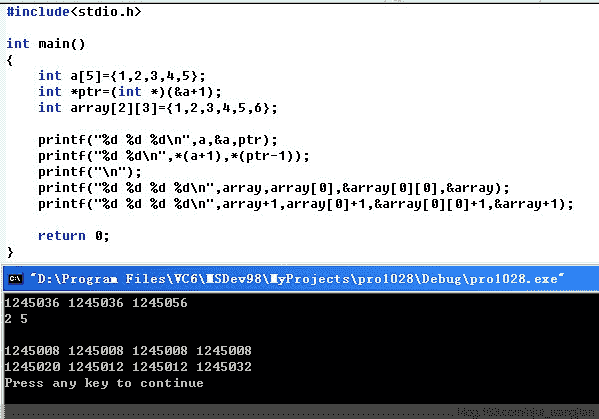

# 美团 2017 秋招笔试真题-前端开发工程师 A

## 1

下面关于 Android 中定义 style 和 theme 的描述错误的是？

正确答案: C   你的答案: 空 (错误)

```cpp
都可以减少重复属性设置
```

```cpp
style 可以作用在 Activity 上
```

```cpp
Theme 类可以继承
```

```cpp
一个 TextView 的 style 中定义了 textColor 属性，TextView 本身也设置 textColor 属性，那么 TextView 本身定义的优先级较高
```

本题知识点

前端工程师 美团 美团 前端工程师 美团 美团 前端工程师 美团 美团 前端工程师 美团 2017

讨论

[星风雪雨](https://www.nowcoder.com/profile/843287)

```cpp
public final class Resources.Theme 
extends [Object](https://developer.android.com/reference/java/lang/Object.html) 
```

Theme 类是 final 的，所以不能被继承

发表于 2017-02-13 20:37:48

* * *

[JYoung311](https://www.nowcoder.com/profile/346188)

android theme 支持继承，theme 类不能继承是什么意思？求解

发表于 2017-02-16 10:22:27

* * *

## 2

阅读下列程序，选择哪一个是正确的输出结果?
class HelloA{
public HelloA()
{
System.out.println("I'm A class ");
}
static
{
System.out.println("static A");
}
}
public class HelloB extends HelloA{
public HelloB()
{
System.out.println("I'm B class");
}
static{
System.out.println("static B");
}
public static void main(String[] args) {
new HelloB();
}
}

正确答案: C   你的答案: 空 (错误)

```cpp
static A I’m A class static B I’m B class
```

```cpp
I’m A class I’m B class static A static B
```

```cpp
static A static B I’m A class I’m B class
```

```cpp
I’m A class static A I’m B class static B
```

本题知识点

前端工程师 美团 美团 前端工程师 美团 美团 前端工程师 美团 美团 前端工程师 美团 2017

讨论

[waiting5](https://www.nowcoder.com/profile/9790137)

有 static 的先于构造函数执行，然后子类继承父类，会先 super(),然后出现上面结果

发表于 2017-02-20 14:04:38

* * *

[栲菈哋、尒懪裨氣”](https://www.nowcoder.com/profile/2947973)

总之一句话，静态代码块内容先执行，接着执行父类非静态代码块和构造方法，然后执行子类非静态代码块和构造方法。

发表于 2017-08-31 12:40:31

* * *

## 3

在同一线程中 android.os.Hander 和 android.os.MessageQueue 的数量对应关系是怎样的？

正确答案: B   你的答案: 空 (错误)

```cpp
1 (Handler) : 1 (MessageQueue)
```

```cpp
N (Handler) : 1 (MessageQueue)
```

```cpp
1 (Handler) : N (MessageQueue)
```

```cpp
N (Handler)  : N (MessageQueue)
```

本题知识点

前端工程师 美团 美团 前端工程师 美团 美团 前端工程师 美团 美团 前端工程师 美团 2017

讨论

[星风雪雨](https://www.nowcoder.com/profile/843287)

Looper 和线程一一对应，保存在 ThreadLocal 中，而 Looper 中包含 MessageQueue，所以线程和 Looper 以及 MessageQueue 的关系都是 1：1：1。而 Handler 与 Looper 关联，只是从根据当前线程从 ThreadLocal 取 Looper 而已，这个可以以主线程为例，如果我们不创建任何 Handler 的话，其实主线程本身也有一个 Handler，而我们依然可以在 Activity 中声明 Handler 并进行 UI 更新，这时主线程中的 Handler 与 MessageQueue 的比例就是 N:1 了

发表于 2017-02-13 20:31:34

* * *

[JD9](https://www.nowcoder.com/profile/8631894)

题目是 android.os.Hander, 但是 android 中只有 android.os.Handler 的.

| android apiandroid.os.MessageQueue |

* * *

Low-level class holding the list of messages to be dispatched by a [Looper](http://docset.velocity/Android_(v7.1.1).docset/developer.android.com/reference/android/os/Looper.html). Messages are not added directly to a MessageQueue, but rather through [Handler](http://docset.velocity/Android_(v7.1.1).docset/developer.android.com/reference/android/os/Handler.html) objects associated with the Looper.

You can retrieve the MessageQueue for the current thread with [Looper.myQueue()](http://docset.velocity/Android_(v7.1.1).docset/developer.android.com/reference/android/os/Looper.html#myQueue()).

编辑于 2017-03-21 18:04:03

* * *

## 4

一个包含 n 个节点的四叉树，每个节点都有四个指向孩子节点的指针，这 4n 个指针中有多少个空指针？

正确答案: D   你的答案: 空 (错误)

```cpp
2n+1
```

```cpp
3n-1
```

```cpp
3n
```

```cpp
3n+1
```

本题知识点

前端工程师 美团 美团 前端工程师 美团 美团 前端工程师 美团 美团 前端工程师 美团 2017

讨论

[～巧笑倩兮～](https://www.nowcoder.com/profile/7451186)

特殊情况，1 个节点的四叉树，每个节点都有四个指向孩子节点的指针，很明显这样情况下有四个空指针。n=1，代入 D 符合

编辑于 2017-03-21 12:54:07

* * *

[牛客 118304 号](https://www.nowcoder.com/profile/118304)

```cpp
n 个节点使用了的指针有 n-1,所以最后的答案位 4n-(n-1)=3n+1)
```

发表于 2017-02-18 14:20:39

* * *

[巅峰斌](https://www.nowcoder.com/profile/5222678)

n 个节点组成 log4(3n+1)层，那么第 log4(3n+1)层有 4^(log4(3n+1))==3n+1 个指向子节点的指针

发表于 2018-02-01 17:11:49

* * *

## 5

对于 li 这个节点，下列哪个 CSS 选择器的优先级最高？

正确答案: D   你的答案: 空 (错误)

```cpp
li#app
```

```cpp
li.cnt
```

```cpp
li.cnt:hover
```

```cpp
#app.cnt
```

本题知识点

前端工程师 美团 美团 前端工程师 美团 美团 前端工程师 美团 美团 前端工程师 美团 2017

讨论

[心晴朗](https://www.nowcoder.com/profile/2750104)

对于同一个元素设置了不同的 css 样式，此时根据权值来判断使用哪种样式，选择权值高的样式进行设置权值规则是：标签的权值为 1，类选择器的权值为 10；ID 选择器的权值为 100；伪类选择器是 10A:1+100=101B:1+10=11;C:1+10+10=21D:100+10=110 故选 D

发表于 2017-07-08 20:05:31

* * *

[唯一的梦](https://www.nowcoder.com/profile/1253215)

是不是有图片没加载？

发表于 2017-02-20 04:41:24

* * *

[前端小白啦](https://www.nowcoder.com/profile/815171945)

这个选项设置的有问题吧，既然考优先级，那把 id  类 元素 这些都标清楚啊

发表于 2018-09-06 11:37:08

* * *

## 6

不属于 Git 操作的命令是？

正确答案: C   你的答案: 空 (错误)

```cpp
add
```

```cpp
reset
```

```cpp
mkdir
```

```cpp
fetch
```

```cpp
rebase
```

```cpp
merge
```

本题知识点

前端工程师 美团 美团 前端工程师 美团 美团 前端工程师 美团 美团 前端工程师 美团 2017

讨论

[VZsilver](https://www.nowcoder.com/profile/335278)

$ git add 把文件添加到仓库 $ git reset 把当前版本回退到上一个版本
$ git fetch <远程主机名>  将某个远程主机的更新，全部取回本地 $ git rebase  用于把一个分支的修改合并到当前分支

$ git merge 用于合并指定分支到当前分支

发表于 2017-02-22 10:16:35

* * *

[牛客 594283 号](https://www.nowcoder.com/profile/594283)

mkdir 为 linux 中创建目录的命令

发表于 2017-08-27 17:13:07

* * *

## 7

请阅读以下代码：

```cpp
<div style="width:400px; height:200px;">
    <span style="float:left; width:auto; height:100%;">
      <i style="position:absolute;float:left; width:100px; height:50px;">hello</i>
    </span>
</div>
```

问题：span 标签的 width 和 height 分别为多少？

正确答案: D   你的答案: 空 (错误)

```cpp
width = 0px，height = 0px
```

```cpp
width = 400px，height = 200px
```

```cpp
width = 100px，height = 50px
```

```cpp
width = 0px，height = 200px
```

本题知识点

前端工程师 美团 美团 前端工程师 美团 美团 前端工程师 美团 美团 前端工程师 美团 2017

讨论

[Houn](https://www.nowcoder.com/profile/811292)

span 是行内元素 原本 width/height 是无效的 float 之后 脱离文档流的同时 也让他变为块级元素设置 width:auto 取决于撑开 span 的标签  而原本该撑开它的 i 标签也设置 position:absolute 所以没有标签可以撑开 span 所以 width 就是 0height：100%则是继承 div 的

发表于 2017-03-05 19:18:20

* * *

[徐旖旎](https://www.nowcoder.com/profile/9971485)

i 既用 position 定位，又用 float 定位。这怎么处理？按照 position：absolute 处理吗？

发表于 2018-05-08 11:02:52

* * *

[巅峰斌](https://www.nowcoder.com/profile/5222678)

float 之后变成 inline-block

发表于 2018-02-01 17:12:31

* * *

## 8

请阅读以下代码：
var obj = {};
obj.log = console.log;
obj.log.call(console, this)
该代码在浏览器中执行，输出的日志结果是什么？

正确答案: A   你的答案: 空 (错误)

```cpp
window
```

```cpp
console
```

```cpp
obj
```

```cpp
undefined
```

本题知识点

前端工程师 美团 美团 前端工程师 美团 美团 前端工程师 美团 美团 前端工程师 美团 2017

讨论

[High!](https://www.nowcoder.com/profile/9343157)

这道题就是问 console.log.call(console,this)打印出什么，这道题很容易引导人走向误区，因为我们知道 call 方法就是改变 this 的指向，但是这个被改变的 this 是 log 函数体内的 this，而不是题目中作为参数传入的 this，作为参数的这个 this 是指向 window 的。

发表于 2017-03-20 22:46:28

* * *

[_FM](https://www.nowcoder.com/profile/4364524)

1.  var obj = {};
2.  obj.log = console.log;
3.  obj.log.call(console, this)在第二步中，obj.log 指针指向“wondow.console.log”，即具有了和 wondow.console.log 相同的函数体在第三部中，直接将“obj.log.call(console, this)”不完全等价的看成“console.log(this)”,根据当前上下文题意，这里的 this 指向的是 window 针对上面的出题，其实完全可以换成这样：var obj = {};
obj.log = new Function();
console.log.call(obj.log, this)      // window 但是这样的话，不如上面出题这么怪异

发表于 2018-03-21 13:06:08

* * *

[可乐妥妥](https://www.nowcoder.com/profile/552695)

Window {stop: function, open: function, alert: function, confirm: function, prompt: function…}

发表于 2017-05-05 16:43:45

* * *

## 9

以下 C 语言指令：
int a[5] = {1, 3, 5, 7, 9};
int *p = (int *)(&a + 1);
printf("%d, %d", *(a + 1), *(p - 1));

运行结果是什么？

正确答案: C   你的答案: 空 (错误)

```cpp
2, 1
```

```cpp
3, 1
```

```cpp
3, 9
```

```cpp
运行时崩溃
```

本题知识点

前端工程师 美团 美团 前端工程师 美团 美团 前端工程师 美团 美团 前端工程师 美团 2017

讨论

[我是传奇！](https://www.nowcoder.com/profile/4910186)

链接：[`www.nowcoder.com/questionTerminal/6afbe6bd2add48bcaa313ddeda5c80ff`](https://www.nowcoder.com/questionTerminal/6afbe6bd2add48bcaa313ddeda5c80ff) 来源：牛客网

&a 表示一个指向大小为 5 数组的指针，那么&a+1 就是表示一个指向大小为 5 的下一个数组的指针，也就是数组 a 最后一个元素的下一个位置，那么 int*p=(int*)(&a+1)进行强制类型转换，将指向数组的指针转换为指向第二个数组中首元素的指针，所以 p-1 则是指向第一个数组中最后一个元素的指针

发表于 2017-02-23 00:55:01

* * *

[liyn](https://www.nowcoder.com/profile/7372466)



从以上输出我们可以看出：数组名和数组名取地址在数值上是相同的，均表示数组第一个元素的地址。**但是二者的颗粒度不同。 当数组是一维数组时，数组名是以一个数组元素为颗粒度，表现为“当数组名加 1 时，这里的 1 表示一个数组元素单元”，例子中的数组元素为整数，所以数组名加 1 时地址加 4；而数组名取地址&以整个数组为颗粒度，表现为“当数组名取地址&加 1 时，这里的 1 是表示整个数组单元”，例子中的数组为有 5 个元素的整型数组，所以数组名取地址&加 1 时，地址加 20.**

当数组是**二维数组**时，数组名 array、array[0]、&array[0][0]以及数组名取地址&在数值上是相同的，**同样各个之间的颗粒度不同。其中 array[0]以及 &array[0][0] 的颗粒度相同，均是以一个数组元素为颗粒度，所以它们加 1 后，地址加 4；而数组名和数组名取地址&颗粒度不同，前者以一行元素为颗粒度，后者以整个数组单元为颗粒度，所以前者加 1，地址加 3*4，后者加 1，地址加 6*4.**

[这是原文链接](http://blog.163.com/njut_wangjian/blog/static/16579642520139289599840/)

编辑于 2017-03-19 11:13:55

* * *

[彭可可可可](https://www.nowcoder.com/profile/8034874)

对&a 地址+1 是以整个数组长度为偏移那么长，也就是到了 9 的下一个地址，再强转回 int*型指针-1，就回到 9 了。*叫做解引用就是把指针指的值取出了，*(a+1)就是取出数组的第二个元素的值也就是 3

发表于 2017-03-03 17:18:01

* * *

## 10

对进程和线程的描述，以下正确的是？

正确答案: D   你的答案: 空 (错误)

```cpp
父进程里的所有线程共享相同的地址空间，父进程的所有子进程共享相同的地址空间
```

```cpp
改变进程里面主线程的状态会影响其他线程的行为，改变父进程的状态不会影响其他子进程
```

```cpp
多线程会引起死锁，而多进程则不会
```

```cpp
以上都不对
```

本题知识点

前端工程师 美团 美团 前端工程师 美团 美团 前端工程师 美团 美团 前端工程师 美团 2017

讨论

[牛客 6005093 号](https://www.nowcoder.com/profile/6005093)

A 进程不同于线程，各自拥有独立的地址空间 B 主线程是否影响其他线程取决于二者之间的依赖关系 C 进程和线程都可能引起死锁

发表于 2017-03-18 09:37:34

* * *

## 11

关于 C 语言中 volatile 关键字，下面的说法哪一个是错误的？

正确答案: B   你的答案: 空 (错误)

```cpp
编译器会禁止对 volatile 修饰的变量进行读写优化
```

```cpp
用 volatile 修饰的变量，读取速度会更快
```

```cpp
每一次读取 volatile 修饰的变量都会从内存中读取
```

本题知识点

前端工程师 美团 美团 前端工程师 美团 美团 前端工程师 美团 美团 前端工程师 美团 2017

讨论

[职业浪子 _](https://www.nowcoder.com/profile/7831395)

volatile 关键字表示禁止编译器对 volatile 修饰的变量进行读写优化，每次必须去地址读，而不能用上一次的缓存，所以读取速度反而会慢

发表于 2017-03-04 14:48:12

* * *

[飞^鱼](https://www.nowcoder.com/profile/9787050)

我就想问一下，这位出题人下一年还来吗？

发表于 2018-08-13 10:52:03

* * *

[JD9](https://www.nowcoder.com/profile/8631894)

volatile type qualifier

Each individual type in the C [type system](http://docset.velocity/C.docset/output/en/c/language/compatible_type.html) has several *qualified* versions of that type, corresponding to one, two, or all three of the [const](http://docset.velocity/C.docset/output/en/c/language/const.html), *volatile*, and, for pointers to object types, [restrict](http://docset.velocity/C.docset/output/en/c/language/restrict.html) qualifiers. This page describes the effects of the *volatile* qualifier.

Every access (both read and write) made through an lvalue expression of volatile-qualified type is considered an observable side effect for the purpose of optimization and is evaluated strictly according to the rules of the abstract machine (that is, all writes are completed at some time before the next sequence point). This means that within a single thread of execution, a volatile access cannot be optimized out or reordered relative to another visible side effect that is separated by a [sequence point](http://docset.velocity/C.docset/output/en/c/language/eval_order.html) from the volatile access.

发表于 2017-03-21 18:11:18

* * *

## 12

下面的 C 语言语句，哪一个可以把一个 32 位变量的最高位置为 1 且保持其它位不变？

正确答案: A   你的答案: 空 (错误)

```cpp
reg32 |= 1<<31; 
```

```cpp
reg32 &= 1<<31;  
```

```cpp
reg32 &= ~(1<<31);
```

```cpp
reg32 ^= 1<<31;
```

本题知识点

前端工程师 美团 美团 前端工程师 美团 美团 前端工程师 美团 美团 前端工程师 美团 2017

讨论

[gis](https://www.nowcoder.com/profile/6123410)

（1|x）=1、（0|x）=x（1&x）=x、（0&x）=0

发表于 2017-08-31 12:44:43

* * *

[shiyuanyin](https://www.nowcoder.com/profile/8697507)

1<<31  从 00000000000000000000000000000001   变成了
10000000000000000000000000000000A 和 1 或  为 1，和 0 或取决于 A    , 

发表于 2017-08-30 16:54:05

* * *

[everythingip](https://www.nowcoder.com/profile/4437089)

整个式子的完整形式：reg32 = reg32 | (1<<31); 意思是 32 位变量 和 左移 31 位的 1 相与。1<<31 表示 1 左移 31 位，移位之后就变成了第 32 位为 1 其他位为 0。

发表于 2017-03-12 18:21:25

* * *

## 13

由多个源文件组成的 C 程序，经过编辑、预处理、编译、链接等阶段会生成最终的可执行程序。下面哪个阶段可以发现被调用的函数未定义？

正确答案: C   你的答案: 空 (错误)

```cpp
预处理
```

```cpp
编译
```

```cpp
链接
```

```cpp
执行
```

本题知识点

前端工程师 美团 美团 前端工程师 美团 美团 前端工程师 美团 美团 前端工程师 美团 2017

讨论

[yangxiaorong](https://www.nowcoder.com/profile/418092)

链接是将各个编译单元中的变量和函数引用与定义进行绑定，保证程序中的变量和函数都有对应的实体，若被调用的函数未定义，就在此过程中发现。编辑阶段创建和修改源程序；预处理阶段分析宏定义以及替换宏引用；编译过程是把源程序翻译为与之等价的目标程序。

发表于 2017-03-04 21:52:22

* * *

## 14

在 Java 中下面 Class 的声明哪些是错误的？

正确答案: A B C   你的答案: 空 (错误)

```cpp
public abstract final class Test {   abstract  void method();}
```

```cpp
public abstract class Test {   abstract final void method();}
```

```cpp
public abstract class Test {   abstract void method(){   }}
```

```cpp
public class Test {   final void method(){   }}
```

本题知识点

前端工程师 美团 美团 前端工程师 美团 美团 前端工程师 美团 美团 前端工程师 美团 2017

讨论

[牛客 118304 号](https://www.nowcoder.com/profile/118304)

finanl：变量（不能修改值）、方法（不能被重写）、类（不能派生子类）abstract：（1）abstract 不能与 final 并列修饰同一个类。public abstract final class Test {   abstract  void method();} (2)abstract  关键字不能应用于  static 、 private  或  final  方法，因为这些方法不能被重写，因此，不能在子类中实现。public abstract class Test {   abstract final void method();}(2)abstract  方法不在声明它的类中实现，但必须在某个子类中重写。public abstract class Test { abstract void method(){ }}

编辑于 2017-02-18 15:15:43

* * *

[栲菈哋、尒懪裨氣”](https://www.nowcoder.com/profile/2947973)

注意 C 中抽象方法 method 有方法体

发表于 2017-08-31 13:07:11

* * *

[公众号:重温新知](https://www.nowcoder.com/profile/126819)

由于 abstract 不能和 final 结合 ,所以 A 和 B 明显的错误
C 选项错在抽象方法有方法体，相当于对抽象方法实现了一样，所以不对

```cpp
abstract void method(){   }
```

，

发表于 2017-04-08 21:49:54

* * *

## 15

在 Android 中使用 IBinder 进行 IPC 通讯时，能够传递下列哪些数据？

正确答案: A C D   你的答案: 空 (错误)

```cpp
Parcelable
```

```cpp
Serializable
```

```cpp
Bundle
```

```cpp
CharSequence
```

本题知识点

前端工程师 美团 美团 前端工程师 美团 美团 前端工程师 美团 美团 前端工程师 美团 2017

讨论

[shiyuanyin](https://www.nowcoder.com/profile/8697507)

Binder 传递数据都是通过 Parcel ，Parcel 的 API 文档说明如下 null
String
Byte
Short
Integer
Long
Float
Double
Boolean
String[]
boolean[]
byte[]
int[]
long[]
Object[] (supporting objects of the same type defined here).
**Bundle**
Map (as supported bywriteMap(Map)).
Any object that implements theParcelableprotocol.
**Parcelable[]   包**
**CharSequence (as supporte**d bywriteToParcel(CharSequence, Parcel, int)).字符序列
List (as supported bywriteList(List)).
SparseArray(as supported bywriteSparseArray(SparseArray)).
IBinder
**Any object that implements Serializable  任何序列化接口对象**

编辑于 2017-08-30 17:10:12

* * *

## 16

HashMap 中是用哪些方法解决哈希冲突的?

正确答案: B C   你的答案: 空 (错误)

```cpp
开放地址法
```

```cpp
二次哈希法
```

```cpp
链地址法
```

```cpp
建立一个公共溢出区
```

本题知识点

前端工程师 美团 美团 前端工程师 美团 美团 前端工程师 美团 美团 前端工程师 美团 2017

讨论

[BeLLESS](https://www.nowcoder.com/profile/5806370)

[`www.cnblogs.com/peizhe123/p/5790252.html`](http://www.cnblogs.com/peizhe123/p/5790252.html)
这篇文章写明了原因

发表于 2017-08-31 13:00:56

* * *

[gis](https://www.nowcoder.com/profile/6123410)

网上查到的主要用开放地址法和链地址法，另外两种也是解决办法呀，为什么答案是 BC，这是怎么回事呢？望大家能给我解惑解惑

发表于 2017-08-31 11:55:56

* * *

[小五五](https://www.nowcoder.com/profile/3866017)

开放定址法，二次哈希法、链地址法、建立公共溢出区。

发表于 2017-07-21 16:14:55

* * *

## 17

下列代码，页面打开后能够弹出 alert(1)的是？

正确答案: A B C   你的答案: 空 (错误)

```cpp
<iframe src="javascript: alert(1)"></iframe>
```

```cpp

```

```cpp
IE 下 <s style="top:expression(alert(1))"></s>
```

```cpp
<div onclick="alert(1)"></div>
```

本题知识点

前端工程师 美团 美团 前端工程师 美团 美团 前端工程师 美团 美团 前端工程师 美团 2017

讨论

[Houn](https://www.nowcoder.com/profile/811292)

expression 可在 css 中设置 然后使用 JavaScript 表达式【ie6 中启用 ie8 废除】

发表于 2017-03-05 18:58:57

* * *

[waiting5](https://www.nowcoder.com/profile/9790137)

d 需要点击才能出现弹出框

发表于 2017-02-20 14:11:49

* * *

[shiyuanyin](https://www.nowcoder.com/profile/8697507)

<iframe>标记内联框架 会出现一个框        src 里的就是框里面的内容内容<s>   是把文本划一条删除线

发表于 2017-08-30 18:47:50

* * *