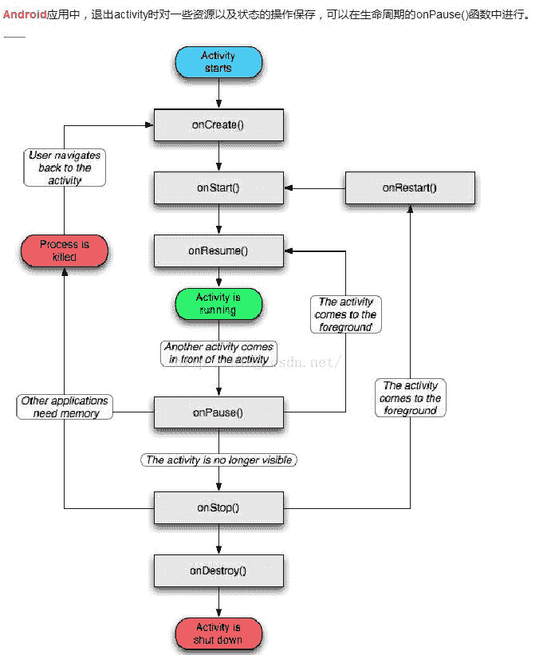
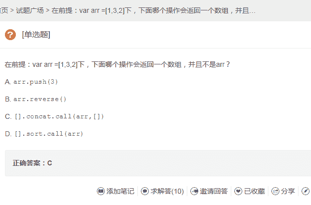
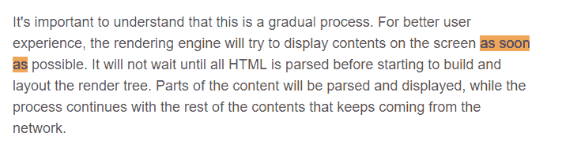
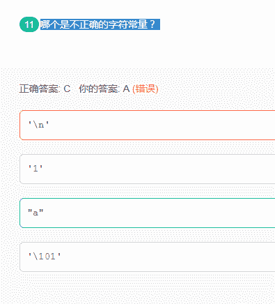
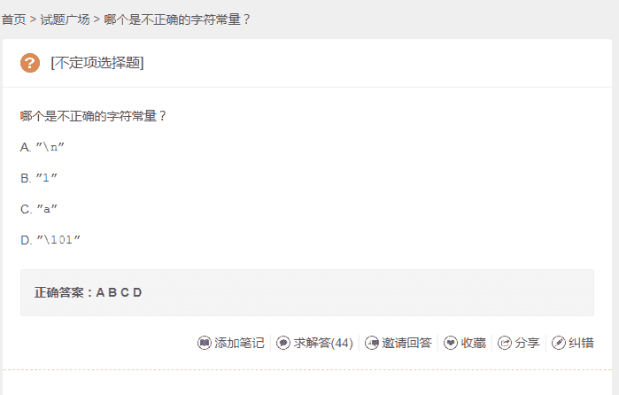
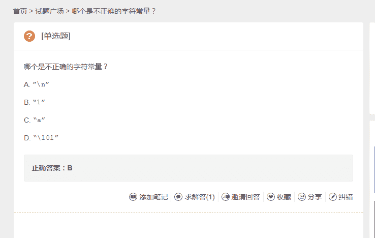
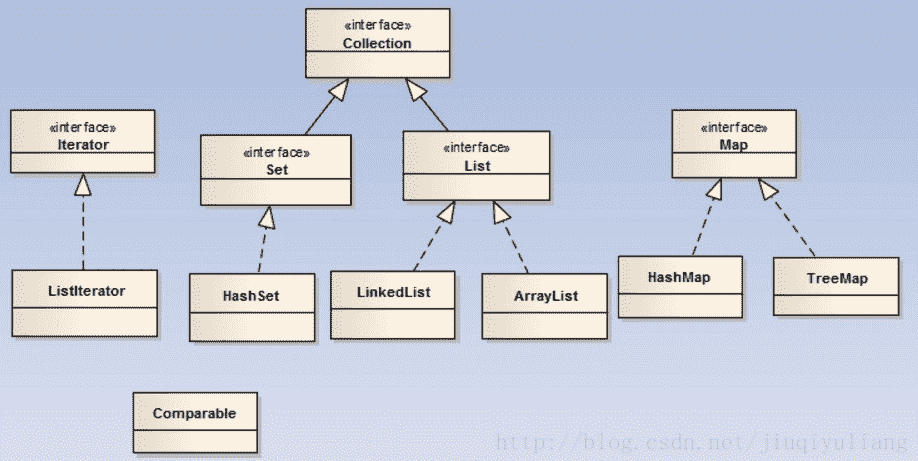
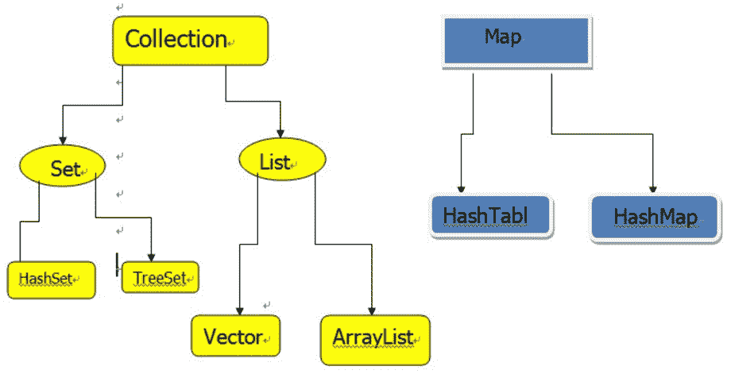

# 美团 2017 秋招笔试真题-前端开发工程师 B

## 1

如果在 Activity 中对一些资源以及状态进行保存操作，最好是在生命周期的哪个函数中进行呢？

正确答案: D   你的答案: 空 (错误)

```cpp
onPause()
```

```cpp
onCreate()
```

```cpp
onResume()
```

```cpp
onStart()
```

本题知识点

前端工程师 美团 美团 前端工程师 美团 美团 前端工程师 美团 美团 前端工程师 美团 2017

讨论

[犀利一下下](https://www.nowcoder.com/profile/986712)

对于 web 前端来说，这有点吃力

编辑于 2017-02-20 21:32:12

* * *

[晚来秋 1](https://www.nowcoder.com/profile/4812937)

**，出题人脑子被驴踢了？

发表于 2017-03-03 23:39:35

* * *

[墨菲 77](https://www.nowcoder.com/profile/1329966)



发表于 2017-03-02 14:24:59

* * *

## 2

Java 中的集合类包括 ArrayList、LinkedList、HashMap 等，下列关于集合类描述错误的是？

正确答案: C   你的答案: 空 (错误)

```cpp
ArrayList 和 LinkedList 均实现了 List 接口
```

```cpp
ArrayList 的访问速度比 LinkedList 快
```

```cpp
随机添加和删除元素时，ArrayList 的表现更佳
```

```cpp
HashMap 实现 Map 接口，它允许任何类型的键和值对象，并允许将 null 用作键或值
```

本题知识点

前端工程师 美团 美团 前端工程师 美团 美团 前端工程师 美团 美团 前端工程师 美团 2017

讨论

[offer 到碗里](https://www.nowcoder.com/profile/5203529)

ArrayList 保存所有元素 包括 null ，优点：根据索引快速访问；缺点：指定索引位置插入删除慢 Linkedlist 链表结构保存对象，优点：便于插入删除；缺点：随机访问，效率低
所以这题的正确答案应该是 C 而不是 D！ 

发表于 2017-02-13 21:13:52

* * *

[小禾鬼](https://www.nowcoder.com/profile/2454999)

ArrayList 和 LinkedList 的大致区别： 
1.ArrayList 是实现了基于动态数组的数据结构，LinkedList 基于链表的数据结构。 
2.对于随机访问 get 和 set，ArrayList 觉得优于 LinkedList，因为 LinkedList 要移动指针。 
3.对于新增和删除操作 add 和 remove，LinedList 比较占优势，因为 ArrayList 要移动数据。 

发表于 2017-09-12 22:13:54

* * *

[DannyZhao](https://www.nowcoder.com/profile/1991078)

随机添加或删除元素时，用 hashmap 最好

发表于 2017-02-25 20:15:24

* * *

## 3

关于 startActivityForResult()方法，如果 A 跳转 B，B 的 launchMode 属性为 singleInstance，A 的 onActivityResult()回调方法会在什么时候调用呢？

正确答案: A   你的答案: 空 (错误)

```cpp
B 被启动的时候即调用
```

```cpp
B 返回的时候调用
```

```cpp
下一次 A 启动的时候调用
```

```cpp
不会被调用
```

本题知识点

前端工程师 美团 美团 前端工程师 美团 美团 前端工程师 美团 美团 前端工程师 美团 2017

讨论

[JC-Ge](https://www.nowcoder.com/profile/281299440)

这什么题，我为什么根本看不懂

发表于 2019-01-01 14:35:41

* * *

[DannyZhao](https://www.nowcoder.com/profile/1991078)

因为 b 是 singleInstance，所以再来一个调用，前面的调用就返回了。

发表于 2017-02-25 20:16:55

* * *

## 4

下列哪个对访问修饰符作用范围由大到小排列是正确的？

正确答案: D   你的答案: 空 (错误)

```cpp
private > default > protected > public
```

```cpp
public > default > protected > private
```

```cpp
private > protected > default > public
```

```cpp
public > protected > default > private
```

本题知识点

前端工程师 美团 美团 前端工程师 美团 美团 前端工程师 美团 美团 前端工程师 美团 2017

讨论

[offer 到碗里](https://www.nowcoder.com/profile/5203529)

default 的访问范围是本包中，而 protected 的范围是：本包还有它的子类

发表于 2017-02-13 21:15:59

* * *

## 5

下列代码中哪个是隐式 Intent 的例子？

正确答案: B   你的答案: 空 (错误)

```cpp
Intent intent = new Intent(this, TestActivity.class);intent.setData(Uri.parse(fileUrl));startActivity(downloadIntent);
```

```cpp
Intent intent = new Intent(Intent.ACTION_SEND);intent.putExtra(Intent.EXTRA_TEXT, textMessage);intent.setType("text/plain");startActivity(intent);
```

```cpp
Intent intent = new Intent();intent.setClassName(context.getPackageName(), "com.google.sample.TestActivity");startActivity(intent);
```

```cpp
Intent intent = new Intent();intent.setComponent(new ComponentName(context.getPackageName(), "com.google.sample.TestActivity"));startActivity(intent);
```

本题知识点

前端工程师 美团 美团 前端工程师 美团 美团 前端工程师 美团 美团 前端工程师 美团 2017

讨论

[端木风](https://www.nowcoder.com/profile/8176980)

这确定是前端的东西？

发表于 2017-03-02 14:01:03

* * *

[BlueBeginner](https://www.nowcoder.com/profile/9327080)

前端工程师现在越来越牛逼了，会前端那是小菜一碟，分分钟的是，我们还要回 C，C++，JAVA，LINUX，PHP......哦，牛皮。

发表于 2017-06-22 15:59:21

* * *

[baihaoxin](https://www.nowcoder.com/profile/8388361)

隐式 Intent 传输数据标志是不要在 new Intent 参数中直接出现目标活动位置，通过目标对象在 Manifest.XML 中的 action 和 category 确定目标活动位置

发表于 2017-09-08 15:09:34

* * *

## 6

当 margin-top、padding-top 的值是百分比时，分别是如何计算的？

正确答案: D   你的答案: 空 (错误)

```cpp
相对父级元素的 height，相对自身的 height
```

```cpp
相对最近父级块级元素的 height，相对自身的 height
```

```cpp
相对父级元素的 width，相对自身的 width
```

```cpp
相对最近父级块级元素的 width，相对最近父级块级元素的 width
```

本题知识点

前端工程师 美团 美团 前端工程师 美团 美团 前端工程师 美团 美团 前端工程师 美团 2017

讨论

[8965471](https://www.nowcoder.com/profile/863591)

为什么 margin-top/margin-bottom 的百分数是相对于 width 而不是 height 呢？

CSS 权威指南中的解释：

我们认为，正常流中的大多数元素都会足够高以包含其后代元素（包括外边距），如果一个元素的上下外边距是父元素的 height 的百分数，就可能导致一个无限循环，父元素的 height 会增加，以适应后代元素上下外边距的增加，而相应的，上下外边距因为父元素 height 的增加也会增加，如果循环。

发表于 2017-08-14 23:34:22

* * *

[机智的小队长](https://www.nowcoder.com/profile/3673186)

应该选 C 吧

编辑于 2017-05-17 11:48:29

* * *

[moggyna](https://www.nowcoder.com/profile/1079433)

引用自：[`swordair.com/css-persentage-margin-and-padding/?utm_source=tuicool&utm_medium=referral`](https://swordair.com/css-persentage-margin-and-padding/?utm_source=tuicool&utm_medium=referral)

第一种说法是，padding-top 如果以容器高度为参照，那么子元素应用 padding 值将会继续加高容器的高度，容器高度的变化又会反过来继续影响子元素的 padding-top，陷入一个无限循环。。

第二种说法则更为可靠，为了保持 padding(margin)四个值的一统一。

发表于 2017-08-30 20:07:38

* * *

## 7

下面哪种方式不能改变作用域链？

正确答案: B   你的答案: 空 (错误)

```cpp
with
```

```cpp
while
```

```cpp
try catch
```

```cpp
eval
```

本题知识点

前端工程师 美团 美团 前端工程师 美团 美团 前端工程师 美团 美团 前端工程师 美团 2017

讨论

[取经中的稳健少年](https://www.nowcoder.com/profile/7084905)

某些语句可以在作用域链的前端临时增加一个变量对象，并在语句执行完之后移除该对象：

*   try-catch 中的 catch 块
*   with 语句

此外，eval( )可直接执行括号中的代码。并返回结果，相当于调用函数，即创造了子执行环境

发表于 2017-09-07 16:11:10

* * *

[机智的小队长](https://www.nowcoder.com/profile/3673186)

while 只是一个判断，并不能改变作用域链。

发表于 2017-05-17 12:51:33

* * *

[无瑕 2017](https://www.nowcoder.com/profile/1711116)

看成指针指向

发表于 2017-02-26 21:43:49

* * *

## 8

在前提：var arr = [1, 3, 2]下，下面哪个操作会返回一个数组，并且不是 arr？

正确答案: C   你的答案: 空 (错误)

```cpp
arr.push(3)
```

```cpp
arr.reverse()
```

```cpp
[].concat.call(arr, [])
```

```cpp
[].sort.call(arr)
```

本题知识点

前端工程师 美团 美团 前端工程师 美团 美团 前端工程师 美团 美团 前端工程师 美团 2017

讨论

[人生还有多少个二十年](https://www.nowcoder.com/profile/8733038)

results:A.     4    //返回新数组的长度 B.    [2,3,1]    //返回原数组逆序后的数组 C.    [1,3,2]    //将空数组与原数组合并，组成的新数组跟原数组的值仍然相同 D.    [1,2,3]    //将原数组排序后返回 attention:reverse()和 sort()都是在原数组上进行修改，而 concat()不对原数组进行修改，并且返回的是新数组

发表于 2017-02-19 11:13:20

* * *

[Mr.君](https://www.nowcoder.com/profile/7273934)

厉害了站内一道题好几个答案 所以这道题到底选什么

发表于 2017-08-03 12:20:48

* * *

[前端小白啦](https://www.nowcoder.com/profile/815171945)

```cpp
var arr = [1,2,3];
arr.push(4);
console.log(arr);          //(4) [1, 2, 3, 4]
console.log(arr.push(4));  //5

```

先 push，再打印，就是出来一个数组；直接打印 push 的结果，那就是长度。

发表于 2018-09-06 15:57:44

* * *

## 9

白屏时间 first paint 和可交互时间 dom ready 的关系是？

正确答案: D   你的答案: 空 (错误)

```cpp
先触发 first paint，后触发 dom ready
```

```cpp
先触发 dom ready，后触发 first paint
```

```cpp
一起触发
```

```cpp
没关系
```

本题知识点

前端工程师 美团 美团 前端工程师 美团 美团 前端工程师 美团 美团 前端工程师 美团 2017

讨论

[走过路过见过记得](https://www.nowcoder.com/profile/2702149)



当 html 页面内容很多时，浏览器会部分渲染，[First Paint](https://stackoverflow.com/questions/34289535/why-first-paint-is-happening-before-domcontentloaded)发生在 domready 之前，但是当 html 内容很少时，readydom 在[First Paint](https://stackoverflow.com/questions/34289535/why-first-paint-is-happening-before-domcontentloaded)之前，则关系不确定的，则选择没有关系

参考：[`www.html5rocks.com/en/tutorials/internals/howbrowserswork/#The_main_flow`](https://www.html5rocks.com/en/tutorials/internals/howbrowserswork/#The_main_flow)** Stack Overflow**:[`stackoverflow.com/questions/34289535/why-first-paint-is-happening-before-domcontentloaded`](https://stackoverflow.com/questions/34289535/why-first-paint-is-happening-before-domcontentloaded)

发表于 2017-08-31 17:34:48

* * *

[VZsilver](https://www.nowcoder.com/profile/335278)

这是前端题？做完题都要怀疑人生了 T_T

发表于 2017-03-17 18:54:37

* * *

[公众号:重温新知](https://www.nowcoder.com/profile/126819)

两个时间可以认为是一致的，
1.只有 DOMready 就是 DOM 树渲染完毕，渲染完毕才会有元素，不然就是一片空白，而影响 DOMready 的因素也有很多，才会有那么多的性能优化策略，不过有一点可能容易忽略的是，domready 是指 dom 元素都已被解析，
2.但是要知道，script 也是一样的，所以浏览器解析你的脚本后是直接执行的，所以如果你的脚本里存在阻塞的话是页面是一直处于 dom 加载阶段的，比如 script 里写一句 alert，你不关掉弹窗页面一直是空白的，或者跑一个耗时长的代码，如循环，也是一样的。
大家可以看一下这个链接
http://www.imooc.com/wenda/detail/345720?t=236189

发表于 2017-04-08 21:07:56

* * *

## 10

下列哪种排序算法不是稳定的？

正确答案: A   你的答案: 空 (错误)

```cpp
快速排序
```

```cpp
冒泡排序
```

```cpp
选择排序
```

```cpp
归并排序
```

本题知识点

前端工程师 美团 美团 前端工程师 美团 美团 前端工程师 美团 美团 前端工程师 美团 2017

讨论

[牛客程千逸](https://www.nowcoder.com/profile/2154161)

排序算法中不稳定的算法有：快速排序，简单选择排序，希尔排序，堆排序。（速记：“简兮快怼”）。

发表于 2017-03-04 15:42:52

* * *

[hbbdmc](https://www.nowcoder.com/profile/9045301)

A,C 都是正确的

发表于 2017-07-28 10:41:26

* * *

[既往不恋，纵情向前](https://www.nowcoder.com/profile/990019487)

这道题答案不完整啊不稳定排序：快选希堆稳定排序：插冒基归

发表于 2018-09-06 10:51:11

* * *

## 11

哪个是不正确的字符常量？

正确答案: C   你的答案: 空 (错误)

```cpp
'\n'
```

```cpp
'1'
```

```cpp
"a"
```

```cpp
'\101'
```

本题知识点

前端工程师 美团 美团 前端工程师 美团 美团 前端工程师 美团 美团 前端工程师 美团 2017

讨论

[学习学习学习](https://www.nowcoder.com/profile/4461395)

字符常量有两种：一种是普通字符，即用单撇号括起来的一个字符，如'b' ，'y'，‘？’。字符常量在储存在计算机的储存单元中时，是以其代码（一般采用 ASCII 代码）储存的。另一种是转义字符，即特殊字符常量。转移字符是 C 语言中表示字符的一种特殊形式，其含义是将反斜杠后面的字符转换成另外的意义。[1] 另外还可以用字符的[ASCII](https://baike.baidu.com/item/ASCII)码表示，即用反斜符(\)开头，后跟字符的 ASCII 码，这种方法也称为转义序列表示法，具体方法是:有两种形式：一种是用字符的[八进制](https://baike.baidu.com/item/%E5%85%AB%E8%BF%9B%E5%88%B6)ASCII 码，表示为：\0dd.这里，0dd 是八进制值（0 可以省略）。另一种使用字符的[十六进制](https://baike.baidu.com/item/%E5%8D%81%E5%85%AD%E8%BF%9B%E5%88%B6)ASCII 码值，表示为　\xhh 或 Xhh　这里 hh 是两位十六进制值。如：'A' ，'\101' 和 '\[x41](https://baike.baidu.com/item/x41)'都表示同一个[字符](https://baike.baidu.com/item/%E5%AD%97%E7%AC%A6)常量。转义字符:反斜线后面跟一个字符或一个代码值表示。[2] 转义序列表示法还可以用来表示一些特殊字符，用来显示特殊符号或控制输出格式。使用单撇号括起一个字符的形式即字符常量。使用字符常量需要注意以下几点：（1）字符常量只能用单撇号括起来，不能使用单引号或其他括号。（2）字符常量中只能包括一个字符，不能是字符串。（3）字符常量是区分大小写的。（4）单撇号只是界限符，不属于字符常量中旳一部分，字符常量只能是一个字符，不包括单撇号。（5）单撇号里面可以是数字、字母等 C 语言字符集中除’和\以外所有可现实的单个字符，但是数字被定义为字符之后则不能参与数值运算

发表于 2017-09-01 22:38:54

* * *

[Mr.君](https://www.nowcoder.com/profile/7273934)

这三道题   真是奇葩啊

发表于 2017-08-03 12:50:42

* * *

[薛鑫 star](https://www.nowcoder.com/profile/7035452)

使用单撇号括起一个字符的形式即字符常量。使用字符常量需要注意以下几点：（1）字符常量只能用单撇号括起来，不能使用单引号或其他括号。（2）字符常量中只能包括一个字符，不能是字符串。（3）字符常量是区分大小写的。（4）单撇号只是界限符，不属于字符常量中旳一部分，字符常量只能是一个字符，不包括单撇号。（5）单撇号里面可以是数字、字母等 C 语言字符集中除’和\以外所有可现实的单个字符，但是数字被定义为字符之后则不能参与数值运算。

发表于 2017-04-01 19:42:08

* * *

## 12

下列叙述中正确的是？

正确答案: A   你的答案: 空 (错误)

```cpp
线性表是线性结构；
```

```cpp
栈与队列是非线性结构；
```

```cpp
线性链表是非线性结构；
```

```cpp
二叉树是线性结构。
```

本题知识点

前端工程师 美团 美团 前端工程师 美团 美团 前端工程师 美团 美团 前端工程师 美团 2017

讨论

[无瑕 2017](https://www.nowcoder.com/profile/1711116)

```cpp
数据的逻辑结构包括线性结构、树、图、集合这四种，在线性结构里面又有线性表、栈、队列等等。
```

发表于 2017-02-26 21:51:44

* * *

## 13

已知一个栈的入栈序列是 m、n、x、y、z，则不可能出现的出栈顺序是？

正确答案: C   你的答案: 空 (错误)

```cpp
mnxyz
```

```cpp
xnyzm
```

```cpp
nymxz
```

```cpp
nmyzx
```

本题知识点

前端工程师 美团 美团 前端工程师 美团 美团 前端工程师 美团 美团 前端工程师 美团 2017

讨论

[shiyuanyin](https://www.nowcoder.com/profile/8697507)

b 项   先进三个 mnx  出站两个 xn    还剩下一个 m        再进站出站 y       再进站出站 z       最后出站 ma  每个字母都进站出站   进站出站
C 项  不可能  yn 进去（没有按顺序进去）所以不会有 ny 没哟规定  怎么出站

发表于 2017-08-30 21:59:20

* * *

[让我笑](https://www.nowcoder.com/profile/3386505)

解题思路是：入栈序列 m、n、x、y、z 是递增序列 ，看字母后比它小的字母是否递减。

发表于 2017-02-15 21:12:12

* * *

[笑以](https://www.nowcoder.com/profile/1333690)

d 不也错？y 怎么可以在 x 前面

发表于 2018-03-21 10:42:16

* * *

## 14

下面哪些类实现或继承了 Collection 接口？

正确答案: B C   你的答案: 空 (错误)

```cpp
HashMap
```

```cpp
ArrayList
```

```cpp
Vector
```

```cpp
Iterator
```

本题知识点

前端工程师 美团 美团 前端工程师 美团 美团 前端工程师 美团 美团 前端工程师 美团 2017

讨论

[蹬着三轮赶飞机的蛋](https://www.nowcoder.com/profile/1678686)

 

发表于 2017-02-14 21:29:43

* * *

[素颜 26](https://www.nowcoder.com/profile/3149897)

我们这里说的集合指的是小写的 collection，集合有 4 种基本形式，其中前三种的父接口是 Collection。

1.  **List 关注事物的索引列表**
2.  **Set 关注事物的唯一性**
3.  **Queue 关注事物被处理时的顺序**
4.  **Map 关注事物的映射和键值的唯一性**

发表于 2017-06-07 16:53:14

* * *

[学习 ing111](https://www.nowcoder.com/profile/472481)

这是前端题？

发表于 2017-08-11 17:38:06

* * *

## 15

在下列 Android 四大组件的回调函数中哪些是在 UI 主线程执行的呢？

正确答案: A C   你的答案: 空 (错误)

```cpp
Activity 的 onCreate()
```

```cpp
IntentService 的 onHandleIntent()
```

```cpp
BroadcastReceiver 的 onReceive()
```

```cpp
ContentProvider 的 query()
```

本题知识点

前端工程师 美团 美团 前端工程师 美团 美团 前端工程师 美团 美团 前端工程师 美团 2017

讨论

[牛客 594283 号](https://www.nowcoder.com/profile/594283)

这前端做的怀疑人生

发表于 2017-08-27 16:50:34

* * *

[明眸在心丶](https://www.nowcoder.com/profile/4145130)

哇，前端还搞 android 的

发表于 2017-06-26 13:42:09

* * *

[Donkeyman](https://www.nowcoder.com/profile/2079807)

我们做安卓的才蛋疼呢，还得做前端的题，唉

发表于 2017-08-31 11:40:45

* * *

## 16

下列对 AsyncTask 的描述，哪些是正确的 ？

正确答案: A C   你的答案: 空 (错误)

```cpp
onProgressUpdate()方法是在主线程中执行的
```

```cpp
如果同时执行多个 AsyncTask 的话，他们默认是串行执行的
```

```cpp
AsyncTask 的实例必须在 UI thread 中创建
```

```cpp
AsyncTask 内部默认的线程池是通过 java.util.concurrent.Executors.newFixedThreadPool()来创建的
```

本题知识点

前端工程师 美团 美团 前端工程师 美团 美团 前端工程师 美团 美团 前端工程师 美团 2017

讨论

[蹬着三轮赶飞机的蛋](https://www.nowcoder.com/profile/1678686)

AsyncTask,是 android 提供的轻量级的异步类,可以直接继承 AsyncTask,在类中实现异步操作,并提供接口反馈当前异步执行的程度(可以通过接口实现 UI 进度更新),最后反馈执行的结果给 UI 主线程。onProgressUpdate(Progress…)   可以使用进度条增加用户体验度。 此方法在主线程执行，用于显示任务执行的进度。

发表于 2017-02-14 21:42:25

* * *

[小小牛客真不小](https://www.nowcoder.com/profile/529091724)

前端做这个干什么，我一点都不会

发表于 2020-03-11 18:20:20

* * *

[Donkeyman](https://www.nowcoder.com/profile/2079807)

答案应该有问题，多个 AsyncTask 应该是串行执行的，要想并行执行要使用 AsyncTask 的 executeOnExecutor 方法，但这个方法不是默认的，也不是推荐优先使用的。

发表于 2017-08-31 11:51:51

* * *

## 17

下列函数哪些是 JavaScript 的全局函数？

正确答案: A B D   你的答案: 空 (错误)

```cpp
encodeURI
```

```cpp
parseFloat
```

```cpp
setTimeout
```

```cpp
eval
```

本题知识点

前端工程师 美团 美团 前端工程师 美团 美团 前端工程师 美团 美团 前端工程师 美团 2017

讨论

[牛客 3209773 号](https://www.nowcoder.com/profile/3209773)

http://www.cnblogs.com/maiweibiao/archive/2011/03/11/1981773.html

发表于 2017-02-28 21:58:16

* * *

[巅峰斌](https://www.nowcoder.com/profile/5222678)

浏览器中的 js 由 ECMAScript 和 JS-web-api（DOM、BOM 等）组成，setTimeout 是 window 对象的方法，window 对象是浏览器环境独有的。题目中应该想问 ECMAScript 中的全局函数，那当然不包含 setTimeout。

发表于 2018-01-20 17:41:26

* * *

[mbwjs](https://www.nowcoder.com/profile/4987800)

[`www.w3school.com.cn/jsref/jsref_obj_global.asp`](http://www.w3school.com.cn/jsref/jsref_obj_global.asp)

发表于 2017-09-09 11:35:35

* * *