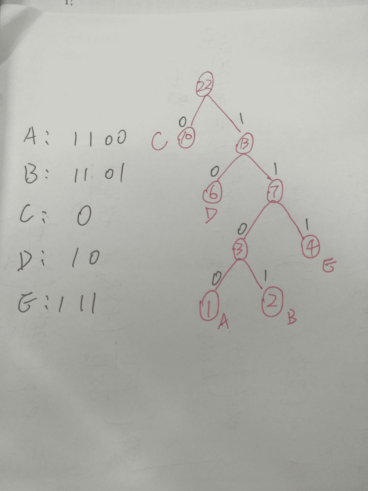

# 美团 2017 秋招笔试真题-算法工程师 A

## 1

下面哪种 STL 容器的实现和其它三个不一样

正确答案: B   你的答案: 空 (错误)

```cpp
A. set
```

```cpp
B. deque
```

```cpp
C. multimap
```

```cpp
D. map
```

本题知识点

算法工程师 美团 美团 算法工程师 美团 美团 算法工程师 美团 美团 算法工程师 美团 2017

讨论

[Bromance](https://www.nowcoder.com/profile/6077648)

STL 的容器可以分为以下几个大类:1、 顺序（序列）容器，　有 vector,list,deque , string,stack( 适配器类), queue( 适配器类), priority queues( 适配器类)。2、关联容器,     有 set, multiset,map,multimap, bitset,hash_set, hash_map, hash_multiset, hash_multimap。

发表于 2017-03-21 11:25:23

* * *

[五月 Lucy](https://www.nowcoder.com/profile/2911311)

set map multimap 是关联容器，deque 是序列容器

发表于 2017-03-18 10:44:25

* * *

[牛客 8508233 号](https://www.nowcoder.com/profile/8508233)

set 和 map 使用红黑树，而 deque 没有

发表于 2017-02-11 00:05:20

* * *

## 2

以下哪种模型不适合序列标注问题

正确答案: C   你的答案: 空 (错误)

```cpp
A.Recurrent Neural Network
```

```cpp
B.  Conditional Random Field
```

```cpp
C.Convolution Neural Network
```

```cpp
D.Hidden Markov model
```

本题知识点

算法工程师 美团 美团 算法工程师 美团 美团 算法工程师 美团 美团 算法工程师 美团 2017

讨论

[牛客 437291 号](https://www.nowcoder.com/profile/437291)

条件随机场和隐马尔可夫模型是典型的用来做序列标注问题的模型，是构建语音识别声学模型的传统方法，RNN 因含有递归层而具有序列结构的特点，现在被广泛用于语音识别等序列标注问题中

发表于 2017-03-20 09:14:32

* * *

## 3

一颗高度为 4 的平衡二叉树，其最少节点数为

正确答案: C   你的答案: 空 (错误)

```cpp
A. 5
```

```cpp
B. 6
```

```cpp
C. 7
```

```cpp
D. 8
```

本题知识点

算法工程师 美团 美团 算法工程师 美团 美团 算法工程师 美团 美团 算法工程师 美团 2017

讨论

[ww_0217](https://www.nowcoder.com/profile/185704)

假设深度为 n 的平衡二叉树至少有 F(n)个结点,那么 F(n)满足
F(n)=F(n-1)+F(n-2)+1

发表于 2017-02-17 12:39:56

* * *

[Drlisy](https://www.nowcoder.com/profile/7281393)

对于一棵平衡树，如果以 Nh 表示深度为 h 时含有的最少结点数。有如下的规律： N0=0，N1=1，N2=2；Nh=Nh−1+Nh−2+1 以此类推

发表于 2018-03-13 20:55:20

* * *

[wanlanwalan](https://www.nowcoder.com/profile/7952866)

平衡的二叉树是对二叉树的一种“平衡化”处理。结点的平衡因子定义为其右子树高度减去左子树高度。若任一结点的平衡因子均取值-1，或 0，或+1，则此二叉排序树为平衡的二叉排序树。根据这个原则，可得最少结点数为 7。

发表于 2017-06-06 16:37:24

* * *

## 4

一共三个结点的二叉树可能出现多少种结构

正确答案: C   你的答案: 空 (错误)

```cpp
A. 3
```

```cpp
B. 4
```

```cpp
C .5
```

```cpp
D. 6
```

本题知识点

算法工程师 美团 美团 算法工程师 美团 美团 算法工程师 美团 美团 算法工程师 美团 2017

讨论

[水一样哦哦哦](https://www.nowcoder.com/profile/848399)

卡特兰数 C(2n,n)/n+1

发表于 2017-03-18 02:39:25

* * *

[Kelisiya](https://www.nowcoder.com/profile/331034)

节点的形态数 = 卡特兰数 = （2n！）/（n！*n！*（n+1））

发表于 2017-03-17 20:54:45

* * *

[讨鬼](https://www.nowcoder.com/profile/761977)

C

编辑于 2017-02-26 10:38:07

* * *

## 5

以下哪种不是非稳定排序算法

正确答案: A   你的答案: 空 (错误)

```cpp
A 归并排序
```

```cpp
B. 快速排序
```

```cpp
C 堆排序
```

```cpp
D 希尔排序
```

本题知识点

算法工程师 美团 美团 算法工程师 美团 美团 算法工程师 美团 美团 算法工程师 美团 2017

讨论

[wanlanwalan](https://www.nowcoder.com/profile/7952866)

(1)冒泡排序

冒泡排序就是把小的元素往前调或者把大的元素往后调。比较是相邻的两个元素比较，交换也发生在这两个元素之间。所以，如果两个元素相等，我想你是不会再无聊地把他们俩交换一下的；如果两个相等的元素没有相邻，那么即使通过前面的两两交换把两个相邻起来，这时候也不会交换，所以相同元素的前后顺序并没有改变，所以冒泡排序是一种稳定排序算法。

(2)选择排序

选择排序是给每个位置选择当前元素最小的，比如给第一个位置选择最小的，在剩余元素里面给第二个元素选择第二小的，依次类推，直到第 n - 1 个元素，第 n 个元素不用选择了，因为只剩下它一个最大的元素了。那么，在一趟选择，如果当前元素比一个元素小，而该小的元素又出现在一个和当前元素相等的元素后面，那么交换后稳定性就被破坏了。比较拗口，举个例子，序列 5 8 5 2 9，我们知道第一遍选择第 1 个元素 5 会和 2 交换，那么原序列中 2 个 5 的相对前后顺序就被破坏了，所以选择排序不是一个稳定的排序算法。

(3)插入排序
插入排序是在一个已经有序的小序列的基础上，一次插入一个元素。当然，刚开始这个有序的小序列只有 1 个元素，就是第一个元素。比较是从有序序列的末尾开始，也就是想要插入的元素和已经有序的最大者开始比起，如果比它大则直接插入在其后面，否则一直往前找直到找到它该插入的位置。如果碰见一个和插入元素相等的，那么插入元素把***的元素放在相等元素的后面。所以，相等元素的前后顺序没有改变，从原无序序列出去的顺序就是排好序后的顺序，所以插入排序是稳定的。

(4)快速排序
快速排序有两个方向，左边的 i 下标一直往右走，当 a[i] <= a[center_index]，其中 center_index 是中枢元素的数组下标，一般取为数组第 0 个元素。而右边的 j 下标一直往左走，当 a[j] > a[center_index]。如果 i 和 j 都走不动了，i <= j，交换 a[i]和 a[j],重复上面的过程，直到 i > j。 交换 a[j]和 a[center_index]，完成一趟快速排序。在中枢元素和 a[j]交换的时候，很有可能把前面的元素的稳定性打乱，比如序列为 5 3 3 4 3 8 9 10 11，现在中枢元素 5 和 3（第 5 个元素，下标从 1 开始计）交换就会把元素 3 的稳定性打乱，所以快速排序是一个不稳定的排序算法，不稳定发生在中枢元素和 a[j] 交换的时刻。

(5)归并排序
归并排序是把序列递归地分成短序列，递归出口是短序列只有 1 个元素（认为直接有序）或者 2 个序列（1 次比较和交换），然后把各个有序的段序列合并成一个有序的长序列，不断合并直到原序列全部排好序。可以发现，在 1 个或 2 个元素时，1 个元素不会交换，2 个元素如果大小相等也没有人故意交换，这不会破坏稳定性。那么，在短的有序序列合并的过程中，稳定是是否受到破坏？没有，合并过程中我们可以保证如果两个当前元素相等时，我们把处在前面的序列的元素保存在结果序列的前面，这样就保证了稳定性。所以，归并排序也是稳定的排序算法。

(6)基数排序
基数排序是按照低位先排序，然后收集；再按照高位排序，然后再收集；依次类推，直到最高位。有时候有些属性是有优先级顺序的，先按低优先级排序，再按高优先级排序，最后的次序就是高优先级高的在前，高优先级相同的低优先级高的在前。基数排序基于分别排序，分别收集，所以其是稳定的排序算法。

(7)希尔排序(shell)
希尔排序是按照不同步长对元素进行插入排序，当刚开始元素很无序的时候，步长最大，所以插入排序的元素个数很少，速度很快；当元素基本有序了，步长很小， 插入排序对于有序的序列效率很高。所以，希尔排序的时间复杂度会比 O(n²)好一些。由于多次插入排序，我们知道一次插入排序是稳定的，不会改变相同元素的相对顺序，但在不同的插入排序过程中，相同的元素可能在各自的插入排序中移动，最后其稳定性就会被打乱，所以 shell 排序是不稳定的。

(8)堆排序
我们知道堆的结构是节点 i 的孩子为 2 * i 和 2 * i + 1 节点，大顶堆要求父节点大于等于其 2 个子节点，小顶堆要求父节点小于等于其 2 个子节点。在一个长为 n 的序列，堆排序的过程是从第 n / 2 开始和其子节点共 3 个值选择最大（大顶堆）或者最小（小顶堆），这 3 个元素之间的选择当然不会破坏稳定性。但当为 n / 2 - 1， n / 2 - 2， ... 1 这些个父节点选择元素时，就会破坏稳定性。有可能第 n / 2 个父节点交换把后面一个元素交换过去了，而第 n / 2 - 1 个父节点把后面一个相同的元素没 有交换，那么这 2 个相同的元素之间的稳定性就被破坏了。所以，堆排序不是稳定的排序算法。

综上，得出结论: **选择排序、快速排序、希尔排序、堆排序不是稳定的排序算法，而冒泡排序、插入排序、归并排序和基数排序是稳定的排序算法**

发表于 2017-06-06 16:34:33

* * *

[明日韭菜](https://www.nowcoder.com/profile/5633079)

题目好贱。。。直接说哪个是稳定的排序不就行了么，非得来个双重否定是肯定，显得出题人的语文水平高么，哼哼哼~

发表于 2017-08-03 10:52:19

* * *

[牛客 7784854 号](https://www.nowcoder.com/profile/7784854)

```cpp
快速排序 才是非稳定排序算法。
附：stable sort：插入排序、冒泡排序、归并排序、计数排序、基数排序、桶排序。
```

unstable sort：选择排序、快速排序、堆排序。

发表于 2017-03-18 19:59:44

* * *

## 6

【单选】下面哪个不是神经网络的激活函数？

正确答案: D   你的答案: 空 (错误)

```cpp
A. sigmoid
```

```cpp
B. ReLU
```

```cpp
C. 反正切 tanh
```

```cpp
D. 交叉熵 CE
```

本题知识点

算法工程师 美团 美团 算法工程师 美团 美团 算法工程师 美团 美团 算法工程师 美团 2017

讨论

[小舔哥](https://www.nowcoder.com/profile/5568694)

神经网络的激活函数有：sigmoid， tanh，ReLU 以及 ReLU 变体（Leaky-ReLU/P-ReLU/R-ReLU）,softmax。神经网络的损失函数有：均方损失，交叉熵损失和对数似然损失。多余的话：sigmoid 函数用在二分类下，softmax 函数用在多分类下，它们都是将输出转化为 0 到 1 之间的概率。交叉熵用在二分类下，对数似然损失用在多分类下。

发表于 2018-08-27 15:16:56

* * *

[charlesyy](https://www.nowcoder.com/profile/3507205)

交叉熵是 损失函数

发表于 2018-03-21 20:26:12

* * *

[郑猩](https://www.nowcoder.com/profile/8603423)

交叉熵是笋丝函数。。。

发表于 2017-03-21 13:26:30

* * *

## 7

现有一段文本，其中只有 A，B，C，D，E 包含五个字母，它们出现的次数分别是 A 出现 1 次，B 出现 2 次，C 出现 10 次，D 出现 6 次，E 出现 4 次，那么经过哈弗曼编码后，各个字母对应的编码可能是下面哪一组？

正确答案: B   你的答案: 空 (错误)

```cpp
A．A=1101，B=1100，C=0，D=10，E=110
```

```cpp
B．A=1100，B=1101，C=0，D=10，E=111
```

```cpp
C.   A=1111，B=1101，C=10，D=0，E=110
```

```cpp
D . A=1101，B=1100，C=10，D=0，E=111
```

本题知识点

算法工程师 美团 美团 算法工程师 美团 美团 算法工程师 美团 美团 算法工程师 美团 2017

讨论

[王贺牛客](https://www.nowcoder.com/profile/4220519)

首先通过判断是否是前缀编码可以排除 A 和 C，前缀编码就是：任何一个编码都不是其它编码的前缀，哈夫曼编码是前缀编码。然后对比 B 和 D，对于出现频率最高的 C，B 给出了更短的编码，符合 Huffman 编码的性质。

发表于 2017-03-29 08:53:07

* * *

[wanlanwalan](https://www.nowcoder.com/profile/7952866)



发表于 2017-06-06 16:36:42

* * *

[张晓雷 0](https://www.nowcoder.com/profile/1366039)

哈夫曼树不唯一，左右子树可以交换

发表于 2017-08-28 12:12:26

* * *

## 8

设某棵三叉树中有 36 个节点，则该三叉树的最小高度是

正确答案: B   你的答案: 空 (错误)

```cpp
A. 3
```

```cpp
B. 4
```

```cpp
C. 5
```

```cpp
D. 6
```

本题知识点

算法工程师 美团 美团 算法工程师 美团 美团 算法工程师 美团 美团 算法工程师 美团 2017

讨论

[wanlanwalan](https://www.nowcoder.com/profile/7952866)

最小高度就是除叶子外,每个结点都有 3 个孩子的三叉树的高度：
设根结点层次为 1
第一层：1 个结点
第二层最多有：3 个结点
第三层最多有：9 个结点
第四层有：27 个结点 1+3+9=13<27,  36<1+3+9+27 所以高度为 4

发表于 2017-06-06 16:23:26

* * *

[XSKxushaokai](https://www.nowcoder.com/profile/4206236)

首项为 1，公比为 3，项数未知的等比数列求和，大于等于 36，求解项数可得项数大于等于 4

发表于 2017-08-10 21:07:21

* * *

[牛客 437291 号](https://www.nowcoder.com/profile/437291)

求最小高度，则希望除最后的一层外前几层全满，对于三叉树，有 3^（h-1）<36<3^h，h=4

发表于 2017-03-20 09:50:48

* * *

## 9

在电影票房预测工作中，假如使用梯度下降优化均方差损失函数，并且希望模型训练效更偏重于票房较大的电影样本，不能实现这个目的的操作是：

正确答案: C   你的答案: 空 (错误)

```cpp
A. 在训练数据中直接复制大票房电影的数据
```

```cpp
B. 修改损失函数，使其偏重大票房电影的误差
```

```cpp
C. 增加大票房电影独有的特征，例如访问流量是否大于一定阈值
```

```cpp
D. 针对大票房数据，在训练时增加学习步长
```

本题知识点

算法工程师 美团 美团 算法工程师 美团 美团 算法工程师 美团 美团 算法工程师 美团 2017

讨论

[Strawer-Lar](https://www.nowcoder.com/profile/5396875)

不能实现这个目的的操作是： 针对大票房数据，在训练时增加学习步长学习步长 是参数学习的速度 小步长 意味着 要多走 就是循环次数多大步长 意味着步子大 但是有可能出现 步长太大 一步把极小值迈过去了的情况

发表于 2017-03-07 21:26:38

* * *

[LiuShice](https://www.nowcoder.com/profile/5849637)

这道题我感觉就是选 C，因为某种意义上 ABD 是一个意思。x[t] = x[t-1] - a * grad(loss)，其中 a 是学习步长，grad 是损失函数的梯度。A 直接复制大票房的数据相当于，在最后的损失函数上，对于大票房数据的权重乘二。B 直接对大票房的损失乘二。D 增加大票房数据的学习步长，等价于学习步长不变而损失函数梯度变大。C 增加一个特征并没有让最后的损失更关注大票房的数据，学习器一般会更加关注于大多数类别的数据。

发表于 2018-09-04 16:44:31

* * *

[明日韭菜](https://www.nowcoder.com/profile/5633079)

答案没错吧？我咋感觉是 D 呢。。。增加了步长训练加快了，变得很粗糙

发表于 2017-08-03 11:29:44

* * *

## 10

当用户使用稀疏特征进行训练时，对于离散特征缺省值应该如何处理效果较好

正确答案: B   你的答案: 空 (错误)

```cpp
A. 直接删除该特征
```

```cpp
B. 对缺省值付给一个全新值来标记
```

```cpp
C. 当零处理直接忽略
```

```cpp
D. 使用平均值代替
```

本题知识点

算法工程师 美团 美团 算法工程师 美团 美团 算法工程师 美团 美团 算法工程师 美团 2017

讨论

[浅梦.](https://www.nowcoder.com/profile/478667)

题目说是**离散特征**缺失，首先排除 CD 选项。CD 选择项是针对连续的特征的缺失值处理方式。
又因为题说使用**稀疏特征**，所以不能直接删除特征，这回导致删除大量特征。
综上，选择 B 使用全新值进行标记

发表于 2017-02-13 16:07:15

* * *

## 11

以下哪些算法可以用来降维

正确答案: A B C D   你的答案: 空 (错误)

```cpp
Latent Dirichlet Allocation
```

```cpp
Word2Vec
```

```cpp
Principal component analysis
```

```cpp
AutoEncoder
```

本题知识点

算法工程师 美团 美团 算法工程师 美团 美团 算法工程师 美团 美团 算法工程师 美团 2017

讨论

[牛客 437291 号](https://www.nowcoder.com/profile/437291)

A. Latent Dirichlet Allocation 把文档投影到了“topic”空间，可以理解为**降维**B. word2vec 是它在给定的语料库上训练一个模型，输出出现在语料库上中单词的向量（word embedding）表示，NLP 中传统的词表示方法是把每个单词表示成 dim（词汇量大小）维的稀疏向量，这个稀疏向量只有一个维度（该单词的 index）上是 1，其余全是 0，单词之间孤立，word embedding 则是把单词的表示**降维**到 n 维的稠密向量，n<<dim。C. PCA 不用说，有降维的作用 D. 自编码也很好理解，隐藏层的神经元数目少于输入就可以看做降维和压缩

编辑于 2017-03-20 10:07:49

* * *

[bongge](https://www.nowcoder.com/profile/9306799)

不是很妥当吧，用来降维的 LDA 应该是 Linear Discriminant Analysis 吧

发表于 2017-03-16 11:02:56

* * *

[吃橘子不吐皮](https://www.nowcoder.com/profile/6669125)

LDA（Latent Dirichlet Allocation）是一种文档主题生成模型，也称为一个三层 [贝叶斯](http://baike.baidu.com/item/%E8%B4%9D%E5%8F%B6%E6%96%AF) 概率模型，包含词、主题和文档三层结构。所谓生成模型，就是说，我们认为一篇文章的每个词都是通过“以一定概率选择了某个主题，并从这个主题中以一定概率选择某个词语”这样一个过程得到

发表于 2017-07-15 01:27:00

* * *

## 12

以下哪些是防止过拟合可以采用的方法？()

正确答案: A C D   你的答案: 空 (错误)

```cpp
使用正则化项
```

```cpp
扩增测试数据集
```

```cpp
决策树模型剪枝
```

```cpp
early stop
```

本题知识点

算法工程师 美团 美团 算法工程师 美团 美团 算法工程师 美团 美团 算法工程师 美团 2017

讨论

[愿找个好工作](https://www.nowcoder.com/profile/7738949)

B 说的是测试数据集不是训练数据集，大概就是这个原因吧

发表于 2017-03-21 11:11:55

* * *

[charlesyy](https://www.nowcoder.com/profile/3507205)

防止过拟合：决策树模型剪枝、SVM 松弛变量、L1/L2 正则化、dropout、early stoping 从数据预处理角度思考： 扩增训练数据集、平衡不同类别数据集、降维 等

发表于 2018-03-21 21:29:33

* * *

[林半山](https://www.nowcoder.com/profile/1049449)

过拟合出现的原因在于特征过多而数据过少，为什么 B 不行？

发表于 2017-03-17 17:07:18

* * *

## 13

以下说法正确的是

正确答案: A B E   你的答案: 空 (错误)

```cpp
机器学习中使用 L2 正则化可以得到平滑的权值
```

```cpp
在 AdaBoost 算法中，所有被错分的样本的权重更新比例相同。
```

```cpp
Boosting 和 Bagging 都是组合多个分类器投票的方法，二者都是根据单个分类器的正确率决定其权重。
```

```cpp
梯度下降有时会陷于局部极小值，但 EM 算法不会。
```

```cpp
在核回归中，最影响回归的过拟合性和欠拟合之间平衡的参数为核函数的宽度。
```

本题知识点

算法工程师 美团 美团 算法工程师 美团 美团 算法工程师 美团 美团 算法工程师 美团 2017

讨论

[牛客 437291 号](https://www.nowcoder.com/profile/437291)

L1 正则可以使少数权值较大，多数权值为 0，得到稀疏的权值；L2 正则会使权值都趋近于 0 但非零，得到平滑的权值；在 AdaBoost 算法中，被错分的样本的权重更新比例的公式相同；Boosting 和 Bagging 都是组合多个分类器投票的方法，但 Boosting 是根据单个分类器的正确率决定其权重，Bagging 是可简单地设置所有分类器权重相同；EM 算法不能保证找到全局最优值；SVR 中核函数宽度小欠拟合，宽度大容易过拟合如果有解释不对的地方，请不吝赐教

编辑于 2017-03-21 08:52:32

* * *

[跪求靠谱 offer](https://www.nowcoder.com/profile/2536333)

核函数的宽度是什么

发表于 2018-03-21 09:26:43

* * *

[gerogegao](https://www.nowcoder.com/profile/700626)

感觉 B 选项样本权值描述有点问题吧，应该是指分类错误的分类器权值？？

发表于 2018-07-26 21:23:29

* * *

## 14

以下哪些是判别式模型

正确答案: A B C   你的答案: 空 (错误)

```cpp
最大熵
```

```cpp
决策树
```

```cpp
条件随机场
```

```cpp
朴素贝叶斯
```

本题知识点

算法工程师 美团 美团 算法工程师 美团 美团 算法工程师 美团 美团 算法工程师 美团 2017

讨论

[MrYoungCi](https://www.nowcoder.com/profile/2506739)

 生成式模型

*   判别式分析
*   朴素贝叶斯
*   K 近邻(KNN)
*   混合高斯模型
*   隐马尔科夫模型(HMM)
*   贝叶斯网络
*   Sigmoid Belief Networks
*   马尔科夫随机场(Markov Random Fields)
*   深度信念网络(DBN)

判别式模型

*   线性回归(Linear Regression)
*   逻辑斯蒂回归(Logistic Regression)
*   神经网络(NN)
*   支持向量机(SVM)
*   高斯过程(Gaussian Process)
*   条件随机场(CRF)
*   CART(Classification and Regression Tree)

发表于 2017-07-03 16:23:42

* * *

[鹏 123](https://www.nowcoder.com/profile/4329509)

典型生成模型：朴素贝叶斯法和隐马尔科夫模型判别模型：k 近邻、感知机、决策树、逻辑斯蒂回归、最大熵模型、支持向量机、提升方法和条件随机场。-----《统计学习方法》李航

发表于 2018-03-16 16:09:43

* * *

[496](https://www.nowcoder.com/profile/2827739)

NB 显然是生成学习吧

发表于 2017-03-18 22:18:43

* * *

## 15

下列哪些优化算法主要用来解无约束优化问题

正确答案: A B C E   你的答案: 空 (错误)

```cpp
随机梯度下架
```

```cpp
LBFGS
```

```cpp
共轭梯度法
```

```cpp
SMO
```

```cpp
拟牛顿法
```

本题知识点

算法工程师 美团 美团 算法工程师 美团 美团 算法工程师 美团 美团 算法工程师 美团 2017

讨论

[小舔哥](https://www.nowcoder.com/profile/5568694)

无约束最优化算法：最速梯度法，牛顿法，共轭梯度法，拟牛顿法（包括 DFP，BFGS，L-BFGS）。SMO 算法可以高效的求解 SVM 的对偶问题，这个问题有约束条件，,其中 n 是样本的数量，是拉格朗日乘子。

编辑于 2018-08-27 22:32:06

* * *

[王贺牛客](https://www.nowcoder.com/profile/4220519)

SMO 是典型的求解约束问题的算法。SVM 中对偶目标函数的优化就是使用 SMO

发表于 2017-03-29 09:04:35

* * *

[水一样哦哦哦](https://www.nowcoder.com/profile/848399)

SMO 是二次规划算法，SVM 就是用这个解的

发表于 2017-03-18 02:57:45

* * *