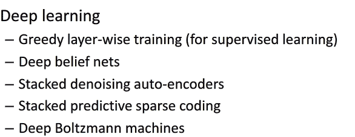

# 美团 2017 秋招笔试真题-算法工程师 B

## 1

以下关于经典的 k-means 聚类的说法哪个是错误的？

正确答案: A   你的答案: 空 (错误)

```cpp
k-means 聚类算法是全局收敛的
```

```cpp
k-means 的聚类结果和初始聚类中心点的选取有关
```

```cpp
k-means 聚类算法的时间复杂度是 O(NKT)，其中 N 为样本个数，K 为聚类团数量，T 为迭代次数
```

```cpp
k-means 聚类算法无法自动确定聚类团数量
```

本题知识点

算法工程师 美团 美团 算法工程师 美团 美团 算法工程师 美团 美团 算法工程师 美团 美团 算法工程师 美团 2017

讨论

[八戒哥](https://www.nowcoder.com/profile/7609523)

如果 K-means 算法是全局收敛的，那么从不同的聚类中心迭代都会得到同一个聚类结果;但是我们都知道不同的聚类中心迭代结果不一样，反证 K-means 不是全局收敛的。

发表于 2017-03-15 17:03:27

* * *

[aiaiairs](https://www.nowcoder.com/profile/36767624)

K 均值算法有一些缺点，例如受初值和离群点的影响每次的结果不稳定、结果通常不是全局最优而是局部最优解、无法很好地解决数据簇分布差别比较大的情况（比如一类是另一类样本数量的 100 倍）、不太适用于离散分类等。不一定能找到全局最优解是 K 均值算法的一个缺点。

发表于 2019-08-09 21:39:59

* * *

[LiuShice](https://www.nowcoder.com/profile/5849637)

这是我在网上找的“全局收敛”的定义：我认为，"全局收敛"和"收敛为全局最优"不是一个意思。“全局收敛”的意思是不管给定怎样的初值，他都会收敛（算法停止）。k-means 确实是会停止。所以 A 是对的！

发表于 2018-09-04 17:46:49

* * *

## 2

以下两种描述分别对应哪两种对分类算法的评价标准？
① 美团推荐的餐厅有多少是用户喜欢的
② 用户喜欢的餐厅有多少被美团推荐了

正确答案: A   你的答案: 空 (错误)

```cpp
Precision,  Recall
```

```cpp
Recall,  Precision
```

```cpp
Precision,  AUC
```

```cpp
Recall,  AUC
```

本题知识点

算法工程师 美团 美团 算法工程师 美团 美团 算法工程师 美团 美团 算法工程师 美团 美团 算法工程师 美团 2017

讨论

[zh_jun](https://www.nowcoder.com/profile/6048577)

precision 是精确性的度量，表示被分为正例的示例中实际为正例的比例， precision=TP/（TP+FP）；

recall 是覆盖面的度量，度量有多个正例被分为正例， recall=TP/(TP+FN)=TP/P=sensitive，可以看到召回率与灵敏度是一样的。

发表于 2017-02-17 21:17:47

* * *

[带枪小女孩](https://www.nowcoder.com/profile/493614252)

**精确性 Precision****：****TP÷(TP+FP)****，分类器预测出的正样本中，真实正样本的比例****召回率 Recall****：****TP÷(TP+FN)****，在所有真实正样本中，分类器中能找到多少** **准确性 Accuracy****：****(TP+TN)÷(TP+NP+TN+FN)****，分类器对整体的判断能力，即正确预测的比例**

发表于 2018-09-06 10:44:23

* * *

[无瑕 2017](https://www.nowcoder.com/profile/1711116)

Precision（查准率）= TP/（TP+FP）Recall（查全率）=TP/（TP+FN）

发表于 2017-02-26 20:48:08

* * *

## 3

假定一个二维数组的定义语句为“int a[3][4]={{3,9},{2,8,5}};”，则元素 a[1][2]的值为

正确答案: A   你的答案: 空 (错误)

```cpp
5
```

```cpp
4
```

```cpp
2
```

```cpp
8
```

本题知识点

算法工程师 美团 美团 算法工程师 美团 美团 算法工程师 美团 美团 算法工程师 美团 美团 算法工程师 美团 2017

讨论

[林半山](https://www.nowcoder.com/profile/1049449)

｛｝中的内容为 1 行，赋值到数组后不足的用 0 代替。数组为 a=[[3,9,0,0],[2,8,5,0],[0,0,0,0]]数组的取值是从第 0 个元素开始，所以取出第 2 行第 3 个元素即是 5

发表于 2017-03-17 18:51:48

* * *

[海康 Bingo](https://www.nowcoder.com/profile/834297056)

java 索引从 0 开始

发表于 2020-03-24 23:13:12

* * *

[RefactorWorld](https://www.nowcoder.com/profile/3485080)

按行赋值，下表从 0 开始

发表于 2017-02-21 16:47:47

* * *

## 4

快速排序的最坏时间复杂度是？

正确答案: D   你的答案: 空 (错误)

```cpp
A O(lgN)
```

```cpp
O(N)
```

```cpp
C O(NlogN)
```

```cpp
D O(N*N)
```

本题知识点

算法工程师 美团 美团 算法工程师 美团 美团 算法工程师 美团 美团 算法工程师 美团 美团 算法工程师 美团 2017

讨论

[RefactorWorld](https://www.nowcoder.com/profile/3485080)

倒序

发表于 2017-02-21 16:48:20

* * *

[桌同宇向](https://www.nowcoder.com/profile/1553442)

最坏情况，仔细审题就好了

发表于 2017-03-14 21:44:01

* * *

## 5

HMM 的无监督训练方法是？

正确答案: A   你的答案: 空 (错误)

```cpp
EM 算法
```

```cpp
viterbi 算法
```

```cpp
前向-后向算法
```

```cpp
梯度下降算法
```

本题知识点

算法工程师 美团 美团 算法工程师 美团 美团 算法工程师 美团 美团 算法工程师 美团 美团 算法工程师 美团 2017

讨论

[喵咪咪～喵咪咪～](https://www.nowcoder.com/profile/9035859)

EM 算法是含有隐变量的概率模型极大似然估计或者极大后验概率估计的迭代算法。EM 算法通过迭代求解观测数据的对数似然函数的极大化实现极大似然估计。每次迭代包括两步：E 步求期望，M 步求极大。EM 算法可以高效地对隐形马尔科夫模型进行训练。是非监督学习算法。

发表于 2017-08-17 10:08:24

* * *

[Metropolis](https://www.nowcoder.com/profile/211672)

http://blog.csdn.net/xueyingxue001/article/details/52396494 HMM 的三个问题 第一个问题被称为：概率计算问题。 解决办法：前向-后向算法(一种动态规划算法)。 第二个问题被称为：学习问题。 解决办法：如果状态序列已知，那用最大似然估计就好了，但 HMM 的状态序列未知，即含有隐变量，所以要使用 Baum-welch 算法(其实其本质就是 EM 算法)。 第三个问题被称为：预测问题/解码问题。 解决办法：Viterbi 算法(一种动态规划算法)。

发表于 2017-08-30 10:20:34

* * *

[无瑕 2017](https://www.nowcoder.com/profile/1711116)

EM 算法的主要目的是提供一个简单的迭代算法计算后验密度函数，它的最大优点是简单和稳定，但容易陷入局部最优。EM 算法包括两个步骤：由 E 步和 M 步组成，它是通过迭代地最大化完整数据的对数似然函数 Lc(X;Θ)的期望来最大化不完整数据的对数似然函数

发表于 2017-02-26 20:58:59

* * *

## 6

下面那个不是序列标注模型？

正确答案: B   你的答案: 空 (错误)

```cpp
HMM
```

```cpp
ME（最大熵）
```

```cpp
MEMM
```

```cpp
CRF
```

本题知识点

算法工程师 美团 美团 算法工程师 美团 美团 算法工程师 美团 美团 算法工程师 美团 美团 算法工程师 美团 2017

讨论

[无瑕 2017](https://www.nowcoder.com/profile/1711116)

HMM—— 隐马尔科夫模型， HMM   是一种产生式模型，它采用一个联合概率将观测序列和状态序列结合在一起，通过训练参数来最大化拟合训练语料的联合概率；MEMM—— 最大熵隐马尔科夫模型 CRF—— 条件随机场模型 ME——最大熵

发表于 2017-02-26 21:03:23

* * *

## 7

下列说正确的是？

正确答案: C   你的答案: 空 (错误)

```cpp
回归函数 A 和 B，如果 A 比 B 更简单，则 A 几乎一定会比 B 在测试集上表现更好
```

```cpp
梯度下降有时会陷于局部极小值，但 EM 算法不会
```

```cpp
在 AdaBoost 算法中，所有被错分的样本的权重更新比例相同
```

```cpp
当训练数据较少时更难发生过拟合
```

本题知识点

算法工程师 美团 美团 算法工程师 美团 美团 算法工程师 美团 美团 算法工程师 美团 美团 算法工程师 美团 2017

讨论

[王贺牛客](https://www.nowcoder.com/profile/4220519)

A 项：若 A 与 B 均是高偏差模型（high bias），即欠拟合，但是 B 的欠拟合程度比 A 小，那么模型 B 会比 A 复杂，就会比 A 更好地拟合训练数据。B 项：EM 算法是通过不断求解下界的极大化逼近求解对数似然函数极大化的算法（统计学习方法，p160），但 EM 算法不能保证找到全局最优解。C 项正确。D 项：对过拟合的一种解释：学习的模型复杂度，比实际数据的复杂度要高，欠拟合或者过拟合指模型本身和真实数据实际复杂度的关系，与训练数据的多少无关。

发表于 2017-02-25 19:32:23

* * *

[跪求靠谱 offer](https://www.nowcoder.com/profile/2536333)

adaboost 分错的 sample 分的权重一样

发表于 2018-03-21 09:00:43

* * *

## 8

逻辑回归的损失函数是？

正确答案: A   你的答案: 空 (错误)

```cpp
log 对数损失函数
```

```cpp
平方损失函数
```

```cpp
指数损失函数
```

```cpp
Hinge 损失函数
```

```cpp
0-1 损失函数
```

本题知识点

算法工程师 美团 美团 算法工程师 美团 美团 算法工程师 美团 美团 算法工程师 美团 美团 算法工程师 美团 2017

讨论

[向代码进击的小怪兽](https://www.nowcoder.com/profile/463075916)

在逻辑回归模型参数估计上，用极大似然估计法取估计参数模型，问题就变成了了以对数似然函数为目标函数的最优化问题，它的学习方法通常是梯度下降法和牛顿法。

发表于 2020-08-15 10:56:54

* * *

[Mowar](https://www.nowcoder.com/profile/9730423)

罗辑回归其实是可以用平方损失函数的，只是优化效果差些

发表于 2018-09-28 10:19:30

* * *

[带枪小女孩](https://www.nowcoder.com/profile/493614252)

L(y',y)=-ylog(y')-(1-y)log(1-y')if y=1, P(y|x)=y'if y=0,P(y|x)=1-y’合并：P(y|x)=y'^y*(1-y')^(1-y)两边取 log

编辑于 2018-09-06 10:43:05

* * *

## 9

1\. 如下表是用户是否使用某产品的调查结果。
UID 性别 地区 学历 收入 用户是否使用调查产品
1 男 北方 博士 低 是
2 女 北方 本科 中 否
3 男 南方 本科 高 否
4 女 北方 研究生 中 是
请计算性别、地区、学历、收入中对用户是否使用调查产品信息增益最大的属性。(Log23≈0.63)

正确答案: C   你的答案: 空 (错误)

```cpp
性别
```

```cpp
B.地区
```

```cpp
学历
```

```cpp
收入
```

本题知识点

算法工程师 美团 美团 算法工程师 美团 美团 算法工程师 美团 美团 算法工程师 美团 美团 算法工程师 美团 2017

讨论

[王贺牛客](https://www.nowcoder.com/profile/4220519)

信息增益，即互信息，g（A,D）=H（D）-H（D|A）。表示特征 A 所能透露的关于集合 D 的信息量（熵）的多少。这个题没必要真正去算，观察数据，我们可以发现在已知学历的情况下，对分类结果的判断是最明确的。所以我们能判定学历对用户是否使用产品的信息增益最大。

发表于 2017-02-25 19:36:32

* * *

[牛客 9897028 号](https://www.nowcoder.com/profile/9897028)

Log2(3)的值不对，这个 log3(2)的值。

发表于 2017-09-06 16:59:10

* * *

[浩劫风浪](https://www.nowcoder.com/profile/6360212)

越是确定的信息，信息熵越小，信息增益越大。

发表于 2018-08-23 15:03:38

* * *

## 10

美团点评是大家吃喝玩乐的生活好帮手: 比如大家搜索”7 天连锁酒店”，会返回一系列相关的结果。如果要识别这句话的商家核心词-“7 天”，以下哪种方法识别商家核心词准确率最低，不能直接使用？

正确答案: C   你的答案: 空 (错误)

```cpp
通过分析用户搜索日志，人工制定模板或规则来识别
```

```cpp
标注一些数据，抽取特征，用 CRF 训练出模型来识别
```

```cpp
使用 word2vec 训练词向量，对词聚类，根据词属于的类别来识别
```

```cpp
人工整理商家核心词词表，按是否命中词表里的词来识别
```

本题知识点

算法工程师 美团 美团 算法工程师 美团 美团 算法工程师 美团 美团 算法工程师 美团 美团 算法工程师 美团 2017

讨论

[王贺牛客](https://www.nowcoder.com/profile/4220519)

首先，如果有人工干预，即通过一定的人力来进行人工识别和标注，肯定会大大提升识别准确率。然后再说一下词向量，通过 word2vec 训练出来的词向量是文本中出现的每一个词的向量表示，然后对词进行聚类，首先聚类是个非监督学习方法啊，没有人工标注你怎么能知道哪个类别和商家核心词汇有关？再者，对词向量聚类之后，得到的是一堆堆的近义词类别，比如七天、九天、六天、天天、周天可能会被聚成一类，但很明显这一大堆词根本都没有足够的特征来区分是不是属于商家核心词。

编辑于 2017-03-20 09:32:58

* * *

[无瑕 2017](https://www.nowcoder.com/profile/1711116)

聚类结果与初始聚类中心的选取、迭代次数有关，结果可能不准确

发表于 2017-02-26 21:08:31

* * *

## 11

以下哪些主要用于无监督的深度学习网络

正确答案: A B C   你的答案: 空 (错误)

```cpp
Restricted Boltzmann Machines
```

```cpp
AutoEncoder
```

```cpp
Deep Belief Networks
```

```cpp
Recurrent Neural Network
```

本题知识点

算法工程师 美团 美团 算法工程师 美团 美团 算法工程师 美团 美团 算法工程师 美团 美团 算法工程师 美团 2017

讨论

[啊啊啊 62](https://www.nowcoder.com/profile/7551327)

各位大神，我有一个问题：DBN 第一步是无监督训练每一层，但是第二步是不在最后一层设置 BP 网络，调整整个 DBN，不是可以看成这一步是有监督的训练么？那么为啥它也算？

发表于 2017-08-31 09:33:42

* * *

[wanlanwalan](https://www.nowcoder.com/profile/7952866)



发表于 2017-06-07 09:35:16

* * *

[呵呵 188](https://www.nowcoder.com/profile/4533352)

人工神经网络（ [artificial neural network](http://en.wikipedia.org/wiki/Artificial_neural_network) ）递归人工神经网络（ recurrent neural network ） 

[限制玻尔兹曼机（Restricted Boltzmann Machine）](http://blog.csdn.net/roger__wong/article/details/43374343)

AutoEncoder ——自编码网络

```cpp
Deep Belief Networks 深度信念网络

```

[Convolutional Neural Networks 卷积神经网络](http://blog.csdn.net/zouxy09/article/details/8781543)

循环神经网络(RNN, Recurrent Neural Networks)

发表于 2017-04-06 20:42:24

* * *

## 12

同事去美团上班，自己开车，滴滴拼车，滴滴快车，骑滑板车的概率分别是 0.3,0.2,0.1,0.4，各种方式迟到的概率分别 1/4,1/3,1/12,0，下列语句中正
确的是

正确答案: C D   你的答案: 空 (错误)

```cpp
如果他准点，那么骑滑板车的概率大于等于 0.5
```

```cpp
单人出行(自己开车或者滴滴快车)准点机会比滴滴拼车要低
```

```cpp
如果他迟到，自己开车的概率是 0.5
```

```cpp
如果他准点，使用滴滴的概率等于自己开车的概率
```

本题知识点

算法工程师 美团 美团 算法工程师 美团 美团 算法工程师 美团 美团 算法工程师 美团 美团 算法工程师 美团 2017

讨论

[笛声笛声](https://www.nowcoder.com/profile/6049491)

P(开车) = 0.3 P(拼车) = 0.2          P(快车) = 0.1 P(滑板) = 0.4P(迟到|开车)=1/4 P(迟到|拼车)=1/3P(迟到|快车)=1/12P(迟到|滑板)=0P(准时|开车)=3/4 P(准时|拼车)=2/3P(准时|快车)=11/12P(准时|滑板)=1P(迟到)=0.3*1/4 + 0.2*1/3 + 0.1*1/12 + 0.4*0 = 9/60P(准时)=1-P(迟到) = 51/60 则：A 选项：P(滑板|准点) = P(滑板)*P(准时|滑板)/P(准点)=0.4*1/(51/60) =24/51<0.5    B 选项：P(开车|准时) = P(开车)*P(准时|开车)/P(准时)=0.3*(3/4)/(51/60)=27/102  P(快车|准时) = P(快车)*P(准时|快车)/P(准时)=0.1*(11/12)/(51/60)=11/102      P(拼车|准时) = P(拼车)*P(准时|拼车)/P(准时)=0.2*(2/3)/(51/60)=16/102  可知，B 选项错误    C 选项：P(开车|迟到) = P(开车)*P(迟到|开车)/P(迟到)=0.3*(1/4)/(9/60) = 0.5    D 选项：P(快车|准时) = P(快车)*P(准时|快车)/P(准时)=0.1*(11/12)/(51/60)=11/102  P(拼车|准时) = P(拼车)*P(准时|拼车)/P(准时)=0.2*(2/3)/(51/60)=16/102           P(开车|准时) = P(开车)*P(准时|开车)/P(准时)=0.3*(3/4)/(51/60)=27/102  可知 P(快车|准时)+P(拼车|准时)=P(开车|准时)

发表于 2017-03-22 16:36:20

* * *

[superCally](https://www.nowcoder.com/profile/3054564)

这道题要用贝叶斯来算根据题意，开车的概率 P(C)=0.3，开车的情况下迟到的概率 P(L|C)=0.25，迟到的概率 P(L)=0.3*1/4+0.2*1/3+0.1*1/12+0.4*0=18/120。所以根据贝叶斯公式，迟到的情况下开车的概率就是 P(C|L)=P(C)*P(L|C)/P(L)=0.5 所以 C 选项正确，D 选项同理

发表于 2017-02-14 10:58:55

* * *

[Junru](https://www.nowcoder.com/profile/781616030)

Ai: {自己开车，滴滴拼车，滴滴快车，骑滑板车}，B: {迟到}P(Ai) = {0.3，0.2，0.1，0.4}，P(B|Ai) = {0.25，1/3，1/12，0}，所以 P(B) = 0.3*0.25 + 0.2 * 1/3 + 0.1 * 1/12 + 0.4 * 0 = 0.85, P(~B) = 0.15(a): 求 P(A4|~B) = (1 - P(B|A4)) * P(A4) / P(~B) = 8 / 17 < 0.5(b): 比较 P(～B|A1) * (P(A1) / (P(A1) + P(A3))) + P(~B|A3) * (P(A3) / (P(A1) + P(A3)))和 P(~B|A2)      前者 =  9/16 + 11/48 = 19/24 ~= 0.79      后者 = 1 - 1/3 = 2/3 ~= 0.67(c): 求 P(A1|B) = P(B|A1) * P(A1) / P(B) = 0.5(d): 比较 P(A2|~B) + P(A3|~B)和 P(A1|～B)      前者 =  8/51 + 11/102 = 9/34      后者 = 9/34 所以选 C、D

发表于 2019-04-23 09:04:20

* * *

## 13

设有一个栈，元素一次进栈的顺序是 A,B,C,D,E。下列可能的出栈顺序有？

正确答案: A C D   你的答案: 空 (错误)

```cpp
ABCED
```

```cpp
EABCD
```

```cpp
BCDAE
```

```cpp
EDCBA
```

本题知识点

算法工程师 美团 美团 算法工程师 美团 美团 算法工程师 美团 美团 算法工程师 美团 美团 算法工程师 美团 2017

讨论

[无瑕 2017](https://www.nowcoder.com/profile/1711116)

栈遵循先进后出。A.A 进 A 出，B 进 B 出，...B.E 先出来，说明 ABCD 已进，出栈顺序应为 EDCBA，选项 DC.A 进，B 进 B 出，C 进 C 出，D 进 D 出，A 出，E 进 E 出

发表于 2017-02-26 21:24:13

* * *

[海康 Bingo](https://www.nowcoder.com/profile/834297056)

1.栈先进后出； 2.依次进不是一次全进……

发表于 2020-03-24 23:23:43

* * *

[hiworrd](https://www.nowcoder.com/profile/4219993)

栈是先进后出

发表于 2018-04-12 16:35:57

* * *

## 14

机器学习中能够用于指导特征选择的指标

正确答案: A B C D   你的答案: 空 (错误)

```cpp
信息增益
```

```cpp
信息增益率
```

```cpp
基尼系数
```

```cpp
信息熵
```

本题知识点

算法工程师 美团 美团 算法工程师 美团 美团 算法工程师 美团 美团 算法工程师 美团 美团 算法工程师 美团 2017

讨论

[只有门门](https://www.nowcoder.com/profile/7149990)

信息熵的差就是信息增益，直接比较信息熵的大小，选取对应信息熵最小的特征，就相当于找到信息增益最大的项了，所以也算吧。。

发表于 2017-03-20 15:16:43

* * *

[molloc01](https://www.nowcoder.com/profile/5338887)

决策树中的 CART 就是基于基尼系数进行特征选择的，所有肯定有基尼系数，其他三个选项大家都知道了。总结：这些特征选择的方法在决策树中都可以找到。

发表于 2018-03-22 18:32:25

* * *

## 15

使用协同过滤做电影推荐，使系统可以对新用户输出结果的操作是：

正确答案: C D   你的答案: 空 (错误)

```cpp
使用内容特征计算电影之间的相似度
```

```cpp
增加更长时间的训练数据
```

```cpp
使用电影点击之外的数据计算用户相似度，例如用户背景信息
```

```cpp
使用热门电影推荐结果补充个性化推荐结果
```

本题知识点

算法工程师 美团 美团 算法工程师 美团 美团 算法工程师 美团 美团 算法工程师 美团 美团 算法工程师 美团 2017

讨论

[王贺牛客](https://www.nowcoder.com/profile/4220519)

电影间相似度以用户对不同电影的评分为基础进行计算，新用户没有看过任何电影，所以即使知道电影间的相似性信息也无法基于此对用户进行推荐；没懂 B 项想表达什么，增加训练的时间么？。对新用户进行推荐，要么想办法获得用户更多的信息，以获得用户喜好，要么进行基于大家都喜欢的物品进行推荐。

编辑于 2017-03-20 10:33:17

* * *

[加油呀前半生](https://www.nowcoder.com/profile/2144525)

c 是基于用户的协同过滤 d 是基于商品的协同过滤

发表于 2017-07-25 17:19:02

* * *

[WorldElite](https://www.nowcoder.com/profile/3104752)

推荐系统冷启动问题

发表于 2017-09-18 10:18:44

* * *