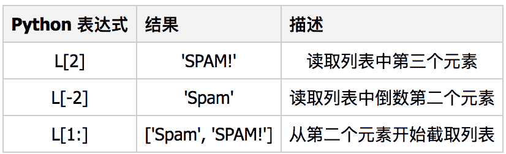
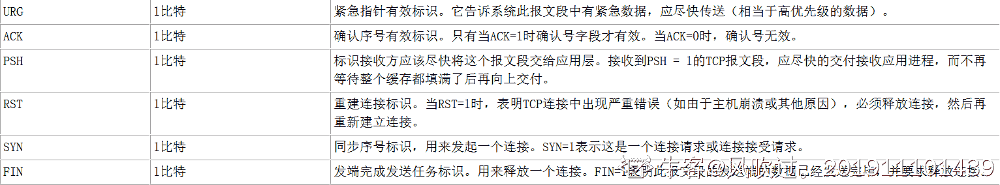

# 美团 2017 秋招笔试真题-运维工程师 B

## 1

数据库：以下哪项不是 HASH 索引的特征？

正确答案: C   你的答案: 空 (错误)

```cpp
MySQL 不能确定在两个值之间大约有多少行
```

```cpp
不能使用 hash 索引来加速 ORDER BY 操作
```

```cpp
只用于使用“>”或“<”操作符的比较
```

```cpp
只能使用整个关键字来搜索一行
```

本题知识点

运维工程师 美团 美团 运维工程师 美团 美团 运维工程师 美团 美团 运维工程师 美团 美团 运维工程师 美团 2017

讨论

[砰砰](https://www.nowcoder.com/profile/8272237)

还可以用>= <=呀小傻瓜

发表于 2017-03-19 16:54:44

* * *

[牛客 43462370 号](https://www.nowcoder.com/profile/43462370)

哈希索引只包含哈希值和行指针，而不存储字段值，所以不能使用索引中的值来避免读取行。
哈希索引数据并不是按照索引值顺序存储的，所以也就无法用于排序。
哈希索引也不支持部分索引列匹配查找，因为哈希索引始终是使用索引列的全部内容来计算哈希值的。
哈希索引只支持等值比较查询，包括=、IN()、<>（注意<>和<=>是不同的操作）。也不支持任何范围查询，例如 WHERE price>100。
访问哈希索引的数据非常快，除非有很多哈希冲突（不同的索引列值却有相同的哈希值）。当出现哈希冲突的时候，存储引擎必须遍历链表中所有的行指针，逐行进行比较，直到找到所有符合条件的行。

发表于 2021-03-26 18:13:45

* * *

[牛客 486722 号](https://www.nowcoder.com/profile/486722)

MySQL 中只有 memory 存储引擎支持 hash 索引，hash 索引只支持= in() <=> 等值比较查询，不能应用与范围查询 比如 where price > 12,hash 索引中的内容只包含哈希码和行指针。

发表于 2017-03-21 15:54:18

* * *

## 2

用户 JANKO 想在有三个列: empid, lastname, 和 salary. 的 employee 表中插入一行，该用户想输入数据 empid 59694, lastname Harris, 但没有 salary. 哪一个语句最适合这项工作？

正确答案: A   你的答案: 空 (错误)

```cpp
INSERT INTO employee VALUES(59694,'harris', null)
```

```cpp
INSERT INTO employee VALUES(59694,'harris')
```

```cpp
INSERT INTO employee (empid, lastname, salary) VALUES(59694,'harris')
```

```cpp
INSERT INTO employee (SELECT 59694 FROM 'harris')
```

本题知识点

运维工程师 美团 美团 运维工程师 美团 美团 运维工程师 美团 美团 运维工程师 美团 美团 运维工程师 美团 2017

讨论

[我是个传说](https://www.nowcoder.com/profile/370777)

```cpp
INSERT INTO employee (empid, lastname, salary) VALUES(59694,'harris')；会报错，前后不匹配；题目说了，employee 只有 3 列，value(1,2,3)故可以省略，前面一组。。。。B 选项仍然不匹配。。。D 错的有点过分了。。。。
```

发表于 2017-03-20 18:21:11

* * *

## 3

数据库：以下哪项是在视图上不能进行的操作？

正确答案: C   你的答案: 空 (错误)

```cpp
更新视图
```

```cpp
查询视图
```

```cpp
在视图上定义新的表
```

```cpp
在视图上定义新的视图
```

本题知识点

运维工程师 美团 美团 运维工程师 美团 美团 运维工程师 美团 美团 运维工程师 美团 美团 运维工程师 美团 2017

讨论

[残江秋月](https://www.nowcoder.com/profile/1113295)

视图就是一种虚表，当然不能在视图上定义新表

发表于 2017-03-21 00:42:36

* * *

## 4

以下哪项不是 DNS 记录类型？

正确答案: C   你的答案: 空 (错误)

```cpp
AAAA
```

```cpp
TXT
```

```cpp
TTL
```

```cpp
PTR
```

本题知识点

运维工程师 美团 美团 运维工程师 美团 美团 运维工程师 美团 美团 运维工程师 美团 美团 运维工程师 美团 2017

讨论

[C24-lee](https://www.nowcoder.com/profile/8119632)

7 类，A 记录，AAAA 记录，CNAME 记录，NS 记录，MX 记录，PTR 记录，TXT 记录 

发表于 2017-03-19 13:28:46

* * *

[公众号:重温新知](https://www.nowcoder.com/profile/126819)

http://blog.csdn.net/u013920085/article/details/42552987 这篇博文介绍的比较详细

发表于 2017-04-06 20:31:57

* * *

[风吹过。201911101439591](https://www.nowcoder.com/profile/174378319)

TTL 是路由器跳数。

发表于 2020-08-08 13:00:41

* * *

## 5

在 linux 环境下，查看日志文件的最后 100 行数据的正确方式是？

正确答案: D   你的答案: 空 (错误)

```cpp
mv -100 a.log
```

```cpp
grep -100 a.log
```

```cpp
cat -100 a.log
```

```cpp
tail -100 a.log
```

本题知识点

运维工程师 美团 美团 运维工程师 美团 美团 运维工程师 美团 美团 运维工程师 美团 美团 运维工程师 美团 2017

讨论

[小海胆胆](https://www.nowcoder.com/profile/343)

tail 命令可以达到这个效果

发表于 2017-02-06 11:36:21

* * *

[风吹过。201911101439591](https://www.nowcoder.com/profile/174378319)

head -n 文件名字 看前多少行 tail -n 文件名字 看后面多少行

发表于 2020-08-08 13:01:31

* * *

## 6

假设用 4 个同样大小的硬盘来做 RAID，以下哪种 raid 模式获得的可用磁盘空间最少？

正确答案: C   你的答案: 空 (错误)

```cpp
no-raid
```

```cpp
raid5
```

```cpp
raid1
```

```cpp
raid6
```

本题知识点

运维工程师 美团 美团 运维工程师 美团 美团 运维工程师 美团 美团 运维工程师 美团 美团 运维工程师 美团 2017

讨论

[风吹过。201911101439591](https://www.nowcoder.com/profile/174378319)

raid 0 是 无备份，双读取。超级快，网吧就用这种   可用就是 4 快 raid 1 是 完整备份    错误可直接切换，速度只有前一种的 50%    可用是 2 块（完整备份）raid 5 没有备份  有一块用来综合的块，如果其他有了问题，可以通过这个综合块进行反算。，那么可用是 3 块，一块是综合块。

发表于 2020-08-08 13:06:54

* * *

[warpar](https://www.nowcoder.com/profile/1756076)

答案不对吧，应该是 raid5！！！

发表于 2017-08-30 21:52:42

* * *

[杀我我有闪](https://www.nowcoder.com/profile/8661968)

看了下一楼的博客，感觉答案错了啊，应该是 RAID1

发表于 2017-03-20 08:12:47

* * *

## 7

关于 linux 文件系统软连接和硬连接的区别，如下哪条是错误的？

正确答案: A   你的答案: 空 (错误)

```cpp
硬连接指通过文件复制来进行连接, 类似文件别名。
```

```cpp
硬连接的作用是允许一个文件拥有多个有效路径名，删除源文件不影响硬连接
```

```cpp
软连接又被称为符号连接，类似于快捷方程式
```

```cpp
软连接包含另一文件的位置信息，删除源文件软件连也无法访问了
```

本题知识点

运维工程师 美团 美团 运维工程师 美团 美团 运维工程师 美团 美团 运维工程师 美团 美团 运维工程师 美团 2017

讨论

[Chuck_Hu](https://www.nowcoder.com/profile/4866321)

硬链接相当于允许文件用友多个有效的路径名，只有当删除最后一个硬链接时源文件才删除软连接相当于快捷方式，也成为符号链接，包含源文件位置信息，源文件删除的同时，所有软链接随之删除

发表于 2017-03-11 16:23:10

* * *

## 8

下面关于网络七层和四层的描述，哪条是错误的？

正确答案: A   你的答案: 空 (错误)

```cpp
SNMP 工作在四层
```

```cpp
四层是指网络的传输层，主要包括 IP 和端口信息
```

```cpp
七层是指网络的应用层(协议层)，比如 http 协议就工作在七层
```

```cpp
四层主要应用于 TCP 和 UDP 的代理，七层主要应用于 HTTP 等协议的代理
```

本题知识点

运维工程师 美团 美团 运维工程师 美团 美团 运维工程师 美团 美团 运维工程师 美团 美团 运维工程师 美团 2017

讨论

[呵呵 188](https://www.nowcoder.com/profile/4533352)

TCP/IP:数据链路层：ARP,RARP 网络层： IP,ICMP,IGMP 传输层：TCP ,UDP,UGP 应用层：Telnet,FTP,SMTP,SNMP.OSI:物理层：EIA/TIA-232, EIA/TIA-499, V.35, V.24, RJ45, Ethernet, 802.3, 802.5, FDDI, NRZI, NRZ, B8ZS 数据链路层：Frame Relay, HDLC, PPP, IEEE 802.3/802.2, FDDI, ATM,  IEEE 802.5/802.2 网络层：IP，IPX，AppleTalk DDP 传输层：TCP，UDP，SPX 会话层：RPC,SQL,NFS,NetBIOS,names,AppleTalk,ASP,DECnet,SCP 表示层:TIFF,GIF,JPEG,PICT,ASCII,EBCDIC,encryption,MPEG,MIDI,HTML 应用层：FTP,WWW,Telnet,NFS,SMTP,Gateway,SNMPB 和 D 怎么能同时对？？？

发表于 2017-04-06 21:05:56

* * *

[kingdom 王者](https://www.nowcoder.com/profile/7292130)

SNMP 是网络层

发表于 2017-03-03 19:12:10

* * *

[风吹过。201911101439591](https://www.nowcoder.com/profile/174378319)

题意感觉有点偏差，好像是在说 osi 的第七层应用层和第四层传输层，又好像再说 osi 和 tcp/ip 两种模型。

发表于 2020-08-08 13:09:27

* * *

## 9

以下代码输出什么？
list = ['a', 'b', 'c', 'd', 'e']
print list[10:]

正确答案: A   你的答案: 空 (错误)

```cpp
[ ]
```

```cpp
程序异常
```

```cpp
['a', 'b', 'c', 'd', 'e']
```

```cpp
输出空
```

本题知识点

运维工程师 美团 美团 运维工程师 美团 美团 运维工程师 美团 美团 运维工程师 美团 美团 运维工程师 美团 2017

讨论

[西瓜糖](https://www.nowcoder.com/profile/7341207)



编辑于 2017-08-16 15:48:00

* * *

## 10

Python 语言什么那些类型的数据才能作为字典的 key？

正确答案: D   你的答案: 空 (错误)

```cpp
没有限制
```

```cpp
字母，数字，下划线
```

```cpp
字母
```

```cpp
可被 hash 的的类型
```

本题知识点

运维工程师 美团 美团 运维工程师 美团 美团 运维工程师 美团 美团 运维工程师 美团 美团 运维工程师 美团 2017

讨论

[VincentMa](https://www.nowcoder.com/profile/2656199)

Python 的键可以是 Python 中任意的不可变类型：布尔型，整型，浮点型，元组和字符串。

发表于 2018-03-09 14:24:55

* * *

[_ddddtt](https://www.nowcoder.com/profile/566969)

排除法。。

发表于 2017-03-21 18:22:58

* * *

## 11

以下哪些是常见的 TCP Flags？

正确答案: A B C D   你的答案: 空 (错误)

```cpp
SYN
```

```cpp
RST
```

```cpp
ACK
```

```cpp
URG
```

本题知识点

运维工程师 美团 美团 运维工程师 美团 美团 运维工程师 美团 美团 运维工程师 美团 美团 运维工程师 美团 2017

讨论

[西瓜糖](https://www.nowcoder.com/profile/7341207)

TCP FLAG 标记

基于标记的 TCP 包匹配经常被用于过滤试图打开新连接的 TCP 数据包。

*   TCP 标记和他们的意义如下所列：

    * F : FIN - 结束; 结束会话
    * S : SYN - 同步; 表示开始会话请求
    * R : RST - 复位;中断一个连接
    * P : PUSH - 推送; 数据包立即发送
    * A : ACK - 应答
    * U : URG - 紧急
    * E : ECE - 显式拥塞提醒回应
    * W : CWR - 拥塞窗口减少

发表于 2017-08-16 15:57:04

* * *

[G_lilyG](https://www.nowcoder.com/profile/8737871)

TCP 的 urg 紧急指针。

发表于 2017-03-22 08:29:26

* * *

[风吹过。201911101439591](https://www.nowcoder.com/profile/174378319)

其他不是标志位。。

发表于 2020-08-08 13:12:20

* * *

## 12

Linux 操作系统具备以下哪些特性？

正确答案: A B C   你的答案: 空 (错误)

```cpp
Multi User
```

```cpp
Multi Tasking
```

```cpp
Multi Process
```

```cpp
None of the above
```

本题知识点

运维工程师 美团 美团 运维工程师 美团 美团 运维工程师 美团 美团 运维工程师 美团 美团 运维工程师 美团 2017

讨论

[Caffeine](https://www.nowcoder.com/profile/7457474)

多使用者多任务多进程 linux  用过都知道

发表于 2017-03-02 16:12:18

* * *

## 13

编写 shell 脚本，能够生成 32 位随机密码

你的答案

本题知识点

运维工程师 美团 美团 运维工程师 美团 美团 运维工程师 美团 美团 运维工程师 美团 美团 运维工程师 美团 2017

讨论

[brtant](https://www.nowcoder.com/profile/916461397)

vi mkpasswd.sh

#!/bin/bash

i=1

echo "########kim by 51cto.com##########" >/tmp/passwd.txt

while [ $i -le 30 ];do

/usr/bin/mkpasswd -l 14 -s 2 -c 3 -C 3 -d 4 >>/tmp/passwd.txt

let i+=1

done

exit;

发表于 2022-01-21 16:48:50

* * *

[牛客 472082819 号](https://www.nowcoder.com/profile/472082819)

cat /dev/urandom | head -1 | md5sum | head -c 30

发表于 2021-02-22 16:29:38

* * *

[芒可](https://www.nowcoder.com/profile/1695562)

```cpp
tr -dc \~\!@#\$\%\^\&\*\(\)\-\_\+\=\|\\\?\/\.\>\,\<a-za-z0-9_ <="" dev="" urandom|head="" -c="" 32|xargs
```

发表于 2018-09-06 17:12:43

* * *

## 14

假设你是一个 小型网站的管理员。周末的时候，你在自己家里发现网站打不开了，请问你能做哪些操作或方法，来确定是什么问题？

你的答案

本题知识点

运维工程师 美团 美团 运维工程师 美团 美团 运维工程师 美团 美团 运维工程师 美团 美团 运维工程师 美团 2017

讨论

[浮生若梦(ಥ﹏ಥ)为欢几何](https://www.nowcoder.com/profile/9914670)

1.ping www.baidu.com 看能否 ping 通，如果不通说明家中网络有问题，如果通，下一步 2.ping 网站 IP 通不通，通则说明电脑 DNS 解析有问题，不通则说明 web 服务器宕机了（不禁 ping 的情况下） 3.解决 DNS 问题重新访问网址看看是否正常，若着急的情况可直接用 IP 形式访问，看是否正常，若还是不正常 4.telnet IP port 看看端口是否开放，若未开放端口，请远程登录服务器或者***登录服务器等方式上去看 netstat 端口或查看服务是否启动，如果端口和服务启动的情况请检查防火墙，公有云情况还需检查安全组规则配置，如果未启动请启动服务。 5.若 telnet 端口开放，但访问异常，检查 web container 的 log，根据日志进行对应处理。

发表于 2018-11-28 23:19:57

* * *

[zane003](https://www.nowcoder.com/profile/8106767)

1.ping www.baidu.com 确认家中网络到外网是否正常 2.ping 网站 IP 地址 看网络是否通？3.ping DNS 地址 看 DNS 是否解析正常 4.以上均正常则判定不是网络问题，应该是 web 服务器的问题

发表于 2017-03-18 15:02:35

* * *

[brtant](https://www.nowcoder.com/profile/916461397)

服务器状态 端口 网络连接 

发表于 2022-01-21 16:50:30

* * *