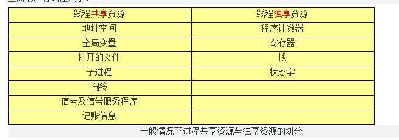
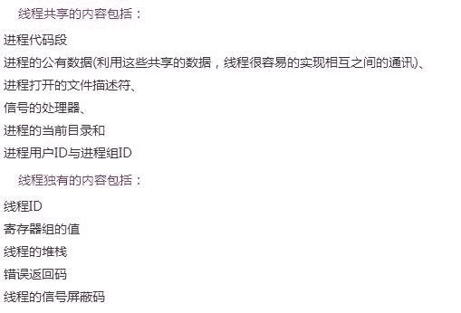
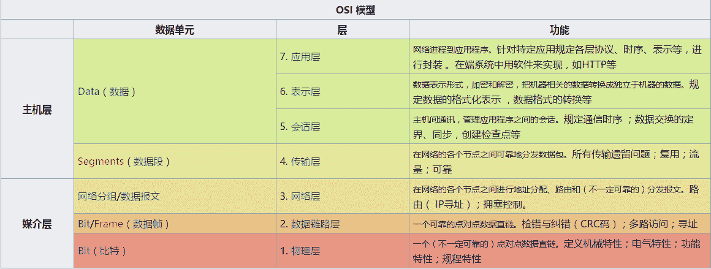
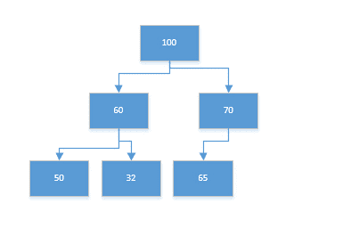
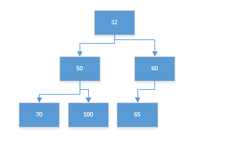

# 好未来 2017 秋招笔试真题一

## 1

一个 C 语言程序在一台 32 位机器上运行。程序中定义了三个变量 xyz，其中 x 和 z 是 int 型，y 为 short 型。当 x=127，y=-9 时，执行赋值语句 z=x+y 后，xyz 的值分别是

正确答案: D   你的答案: 空 (错误)

```cpp
X=0000007FH，y=FFF9H，z=00000076H
```

```cpp
X=0000007FH，y=FFF9H，z=FFFF0076H
```

```cpp
X=0000007FH，y=FFF7H，z=FFFF0076H
```

```cpp
X=0000007FH，y=FFF7H，z=00000076H
```

本题知识点

C++工程师 Java 工程师 好未来 2017

讨论

[牛客 671653 号](https://www.nowcoder.com/profile/671653)

我添加一个答案吧，希望能帮助后面的人。通过我理解这题得 给点个赞，谢谢。X = 127  （int 占 4 字节 32 位） 换算 16 进制 就是 0000007FHZ = 127 - 9 = 118 同上 , 16 进制 是 00000076HY = -9 二进制用补码表示源码：1000 0000 0000 1001 反码：1111 1111 1111 0110 补码：反码+11111 1111 1111 0111F F F 7

编辑于 2017-03-13 18:19:37

* * *

[effDK](https://www.nowcoder.com/profile/764808)

int x = 127;4 字节 0000 0000 0000 0000 0000 0000 0111 1111short y = -9;2 字节原码：1000 0000 0000 1001 补码：1111 1111 1111 0111（从右到左，除第一位和符号位依次取反即可 ）int z = 118;4 字节 0000 0000 0000 0000 0000 0000 0011 0111 还有一点值得注意的是：x+y 时，int 可以表示所有的 short 值，所以 y 类型提升为 int 0xFFFFFFF7（负数左补 1，正数补 0）相加 0000007F+ FFFFFFF700000076

编辑于 2017-03-09 23:52:58

* * *

[just_there_](https://www.nowcoder.com/profile/9127482)

正数用原码表示负数用反码加 1 表示

发表于 2017-02-15 12:54:40

* * *

## 2

关于进程状态的说法，下列错误的是

正确答案: C   你的答案: 空 (错误)

```cpp
处于就绪状态的进程，当进程调度程序为之分配了处理机后，该进程便由就绪状态变为执行状态
```

```cpp
当前进程因发生某事件而无法执行，如访问已被占用的临界资源，就会使进程由执行状态转变为阻塞状态
```

```cpp
当前进程因时间片用完而被暂停执行，该进程便由执行状态转变为阻塞状态
```

```cpp
处于挂起状态的进程不能接收处理机调度
```

本题知识点

C++工程师 Java 工程师 好未来 2017

讨论

[小矮子带着流浪狗去流浪](https://www.nowcoder.com/profile/9200918)

C 选项：当前进程因时间片用完而被暂停执行，进程由执行状态转变为**就绪** 状态。

编辑于 2017-02-12 09:20:13

* * *

[紫旋](https://www.nowcoder.com/profile/795206)

*   A，对。处于就绪状态的进程，当进程调度程序为之分配了处理机后，该进程便由就绪状态变为执行状态
*   B，对。当前进程因发生某事件而无法执行，如访问已被占用的临界资源，就会使进程由执行状态转变为阻塞状态
*   C，错。当前进程因时间片用完而被暂停执行，该进程便由执行状态转变为就绪状态 
*   D，对。处于挂起状态的进程不能接收处理机调度

编辑于 2017-03-20 11:46:06

* * *

## 3

同一进程下的线程不可以共享的是

正确答案: A   你的答案: 空 (错误)

```cpp
stack
```

```cpp
data section
```

```cpp
code section
```

```cpp
file fd
```

本题知识点

C++工程师 Java 工程师 好未来 2017

讨论

[牛客 671653 号](https://www.nowcoder.com/profile/671653)



发表于 2017-02-15 11:27:41

* * *

[牛客 280646 号](https://www.nowcoder.com/profile/280646)

线程会有私有栈保存自己执行的数据

发表于 2017-08-02 00:09:55

* * *

[达文西的猫](https://www.nowcoder.com/profile/9308707)



发表于 2017-07-30 21:46:30

* * *

## 4

在 OSI 7 层模型中,网络层的功能有

正确答案: B   你的答案: 空 (错误)

```cpp
确保数据的传送正确无误
```

```cpp
确定数据包如何转发与路由
```

```cpp
在信道上传送比特流
```

```cpp
纠错与流控
```

本题知识点

C++工程师 Java 工程师 好未来 2017

讨论

[effDK](https://www.nowcoder.com/profile/764808)

A 数据链路层 B 网络层 C 物理层 D 数据链路层参考自：https://zh.wikipedia.org/wiki/OSI%E6%A8%A1%E5%9E%8B

发表于 2017-03-10 00:02:26

* * *

[期待最好的自己](https://www.nowcoder.com/profile/7696607)

AD 是 数据链路层

发表于 2017-08-10 11:36:45

* * *

## 5

应用程序 PING 发出的是 _______ 报文

正确答案: C   你的答案: 空 (错误)

```cpp
TCP 请求报文
```

```cpp
TCP 应答报文
```

```cpp
ICMP 请求报文
```

```cpp
ICMP 应答报文
```

本题知识点

C++工程师 Java 工程师 好未来 2017

讨论

[小矮子带着流浪狗去流浪](https://www.nowcoder.com/profile/9200918)

ICMP (Internet Control Message Protocol) Internet 控制报文协议， 用于在 IP 主机、路由器 之间传递控制消息。控制消息是指网络 不通、主机 是否可达、路由 是否可用等网络本身的消息。——摘自百度百科

编辑于 2017-02-12 22:38:15

* * *

[wanano](https://www.nowcoder.com/profile/313239)

Ping 属于 ICMP 协议

发表于 2017-09-11 18:43:52

* * *

## 6

使用 traceroute 命令测试网络时可以

正确答案: D   你的答案: 空 (错误)

```cpp
检验链路协议是否运行正常
```

```cpp
检验目标网络是否在路由表中
```

```cpp
检验应用程序是否正常
```

```cpp
显示分组到达目标路径上经过的各路由器
```

本题知识点

C++工程师 Java 工程师 好未来 2017

讨论

[舒意意 123](https://www.nowcoder.com/profile/1973064)

D
traceroute 指令让你追踪网络数据包的路由途径

发表于 2017-03-17 20:41:19

* * *

[浪子膏](https://www.nowcoder.com/profile/6760611)

traceroute 指令让你追踪网络数据包的路由途径

发表于 2017-03-16 14:28:17

* * *

[陈农村](https://www.nowcoder.com/profile/7336052)

百度百科

发表于 2017-03-16 13:20:33

* * *

## 7

主机甲向主机乙连续发送了两个 TCP 报文段，其序号分别为 70 和 100。下列错误的是

正确答案: D   你的答案: 空 (错误)

```cpp
第一个报文段携带了 30 个字节的数据
```

```cpp
主机乙收到第一个报文段后发回的确认中的确认号是 100
```

```cpp
如果主机乙收到第二个报文段后发回的确认中的确认号是 180，那么甲发送的第二个报文段中的数据有 80 字节
```

```cpp
如果甲发送的第一个报文段丢失了，但第二个报文段到达了乙，乙在第二个报文段到达后向甲发送确认，这个确认号为 100
```

本题知识点

C++工程师 Java 工程师 好未来 2017

讨论

[Dufre123](https://www.nowcoder.com/profile/667339)

第一步，甲向乙发送数据包 ，序列号为 70 第二步，乙向甲发送确认包，确认号假设为 x（x 为甲 发送的上一个数据包中的序列号+所该数据包中所带数据的大小=70+该数据包大小 ）第三步，甲向乙发送数据包，序列号为上一次的确认号 x 根据题意所以 x=100，数据包大小为 30 所以 AB 正确，C 同理分析也正确 D，如果第一个丢了，但是第二个到了乙，根据 TCP/IP 快速恢复和重传机制，乙发送的确认号仍然是第一个包的序列号 70。（谢谢一楼指出的错误，已修正）

编辑于 2017-09-07 10:52:08

* * *

[小矮子带着流浪狗去流浪](https://www.nowcoder.com/profile/9200918)

D 选项：如果甲发送的第一个报文段丢失了，但第二个报文段到达了乙，乙在第二个报文段到达后向甲发送确认，这个确认号为**70**

发表于 2017-02-12 09:56:12

* * *

## 8

在单链表中删除指针 p 所指结点的后继结点，则执行 ________ 操作

正确答案: A   你的答案: 空 (错误)

```cpp
p->next=p->next->next
```

```cpp
p->next=p->next
```

```cpp
p=p->next->next
```

```cpp
p=p->next;p->next=p->next->next
```

本题知识点

C++工程师 Java 工程师 好未来 2017

讨论

[陈农村](https://www.nowcoder.com/profile/7336052)

选择 A p->next=p->next->next 下下个节点把下个节点给截断了

发表于 2017-03-16 13:25:19

* * *

[呼呼旧了](https://www.nowcoder.com/profile/9544643)

```cpp
为啥 D 不对？

```

发表于 2017-03-15 23:12:55

* * *

## 9

表达式(a-b)*(c+5)的后缀式是

正确答案: D   你的答案: 空 (错误)

```cpp
a b c 5 + * -
```

```cpp
a b – c + 5 *
```

```cpp
a b c - * 5 +
```

```cpp
a b- c 5 + *
```

本题知识点

C++工程师 Java 工程师 好未来 2017

讨论

[地质小蝙蝠](https://www.nowcoder.com/profile/1359110)

```cpp
首先要了解什么是后缀式，后缀式是一种指把运算符号写在运算数后面的表达式。最大的特点是省去了括号。
例如：a+b 的后缀式为 ab+；
后缀式的解法：
1.从左到右找到第一个运算符
2.使用该运算符计算其前面紧挨的两个数值并作为一个新的运算数
3.依次寻找下一个运算符并计算其前两“个”运算数
例：（a+b）*c/d 的后缀式为：ab+c*d/
```

发表于 2017-02-13 17:28:53

* * *

[dw__](https://www.nowcoder.com/profile/5568185)

考的是表达式二叉树知识，把整个公式可以树型结构存储，节点存放符号，叶子节点存放数字，后缀表达式就是对其二叉树后序遍历。

编辑于 2017-09-13 20:28:35

* * *

[飞猪火车票小小助手](https://www.nowcoder.com/profile/9604944)

首先根据算数表达式判断运算符的优先级：如(a-b)*(c+5)的运算符优先级为：-，+，* ；然后，如果用二叉树解法：优先级低的运算符作为根节点，以此类推，操作数均为叶子结点，依照中序遍历法则写出二叉树，再进行后序遍历，得到后缀式。如果使用栈的方法：1.当读到数字直接送至输出队列中 2.当读到运算符 t 时，              a.将栈中所有优先级高于或等于 t 的运算符弹出，送到输出队列中；             b.t 进栈 3.读到左括号时总是将它压入栈中 4.读到右括号时，将靠近栈顶的左括号里面的运算符全部出栈，再丢弃左括号。

编辑于 2017-09-14 14:59:51

* * *

## 10

堆是一种数据结构，____ 是堆

正确答案: B   你的答案: 空 (错误)

```cpp
（10,50,80,30,60,20,15,18）
```

```cpp
（10,18,15,20,50,80,30,60）
```

```cpp
（10,15,18,50,80,30,60,20）
```

```cpp
（10,30,60,20,15,18,50,80）
```

本题知识点

C++工程师 Java 工程师 好未来 2017

讨论

[小矮子带着流浪狗去流浪](https://www.nowcoder.com/profile/9200918)

用数组表示堆结构时，i 为父结点，其子结点分别为 2*i 和 2*i+1\.B 选项所表示的堆是最小堆（子结点大于父结点）：                       10               18            15           20     50   80     30       60

发表于 2017-02-12 09:59:00

* * *

[Chenny](https://www.nowcoder.com/profile/4497980)

已知一个序列，比如{100,6070,50,32,65}，怎么判断是不是堆？

答案：把这个序列看成数组型的二叉树，如果根结点是 i，左子树是 2*i，右子树是 2*i+1。

堆分为最大堆与最小堆。

1.  最大堆中所有父节点都比左子树、右子树大，比如已知序列，画成堆就是： 
     
    所以已知序列是个最大堆。

2.  最小堆中所有父节点都比左子树、右子树小，比如{32,50,60,70,100,65},画成堆： 
    

符合以上两种情况的序列就是堆

文章链接：[`blog.csdn.net/u011240877/article/details/47706923`](http://blog.csdn.net/u011240877/article/details/47706923)

发表于 2017-08-25 11:43:48

* * *

## 11

以下说法正确的有？

正确答案: C   你的答案: 空 (错误)

```cpp
7 月有 30 天
```

```cpp
8 月有 30 天
```

```cpp
2014 年 2 月有 28 天
```

```cpp
2 月有 28 天
```

本题知识点

C++工程师 Java 工程师 好未来 2017

讨论

[星风雪雨](https://www.nowcoder.com/profile/843287)

我觉得这个题目应该选 A、B、C、D。7 月有 30 天，因为 7 月一共有 31 天，所以自然是有 30 天的，就好比七月是有这个能力有 30 天的。如果按照这种思路，那么我认为四个选项都对。

发表于 2017-02-13 19:01:56

* * *

[王炳星](https://www.nowcoder.com/profile/229621)

闰年的 2 月有 29 天，D 怎么能算对呢？

发表于 2017-02-12 08:16:24

* * *

[陈农村](https://www.nowcoder.com/profile/7336052)

我支持，选 A、B、C、D。7 月有 30 天，因为 7 月一共有 31 天，所以自然是有 30 天的。如果这不算对，那 D 也错，如果是闰年的 2 月就是 29 天。

发表于 2017-03-16 13:28:04

* * *

## 12

2015 年的前三个月依次分别有 1 天，2 天，和 3 天（请输入阿拉伯数字）

你的答案 (错误)

123 参考答案 (1) 31
(2) 28
(3) 31

本题知识点

C++工程师 Java 工程师 好未来 2017

讨论

[蓝色水儿](https://www.nowcoder.com/profile/9167771)

一般平年的 2 月是 28 天，闰年是 29 天。。

发表于 2018-03-15 03:33:07

* * *

[陈农村](https://www.nowcoder.com/profile/7336052)

2015 年的前三个月，而不是 2015 年的之前三个月，可能会被这样给迷惑到。

发表于 2017-03-16 13:31:12

* * *

[W1244786512](https://www.nowcoder.com/profile/729558817)

有歧义

发表于 2020-09-12 11:42:53

* * *

## 13

读入一个字符串 str，输出字符串 str 中的连续最长的数字串

本题知识点

字符串 *模拟 贪心 C++工程师 Java 工程师 好未来 2017* *讨论

[卷积神经网络哦](https://www.nowcoder.com/profile/8684256)

虽然简单到令人发指 但是很经典的算法

```cpp
#include <iostream>
#include <cstdio>
#include <cstring>
#include <string>
using namespace std;
int main(){
    string ans = "", str;
    cin>>str;
    int i = 0, max_len = 0, strlen = str.length();
    while(i < strlen){
        if(str[i] < '0' || str[i] > '9') i++;
        else{
            int len = 0;
            string tmp = "";
            while(i < strlen  && str[i] <= '9' && str[i] >= '0'){
                tmp = tmp + str[i];
                i++; len++;
            }
            if(len > max_len) {max_len = len; ans = tmp;}//memcpy(&ans, &tmp, sizeof(tmp)); }
        }
    }
    cout<<ans<<endl;
    return 0;
}
/*
abcd12345ed125ss123456789
*/
```

编辑于 2018-09-17 22:10:18

* * *

[顾钧菲](https://www.nowcoder.com/profile/2502893)

```cpp
"""
看你们写的好累啊
python 这种题目四行解决问题
"""
import re
input_val = raw_input()
split_char = re.split(r'\D*', input_val)
print max(split_char, key=len)
```

编辑于 2017-04-01 08:22:28

* * *

[MightOwt](https://www.nowcoder.com/profile/7332339)

```cpp
/*算法思想：用 max 表示经过的数字长度最大值，count 表示数字计数器，当为字母时重置为 0
*end 表示数字尾部，每次满足数字时，对 max 进行判断，当 max 小于于 count 时，更新 max 和 end
*/
import java.util.Scanner;
public class Main {
  public static void main(String[] args) {
      Scanner scanner = new Scanner(System.in);
      while(scanner.hasNext()){
          String str = scanner.nextLine();
          int max = 0，count=0,end=0;
          for(int i=0;i<str.length();i++){
              if(str.charAt(i)>='0' && str.charAt(i)<='9'){
                  count++;
                  if(max<count){
                      max= count;
                      end = i;
                  }
              }else{
                  count = 0;
              }
          }
          System.out.println(str.substring(end-max+1,end+1));
      }
  }
}
```

编辑于 2017-03-15 20:29:12

* * *

## 14

找出 n 个数里最小的 k 个

本题知识点

排序 *C++工程师 Java 工程师 好未来 2017* *讨论

[wangwenbin](https://www.nowcoder.com/profile/8315212)

```cpp
// 快排的思想，找到下表为 k 的位置，则可知，前 k 小的都在左边，排序输出

import java.util.Scanner;
import java.util.Arrays;
public class Main{
    public static void main(String[] args){
        Scanner sc = new Scanner(System.in);
        while(sc.hasNext()){
            String str = sc.nextLine();
            String[] s = str.split(" ");
            int[] num = new int[s.length-1];
            for(int i=0;i<s.length-1;i++){
                num[i] = Integer.parseInt(s[i]);
            }

            int k = Integer.parseInt(s[s.length-1]);
            int start = 0;
            int end = num.length-1;
            int index = qSort(num, start,end);

            while(index != k){
                if(index>k){
                    end = index - 1;
                    index = qSort(num, start, end);

                }else{
                    start = index + 1;
                    index = qSort(num, start, end);
                }
            }
            Arrays.sort(num, 0, k);
            for(int i=0;i<k;i++){
                System.out.print(i==k-1?num[i]:num[i] + " ");
            }
        }
    }
    public static int qSort(int[] num, int start, int end){
        int dig = num[start];
        while(start<end){
            while(start<end && num[end]>=dig)end--;
            num[start] = num[end];
            while(start<end && num[start]<dig)start++;
            num[end] = num[start]; 
        }
        num[start] = dig;
        return start;
    }
}
```

发表于 2017-09-05 16:12:39

* * *

[卷积神经网络哦](https://www.nowcoder.com/profile/8684256)

C++也可以很简洁

```cpp
#include <iostream>
#include <algorithm>
#include <cstdio>
using namespace std;
int a[105];
int main(){
    int i = 0;
    while(scanf("%d", &a[i]) == 1) i++;
    sort(a, a + i - 1);
    for(int j = 0; j < a[i-1]; j++){
        if(j == 0) printf("%d", a[j]);
        else printf(" %d", a[j]);
    }
    printf("\n");
}
```

编辑于 2018-09-18 12:03:34

* * *

[华科平凡](https://www.nowcoder.com/profile/4939096)

python 3 行解法，通过测试：

```cpp
a = list(map(int, input().split()))
lists, k = a[:-1], a[-1]
print(" ".join(list(map(str, sorted(lists)[:k])))) 
```

发表于 2017-09-07 13:52:39

* * *

## 15

输入 n 个整数，输出出现次数大于等于数组长度一半的数。

本题知识点

数组 查找 *C++工程师 Java 工程师 好未来 2017* *讨论

[hello 古斯卡](https://www.nowcoder.com/profile/4320188)

```cpp
import java.util.*;

public class Main {

	public static void main(String[] args) {

		Scanner cin = new Scanner(System.in);

		ArrayList<Integer> list = new ArrayList<>();
		while(cin.hasNextInt()){
			list.add(cin.nextInt());
		}

		Collections.sort(list);

		System.out.println(list.get(list.size()/2-1));

	}
}
```

发表于 2017-09-06 02:47:36

* * *

[华科平凡](https://www.nowcoder.com/profile/4939096)

Python 只需要 3 行就能通过：
利用 collections 的 Counter 模块，跟切菜一样简单：

```cpp
from collections import Counter
c = Counter(list(map(int, input().split())))
print(c.most_common(1)[0][0]) 
```

发表于 2017-09-07 13:55:10

* * *

[卷积神经网络哦](https://www.nowcoder.com/profile/8684256)

这种题目数字大一点必须用哈希 数字小的***搞都可以

```cpp
#include <iostream>
using namespace std;
int ha[105], a[105];
int main(){
    int n = 0;
    while(scanf("%d", &a[n]) == 1) {
        ha[a[n]]++; n++;
    }
    for(int i = 0; i < n; i++)
        if(ha[a[i]] >= n/2) {printf("%d\n", a[i]); break;}
    return 0;
} 
```

发表于 2018-09-18 12:09:06

* * *

## 16

一年哪几个月有 31 天？

你的答案

本题知识点

C++工程师 Java 工程师 好未来 2017

讨论

[王炳星](https://www.nowcoder.com/profile/229621)

一三五七八十腊，三十一天永不差。

发表于 2017-02-12 08:17:25

* * *

[陈农村](https://www.nowcoder.com/profile/7336052)

手抓着拳头，骨头凸起的位置都是 31 天，从 1 开始数。哈哈

编辑于 2017-08-07 22:00:58

* * *

[牛客 407628 号](https://www.nowcoder.com/profile/407628)

这道题到底想问什么啊？

发表于 2017-02-19 15:28:02

* * ****