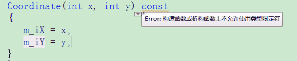
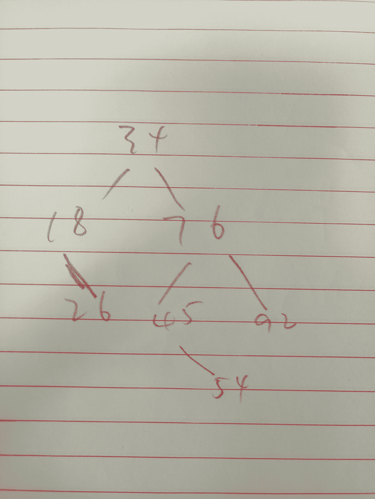
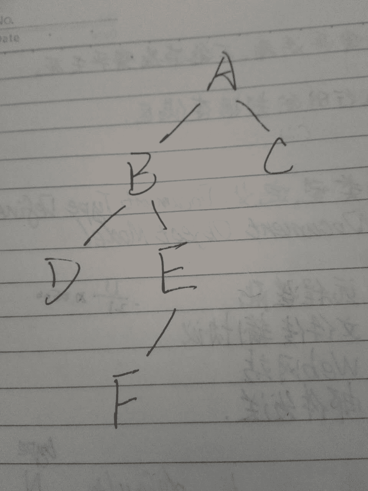

# 好未来 2017 秋招笔试真题二

## 1

请问下列关于构造函数的说法中，哪一种不正确？

正确答案: A   你的答案: 空 (错误)

```cpp
构造函数可以为 const 函数
```

```cpp
构造函数不能为虚函数
```

```cpp
默认构造函数不会初始化复合类型成员变量
```

```cpp
类的成员变量在构造函数中初始化
```

本题知识点

C++工程师 Java 工程师 好未来 2017 C++

讨论

[Seraph1990](https://www.nowcoder.com/profile/354379)

const 函数不改变成员变量，而构造函数意义在于初始化

发表于 2017-02-16 06:51:57

* * *

[牛客 463120 号](https://www.nowcoder.com/profile/463120)

因为构造函数的目的就是要给成员变量赋初值，如果定义成 const 类型，其成员变量就是不能改变的，所以构造函数是不能为 const 函数的。当然编译器也是不允许这样的，这是我在 vs10 上做测试。

发表于 2017-05-23 16:13:41

* * *

[NJ](https://www.nowcoder.com/profile/6589088)

静态成员变量不是在类外初始化的吗,静态成员变量不属于成员变量？

发表于 2017-07-10 22:22:35

* * *

## 2

请问：printf("%d %d", *(--ptr), *(++ptr))语句中，首先进行哪个运算？

正确答案: B   你的答案: 空 (错误)

```cpp
--ptr
```

```cpp
++ptr
```

```cpp
同时计算--ptr，++ptr
```

```cpp
随机顺序计算--ptr，++ptr
```

本题知识点

C++工程师 Java 工程师 好未来 2017 C 语言

讨论

[gybcloud](https://www.nowcoder.com/profile/664012)

printf()中表达式的求值是从右往左的

发表于 2017-03-01 19:48:33

* * *

[神奇的 Z](https://www.nowcoder.com/profile/9111160)

我觉得重点不是 printf 中各参数的执行顺序，而是方法中参数的执行顺序，都是采取栈的形式从右向左执行

发表于 2017-09-14 10:25:43

* * *

[小刀狼](https://www.nowcoder.com/profile/5197216)

以下转载网上内容对于 printf 函数 printf("%d%d\n",a,b);函数的实际输出顺序是这样的***先计算出 b，然后在计算 a，接着输出 a，最后在输出 b；***
例子如下：
#include<iostream>
using namespace std;
int main()
{
 int i=3,j=5;
 printf("%d  %d\n",(i++)-(--j),j=(i+=2));
 printf("%d  %d\n",i,j);
  return 0;
}
     此题的执行过程如下;
   首先对于第一个 printf 先计算出 j=(i+=2),这样此时 i=i+2=5，j=5；
   接着计算(i++)-(--j)=(5)-(4)=1,注意在计算完之后令 i++，及 i=6；

发表于 2017-02-11 09:39:59

* * *

## 3

V 原语对信号量做运算后，( )

正确答案: C   你的答案: 空 (错误)

```cpp
当 S<0 时进程继续执行
```

```cpp
当 S<0 时要唤醒一个就绪进
```

```cpp
当 S≤0 时要唤醒一个等待进程
```

```cpp
当 S≤0 时要唤醒一个就绪进程
```

本题知识点

C++工程师 Java 工程师 好未来 2017

讨论

[小矮子带着流浪狗去流浪](https://www.nowcoder.com/profile/9200918)

P 原语（阻塞原语）操作的动作是：    (1)sem 减 1；    (2)若 sem 减 1 后仍大于或等于零，则进程继续执行；    (3)若 sem 减 1 后小于零，则该进程被阻塞后进入与该信号相对应的队列中，然后转进程调度。V 原语（唤醒原语）操作的动作是：    (1)sem 加 1；    (2)若相加结果大于零，则进程继续执行；    (3)若相加结果小于或等于零，则从该信号的等待队列中唤醒一等待进程，然后再返回原进程继续执行或转进程调度。

发表于 2017-02-13 10:19:49

* * *

[蓝域小兵](https://www.nowcoder.com/profile/764132)

V 原语操作执行后   如果 sem 大于 0，说明没有等待进程。   如果 sem 小于或等于 0，说明有等待进程队列，因为 V 操作释放了一个资源，就需要唤醒一个等待进程获得该资源

发表于 2017-02-16 22:06:51

* * *

[GO_GO_GO](https://www.nowcoder.com/profile/4907902)

P 原语（阻塞原语）操作的动作是：    (1)sem 减 1；    (2)若 sem 减 1 后仍大于或等于零，则进程继续执行；    (3)若 sem 减 1 后小于零，则该进程被阻塞后进入与该信号相对应的队列中，然后转进程调度。V 原语（唤醒原语）操作的动作是：    (1)sem 加 1；    (2)若相加结果大于零，则进程继续执行；    (3)若相加结果小于或等于零，则从该信号的等待队列中唤醒一等待进程，然后再返回原进程继续执行或转进程调度。

发表于 2018-01-09 16:56:06

* * *

## 4

虚拟内存的容量只受( )的限制

正确答案: D   你的答案: 空 (错误)

```cpp
磁盘空间大小
```

```cpp
物理内存大小
```

```cpp
数据存放的实际地址
```

```cpp
计算机地址位数
```

本题知识点

C++工程师 Java 工程师 好未来 2017

讨论

[爱吃青菜皮卷面的 byr](https://www.nowcoder.com/profile/1411365)

**这种题没意思，单选题得话选 D（计算机地址位数），多选题的话选 ABD。****因为虚存= min（2^计算机位数， 内存+外存）。****32 位机的寻址能力为 2 的 32 次方，4GB。 此时虚存=4G****64 位机的寻址能力=** **16777216T，** **此时虚存=内存+外存**

发表于 2017-02-15 17:18:37

* * *

[小矮子带着流浪狗去流浪](https://www.nowcoder.com/profile/9200918)

因为计算机所支持的最大内存是由该计算机的地址位数决定的，也就是计算机的最大寻址能力。例如，32 位机的寻址能力为 2 的 32 次方，4GB。所以虚拟内存的大小受计算机地址位数的限制。

编辑于 2017-02-12 17:27:26

* * *

## 5

设带有头结点的单向循环链表的头指针变量为 head，则其判空条件是（ ）

正确答案: C   你的答案: 空 (错误)

```cpp
head==0
```

```cpp
head->next==0
```

```cpp
head->next==head
```

```cpp
head!=0
```

本题知识点

C++工程师 Java 工程师 好未来 2017

讨论

[51Hz](https://www.nowcoder.com/profile/541081)

C 单向循环链表：最后一个结点的指针指向头结点，表中没有指针域为 NULL 的结点。判空条件：头结点的指针 == 头指针。即 head->next == head。提高效率：增加一个尾指针 r，r->next 即为头指针。

发表于 2017-02-15 17:35:32

* * *

[gdut17](https://www.nowcoder.com/profile/279358190)

头结点的 next 指针域指向自己就是空链表

编辑于 2020-07-27 15:50:42

* * *

[xhnxiaotu](https://www.nowcoder.com/profile/991893554)

c

发表于 2019-03-27 22:02:10

* * *

## 6

设有一组初始记录关键字序列为(34，76，45，18，26，54，92)，则由这组记录关键字生成的二叉排序树的深度为（）

正确答案: A   你的答案: 空 (错误)

```cpp
4
```

```cpp
5
```

```cpp
6
```

```cpp
7
```

本题知识点

C++工程师 Java 工程师 好未来 2017

讨论

[dimy](https://www.nowcoder.com/profile/1853495)



发表于 2017-07-28 14:10:41

* * *

[NightKnight 宇](https://www.nowcoder.com/profile/5494124)

二叉排序树的生成方法 1、第一个关键字做根节点 2、每个关键字都与根节点比较，比根节点小的放在左字数，比根节点大的放在右字数 34 /       \ 18        76                                 \         / \                                 26     45 92                                   \54 

发表于 2017-02-12 13:22:56

* * *

[软绵绵](https://www.nowcoder.com/profile/5326245)

54 应该是 45 的右子树吧。

发表于 2017-05-24 22:28:15

* * *

## 7

已知数据表 A 中每个元素距其最终位置不远，为节省时间，应该采用的算法是

正确答案: D   你的答案: 空 (错误)

```cpp
直接选择排序
```

```cpp
堆排序
```

```cpp
快速排序
```

```cpp
直接插入排序
```

本题知识点

C++工程师 Java 工程师 好未来 2017

讨论

[刘志安](https://www.nowcoder.com/profile/5504686)

答案错了，选择不会受待排序程度的影响

发表于 2017-02-10 23:06:01

* * *

[早安宇宙](https://www.nowcoder.com/profile/797856)

明显是插入排序啊,真服了这套题

发表于 2017-02-12 23:32:21

* * *

[Erya_ 尔雅](https://www.nowcoder.com/profile/412110)

答案：D 快速排序的精髓：以一个数 k 为基准，将数据分割为两部分，其中一部分大于 k 另外一部分不大于 k，从而找到 k 的位置；然后 按照此方法对两部分数据进行递归操作。因此该方法数据越乱越好。

发表于 2017-03-13 14:32:36

* * *

## 8

对某二叉树进行前序遍历的结果是 ABDEFC，中序遍历的结果是 DBFEAC，则后序遍历的结果是

正确答案: C   你的答案: 空 (错误)

```cpp
BDFECA
```

```cpp
DBFEAC
```

```cpp
DFEBCA
```

```cpp
BDEFAC
```

本题知识点

C++工程师 Java 工程师 好未来 2017

讨论

[茜嘻嘻](https://www.nowcoder.com/profile/2469691)

题目有问题，中序遍历多了一个 C，应该是 DBFEAC。所以按前序遍历序列，第一个结点 A 就是根结点，接着在中序遍历中找 A，发现 A 的左边就是 A 的整个左子树，右边就是右子树。然后再在前序序列中找下一个根节点 B，在中序遍历序列里找 B 的左右两边。。。。按照这样递归的方式走，就能很容易的画出整棵树的结构，然后再写出后序遍历序列即可。希望对大家有帮助

发表于 2017-03-25 13:05:15

* * *

[xianzhan](https://www.nowcoder.com/profile/6633369)



发表于 2017-03-13 16:34:21

* * *

[そんようげん](https://www.nowcoder.com/profile/4727399)

题目错误，前序是 DBFEAC，中序是 ABDEFC

发表于 2019-05-20 20:37:30

* * *

## 9

算法的时间复杂度是指

正确答案: C   你的答案: 空 (错误)

```cpp
执行算法程序所需要的时间
```

```cpp
算法程序的长度
```

```cpp
算法执行过程中所需要的基本运算次数
```

```cpp
算法程序中的指令条数
```

本题知识点

C++工程师 Java 工程师 好未来 2017

讨论

[51Hz](https://www.nowcoder.com/profile/541081)

CA：是执行时间 B：是代码长度 D：应该改为执行的指令次数

发表于 2017-02-15 17:47:37

* * *

## 10

连续扔一枚硬币，前 10 次为正面，请问第 11 次也为正面的概率是多少？

正确答案: B   你的答案: 空 (错误)

```cpp
1/2048
```

```cpp
大于 1/2
```

```cpp
1/2
```

```cpp
小于 1/2
```

本题知识点

C++工程师 Java 工程师 好未来 2017

讨论

[xianzhan](https://www.nowcoder.com/profile/6633369)

有选 C 的么

发表于 2017-02-15 11:58:57

* * *

[饭饭 920404](https://www.nowcoder.com/profile/9801290)

那我就是在用**后验知识**了。换句话说，贝叶斯。

在这个案例里，我已经见到了连续 10 次正面。当然，一个标准硬币可以产出这样的结果，只不过概率是 1/2048 而已。但是，有另外一种可能的解释，那就是这个硬币作弊了。或者它的两面都是正面，或者它的正面那边比反面那边重很多。如果它是一枚作弊的、必定正面的硬币，那么它就会以 1 的概率出产连续 10 正，这可比标准硬币更有解释力啊！

那么在这里我们可以说，这 10 次观察得到了一个后验知识——该硬币有偏向于正面的倾向性。这倾向性有多大？可以算但是很麻烦，这里暂且忽略。但无论如何，如果你是一个贝叶斯***者，相信直觉，不愿意接受“标准硬币”那个先验知识，那么你应当得出的结论是：下一次硬币为正面的概率**大于 1/2.**

发表于 2017-03-14 15:50:29

* * *

[Artyhacker](https://www.nowcoder.com/profile/4313130)

这道题见过好几次，只能这么理解了：由 前 10 次都正面 推出 此硬币正面较重 推出 下一次正面概率大于 1/2。。。但从概率论来讲，这样推明显不对。

发表于 2017-02-14 20:53:17

* * *

## 11

以下说法正确的有？

正确答案: C D   你的答案: 空 (错误)

```cpp
7 月有 30 天
```

```cpp
8 月有 30 天
```

```cpp
2014 年 2 月有 28 天
```

```cpp
2 月不少于 28 天
```

本题知识点

C++工程师 Java 工程师 好未来 2017

讨论

[叶独落丶](https://www.nowcoder.com/profile/696381)

请告诉我那一年的 7 月和 8 月没有 30 天。我把日历吃下去。

发表于 2017-02-16 10:17:04

* * *

[一个哇塞的小伙](https://www.nowcoder.com/profile/8966131)

D 如果对了，那 A 和 B 也对，A 和 B 都错了 那 D 也不能算对。妈的双标侠

发表于 2017-03-06 13:26:12

* * *

[蒟蒻的菜鸡](https://www.nowcoder.com/profile/779405)

有 30 天不代表说他就没有 31 天吧

发表于 2018-03-27 20:57:33

* * *

## 12

2015 年的前三个月依次分别有 1 天，2 天，和 3 天（请输入阿拉伯数字）

你的答案 (错误)

123 参考答案 (1) 31
(2) 28
(3) 31

本题知识点

C++工程师 Java 工程师 好未来 2017

讨论

[51Hz](https://www.nowcoder.com/profile/541081)

31,28，31 每年的一三五七八十腊月都是 31 天，四六九十一都是 30 天。二月的天数与当年是否是闰年有关，闰年 29 天，非闰年 28 天。2015 年不是闰年，所以 2 月有 28 天。闰年的计算方法：能被 4 整除且不能被 100 整除；或者能被 400 整除

发表于 2017-02-15 17:54:04

* * *

[timor 小队长](https://www.nowcoder.com/profile/1413447)

这不是侮辱智商的题目？

发表于 2018-02-24 23:18:54

* * *

[浪迹天涯的黑猫](https://www.nowcoder.com/profile/7525277)

4 年一闰，百年不闰，400 年在闰

发表于 2017-05-31 20:32:53

* * *

## 13

将一句话的单词进行倒置，标点不倒置。比如 I like beijing. 经过函数后变为：beijing. like I

本题知识点

字符串 *C++工程师 Java 工程师 好未来 2017* *讨论

[陈哔哔](https://www.nowcoder.com/profile/1753453)

```cpp
#include <iostream>
#include <string>
using namespace std;
// cin 读取 string 时自动会被空格分隔开，用另一个字符串存储进行逆序输出
int main()
{
    string s1, s2;
    cin >> s2;
    while (cin >> s1)
        s2 = s1  + " " + s2;
    cout << s2 << endl;
    return 0;
}
```

发表于 2018-04-04 20:39:27

* * *

[卷积神经网络哦](https://www.nowcoder.com/profile/8684256)

```cpp
#include <iostream>
#include <cstdio>
#include <cstring>
#include <algorithm>
#include <cmath>
#include <string>
#include <vector>
using namespace std;
//常量区
vector<string> vec;
//函数区
//main 函数
int main(){
    string s;
    while(cin>>s) vec.push_back(s);
    for(int i = vec.size() - 1; i >= 0; i--){
        if(i == 0) cout<<vec[i]<<endl;
        else cout<<vec[i]<<" ";
    }    
    return 0;
}
/*
I like beijing.
*/
```

编辑于 2018-09-18 12:24:45

* * *

[ahu_coder](https://www.nowcoder.com/profile/7908562)

```cpp
import java.util.*;
public class Main {
    public static void main(String[] args) {
        Scanner sc = new Scanner(System.in);
        String[] s = sc.nextLine().split(" ");
        StringBuilder res = new StringBuilder();
        for(int i = s.length - 1; i >= 0; i--) {
            res.append(s[i]).append(" ");
        }
        String re = res.toString().trim();
        System.out.println(re);
    }
}
```

发表于 2017-08-15 15:35:20

* * *

## 14

输入两个字符串，从第一字符串中删除第二个字符串中所有的字符。例如，输入”They are students.”和”aeiou”，则删除之后的第一个字符串变成”Thy r stdnts.”

本题知识点

模拟 字符串 *C++工程师 Java 工程师 好未来 2017* *讨论

[牛客 3468171 号](https://www.nowcoder.com/profile/3468171)

```cpp
import java.util.Scanner;
public class Main {
	public static void main(String[] args)  {
		Scanner sc = new Scanner(System.in);
		while (sc.hasNext()) {
			String s1 = sc.nextLine();
			String s2 = sc.nextLine();
			String pattern = "[" + s2 + "]";
			String result = s1.replaceAll(pattern, "");
			System.out.println(result);
		}
	}
}

```

编辑于 2017-08-12 14:33:41

* * *

[启航 _](https://www.nowcoder.com/profile/2283702)

```cpp
#include <iostream>
#include <string>
using namespace std;

int main()
{
    string s1, s2;
    getline(cin, s1);
    getline(cin, s2);
    for (int i = 0; i < s2.size(); i++)
    {
        int index;
        while((index=s1.find(s2[i]))!=-1)
        {
            s1.erase(index, 1);
        }
    }
    cout << s1 << endl;
    return 0;
}
```

发表于 2017-08-18 17:23:12

* * *

[qianhuan](https://www.nowcoder.com/profile/1267471)

```cpp
/**
 * 用哈希表统计要删除的字母出现的次数
 * 可以把时间复杂的降到 m+n
 * 空间复杂度 256
 */
import java.util.Scanner;
public class Main {
    public static String delete(String src,String del){
        int[] map = new int[256];
        for (int i = 0; i < del.length(); i++) {
            map[del.charAt(i)]++;
        }
        char[] ch = src.toCharArray();
        int len = 0;
        for (int i = 0; i < ch.length; i++) {
            if(map[ch[i]] == 0){
               ch[len++] = ch[i];
            }
        }
        return new String(ch,0,len);
    }
    public static void main(String[] args) {
        Scanner sc = new Scanner(System.in);
        String src = sc.nextLine();
        String del = sc.nextLine();
        System.out.println(delete(src,del));
    }
}

```

编辑于 2017-09-02 19:48:40

* * *

## 15

输入两个整数 n 和 m，从数列 1，2，3.......n 中随意取几个数,使其和等于 m ,要求将其中所有的可能组合列出来

本题知识点

递归 C++工程师 Java 工程师 好未来 2017

讨论

[还能 Free 多久](https://www.nowcoder.com/profile/9705898)

```cpp
#include<iostream>
#include<vector>
using namespace std;
void help(int n, int m, vector<int>& v, int beg) {
	//if (beg>n) return;
	if (m == 0) {
		for (int i = 0; i<v.size(); i++) {
			i == 0 ? cout << v[i] : cout << " " << v[i];
		}
		cout << endl;
	}
	for (int i = beg; i <= n&&i <= m; i++) {
		v.push_back(i);
		help(n, m - i, v, i + 1);
		v.pop_back();
	}
}
int main() {
	int n, m;
	while (cin >> n >> m) {
		vector<int>v;
		help(n, m, v, 1);
	}
}
```

发表于 2017-03-19 22:00:12

* * *

[元气の悟空](https://www.nowcoder.com/profile/392974)

```cpp
#include<stdio.h>
#include<vector>
using namespace std;
vector<int> d;
void dfs(int,int);
int N,M;
int main(){
	while(scanf("%d%d",&N,&M)!=EOF)
		dfs(1,0);
}
void dfs(int index,int sum){
	if(sum>M) return;
	if(sum==M){
        int i;
		for(i=0;i<d.size()-1;i++) 
            printf("%d ",d[i]);
        printf("%d\n",d[i]);
	}
	for(int i=index;i<=N;i++){
		d.push_back(i);
		dfs(i+1,sum+i);
		d.pop_back();
	}
}
```

发表于 2017-09-12 19:04:07

* * *

[Holiday_12138](https://www.nowcoder.com/profile/461586)

```cpp
import java.util.ArrayList;
import java.util.Scanner;

public class Main{
	static ArrayList<ArrayList<Integer>> res = new ArrayList<ArrayList<Integer>>();
	static ArrayList<Integer> list = new ArrayList<>();
	public static void main(String[] args){
		Scanner sc = new Scanner(System.in);
		int n, m;

		while(sc.hasNext()) {
			n = sc.nextInt();
			m = sc.nextInt();
			dfs(1, m, n);
			for(ArrayList<Integer> l : res) {
				int i = 0;
				for(; i < l.size() - 1; i++) {
					System.out.print(l.get(i) + " ");
				}
				System.out.println(l.get(i));
			}
		}
	}

	public static void dfs(int index, int count, int n) {
		if(count == 0) {
			res.add(new ArrayList<>(list));
		}
		else {
			for(int i = index; i <= count && i <= n; i++) {
				list.add(i);
				dfs(i + 1, count - i, n);
				list.remove(list.size() - 1);
			}
		}
	}
}
```

编辑于 2017-07-24 10:54:55

* * *

## 16

一年哪几个月有 31 天？

你的答案

本题知识点

C++工程师 Java 工程师 好未来 2017

讨论

[小乌](https://www.nowcoder.com/profile/477630)

有没有人每次判断大小月是用拳头的...

发表于 2017-03-31 20:04:24

* * *

[牛客-hiro](https://www.nowcoder.com/profile/455648)

生活常识吧。主要考察是不是正常人。

发表于 2017-03-01 12:22:40

* * *

[＆黑大帅](https://www.nowcoder.com/profile/2778422)

一三五七八十腊，三十一天永不差.四六九十一三十整,平年二月二十八闰年在把一天加.

发表于 2019-08-30 14:34:31

* * ***