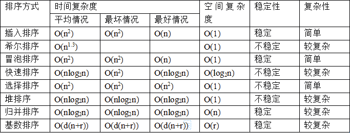
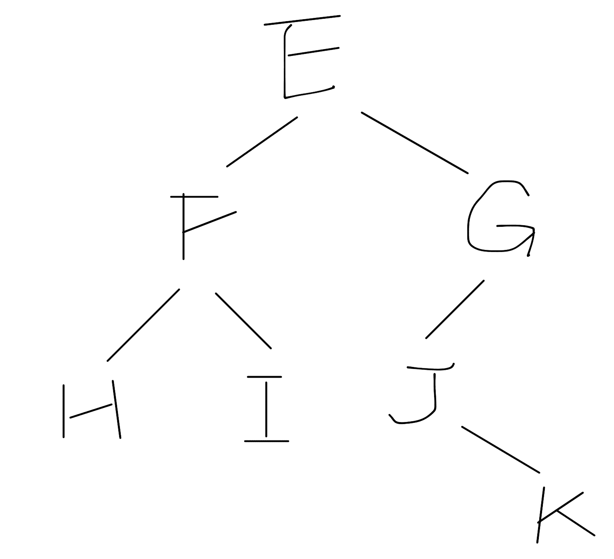
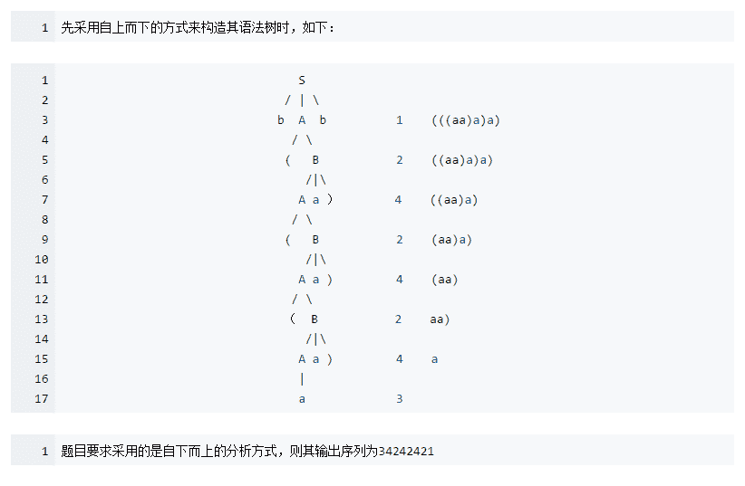
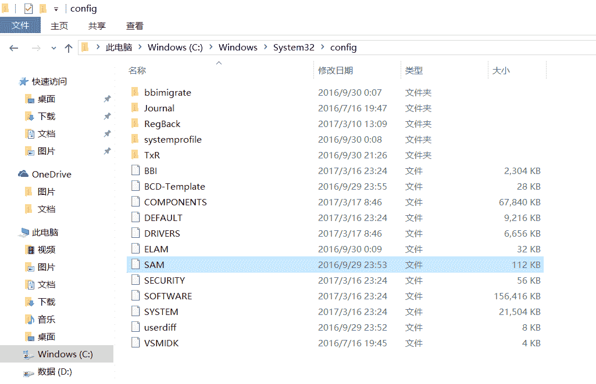

# 京东 2016 实习生招聘笔试真题-技术岗位选择题 A

## 1

下列函数的功能是（ ）

```cpp
f(char * x, char * y) 
{ do{x++,y++;} while((*x==*y)!=’\0’); }
```

正确答案: C   你的答案: 空 (错误)

```cpp
将 y 所指字符串赋给 x 所指空间
```

```cpp
使指针 x 指向 y 所指字符串
```

```cpp
将 x 所指字符串和 y 所指字符串进行比较
```

```cpp
检查 x 和 y 所指字符串中是否有’\0’
```

本题知识点

C++工程师 Java 工程师 京东 2016 C 语言

讨论

[牛客 393014 号](https://www.nowcoder.com/profile/393014)

\0 的 int 值是 0，true 的 int 是 1 false 是 0 所以只有 x y 对应字符相同，表达时 （*x==*y）返回 true 时，才能继续循环。跟是不是到结尾没啥关系！！！ 所以就是比较字符串是不起一致

发表于 2017-02-17 23:35:26

* * *

[tianzry](https://www.nowcoder.com/profile/5091008)

编译运行一下就清楚了。输出   1    0

```cpp
char c = '\0';
char d1 = 'a';
char d2 = 'a';
printf("%d\n",d1==d2);
printf("%d\n",c); 

```

发表于 2017-05-25 13:58:19

* * *

[MatthewMatt](https://www.nowcoder.com/profile/7594311)

函数功能很简单：参数是两个 char *指针，也就是可以传入字符数组，while 判断语句是判断 指针指向的字符是否相等并且是否走到末尾，就是对两个字符串进行相等比较，而且代码本身也有点小问题，因为 (*x == *y)只能返回 true 或者 false，和'\0'比较感觉没有意义。

发表于 2017-02-16 14:48:27

* * *

## 2

有以下程序

```cpp
#include<stdio.h>
int fun(int x){
    static int a = 3;
    x += a++;
    return x; 
}
void main(){ 
    int x = 2, sum;
    sum = fun(x);
    sum = sum + fun(x);
    printf("%d\n", sum);
}
```

程序运行以后的输出结果是（ ）?

正确答案: D   你的答案: 空 (错误)

```cpp
8
```

```cpp
9
```

```cpp
10
```

```cpp
11
```

本题知识点

C++工程师 Java 工程师 京东 2016 C++ C 语言

讨论

[MatthewMatt](https://www.nowcoder.com/profile/7594311)

注意 a 是静态变量，也就是说当它第一次建立后就不会被销毁，并保存上一次的值直到整个程序结束。

后缀++是先用变量，再++，和前缀相反。

fun 函数是形参，运行结束后不会对 X 产生影响。

发表于 2017-02-16 14:50:46

* * *

[五月 Lucy](https://www.nowcoder.com/profile/2911311)

局部变量的作用域仅限于函数内部，但是静态局部变量除外

发表于 2017-03-17 20:52:53

* * *

[牛客 561115862 号](https://www.nowcoder.com/profile/561115862)

静态变量不会被重复初始化。

发表于 2021-12-02 13:03:50

* * *

## 3

有以下程序

```cpp
main() {
    char *a = "How are you?", b[20];
    ______________________________
    printf("%s %s\n", a, b);
}
```

请为横线处选择适当的输入语句使得（ ）
程序运行时从键盘输入：How are you?<回车>
得到的输出结果为 How are you? How

正确答案: B   你的答案: 空 (错误)

```cpp
gets(b);
```

```cpp
scanf("%s", b);
```

```cpp
b=getchar();
```

```cpp
while(b=getchar()!="\0");
```

本题知识点

C++工程师 Java 工程师 京东 2016 C 语言

讨论

[MatthewMatt](https://www.nowcoder.com/profile/7594311)

gets 是得到一整行的字符串;getchar 是得到一个字符；scanf("%s")是得到一个连续的字符串，遇到空格、回车会自动终止

发表于 2017-02-16 14:52:02

* * *

[C.star](https://www.nowcoder.com/profile/1759886)

scanf( )函数和 gets( )函数都可用于输入字符串，但在功能上有区别。

gets 可以接收空格

scanf 遇到空格、回车和[Tab 键](https://www.baidu.com/s?wd=Tab%E9%94%AE&tn=44039180_cpr&fenlei=mv6quAkxTZn0IZRqIHckPjm4nH00T1YYn17bnHRLnWwBP1wbnARv0ZwV5Hcvrjm3rH6sPfKWUMw85HfYnjn4nH6sgvPsT6KdThsqpZwYTjCEQLGCpyw9Uz4Bmy-bIi4WUvYETgN-TLwGUv3En1D3njfkrjRL)都会认为输入结束，它不能接收空格。

发表于 2017-09-02 19:50:20

* * *

[风暴英雄使我发胖](https://www.nowcoder.com/profile/3378401)

输出应该是 How are you? How

发表于 2018-04-09 18:24:33

* * *

## 4

有以下程序

```cpp
main() {
    int a = 2, b = 3, c = 4, d = 0;
    if (a == 2 && b++ == 3)
        if (b != 3 || c-- == 4)
            printf("%d,%d,%d\n", a, b, c);
        else
            printf("%d,%d,%d\n", a, b, c);
    else
        printf("%d,%d,%d\n", a, b, c);
}
```

程序运行后的输出结果是（ ）

正确答案: C   你的答案: 空 (错误)

```cpp
2，4，3
```

```cpp
2，3，3
```

```cpp
2，4，4
```

```cpp
2，3，4
```

本题知识点

C++工程师 Java 工程师 京东 2016 C 语言

讨论

[MatthewMatt](https://www.nowcoder.com/profile/7594311)

注意里面的陷阱：if(b!=3 || c--==4)，因为 b 不等于 3，所以 if 语句直接返回 true，不执行 c-- == 4 操作，所以 c 还是等于 4

发表于 2017-02-16 14:54:00

* * *

[人生还有多少个二十年](https://www.nowcoder.com/profile/8733038)

先对原来的代码做缩进等的处理，结果如下：

```cpp
#include
main()
{
　int a = 2,b = 3,c = 4,d = 0; 
　if(a == 2 && b ++== 3){
　　if(b != 3 || c --== 4){
　　　printf("%d,%d,%d\n",a,b,c);
　　 }else{
　　　printf("%d,%d,%d\n",a,b,c); }
　｝else{
　　 printf("%d,%d,%d\n",a,b,c); }
}
```

接下来要说的是几个关键的知识点：

1.  记住一个规则，else 语句与其前最近的 if 语句匹配
2.  ++、--运算符具有副作用。前置则先更新，再以更新后的值参与运算，后置则以未修改的值参与运算，再更新，不管是哪种情况，其值最终都会发生变化。
3.  &&、||运算符都有短路求值的作用，如果第一个操作数已经能够决定该逻辑表达式的值时，那么就不再计算第二个操作数。

编辑于 2017-03-01 15:57:14

* * *

[蒟蒻的菜鸡](https://www.nowcoder.com/profile/779405)

& 和 | 是非短路测试无论第一项条件是否满足都会对第二项进行判断。
|| 是短路测试如果第一项判断为真就不会判断第二项、
&& 也是短路测试，如果第一项为假就不会测试第二项

发表于 2017-04-08 15:25:06

* * *

## 5

以下函数按每行 5 个输出数组中的数据

```cpp
void f(int x[], int n){ 
for(int i = 0;i < n;i++){
    __________________________
    printf("%d", x[i]);
    }
}
```

下划线处应填入的语句是（ ）

正确答案: C   你的答案: 空 (错误)

```cpp
if（i / 5 == 0）printf（“\n”）;
```

```cpp
if（i / 5 == 0）continue;
```

```cpp
if（i % 5 == 0）printf（“\n”）;
```

```cpp
if（i % 5 == 0）continue;
```

本题知识点

C++工程师 Java 工程师 京东 2016 C++ C 语言

讨论

[进阶中的牛客人](https://www.nowcoder.com/profile/450066322)

首先 i%5==0，代表 i 是 5 整数倍，满足了题目要求“每行 5 个进行输出”    因此排除 A.B 而 continue 是不往下执行，直接进行下一次循环，这样会使的 printf 没有执行，无法输出。因此应选择 C

发表于 2020-11-09 20:09:38

* * *

[Geass＇](https://www.nowcoder.com/profile/4778980)

int 型 i 除以 5 后得 0，A 与 B 错；printf()需要“\n”才能换行。

发表于 2017-04-07 17:23:56

* * *

[牛客 393014 号](https://www.nowcoder.com/profile/393014)

没错 printf 没带 \n 不换行 需要每隔 5 个打印一个换行符

发表于 2017-02-18 00:09:54

* * *

## 6

以下代码运行输出的结果是（ ）
public class Student{
private String sname="张三";
int sage=0;
}
public class Bachelor extends Student{
public String major;
public static void main(String[] args){
Student s = new Bachelor();
System.out.println(s.name);
}
}

正确答案: C   你的答案: 空 (错误)

```cpp
输出：张三
```

```cpp
没有输出
```

```cpp
编译出错
```

```cpp
运行出错
```

本题知识点

C++工程师 Java 工程师 京东 2016

讨论

[乐天知命](https://www.nowcoder.com/profile/9377774)

```cpp
public class Bachelor extends Student {
	public String major;
	public static void main(String[] args) {
		Student s = new Bachelor();
		System.out.println(s.name);
		// 首先，此处 s.name ，没有 name 这个变量，编译错误
		// 其次，即使此处是 s.sname ,因为 sname 是私有变量，编译也会发生错误
	}
}
public class Student {
	private String sname = "张三";
	int sage = 0;
}
```

编辑于 2017-03-14 21:04:40

* * *

[C 小十四](https://www.nowcoder.com/profile/8995864)

父类的成员变量 sname= “张三”是 private 的，即为父类私有，该成员变量只能父类使用，别的类都无法直接访问该成员变量，所以就算是继承自该类的子类也无法访问父类的私有变量，故子类也就找不到 sname 这个变量，编译出错。而父类另一个成员变量 sage=0 未加修饰符，在 JAVA 继承中未指定修饰符的默认为 protected 修饰，是可以被继承的，如果是 System.out.println(s.sage); 则可以正确输出 sage 的值 0。

发表于 2017-03-01 21:27:54

* * *

[特立独行的猪 246](https://www.nowcoder.com/profile/3311637)

没有 sname，这题有点无聊

发表于 2017-02-19 19:54:05

* * *

## 7

下面代码的运行结果是（ ）

```cpp
public class Arraytest{
    int a[] = new int[6];
    public static void main ( String arg[] ) {
        System.out.println ( a[0] );
    }
}
```

正确答案: C   你的答案: 空 (错误)

```cpp
null
```

```cpp
0
```

```cpp
编译出错
```

```cpp
运行出错
```

本题知识点

Java 工程师 2016 Java

讨论

[kuiblog.com](https://www.nowcoder.com/profile/622184)

在 static 方法中是不能访问非静态变量 a 的，需要将 a 声明为 static，答案才会是 0 ，否则是编译出错

发表于 2017-02-22 20:46:37

* * *

[菜呆鸡](https://www.nowcoder.com/profile/7816987)

Java 静态 方法不能访问 非静态变量

编辑于 2017-02-22 19:48:09

* * *

[我相信：](https://www.nowcoder.com/profile/4718299)

在 java 中静态方法中不能使用非静态方法和非静态变量。但非静态方法中可以使用静态变量

发表于 2017-09-03 19:38:29

* * *

## 8

下面代码的运行结果是（ ）
public class Test
{ public static void main ( String arg[] ) {
int a=10,b=4,c=5,d=9;
System.out.println(++a*b+c*--d);
}
}

正确答案: B   你的答案: 空 (错误)

```cpp
80
```

```cpp
84
```

```cpp
89
```

```cpp
算数表达式有错误
```

本题知识点

C++工程师 Java 工程师 京东 2016

讨论

[csajob](https://www.nowcoder.com/profile/457026)

++，--运算符的优先级要比较高，属于二等；[]，{}运算符属于一等；*，/，%运算符属于三等；+，-运算符属于四等

发表于 2017-02-18 15:25:43

* * *

[JustAkuir](https://www.nowcoder.com/profile/912275)

（++a）*b+c*（--d）= 11*4+10*4=84

发表于 2017-02-18 11:04:42

* * *

## 9

执行如下程序，输出结果是（ ）
class MyTest {
public static void main(String[] args) {
Integer first = new Integer(3);
Integer second = 3;
int three = 3;
System.out.println(first==second);
System.out.println(first==three);
}
}

正确答案: A   你的答案: 空 (错误)

```cpp
falsetrue
```

```cpp
falsefalse
```

```cpp
truetrue
```

```cpp
truefalse
```

本题知识点

C++工程师 Java 工程师 京东 2016

讨论

[csajob](https://www.nowcoder.com/profile/457026)

两个对象之间的双等于号是比较内存地址，故 System.out.println(first==second); 输出 falseint 类型与 Integer 用双等于号比较，会隐式的将 integer 转换成 int，两个数值类型双等于号比较的是真值，故 System.out.println(first==three);  输出 true。

发表于 2017-02-18 15:28:30

* * *

[克里斯](https://www.nowcoder.com/profile/389695)

**1\. int 和 Integer 在进行比较的时候，Integer 会进行拆箱，转为 int 值与 int 进行比较。**

**2. Integer 与 Integer 比较的时候，由于直接赋值的时候会进行自动的装箱，那么这里就需要注意两个问题，一个是-128<= x<=127 的整数，将会直接缓存在 IntegerCache 中，那么当赋值在这个区间的时候，不会创建新的 Integer 对象，而是从缓存中获取已经创建好的 Integer 对象。二：当大于这个范围的时候，直接 new Integer 来创建 Integer 对象。**

**3\. new Integer(1) 和 Integer a = 1 不同，前者会创建对象，存储在堆中，而后者因为在-128 到 127 的范围内，不会创建新的对象，而是从 IntegerCache 中获取的。那么 Integer a = 128, 大于该范围的话才会直接通过 new Integer（128）创建对象，进行装箱。**

发表于 2017-04-07 16:41:17

* * *

[tianzry](https://www.nowcoder.com/profile/5091008)

```cpp
Integer a1 = 127; 
Integer a2 = 127; 
System.out.println(a1 == a2);
Integer a3 = 128; 
Integer a4 = 128; 
System.out.println(a3 == a4);
```

输出 true false

编辑于 2017-05-25 14:35:00

* * *

## 10

把 3.14 四舍五入为最接近的整数，以下方法正确的是（ ）

正确答案: D   你的答案: 空 (错误)

```cpp
round(3.14 )
```

```cpp
rnd(3.14 )
```

```cpp
Math.rnd(3.14 )
```

```cpp
Math.round(3.14 )
```

本题知识点

C++工程师 Java 工程师 京东 2016

讨论

[D_Rider](https://www.nowcoder.com/profile/1821305)

1\. Math.ceil()用作向上取整。

2\. Math.floor()用作向下取整。

3\. Math.round() 我们数学中常用到的四舍五入取整。

发表于 2017-02-20 21:44:02

* * *

[wanlanwalan](https://www.nowcoder.com/profile/7952866)

rnd()用作生成随机数
Math.ceil()用作向上取整
Math.floor()用作向下取整
Math.round() 用作四舍五入取整

发表于 2017-06-03 11:00:34

* * *

## 11

bash 环境中挂起当前进程的方式是（ ）

正确答案: B   你的答案: 空 (错误)

```cpp
ctrl+x
```

```cpp
ctrl+z
```

```cpp
ctrl+c
```

```cpp
ctrl+v
```

本题知识点

C++工程师 Java 工程师 京东 2016

讨论

[废菜](https://www.nowcoder.com/profile/3883910)

Ctrl+C--停止程序 Ctrl+Z--后台挂起

发表于 2017-02-21 16:25:39

* * *

[wanlanwalan](https://www.nowcoder.com/profile/7952866)

1、Ctrl+C 比较暴力，就是发送 Terminal 到当前的程序，比如你正在运行一个查找功能，文件正在查找中，Ctrl+C 就会强制结束当前的这个进程。2、Ctrl+Z 是把当前的程序挂起，暂停执行这个程序，比如你正在[mysql](http://www.2cto.com/database/MySQL/) 终端中，需要出来搞点其他的文件操作，又不想退出 mysql 终端（因为下次还得输入用户名密码进入，挺麻烦），于是可以 ctrl+z 将 mysql 挂起，然后进行其他操作，然后输入 fg 回车后就可以回来，当然可以挂起好多进程到后台，然后 fg 加编号就能把挂起的进程返回到前台。当然，配合 bg 和 fg 命令进行前后台切换会非常方便。3、Ctrl+D 是发送一个 exit 信号，没有那么强烈，类似 ctrl+C 的操作，比如你从管理员 root 退回到你的普通用户就可以这么用。clear：清除终端屏幕

发表于 2017-06-03 11:02:21

* * *

[John520101](https://www.nowcoder.com/profile/6618642)

java 开发也会问这种问题？

发表于 2017-02-22 19:52:20

* * *

## 12

查看本系统支持 shell 类型的配置文件是（ ）

正确答案: D   你的答案: 空 (错误)

```cpp
/etc/config/shells
```

```cpp
/bin/shells
```

```cpp
/usr/shells
```

```cpp
/etc/shells
```

本题知识点

C++工程师 Java 工程师 京东 2016

讨论

[克里斯](https://www.nowcoder.com/profile/389695)

/bin 二进制文件目录/sbin 系统二进制目录/etc 配置文件目录/dev 设备文件目录/pro 进程文件目录/usr 用户程序目录

发表于 2017-04-07 17:15:20

* * *

[不思进取的我](https://www.nowcoder.com/profile/995805)

etc 表示配置目录。类似这种静态的信息一般保存在这个文件夹。

发表于 2017-03-06 20:33:45

* * *

[yj01](https://www.nowcoder.com/profile/1063396)

etc 一般加载的是一些安装工具的静态配置信息，shell 的话。。。不在此列，记住吧，骚年

发表于 2018-06-06 10:26:23

* * *

## 13

在 HTML5 中，sessionStorage 保存数据的方法正确的是（ ）

正确答案: B   你的答案: 空 (错误)

```cpp
sessionStorage.saveItem("键名","键值");
```

```cpp
sessionStorage.setItem("键名","键值");
```

```cpp
sessionStorage.saveItem("键值","键名");
```

```cpp
sessionStorage.setItem("键值","键名");
```

本题知识点

C++工程师 Java 工程师 京东 2016

讨论

[牛客 382450 号](https://www.nowcoder.com/profile/382450)

一般来说，javascript 里面用的比较多的函数名是 set，什么什么 set，例如 localStorage 的就是 set，例如 Map 的也是 set，用 save 的实在是太少了

发表于 2017-04-02 16:36:05

* * *

[allensimon](https://www.nowcoder.com/profile/608790)

存是 set，取是 get。key 在前，value 在后。

发表于 2017-05-01 13:31:01

* * *

[点滴快乐](https://www.nowcoder.com/profile/5634458)

这个要记住了😂

发表于 2017-06-04 09:47:50

* * *

## 14

有一个有序表为{1,5,8,11,19,22,31,35,40,45,48,49,50},当二分查找值为 48 的结点时, 查找成功需要比较的次数（ ）

正确答案: A   你的答案: 空 (错误)

```cpp
4
```

```cpp
3
```

```cpp
2
```

```cpp
1
```

本题知识点

C++工程师 Java 工程师 京东 2016

讨论

[kuiblog.com](https://www.nowcoder.com/profile/622184)

一共 13 个数，0-12 刚开始比较

0+(12-0)/2 = a[6] = 31<48;

7+(12-7)/2=a[9] = 45<48

10+(12-10)/2 = a[11] = 49 >48

10+(11-10)/2 =a[10] = 48 =48 ，查找结束，四次

发表于 2017-02-22 21:10:48

* * *

[人生还有多少个二十年](https://www.nowcoder.com/profile/8733038)

//1,5,8,11,19,22,31,35,40,45,48,49,50

　　31 < 48

//35,40,45,48,49,50

　　45 < 48

//48,49,50

　　49 > 48

　　48 == 48

编辑于 2017-02-22 18:35:21

* * *

[Dorothy_](https://www.nowcoder.com/profile/6211006)

如果比较待查找值比中间值大，设置 low=mid，则只需要 3 次呀

发表于 2017-02-16 20:10:20

* * *

## 15

在分块查找中，若索引表各块内均用顺序查找，则有 324 个元素线性表若分成 9 块，其平均查找长度为（ ）

正确答案: D   你的答案: 空 (错误)

```cpp
19
```

```cpp
18
```

```cpp
32.5
```

```cpp
23.5
```

本题知识点

C++工程师 Java 工程师 京东 2016

讨论

[KinoamyFx](https://www.nowcoder.com/profile/3247893)

324 个元素，分成 9 块，每块 36 个元素。查找块平均需要（1+9）/2 =5 次, 块内查找元素需要平均（1+36）/2 = 18.5 次，共 23.5 次。已提交纠错。

发表于 2017-02-26 10:19:54

* * *

[空空以空空](https://www.nowcoder.com/profile/479441)

平均查找长度的定义：ASL，为确定记录在查找表中的位置，需和给定值进行比较的关键字个数的期望值称为查找算法在查找成功时的**平均查找长度**
n:节点数  b:块数 s=n/b 每块的节点数若采用顺序查找方式：ASL=（b+1）/2+（s+1）/2 若采用折半查找方式：ASL=log2（b+1）+（s+1）/2 -1

发表于 2017-09-11 20:45:46

* * *

[我相信：](https://www.nowcoder.com/profile/4718299)

查找块平均需要（1+9）/2 = 5 次，块内查找平均需要（1+36）/2 = 18.5，总共需要 23.5

发表于 2017-09-03 20:09:48

* * *

## 16

下列排序算法中稳定且时间复杂度为 O(n2)的是（ ）

正确答案: B   你的答案: 空 (错误)

```cpp
快速排序
```

```cpp
冒泡排序
```

```cpp
直接选择排序
```

```cpp
归并排序
```

本题知识点

C++工程师 Java 工程师 京东 2016

讨论

[kuiblog.com](https://www.nowcoder.com/profile/622184)

 看图吧

发表于 2017-02-22 21:18:51

* * *

[克里斯](https://www.nowcoder.com/profile/389695)

不稳定排序算法都存在一个特征：对于值相等的两个数，这两个数之间并没有发生比较过程且发生跳跃式的交换

发表于 2017-04-07 18:20:12

* * *

## 17

对关键字{25,15,30,10,50,3,5,60}序列进行快速排序，第一趟从小到大一次划分结果为（ ）

正确答案: B   你的答案: 空 (错误)

```cpp
{3，5，10，15} 25{50，30，60}
```

```cpp
{5，15，3，10} 25 {50，30，60}
```

```cpp
{3，15，10，5} 25 {50，30，60}
```

```cpp
{5，15，3，10} 25 {30，50，60}
```

本题知识点

C++工程师 Java 工程师 京东 2016

讨论

[牛客 897709 号](https://www.nowcoder.com/profile/897709)

(01) 从"右 --> 左"查找小于 x 的数：找到满足条件的数 a[j]=5，此时 j=6；然后将 a[j]赋值 a[i]，此时 i=0；接着从左往右遍历。
(02) 从"左 --> 右"查找大于 x 的数：找到满足条件的数 a[i]=30，此时 i=2；然后将 a[i]赋值 a[j]，此时 j=6；接着从右往左遍历。
(03) 从"右 --> 左"查找小于 x 的数：找到满足条件的数 a[j]=3，此时 j=5；然后将 a[j]赋值 a[i]，此时 i=2；接着从左往右遍历。

(04) 从"左 --> 右"查找大于 x 的数：找到满足条件的数 a[i]=50，此时 i=4；然后将 a[i]赋值 a[j]，此时 j=5；接着从右往左遍历。(05) 从"右 --> 左"查找小于 x 的数：找到满足条件的数 a[j]=10，此时 j=3；然后将 a[j]赋值 a[i]，此时 i=4；接着从左往右遍历。
(06) 当 i>=j 时，停止查找；然后将 x 赋值给 a[i]。此趟遍历结束！

按照同样的方法，对子数列进行递归遍历。最后得到有序数组！

发表于 2017-02-18 21:17:34

* * *

[小乌](https://www.nowcoder.com/profile/477630)

快排又没有统一的标准，我按照两路查找，得到的是 3 15 5 10 ...25  ... 50 30 60

发表于 2017-03-30 18:54:54

* * *

[别理我哦哦](https://www.nowcoder.com/profile/3583330)

不是 {5，15，10，3} 25 {30，50，60}吗？？？

发表于 2017-03-23 23:50:56

* * *

## 18

对关键字{10,20,8,25,35,6,18,30,5,15,28}序列进行希尔排序，取增量 d =5 时，排序结果为（ ）

正确答案: A   你的答案: 空 (错误)

```cpp
{6,18,8,5,15,10,20,30,25,35,28}
```

```cpp
{10,18,8,5,15,6,20,30,25,35,28}
```

```cpp
{10,20,8,5,15,6,18,30,25,35,28}
```

```cpp
{10,20,30,5,8,6,15,18,25,28,35}
```

本题知识点

C++工程师 Java 工程师 京东 2016

讨论

[kuiblog.com](https://www.nowcoder.com/profile/622184)

10 ,    20    ,    8    ,    25,    35,    6,        18    ,    30    ,    5    ,    15    ,    28a        b           c         d        e       a         b           c           d          e           a 相同字母的是一组进行比较，比如 A 组， 10，6,28,比较之后是 6，10，28，那么答案出来了，选择 A

发表于 2017-02-22 21:28:56

* * *

[牛客 8243340 号](https://www.nowcoder.com/profile/8243340)

根据增量分组 （1 ~ 5）， （6 ~ 10）， （11），对应组进行排序

发表于 2017-06-02 20:36:28

* * *

## 19

某超市研究销售纪录数据后发现，买啤酒的人很大概率也会购买尿布，这种属于数据挖掘的哪类问题？

正确答案: A   你的答案: 空 (错误)

```cpp
关联规则发现
```

```cpp
聚类
```

```cpp
分类
```

```cpp
自然语言处理
```

本题知识点

C++工程师 Java 工程师 京东 2016

讨论

[大仁哥 _csu](https://www.nowcoder.com/profile/3607945)

数据挖掘主要解决的四类问题：1、分类问题 2、聚类问题 3、关联问题 4、预测问题题目所述为典型的关联问题。

发表于 2017-03-02 22:31:33

* * *

[牛客 6544890 号](https://www.nowcoder.com/profile/6544890)

A  啤酒和尿布的 correlation

发表于 2017-04-21 11:00:00

* * *

[ご一粒沙尘/ty](https://www.nowcoder.com/profile/6660514)

A 关联规则发现

发表于 2017-02-27 11:42:54

* * *

## 20

假设 12 个销售价格记录组已经排序如下：5, 10, 11, 13, 15, 35, 50, 55, 72, 92, 204, 215 使用如下每种方法将它们划分成四个箱。等频（等深）划分时，15 在第几个箱子内？ ( )

正确答案: B   你的答案: 空 (错误)

```cpp
第一个
```

```cpp
第二个
```

```cpp
第三个
```

```cpp
第四个
```

本题知识点

C++工程师 Java 工程师 京东 2016

讨论

[kuiblog.com](https://www.nowcoder.com/profile/622184)

举个例子： 假定由年龄组合：{0,4,12,16,18,24,26,28}

按照等宽的话，子区间宽度相同，取宽度为 10，则：{0,4},{12,16,16,18},{24,26,28}

等频的话，子集元素个数相同，则 {0,4,12},{16,16,18},{24,26,28} 回归到这个题：分成四个箱子，一个箱子装 3 个，{5,10,11},{13,15,35}{...}{...}很明显在第二个箱子中

发表于 2017-02-22 21:34:31

* * *

[我勒个旭](https://www.nowcoder.com/profile/262884115)

等频简单的说 就是个数一样等宽简单的说就是  数字之间的跨度是一样的 

发表于 2018-07-29 22:10:14

* * *

[wanlanwalan](https://www.nowcoder.com/profile/7952866)

等宽划分：将整个区域划分成 N 个相同大小的间隔
等频划分：将整个区域划分为 N 个间隔，各个间隔中包含的样本数目大致相同

发表于 2017-06-03 11:06:03

* * *

## 21

设 X={1，2，3}是频繁项集，则可由 X 产生()个关联规则

正确答案: C   你的答案: 空 (错误)

```cpp
4
```

```cpp
5
```

```cpp
6
```

```cpp
7
```

本题知识点

C++工程师 Java 工程师 京东 2016

讨论

[bu_zhi_dao](https://www.nowcoder.com/profile/1723161)

{1} {2} {3} {1,2} {1,3} {2,3}

发表于 2017-02-20 20:58:12

* * *

[星期四的佩琪](https://www.nowcoder.com/profile/2235018)

这里频繁项集的意思应该是关联时每个元素都必须参与{1} -> {2, 3}{2} -> {1, 3}{3} -> {1, 2}{1, 2} -> {3}{1, 3} -> {2}{2, 3} -> {1} 

发表于 2018-04-08 13:54:34

* * *

[Oliver？](https://www.nowcoder.com/profile/3729030)

{1} -> {2}{1} -> {3}{2} -> {1}{2} -> {3}{3} -> {1}{3} -> {2}共六个。X={1，2，3}，里面每一个都是频繁的，那么关联规则是看任意两个之间是否能推导，并计算其置信度即可。

发表于 2017-06-27 17:07:12

* * *

## 22

考虑下面的频繁 3-项集的集合：{1，2，3}，{1，2，4}，{1，2，5}，{1，3，4}，{1，3，5}，{2，3，4}，{2，3，5}，{3，4，5}假定数据集中只有 5 个项，采用 合并策略，由候选产生过程得到 4-项集不包含（ ）

正确答案: C D   你的答案: 空 (错误)

```cpp
1，2，3，4
```

```cpp
1，2，3，5
```

```cpp
1，2，4，5
```

```cpp
1，3，4，5
```

本题知识点

C++工程师 Java 工程师 京东 2016

讨论

[从祥](https://www.nowcoder.com/profile/6240373)

生成的是候选频繁 4-项集，这个时候只要判断候选中的 3 项子集是不是频繁 3 项集，因为{2,4,5}不是频繁 3 项集，所以选择 C

发表于 2017-03-02 20:12:23

* * *

[→①年前↑](https://www.nowcoder.com/profile/5546266)

D 答案，{1,4,5}也不是频繁 3 项集啊，为什么一定是 C 答案？

发表于 2017-03-28 11:45:18

* * *

[寒夏](https://www.nowcoder.com/profile/7911594)

首先要明白两个定理（K 项集为频繁 K 项集时，则 K-1 也必为频繁集）：1、连接定理：若有两个 k-1 项集，每个项集按照“属性-值”（一般按值）的字母顺序进行排序。如果两个 k-1 项集的前 k-2 个项相同，而最后一 个项不同，则证明它们是可连接的，即这个 k-1 项集可以联姻，即可连接生成 k 项集。如：有两个 3 项集｛a, b, c｝{a, b, d}，这两个 3 项集就是可连接的，它们可以连接生成 4 项集｛a, b, c, d｝；两个 3 项集｛a, b, c｝｛a, d, e｝，这两个 3 项集显示是不能连接生成 3 项集的。
2、频繁子集定理：若一个项集的子集不是频繁项集，则该项集肯定也不是频繁项集。若存在 3 项集｛a, b, c｝，如果它的 2 项子集｛a, b｝的支持度即同时出现的次数达不到阈值，则｛a, b, c｝同时出现的次数显然也是达不到阈值的。

发表于 2019-09-23 17:35:26

* * *

## 23

在基本 K 均值算法里，当邻近度函数采用（ ）的时候，合适的质心是簇中各点的中位数。

正确答案: A   你的答案: 空 (错误)

```cpp
曼哈顿距离
```

```cpp
平方欧几里德距离
```

```cpp
余弦距离
```

```cpp
Bregman 散度
```

本题知识点

C++工程师 Java 工程师 京东 2016

讨论

[小陈君](https://www.nowcoder.com/profile/8893929)

邻近度函数：曼哈顿距离。质心：中位数。目标函数：最小化对象到其簇质心的距离和
邻近度函数：平方欧几里德距离。质心：均值。目标函数：最小化对象到其簇质心的距离的平方 和
邻近度函数：余弦。质心：均值。最大化对象与其质心的余弦相似度和
邻近度函数：Bregman 散度。质心：均值。目标函数：最 小化对象到其簇质心的 Bregma n 散度和

发表于 2017-03-01 17:42:27

* * *

[detectiveHLH](https://www.nowcoder.com/profile/4777777)

记住就可以了

发表于 2017-02-27 09:16:20

* * *

[wanlanwalan](https://www.nowcoder.com/profile/7952866)

曼哈顿距离。 质心：中位数。 目标函数：最小化对象到其簇质心的距离和
平方欧几里德距离。 质心：均值。 目标函数：最小化对象到其簇质心的距离的平方和
余弦。 质心：均值。 目标函数：最大化对象与其质心的余弦相似度和
Bregman 散度。 质心：均值。 目标函数：最小化对象到其簇质心的 Bregman 散度和

发表于 2017-06-03 11:06:57

* * *

## 24

后缀算式 5 3 2+ * 8 2/ -的值为（ ）

正确答案: A   你的答案: 空 (错误)

```cpp
21
```

```cpp
13
```

```cpp
26
```

```cpp
24
```

本题知识点

C++工程师 Java 工程师 京东 2016

讨论

[...嫈](https://www.nowcoder.com/profile/9198606)

5 3 2 入栈，遇到+，取出 3+2=5；5 5 在栈里，遇到*，5*5=25；25 在栈里，进 8 2 栈，遇到/，8/2=4；25 4 在栈里，遇到-，25-4=21

发表于 2017-03-01 21:21:30

* * *

[废菜](https://www.nowcoder.com/profile/3883910)

5×（3+2）-8/2 = 21

发表于 2017-02-21 16:43:36

* * *

[yj01](https://www.nowcoder.com/profile/1063396)

入栈 5，3，2 遇到+出栈计算 2+3=5 再入栈变成 5  5 遇到 *出栈计算 5*5=25 入栈 8 2 入栈遇见/成 4 4 再入栈，栈里还有 25 4 ，-入栈最后计算 25- 4 =21 结果为 A

发表于 2018-06-06 10:38:38

* * *

## 25

在一个长度为 n 的带头结点的单链表 h 上，另设有尾指针 r（指向尾结点），在单链表最后一个元素之后插入一个新元素 p，执行的操作（ ）

正确答案: D   你的答案: 空 (错误)

```cpp
r->next=p;p->next=NULL;
```

```cpp
while(h->next!=NULL)  h=h->next;h->next=p;     p->next=NULL;
```

```cpp
while(h->next!=r)        h=h->next;h->next=p;     p->next=NULL;
```

```cpp
r->next=p;p->next=NULL;  r=p;
```

本题知识点

C++工程师 Java 工程师 京东 2016

讨论

[大仁哥 _csu](https://www.nowcoder.com/profile/3607945)

带尾指针的链表操作，在尾部插入时直接操作尾指针，省去了遍历整个表的麻烦。最后记得修改尾指针。

发表于 2017-03-02 22:43:43

* * *

[wanlanwalan](https://www.nowcoder.com/profile/7952866)

带尾指针的链表操作，在尾部插入时直接操作尾指针，无需遍历整个链表。r->next=p;p->next=NULL; r=p;

发表于 2017-06-03 11:11:00

* * *

## 26

已知一个栈的进栈序列是 1,2,3,…,10,其出栈序列是 p1,p2,..p10,若 p1=10,则 p5 的值为（ ）

正确答案: B   你的答案: 空 (错误)

```cpp
5
```

```cpp
6
```

```cpp
4
```

```cpp
不确定
```

本题知识点

C++工程师 Java 工程师 京东 2016

讨论

[竹林月光](https://www.nowcoder.com/profile/1893283)

没有说全部进栈再开始出来啊，可以一边进去一边出来呀，序列有很多种啊由于 p1=10，说明进栈结束之后才开始出栈的，所以 p5=6

编辑于 2017-08-24 20:34:19

* * *

[wanlanwalan](https://www.nowcoder.com/profile/7952866)

出栈第一个元素为 p1=10，加之入栈顺序为 1，2，3，4，5，6，7，8，9，10 则出栈顺序为 10,9,8,7,6,5,4,3,2,1，则 p5=6

发表于 2017-06-03 11:13:19

* * *

[沫沫 19](https://www.nowcoder.com/profile/1044466)

由于 10 是第一个出栈的，说明入栈是按 1,2,3,4,5,6,7,8,9,10 的顺序入栈的，故第 5 个出栈的是 6

发表于 2017-02-21 21:44:47

* * *

## 27

若串 s='bookshop’,其子串的个数是（ ）

正确答案: C   你的答案: 空 (错误)

```cpp
8
```

```cpp
28
```

```cpp
37
```

```cpp
36
```

本题知识点

C++工程师 Java 工程师 京东 2016

讨论

[AAJ](https://www.nowcoder.com/profile/6803713)

注意空字符串是任何字符串的子串

发表于 2017-02-19 22:24:34

* * *

[奇怪的 H](https://www.nowcoder.com/profile/3227009)

```cpp
n(n+1)/2 + 1
例：

| X | X X

想像向 n 个字符中间插入两片木板，这两片木板之间的即为原串的一个子串。
总共有 n + 1 个空位可以插，第一个木板插入后，第二个还有 n 个空位。
所以共有 n(n+1) 种插法，又由于两片木板交换顺序后，子串还是同一个子串，所以子串数量应为 n(n+1)/2 。但最后，空串是任意字符串的子串，所以最后还要 +1
```

发表于 2017-02-28 21:30:05

* * *

[李运](https://www.nowcoder.com/profile/6981030)

难道你们都不考虑，当子串的长度为 1 时，可能会重复吗？长度为 1 的子串只有六个。

发表于 2017-02-20 11:20:57

* * *

## 28

一棵二叉树的先序遍历为 EFHIGJK，中序遍历为 HFIEJKG，则后序遍历为（ ）

正确答案: D   你的答案: 空 (错误)

```cpp
HIFJKGE
```

```cpp
FHIJKGE
```

```cpp
HIFGJKE
```

```cpp
HIFKJGE
```

本题知识点

C++工程师 Java 工程师 京东 2016

讨论

[熊胖子](https://www.nowcoder.com/profile/9565379)

根据已知的前序遍历和中序遍历，可以作出这棵树：    
由此可以得出后序遍历的序列。

发表于 2017-02-27 15:34:57

* * *

[小嗨喜欢在阳台看花海](https://www.nowcoder.com/profile/6813469)

粗心的我......

发表于 2018-03-15 21:25:07

* * *

## 29

有一语法制导翻译如下所示： S→bAb {print"1"} A→(B {print"2"} A→a {print"3"} B→Aa) {print"4"} 若输入序列为 b(((aa)a)a)b，且采用自底向上的分析方法，则输出序列为（ ）

正确答案: B   你的答案: 空 (错误)

```cpp
32224441
```

```cpp
34242421
```

```cpp
12424243
```

```cpp
34442212
```

本题知识点

C++工程师 Java 工程师 京东 2016

讨论

[bu_zhi_dao](https://www.nowcoder.com/profile/1723161)

(1) S  -> bAb(2) A -> (B(3) A -> a(4) B -> Aa) 符号栈                                 输入                                 动作                                         b(((aa)a)a)b                        移入 b                                       (((aa)a)a)b                          移入 b(                                     ((aa)a)a)b                             移入 b((                                    (aa)a)a)b                              移入 b(((                                   aa)a)a)b                               移入 b(((a                                 a)a)a)b                                归约(3)  打印 3b(((A                                a)a)a)b                                 移入 b(((Aa                              )a)a)b                                   移入 b(((Aa)                             a)a)b                                   归约(4) 打印 4b(((B                                a)a)b                                   归约(2) 打印 2b((A                                 a)a)b                                   移入 b((Aa                               )a)b                                     移入 b((Aa)                             a)b                                       归约(4) 打印 4b((B                                a)b                                        归约(2) 打印 2b(A                                 a)b                                        移入 b(Aa                               )b                                          移入 b(Aa)                             b                                            归约(4) 打印 4b(B                                b                                            归约(2) 打印 2bA                                 b                                             移入 bAb                                                                              归约(1) 打印 1 所以打印顺序为 34242421

发表于 2017-02-20 21:48:33

* * *

[熊胖子](https://www.nowcoder.com/profile/9565379)

建议这种题目，每一个翻译的对应代码之后至少加一个标点符号分隔开，不然真的容易看不懂题意。

发表于 2017-02-27 15:36:47

* * *

[wn 箬笠蓑衣](https://www.nowcoder.com/profile/8745414)

这样解析更好理解，转自 CSDN，链接见最后。[`blog.csdn.net/xhyxxx/article/details/63684774`](https://blog.csdn.net/xhyxxx/article/details/63684774)

编辑于 2018-04-06 11:47:09

* * *

## 30

要发送的数据为 1101011011。采用 CRC 的生成多项式是 P（X）=X⁴+X+1。那么应该添加在数据后边的余数是多少？（ ）

正确答案: D   你的答案: 空 (错误)

```cpp
1011
```

```cpp
1010
```

```cpp
0010
```

```cpp
1110
```

本题知识点

C++工程师 Java 工程师 京东 2016

讨论

[女子无才](https://www.nowcoder.com/profile/4991108)

1、发送数据 [比特](http://www.so.com/s?q=%E6%AF%94%E7%89%B9&ie=utf-8&src=wenda_link) 序列为 1101011011（10 比特）；2、生成 [多项式](http://www.so.com/s?q=%E5%A4%9A%E9%A1%B9%E5%BC%8F&ie=utf-8&src=wenda_link) 比特序列为 10011（5 比特，K=4）； X 的指数就是代表第几位为 1，而且 1=X 的 [0 次方](http://www.so.com/s?q=0%E6%AC%A1%E6%96%B9&ie=utf-8&src=wenda_link) ；3、将发送数据比特序列乘以 2 的 K（由 2 可知 K 为 4)，那么产生的乘积为 11010110110000； 4、将乘积用生成多项式比特序列去除，按模二算法得到余数 1110； 模二算法就是两数相减不产生借位，0-1=1；

编辑于 2017-03-06 14:55:23

* * *

[ATRuin](https://www.nowcoder.com/profile/6092537)

这**。算是这样算，答案是 1110 啊。。纯粹蒙对。具体见下面：

```cpp
            1100001010 = 求得的商 (我们不需要)
       _______________
10011 ) 11010110110000 = （扩展生成多项式的最高位） (1101011011 + 0000)
        10011,,.,,....
        -----,,.,,....
         10011,.,,....
         10011,.,,....
         -----,.,,....
          00001.,,....
          00000.,,....
          -----.,,....
           00010,,....
           00000,,....
           -----,,....
            00101,....
            00000,....
            -----,....
             01011....
             00000....
             -----....
              10110...
              10011...
              -----...
               01010..
               00000..
               -----..
                10100.
                10011.
                -----.
                 01110
                 00000
                 -----
                  1110 = 余数 = 校验项!!!!
```

里面题目好多问题 Orz，JD 出题太不认真了吧。

编辑于 2017-03-18 19:28:54

* * *

[李显坤](https://www.nowcoder.com/profile/778436)

要发送数据 110101101   CRC 最大指数为 4    发送数据左移 4 位 得到 1101011011 0000 根据多项式得到除数为 100111101011011 0000 除以 10011  得到余数

发表于 2017-02-24 11:09:32

* * *

## 31

一个 PPP 帧的数据部分（用十六进制写出）是 7D 5E FE 27 7D 5D 7D 5D 65 7D 5E。试问真正的数据是什么（用十六进制写出）？（ ）

正确答案: C   你的答案: 空 (错误)

```cpp
7E FE 27 7E 5D 65 5E
```

```cpp
7D FE 27 7D 5D 65 7D
```

```cpp
7E FE 27 7D 7D 65 7E
```

```cpp
7D FE 27 7D 7E 65 7D
```

本题知识点

C++工程师 Java 工程师 京东 2016

讨论

[KinoamyFx](https://www.nowcoder.com/profile/3247893)

> 当信息字段中出现和标志字段一样的比特 0x7E 时，就必须采取一些措施。
> 
> 因 PPP 协议是面向字符型的，所以它不能采用 HDLC 所使用的零比特插入法，而是使用一种特殊的字符填充。
> 
> 具体的做法是将信息字段中出现的每一个 0x7E 字节转变成 2 字节序列（0x7D，0x5E）。若信息字段中出现一个 0x7D 的字节，则将其转变成 2 字节序列（0x7D，0x5D）。若信息字段中出现 ASCII 码的控制字符，则在该字符前面要加入一个 0x7D 字节。这样做的目的是防止这些表面上的 ASCII 码控制字符被错误地解释为控制字符。

* * *

真正的 16 进制数据是**7E FE 27 7D 7D 65 7E**

编辑于 2017-02-26 10:28:37

* * *

[Alexandra_KO](https://www.nowcoder.com/profile/4817423)

```cpp
由于 PPP 帧的标志字段为 7E,因此,为了区别标志字段和信息字段,将信息字段中出现的每一个 0x7E 转变成(0x7D,0x5E),0x7D 转变成(0x7D,0x5D).
所以 7D 5E FE 27 7D 5D 7D 5D 65 7D 5E 真正的数据是：
     7E   FE 27  7D    7D   65   7E.
```

编辑于 2017-08-26 16:41:25

* * *

[JustAkuir](https://www.nowcoder.com/profile/912275)

7E ---->7D 5E
7D---->7D 5D

发表于 2017-02-18 17:55:45

* * *

## 32

以太网只有两个站，它们同时发送数据，产生了碰撞。于是按截断二进制指数退避算法进行重传。重传次数记为 I,i=1,2,3,、、、。那么第三次重传失败的几率是多少？（ ）

正确答案: C   你的答案: 空 (错误)

```cpp
0.5
```

```cpp
0.375
```

```cpp
0.125
```

```cpp
0.4
```

本题知识点

C++工程师 Java 工程师 京东 2016

讨论

[KinoamyFx](https://www.nowcoder.com/profile/3247893)

1.  确定基本退避时间（基数），一般定为 2τ，也就是一个争用期时间，对于以太网就是 51.2μs
2.  定义一个参数 K，为重传次数，K＝min[重传次数，10]，可见 K≤10
3.  从离散型整数集合[0，1，2，……，((2^k)-1)]中，随机取出一个数记做 R,那么重传所需要的退避时间为 R 倍的基本退避时间：即：T＝R×2τ。
4.  同时，重传也不是无休止的进行，当重传 16 次不成功，就丢弃该帧，传输失败，报告给高层协议

* * *

*   第一次重传从{0,1}中选择，概率为 0.5 再次碰撞
*   第二次重传从{0,1,2,3}中选择，概率为 0.25 再次碰撞
*   第三次重传从{0,1,2,3,4,5,6,7}中选择，概率为 0.125 再次碰撞

发表于 2017-02-26 10:35:54

* * *

[ATRuin](https://www.nowcoder.com/profile/6092537)

1.  确定基本退避时间（基数），一般定为 2τ，也就是一个争用期时间，对于以太网就是 51.2μs
2.  定义一个参数 K，为重传次数，K＝min[重传次数，10]，可见 K≤10
3.  从离散型整数集合[0，1，2，……，((2^k)-1)]中，随机取出一个数记做 R,那么重传所需要的退避时间为 R 倍的基本退避时间：即：T＝R×2τ。
4.  同时，重传也不是无休止的进行，当重传 16 次不成功，就丢弃该帧，传输失败，报告给高层协议

但是 KinoamyFx 的算法不对。

*   第一次重传从{0,1}中选择，概率为（0.5）²=0.25 再次碰撞
*   第二次重传从{0,1,2,3}中选择，概率为 0.25²=0.0625 再次碰撞
*   第三次重传从{0,1,2,3,4,5,6,7}中选择，概率为（1/8）²=0.015625 再次碰撞

这里我们能算出概率是因为题目说明了有两台计算机连到以太网。

发表于 2017-03-18 19:51:35

* * *

[wanlanwalan](https://www.nowcoder.com/profile/7952866)

二进制指数退避算法：
1.确定基本退避时间（基数），一般定为 2t，也就是一个争用期时间，对于以太网就是 51.2μs
2.定义一个参数 K，为重传次数，K＝min[重传次数，10]，可见 K≤10
3.从离散型整数集合[0，1，2，……， 2  k − 1 ]中，随机取出一个数记做 R,那么重传所需要的退避时间为 R 倍的基本退避时间：即： T = R ∗ 2 t
4.当重传 16 次不成功，就丢弃该帧，传输失败，报告给高层协议

发表于 2017-06-03 11:23:07

* * *

## 33

windows 系统口令配置文件是（ ）

正确答案: D   你的答案: 空 (错误)

```cpp
c:\windows\system32\config\password
```

```cpp
c:\windows\system32\config\boot
```

```cpp
c:\windows\system32\config\user
```

```cpp
c:\windows\system32\config\SAM
```

本题知识点

C++工程师 Java 工程师 京东 2016

讨论

[易水人去](https://www.nowcoder.com/profile/7072715)

只有 D 选项 QAQ

发表于 2017-03-17 10:30:57

* * *

[wanlanwalan](https://www.nowcoder.com/profile/7952866)

选项 ABC 中的小写 boot、password、user 是[Linux](http://lib.csdn.net/base/linux) 中的文件，大写的 D 选项 SAM 是 windows 下的配置文件

发表于 2017-06-03 11:24:07

* * *

[张青龙](https://www.nowcoder.com/profile/8574900)

这个用 PE 修改或删除登陆口令的时候修改的文件就是 SAM

发表于 2017-05-17 11:57:01

* * *

## 34

操作系统实行请求页式存储管理。某作业执行时的页面走向为 1、2、3、4、5、2、3、1、2、3、4、5，1。若分配给该作业使用的存储块数是 3，并且开始时没有任何页面在内存。采用 FIFO 页面淘汰算法，其缺页次数是（ ）

正确答案: A   你的答案: 空 (错误)

```cpp
10
```

```cpp
11
```

```cpp
12
```

```cpp
13
```

本题知识点

C++工程师 Java 工程师 京东 2016

讨论

[Luckygirl](https://www.nowcoder.com/profile/4208652)

FIFO 页面淘汰算法和 LRU 算法不同的是，FIFO 算法遇到命中的不进行替换直接使用原来的。FIFO：1 2 3 4 5 2 3 1 2 3 4 5 1           1 缺页   0 不缺 1           11 2        11 2 3     12 3 4     13 4 5     14 5 2     15 2 3     12 3 1     12 3 1     02 3 1     03 1 4     11 4 5     11 4 5     0 共缺 10 次 LRU：1 2 3 4 5 2 3 1 2 3 4 5 11           11 2        1 1 2 3     1 2 3 4    13 4 5     14 5 2     15 2 3     12 3 1     13 1 2     01 2 3     02 3 4     13 4 5     14 5 1     1 共缺页 11 次

发表于 2017-03-05 14:53:33

* * *

[JustAkuir](https://www.nowcoder.com/profile/912275)

     1 2 3 4 5 2 3 1 2 3 4 5 1
1：1      4 4 4 3 3       3 5
2：  2    2 5 5 5 1       1 1
3：    3  3 3 2 2 2       4 4
缺 x x x   x x x  x x        x x
10 页

发表于 2017-02-18 17:54:43

* * *

[wanlanwalan](https://www.nowcoder.com/profile/7952866)

FIFO:先进先出置换算法 FIFO：1 2 3 4 5 2 3 1 2 3 4 5 1           1 缺页   0 不缺 1           11 2        11 2 3     12 3 4     13 4 5     14 5 2     15 2 3     12 3 1     12 3 1     02 3 1     03 1 4     11 4 5     11 4 5     0 共缺 10 次
LRU:最近最久未使用置换算法（本题缺页 11 次）LRU：1 2 3 4 5 2 3 1 2 3 4 5 11           11 2        1 1 2 3     1 2 3 4    13 4 5     14 5 2     15 2 3     12 3 1     13 1 2     01 2 3     02 3 4     13 4 5     14 5 1     1
LFU:最少使用置换算法

发表于 2017-06-03 11:25:33

* * *

## 35

windows 服务器版与 PC 版比较，NTFS 文件系统服务器版特有的属性是（ ）

正确答案: D   你的答案: 空 (错误)

```cpp
安全
```

```cpp
加密
```

```cpp
压缩
```

```cpp
卷影副本
```

本题知识点

C++工程师 Java 工程师 京东 2016

讨论

[乐天知命](https://www.nowcoder.com/profile/9377774)

转： **NTFS**(New Technology File System)是 Windows NT 以及之后的 Windows 2000、Windows XP、Windows Server 2003、Windows Server 2008、Windows Vista 和 Windows 7 的标准文件系统。 **NTFS 是一个日志文件系统**，使用 NTFS 日志（$Logfile）记录卷更改元数据。 这是 NTFS 一个非常关键的功能（FAT/FAT32 不提供此项功能），用于确保其内部的复杂数据结构（比较重要的如卷分配图、磁盘碎片整理 API 进行的数据转移操作、MFT（主文件表）记录的更改情况（如移动 MFT 记录中存储的变长属性和属性表））和索引（用于目录和安全描述符）即使在系统发生崩溃后仍然能保持一致，并且在卷被重新加载后能够方便地对这些关键数据结构的失败提交进行回滚。 **卷影复制（VSC）服务**通过将新改写的数据复制到卷影（写入时复制）来保存 NTFS 卷上的文件和文件夹的历史版本。当用户请求恢复旧早期版本时，旧的文件数据将会覆盖新的文件数据。该功能也使得数据备份程序可以存档当前系统正在使用的文件。对于负载较重的系统，Microsoft 建议将卷影副本设置到单独的磁盘上，以减小系统主要卷的 I/O 负载。 **NTFS 取代了文件分配表（FAT）文件系统**，为 Microsoft 的 Windows 系列操作系统提供文件系统。NTFS 对 FAT 和 HPFS（高性能文件系统）作了若干改进，例如，支持元数据，并且使用了高级数据结构，以便于改善性能、可靠性和磁盘空间利用率，并提供了若干附加扩展功能，如访问控制列表（ACL）和文件系统日志。

编辑于 2017-03-14 20:43:43

* * *

## 36

redhat linux 系统字符安装的参数是（ ）

正确答案: C   你的答案: 空 (错误)

```cpp
linux next
```

```cpp
linux single
```

```cpp
linux text
```

```cpp
linux  char
```

本题知识点

C++工程师 Java 工程师 京东 2016

讨论

[OfferUnstoppable](https://www.nowcoder.com/profile/6998710)

只能记住还能干啥。。

发表于 2017-03-03 10:02:48

* * *

[乐天知命](https://www.nowcoder.com/profile/9377774)

**linux boot： 安装参数**（注意其中有一些参数是在安装系统的时候，用光盘启动，在 boot 提示符号前用的 ）

**boot:text** **开始文本模式安装程序**（在你不知道自己的 linux 版本是否支持计算机显卡设备的时候，强烈建议使用此模式；效率高的安装模式） **boot: nofb** **该选项允许你不用一个 frame 缓冲来使用图形安装程序**（在引导进入图形安装界面遇到问题的话，而你非要图形界面的话，可以试用该选项） **boot:linux mediacheck** **测试 ISO 映像的查验值的完整性**（小红帽 7.3 的 ISO 文件内嵌了 md5sum，可以进行查验值测试） **boot:linux noprobe** **安装程序没有正确检测到你的硬件设备时引导进入专家模式**（同样可以使用 boot:text noprobe，在安装的时候可以有选择载入驱动程序选项的选择余地） **boot:linux console=在串线（serial mode）模式中执行安装**（同样可以使用 boot:linux text console=，device 是你在使用的 ttyS0 或 ttyS1） **boot:linux mem=128M 让 linux 识别你全部的 RAM **（同样可以使用 boot:linux text mem=128M，如果 linux 不可以识别你所有的内存，你可以这样做） 

**boot:linux rescue 进入救援模式，当系统崩溃的时候可以进行救援。** 

**boot:linux single 进入单人模式**，单人模式方便系统管理员 root 忘记密码的时候使用（由  于有安全性的问题，所以服务器上一般会把引导配置文件修改使得无法使用 single ）

**boot:expert 进入专家模式**，专家模式不会检查大多数硬件, 而是在安装时让您自己选择驱动程序

编辑于 2017-03-14 20:50:41

* * *

[wanlanwalan](https://www.nowcoder.com/profile/7952866)

linux boot：安装参数
boot:text:开始文本模式安装程序
boot: nofb:该选项允许你不用一个 frame 缓冲来使用图形安装程序
boot:linux mediacheck:[测试](http://lib.csdn.net/base/softwaretest) ISO 映像的查验值的完整性
boot:linux noprobe:安装程序没有正确检测到你的硬件设备时引导进入专家模式
boot:linux console=:在串线（serial mode）模式中执行安装
boot:linux mem=128M:让 linux 识别你全部的 RAM
boot:linux rescue:进入救援模式，当系统崩溃的时候可以进行救援。
boot:linux single:进入单人模式，单人模式方便系统管理员 root 忘记密码的时候使用
boot:expert:进入专家模式，专家模式不会检查大多数硬件, 而是在安装时让您自己选择驱动程序

发表于 2017-06-03 11:26:02

* * *

## 37

linux 虚拟内存的文件系统是（ ）

正确答案: D   你的答案: 空 (错误)

```cpp
ext2
```

```cpp
ext3
```

```cpp
ntfs
```

```cpp
swap
```

本题知识点

C++工程师 Java 工程师 京东 2016

讨论

[Idiot320](https://www.nowcoder.com/profile/4115175)

*NTFS* (New Technology File System)，是 WindowsNT 环境的文件系统

发表于 2017-03-11 11:52:53

* * *

[0000001](https://www.nowcoder.com/profile/4116471)

SWAP

发表于 2017-03-03 11:07:08

* * *

## 38

linux 系统强制安装软件需要的参数（ ）

正确答案: B   你的答案: 空 (错误)

```cpp
rpm -o --nodeps
```

```cpp
rpm -i --nodeps
```

```cpp
rpm -u --nodeps
```

```cpp
rpm -e --nodeps
```

本题知识点

C++工程师 Java 工程师 京东 2016

讨论

[shibing_king](https://www.nowcoder.com/profile/7732061)

-i, --install                     install package(s)
-v, --verbose                     provide more detailed output
-h, --hash                        print hash marks  as  package installs (good with -v)
-e, --erase                       erase (uninstall) package
-U, --upgrade=<packagefile>+      upgrade package(s)
－-replacepkge                    无论软件包是否已被安装，都强行安装软件包
--test                            安装测试，并不实际安装
--nodeps                          忽略软件包的依赖关系强行安装
--force                           忽略软件包及文件的冲突

发表于 2017-03-08 23:18:05

* * *

[wanlanwalan](https://www.nowcoder.com/profile/7952866)

-i, –install:install package(s)
-v, –verbose:provide more detailed output
-h, –hash:print hash marks as package installs (good with -v)
-e, –erase:erase (uninstall) package
-U, –upgrade=+:upgrade package(s)
–replacepkge:无论软件包是否已被安装，都强行安装软件包
–test:安装测试，并不实际安装
–nodeps:忽略软件包的依赖关系强行安装
–force:忽略软件包及文件的冲突

发表于 2017-06-03 11:26:34

* * *

## 39

词法分析所依据的是（ ）

正确答案: B   你的答案: 空 (错误)

```cpp
语义规则
```

```cpp
构词规则
```

```cpp
语法规则
```

```cpp
等价变换规则
```

本题知识点

C++工程师 Java 工程师 京东 2016

讨论

[幸福一家人 5](https://www.nowcoder.com/profile/5835840)

**词法分析（Lexical analysis 或 Scanning）和词法分析程序（Lexical analyzer 或 Scanner）**
词法分析阶段是编译过程的第一个阶段。这个阶段的任务是从左到右一个字符一个字符地读入源程序，即对构成源程序的字符流进行扫描然后根据构词规则识别单词(也称单词符号或符号)。词法分析程序实现这个任务。词法分析程序可以使用 lex 等工具自动生成。

**语法分析（Syntax analysis 或 Parsing）和语法分析程序（Parser）**
语法分析是编译过程的一个逻辑阶段。语法分析的任务是在词法分析的基础上将单词序列组合成各类语法短语，如“程序”，“语句”，“表达式”等等.语法分析程序判断源程序在结构上是否正确.源程序的结构由上下文无关文法描述.

**语义分析（Syntax analysis）**
语义分析是编译过程的一个逻辑阶段. 语义分析的任务是对结构上正确的源程序进行上下文有关性质的审查, 进行类型审查.例如一个 C 程序片断:
int arr[2],b;
b = arr * 10;
源程序的结构是正确的.
语义分析将审查类型并报告错误:不能在表达式中使用一个数组变量,赋值语句的右端和左端的类型不匹配.

发表于 2017-03-07 19:49:07

* * *

[笔忆思](https://www.nowcoder.com/profile/6977689)

词法分析当然是构词规则了

发表于 2017-03-06 11:05:14

* * *

## 40

下面用正则表达式描述词法的论述中，不正确的是（ ）

正确答案: C   你的答案: 空 (错误)

```cpp
词法规则简单，采用正则表达式已足以描述
```

```cpp
正则表达式的表示比上下文无关文法更加简洁，直观和易于理解
```

```cpp
正则表达式描述能力强于上下文无关文法
```

```cpp
有限自动机的构造比下推自动机简单且分析效率高
```

本题知识点

C++工程师 Java 工程师 京东 2016

讨论

[牛客 382450 号](https://www.nowcoder.com/profile/382450)

正则表达式是上下文无关文法的子集，所以上下文无关文法的描述能力要强于正则表达式

发表于 2017-04-02 16:56:09

* * *

[小矮子带着流浪狗去流浪](https://www.nowcoder.com/profile/9200918)

我觉得应该选 C 吧，上下文无关文法的描述能力应该强于正规表达式，因为正规表达式无法描述括号匹配等形式。

发表于 2017-02-24 17:41:42

* * *

[打不死的小强啊](https://www.nowcoder.com/profile/4496598)

谁特么说正则表达式直观易于理解？？？

发表于 2017-08-01 16:01:03

* * *

## 41

有 10 个站连接到以太网上。10 个站都连接到一个 10Mb/s 的以太网交换机上。那么每个站所能得到的带宽是多少？（ ）

正确答案: A   你的答案: 空 (错误)

```cpp
10Mb
```

```cpp
1Mb
```

```cpp
100Mb
```

```cpp
0.1Mb
```

本题知识点

C++工程师 Java 工程师 京东 2016

讨论

[光头仔](https://www.nowcoder.com/profile/8353353)

集线器（物理层）采用的式共享带宽的工作方式， 每个站所能得到的带宽是 1Mb/s 而交换机（数据链路层）是独享带宽， 每个站所能得到的带宽是 10Mb/s。针对不同的设备，得到不同的答案。所以此题是 10Mb/s.不对的话，请指出。

发表于 2017-03-04 15:33:38

* * *

[大仁哥 _csu](https://www.nowcoder.com/profile/3607945)

以太网交换机的主要特点：1.以太网交换机的每个端口都直接与主机相连，并且一般都工作在全双工方式。

2.交换机能同时连通许多对的端口，使每一对相互[通信](http://baike.sogou.com/lemma/ShowInnerLink.htm?lemmaId=58051)的主机都能像独占通信媒体那样，进行无冲突地传输数据。

3、共享 [传输媒体](http://baike.sogou.com/lemma/ShowInnerLink.htm?lemmaId=8190205) 的带宽，对于普通 10 Mb/s 的 [共享式以太网](http://baike.sogou.com/lemma/ShowInnerLink.htm?lemmaId=8649406) ，若共有 N 个用户，则每个用户占有的平均带宽只有总带宽(10 Mb/s)的 N 分之一。百科上看到的。

发表于 2017-03-02 23:48:38

* * *

[笔忆思](https://www.nowcoder.com/profile/6977689)

交换机啊，肯定是 10 啊

发表于 2017-03-06 11:05:53

* * *

## 42

下列结论中，哪个论述是正确的？（ ）

正确答案: C   你的答案: 空 (错误)

```cpp
1 型语言包含于 0 型语言
```

```cpp
2 型语言包含于 1 型语言
```

```cpp
2 型语言包含 3 型语言
```

```cpp
3 型语言包含 2 型语言
```

本题知识点

C++工程师 Java 工程师 京东 2016

讨论

[SrCMpunk](https://www.nowcoder.com/profile/5898622)

包含的顺序依次是 0 型包含 1 型，1 型包含 2 型，2 型包含 3 型。注，形式语言与自动机，当初觉得这课没用，现在貌似有点用。

发表于 2017-03-13 20:10:24

* * *

[JanLinaa](https://www.nowcoder.com/profile/6941774)

做的时候并不知道语言包含的规则，根据逻辑推理要么 ABC 是对的，要么 D 是对的，题目出错？？

发表于 2018-03-06 16:35:03

* * *

[Fightglt](https://www.nowcoder.com/profile/820385)

显然选 A 呀！不理解

发表于 2017-03-07 22:21:35

* * *

## 43

在 MySql 中，如果要修改表的列名，下列语句的语法正确的是（ ）

正确答案: A   你的答案: 空 (错误)

```cpp
ALTER TABLE 表名字 CHANGE 列名称 新列名称 数据类型
```

```cpp
ALTER TABLE 表名字 ALTER 列名称 新列名称 数据类型
```

```cpp
ALTER TABLE 表名字 MODIFY 列名称 新列名称 数据类型
```

```cpp
ALTER TABLE 表名字 列名称 新列名称 数据类型
```

本题知识点

C++工程师 Java 工程师 京东 2016

讨论

[大仁哥 _csu](https://www.nowcoder.com/profile/3607945)

1.  --Mysql 数据库和 oracle 有些不同，以下为 Mysql 的操作

3.  alter   table  test rename test1;  --修改表名   

5.  alter   table  test  add    column   name   varchar (10);  --添加表列   

7.  alter   table  test  drop    column   name ;  --删除表列   

9.  alter   table  test  modify  address  char (10)  --修改表列类型   
10.  ||alter   table  test change address address   char (40)  

12.  alter   table  test change   column  address address1  varchar (30) --修改表列名--oracle 为 rename

发表于 2017-03-02 23:58:45

* * *

[流芒](https://www.nowcoder.com/profile/677754)

A 后边应该加上 column 的数据类型吧

发表于 2017-03-30 11:35:48

* * *

## 44

下列的哪些操作，可以导致 DML 触发器的执行（ ）

正确答案: B   你的答案: 空 (错误)

```cpp
select insert update
```

```cpp
insert update delete
```

```cpp
select insert delete
```

```cpp
insert update drop
```

本题知识点

C++工程师 Java 工程师 京东 2016

讨论

[cuzyoong](https://www.nowcoder.com/profile/2822200)

```cpp

```
DML（data manipulation language）是数据操纵语言：它们是 SELECT、UPDATE、INSERT、DELETE，就象它的名字一样，这 4 条命令是用来对数据库里的数据进行操作的语言。
DDL（data definition language）是数据定义语言：DDL 比 DML 要多，主要的命令有 CREATE、ALTER、DROP 等，DDL 主要是用在定义或改变表（TABLE）的结构，数据类型，表之间的链接和约束等初始化工作上，他们大多在建立表时使用。
DCL（DataControlLanguage）是数据库控制语言：是用来设置或更改数据库用户或角色权限的语句，包括（grant,deny,revoke 等）语句。
```cpp

```

编辑于 2017-03-05 09:45:59

* * *

[晚安丶胖不啦叽](https://www.nowcoder.com/profile/804204)

简单理解就是要对数据进行过修改。

发表于 2017-03-13 21:35:47

* * *

[谨恒](https://www.nowcoder.com/profile/3482365)

所以 B 选项为什么不对呢？

发表于 2018-04-02 15:22:26

* * *

## 45

假设关系 R 中有 100 行数据，关系 S 中有 20 行数据，则关系 R 与 S 的笛卡尔积有（ ）行数据

正确答案: C   你的答案: 空 (错误)

```cpp
120
```

```cpp
5
```

```cpp
2000
```

```cpp
80
```

本题知识点

C++工程师 Java 工程师 京东 2016

讨论

[wanlanwalan](https://www.nowcoder.com/profile/7952866)

设关系 R 和关系 S 的元素分别 m 和 n，关系 T 是 R 与 S 的笛卡尔积，即： t = m ∗ n

发表于 2017-06-03 11:28:10

* * *

[Jessy-who](https://www.nowcoder.com/profile/138504)

**笛卡尔积** （**cartesian product** ）：由没有链接条件的表关系返回的结果为**笛卡尔积** 。检测出的行的数目将是第一个表中的行数乘以第二个表中的行数。

发表于 2017-03-01 11:15:01

* * *

## 46

对于学生关系 Student（学号，姓名，年龄，性别，系名，家庭住址），如果要查询家庭住址为 NULL 的学生信息，则查询的筛选条件是（ ）

正确答案: D   你的答案: 空 (错误)

```cpp
家庭住址=NULL
```

```cpp
家庭住址=’NULL’
```

```cpp
家庭住址=’’
```

```cpp
家庭住址 IS NULL
```

本题知识点

C++工程师 Java 工程师 京东 2016

讨论

[KinoamyFx](https://www.nowcoder.com/profile/3247893)

1.  第一种：where XX ='NULL' ,XX 字段存的值就是 NULL 这四个字符
2.  第二种：where XX is null ，XX 字段什么也没存，这是数据库的判断语法
3.  第三种：where isnull（XX），XX 字段什么也没存，这是界面开发语言的判断语法

* * *

求大手说说这答案

发表于 2017-02-26 10:42:52

* * *

[奇偶 I 家](https://www.nowcoder.com/profile/5223936)

查询字段为 NULL 时，用 IS NULL;
查询字段不为 NULL 时，用 IS NOT NULL

发表于 2017-04-07 15:24:31

* * *

[→①年前↑](https://www.nowcoder.com/profile/5546266)

其实我还是比较想知道为什么 C 不行

发表于 2017-03-28 12:46:56

* * *

## 47

现有教师关系 Teacher（教师编号，姓名，年龄，性别，家庭住址），现在要查询姓“李”的且家庭住址包含“西安市”的教师，则筛选条件是（ ）

正确答案: B   你的答案: 空 (错误)

```cpp
姓名 LIKE '李%' &&家庭住址 LIKE '%西安市%'
```

```cpp
姓名 LIKE '李%' And 家庭住址 LIKE '%西安市%'
```

```cpp
姓名= '李%' && 家庭住址= '%西安市%'
```

```cpp
姓名='李%' And 家庭住址='%西安市%'
```

本题知识点

C++工程师 Java 工程师 京东 2016

讨论

[牛客 549645 号](https://www.nowcoder.com/profile/549645)

题目说的是姓王啊/

发表于 2017-03-05 22:15:19

* * *

[张瑞泽](https://www.nowcoder.com/profile/9276849)

已提交纠错，官方已处理。。

发表于 2017-04-04 11:25:08

* * *

[sichengLv](https://www.nowcoder.com/profile/253572)

sql server 没有&&这个运算符

发表于 2017-03-21 21:39:23

* * *

## 48

关于软件质量特性，指软件所实现的功能满足用户要求的程度的是（ ）

正确答案: D   你的答案: 空 (错误)

```cpp
易用性
```

```cpp
完整性
```

```cpp
可靠性
```

```cpp
正确性
```

本题知识点

C++工程师 Java 工程师 京东 2016

讨论

[KinoamyFx](https://www.nowcoder.com/profile/3247893)

**软件产品的质量特性**

1.  **功能性** 软件所实现的功能，即满足用户要求的程度，包括用户陈述的或隐含的需求程度。是软件产品的首选质量特性。
2.  **可靠性** 可靠性是软件产品的最重要的质量特性。反映软件在稳定状态下，维持正常工作的能力。
3.  **易用性** 易用性反映软件与用户之间的友善性。即用户在使用软件时的方便程度。
4.  **效率** 在规定的条件下，软件实现某种功能耗费物理资源的有效程度。
5.  **可维护性** 软件在环境改变或发生错误时，进行修改的难易程度。易于维护的软件也是一个易理解、易测试和易修改的产品，是软件又一个重要的特性。
6.  **可移植性** 软件能够方便地移植到不同运行环境的程度。

* * *

正确性是啥？

编辑于 2017-02-26 10:46:39

* * *

[笔忆思](https://www.nowcoder.com/profile/6977689)

总感觉应该是功能性。

发表于 2017-03-06 11:06:31

* * *

[wanlanwalan](https://www.nowcoder.com/profile/7952866)

应该选择功能性，没有功能性，看字面应该就是正确性软件产品的质量特性
1.功能性：软件所实现的功能，即满足用户要求的程度，包括用户陈述的或隐含的需求程度。是软件产品的首选质量特性。
2.可靠性：可靠性是软件产品的最重要的质量特性。反映软件在稳定状态下，维持正常工作的能力。
3.易用性：易用性反映软件与用户之间的友善性。即用户在使用软件时的方便程度。
4.效率：在规定的条件下，软件实现某种功能耗费物理资源的有效程度。
5.可维护性：软件在环境改变或发生错误时，进行修改的难易程度。易于维护的软件也是一个易理解、易测试和易修改的产品，是软件又一个重要的特性。
6.可移植性：软件能够方便地移植到不同运行环境的程度。

发表于 2017-06-03 11:29:18

* * *

## 49

对于健壮性测试，变量的个数为 N 的函数，会产生测试用例个数为（ ）。

正确答案: B   你的答案: 空 (错误)

```cpp
5N+1
```

```cpp
6N+1
```

```cpp
4N+1
```

```cpp
3N+1
```

本题知识点

C++工程师 Java 工程师 京东 2016

讨论

[朝阳在望](https://www.nowcoder.com/profile/355239)

在边界测试中，对于有 n 个输入变量的程序，基本边界值分析的测试用例个数为 4n+1。在健壮性测试中，**对于有 n 个输入变量的程序，健壮性测试的测试用例个数为 6n+1。******对于有 n 个输入变量的程序，最坏情况测试的测试用例个数为 5^n。**********对于有 n 个输入变量的程序，健壮最坏情况测试的测试用例个数为 7^n。******

发表于 2017-02-27 19:57:28

* * *

[CherryBlove](https://www.nowcoder.com/profile/1555346)

**答案错了，应该选 B****在边界测试中，对于有 n 个输入变量的程序，基本边界值分析的测试用例个数为 4n+1。****在健壮性测试中，** **对于有 n 个输入变量的程序，健壮性测试的测试用例个数为 6n+1。****对于有 n 个输入变量的程序，最坏情况测试的测试用例个数为 5^n。****对于有 n 个输入变量的程序，健壮最坏情况测试的测试用例个数为 7^n。**

编辑于 2017-03-23 01:36:17

* * *

[John520101](https://www.nowcoder.com/profile/6618642)

看不懂？求解释

发表于 2017-02-22 20:07:14

* * *

## 50

大于、小于、等于、不等于、真、假比较和判断错误很可能是边界条件问题，比较判断与控制流常常紧密相关，设计测试用例时考虑是否出现问题不包括（ ）

正确答案: B   你的答案: 空 (错误)

```cpp
不同数据类型的对象之间进行比较
```

```cpp
正确使用逻辑运算符和优先级
```

```cpp
比较运算或变量出错
```

```cpp
迭代发散时不能退出
```

本题知识点

C++工程师 Java 工程师 京东 2016 软件测试

讨论

[牛客 735658704 号](https://www.nowcoder.com/profile/735658704)

比较判断与控制流常常紧密相关，测试时注意下列错误：
1\. 不同数据类型的对象之间进行比较;
2\. 错误地使用逻辑运算符或优先级;
3\. 因计算机表示的局限性，期望理论上相等而实际上不相等的两个量相等;
4\. 比较运算或变量出错;
5\. 循环终止条件或不可能出现;
6\. 迭代发散时不能退出;
7\. 错误地修改了循环变量。

发表于 2021-02-27 12:47:25

* * *

[牛客 719563983 号](https://www.nowcoder.com/profile/719563983)

比较判断与控制流常常紧密关联，测试时注意下列错误：1）不同数据类型的对象之间进行比较 2）错误的使用逻辑运算符或优先级 3）因计算机表示的局限性，期望理论上相等而实际上不相等的两个量相等 4）比较运算或变量出错 5）循环终止条件或不可能出现 6）迭代发散时不能退出 7）错误的修改了循环变量

发表于 2021-12-03 10:15:29

* * *

[肚子疼肚子疼](https://www.nowcoder.com/profile/6567384)

这题问过我们吴老师 选 c

发表于 2017-03-21 15:32:08

* * *