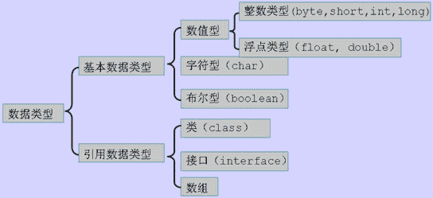

# 京东 2016 实习生招聘笔试真题-技术岗位选择题 B

## 1

对于语句 NSString*obj = [[NSData alloc] init]; obj 在编译时和运行时分别时什么类型的对象？

正确答案: A   你的答案: 空 (错误)

```cpp
编译时是 NSString 的类型；运行时是 NSData 类型的对象
```

```cpp
编译时是 NSString 的类型；运行时是 NSString 类型的对象
```

```cpp
编译时是 NSData 的类型；运行时是 NSString 类型的对象
```

```cpp
编译时是 NSData 的类型；运行时是 NSData 类型的对象
```

本题知识点

iOS

讨论

[3kna1j](https://www.nowcoder.com/profile/541130640)

编译看左边，运行看右边。

发表于 2021-02-22 17:43:41

* * *

[小满哥哥](https://www.nowcoder.com/profile/157021444)

这道题的**星号**、**动态内存****没学过**也能做对！比如说自定义类创建对象时，People p = new People()，的“内存演示”相信大家在 b 站网课都听到过。p 在【栈内存】，new 的在【堆内存】；栈内存只是个【引用（地址）】，堆内存是实际的【对象存储空间】【通过类比迁移】栈内存的东西肯定是编译时通过，实际 new 的对象类型肯定在堆内存。故：NSString 是编译通过的，（alloc 在 C 语言是动态内存分配，在 Java 肯定一样，很容易想到是自动创建对象），所以堆内存的 NSData 是堆内存、实际创建的对象。当然，我说的这些也是“**编译看左、运行看右**”的本质**原因**。

编辑于 2021-03-31 21:59:48

* * *

[梦境迷离](https://www.nowcoder.com/profile/759736)

java 表示全靠意 Y

发表于 2018-02-18 13:35:33

* * *

## 2

下面的代码段,第一个 str 的 retainCount 是多少？第二个和第三个呢？
=======================================================
NSMutableArray* ary = [[NSMutableArray array] retain];
NSString *str = [NSString stringWithFormat:@"test"];
[strretain];
[aryaddObject:str];
NSLog(@"%@%d",str,[str retainCount]);
[strretain];
[strrelease];
[strrelease];
NSLog(@"%@%d",str,[str retainCount]);
[aryremoveAllObjects];
NSLog(@"%@%d",str,[str retainCount]);
=======================================================

正确答案: A   你的答案: 空 (错误)

```cpp
321
```

```cpp
210
```

```cpp
432
```

```cpp
320
```

本题知识点

京东 2016 iOS

讨论

[梗大萌](https://www.nowcoder.com/profile/8863300)

======================================================= 
NSMutableArray* ary = [[NSMutableArray array] retain];     
NSString *str = [NSString stringWithFormat:@"test"];     // str retainCount：1
[strretain]; / / str retainCount：2
[aryaddObject:str];  / / str retainCount：3，因为 str 引用的对象在 ary 内部又多了一份引用 NSLog(@"%@%d",str,[str retainCount]); 
[strretain];  / / str retainCount：4
[strrelease];  / / str retainCount：3
[strrelease];  / / str retainCount：2
NSLog(@"%@%d",str,[str retainCount]); 
[aryremoveAllObjects];  / / str retainCount：1
NSLog(@"%@%d",str,[str retainCount]); 
=======================================================PS：楼上编译优化效果？不懂求解

发表于 2017-04-05 19:01:05

* * *

[搬砖小猪仔](https://www.nowcoder.com/profile/237105333)

蒙了一个 A🤔

发表于 2021-02-24 19:01:00

* * *

[阿要理](https://www.nowcoder.com/profile/434646596)

没人会啊？

发表于 2021-03-08 18:55:05

* * *

## 3

判断是否为 iPad 设备语句是？

正确答案: C   你的答案: 空 (错误)

```cpp
if ([[UIDevice currentDevice] userInterfaceIdiom] == UIUserInterfaceIdiomPhone) {...}
```

```cpp
if ([[UIDevice currentDevice] userInterfaceIdiom] != UIUserInterfaceIdiomPhone) {...}
```

```cpp
if ([[UIDevice currentDevice] userInterfaceIdiom] == UIUserInterfaceIdiomPad) {…}
```

```cpp
if ([[UIDevice currentDevice] userInterfaceIdiom] !== UIUserInterfaceIdiomPad) {…}
```

本题知识点

C++工程师 Java 工程师 京东 2016 iOS

讨论

[牛客 630169 号](https://www.nowcoder.com/profile/630169)

说实话，如果不是看答案，答题的时候选项都显示不全

发表于 2021-07-16 10:25:46

* * *

[侯康](https://www.nowcoder.com/profile/6110031)

看清题即可

发表于 2017-09-24 10:49:12

* * *

## 4

在 Android 提供的 Activity 生命周期方法中，如果清理和保存状态信息，则最迟必须在哪个函数中完成（ ）

正确答案: B   你的答案: 空 (错误)

```cpp
OnRestart
```

```cpp
OnPause
```

```cpp
OnStop
```

本题知识点

C++工程师 Java 工程师 京东 2016

讨论

[小乌](https://www.nowcoder.com/profile/477630)

onStop，才是最迟的吧

发表于 2017-03-06 14:48:17

* * *

[wanlanwalan](https://www.nowcoder.com/profile/7952866)

onPause():Activity 被暂停时调用，也就是你要对你能看到的这个 Activity 说 byebye 的时候调用,这里可以做一些清理和保存工作

发表于 2017-06-04 21:03:44

* * *

## 5

在 Android 中，如果通过开启另外一个线程从网络中获取数据，则数据获取完毕后，要销毁该线程，应该使用（ ）方法

正确答案: C   你的答案: 空 (错误)

```cpp
onFinish()
```

```cpp
onClear()
```

```cpp
onDestroy()
```

```cpp
onStop()
```

本题知识点

C++工程师 Java 工程师 京东 2016 Android

讨论

[策码奔腾](https://www.nowcoder.com/profile/1509945)

为什么会是 onDestroy()？？在下搞不懂，有没有大神可以出来解答一下？我在网上查的是 3 种，线程一般都是因为 run()里面有不断的循环，那么可以采用如下的 3 种方法 1.使用自己定义的一个标志，比如说定了一个布尔型变量 isRun=true，当 isRun==false 时，则结束 run()中的循环，就可以结束 run()方法，从而结束线程。2.根据 isInterrupted()来判断线程的 interrupt()方法是否有被调用，如果有，则推出。3.使用 Thread.stop()，但是文档都不推荐使用这个方法，，因为这个方法很容易发生一些意想不到的错误。

发表于 2017-04-05 23:15:52

* * *

[因何弹剑](https://www.nowcoder.com/profile/944152264)

略有歧义，可以理解成在 activity 开线程的场景，也可以理解 f 在 fragment 中开线程的场景，还可以理解为 asyntask 开线程的场景，这种题还是直接 show me code 为妙

发表于 2021-04-05 11:01:08

* * *

[有只 BB 熊](https://www.nowcoder.com/profile/948900629)

京东出题***，销毁变量，不销毁也是自动回收，执行完毕也不一定在

```cpp
onDestroy() 销毁啊，随时都可以。
```

发表于 2021-04-01 10:23:01

* * *

## 6

在相对布局中，如果要将 B 控件放在 A 控件的下方，则应该设置（ ）属性

正确答案: D   你的答案: 空 (错误)

```cpp
android:layout_bottom
```

```cpp
android:layout_alignBottom
```

```cpp
android:layout_alignParentBotton
```

```cpp
android:layout_below
```

本题知识点

C++工程师 Java 工程师 京东 2016 Android

讨论

[beautiful11](https://www.nowcoder.com/profile/1085025)

疏忽了。

发表于 2017-03-08 21:00:16

* * *

[華麗麗](https://www.nowcoder.com/profile/1450277)

align 对齐 layout_alignBottom 本元素下边缘和指定元素的下边缘对齐 layout_alignParentBottom 是否显示在容器底部 layout_below 在指定元素下方

发表于 2021-06-15 09:39:23

* * *

[五月 Lucy](https://www.nowcoder.com/profile/2911311)

android:layout_below 将该控件的底部置于给定 ID 的控件之下; 

发表于 2017-03-21 15:45:11

* * *

## 7

在表格布局中，从 0 开始计数，如果要将第三列自动拉伸填充空白部分，下列设置正确的是（ ）

正确答案: C   你的答案: 空 (错误)

```cpp
android:shrinkColums="2"
```

```cpp
android:shrinkColums="3"
```

```cpp
android:stretchColums="2"
```

```cpp
android:stretchColums="3"
```

本题知识点

C++工程师 Java 工程师 京东 2016 Android

讨论

[策码奔腾](https://www.nowcoder.com/profile/1509945)

android:stretchColumns 设置可伸展的列。该列可以向行方向伸展，最多可占据一整行。 android:shrinkColumns 设置可收缩的列。当该列子控件的内容太多，已经挤满所在行，那么该子控件的内容将往列方向显示。 android:collapseColumns 设置要隐藏的列。示例： android:stretchColumns="0" 第 0 列可伸展 android:shrinkColumns="1,2" 第 1,2 列皆可收缩 android:collapseColumns="*" 隐藏所有行注意：列可以同时具备 stretchColumns 及 shrinkColumns 属性，若此，那么当该列的内容 N 多时，将“多行”显示其内容。（这里不是真正的多行，而是系统根据需要自动调节该行的 layout_height）

发表于 2017-04-05 23:30:52

* * *

[杨啸](https://www.nowcoder.com/profile/311885356)

原来真的有第 0 列这个说法，大意了

发表于 2021-02-27 09:54:21

* * *

[侯康](https://www.nowcoder.com/profile/6110031)

好气，从 0 开始的

发表于 2017-09-24 10:51:48

* * *

## 8

SSH MVC 开发模式说法正确的是（ ）

正确答案: B   你的答案: 空 (错误)

```cpp
Struts 进行业务流转
```

```cpp
Hibernate 进行数据库操作的封装
```

```cpp
Spring 进行流程控制
```

```cpp
其他选项均不正确
```

本题知识点

C++工程师 Java 工程师 京东 2016 Java

讨论

[五月 Lucy](https://www.nowcoder.com/profile/2911311)

MVC 的处理过程：首先控制器接受用户的请求，调用相应的模型来进行业务处理，并返回数据给控制器。控制器调用相应的视图来显示处理的结果，并通过视图呈现给用户。Struts 主要控制逻辑关系的处理  Spring  是一个轻量级的控制反转 (IoC) 和面向切面 (AOP) 的容器框架 Hibernate 是数据持久化层 , 是一种新的对象、关系的映射工具 , 提供了从 Java 类到数据表的映射，也提供了数据查询和恢复等机制

发表于 2017-03-21 15:51:23

* * *

[名字容我想想](https://www.nowcoder.com/profile/5166217)

Struts 属于控制层 C，负责流程控制，即对模型层 M 和视图层 V 的连接，Spring 负责业务流转，即中间跑腿的，控制整个框架的管理，Hibernate 属于模型层，进行数据库操作的封装

发表于 2017-02-25 11:47:54

* * *

[IDEA2022.4.2](https://www.nowcoder.com/profile/181223548)

A 选项和 C 选项相互说反了

发表于 2021-03-10 09:06:23

* * *

## 9

下面关于 Promise 的 all 方法说法错误的是（ ）

正确答案: D   你的答案: 空 (错误)

```cpp
promise.all(iterable)，参数是一个数组
```

```cpp
只有这个数组中的所有 promise 实例都 resolve 之后才会触发其返回的 promise 实例的 then
```

```cpp
只要其中有任何一个 promise 实例被 reject，那么最终的 promise 实例将触发 catch
```

```cpp
触发 then 时可以只带上 iterable 参数中的部分值，也可以带所有值。
```

本题知识点

C++工程师 Java 工程师 京东 2016 Javascript

讨论

[名字容我想想](https://www.nowcoder.com/profile/5166217)

iterable 是一个全部为 promise 对象的数组，只要数组中有一个 promise 实例被 reject，那么最终的 promise 触发 catch，只有数组中全部 promise 实例都 resolve 才会触发 then，并且要带上 iterable 中全部 promise，其中 promise 实例将会被结果代替

发表于 2017-02-25 12:13:23

* * *

[姓肖名启航丶](https://www.nowcoder.com/profile/758118448)

该题目有误，A 选项是错误的，Promise.all() 方法接收一个 promise 的 iterable 类型（注：Array，Map，Set 都属于 ES6 的 iterable 类型）的输入，并且只返回一个[Promise](https://developer.mozilla.org/zh-CN/docs/Web/JavaScript/Reference/Global_Objects/Promise)实例

发表于 2021-05-11 23:56:35

* * *

[Thesunkomorebi](https://www.nowcoder.com/profile/64880475)

[Promise.all(iterable)](https://developer.mozilla.org/zh-CN/docs/Web/JavaScript/Reference/Global_Objects/Promise/all)这个方法返回一个新的 promise 对象，**该 promise 对象在 iterable 参数对象里所有的 promise 对象都成功的时候才会触发成功**，一旦有任何一个 iterable 里面的 promise 对象失败则立即触发该 promise 对象的失败。这个新的 promise 对象在触发成功状态以后**，会把一个包含 iterable 里所有 promise 返回值的数组作为成功回调的返回值**，顺序跟 iterable 的顺序保持一致；如果这个新的 promise 对象触发了失败状态，它会把 iterable 里第一个触发失败的 promise 对象的错误信息作为它的失败错误信息。Promise.all 方法常被用于处理多个 promise 对象的状态集合。-----MDN

编辑于 2021-07-20 08:57:07

* * *

## 10

在下列 Promise 所提供的方法中，用来向成功或者失败的回调函数队列中添加回调函数的是（ ）

正确答案: D   你的答案: 空 (错误)

```cpp
done
```

```cpp
fail
```

```cpp
always
```

```cpp
then
```

本题知识点

C++工程师 Java 工程师 京东 2016 Javascript

讨论

[清衣](https://www.nowcoder.com/profile/757493159)

失败了也去 then？

发表于 2021-08-26 21:26:37

* * *

[名字容我想想](https://www.nowcoder.com/profile/5166217)

then: 分别向 doneList 和 failList 中添加回调函数

always: 添加一个无论成功还是失败都会调用的回调函数所以 then 和 always 有什么区别呢

发表于 2017-02-25 12:16:40

* * *

## 11

关于 SPSS 的特点说法不正确的是（ ）

正确答案: A   你的答案: 空 (错误)

```cpp
SPSS 是为了广大专业人士设计的
```

```cpp
SPSS 集数据录入、资料编辑、数据管理、统计分析、报表制作、图形绘制于一体
```

```cpp
SPSS 界面友好，很容易上手
```

```cpp
SPSS 可以保住数学公里不够的使用者学习运用现代统计技术
```

本题知识点

C++工程师 Java 工程师 京东 2016 数据分析工具/软件

讨论

[公众号:重温新知](https://www.nowcoder.com/profile/126819)

SPSS （Statistical Product and Service Solutions），“统计产品与服务解决方案”软件 ** 详见百度百科****产品特点：**

操作简便、编程方便、功能强大、数据接口、模块组合、针对性强（SPSS 针对初学者、熟练者及精通者都比较适用）

发表于 2017-04-06 15:14:15

* * *

## 12

下面关于 SPSS 的说法错误的是（ ）

正确答案: D   你的答案: 空 (错误)

```cpp
SPSS 是世界上最早采用图形菜单驱动界面的统计软件，它最突出的特点就是操作界面极为友好，输出结果美观漂亮
```

```cpp
SPSS for Windows 是一个组合式软件包，它集数据录入、整理、分析功能于一身
```

```cpp
SPSS 采用类似 EXCEL 表格的方式输入与管理数据，数据接口较为通用，能方便的从其他数据库中读入数据
```

```cpp
与 Office 完全兼容
```

本题知识点

C++工程师 Java 工程师 京东 2016 数据分析工具/软件

讨论

[萨菲娜](https://www.nowcoder.com/profile/5657438)

SPSS 输出结果虽然漂亮,但是很难与一般办公软件如 Office 或是 WPS2000 直接兼容,如不能用 Excel 等常用表格处理软件直接打开,只能采用拷贝、粘贴的方式加以交互。

发表于 2017-08-17 15:03:39

* * *

## 13

办公室的一台计算机只能使用 IP 地址而无法使用域名访问外部网站，造成这种情况的原因不可能是（ ）

正确答案: B   你的答案: 空 (错误)

```cpp
该计算机设置的 DNS 服务器没有提供正常域名解析服务
```

```cpp
该计算机与 DNS 服务器不在同一子网
```

```cpp
提供被访问服务器名字解析的 DNS 服务器有故障
```

```cpp
该计算机发起的目的端口为 53 的访问请求被限制
```

本题知识点

C++工程师 Java 工程师 京东 2016 网络基础

讨论

[SuRe28](https://www.nowcoder.com/profile/9432522)

这种情况应该是 DNS 服务器故障或配置不正确。可能是该计算机设置的 DNS 服务器没有提供正常域名解析服务，也可能是提供被访问服务器名字解析的 DNS 服务器有故障。端口号为 53 的访问请求是 DNS 访问请求，被限制也会引起域名解析故障。计算机与 DNS 服务器在不在一个子网不影响域名解析。

发表于 2017-07-18 15:25:28

* * *

[陈俊斌](https://www.nowcoder.com/profile/4253918)

牛客网的题库是越来越差了

发表于 2021-02-22 23:38:21

* * *

[名字容我想想](https://www.nowcoder.com/profile/5166217)

主要是 DNS 域名解析问题，53 号是 DNS 请求访问，被限制的话会引起无法域名解析。计算机和 DNS 不在同一子网不会影响解析

发表于 2017-02-25 12:23:45

* * *

## 14

Cisco 防火墙能够进行口令恢复等操作的模式是（ ）

正确答案: C   你的答案: 空 (错误)

```cpp
用户模式
```

```cpp
特权模式
```

```cpp
监视模式
```

```cpp
配置模式
```

本题知识点

C++工程师 Java 工程师 京东 2016 网络基础

讨论

[名字容我想想](https://www.nowcoder.com/profile/5166217)

在监视模式下可以对防火墙进行一些底层操作，配置模式下可进行所有配置操作，特权模式可进行防火墙的管理和查看，用户即非特权模式只能对防火墙简单查看

发表于 2017-02-25 12:29:17

* * *

[wanlanwalan](https://www.nowcoder.com/profile/7952866)

防火墙的访问模式有非特权模式、特权模式、配置模式和监视模式四种，其中监视模式下可以进行操作系统映像更新和口令恢复等操作。

发表于 2017-06-04 21:05:44

* * *

## 15

Cisco 路由器用于查看路由表信息的命令是（ ）

正确答案: C   你的答案: 空 (错误)

```cpp
show router
```

```cpp
show route
```

```cpp
show ip route
```

```cpp
display ip route
```

本题知识点

C++工程师 Java 工程师 京东 2016 网络基础

讨论

[wanlanwalan](https://www.nowcoder.com/profile/7952866)

CISCO 路由器的基本配置命令
查看端口信息：
Router>showinterface
查看路由表信息：
Router>show iproute
查看路由器的版本信息和硬件配置信息：
Router>showversion
特权模式下，查看路由器 NVRAM 中备份的配置文件内容：
Router # showstartup-config
在特权模式下，查看路由器当前配置文件的信息：
Router #showrunning-config
注：NVRAM 中的配置信息和当前配置信息的区别在于，当前配置信息是放在路由器随机存取储存器（RAM）中运行的配置文件，在路由器复位时会丢失；而 NVRAM 中的配置信息是保存在路由器的非易失性（NVRAM）存储器中，在路由器复位时也不会丢失。

发表于 2017-06-04 21:06:45

* * *

[Idiot320](https://www.nowcoder.com/profile/4115175)

```cpp
show run//看运行状况
show ip route//看路由表 show int//看断口*
show ip int br//看端口 ip 地址 show cdp nei//察看 cdp 邻居
show ip pro//察看 ip 协议
```

发表于 2017-03-09 20:00:53

* * *

## 16

不同系列的机器之间，实现软件移植途径不包括（)

正确答案: B   你的答案: 空 (错误)

```cpp
用统一的高级语言
```

```cpp
用统一的汇编语言
```

```cpp
模拟
```

```cpp
仿真
```

本题知识点

C++工程师 Java 工程师 京东 2016 编译和体系结构

讨论

[hInstance](https://www.nowcoder.com/profile/1681172)

汇编语言通常都和主板、体系结构等有关，是可移植性最差的。不存在什么统一的汇编语言。

发表于 2017-02-27 17:04:29

* * *

[wanlanwalan](https://www.nowcoder.com/profile/7952866)

汇编语言的可移植性最差

发表于 2017-06-04 21:07:31

* * *

[ご一粒沙尘/ty](https://www.nowcoder.com/profile/6660514)

B 不同的机器对应的汇编指令不一样 因此不能用统一的汇编语言

发表于 2017-02-27 11:39:34

* * *

## 17

能实现作业、任务级并行的异构型多处理机属（ ）

正确答案: C   你的答案: 空 (错误)

```cpp
MISD
```

```cpp
SIMD
```

```cpp
MIMD
```

```cpp
SISD
```

本题知识点

C++工程师 Java 工程师 京东 2016 编译和体系结构

讨论

[名字容我想想](https://www.nowcoder.com/profile/5166217)

MIMD 多指令流多数据流，可多个控制器异步控制多个处理器，实现异步并行。SIMD 单指令流多数据流。MISD 多指令流单数据流，即流水线处理

发表于 2017-02-25 12:50:20

* * *

## 18

多处理机中在先的程序段 1 种的指令 C 正确答案: B   你的答案: 空 (错误)

```cpp
RAW 数据相关
```

```cpp
WAR 数据相关
```

```cpp
RAR 数据相关
```

```cpp
VAR 数据相关
```

本题知识点

C++工程师 Java 工程师 京东 2016 编译和体系结构

讨论

[名字容我想想](https://www.nowcoder.com/profile/5166217)

WAR 先读后写；RAW 先写后读；RAR 先读后读；WAW 先写后写

发表于 2017-02-25 12:55:36

* * *

[蘅芜君](https://www.nowcoder.com/profile/6377410)

先读取 A 中信息，再向 A 中写入信息。

发表于 2017-04-06 11:06:46

* * *

## 19

用于虚拟存储器页面替换，且为堆栈型的算法是:

正确答案: D   你的答案: 空 (错误)

```cpp
随机法
```

```cpp
相连目录表法
```

```cpp
比较对法
```

```cpp
近期最久未用法
```

本题知识点

C++工程师 Java 工程师 京东 2016 操作系统

讨论

[turbo_7](https://www.nowcoder.com/profile/8020604)

这里所说的堆栈型替换算法不是指某一种算法，而是指一类算法，更不是指采用先进先出或先进后出方式工作的堆栈本身。那么，什么是堆栈型替换算法呢？它定义如下：对任意一个程序的页地址流作两次主存页面数分配，分别分配 m 个和 n 个主存页面，并且有 m≤n。如果在任何时刻 t，主存页面数集合 Bt 都满足关系：Bt（m）í Bt（n），则这类算法称为堆栈型替换算法。简单地说，堆栈型算法的基本思想是：随着分配给程序的主存页面数增加，主存的命中率也提高，至少不下降。对于 LFU 算法和 LRU 算法，由于在主存中保留的是最近使用过的页面。如果先给某一个程序分配 n 个主存页面，那么在 t 时刻，这 n 个主存页面都是最近使用过的页面。如果再给这个程序多分配一个主存页面，那么在 t 时刻，这 n＋1 个主存页面也都是最近使用过的页面。因此，在这 n＋1 个主存页面中必然包含了前面的 n 个主存页面。所以，LFU 算法和 LRU 算法都是堆栈型算法。

发表于 2017-07-25 15:32:26

* * *

[名字容我想想](https://www.nowcoder.com/profile/5166217)

近期最久未用法需要寄存器或栈的支持

发表于 2017-02-25 13:10:21

* * *

## 20

软件设计中划分模块的一个准则是

正确答案: C   你的答案: 空 (错误)

```cpp
低内聚低耦合
```

```cpp
低内聚高耦合
```

```cpp
高内聚低耦合
```

```cpp
高内聚高耦合
```

本题知识点

C++工程师 Java 工程师 京东 2016

讨论

[ご一粒沙尘/ty](https://www.nowcoder.com/profile/6660514)

正确答案：C 软件设计中模块划分应遵循的准则是：[高内聚低耦合](https://www.baidu.com/s?wd=%E9%AB%98%E5%86%85%E8%81%9A%E4%BD%8E%E8%80%A6%E5%90%88&tn=44039180_cpr&fenlei=mv6quAkxTZn0IZRqIHckPjm4nH00T1YkPj0vuym1nWc3uWbvnW-W0ZwV5Hcvrjm3rH6sPfKWUMw85HfYnjn4nH6sgvPsT6KdThsqpZwYTjCEQLGCpyw9Uz4Bmy-bIi4WUvYETgN-TLwGUv3EnHR1rHm1PWT1rjb4nWTkn1mzPs)。内聚是从功能角度来度量模块内的联系，一个好的内聚模块应当恰好做一件事。它描述的是模块内的功能联系；耦合是软件结构中各模块之间相互连接的一种度量，耦合强弱取决于模块间接口的复杂程度、进入或访问一个模块的点以及通过接口的数据。

编辑于 2017-02-27 11:41:46

* * *

[wanlanwalan](https://www.nowcoder.com/profile/7952866)

软件设计中模块划分应遵循的准则是： [**高内聚低耦合**](http://www.baidu.com/s?wd=%E9%AB%98%E5%86%85%E8%81%9A%E4%BD%8E%E8%80%A6%E5%90%88&tn=44039180_cpr&fenlei=mv6quAkxTZn0IZRqIHckPjm4nH00T1YkrHFhnhnLmHfznW03PW030ZwV5Hcvrjm3rH6sPfKWUMw85HfYnjn4nH6sgvPsT6KdThsqpZwYTjCEQLGCpyw9Uz4Bmy-bIi4WUvYETgN-TLwGUv3EnHR1rHm1PWT1rjb4nWTkn1mzPs) **。**

内聚是从功能角度来度量模块内的联系，一个好的内聚模块应当恰好做一件事。它描述的是模块内的功能联系；

耦合是软件结构中各模块之间相互连接的一种度量，耦合强弱取决于模块间接口的复杂程度、进入或访问一个模块的点以及通过接口的数据。

发表于 2017-06-04 21:08:20

* * *

## 21

分析下面的 HTML 代码段，该页面在浏览器中的显示效果为( )


正确答案: B   你的答案: 空 (错误)

```cpp
从左向右滚动显示“Welcome!”
```

```cpp
从右向左滚动显示“Welcome!”
```

```cpp
从上向下滚动显示“Welcome!”
```

```cpp
从下向上滚动显示“Welcome!”
```

本题知识点

C++工程师 Java 工程师 京东 2016 HTML

讨论

[不精通 JavaScript 不罢休](https://www.nowcoder.com/profile/146346458)

我就显示一个  Welcome!     我看**呢？？？？？？

发表于 2020-08-11 23:19:37

* * *

[zhisheng_blog](https://www.nowcoder.com/profile/616717)

厉害了，我这题竟然蒙对了

发表于 2017-05-12 20:33:10

* * *

[YiBuLZ](https://www.nowcoder.com/profile/7947314)

分析下面的 HTML 代码段，该页面在浏览器中的显示效果为(      )     

```cpp
<HTML> 
<body> 
   <marquee scrolldelay="300" direction="left">Welcome!</marquee> 
</body> 
</HTML>
```

发表于 2017-03-30 18:04:35

* * *

## 22

语句 for($k=0;$k=1;$k++);
和语句 for($k=0;$k==1;$k++);
执行的次数分别是:

正确答案: A   你的答案: 空 (错误)

```cpp
无限和 0
```

```cpp
0 和无限
```

```cpp
都是无限
```

```cpp
都是 0
```

本题知识点

C++工程师 Java 工程师 京东 2016 编程基础 *讨论

[zhisheng_blog](https://www.nowcoder.com/profile/616717)

第一个 for 中：k = 1  为赋值语句，所以可以无限次执行第二个 for 语句：k = 0 当判断 k == 1 时，为 false ，就不执行 for 方法体了，所以为 0 次

发表于 2017-05-12 20:35:43

* * *

[木林 seng](https://www.nowcoder.com/profile/3994541)

第一个停止循环条件是 k=1,表示 k 被赋值为 1,所以没有任何停止循环的条件，循环会一直执行；第二个停止循环的条件是 k==1,由于 k 初始是被赋值为 0，所以 k 等于 1 的条件不成立，因此不会执行循环

发表于 2017-04-04 01:14:10

* * *

[公众号:重温新知](https://www.nowcoder.com/profile/126819)

我想问一下哈，这道题考查的是那种语言

发表于 2017-04-06 15:23:38

* * *

## 23

下面程序的运行结果为？（ ）

```cpp
$a=“thiz”;
function change(&$a)
{
$a.=“linux”;
}
change($a);
echo $a;
?>
```

正确答案: C   你的答案: 空 (错误)

```cpp
thiz
```

```cpp
linux
```

```cpp
thizlinux
```

```cpp
空
```

本题知识点

C++工程师 Java 工程师 京东 2016 PHP

讨论

[远山稀客](https://www.nowcoder.com/profile/5518935)

在 PHP 中，  **.=  ** 运算符表示  累积

发表于 2017-03-08 22:22:08

* * *

[梦境迷离](https://www.nowcoder.com/profile/759736)

**php 度来了，这套卷子 有 java 安卓 ios php 

发表于 2018-02-18 13:40:30

* * *

[易水人去](https://www.nowcoder.com/profile/7072715)

&$a 传引用

发表于 2017-03-20 09:26:23

* * *

## 24

如果没有为 Cookie 指定失效时间，则设置的 Cookie 将在何时失效？（ ）

正确答案: C   你的答案: 空 (错误)

```cpp
关机时
```

```cpp
下次访问该网站时
```

```cpp
结束当前会话时
```

```cpp
访问另一个网站时
```

本题知识点

C++工程师 Java 工程师 京东 2016 软件工程

讨论

[zhisheng_blog](https://www.nowcoder.com/profile/616717)

*   如果**不设置过期时间**，则表示这个 cookie 生命周期为浏览器会话期间，**只要关闭浏览器窗口，cookie 就消失了**。这种生命期为浏览会话期的 cookie 被称为会话 cookie。会话 cookie 一般不保存在硬盘上而是保存在内存里。
*   如果**设置了过期时间**，浏览器就会把 cookie 保存到硬盘上，**关闭后再次打开浏览器，这些 cookie 依然有效直到超过设定的过期时间**。

发表于 2017-05-12 20:39:30

* * *

[wanlanwalan](https://www.nowcoder.com/profile/7952866)

cookie 有失效日期－－expires，如果还没有过失效期，即使重新启动电脑，cookie 仍然不会丢失，如果没有指定 expires 值，那么在关闭浏览器时，cookie 即失效。  

发表于 2017-06-04 21:09:11

* * *

## 25

执行下面的代码后，
echo function_exists('print');
?>
得到的输出是：

正确答案: A   你的答案: 空 (错误)

```cpp
空
```

```cpp
TRUE
```

```cpp
FALSE
```

本题知识点

C++工程师 Java 工程师 京东 2016 PHP

讨论

[书旅](https://www.nowcoder.com/profile/7816080)

大家都知道 function_exits()是用来判断一个函数是否存在，而 print 它并不是一个函数，而是一个语言结构，大家可以在 php 手册上边查一下上边对 print 的介绍

发表于 2017-05-12 09:34:03

* * *

[阳光满溢 1](https://www.nowcoder.com/profile/8144276)

A。空的，输出了下确实什么都没有

发表于 2017-05-16 21:07:27

* * *

[牛客 53074176 号](https://www.nowcoder.com/profile/53074176)

Echo 看不到吧，vardump 试试

发表于 2021-03-25 17:13:12

* * *

## 26

下面代码加入下面那个函数后返回 TRUE:
return ? == 'A';

正确答案: B   你的答案: 空 (错误)

```cpp
ord(65)
```

```cpp
chr(65)
```

```cpp
65+''
```

```cpp
'+65
```

本题知识点

C++工程师 Java 工程师 京东 2016 C 语言 编程基础 *讨论

[名字容我想想](https://www.nowcoder.com/profile/5166217)

ord 是将字符串首字母转换成 ascii 值； chr 将 ascii 转换成字母

发表于 2017-02-25 13:23:32

* * *

[兜兜里的 _ 糖儿呀](https://www.nowcoder.com/profile/2482411)

C 选项：不用加‘ ’，即 return 65==‘A’ 就可以返回 true

发表于 2017-03-01 16:28:03

* * *

[牛壮壮](https://www.nowcoder.com/profile/764544521)

ord 是将字符串首字母转换成 ascii 值； chr 将 ascii 转换成字母

发表于 2021-09-06 10:45:50

* * *

## 27

若表单提交时采用的是 Get 方法，则服务器端要获得表单所提交的数据，应采用：

正确答案: B   你的答案: 空 (错误)

```cpp
Request.Form(”表单域名”)
```

```cpp
Request.QueryString(”表单域名”)
```

```cpp
Response.Form(”表单域名”)
```

```cpp
Response.QueryString(”表单域名”)
```

本题知识点

C++工程师 Java 工程师 京东 2016 软件工程

讨论

[名字容我想想](https://www.nowcoder.com/profile/5166217)

GET：request.QueryString（“表单域名”）;

POST：request.Form.GET（“表单域名”）

request["表单域名"]两者均可

发表于 2017-02-25 13:29:39

* * *

[星期四的佩琪](https://www.nowcoder.com/profile/2235018)

asp 也来了，日了狗，这真的是 java 卷子吗，赶紧撤了吧

发表于 2018-04-09 12:19:58

* * *

## 28

设有以下函数
int f(int a, char * b) {„„}
则下面对函数指针的定义和赋值错误的是（ ）

正确答案: B C D   你的答案: 空 (错误)

```cpp
int (*p)(int, char*); p=f;
```

```cpp
int *p(); p=f;
```

```cpp
int (*)p(); p=&f;
```

```cpp
int *p(int, char);p=&f;
```

本题知识点

C 语言

讨论

[永恒之蓝。](https://www.nowcoder.com/profile/237925459)

函数是有地址的,但是写不写&都可以,同样,调用的时候写不写*都可以(这是由于兼容性等历史原因,有人称之为矛盾的和谐)

发表于 2021-02-26 14:50:36

* * *

[Idiot320](https://www.nowcoder.com/profile/4115175)

函数指针的定义格式为函数类型(*指针变量名)(形参列表)

发表于 2017-03-09 20:31:21

* * *

[薛定谔的猫的朋友](https://www.nowcoder.com/profile/8823523)

测试了，int (*p)(int, char *);
p = f; 和 p = &f; 都可以

发表于 2017-03-20 22:18:58

* * *

## 29

设有定义：char *p;，以下选项中不能正确将字符串赋值给字符型指针 p 的语句是（ ）

正确答案: A B D   你的答案: 空 (错误)

```cpp
p=getchar();
```

```cpp
scanf("%s",p);
```

```cpp
char s[]="china"; p=s;
```

```cpp
*p="china";
```

本题知识点

C 语言

讨论

[Jerry4me](https://www.nowcoder.com/profile/9794511)

A 选项 : 首先类型就不匹配 B 选项 : p 指针在定义的时候没有分配内存, 所以这行代码在运行的时候会报野指针错误 C 选项 : 正确, 指针 p 指向数组 sD 选项 : *p 代表 p 指向内存的内容, 这里要使用 p="china"才正确

编辑于 2017-04-06 12:11:41

* * *

[TTangled](https://www.nowcoder.com/profile/315886284)

害，选了 C🙃

发表于 2021-03-09 11:08:10

* * *

[公众号:重温新知](https://www.nowcoder.com/profile/126819)

对参与解答的大神答案总结一下：**A 选项 :错误。 首先类型就不匹配，** **getchar() 函数返回值是 int，只能赋值给 int 或者 char 类型，此时 p 为 char*类型****B 选项 : ** **错误。** **p 指针在定义的时候没有分配内存, 所以这行代码在运行的时候会报野指针错误****C 选项 : 正确。 指针 p 指向数组 s****D 选项 :** **错误。** ** *p 代表 p 指向内存的内容, 这里要使用 p="china"才正确**

发表于 2017-04-06 15:31:49

* * *

## 30

设有以下定义

```cpp
union d 
{ int d1; float d2; }d; 
```

则下面叙述中正确的是（ ）

正确答案: A B   你的答案: 空 (错误)

```cpp
变量 d 与各成员的地址相同
```

```cpp
d.d1 和 d.d2 具有相同的地址
```

```cpp
若给 d.d2 赋 10 后,d.d1 中的值是 10
```

```cpp
若给 d.d1 赋 10 后,d.d2 中的值是 10
```

本题知识点

C 语言

讨论

[牛客 738157 号](https://www.nowcoder.com/profile/738157)

答案是：AB。虽然 d1，d2 地址相同，但存储的是二进制，浮点型的 10 和整型的 10，二进制是不同的，所以读取出来的结果也是不同的

发表于 2017-02-20 10:50:56

* * *

[公众号:重温新知](https://www.nowcoder.com/profile/126819)

这个叫联合体，也叫共用体！想想**“共用”** 这俩字，本题答案昭然若揭

发表于 2017-04-06 15:33:57

* * *

[奋斗小强吧](https://www.nowcoder.com/profile/324744938)

这题思路应该是：共用体中只能存在一个值，如果给某个值赋值后，另一个值就不存在

发表于 2020-09-02 16:08:36

* * *

## 31

下面说法正确的有（ ）

正确答案: A C D   你的答案: 空 (错误)

```cpp
字符串是一种对象
```

```cpp
字符串是一种基本数据类型
```

```cpp
字符串是一种数据类型
```

```cpp
字符串是一种引用数据类型
```

本题知识点

C++工程师 Java 工程师 京东 2016 字符串 *讨论

[larrysea](https://www.nowcoder.com/profile/5430709)

答案是 ACD  String 是一个对象，基本数据类型在 java 中只有八种着八种基本数据类型是基本的值类型，除此以外都是引用类型，int long short double float char byte bool ，如图所示。

发表于 2017-02-19 21:34:09

* * *

[zhisheng_blog](https://www.nowcoder.com/profile/616717)

String 类型是数据类型，但不是基本数据类型，八大基本类型中没有 String 

发表于 2017-05-12 20:46:25

* * *

[恶寒轻轻](https://www.nowcoder.com/profile/433179702)

除了基本数据类型，其他都是引用数据类型

发表于 2021-11-19 10:53:40

* * *

## 32

下列说法正确的有（ ）

正确答案: A   你的答案: 空 (错误)

```cpp
在类的一般方法中可用 this 来调用本类的属性
```

```cpp
在类的静态方法中可以访问本类中的属性
```

```cpp
在类方法中绝对不能调用实例方法
```

```cpp
在类方法中只能调用本类中的类方法
```

本题知识点

C++

讨论

[HouJian](https://www.nowcoder.com/profile/5255423)

C++中，若类的方法前加了 static 关键字，则该方法称为静态方法，反之为实例方法。静态方法为类所有，可以通过对象来使用，也可以通过类来使用。但一般提倡通过类名来使用，因为静态方法只要定义了类，不必建立类的实例就可使用。静态方法只能调用静态变量。

发表于 2020-10-23 19:33:23

* * *

[长沙吴奇隆](https://www.nowcoder.com/profile/777731)

答案有问题，应该选 A

发表于 2017-02-24 09:40:33

* * *

[weeznn_Hao](https://www.nowcoder.com/profile/9610754)

明确一个概念，类的属性和方法都是 static 的，非 static 的都是实例的

发表于 2017-03-07 20:54:48

* * *

## 33

下列说法正确的有（ ）

正确答案: A C D   你的答案: 空 (错误)

```cpp
构造方法的方法名必须与类名相同
```

```cpp
构造方法也没有返回值，但可以定义为 void
```

```cpp
在子类构造方法中调用父类的构造方法，super() 必须写在子类构造方法的第一行，否则编译不通过
```

```cpp
一个类可以定义多个构造方法，如果在定义类时没有定义构造方法，则编译系统会自动插入一个默认的构造方法，这个构造方法不执行任何代码
```

本题知识点

Java

讨论

[wkzq](https://www.nowcoder.com/profile/3449349)

D 中默认的构造方法不应该调用父类的构造方法吗？

发表于 2017-03-24 10:03:23

* * *

[Spongebobmay](https://www.nowcoder.com/profile/7009754)

关于 B 选项：Java:语法要求的构造函数只能那么写。如果写成 public void 类名(){} 这种格式的话。此时就相当与你重新定义了一个函数，不能起到构造函数的作用，调用这个类的时候不能自动执行构造函数里的代码。

编辑于 2018-04-08 15:28:26

* * *

[GalaxyKris](https://www.nowcoder.com/profile/5047418)

super（）在子类中不是可以不写吗？

发表于 2017-03-21 23:09:53

* * *

## 34

以下说法错误的是（ ）

正确答案: A B   你的答案: 空 (错误)

```cpp
final 修饰的方法不能被重载
```

```cpp
final 可以修饰类、接口、抽象类、方法和属性
```

```cpp
final 修饰的方法也不能被重写
```

```cpp
final 修饰的属性是常量，不可以修改
```

本题知识点

Java

讨论

[执梗](https://www.nowcoder.com/profile/450534637)

首先大家要知道 final 的意思为最终的，然后我来给大家细讲一下**A.final 修饰方法后，方法是不可被重写的，因为它已经是“最终形态”了。但不会影响重载****B.final 修饰类标志此类不可被继承。如果 final 可以标志抽象类和接口，抽象类不能继承？接口不准实现?****那还要来什么意义，所以 final 不能修饰抽象类和接口****C.题目中这个也字就是来误导人的，同 A 一样解释过了，final 修饰的方法不可重写****D.这道题不能太钻牛角尖，final 确实是修饰变量，只不过被修饰过的变量不能再变了，既然变量不能再变了我们就可以把它当做常量。**推荐一篇重写与重载的博客：[`blog.csdn.net/m0_57487901/article/details/121777474?spm=1001.2014.3001.5501`](https://blog.csdn.net/m0_57487901/article/details/121777474?spm=1001.2014.3001.5501)  和一篇 final 关键字的博客：[`blog.csdn.net/m0_57487901/article/details/121684711?spm=1001.2014.3001.5501`](https://blog.csdn.net/m0_57487901/article/details/121684711?spm=1001.2014.3001.5501)保证下次遇到这种题目，你都兴奋

发表于 2021-12-11 17:41:51

* * *

[kongbail](https://www.nowcoder.com/profile/5942828)

final 表示最终的意思，它修饰的类是不能被继承的；final 修饰的方法能被继承（Math 类里就有），但是不能够被重写。其实关系并不复杂，你只需要记住这样一句话：final 可用于声明属性、方法和类，分别表示属性不可变，方法不可重写，类不可继承。当然 final 修饰的方法是可以被重载的。

发表于 2017-03-05 20:12:04

* * *

[雾雾雾](https://www.nowcoder.com/profile/688199530)

B 选项错的原因是接口和抽象类的存在就是为了被继承的，而被 final 修饰过后就“不可被继承”，违背了接口和抽象类存在的初衷，所以错误

发表于 2021-12-06 17:50:17

* * *

## 35

边框的样式可以包含的值包括（ ）

正确答案: B C D   你的答案: 空 (错误)

```cpp
height
```

```cpp
color
```

```cpp
width
```

```cpp
style
```

本题知识点

C++工程师 Java 工程师 京东 2016 CSS

讨论

[牛客 115601680 号](https://www.nowcoder.com/profile/115601680)

border:1px solid red;1px 是粗细 solid 是样式 red 是颜色

发表于 2020-11-24 15:32:35

* * *

[人生还有多少个二十年](https://www.nowcoder.com/profile/8733038)

eg: border : 1px solid red;

发表于 2017-02-22 09:47:49

* * *

[公众号:重温新知](https://www.nowcoder.com/profile/126819)

D 选项中的样式，解释一下：例如颜色

发表于 2017-04-06 16:19:53

* * *

## 36

贝叶斯信念网络(BBN)有如下哪些特点

正确答案: A B   你的答案: 空 (错误)

```cpp
构造网络费时费力
```

```cpp
对模型的过分问题非常鲁棒
```

```cpp
网络结构确定后，添加变量相当麻烦
```

本题知识点

C++工程师 Java 工程师 京东 2016

讨论

[鸢尾楚楚](https://www.nowcoder.com/profile/109408)

不懂

发表于 2017-12-05 11:39:10

* * *

## 37

在 MySql 中进行数据查询时，如果要对查询结果的列名重新命名，将 sno 列重新命名为学号，则下列语句正确的是（ ）

正确答案: A C   你的答案: 空 (错误)

```cpp
select sno as 学号 from T
```

```cpp
select 学号= sno from T
```

```cpp
select sno 学号 from T
```

```cpp
select sno=学号 from T
```

本题知识点

C++工程师 Java 工程师 京东 2016 SQL 数据库

讨论

[明灿](https://www.nowcoder.com/profile/413245133)

区别：在 SQL Server 中可以使用‘=’

发表于 2021-09-05 11:02:56

* * *

[萨菲娜](https://www.nowcoder.com/profile/5657438)

选项 C 直接将 as 省略就可以了，空格还是要加的

发表于 2017-08-17 16:59:27

* * *

[阳光之中](https://www.nowcoder.com/profile/987996411)

as 只用于 mysql 语言中，as 可以为列或者表起别名，as 可以省略，但是要用空格代替

发表于 2021-06-07 08:45:43

* * *

## 38

高质量软件应该具备的条件是（ ）

正确答案: A C D   你的答案: 空 (错误)

```cpp
满足软件需求定义的功能和性能
```

```cpp
软件代码无缺陷和错误
```

```cpp
文档符合事先确定的软件开发标准
```

```cpp
软件的特点和属性遵守软件工程的目标与原则
```

本题知识点

C++工程师 Java 工程师 京东 2016 软件测试

讨论

[大仁哥 _csu](https://www.nowcoder.com/profile/3607945)

B 项错误。对于相对复杂的产品或系统来说，没有缺陷是不可能的。有句话说的好，zero-bug 是一种理想，good-enough 是我们的原则 。

发表于 2017-03-05 23:28:54

* * *

## 39

白盒测试是基于代码的测试，通过程序代码或者通过开发工具找出软件的缺陷。白盒测试总体上分为两大类为（ ）

正确答案: B C   你的答案: 空 (错误)

```cpp
面向对象方法
```

```cpp
静态方法
```

```cpp
动态方法
```

```cpp
覆盖方法
```

本题知识点

C++工程师 Java 工程师 京东 2016 软件测试

讨论

[萨菲娜](https://www.nowcoder.com/profile/5657438)

静态测试是指不运行代码本身，仅通过语法规则等检查代码是否存在问题。动态测试是通过运行代码，检测是否与预期值有差异。

发表于 2017-08-17 17:05:40

* * *

[望海，逐天涯](https://www.nowcoder.com/profile/3268382)

BC 白盒测试的方法：总体上分为静态方法和动态方法两大类。

      静态分析是一种不通过执行程序而进行测试的技术。静态分析的关键功能是检查软件的表示和描述是否一致,没有冲突或者没有歧义。

      动态分析的主要特点是当软件系统在模拟的或真实的环境中执行之前、之中和之后 , 对软件系统行为的分析。动态分析包含了程序在受控的环境下使用特定的期望结果进行正式的运行。它显示了一个系统在检查状态下是正确还是不正确。在动态分析技术中,最重要的技术是路径和分支测试。

发表于 2018-04-21 10:36:19

* * *

[舒意意 123](https://www.nowcoder.com/profile/1973064)

BC 静态方法和动态方法

发表于 2017-03-16 16:48:11

* * *

## 40

软件测试对于一个软件开发项目的成功与否具有十分重要的意义，但是在实际的项目开发与管理中仍然存在很多管理上或者技术上的误区，其中包括（ ）

正确答案: A B   你的答案: 空 (错误)

```cpp
期望用测试自动化代替大部分人工劳动
```

```cpp
忽视软件测试人员在需求阶段的项目参与
```

```cpp
软件测试是技术要求高的岗位
```

```cpp
测试和编程工作同等重要
```

本题知识点

C++工程师 Java 工程师 京东 2016 软件测试

讨论

[Shine1999](https://www.nowcoder.com/profile/481423362)

选 C 的自断前程。

发表于 2021-03-23 17:23:20

* * *

[我爱豆芽](https://www.nowcoder.com/profile/8451727)


发表于 2017-03-15 12:04:48

* * *

[jay 的珍珠 milktea](https://www.nowcoder.com/profile/718793867)

文字游戏的题可太难受了

发表于 2021-06-15 11:21:03

* * *

## 41

设有一个判断语句

```cpp
if(!(ch >= '0' && ch <= '9'))
printf("This is not a digit!\\n")；
else
printf("This is a digit!\\n")；
```

为实现判定—条件覆盖，需要设计的测试用例个数至少应为

正确答案: C   你的答案: 空 (错误)

```cpp
1
```

```cpp
2
```

```cpp
3
```

```cpp
4
```

本题知识点

软件测试

讨论

[舒意意 123](https://www.nowcoder.com/profile/1973064)

测试用例要满足如下条件：1.所有条件可能至少执行一次取值；2.所有判断的可能结果至少执行一次。

发表于 2017-03-17 20:36:00

* * *

[萨菲娜](https://www.nowcoder.com/profile/5657438)

我理解的是判定条件最多有三种情况，一是大于 0 也大于 9，二是小于 9 也小于 0，三是大于 0 小于 9。测试时应将这三种情况都覆盖，不知道理解的对不对哦......

发表于 2017-08-17 17:11:39

* * *

[牛客 451377059 号](https://www.nowcoder.com/profile/451377059)

说同真同假的，粗心没看条件吧？取值只能是 tf，ff，ft， 你取多少才是 tt 呀？

发表于 2020-08-18 10:19:36

* * *

## 42

对于平方根函数而言，无效等价类划分正确的是（ ）

正确答案: A C   你的答案: 空 (错误)

```cpp
输入的数值小于 0
```

```cpp
输入的数值大于等于 0
```

```cpp
输入 A，%等字符
```

```cpp
输入非数值数据
```

本题知识点

软件测试

讨论

[kongbail](https://www.nowcoder.com/profile/5942828)

平方根函数中可以输入非数值数据吗？我觉得 D 也错了啊`

发表于 2017-03-05 20:20:19

* * *

[五条悟爱跳舞](https://www.nowcoder.com/profile/850823165)

非数值数据：如文字、图像、声音等的计算机应用领域。如模式识别、情报检索、人工智能、数学定理证明、语言翻译、计算机辅助教学等。

发表于 2021-10-27 09:33:18

* * *

[梦境迷离](https://www.nowcoder.com/profile/759736)

第二次做还是选了 D。。。

发表于 2018-03-18 11:56:14

* * *

## 43

下面描述正确的是:

正确答案: A B C D   你的答案: 空 (错误)

```cpp
readwrite 是可读可写特性；
```

```cpp
readonly 是只读特性  只会生成 getter 方法 不会生成 setter 方法 ;
```

```cpp
assign 是赋值特性，setter 方法将传入参数赋值给实例变量；
```

```cpp
retain 表示持有特性，setter 方法将传入参数先保留，再赋值，传入参数的 retaincount 会+1;
```

本题知识点

C++工程师 Java 工程师 京东 2016 编程基础 *讨论

[梗大萌](https://www.nowcoder.com/profile/8863300)

*   **assign：**对应到 __unsafe_unretained, 表明 setter 仅做赋值，不增加对象的引用计数，用于基本数据类型
*   **strong：**对应到 __strong，赋值时先对值 retain，再对旧值 release，最后赋值。ARC 模式下对象属性的默认值
*   **weak：**对应到 __weak
*   **unsafe_unretained：**对应到 __unsafe_unretained, 用于历史版本。ARC 模式下非对象属性的默认值
*   **copy：**对应到 __strong，但是赋值操作比较特殊：赋值时进行 copy 而非 retain 操作，原来的值可变则深拷贝，不可变则浅拷贝

发表于 2017-04-05 19:21:42

* * *

## 44

以下关于创建线程说法正确的是：

正确答案: A B C D   你的答案: 空 (错误)

```cpp
使用 NSThread 创建
```

```cpp
使用 GCD 的 dispatch
```

```cpp
使用子类化的 NSOperation
```

```cpp
在主线程执行代码，方法是 performSelectorOnMainThread
```

本题知识点

iOS

讨论

[Idiot320](https://www.nowcoder.com/profile/4115175)

线程创建有三种方法 : 使用 NSThread 创建、使用 GCD 的 dispatch 、使用子类化的 NSOperation, 然后将其加入 NSOperationQueue; 在主线程执行代码 , 方法是 performSelectorOnMainThread, 如果想延时执行代码可以用 performSelector:onThread:withObject:waitUntilDone:

发表于 2017-03-09 21:09:50

* * *

[公众号:重温新知](https://www.nowcoder.com/profile/126819)

[ios 多线程之 NSThread](http://www.cnblogs.com/zhanglinfeng/p/4980536.html)

发表于 2017-04-06 16:34:10

* * *

[Jerry4me](https://www.nowcoder.com/profile/9794511)

D 选项不明白, 在主线程调用 performSelectorOnMainThread 还会创建线程吗?

发表于 2017-03-20 13:28:29

* * *

## 45

在 Android 应用程序中，如果想要实现 Menu 选项菜单并实现相应的功能，则需要重写哪些方法（ ）

正确答案: B D   你的答案: 空 (错误)

```cpp
onCreateMenu()
```

```cpp
onCreateOptionsMenu()
```

```cpp
onItemSelected()
```

```cpp
onOptionsItemSelected()
```

本题知识点

C++工程师 Java 工程师 京东 2016 Android

讨论

[泰坦](https://www.nowcoder.com/profile/3956150)

```cpp

	①.

```
public boolean onCreateOptionsMenu(Menu menu)

```cpp

	此方法用于初始化菜单，其中 menu 参数就是即将要显示的 Menu 实例。

	返回 true 则显示该 menu,false 则不显示;

	(只会在第一次初始化菜单时调用)

	②.

```
public boolean onPrepareOptionsMenu(Menu menu)

```cpp

	在 onCreateOptionsMenu 执行后，菜单被显示前调用；如果菜单已经被创建，则在菜单显示前被调用。

	同样的， 返回 true 则显示该 menu,false 则不显示;

	(可以通过此方法动态的改变菜单的状态，比如加载不同的菜单等)

	③.

```
public void onOptionsMenuClosed(Menu menu)

```cpp

	每次菜单被关闭时调用.

	(菜单被关闭有三种情形，menu 按钮被再次点击、back 按钮被点击或者用户选择了某一个菜单项)

	④.

```
public boolean onOptionsItemSelected(MenuItem item)

```cpp

	菜单项被点击时调用，也就是菜单项的监听方法。

	通过这几个方法，可以得知，对于 Activity，同一时间只能显示和监听一个 Menu 对象。

```

发表于 2017-06-07 14:40:09

* * *

[叶颖](https://www.nowcoder.com/profile/9888048)

db

发表于 2017-04-22 10:54:12

* * *

## 46

在 Android 平台中，如果要从一个 Activity 启动另外一个 Activity，则可以使用哪些方法来完成（ ）

正确答案: A B   你的答案: 空 (错误)

```cpp
startActivity
```

```cpp
startActivityForResult
```

```cpp
OnActivityResult
```

```cpp
OnResume
```

本题知识点

C++工程师 Java 工程师 京东 2016 Android

讨论

[泰坦](https://www.nowcoder.com/profile/3956150)

```cpp

```
启动 Activiyt 的两种方式：
```cpp

（1）正常启动一个 Activity：startActivity();
（2）启动一个带返回值的 Activity：startActivityForResult(); 然后通过实现 onActivityResult()回调方法来获得返回后的结果。 当这个后续的 activity 被关闭，它将发送一个 intent 给 onActivityResult（）方法。
onResume()只是恢复一个 Activity，并不是启动一个 Activity
```

编辑于 2017-06-07 14:47:14

* * *

## 47

以下是开发模式的有（ ）

正确答案: A B D   你的答案: 空 (错误)

```cpp
MVC
```

```cpp
MTV
```

```cpp
MPV
```

```cpp
CBD
```

本题知识点

C++工程师 Java 工程师 京东 2016 软件开发

讨论

[Ray12345](https://www.nowcoder.com/profile/351359)

ABDMVC:    把数据存取逻辑、业务逻辑和表现逻辑组合在一起的概念有时被称为软件 架构的  Model-View-Controller  (MVC)模式。在这个模式中， **Model** 代表数据存取层，**View** 代表的是系统中选择显示什么和怎么显示的部分，**Controller** 指的是系统中根据用户输入并视需要访问模型，以决定使用哪个视图的那部分。MTV:**M** ** 代表模型（Model）**，即数据存取层。该层处理与数据相关的所有事务：如何存取、如何确认有效性、包含哪些行为以及数据之间的关系等。**T** ** 代表模板(Template)**，即表现层。该层处理与表现相关的决定：如何在页面或其他类型文档中进行显示。**V** ** 代表视图（View）**，即业务逻辑层。该层包含存取模型及调取恰当模板的相关逻辑。你可以把它看作模型与模板之间的桥梁。CBD:    **Core（核心）**    ThinkPHP 的核心部分包括核心函数库、惯例配置、核心类库（包括基础类和内置驱动及核心行为），这些是 ThinkPHP 必不可少的部分。    **Behavior（行为）**    行为（Behavior）是 ThinkPHP 扩展机制中比较关键的一项扩展，行为既可以独立调用，也可以绑定到某个标签（位）中进行侦听。    **Driver（驱动）**3.2 版本在架构设计上更加强化了驱动的设计，替代了之前的引擎和模式扩展，并且改进了行为的设计，使得框架整体更加灵活，并且由于在需要写入数据的功能类库中都采用了驱动化的设计思想，所以使得新的框架能够轻松满足分布式部署的需求，对云平台的支持可以更简单的实现了。因此，在新版的扩展里面，已经取消了引擎扩展和模式扩展，改成配置不同的应用模式即可。 

发表于 2017-03-25 18:36:32

* * *

[GalaxyKris](https://www.nowcoder.com/profile/5047418)

**CBD（核心 Core+行为 Behavior+驱动 Driver）** 架构模式，从底层开始，框架就采用核心+行为+驱动的架构体系，核心保留了最关键的部分，并在重要位置设置了标签用以标记，其他功能都采用行为扩展和驱动的方式组合，开发人员可以根据自己的需要，对某个标签位置进行行为扩展或者替换，就可以方便的定制框架底层，也可以在应用层添加自己的标签位置和添加应用行为。而标签位置类似于 AOP 概念中的“切面”，行为都是围绕这个“切面”来进行编程

发表于 2017-03-22 09:17:59

* * *

[beautiful11](https://www.nowcoder.com/profile/1085025)

这个答案的全称是什么，我肿么木有查到

发表于 2017-03-08 21:29:01

* * *

## 48

下列 W 命令中可以用于检测本机配置的 DNS 服务器是否工作正常的命令是（ ）

正确答案: A D   你的答案: 空 (错误)

```cpp
nslookup
```

```cpp
route
```

```cpp
net
```

```cpp
pathping
```

本题知识点

C++工程师 Java 工程师 京东 2016 网络基础

讨论

[GalaxyKris](https://www.nowcoder.com/profile/5047418)

pathping 是指提供有关在源和目标之间的中间跃点处网络滞后和网络丢失的信息。

添加路由

route add -net **192.168.20.0** netmask **255.255.255.0** gw **192.168.10.1**

查看路由状态

route -n

删除路由

route del -net **192.168.20.0** netmask **255.255.255.0**

nslookup 可以指定查询的类型，可以查到 DNS 记录的生存时间还可以指定使用哪个 [DNS 服务器](http://baike.baidu.com/item/DNS%E6%9C%8D%E5%8A%A1%E5%99%A8) 进行解释。

发表于 2017-03-22 09:21:27

* * *

[ConjurerW](https://www.nowcoder.com/profile/317305337)

完美避开正确答案，也是绝了 pathping 是指提供有关在源和目标之间的中间跃点处网络滞后和网络丢失的信息。nslookup 可以指定查询的类型，可以查到 DNS 记录的生存时间还可以指定使用哪个 [DNS 服务器](http://baike.baidu.com/item/DNS%E6%9C%8D%E5%8A%A1%E5%99%A8) 进行解释。

发表于 2021-12-14 18:06:57

* * *

[gitmatrix](https://www.nowcoder.com/profile/129201949)

pathping 是指提供有关在源和目标之间的中间跃点处网络滞后和网络丢失的信息。 pathping 8.8.8.8nslookup 可以指定查询的类型，可以查到 DNS 记录的生存时间还可以指定使用哪个 [DNS 服务器](http://baike.baidu.com/item/DNS%E6%9C%8D%E5%8A%A1%E5%99%A8) 进行解释。nslookup [www.baidu.com](http://www.baidu.com) 

发表于 2021-02-25 09:33:08

* * *

## 49

下列关于入侵检测系统探测器获取网络流量的方法中正确的是（ ）

正确答案: A B D   你的答案: 空 (错误)

```cpp
在网络链路中串接一台分路器
```

```cpp
在网络链路中串接一台集线器
```

```cpp
在网络链路中串接一台交换机
```

```cpp
利用交换设备的镜像功能
```

本题知识点

C++工程师 Java 工程师 京东 2016 网络基础

讨论

[Idiot320](https://www.nowcoder.com/profile/4115175)

根据网络拓扑结构的不同，入侵检测系统(IDS)的探测器可以通过以下 3 种方式部署在被检测的网络中。
①流量镜像方式。网络接口卡与交换设备的监控端口连接，通过交换设备的镜像(Span/Mirror)功能将流向各端口的数据包复制一份给监控端口，探测器从监控端口获取数据包并进行分析和处理。
②串接集线器设备。在网络链路中串接一台集线器改变网络拓扑结构，通过集线器(共享式监听方式)获取数据包。例如，可以在 Inteiaaet 边界路由器与交换机之问串接一台集线器，然后将探测器连接在集线器的某个端口上。
③串接 TAP 设备。在网络链路中串接一台分路器(TAP)，通过 TAP 设备对交换式网络中的数据包进行分析和处理。例如，可以在 Internet 边界路由器与交换机之间串接一台 TAP 设备，然后将入侵检测系统的探测器连接到 TAP 设备的相应端口上。
交换机是根据记录着 MAC 地址与设备端口映射关系的地址查询表，只在源端口和目的端口之间传递数据包，而该交换机的其他端口并不能接收到该数据包。如果在网络链路中串接一台交换机，简单地将 IDS 的探测器连接到该交换机某个端口中，则探测器将获取不到相应的数据包，即不能获取网络流量

发表于 2017-03-09 21:17:51

* * *

[温柔且上进](https://www.nowcoder.com/profile/214624195)

陌生的朋友，加油 !

发表于 2021-09-21 23:29:22

* * *

## 50

关于 VS2010 中的调试技巧描述中，正确的是:

正确答案: A B C D   你的答案: 空 (错误)

```cpp
跳到当前光标处（Ctrl+F10）
```

```cpp
设置条件断点时，可以在特定的行上，按 F9 设置断点。
```

```cpp
可以通过右击断点，然后在弹出菜单上选择“Hit count…”用此记录断点次数。
```

```cpp
“跟踪点“是种特殊的断点，当它被命中时，它会触发一系列自定义操作。如果你想观察程序的行为，而又不想中断调试的时候，这个功能尤其有用。
```

本题知识点

C++工程师 Java 工程师 京东 2016 编程基础 *## 51

对于 Eclipse 调试中，下述描述正确的是:

正确答案: A B C D   你的答案: 空 (错误)

```cpp
条件断点，顾名思义就是一个有一定条件的断点，只有满足了用户设置的条件，代码才会在运行到断点处时停止。
```

```cpp
条件 debug 用在需要满足某种条件才会触发断点的场景，比如只有 id 是 12345 这条记录会有问题，那就当 id 等于 12345 时才触发断点，其他都放过。
```

```cpp
异常断点只要用在 debug 某种异常的时候，可以配置当这个异常出现后才触发断点，不需要 debug 去寻找异常。
```

```cpp
单步过滤的场景是我们在使用 F5 来跟到某个方法内部的时候，经常会跟到一些我们确定不需要看的方法内部。
```

本题知识点

C++工程师 Java 工程师 京东 2016 编程基础*****