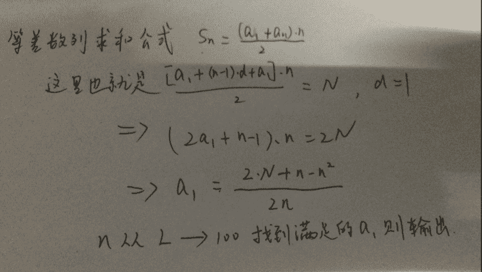

# 【2017】牛客模考（一模）编程题集合

## 1

牛牛有一个鱼缸。鱼缸里面已经有 n 条鱼，每条鱼的大小为 fishSize[i] (1 ≤ i ≤ n,均为正整数)，牛牛现在想把新捕捉的鱼放入鱼缸。鱼缸内存在着大鱼吃小鱼的定律。经过观察，牛牛发现一条鱼 A 的大小为另外一条鱼 B 大小的 2 倍到 10 倍(包括 2 倍大小和 10 倍大小)，鱼 A 会吃掉鱼 B。考虑到这个，牛牛要放入的鱼就需要保证：
1、放进去的鱼是安全的，不会被其他鱼吃掉
2、这条鱼放进去也不能吃掉其他鱼
鱼缸里面已经存在的鱼已经相处了很久，不考虑他们互相捕食。放入的新鱼之间也不会相互捕食。现在知道新放入鱼的大小范围 minSize,maxSize,牛牛想知道有多少种大小的鱼可以放入这个鱼缸。

本题知识点

贪心 模拟 C++工程师 golang 工程师 iOS 工程师 安卓工程师 运维工程师 前端工程师 算法工程师 测试工程师 PHP 工程师 c#工程师 测试开发工程师 大数据开发工程师 Java 工程师 牛客 2017

讨论

[路过的熊](https://www.nowcoder.com/profile/5639504)

```cpp
#include<iostream>
#include<cmath>
using namespace std;

int main(){
	int minSize, maxSize, n, fishsize, count = 0;
	int size[1001] = { 0 };
	cin >> minSize >> maxSize >> n;
	for (int i = 1; i <= n; i++){
		cin >> fishsize;
		for (int j = 2 * fishsize; j <= maxSize && j <= 10 * fishsize; j++)
			size[j] = 1;
		for (int j = fishsize / 2; j >= minSize && j >= ceil(fishsize / 10.0); j--)
			size[j] = 1;
	}
	for (int i = minSize; i <= maxSize; i++)
	    if (size[i] == 0)
		    count++;
	cout << count;
	return 0;
}
```

编辑于 2017-03-10 18:36:09

* * *

[小风筝 0010](https://www.nowcoder.com/profile/3514561)

```cpp
import java.util.Scanner;

public class Main {

    public static void main(String[] args) {
        //接受输入参数
        Scanner scanner = new Scanner(System.in);
        int minSize = scanner.nextInt(); //新放入鱼范围的最小值
        int maxSize = scanner.nextInt();//新放入鱼范围的最大值
        int inNumber = scanner.nextInt();//鱼缸里面已经有鱼的数量
        int[] inFishSize = new int[inNumber]; //定义一个数组
        for (int i = 0; i < inNumber; i ++) {
            inFishSize[i] = scanner.nextInt();//初始化已经有的鱼的大小 inFishSize[i]
        }

        int canPut = 0;//可以放进鱼的种类数

        for (int i = minSize; i <= maxSize; i ++) { //遍历输入的范围，逐个查看每中大小的鱼是否可以放进去
            boolean willBeEaten = false; //是否被吃，true 被吃。
            for (int j = 0; j < inNumber; j ++) {
                if ((10 * i >= inFishSize[j] && 2 * i <= inFishSize[j])
                        || (i >= inFishSize[j] * 2 && i <= inFishSize[j] * 10)) {
                    willBeEaten = true;
                    break; //一旦发现此鱼不能放进去，break，跳出循环，避免多余的检查
                }
            }
            //如果这条鱼可以不被鱼缸中其他鱼吃。或者被吃。则 canPut++
            if (!willBeEaten) {
                canPut ++;
            }
        }
        System.out.println(canPut);
    }
}

```

发表于 2017-03-12 10:51:53

* * *

[IchbinCT](https://www.nowcoder.com/profile/8762605)

```cpp
import java.util.Arrays;
import java.util.Scanner;

public class Main {

	public static void main(String[] args) {
		Scanner in = new Scanner(System.in);

		int minSize = in.nextInt();
		int maxSize = in.nextInt();
		int n = in.nextInt();
		int[] fishSize = new int[n];
		for (int i = 0; i < n; i++) {
			fishSize[i] = in.nextInt();
		}
		int res=func(minSize,maxSize,fishSize);
		System.out.println(res);
	}
	private static int func(int min, int max, int[] src){
		if(src==null || src.length==0) return max-min+1;
		if(max*10<src[0] || src[src.length-1]*10<min) return max-min+1;

		int res=0;
		int[] tmp=new int[max-min+1];
		Arrays.sort(src);
		int left1=src[0]/2;
		int left2=(int)(Math.ceil(src[0]/10.0));
		int right1=src[0]*2;
		int right2=src[0]*10;

		for(int i=0;i<src.length;i++){
			left2=(int)(Math.ceil(src[i]/10.0));
			left1=src[i]/2;
			right1=src[i]*2;
			right2=src[i]*10;

			mark(tmp,min,left2,left1,right1,right2);
		}
		for(int val: tmp){
			if(val==0) res++;
		}
		return res;
	}
	//将[a1,a2] && [b1,b2]在 src 中出现的 mark
	private static void mark(int[] src, int base, int a1, int a2, int b1, int b2){
		for(int i=0;i<src.length;i++){
			int pos=i+base;
			if(a1<=pos && pos<=a2){
				src[i]++;
			}else if(b1<=pos && pos<=b2){
				src[i]++;
			}
		}
	}
} 
```

发表于 2017-03-08 14:05:51

* * *

## 2

如果一个单词通过循环右移获得的单词，我们称这些单词都为一种循环单词。 例如：picture 和 turepic 就是属于同一种循环单词。 现在给出 n 个单词，需要统计这个 n 个单词中有多少种循环单词。

本题知识点

模拟 字符串 *哈希 *C++工程师 golang 工程师 iOS 工程师 安卓工程师 运维工程师 前端工程师 算法工程师 测试工程师 PHP 工程师 c#工程师 测试开发工程师 大数据开发工程师 Java 工程师 牛客 2017** **讨论

[得闲半生](https://www.nowcoder.com/profile/6662203)

思路：把要测试的单词后再重复下这个单词，如：picture ，变成 picturepicture 然后判断其他要测试的单词是不是这个串的子串（长度要先相等）#include <string>#include <iostream>#include <vector>using namespace std;int main(){int n,num=0;vector<string> twords;vector<bool> checks;//判断是否已属于某种循环单词 cin>>n;for (int i = 0; i < n; i++){string t_w;cin >> t_w;twords.push_back(t_w);checks.push_back(false);}for (int j = 0; j < n; j++){if (!checks[j]){string tt;tt = twords[j] + twords[j];for (int k = j + 1; k < n; k++){if (!checks[k]){if (tt.find(twords[k]) != string::npos&&twords[k].length() == twords[j].length()){ checks[k] = true; }}}num++;}}cout << num << endl;return 0;}

编辑于 2017-03-08 14:22:03

* * *

[小风筝 0010](https://www.nowcoder.com/profile/3514561)

```cpp
import java.util.ArrayList;
import java.util.Scanner;

public class Main {
    public static void main(String[] args) {
        /**
         * 该解法思想就是，把每个单词所有可能的循环单词都放在一个数据结构中，
         * 可以是 List，map,set，数组等等，此处用 ArrayList.
         * 然后判断下一个单词是否在表中，不在则加入，并把循环种类加 1
         * 在的话，则它与之前的单词是同一种循环单词
         */
        Scanner sc = new Scanner(System.in);
        int n = sc.nextInt(); //第一行为单词个数 n(1 ≤ n ≤ 50)
        ArrayList<String> list = new ArrayList<>();
        int count = 0;
        for (int i = 0; i < n; i ++) {
            String s = sc.next(); //输入并存储每行的单词。此处必须调用 next（）方法，不能是 nextLine（）方法
            if (!list.contains(s)) {
                count ++;
                list.add(s);

                for (int j = 0; j < s.length() - 1; j ++) {
                    char last = s.charAt(s.length() - 1);
                    s = s.substring(0, s.length() - 1);
                    s = last + s;
                    list.add(s);
                    //以下注释是另一种方法，把可能的循环单词加入 list，
                    //思路：把要测试的单词后再重复下这个单词，如：picture ，变成 picturepicture
                    //感谢得闲半生的 idea
//                    StringBuffer string = new StringBuffer();
//                    string.append(s);
//                    string.append(s);
//                    String another = string.substring(j, s.length() + j);
//                    list.add(another);
                }
            }
        }
        sc.close();
        System.out.println(count);
    }
}

```

编辑于 2017-03-12 21:28:31

* * *

[北风乱九州](https://www.nowcoder.com/profile/8391230)

import collectionsa=int(raw_input())y2=[]b=[]for x in range(1,a+1):    if x<a+1:        y=raw_input()        for y1 in y:            y2.append(y1)        b.append(y2)        y2=[]              for i in range(0,len(b)):    i_c=collections.deque(b[i])    for j in range(1,len(b)):        j_c=collections.deque(b[j])        while i >= j:            break        else:            for z in range(0,len(b[i])):                i_c.rotate(z)                if i_c == j_c:                     b[j]='@'                     i_c.rotate(-z)                else:                     i_c.rotate(-z)c=['@']d=[]for w in b:    if w not in c:        d.append(x)print len(d)

发表于 2017-03-20 20:44:55

* * *

## 3

DNA 分子是以 4 种脱氧核苷酸为单位连接而成的长链，这 4 种脱氧核苷酸分别含有 A,T,C,G 四种碱基。碱基互补配对原则：A 和 T 是配对的，C 和 G 是配对的。如果两条碱基链长度是相同的并且每个位置的碱基是配对的，那么他们就可以配对合成为 DNA 的双螺旋结构。现在给出两条碱基链，允许在其中一条上做替换操作：把序列上的某个位置的碱基更换为另外一种碱基。问最少需要多少次让两条碱基链配对成功

本题知识点

模拟 字符串 *C++工程师 golang 工程师 iOS 工程师 安卓工程师 运维工程师 前端工程师 算法工程师 测试工程师 PHP 工程师 c#工程师 测试开发工程师 大数据开发工程师 Java 工程师 牛客 2017* *讨论

[路过的熊](https://www.nowcoder.com/profile/5639504)

```cpp
#include<iostream>
#include<string>
using namespace std;

int main(){
	string a, b;
	cin >> a >> b;
	int len = a.length();
	int count = 0;
	for (int i = 0; i < len; i++)
	if ((a[i] == 'A' && b[i] == 'T') || (a[i] == 'T' && b[i] == 'A') || (a[i] == 'C' && b[i] == 'G') || (a[i] == 'G' && b[i] == 'C'))
		count++;
	cout << len - count;
	return 0;
}
```

发表于 2017-03-09 18:37:43

* * *

[-_-SURE-_-](https://www.nowcoder.com/profile/2458264)

```cpp

	one,two = raw_input().split()

	lenth = len(one)

	iter = 0

	fori in range(lenth):

	    if''.join(one[i]+two[i]) not in ['AT','TA','CG','GC']:

	        iter = iter + 1

	print iter

```

发表于 2017-03-20 16:21:46

* * *

[Aipyer](https://www.nowcoder.com/profile/1906016)

```cpp
/*
	思路：
	使用 ASCII 码相减判断两两字符是否匹配
	abs('A'-'T') = 19
	abs('C'-'G') = 4; 
*/
#include <iostream>
#include <math.h>
#include <string.h>
using namespace std;

int main() {
    string a,b;
    char cha,chb;
    int count = 0;

    cin >> a >> b;
    for(int i=0; i<a.length(); i++) {
        cha = a[i];
        chb = b[i];
        if(abs(cha-chb)==19 || abs(cha-chb)==4) continue;
        else {
            count++;
        }
    }
    cout << count << endl;
    return 0;
}

```

发表于 2017-03-23 22:33:24

* * *

## 4

牛牛的好朋友羊羊在纸上写了 n+1 个整数，羊羊接着抹除掉了一个整数，给牛牛猜他抹除掉的数字是什么。牛牛知道羊羊写的整数神排序之后是一串连续的正整数，牛牛现在要猜出所有可能是抹除掉的整数。例如：
10 7 12 8 11 那么抹除掉的整数只可能是 9
5 6 7 8 那么抹除掉的整数可能是 4 也可能是 9

本题知识点

模拟 C++工程师 golang 工程师 iOS 工程师 安卓工程师 运维工程师 前端工程师 算法工程师 测试工程师 PHP 工程师 c#工程师 测试开发工程师 大数据开发工程师 Java 工程师 牛客 2017

讨论

[小风筝 0010](https://www.nowcoder.com/profile/3514561)

```cpp
import java.util.Arrays;
import java.util.Scanner;

public class Main {
    public static void main(String[] args) {
        Scanner sc = new Scanner(System.in);
        int n = sc.nextInt(); //抹除一个数之后剩下的数字个数
        int[] num = new int[n];
        for (int i = 0; i < n; i ++) {
            num[i] = sc.nextInt();
        }
        //如果只有一个数字，注意保证输入正整数
        if (n == 1) {
            if (num[0] > 1) {
                System.out.println(num[0] - 1 + " " + (num[0] + 1));
                return;
            } else {
                System.out.println((num[0] + 1));
                return;
            }
        }
        //多个数字，先排序
        Arrays.sort(num);

        //如果有重复数字，则 mistake
        for (int i = 0; i < n-1; i ++) {
            if (num[i] == num[i+1]) {
                System.out.println("mistake");
            }
        }
        //现在没有了重复数字，那么可以根据最大数 num[n-1]和最小数 num[0]的差值来比较，
        //这样去判断，中间数字是连续的，还是缺了一个，还是缺了多个
        if (num[n-1] - num[0] > n) {
            System.out.println("mistake");
        } else if (num[n-1] - num[0] == n) {
            for (int i = 0; i < n-1; i ++) {
                if (num[i] + 2 == num[i+1]) {
                    System.out.println(num[i] + 1);
                }
            }
        } else {
            if (num[0] > 1) {
                System.out.println(num[0] - 1 + " " + (num[n-1] + 1));
            } else {
                System.out.println((num[n-1] + 1));
            }
        }
    }
}

```

发表于 2017-03-12 14:08:09

* * *

[lencha](https://www.nowcoder.com/profile/532300)

```cpp
#include<iostream>
using namespace std;
int main() {
    int n;
    cin>>n;
    int min = 1000000001;
    int max = 0;
    int res = 0;
    int num = 0;
    for(int i = 0; i < n; i++) {
        cin>>num;
        if(num < min) min = num;
        if(num > max) max = num;
        res ^= num;
    }
    for(int i = min; i <= max; i++) {
        res ^= i;
    }
    if(res == 0) {
        if(min - 1> 0)
            cout<<min-1<<" "<<max+1;
        else cout<<max+1;
    }
    else if(res <= min || res >= max) {
        cout<<"mistake"<<endl;
    }
    else cout<<res;
}
```

编辑于 2017-03-08 17:31:26

* * *

[得闲半生](https://www.nowcoder.com/profile/6662203)

思路：对串排序。然后用最大值减最小值，如果差为 n，则涂抹的是中间数字；如果差为 n-1，则涂抹两边数字；其他，mistake。先判断是否有重复数字。注意最小值为 1 的情况。#include <set>#include <algorithm>#include <iostream>#include <vector>using namespace std;int main(){int n;vector<int> t_s;cin >> n;for (int i = 0; i < n; i++){int tt;cin >> tt;t_s.push_back(tt);}sort(t_s.begin(), t_s.end());set<int> s;for (int j = 0; j < n; j++){s.insert(t_s[j]);}if (s.size() == n)//判断是否有数重复                    {if (t_s[n - 1] - t_s[0] == n - 1){                if(t_s[0]-1!=0){cout << t_s[0] - 1 << ' ' << t_s[n - 1] + 1 << endl;}                else cout <<t_s[n - 1] + 1 << endl;}else if (t_s[n - 1] - t_s[0] == n){for (int k = t_s[0]; k <= t_s[n - 1]; k++){if (s.count(k) == 0) {cout << k << endl;return 0;}}}            else cout << "mistake" << endl;}else cout << "mistake" << endl;return 0;}

编辑于 2017-03-08 15:20:50

* * *

## 5

如果一个数字能表示为 p^q(^表示幂运算)且 p 为一个素数,q 为大于 1 的正整数就称这个数叫做超级素数幂。现在给出一个正整数 n,如果 n 是一个超级素数幂需要找出对应的 p,q。

本题知识点

数学 C++工程师 golang 工程师 iOS 工程师 安卓工程师 运维工程师 前端工程师 算法工程师 测试工程师 PHP 工程师 c#工程师 测试开发工程师 大数据开发工程师 Java 工程师 牛客 2017

讨论

[路过的熊](https://www.nowcoder.com/profile/5639504)

```cpp
#include<iostream>
#include<cmath>
using namespace std;
bool isprime(int n){
	int s = sqrt(n);
	for (int i = 2; i <= s; i++)
	if (n % i == 0)
		return false;
	return true;
}
int main(){
	long long int n;
	while (cin >> n){
		int p, q;
		int ceil = log10(n) / log10(2);
		for (q = 2; q <= ceil; q++){
			p = pow(n, 1.0 / q);
			//double 转换为 int 会丢失，所以下面要再次判断
			if (pow(p, q) == n && isprime(p)){
				cout << p << " " << q;
				break;
			}
		}
		if (q > ceil)
			cout << "No";
	}
	return 0;
}
//时间复杂度 O（log2(N) * sqrt(sqrt(N))），也就是 以 2 为底 N 的对数 乘以 N 的 4 分之 1 次方
```

编辑于 2017-03-10 18:33:41

* * *

[小风筝 0010](https://www.nowcoder.com/profile/3514561)

```cpp
import java.util.Scanner;

public class Main {
    public static void main(String[] args) {
        Scanner sc = new Scanner(System.in);
        //int 最大范围为 2³².远远小于 10¹⁸.故用 long.long 的范围为 2⁶⁴
        long num = sc.nextLong();
        double p;
        boolean flag = false;
        for (long q = 2; q * q <= num; q ++) {
            p = Math.pow((double) num, 1d/q);
            //(long)p == p 判断 p 经过 Math.pow((double) num, 1d/q)后是否为整数
            if ((long)p == p && isPrimeNumber((long) p)) {
                System.out.println((long) p + " " + q);
                flag = true;
                break;
            }
        }
        if (!flag) {
            System.out.println("No");
        }
    }

    /**
     * 判断是否为素数
     * @param n 输入 long 值
     * @return true 素数 false 不是素数
     */
    public static boolean isPrimeNumber(long n) {
        if (n <= 1) return false;
        for (int i = 2; i * i <= n; i ++) {
            if (n % i == 0) return false;
        }
        return true;
    }
}

```

编辑于 2017-03-12 16:24:56

* * *

[天祺](https://www.nowcoder.com/profile/3758320)

import java.util.Scanner;

public class Main{

```cpp
public static void main(String[] args) {
    Scanner scanner=new Scanner(System.in);

    long num=scanner.nextLong();
    int end=(int) Math.sqrt(num);
    for(int i=2;i<=end+1;i++){
        double tem=Math.pow(num, (double)1/i);
        if(tem==(long)tem&&isPrimeNum((long) tem)){
            System.out.println((long)tem+" "+i);
            break;
        }
        if(i==end+1)System.out.println("No");
    }
    scanner.close();
}

public static boolean isPrimeNum(long num){
    if(num<=1)return false;
    for(int i=2;i*i<=num;i++){
        if(num%i==0)return false;
    }
    return true;
}
```

}

发表于 2017-04-02 10:52:19

* * *

## 6

给出一个正整数 N 和长度 L ，找出一段长度大于等于 L 的连续非负整数，他们的和恰好为 N 。答案可能有多个，我我们需要找出长度最小的那个。
例如 N = 18 L = 2：
5 + 6 + 7 = 18
3 + 4 + 5 + 6 = 18
都是满足要求的，但是我们输出更短的 5 6 7 数据范围：  ， 

本题知识点

数学 模拟 C++工程师 golang 工程师 iOS 工程师 安卓工程师 运维工程师 前端工程师 算法工程师 测试工程师 PHP 工程师 c#工程师 测试开发工程师 大数据开发工程师 Java 工程师 牛客 2017

讨论

[lencha](https://www.nowcoder.com/profile/532300)


```cpp
#include<iostream>
using namespace std;
int main() {
    int N, L;
    cin>>N>>L;
    for(int i = L; i <= 100; i++) {
        if((2*N+i-i*i)%(2*i) == 0) {
            int start = (2*N+i-i*i)/(2*i);
            for(int j = 0; j < i-1; j++) {
                cout<<start+j<<" ";
            }
            cout<<start+i-1;
            return 0;
        }
    }
    cout<<"No"<<endl;
} 
```

发表于 2017-03-08 17:26:34

* * *

[GooZy](https://www.nowcoder.com/profile/874739)

```cpp
import java.util.Scanner;
/*
 * 题目需要找出一段长度大于等于 L 的连续非负整数，使得其和等于 N。L 要尽可能小。
 * 考虑是连续非负整数，所以其和我们能用中位数来表示，分两种情况：
 * 情况一，长度为奇数的情况：
 *   此时中位数一定是整数，N = 中位数 x L
 * 情况二，长度为偶数的情况：
 *   此时中位数肯定是 xx.5 的形式，N = xx.5 * L
 * 所以我们从长度 L 开始枚举，至 100 为止，分奇偶讨论。
 */
public class Main {
	public static void main(String[] args) {
		Scanner in = new Scanner(System.in);
		int n = in.nextInt(), l = in.nextInt();
		in.close();
		int bg = -1, ed = -1;
		for (int i = l; i <= 100; ++i) {
			// 奇数，中位数一定是整数
			if (i % 2 == 1 && n % i == 0) {
				int mid = n / i;
				bg = mid - (i - 1) / 2;
				ed = mid + (i - 1) / 2;
				if (bg >= 0) // 答案要合法，即需要是非负整数
					break;
			}
			// 偶数，中位数一定是 0.5 形式
			if (i % 2 == 0 && (double)n / i - n / i == 0.5f) {
				int mid = n / i;
				bg = mid - i / 2 + 1;
				ed = mid + i / 2;
				if (bg >= 0)
					break;
			}
		}
		if (bg >= 0) {
			for (int i = bg; i < ed; ++i) {
				System.out.print(i + " ");
			}
			System.out.println(ed);
		}
		else {
			System.out.println("No");
		}
	}
}
```

发表于 2017-03-08 16:26:25

* * *

[beyourselfUltra](https://www.nowcoder.com/profile/5454831)

借用回答区中或赞最高的答案的分析图，我给出了 Python 版实现

发表于 2018-05-04 21:27:34

* * *

## 7

牛牛新买了一本算法书，算法书一共有 n 页，页码从 1 到 n。牛牛于是想了一个算法题目：在这本算法书页码中 0~9 每个数字分别出现了多少次？

本题知识点

数学 动态规划 C++工程师 golang 工程师 iOS 工程师 安卓工程师 运维工程师 前端工程师 算法工程师 测试工程师 PHP 工程师 c#工程师 测试开发工程师 大数据开发工程师 Java 工程师 牛客 2017

讨论

[路过的熊](https://www.nowcoder.com/profile/5639504)

```cpp
#include<iostream>
using namespace std;

int count(int n, int x) {
	int res = 0, j;
	for (int i = 1; j = n / i; i *= 10) {
		int high = j / 10;
		if (x == 0) {
			if (high)
				high--;
			else
				break;
		}
		res += high * i;
		int tem = j % 10;
		if (tem > x)
			res += i;
		else if (tem == x)
			res += n - j * i + 1;
	}
	return res;
}

int main(){
	int n;
	while (cin >> n){
		cout << count(n, 0);
		for (int i = 1; i <= 9; i++)
			cout << " " << count(n, i);
	}
	return 0;
}
//最优的解法了，时间复杂度 O(log10(N))，以 10 为底 N 的对数，也就是 N 的位数
```

编辑于 2017-03-09 18:33:39

* * *

[天祺](https://www.nowcoder.com/profile/3758320)

```cpp
   2 位数的情况：

   N=13,个位数出现的 1 的次数为 2，分别为 1 和 11，十位数出现 1 的次数为 4，分别为 10,11,12,13，所以 f(N) = 2+4。

   N=23,个位数出现的 1 的次数为 3，分别为 1，11，21，十位数出现 1 的次数为 10，分别为 10~19，f(N)=3+10。

   由此我们发现，个位数出现 1 的次数不仅和个位数有关，和十位数也有关，如果个位数大于等于 1，则个位数出现 1 的次数为十位数的数字加 1；如果个位数为 0，个位数出现 1 的次数等于十位数数字。而十位数上出现 1 的次数也不仅和十位数相关，也和个位数相关：如果十位数字等于 1，则十位数上出现 1 的次数为个位数的数字加 1，假如十位数大于 1，则十位数上出现 1 的次数为 10。

   3 位数的情况:

   N=123

   个位出现 1 的个数为 13:1,11,21，…，91,101,111,121

   十位出现 1 的个数为 20:10~19,110~119

   百位出现 1 的个数为 24:100~123

   我们可以继续分析 4 位数，5 位数，推导出下面一般情况： 

   假设 N，我们要计算百位上出现 1 的次数，将由三部分决定：百位上的数字，百位以上的数字，百位一下的数字。

   如果百位上的数字为 0，则百位上出现 1 的次数仅由更高位决定，比如 12013，百位出现 1 的情况为 100~199,1100~1199,2100~2199，…，11100~11199，共 1200 个。等于更高位数字乘以当前位数，即 12 * 100。

   如果百位上的数字大于 1，则百位上出现 1 的次数仅由更高位决定，比如 12213，百位出现 1 的情况为 100~199,1100~1199,2100~2199，…，11100~11199，12100~12199 共 1300 个。等于更高位数字加 1 乘以当前位数，即（12 + 1）*100。
```

如果百位上的数字为 1，则百位上出现 1 的次数不仅受更高位影响，还受低位影响。例如 12113，受高位影响出现 1 的情况：100~199,1100~1199,2100~2199，…，11100~11199，共 1200 个，但它还受低位影响，出现 1 的情况是 12100~12113，共 14 个，等于低位数字 13+1。

```cpp
public static long getFactorCount(long num,byte factor){
		long count=0;
		long current=0,next=0,before=0;
		long i=1;

		while((num/i)!=0){
			current=(num/i)%10;
			next=num/(i*10);
			before=num-(num/i)*i;

			if(current<factor){
				count+=next*i;
			}
			else if(current==factor){
				count+=next*i+before+1;
			}
			else if(current>factor)count+=(next+1)*i;

			i*=10;
		}
		return count;
	}
```

编辑于 2017-04-02 10:56:59

* * *

[┌；崛起`灬。°😊](https://www.nowcoder.com/profile/4009623)

#include <stdio.h>int main()
{
    int i,n,j,temp = 0,a = 1,b = 10;
    int count[10] = {0}; 
    scanf("%d",&n);
    while(n >= a)
    {
        for(j = 0;j < 10;j++)
        {
            temp = temp + n/b;    
            if(j < n%b/a)
            temp = temp + 1;
            count[j] = count[j] + temp * a;
            temp = 0;
        }
        for(i = 0;i <= n%b/a;i++)
        {
            if(i == n%b/a)
            count[i] = count[i] + n % a + 1;
        }
        count[0] = count[0] - a;
        a = a * 10;
        b = b * 10;

    }
    for(i = 0;i < 10;i++)
    {
        printf("%d",count[i]);
        if(9-i)
        printf(" ");    
    }
    return 0;
}

发表于 2017-09-26 17:41:06

* * *

## 8

牛牛正在挑战一款名为 01 翻转的游戏。游戏初始有 A 个 0,B 个 1，牛牛的目标就是把所有的值都变为 1，每次操作牛牛可以任意选择恰好 K 个数字，并将这 K 个数字的值进行翻转(0 变为 1，1 变为 0)。牛牛如果使用最少的操作次数完成这个游戏就可以获得奖品，牛牛想知道最少的操作次数是多少？
例如:A = 4 B = 0 K = 3
0000 -> 1110 -> 1001 -> 0100 -> 1111
需要的最少操作次数为 4

本题知识点

模拟 数学 贪心 C++工程师 golang 工程师 iOS 工程师 安卓工程师 运维工程师 前端工程师 算法工程师 测试工程师 PHP 工程师 c#工程师 测试开发工程师 大数据开发工程师 Java 工程师 牛客 2017

讨论

[JerryCheese](https://www.nowcoder.com/profile/528382)

本人比较喜欢数学，就从数学的角度来解这道题吧设 n = A+B 设 位置值序列集合 E = {e[1], e[2], e[3],... e[n]}， e[i] ∈ {0, 1}，其中 e[i]表示第 i 个位置上的值 （1 ≤ i ≤ n）假设初始时，前面 A 个位置为 0，后面 B 个位置为 1 设 T[i] 为 第 i 个位置上翻转的次数因为一次翻转必翻转 K 个位置，假设进行了 X 次翻转（未知数），则有以下等式① XK = ∑T[i] （1 ≤ i ≤ n）因为同一个位置翻转 2 次得到是原来的值，所以为了使所有位置均为 1， T[i] 必满足以下条件：② T[i] = 1 + 2S[i] （e[i] 初始为 0）③ T[i] = 2S[i]（e[i] 初始为 1）其中 S[i] 表示第 i 个位置进行了 S[i]次 2 次翻转结合①、②、③可得：④ XK = A + 2 ∑S[i] （1 ≤ i ≤ n）**⑤** **XK - A 必为偶数**我对此的理解为，总的来看：在某些位置上进行了 2 次翻转，和 A 个位置的 1 次翻转，就全部为 1 了。对 ∑S[i] 观察可得：对于初始为 1 的位置，2 次翻转次数不能超过 X/2 对于初始为 0 的位置，2 次翻转次数不能超过(X-1)/2 ，因为最后一次翻转不能属于“2 次翻转”中的一次翻转我们假设所有位置的 2 次翻转次数都达到最大，则有不等式：⑥ (**XK - A)/2 =** ∑S[i] （1 ≤ i ≤ n）**≤ A ((X-1)/2) + B(X/2)**满足⑤、⑥条件 X 即可满足题意我们可以相信，X 不能大于 A 的最大值+B 的最大值 = 200000

```cpp
#include <iostream>
using namespace std;
int main() {
    int K,A,B, MAX = 200000;
    while(cin>>A>>B>>K) {
        int N;
        for (N = 0; N < MAX; N++) {
            if ((N*K - A) < 0 || ((N*K - A) & 0x1) != 0) 
                continue;
            if ((N*K - A)/2 <= A*((N-1)/2) + B*(N/2) || A == 0) 
                break;
        }
    	if (N < MAX) 
            cout<<N<<endl;
        else 
            cout<<-1<<endl;
    }
    return 0;
}
```

编辑于 2017-03-19 11:43:09

* * *

[路过的熊](https://www.nowcoder.com/profile/5639504)

```cpp
#include<iostream>
#include<cmath>
using namespace std;

int function(int A, int B, int K){
	int remainder = A % K;//直接翻转后的剩余待翻转个数
	int count = A / K;//直接翻转
	int S = A + B;//总个数
	if (A == 0 || remainder == 0)
		;
	else if ((S <= K) || (remainder % 2 == 1 && K % 2 == 0))
		count = -1;//无法翻成功的输出-1
	else if ((K + remainder) % 2 == 0 && count > 0 && B + K * count >= 2 * K - (remainder + K) / 2)
		count++;//一种特殊情况，还剩下 K+remainder 个 0 时直接翻两次即可完成
	else if (remainder % 2 == 0)
		count += 2 * ceil(remainder / double(2 * (S - K)));
       //每翻两次最多能把 remainder 中的 2*(S-K)个 0 翻成 1，注意这里指的是最多，当翻最后 2 次或者 S-K>remainder/2 时，只需翻两次，所以这里用到了 ceil（）
	else
		count += 2 * ceil((K - remainder) / double(2 * (S - K))) + 1;
       //当 remainder 是奇数时，相当于先把所有 1 中的 K-remainder 个翻成 0，这样加上 remainder 一共 K 个 0，只需额外再翻一次即可，K-remainder 是奇数时，永远不能翻成功，是偶数时，翻转方法同上面
	return count;
}

int main(){
	int A, B, K;
	cin >> A >> B >> K;
	cout << function(A, B, K);
	return 0;
}
//没有循环，只用到了条件语句，时间复杂度 O(1),空间复杂度 O(1)
```

编辑于 2017-03-25 20:25:21

* * *

[Han3000](https://www.nowcoder.com/profile/4109599)

```cpp
import sys
def main(A, B, K):
    if A == 0: return 0
    if K == 0: return -1
    if A % K == 0: return A / K
    if A & 1 > K & 1 or K >= A + B: return -1
    ret = A // K + 1
    while 1:
        if (ret * K - A) & 1 == 0 and ret * K <= ret * (A + B) - (A, B)[ret & 1]:
            return ret
        ret += 1
print main(*map(int, sys.stdin.readline().split()))

```

循环也可以改成 O(1)的算法，可读性就差了。

发表于 2017-03-28 05:17:25

* * *</stdio.h>***