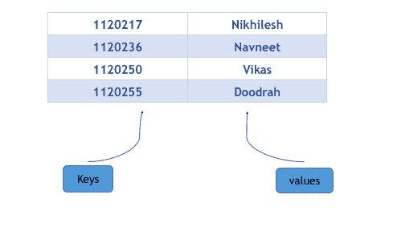

# 百度 2017 春招笔试真题编程题集合

## 1

度度熊想去商场买一顶帽子，商场里有 N 顶帽子，有些帽子的价格可能相同。度度熊想买一顶价格第三便宜的帽子，问第三便宜的帽子价格是多少？

本题知识点

模拟

讨论

[缘故](https://www.nowcoder.com/profile/983226)

```cpp
//看到有人说他的简单 我也贴出来看看
#include<iostream>
#include<algorithm>
#include<vector>
using namespace std;  
int main(){
    int n,tmp;
    cin>>n;
    vector<int> v;
    while(n--){
        cin>>tmp;
        v.push_back(tmp);
    }
    sort(v.begin(),v.end());
    v.erase(unique(v.begin(),v.end()),v.end());
    cout<<(v.size()<3?-1:v[2]);
    return 0;
}

// 下面的 空间 O(1) 时间 O(n)
#include<limits.h>
#include<algorithm>
using namespace std; 
int main(){
    int n,tmp;
    cin>>n;
    int min1=INT_MAX,min2=INT_MAX,min3=INT_MAX;
    while(n--){
        cin>>tmp;
        if(tmp==min1||tmp==min2||tmp==min3)
            continue;
        if(tmp<min1){
            min3=min2;
            min2=min1;
            min1=tmp;
        }else if(tmp<min2){ 
            min3=min2;
            min2=tmp;
        }else if(tmp<min3){
            min3 = tmp;
        }
    }
    cout<<(min3==INT_MAX?-1:min3)<<endl;
    return 0;
}

```

编辑于 2017-09-27 10:11:33

* * *

[未之未央丿](https://www.nowcoder.com/profile/6204814)

大家都在说自己的简单。。

```cpp
import java.util.*;

/**
 * Created by TaoHaoWei on 2017/9/25.
 * 本人新建博客：www.mynight.top
 * 欢迎交友和指正 ^_^
 */
public class 求第三大的数字 {
    public static void main(String[] args) {
        Scanner in = new Scanner(System.in);
        int n = in.nextInt();
        Set<Integer> set = new TreeSet<>();
        for (int i=0;i<n;i++)
            set.add(in.nextInt());
        if(set.size()<3)
            System.out.println(-1);
        else
            System.out.println(set.toArray()[2]);
    }
} 
```

发表于 2017-09-25 10:33:23

* * *

[星环](https://www.nowcoder.com/profile/1940290)


发表于 2017-04-28 00:12:25

* * *

## 2

一个数轴上共有 N 个点，第一个点的坐标是度度熊现在位置，第 N-1 个点是度度熊的家。现在他需要依次的从 0 号坐标走到 N-1 号坐标。
但是除了 0 号坐标和 N-1 号坐标，他可以在其余的 N-2 个坐标中选出一个点，并直接将这个点忽略掉，问度度熊回家至少走多少距离？

本题知识点

模拟 贪心 数学

讨论

[若轩](https://www.nowcoder.com/profile/779336)

为什么我觉得题描述不清楚，没看懂，求解

发表于 2017-06-27 17:35:18

* * *

[7 厘海岸](https://www.nowcoder.com/profile/9931780)

```cpp
#include<iostream>
#include<algorithm>
#include<cmath>
using namespace std;
int main()
{
    int n, a[50];
    while (cin >> n)
    {
        int i, ans = 0;
        for (i = 0; i < n; i++)
        {
            cin >> a[i];
            /* 计算两个相邻节点之间的距离，ans 为所有相邻节点距离的总和 */
            if (i)
                ans += abs(a[i] - a[i - 1]);
        }
        int _m = 0;
        //计算相邻的 3 个节点之间的距离总和，A->B,B->C,A->C
        for (i = 0; i < n - 2; i++)
            _m = max(_m, abs(a[i] - a[i + 1]) + abs(a[i + 1] - a[i + 2]) - abs(a[i] - a[i + 2]));
        cout << ans - _m << endl;//_m 属于重复计算
    }
    return 0;
}

```

这道题一开始我是每看明白的，以为是按排序后的坐标来计算距离，后面才发现，是按未排序数组的坐标来计算。

发表于 2017-08-12 12:39:26

* * *

[Nedfisher](https://www.nowcoder.com/profile/781203)

    从 N-2 个坐标中选出一个点，并直接将这个点忽略掉。直接忽略一个点**只会**直接影响到，这个节点前后节点的距离。这个 影响的距离我们暂且命名为优化距离，**将所有节点按顺序****组成三个节点的集合，**通过这种方式只需要通过一次循环便能得到结果。**** **优化距离越大说明如果去掉这个集合的中点元素将会使得总距离越短，下面上代码。**

```cpp
import java.util.Scanner;

public class Main {
    public static void main(String[] args){
        Scanner scanner=new Scanner(System.in);
        int length=scanner.nextInt();
        int[]arrays=new int[length];
        for(int i=0;i<length;i++){
            arrays[i]=scanner.nextInt();
        }
        /**
         * sum 总距离
         * repetition  三个节点 中被重复计算的总距离
         * select 优化距离最大的  三个节点两两相加的距离
         * add 三个结尾距离为 max 中 头尾节点的距离
         * last 最后三个节点中 尾距离没有被计算两次 需要加上
         * optimizeDistance 优化距离
         */

        int sum=0,repetition=0,select=0,add=0,
                last=0,optimizeDistance = 0;
        for(int i=0;i<=arrays.length-3;i++){
            int begin=arrays[i];
            int mid=arrays[i+1];
            int end=arrays[i+2];
            //三个点之间的距离
            int threePointDistance=Math.abs(mid-begin)
                    +Math.abs(end-mid);
            //两个点之间的距离  即被多次计算待会需要减掉的距离
            int twoPointDistance=Math.abs(end-mid);
            int contrast=threePointDistance - Math.abs(begin-end);

            repetition+=twoPointDistance;
            sum+=threePointDistance;
            last=twoPointDistance;

            if(contrast>optimizeDistance){
                optimizeDistance = contrast;
                select=threePointDistance;
                add=Math.abs(end-begin);
            }

        }
        System.out.println(sum-select+last-repetition+add);

    }

}

```

编辑于 2018-01-12 17:18:57

* * *

## 3

三维空间中有 N 个点，每个点可能是三种颜色的其中之一，三种颜色分别是红绿蓝，分别用'R', 'G', 'B'表示。
现在要找出三个点，并组成一个三角形，使得这个三角形的面积最大。
但是三角形必须满足：三个点的颜色要么全部相同，要么全部不同。

本题知识点

模拟 数学

讨论

[赵翔](https://www.nowcoder.com/profile/5926751)

问题 1：遍历所有可能的 3 个点

```cpp
 for(int i = 0; i < n; i++)
   for(int j = i + 1; j < n; j++)
     for(int k = j + 1; k < n; k++)
```

问题 2：判断 3 个点是否能组成三角形

```cpp
double a = dis(i, j);     //计算两点距离
double b = dis(i, k);
double c = dis(k, j);
if(a < (b + c) && b < (a + c) && c < (a + b))
{
  return true;
}
return false;
```

问题 3：判断颜色是否相同或全不同

```cpp
if(V[i].c == V[j].c && V[j].c == V[k].c)
{
   return true;
}
else if(V[i].c != V[j].c &&V[i].c != V[k].c&&V[k].c != V[j].c)
{
  return true;
}
return false;
```

问题 4：计算三角形面积 (海伦公式 百度~)doublea = L3(i, j);doubleb = L3(i, k);doublec = L3(k, j);doublep = (a + b + c) / 2;return sqrt(p * (p - a) * (p - b) * (p - c));附上源代码

```cpp
#include<bits/stdc++.h>  
using namespace std;

/*
3
R 0 0 0
R 0 4 0
B 0 0 3
*/

struct node{
	char c;
	int x, y, z;
};

double MAX = 0;
int n;
vector<node> V;

//计算两点之间的举例
double L3(int i, int j){
	return sqrt(double((V[i].x - V[j].x)*(V[i].x - V[j].x) + (V[i].y - V[j].y)*(V[i].y - V[j].y) + (V[i].z - V[j].z)*(V[i].z - V[j].z)));
}

//判断是否是三角形
bool isSan(int i, int j, int k){
	double a = L3(i, j);
	double b = L3(i, k);
	double c = L3(k, j);
	if (a < (b + c) && b < (a + c) && c < (a + b))
	{
		return true;
	}
	return false;
}

//判断颜色
bool isColour(int i, int j, int k){
	if (V[i].c == V[j].c && V[j].c == V[k].c)
	{
		return true;
	}
	else if (V[i].c != V[j].c &&V[i].c != V[k].c&&V[k].c != V[j].c)
	{
		return true;
	}
	return false;
}

//计算三角形面积
double CmputeArea(int i, int j, int k){
	double a = L3(i, j);
	double b = L3(i, k);
	double c = L3(k, j);
	double p = (a + b + c) / 2;
	return  sqrt(p * (p - a) * (p - b) * (p - c));
}

//遍历所有可能的三个点
void run(){
	for (int i = 0; i < n; i++)
	{
		for (int j = i + 1; j < n; j++)
		{
			for (int k = j + 1; k < n; k++)
			{
				if (isSan(i, j, k) && isColour(i, j, k))
				{
					double tArea = CmputeArea(i, j, k);
					if (tArea > MAX)
					{
						MAX = tArea;
					}
				}
			}
		}
	}
}

int main(){
	cin >> n;

	for (int i = 0; i < n; i++)
	{
		node t;
		cin >> t.c >> t.x >> t.y >> t.z;
		V.push_back(t);
	}
	run();

	printf("%.5lf", MAX);

}
```

编辑于 2017-04-27 23:14:08

* * *

[丁歌](https://www.nowcoder.com/profile/1729106)

```cpp
import java.util.ArrayList;
import java.util.List;
import java.util.Scanner;

public class Main {

	static class Point{
		char color;
		int x;
		int y;
		int z;
	}

	// 计算两点之间的距离
	public static double distance(Point A, Point B){
		return Math.sqrt((A.x-B.x)*(A.x-B.x) + (A.y-B.y)*(A.y-B.y) + (A.z-B.z)*(A.z-B.z));
	} 

	// 判断三个点颜色是否满足条件
	public static boolean colorIsMathed(Point A, Point B, Point C) {
		if (A.color == B.color && B.color == C.color) { // 三个点的颜色相同
			return true;
		}else if (A.color!=B.color && A.color!=C.color && B.color!=C.color) { // 三个点的颜色都不相同
			return true;
		}else {
			return false;
		}
	}

	// 判断三个点是否能构成三角形
	public static boolean isSan(Point A, Point B, Point C) {
		double a = distance(A, B);
		double b = distance(A, C);
		double c = distance(B, C);
	    if (a<(b+c) && b<(a+c) && c<(a+b)
	    	&& a>Math.abs(b-c) && b>Math.abs(a-c) && c>Math.abs(a-b)){
	        return true;
	    }
	    return false;
	}

	// 计算三角形面积
	public static double getArea(Point A, Point B, Point C) {
		double a = distance(A, B);
		double b = distance(A, C);
		double c = distance(B, C);
		double p = (a + b + c) / 2;
		return  Math.sqrt(p * (p - a) * (p - b) * (p - c));
	}

	public static void main(String[] args) {
		List<Point> list = new ArrayList<>();		
		Scanner sc = new Scanner(System.in);
		int n = sc.nextInt();
		sc.nextLine();		
		// 将输入的点添加到 List 中
		for(int i = 0; i < n; i++){
			Point p = new Point();
			String[] arr = sc.nextLine().split(" ");
			p.color = arr[0].charAt(0);
			p.x = Integer.parseInt(arr[1]);
			p.y = Integer.parseInt(arr[2]);
			p.z = Integer.parseInt(arr[3]);
			list.add(p);			
		}

		double maxArea = 0;
		double area = 0;
		// 遍历所有可能的三个点
		for(int i = 0; i < n; i++){
			for (int j = i + 1; j < n; j++) {
				for (int k = j + 1; k < n; k++){
					Point A = list.get(i);
					Point B = list.get(j);
					Point C = list.get(k);

					if (isSan(A,B,C) && colorIsMathed(A,B,C)) {
						area = getArea(A, B, C);
					}
					if (area > maxArea) {
						maxArea = area;
					}
				}
			}
		}

		System.out.format("%.5f", maxArea);

	}

}
```

发表于 2017-05-03 23:22:15

* * *

[toraoh](https://www.nowcoder.com/profile/364093)

你们的高数老师表示对你们非常失望。怎么全都只记得中学学过的海伦公式啊？大学里，我们学过一种更强大的工具啊：**向量叉积**我们来回顾一下三维向量叉积（向量积，如果用同济版高数的话）的几何意义：2 个向量 X 和 Y 的叉积 A，方向与这两个叉积组成的平面垂直，**A 的模的大小（A 向量的长度），是由 X、Y 这两个向量组成的平行四边形的面积。****（或者说，是由这两个向量组成的三角形的面积的 2 倍** **）。**真忘得一干二净的同学，请去参考你们的高数课本。高数课本看不懂的，可以去买一本《算法艺术与信息学竞赛》，阅读其几何部分（讲得挺好、挺清楚的）。所以说啊，写个叉积就好了。（而且这个写法只需要在最后计算一次 sqrt 就行了，而不需要 3 次如果出题人为了避免任何浮点数运算，让你输出面积的平方的 2 倍，嘿嘿嘿）

```cpp
#include <stdio.h>
#include <math.h>
#include <algorithm>
#include <vector>
using namespace std;
typedef long long ll;

struct Point{
	int x,y,z;
	explicit Point(int _x=0,int _y=0,int _z=0):x(_x),y(_y),z(_z){}
	void get(){
		scanf("%d%d%d",&x,&y,&z);
	}
	Point cross_product(const Point &b)const{
		return Point(y*b.z-z*b.y,
					z*b.x-x*b.z,
					x*b.y-y*b.x);
	}
	Point operator-(const Point &b)const{
		return Point(x-b.x,
					y-b.y,
					z-b.z);
	}
	double get_length(){
		return sqrt((ll)x*x+(ll)y*y+(ll)z*z);
	}
};

typedef vector<Point> vp;
typedef Point Vec;

double ans=0.0;

void loop(vp& a,vp& b,vp& c){
	for(vp::iterator i=a.begin();i!=a.end();++i){
		for(vp::iterator j=b.begin();j!=b.end();++j){
			for(vp::iterator k=c.begin();k!=c.end();++k){
				Vec sa=*j-*i;
				Vec sb=*k-*i;
				ans=max(ans,sa.cross_product(sb).get_length()*0.5);
			}
		}
	}
}

vector<Point> r,g,b;

int main(){
	int n;
	char tmp[3];
	scanf("%d",&n);
	for(int i=0;i<n;i++){
		scanf("%s",tmp);
		Point p;p.get();
		if(tmp[0]=='R')r.push_back(p);
		if(tmp[0]=='G')g.push_back(p);
		if(tmp[0]=='B')b.push_back(p);
	}
	loop(r,r,r);
	loop(g,g,g);
	loop(b,b,b);
	loop(r,g,b);
	printf("%.5f\n",ans);
	return 0;
}  
```

编辑于 2017-05-22 12:10:12

* * *

## 4

度度熊有一个 N 个数的数组，他想将数组从小到大 排好序，但是萌萌的度度熊只会下面这个操作：
任取数组中的一个数然后将它放置在数组的最后一个位置。
问最少操作多少次可以使得数组从小到大有序？

本题知识点

模拟

讨论

[八歌](https://www.nowcoder.com/profile/7818035)

```cpp
鉴于前面的回答解析中说得不够明确，这里修改增加以下说明，以上面的输入为例子：
输入为 19  7  8  25  ，用 arr1 表示
排序后 7  8  19  25  ，用 arr2 表示
都从数组第一个元素开始 ： 7 和  19 比较 ，7 < 19 ,
继续看 arr1 的下一个元素 跟 arr2 的第一个元素 7 比较，此时 7 = 7  所以 count++ ，
看两个数组后面的元素 ，都是 8 ，此时 count++ ，继续看 25 > 19 ，到此结束。 
所以 count = 2 。
                    ————2017.08.20 晚
/*复杂度 nlogn 但是需要一个 n 的辅助数组
*用一个辅助数组对所有元素进行排序，从小到大排序
*从第一个排好序的元素开始，即最小的元素开始与没排好序数组元素比较，
*检查有多少个已经是从最小到大好序的，位置可以不连续，但是大的元素必须在小的元素后面，
* 统计出一共有 count 个，这些元素是不需要移动的元素
* 一共有 n 个元素，所以需要移动 n - count 次
*/import  java.util.Arrays;
importjava.util.Scanner;
```

```cpp
importjava.util.Scanner;

	public class Main{

	public static void main (String args[]){

	Scanner scan = new Scanner(System.in);

	int n = scan.nextInt();

	int[] arr = new int[n];

	int[] sortArr = new int[n];

	for(int i = 0; i < n;  i++){

	arr[i] = scan.nextInt();

	sortArr[i] = arr[i];

	}

	Arrays.sort(sortArr);

	int count = 0;

	int j = 0;

	for(int i = 0;i < n; i++){

	if(arr[i] == sortArr[j]){

	count++;

	j++;

	}

	}

	System.out.println(n - count);

	}

	}

```

编辑于 2017-08-20 23:31:34

* * *

[rs 勿忘初心](https://www.nowcoder.com/profile/7491640)

分析：       根据题目要求，意思是两个数如果较大的数在前面，就需要将其移到数组最后面，要想移动次数最少，显然就需要有每次移动是规律可行的。比如输入例子：19 7 8 25，最快的移动方法就是首先将 19 移到最后变为 _ 7 8 25 19，然后将 25 移到最后变为 _ 7 8 _  19  25,只需移动两次即可使数组从小到大有序（下划线表示原始元素位置或数组后新增加的位置）。如果是按从小到大的元素依次往后移动，即 7 8  19 25 分别往数组最后位置移动，虽然也可以使元素有序，但是移动次数为 4 次，这样做并不是效率最高的，因为原始的 7 和 8 已经有序了，是不需要再移动的。       从上面分析，我们就应该会想到，如果从最小的元素开始，后面的元素如果是有序的，我们是不要移动的，如果大的数在前面就需要移到后面去。        如果我们将数组元素从小到大排序，然后也知道了其在原始数组的位置，那我们可以最小的元素开始。与第二小的元素进行比较，如果说最大元素在数组中的下标位置大于第二小元素在数组中的下标，即最小元素在第二小元素的后面，那我们就需要将第二小元素移到数组的最后面去，这样才能保证最小的数组元素在前面，依次比较第二小元素和第三小元素在原始数组的下标位置，如果第二小元素在数组中的下标位置大于第三小元素在数组中的下标，将第三小元素移到数组最后面去，依次执行下去。。。

```cpp
C++中 map 提供的是一种键值对容器，里面的数据都是成对出现的,如下图：

		每一对中的第一个值称之为关键字(key)，每个关键字只能在 map 中出现一次；

		第二个称之为该关键字的对应值。#include<iostream>  

```

```cpp

	#include<map>
#include<vector>
#include<algorithm>
using namespace std;
int main()
  {
     int n,temp;
     cin>>n;
     vector<int> v;
     map<int,int> m;
     for(int i=0;i<n;i++) 
       {  cin>>temp;
          v.push_back(temp);
          m[temp]=i;
       }
     sort(v.begin(),v.end());
     int t=n,count=0;
     for(int i=0;i<n-1;i++)
       {
           if (m[v[i]]>m[v[i+1]])
              {
                 m[v[i+1]]=t++;
                 count++;
              }
       }
     cout<<count<<endl;
  }

```

编辑于 2017-06-05 21:07:44

* * *

[CCfetch](https://www.nowcoder.com/profile/545161)

思路来自于： [我才是你爸爸](https://www.nowcoder.com/profile/7818035)若是没有看懂他的讲解的话，可以看看我的理解，希望对大家有帮助！**思路：****其实可以想象成是一个从小到大递增的数组 A 中插入了若干数字导致数组 A 变成了无序的数组 B。** **我们的任务就是把插入的若干数组挪到最后即刻。****比如说：数组 B:[6, 1, 7, 2, 5, 4] 是从数组 A：[1, 2, 4]插入了数字 6， 7， 5\. 因此需要挪动 3 次。****再比如：数组 B:[5, 2, 4, 3, 1, 6] 是从数组 A：[1]插入了数字 5，2，4，3，6\. 因此需要挪动 5 次。 ****会发现规律，挪动的次数就是 B.length - A.length**js 完整代码如下：process.stdin.resume(); process.stdin.setEncoding('ascii'); var input = ""; var input_array = "";process.stdin.on('data', function (data) {     input += data; }); **var getMinCnt = function(arr){****    var tmp = [].concat(arr),****        minNum = Math.min.apply(Math, tmp),****        cnt = arr.length;****    tmp.splice(tmp.indexOf(minNum), 1); // 去除当前最小值****    for(var i = 0, len = cnt; i < len; i++){****        if(arr[i] === minNum){****            cnt -= 1;****minNum =** **Math.min.apply(Math, tmp);****            tmp.splice(tmp.indexOf(minNum), 1);****        }****    }****    return cnt;****}**process.stdin.on('end', function () {    input_array = input.split('\n')[1].split(' ');    input_array.forEach(function(v, i){        input_array[i] = +v;    });    console.log(getMinCnt(input_array)); });

发表于 2017-06-19 09:37:19

* * *

## 5

度度熊最近对全排列特别感兴趣,对于 1 到 n 的一个排列,度度熊发现可以在中间根据大小关系插入合适的大于和小于符号(即 '>' 和 ''),度度熊想知道对于 1 至 n 任意的排列中有多少个排列可以使用这些符号使其为合法的不等式数列。

本题知识点

动态规划

讨论

[赵翔](https://www.nowcoder.com/profile/5926751)

dp[i][j] = (dp[i - 1][j - 1] * (i - j) + dp[i - 1][j] * (j + 1)) % 2017;dp[i][j]表示有 i 个数字及 j 个小于号所能组成的数量(大于号数量当然是 i - j - 1 次，后面需要使用)而加入第 i + 1 个数字时，分以下四种情况：1.如果将 i+1 插入当前序列的开头，即有了 1<2，加入后成为 3>1<2，会发现等于同时加入了一个大于号！(此时可以无视 1 与 2 之间的关系，因为 i+1>i)2.如果将 i+1 插入当前序列末尾,即 1<2 变成了 1<2<3，会发现等于同时加入了一个小于号！ (此时可以无视 1 与 2 之间的关系，因为 i+1>i)3.如果将 i+1 加入一个小于号之间，即已经有 1<2 了，向中间加入 3,会发现变成了 1<3>2，等于同时加入了一个大于号！4.如果将 i+1 加入一个大于号中间，即有了 2>1，变成了 2<3>1，等于同时加入了一个小于号！综上所述，**dp[i][j]**等于以上四种情况之和：**dp[i - 1][j]** 将 i 加在开头等于加入一个大于号，即要求 i-1 个数时已经有了 j 个小于号**dp[i - 1][j - 1]** 将 i 加在末尾等于加入一个小于号，即要求 i-1 个数时已经有了 j-1 个小于号**dp[i - 1][j] * j** 将 i 加在任意一个小于号之间，等于加入了一个大于号；即要求 i-1 个数时已经有了 j 个小于号，每个小于号都可以进行这样的一次插入**dp[i - 1][j - 1] * (i- j - 1)** 将 i 加载任意一个大于号之间，等于加入了一个小于号；即要求 i-1 个数时有了 j-1 个小于号，而此时共有(i - 1) - (j - 1)- 1 个大于号，每个大于号都要进行一次这样的操作合并同类项即为 dp[i][j] = (dp[i - 1][j - 1] * (i - j) + dp[i - 1][j] * (j + 1))最后要记得取模

编辑于 2017-09-03 17:05:20

* * *

[z 按时](https://www.nowcoder.com/profile/2892560)

#include <iostream>#include <string.h>using namespace std;int dp[1001][1001];int main(){    int n,k,d;    while(~scanf("%d%d",&n,&k))    {        d=0;        memset(dp,0,sizeof(dp));        dp[1][0]=1;        for(int i=2; i<=n; i++)            for(int j=0; j<n; j++)            {                if(j==0)                    dp[i][j]=1;                else                {                    dp[i][j]=(dp[i-1][j-1]*(i-j)+dp[i-1][j]*(j+1))%2017;                }            }        printf("%d\n",dp[n][k]);    }    return 0;}运用动态规划思想

发表于 2017-04-28 14:04:06

* * *

[为啥要起名字](https://www.nowcoder.com/profile/1833472)

import sys
n,k=list(map(int,sys.stdin.readline().strip().split()))
dp=[[0]*(k+1) for i in range(n+1)]
for i in range(1,n-k+1):
    dp[i][0]=1  ##边界条件，当没有小于号时，只有大于号可能是只有一种排序方法
for i in range(2,n+1):
    for j in range(1,k+1):
        dp[i][j]=(dp[i-1][j-1]*(i-j)+dp[i-1][j]*(j+1))%2017
print(dp[n][k])

发表于 2018-05-15 15:03:48

* * *