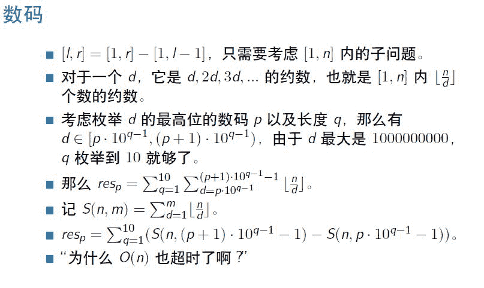
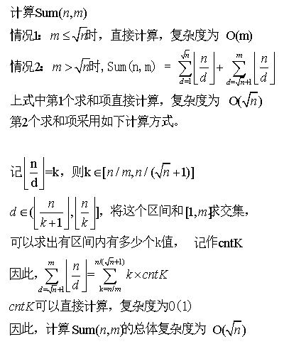

# CodeM 2017 美团编程大赛资格赛

## 1

给定两个整数 l 和 r ，对于所有满足 1 ≤ l ≤ x ≤ r ≤ 10⁹ 的 x ，把 x 的所有约数全部写下来。对于每个写下来的数，只保留最高位的那个数码。求 1～9 每个数码出现的次数。

本题知识点

数学 Java 工程师 C++工程师 安卓工程师 iOS 工程师 运维工程师 前端工程师 算法工程师 PHP 工程师 美团 golang 工程师 测试工程师 c#工程师 测试开发工程师 大数据开发工程师 2017

讨论

[脱缰的哈士奇～](https://www.nowcoder.com/profile/542028)

AC 代码如下

```cpp
//cpp
#include 
#include 
#include 
#include 
using namespace std;
typedef long long ll;
//枚举 d 的长度为 q，q 取值 1~10，将 10^(q-1)值保存到 pow 中
vector m_pow = { 1,10,100,1000,10000,100000,1000000,10000000,100000000,1000000000 };
ll getSum(ll n,ll m) {
    if (n == 0 || m == 0) {
        return 0;
    }
    m = min(n, m);
    ll res = 0;
    ll t = 0;
    ll cnt;
    for (t = 1; t <= m && (t*t) <= n; t++) {
        res += n / t;
    }
    for (ll k = n / t; k >= n / m; k--) {
        cnt = min(m, n / k) - n / (k + 1);
        res += k*cnt;
    }
    return res;
}
//计算[1,num]内约数情况
void getFactors(ll num, vector& res) {
    for (int p = 1; p <= 9; p++) {   //p 为枚举 d 的数码 1~9
        for (int q = 1; q <= 10; q++) {  //j 表示枚举 d 的长度 q  1~10  
            if ((p * m_pow[q - 1] - 1) > num) {
                break;
            }
            else {
                res[p] += (getSum(num, min(num,(p + 1) * m_pow[q - 1] - 1)) - getSum(num, p * m_pow[q - 1] - 1));
            }
        }
    }
}
int main(){
    ll left, right;
    while (cin >> left >> right) {
        vector res1(10);  //用于记录结果
        vector res2(10);  //用于记录结果
        getFactors(left-1,res1);
        getFactors(right, res2);
        for (int i = 1; i <= 9; i++) {
            cout << res2[i] - res1[i] << endl;
        }
    }
    system("pause");
    return 0;
} 
```



考虑[left,right] = [1,right] - [1,left-1]，将问题转化为[1,right]和[1,left-1]两个子区间问题。下面只要求解[1,n]区间问题即可。 对于一个数 d，它是 d，2d，3d， ... 的约数，也就是区间[1, n]内约数 d 出现的次数为 n/d（向下取整）。 考虑枚举约数 d 的数码 p（即最高位的值）和数字位数 q，那么有 d 属于[p*10^(q-1),(p+1)*10^(q-1))。例如，最高位为 1 的约数 d 出现在[1,2)，[10,20)，[100,200) 等区间；最高位为 4 的约数 d 出现在[4,5)，[40,50)，[400,500) 等区间。 > 这样划分区间的好处是区间中值的最高位都一样，方便统计。不用再去求解约数的最高位。 > 由于 d 最大是 10⁹，因此，通过上式计算得，q 最大取值为 10。

参照上图，计算约数为 p 的个数为

```cpp
//枚举 d 的长度为 q，q 取值 1~10，将 10^(q-1)值保存到 pow 中
vector m_pow = { 1,10,100,1000,10000,100000,1000000,10000000,100000000,1000000000 };
for (int p = 1; p <= 9; p++) {   //p 为枚举 d 的数码 1~9
    for (int q = 1; q <= 10; q++) {  //j 表示枚举 d 的长度 q  1~10  
        res[p] += (getSum(num, (p + 1) * m_pow[q - 1] - 1) - getSum(num, p * m_pow[q - 1] - 1));
    }
} 
```

对上述算法再进行优化，限制区间小于等于 num。

```cpp
for (int p = 1; p <= 9; p++) {   //p 为枚举 d 的数码 1~9
    for (int q = 1; q <= 10; q++) {  //j 表示枚举 d 的长度 q  1~10  
        if ((p * m_pow[q - 1] - 1) > num) {
            break;
        }
        else {
            res[p] += (getSum(num, min(num,(p + 1) * m_pow[q - 1] - 1)) - getSum(num, p * m_pow[q - 1] - 1));
        }    
    }
} 
```

下面分析如何计算 Sum(n,m)。**如果直接计算，则复杂度为 O(n)。牛客网系统仍然会判断超时。应该对算法进行优化处理，这也是本题的难点。**



对应的代码实现为

```cpp
for (ll k = n / t; k >= n / m; k--) {
    cnt = min(m, n / k) - n / (k + 1);
    res += k*cnt;
} 
```

编辑于 2017-06-19 23:05:24

* * *

[斯巴达勇士 3000](https://www.nowcoder.com/profile/3119883)

import java.util.ArrayList;import java.util.Scanner;public class Main {public static void main(String[]args){Scanner sc=new Scanner(System.in);long n=sc.nextLong();long m=sc.nextLong();long[]a=new long[(int) (m-n+1)];for(int i=0;i<a.length;i++){a[i]=n;n++;}long[]temp=new long[10];int index=0;//用来做 temp 数组的一个索引 long j=1;ArrayList<Long>list=new ArrayList<>();for(int i=0;i<a.length;i++){for(j=1;j*j<a[i];j++){if(a[i]%j==0){list.add(j);list.add(a[i]/j);}}if(j*j==a[i]){list.add(j);}for(long l:list){String str=String.valueOf(l);char s=str.charAt(0);//利用字符串求出最高位 index=(int) Long.parseLong(s+"");temp[index]++;}list.clear();}for(int i=1;i<=temp.length-1;i++){System.out.println(temp[i]);}}}这是我写的例子，几百万的数字可以，但是上亿就不行了，请大神指正，不甚感激！

编辑于 2017-06-18 15:51:12

* * *

[clov](https://www.nowcoder.com/profile/5621460)

```cpp
function sol(a, b) {
    var ret = [0,0,0,0,0,0,0,0,0];
    for(let i=a; i<=b; i++) {
        iter(i, ret);
    }
    return ret;
}

function iter(x, ret) {
    var num1;
    var num2;
    for(let i=1; i*i<=x; i++) {

        if(x % i == 0) {
            num1 = i;
            num2 = x/i;
            while(num1/10 >= 1){
                num1 = Math.floor(num1/10);
            }
            if(num2 != num1){
                while(num2/10 >= 1){
                    num2 = Math.floor(num2/10);
                }
                ret[num2-1] += 1;   
            }
            ret[num1-1] += 1;
        }
    }
}

var data = readline().split(' ');
var a = parseInt(data[0]);
var b = parseInt(data[1]);
var result = sol(a,b);
for(let i=0; i<9; i++) {
    print(result[i]);
} 
```

相对于暴力遍历，这里面我只加了

```cpp
for(let i=1; i*i<=x; i++) 
```

这一个优化，应该时间复杂度可以到 o(n√n)的，但是结果出错，32-8300 的例子，返回的数字不对，有没大神帮我看下我哪里出了 bug？只是缩小了一下遍历范围呀。

发表于 2018-03-27 23:04:20

* * *

## 2

美团外卖的品牌代言人袋鼠先生最近正在进行音乐研究。他有两段音频，每段音频是一个表示音高的序列。现在袋鼠先生想要在第二段音频中找出与第一段音频最相近的部分。

具体地说，就是在第二段音频中找到一个长度和第一段音频相等且是连续的子序列，使得它们的 difference 最小。两段等长音频的 difference 定义为：
difference = SUM((a[i] - b[i])² )(1 ≤ i ≤ n),其中 SUM()表示求和
其中 n 表示序列长度，a[i], b[i]分别表示两段音频的音高。现在袋鼠先生想要知道，difference 的最小值是多少？数据保证第一段音频的长度小于等于第二段音频的长度。

本题知识点

枚举 Java 工程师 C++工程师 安卓工程师 iOS 工程师 运维工程师 前端工程师 算法工程师 PHP 工程师 美团 golang 工程师 测试工程师 c#工程师 测试开发工程师 大数据开发工程师 2017

讨论

[零葬](https://www.nowcoder.com/profile/75718849)

这么小的数据量，暴力滑窗就过了

```cpp
import java.io.BufferedReader;
import java.io.InputStreamReader;
import java.io.IOException;

public class Main {
    public static void main(String[] args) throws IOException {
        BufferedReader br = new BufferedReader(new InputStreamReader(System.in));
        int n = Integer.parseInt(br.readLine());
        String[] strs = br.readLine().split(" ");
        int[] a = new int[n];
        for(int i = 0; i < n; i++){
            a[i] = Integer.parseInt(strs[i]);
        }
        int m = Integer.parseInt(br.readLine());
        strs = br.readLine().split(" ");
        int[] b = new int[m];
        for(int i = 0; i < m; i++){
            b[i] = Integer.parseInt(strs[i]);
        }
        int min = Integer.MAX_VALUE;
        for(int i = 0; i <= m - n; i++){
            min = Math.min(min, getDifference(a, b, i, n));
        }
        System.out.println(min);
    }

    private static int getDifference(int[] a, int[] b, int start, int len) {
        int difference = 0;
        for(int i = start; i < start + len; i++){
            difference += (a[i - start] - b[i])*(a[i - start] - b[i]);
        }
        return difference;
    }
}
```

发表于 2022-01-10 20:44:14

* * *

[tp_16b](https://www.nowcoder.com/profile/2209451)

**暴力求解**

* * *

```cpp
#include <iostream>
 #include <vector>
 #include <math.h>
 using namespace std;

 int GetMinDiff(const vector<int>& sub, const vector<int>& lng)
 {
     int len1 = sub.size( ) ;
     int len2 = lng.size( ) ;
     if(len1 > len2) return -1;

     int min = 0x7fffffff, curDiff = 0;
     for(int i=0; i < len2-len1; ++i){
         int k = i;
         curDiff = 0;
         for(int j = 0; j< len1; ++j){
             int dif = abs(sub[j]-lng[k++]);
             curDiff += (int)pow((double)dif, (double)2);
         }
         if(min > curDiff){
             min = curDiff;
         }
     }
     return min;
 }

 int main( )
 {
     int n,m;
     while( cin>>n){
         vector<int> v1(n, 0);
         for(int i=0; i< n; ++i)
             cin>>v1[i];

         cin>>m;
         vector<int> v2(m, 0);
         for(int i=0; i< m; ++i)
             cin>>v2[i];
         cout<<GetMinDiff(v1, v2)<<endl;
     }
     return 0;
 } 
```

发表于 2018-09-25 18:59:50

* * *

[→①年前↑](https://www.nowcoder.com/profile/5546266)

import java.util.Scanner;public class Main {public static void main(String[] args) {// TODO Auto-generated method stubScanner scanner = new Scanner(System.in);int n = scanner.nextInt();int[] song1 = new int[n];for (int i = 0; i < n; i++) {song1[i]=scanner.nextInt();}int m = scanner.nextInt();int[] song2 = new int[m];for (int i = 0; i < m; i++) {song2[i]=scanner.nextInt();}long result = Long.MAX_VALUE;for (int i = 0; i <= m-n; i++) {long temp = 0;for (int j = 0; j < n; j++) {temp+=Math.pow(song1[j]-song2[i+j], 2);}if (temp<result) {result = temp;}}System.out.println(result);scanner.close();}}

发表于 2017-06-18 01:38:07

* * *

## 3

组委会正在为美团点评 CodeM 大赛的决赛设计新赛制。

比赛有 n 个人参加（其中 n 为 2 的幂），每个参赛者根据资格赛和预赛、复赛的成绩，会有不同的积分。比赛采取锦标赛赛制，分轮次进行，设某一轮有 m 个人参加，那么参赛者会被分为 m/2 组，每组恰好 2 人，m/2 组的人分别厮杀。我们假定积分高的人肯定获胜，若积分一样，则随机产生获胜者。获胜者获得参加下一轮的资格，输的人被淘汰。重复这个过程，直至决出冠军。

现在请问，参赛者小美最多可以活到第几轮（初始为第 0 轮）？

本题知识点

深度优先搜索(DFS) Java 工程师 C++工程师 安卓工程师 iOS 工程师 运维工程师 前端工程师 算法工程师 PHP 工程师 美团 golang 工程师 测试工程师 c#工程师 测试开发工程师 大数据开发工程师 2017

讨论

[求被华为捞](https://www.nowcoder.com/profile/9797527)

```cpp
#通过率百分之 95，超过使用内存，可能是排序的问题
#!/usr/bin/env python
# coding=utf-8

if __name__ == "__main__":
    m=int(raw_input())
    a=map(int,raw_input().split())
    n=a[0]
    a.sort()
    roun=0
    for k in range(1,21):
        if 2**k==m:
            h=k
    if len(a)==1:
        roun=0
    elif n<a[1]:
        roun= 0
    elif n>=a[-1]:
        roun= h
    else:
        for i in range(h) :
            x=(a[:2**i])[-1]
            y=(a[:2**(i+1)])[-1]
            if x<=n<y:
                roun= i
    print roun

```

编辑于 2018-04-19 15:13:45

* * *

[r088r088](https://www.nowcoder.com/profile/8084070)

```cpp
#比赛只在分数小于等于小美的这群人里进行，比小美分数高的不管
#所以统计算上小美在内的分数小于等于小美的人数
#每次除以 2，取整数部分（多出来的那一个和分数高的人去比了）
#最后，能除几次 2，就能比几次。
#注意的情况是，如果小美不是全场最大，最后一次厮杀小美输掉
#这局不算“活下来”，所以最后一次不算。  #include <iostream>
#include <vector>
using namespace std;
int main() {
	long long n;
	while (cin >> n) {
		long long d1,d2;
		if (n == 1)
		{
			cin >> d1;
			cout << 0 << endl;
			continue;
		}
		if (n == 2)
		{
			cin >> d1;
			cin >> d2;
			if (d1 < d2)
				cout << 0 << endl;
			else
				cout << 1 << endl;
			continue;
		}
		long long tmp, count = 1, myScore, answer = 0;
		cin >> myScore;
		for (size_t i = 0; i < n - 1; i++)
		{
			cin >> tmp;
			if (tmp <= myScore)	count++;
		}
		while (count != 1)
		{
			count /= 2;
			answer++;
		}
		cout << answer << endl;
	}
}
```

编辑于 2017-06-19 20:00:18

* * *

[零葬](https://www.nowcoder.com/profile/75718849)

数学方法，看小美的分数在升序序列中排在第几（相等的排到前面去）。因为每次淘汰一半的人，对这个排名求 log2 就是她最多能挨过的轮数。

```cpp
import java.io.BufferedReader;
import java.io.InputStreamReader;
import java.io.IOException;

public class Main {
    public static void main(String[] args) throws IOException {
        BufferedReader br = new BufferedReader(new InputStreamReader(System.in));
        int n = Integer.parseInt(br.readLine());
        String[] scores = br.readLine().split(" ");
        int mei = Integer.parseInt(scores[0]);
        int rank = 1;
        // 找到有多少人可以排小美前面
        for(int i = 1; i < n; i++){
            if(Integer.parseInt(scores[i]) <= mei){
                rank++;
            }
        }
        System.out.println(log2(rank));
    }

    private static int log2(int n) {
        return (int)(Math.log(n) / Math.log(2));
    }
}
```

注意求小美分数的排名千万不要去排序，这个数据量下排序会超时，直接 O(N)的复杂度看有多少人可以排在她的前面就行。

编辑于 2022-01-10 21:11:19

* * *

## 4

n 个小区排成一列，编号为从 0 到 n-1 。一开始，美团外卖员在第 0 号小区，目标为位于第 n-1 个小区的配送站。
给定两个整数数列 a[0]~a[n-1] 和 b[0]~b[n-1] ，在每个小区 i 里你有两种选择：
1) 选择 a：向前 a[i] 个小区。
2) 选择 b：向前 b[i] 个小区。

把每步的选择写成一个关于字符 ‘a’ 和 ‘b’ 的字符串。求到达小区 n-1 的方案中，字典序最小的字符串。如果做出某个选择时，你跳出了这 n 个小区的范围，则这个选择不合法。
• 当没有合法的选择序列时，输出 “No solution!”。
• 当字典序最小的字符串无限长时，输出 “Infinity!”。
• 否则，输出这个选择字符串。

字典序定义如下：串 s 和串 t，如果串 s 字典序比串 t 小，则
• 存在整数 i ≥ -1，使得∀j，0 ≤ j ≤ i，满足 s[j] = t[j] 且 s[i+1] < t[i+1]。
• 其中，空字符 < ‘a’ < ‘b’。

本题知识点

广度优先搜索(BFS) Java 工程师 C++工程师 安卓工程师 iOS 工程师 运维工程师 前端工程师 算法工程师 PHP 工程师 美团 golang 工程师 测试工程师 c#工程师 测试开发工程师 大数据开发工程师 2017

讨论

[VisStu](https://www.nowcoder.com/profile/2497140)

分析一下题目的要求，字典序最小，也就是尽量能选 a 就选 a，除非选 a 到不了终点，我们才选 b。如果当前位置选 a 会一直打转（进入循环），而选 b 可以抵达终点，我们仍然会选 a。因为两种方案：aaaabaaaaaab 方案二多打转了几次，它的字典序就比方案一的要小了（换句话说就是如果你先选 b，你就输了）。即打转次数越多，字典序就越小。但打转次数可以无限次，所以这时要输出"Infinity!"。（那么有没有更短些的路径呢，比如 aaaa 就可以抵达，而不用 aaaab 这样？）（大兄弟不可能的，同一个位置选同一个方案只能到同一个目的地啊，大家前面都是 4 个 a，不可能谁要多走个 b 的）具体怎么处理呢：根据一开始的数据可以获取小区之间的路径（注意是单向的），用邻接矩阵或者其他什么的存一存，从终点开始广搜一遍，只要是经过的点都标记一下，代表从这个点出发，是存在路径能够抵达终点的。（如果标记完发现，起点没标记，那说起点->终点是没路的）。然后从起点开始正向搜一遍，只要选 a 后抵达位置拥有标记（即能抵达终点 ）的，那我们就选 a 方法，否则选 b 方法。这样的路径是唯一的，中间不会出现岔路，搜索过程中，如果你发现走到以前走过的点上，那说进入循环了，退出去输个" Infinity!"即可，如果走到终点了，那就直接输出结果。

发表于 2017-06-20 22:31:11

* * *

[r088r088](https://www.nowcoder.com/profile/8084070)

1\. 使用递归遍历 ab 的所有可能组合 2\. 值得注意的是，对于 n 个小区，如果递归深度大于 n-1，则表明发生了循环    说明：比如一条路的长度为 123456，如果没有循环，则答案最大长度为 5，比如从 1 到 2，   2 到 3，到 4，到 5。假如循环，则长度必然大于 5.
另外，走过的路径要封死，即将遍历 ab 后仍无法得到解的点的参数置为 n+1 答的时候因为超时修改了太多次，事实上只完成上述一条即可

```cpp
#include <iostream>
#include <stdio.h>
#include <vector>
#include <string>
#include <set>
#include <algorithm>

using namespace std;
vector<int> a, b;

void calcAnsRe(const int &n, int pos, string &ans, int stop,
	bool &ok, string &answerS, bool &loop, bool &ansLoop, vector<int> &path, int &loopPos) {
	if (ok)	return;
	if (pos < 0 || pos >= n)	return;
	if (pos == n - 1)
	{
		answerS = ans;
		ok = true;
		if (loop)	ansLoop = true;
		return;
	}
	if (stop == 0)	return;
	if (!answerS.empty() && answerS <= ans)	return;

	if (find(path.begin(), path.end(), pos) != path.end()) {
		loop = true;
		loopPos = pos;
		return;
	}

	if (a[pos] != n + 1 && a[pos] + pos != loopPos)
	{
		ans += "a";
		path.push_back(pos);
		calcAnsRe(n, pos + a[pos], ans, stop - 1, ok, answerS, loop, ansLoop, path, loopPos);
		if (!ans.empty())	ans.pop_back();
		if (!path.empty())	path.pop_back();
	}
	if (b[pos] != n + 1 && b[pos] + pos != loopPos)
	{
		ans += "b";
		path.push_back(pos);
		calcAnsRe(n, pos + b[pos], ans, stop - 1, ok, answerS, loop, ansLoop, path, loopPos);
		if (!ans.empty())	ans.pop_back();
		if (!path.empty())	path.pop_back();
	}
	a[pos] = n + 1;
	b[pos] = n + 1;
	if (find(path.begin(), path.end(), loopPos) == path.end())
	{
		loop = false;
		loopPos = -1;
	}
}

int main() {
	int n;
	while (cin >> n) {
		string answerS;
		a.resize(n);
		b.resize(n);
		string tmp;
		bool ok = false, loop = false, ansLoop = false;
		vector<int> path;
		int atmp, btmp, loopPos = -1;
		if (n == 1)
		{
			cout << "" << endl;
			continue;
		}
		for (size_t i = 0; i < n; i++) {
			scanf("%d", &a[i]);
			atmp = a[i] + i;
			if (atmp < 0 || atmp >= n)
				a[i] = n + 1;
		}
		for (size_t i = 0; i < n; i++) {
			scanf("%d", &b[i]);
			btmp = b[i] + i;
			if (btmp < 0 || btmp >= n)
				b[i] = n + 1;
		}
		//for (size_t i = 0; i < n; i++)
		//{
		//	atmp = a[i];
		//	btmp = b[i];
		//	if (atmp != n + 1
		//		&& a[atmp + i] == n + 1
		//		&& b[atmp + i] == n + 1)
		//		a[i] = n + 1;
		//	if (btmp != n + 1
		//		&& a[btmp + i] == n + 1
		//		&& b[btmp + i] == n + 1)
		//		b[i] = n + 1;
		//}
		calcAnsRe(n, 0, tmp, n, ok, answerS, loop, ansLoop, path, loopPos);
		if (answerS.empty())
		{
			cout << "No solution!" << endl;
			continue;
		}
		else
		{
			if (ansLoop || answerS.size() > n - 1)
			{
				cout << "Infinity!" << endl;
				continue;
			}
			else	cout << answerS << endl;
		}
	}
}

```

编辑于 2017-06-27 07:44:16

* * *

[cyhhao](https://www.nowcoder.com/profile/9159797)

这一组测试用例是不是有问题？

```cpp
测试用例:
182
50 91 71 -87 70 -121 1 41 97 69 55 22 178 -32 1 -48 95 65 46 -102 82 -155 81 -95 134 73 -174 0 175 -93 82 82 -177 180 123 -132 28 -26 -28 127 -9 72 105 163 -103 -49 -98 131 58 117 22 -94 92 -168 128 19 15 23 -125 -12 -136 -9 -65 -36 99 -55 67 6 -167 9 96 -143 76 -143 28 91 -79 27 -32 -49 -44 158 113 -77 15 113 131 8 -161 38 70 91 -70 -148 -89 -49 -175 44 110 20 170 135 -17 -133 56 -102 -65 -45 -13 48 92 -33 -14 -87 -174 -37 16 51 142 -50 -91 -26 16 -181 20 -176 -55 18 6 -8 71 -114 65 -33 -36 -77 -125 121 79 13 110 -138 -115 -160 -81 -78 137 -141 -139 3 -7 -27 -80 -118 -7 62 -44 111 19 -59 -126 16 120 -53 -127 -95 -82 25 -14 176 40 -143 169 98 -122 52 55 171 -70 -13 -142 132
155 180 -18 128 -56 44 59 6 -16 108 -111 152 -139 34 37 110 -55 -58 -152 75 145 -168 122 10 138 -37 116 126 0 -124 1 180 -31 -13 4 54 -143 97 -157 52 22 -111 -45 -46 -25 -39 89 158 -91 79 9 -87 -113 71 -60 -161 151 46 -76 42 99 165 -6 -19 -57 -51 -143 88 148 119 -81 80 102 -77 -35 -6 -162 -144 -8 -120 -65 65 79 103 -52 -6 75 5 -106 105 -83 -84 40 -97 -1 56 -27 52 78 -44 -21 -93 -112 -87 -138 121 -46 -136 171 44 71 2 46 91 -41 -88 53 40 -78 30 27 -113 -65 94 180 -3 170 181 -48 69 15 -175 -164 -59 2 34 -138 -95 18 45 175 46 -13 93 99 -170 141 77 -20 15 89 -99 -58 144 -112 -13 -52 -86 -47 -100 109 -129 36 180 -131 178 -25 -178 -111 -136 179 -33 13 -64 81 70 -56 -38 129 0 -151 77

对应输出应该为:
Infinity! 
你的输出为:
aaaaaabbbbaabaaabbbaaaaaaabaababaaabbbaabaaabbbabaaaaaabababaabbbb 
```

是有最优解的啊？为什么判断为 Infinity？
求教~

发表于 2017-06-18 22:51:03

* * *

## 5

围棋是起源于中国有悠久历史的策略性棋类游戏。它的规则如下：
1\. 棋盘 19*19。
2\. 棋子分黑白两色，双方各执一色。
3\. 下法：每次黑或白着一子于棋盘的空点上。棋子下定后，不再向其他点移动。
4\. 棋子的气：一个棋子在棋盘上，与它相邻的空点是这个棋子的“气”（这里相邻是指两个点有公共边）。 相邻的点上如果有同色棋子存在，这些棋子就相互连接成一个不可分割的整体，气合并计算。
相邻的点上如果有异色棋子存在，此处的气便不存在。
如果棋子所在的连通块失去所有的气，即为无气之子，不能在棋盘上存在。
5\. 提子：把无气之子清理出棋盘的手段叫“提子”。提子有二种：
1) 着子后，对方棋子无气，应立即提取对方无气之子。
2) 着子后，双方棋子都呈无气状态，应立即提取对方无气之子。
6\. 禁着点：棋盘上的任何一空点，如果某方在此下子，会使该子立即呈无气状态，同时又不能提取对方的棋子，这个点叫做“禁着点”，该方不能在此下子。
7\. 禁止全局同形：无论哪一方，在成功进行了着子、提子操作后，棋盘局面不能和任何之前的局面相同。

你要做的是：输入一些操作，从空棋盘开始模拟这些操作。
对于每一步，若结果不正确，则输出对应的 miss 并且忽略这个操作，并在最后输出棋盘的局面。

本题知识点

哈希 Java 工程师 C++工程师 安卓工程师 iOS 工程师 运维工程师 前端工程师 算法工程师 PHP 工程师 美团 golang 工程师 测试工程师 c#工程师 测试开发工程师 大数据开发工程师 2017

讨论

[dqcxd](https://www.nowcoder.com/profile/3571951)

好难啊

发表于 2018-03-08 21:50:55

* * *

[快乐刷题男孩](https://www.nowcoder.com/profile/480752820)

#include <iostream>#include <vector>
using namespace std;

void everyStep(int step, vector<vector<vector<char>>>& board);  //每一步棋执行的函数
bool breathlessOrNot(vector<vector<vector<char>>>& board, vector<vector<char>>& flag, int step, int i, int j); //判断该子是否无气
void setAlive(vector<vector<vector<char>>>& board, vector<vector<char>>& flag, int step, int i, int j);  //盘活该子以及所有相连同色子

int main()
{
int testTime;
cin >> testTime;
cin.get(); //吃掉回车

for (int t = 1; t <= testTime; t++)
{
int n;
cin >> n;  //每组测试步数
cin.get();
//三维数组记录每步的棋盘情况，棋盘的 0 行、列和 20 行、列不用，只是为了方便避免数组越界
vector<vector<vector<char>>> board(n, vector<vector<char>>(21, vector<char>(21, '.')));

for (int step = 0; step < n; step++) //每一步棋执行的函数
everyStep(step, board);

for (int i = 1; i <= 19; i++)  //每次测试最终输入棋盘局面
{
for (int j = 1; j <= 19; j++)
cout << board[n - 1][i][j];
cout << endl;
}
}
return 0;
}

//每一步棋执行的函数
void everyStep(int step, vector<vector<vector<char>>>& board)
{
//如果不是第一步(step!=0)，先移植上一步的棋盘局面
if (step)
board[step] = board[step - 1];

char colorInput;
int rowInput, columnInput;
cin >> colorInput >> rowInput >> columnInput;
cin.get();

//判断落子处是否无子
if (board[step][rowInput][columnInput] == '.')
board[step][rowInput][columnInput] = colorInput;  //先落子
else
{
cout << "miss 1" << endl;
return;
}

char enemyColor;
if (colorInput == 'B')
enemyColor = 'W';
else
enemyColor = 'B';
vector<vector<char>> flag(21, vector<char>(21, 0)); //每一步的棋局都新建一个 char 型辅助二维数组来标记棋子是否有气（0 表示未访问，1 表示无气，2 表示有气）

int enemyBreathless = 0; //是否有相邻敌子无气，值不是 0 则表示落子之后有敌子无气（但值并不是无气的敌子的数量）
bool thisBreathless = breathlessOrNot(board, flag, step, rowInput, columnInput); //判断该步落子是否无气

//判断周围敌子是否无气
for (int rowNextTo = rowInput - 1; rowNextTo <= rowInput + 1; rowNextTo += 2) //判断上下相邻的棋子
if (board[step][rowNextTo][columnInput] == enemyColor && flag[rowNextTo][columnInput] == 0) //相邻棋子是敌子且未被访问
if (breathlessOrNot(board, flag, step, rowNextTo, columnInput))
enemyBreathless++;

for (int colomnNextTo = columnInput - 1; colomnNextTo <= columnInput + 1; colomnNextTo += 2) //判断左右相邻的棋子
if (board[step][rowInput][colomnNextTo] == enemyColor && flag[rowInput][colomnNextTo] == 0)
if (breathlessOrNot(board, flag, step, rowInput, colomnNextTo))
enemyBreathless++;

//判断是否违反规则 6：如果某方在此下子，会使该子立即呈无气状态，同时又不能提取对方的棋子，这个点叫做“禁着点”，该方不能在此下子。
if (thisBreathless && !enemyBreathless)
{
cout << "miss 2" << endl;
board[step] = board[step - 1];  //棋局恢复到上一步
return;
}
else if (enemyBreathless)  //如果敌子无气，则进行提子
{
for (int i = 1; i <= 19; i++)
for (int j = 1; j <= 19; j++)
if (board[step][i][j] == enemyColor && flag[i][j] == 1)
board[step][i][j] = '.';
}

//判断是否违反规则 7：禁止全局同形：无论哪一方，在成功进行了着子、提子操作后，棋盘局面不能和任何之前的局面相同。
for (int preStep = step - 1; preStep >= 0; preStep--)
if (board[step] == board[preStep])
{
cout << "miss 3" << endl;
board[step] = board[step - 1];  //棋局恢复到上一步
return;
}
}

//判断该子是否无气
bool breathlessOrNot(vector<vector<vector<char>>>& board, vector<vector<char>>& flag, int step, int i, int j)
{
char thisColor = board[step][i][j];
if ((board[step][i - 1][j] == '.' && i - 1 >= 1) || (board[step][i + 1][j] == '.' && i + 1 <= 19) || (board[step][i][j - 1] == '.' && j - 1 >= 1) || (board[step][i][j + 1] == '.' && j + 1 <= 19))
{   //如果该子四周有气，则该子及其所有“相连”同色子都有气（flag 置为 2），同时 return false；
setAlive(board, flag, step, i, j); //该子为第一个被发现有气的子，将该子及其所有相连同色子 flag 置为 2，表示有气
return false;
}

flag[i][j] = 1;  //该子四周无气，先假设其无气（后面可能会被重新置为 2）

for (int rowNextTo = i - 1; rowNextTo <= i + 1; rowNextTo += 2)  //判断上下相邻位置的同色子
if (board[step][rowNextTo][j] == thisColor && flag[rowNextTo][j] == 0)  //同色子要未被访问才执行后续判断
if (!breathlessOrNot(board, flag, step, rowNextTo, j))
return false;

for (int colomnNextTo = j - 1; colomnNextTo <= j + 1; colomnNextTo += 2) //判断左右相邻位置的同色子
if (board[step][i][colomnNextTo] == thisColor && flag[i][colomnNextTo] == 0)
if (!breathlessOrNot(board, flag, step, i, colomnNextTo))
return false;

return true;
}

//盘活该子以及所有相连同色子
void setAlive(vector<vector<vector<char>>>& board, vector<vector<char>>& flag, int step, int i, int j)
{
char thisColor = board[step][i][j];
flag[i][j] = 2;
for (int row = i - 1; row <= i + 1; row += 2)  //判断上下相邻位置
if (board[step][row][j] == thisColor && flag[row][j] != 2)
setAlive(board, flag, step, row, j);

for (int column = j - 1; column <= j + 1; column += 2) //判断左右相邻位置
if (board[step][i][column] == thisColor && flag[i][column] != 2)
setAlive(board, flag, step, i, column);
}

编辑于 2020-06-10 20:34:00

* * *

[暗影小猫咪](https://www.nowcoder.com/profile/3042070)

内存超限

发表于 2018-03-08 13:06:05

* * *

## 6

美团点评上有很多餐馆优惠券，用户可以在美团点评 App 上购买。每张优惠券有一个唯一的正整数编号。当用户在相应餐馆就餐时，可以在餐馆使用优惠券进行消费。优惠券的购买和使用按照时间顺序逐行记录在日志文件中，运营人员会定期抽查日志文件看业务是否正确。业务正确的定义为：一个优惠券必须先被购买，然后才能被使用。

某次抽查时，发现有硬盘故障，历史日志中有部分行损坏，这些行的存在是已知的，但是行的内容读不出来。假设损坏的行可以是任意的优惠券的购买或者使用。

现在问这次抽查中业务是否正确。若有错，输出最早出现错误的那一行，即求出最大 s，使得记录 1 到 s-1 满足要求；若没有错误，输出-1。

本题知识点

二分 Java 工程师 C++工程师 安卓工程师 iOS 工程师 运维工程师 前端工程师 算法工程师 PHP 工程师 美团 golang 工程师 测试工程师 c#工程师 测试开发工程师 大数据开发工程师 2017

讨论

[面壁人 10086](https://www.nowcoder.com/profile/983704473)

```cpp
#include<iostream>
#include<map>
using namespace std;
int main(){
    long int m;
    cin>>m;
    map<int,int> Xmap;
    int flag=0;
    int Scount=0;
    for(long int i=0;i<m;i++){
        char f;
        cin>>f;
        if(f=='I'){
            int code;
            cin>>code;
            Xmap[code]++;
            if(Xmap[code]==2){
                if(Scount>0){
                    Scount--;
                    Xmap[code]--;
                }else{
                    flag=1;
                    cout<<i+1<<endl;
                    i=m;
                }
            }
        }
        if(f=='O'){
            int code;
            cin>>code;
            Xmap[code]--;
            if(Xmap[code]==-1){
                if(Scount>0){
                    Scount--;
                    Xmap[code]++;
                }else{
                    flag=1;
                    cout<<i+1<<endl;
                    i=m;
                }
            }
        }
        if(f=='?'){
            Scount++;
        }

    }
    if(flag==0){
        cout<<-1<<endl;
    }
    return 0;
}

```

百分之 10 通过，那个 50w 的数据过不去，不知道啥情况

编辑于 2019-08-22 13:44:39

* * *

[一条大咸鱼](https://www.nowcoder.com/profile/8811452)

1.题目有问题？2.示例有问题？3.测试有问题？

发表于 2017-08-19 21:52:34

* * *</iostream>