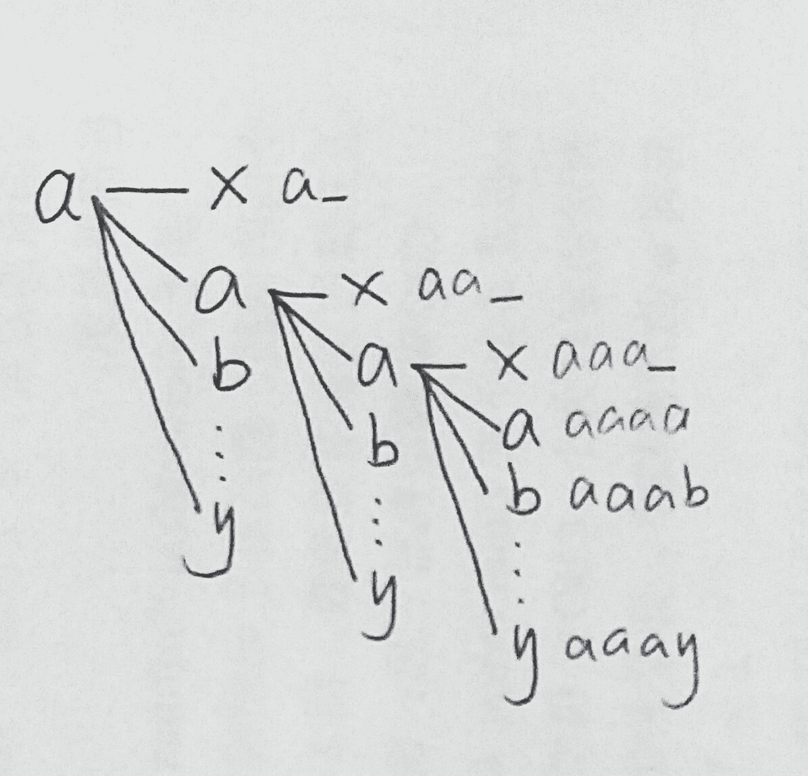
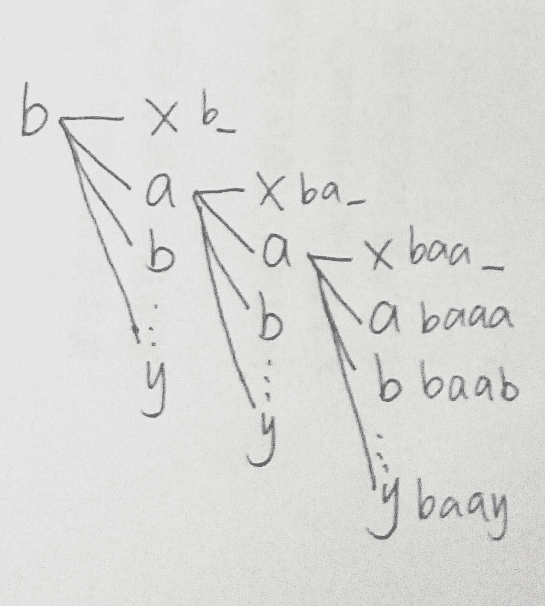

# 腾讯 2017 秋招笔试编程题

## 1

假定一种编码的编码范围是 a ~ y 的 25 个字母，从 1 位到 4 位的编码，如果我们把该编码按字典序排序，形成一个数组如下： a, aa, aaa, aaaa, aaab, aaac, … …, b, ba, baa, baaa, baab, baac … …, yyyw, yyyx, yyyy 其中 a 的 Index 为 0，aa 的 Index 为 1，aaa 的 Index 为 2，以此类推。 编写一个函数，输入是任意一个编码，输出这个编码对应的 Index.

本题知识点

模拟 字符串 *C++工程师 golang 工程师 iOS 工程师 安卓工程师 运维工程师 前端工程师 算法工程师 测试工程师 PHP 工程师 Java 工程师 腾讯 2017* *讨论

[夕一啊](https://www.nowcoder.com/profile/3913740)

题目还是有依据的：五笔的编码范围是 a 到 y 的 25 个字母，从 1 位到 4 位的编码，如果将五笔的编码按字典序排序，形成数组如下：a, aa, aaa, aaaa, aaab, aaac, ..., b, ba, baa, baaa, baab...yyyx, yyyy-------------不过还是有些难懂，这个字典序首先可以分成 25 个大块，每块是以字母 a-y 开头（不是 x 是叉，代表空，不满四个字符）
第一大块包含多少个呢？如果长度是 4，说明都不包含空（x）第一位已经确定，就是 a 还有三位可选（选 25 个字母之一），就是 25*25*25，长度是 3 说明有一个空，25*25,长度为 2，两个空只剩一个位置可以是 25 个字母中任意一个，25，长度是 1，那就只有 a 自己了。所以一共是  25³+25²+25+1--------例：bcd 第一位是 b 所以处在第二大块，result += 1 *  (25³+25²+25+1) 第二位是 c， result += 2 *（25²+25+1）+1 第三位是 d， result += 3* （25+1）+1  （加一是因为最前面有个空）第四位是空，不管，因为空就是第一个 result = 17658--------例：defc 第一位是 d 所以处在第四大块，result += 3 *  (25³+25²+25+1) 第二位是 e， result += 4 *（25²+25+1）+1 第三位是 f， result += 5* （25+1）+1 第四位是 c， result += 2* （1）+1result = 51567

编辑于 2017-07-25 09:56:47

* * *

[狐狸与猎犬](https://www.nowcoder.com/profile/627680)

给出一个比较好理解的办法吧（不用定义连乘常量）。这题应该是考组合吧。

给一个例子：
**dbc**

这是一个**3 位串**，算一下有多少种组合能小于它：1)1 位串。(d-a)**+1**种，第 1 位可以选[a,d)，**再加上 d 本身**。2)2 位串。(d-a)*25+(b-a)**+1**种，第 1 位选[a,d)那么第 2 位可以选 25 种，第 1 位选 d 那么第 2 位只能选[a,b)，**再加上 db 本身** 。上面是串长小于 3 的时候。3)3 位串。(d-a)*25²+(b-a)*25+(c-a)种，计算方法和上述相同。但是因为串长相同，**所以 dbc 本身不能要**，不用+1。下面是大于串长的情况。4)4 位串。(d-a)*25³+(b-a)*25²+(c-a)*25 种，**相当于在 3 位串的基础上乘 25** 。串的前缀相同，较长的串要排后面，所以不能要。小于 dbc 的情况就是上述 4 种情况之和，对于每个串都计算这 4 种情况。观察 4 个和的规律，可以利用已有结果避免重复计算。

import java.util.*;

public class Main {

```cpp
public static void main(String[] args) {
    Scanner cin = new Scanner(System.in);
    char[] s = cin.next().toCharArray();
    int n = s.length;

    //用 curSum 来保存已有计算结果
    //sum 计算 4 种情况之和
    int sum = 0, curSum = 0;
    for (int i = 0; i < 4; ++i) {
        curSum *= 25;
        if (i < n) {
            curSum += s[i] - 'a';
        }
        sum += curSum;
        if (i < n - 1) {
            sum += 1;
        }
    }

    System.out.println(sum);
    cin.close();
}
```

}

编辑于 2017-06-30 19:51:22

* * *

[AlbertSun](https://www.nowcoder.com/profile/107492)

```cpp
#include <stdio.h>
#include <string.h>

#define N1 1
#define N2 25
#define N3 (25 * 25)
#define N4 (25 * 25 * 25)

#define C1 N1
#define C2 (N1 + N2)
#define C3 (N1 + N2 + N3)
#define C4 (N1 + N2 + N3 + N4)

int main()
{
    char code[5] = {0};
    scanf("%s", code);
    int index = 0;
    switch(strlen(code)){
        case 4: index += C1 * (code[3] - 'a') + 1;
        case 3: index += C2 * (code[2] - 'a') + 1;
        case 2: index += C3 * (code[1] - 'a') + 1;
        case 1: index += C4 * (code[0] - 'a');
		default: break;
    }
    printf("%d\n", index);
    return 0;
}
```

编辑于 2017-06-26 16:39:07

* * *

## 2

游戏里面有很多各式各样的任务，其中有一种任务玩家只能做一次，这类任务一共有 1024 个，任务 ID 范围[1,1024]。请用 32 个 unsigned int 类型来记录着 1024 个任务是否已经完成。初始状态都是未完成。 输入两个参数，都是任务 ID，需要设置第一个 ID 的任务为已经完成；并检查第二个 ID 的任务是否已经完成。 输出一个参数，如果第二个 ID 的任务已经完成输出 1，如果未完成输出 0。如果第一或第二个 ID 不在[1,1024]范围，则输出-1。

本题知识点

模拟 C++工程师 golang 工程师 iOS 工程师 安卓工程师 运维工程师 前端工程师 算法工程师 测试工程师 PHP 工程师 Java 工程师 腾讯 2017

讨论

[小贱贱贱贱贱贱贱贱](https://www.nowcoder.com/profile/971917)

```cpp
import java.util.Scanner;
public class Main {
	public static void main(String[] args) {
		Scanner sc = new Scanner(System.in);
		int a = sc.nextInt();
		int b = sc.nextInt();
		if(a>1024||a<1||b>1024||b<1){
			System.out.println(-1);
		}else{
			if(a!=b)System.out.println(0);
			if(a==b)System.out.println(1);
		}
	}
}
```

我这样写是不是 low bee

发表于 2017-08-22 15:14:01

* * *

[哇咔哇咔](https://www.nowcoder.com/profile/5760775)

```cpp
//参考 pku_coder，改进版（速度更快）
//解释：1024=32*32,因此可用 32 个整数表示 1024 位(因为每个整数 32 位)
//因为任务 ID 范围是 1~1024,所以减 1 转化为 0~1023
//然后任务 ID 除以 32，商为存到哪个整数，余数为该整数对应位（置 1 即可）
//注：除以 32 相当于直接右移 5 位，对 32 取余相当于"与 31"（这个技巧只对 2 的次方数有效）．
//拓展：大数据处理，可自行查找 1-bitmap 和 2-bitmap．
#include <iostream>
using namespace std;

unsigned int arr[32];

int main()
{
    int id1, id2;
    while(cin>>id1>>id2)
    {
        if(!(id2>=1 && id2<=1024))
        {
            cout<<-1<<endl;
            continue;
        }
        arr[(id1-1)>>5] |= (1<<(id1&31));
        cout<<( (arr[(id2-1)>>5] & (1<<(id2&31))) != 0)<<endl;
    }
    return 0;
}

/*
再扩展一点：本算法只支持一次标记（已经满足题意：status 只能从 0 变成 1）。
在实际中如果需要重复标记（就是 status 可能从 0 变成 1，也可能从 1 变成 0），
则需要在设置状态之前先将对应的位清除，在第 22 行之前加一句
arr[(id1-1)>>5] &= ~(1<<(id1&31));
即可。
*/
```

编辑于 2018-09-30 20:10:14

* * *

[用户名无法显示](https://www.nowcoder.com/profile/8709341)

//1024 种任务有 2¹⁰²⁴ 种可能，需要 1024 个 bit，就是 1024/8=128byte。一个 int 是 4byte，刚好需要 32 个 int。就是说，把 32 个 int 排成一行，就是 1024 个 bit，每个 bit 来表示某个任务是否完成。#include<iostream>using namespace std;//参数：s 是 32 个 int 构成的数组。n 表示第几个任务（在这里从 0 开始），deal 表示操作类型：如果为 1 表示置位，否则表示取位。int check(unsigned int* s,int n,int deal){//if deal==1 set; else get;    int id=n/32;//注意 n 是从 0 开始的，否则就会不统一    int id2=n%32;    unsigned int b=0x80000000;//测试时候发现如果不加 unsigned 的话，就会出错。有符号数字会填充符号位// b 表示左边第一位是 1 其他都是 0 的无符号整数。    b>>=id2;    if(deal==1){    s[id]|=b;        return -1;    }else{        return (s[id]&b)!=0;    }}int main(){    int a,b;    cin>>a>>b;    unsigned int s[32]={};    if(a<1||a>1024 ||b<1||b>1024){        cout<<-1;        return 0;    }    check(s,a-1,1);    int i=check(s,b-1,0);    if(i)        cout<<1;    else        cout<<0;    return 0;}

发表于 2017-08-11 16:15:06

* * *

## 3

给定一个正整数，编写程序计算有多少对质数的和等于输入的这个正整数，并输出结果。输入值小于 1000。
如，输入为 10, 程序应该输出结果为 2。（共有两对质数的和为 10,分别为(5,5),(3,7)）

本题知识点

模拟 C++工程师 golang 工程师 iOS 工程师 安卓工程师 运维工程师 前端工程师 算法工程师 测试工程师 PHP 工程师 Java 工程师 腾讯 2017

讨论

[pengcheng_SU](https://www.nowcoder.com/profile/1487075)

```cpp
#include <iostream>
#include <vector>
using namespace std;

int main(){
	//筛选法求素数（删除所有素数的倍数）
	vector<int> v(1000,1);
	for(int i=2;i<1000;++i){
		for(int j=2;i*j<1000;++j){
			if(v[i]){
				v[i*j]=0;
			}
		}
	}
	int x;
	cin>>x;
	int res=0;
	for(int i=2;i<=x/2;++i){
		if(v[i]&&v[x-i]) ++res;
	}
	cout<<res<<endl;	
}
```

编辑于 2017-08-10 17:05:41

* * *

[指 offer 的剑在哪？](https://www.nowcoder.com/profile/3812129)

```cpp
import java.util.Scanner;

public class StringUtil {

	//素数对
	public static void main(String[] args) {

		Scanner in = new Scanner(System.in);
		int n = in.nextInt();
		int sum = 0;
		for(int i=2; i<=n/2; i++){
			if(isss(i) && isss(n-i)){
				sum++;
			}
		}
		System.out.println(sum);
	}

	//判断是否为素数
	public static boolean isss(int n){
	  for(int i=2; i<=Math.sqrt(n); i++){
	    if(n%i == 0)
              return false;
	  }  return true;
	}

}
```

编辑于 2017-09-24 18:19:16

* * *

[runK](https://www.nowcoder.com/profile/755918)

```cpp
#include<iostream>
#include<vector>
#include<cmath>
//判断是否为素数
bool isPrime(int n) {
	//注意是<=.....
	for (int i = 2; i <= sqrt(n); i++)
		if (n % i == 0)
			return false;
	return true;
}

//保存 1000 以内的素数
void PrimeIn1000(vector<int> &vec) {
	vec.push_back(2);
	for (int i = 3; i < 1000; i++)
		if (isPrime(i))
			vec.push_back(i);
}

//用两个迭代器分别指向 vector 的头尾，遇大则尾退，遇小则头进
int SumofPrimePair(int n) {
	vector<int> PrimeVec;
	PrimeIn1000(PrimeVec);
	int result = 0;
	vector<int>::iterator iterLeft = PrimeVec.begin();
	vector<int>::iterator iterRight = PrimeVec.end()-1;
	while (iterLeft <= iterRight) {
		int tempSum = *iterLeft + *iterRight;
		if (tempSum == n) {
			result++;
			iterLeft++;
			iterRight--;
		}
		else if (tempSum < n)
			iterLeft++;
		else
			iterRight--;
	}

	return result;
}

int main() {
	int n;
	cin >> n;
	cout << SumofPrimePair(n) << endl;
	system("pause");
	return 0;
}
```

发表于 2017-06-24 16:58:57

* * *

## 4

geohash 编码：geohash 常用于将二维的经纬度转换为字符串，分为两步：第一步是经纬度的二进制编码，第二步是 base32 转码。
此题考察纬度的二进制编码：算法对纬度[-90, 90]通过二分法进行无限逼近（取决于所需精度，本题精度为 6）。注意，本题进行二分法逼近过程中只保留整数部分而忽略掉小数部分（也即抹去小数部分）来进行二分，针对二分中间值属于右区间。算法举例如下： 针对纬度为 80 进行二进制编码过程： 1) 区间[-90, 90]进行二分为[-90, 0),[0, 90]，成为左右区间，可以确定 80 为右区间，标记为 1； 2) 针对上一步的右区间[0, 90]进行二分为[0, 45),[45, 90]，可以确定 80 是右区间，标记为 1； 3) 针对[45, 90]进行二分为[45, 67),[67,90],可以确定 80 为右区间，标记为 1； 4) 针对[67,90]进行二分为[67, 78),[78,90]，可以确定 80 为右区间，标记为 1； 5) 针对[78, 90]进行二分为[78, 84),[84, 90]，可以确定 80 为左区间，标记为 0； 6) 针对[78, 84)进行二分为[78, 81), [81, 84)，可以确定 80 为左区间，标记为 0； 本题知识点

模拟 C++工程师 golang 工程师 iOS 工程师 安卓工程师 运维工程师 前端工程师 算法工程师 测试工程师 PHP 工程师 Java 工程师 腾讯 2017

讨论

[新鲜菜鸡🐔](https://www.nowcoder.com/profile/3317181)

```cpp
首先对题目提出的向下取整很不解，，用数学的 math.floor  -1.2 向下取整为-2（我也以为这样）
但是只能过 90%，看了用例，发现他-1.2 取整为-1  wtf，直接用 int（）过了，麻烦说明下好不好，
很容易误解的，数字部分向下取整，真的服了。
s = int(input())
ans = ''
start = -90
end = 90
for i in range(6):
    mid = int((start+end)/2)
    if s<mid:
        ans+='0'
        end = mid
    elif s>=mid:
        ans+='1'
        start = mid
print(ans) 
```

发表于 2018-06-04 10:26:57

* * *

[追梦人物](https://www.nowcoder.com/profile/8004745)

我总觉得现在程序员出的题目语文表达能力令人捉急。“算法对纬度[-90, 90]通过二分法进行无限逼近（取决于所需精度，本题精度为 6）”，“无限逼近，精度为 6” 很容易让人理解为最终所得编码对应的区间 [x0，x1] 的精度为 6，即 |x1-x0|<10^-6，结果运行超时。你直接说所得编码位数为 6 不就可以了么？如果要是在工作中这种不明确的需求不久会给公司带来额外的沟通成本？

发表于 2017-09-11 10:32:58

* * *

[卷积神经网络哦](https://www.nowcoder.com/profile/8684256)

二分 这题有点像 lower_bound 那种 找到了不退出的类型

```cpp
#include<iostream>
#include<string>
using namespace std;
string s = "";
void bi(int l, int r, int v){
    int cnt = 6;
    while(l < r && cnt--){
        int mid = (r + l)/2;
        if(v >= mid) {s += '1'; l = mid;}
        else {s += '0'; r = mid;}
    }
}

int main(){
    int n; scanf("%d", &n);
    bi(-90, 90, n);
    cout<<s<<endl;
    return 0;
} 
```

发表于 2018-09-19 12:38:48

* * **