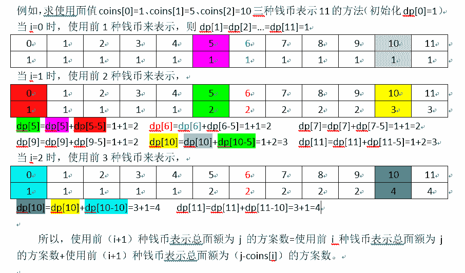
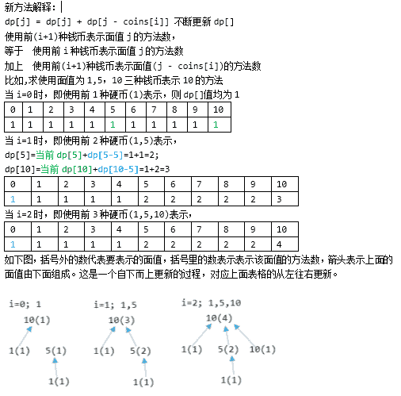
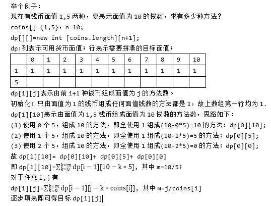
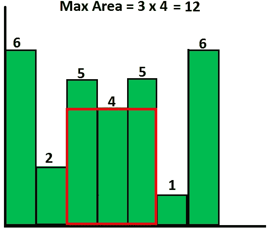
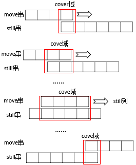

# 美团 2017 秋招笔试编程题

## 1

大富翁游戏，玩家根据骰子的点数决定走的步数，即骰子点数为 1 时可以走一步，点数为 2 时可以走两步，点数为 n 时可以走 n 步。求玩家走到第 n 步（n<=骰子最大点数且是方法的唯一入参）时，总共有多少种投骰子的方法。

本题知识点

美团 动态规划 C++工程师 golang 工程师 iOS 工程师 安卓工程师 运维工程师 前端工程师 算法工程师 测试工程师 PHP 工程师 Java 工程师 2017

讨论

[曹少平](https://www.nowcoder.com/profile/2532150)

/*思路：
递推关系为：dp[i] = dp[i - 1] * 2, dp[i]为走到第 n 步投骰子的方法
例如，dp[3] = 4
1 1 1
2 1
1 2
3
那么求解 dp[4]:
方案一：dp[4]和 dp[3]投骰子的次数一致，那么只需要在最后一次的投掷点数上加 1，前提是 n <= 骰子最大点数
1 1 1 -> 1 1 (1 + 1) = 1 1 2
2 1 -> 2 (1 + 1) = 2 2
1 2 -> 1 (2 + 1) = 1 3
3 -> (3 + 1) = 4
方案二：dp[4]比 dp[3]多投掷一次
1 1 1 -> 1 1 1 1
2 1 -> 2 1 1
1 2 -> 1 2 1
3 -> 3 1
因此，dp[4] = dp[3] * 2 */
#include <iostream>
using namespace std;
int kinds(int n)
{
 int dp[n + 1];
 dp[1] = 1;
 for(int i = 2; i <= n; i++)
  dp[i] = dp[i - 1] << 1;
 return dp[n]; 
}
int main()
{
 int N;
 cin>>N;
 cout<<kinds(N)<<endl;
}

编辑于 2017-07-13 11:30:51

* * *

[DustinJ](https://www.nowcoder.com/profile/7478675)

归纳：f(n) = f(n-1)+f(n-2)+f(n-3)+....+f(1)+1，f(1)=1,f(2)=2.则 f(n)=2^(n-1).

```cpp

	#include<iostream>

	#include<algorithm>

	using namespace std;  

	int main(){

	int n;

	while(cin>>n){

	cout<<pow(2,n-1)<<endl;

	}

	return0;

	} 

```

编辑于 2017-07-23 19:42:11

* * *

[啊啊啊 62](https://www.nowcoder.com/profile/7551327)

我很机智的用手算的，反正就 6 个输入...importjava.util.Scanner; publicclassMain {     publicstaticvoidmain(String[] args) {         Scanner in = newScanner(System.in);         intn=in.nextInt();        Main d=newMain();        d.myMethod(n);    }     publicvoidmyMethod(intn)    {        switch(n)        {        case1:            System.out.println("1");            break;        case2:            System.out.println("2");            break;        case3:            System.out.println("4");            break;        case4:            System.out.println("8");            break;        case5:            System.out.println("16");            break;            default:                System.out.println("32");        }    }}

发表于 2017-08-30 21:40:52

* * *

## 2

给你六种面额 1、5、10、20、50、100 元的纸币，假设每种币值的数量都足够多，编写程序求组成 N 元（N 为 0~10000 的非负整数）的不同组合的个数。

本题知识点

Java 工程师 C++工程师 安卓工程师 iOS 工程师 运维工程师 前端工程师 算法工程师 PHP 工程师 测试工程师 美团 动态规划 golang 工程师 2017

讨论

[YangWang](https://www.nowcoder.com/profile/460426)



发表于 2017-08-29 21:01:16

* * *

[昵称真难取](https://www.nowcoder.com/profile/7904149)

```cpp
//原来的答案 算法复杂度太大 空间复杂度也大
//参考讨论区的 更新 新方法  
import java.util.Scanner;
import java.util.Arrays;
public class Main{
	public static long count(int n){
		if(n <= 0)return 0;
		int[] coins = new int[]{1,5,10,20,50,100};
		long[] dp = new long[n+1];
		dp[0] = 1;
		for(int i = 0; i < coins.length; i++) {
		for(int j = coins[i]; j <= n; j++) {
		dp[j] = dp[j] + dp[j - coins[i]];//类似斐波那契 后者的种类数基于前者
		}
	}
	return dp[n];
	}
	public static void main(String args[]){
		Scanner sc=new Scanner(System.in); 
		while(sc.hasNext()){
			int n=sc.nextInt();
			long res=count(n);
			System.out.println(res);
		}
	}
} 

```



```cpp
//原方法 

	import java.util.Scanner;

	import java.util.Arrays;

	public class Main{

	 public static long count(int n){

	    int coins[]={1,5,10,20,50,100};

	    int h=coins.length;

	    long dp[][]=new long[h][n+1];

	    Arrays.fill(dp[0], 1);//基础 该数字都由 1 组成 方法数是 1

	    for(int i=1;i<h;i++){

	      for(int j=1;j<=n;j++){

	        int m=j/coins[i];

	        for(int k=0;k<=m;k++){

	        dp[i][j]=dp[i][j]+dp[i-1][j-k*coins[i]];

	         }

	       }

	     }

	return dp[h-1][n];

	}  

```



编辑于 2017-07-18 11:34:50

* * *

[Picky](https://www.nowcoder.com/profile/753250)

```cpp
#include<iostream>
using namespace std;

int main(){
    int N = 0;
    cin >> N;
    long long * F = new long long[N + 1]();
    int c[6] = { 1, 5, 10, 20, 50, 100 };

    F[0] = 1;
    for (int i = 0; i < 6; i++)
        for (int v = c[i]; v <= N; v++){
            F[v] = F[v] + F[v - c[i]];
        }
    cout << F[N]<<endl;
    return 0;
}
```

发表于 2017-07-01 19:17:41

* * *

## 3

给定一组非负整数组成的数组 h，代表一组柱状图的高度，其中每个柱子的宽度都为 1。 在这组柱状图中找到能组成的最大矩形的面积（如图所示）。 入参 h 为一个整型数组，代表每个柱子的高度，返回面积的值。

本题知识点

Java 工程师 C++工程师 安卓工程师 iOS 工程师 运维工程师 前端工程师 算法工程师 PHP 工程师 测试工程师 美团 栈 *golang 工程师 2017* *讨论

[fyan 飞](https://www.nowcoder.com/profile/7848562)

```cpp
package com.yf.meituan;

import java.util.Scanner;

/*
 * 遍历数组每一个值，然后用两个指针从当前位置向两边寻找左右边界，大于等于当前值时则对应指针加 1，
 * 这样最后得到以当前值为最小高度的矩形宽度，然后计算面积并与最大值比较并保存其中最大的值
 */
public class Main {
	public static void main(String[] args){
		Scanner sc = new Scanner(System.in);
		int n = sc.nextInt();
		int[] height = new int[n];
		for(int i =0;i<n;i++){
			height[i] = sc.nextInt();
		}

		int maxArea = -1;
		for(int i = 0;i<n;i++){
			int left=i;
			int right=i;

          //计算以当前值为最小高度的矩形面积
			while(left > 0 && height[left-1] >= height[i])  left--;//寻找左边界
			while(right < n-1 && height[right+1] >= height[i])  right++;//寻找右边界
			int tempArea = (right-left+1) * height[i];

			if(maxArea<tempArea) maxArea=tempArea;
		}

		System.out.println(maxArea);
	}
}

```

编辑于 2017-09-01 17:26:16

* * *

[茄子土豆泡米饭](https://www.nowcoder.com/profile/3103802)

```cpp
'''
分治法：最大矩形面积只可能有三种情况：
1\. 取决于高度最小的柱子，此时面积等于高度乘总长度；
2\. 最大面积出现在高度最小的柱子左边；
3\. 最大面积出现在高度最小的柱子右边；
'''
n = int(raw_input())
h = [int(x) for x in raw_input().split()]

def largestarea(a):
    l = len(a)
    idx = a.index(min(a))

    value1 = a[idx] * l

    if idx != 0:
        value2 = largestarea(a[0:idx])
    else:
        value2 = 0
    if idx != l-1:
        value3 = largestarea(a[idx+1:l])
    else:
        value3 = 0
    return max(value1, value2, value3)

print largestarea(h)
```

发表于 2017-06-29 14:41:44

* * *

[好吃不过炸酱面](https://www.nowcoder.com/profile/7145772)

```cpp
import java.util.Scanner; 
import java.util.Arrays; 
public class Main { 
    public static int getMaxArea(int[] height) { 
        int len = height.length;
        int max = 0;//存储最大面积的
        for(int i = 0;i<len;i++){//i 表示依次遍历每一个高度
            int minHeight = height[i];//设 i 为最小高度  
            for(int j=(i+1); j<len; j++){  
                minHeight = Math.min(minHeight, height[j]);//找出 i 之后的最小高度
                max = Math.max(max, (j-i+1)*minHeight);//计算以最小高度为高度的最大面积值
            }  
       }
        return max;
    }
    public static void main(String args[]) { 
        Scanner sc = new Scanner(System.in); 
        int n = sc.nextInt();
        int [] arr = new int[n];
        for(int i=0;i<n;i++){ 
          arr[i]=sc.nextInt();
        } 
       System.out.println(getMaxArea(arr));
    } 
}

```

发表于 2017-07-14 17:08:59

* * *

## 4

给出两个字符串（可能包含空格）,找出其中最长的公共连续子串,输出其长度。

本题知识点

Java 工程师 C++工程师 安卓工程师 iOS 工程师 运维工程师 前端工程师 算法工程师 PHP 工程师 测试工程师 美团 字符串 *golang 工程师 2017* *讨论

[CrazyCodingGirl](https://www.nowcoder.com/profile/3582338)

```cpp
#include<iostream>
#include<string>
#include<vector>
using namespace std;
int main()
{
	string str1, str2;
	while (getline(cin, str1),getline(cin,str2))
	{
		int max = 0;
		vector<vector<int>> dp(str1.size(),vector<int>(str2.size(),0));
		for (int i = 0; i < str1.size(); i++)
		{
			for (int j = 0; j < str2.size(); j++)
			{
				if (str1[i] == str2[j])
					if (i == 0 || j == 0)
						dp[i][j] = 1;
					else
						dp[i][j] = dp[i - 1][j - 1] + 1;					
				if (dp[i][j]>max)
					max = dp[i][j];
			}
		}
		cout << max << endl;
	}
	return 0;
}

```

发表于 2017-08-31 14:39:25

* * *

[及时行乐 z](https://www.nowcoder.com/profile/7818261)

DP 问题，利用空间换时间，时间复杂度 O(NM),空间 O(NM)思想：创建一张二维表，本来这张表是用来存储字符 A[i]和 B[j]是否相等然后将表中(i,j)位置置为 1。遍历结束后，计算所有的对角线上连续 1 的个数，取最大值就是结果。但是现在，换种方法，遍历的同时，计算当前斜对角的值，然后用一个变量 res 记录最大的值即可。它的公式为：如果 A[i - 1] == B[j - 1]，那么 dp[i][j] = dp[i - 1][j - 1] + 1;其中 dp[0][...]和 dp[...][0]都是 0，这是初始状态。例子：字符串 A：abcde
字符串 B：abgde
表 11   0   0   0   0
0   1   0   0   00   0   0   0   00   0   0   1   00   0   0   0   1 这个不可以直接得到结果，需要再遍历一次计算。表 20  0   0   0   0   00  1   0   0   0   00  0   2   0   0   00  0   0   0   0   00  0   0   0   1   00  0   0   0   0   2 这个可以直接得到结果，不需要再遍历一次计算。

```cpp
  #include<iostream>

	#include<string>

	#include<vector>

	using namespace std;

	int solve(string& A, string& B)

	{

	int res = 0,n = B.size();

	vector<vector<int> > dp(A.size() + 1);

	for(int i = 0;i < A.size() + 1;i++)

	dp[i].resize(n + 1);

	for(int i = 1;i <= A.size();i++)

	{

	for(int j =  1; j <= n; j++)

	{

	if(A[i - 1] == B[j - 1])

	res = max(res,dp[i][j] = dp[i - 1][j - 1] + 1);

	}

	}

	return res;

	}

	int main()

	{

	string A, B;

	getline(cin, A);

	getline(cin, B);

	cout << solve(A, B) << endl;

	return0;

	}

```

优化了一下得到空间复杂度为 O(n)和 O(1)的版本。

```cpp
 int LongestSubstr(string A,string B)
{     vector<int> dp(A.size() + 1);   
      int res = 0;  for (int i = 1; i <= A.size(); i++)    
      {       
          for (int j = 1; j <= B.size(); j++)  {         
              if (A[i - 1] == B[i - 1])      
              res = max(res, dp[j] = dp[j - 1] + 1);       
          }    
       }    
     return res;
}

```

```cpp
int LongestSubstr(string A,string B)
{     int res = 0, len = 0, flag = 0;    
      for (int i = 1; i <= A.size(); i++)  
      {     
           for (int j = 1; j <= B.size(); j++)  
           {  if (A[i - 1] == B[j - 1])  res = max(res, len += 1), flag = 1;   
           }  if (!flag) len = 0;   
           flag = 0;    
     }    
     return res;
}

```

编辑于 2017-10-14 17:41:54

* * *

[草莓冰激凌](https://www.nowcoder.com/profile/7413344)

我提供另一种思路：取较短字符串为 move 串，较长的是 still 串。move 串从 still 串上面滑过，他们重叠部分是 cover 域，比较 cover 域对应字符。# coding: utf-8a, b = raw_input(), raw_input()if len(a) > len(b):  # 选择比较长的字符串作为 still 串    s, m = a, belse:    s, m = b, alen_s, len_m = len(s), len(m)  # still 串和 move 串的长度。max_len = 0for i in range(len_m + len_s - 1):    # 分三种情况确定 cover 域的范围    if i < len_m - 1:  # move 串没有完全进入 still 串        s_range, m_range = (0, i + 1), (len_m - 1 - i, len_m)    elif len_m-1 <= i <= len_s - 1:  # move 串完全进入 still 串        s_range, m_range = (i - len_m + 1, i + 1), (0, len_m)    elif i > len_s - 1:  # move 串开始脱出 still 串        s_range, m_range = (i - len_m + 1, len_s), (0, len_s + len_m - 1 - i)    s_cover, m_cover = range(*s_range), range(*m_range)  # still 串和 move 串在 cover 域内的 index    l = 0    for j in range(len(s_cover)):        if s[s_cover[j]] == m[m_cover[j]]:            l += 1            if l > max_len:                max_len = l        else:            l = 0print max_len

发表于 2017-06-26 17:45:19

* * ***