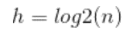
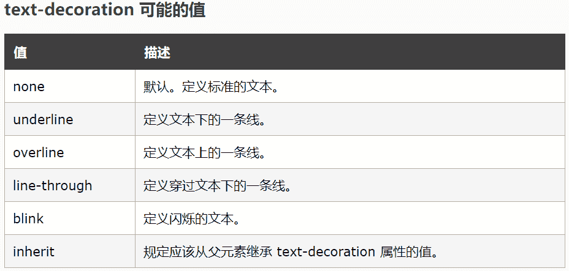
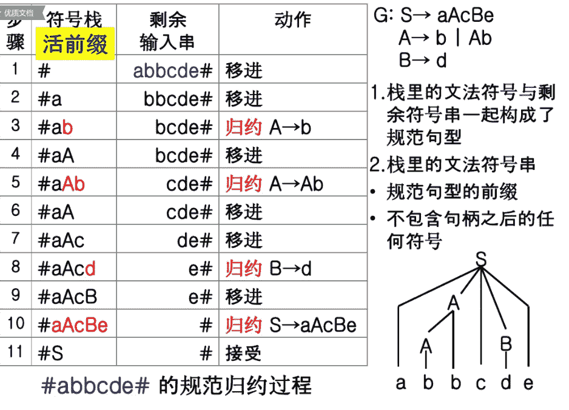
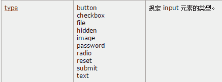
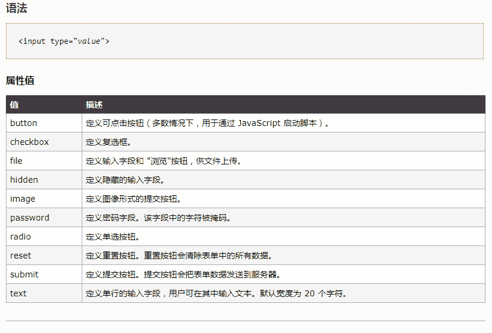
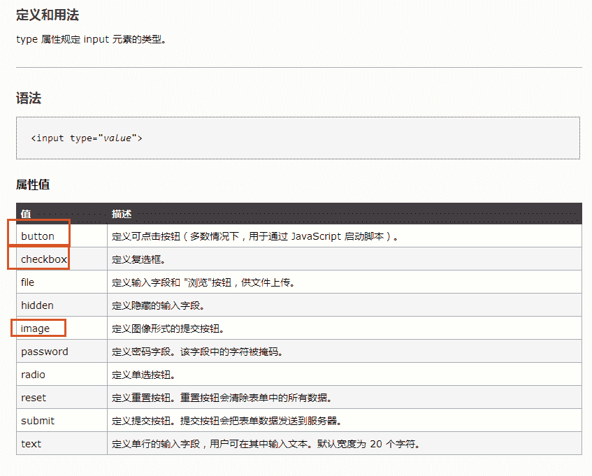
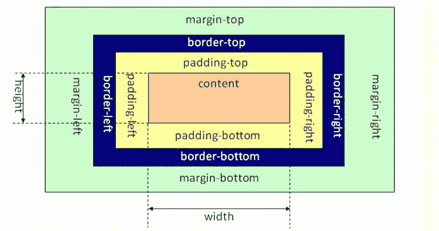

# 京东 2017 校招技术类选择题（一）

## 1

下列哪些不是算法的基本特征（ ）

正确答案: C   你的答案: 空 (错误)

```cpp
输入
```

```cpp
输出
```

```cpp
中间处理
```

```cpp
可行性
```

本题知识点

编程基础 *C++工程师 Java 工程师 京东 2017 C++工程师 Java 工程师 京东 2017* *讨论

[在干嘛·](https://www.nowcoder.com/profile/7263598)

一个算法应该具有以下五个重要的特征：
1、有穷性（Finiteness）
算法的有穷性是指算法必须能在执行有限个步骤之后终止
2、确切性(Definiteness)
算法的每一步骤必须有确切的定义；
3、输入项(Input)
一个算法有 0 个或多个输入,以刻画运算对象的初始情况,所谓 0 个输入是指算法本身定出了初始条件；
4、输出项(Output)
一个算法有一个或多个输出,以反映对输入数据加工后的结果.没有输出的算法是毫无意义的；
5、可行性(Effectiveness)
算法中执行的任何计算步都是可以被分解为基本的可执行的操作步,即每个计算步都可以在有限时间内完成.（也称之为有效性）

发表于 2017-05-17 22:25:09

* * *

[行走的数据智能](https://www.nowcoder.com/profile/3581896)

算法的 5 大特性：（1）有限性；（2）确定性；（3）可行性；（4）输入；（5）输出。

发表于 2017-07-24 21:43:06

* * *

[chestnut7](https://www.nowcoder.com/profile/8450491)

<thead> </thead>

| 知识点 | 统计 |
| JavaScript | 6 |
| HTML/CSS | 4 |
| 排序 | 4 |
| 编译和体系结构 | 4 |
| 软件工程 | 3 |
| 网络基础 | 3 |
| 数据库 | 2 |
| 软件测试 | 1 |
| 编程基础 | 1 |
| 哈希 | 1 |
| 链表 | 1 |
| Linux | 1 |

发表于 2018-04-08 21:23:07

* * *

## 2

关于堆排序复杂度分析的叙述中正确的是（ ）

正确答案: A B C D   你的答案: 空 (错误)

```cpp
堆排序的时间复杂度为 O(nlogn)
```

```cpp
整个构建堆的时间复杂度为 O(n)
```

```cpp
堆排序的空间复杂度为 O(1)
```

```cpp
堆排序是一种不稳定的排序算法
```

本题知识点

堆 C++工程师 Java 工程师 京东 2017

讨论

[月夜将至](https://www.nowcoder.com/profile/449416)

建堆的时间复杂度为 O(n)

(1)证明如下：
构建堆从叶节点的父节点开始，以树高递减的方向逐层往上，一直到根。
假设堆敏感词有 N 个元素，则树高 H=log2(N)，对于从树高为 h 的节点建堆的复杂度为 O(H - h)；
从最底层开始，为从各节点建堆的复杂度求和：
S = 1 * 2^(H-1) + 2 * 2^(H-2) + ... + (H-1) * 2¹ + H * 2⁰  
  = 2^H + 2^(H-1) + ... + 2¹ - H
  = 2^(H+1) - 2 - H
将 H=log2(N)代入，S = 2N - 2 - log2(N)

发表于 2017-06-30 15:05:40

* * *

[果冻 Bryce](https://www.nowcoder.com/profile/3936960)

判断排序算法是否稳定，看排序前后的相同元素是否发生交换，若有交换则是不稳定的，否则是稳定的。

发表于 2018-03-11 08:59:20

* * *

[枫叶@](https://www.nowcoder.com/profile/488242410)

堆是一颗完全二叉树，假设有 n 个节点，树高
证明方法如下： 
1\. 假设根节点的高度为 0，叶子节点高度为 h，那么每层包含的元素个数为 2^x，x 从 0 到 h。 
2\. 构建堆的过程是自下而上，对于每层非叶子节点需要调整的次数为 h-x，因此很明显根节点需要调整(h-0)次，第一层节点需要调整(h-1)次，最下层非叶子节点需要调整 1 次。 
3\. 因此可知，构造树高为 h 的二叉堆精确时间复杂度为： 
    s = 1*2^(h-1) + 2*2^(h-2)+……+h*2⁰
可以看出以上公式是等差数列和等比数列乘积之和，可以通过错位相减求： 
   2s = 2^h + 2*2^(h-1)+3*2^(h-2)+……+h*2¹
因此可得: 
   s = 2s -s = 2^h + 2^(h-1) + 2^(h-2) +…… + 2¹ - h
最终可以通过等比数列公式进行计算得到 s = 2*2^h - 2 -h 
将代入的 s = 2n - 2 - log2(n)，近似的时间复杂度就是 O(n)。

发表于 2019-04-15 11:35:49

* * *

## 3

有关选择排序的叙述中正确的是（ ）

正确答案: A D   你的答案: 空 (错误)

```cpp
每扫描一遍数组，只需要一次交换
```

```cpp
每扫描一遍数组，需要多次交换
```

```cpp
选择排序是稳定的排序方法
```

```cpp
空间复杂度为 O(1)
```

本题知识点

排序 *C++工程师 Java 工程师 京东 2017* *讨论

[夕一啊](https://www.nowcoder.com/profile/3913740)

原来空间复杂度指的是额外的空间呀。。。百度百科：空间复杂度(Space Complexity)是对一个算法在运行过程中临时占用存储空间大小的量度，记做 S(n)=O(f(n))。比如直接 [插入排序](http://baike.baidu.com/item/%E6%8F%92%E5%85%A5%E6%8E%92%E5%BA%8F) 的 [时间复杂度](http://baike.baidu.com/item/%E6%97%B6%E9%97%B4%E5%A4%8D%E6%9D%82%E5%BA%A6) 是 O(n²),空间复杂度是 O(1) 。而一般的 [递归](http://baike.baidu.com/item/%E9%80%92%E5%BD%92) 算法就要有 O(n)的空间复杂度了，因为每次递归都要存储返回信息。一个算法的优劣主要从算法的执行时间和所需要占用的存储空间两个方面 [衡量](http://baike.baidu.com/item/%E8%A1%A1%E9%87%8F) 。

编辑于 2017-05-16 19:38:55

* * *

[彤彤是个大美女](https://www.nowcoder.com/profile/6553109)

选择排序中涉及到交换位置，因此是不稳定的排序算法，选择排序的核心思想是从未排序数列中找到最小的数，和未排序数列中的首位交换位置，继而继续执行以上操作

发表于 2017-07-11 14:29:40

* * *

[BryceLoski](https://www.nowcoder.com/profile/972298428)

选择排序也是一种简单直观的排序算法。它的工作原理很容易理解：初始时在序列中找到最小（大）元素，放到序列的起始位置作为已排序序列；然后，再从剩余未排序元素中继续寻找最小（大）元素，放到已排序序列的末尾。以此类推，直到所有元素均排序完毕。

注意选择排序与冒泡排序的区别：冒泡排序通过依次交换相邻两个顺序不合法的元素位置，从而将当前最小（大）元素放到合适的位置；而选择排序每遍历一次都记住了当前最小（大）元素的位置，最后仅需一次交换操作即可将其放到合适的位置。

发表于 2018-12-16 11:10:25

* * *

## 4

基于比较的排序算法是（ ）

正确答案: B D   你的答案: 空 (错误)

```cpp
基数排序
```

```cpp
冒泡排序
```

```cpp
桶排序
```

```cpp
希尔排序
```

本题知识点

排序 *C++工程师 Java 工程师 京东 2017* *讨论

[行走的数据智能](https://www.nowcoder.com/profile/3581896)

1、基于比较的排序算法有：（1）直接插入排序；（2）冒泡排序；（3）简单选择排序；（4）希尔排序；（5）快速排序；（6）堆排序；（7）归并排序。2、基数排序、桶排序都属于分配式排序，且都是稳定排序算法。

编辑于 2017-07-24 22:07:24

* * *

[彤彤是个大美女](https://www.nowcoder.com/profile/6553109)

希尔排序的思想是先设置增为 array.length/2,分别将索引之间相差 array.lemgth/2 的元素进行比较，如果前者大于后者则交换顺序，继续增量/=2,知直到增量<1 为止，因此希尔排序是直接插入排序的优化，是基于比较的排序，而且交换了元素的位置，因此是不稳定的排算法

发表于 2017-07-11 14:36:55

* * *

[夣澧探花](https://www.nowcoder.com/profile/3324605)

计数排序？基数排序和桶排序是一样的吧

发表于 2017-07-21 15:36:46

* * *

## 5

以下关于 History 对象的属性或方法描述正确的是（ ）

正确答案: B C D   你的答案: 空 (错误)

```cpp
go 表示刷新当前页面。
```

```cpp
back 回到浏览器载入历史 URL 地址列表的当前 URL 的前一个 URL。
```

```cpp
forward 转到浏览器载入历史 URL 地址列表的当前 URL 的下一个 URL。
```

```cpp
length 保存历史 URL 地址列表的长度信息。
```

本题知识点

Javascript C++工程师 Java 工程师 京东 2017

讨论

[果冻狂魔](https://www.nowcoder.com/profile/1555525)

 length      返回浏览器历史列表中的 URL 数量 back()      加载 history 列表中的前一个 URLforward() 加载 history 列表中的下一个 URLgo()         加载 history 列表中的某个具体页面。

发表于 2017-05-17 22:16:06

* * *

[嚯嚯嚯嘿嘿嘿](https://www.nowcoder.com/profile/5304986)

？？？是我记错了吗？上一次遇到这题答案是 BC，这次是 BCD。。。

发表于 2019-07-26 11:14:16

* * *

[郑耀钧](https://www.nowcoder.com/profile/341687)

D 项，根据 [History.length - Web APIs | MDN](https://developer.mozilla.org/en-US/docs/Web/API/History/length)

> The **History****.length** read-only property returns an Integer representing the number of elements in the session history, including the currently loaded page. For example, for a page loaded in a new tab this property returns 1.

感觉在揪字。。嗯 既然说是“会话历史的元素数量”，那“列表的长度信息”自然是不对的了。我想纠错试试，看能不能成。

编辑于 2017-09-13 03:56:34

* * *

## 6

要去掉文本超级链接的下划线，下列正确的是（ ）

正确答案: D   你的答案: 空 (错误)

```cpp
a {underline:none}
```

```cpp
a {text-decoration:no underline}
```

```cpp
a {decoration:no underline}
```

```cpp
a {text-decoration:none}
```

本题知识点

HTML C++工程师 Java 工程师 京东 2017 C++工程师 Java 工程师 京东 2017

讨论

[Young201807061837944](https://www.nowcoder.com/profile/650939503)

CSS 样式如下：

语法：

text-decoration : none || underline|| blink || overline|| line-through

none :  无装饰

blink :  闪烁

underline :  下划线

line-through :  贯穿线

overline :  上划线  所以去除文本超链接下划线语法是：a {text-decoration:none}，选择 D。

发表于 2018-07-23 16:31:07

* * *

[UM201903132110314](https://www.nowcoder.com/profile/645586575)

CSS 样式如下： 语法： text-decoration : none || underline|| blink || overline|| line-through none :  无装饰 blink :  闪烁 underline :  下划线 line-through :  贯穿线 overline :  上划线

所以去除文本超链接下划线语法是：a {text-decoration:none}，选择 D。

发表于 2019-03-17 01:54:11

* * *

[IoE](https://www.nowcoder.com/profile/655404835)

**text-decoration:none** 用于去除下划线。

编辑于 2019-10-14 01:11:38

* * *

## 7

关于链表，以下说法正确的是 （ ）

正确答案: B C   你的答案: 空 (错误)

```cpp
需经常修改线性表Ｌ中的结点值适合采用链式结构
```

```cpp
需不断对线性表Ｌ进行删除插入适合采用链式结构
```

```cpp
带头结点的单链表，在表的第一个元素之前插入一个新元素与链表长度无关
```

```cpp
删除单链表中的最后一个元素，与链表长度无关
```

本题知识点

链表 *C++工程师 Java 工程师 京东 2017* *讨论

[大 V 郑立源](https://www.nowcoder.com/profile/3015074)

选 B 是因为，如果不采用链表而采用顺序表的话，每删除或增加一个元素，其后面的所有元素都要后移或前移，使用链表则不需要选 C 是因为，单链表在第一个元素前加元素，只需要改变头结点的后驱结点和原第一个元素的前驱结点就可以。

发表于 2017-06-29 09:38:30

* * *

[歌者 12357](https://www.nowcoder.com/profile/1221215)

删除最后一个元素，需要知道前一个元素的指针。由于是单链表，指针的移动与链表的长度是相关的。

发表于 2017-05-26 11:28:48

* * *

[colining](https://www.nowcoder.com/profile/6589111)

让我来瞎说一下好了 B：链式结构插入删除都只需要改改指针 A：如果修改时插入删除的话，链式当然可行，但如果只是修改数值呢？所以这没什么必然关系吧 C：在头结点前插入节点，只需要该节点的指针指向头结点就行了；D：删除尾节点，你得知道尾节点和尾节点之前的节点，所以总是需要长度的吧；（就算代码里没写长度，可是指针移动总和长度有关吧）ps：删除尾节点，长度变小，这算有关不？头结点前面添加节点，但是 Head 指针不变，这样单链表长度确实没变；我也不知道那种合理：）

发表于 2017-07-03 10:47:00

* * *

## 8

设散列表的长度为 8，散列函数 H(k)=k mod 7，初始记录关键字序列为(32，24，15，27，20，13)，计算用链地址法作为解决冲突方法的平均查找长度是（ ）

正确答案: B   你的答案: 空 (错误)

```cpp
1.4
```

```cpp
1.5
```

```cpp
1.6
```

```cpp
2
```

本题知识点

哈希 *C++工程师 Java 工程师 京东 2017* *讨论

[牛客 6675933 号](https://www.nowcoder.com/profile/6675933)

链地址法作为解决冲突 方法：将所有关键字为同义词的记录存储在一个单链表中，并用一维数组存放头指针。0  1  2   3   4  5  6  15     24 32     27                         20                         13 因此查找长度为 1、 1、 1、1、 2、3 等概率情况下查找成功时的平均查找长度为 9/6=1.5

编辑于 2017-06-06 21:44:56

* * *

[张旭 8095](https://www.nowcoder.com/profile/4769459)

拉链法解决冲突的做法是：将所有关键字为同义词的结点链接在同一个单链表中。若选定的散列表长度为 m，则可将散列表定义为一个由 m 个头指针组成的指针数组 T[0..m-1]。凡是散列地址为 i 的结点，均插入到以 T[i]为头指针的单链表中。T 中各分量的初值均应为空指针。在拉链法中，装填因子α可以大于 1，但一般均取α≤1。(32，24，15，27，20，13)对 7 取模后分别是：{4,3,1,6,6,6}，那么链地址法的结果：0  1  2   3   4  5  6   7   15     24  32    27                          20                          13 所以六个数分别查找长度为：1,1,1,1，2,3    所以平均长度为 9/6=1.5

发表于 2017-08-31 22:55:37

* * *

[pcd](https://www.nowcoder.com/profile/2243324)

32 mod 7 = 4 (不冲突 1 次查找)24 mod 7 = 3 (不冲突 1 次查找)15 mod 7 = 1 (不冲突 1 次查找)27 mod 7 = 6 (冲突 1 次查找)20 mod 7 = 6 (冲突 2 次查找)13 mod 7 = 6 (冲突 3 次查找)平均查找时间 AVL = (1+1+1+1+  4+2+3)/6 = 1.5

发表于 2018-04-10 23:32:56

* * *

## 9

要判断 IP 地址是否在同一个网络，下列哪一项运算正确？（ ）

正确答案: C   你的答案: 空 (错误)

```cpp
IP 非子网掩码
```

```cpp
IP 或子网掩码
```

```cpp
IP 与子网掩码
```

```cpp
IP 模 2 加子网掩码
```

本题知识点

网络基础 C++工程师 Java 工程师 京东 2017

讨论

[salmonQ](https://www.nowcoder.com/profile/7570969)

子网掩码组成都是：子网段全 1，主机段全 0，与操作之后只剩子网 IP

发表于 2017-07-14 18:09:59

* * *

[colining](https://www.nowcoder.com/profile/6589111)

可以看一下知乎，我觉得讲的很生动
[传送门](https://www.zhihu.com/question/29723388)

发表于 2017-07-03 11:06:44

* * *

[之加哥](https://www.nowcoder.com/profile/7666759)

C

发表于 2017-06-15 00:59:16

* * *

## 10

简单网络管理协议 SNMP 由哪几个部分组成？（ ）

正确答案: A B C   你的答案: 空 (错误)

```cpp
SNMP 本身
```

```cpp
管理信息结构 SMI
```

```cpp
管理信息库 MIB
```

```cpp
SNMP 的信息库
```

本题知识点

网络基础 C++工程师 Java 工程师 京东 2017

讨论

[好吃不过炸酱面](https://www.nowcoder.com/profile/7145772)

```cpp
SNMP:(Simple Network Management Protocol)简单网络管理协议, 是专门设计用于在 IP 网络管理网络节点（服务器、工作站、路由器、交换机及 HUBS 等）的一种标准协议，它是一种应用层协议。 SNMP 使网络管理员能够管理网络效能，发现并解决网络问题以及规划网络增长。通过 SNMP 接收随机消息（及事件报告）网络管理系统获知网络出现问题。
SNMP 是一系列协议组和规范，它们提供了一种从网络上的设备中收集网络管理信息的方法，也为设备向网络管理工作站报告问题和错误提供了一种方法。 
```

SNMP 基于传输层 UDP 用户数据报协议，在管理者和被管理设备（确切的说是 agent）之前传递信息。
SNMP 管理包括下面三个部分：
1.MIB 管理信息库
2.SMI 管理信息的结构和标识（也称管理信息接口 SMI）
3.SNMP 简单网络管理协议

发表于 2017-07-27 11:26:08

* * *

[浅忆 i](https://www.nowcoder.com/profile/260169293)

正确答案: A B C   你的答案: D (错误)

发表于 2021-01-03 21:14:47

* * *

[文中序](https://www.nowcoder.com/profile/4432161)

SNMP 管理的网络主要由三部分组成： 被管理的设备 SNMP*** 网络管理系统（NMS）

发表于 2017-06-27 10:13:41

* * *

## 11

在 MySQL 中，关于 HASH 索引，下列描述正确的是（ ）

正确答案: A B D   你的答案: 空 (错误)

```cpp
只用于使用=或者 < = >操作符的等式比较
```

```cpp
优化器不能使用 HASH 索引来加速 Order By 操作
```

```cpp
如果将一个 MyISAM 表改为 HASH 索引的 MEMORY 表，不会影响查询的执行效率
```

```cpp
只能使用整个关键字来搜索一行
```

本题知识点

数据库 C++工程师 Java 工程师 京东 2017

讨论

[青山崖野](https://www.nowcoder.com/profile/7614806)

HASH 索引：利用哈希函数，计算存储地址，检索时不需要像 Btree 那样，从根节点开始遍历，逐级查找。 优点： 查找效率高。（C 选项） 局限：           仅仅满足=，in，<=>，查询，不能范围查询（原先有序的键值经过哈希函数运算，可能不再连续）；（A 选项）      无法用于排序操作（order by）；（B 选项）      当重复值时，效率并不比 BTree 高；      不能利用部分索引键查询；（D 选项）

发表于 2017-07-05 21:19:16

* * *

[西瓜映](https://www.nowcoder.com/profile/733589)

BTREE 索引和 HASH 索引的差异：

（1）HASH 索引只用于使用 = 或 <=> 操作符的等式比较。如果一定要使用范围查询 的话，只能使用 BTREE 索引。

（2）优化器不能使用 Hash 索引来加速 order by 操作。

（3）使用 Hash 索引时 MySQL 不能确定在两个值之间大约有多少行。如果将一 个 MyISAM 表改为的 Hash 索引 memory 表，

会影响一些查询的执行效率。

（4）Hash 索引只能使用整个关键字来搜索一行。

发表于 2017-05-31 19:59:23

* * *

[VIENN](https://www.nowcoder.com/profile/471494912)

枯了 T-T

发表于 2019-12-23 14:38:48

* * *

## 12

朝阳技术有限公司的财务部门每月要针对公司的销售、市场，人力等多个部门进行收入与支出报表统计，以便良好地掌握公司的运营状况。你是该公司的数据库技术人员，为了实现用户对数据的安全有效的读取，你更新了系统几个数据表的索引，但财务部门反映获取数据的速度较上月有所降低。该如何调整？（ ）

正确答案: B   你的答案: 空 (错误)

```cpp
在 SQL 部署跟踪器中捕获每个存储过程的执行, 使用跟踪文件作为索引调整向导的工作量文件
```

```cpp
更新存储过程使用的数据表统计索引
```

```cpp
创建一个脚本, 包括每个存储过程中的 DDL,使用这个脚本作为索引调整向导的工作量文件
```

```cpp
在 SQL 查询分析器中执行每个存储过程, 并使用 Show Execution Plan 选项
```

本题知识点

数据库 C++工程师 Java 工程师 京东 2017

讨论

[编程卖土豆](https://www.nowcoder.com/profile/633648)

题干中说，每个月都要对不同部门进行收入支出统计，对于这种统计应该放在存储过程中来提高效率。但是存储过程只在创造时进行编译，以后每次执行存储过程都不需再重新编译，而一般 SQL 语句每执行一次就编译一次,所以使用存储过程可提高数据库执行速度。更新索引，并没有重新编译存储过程，导致存储过程还是原来没有索引的查询，是这个原因吗？

发表于 2017-07-02 22:05:08

* * *

[sxd_123](https://www.nowcoder.com/profile/3940729)

建立索引提高搜索效率

发表于 2017-08-25 16:00:06

* * *

[飞 201903091130800](https://www.nowcoder.com/profile/372818159)

三长一短选最短

发表于 2019-06-28 10:33:42

* * *

## 13

执行以下程序后，x 的值为（）

```cpp
 var x=0; 
 switch(++x) { 
     case 0: ++x; 
     case 1: ++x; 
     case 2: ++x; 
 }
```

正确答案: C   你的答案: 空 (错误)

```cpp
1
```

```cpp
2
```

```cpp
3
```

```cpp
4
```

本题知识点

Javascript C++工程师 Java 工程师 京东 2017

讨论

[ゞ](https://www.nowcoder.com/profile/209849)

答案选 Cswitch 中，对 x+1,此时 x 为 1，然后进入 case 1 中，又执行++x，此时 x 变为 2；由于 case 1 中没有 break，然后继续执行 case 2，执行++x，所以 x 变成 3

发表于 2017-05-16 16:47:31

* * *

[前端呀](https://www.nowcoder.com/profile/2765335)

没有 break

发表于 2017-07-12 09:21:02

* * *

[agnio](https://www.nowcoder.com/profile/750770224)

我居然败在了没有 break 上

发表于 2019-05-27 21:55:53

* * *

## 14

只能输入零和非零开头的数字，正确的正则表达式是（）

正确答案: A   你的答案: 空 (错误)

```cpp
^(0|[1-9][0-9]*)$
```

```cpp
^(0|[1-9][1-9]*)$
```

```cpp
^(0|[1-9][0-9])$
```

```cpp
^\+[1-9][0-9]*$
```

本题知识点

Javascript C++工程师 Java 工程师 京东 2017

讨论

[dreamsqin](https://www.nowcoder.com/profile/7646877)

哈哈哈，这个题，我一开始也理解错了，同志们注意断句（我用——断句）：（1）错误理解：只能输入零和非零——开头的数字（2）正确理解：只能输入零—— 和非零开头的数字

发表于 2017-07-24 17:34:14

* * *

[tealaya](https://www.nowcoder.com/profile/1953446)

只能输入零／非零开头的数字
^ 以。。。开头，$以。。。结尾。
*任意多次
|或的意思
（）组
[]集合

发表于 2018-03-06 13:25:38

* * *

[怎样过不是过](https://www.nowcoder.com/profile/2869567)

数字的情况是 0   或者是 1 开始到无穷 第一： 或 的符号是 |   排除 d 第一  ： 必须有个任意多次 符号是*   否则[1-9][0-9]的范围是 10-99  无法达到无穷 也没有 10 一下的数字 
扩展： ^ 开头 $ 结尾 表必须从头到尾都与模式匹配   [0-9]表 0 到 9 这个范围的任意一个数字
不懂 百度百科 正则表达式  词条                                                                                                                                                                                     小女涉世尚浅 有错欢迎指正

发表于 2018-05-24 10:51:48

* * *

## 15

属于 DHCP 客户端发送的消息是（ ）

正确答案: A B   你的答案: 空 (错误)

```cpp
discover
```

```cpp
request
```

```cpp
offer
```

```cpp
ack
```

本题知识点

网络基础 C++工程师 Java 工程师 京东 2017

讨论

[郑耀钧](https://www.nowcoder.com/profile/341687)

DHCP 有 8 种消息类型，分别是 Discover、Request、Release、Inform、Decline、Offer、ACK、NAK。其中前 5 种可由主机发起，后 3 种只能是 DHCP 服务端向主机发送，故 AB 正确。

发表于 2017-05-19 17:01:03

* * *

[天佑 lyp](https://www.nowcoder.com/profile/8787555)

DHCP 协议采用 UDP 作为传输协议，主机发送请求消息到 DHCP 服务器的 67 号端口，DHCP 服务器回应应答消息给主机的 68 号端口。

1.  1 DHCP Client 以广播的方式发出 DHCP Discover 报文。
2.  所有的 DHCP Server 都能够接收到 DHCP Client 发送的 DHCP Discover 报文，所有的 DHCP Server 都会给出响应，向 DHCP Client 发送一个 DHCP Offer 报文。2 DHCP Offer 报文中“Your(Client) IP Address”字段就是 DHCP Server 能够提供给 DHCP Client 使用的 IP 地址，且 DHCP Server 会将自己的 IP 地址放在“option”字段中以便 DHCP Client 区分不同的 DHCP Server。DHCP Server 在发出此报文后会存在一个已分配 IP 地址的纪录。
3.  3 DHCP Client 只能处理其中的一个 DHCP Offer 报文，一般的原则是 DHCP Client 处理最先收到的 DHCP Offer 报文。DHCP Client 会发出一个广播的 DHCP Request 报文，在选项字段中会加入选中的 DHCP Server 的 IP 地址和需要的 IP 地址。
4.  4 DHCP Server 收到 DHCP Request 报文后，判断选项字段中的 IP 地址是否与自己的地址相同。如果不相同，DHCP Server 不做任何处理只清除相应 IP 地址分配记录；如果相同，DHCP Server 就会向 DHCP Client 响应一个 DHCP ACK 报文，并在选项字段中增加 IP 地址的使用租期信息。
5.  5 DHCP Client 接收到 DHCP ACK 报文后，检查 DHCP Server 分配的 IP 地址是否能够使用。如果可以使用，则 DHCP Client 成功获得 IP 地址并根据 IP 地址使用租期自动启动续延过程；如果 DHCP Client 发现分配的 IP 地址已经被使用，则 DHCP Client 向 DHCPServer 发出 6 6 DHCP Decline 报文，通知 DHCP Server 禁用这个 IP 地址，然后 DHCP Client 开始新的地址申请过程。
6.  DHCP Client 在成功获取 IP 地址后，随时可以通过发送 DHCP Release 报文释放自己的 IP 地址，DHCP Server 收到 DHCP Release 报文后，会回收相应的 IP 地址并重新分配。

---------摘录百度百科

编辑于 2017-07-26 15:05:04

* * *

[忆 233](https://www.nowcoder.com/profile/474915415)

客户端发送 discover 服务器回复 offer 客户端发送 request 服务器回复 positive 或 negative 所以客户端发送的是 discover

发表于 2019-05-08 13:20:46

* * *

## 16

以下关于读屏障、写屏障、通用屏障和优化屏障说法正确的是（ ）

正确答案: A B D   你的答案: 空 (错误)

```cpp
读屏障用于保证读操作有序。屏障之前的读操作一定会先于屏障之后的读操作完成，写操作不受影响
```

```cpp
优化屏障则用于限制编译器的指令重排
```

```cpp
写屏障可用于限制读、写操作顺序
```

```cpp
通用屏障则对读写操作都有作用
```

本题知识点

编译和体系结构 C++工程师 Java 工程师 京东 2017

讨论

[行走的数据智能](https://www.nowcoder.com/profile/3581896)

以下关于读屏障、写屏障、通用屏障和 优化屏障说法正确的有：（1）读屏障用于保证读操作有序。屏障之前的读操作一定会优于屏障之后的读操作完成，写操作不受影响；（2）优化屏障则用于限制编译器的指令重排；（3）通用屏障对读写操作都有作用；（4）注意：写屏障只能限制写操作，读操作不受影响。

发表于 2017-07-25 09:14:49

* * *

[当火星撞上地球](https://www.nowcoder.com/profile/6914510)

写屏障只能限制写操作，对读操作不能造成影响。

发表于 2018-05-23 17:02:59

* * *

[SunShine0](https://www.nowcoder.com/profile/8485782)

编译器编译源代码时，会将源代码进行优化，将源代码的指令进行重排序，以适合于 CPU 的并行执行。然而，内核同步必须避免指令重新排序，优化屏障（Optimization barrier）避免编译器的重排序优化操作，保证编译程序时在优化屏障之前的指令不会在优化屏障之后执行。软件可通过读写屏障强制内存访问次序。读写屏障像一堵墙，所有在设置读写屏障之前发起的内存访问，必须先于在设置屏障之后发起的内存访问之前完成，确保内存访问按程序的顺序完成。

发表于 2017-07-30 12:56:39

* * *

## 17

已知文法 G[S]:
S→AdB
A→a|ε
B→b|Bdb|ε
则 G[S}的活前缀是：（ ）

正确答案: C   你的答案: 空 (错误)

```cpp
Adbd
```

```cpp
AbDd
```

```cpp
AdBd
```

```cpp
ADBD
```

本题知识点

编译和体系结构 C++工程师 Java 工程师 京东 2017

讨论

[salmonQ](https://www.nowcoder.com/profile/7570969)

S→AdB →AdBdb  （使用规则 B→b|Bdb|ε ）活前缀有 A，Ad，AdB，AdBd，AdBdb（活前缀不超过最右句柄的右端，此处句柄是 Bdb ）

发表于 2017-07-14 18:36:52

* * *

[maoger](https://www.nowcoder.com/profile/8532495)

头痛。

发表于 2017-09-06 18:21:14

* * *

[万里追心](https://www.nowcoder.com/profile/867768)

，先引用下楼上所谓活前缀是指规范句型的一个前缀，这种前缀不含句柄之后的任何符号，之所以称为活前缀，是因为在右面添加一些终结符号之后，就可以使它成为一个规范句型。再举个例子S→AdB
A→a|ε
B→b|Bdb|ε

*   ```cpp
    Adbd   b 会被规约不是活前缀
    ```

*   ```cpp
    AbDd   
    ```

    b 会被规约不是活前缀
*   ```cpp
    AdBd   
    ```

    AdBd  B→Bdb，还差个 b 才会被规约  正确
*   ```cpp
    ADBD   
    ```

     AD 这个组合肯定不会被规约，不存在，肯定不是活前缀 

发表于 2017-09-08 16:05:58

* * *

## 18

下列 JS 框架中，不包含开箱即用的 UI 控件和小部件的是（ ）

正确答案: A C   你的答案: 空 (错误)

```cpp
MooTools
```

```cpp
ExtJS
```

```cpp
jQuery
```

```cpp
YUI
```

本题知识点

Javascript C++工程师 Java 工程师 京东 2017

讨论

[芒刺在背 201808200942523](https://www.nowcoder.com/profile/62223423)

这是一道无聊的题目，没用过的人怎么回答，而且框架学那么多，非得全学完吗

发表于 2018-11-29 13:53:01

* * *

[巅峰斌](https://www.nowcoder.com/profile/5222678)

我写了一个框架，要不要放这里考考大家？

发表于 2018-01-27 17:44:34

* * *

[8965471](https://www.nowcoder.com/profile/863591)

Yahoo! User Interface  库  (YUI)  包含一个  bucketload 。和  YUI  一样， ExtJS  包含大量开箱即用的组件，其中有很多功能强大的网格控件，支持内联编辑、分页、筛选、分组、汇总、缓冲和数据绑定。MooTools  和  Prototype 、 jQuery  不包含开箱即用的  UI  控件和小部件.因此答案应该是 AC

发表于 2017-05-16 18:26:40

* * *

## 19

Blob 对象中的 type 属性表示文件的是（ ）

正确答案: C   你的答案: 空 (错误)

```cpp
文件大小
```

```cpp
文件名
```

```cpp
MIME 类型
```

```cpp
图片格式
```

本题知识点

HTML C++工程师 Java 工程师 京东 2017 C++工程师 Java 工程师 京东 2017

讨论

[袁加琪](https://www.nowcoder.com/profile/9433292)

一个 Blob 对象就是一个包含有只读原始数据的*类文件对象*.实际上 file 对象只是 *blob 对象的*一个更具体的版本。
其 type 属性是表示文件的 MIME（多用途互联网邮件扩展类型），也就是设定某种扩展名的文件用一种应用程序来打开的方式类型。

发表于 2017-05-16 20:53:47

* * *

[拉磨](https://www.nowcoder.com/profile/7677779)

File 接口基于 Blob，继承了 Blob 的功能,并且扩展支持了用户计算机上的本地文件。
`var blob = new Blob(dataArr:Array<any>, opt:{type:string});`

*   dataArray：数组，包含了要添加到 Blob 对象中的数据，数据可以是任意多个 ArrayBuffer，ArrayBufferView， Blob，或者 DOMString 对象。
*   opt：对象，用于设置 Blob 对象的属性（如：MIME 类型）

发表于 2017-10-30 10:05:34

* * *

[不期而遇 _Jing](https://www.nowcoder.com/profile/5206842)

一直以来，JS 都没有比较好的可以直接处理二进制的方法。而 Blob 的存在，允许我们可以通过 JS 直接操作二进制数据。

> 一个 Blob 对象就是一个包含有只读原始数据的类文件对象。Blob 对象中的数据并不一定得是 JavaScript 中的原生形式。File 接口基于 Blob，继承了 Blob 的功能,并且扩展支持了用户计算机上的本地文件。

Blob 对象可以看做是存放二进制数据的容器，此外还可以通过 Blob 设置二进制数据的 MIME 类型。

创建 Blob

通过构造函数

```cpp
var blob = new Blob(dataArr:Array<any>, opt:{type:string});
```

*   dataArray：数组，包含了要添加到 Blob 对象中的数据，数据可以是任意多个 ArrayBuffer，ArrayBufferView， Blob，或者 DOMString 对象。
*   opt：对象，用于设置 Blob 对象的属性（如：MIME 类型）

详细文章链接地址：[`www.cnblogs.com/hhhyaaon/p/5928152.html`](https://www.cnblogs.com/hhhyaaon/p/5928152.html)

发表于 2018-05-28 15:05:19

* * *

## 20

linux 用户磁盘配额配置文件 aquota.user 的默认访问权限是（ ）

正确答案: C   你的答案: 空 (错误)

```cpp
644
```

```cpp
755
```

```cpp
600
```

```cpp
700
```

本题知识点

Linux C++工程师 Java 工程师 京东 2017

讨论

[做个程序员](https://www.nowcoder.com/profile/6770163)

Linux 的一个重要工具-Quota。安装后， 这两个配置文件都是初始化数据库自动生成。aquota.group 与 aqouta.user 分别是组以及用户磁盘配额需要的配置文件权限可以看到如下。[root@root ~]# ll /home/ 
total 40
-rw-------. 1 root  root  8192 Nov 25 17:42 aquota.group
-rw-------. 1 root  root  7168 Nov 25 17:42 aquota.user 

发表于 2017-07-13 12:39:57

* * *

[后劲好大](https://www.nowcoder.com/profile/4013442)

一般在文件系统建立 aquoto.user 文件是这样的：
# touch /home/aquota.user
# chmod 600 /aquota.user

所以是 600 

发表于 2017-06-06 21:29:49

* * *

[钉子 1](https://www.nowcoder.com/profile/1294784)

linux 的 touch 命令不常用，一般在使用 make 的时候可能会用到，用来修改文件时间戳，或者新建一个不存在的文件。

发表于 2018-03-16 22:37:06

* * *

## 21

软件生命周期中的活动不包括（ ）

正确答案: B   你的答案: 空 (错误)

```cpp
需求分析
```

```cpp
市场调研
```

```cpp
详细设计
```

```cpp
软件维护
```

本题知识点

软件工程 C++工程师 Java 工程师 京东 2017

讨论

[MrYoungCi](https://www.nowcoder.com/profile/2506739)

软件生命期一般包括以下各阶段：·软件计划与可行性研究（问题定义、可行性研究）·需求分析·软件设计（概要设计和详细设计）·编码·软件测试·运行与维护

发表于 2017-07-03 14:04:04

* * *

[chestnut7](https://www.nowcoder.com/profile/8450491)

软件生命周期活动不包括市场调研

发表于 2018-04-08 20:55:26

* * *

[牛客 233125190 号](https://www.nowcoder.com/profile/233125190)

软件生命周期 三个时期 计划时期 要进行 问题定义 可行性研究 开发时期 要进行 需求分析 软件设计（详细设计 概 要设计）编码 测试（单元测试 集成测试 验收测试） 运行时期 要进行 维护（改正性维护 适应性维护 完善性维护 预防性维护）

发表于 2020-12-04 10:58:18

* * *

## 22

小何在仔细检查某软件的源程序代码后发现代码中有一处错误，它将 if 语句由 if(a=1)改正为 if(a==1)。小何所做的工作属于（ ）。

正确答案: C   你的答案: 空 (错误)

```cpp
需求分析
```

```cpp
软件测试
```

```cpp
程序调试
```

```cpp
软件设计
```

本题知识点

软件工程 C++工程师 Java 工程师 京东 2017 C++工程师 Java 工程师 京东 2017

讨论

[SoberMelody](https://www.nowcoder.com/profile/3039559)

我只想问一下，小何是条狗么。。。。为什么用“它”。。。

发表于 2017-07-04 01:36:04

* * *

[郑耀钧](https://www.nowcoder.com/profile/341687)

检查源代码的人可以是开发人员，也可以是测试人员，或者是审查人员。但是审查人员不会直接修改源代码，因此是**程序调试** 。C 项正确。附上某度百科：程序调试是将编制的程序投入实际运行前，用手工或编译程序等方法进行测试，修正语法错误和逻辑错误的过程。

编辑于 2017-09-30 21:21:26

* * *

[SunShine0](https://www.nowcoder.com/profile/8485782)

这编译都通不过，怎么调试？？？

发表于 2017-07-30 13:01:10

* * *

## 23

以下对结构化程序设计的说法错误的是（ ）。

正确答案: C   你的答案: 空 (错误)

```cpp
对于一个复杂的问题先用抽象程序表示，再对抽象程序进一步分解，继续精化
```

```cpp
结构化程序设计方法自顶向下，先整体后局部，可以提高软件开发效率
```

```cpp
通过引入模块间的继承性和多态性等机制，增加了模块的可重用性，提高了软件开发效率
```

```cpp
在软件详细设计阶段，采用结构化程序设计方法，可以把一个模块的功能逐步分解细化为某种程序语言的语句
```

本题知识点

软件工程 C++工程师 Java 工程师 京东 2017

讨论

[彤彤是个大美女](https://www.nowcoder.com/profile/6553109)

结构化程序设计和面向对象程序设计恰恰相反，c 针对的是面向对象程序涉及的优点

发表于 2017-07-17 20:09:27

* * *

[HAHA7877](https://www.nowcoder.com/profile/7578108)

C：面向对象程序设计，不是结构化程序设计。

发表于 2017-06-29 18:10:45

* * *

[霸道总裁爱上网](https://www.nowcoder.com/profile/135021641)

封装、继承、多态是面向对象程序设计的三大特点

发表于 2020-06-14 18:58:44

* * *

## 24

某学生成绩管理系统软件的功能是：输入学生成绩（0 ~ 100 分），然后输出成绩的等次。小王为测试该软件，推测软件容易在 0 分和 100 分的边界值时容易产生错误，于是他分别测试了-1、0、1、99、100、101 情况。小王的软件测试方法属于（）。

正确答案: C   你的答案: 空 (错误)

```cpp
静态测试
```

```cpp
白盒测试
```

```cpp
边界值分析法
```

```cpp
错误推测法
```

本题知识点

软件测试 C++工程师 Java 工程师 京东 2017

讨论

[琦の兜](https://www.nowcoder.com/profile/5879000)

C，边界值分析法，如果是错误推测法，应该输入小于 0 或大于 100 的错误数据，查看输出情况。

发表于 2017-03-30 16:42:15

* * *

[voyager2](https://www.nowcoder.com/profile/9000876)

一.按是否查看程序内部代码，测试分为：黑盒测试和白盒测试。     其中黑盒测试应包括边界值分析法（测试用例为边界值如-1,0,1）和错误推测法（测试用例为可能运行出错的用例）。二.按是否运行程序，测试分为：动态测试和静态测试（代码测试、ui 测试、文档测试）。

发表于 2017-09-04 14:20:34

* * *

[G2Bent](https://www.nowcoder.com/profile/4767218)

这道题，很容易误解 C 和 D，边界值分析法是测试一条数据值中边界的多个值产生的结果；错误推测法是根据测试人员对产品产生的错误进行推测。题目中提到：分别测试了-1、0、1、99、100、101 情况。这就说明，小王测试方法是有根据的，而不是由他个人推测出来的测试方法从而得出，这道题适合选择 C

发表于 2017-09-12 09:48:04

* * *

## 25

一个 C 语言程序在一台 32 位机器上运行，定义了两个变量 x, y, 其中 x 的数据类型为 int，y 的数据类型为 float。已知 x=2013, y=201.3, 则在一个 32 位机器中执行下列表达式时，结果为 “真” 的有（  ）。

正确答案: A B D   你的答案: 空 (错误)

```cpp
x==(int)(float)x
```

```cpp
x==(float)(int)x
```

```cpp
y==(float)(int)y
```

```cpp
y==(float)(double)y
```

本题知识点

编译和体系结构 C++工程师 Java 工程师 京东 2017 C 语言

讨论

[Cloud2049](https://www.nowcoder.com/profile/8508158)

A、B 无需讨论 C，将 y 转化为 int 之后，y 的小数部分被越掉=201，然后强转 float 之后=201.0，所以 C 错 D，将 y 转为 double 之后=201.3，只有精度发生变化，转为 float 之后=201.3

发表于 2017-07-18 17:13:00

* * *

[刘畅大宝宝](https://www.nowcoder.com/profile/3717159)

x 为 int，y 为 float    强行转化最后应与被覆值变量类型相同

发表于 2017-07-14 21:30:03

* * *

[没有剥开云雾的小牛](https://www.nowcoder.com/profile/7186403)

B 为什么不对呢？

发表于 2017-07-05 13:12:10

* * *

## 26

设相对寻址的转移指令占两个字节，第一字节是操作码，第二字节是相对位移量（用补码表示），若 CPU 每当从存储器取出一个字节时，即自动完成（PC）+1→PC。设当前 PC 的内容为 2009H，要求转移到 2000H 地址，则该转移指令的第二字节的内容是（ ）。

正确答案: A   你的答案: 空 (错误)

```cpp
F5H
```

```cpp
F6H
```

```cpp
F7H
```

```cpp
09H
```

本题知识点

编译和体系结构 C++工程师 Java 工程师 京东 2017 C++工程师 Java 工程师 京东 2017

讨论

[赵翔](https://www.nowcoder.com/profile/5926751)

当前为 2009H，读取转移指令需要加 2 个字节，因此为 200BH，转移到 2000H 需要减 11，-11 补码为 F5H

发表于 2017-06-29 14:36:26

* * *

[MrYoungCi](https://www.nowcoder.com/profile/2506739)

-11 对应正数 11（00001011）→所有位取反（11110100）→加 1(11110101) →F5H

发表于 2017-07-03 14:34:13

* * *

[啾](https://www.nowcoder.com/profile/1760065)

执行完转移指令时 PC=200BH，相对位移量为-BH，快速求补码的话，可以直接用 FFH 减去 BH 等于 F5H

发表于 2017-07-07 15:54:15

* * *

## 27

下面哪个选项中的对象与浏览列表有关（ ）

正确答案: B   你的答案: 空 (错误)

```cpp
window,location
```

```cpp
location,history
```

```cpp
navigator,window
```

```cpp
historylist,location
```

本题知识点

Javascript C++工程师 Java 工程师 京东 2017

讨论

[周密 2134](https://www.nowcoder.com/profile/5184576)

什么浏览列表？搜索浏览列表，出来 browser 对象所以应该是题目翻译错了！与

Browser 对象

有关的对象:history screen location Navigator

> 详情在这 [`www.w3school.com.cn/jsref/dom_obj_window.asp`](http://www.w3school.com.cn/jsref/dom_obj_window.asp)

发表于 2017-09-22 20:38:06

* * *

[牛客 322 号](https://www.nowcoder.com/profile/8677372)

与浏览列表有关的对象:history screen location Navigator

发表于 2017-05-25 10:06:17

* * *

[奔波儿灞 vs 灞波儿奔](https://www.nowcoder.com/profile/908408663)

Browser 对象

history  Location   navigator   screen

发表于 2018-07-06 16:04:23

* * *

## 28

元素的 type 属性的取值可以是(      )

正确答案: A B C   你的答案: 空 (错误)

```cpp
image
```

```cpp
checkbox
```

```cpp
button
```

```cpp
select
```

本题知识点

HTML C++工程师 Java 工程师 京东 2017

讨论

[流失于指缝。](https://www.nowcoder.com/profile/6249355)



发表于 2017-05-19 14:21:36

* * *

[水煮鱼](https://www.nowcoder.com/profile/795707)



发表于 2017-07-18 11:22:24

* * *

[那一缕淡淡的愁](https://www.nowcoder.com/profile/3061601)



发表于 2017-09-21 10:27:06

* * *

## 29

在 JavaScript 中，文本域不支持的事件包括( )

正确答案: B   你的答案: 空 (错误)

```cpp
onBlur
```

```cpp
onLostFocused
```

```cpp
onChange
```

```cpp
onFocus
```

本题知识点

Javascript C++工程师 Java 工程师 京东 2017

讨论

[何宇](https://www.nowcoder.com/profile/8592756)

*   onBlur:文本域失去焦点
*   onFocus:得到焦点
*   onchange:焦点状态改变

发表于 2017-08-10 00:01:53

* * *

[大星星和小猩猩](https://www.nowcoder.com/profile/9374535)

很少见到这个，所以选了这个...

发表于 2017-06-21 12:25:38

* * *

[Bazinga！](https://www.nowcoder.com/profile/9992392)

*   onBlur:文本域失去焦点
*   onFocus:得到焦点
*   onchange:焦点状态改变

发表于 2018-02-22 22:24:46

* * *

## 30

CSS 盒子模型中（ ）是透明的，这部分可以显示背景（ ）

正确答案: A   你的答案: 空 (错误)

```cpp
padding
```

```cpp
margin
```

```cpp
border
```

```cpp
content
```

本题知识点

HTML C++工程师 Java 工程师 京东 2017 CSS

讨论

[邢益源](https://www.nowcoder.com/profile/865022)

没说清现实当前元素的背景还是父级元素的背景吧

发表于 2017-07-16 12:35:48

* * *

[水煮鱼](https://www.nowcoder.com/profile/795707)

*   **Margin(外边距)** - 清除边框外的区域，外边距是透明的。
*   **Border(边框)** - 围绕在内边距和内容外的边框。
*   **Padding(内边距)** - 清除内容周围的区域，内边距是透明的。
*   **Content(内容)** - 盒子的内容，显示文本和图像。
*   Margin

    margin 清除周围的元素（外边框）的区域。margin 没有背景颜色，是完全透明的
*   Padding（填充）

    当元素的 Padding（填充）（内边距）被清除时，所"释放"的区域将会受到元素背景颜色的填充。

发表于 2017-07-18 11:30:52

* * *

[蜗の牛](https://www.nowcoder.com/profile/8308290)



发表于 2017-07-03 11:11:20

* * ******