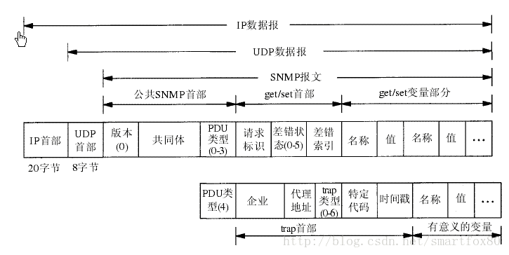
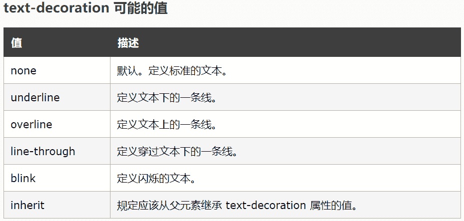

# 京东 2017 校招技术类客观题（二）

## 1

一个 SNMP 报文共有哪几个部分组成？（ ）

正确答案: A B C D   你的答案: 空 (错误)

```cpp
版本
```

```cpp
首部
```

```cpp
安全参数
```

```cpp
SNMP 报文的数据部分
```

本题知识点

网络基础 C++工程师 Java 工程师 京东 2017

讨论

[shine_joanne](https://www.nowcoder.com/profile/3588957)

来源于：[`blog.csdn.net/smartfox80/article/details/18908725`](http://blog.csdn.net/smartfox80/article/details/18908725)

发表于 2017-08-08 10:40:07

* * *

[na618](https://www.nowcoder.com/profile/9417036)

[](http://www.baidu.com/link?url=smzGuF4XooSWdW4dGKs0XGKzHkUeBFUasATSLEzppjIZ7cMnKwu-5UFGqf-faS4Kxc_4jcIcnpevtq-Mkwlvoa)

SNMP：简单网络管理协议

发表于 2018-03-25 11:23:03

* * *

[571 有你不孤单](https://www.nowcoder.com/profile/709635731)

SNMP V3 加入安全

发表于 2021-09-04 11:44:06

* * *

## 2

下列地址中的哪一个地址和 86.32/12 无法匹配？（ ）

正确答案: B C D   你的答案: 空 (错误)

```cpp
86.33.224.123
```

```cpp
86.79.65.216
```

```cpp
86.58.119.74
```

```cpp
86.68.206.154
```

本题知识点

网络基础 C++工程师 Java 工程师 京东 2017

讨论

[郑耀钧](https://www.nowcoder.com/profile/341687)

子网掩码为 12 位，前 8  查看全部)

编辑于 2017-05-20 14:40:58

* * *

[wangChaoNK](https://www.nowcoder.com/profile/4430307)

86 的二进制表示 省略不写
32 转成二进制为

| 0  | 0  | 1  | 0  | 0  | 0  | 0  | 0  |

又因为前 12 位为网络号,即前四位 0010 不变,若后四位都为 1,最大为 32+15=47
所以第 IP 地址的第二位 10 进制数应该在 32 和 47 之间(包含头尾)
故 BCD 错

发表于 2017-07-14 21:32:21

* * *

[牛客 288493 号](https://www.nowcoder.com/profile/288493)

匹配指的是在同一子网内

发表于 2017-08-10 16:22:30

* * *

## 3

dns 区域配置文件默认有（ ）

正确答案: A D   你的答案: 空 (错误)

```cpp
localhost.zone
```

```cpp
dns.conf
```

```cpp
loalhost
```

```cpp
named.local
```

本题知识点

Windows C++工程师 Java 工程师 京东 2017

讨论

[牛客 991865398 号](https://www.nowcoder.com/profile/991865398)

dns 区域默认配置文件有 localhost.zone 和 named.local

发表于 2020-12-09 16:18:02

* * *

## 4

用户 A 被视为可信任连接用户，用户 B 通过账号密码匹配方式通过身份验证。A 和 B 都想使用数据库中的数据，以下正确的做法是：（ ）

正确答案: A B C   你的答案: 空 (错误)

```cpp
1 创建 windows 用户 AAA2 EXEC SP_GRANTLOGIN   'I075\AAA'
```

```cpp
1 创建 SQL SERVER 用户 BBB2 EXEC SP_ADDLOGIN   'BBB'
```

```cpp
通过身份验证只是第一步，只有在有效的账号管理下获取访问数据库权限后，才能访问数据。
```

```cpp
对于用户 A，可以直接为其创建登录账户。
```

本题知识点

数据库 C++工程师 Java 工程师 京东 2017

讨论

[7aylorswift](https://www.nowcoder.com/profile/4114152)

建议牛客区分一下数据库的种类

发表于 2018-08-01 20:34:47

* * *

[牛客 3090300 号](https://www.nowcoder.com/profile/3090300)

SQL Serve 的身份验证模式包括 WINDOWS 身份验证模式和混合验证模式两种。Windows 身份验证模式会启用 Windows 身份验证并禁用 SQL Serve 身份验证。混合模式会同时启用 Windows 身份验证和 SQL Serve 身份验证。Windows 身份验证始终可用，且无法禁用。

发表于 2017-11-25 21:27:46

* * *

[牛客 149347611 号](https://www.nowcoder.com/profile/149347611)

此题考查的是 SQL Server 数据库知识点：A.sp_grantlogin 使 Microsoft® Windows NT® 用户或组帐户得以使用 Windows 身份验证连接到 Microsoft SQL Server™。B.sp_addlogin 创建新的 Microsoft® SQL Server™ 登录，使用户得以连接使用 SQL Server 身份验证的 SQL Server 实例。C.A/B 是指定连接用户，允许用户连接至 SQL Server。想要访问数据需单独赋权。

发表于 2019-12-28 21:35:24

* * *

## 5

公司员工对系统的使用有着严格的身份限制。实际上可通过定义视图将用户限制在不同的数据集，以下可以实现的是：（ ）

正确答案: A B C D   你的答案: 空 (错误)

```cpp
访问局限于基表中的数据统计和
```

```cpp
访问局限于基表的行子集和列子集
```

```cpp
访问局限于另一个视图与基表的联合子集
```

```cpp
访问局限于复合连接的多表行。
```

本题知识点

数据库 C++工程师 Java 工程师 京东 2017

讨论

[starfishYin](https://www.nowcoder.com/profile/9773107)

为什么 C 可以？另一个视图和基表联合，干嘛不整合到一个视图就可以了，不是多此一举吗？

发表于 2017-09-07 12:51:25

* * *

[荒漠](https://www.nowcoder.com/profile/8760831)

刷数据库的人好少

发表于 2019-03-06 16:29:04

* * *

## 6

关于链表，以下说法正确的是 （ ）

正确答案: B C   你的答案: 空 (错误)

```cpp
需经常修改线性表Ｌ中的结点值适合采用链式结构
```

```cpp
需不断对线性表Ｌ进行删除插入适合采用链式结构
```

```cpp
带头结点的单链表，在表的第一个元素之前插入一个新元素与链表长度无关
```

```cpp
删除单链表中的最后一个元素，与链表长度无关
```

本题知识点

链表 *C++工程师 Java 工程师 京东 2017* *讨论

[大 V 郑立源](https://www.nowcoder.com/profile/3015074)

选 B 是因为，如果不采用链表而采用顺序表的话，每删除或增加一个元素，其后面的所有元素都要后移或前移，使用链表则不需要选 C 是因为，单链表在第一个元素前加元素，只需要改变头结点的后驱结点和原第一个元素的前驱结点就可以。

发表于 2017-06-29 09:38:30

* * *

[歌者 12357](https://www.nowcoder.com/profile/1221215)

删除最后一个元素，需要知道前一个元素的指针。由于是单链表，指针的移动与链表的长度是相关的。

发表于 2017-05-26 11:28:48

* * *

[colining](https://www.nowcoder.com/profile/6589111)

让我来瞎说一下好了 B：链式结构插入删除都只需要改改指针 A：如果修改时插入删除的话，链式当然可行，但如果只是修改数值呢？所以这没什么必然关系吧 C：在头结点前插入节点，只需要该节点的指针指向头结点就行了；D：删除尾节点，你得知道尾节点和尾节点之前的节点，所以总是需要长度的吧；（就算代码里没写长度，可是指针移动总和长度有关吧）ps：删除尾节点，长度变小，这算有关不？头结点前面添加节点，但是 Head 指针不变，这样单链表长度确实没变；我也不知道那种合理：）

发表于 2017-07-03 10:47:00

* * *

## 7

在含有 10 个结点的二叉排序树上，查找关键字为 20 的结点，则依次比较的关键字有可能是（）

正确答案: A B C D   你的答案: 空 (错误)

```cpp
10，30，25，20
```

```cpp
25，10，15，20
```

```cpp
10，30,20
```

```cpp
25,10,15,18,20
```

本题知识点

树 C++工程师 Java 工程师 京东 2017

讨论

[sunlight_run](https://www.nowcoder.com/profile/6428287)

任意一个节点之后的所有节点，要么全比它大，要么全比它小，满足这个条件即可

发表于 2017-06-28 09:38:21

* * *

[丨太阳与月亮丨](https://www.nowcoder.com/profile/9415270)

ABCDA：首先根节点为 10, 20 比 10 大搜索其右子树，找到 30 比 10 大不矛盾，20 比 30 小搜索其左子树，找到 25 比 30 小不矛盾，20 比 25 小搜索其左子树找到 20，正确 B：首先根节点为 25,20 比 25 小搜索其左子树，找到 10 比 25 小不矛盾，20 比 10 大搜索其右子树，找到 15 比 10 大不矛盾，20 比 15 大搜索其右子树找到 20，正确 C：首先根节点为 10,20 比 10 大搜索其右子树，找到 30 比 10 大不矛盾，20 比 30 小搜索其左子树，找到 20，正确 D：首先根节点 25,20 比 25 小搜索其左子树，找到 10 比 25 小不矛盾，20 比 10 大搜索其右子树，找到 15 比 10 大不矛盾， 20 比 15 大搜索其右子树，找到 18 比 15 大不矛盾， 20 比***搜索其右子树，找到 20，正确

编辑于 2017-05-24 13:43:45

* * *

[r088r088](https://www.nowcoder.com/profile/8084070)

二叉排序树可以不平衡。唉，混淆了

发表于 2017-07-10 10:24:31

* * *

## 8

FTP 服务的控制端口与数据端口默认是（ ）

正确答案: A B   你的答案: 空 (错误)

```cpp
20
```

```cpp
21
```

```cpp
22
```

```cpp
23
```

本题知识点

网络基础 C++工程师 Java 工程师 京东 2017

讨论

[我也支持](https://www.nowcoder.com/profile/6206174)

默认情况下 FTP 协议使用 TCP 端口中的 20 和 21 这两个端口，其中 20 用于传输数据，21 用于传输控制。怎么不记混呢，就是 0 和 1 的区别，0 是 O 管道负责传输，1 是把手，负责控制。

编辑于 2017-08-24 09:59:52

* * *

[小凤雏](https://www.nowcoder.com/profile/752926)

TCP  **21** 端口： **FTP**  文件传输服务
TCP  **23** 端口： **TELNET**  终端仿真服务
TCP  **25** 端口： **SMTP ** 简单邮件传输服务
UDP  **53** 端口： **DNS**  域名解析服务
TCP  **80** 端口： **HTTP ** 超文本传输服务
TCP  **110** 端口： **POP3**  “邮局协议版本 3”使用的端口
TCP  **443** 端口： **HTTPS**  加密的超文本传输服务

发表于 2017-07-06 19:46:45

* * *

[烟云转瞬](https://www.nowcoder.com/profile/807381002)

ftp 的 20 端口用于传输数据，21 端口用于建立连接。所以说正常使用 ftp 传输文件时先用 21 端口建立连接，建立完成后，20 端口进行传输数据

发表于 2018-06-27 10:54:37

* * *

## 9

Blob 对象中的 type 属性表示文件的是（ ）

正确答案: C   你的答案: 空 (错误)

```cpp
文件大小
```

```cpp
文件名
```

```cpp
MIME 类型
```

```cpp
图片格式
```

本题知识点

HTML C++工程师 Java 工程师 京东 2017 C++工程师 Java 工程师 京东 2017

讨论

[袁加琪](https://www.nowcoder.com/profile/9433292)

一个 Blob 对象就是一个包含有只读原始数据的*类文件对象*.实际上 file 对象只是 *blob 对象的*一个更具体的版本。
其 type 属性是表示文件的 MIME（多用途互联网邮件扩展类型），也就是设定某种扩展名的文件用一种应用程序来打开的方式类型。

发表于 2017-05-16 20:53:47

* * *

[拉磨](https://www.nowcoder.com/profile/7677779)

File 接口基于 Blob，继承了 Blob 的功能,并且扩展支持了用户计算机上的本地文件。
`var blob = new Blob(dataArr:Array<any>, opt:{type:string});`

*   dataArray：数组，包含了要添加到 Blob 对象中的数据，数据可以是任意多个 ArrayBuffer，ArrayBufferView， Blob，或者 DOMString 对象。
*   opt：对象，用于设置 Blob 对象的属性（如：MIME 类型）

发表于 2017-10-30 10:05:34

* * *

[不期而遇 _Jing](https://www.nowcoder.com/profile/5206842)

一直以来，JS 都没有比较好的可以直接处理二进制的方法。而 Blob 的存在，允许我们可以通过 JS 直接操作二进制数据。

> 一个 Blob 对象就是一个包含有只读原始数据的类文件对象。Blob 对象中的数据并不一定得是 JavaScript 中的原生形式。File 接口基于 Blob，继承了 Blob 的功能,并且扩展支持了用户计算机上的本地文件。

Blob 对象可以看做是存放二进制数据的容器，此外还可以通过 Blob 设置二进制数据的 MIME 类型。

创建 Blob

通过构造函数

```cpp
var blob = new Blob(dataArr:Array<any>, opt:{type:string});
```

*   dataArray：数组，包含了要添加到 Blob 对象中的数据，数据可以是任意多个 ArrayBuffer，ArrayBufferView， Blob，或者 DOMString 对象。
*   opt：对象，用于设置 Blob 对象的属性（如：MIME 类型）

详细文章链接地址：[`www.cnblogs.com/hhhyaaon/p/5928152.html`](https://www.cnblogs.com/hhhyaaon/p/5928152.html)

发表于 2018-05-28 15:05:19

* * *

## 10

以下叙述正确的是（ ）。

正确答案: B C   你的答案: 空 (错误)

```cpp
一个更高级的中断请求一定可以中断另一个中断处理程序的执行
```

```cpp
中断方式一般用于处理随机出现的服务请求
```

```cpp
DMA 的数据传送不需 CPU 控制
```

```cpp
DMA 和 CPU 必须同时使用总线
```

本题知识点

编译和体系结构 C++工程师 Java 工程师 京东 2017

讨论

[淡定的少陵](https://www.nowcoder.com/profile/8410032)

在实现 DMA 传输时，是由 DMA 控制器直接掌管总线，因此，存在着一个总线控制权转移问题。即 DMA 传输前，CPU 要把总线控制权交给 DMA 控制器，而在结束 DMA 传输后，DMA 控制器应立即把总线控制权再交回给 CPU。

发表于 2017-08-23 16:50:55

* * *

[发言人](https://www.nowcoder.com/profile/3080961)

D 是错误的吧，不可以同时，而是分时

发表于 2017-07-25 21:20:07

* * *

[彤彤是个大美女](https://www.nowcoder.com/profile/6553109)

dma 是直接存储器访问

发表于 2017-06-29 19:56:28

* * *

## 11

一个 C 语言程序在一台 32 位机器上运行，定义了两个变量 x, y, 其中 x 的数据类型为 int，y 的数据类型为 float。已知 x=2013, y=201.3, 则在一个 32 位机器中执行下列表达式时，结果为 “真” 的有（  ）。

正确答案: A B D   你的答案: 空 (错误)

```cpp
x==(int)(float)x
```

```cpp
x==(float)(int)x
```

```cpp
y==(float)(int)y
```

```cpp
y==(float)(double)y
```

本题知识点

编译和体系结构 C++工程师 Java 工程师 京东 2017 C 语言

讨论

[Cloud2049](https://www.nowcoder.com/profile/8508158)

A、B 无需讨论 C，将 y 转化为 int 之后，y 的小数部分被越掉=201，然后强转 float 之后=201.0，所以 C 错 D，将 y 转为 double 之后=201.3，只有精度发生变化，转为 float 之后=201.3

发表于 2017-07-18 17:13:00

* * *

[刘畅大宝宝](https://www.nowcoder.com/profile/3717159)

x 为 int，y 为 float    强行转化最后应与被覆值变量类型相同

发表于 2017-07-14 21:30:03

* * *

[没有剥开云雾的小牛](https://www.nowcoder.com/profile/7186403)

B 为什么不对呢？

发表于 2017-07-05 13:12:10

* * *

## 12

在 MySql 中，如果允许用户 UserA 查看数据库 BookStore 所有的数据，则下列授权语句正确的是（ ）

正确答案: C   你的答案: 空 (错误)

```cpp
grant select to UserA
```

```cpp
grant select on BookStore to UserA
```

```cpp
grant select on BookStore.* to UserA
```

```cpp
grant select on BookStore.* from UserA
```

本题知识点

数据库 C++工程师 Java 工程师 京东 2017

讨论

[南 93603](https://www.nowcoder.com/profile/4404901)

必知必会 203 页：Grant 和 Revoke 可在几个层次上控制访问权限：1 整个服务器： 使用 GRANT ALL 和 REVOKE ALL；2 整个数据库：使用 ON database.*；3 特定的表：使用 ON database.table;特定的列；特定的存储过程

发表于 2018-06-12 08:59:19

* * *

[柳小白](https://www.nowcoder.com/profile/375210551)

必知必会 203 页： Grant 和 Revoke 可在几个层次上控制访问权限： 1 整个服务器： 使用 GRANT ALL 和 REVOKE ALL； 2 整个数据库：使用 ON database.*； 3 特定的表：使用 ON database.table; 特定的列； 特定的存储过程

发表于 2019-03-20 19:45:01

* * *

[牛客 164762424 号](https://www.nowcoder.com/profile/164762424)

grant allgrant on database.* togrant on database.table

发表于 2020-08-06 12:16:10

* * *

## 13

在安卓应用程序开发中，可以通过（ ）获得屏幕的属性，从而取得屏幕的高度和宽度

正确答案: A   你的答案: 空 (错误)

```cpp
getMetrics
```

```cpp
getDisplay
```

```cpp
getScreen
```

```cpp
getWindows
```

本题知识点

Android C++工程师 Java 工程师 京东 2017

讨论

[牛客 7722217 号](https://www.nowcoder.com/profile/7722217)

获取屏幕密度  getScreen

获取设备屏幕大小 getDisplay

获得屏幕的属性，从而取得屏幕的高度和宽度 getMetrics

获得 window 对象 getWindows

发表于 2017-10-26 14:11:42

* * *

[Crazyzps](https://www.nowcoder.com/profile/4963884)

```cpp
WindowManager manager = this.getWindowManager();
		DisplayMetrics outMetrics = new DisplayMetrics();
		manager.getDefaultDisplay().getMetrics(outMetrics);
		int width = outMetrics.widthPixels;
		int height = outMetrics.heightPixels;
```

发表于 2017-06-06 15:07:39

* * *

[牛客 1637647 号](https://www.nowcoder.com/profile/1637647)

  获取屏幕密度  getScreen    获取设备屏幕大小 getDisplay    获得屏幕的属性，从而取得屏幕的高度和宽度 getMetrics    获得 window 对象 getWindows 

发表于 2018-08-24 07:22:30

* * *

## 14

在 Tween 动画下，下面哪个方法可以构建一个渐变尺寸伸缩动画（ ）

正确答案: B   你的答案: 空 (错误)

```cpp
AlphaAnimation
```

```cpp
ScaleAnimation
```

```cpp
TranslateAnimation
```

```cpp
RotateAnimation
```

本题知识点

Android C++工程师 Java 工程师 京东 2017

讨论

[linzero](https://www.nowcoder.com/profile/7805779)

A 是透明度渐变；**B 是尺寸渐变；****C 是坐标变化；****D 是旋转变换**

发表于 2017-05-26 09:25:04

* * *

[那一缕淡淡的愁](https://www.nowcoder.com/profile/3061601)

1.  AlphaAnimation

2.  渐变透明度动画效果

4.  ScaleAnimation

5.  渐变尺寸伸缩动画效果

7.  TranslateAnimation

8.  画面转换位置移动动画效果

10.  RotateAnimation

11.  画面转移旋转动画效果

发表于 2017-09-11 17:25:53

* * *

[Ser 丶](https://www.nowcoder.com/profile/882346229)

d

发表于 2018-06-08 02:26:26

* * *

## 15

如果在应用程序中设置闹钟，则应该使用（ ）类

正确答案: A   你的答案: 空 (错误)

```cpp
AlarmManager
```

```cpp
ClockManager
```

```cpp
AudioManager
```

```cpp
PhoneManager
```

本题知识点

Android C++工程师 Java 工程师 京东 2017

讨论

[WalterCapable](https://www.nowcoder.com/profile/123159)

ClockManager 和 PhoneManager 不存在，AudioManager 通过 getSystemService(Context.AUDIO_SERVICE)获得，进行系统声音的管理。

发表于 2018-01-06 16:04:37

* * *

[PH2020](https://www.nowcoder.com/profile/7545068)

想太多了

发表于 2017-06-14 07:55:02

* * *

## 16

关于 Activity 生命周期事件回调函数的说法正确的是（ ）

正确答案: A D   你的答案: 空 (错误)

```cpp
onCreate()方法在 Activity 第一次被创建时调用
```

```cpp
onStart()方法在 Activity 开始和用户交互，用户可输入信息时调用
```

```cpp
onRestart()方法在系统重新启动前一个 Activity 时调用
```

```cpp
onStop()方法在 Activity 对用户不可见时调用
```

本题知识点

Android C++工程师 Java 工程师 京东 2017

讨论

[花不掉泪](https://www.nowcoder.com/profile/767385)

A:这个自然了，每次 Activity 创建都会调用 onCreate()方法 B:onStart() 和 onStop()方法之间的 Activity 是可见的，但是并不是可交互或者用户输入信息时候的回调，只有 onResume()之后 ，用户才可以交互操作 Activity()。C：如果是正常回退，这个要看 Activity Stack 栈顶第二个 Actiivty 的状态，可能是 onPaused()，如果是 onPaused()，则直接回到 onResumed()，如果是 onStop(),则需要 onRestart()-->onStart()-->onResume();如果 Activity 是因为 Config 改变（例如横竖屏切换），则会重新创建一个 Actitiy，或者设置了 android:config，则另当别论。D:onSart()和 onStop()是对应的，参看 B 解析。总的来说，我们需要知道，这些方法都是系统提供给 Activity 生命周期的回调方法，自然意味着，我们在不同的状态项，需要在不同的回调方法里面实现自己的行为。

发表于 2017-05-28 10:50:41

* * *

[林先生 _](https://www.nowcoder.com/profile/349798)

**onRestart** ：在 Activity 被 onStop 后，但是没有被 onDestroy，在再次启动此 Activity 时就调用 onRestart 方法，如果是被 onPause 但是没有 onStop(比如当前是透明的 activity 或者是消息框什么的)，则不会调用 onRestart**csdn：** **[`blog.csdn.net/lc_miao/article/details/74749977`](http://blog.csdn.net/lc_miao/article/details/74749977)**

发表于 2017-07-08 19:18:27

* * *

[水柠檬](https://www.nowcoder.com/profile/947193273)

A.onCreate 在 activity 第一次被创建时候调用，正确 B.用户可与 activity 交互时候，activity 的状态必须是 Resumed，此时 activity 位于活动栈的顶部，所以 B 错误 C.系统重新启动前一个 activity 时候，前一个 activity 可能有两种状态：Paused 状态和 Stopped 状态 Paused 状态（一般是比如有透明或 dialog 状态的 activity 覆盖了前一个 activity 造成的 paused 状态）：此时直接调用 onResume()方法启动；Stopped 状态（例如用户按下了 home 键造成）：此时先将 stopped 状态恢复成 started 状态：onRestart()==>onStart()，再激活 onResume()；所以 C 的说法不全面，错误 D.onStorp()方法是 activity 由 Paused 状态（该状态对用户可见）变成 Stopped 状态（该状态对用户不可见）时调用的，所以正确。附上一个图：

发表于 2018-11-13 09:48:17

* * *

## 17

下列哪一项是 AndroidMainfest 文件的作用（）

正确答案: A B C D   你的答案: 空 (错误)

```cpp
声明程序所包含的 Activity 及其对应的类
```

```cpp
声明程序启动的第一个 Activity
```

```cpp
注册广播接受者
```

```cpp
声明程序所要使用的权限
```

本题知识点

Android C++工程师 Java 工程师 京东 2017

讨论

[Shelling--](https://www.nowcoder.com/profile/4419731)

题目不是说哪一项吗？是一项？？

发表于 2017-07-07 17:28:46

* * *

[distancelin](https://www.nowcoder.com/profile/1766196)

全都是吧

发表于 2017-03-01 00:43:37

* * *

[紫雨风暴](https://www.nowcoder.com/profile/489139539)

Android8.0 及以后不支持静态注册广播了

发表于 2020-09-18 10:21:10

* * *

## 18

Broadcast Receiver 是一个专注于接收广播通知消息，并做出对应处理的组件。下列说法正确的是（ ）

正确答案: A B D   你的答案: 空 (错误)

```cpp
BroadcastReceiver 是对发送出来的广播进行过滤接收并响应的一类组件
```

```cpp
每次广播被接收后会重新创建 BroadcastReceiver 对象，并在 onReceiver 方法中执行完时销毁
```

```cpp
如果需要在 BroadcastReceiver 中执行耗时的操作，可以通过 Intent 启动 Service 来完成，并同时绑定 Service
```

```cpp
定义广播接收器类需要继承 BroadcastReceiver 基类，并且必须要重写 onReceive()方法
```

本题知识点

Android C++工程师 Java 工程师 京东 2017

讨论

[M-hlgc](https://www.nowcoder.com/profile/7525711)

   由于 BroadcastReceiver 本质上是一种***，所以创建 BroadcastReceiver 的方法也非常简单，只需要创建一个 BroadcastReceiver 的子类然后重写 onReceive (Context context, Intentintent)方法即可。

BroadcastReceiver 的生命周期，从对象调用它开始，到 onReceiver 方法执行完成之后结束。另外，每次广播被接收后会重新创建 BroadcastReceiver 对象，并在 onReceiver 方法中执行完就销毁，如果 BroadcastReceiver 的 onReceiver 方法中不能在 10 秒内执行完成，Android 会出现 ANR 异常。所以不要在 BroadcastReceiver 的 onReceiver 方法中执行耗时的操作。

如果需要在 BroadcastReceiver 中执行耗时的操作，可以通过 Intent 启动 Service 来完成。但不能绑定 Service。

发表于 2017-05-17 17:02:27

* * *

[林先生 _](https://www.nowcoder.com/profile/349798)

C 就是错在于，BroadcastReceiver 可以启动 service，但是不能绑定 service，这是官方的说法，考虑到生命周期的问题。

发表于 2017-07-20 17:07:35

* * *

[无敌 offer 机](https://www.nowcoder.com/profile/69821186)

B 选项是错的吧，自定义 BroadcastReceiver 注册后实例应是由 AMS 管理，在没有 unregisterReceiver 这个实例应该是一直都在的啊，怎么会销毁重新创建？

发表于 2019-02-13 23:48:05

* * *

## 19

要去掉文本超级链接的下划线，下列正确的是（ ）

正确答案: D   你的答案: 空 (错误)

```cpp
a {underline:none}
```

```cpp
a {text-decoration:no underline}
```

```cpp
a {decoration:no underline}
```

```cpp
a {text-decoration:none}
```

本题知识点

HTML C++工程师 Java 工程师 京东 2017 C++工程师 Java 工程师 京东 2017

讨论

[Young201807061837944](https://www.nowcoder.com/profile/650939503)

CSS 样式如下：

语法：

text-decoration : none || underline|| blink || overline|| line-through

none :  无装饰

blink :  闪烁

underline :  下划线

line-through :  贯穿线

overline :  上划线  所以去除文本超链接下划线语法是：a {text-decoration:none}，选择 D。

发表于 2018-07-23 16:31:07

* * *

[UM201903132110314](https://www.nowcoder.com/profile/645586575)

CSS 样式如下： 语法： text-decoration : none || underline|| blink || overline|| line-through none :  无装饰 blink :  闪烁 underline :  下划线 line-through :  贯穿线 overline :  上划线

所以去除文本超链接下划线语法是：a {text-decoration:none}，选择 D。

发表于 2019-03-17 01:54:11

* * *

[IoE](https://www.nowcoder.com/profile/655404835)

**text-decoration:none** 用于去除下划线。

编辑于 2019-10-14 01:11:38

* * *

## 20

后缀式 abc+*所代表的表达式为：（ ）

正确答案: A   你的答案: 空 (错误)

```cpp
a*(b+c)
```

```cpp
a*b+c
```

```cpp
a+b*c
```

```cpp
(a+b)*c
```

本题知识点

编译和体系结构 C++工程师 Java 工程师 京东 2017

讨论

[MrYoungCi](https://www.nowcoder.com/profile/2506739)

进栈顺序 abc  遇到+  bc 出栈  完成 b+c 遇到*a 出栈 与 b+c 结果参与*运算结果：a*（b+c）

发表于 2017-08-06 09:20:26

* * *

[鸢尾楚楚](https://www.nowcoder.com/profile/109408)

A 的后缀表达式为：abc+*

B 的后缀表达式为：ab*c+

C 的后缀表达式为：abc*+

D 的后缀表达式为：ab+c*

发表于 2017-12-07 10:51:20

* * *

## 21

一个流程图称为可归约的，当且仅当流图中除去回边外，其余的边构成一个：（ ）

正确答案: D   你的答案: 空 (错误)

```cpp
有环图
```

```cpp
无环图
```

```cpp
有环路流图
```

```cpp
无环路流图
```

本题知识点

图 C++工程师 Java 工程师 京东 2017

讨论

[dragonhaw](https://www.nowcoder.com/profile/5989999)

这种题我直接屏蔽了。。

发表于 2017-08-04 15:36:36

* * *

[璎珞-沐](https://www.nowcoder.com/profile/6390519)

**可归约流图** ——流图中去除回边后，构成无环路流图

发表于 2017-05-23 08:40:02

* * *

[黄宗文](https://www.nowcoder.com/profile/4403932)

文字游戏，环中去掉回路，无法构成环

发表于 2018-11-16 10:30:38

* * *

## 22

以下关于 History 对象的属性或方法描述正确的是（ ）

正确答案: B C D   你的答案: 空 (错误)

```cpp
go 表示刷新当前页面。
```

```cpp
back 回到浏览器载入历史 URL 地址列表的当前 URL 的前一个 URL。
```

```cpp
forward 转到浏览器载入历史 URL 地址列表的当前 URL 的下一个 URL。
```

```cpp
length 保存历史 URL 地址列表的长度信息。
```

本题知识点

Javascript C++工程师 Java 工程师 京东 2017

讨论

[果冻狂魔](https://www.nowcoder.com/profile/1555525)

 length      返回浏览器历史列表中的 URL 数量 back()      加载 history 列表中的前一个 URLforward() 加载 history 列表中的下一个 URLgo()         加载 history 列表中的某个具体页面。

发表于 2017-05-17 22:16:06

* * *

[嚯嚯嚯嘿嘿嘿](https://www.nowcoder.com/profile/5304986)

？？？是我记错了吗？上一次遇到这题答案是 BC，这次是 BCD。。。

发表于 2019-07-26 11:14:16

* * *

[郑耀钧](https://www.nowcoder.com/profile/341687)

D 项，根据 [History.length - Web APIs | MDN](https://developer.mozilla.org/en-US/docs/Web/API/History/length)

> The **History****.length** read-only property returns an Integer representing the number of elements in the session history, including the currently loaded page. For example, for a page loaded in a new tab this property returns 1.

感觉在揪字。。嗯 既然说是“会话历史的元素数量”，那“列表的长度信息”自然是不对的了。我想纠错试试，看能不能成。

编辑于 2017-09-13 03:56:34

* * *

## 23

小何在仔细检查某软件的源程序代码后发现代码中有一处错误，它将 if 语句由 if(a=1)改正为 if(a==1)。小何所做的工作属于（ ）。

正确答案: C   你的答案: 空 (错误)

```cpp
需求分析
```

```cpp
软件测试
```

```cpp
程序调试
```

```cpp
软件设计
```

本题知识点

软件工程 C++工程师 Java 工程师 京东 2017 C++工程师 Java 工程师 京东 2017

讨论

[SoberMelody](https://www.nowcoder.com/profile/3039559)

我只想问一下，小何是条狗么。。。。为什么用“它”。。。

发表于 2017-07-04 01:36:04

* * *

[郑耀钧](https://www.nowcoder.com/profile/341687)

检查源代码的人可以是开发人员，也可以是测试人员，或者是审查人员。但是审查人员不会直接修改源代码，因此是**程序调试** 。C 项正确。附上某度百科：程序调试是将编制的程序投入实际运行前，用手工或编译程序等方法进行测试，修正语法错误和逻辑错误的过程。

编辑于 2017-09-30 21:21:26

* * *

[SunShine0](https://www.nowcoder.com/profile/8485782)

这编译都通不过，怎么调试？？？

发表于 2017-07-30 13:01:10

* * *

## 24

为开发客户关系管理系统，小马反复询问用户有关软件的功能，确定软件做什么。该阶段属于软件生命周期中的（ ）阶段。

正确答案: A   你的答案: 空 (错误)

```cpp
需求分析
```

```cpp
系统维护
```

```cpp
软件测试
```

```cpp
软件设计
```

本题知识点

软件工程 C++工程师 Java 工程师 京东 2017

讨论

[Young201807061837944](https://www.nowcoder.com/profile/650939503)

正确选项 A。  需求分析：也称为软件需求分析、系统需求分析或需求分析工程等，是开发人员经过深入细致的调研和分析，准确理解用户和项目的功能、性能、可靠性等具体要求，将用户非形式的需求表述转化为完整的需求定义，从而确定系统必须做什么的过程。

系统维护：为了清除系统运行中发生的故障和错误，软、硬件维护人员要对系统进行必要的修改与完善；为了使系统适应用户环境的变化，满足新提出的需要，也要对原系统做些局部的更新，这些工作称为系统维护。系统维护的任务是改正软件系统在使用过程中发现的隐含错误，扩充在使用过程中用户提出的新的功能及性能要求，其目的是维护软件系统的"正常运作"。这阶段的文档是软件问题报告和软件修改报告，它记录发现软件错误的情况以及修改软件的过程。

软件测试：在规定的条件下对程序进行操作，以发现程序错误，衡量软件质量，并对其是否能满足设计要求进行评估的过程。

软件设计：从软件需求规格说明书出发，根据需求分析阶段确定的功能设计软件系统的整体结构、划分功能模块、确定每个模块的实现算法以及编写具体的代码，形成软件的具体设计方案。  结合题目可知，该阶段属于需求分析。  

发表于 2018-07-25 16:50:37

* * *

[隋堤倦客](https://www.nowcoder.com/profile/3840871)

需求分析

发表于 2018-05-04 15:42:09

* * *

## 25

以下对几种模块间耦合类型的耦合程度由高到低排序，完全正确的是（ ）。

正确答案: B   你的答案: 空 (错误)

```cpp
直接耦合>控制耦合>非直接耦合
```

```cpp
内容耦合>标记耦合>数据耦合
```

```cpp
外部耦合>公共耦合>数据耦合
```

```cpp
程序耦合>控制耦合>标记耦合
```

本题知识点

软件工程 C++工程师 Java 工程师 京东 2017

讨论

[赵翔](https://www.nowcoder.com/profile/5926751)

一般模块之间可能的连接方式有七种，构成耦合性的七种类型。它们之间的关系为（耦合性性由强到弱）：

*   **内容耦合(Content Coupling)** 
    如果发生下列情形，两个模块之间就发生了内容耦合。

    1.  一个模块直接访问另一个模块的内部数据；
    2.  一个模块不通过正常入口转到另一模块内部；
    3.  两个模块有一部分程序代码重叠(只可能出现在汇编语言中)；
    4.  一个模块有多个入口。
*   **公共耦合(Common Coupling)** 
    若一组模块都访问同一个公共数据环境，则它们之间的耦合就称为公共耦合。公共的数据环境可以是全局数据结构、共享的通信区、内存的公共覆盖区等。

*   **外部耦合(External Coupling)** 
    一组模块都访问同一全局简单变量而不是同一全局数据结构，而且不是通过参数表传递该全局变量的信息，则称之为外部耦合。

*   **控制耦合(Control Coupling)** 
    如果一个模块通过传送开关、标志、名字等控制信息，明显地控制选择另一模块的功能，就是控制耦合。

*   **印记耦合(Stamp Coupling)** 
    如果一组模块通过参数表传递记录信息，就是标记耦合。它是某一数据结构的子结构，而不是简单变量。

*   **数据耦合(Data Coupling)** 
    如果一个模块访问另一个模块时，彼此之间是通过数据参数(不是控制参数、公共数据结构或外部变量)来交换输入、输出信息的，则称这种耦合为数据耦合。

*   **非直接耦合(Nondirect Coupling)** 
    如果两个模块之间没有直接关系，它们之间的联系完全是通过主模块的控制和调用来实现的，这就是非直接耦合。这种耦合的模块独立性最强。

发表于 2017-07-08 18:56:55

* * *

[牛客 315508856 号](https://www.nowcoder.com/profile/315508856)

内-公-外-控-印-数-非

发表于 2020-10-18 12:21:50

* * *

[邱先生](https://www.nowcoder.com/profile/6623790)

一般模块之间可能的连接方式有七种，构成耦合性的七种类型。它们之间的关系为（耦合性性由强到弱）： 内容耦合(Content Coupling)  如果发生下列情形，两个模块之间就发生了内容耦合。 一个模块直接访问另一个模块的内部数据； 一个模块不通过正常入口转到另一模块内部； 两个模块有一部分程序代码重叠(只可能出现在汇编语言中)； 一个模块有多个入口。 公共耦合(Common Coupling)  若一组模块都访问同一个公共数据环境，则它们之间的耦合就称为公共耦合。公共的数据环境可以是全局数据结构、共享的通信区、内存的公共覆盖区等。 外部耦合(External Coupling)  一组模块都访问同一全局简单变量而不是同一全局数据结构，而且不是通过参数表传递该全局变量的信息，则称之为外部耦合。 控制耦合(Control Coupling)  如果一个模块通过传送开关、标志、名字等控制信息，明显地控制选择另一模块的功能，就是控制耦合。 印记耦合(Stamp Coupling)  如果一组模块通过参数表传递记录信息，就是标记耦合。它是某一数据结构的子结构，而不是简单变量。 数据耦合(Data Coupling)  如果一个模块访问另一个模块时，彼此之间是通过数据参数(不是控制参数、公共数据结构或外部变量)来交换输入、输出信息的，则称这种耦合为数据耦合。 非直接耦合(Nondirect Coupling)  如果两个模块之间没有直接关系，它们之间的联系完全是通过主模块的控制和调用来实现的，这就是非直接耦合。这种耦合的模块独立性最强。

发表于 2017-12-25 23:46:27

* * *

## 26

PAD 图也称问题分析图，其特点是（ ）。

正确答案: B   你的答案: 空 (错误)

```cpp
在需求分析中，使用 PAD 图可形象、直观地描述用户的问题
```

```cpp
在 PAD 图中只能描述结构化程序允许使用的几种基本结构
```

```cpp
在 PAD 图中，用方框表示一个处理步骤，菱形表示一个逻辑条件，箭头表示控制流向
```

```cpp
PAD 图用一条横线表示程序的主线，每增加一个层次，图形就向下扩展一层
```

本题知识点

软件工程 C++工程师 Java 工程师 京东 2017

讨论

[犇犇牛](https://www.nowcoder.com/profile/7460972)

A 、 PAD 是[问题分析图](https://baike.baidu.com/item/%E9%97%AE%E9%A2%98%E5%88%86%E6%9E%90%E5%9B%BE)，主要用于描述软件详细设计的图形表示工具 C、PAD 中只有方框，没有菱形和箭头表示 D、最左端的纵线是程序主干线，对应程序的第一层结构；每增一层 PAD 图向右扩展一条纵线，程序的纵线数等于程序层次数

发表于 2017-08-31 00:34:24

* * *

[na618](https://www.nowcoder.com/profile/9417036)

Problem Analysis Diagram

发表于 2018-03-25 11:39:24

* * *

[De 梦](https://www.nowcoder.com/profile/583846419)

A 、 PAD 是[问题分析图](https://baike.baidu.com/item/%E9%97%AE%E9%A2%98%E5%88%86%E6%9E%90%E5%9B%BE)，主要用于描述软件详细设计的图形表示工具 C、PAD 中只有方框，没有菱形和箭头表示 D、最左端的纵线是程序主干线，对应程序的第一层结构；每增一层 PAD 图向右扩展一条纵线，程序的纵线数等于程序层次数

发表于 2021-05-01 22:45:14

* * *

## 27

基于链式队列，关于计数排序的叙述中正确的是（ ）

正确答案: B C   你的答案: 空 (错误)

```cpp
计数排序是一种基于比较的排序算法
```

```cpp
计数排序的时间复杂度为 O(n+k)
```

```cpp
计数排序的空间复杂度为 O(k)
```

```cpp
计数算法是原地排序算法
```

本题知识点

排序 *C++工程师 Java 工程师 京东 2017* *讨论

[郑耀钧](https://www.nowcoder.com/profile/341687)

A. 计数排序是一种基于 **统计** 的排序算法，错误。B. 需要遍历所有数据，时间复杂度 O(N) ，但最后输出排序后的序列更合理，设 k 为数据范围（最大值 - 最小值），则遍历标记数组需要 O(k) ，总共 O(N+k) 。C. 当数据范围是 k 时，空间复杂度 O(k) 。~~但是 BC 两个选项以及题干没有关联关系，没有描述 k 的上下文。~~D. 原地排序是指不申请多余空间排序，松一点的说法是可以用很小的固定的辅助空间。但计数排序需要一个标记数组（或者 hash map）辅助统计，这个数组大小与数据范围大小相关，因此计数排序不是原地的。——07/24/17 修改了以上 BD 项的解答——09/09/17 题目选项改了，现在的 BC 项是对的。

编辑于 2017-09-09 17:34:13

* * *

[sgbs](https://www.nowcoder.com/profile/953324)

哪位大神可以详细的解释下？？？

发表于 2017-06-21 09:21:00

* * *

[奥卡姆的剃刀生锈了](https://www.nowcoder.com/profile/847231555)

空间复杂度不应该是 O(N+K)吗

发表于 2021-09-03 16:30:58

* * *

## 28

基于比较的排序算法是（ ）

正确答案: B D   你的答案: 空 (错误)

```cpp
基数排序
```

```cpp
冒泡排序
```

```cpp
桶排序
```

```cpp
希尔排序
```

本题知识点

排序 *C++工程师 Java 工程师 京东 2017* *讨论

[行走的数据智能](https://www.nowcoder.com/profile/3581896)

1、基于比较的排序算法有：（1）直接插入排序；（2）冒泡排序；（3）简单选择排序；（4）希尔排序；（5）快速排序；（6）堆排序；（7）归并排序。2、基数排序、桶排序都属于分配式排序，且都是稳定排序算法。

编辑于 2017-07-24 22:07:24

* * *

[彤彤是个大美女](https://www.nowcoder.com/profile/6553109)

希尔排序的思想是先设置增为 array.length/2,分别将索引之间相差 array.lemgth/2 的元素进行比较，如果前者大于后者则交换顺序，继续增量/=2,知直到增量<1 为止，因此希尔排序是直接插入排序的优化，是基于比较的排序，而且交换了元素的位置，因此是不稳定的排算法

发表于 2017-07-11 14:36:55

* * *

[夣澧探花](https://www.nowcoder.com/profile/3324605)

计数排序？基数排序和桶排序是一样的吧

发表于 2017-07-21 15:36:46

* * *

## 29

利用归并排序方法对数字序列：5，19，17，21，11，8，1 进行排序，共需要进行（ ）次比较

正确答案: B   你的答案: 空 (错误)

```cpp
10
```

```cpp
11
```

```cpp
12
```

```cpp
14
```

本题知识点

排序 *C++工程师 Java 工程师 京东 2017* *讨论

[万水千山总是情给个 offer 行不行](https://www.nowcoder.com/profile/4495989)

首先（5，19）一次 ，（17，21）一次，（11，8）一次 然后 归并（5，19）（17，21） 5 首先与 17 进行比较得到 5，17；（17，21）组中已经没有比 17 更小的了但（5，19）组中不一定，所以 17 与 19 进行比较得到 5，17，19；此时（5，19）组中没有比 19 更小的数了，但是（17，21）组中却不一定，所以 19 与 21 进行比较，得到 5，17，19，21   一共三次比较然后 归并（8，11） 1  。8 首先与 1 比较 得到 1，8 然后不再比较，因为剩下的数比 8 大，那么一定比 1 大（哎呀）。这次比较了 1 次然后对（5，17，19，21）和（1，8，11）排序  首先 5 与 1 进行，得到 1，5 。（5，17，19，21）组中没有比 5 小的，但（1，8，11）组中不一定，所以 5 与 8 进行比较得到 1，5，8.同样（1，8，11）组中往后没有比 8 小的数，但是（5，17，19，21）组中不一定，所以 8 和 17 比较得到 1，5，8，17；（5，17，19，21）组中往后没有比 17 更小的数，所以 17 与 11 比较得到 1，5，8，11，17；剩下的都比 17 大，不再比较得到（1，5，8，11，17，19，21）比较四次所以一共比较了 1+1+1+4+4=11 次（累。。）

发表于 2017-08-24 09:28:12

* * *

[廿四桥明月夜](https://www.nowcoder.com/profile/5498860)

（5， 19， 17， 21， 11，8，1）（5， 19， 17， 21）（ 11，8，1）（5， 19）（ 17， 21）（ 11，8）（1）开始合并：（5， 19）（ 17， 21）（ 8，11）（1）比较 3 次（5， 17， 19， 21）（1， 8， 11）比较 4=3+1 次（1， 5， 8， 11， 17， 19， 21）比较 4 次共比较 11=3+4+4 次

发表于 2017-06-27 20:38:24

* * *

[EPanda](https://www.nowcoder.com/profile/8333014)

一言不和贴代码 JavaScript

```cpp
//定义比较数组：
    var arr = [5,19,17,21,11,8,1];
    //统计比较次数
    var countTimes = 0;

    var mergeSort = (temp)=>{
        //如果数组中只有一个数，那么直接返回这个数组
        if(temp.length <=1){
            return temp;
        }
        //因为精度问题，我把奇偶数做了区分
        else if(temp.length % 2 == 0){
            //数组 splice 操作，从 0 开始，取其中 temp.length/2 个数，默认取整（4.5 ---->4）
            var a = temp.splice(0,temp.length/2);
            var b = temp;
        }else{
            var a = temp.splice(0,temp.length/2 + 1);
            var b = temp;
        }

        //递归调用
        var sortedA = mergeSort(a);
        var sortedB = mergeSort(b);
        //合并数组
        var mergedArr = MergeArr(sortedA,sortedB);
        return mergedArr;
    }

    var MergeArr = function(arr1,arr2){
        //此处就是把 arr1 和 arr2，分别从 0，到两组数组比较放入合并后的数组中，过程中有比较，从 0 开始
        var copied = [],i = 0,j = 0;
        for(;i < arr1.length || j < arr2.length ;){
            //通过这里判断，如果数组 arr1 已经没有元素了，那么意味着数组 arr2 里的元素可以直接加入
            if(!arr1[i]){
                copied.push(arr2[j]);
                j++;
                continue;
                //这里的操作可以换成：copied = copied[...copied,...arr2[j]];break;属于 es6 的 js 数组整合
            }else if(!arr2[j]){            //与上同
                copied.push(arr1[i]);
                i++;
                continue;
            }
            //统计比较次数
            countTimes++;
            console.log(arr1[i] + '与' + arr2[j] + '比较');
            if(arr1[i] <= arr2[j]){
                copied.push(arr1[i]);
                i++;
            }else{
                copied.push(arr2[j]);
                j++;
            }
        }
        return copied;
    }
```

那么为什么有一些人会说是 12 次呢？其实也没错，最大的区别在于中间位置的划分。偶数的时候没有区别：但是到了奇数的时候就是，
例子：一个 7 个数的数组，如果分为了 3,4，那么结果就是 12，如果分为了 4,3，那么结果就是 11,那么造成这一结果的根本还是在合并算法。纯属个人见解，希望互相探讨。

编辑于 2017-08-18 19:42:13

* * *

## 30

采用计数排序算法对数组 A = {1,0,3,1,0,1,1}进行排序，则辅助数组 C 的长度值为（ ）

正确答案: A   你的答案: 空 (错误)

```cpp
4
```

```cpp
5
```

```cpp
6
```

```cpp
7
```

本题知识点

排序 *C++工程师 Java 工程师 京东 2017 C++工程师 Java 工程师 京东 2017* *讨论

[yliu](https://www.nowcoder.com/profile/1066890)

计数排序辅助数组的长度为 max-min+1，max 和 min 为待排序序列的最大值和最小值，故 C 的长度为：3-0+1=4

编辑于 2017-05-23 17:33:25

* * *

[tianbian224](https://www.nowcoder.com/profile/4867211)


发表于 2017-07-04 15:39:12

* * *

[牛客 288493 号](https://www.nowcoder.com/profile/288493)

计数排序是特殊的桶排序，每个桶的长度为 1。所以辅助数组的长度为（max-min）/1+1

发表于 2017-08-09 16:21:44

* * ******