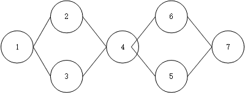

# 京东 2017 校招技术类客观题（三）

## 1

下列说法中正确的是（ ）

正确答案: A B   你的答案: 空 (错误)

```cpp
算符优先关系表不一定存在对应的优先函数
```

```cpp
数组元素的地址计算与数组的存储方式有关
```

```cpp
每个文法都能改写为 LL(1)文法
```

```cpp
对于数据空间的存贮分配，FORTRAN 采用动态贮存分配策略
```

本题知识点

编译和体系结构 C++工程师 Java 工程师 京东 2017

讨论

[想风一样自由](https://www.nowcoder.com/profile/6979408)

A,C 是编译原理中的，LL（1）文法只是很小的一部分， 数组有按行存，和按列存，

发表于 2017-07-01 11:52:47

* * *

## 2

线性窥孔优化的特点包括（ ）

正确答案: A B C   你的答案: 空 (错误)

```cpp
优化对象可以是中间代码，也可以是目标代码
```

```cpp
每次处理的是一组相邻的指令
```

```cpp
对优化对象进行线性扫描
```

```cpp
优化对象只能是中间代码
```

本题知识点

编译和体系结构 C++工程师 Java 工程师 京东 2017

讨论

[想风一样自由](https://www.nowcoder.com/profile/6979408)

优化对象既可以是中间代码级，也可以是目标代码级。（2）每次处理的只是一组相邻指令，相当于将一 组相邻指令暴露在一个优化窗口中（正如“窥孔”的含义）。 （3）对优化对象进行线性扫描。（4）优化后产生的结果可能 会给后面的代码提供进一步优化的机会。（5）窥孔优化程序通常很小，只需很少的内存，执行速度很快。 百科！

发表于 2017-07-01 11:56:16

* * *

## 3

在开发中，泛型简化了编程、提高了开发效率，以下说法正确的是（ ）

正确答案: B C   你的答案: 空 (错误)

```cpp
泛型是程序设计语言的一种特性，所有语言均有
```

```cpp
泛型类是引用类型
```

```cpp
泛型可以加强类型安全和减少类转换的次数
```

```cpp
.Net 和 Java 的泛型在运行速度会因为类型转换次数减少而加快
```

本题知识点

软件工程 C++工程师 Java 工程师 京东 2017

讨论

[恩啊哦](https://www.nowcoder.com/profile/1970050)

d 选项 net 的泛型会因为类型交换次数减少而加快，但是 java 的不会

编辑于 2017-09-17 09:49:52

* * *

[小威羊](https://www.nowcoder.com/profile/8805884)

详情见[`blog.csdn.net/u012701023/article/details/50887249`](http://blog.csdn.net/u012701023/article/details/50887249) ，讲的很详细

发表于 2017-08-18 10:40:35

* * *

[LeeReindeer](https://www.nowcoder.com/profile/237745022)

Java 中的泛型会进行类型擦除，所以运行时还是要进行类型转化的。Java 中的泛型更像是一种语法糖。

编辑于 2018-12-19 20:09:05

* * *

## 4

ORM 是对象到关系数据的热门技术，以下说法正确的是（ ）

正确答案: A B C D   你的答案: 空 (错误)

```cpp
ORM 是以中间件的形式存在，实现对象到关系数据库的映射
```

```cpp
O/R Mapping 会为开发者生成 DAO,减少数据访问层的编码
```

```cpp
ORM 负责生成 SQL,开发者只需关注对象就可以了
```

```cpp
ORM 中多对多的关系模式必须将关联单独作一个表
```

本题知识点

软件工程 C++工程师 Java 工程师 京东 2017

讨论

[梅子青时节](https://www.nowcoder.com/profile/2708949)

不知道 ORM 是啥，网上查了一下，才知道：对象关系映射（英语：(Object Relational Mapping，简称 ORM，或 O/RM，或 O/R mapping），是一种程序技术，用于实现面向对象编程语言里不同类型系统的数据之间的转换。

发表于 2017-09-07 21:10:48

* * *

[程序员鱼皮](https://www.nowcoder.com/profile/5077378)

选 ABCD，拿 hibernate 举例，orm 对象关系映射使得开发者通过配置 xml 来生成对象，并生成 dao 层代码（save 等），同时生成了 sql。多对多关系需要转换成关联表，使用单向或双向外键维护。

发表于 2018-12-22 10:14:37

* * *

[phoenixfrank](https://www.nowcoder.com/profile/969156946)

我还是觉得 c 有问题

发表于 2019-09-07 19:47:35

* * *

## 5

若某典型基准测试程序在机器 A 上运行时需要 20s，而在机器 B 上运行时需要 25s，那么，下列给出的结论正确的是（ ）。

正确答案: D   你的答案: 空 (错误)

```cpp
所有程序在机器 A 上都比在机器 B 上运行速度快
```

```cpp
机器 B 的平均 CPI 是机器 A 的 1.25 倍
```

```cpp
机器 A 的平均 CPI 是机器 B 的 1.25 倍
```

```cpp
以上结论都不对
```

本题知识点

编译和体系结构 C++工程师 Java 工程师 京东 2017

讨论

[想风一样自由](https://www.nowcoder.com/profile/6979408)

一次测试说明不了问题，起码是统计的结果的才能具有一定的结论性质

发表于 2017-07-01 12:00:05

* * *

[tianbian224](https://www.nowcoder.com/profile/4867211)

执行速度受多方面影响，各种计算机执行有些程序快，执行另一些慢。不能拿一个单一的程序说谁快谁慢。
CPI 是一条指令执行的周期。有可能 A 机器编译的指令多

发表于 2017-07-04 15:31:00

* * *

## 6

设相对寻址的转移指令占两个字节，第一字节是操作码，第二字节是相对位移量（用补码表示），若 CPU 每当从存储器取出一个字节时，即自动完成（PC）+1→PC。设当前 PC 的内容为 2009H，要求转移到 2000H 地址，则该转移指令的第二字节的内容是（ ）。

正确答案: A   你的答案: 空 (错误)

```cpp
F5H
```

```cpp
F6H
```

```cpp
F7H
```

```cpp
09H
```

本题知识点

编译和体系结构 C++工程师 Java 工程师 京东 2017 C++工程师 Java 工程师 京东 2017

讨论

[赵翔](https://www.nowcoder.com/profile/5926751)

当前为 2009H，读取转移指令需要加 2 个字节，因此为 200BH，转移到 2000H 需要减 11，-11 补码为 F5H

发表于 2017-06-29 14:36:26

* * *

[MrYoungCi](https://www.nowcoder.com/profile/2506739)

-11 对应正数 11（00001011）→所有位取反（11110100）→加 1(11110101) →F5H

发表于 2017-07-03 14:34:13

* * *

[啾](https://www.nowcoder.com/profile/1760065)

执行完转移指令时 PC=200BH，相对位移量为-BH，快速求补码的话，可以直接用 FFH 减去 BH 等于 F5H

发表于 2017-07-07 15:54:15

* * *

## 7

dns 服务中资源记录的类型有（ ）

正确答案: A B C   你的答案: 空 (错误)

```cpp
PTR
```

```cpp
A
```

```cpp
CNAME
```

```cpp
B
```

本题知识点

网络基础 C++工程师 Java 工程师 京东 2017

讨论

[郑耀钧](https://www.nowcoder.com/profile/341687)

DNS 服务的常见资源记录类型：A 记录（主机地址）、CNAME 记录（别名）、MX 记录（邮件主机）、NS 记录（名称服务器）、SOA 记录（起始授权机构）、PTR 记录（IP 反向解析）、SRV 记录（MS DNS 服务器的活动目录）。故选项 ABC 正确。

发表于 2017-05-19 16:54:20

* * *

[mythcenter](https://www.nowcoder.com/profile/1159652)

[`www.cnblogs.com/sddai/p/5703394.html`](https://www.cnblogs.com/sddai/p/5703394.html)

发表于 2018-01-26 08:38:49

* * *

[东东 xxdded](https://www.nowcoder.com/profile/4947323)

DNS 服务的常见资源记录类型：A 记录（主机地址）、CNAME 记录（别名）、MX 记录（邮件主机）、NS 记录（名称服务器）、SOA 记录（起始授权机构）、PTR 记录（IP 反向解析）、SRV 记录（MS DNS 服务器的活动目录）。故选项 ABC 正确。

发表于 2017-07-23 21:27:22

* * *

## 8

某省考试管理系统欲新增部分功能，通过输入课程编号，能够显示该科目历年各分数段的地区分布情况。为了实现代码重用，即能够重复使用已经存在的数据访问组件。可以做以下考虑：（ ）

正确答案: B   你的答案: 空 (错误)

```cpp
通过一个过滤器表达式来设置新创建的 DataView 对象的 RowStateFilter 属性
```

```cpp
通过一个过滤器表达式来设置新创建的 DataView 对象的 RowFilter 属性
```

```cpp
通过一个过滤器表达式来设置新创建的 Dataset 对象的 RowFilter 属性
```

```cpp
使用 DataSet.Reset 方法
```

本题知识点

数据库 C++工程师 Java 工程师 京东 2017

讨论

[牛客 4062775 号](https://www.nowcoder.com/profile/4062775)

1\. DataView DataSet 是.Net 用来和数据库交互的对象。2\. DataSet 对象的内部用动态 xml 来存放数据，因此与数据库里表的结构无关，可以用来访问不同的数据源。DataSet 对象常和 DataAdapter 对象结合使用，通过 DataAdapter 对象向 DataSet 对象中 Fill(填充)或 Update(更新)3\. DataView 是和 DataTable 相关联的一个视图对象。

发表于 2018-02-22 11:16:03

* * *

[灰灰 289](https://www.nowcoder.com/profile/945482895)

对于 rowfileter 举个例子：过滤 DataView 中字段 A 的值为 3 位的所有记录 dataView.RowFilter = "A=3";

编辑于 2019-08-01 11:03:10

* * *

## 9

采用计数排序算法对数组 A = {1,0,3,1,0,1,1}进行排序，则辅助数组 C 的长度值为（ ）

正确答案: A   你的答案: 空 (错误)

```cpp
4
```

```cpp
5
```

```cpp
6
```

```cpp
7
```

本题知识点

排序 *C++工程师 Java 工程师 京东 2017 C++工程师 Java 工程师 京东 2017* *讨论

[yliu](https://www.nowcoder.com/profile/1066890)

计数排序辅助数组的长度为 max-min+1，max 和 min 为待排序序列的最大值和最小值，故 C 的长度为：3-0+1=4

编辑于 2017-05-23 17:33:25

* * *

[tianbian224](https://www.nowcoder.com/profile/4867211)


发表于 2017-07-04 15:39:12

* * *

[牛客 288493 号](https://www.nowcoder.com/profile/288493)

计数排序是特殊的桶排序，每个桶的长度为 1。所以辅助数组的长度为（max-min）/1+1

发表于 2017-08-09 16:21:44

* * *

## 10

下列哪些不是算法的基本特征（ ）

正确答案: C   你的答案: 空 (错误)

```cpp
输入
```

```cpp
输出
```

```cpp
中间处理
```

```cpp
可行性
```

本题知识点

编程基础 *C++工程师 Java 工程师 京东 2017 C++工程师 Java 工程师 京东 2017* *讨论

[在干嘛·](https://www.nowcoder.com/profile/7263598)

一个算法应该具有以下五个重要的特征：
1、有穷性（Finiteness）
算法的有穷性是指算法必须能在执行有限个步骤之后终止
2、确切性(Definiteness)
算法的每一步骤必须有确切的定义；
3、输入项(Input)
一个算法有 0 个或多个输入,以刻画运算对象的初始情况,所谓 0 个输入是指算法本身定出了初始条件；
4、输出项(Output)
一个算法有一个或多个输出,以反映对输入数据加工后的结果.没有输出的算法是毫无意义的；
5、可行性(Effectiveness)
算法中执行的任何计算步都是可以被分解为基本的可执行的操作步,即每个计算步都可以在有限时间内完成.（也称之为有效性）

发表于 2017-05-17 22:25:09

* * *

[行走的数据智能](https://www.nowcoder.com/profile/3581896)

算法的 5 大特性：（1）有限性；（2）确定性；（3）可行性；（4）输入；（5）输出。

发表于 2017-07-24 21:43:06

* * *

[chestnut7](https://www.nowcoder.com/profile/8450491)

<thead> </thead>

| 知识点 | 统计 |
| JavaScript | 6 |
| HTML/CSS | 4 |
| 排序 | 4 |
| 编译和体系结构 | 4 |
| 软件工程 | 3 |
| 网络基础 | 3 |
| 数据库 | 2 |
| 软件测试 | 1 |
| 编程基础 | 1 |
| 哈希 | 1 |
| 链表 | 1 |
| Linux | 1 |

发表于 2018-04-08 21:23:07

* * *

## 11

对记录（54,38,96,23,15,72,60,45,83）进行直接插入排序时，当把第八个记录 45 插入到有序表时，为找到插入位置需比较（）次

正确答案: C   你的答案: 空 (错误)

```cpp
4
```

```cpp
6
```

```cpp
5
```

```cpp
3
```

本题知识点

排序 *C++工程师 Java 工程师 京东 2017* *讨论

[宫保鸡丁没萝卜](https://www.nowcoder.com/profile/6075174)

由插入排序算法，当要插入第八  查看全部)

编辑于 2017-05-23 14:24:18

* * *

[嘿嘿¬_¬](https://www.nowcoder.com/profile/4364438)

这题直接数前面有几个比它自己大的数然后 +1 就好了插入排序从后往前比, 当第八个记录 45 要插入时, 前面必然是有序的, 所以要比较比它本身大的数. +1 是因为最后还要和比它小一点的数比较一次, 才能确定它插入的位置所以答案是: 4+1

发表于 2018-08-14 08:54:16

* * *

[🎉201909271532691](https://www.nowcoder.com/profile/726764891)

。。。。为啥不是从前往后？  4 次 

发表于 2020-03-22 21:33:47

* * *

## 12

基于比较的排序算法是（ ）

正确答案: B D   你的答案: 空 (错误)

```cpp
基数排序
```

```cpp
冒泡排序
```

```cpp
桶排序
```

```cpp
希尔排序
```

本题知识点

排序 *C++工程师 Java 工程师 京东 2017* *讨论

[行走的数据智能](https://www.nowcoder.com/profile/3581896)

1、基于比较的排序算法有：（1）直接插入排序；（2）冒泡排序；（3）简单选择排序；（4）希尔排序；（5）快速排序；（6）堆排序；（7）归并排序。2、基数排序、桶排序都属于分配式排序，且都是稳定排序算法。

编辑于 2017-07-24 22:07:24

* * *

[彤彤是个大美女](https://www.nowcoder.com/profile/6553109)

希尔排序的思想是先设置增为 array.length/2,分别将索引之间相差 array.lemgth/2 的元素进行比较，如果前者大于后者则交换顺序，继续增量/=2,知直到增量<1 为止，因此希尔排序是直接插入排序的优化，是基于比较的排序，而且交换了元素的位置，因此是不稳定的排算法

发表于 2017-07-11 14:36:55

* * *

[夣澧探花](https://www.nowcoder.com/profile/3324605)

计数排序？基数排序和桶排序是一样的吧

发表于 2017-07-21 15:36:46

* * *

## 13

一个无向图 G=(V,E),顶点集合 V={1,2,3,4,5,6,7},边集合 E={(1,2), (1,3),(2,4), (3,4), (4,5),(4,6), (5,7) , (6,7)}，从顶点 1 出发进行深度优先遍历，可得到的顶点序列是 （ ）

正确答案: B C D   你的答案: 空 (错误)

```cpp
1,2,3,4,5,6,7
```

```cpp
1,2,4,3,6,7,5
```

```cpp
1,3,4,5,7,6,2
```

```cpp
1,2,4,6,7,5,3
```

本题知识点

图 C++工程师 Java 工程师 京东 2017

讨论

[dragonhaw](https://www.nowcoder.com/profile/5989999)

没注意是无向图，，，，

发表于 2017-08-03 22:25:06

* * *

[Oliver？](https://www.nowcoder.com/profile/3729030)

首先画出如上所示的图。从节点 1 出发有两种选择，要么 2 要么 3。所谓深度优先遍历是指从一个节点出发，一个走到其中邻居节点，将该邻居节点标记为已遍历，然后从该节点出发，重复上述步骤，知道遇到节点的出度为 0 或，节点的邻居都已遍历，再返回到最开始出发的节点，找到其未遍历的另一个邻居节点，重复上面的步骤即可。这个题目容易出错的是，要注意节点 4，它有三个邻居节点，分别是 3、5、6，因此选项 BCD 都是正确的答案。但 A 肯定不是，因为 2 的邻居存在且不为 3。

发表于 2017-07-07 11:28:30

* * *

[麻瓜的圣诞节](https://www.nowcoder.com/profile/730914)

b 中到达 4 没有满足边界条件就回到 3，个人感觉不算深度遍历吧

编辑于 2017-07-10 11:54:33

* * *

## 14

在含有 10 个结点的二叉排序树上，查找关键字为 20 的结点，则依次比较的关键字有可能是（）

正确答案: A B C D   你的答案: 空 (错误)

```cpp
10，30，25，20
```

```cpp
25，10，15，20
```

```cpp
10，30,20
```

```cpp
25,10,15,18,20
```

本题知识点

树 C++工程师 Java 工程师 京东 2017

讨论

[sunlight_run](https://www.nowcoder.com/profile/6428287)

任意一个节点之后的所有节点，要么全比它大，要么全比它小，满足这个条件即可

发表于 2017-06-28 09:38:21

* * *

[丨太阳与月亮丨](https://www.nowcoder.com/profile/9415270)

ABCDA：首先根节点为 10, 20 比 10 大搜索其右子树，找到 30 比 10 大不矛盾，20 比 30 小搜索其左子树，找到 25 比 30 小不矛盾，20 比 25 小搜索其左子树找到 20，正确 B：首先根节点为 25,20 比 25 小搜索其左子树，找到 10 比 25 小不矛盾，20 比 10 大搜索其右子树，找到 15 比 10 大不矛盾，20 比 15 大搜索其右子树找到 20，正确 C：首先根节点为 10,20 比 10 大搜索其右子树，找到 30 比 10 大不矛盾，20 比 30 小搜索其左子树，找到 20，正确 D：首先根节点 25,20 比 25 小搜索其左子树，找到 10 比 25 小不矛盾，20 比 10 大搜索其右子树，找到 15 比 10 大不矛盾， 20 比 15 大搜索其右子树，找到 18 比 15 大不矛盾， 20 比***搜索其右子树，找到 20，正确

编辑于 2017-05-24 13:43:45

* * *

[r088r088](https://www.nowcoder.com/profile/8084070)

二叉排序树可以不平衡。唉，混淆了

发表于 2017-07-10 10:24:31

* * *

## 15

某软件系统结构图如图所示，该结构图的深度为（）。


正确答案: B   你的答案: 空 (错误)

```cpp
2
```

```cpp
3
```

```cpp
4
```

```cpp
5
```

本题知识点

图 C++工程师 Java 工程师 京东 2017

讨论

[康乐园的一株草](https://www.nowcoder.com/profile/4390692)

选 4 都是把 D 的深度算作 3 了，实际上 D 的深度是 2。转换为树可以看到，C，E 指向的都是兄弟节点，不是子节点。

发表于 2017-08-10 11:42:39

* * *

[初入 java](https://www.nowcoder.com/profile/5042798)

明显是 A 直接指向了 D 嘛，看错了！罪错罪过

发表于 2017-09-08 16:36:52

* * *

[功夫熊猫☆梦](https://www.nowcoder.com/profile/807047)

广度优先生成树的确是 3 层，但是深度优先生成树是 4 层呀！我觉得题目没有给明确。

编辑于 2017-08-24 22:52:32

* * *

## 16

为开发客户关系管理系统，小马反复询问用户有关软件的功能，确定软件做什么。该阶段属于软件生命周期中的（ ）阶段。

正确答案: A   你的答案: 空 (错误)

```cpp
需求分析
```

```cpp
系统维护
```

```cpp
软件测试
```

```cpp
软件设计
```

本题知识点

软件工程 C++工程师 Java 工程师 京东 2017

讨论

[Young201807061837944](https://www.nowcoder.com/profile/650939503)

正确选项 A。  需求分析：也称为软件需求分析、系统需求分析或需求分析工程等，是开发人员经过深入细致的调研和分析，准确理解用户和项目的功能、性能、可靠性等具体要求，将用户非形式的需求表述转化为完整的需求定义，从而确定系统必须做什么的过程。

系统维护：为了清除系统运行中发生的故障和错误，软、硬件维护人员要对系统进行必要的修改与完善；为了使系统适应用户环境的变化，满足新提出的需要，也要对原系统做些局部的更新，这些工作称为系统维护。系统维护的任务是改正软件系统在使用过程中发现的隐含错误，扩充在使用过程中用户提出的新的功能及性能要求，其目的是维护软件系统的"正常运作"。这阶段的文档是软件问题报告和软件修改报告，它记录发现软件错误的情况以及修改软件的过程。

软件测试：在规定的条件下对程序进行操作，以发现程序错误，衡量软件质量，并对其是否能满足设计要求进行评估的过程。

软件设计：从软件需求规格说明书出发，根据需求分析阶段确定的功能设计软件系统的整体结构、划分功能模块、确定每个模块的实现算法以及编写具体的代码，形成软件的具体设计方案。  结合题目可知，该阶段属于需求分析。  

发表于 2018-07-25 16:50:37

* * *

[隋堤倦客](https://www.nowcoder.com/profile/3840871)

需求分析

发表于 2018-05-04 15:42:09

* * *

## 17

以下对结构化程序设计的说法错误的是（ ）。

正确答案: C   你的答案: 空 (错误)

```cpp
对于一个复杂的问题先用抽象程序表示，再对抽象程序进一步分解，继续精化
```

```cpp
结构化程序设计方法自顶向下，先整体后局部，可以提高软件开发效率
```

```cpp
通过引入模块间的继承性和多态性等机制，增加了模块的可重用性，提高了软件开发效率
```

```cpp
在软件详细设计阶段，采用结构化程序设计方法，可以把一个模块的功能逐步分解细化为某种程序语言的语句
```

本题知识点

软件工程 C++工程师 Java 工程师 京东 2017

讨论

[彤彤是个大美女](https://www.nowcoder.com/profile/6553109)

结构化程序设计和面向对象程序设计恰恰相反，c 针对的是面向对象程序涉及的优点

发表于 2017-07-17 20:09:27

* * *

[HAHA7877](https://www.nowcoder.com/profile/7578108)

C：面向对象程序设计，不是结构化程序设计。

发表于 2017-06-29 18:10:45

* * *

[霸道总裁爱上网](https://www.nowcoder.com/profile/135021641)

封装、继承、多态是面向对象程序设计的三大特点

发表于 2020-06-14 18:58:44

* * *

## 18

N-S 图也称方框图，以下有关该图的说法，正确的是（ ）。

正确答案: A   你的答案: 空 (错误)

```cpp
在总体设计时用 N-S 图表示模块，使软件总体设计清晰、可读性高
```

```cpp
在 N-S 图中常需要用两个盒子：数据盒和过程盒
```

```cpp
N-S 图形象直观，对循环的范围、条件语句的范围都能清晰描述，容易理解，但缺点是不易于表达嵌套结构
```

```cpp
以 N-S 图为基础，遵循一个机械的规则就能方便地写出程序，这个规则称为走树（Tree walk）
```

本题知识点

软件工程 C++工程师 Java 工程师 京东 2017

讨论

[_zld](https://www.nowcoder.com/profile/3819809)

B. 是数据盒和模块盒 C. 缺点是不能任意转移控制 D. 不是 N-S 图，是 PAD 图。

发表于 2017-05-30 15:25:44

* * *

[颲風](https://www.nowcoder.com/profile/4694953)

N-S 图也被称为盒图或 CHAPIN 图。 流程图由一些特定意义的图形、流程线及简要的文字说明构成，它能清晰明确地表示程序的运行过程。在使用过程中，人们发现流程线不一定是必需的，为此，人们设计了一种新的流程图，它把整个程序写在一个大框图内，这个大框图由若干个小的基本框图构成，这种流程图简称 N-S 图。N-S 图包括顺序、选择和循环三种基本结构。

发表于 2017-07-17 10:46:27

* * *

[qunhao12](https://www.nowcoder.com/profile/9228860)

盒图不应该是详细设计的吗？A 选项有问题吧？

发表于 2017-10-19 20:34:05

* * *

## 19

简单网络管理协议 SNMP 由哪几个部分组成？（ ）

正确答案: A B C   你的答案: 空 (错误)

```cpp
SNMP 本身
```

```cpp
管理信息结构 SMI
```

```cpp
管理信息库 MIB
```

```cpp
SNMP 的信息库
```

本题知识点

网络基础 C++工程师 Java 工程师 京东 2017

讨论

[好吃不过炸酱面](https://www.nowcoder.com/profile/7145772)

```cpp
SNMP:(Simple Network Management Protocol)简单网络管理协议, 是专门设计用于在 IP 网络管理网络节点（服务器、工作站、路由器、交换机及 HUBS 等）的一种标准协议，它是一种应用层协议。 SNMP 使网络管理员能够管理网络效能，发现并解决网络问题以及规划网络增长。通过 SNMP 接收随机消息（及事件报告）网络管理系统获知网络出现问题。
SNMP 是一系列协议组和规范，它们提供了一种从网络上的设备中收集网络管理信息的方法，也为设备向网络管理工作站报告问题和错误提供了一种方法。 
```

SNMP 基于传输层 UDP 用户数据报协议，在管理者和被管理设备（确切的说是 agent）之前传递信息。
SNMP 管理包括下面三个部分：
1.MIB 管理信息库
2.SMI 管理信息的结构和标识（也称管理信息接口 SMI）
3.SNMP 简单网络管理协议

发表于 2017-07-27 11:26:08

* * *

[浅忆 i](https://www.nowcoder.com/profile/260169293)

正确答案: A B C   你的答案: D (错误)

发表于 2021-01-03 21:14:47

* * *

[文中序](https://www.nowcoder.com/profile/4432161)

SNMP 管理的网络主要由三部分组成： 被管理的设备 SNMP*** 网络管理系统（NMS）

发表于 2017-06-27 10:13:41

* * *

## 20

当用 n 比特进行分组的编号时，若接收窗口等于 1（即只能按序接收分组），那么如果要求连续 ARQ 协议能正常运行时，发送窗口大小是多少？（ ）

正确答案: B   你的答案: 空 (错误)

```cpp
不超过 2^n
```

```cpp
不超过 2^n-1
```

```cpp
2^n
```

```cpp
2^n-1
```

本题知识点

网络基础 C++工程师 Java 工程师 京东 2017

讨论

[小威羊](https://www.nowcoder.com/profile/8805884)

回退 n 帧的 ARQ

发信侧不用等待收信侧的应答，持续的发送多个帧，假如发现已发送的帧中有错误发生，那么从那个发生错误的帧开始及其之后所有的帧全部再重新发送。特点：（GDN）复杂度低，但是不必要的帧会再重发，所以大幅度范围内使用的话效率是不高的例：如果序列号有 K bits，那么这个 ARQ 的协议大小为：2^k-1。

选择性重传 ARQ

发信侧不用等待收信侧的应答，持续的发送多个帧，假如发现已发送的帧中有错误发生，那么发信侧将只重新发送那个发生错误的帧。特点：相对于 GDN 复杂度高，但是不需要发送没必要的帧，所以效率高。例：如果序列号有 K bits，那么这个 ARQ 的协议大小为：2^(k-1)。

发表于 2017-08-18 11:26:26

* * *

[我只是想求一个 offer，给个机会面试](https://www.nowcoder.com/profile/200333)

再网上的摘要

编辑于 2019-11-25 09:45:26

* * *

[Jessica 努力找工作~](https://www.nowcoder.com/profile/4823421)

B

发表于 2017-08-05 22:32:54

* * *

## 21

在 MySQL 中，关于 HASH 索引，下列描述正确的是（ ）

正确答案: A B D   你的答案: 空 (错误)

```cpp
只用于使用=或者 < = >操作符的等式比较
```

```cpp
优化器不能使用 HASH 索引来加速 Order By 操作
```

```cpp
如果将一个 MyISAM 表改为 HASH 索引的 MEMORY 表，不会影响查询的执行效率
```

```cpp
只能使用整个关键字来搜索一行
```

本题知识点

数据库 C++工程师 Java 工程师 京东 2017

讨论

[青山崖野](https://www.nowcoder.com/profile/7614806)

HASH 索引：利用哈希函数，计算存储地址，检索时不需要像 Btree 那样，从根节点开始遍历，逐级查找。 优点： 查找效率高。（C 选项） 局限：           仅仅满足=，in，<=>，查询，不能范围查询（原先有序的键值经过哈希函数运算，可能不再连续）；（A 选项）      无法用于排序操作（order by）；（B 选项）      当重复值时，效率并不比 BTree 高；      不能利用部分索引键查询；（D 选项）

发表于 2017-07-05 21:19:16

* * *

[西瓜映](https://www.nowcoder.com/profile/733589)

BTREE 索引和 HASH 索引的差异：

（1）HASH 索引只用于使用 = 或 <=> 操作符的等式比较。如果一定要使用范围查询 的话，只能使用 BTREE 索引。

（2）优化器不能使用 Hash 索引来加速 order by 操作。

（3）使用 Hash 索引时 MySQL 不能确定在两个值之间大约有多少行。如果将一 个 MyISAM 表改为的 Hash 索引 memory 表，

会影响一些查询的执行效率。

（4）Hash 索引只能使用整个关键字来搜索一行。

发表于 2017-05-31 19:59:23

* * *

[VIENN](https://www.nowcoder.com/profile/471494912)

枯了 T-T

发表于 2019-12-23 14:38:48

* * *

## 22

设定 linux 系统默认为字符模式，需要修改的配置文件是（ ）

正确答案: B   你的答案: 空 (错误)

```cpp
/etc/fstab
```

```cpp
/etc/inittab
```

```cpp
/etc/boot
```

```cpp
/etc/inittab.conf
```

本题知识点

Linux C++工程师 Java 工程师 京东 2017

讨论

[Nireus](https://www.nowcoder.com/profile/4044853)

B.把 id:5:initdefault 中 5 修改 3， Linux 下有 7 个运行级别： 0 系统停机模式，系统默认运行级别不能设置为 0，否则不能正常启动，机器关闭。 1 单用户模式，root 权限，用于系统维护，禁止远程登陆，就像 Windows 下的安全模式登录。 2 多用户模式，没有 NFS 网络支持。 3 完整的多用户文本模式，有 NFS，登陆后进入控制台命令行模式。 4 系统未使用，保留一般不用，在一些特殊情况下可以用它来做一些事情。例如在笔记本电脑的电池用尽时，可以切换到这个模式来做一些设置。 5 图形化模式，登陆后进入图形 GUI 模式，X Window 系统。 6 重启模式，默认运行级别不能设为 6，否则不能正常启动。运行 init 6 机器就会重启。

发表于 2017-06-27 09:25:11

* * *

[VagrantYang](https://www.nowcoder.com/profile/6863719)

字符模式就是命令行模式。。。。

发表于 2018-01-27 10:06:01

* * *

[清枫若待佳人醉](https://www.nowcoder.com/profile/6496540)

etc/inittab 最后一行是运行等级，我的是 centos6.5，默认是 5，即图形化界面，将 5 修改为 3 后，则默认的启动模式将由图形化界面变为纯字符的命令行模式。两者之间也可以通过键盘组合键来转换，ctrl+alt+F2 切换到纯字符，alt+F2 切换成图形化界面。

发表于 2017-10-02 12:52:22

* * *

## 23

下列程序的运行结果是（ ）

```cpp
 #include <stdio.h>
 main()
 { 
     struct t 
    { 
        int x; int *y;
    }*p;
    int a[]={1,2};
    int b[]={3,4}; 
    struct t c[2]={5,a,6,b}; 
    p=c;
    printf("%d,%d",*(p->y),++(*p).x);
 }
```

正确答案: D   你的答案: 空 (错误)

```cpp
2,6
```

```cpp
1,5
```

```cpp
2,5
```

```cpp
1,6
```

本题知识点

C++ C++工程师 Java 工程师 京东 2017

讨论

[可可岛](https://www.nowcoder.com/profile/6119387)

1.printf 函数中的计算是从右向左进行的——学到新技能，虽然和这道题无关……
2.“.”的优先级大于“++”的优先级，所以先执行（*p）.x，再执行++；
3.*(p->y)，这里有两个数组，其实就是*( (p+0) -> (y+0) ) = * ( c[0].(y+0) )；
c[0].y 就是 a, *(a+0) = a[0] = 1;
原来不知道如何数组首地址 a+1，指针到底跑哪去了，取值的时候转化为*(a+1)=a[1]就容易多了。

发表于 2018-04-11 14:49:44

* * *

[酷比少年](https://www.nowcoder.com/profile/9821919)

       首先考虑 形参执行顺序： 函数执行时形参的执行顺序是从左到右，此题中先执行++(*p).x， 再执行 *(p->y)    再考虑运算符优先级： 优先级从高到低依次是 （） .   前++，因此先执行 (*p).x，得到 c[0].x, 值为 5，前++之后得到 6，也就是说前++操作是对变量 x 执行的，不影响 p 指针的指向，则*(p->y)的结果为*a,即 a[0],最终结果是 1。     形参执行顺序是从右到左，但是 printf 的打印顺序还是从左到右，因此结果为 1，6

发表于 2017-05-19 12:18:16

* * *

[我也支持](https://www.nowcoder.com/profile/6206174)

.的优先级大于++

发表于 2017-07-01 14:28:12

* * *

## 24

下列程序的功能是将实型数据 x 的整数部分取出存于 i 中，小数部分取出存于 f 中，请为横线处选择合适的程序（）

正确答案: B   你的答案: 空 (错误)

```cpp
*f=*（x-i）
```

```cpp
*f=x-*i
```

```cpp
*f=x-i
```

```cpp
f=x-*i
```

本题知识点

C 语言

讨论

[Croyal](https://www.nowcoder.com/profile/160089)

答案：B 解题思路：小数部分的值就是 x-整数部分的值。*i 即是整数部分的值，所以令*f=x-*i。

编辑于 2017-06-17 17:29:15

* * *

[牛客 727311709 号](https://www.nowcoder.com/profile/727311709)

*i 是整数部分，f 是小数部分，那 x 这个数减去*i 就是 f

发表于 2021-10-30 09:39:08

* * *

[daremosirann](https://www.nowcoder.com/profile/356651939)

考察对解引用的理解

发表于 2020-05-22 12:15:09

* * *

## 25

下列函数 f 的功能是比较 c 数组相邻行字符串的大小，比较后将值大的字符串置于值小的字符串的上一行，请为横线处选择合适的程序（ ）

```cpp
void f(char c[5][6])
{ 
    int i,j;
    char temp[10];
    for(i=0;i<4;i++) 
    for(j=______;j<5;j++)
    if(strcmp(c[i],c[j])>0)
    {
        strcpy(temp,c[i]);
        strcpy(c[i],c[j]);
        (c[j],temp);
    }
}
```

正确答案: A   你的答案: 空 (错误)

```cpp
i+1
```

```cpp
0
```

```cpp
1
```

```cpp
i-1
```

本题知识点

C++ C++工程师 Java 工程师 京东 2017

讨论

[烟火 17](https://www.nowcoder.com/profile/1656657)

感觉有问按照题意，从小到大排序啊

发表于 2017-07-04 10:15:03

* * *

[hestyle](https://www.nowcoder.com/profile/126329220)

这是标准的选择排序。注意是 i 不动，j 自增！比较 a【i】和 a【j】；
第一趟寻找最小的放在第一个位置，第二趟寻找次小的放在第二个位置，.....如果是冒泡排序，则 i=j，比较的大小应该是 a【j】和 a【j+1】

发表于 2018-07-28 08:15:41

* * *

[牛客小小菜鸟](https://www.nowcoder.com/profile/6392441)

按照 A 答案来看，题目实现的是从小到大排序！

发表于 2017-09-03 14:01:20

* * *

## 26

下列程序的运行结果是（ ）

```cpp
#include <stdio.h>
int f1(int x) { return x + 5; }
int f2(int x) { return 2 * x - 1; }
int main() {
    int (*p1)(int), (*p2)(int), (*t)(int), y1, y2;
    p1 = f1;
    p2 = f2;
    y1 = p2(p1(1));
    t = p1;
    p1 = p2;
    p2 = t;
    y2 = p2(p1(2));
    printf("%d, %d\n", y1, y2);
}
```

正确答案: D   你的答案: 空 (错误)

```cpp
8,11
```

```cpp
6,13
```

```cpp
13,6
```

```cpp
11,8
```

本题知识点

C++ C++工程师 Java 工程师 京东 2017 C 语言

讨论

[Young201807061837944](https://www.nowcoder.com/profile/650939503)

正确选项 D。

上述代码在 y1=p2(p1(1))的过程，先计算 p1(1),也就是 f1(1)，结果为 6，然后计算 p2(6),也就是 f2(6),结果为 11，所以 y1=11。

紧接着执行

t=p1; 

p1=p2; 

p2=t;

将 p1 和 p2 的函数指针进行调换，也就是说后续 p1=f2,p2=f1。

然后计算 y2=p2(p1(2))，先计算 p1(2),也就是 f2(2),得到结果为 3，然后计算 p2(3),也就是 f1(3)，得到结果为 8，所以 y2=8。

下面是函数指针变化过程：

p1>f1 p2>f2 y1=11 t=p1 p1=p2 p2=t p1>f2 p2>f1 y2=8

所以选择 D 项。 

发表于 2018-07-26 16:48:16

* * *

[Sakura 丶薄荷](https://www.nowcoder.com/profile/252270798)

int  (*p1)(int)      就是一个函数指针，指向返回值和参数类型都为 int 的函数。然后交换指针。

发表于 2021-02-08 13:57:56

* * *

[找呀找呀找 job](https://www.nowcoder.com/profile/5111997)

这几把题的其实不难，关键我一看 int(*p1)(int)就放弃了，回头一看答案，都没有几个人说话，估计很简单。是的很简单，这几把就是一个函数指针。可以调用函数指针和调用函数名是一个效果。

发表于 2017-08-14 21:28:36

* * *

## 27

下列程序的运行结果是 YY,78,96，请为横线处选择合适的程序（ ）

```cpp
#include <stdio.h>
#include <string.h>

typedef struct {
    char name[9];
    float score[2];
} STU;

void f(STU _______) {
    STU b = {"YY", 78, 96};
    int i;
    strcpy(a->name, b.name);
    for (i = 0; i < 2; i++)
        a->score[i] = b.score[i];
}

main() {
    STU c = {"LL", 90, 80};
    f(&c);
    printf("%s,%.0f,%.0f\n", c.name, c.score[0], c.score[1]);
}
```

正确答案: A D   你的答案: 空 (错误)

```cpp
*a
```

```cpp
a
```

```cpp
&a
```

```cpp
a[]
```

本题知识点

C++ C++工程师 Java 工程师 京东 2017 C 语言

讨论

[demon...](https://www.nowcoder.com/profile/3974308)

由 a->name 知 a 为指针，那么 A 肯定正确，D 说的是数组作为函数的参数会退化成指针，所以 D 也是正确的

发表于 2017-08-04 10:12:04

* * *

[微笑巅峰](https://www.nowcoder.com/profile/4730089)

a d 正确引用是别名，不是指针，引用参数时候不能用 a->name，a->score，因此不能选 c

编辑于 2017-07-14 17:04:37

* * *

[牛客 6189017 号](https://www.nowcoder.com/profile/6189017)

刚测试了一下，答案是 A，不是指针没法用->

发表于 2017-05-17 00:29:47

* * *

## 28

下列程序的运行结果是 3, 5，请为横线处选择合适的程序（ ）

```cpp
#include <stdio.h>

struct S
{
    int n;
    char c[10];
} *p;

int main()
{
    struct S a[3] = {{3, "abc"}, {5, "def"}, {7, "ghi"}};
    p = a;
    printf("%d,", (*p).n);
    printf("%d\n", ______);

    return 0;
}
```

正确答案: A B D   你的答案: 空 (错误)

```cpp
(++p) -> n
```

```cpp
(a+1) -> n
```

```cpp
p++ -> n
```

```cpp
(p+1) -> n
```

本题知识点

C++ C++工程师 Java 工程师 京东 2017 C 语言

讨论

[Hugh_Salvatore](https://www.nowcoder.com/profile/5113534)

ABD,A 选项如果把括号去掉，运算结果就会变成 4.因为成员选择符->优先级比前置++、后置++都要高。C 选项 p++->n 中加括号"(p++)->n"或者不加括号,运算结果都是 3。《C 专家编程》中讲过，++a 是取 a 的地址，增加它的值，再写入寄存器中，而 a++是取 a 的地址，将它的值装入寄存器，再增加它的值。因此可以解释为什么 C 选项加不加括号结果都一样。

编辑于 2017-06-14 01:09:29

* * *

[Z_J_T](https://www.nowcoder.com/profile/3979260)

p 中存放 a 的地址（相当于首元素地址）A：++p 相当于加到 a[1]，(++p)->n == 5B：a 为首元素地址，+1，相当于加到 a[1]，（a+1）->n == 5C：p 后++，这时 p 还是在 a[0]，p++->n ==3D：p+1 相当于加到 a[1]，(++p)->n == 5

发表于 2018-01-31 16:01:32

* * *

[我也支持](https://www.nowcoder.com/profile/6206174)

若 p=a 改为 p=&a，则只选 B

发表于 2017-07-01 14:22:26

* * *

## 29

下列程序的功能是将数组 x 中下标为奇数的相邻元素和存放在 a 数组中，比如 a[0]=x[1]+x[3],a[1]=x[3]+x[5]...请为横线处选择合适的程序（ ）

```cpp
#include<stdio.h>
#include <string.h>
main( ) 
{
    int x[10],a[10],i; 
    for (i=0;i<10;i++) 
        scanf("%d",&x[i]); 
    for(i=1;i<8;i+=2) 
        a[_______]=x[i]+x[i+2]; 
    for(i=0;i<4;i++) 
        printf("%d ",a[i]); 
    printf("\n");
}
```

正确答案: B   你的答案: 空 (错误)

```cpp
i-1
```

```cpp
(i-1)/2
```

```cpp
2*i-3
```

```cpp
i
```

本题知识点

C++ C++工程师 Java 工程师 京东 2017

讨论

[北海有琨](https://www.nowcoder.com/profile/8830559)

直接 i / 2 不是更好么

发表于 2017-07-18 19:54:52

* * *

[李修行](https://www.nowcoder.com/profile/6084201)

若令 an=i, i 属于奇数，bn 表示 01234... b1=a1-1 0=1-1 b2=a2-2 1=3-2 b3=a3-3 2=5-3 用 an 表示 bn,有 bn=an-n = i-n = i-(bn+1)=i-bn-1,得 bn=(i-1)/2

发表于 2019-01-09 11:37:51

* * *

[琉璃の璀璨](https://www.nowcoder.com/profile/8782996)

数组 a 的下标须为依次递增，a[1],a[2],a[3]……但**i 的值**每次递增为 2，设应填充的表达式为 f(x)i=1   f(1)=0i=3   f(3)=1i=5   f(5)=2...得：B

发表于 2017-08-09 16:39:15

* * *

## 30

以下程序程序运行后的结果是（ ）

```cpp
#include <stdio.h>
#define N 4

void fun(int a[][N], int *p) {
    int i;
    for (i = 0; i < N; i++) {
        if (i < 3)
            p[i] += a[i][i] - a[i][N - i - 2];
        else
            p[i] += a[i][i] - a[i][N - i];
    }
}

main() {
    int x[N][N] = {{3, 6, 2, 0}, {2, 8, 7, 9}, {5, 1, 7, 3}, {9, 5, 3, 7}},
        y[N] = {3, 5, 8, 6}, i;
    fun(x, y);
    for (i = 0; i < N; i++)
        printf("%d ", y[i]);
    printf("\n");
}
```

正确答案: C   你的答案: 空 (错误)

```cpp
4 5 8 10
```

```cpp
-3 -1 1 3
```

```cpp
4 5 10 8
```

```cpp
1 3 -1 -3
```

本题知识点

C++ C++工程师 Java 工程师 京东 2017 C 语言

讨论

[EIFFELTOWER](https://www.nowcoder.com/profile/2735432)

x 是二维数组，二维数组的初始化这里不多说。这里将 y 数组传参数时用了指针的形式。
i=0,p[0]=p[0]+a[0][0]-a[0][2]=3+3-2=4;i=1,p[1]=p[1]+a[1][1]-a[1][1]=5;i=2,p[2]=p[2]+a[2][2]-a[2][0]=8+7-5=10;i=3,p[3]=p[3]+a[3][3]-a[3][1]=6+7-5=8;

发表于 2018-01-18 17:55:49

* * *

[晓梦๑](https://www.nowcoder.com/profile/8143596)

哈哈哈，我做这一道题的时候直接放 vc6.0 里跑了一下。

发表于 2018-11-10 02:23:07

* * *

[funquiz](https://www.nowcoder.com/profile/1338165)

观察代码，i>3,只用一种情况，并且选项最后一项各不相同，只需计算最后一项。p[3]=6,a[3][3]=7,a[i]a[N-i]=a[3][4-3]=a[3][1]=5,得到 6+7-5=8

发表于 2018-04-09 17:11:35

* * *****