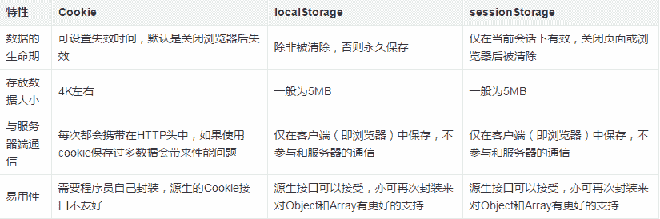

# 京东 2017 校招前端主观题汇总

## 1

谈谈优雅降级与渐进增强的区别。

你的答案

本题知识点

Javascript 前端工程师 京东 2017

讨论

[maxpup](https://www.nowcoder.com/profile/514329)

渐进增强 progressive enhancement：针对低版本浏览器进行构建页面，保证最基本的功能，然后再针对高级浏览器进行效果、交互等改进和追加功能达到更好的用户体验。

优雅降级 graceful degradation：一开始就构建完整的功能，然后再针对低版本浏览器进行兼容。

区别：优雅降级是从复杂的现状开始，并试图减少用户体验的供给，而渐进增强则是从一个非常基础的，能够起作用的版本开始，并不断扩充，以适应未来环境的需要。降级（功能衰减）意味着往回看；而渐进增强则意味着朝前看，同时保证其根基处于安全地带。

发表于 2017-02-05 19:23:36

* * *

[石壹笑](https://www.nowcoder.com/profile/2851715)

```cpp
渐进增强 ：针对低版本浏览器进行构建页面，保证最基本的功能，然后再针对高级浏览器进行效果、

          交互等改进和追加功能达到更好的用户体验。

优雅降级 ：一开始就构建完整的功能，然后再针对低版本浏览器进行兼容。
```

> 发表于 2017-07-05 21:45:56
> 
> * * *
> 
> [stanny2019](https://www.nowcoder.com/profile/5213786)
> 
> 优雅降级：即平稳退化，向后兼容渐进增强：通俗的理解就是用一些额外的信息去包裹原始数据。按照渐进增强的原则创建出的网页几乎都符合“平稳退化”的原则。
> 
> 发表于 2018-03-19 10:25:51
> 
> * * *
> 
> ## 2
> 
> 描述 cookies，sessionStorage 和 localStorage 的区别。
> 
> 你的答案
> 
> 本题知识点
> 
> Javascript 前端工程师 京东 2017
> 
> 讨论
> 
> [YaTing](https://www.nowcoder.com/profile/4363819)
> 
> 
> 
> 发表于 2017-07-24 15:00:05
> 
> * * *
> 
> [爱到荼蘼 _ 却不肯回头](https://www.nowcoder.com/profile/5295301)
> 
> 三者都是在浏览器端存储数据。1.数据存储大小限制不同。cookies：数据始终在同源的 http 请求中携带，即 cookie 在服务器和浏览器间回传。故存储的数据大小最小，一般为 4k。sessionStorage：数据在本地保存，不会自动把数据发给服务器。所以一般 5M 或者更大。localStorage：数据在本地保存，不会自动把数据发给服务器。所以一般 5M 或者更大。2.数据有效期不同 cookies：数据在 cookie 设置的有效期之前都有效，即使窗口和浏览器关闭。sessionStorage：数据在关闭浏览器窗口后自动清除。存储的数据仅在同源同窗口内有效，即使在不同浏览器相同页面也是无效的。一般用于存储会话数据。localStorage：始终有效，因此用作持久数据。3.数据作用域不同 cookies：在所有同源窗口敏感词享。sessionStorage：不在不同浏览器窗口敏感词享。localStorage：在所有同源窗口敏感词享。
> 
> 发表于 2017-09-07 15:48:32
> 
> * * *
> 
> [W-ch](https://www.nowcoder.com/profile/4788548)
> 
> cookie: 用于客户端存储会话信息，是绑定在特定的域名下的，当设定一个 cookie 后，当给创建它的域名发送请求时才会包含这个 cookie;seesionStorage:是 Storage 的一个实例，用来存储特定于某个会话的数据，该数据只保持到浏览器关闭；localStorage:也是 Storage 的一个实例，用来持久保存客户端的数据
> 
> 发表于 2017-07-19 16:38:25
> 
> * * *
> 
> ## 3
> 
> 如何设计开发一个图片轮播组件？简述要点或写代码。
> 
> 你的答案
> 
> 本题知识点
> 
> Android 前端工程师 京东 2017 安卓工程师 阅文集团 2021
> 
> 讨论
> 
> [hakz](https://www.nowcoder.com/profile/724156)
> 
> 给出一个比较通用的方法。  查看全部)
> 
> 编辑于 2017-05-22 15:26:22
> 
> * * *
> 
> [爱到荼蘼 _ 却不肯回头](https://www.nowcoder.com/profile/5295301)
> 
> **用 js 实现简单的图片轮播功能：**
> **//forTese.js**
> 
> ```cpp
> 'use strict'
> 
> //自动轮播功能
>     var count=0,
>         timer,
>         isgo = true;
>     var ul_img = document.getElementsByClassName("ul_img");
>     var li_img = document.getElementsByClassName("li_img");
>     function showtime() {
>         timer = setInterval(function(){
>             if(isgo){
>                 count++;
>                 ul_img[0].style.transform = "translateX("+ -400*count +"px)";
>                 if(count >= li_img.length-1){
>                     count=li_img.length-1;
>                     isgo = false;
>                 }
>             }else{
>                 count--;
>                 ul_img[0].style.transform = "translateX("+ -400*count +"px)";
>                 if(count <= 0){
>                     count =0;
>                     isgo = true;
>                 }
>             }
>         },4000);
>     }
>     showtime();
> //点击左右切换功能
>     var arrow = document.getElementsByClassName("arrow");
>     for(var i = 0; i<arrow.length; i++){
>         arrow[i].onmouseover = function () {
>             clearInterval(timer);
>         }
>         arrow[i].onmouseout = function () {
>             showtime();
>         }
>         arrow[i].onclick = function(){
>             //点击向右
>             if(this.title == "1") {
>                 if (count == 0) count = 3;
>                 else count--;
>             }else{
>                 if(count == 3) count = 0;
>                 else count ++;
>             }
>             ul_img[0].style.transform = "translateX("+ -400*count +"px)";
>         }
>     }
> //下面标签条对应图片功能
>     var div_btn = document.getElementsByClassName("div_btn");
>     div_btn[0].style.backgroundColor="aqua";
>     for(var i = 0;i<div_btn.length;i++){
>         div_btn[i].index = i;
>         div_btn[i].onmouseover = function () {
>             clearInterval(timer);
>             for( var j = 0;j<div_btn.length;j++){
>                 div_btn[j].style.backgroundColor="aquamarine";
>             }
>             div_btn[this.index].style.backgroundColor="aqua";
>             count = this.index;
>             if(count == 3) isgo=false;
>             if(count == 0) isgo=true;
>             ul_img[0].style.transform = "translateX("+ -400*count +"px)";
>         }
>         div_btn[i].onmouseout = function () {
>             showtime();
>         }
>     } 
> ```
> 
> **forTest.html**
> 
> ```cpp
> <!DOCTYPE html>
> <html lang="en">
> <head>
>     <meta charset="UTF-8">
>     <script src="./jquery-3.2.1.js"></script>
>     <link rel="stylesheet" href="./forTest.css" type="text/css">
>     <title>Title</title>
> 
> </head>
> <body>
> 
> <div class="main_div">
>     <div class="arrows">
>         <span title="1" class="arrow"><</span>
>         <span title="0" class="arrow" style="float:right;">></span>
>     </div>
>     <ul class="ul_img">
>         <li class="li_img"></li>
>         <li class="li_img"></li>
>         <li class="li_img"></li>
>         <li class="li_img"></li>
>     </ul>
> </div>
> <div style="margin-left:550px;">
>     <div class="div_btn"></div>
>     <div class="div_btn"></div>
>     <div class="div_btn"></div>
>     <div class="div_btn"></div>
> </div>
> 
> </body>
> <script src="forTest.js" type="text/javascript"></script>
> </html> 
> ```
> 
> **forTest.css**
> 
> ```cpp
>  .main_div{
>     width:400px;
>     overflow:hidden;
>     position:relative;
>     left:500px;
>     top:30px;
> }
> .ul_img{
>     width:6000px;
>     padding:0px;
>     margin:0px;
>     transition:all 2s;
> }
> .li_img{
>     width:400px;
>     height:550px;
>     float:left;
>     list-style:none;
> }
> img{
>     width:100%;
> }
> .arrows {
>     z-index: 9999;
>     position: absolute;
>     padding-top: 250px;
>     width: 400px;
> }
> 
> .arrows span {
>     font-size: 3em;
>     color: seashell;
> }
> 
> .arrows span:hover {
>     /*变小手*/
>     cursor: pointer;
>     background-color: rgba(192, 192, 192, 0.29);
> }
> 
> .div_btn {
>     float: left;
>     border-radius: 100px;
>     background-color: aquamarine;
>     width: 60px;
>     height: 10px;
>     margin-left: 10px;
>     margin-top: 40px;
> }
> 
> .div_btn:hover {
>     background-color: aqua;
> } 
> ```
> 
> 发表于 2017-09-07 21:12:27
> 
> * * *
> 
> [chenxd](https://www.nowcoder.com/profile/9798897)
> 
> 首先是需要哪些 html 元素：三个     $('#banner img').eq(0).css('display','block');
>     $('#banner ul').css('color','grey');
>     $('#banner ul li').eq(0).css('color','black');
>     $('#banner #title').html($('#banner img').eq(0).attr('alt'));  #此处省略自定义方法：eq 获得第几个子节点，attr 获得属性
> }然后实现轮播器 func:function（）{    #鼠标进入和鼠标离开
>     $('#banner ul li').hover(function（）{                $('#banner img').css('display','none');
>         $('#banner img').eq($(this).index()).css('display','block');
>         $('#banner ul').css('color','grey');
>         $('#banner ul li').eq($(this).index()).css('color','black');        $('#banner #title').html($('#banner img').eq($(this).index()).attr('alt'));  #此处省略自定义方法：eq 获得第几个子节点，attr 获得属性    }，function（）{});
> }#重写方法 index（）：获取某个节点在整个节点组中是第几个索引 Base.prototype.index = function（）{    var children = this.elements[0].parentNode.chidren;
>     for(var i=0;i<children.length;i++){
>         if(this.elements[0]==children[i]) return i;
>     }
> }
> 
> 发表于 2017-09-23 13:25:46
> 
> * * *
> 
> ## 4
> 
> 简要解释盒模型、行内元素与块级元素的概念。
> 
> 你的答案
> 
> 本题知识点
> 
> HTML 前端工程师 京东 2017
> 
> 讨论
> 
> [亲爱的牛顿先生](https://www.nowcoder.com/profile/919186)
> 
> 盒模型是 CSS 的基石之一，它  查看全部)
> 
> 编辑于 2017-05-22 15:26:41
> 
> * * *
> 
> [chenxd](https://www.nowcoder.com/profile/9798897)
> 
> 盒模型：是浏览器的一种标准，分标准模式和怪异模式。行内元素：无长度，宽度，margin。显示在同一行。块级元素：有宽度，长度，margin。元素换行显示。
> 
> 发表于 2017-09-23 12:25:17
> 
> * * *
> 
> [柠小哀](https://www.nowcoder.com/profile/70043777)
> 
> 块级元素会独占一行默认情况下其宽度自动填满其父元素宽度 行内元素不会独占一行相邻的行内元素会排列在同一行里直到一行排不下才会换行其宽度随元素的内容而变化 盒模型是 CSS 实现页面布局的一种思想：把页面的所有元素都看成一个类似于礼品盒的盒子礼品盒可能会有好多层包装组成那么页面元素也对应的有内容 边框 内外边距等组成 这里特别提醒一下 盒模型是要把元素看成立体的 它确实有空间的属性
> 
> 发表于 2019-05-02 22:37:27
> 
> * * *
> 
> ## 5
> 
> 如何进行前端性能优化？简述几种常用的方法。
> 
> 你的答案
> 
> 本题知识点
> 
> Javascript 前端工程师 京东 2017
> 
> 讨论
> 
> [墨裳花开](https://www.nowcoder.com/profile/994851)
> 
> 代码层面：避免使用 css 表达  查看全部)
> 
> 编辑于 2017-05-22 15:27:16
> 
> * * *
> 
> [liby](https://www.nowcoder.com/profile/499045)
> 
> 前端性能优化大概分为以下几类：1.内容方面    减少 http 请求
>     代码压缩
>     js 代码写在</body>之前
>     浏览器缓存（cookie/sessionStorage/localStorage）
>     将静态资源放置在子域名下，实现并行下载数目增加
>     缓存 ajax 结果
>     减少 DOM 节点数 2.服务器方面    cdn 加速
>     gzip 压缩
> 3.js    引用压缩过的库（.min）
>     减少操作 DOM 节点，必要时将节点缓存起来（离线更新）；
>     少用递归或者用尾递归优化
>     减少全局变量
>     懒加载
>     预加载
> 4.css    精简 css 代码的编写，减少嵌套层次    使用 sprite 图
>     尽量采用简写
>     用 link 代替@import
>     动画要用在脱离文档流的元素上
> 5.图片处理    图片一般要压缩到小于 200k（banner 等）
>     可将资源放至子域名下
>     用 iconfont 代替小图标
> 
> 发表于 2017-08-08 00:44:52
> 
> * * *
> 
> [geekjc](https://www.nowcoder.com/profile/427623)
> 
> （1） 减少 http 请求次数：CSS Sprites, JS、CSS 源码压缩、图片大小控制合适；网页 Gzip，CDN 托管，data 缓存 ，图片服务器。
> 
> （2） 前端模板 JS+数据，减少由于 HTML 标签导致的带宽浪费，前端用变量保存 AJAX 请求结果，每次操作本地变量，不用请求，减少请求次数
> 
> （3） 用 innerHTML 代替 DOM 操作，减少 DOM 操作次数，优化 javascript 性能。
> 
> （4） 当需要设置的样式很多时设置 className 而不是直接操作 style。
> 
> （5） 少用全局变量、缓存 DOM 节点查找的结果。减少 IO 读取操作。
> 
> （6） 避免使用 CSS Expression（css 表达式)又称 Dynamic properties(动态属性)。
> 
> （7） 图片预加载，将样式表放在顶部，将脚本放在底部 加上时间戳。
> 
> （8） 避免在页面的主体布局中使用 table，table 要等其中的内容完全下载之后才会显示出来，显示比 div+css 布局慢。
> 
> 发表于 2017-10-12 16:39:59
> 
> * * *
> 
> ## 6
> 
> 给你两个集合，要求{A} + {B}。 注：同一个集合中不会有两个相同的元素。输出时按数字升序输出。数据范围： ，集合中的元素满足 
> 
> 本题知识点
> 
> 模拟 前端工程师 京东 2017 C++工程师 golang 工程师 iOS 工程师 安卓工程师 运维工程师 算法工程师 测试工程师 PHP 工程师 Java 工程师
> 
> 讨论
> 
> [华科平凡](https://www.nowcoder.com/profile/4939096)
> 
> python solution:
> 
> ```cpp
> import sys
> 
> a=sys.stdin.readline().strip()
> b=sys.stdin.readline().strip().split(" ")
> c=sys.stdin.readline().strip().split(" ")
> 
> print(" ".join(sorted(set(b+c),key=int))) 
> ```
> 
> 发表于 2017-10-14 16:35:16
> 
> * * *
> 
> [Follow_Heart](https://www.nowcoder.com/profile/9654125)
> 
> ```cpp
> /*直接运用 STL 里的 set 来做，比较简单*/
> #include<iostream>
> #include<iterator>
> #include<set>
> 
> using namespace std;
> int main(void)
> {
> 	int n, m;
> 	while (cin >> n, cin >> m)
> 	{
> 		set<int> st;
> 		int num;
> 		for (int i = 0; i < n + m; ++i)
> 		{
> 			cin >> num;
> 			st.insert(num);
> 		}
> 		int size = st.size();
> 		set<int>::iterator it = st.begin();
> 		for (int i = 0; i < size - 1; ++i)
> 		{
> 			cout << *it << " ";
> 			++it;
> 		}
> 		cout << *it << endl;
> 	}
> 	return 0;
> }
> 
> ```
> 
> 发表于 2017-07-19 17:20:54
> 
> * * *
> 
> [指 offer 的剑在哪？](https://www.nowcoder.com/profile/3812129)
> 
> 将输入的数据全部都保存到 TreeSet 中就可以了；TreeSet 集合中的数据无重复，而且默认按照自然排序进行升序；不过 TreeSet 集合没有 get 方法，所以想要获取它的元素就需要使用迭代对象 iterator:
> 
> ```cpp
> import java.util.Iterator;
> import java.util.Scanner;
> import java.util.TreeSet;
> 
> public class StringUtil {
> 
> 	//集合
> 	public static void main(String[] args){
> 		Scanner in = new Scanner(System.in);
> 		TreeSet<Integer> set = new TreeSet<Integer>();
> 		while(in.hasNext()){
> 			int m = in.nextInt();
> 			int n = in.nextInt();
> 			for(int i=1; i<=m+n; i++){
> 				set.add(in.nextInt());
> 			}
> 			Iterator<Integer> it = set.iterator();
> 			while(it.hasNext()){
> 				System.out.print(it.next());
> 				if(it.hasNext())
> 					System.out.print(" ");
> 			}
> 		}
> 	}
> }
> ```
> 
> 编辑于 2017-09-07 18:51:01
> 
> * * *
> 
> ## 7
> 
> 尽管是一个 CS 专业的学生，小 B 的数学基础很好并对数值计算有着特别的兴趣，喜欢用计算机程序来解决数学问题，现在，她正在玩一个数值变换的游戏。她发现计算机中经常用不同的进制表示一个数，如十进制数 123 表达为 16 进制时只包含两位数 7、11（B），用八进制表示为三位数 1、7、3，按不同进制表达时，各个位数的和也不同，如上述例子中十六进制和八进制中各位数的和分别是 18 和 11 。 小 B 感兴趣的是，一个数 A 如果按 2 到 A-1 进制表达时，各个位数之和的均值是多少？她希望你能帮她解决这个问题？ 所有的计算均基于十进制进行，结果也用十进制表示为不可约简的分数形式。数据范围： 
> 
> 本题知识点
> 
> 模拟 安卓工程师 京东 2017 前端工程师 C++工程师 golang 工程师 iOS 工程师 运维工程师 算法工程师 测试工程师 PHP 工程师 Java 工程师
> 
> 讨论
> 
> [**](https://www.nowcoder.com/profile/3137613)
> 
>         鉴于解析里面并没有详细的代码分析，这里安利一波。。。。        此题，可以分为两部分，第一部分，求一个数的从 2 进制开始到 n-1 进制表示时各个位数的数字相加和；第二部分，求各进制位数和的均值，注意题目要求用分数表示，且要化简到最简形式，这就要用到最大公约数来进行分子分母约分了。        首先，第一部分求目的数 n 各个进制的表示的位数和，这肯定需要我们统计从二进制开始到 n-1 进制，每一个进制表示 n 时的位数和，再进行累加了。所以，可以写一个循环，i 从 2 到 n-1，然后分别统计 i 进制表示时的位数和，然后每一步结束累加位数和。那么问题的关键就是对于 i 进制如何求出位数和，这个其实也非常简单，这里我用数字 123，分别用 16 进制和 8 进制来解析如何表示出 123 这个数字。过程如下：        16 进制：首先 123/16=7.....11，即 11 就是 16 进制的低位；此时，剩下商 7，而 7 不能再被 16 整除，于是取余数得到 7，即 7/16=0.....7;这样，就得到了 123 的 16 进制表示 7,11(B)
>         8 进制：首先 123/8=15....3,则 3 就是 8 进制的低位；此时，剩下商 15,15/8=1.....7,此时 7 就是 8 进制表示的次低位；最后 1/8=0.......1;这样，就得到了 123 的 8 进制表示 1,7,3
> 通过上面的观察，我们不难发现求一个数 n 的 i 进制(i=2,...,n-1)的表示的方法。即，从数 n 开始对 i 取余数，表示 i 进制最低位；商不为 0 则继续用商对 i 取余数，表示次低位.....；直至商为 0 为止，就得到了 n 的 i 进制表示。        回到本题，第一部分求位数和，那么我们只需要每求一位的 i 进制表示，就累加一位，这样就能得到最终的位数和了。具体的代码，诸位大神写的都很清楚，我就不再赘述，只是理清一下思路。
>         第二部分，刚才，我们已经求了分数的分子，那么分数是多少呢？显然，分母是从 2....n-1；这样，就有 n-2 个不同的进制类型，即分母是 n-2。然后，我们还不能只能输出分子/分母；因为，题目要求我们还要化简，所以我们要找到最小公约数，然后分子分母同时除以最小公约数即可。
>         那么，如何求两个数的最小公约数呢？思路就是欧几里德算法(辗转相除法):
> 
>         首先给定两个数 a,b（a>b）,则根据除法运算，a/b=q......r。q 是商，r 是余数。也可以表示为 a=bq+r。这是小学就知道的。下面给出一个定理：
>         若 a=bq+r，则（a,b）=（b,r），即 a,b 的最大公约数等于 b,r 的最大公约数。
>         举个例子来说：24=10*2+4，那么(24,10)=(10,4)=2
> 这个定理的证明也很简单。
> 设 c 是 a 和 b 的任意一个公约数,则 c 能同时整除 a 和 b,即 a=cx,b=cy，（x,y 是整数）
> 将它们代入“a=bq+r”中：cx=cyq+r
> 得到 r=c(x-yq)，说明 c 也能整除 r，即 c 也是 b 和 r 的公约数。
> 于是 a 和 b 的公约数就是 b 和 r 的公约数，那么 a 和 b 最大公约数就是 b 和 r 的最大公约数，（a,b）=（b,r）。
> 
> 定理得证。        欧几里德算法就是对照这个定理来做的，每一次辗转相除其实就是用了一次上面的定理，一步一步递推得到最后结果。算法如下：int ***(int a,int b){ while(a%b!=0){
>                                             int c=a%b; a=b; b=c; } return b; }         这样，在第二部分，我们将分子，分母作为参数，输入到函数***中求出分子分母的最大公约数，然后分子分母同时约分即可。
>         注意，提到了最大公约数，联想一下，如果要我们求两个数的最小公倍数呢？思路也非常简单，就是在我们求出最大公约数之后，用两个数 m，n 的乘积 m*n,除以最大公约数***即可，即 m*n/***。不信可以试试，哈哈。
> 
> 发表于 2017-08-23 17:27:23
> 
> * * *
> 
> [那年夏天宁静的海 00](https://www.nowcoder.com/profile/622147)
> 
> //还是上一题难 ！！！ 求最大公约数 +数字位求和 import java.util.*;public class test2 {public static void main(String[] args) {Scanner sc = new Scanner(System.in);while(sc.hasNext()){int num = sc.nextInt();deal(num);}}public static void deal(int num){int sum=0;int kind =num-2;for(int i=2;i<num;i++){sum+=fun2(num,i);}int con =fun(sum,kind);System.out.println(sum/con+"/"+kind/con);}//一个数字按不同进制的各个位加和 public static int fun2(int num,int x){int res=0;while(num!=0){res+=num%x;num/=x;}return res;}//求出最大公约数 public static int fun(int a, int b){while(a%b!=0){int c =a%b;a=b;b=c;}return b;}}
> 
> 发表于 2017-07-24 16:38:09
> 
> * * *
> 
> [卷积神经网络哦](https://www.nowcoder.com/profile/8684256)
> 
> 很简单但还是刷一波哈哈哈
> 要约分还是有点烦的
> 
> ```cpp
> #include <iostream>
> #include <cstdio>
> #include <cstring>
> #include <algorithm>
> #include <cmath>
> using namespace std;
> 
> int fun(int x, int y){
>     int sum = 0;
>     while(x){
>         sum += (x % y);
>         x /= y; 
>     }
>     return sum;
> }
> 
> int main(){
>     int n, ans;
>     while(scanf("%d", &n) == 1){
>         ans = 0;
>         for(int i = 2; i < n; i++) ans += fun(n, i);
>         int fenmu = n - 2, fenzi = ans;
>         for(int i = 2; i <= min(n-2, ans);i++)
>             while((fenmu % i == 0) &&(fenzi % i == 0)) {fenmu /= i; fenzi /= i;}
>         cout<<fenzi<<"/"<<fenmu<<endl;
>     }
>     return 0;
> } 
> ```
> 
> 发表于 2018-10-03 21:56:24
> 
> * * *