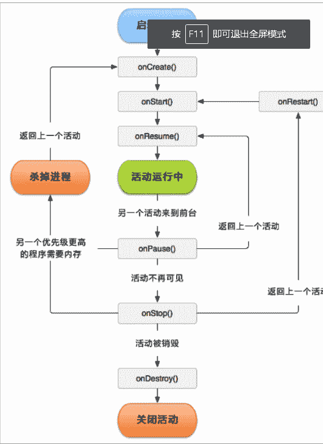
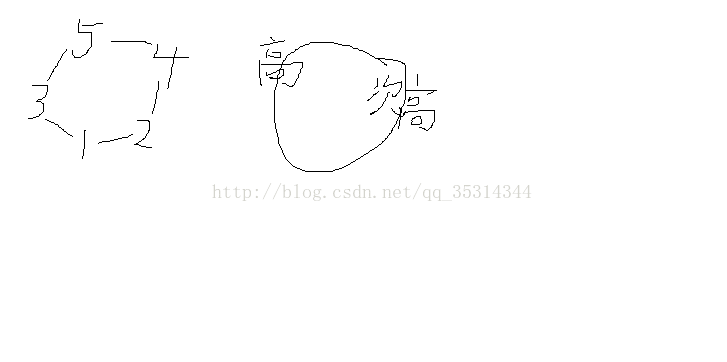
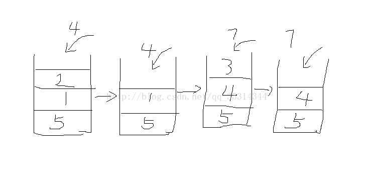
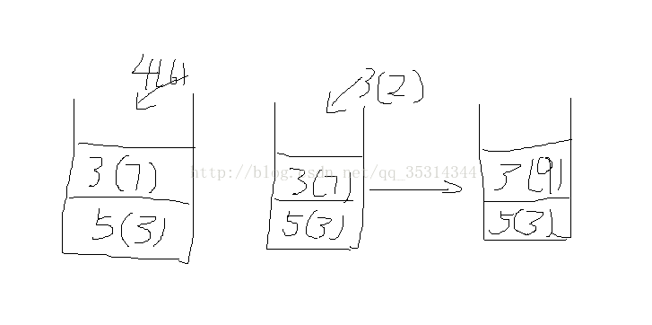
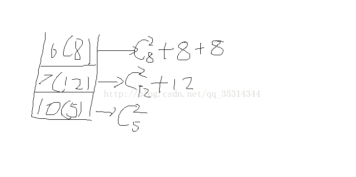

# 京东 2017 校招 Android 主观题汇总

## 1

如何退出 Activity？如何安全退出已调起多个 Activity 的 Application？

你的答案

本题知识点

Android 安卓工程师 京东 2017

讨论

[TK29](https://www.nowcoder.com/profile/3074836)

相对于直接建立一个 BaseActivity 来重写 onCreate() 和 onDistory()方法，个人还是更加倾向于 实现 application 中的 registerActivityLifecycleCallback 回掉接口

发表于 2017-05-10 00:17:05

* * *

[Bacchuc](https://www.nowcoder.com/profile/6041628)

关闭一个 activity 用 finish()方法，关闭所有的 activity，可以让所有的 activity 继承一个 baseactivity，并且重写 oncreate()和 ondestroy()，每当一个活动被创建就进栈，当需要退出程序时可以将所有的活动出栈即可~

发表于 2017-03-25 23:24:01

* * *

[jasonlin](https://www.nowcoder.com/profile/4735271)

单一的 Activity,调用 activity.finish()即可.如果有多个 activity.需要一个专门的集合类对所有的活动进行管理. 集合类里有一个 List 保存每个活动,如下代码所示.

```cpp
   1.  public class ActivityCollector {      
2.  public static List<Activity> activities=new ArrayList<Activity>();      
3.  public static void addActivity(Activity activity)      
4.  {      
5.  activities.add(activity);      
6.  }      
7.  public static void removeActivity(Activity activity)      
8.  {      
9.  activities.remove(activity);      
10.  }      
11.  public static void finishAll()//退出所有的 Activity      
12.  {      
13.  for(Activity activity:activities)      
14.  {      
15.  if(!activity.isFinishing())      
16.  {      
17.  activity.finish();//退出 Activity      
18.  }      
19.  }      
20.  }      
21.  }     

    1.  public class BaseActivity extends Activity {      
2.  @Override      
3.  public void onCreate(Bundle savedInstanceState) {      
4.  super.onCreate(savedInstanceState);      
5.  this.requestWindowFeature(Window.FEATURE_NO_TITLE);//去掉标题栏      
6.  ActivityCollector.addActivity(this);      
7.  }      

9.  @Override      
10.  protected void onDestroy() {      
11.  super.onDestroy();      
12.  ActivityCollector.removeActivity(this);      
13.  }      
14.  }     

            发表于 2017-09-06 20:29:00

        2
        用至少两种方式实现一个 Singleton（单例模式）。

    你的答案

本题知识点

                                                            系统设计 
                                                安卓工程师 
                                                京东 
                                                2017 

讨论

[sniperlife](https://www.nowcoder.com/profile/6551980)

  一。静态内部类实现：
 这种方式

  查看全部)

编辑于 2017-05-22 14:55:07

* * *

[大橘已定](https://www.nowcoder.com/profile/6994957)

  转载自[如何优雅地手写单例模式](https://www.cnblogs.com/sgh1023/p/10752592.html) 

   单例模式是设计模式中最简单的形式之一。这一模式的目的是使得类的一个对象成为系统中的唯一实例。正是因为简单，也成为面试中的众矢之的。本文来手写单例模式。  

   单例模式是一种常用的设计模式，该模式提供了一种创建对象的方法，确保在程序中一个类最多只有一个实例。  

   有一些对象其实我们只需要一个，比如线程池、缓存、对话框、处理偏好设置和注册表的对象、日志对象，充当打印机、显示等设备的驱动程序对象。其实，这类对象只能有一个实例，如果制造出来多个实例，就会导致许多问题，如：程序的行为异常、资源使用过量，或者是不一致的结果。  

> Singleton 通常用来代表那些本质上唯一的系统组件，比如窗口管理器或者文件系统。

   在 Java 中实现单例模式，需要一个静态变量、一个静态方法和私有的构造器。  

   经典的单例模式实现  

   对于一个简单的单例模式，可以这样实现：  

1.  定义一个私有的静态变量 uniqueInstance；    

2.  定义私有的构造方法。这样别处的代码无法通过调用该类的构造函数来实例化该类的对象，只能通过该类提供的静态方法来得到该类的唯一实例；    

3.  提供一个 getInstance()方法，该方法中判断是否已经存在该类的实例，如果存在直接返回，不存在则新建一个再返回。代码如下：    

```
public class Singleton{
    private static Singleton uniqueInstance;//私有静态变量

    //私有的构造器。这样别处的代码无法通过调用该类的构造函数来实例化该类的对象，只能通过该类提供的静态方法来得到该类的唯一实例。
    private Singleton(){}

    //静态方法
    public static Singleton getInstance(){
        //如果不存在，利用私有构造器产生一个 Singleton 实例并赋值到 uniqueInstance 静态变量中。
        //如果我们不需要这个实例，他就永远不会产生。这叫做“延迟实例化（懒加载）“
        if(uniqueInstance == null){
            uniqueInstance = new Singleton();
        }
        return uniqueInstance;
    }
}

```cpp

   这段代码使用了延迟实例化，在单线程中没有任何问题。但是在多线程环境下，当有多个线程并行调用 getInstance()，都认为 uniqueInstance 为 null 的时候，就会调用 uniqueInstance = new Singleton();，这样就会创建多个 Singleton 实例，无法保证单例。  

   解决多线程环境下的线程安全问题，主要有以下几种写法：  

   同步 getInstance()方法  

> 关键字 synchronized 可以保证在他同一时刻，只有一个线程可以执行某一个方法，或者某一个代码块。

   同步 getInstance()方法是处理多线程最直接的做法。只要把 getInstance()变成同步（synchronized）方法，就可以解决并发问题了。  

```
public class Singleton{
    private static Singleton uniqueInstance;//私有静态变量

    //私有构造器
    private Singleton() {}

    //synchronized 同步方法
    public static synchronized Singleton getInstance(){
        if(uniqueInstance == null){
            uniqueInstance = new Singleton();
        }
        return uniqueInstance;
    }
}

```cpp

   但是，同步的效率低，会降低性能。只有第一次执行此方法的时候，才真正需要同步。也就是说，一旦设置好 uniqueInstance 变量，就不再需要同步这个方法了。之后每次调用这个方法，同步都是一种累赘。同步 getInstance()方法既简单又有效。如果说对性能要求不高，这样就可以满足要求。  

   “急切”实例化  

   之前的实现采用的是懒加载方式，也就是说，当真正用到的时候才会创建；如果没被使用到，就一直不会创建。  

   懒加载方式在第一次使用的时候， 需要进行初始化操作，可能会比较耗时。  

   如果确定一个对象一定会使用的话，可以采用“急切”地实例化，事先准备好这个对象，需要的时候直接使用就行了。这种方式也叫做饿汉模式。具体代码：  

```
public class Singleton{
    //在静态初始化器中创建单例，保证了线程安全性
    private static Singleton uniqueInstance = new Singleton();

    private Singleton() {}

    public static Singleton getInstance(){
        return uniqueInstance;
    }
}

```cpp

   饿汉模式是如何保证线程安全的？  

   饿汉模式中的静态变量是随着类加载时被初始化的。static 关键字保证了该变量是类级别的，也就是说这个类被加载的时候被初始化一次。注意与对象级别和方法级别进行区分。  

   因为类的初始化是由类加载器完成的，这其实是利用了类加载器的线程安全机制。类加载器的 loadClass 方法在加载类的时候使用了 synchronized 关键字。也正是因为这样， 除非被重写，这个方法默认在整个装载过程中都是同步的（线程安全的）。  

   双重检查加锁  

   杀鸡用牛刀。实现单例模式可以利用双重检查加锁（double-checked locking），首先检查是否实例已经创建了，如果尚未创建，“才”进行同步。这样，只有第一次会同步。  

```
public class Singleton{
    //使用 volatile 关键字，确保当 uniqueInstance 变量被初始化成为 Singleton 实例时，多线程可以正确地处理 uniqueInstance 变量。
    private volatile static Singleton uniqueInstance;

    private Singleton() {}

    public static Singleton getInstance() {
        if(uniqueInstance == null){//第一次检查
            synchronized(Singleton.class){
                if(uniqueInstance == null){//第二次检查
                    uniqueInstance = new Singleton();
                }
            }
        }
        return uniqueInstance;
    }

}

```cpp

   如果性能是关注的重点，双重检查加锁可以大幅减少 getInstance()的时间消耗成本。  

> 在 Java 1.5 发行版本之前，双重检查模式的功能很不稳定，因为 volatile 修饰符的语义不够强，难以支持它。Java 1.5 发行版本中引入的内存模式解决了这个问题，如今，双重检查模式是延迟初始化的一个实例域的方法。

   最佳方法  

   从 Java 1.5 发行版本起，实现 Singleton 只需要编写一个包含单个元素的枚举类型：  

```
public enum Singleton {   INSTANCE;  } 
```cpp

> 使用枚举实现单例的方法虽然还没有广泛采用，但是单元素的枚举类型已经成为实现 Singleton 的最佳方法。注意：如果 Singleton 必须拓展一个超类，而不是扩展 Enum 的时候，则不宜使用这个方法。

发表于 2019-05-09 10:49:39

* * *

[咸鱼吧，后浪！](https://www.nowcoder.com/profile/1365895)

这里以两种解决 DCL（双重检查锁）失效问题的方式来创建

* * *

*   1.利用 volatile 关键字解决 DCL 失效问题
    public class VolatileSolveDCLSingleTon {
    // volatile 解决了处理器乱序执行的问题从而解决了 DCL 失效问题
    private volatile static VolatileSolveDCLSingleTon instance;
    private VolatileSolveDCLSingleTon(){}

    public static VolatileSolveDCLSingleTon getInstance(){

    ```
    // 为空时才去获取对象锁
      if(instance == null){
          synchronized (VolatileSolveDCLSingleTon.class){
              // 此时仍为空才执行 new 操作，避免多个线程突破了第一层检查
              if(instance == null){
                  instance = new VolatileSolveDCLSingleTon();
              }
          }
      }
      return instance; 
    ```cpp

    }
    }

* * *

*   2.使用静态内部类方式解决 DCL 失效问题
    public class StaticSolveDCLSingleTon {

    // 静态内部类方式解决 DCL 失效问题
    private static class SingleTonHolder{

    ```
    private static final StaticSolveDCLSingleTon instance = new StaticSolveDCLSingleTon(); 
    ```cpp

    }
    private StaticSolveDCLSingleTon(){}

    public static final StaticSolveDCLSingleTon getInstnce(){

    ```
    return SingleTonHolder.instance; 
    ```cpp

    }
    }

* * *

3.可能有人想问什么是 DCL 失效问题，这里简单讲下：

> DCL 失效：
> 我们看 instance = new SingleTon（）；这一句，在 JDK1.5 以前，处理器为了保证执行效率，会在保证程序执行结果不变的情况下进行指令的乱序执行，这一句处理器的执行过程分三步：

* * *

> 1.在堆中为 SingleTon 对象开辟一块存储空间
> 2.调用 new SingleTon（）来执行类的初始化
> 3.执行"="过程，即将 instance 引用指向 SingleTon 对象在堆中的内存空间

* * *

> 乱序执行发生在上面 2、3 的过程，也就是 3 可能会先于 2 执行，一般情况下这样是不影响程序的结果的，最终都是 instance 指向了对象在堆中的内存空间.
> 但是在 DCL 中，我们进行了两次 instance 判空，当第一次判空失败时我们会直接返回 instance 对象，问题就出在这里，当我们一个线程在执行上面 new 过程并且 3 先于 2 执行了的时候，假如有另一个线程也调用了 getInstance 方法，这时会进行第一次判空，由于 3 过程（"="操作）执行后此时 instance ！= null，所以另一个线程会直接被返回 instance，但是此时 instance 是未创建完全的，是不完整的，所以使用的时候就会出错，这就是 DCL 失效问题

纯手打，有错望指教

发表于 2017-09-08 17:34:53

* * *

## 3

        多线程有几种实现方法，都是什么？同步有几种实现方法，都是什么？

你的答案

本题知识点

                                                            Java 
                                                安卓工程师 
                                                京东 
                                                2017 

讨论

[新蜂](https://www.nowcoder.com/profile/7552163)

 一、多线程有几种实现方法，都

  查看全部)

编辑于 2017-05-22 14:57:12

* * *

[Maturekid](https://www.nowcoder.com/profile/4018263)

                                                                      java 多线程实现方式主要有三种：继承 Thread 类、实现 Runnable 接口、实现 Callable 接口，重写 call 方法。其中前两种方式线程执行完后都没有返回值，只有最后一种是带返回值的。 

   java 中实现同步的两种方式:syschronized 和 lock  

发表于 2017-08-08 16:43:35

* * *

[starry-](https://www.nowcoder.com/profile/4491477)

                                                                    实现多线程有三种方法： 第一种：实现 Runable 接口，重写 run 方法； 第二种：继承 Thread 类，重写 run 方法；
第三种：实现 Callable 接口

发表于 2017-03-31 07:57:41

* * *

## 4

        请描述下 Activity 的生命周期。

你的答案

本题知识点

                                                            Android 
                                                安卓工程师 
                                                京东 
                                                2017 

讨论

[izzzzz](https://www.nowcoder.com/profile/976341)

 [图] 
 如上图 

 **1.onC**

  查看全部)

编辑于 2017-05-22 14:58:27

* * *

[一枚程序员](https://www.nowcoder.com/profile/7162605)

                                                                      启动 Activity，系统依次调用 onCreate()，onStart()，onResme()方法,Activity 进入运行状态。 
   当前 Activity 被覆盖或者锁屏了，调用 onPause()方法，暂停当前 Activity 的执行。 
   当前 Activity 被由覆盖状态返回或解锁，调用 onResme()方法，恢复运行状态。 
   当前 Activity 跳转到新的 Activity 或者回到主屏时，调用 onPause()方法，然后调用 onStop()方法，进入停滞状态。 
   用户回到 Activity 时，调用 onRestart()方法，之后调用 onStart()方法，onPause(),再次进入运行状态。 
   当用户退出当前 Activity 时，调用 onPause()方法，然后调用 onStop()方法，再调用 onDestory()方法，结束当前 Activity。 
   如下图： 
   

发表于 2017-09-07 08:58:05

* * *

[Maturekid](https://www.nowcoder.com/profile/4018263)

  1.启动 Activity：系统会先调用 onCreate 方法，然后调用 onStart 方法，最后调用 onResume，Activity 进入运行状态。 

  2.当前 Activity 被其他 Activity 覆盖其上或被锁屏：系统会调用 onPause 方法，暂停当前 Activity 的执行。 

  3.当前 Activity 由被覆盖状态回到前台或解锁屏：系统会调用 onResume 方法，再次进入运行状态。 

  4.当前 Activity 转到新的 Activity 界面或按 Home 键回到主屏，自身退居后台：系统会先调用 onPause 方法，然后调用 onStop 方法，进入停滞状态。 

  5.用户后退回到此 Activity：系统会先调用 onRestart 方法，然后调用 onStart 方法，最后调用 onResume 方法，再次进入运行状态。 

  6.当前 Activity 处于被覆盖状态或者后台不可见状态，即第 2 步和第 4 步，系统内存不足，杀死当前 Activity，而后用户退回当前 Activity：再次调用 onCreate 方法、onStart 方法、onResume 方法，进入运行状态。 

  7.用户退出当前 Activity：系统先调用 onPause 方法，然后调用 onStop 方法，最后调用 onDestory 方法，结束当前 Activity。 

发表于 2017-08-08 16:44:48

* * *

## 5

        什么是 ANR 和 Force Close？如何避免？

你的答案

本题知识点

                                                            Android 
                                                安卓工程师 
                                                京东 
                                                2017 

讨论

[weixk](https://www.nowcoder.com/profile/875331)

 ANR: Applicati

  查看全部)

编辑于 2017-05-22 14:58:55

* * *

[larrysea](https://www.nowcoder.com/profile/5430709)

                                                                    ANR 的缩写是 Application not Respond 应用程序无响应，force close
一般是因为出现异常导致程序崩溃出现 force close 这种情况只能是自己将自己的应用程序变得更加健壮，使自己的应用程序捕获到这些异常并且加以处理而不是直接崩溃。

发表于 2017-01-25 17:18:53

* * *

[jasonlin](https://www.nowcoder.com/profile/4735271)

                                                                      ANR：application not responding 
   当对输入事件（如按键、触摸屏事件）的响应超过 5 秒、意图接收者（intentReceiver）超过 10 秒钟仍未执行完毕时都会报 ANR。 
   Android 应用程序完全运行在一个独立的线程中。任何在主线程中运行的，需要消耗大量时间的操作都会引发 ANR。因此，需要消耗大量时间的操作如访问网络和数据库，都要放到子线程中或者使用异步请求。 

   Force Close： 
   一般像空指针、数组越界、类型转换异常等。可以通过 logcat 查看抛出异常的代码出现的位置，然后到程序对应代码中进行修改。 

发表于 2017-09-06 21:04:12

* * *

## 6

          战争游戏的至关重要环节就要到来了，这次的结果将决定王国的生死存亡，小 B 负责首都的防卫工作。首都位于一个四面环山的盆地中，周围的 n 个小山构成一个环，作为预警措施，小 B 计划在每个小山上设置一个观察哨，日夜不停的瞭望周围发生的情况。 一旦发生外地入侵事件，山顶上的岗哨将点燃烽烟，若两个岗哨所在的山峰之间没有更高的山峰遮挡且两者之间有相连通路，则岗哨可以观察到另一个山峰上的烽烟是否点燃。由于小山处于环上，任意两个小山之间存在两个不同的连接通路。满足上述不遮挡的条件下，一座山峰上岗哨点燃的烽烟至少可以通过一条通路被另一端观察到。对于任意相邻的岗哨，一端的岗哨一定可以发现一端点燃的烽烟。 小 B 设计的这种保卫方案的一个重要特性是能够观测到对方烽烟的岗哨对的数量，她希望你能够帮她解决这个问题。 

   数据范围： , 每座山的高度满足 

本题知识点

                                                            栈 *安卓工程师 
                                                京东 
                                                2017 
                                                C++工程师 
                                                golang 工程师 
                                                iOS 工程师 
                                                运维工程师 
                                                前端工程师 
                                                算法工程师 
                                                测试工程师 
                                                PHP 工程师 
                                                Java 工程师*  *讨论

[一匹努力的千里马](https://www.nowcoder.com/profile/3909795)

                                                                      100% ac

 首先理解题目意思：
 5  2  1  4  3  7 这样的输入
 除了最自然的 6 个以外，还有
 2（1）4
 5 （2 1）4
 4 （3）7
 共 9 对

  此题可以理解为在两个山峰之间的山峰都比两端低时，两端山峰就是一对，现在就是求有多少对？此题可以转为环形链表中，一个数求他左右两边离他最近且大于他的数。 

    

  （1,2）（1,3）（2,3）（2,4）（4,5）（3,4）（3,5）可以看出最高和次高可以组成一对，其他数据都能有两个相邻最大值，所以此问题通解（n-2）*2+1。 

  找出一个数左右最近的大于他的数，可以用单调栈实现。我们设定单调栈中，从栈顶到栈底依次变大。 

  假设有数 5  2  1  4  3  7 

    

  先放 5,2 小于 5，放 2,1 小于 2，放 1,4 大于 1，则 1 弹出，1 的弹出是由于 4，所以 4 是 1 右边临近的大于他的数，2 在 1 下面，所以 2 是 1 左面临近大于他的数。相同原理 2 弹出，4 进，3 进，7 进时同理弹出 3,4,5 

  左      右 

  1    2        4 

  2    5        4 

  3    4        7 

  4    5        7 

  5    null    7 

  7    null   null 

  总对数=4*2+1。此算法复杂度可以达到 O（n），遍历算法 O(n²) 

  以上算法只适用于，山峰高度都各不相等的情况下，若有相等则：一次遍历将相邻相等山峰合并，二次遍历找最大值开始压栈 

    

  将 3 个 5 压入，7 个 3 压入，当 6 个 4 压入时，7 个 3 要出栈。7 个 3 中，自己有对，与 3 相邻的 4，可以看到每个 3，所以有 7 对，5 与 4 同理有 7 对， 

  共 7*6/2+7+7。 

  当压入数据与栈顶数据相同，则只需合并个数即可。 

  没有数据入栈时，只需依次出栈，  

    

  纠正上图一个错误，对于 7 产生的个数，少加了一个 12.因为只剩下 7 和 10 的时候，从 10 看向 7 和从 7 看向 10 是不一样的所以要加两次 12 

   [`blog.csdn.net/qq_35314344/article/details/76083170`](https://blog.csdn.net/qq_35314344/article/details/76083170)

```
import java.util.ArrayList;
import java.util.List;
import java.util.Scanner;

public class Main {
    public static void main(String[] args) {
        Scanner scan = new Scanner(System.in);
        int n = scan.nextInt();
        int a[] = new int[n*2];
        for (int i = 0; i < n; i++) {
            a[i] = scan.nextInt();
            a[i+n]= a[i];
        }
        int maxIndex=0,secondIndex=0;
        for(int i=1;i<n;i++){
            if(a[maxIndex]<a[i])maxIndex = i;
        }
        if(maxIndex==0)secondIndex = 1;
        for(int i=1;i<n;i++){
            if(i==maxIndex)continue;
            if(a[secondIndex]<a[i])secondIndex = i;
        }
        int start = maxIndex>secondIndex?secondIndex:maxIndex;
        int mid = maxIndex>secondIndex?maxIndex:secondIndex;
        int end = start+n; 
        System.out.println(getCount(a,start,mid)+getCount(a,mid,end)+1);
    }
    static long getCount(int a[],int start,int end){
        if(end-start==1)return 0;
        List<Integer> list = getMaxIndexExceptStartAndEnd(a,start,end);
        long c = (int)list.size();
        int f = list.get(0);
        int l = list.get(list.size()-1);
        long r1 = getCount(a,start,f)+c;
        long r2 = getCount(a,l,end)+c;
        long sum1= c*(c-1)/2;
        for(int i=1;i<list.size();i++){
            sum1 += getCount(a,list.get(i-1),list.get(i));
        }
        return r1+r2+sum1;
    }

    static List<Integer> getMaxIndexExceptStartAndEnd(int []a,int start,int end){
        List<Integer> list = new ArrayList<Integer>();
        int max = start+1;
        list.add(max);
        for(int i=start+2;i<end;i++){
            if(a[max]<a[i]){
                list.clear();
                list.add(i);
                max = i;
            }else if(a[max]==a[i]){
                list.add(i);
            }
        }
        return list;
    }
}
```cpp

编辑于 2018-05-10 20:22:12

* * *

[元气の悟空](https://www.nowcoder.com/profile/392974)

```
//AC 代码：
#include<stdio.h>
#include<vector>
using namespace std;
struct node{
	long val,cnt;
	node(long val):val(val),cnt(1){}
};
int main(){
	int N,i,x,Maxi;
	//freopen("input.txt","r",stdin);
	while(scanf("%d",&N)!=EOF){
		vector<long> d(N);
		for(i=0;i<N;i++) scanf("%ld",&d[i]);
		vector<node> v;
		node tmp(d[0]);
		long Max=-1;
		for(i=1;i<N;i++)
			if(d[i]==d[i-1]) tmp.cnt++;
			else{
				v.push_back(tmp);
				if(Max<tmp.val){
					Max=tmp.val;
					Maxi=v.size()-1;
				}
				tmp.val=d[i];
				tmp.cnt=1;
			}
		v.push_back(tmp);
		if(Max<tmp.val){
			Max=tmp.val;
			Maxi=v.size()-1;
		}
		int n=0;
		long cnt=0;
		vector<node> stack;
		for(i=Maxi;n!=v.size();n++,i=(i+1)%v.size()){
			while(stack.size()&&v[i].val>stack[stack.size()-1].val){
				node &m=stack[stack.size()-1];
				cnt+=m.cnt+m.cnt*(m.cnt-1)/2;
				stack.pop_back();
				if(stack.size()) cnt+=m.cnt;
			}
			if(stack.size()){
				if(v[i].val==stack[stack.size()-1].val)
					stack[stack.size()-1].cnt+=v[i].cnt;
				else
					stack.push_back(v[i]);
			}else
				stack.push_back(v[i]);
		}
		while(stack.size()){
			node &m=stack[stack.size()-1];
			cnt+=m.cnt*(m.cnt-1)/2;
			stack.pop_back();
			if(stack.size()) cnt+=2*m.cnt;
			if(stack.size()==1&&stack[stack.size()-1].cnt==1) cnt-=m.cnt;
		}
		printf("%ld\n",cnt);
	}
}
//这是左程云老师的思路   我动手实现了一下  应该是最优解  时间复杂度 O(N)   用单调栈

```cpp

编辑于 2017-07-21 00:09:25

* * *

[ndsk](https://www.nowcoder.com/profile/7975997)

暴力直接向两边遍历枚举是会超时的，我一开始也是这么做的，卡在 90%，转化成 dp 问题可以 ac

```
#include<iostream>
#include<cstdio>
#include<string>
#include<algorithm>
#include<cmath>

using namespace std;

const int maxn = 1e6 + 5;
int a[maxn], b[maxn], L[maxn], R[maxn], C[maxn];
int n;

int main()
{
    cin >> n;           //输入山的数量
    int ma = -1, mid = 0;           //用于把 a[]转化成最高山在第一位数组 b[]的临时变量
    for (int i = 0; i < n; i++)         //输入 a
    {
        cin >> a[i];
        if (a[i] > ma)
        {
            ma = a[i];
            mid = i;
        }
    }
    mid--;
    for (int j = 1; j <= n; j++)            //将 a[]转化成最高的山在第一位的 b[]，最高的山在 b[1]
    {
        b[j] = a[(mid + j) % n];
    }
    L[1] = 1;           //left 数组中设定最高的山，下一个比他高的设为 1，即自己
    for (int i = 2; i <= n; i++)            //生成 left 数组
    {
        L[i] = i - 1;           //设定左边的第一座山就比自己高
        while (L[i] > 1 && b[L[i]] <= b[i])             //while 语句左移直到找到比自己要高的山
            L[i] = L[L[i]];
    }
    for (int i = n; i >= 1; i--)            //生成 right，C 数组
    {
        R[i] = i + 1;           //设定右边第一座山就比自己高，并且设定右边的山默认是最高的，因为和最高的山相邻
        while (R[i] <= n && b[R[i]] < b[i])             //while 语句右移知道找到跟自己相等或者比自己高的山
            R[i] = R[R[i]];
        if (R[i] <= n && b[R[i]] == b[i])           //如果跟自己一样高，则 C[]++
        {
            C[i] = C[R[i]] + 1;
            R[i] = R[R[i]];
        }
    }

    long long ans = 0;              //结果可能很大，用 longlong 存储
    for (int i = 2; i <= n; i++)            //不用计算最高的山
    {
        ans += C[i] + 2;
        if (L[i] == 1 && R[i] == n + 1)             //此时就是和最高的山形成 pair，重复计算了，所以减 1
        {
            ans--;
        }
    }
    cout << ans << endl;
    return 0;
} 
```cpp

编辑于 2017-07-13 13:49:45

* * *

## 7

          尽管是一个 CS 专业的学生，小 B 的数学基础很好并对数值计算有着特别的兴趣，喜欢用计算机程序来解决数学问题，现在，她正在玩一个数值变换的游戏。她发现计算机中经常用不同的进制表示一个数，如十进制数 123 表达为 16 进制时只包含两位数 7、11（B），用八进制表示为三位数 1、7、3，按不同进制表达时，各个位数的和也不同，如上述例子中十六进制和八进制中各位数的和分别是 18 和 11 。 小 B 感兴趣的是，一个数 A 如果按 2 到 A-1 进制表达时，各个位数之和的均值是多少？她希望你能帮她解决这个问题？ 所有的计算均基于十进制进行，结果也用十进制表示为不可约简的分数形式。 

   数据范围： 

本题知识点

                                                            模拟 
                                                安卓工程师 
                                                京东 
                                                2017 
                                                前端工程师 
                                                C++工程师 
                                                golang 工程师 
                                                iOS 工程师 
                                                运维工程师 
                                                算法工程师 
                                                测试工程师 
                                                PHP 工程师 
                                                Java 工程师 

讨论

[**](https://www.nowcoder.com/profile/3137613)

                                                                              鉴于解析里面并没有详细的代码分析，这里安利一波。。。。 
           此题，可以分为两部分，第一部分，求一个数的从 2 进制开始到 n-1 进制表示时各个位数的数字相加和；第二部分，求各进制位数和的均值，注意题目要求用分数表示，且要化简到最简形式，这就要用到最大公约数来进行分子分母约分了。 
           首先，第一部分求目的数 n 各个进制的表示的位数和，这肯定需要我们统计从二进制开始到 n-1 进制，每一个进制表示 n 时的位数和，再进行累加了。所以，可以写一个循环，i 从 2 到 n-1，然后分别统计 i 进制表示时的位数和，然后每一步结束累加位数和。那么问题的关键就是对于 i 进制如何求出位数和，这个其实也非常简单，这里我用数字 123，分别用 16 进制和 8 进制来解析如何表示出 123 这个数字。过程如下： 
           16 进制：首先 123/16=7.....11，即 11 就是 16 进制的低位；此时，剩下商 7，而 7 不能再被 16 整除，于是取余数得到 7，即 7/16=0.....7;这样，就得到了 123 的 16 进制表示 7,11(B)

           8 进制：首先 123/8=15....3,则 3 就是 8 进制的低位；此时，剩下商 15,15/8=1.....7,此时 7 就是 8 进制表示的次低位；最后 1/8=0.......1;这样，就得到了 123 的 8 进制表示 1,7,3

   通过上面的观察，我们不难发现求一个数 n 的 i 进制(i=2,...,n-1)的表示的方法。即，从数 n 开始对 i 取余数，表示 i 进制最低位；商不为 0 则继续用商对 i 取余数，表示次低位.....；直至商为 0 为止，就得到了 n 的 i 进制表示。 
           回到本题，第一部分求位数和，那么我们只需要每求一位的 i 进制表示，就累加一位，这样就能得到最终的位数和了。具体的代码，诸位大神写的都很清楚，我就不再赘述，只是理清一下思路。

           第二部分，刚才，我们已经求了分数的分子，那么分数是多少呢？显然，分母是从 2....n-1；这样，就有 n-2 个不同的进制类型，即分母是 n-2。然后，我们还不能只能输出分子/分母；因为，题目要求我们还要化简，所以我们要找到最小公约数，然后分子分母同时除以最小公约数即可。

           那么，如何求两个数的最小公约数呢？思路就是欧几里德算法(辗转相除法): 

           首先给定两个数 a,b（a>b）,则根据除法运算，a/b=q......r。q 是商，r 是余数。也可以表示为 a=bq+r。这是小学就知道的。下面给出一个定理：
         若 a=bq+r，则（a,b）=（b,r），即 a,b 的最大公约数等于 b,r 的最大公约数。
         举个例子来说：24=10*2+4，那么(24,10)=(10,4)=2
 这个定理的证明也很简单。
 设 c 是 a 和 b 的任意一个公约数,则 c 能同时整除 a 和 b,即 a=cx,b=cy，（x,y 是整数）
 将它们代入“a=bq+r”中：cx=cyq+r
 得到 r=c(x-yq)，说明 c 也能整除 r，即 c 也是 b 和 r 的公约数。
 于是 a 和 b 的公约数就是 b 和 r 的公约数，那么 a 和 b 最大公约数就是 b 和 r 的最大公约数，（a,b）=（b,r）。

    定理得证。   
               欧几里德算法就是对照这个定理来做的，每一次辗转相除其实就是用了一次上面的定理，一步一步递推得到最后结果。   
               算法如下：int ***(int a,int b){

                                           while(a%b!=0){
                                             int c=a%b;

                                                   a=b;

                                                   b=c;

                                           }

                                           return b;

                                 }

               这样，在第二部分，我们将分子，分母作为参数，输入到函数***中求出分子分母的最大公约数，然后分子分母同时约分即可。

               注意，提到了最大公约数，联想一下，如果要我们求两个数的最小公倍数呢？思路也非常简单，就是在我们求出最大公约数之后，用两个数 m，n 的乘积 m*n,除以最大公约数***即可，即 m*n/***。不信可以试试，哈哈。   

发表于 2017-08-23 17:27:23

* * *

[那年夏天宁静的海 00](https://www.nowcoder.com/profile/622147)

                                                                      //还是上一题难 ！！！ 求最大公约数 +数字位求和 
   import java.util.*; 
   public class test2 { 
    public static void main(String[] args) { 
    Scanner sc = new Scanner(System.in); 
    while(sc.hasNext()){ 
    int num = sc.nextInt(); 
    deal(num); 
    } 
    } 
    public static void deal(int num){ 
    int sum=0; 
    int kind =num-2; 
    for(int i=2;i<num;i++){ 
    sum+=fun2(num,i); 
    } 
    int con =fun(sum,kind); 
    System.out.println(sum/con+"/"+kind/con); 

    } 
    //一个数字按不同进制的各个位加和 
    public static int fun2(int num,int x){ 
    int res=0; 
    while(num!=0){ 
    res+=num%x; 
    num/=x; 
    } 
    return res; 
    } 
    //求出最大公约数 
    public static int fun(int a, int b){ 
    while(a%b!=0){ 
    int c =a%b; 
    a=b; 
    b=c; 
    } 
    return b; 
    } 
   } 

发表于 2017-07-24 16:38:09

* * *

[卷积神经网络哦](https://www.nowcoder.com/profile/8684256)

很简单但还是刷一波哈哈哈
要约分还是有点烦的

```
#include <iostream>
#include <cstdio>
#include <cstring>
#include <algorithm>
#include <cmath>
using namespace std;

int fun(int x, int y){
    int sum = 0;
    while(x){
        sum += (x % y);
        x /= y; 
    }
    return sum;
}

int main(){
    int n, ans;
    while(scanf("%d", &n) == 1){
        ans = 0;
        for(int i = 2; i < n; i++) ans += fun(n, i);
        int fenmu = n - 2, fenzi = ans;
        for(int i = 2; i <= min(n-2, ans);i++)
            while((fenmu % i == 0) &&(fenzi % i == 0)) {fenmu /= i; fenzi /= i;}
        cout<<fenzi<<"/"<<fenmu<<endl;
    }
    return 0;
} 
```cpp

发表于 2018-10-03 21:56:24

* * ** 
```