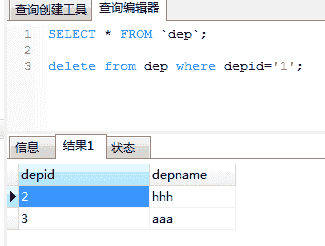

# 阿里巴巴 2017 秋招研发工程师笔试题

## 1

有个特殊的餐厅，对客人的要求是如果要离开餐厅一定要看下餐厅内有没有比你迟进来的人，一定要所有比你迟进来的人离开后你才能离开，有一天甲，乙，丙，丁四个客人先后进入了这家餐厅，那么他们离开的顺序不可能是：

正确答案: E   你的答案: 空 (错误)

```cpp
丙，乙，甲，丁
```

```cpp
甲，乙，丙，丁
```

```cpp
乙，甲，丙，丁
```

```cpp
乙，丙，甲，丁
```

```cpp
丁，丙，甲，乙
```

```cpp
丁，丙，乙，甲
```

本题知识点

判断推理

讨论

[丨太阳与月亮丨](https://www.nowcoder.com/profile/9415270)

E 描述的问题就是一个入  查看全部)

编辑于 2017-03-19 10:24:20

* * *

[ciphersaw](https://www.nowcoder.com/profile/543695)

本题考查的是**元素入栈出栈的顺序问题**。但要小心一个思维误区：并不是要等到甲、乙、丙、丁全部按序进入餐厅后才开始有人离开。否则离开顺序只能是**丁、丙、乙、甲**，其他都是错误顺序。

编辑于 2017-08-02 16:04:55

* * *

[看见我就喊我去搞学习](https://www.nowcoder.com/profile/411812434)

思维误区，不是每个人都进来了才开始吃，可以是甲进，乙进，乙走，甲走，丙进，丙走，丁进，丁走，这时，离开顺序为乙甲丙丁

发表于 2018-07-16 07:44:31

* * *

## 2

在关系型是数据库中，有两个不同的事务同时操作数据库中同一表的同一行，不会引起冲突的是：

正确答案: F   你的答案: 空 (错误)

```cpp
其中一个 DELETE 操作，一个是 SELECT 操作
```

```cpp
其中两个都是 UPDATE
```

```cpp
其中一个是 SELECT，一个是 UPDATE
```

```cpp
其中一个 SELECT
```

```cpp
其中一个是 DELETE，另一个是 UPDATE
```

```cpp
两个都是 DELETE
```

本题知识点

数据库

讨论

[peng.tan](https://www.nowcoder.com/profile/3111850)

答案是最后一个 ：  **两个都是 DELETE**当要删除的记录在数据库中不存在的时候，是不会报错的。
       

编辑于 2017-06-27 16:13:12

* * *

[MC 枫少](https://www.nowcoder.com/profile/4171070)

记住一句话，当要删除的记录在数据库中不存在的时候，是不会报错的。

发表于 2018-04-22 19:51:47

* * *

[牛客 776488 号](https://www.nowcoder.com/profile/776488)

两个事务删除同一条数据，commit 的时候很明显会锁表，这是什么破题

发表于 2018-05-01 23:28:50

* * *

## 3

众所周知我们所处的宇宙的质能公式是 E=mc ² ，其中 c 是真空中的光速。和我们的宇宙平行的另一个宇宙 meta，研究显示他们使用的质能公式是 E=(2+ √3) ^m ，当一个物体的质量很大的时候，对应的能量 E 非常大，数据也非常的长。但 meta 宇宙里面的智慧生物非常的懒，他们只愿意把 E 取整，然后记录对应的能量 E 的最后一位整数，比如 m=0 时，他们会记录 1，m=1 时，他们会记录 3，m=2 时，他们会记录 3.现在请问当 m=80 时，他们会记录多少？

正确答案: C   你的答案: 空 (错误)

```cpp
1
```

```cpp
2
```

```cpp
3
```

```cpp
4
```

```cpp
5
```

```cpp
6
```

本题知识点

数学运算

讨论

[不愿透露姓名的网友](https://www.nowcoder.com/profile/8096695)

做了智力题，感觉自己就是个**啊。

发表于 2018-07-05 16:00:54

* * *

[坑坑～](https://www.nowcoder.com/profile/5642617)

这道题的确是有规律，但是 133 规律的理由实际上是比较复杂的，并不是试出来的，因为存在有分数部分，所以规律在不被证明的情况下是可能打破的，但这种类型题的确是找规律才能解决，这里提供一个解法。

思考这个式子：(2+  √3) m +(2-  √3) m ；你可能考虑到了两点，1 是展开后，所有根式项被消去了剩下的是整数，2 是(2-  √3) m 这个式子永远都是一个小于 1 的数字。通过这两点，我们可能可以想了，实际(2+  √3) m +(2-  √3) m 这个整数减 1 实际就是(2+  √3) m 的所有整数部分。

我们可以试一试假设 f(m) = (2+  √3) m +(2-  √3) m ,那么 f(0) = 2，f(1) = 4，f(2) = 14，f(3) = 52，f(4) = 194，f(5) = 724 看到这里，可能又有人说我发现这个规律了！末尾数是 244 的循环。的确这个规律是正确的，但是在没被证明的情况下，万一 f(30)出现了小差错呢，都是有可能的,如费马的大素数猜想后来也被欧拉举出反例。

那现在来证明，根据之前的 f(0) ~ f(5) 的结果，我们其实有一个大致的方向了，证明这个数列满足末尾数是 244 循环出现的！好了其实有这个思路之后，最直接的想法其实是根据通式求出递推式，若递推满足，那么我们猜想成立。我直接是猜测这个式子的满足线性，为什么，因为不满足线性的式子基本不可能出现循环规律（经验告诉我哈）。

好吧那么我们基本可以猜想这个式子实际是满足这个格式的 f(m)=af(m-1)+bf(m-2)，满不满足呢？试试，那么得出下列式子：

7+4√3=(2+√3)a+b

7-4√3=(2-√3)a+b

消去得出，a=4,b=-1。哈？好像猜对了。f(m+2)=4f(m+1)-f(m)，在满足这种规律的情况下，只计算个位数用 T(m)表示，T(0)=2，T(1)=4，T(2)=4，T(3)=4*4-4=2，T(4)=4*2-4=4，T(4)=4*2-4=4，当末尾重复出现 244，并且显然在满足这个通式的情况下永远不会跳出这个循环。考虑 T(80)=4。那么选 4，呸呸呸！别忘了还要减一个(2-  √3) m ，这个是一个小于 1 的数，所以结果肯定是 xxxxx3.xxxxxx，个位数部分是 3 哦

编辑于 2020-06-19 19:04:15

* * *

[牛客 8981227 号](https://www.nowcoder.com/profile/8981227)

因为懒得数 3 以后的数字，超过 3 的统一为 3。

发表于 2017-07-26 02:45:15

* * *

## 4

页高速缓存是 Linux kerne 使用的主要的磁盘缓存技术。它允许系统把存放在磁盘上的一些数据保留在内存中，以便减少对磁盘的访问。进程对页高速缓存区中的数据修改之后，数据页被标记为“脏数据”在下列哪些条件下，脏数据不会被写入磁盘？

正确答案: B E   你的答案: 空 (错误)

```cpp
页高速缓存空间不足
```

```cpp
突然断电
```

```cpp
变脏以来，太久没有过更新
```

```cpp
通过系统调用（sync（），fsync（），fdataasync（））来强行对将对快设备的更新同步到磁盘
```

```cpp
内存足够大
```

```cpp
磁盘足够大
```

本题知识点

操作系统

讨论

[大星星和小猩猩](https://www.nowcoder.com/profile/9374535)

脏数据是啥？通俗的讲：**当一个事务正在访问数据，并且对数据进行了修改，而这种修改还没有提交到数据库中，这时，另外一个事务也访问这个数据，然后使用了这个数据。因为这个数据是还没有提交的数据，那么另外一个事务读到的这个数据是脏数据，依据脏数据所做的操作可能是不正确的。**

发表于 2018-04-01 16:18:34

* * *

[牛客 2633130 号](https://www.nowcoder.com/profile/2633130)

感觉就是 be

发表于 2017-07-28 22:46:40

* * *

[寒塘渡](https://www.nowcoder.com/profile/3102590)

为什么有 F？

发表于 2017-07-29 21:57:24

* * *

## 5

设一组初始关键字记录关键字为（ 12,15,1,18,2,35,30,11 ），则以 12 为基准记录的一趟快速排序结束后的结果为

正确答案: D   你的答案: 空 (错误)

```cpp
11，1，2，12，35，18，30，15
```

```cpp
11，2，1，12，15，18，35，30
```

```cpp
1，2，11，12，15，18，35，30
```

```cpp
11，2，1，12，18，35，30，15
```

```cpp
1，2，11，12，15，18，30，35
```

```cpp
以上都不是
```

本题知识点

排序 *讨论

[牛客 2505702 号](https://www.nowcoder.com/profile/2505702)

快速排序里的挖坑填补法：以 12 为标准值，从右开始找比 12 小的值，首先是 11，把 11 放在 12 的那个位置，把 12 放在 11 的位置，在从左找比 12 大的值 15，把 15 放在 12 的新位置（原 11 的位置）之后变成 11，12，1，18，2，35，30，15\.在新的一轮开始，从右开始找 12 小的数是 2，把 2 放在 12 的位置，12 放在 2 的位置，在从左找比 12 大的数 18，把 18 放在 12 的新位置上（原 2 的位置）变成 11，2，1，12，18，35，30，15\.

发表于 2017-08-03 09:16:45

* * *

[Norman FENG](https://www.nowcoder.com/profile/2283997)

真搞不懂这种题目有什么意思，实现细节不一样答案就会不一样。应试教育吃多了撑的吧。

发表于 2017-07-25 11:08:44

* * *

[go8](https://www.nowcoder.com/profile/9339803)

也可以是 11。1。2。12。15。35。30。18 ——根据《算法基础 打开算法之门》托马斯著

发表于 2017-02-26 23:02:56

* * *

## 6

多项式 P(X)=a+bx+cx²+dx³ ，对于任意 x ，计算 P(X) 中最少需要用到乘法操作的次数是多少？

正确答案: A   你的答案: 空 (错误)

```cpp
3
```

```cpp
4
```

```cpp
5
```

```cpp
6
```

```cpp
1
```

```cpp
2
```

本题知识点

编程基础 *讨论

[Linsanity](https://www.nowcoder.com/profile/7457652)

Mark 一下一般地， 一元 n 次多项式 的求值需要经过 2n-1 次乘法和 n 次加法，而 秦九韶算法 只需要 n 次乘法和 n 次加法 。题目中 P(X)是 3 次多项式，所以 3 次乘法。

发表于 2017-05-10 11:21:57

* * *

[SunburstRun](https://www.nowcoder.com/profile/557336)

答案是 A       可以分解成((dx+c)x+b)x+a,那么只需要 3 次乘法

发表于 2016-12-17 15:47:06

* * *

[colining](https://www.nowcoder.com/profile/6589111)

我傻傻的认为，当 x=0 的时候，乘方不用考虑，所以就是三次。。。。。。。。

发表于 2017-08-25 14:37:36

* * *

## 7

有一个班 31 人，女同学 15 人，男同学 16 人，现在要玩一个结组游戏，每组由男女两名同学构成，每个同学最多只能在一个组。结组的同学可以到老师那里领 100 元钱，然后按照预先分配的协议进行分配，钱最小可分单元为 1 元。未能结组的同学无法领到钱，不允许在组之间传递利益。那么一下命题正确的是：

正确答案: A   你的答案: 空 (错误)

```cpp
男生和女生可以得到一样多的钱
```

```cpp
男生最多得 49 元
```

```cpp
男生最多得 47 元
```

```cpp
男生最多得 46 元
```

```cpp
男生最多得 1 元
```

```cpp
男生最多得 0 元
```

本题知识点

数学运算

讨论

[书敏](https://www.nowcoder.com/profile/5152008)

 如果按照博弈论的算法，假设所有人都是贪婪且理性的，信息都公开透明。那么由于多的一个男生的存在，这个男生会出比别人底的条件争取女生。被踢走的男士也会出更低的价格。那么最后的结果就是所有男生的出价都是 1 元，每个女生都能得到 99 元。当然，如果不按博弈论的算法，那么。。。出题的人开心就好。。。

发表于 2017-08-13 22:23:06

* * *

[G^J](https://www.nowcoder.com/profile/761079)

敲黑板！男女朋友分 100 块，男的永远只有 0 元！

发表于 2017-08-24 09:37:10

* * *

[曲鹏](https://www.nowcoder.com/profile/2104803)

A，（bcdef 都说“最多”得 xx 元，a 是说“可以“得到一样多得钱，）

发表于 2017-03-16 18:33:05

* * *

## 8

现代的企业是建立在大规模协作的基础上的，员工之间，团队之间，部门之间，企业之间的协作都是成功的重要因素。好的企业在协作上是高效的。以下说法中不合适的是（）

正确答案: B   你的答案: 空 (错误)

```cpp
一个项目能容纳的人员是有限的，当增加到一定规模项目进度反而会变慢。
```

```cpp
一个项目协作为了办证信息对称，多方参与的情况下直接召集多方在一起开会就能协调好
```

```cpp
协作建立的条件包括互补和共赢
```

```cpp
能力结构类似的成员之间较多样互补型员工之间更容易产生竞争关系
```

```cpp
协作中的权利和责任应当相称
```

```cpp
如果有可能的话，信息交互较多的事务更合适在一个团队内或有一个人完成，相较于进行分工。
```

本题知识点

常识判断

讨论

[maoger](https://www.nowcoder.com/profile/8532495)

办证、枪支、***，13666666233

发表于 2017-08-25 13:07:35

* * *

[为 offer 努力](https://www.nowcoder.com/profile/2712202)

这是语文题，B 项的“就能 xxx”过于绝对。

发表于 2017-08-25 11:20:40

* * *

[﹋千年以后√"](https://www.nowcoder.com/profile/6470604)

B 并不是绝对的，还需要多方的相互协调

发表于 2017-03-19 11:36:07

* * *

## 9

以下程序的运行结果是？

正确答案: A   你的答案: 空 (错误)

```cpp
foobar
```

```cpp
barfoo
```

```cpp
foobar 或者 barfoo 都有可能
```

```cpp
Bar
```

```cpp
Foo
```

```cpp
程序无法正常运行
```

本题知识点

Java

讨论

[larrysea](https://www.nowcoder.com/profile/5430709)

答案是 A foobar 这道题是考线程的调用情况，线程的启动方式只能通过 start 这种方式启动才能真正的实现多线程的效果，如果是手动调用 run 方法和普通方法调用没有区别，所以这个还是按照顺序执行首先执行 run 方法之后，执行输出语句所以最终得到结果 foobar.

编辑于 2017-06-29 15:46:43

* * *

[小李 8](https://www.nowcoder.com/profile/8260064)

调用 start（）后，**线程会被放到等待队列**，等待 CPU 调度，并不一定要马上开始执行，只是将这个线程置于可动行状态。然后通过 JVM，线程 Thread 会调用 run（）方法，执行本线程的线程体。
1.start（）方法来启动线程，真正实现了多线程运行。**这时无需等待 run 方法体代码执行完毕，可以直接继续执行下面的代码**；
2.run（）方法当作普通方法的方式调用。程序还是要顺序执行，**要等待 run 方法体执行完毕**后，才可继续执行下面的代码， 这样就没有达到写线程的目的。

发表于 2017-08-26 16:41:50

* * *

[本命年的 Offer！](https://www.nowcoder.com/profile/6344483)

又忘记线程调用的是使用 start 方法了，直接使用 run 方法就相当于直接调用 run 方法了。。。start 是预备状态  准备执行！

发表于 2017-08-06 21:31:06

* * *

## 10

输入图片大小为 200×200，依次经过一层卷积（kernel size 5×5，padding 1，stride 2），pooling（kernel size 3×3，padding 0，stride 1），又一层卷积（kernel size 3×3，padding 1，stride 1）之后，输出特征图大小为：

正确答案: C   你的答案: 空 (错误)

```cpp
95
```

```cpp
96
```

```cpp
97
```

```cpp
98
```

```cpp
99
```

```cpp
100
```

本题知识点

机器学习 算法工程师 浩鲸云 2020

讨论

[陈国特](https://www.nowcoder.com/profile/1040843)

计算尺寸不被整除只在 GoogLeNet 中遇到过。卷积向下取整，池化向上取整。本题 （200-5+2*1）/2+1 为 99.5，取 99（99-3）/1+1 为 97（97-3+2*1）/1+1 为 97 研究过网络的话看到 stride 为 1 的时候，当 kernel 为 3 padding 为 1 或者 kernel 为 5 padding 为 2 一看就是卷积前后尺寸不变。计算 GoogLeNet 全过程的尺寸也一样。

发表于 2017-07-29 16:10:41

* * *

[拾荒者 000](https://www.nowcoder.com/profile/2846926)

输出尺寸=(输入尺寸-filter 尺寸+2*padding）/stride+1
宽和高都是这么计算的；结果是 97，答案应该有问题的

发表于 2017-07-17 21:31:23

* * *

[KarZzI](https://www.nowcoder.com/profile/9319320)

一层卷积 (200 - 5+ 2)/2 + 1 = 99.5 向下取整，则输出为 99x99pooling (99 - 3 + 0)/1 + 1 = 97 输出为 97x97 二层卷积 (97 - 3+ 2)/1 + 1  = 97 输出为 97x97 答案为 C 不知道牛客的编辑能不能看到这条讨论，给解释一下为什么答案是 A?

发表于 2017-07-20 06:19:44

* * *

## 11

一个二叉树有 100 个子节点数为 2 的节点，100 个子节点数为 1 的节点，那么个子节点数为 0 的节点（叶节点）的个数为：

正确答案: A   你的答案: 空 (错误)

```cpp
101
```

```cpp
100
```

```cpp
200
```

```cpp
300
```

```cpp
99
```

```cpp
1
```

本题知识点

树

讨论

[丨太阳与月亮丨](https://www.nowcoder.com/profile/9415270)

A 首先，假设该二叉树有 n 个节点，则有 n - 1 条边，这是因为除了根节点，其余的每个节点都有且只有一个父节点，那么这 n 个节点恰好为树贡献了 n-1 条边。这是从下往上的思考，而从上往下(从树根到叶节点)的思考，容易得到每个节点的度数和 0*n0 + 1*n1 + 2*n2 即为边的个数。因此，我们有等式 n-1 = n1 + 2*n2，把 n 用 n0+n1+n2 替换，得到 n0 + n1 + n2 - 1 = n1 + 2*n2，于是有

n0 = n2 + 1。

n0=n2+1=100+1=101

编辑于 2017-06-29 15:43:50

* * *

[dong1234](https://www.nowcoder.com/profile/662644)

度数(边数) = 所有节点数-1：这里度数=2*100+100=300，节点数：100+100+叶子节点数所以叶子节点数=101

发表于 2017-08-06 09:39:05

* * *

[oukohou](https://www.nowcoder.com/profile/6654037)

总结点个数 **n = n0 + n1 + n2**；所有的孩子节点个数为 **2 * n2  + 1 * n1**， 度为 2 的节点有 2 个孩子节点，度为 1 的节点有 1 个孩子节点;只有根节点不是孩子节点，孩子节点个数比总结点个数少一个， **n  = 2 * n2 + 1 * n1 + 1**；即得等式：    **n = n0 + n1 + n2 = ****2 * n2 + 1 * n1 + 1****==》 n0 = n2 + 1** 

发表于 2017-08-21 09:40:18

* * *

## 12

某种类型的双核 CPU 的性能提升了 1/3 ，假定该提升是通过对每条指令缩短执行时间实现的，那么它每条指令执行时间缩短了 () 。

正确答案: A   你的答案: 空 (错误)

```cpp
1/4
```

```cpp
1/8
```

```cpp
1/3
```

```cpp
1/6
```

```cpp
1/5
```

```cpp
1/2
```

本题知识点

编译和体系结构

讨论

[竹叶绿菊](https://www.nowcoder.com/profile/4105512)

性能提升了 1/3，设性能原来是 1，现在就是 4/3。那执行时间原来是 1，现在就是 3/4。问题是 3/4 比 1 少了多少？

发表于 2017-07-25 15:58:23

* * *

[爱说话的鱼](https://www.nowcoder.com/profile/460190222)

设原来：1 秒执行 1 条指令现在：1 秒执行 4/3 条指令则现在执行一条指令花费 1 秒/(4/3)=3/4 秒所以每条指令执行时间缩短了 1 秒-3/4 秒=1/4 秒

发表于 2018-07-01 17:40:14

* * *

[Holiday_12138](https://www.nowcoder.com/profile/461586)

性能提高 1/3，那原来是 3，变成了 4\.假设原来每个指令 1/3s，现在变成每个 1/4s，（1/3-1/4）/1/3 = 1/4

发表于 2017-07-22 15:16:23

* * *

## 13

一个 map-reduce 任务由 m 个 mapper 和 r 个 reducer 构成，计算的效率可以认为正比于 mr 的乘积（数据管道的个数），在限定任务的 mr 乘积约等于 10000 的情况下，假定每个 mapper 和每个 reducer 的成本分别为 1 和 7，那么最佳的资源分配最接近于以下哪个方案？

正确答案: C   你的答案: 空 (错误)

```cpp
mapper100 个，reducer100 个
```

```cpp
Mapper200 个，reducer50 个
```

```cpp
Mapper264 个，reducer38 个
```

```cpp
Mapper316 个，reducer32 个
```

```cpp
Mapper500 个，reducer20 个
```

```cpp
Mapper1000 个，reducer10 个
```

本题知识点

分布式

讨论

[牛客-68](https://www.nowcoder.com/profile/7634665)

假定每个 mapper 和每个 reducer 的成本分别为 1 和 7， 其实就是求最后和最小的方案 A : 100 + 100*7 = 800B:  200 + 50*7 = 550C: 264 + 38*7 = 530D: 316 + 32*7 = 540E: 500 + 20 * 7 = 640F 1000 + 10*7 = 1070 所以 C 答案组合方式是最小成本组合。C: Mapper264 个，reducer38 个

发表于 2017-08-23 21:20:29

* * *

[qiluwa](https://www.nowcoder.com/profile/8102654)

假设 Mapper x 个，reducer y 个 x+7y 最小 xy<=10000 最大 x=7y 带入方程，求出近似值即可

发表于 2017-07-22 21:20:27

* * *

[yoga💤](https://www.nowcoder.com/profile/1664099)

假设 mapper 有 X 个，reducer 有 Y 个。那么根据题意在 mr 乘积约等于 10000 的情况下，最佳的资源分配就是利用的 mr 成本最少的分配。因此将所有答案的 X、Y 带入计算 X+7Y。结果最小的就是最佳的资源分配。

发表于 2017-07-27 10:44:38

* * *

## 14

如果你有相关经验，很多景点的餐馆商铺经营方式很有趣。以下描述错误的是：

正确答案: F   你的答案: 空 (错误)

```cpp
由于景点的大部分顾客是一次性的，因此商铺的信用在其他条件相同时可能更低
```

```cpp
景点的餐馆为了招揽顾客使用托儿会比居民区的餐馆使用托儿效果好
```

```cpp
景点常常卖一些当地特产，比如青岛的海边会有卖贝壳的，这些贝壳产自附近的海域
```

```cpp
店铺使用托儿的有效原因是，人们常常做出多数人做出的选择，而忽视自己自然状态下的决策
```

```cpp
一些景点在出口位置上安排一个商店，商店内的通道曲折，为的是顾客多花些时间看东西
```

```cpp
景点内一些玩射箭的场所经营状况会比在居民区附近设置的类似场所好，原因是景点内的游人玩起来更在状态
```

本题知识点

常识判断

讨论

[猴子 29](https://www.nowcoder.com/profile/2493295)

景点卖的特产不都是产自义乌吗？

发表于 2017-07-24 11:11:25

* * *

[向宇同桌的老乡](https://www.nowcoder.com/profile/2273363)

A 难道不对吗？一次性生意能坑几个坑几个

发表于 2017-07-24 15:47:44

* * *

[Phoenixcwx](https://www.nowcoder.com/profile/261416)

这个题好***。

发表于 2017-07-28 17:07:21

* * *

## 15

一个机器人玩抛硬币的游戏，一直不停的抛一枚不均匀的硬币，硬币有 A,B 两面，A 面的概率为 3/4，B 面的概率为 1/4。问第一次出现连续的两个 A 年的时候，机器人抛硬币的次数的期望是多少？

正确答案: F   你的答案: 空 (错误)

```cpp
9/4
```

```cpp
11/4
```

```cpp
15/4
```

```cpp
4
```

```cpp
5
```

```cpp
28/9
```

本题知识点

组合数学 *概率统计 *概率论与数理统计** **讨论

[淡然 de 天](https://www.nowcoder.com/profile/4346702)

假设 T 为扔的次数（期望）。 那么如果扔到 B，则重新开始扔，即再扔 T 次。第一次扔到 B，则重新扔，即 1/4*(1+T)；这时 1+T 是结束游戏所扔次数；第一次扔到 A，第二次扔到 B，重新扔，即 3/4*1/4*(2+T)；2+T 是结束游戏所仍次数；第一次扔到 A，第二次扔到 A，结束游戏。3/4*3/4*2；2 为结束游戏所仍次数；所以 T=1/4*(1+T)+3/4 *1/4*(2+T)+3/4 *3/4 *2；算得 T 为 28/9

编辑于 2017-06-29 16:21:37

* * *

[hyh_ustc](https://www.nowcoder.com/profile/2393869)

现学现用^ ^，看了下一题的解答，从状态转移的角度来解这道题状态转移如下：用 T(s)表示从状态 s 到状态(AA)的期望步数，则可列方程如下：得 T(*B) = 28/9

编辑于 2018-07-27 10:24:01

* * *

[Arsene](https://www.nowcoder.com/profile/555053)

假设抛硬币的次数期望为 T，若第一次为 B，则需重新开始，若第一个为 A, 第二次为 B，也需要重新开始，若两次都为 A，则游戏结束，由此得到：T = 1/4 * (1+T) + 3/4 * 1/4 * (T+2) + 3/4 * 3/4 * 2 计算得到 T = 28 / 9

发表于 2017-04-21 20:00:26

* * *

## 16

小 a 和小 b 一起玩一个游戏，两个人一起抛掷一枚硬币，正面为 H，反面为 T。两个人把抛到的结果写成一个序列。如果出现 HHT 则小 a 获胜，游戏结束。如果 HTT 出现则小 b 获胜。小 a 想问一下他获胜的概率是多少？

正确答案: C   你的答案: 空 (错误)

```cpp
3/4
```

```cpp
1/2
```

```cpp
2/3
```

```cpp
5/9
```

```cpp
1/3
```

```cpp
1/4
```

本题知识点

概率统计 *概率论与数理统计* *讨论

[白少](https://www.nowcoder.com/profile/3062307)

因此小 a 赢得概率是 2/3

发表于 2017-07-06 11:10:39

* * *

[武石中学的三井寿](https://www.nowcoder.com/profile/2574918)

随机过程中的 First Step Analysis
设 P_s 表示状态为 s 时'HHT'发生的概率。显然我们有 P_HHT=1 以及 P_HTT=0。

状态转移图如下:
Nill 表示还没有抛时的状态，这时有 1/2 的概率变成 H 还有 1/2 的概率变成 T，变成 T 时相当于又回到 Nill。我们要求的即 P_Nill。由状态转移图，可以列出式子:P_Nill = 1/2*P_Nill + 1/2*P_HP_H = 1/2*P_HH + 1/2 * P_HTP_HH = 1/2*P_HH + 1/2*P_HHTP_HT = 1/2*P_H + 1/2*P_HTTp_HHT = 1P_HTT = 0 最后可以解得 P_Nill = 2/3。

发表于 2017-08-04 17:18:36

* * *

[lzy](https://www.nowcoder.com/profile/2811998)

反向求 b 赢的概率：
b 可能赢的方式为 HTT,HTHTT,HTHTHTT,(HT...)HTT
其中第一个 H 是一定会出现的，因为第一个不是 H，ab 都不会赢，直接走向下一个，所以一定是从 H 开始
因此 1/2*1/2 + 1/2*1/4*1/8 + 1/2*1/4*1/4*1/8 + ... = 1/4 + 1/2 * (1 + 1/4 + 1/4² + ...) * 1/8 = 1/3
a 赢的概率为 2/3

发表于 2017-07-26 00:49:23

* * *

## 17

假定某同学使用 Naive Bayesian（NB）分类模型时，不小心将训练数据的两个维度搞重复了，那么关于 NB 的说法中正确的是：

正确答案: B D   你的答案: 空 (错误)

```cpp
这个被重复的特征在模型中的决定作用会被加强
```

```cpp
模型效果相比无重复特征的情况下精确度会降低
```

```cpp
如果所有特征都被重复一遍，得到的模型预测结果相对于不重复的情况下的模型预测结果一样。
```

```cpp
当两列特征高度相关时，无法用两列特征相同时所得到的结论来分析问题
```

```cpp
NB 可以用来做最小二乘回归
```

```cpp
以上说法都不正确
```

本题知识点

机器学习

讨论

[WangLichun](https://www.nowcoder.com/profile/1177485)

主要原因就是由于存在重复的类别之后，破坏了原本的独立性假设。。

发表于 2017-08-12 22:38:00

* * *

[NewPerson](https://www.nowcoder.com/profile/844016)

NB 的核心在于它假设向量的所有分量之间是独立的。在贝叶斯理论系统中，都有一个重要的条件独立性假设：假设所有特征之间相互独立，这样才能将联合概率拆分

发表于 2017-07-31 16:46:00

* * *

[jiayou 可不可以不](https://www.nowcoder.com/profile/2218461)

有人懂 AC 为什么都不正确吗？？求解答

发表于 2017-08-01 16:50:06

* * *

## 18

以下哪个行为，不会明显加剧客户端运行过程中的卡顿：

正确答案: C   你的答案: 空 (错误)

```cpp
在主线程集中处理耗时的操作
```

```cpp
在子线程集中处理耗时的操作
```

```cpp
在其它进程集中处理耗时的操作
```

```cpp
提高后台线程的优先级
```

```cpp
降低主线程的优先级
```

```cpp
页面存在多个重叠显示的控件
```

本题知识点

编译和体系结构

讨论

[色诺芬](https://www.nowcoder.com/profile/8163030)

为什么选 C 呢？比如我看个暴风影音看视频，同时开一个 matlab 仿真分析（其他进程），看视频不卡才怪

发表于 2017-08-08 17:06:34

* * *

[听说 180 天只能修改一次昵称](https://www.nowcoder.com/profile/5257131)

在其他进程里面处理耗时操作，相当于在另外的虚拟机里面执行操作，因此和当前的虚拟机也就是客户端没有明显的关系，如过不理解可以类比一下 AIDL，客户端的一次请求就相当于一次 RPC，请求到了服务器之后会在 Binder 线程池执行操作，而如果后台软件过多，只是因为 CPU 轮换和内存不足。**题目说的是不会明显加剧卡顿，这是会造成卡顿的。**

发表于 2017-08-24 00:30:55

* * *

[maoger](https://www.nowcoder.com/profile/8532495)

迷

发表于 2017-08-25 13:55:12

* * *

## 19

以下程序的输出是：

```cpp
#include <iostream>
using namespace std;
unsigned int f(unsigned int n) 
{
    if (n == 0n == 1) {
        return 1;
    }

    return f(n-1) + f(n-2);
}
void count(int n) {
    unsigned int tmp = n -((n >>1)8033333333333) - ((n >>2) &011111111111);
    std::cout <<((tmp +(tmp >>3)) &030707070707) %63 << std::endl;
}

```


D   3,5 选 D 首先第一个 f 函数  是个斐波那契数列 可知  f(7)=21   f(9)=55 下边 count 函数 是用来统计 n 的二进制表示中 1 个数量。count 函数的原理 你可以去查 MIT HAKM 算法。所以 答案是 3 5

发表于 2017-03-04 10:55:42

* * *

[水月镜花](https://www.nowcoder.com/profile/2653324)

MIT HAKM 详细算法：[`blog.csdn.net/msquare/article/details/4536388`](http://blog.csdn.net/msquare/article/details/4536388)其中(n>>2)&011111111111 中 01111111111 是数的八进制表示方法

发表于 2017-08-22 20:56:17

* * *

[maoger](https://www.nowcoder.com/profile/8532495)

java 里二进制以 0b 开头，八进制以 0 开头，十六进制以 0x 开头


发表于 2017-08-25 14:02:20

* * *

## 20

学校图书馆共有 300 万册图书，想统计其中 Computer ， Science ，计算机，科学这几个词出现的次数，并按照自然年度分类，如 2016 年出版的书籍中这几个词各自出现的次数， 2015 年······依次类推。

你的答案

本题知识点

机器学习

讨论

[阿猫阿狗被占用](https://www.nowcoder.com/profile/918575)

将每本书都存在 hdfs 里作为一个文件，文件名为 时间（4 位年份）+书的 id+书的名称。使用 mapreduce 进行运算，map 输出为<日期，computer 次数；science 次数；计算机次数；科学次数>,reduce 输出同样，不过作为 value 的字符串中的次数为总次数。代码如下：    public static class MyMapper extends Mapper<LongWritable,Text,Text,Text>{                private static Text outputKey = new Text();        private static Text outputValue = new Text();        @Override        protected void map(LongWritable key, Text value, Context context)                throws IOException, InterruptedException {         //得到 hdfs 文件名        String filename = ((FileSplit) context.getInputSplit()).getPath().getName();        String date = filename.substring(0, 4);        //分别统计 computer，science，计算机，科学出现的次数        int computer = 0;        int science = 0;        int jisuanji = 0;        int kexue = 0;        String line = value.toString();        String[] words = line.split(" ");        for(String s:words){        if(s.equals("computer")) computer++;        if(s.equals("science")) science++;        if(s.equals("计算机")) jisuanji++;        if(s.equals("科学")) kexue++;        }        String outputVal = "" + computer + ";" + science + ";" + jisuanji + ";" + kexue;        outputKey.set(date);        outputValue.set(outputVal);        context.write(outputKey, outputValue);        }  }    public static class MyReducer extends Reducer<Text, Text, Text, Text> {    @Overrideprotected void reduce(Text key, Iterable<Text> values,Context context)throws IOException, InterruptedException {    int allComputer = 0;    int allScience = 0;    int allJisuanji = 0;    int allKexue = 0;    for(Text value:values){    String val = value.toString();    String[] str = val.split(";");    allComputer += Integer.parseInt(str[0]);    allScience += Integer.parseInt(str[1]);    allJisuanji += Integer.parseInt(str[2]);    allKexue += Integer.parseInt(str[3]);    }    String finalVal = "" + allComputer + ";" + allScience + ";" + allJisuanji + ";" + allKexue;    context.write(key, new Text(finalVal));        }   }

编辑于 2017-08-17 20:44:43

* * *

[是小毛吖](https://www.nowcoder.com/profile/672111)

这些问答题是如何作答啊；是 coding 还是用文字表述呢

发表于 2017-08-21 15:10:24

* * *

[牛客-68](https://www.nowcoder.com/profile/7634665)

1.首先将不同年份的书分别记录在不同的文件中， 比如 2016.txt , 2015.txt2.对每一年的图***录进行遍历， 解析 HashMap<String, Integer> map    统计关键词  和 出现的次数

```cpp
HashMap<Stirng, Integer> map = new HashMap<>();
map.put("Computer",0);
map.put("Science",0);
map.put("计算机",0);
map.put("科学",0);

public HashMap<String, Integer> calculateTimes(HashMap<String, Integer> map,String bookName){
    if(bookName.length() <= 0){
        return map;
    }

    if(bookName.contains("Computer")){
        map.put("Computer", map.get("Compute")++);
    }else if(bookName.contains("Science")){ map.put("Computer", map.get("Science")++);  }else if(bookName.contains("计算机")){
                 map.put("计算机", map.get("计算机")++);
        }else if(bookName.contains("科学")){
                map.put("科学", map.get("科学")++);
        }
         return map;
} 
```

发表于 2017-08-23 20:57:18

* * *

## 21

设计接口并且实现一个多线程安全的堆，并且要求可以删除堆中任意元素（非堆顶元素），要求尽量高效，假设已有标准的 mutex 实现可以使用。

你的答案

本题知识点

Java

讨论

[麦垛上的守望者](https://www.nowcoder.com/profile/4610893)

我选择放弃

发表于 2018-05-25 22:14:42

* * *

[Holiday_12138](https://www.nowcoder.com/profile/461586)

```cpp
deleteElement(int[] heap, int index, int len) {  mutex.lock();
    heap[index] = heap[len-1];
    len--;
    while(2*index + 1 < len && (heap[index] > heap[2*index+1]|| heap[index] > heap[2*index +2])) {
         int swapi = heap[2*index+1] < heap[2*index +2]) ? 2*index+1 : 2*index+2;
          swap(heap,index,swapi);
         index = swapi;
    }
    mutex.unlock();
}
```

发表于 2017-07-22 15:06:20

* * *

[啊啊啊 62](https://www.nowcoder.com/profile/7551327)

各位大神，这里的堆指的是 大根堆、小根堆 的那个（heap），还是 堆栈 的那个 堆（stack）啊？也就是我要不要有重建大根堆或小根堆的操作？

发表于 2017-08-24 11:12:25

* * *

## 22

淘宝上的每个宝贝一般都有个默认的全国邮费（也可能没有），同时也支持到特定省份有特定的邮费，如果到特定的省份没有特别的邮费就用默认的全国邮费。请： 1.设计一个存储结构来保存一个宝贝的所有邮费信息；（简单用文字阐述一下做法） 2.给定一个宝贝的邮费存储信息和一个省份，编程快速得出宝贝到此省的邮费。 注意：邮费的类型是 uint32_t，此外由于商品数量非常大（假定十亿量级），查询量也非常大，对存储和查询的效率要求非常高，因此存储效率和查询效率是考察的重点。

你的答案

本题知识点

数据库

讨论

[饭炒蛋与蛋炒饭](https://www.nowcoder.com/profile/4171219)

我想的是采用数据库中的 Hash 索引实现，以宝贝 id 和省份 id 得到一个 hash 值，然后通过 hash 索引搜索，如果得到的值不为空表示该宝贝到该省存在特殊值，否则为默认值，不知能不能行？

发表于 2017-07-27 21:30:11

* * *

[瓜牛.](https://www.nowcoder.com/profile/1642134)

感觉题目没描述清楚，所述为个人观点如果说运费是按地区统一规划的，假设 10 亿的宝贝来自 34 个省，也就是每个省有一批商家，贩卖一批宝贝。一个地区（对应一个唯一的 area_id）的宝贝对外销售，运费分为特殊地区运费、统一运费、无运费。我们只需要记录特殊地区的运费和无运费这两种情况，也就是不考虑宝贝 id，只用考虑宝贝的产地，对所在地区的宝贝运费做规划。并用 map 存起来。

```cpp
定义一个 Map<Integer,Map<Integer,Double>> map 结构存储即可。
比如对应一个宝贝 x ,我们根据它的产地 id，得到该地区范围内，对外的运费 map，再根据顾客定单填下的地区 id，从 Map 中找到对应的 price，若 get 为空，则为全国统一运费。

```

编辑于 2018-08-19 22:31:10

* * *

[JFF201806281030161](https://www.nowcoder.com/profile/894599911)

//假设 34 个省的 id 为 0--33struct postage_info{    uint64_t mask;//总共 34 各省，用 34 位表示每个省的邮费是不是默认，是的话对应位为 1    struct postage *p; //用一个数组存储非默认省份的价格，假设此数组按 province_id 的大小已经排好序了
    uint32_t default; //默认价格}struct postage{  int province_id;  // 省 id  int postage;      //邮费}uint32_t get_postage(int province_id, struct postage_info * info){       if(1<<province_id & info->mask)
            return info->default;
      else
            return bsearch(province_id, info->p)//... 使用二分查找获取对应省份的邮费}

编辑于 2018-08-09 16:23:55

* * ******