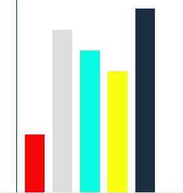

# 阿里巴巴 2017 秋招前端笔试题

## 1

下面的 JSX 代码中，哪一个无法达到预期的效果？

正确答案: C   你的答案: 空 (错误)

```cpp
<h2>Hello World</h2>
```

```cpp
<input type=”checkbox”/>
```

```cpp
<div class=”msg-box”>{msg}</div>
```

```cpp
<label htmlFor=”name”>Leo</label>
```

```cpp
<div style={{height: 50}}></div>
```

```cpp

```

本题知识点

Javascript 前端工程师 阿里巴巴 2017

讨论

[.HarryLee](https://www.nowcoder.com/profile/7796071)

选择 C,在 jsx 里面,要把 class 换成 className 才能正确编译,表示样式.

```cpp
<script type="text/babel">
       ReactDOM.render(
        <h1 className="aa">菜鸟教程</h1>,
        document.getElementById('example')
       );
 </script>
```

E 是对的.
在 react 里面的 jsx,style={ } 里面填写的是一个 js 对象.其中样式里面可以不写 px,然后编译转换的时候会自动加上.
如果要加 px,应该是 fontSize: '100px',加单引号

```cpp
<script type="text/babel">
      ReactDOM.render(
       <h1 style = { {
         fontSize: 100,
         color: '#FF0000'
      }}>菜鸟教程</h1>,
       document.getElementById('example')
      );
    </script>
```

发表于 2017-08-16 14:05:06

* * *

[牛客 4615306 号](https://www.nowcoder.com/profile/4615306)

选 c class 是 js 关键字，这里要用 className。对于 E 选项，在 jsx 中直接写行内样式时不能采用引号，而是 style={{color:'red'}}的方式。

发表于 2017-07-22 17:46:14

* * *

[学习 ing111](https://www.nowcoder.com/profile/472481)

jsx 是什么啦

发表于 2017-08-14 19:24:17

* * *

## 2

正则表达式 /a+(bab)?(caac)*/ ，下列选项中是该正则表达式的子集是？

正确答案: C   你的答案: 空 (错误)

```cpp
/(bab)(caca)/
```

```cpp
/a(bab){2}(caac)*/
```

```cpp
/a{2}/
```

```cpp
/a+(bab){0,1}(ca)+(ca)/
```

```cpp
/a(^bab)+(caac){1,}/
```

```cpp
/a+(babc){2,}(acc){1,}/
```

本题知识点

正则表达式 前端工程师 阿里巴巴 2017

讨论

[古夕](https://www.nowcoder.com/profile/8048574)

正则表达式 /a+(bab)?(caac)*/ ，下列选项中是该正则表达式的子集是？第一步：理解题目。题目中的 a+ 代表 字符“a” 出现 1 次或者若干次，(bab)? 代表 字符 “bab” 出现一次或者 0 次，(caac)* 表示重复了“0 或者若干次”的字符“caac”，即 字符“caac”出现 0 次或者若干次 。若改题目为/李+太?白*/,可匹配：李、李太、李白、李太白、李李、李李太、李李白白、李李太白白等。第二步：理解选项，选出子集。A /(bab)(caca)/ ：匹配含有 “babcaca” 的字符串，不是题目中的 “babcaac”, 就好比是在找 “太星” 而不是"太白"，而且没有 a，所以该正则匹配的结果不可能出现在题目匹配的结果中，错误。B /a(bab){2}(caac)*/ ：其中(bab){2} 表示 字符串“bab”必须出现 2 次，与题干正则显然不同，错误。C /a{2}/ ：其中(a){2} 表示 字符“a”必须出现 2 次，就好比 “李李” ，属于题目匹配结果的子集，正确。D /a+(bab){0,1}(ca)+(ca)/ ：前半部分正确，后半部分(ca)+(ca)明显错误。E /a(^bab)+(caac){1,}/：正则本身有误，(^bab)匹配以"bab"开头的字符串，但前面还有 a,也就是匹配以 a 开头的字符串，两者矛盾。F /a+(babc){2,}(acc){1,}/：分组和区间值都不正确。

编辑于 2018-01-30 11:30:02

* * *

[WorldMa](https://www.nowcoder.com/profile/3670591)

CA 选项错在没有 a;B 选项错在 2,因为元字符"?"表示零次或者一次;D 选项错在最后两个分组,正确顺序应该是 caacE 选项错在最后的区间,元字符"*"表示零次或者多次,F 选项错在分组和区间两处.

发表于 2017-05-23 14:20:12

* * *

[好好学 java](https://www.nowcoder.com/profile/174960)

？ 出现 0/1 次+ 出现 1/无限次* 出现 0/无数次{min, max}

发表于 2017-08-23 17:07:33

* * *

## 3

下列说法错误的是：

正确答案: C   你的答案: 空 (错误)

```cpp
在 Blink 和 WebKit 的浏览器中，某个元素具有 3D 或透视变换（perspective transform）的 CSS 属性，会让浏览器创建单独的图层。
```

```cpp
我们平常会使用 left 和 top 属性来修改元素的位置，但 left 和 top 会触发重布局，取而代之的更好方法是使用 translate，这个不会触发重布局。
```

```cpp
移动端要想动画性能流畅，应该使用 3D 硬件加速，因此最好给页面中的元素尽量添加 translate3d 或者 translateZ(0) 来触发 3D 硬件加速。
```

```cpp
解决浏览器渲染的性能问题时，首要目标就是要避免层的重绘和重排。
```

本题知识点

HTML WebServer 前端工程师 阿里巴巴 2017 CSS

讨论

[饮冰 _](https://www.nowcoder.com/profile/2743866)

滥用硬件加速会导致严重性能问题，因为它增加了内存使用，并且它会导致移动端电池寿命减少。

发表于 2017-07-21 11:02:19

* * *

[嘤嘤嘤护体！](https://www.nowcoder.com/profile/7852649)

非常详细的解释： [`segmentfault.com/a/1190000000490328`](https://segmentfault.com/a/1190000000490328)#articleHeader4

发表于 2017-07-22 21:56:30

* * *

[苏一恒(Mako)b 站内推找我](https://www.nowcoder.com/profile/1579420)

A:浏览器渲染页面时会根据 DOM 通过不同的图层来叠加呈现出页面,对于某些属性如 3D 属性、硬件加速的<video>等都会创建新图层 B:盒子属性、内部结构属性、定位属性、浮动等.这些可能修改节点的大小和位置,都会触发重布局.C:translate3d 会添加新图层,过多的图层会使浏览器崩溃 D:层的重绘和重排是浏览器性能问题的很大影响因素解读来源: [`segmentfault.com/a/1190000000490328`](https://segmentfault.com/a/1190000000490328)#articleHeader4

发表于 2020-02-19 15:27:20

* * *

## 4

将数组 var a=[1,2,3] 变成数组 [4,3,2,1] 下面的方式正确的是？

正确答案: A C   你的答案: 空 (错误)

```cpp
a.reverse().unshift(4)
```

```cpp
a.push(4).reverse()
```

```cpp
a.push(4); a.reverse()
```

```cpp
a.splice(3,1,4).reverse()
```

本题知识点

数组 前端工程师 阿里巴巴 2017

讨论

[弱智的克星](https://www.nowcoder.com/profile/555879)

本题需要将数组 a=[1,2,3]变成[1,2,3,4],需要改变原数组 a。

Array 对象常用方法中：

不改变原数组：

1、 concat()

*   连接两个或多个数组
*   **不改变原数组**
*   返回被连接数组的一个副本

* * *

2、join()

*   把数组中所有元素放入一个字符串
*   **不改变原数组**
*   返回字符串

* * *

3、 slice()

*   从已有的数组中返回选定的元素
*   **不改变原数组**
*   返回一个新数组

* * *

4、 toString()

*   把数组转为字符串
*   **不改变原数组**
*   返回数组的字符串形式

改变原数组：

5、 pop()

*   删除数组最后一个元素，如果数组为空，则不改变数组，返回 undefined
*   改变原数组
*   返回被删除的元素

    * * *

6、 push()

*   向数组末尾添加一个或多个元素
*   改变原数组
*   返回新数组的长度

* * *

7、 reverse()

*   颠倒数组中元素的顺序
*   改变原数组
*   返回该数组

* * *

8、 shift()

*   把数组的第一个元素删除，若空数组，不进行任何操作，返回 undefined
*   改变原数组
*   返回第一个元素的值

* * *

9、 sort()

*   对数组元素进行排序(ascii)
*   改变原数组
*   返回该数组

* * *

10、 splice()

*   从数组中添加/删除项目
*   改变原数组
*   返回被删除的元素

* * *

11、 unshift()

*   向数组的开头添加一个或多个元素
*   改变原数组
*   返回新数组的长度

A 选项，a.reverse()后返回值即数组 a 变成[3,2,1],再使用 unshift()方法在数组开头添加一个 4，a 数组就变成了[4,3,2,1]。注，unshift()返回新数组的长度，此处为 4。正确。

B 选项，push()方法返回新数组的长度，是一个 number 类型，不是数组，所以不能再用“.”操作符继续执行 reverse()方法。错误。

C 选项，正确。

D 选项，splice()语法：arrayObject.splice(index,howmany,item1,.....,itemX)。
参数：
index：必需。整数，规定添加/删除项目的位置，使用负数可从数组结尾处规定位置。
howmany：必需。要删除的项目数量。如果设置为 0，则不会删除项目。
item1, ..., itemX：可选。向数组添加的新项目。
返回值：
Array：包含被删除项目的新数组，如果有的话。

由于 a.splice(3,1,4)中的 index 为 3，超过了数组 a 的下标，所以 3 后面的 1 也不会起作用。a.splice(3,1,4)会将 4 插入到数组 a 末尾。但 splice()返回值是被删除项目的新数组，由于 a.splice(3,1,4)并没有删除元素，所以返回的新数组为空，对空数组 reverse()还是空。(如果 D 选项改成 a.splice(3,1,4);a.reverse()就正确了。)错误。

发表于 2017-07-23 13:47:55

* * *

[小菜鸟要起飞](https://www.nowcoder.com/profile/3939551)

a.psuh()无返回值，不能使用链式

发表于 2017-08-23 21:30:56

* * *

[没变秃也没变强](https://www.nowcoder.com/profile/1652897)

这是什么语言啊。。js 嘛？考数据结构就考数据结构。。。为什么非要用 js

发表于 2018-04-10 13:21:24

* * *

## 5

目前 HTTP2 协议已经逐渐普及到日常服务器中，以下对于 HTTP2 协议描述正确的是：

正确答案: A B C D   你的答案: 空 (错误)

```cpp
所有 http 请求都建立在一个 TCP 请求上，实现多路复用
```

```cpp
可以给请求添加优先级
```

```cpp
服务器主动推送 server push
```

```cpp
HTTP2 的头部会减小，从而减少流量传输
```

本题知识点

网络基础 前端工程师 阿里巴巴 2017

讨论

[星丨读丶月](https://www.nowcoder.com/profile/7729615)

**HTTP 2.0 ****所有通信都在一个 TCP 连接上完成。****HTTP 2.0 浏览器可以在发现资源时立即分派请求，指定每个流的优先级，让服务器决定最优的响应次序。** **HTTP 2.0 ****支持服务器到客户端的主动推送机制。****HTTP/2.0 通过支持首部字段压缩和在同一连接上发送多个并发消息，让应用更有效地利用网络资源，减少感知的延迟时间。** **答案：ABCD**

编辑于 2018-07-27 09:08:36

* * *

[立志成为前端...](https://www.nowcoder.com/profile/6212166)

这篇博客讲的很详细 [`blog.csdn.net/zqjflash/article/details/50179235`](http://blog.csdn.net/zqjflash/article/details/50179235)

发表于 2017-07-27 19:56:03

* * *

[伟城](https://www.nowcoder.com/profile/626866)

A 只是针对同一域名下吧，多域名还是会有多个 tcp 链接的

发表于 2018-03-29 23:14:12

* * *

## 6

请问下面哪种方式可以在不改变原来数组的情况下，拷贝出数组 b ，且满足 b!=a 。例如数组 a 为 [1,2,3] 。

正确答案: B D   你的答案: 空 (错误)

```cpp
let b=a;
```

```cpp
let b=a.slice();
```

```cpp
let b=a.splice(0,0);
```

```cpp
let b=a.concat();
```

本题知识点

数组 前端工程师 阿里巴巴 2017

讨论

[字节跳动-广告部门【全年急招】前后端研发](https://www.nowcoder.com/profile/7262573)

slice 和 concat 方法均返回新数组，而 splice 方法的主要作用就是对原数组进行增删改操作，返回值为截取删除掉的子数组

发表于 2017-07-23 14:02:54

* * *

[D000](https://www.nowcoder.com/profile/7940456)

A 选项 b=[1,2,3]   b==aB 选项 b=[1,2,3]   b!=aC 选项 b=[]           b!=aD 选项 b=[1,2,3]   b!=a 所以正确答案应该是 BD

编辑于 2017-08-21 20:32:50

* * *

[亚轩](https://www.nowcoder.com/profile/7550707)

(#)首先，题目有两个关键点

(1)不改变原数组 (slice 显然可行)

(2)拷贝出新数组 (=和 splice(0,0)两个操作都不行，其中=符号直接引用原数组，splice 直接是对原数组截取)

(3)故而选 BD

(#)有人纠结 B 选项，认为语法有误，这是不存在的, 这个得注意一下标准，标准不同，参数不同，再者注意是 Array 中的 slice 语法,可以参考几个文档

(##)start 为必要参数的文档

1.https://msdn.microsoft.com/zh-cn/library/tkcsy6fe(v=vs.94).aspx

2.http://www.w3school.com.cn/jsref/jsref_slice_array.asp https://m.runoob.com/jsref/jsref-slice-array.html

(##)start 为非必要参数的文档

1.https://developer.mozilla.org/zh-CN/docs/Web/JavaScript/Reference/Global_Objects/Array/slice

编辑于 2020-11-14 02:22:41

* * *

## 7

以下代码，分别给节点 #box 增加如下样式，问节点 #box 距离 body 的上边距是多少？

<body style=”margin:0;padding:0”>

<div id=”box” style=”top:10px;margin:20px 10px;”>

</div>

</body>

如果设置 position: static ; 则上边距为 1 px

如果设置 position: relative ; 则上边距为 2 px

如果设置 position: absolute ; 则上边距为 3 px

如果设置 position: sticky ; 则滚动起来上边距为 4 px

你的答案 (错误)

1234 参考答案 (1) 20
(2) 30
(3) 30
(4) 10

本题知识点

HTML 前端工程师 阿里巴巴 2017

讨论

[泅渡°](https://www.nowcoder.com/profile/7156137)

position: stati  查看全部)

编辑于 2017-07-17 14:25:56

* * *

[广陵啸](https://www.nowcoder.com/profile/1191095)

[`www.imooc.com/wenda/detail/357121?t=259812`](https://www.imooc.com/wenda/detail/357121?t=259812)
position: static，元素处于正常的文档流中，会忽略 left、top、right、bottom 和 z-index 属性，只有 margin:20px 10px 好使，margin-top 为 20px,所以上边距为 20px
position: relative ; 元素设置相对于原本位置的定位,margin-top 的 20px 加上 top 的 10ox 为 30px
position: absolute 同上，只不过这个定位是脱离文档流的
position: sticky 元素未滚动，在当前可视区域他的 top 值不生效，只有 margin 生效，滚动起来后 margin 失效，top 值生效

发表于 2018-03-06 21:50:23

* * *

[toln](https://www.nowcoder.com/profile/8915942)

不是 margin 在竖直方向上会重叠吗，第一个空难道不是 0

发表于 2017-08-23 16:52:08

* * *

## 8

我们需要实现动态加载一个 JavaScript 资源，但是有几处不知道如何处理，需要您的帮助完成这一项工作

var script = document.createElement(“script”);

var head = document.getElementsByTagName(“head”)[0];

script.type = “text/javascript”;

script.src = “//i.alicdn.com/resource.js”;

// 绑定资源加载成功事件

script.1 = function( ){

// 判断资源加载状态是否为加载成功或加载完成

if(2. test (script.3  )  ) {

script.onreadystatechange = null;

. . . .

}

};

// 绑定资源加载失败事件

script.4 = function( ) {

. . . .

};

head.insertBefore (script , head.firstChild)

你的答案 (错误)

1234 参考答案 (1) onreadystatechange
(2) /^(loaded|complete)$/
(3) readyState
(4) onerror

本题知识点

Javascript 前端工程师 阿里巴巴 2017

讨论

[Cynthiac](https://www.nowcoder.com/profile/6637866)

1 、 onreadysta

  查看全部)

编辑于 2017-07-17 15:55:12

* * *

[ゞ](https://www.nowcoder.com/profile/209849)

```cpp
script.onreadystatechange = function(){
    if("loaded" == script.readyState ||"complete" == script.readyState){
        script.onreadystatechange = null;
        ……
    }
}
script.onerror = function(){
    ……
}
```

发表于 2017-05-23 10:30:05

* * *

[DongShelton](https://www.nowcoder.com/profile/2875884)

onreadystatechange 事件只有 IE10-兼容，IE11 都不支持了，主流浏览器都不支持，怎么那么多有问题的 t 题？

发表于 2017-07-23 17:16:00

* * *

## 9

请使用两种不同的 CSS 方法（要求 dom 结构不同）实现下图所示的条形图。从左到右的条形分别记为 A,B,C,D,E。A 的高度为 30%，颜色为#f00；B 的高度为 80%，颜色为#ddd；C 的高度为 70%，颜色为#0fd；D 的高度为 60%，颜色为#ff0；E 的高度为 90%，颜色为#234，每个条形之间的距离可以任意设置（可以考虑使用 CSS3 新属性来实现）。

你的答案

本题知识点

组合数学 *前端工程师 阿里巴巴 2017* *讨论

[D.。](https://www.nowcoder.com/profile/6541149)

<div style="height:100px;width:200px;position:relative;border-left: 1px solid #000;">    <div style="height:30%;width:10px;background-color:#f00;position:absolute;top:70%;left:10px;"></div>    <div style="height:80%;width:10px;background-color:#ddd;position:absolute;top:20%;left:30px;"></div>    <div style="height:70%;width:10px;background-color:#0fd;position:absolute;top:30%;left:50px;"></div>    <div style="height:60%;width:10px;background-color:#ff0;position:absolute;top:40%;left:70px;"></div>    <div style="height:90%;width:10px;background-color:#234;position:absolute;top:10%;left:100px;"></div></div>

发表于 2017-07-26 19:30:58

* * *

[Rosevil](https://www.nowcoder.com/profile/2133146)

DOM 结构相同 orz：<div id="container">    <div class="rect rect1"></div>    <div class="rect rect2"></div>    <div class="rect rect3"></div>    <div class="rect rect4"></div>    <div class="rect rect5"></div></div>方法一：笨笨的用 margin 来对其底部<style type="text/css">        #container{            width: 320px;            height: 300px;            border-left: 1px solid black;            border-bottom: 1px solid gray;        }        .rect{            float: left;            width: 50px;            margin-left: 10px;        }        .rect1{            height:30%;            margin-top: 70%;            background-color: #f00;        }        .rect2{            height:80%;            margin-top: 20%;            background-color: #ddd;        }        .rect3{            height:70%;            margin-top: 30%;            background-color: #0fd;        }        .rect4{            height:60%;            margin-top: 40%;            background-color: #ff0;        }        .rect5{            height:90%;            margin-top: 10%;            background-color: #234;        }    </style>方法二：弹性盒模型#container{            display: flex;                  /*弹性盒模型容器*/            display: -webkit-flex;                      justify-content: space-around;  /*剩余空白空间平均分配,环绕子元素*/            align-items: flex-end;          /*子元素对齐底部*/            width: 320px;            height: 300px;            border-left: 1px solid black;            border-bottom: 1px solid gray;        }        .rect{            float: left;            width: 50px;        }        .rect1{            height:30%;            background-color: #f00;        }        .rect2{            height:80%;            background-color: #ddd;        }        .rect3{            height:70%;            background-color: #0fd;        }        .rect4{            height:60%;            background-color: #ff0;        }        .rect5{            height:90%;            background-color: #234;        }    </style>

发表于 2017-08-19 21:13:15

* * *

[DongShelton](https://www.nowcoder.com/profile/2875884)

方案一：

```cpp
* {
  margin: 0;
  padding: 0;
}
#context {
  width: 500px;
  height: 300px;
  margin: 0 auto;
  display: flex;
  justify-content: space-around;
  align-items: flex-end;
}
.flex-box {
  width: 15%;
}
.flex-box:nth-child(1) {
  height: 30%;
  background-color: #f00;
}
.flex-box:nth-child(2) {
  height: 80%;
  background-color: #ddd;
}
.flex-box:nth-child(3) {
  height: 70%;
  background-color: #0fd;
}
.flex-box:nth-child(4) {
  height: 60%;
  background-color: #ff0;
}
.flex-box:nth-child(5) {
  height: 90%;
  background-color: #234;
}
```

```cpp
<div id="context">
    <div class="flex-box"></div>
    <div class="flex-box"></div>
    <div class="flex-box"></div>
    <div class="flex-box"></div>
    <div class="flex-box"></div>
</div>
```

方案二：

发表于 2017-07-23 16:27:35

* * *

## 10

请实现方法 parse ，作用如下：

```cpp
var object = {
 b: { c: 4 }, d: [{ e: 5 }, { e: 6 }]
};
console.log( parse(object, ‘b.c’) == 4 ) //true 
console.log( parse(object, ‘d[0].e’) == 5 ) //true
console.log( parse(object, ‘d.0.e’) == 5 ) //true
console.log( parse(object, ‘d[1].e’) == 6 ) //true
console.log( parse(object, ‘d.1.e’) == 6 ) //true
console.log( parse(object, ‘f’) == ‘undefined’ ) //true
```

你的答案

本题知识点

Javascript 前端工程师 阿里巴巴 2017

讨论

[八千鸟](https://www.nowcoder.com/profile/3042863)

```cpp
 function parse(obj, str) {
    str.replace('[', '.').replace(']', '').split('.').map((ele) => obj = obj[ele.trim()]);
    return obj || 'undefined';
}
```

发表于 2017-07-25 15:58:27

* * *

[风萧萧梦也潇潇](https://www.nowcoder.com/profile/3048579)

```cpp

	function parse(obj,str){

	   var arr=str.replace(/\[(\w)\]/g,'.$1').split('.'),i=0,tmp=obj;//把[]都替换成.的形式

	   while(i<arr.length&&tmp){

	      tmp=tmp[arr[i++]];

	   }

	   //console.log(tmp)

	   return tmp!=undefined?tmp:'undefined';//注意 undefined 要返回字符串

	}

```

编辑于 2017-07-24 11:06:36

* * *

[零度冰华](https://www.nowcoder.com/profile/8627961)

我我我，来班门弄斧：

```cpp
function parse(obj, str){
  return new Function('obj', 'return obj.' + str.replace(/\.(\d+)/g, '\[$1\]'))(obj);
}
```

编辑于 2018-03-03 19:25:23

* * *

## 11

请问何为混合应用 (Hybrid APP) ，与原生 Native 应用相比它的优劣势。

你的答案

本题知识点

iOS Android 前端工程师 阿里巴巴 2017

讨论

[Serifx](https://www.nowcoder.com/profile/4741841)

Hybrid APP 是 Native APP 上结合使用了 Web View （Native APP 的模块或称组件，用来加载 Web 资源），采用了 Web 技术的 APP，本质上属于原生应用（APP 外壳）。

优势：

1.  兼容性良好，“一次开发，多处运行”，能够减少原生 APP 开发在多平台带来的问题
2.  代码移植性高

3.  开发者社区活跃，能够及时应用最新适合的 Web 技术来解决问题，提高用户体验

4.  APP 更加轻便，内容更新方便，部分更新不用从 APP Store 下载

劣势：

1.  性能：相对不如 Native APP 性能良好、体验流畅
2.  Web 技术在 APP 中操作权限有限，需要 APP 同步支持

编辑于 2017-08-05 13:45:56

* * *

[superting](https://www.nowcoder.com/profile/9082562)

Hybrid APP 翻译过来就是混合 APP。概念：半原生班 web 的混合类 APP，需要下载安装，看上去类似原生 APP，但只有少数 UI Web view ，访问的内容是 web，例如新闻类 APP，视频类 APP 普遍采用原生框架，web 的内容。混合 APP 追求原生 APP 的体验，但仍受限于技术，网速等。与原生 APP 比优势：成本低、更新快劣势：操作速度慢，影响用户体验。

发表于 2017-08-04 17:32:58

* * *

[寒洋 _Young](https://www.nowcoder.com/profile/3634913)

Hybrid App 是使用如 React Native 或者 Weex 开发的 App,在 App 中嵌入 web view,相比于 Native 有以下优点:
1.多端运行，代码可移植性高 2.内容更新方便劣势:1.性能没有 Native 好 2.权限有限

发表于 2019-03-09 00:53:27

* * **