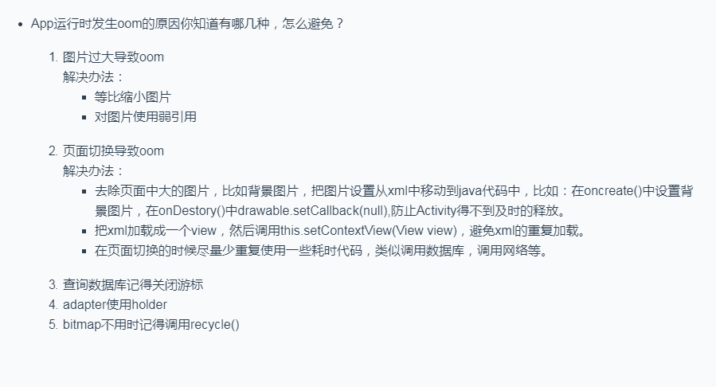
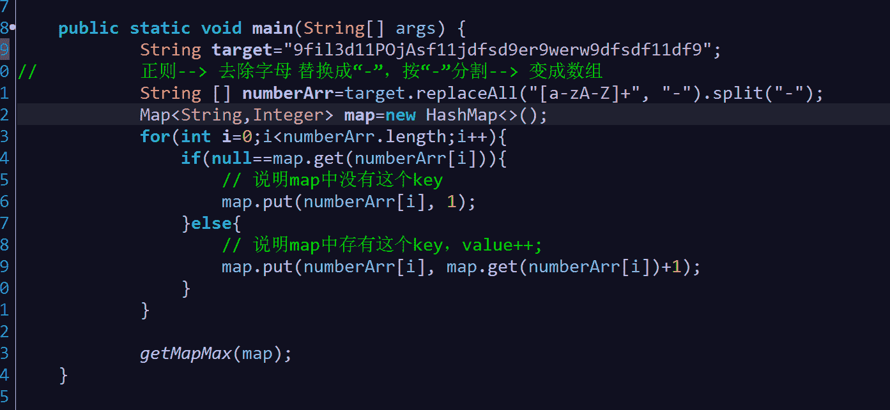
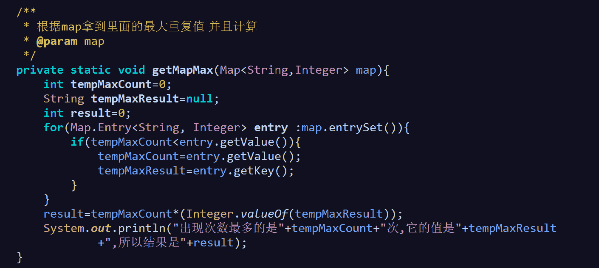

# 阿里巴巴 2017 秋招客户端附加题

## 1

App 运行时发生 OOM 的原因你知道哪几种？如何避免？

你的答案

本题知识点

Android iOS 工程师 安卓工程师 阿里巴巴 2017

讨论

[Gakki 救救我](https://www.nowcoder.com/profile/1565021)

1.资源对象没关闭造成的内存泄露，try catch finally 中将资源回收放到 finally 语句可以有效避免 OOM。资源性对象比如：

1-1，Cursor1-2，调用 registerReceiver 后未调用 unregisterReceiver()
1-3，未关闭 InputStream/OutputStream
1-4，Bitmap 使用后未调用 recycle()

2.作用域不一样，导致对象不能被垃圾回收器回收，比如：
2-1，非静态内部类会隐式地持有外部类的引用，
2-2，Context 泄露
概括一下，避免 Context 相关的内存泄露，记住以下事情：
   1、 不要保留对 Context-Activity 长时间的引用（对 Activity 的引用的时候，必须确保拥有和 Activity 一样的生命周期）
   2、尝试使用 Context-Application 来替代 Context-Activity 3、如果你不想控制内部类的生命周期，应避免在 Activity 中使用非静态的内部类，而应该使用静态的内部类，并在其中创建一个对 Activity 的弱引用。
      这种情况的解决办法是使用一个静态的内部类，其中拥有对外部类的 WeakReference。
2-3，Thread 引用其他对象也容易出现对象泄露。
2-4，onReceive 方法里执行了太多的操作

3.内存压力过大
  3-1，图片资源加载过多，超过内存使用空间，例如 Bitmap 的使用
  3-2，重复创建 view，listview 应该使用 convertview 和 viewholder

如何避免内存泄露：
1.使用缓存技术，比如 LruCache、DiskLruCache、对象重复并且频繁调用可以考虑对象池
2.对于引用生命周期不一样的对象，可以用软引用或弱引用 SoftReferner WeakReferner
3.对于资源对象 使用 finally 强制关闭
4.内存压力过大就要统一的管理内存

发表于 2017-07-24 15:25:21

* * *

[凌宇 Ly](https://www.nowcoder.com/profile/5226191)



发表于 2017-11-22 16:47:22

* * *

[那片风雪](https://www.nowcoder.com/profile/1397729)

JVM 的内存区域大致可以分为 Java 堆、方法区、虚拟机栈、本地方法栈、程序计数器。除了程序计数器不可能发生 OOM 之外，其他区域都可能发生 OOM。Java 堆：Java 堆发生内存溢出，主要是活着的对象占用的空间超过堆空间的大小。避免的方法可以罗列如下：1.分析是否创建的很多不必要创建的对象；2.或者是已经应该死掉的对象，没有在正常的声明周期中死掉；3.或者在前面都正常的情况下，考虑是否可以在成本可以接收的范围内对实现进行重构和优化，避免这种情况；4.在前面都正常的情况下，查看堆、方法区等等占用内存的比例，看看是否可以调大堆的大小；5.在前面都正常的情况下，查看物理内存和虚拟机内存的比例，考虑不影响机器上其他应用的前提下，适当加大虚拟机内存；6.在前面都正常的情况下，考虑适当加大物理机内存。方法区：方法区是存放 Java 类文件和运行时常量池的地方，导致 OOM 也应该主要是这两方面的原因。避免的方法罗列如下：1.查看是否其他区域的信息是否放到方法区，如果是，考虑是否可以把他们迁出去；2.分析运行时常量池是否占用内存过多，是否有无必要，就算有必要，是否可以用其他的方式代替，比如在堆中分配；3.分析不需要的类文件是否过多，是否可以卸载不必要的类文件；其他的优化方式，类似于 Java 堆的 3.4.5.6，将 Java 对改成方法区即可。虚拟机栈：虚拟机栈是 Java 执行方法的在内存中分配的空间，出现 OOM 可能有两种情况，栈深度溢出或者因为栈太多导致内存不够（这种情况主要出现在多线征程）。避免的方法罗列如下：1.栈深度溢出的话，可以考虑加大 Java 虚拟机栈的大小，如果 Java 虚拟机栈的空间允许的话；2.如果由于栈太多，导致 OOM，可以考虑适当减小栈的深度（如果可以满足业务需求）来避免；其他的解决方式可以考虑类似于 Java 堆的 3.4.5.6，将 Java 对改成虚拟机栈即可。本地方法栈：本地方法栈是 Java 虚拟机调用本地方法，所使用的栈空间。解决方法可以罗列如下：1.考虑优化程序，减少调用本地方法调用的次数，或者加大调用次数减少内存即可；2.加大物理内存；3.在某些情况下，也可以考虑调小虚拟机内存，本地方法栈所占的大小。

发表于 2017-08-03 10:45:33

* * *

## 2

在 Android 客户端上，用 java 实现一个线程池（可以使用 java 的数据结构），需要满足可以往前或者往后插入 task，可配置最大同时执行的线程数，并对线程池中当前同一个类型的连续 task 进行合并执行（假设同一类型的 task 可以合并成一次执行）

你的答案

本题知识点

Android iOS 工程师 安卓工程师 阿里巴巴 2017

讨论

[无名 huster](https://www.nowcoder.com/profile/7450384)

1. 可以往前或者往后插入 task：使用 LinkedBlockingQueue 阻塞队列，该阻塞队列结构为双向链表，满足前后插入 task2. 配置最大同时执行的线程数：提供一对外设置的方法即可。    工作过程（假设只有非核心线程）：            1\. 加进来一个 task，首先查看当前启动的线程数是否已经到最大值，没到的话新建一个线程开始执行 task
            2\. 线程已满，则加入到阻塞队列中等待执行            3\. 阻塞队列如果也满了，那么以爆出异常的形式通知外界调用者（java 已有线程池策略）  
3. 对同一个类型的连续 task 进行合并执行：使用一个 hashMap，key==task 的某一唯一属性，value==arrayList< task >集合。相同的 task 都会被放置在同一个 key 对应的 value 中（arrayList< task >），不同的 task 交给线程执行，同时将该 task 的唯一属性值为 key，新建 arrayList 集合放在 hashmap 中。等待执行完毕 task，回过头来清空该 key 对应的这条记录即可。

发表于 2017-08-24 20:02:35

* * *

[牛客 _ 罐](https://www.nowcoder.com/profile/4662330)

在 OkHttp 的源码里面，对请求任务的管理就满足这道题目的要求了。使用了 Deque <call>作为运行任务队列和阻塞任务队列的载体.

发表于 2017-12-06 00:20:48

* * *

## 3

写段代码，定义一个字符串常量，字符串中只有大小写字母和整数，输出字符串中的出现最多的数字的和？例如 ” 9fil3dj11P0jAsf11j ” 中出现最多的是 11 两次，输出 22.

你的答案

本题知识点

Android iOS 工程师 安卓工程师 阿里巴巴 2017

讨论

[Holiday_12138](https://www.nowcoder.com/profile/461586)

```cpp
public int func(String s) {
	int maxCount = 0;
        int maxVal = 0;
	String[] strs = s.split("[⁰-9]");
	HashMap<Integer,Integer> map = new HashMap<Integer,Integer>();
	for(int i = 0; i < strs.length; i++) {
		if(!"".equals(strs[i])) {
			int key = Integer.valueOf(strs[i]);
			if(map.containsKey(key)) {
                            map.put(key, map.get(key) + 1);
                        }
                        else {
                            map.put(key, 1);
                        }
                        if(maxCount < map.get(key)) {
                            maxCount = map.get(key);
                            maxValue = key;
                        }
                }
        }
        return maxValue * maxCount;
}
```

编辑于 2017-07-23 16:51:18

* * *

[凌宇 Ly](https://www.nowcoder.com/profile/5226191)



编辑于 2017-11-22 16:32:00

* * *

[北极企鹅@](https://www.nowcoder.com/profile/530352)

```cpp
import java.util.HashMap;
import java.util.Map;
import java.util.regex.Matcher;
import java.util.regex.Pattern;

public class Main {

	public static void main(String[] args) {

		long sum = new Main().sumOfIntInStr("9fil3dj11P0jAsf11j");
		System.out.println(sum);
	}

	public long sumOfIntInStr(String input){

		Map<Integer, Integer> map = new HashMap<>();

		Pattern pattern = Pattern.compile("\\d+");
		Matcher matcher = pattern.matcher(input);
		while (matcher.find()) {
			Integer curI = Integer.valueOf(matcher.group());
			if(map.containsKey(curI)){
				map.put(curI, map.get(curI) + 1);
			}else {
				map.put(curI, 1);
			}
		}

		long curMaxCnt = 0;
		Integer maxKey = 0;
		for (Map.Entry<Integer, Integer> entry : map.entrySet()) {
			if(entry.getValue() > curMaxCnt){
				curMaxCnt = entry.getValue();
				maxKey = entry.getKey();
			}
		}
		return curMaxCnt * maxKey;
	}

}

```

发表于 2017-08-22 13:34:45

* * *</call>