# 爱奇艺 2017 秋招 c++开发工程师笔试卷

## 1

在软件开发中，我们经常要使用测试用例对程序进行检查，一次成功的测试是指运行测试用例后（）

正确答案: B   你的答案: 空 (错误)

```cpp
证明程序正确性
```

```cpp
发现了程序错误
```

```cpp
改正了程序错误
```

```cpp
未发现程序错误
```

本题知识点

软件测试 C++工程师 爱奇艺 2017

讨论

[九言](https://www.nowcoder.com/profile/973847357)

这种题，真的有歧义，建议删除。

发表于 2020-07-26 10:40:03

* * *

[追寻原风景](https://www.nowcoder.com/profile/860792)

一次成功，代表找到了错误，有点哲学味道。

发表于 2018-05-05 17:57:56

* * *

[琦の兜](https://www.nowcoder.com/profile/5879000)

B `软件测试的目的是发现程序错误，所以一次成功的测试就是，运行测试用例后，发现了程序的错误。

发表于 2017-03-30 16:30:10

* * *

## 2

下列 main （）函数执行后的结果是（）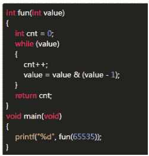 

正确答案: C   你的答案: 空 (错误)

```cpp
17
```

```cpp
15
```

```cpp
16
```

```cpp
1
```

本题知识点

C++工程师 爱奇艺 2017 C 语言

讨论

[呆狗狗～](https://www.nowcoder.com/profile/9692341)

x|(x+1)统计 x 二进制数中，0 的个数 x&（x-1）统计 x 二进制数中，1 的个数

发表于 2017-09-06 10:08:37

* * *

[旁大](https://www.nowcoder.com/profile/3153157)

values=65535 二进制:    1111 1111 1111 1111‬                                                     进行&运算
values-1=65534 二进制: 1111 1111 1111 1110‬values=values&(values-1) 结果为：1111 1111 1111 1110‬下次循环：
               values=65535 二进制:    1111 1111 1111 1110                                                    进行&运算
values-1=65534 二进制: 1111 1111 1111 1100‬values=values&(values-1) 结果为：1111 1111 1111 1100‬以此类推：                当 values=0 的时候,二进制为 0
                也就是进行了 16 次&运算
所以答案为:C

发表于 2019-06-12 17:15:21

* * *

[sunshineboom](https://www.nowcoder.com/profile/4212464)

```cpp
//高赞答案说的不完全对
//统计二进制数中“1”的个数，用如下代码
int fun(int value)
{
    int cnt = 0;
    while(value)
    {
        cnt++;
        //消除所有 1，变成 0
        value = value & (value - 1);
    }
}
//统计二进制数中“0”的个数，用如下代码 
int fun(int value)
{
    int cnt = 0;
    while(!value)
    {
        cnt++;
        //消除所有 0，变成 1
        value = value | (value + 1);
    }
}
```

编辑于 2018-08-10 09:27:16

* * *

## 3

下列代码之后的结果为（）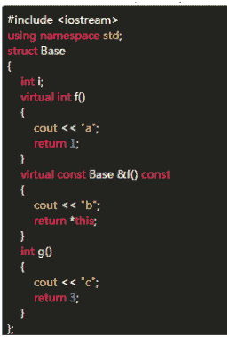 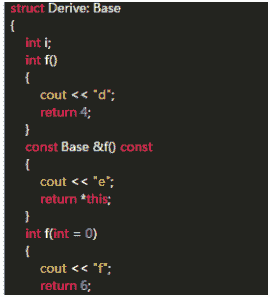 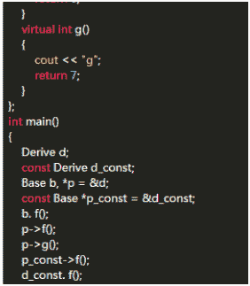 

正确答案: D   你的答案: 空 (错误)

```cpp
abccf
```

```cpp
acdff
```

```cpp
abcde
```

```cpp
adcee
```

本题知识点

C++ C++工程师 爱奇艺 2017

讨论

[Sai9218](https://www.nowcoder.com/profile/3909014)

1.b.f(); 基类对象直接调用基类的 f()函数，输出 a2.p->f(); 派生类对象赋给基类的指针，由于 f()在基类中是虚函数，根据基类指针指向的对象进行调用，因此调用派生类的 int f()输出 d3.p->g();基类中 g()不是虚函数，调用基类的 g()4.p_const->f();常对象，又由于基类中声明为虚，同理用派生类中的函数 5.同理

发表于 2017-07-21 12:50:04

* * *

[小黑不只是码农](https://www.nowcoder.com/profile/1338188)

只有在通过基类指针(或引用)间接指向派生类子类型时多态性才会起作用。派生类的指针只调用自己的函数！基类指针的函数调用如果有 virtual 则根据多态性调用派生类的函数，如果没有 virtual 则是正常调用基类的函数。

发表于 2017-07-21 14:03:23

* * *

[坏坏 62](https://www.nowcoder.com/profile/6236357)

基类的虚函数指针（vptr）指向基类的虚函数表    派生类的虚函数指针（vptr）指向派生类的虚函数表；因此 当基类的指针指向派生类对象时，编译器检测到的是派生类对象的虚函数指针，所以会执行派生类的函数。。。。。

发表于 2017-11-06 08:53:35

* * *

## 4

单例模式中，两个基本要点是

正确答案: A D   你的答案: 空 (错误)

```cpp
构造函数私有
```

```cpp
静态工厂方法
```

```cpp
以上都不对
```

```cpp
唯一实例
```

本题知识点

系统设计 Java C++工程师 爱奇艺 2017

讨论

[AlanLee97](https://www.nowcoder.com/profile/5571214)

设计模式-单例模式

知识点

什么是单例模式？

单例模式（Singleton Pattern）是 Java 中最简单的设计模式之一。这种类型的设计模式属于创建型模式，它提供了一种创建对象的最佳方式。

这种模式涉及到一个单一的类，该类负责创建自己的对象，同时确保只有单个对象被创建。这个类提供了一种访问其唯一的对象的方式，可以直接访问，不需要实例化该类的对象。

单例模式有分为**饿汉式**和**懒汉式**

**特点：**

*   1、单例类只能有一个实例。
*   2、单例类必须自己创建自己的唯一实例。
*   3、单例类必须给所有其他对象提供这一实例。

**应用实例：**

*   1、一个班级只有一个班主任。
*   2、Windows 是多进程多线程的，在操作一个文件的时候，就不可避免地出现多个进程或线程同时操作一个文件的现象，所以所有文件的处理必须通过唯一的实例来进行。
*   3、一些设备管理器常常设计为单例模式，比如一个电脑有两台打印机，在输出的时候就要处理不能两台打印机打印同一个文件。

**优点：**

*   1、在内存里只有一个实例，减少了内存的开销，尤其是频繁的创建和销毁实例）。
*   2、避免对资源的多重占用（比如写文件操作）。

**缺点：**没有接口，不能继承，与单一职责原则冲突，一个类应该只关心内部逻辑，而不关心外面怎么样来实例化。

**使用场景：**

*   1、要求生产唯一序列号。
*   2、WEB 中的计数器，不用每次刷新都在数据库里加一次，用单例先缓存起来。
*   3、创建的一个对象需要消耗的资源过多，比如 I/O 与数据库的连接等。

**注意事项：**getInstance() 方法中需要使用同步锁 synchronized (Singleton.class) 防止多线程同时进入造成 instance 被多次实例化。

实例

单例模式-饿汉式

**代码**

```cpp
//单例模式-饿汉式
public class SingletonDemo {
    public static void main(String[] args) {
        //编译错误：无法实例化
        // Singleton singleton = new Singleton();

        //正确获取对象的方法
        Singleton singleton = Singleton.getINSTANCE();
        singleton.hello();
    }
}

class Singleton{
    //创建一个本身对象
    private static final Singleton INSTANCE = new Singleton();

    //让构造方法为 private，这样该类就不会被实例化
    private Singleton(){}

    //创建一个获取对象的方法
    public static Singleton getINSTANCE() {
        return INSTANCE;
    }

    public void hello(){
        System.out.println("Hello World! ——单例模式-饿汉式");
    }
}
```

**结果**

```cpp
Hello World! ——单例模式-饿汉式
```

单例模式-懒汉式（线程不安全版）

这种方式是最基本的实现方式，这种实现最大的问题就是不支持多线程。因为没有加锁 synchronized，所以严格意义上它并不算单例模式。
这种方式 lazy loading 很明显，不要求线程安全，在多线程不能正常工作。

**代码**

```cpp
//单例模式-懒汉式
public class SingletonDemo2 {
    public static void main(String[] args) {
        Singleton2 singleton = Singleton2.getInstance();
        singleton.hello();

    }

}

class Singleton2{
    private static Singleton2 instance;
    private Singleton2(){}

    public static Singleton2 getInstance() {
        if (instance == null){
            instance = new Singleton2();
        }
        return instance;
    }

    public void hello(){
        System.out.println("Hello World! ——单例模式-懒汉式");
    }
}

```

**结果**

```cpp
Hello World! ——单例模式-懒汉式
```

单例模式-懒汉式（线程安全版）

**描述：**这种方式具备很好的 lazy loading，能够在多线程中很好的工作，但是，效率很低，99% 情况下不需要同步。
**优点：**第一次调用才初始化，避免内存浪费。
**缺点：**必须加锁 synchronized 才能保证单例，但加锁会影响效率。
getInstance() 的性能对应用程序不是很关键（该方法使用不太频繁）。

**代码**

```cpp
//单例模式-懒汉式
public class SingletonDemo3 {
    public static void main(String[] args) {
        Singleton3 singleton = Singleton3.getInstance();
        singleton.hello();

    }

}

class Singleton3{
    private static Singleton3 instance;
    private Singleton3(){}

    public synchronized static Singleton3 getInstance() {
        if (instance == null){
            instance = new Singleton3();
        }
        return instance;
    }

    public void hello(){
        System.out.println("Hello World! ——单例模式-懒汉式");
    }
}

```

**结果**

```cpp
Hello World! ——单例模式-懒汉式
```

发表于 2020-02-09 11:25:32

* * *

[左边的安小静](https://www.nowcoder.com/profile/3696201)

通常单例模式在 Java 语言中，有两种构造方式：1.懒汉方式。指全局的单例实例在第一次被使用时构建。
//懒汉式
public class Singleton2 {
private static Singleton2 INSTANCE=null;

private Singleton2(){}

public static Singleton2 getInstance(){
if(INSTANCE!=null){
INSTANCE = new Singleton2();
}
return INSTANCE;
}
}
2.饿汉方式。指全局的单例实例在类装载时构建。
//饿汉式
public class Singleton {
private final static Singleton INSTANCE = new Singleton();

private Singleton(){}

public static Singleton getInstance(){
return INSTANCE;
}
}

编辑于 2017-09-26 09:57:29

* * *

[生不逢时爱不逢人](https://www.nowcoder.com/profile/553046612)

**双重校验锁实现懒汉单例模式**

```cpp
public class Singleton{
    private volatile static Singleton instance;
    //私有构造函数
    private Singleton{

    }
    //唯一实例
    public static Singleton getInstacne(){
        if(instance == null){
            synchronized(Singleton.class){
                if(instance == null){
                    instance = new Singleton();
                }
            }
        }
        return instance;
    }
}
```

发表于 2019-09-12 09:27:14

* * *

## 5

为了查看不断更新的日志文件，可以使用的指令是（）

正确答案: D   你的答案: 空 (错误)

```cpp
cat -n
```

```cpp
vi
```

```cpp
more
```

```cpp
tail -f
```

本题知识点

Linux C++工程师 爱奇艺 2017

讨论

[niubencoolboy](https://www.nowcoder.com/profile/2848190)

linux 下 tail 用于看档案的结尾， -f 参数 是 follow 的意思 当文件增长时,输出后续添加的数据

发表于 2017-10-28 17:32:36

* * *

[青山崖野](https://www.nowcoder.com/profile/7614806)

使用 tail 命令的-f 选项可以方便的查阅正在改变的日志文件。

发表于 2017-08-03 16:46:12

* * *

[lilinl](https://www.nowcoder.com/profile/3431580)

linux 下 tail 用于查看档案的结尾，-f 参数是 follow 的意思，当文件增长时，输出后续添加的数据

发表于 2018-09-10 09:22:47

* * *

## 6

在下面的类定义中，横线上应填入的内容是（）(注意，count 是在类外了)

```cpp
class Fred {
public:
    void print() {
        cout << data << endl;
    }
    void setData(double d) {
        data = d;
    }
    static int count;
private:
    double data;
};
__________count = 0;
```

正确答案: B   你的答案: 空 (错误)

```cpp
static int Fred::
```

```cpp
int Fred::
```

```cpp
int
```

```cpp
static  int
```

本题知识点

C++

讨论

[努力变强中](https://www.nowcoder.com/profile/3446111)

为什么静态成员不能在类内初始化

在 C++中，类的静态成员（static member）必须在类内声明，在类外初始化，像下面这样

```cpp
class A
{ private: static int count ; // 类内声明 }; int A::count = 0 ; // 类外初始化，不必再加 static 关键字 
```

为什么？因为静态成员属于整个类，而不属于某个对象，如果在类内初始化，会导致每个对象都包含该静态成员，这是矛盾的。

什么东西能在类内初始化

能在类中初始化的成员只有一种，那就是静态常量成员。

这样不行

```cpp
class A
{ private: static int count = 0; // 静态成员不能在类内初始化 };

```

这样也不行

```cpp
class A
{ private: const int count = 0; // 常量成员也不能在类内初始化 };
```

但是这样可以

```cpp
class A
{ private: static const int count = 0; // 静态常量成员可以在类内初始化 };

```

结论：

*   静态常量数据成员可以在类内初始化(即类内声明的同时初始化)，也可以在类外，即类的实现文件中初始化，不能在构造函数中初始化，也不能在构造函数的初始化列表中初始化；
*   静态非常量数据成员只能在类外，即类的实现文件中初始化，也不能在构造函数中初始化，不能在构造函数的初始化列表中初始化；
*   非静态的常量数据成员不能在类内初始化，也不能在构造函数中初始化，而只能且必须在构造函数的初始化列表中初始化；
*   非静态的非常量数据成员不能在类内初始化，可以在构造函数中初始化，也可以在构造函数的初始化列表中初始化；

总结如下表：

| 类型 初始化方式 | 类内(声明) | 类外(类实现文件) | 构造函数中 | 构造函数的初始化列表 |
| 非静态非常量数据成员 | N | N | Y | Y |
| 非静态常量数据成员 | N | N | N | Y (must) |
| 静态非常量数据成员 | N | Y (must) | N | N |
| 静态常量数据成员 | Y | Y | N | N |

 以下三种类型必须通过初始化列表来初始化
1.非静态 常量

 2\. 引用类型

 3\. 没有默认构造函数的类类型

发表于 2017-10-13 10:32:27

* * *

[小新小新](https://www.nowcoder.com/profile/5178172)

静态变量在类外初始化要加上：：，同时不能再加 static 关键字了

发表于 2017-07-09 21:09:05

* * *

[dcjer](https://www.nowcoder.com/profile/7778497)

```cpp
class MyClass
{
public:
    MyClass();
    ~MyClass();
private:
    /*类内部*/
    int a1 = 0;           //非静态非常量数据成员：可在类内声明赋初值
    const int a2 = 0;       //非静态常量数据成员  ：可在类内赋初值
    static const int a3 = 0;     //静态常量数据成员  ：可在类内赋初值
    static int a4 = 0;         //静态非常量数据成员  ：不可在类内赋初值
private:

};
/*类外部*/
int MyClass::a1 = 1;        //错误提示：非静态成员不能在其类外部定义
const int  MyClass::a2 = 2;      //错误提示：非静态成员不能在其类外部定义
const int MyClass::a3 = 3;       //正确
int MyClass::a4 = 4;           //正确

MyClass::MyClass():a1(1),a2(2)   /*初始化列表*/
{
    /*构造函数中赋值*/
    a1 = 10; 
    a2 = 10;    //错误提示：表达式必须是可修改的左值（a2 是常量当然不可修改）
}

MyClass::~MyClass()
{
}

```

1\. 静态成员，无论是否是常量，都不可以在构造函数或初始化列表中初始化。

发表于 2018-02-20 11:11:31

* * *

## 7

以下属于稳定排序的是（）

正确答案: A D   你的答案: 空 (错误)

```cpp
归并排序和基数排序
```

```cpp
快速排序和堆排序
```

```cpp
选择排序和希尔排序
```

```cpp
插入排序和冒泡排序
```

本题知识点

排序 *C++工程师 爱奇艺 2017* *讨论

[0_0?](https://www.nowcoder.com/profile/143856044)

这道题难道不应该是多选题吗，为什么只选 A（归并排序和基数排序）？D（插入排序和冒泡排序）也是稳定排序啊。快选希堆都是不稳定排序。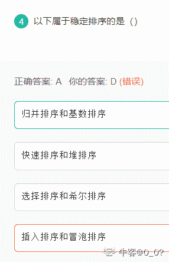

发表于 2021-10-19 14:12:37

* * *

[程序猿 Go 师傅](https://www.nowcoder.com/profile/242025553)

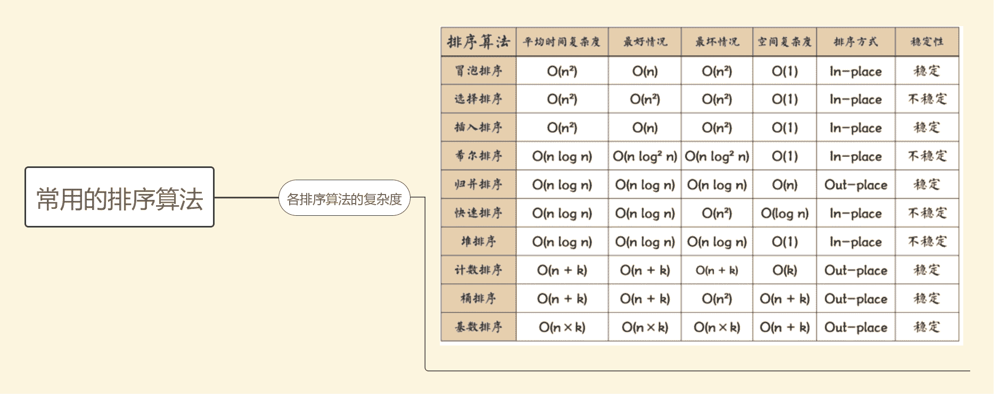

编辑于 2019-10-21 21:27:55

* * *

[大将军豆腐脑好](https://www.nowcoder.com/profile/7116850)

A[`www.cnblogs.com/dd2hm/category/989514.html`](http://www.cnblogs.com/dd2hm/category/989514.html)

发表于 2017-07-30 21:13:35

* * *

## 8

关于 mysql_fetch_object 说法中正确的是（）

正确答案: A   你的答案: 空 (错误)

```cpp
mysql_fetch_object 返回值是个对象，在速度上和 mysql_fetch_array 及 mysql_fetch_row 差不多
```

```cpp
mysql_fetch_object 返回值是个对象，所以在速度上比 mysql_fetch_array 要慢
```

```cpp
mysql_fetch_object 返回值是个数组，所以在速度上和 mysql_fetch_array 及 mysql_fetch_row 差不多
```

```cpp
mysql_fetch_object 和 mysql_fetch_array 一样，没什么区别
```

本题知识点

PHP C++工程师 爱奇艺 2017

讨论

[zzoey](https://www.nowcoder.com/profile/9478187)

A  mysql_fetch_object()  和  [mysql_fetch_array()](http://php.net/manual/zh/function.mysql-fetch-array.php)  类似，只有一点区别 - 返回一个对象而不是数组。速度上，本函数和  [mysql_fetch_array()](http://php.net/manual/zh/function.mysql-fetch-array.php)  一样，也几乎和  [mysql_fetch_row()](http://php.net/manual/zh/function.mysql-fetch-row.php)  一样快（差别很不明显）来源于 PHP 官方手册

发表于 2017-03-29 15:00:54

* * *

[最长的旅途啊啊啊吧](https://www.nowcoder.com/profile/645949930)

出这道题的人，你确定真的了解 php?

发表于 2019-05-29 09:13:38

* * *

[牛客-hiro](https://www.nowcoder.com/profile/455648)

mysql_fetch_object — 从结果集中取得一行作为对象；object mysql_fetch_object ( resource $result )；在速度上和 mysql_fetch_array 及 mysql_fetch_row 差不多； 

发表于 2017-10-18 21:48:10

* * *

## 9

下列计算机不属于 RISC 计算机的是（）

正确答案: B   你的答案: 空 (错误)

```cpp
IBM:Power PC620
```

```cpp
IBM:PC/XT
```

```cpp
SUN:ULtra SPARC
```

```cpp
DEC:ALPHA21164
```

本题知识点

编译和体系结构 C++工程师 爱奇艺 2017

讨论

[看到我请叫我去刷题](https://www.nowcoder.com/profile/5673088)

靠这种题有啥子意思。。。哭

发表于 2017-08-01 10:56:46

* * *

[seek_Qin](https://www.nowcoder.com/profile/5482676)

RISC 是精简指令系统得计算机，CISC 是复杂指令系统的计算机，去百度一下适用于这两种系统的服务器就可以知道了

发表于 2019-06-26 10:16:11

* * *

[灵雨 Lyt](https://www.nowcoder.com/profile/9557815)

RISC 精简指令系统计算机，适用于高档服务器，中档服务器还有: Compaq 公司的 Alpha,Hp 的 Powerpc , MIPS 的 MIPS 和 SUN 的 Spare CISC 复杂指令集:适用于中低档服务器， x86 ，IA-32 架构

发表于 2018-04-19 16:49:18

* * *

## 10

下列程序执行后的输出结果为（）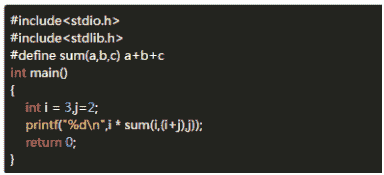 

正确答案: C   你的答案: 空 (错误)

```cpp
36
```

```cpp
以上均不正确
```

```cpp
16
```

```cpp
30
```

本题知识点

C 语言

讨论

[kylsen](https://www.nowcoder.com/profile/7568304)

使用有参宏定义时，形参要用括号括起来，改为#define sum(a,b,c) (a+b+c)答案为 30，否则计算过程为 i*i+(i+j)+j=16。

发表于 2017-07-24 21:51:21

* * *

[Eric.10](https://www.nowcoder.com/profile/8989611)

编译器在编译时会将宏定义展开，i*sum(i, (i+j), j)被展开为 i*i+(i+j)+j。因此，若想宏定义 sum(a, b, c)为 a,b,c 的和，应该定义为 # define sum(a, b, c) (a+b+c)

发表于 2017-10-16 14:21:39

* * *

[炮祺泡祺君](https://www.nowcoder.com/profile/1994385)

宏替换后为 i * i + (i + j) + j，即为 3×3+5+2=16，选 C。

发表于 2018-11-18 17:35:38

* * *

## 11

以下意图用来描述 FACTORY METHOD(工厂方法)的是（）

正确答案: C   你的答案: 空 (错误)

```cpp
表示作用于某对象结构中的各元素的操作，它使你可以在不改变各元素的类的前提下定义作用于这些元素的新操作
```

```cpp
提供一个创建一系列相关或相互依赖对象的接口，而无需指定他们具体的类
```

```cpp
定义一个用于创建对象的接口，让子类决定实例化哪一个类，该模式使一个类的实例化延迟到其子类
```

```cpp
定义一系列的算法，把它们一个个封装起来，并且使它们可相互替换，本模式使得算法可独立于使用它的客户而变化
```

本题知识点

面向对象 系统设计 C++工程师 爱奇艺 2017

讨论

[Jack-Zhou](https://www.nowcoder.com/profile/1951379)

A: Visitor 访问者模式 B: 抽象工厂模式 C: 工厂方法模式 D: 策略模式

发表于 2017-06-08 17:11:14

* * *

[雪松程序](https://www.nowcoder.com/profile/6439148)

B

发表于 2017-03-05 12:11:42

* * *

## 12

类 CBase 的定义如下： 在构造函数 CDerive 的下列定义中，正确的是（）

```cpp
class CBase
{
    int x;
        public:
    CBase(int n){x=n;}
};
class CDerive:public CBase
{
    CBase y;
    int zpublic:
    CDerive(int a,int b,int c);
};
```

正确答案: B   你的答案: 空 (错误)

```cpp
CDerive::CDerive(int a，int b，int c)：x(a),y(b),z(c){}
```

```cpp
CDerive::CDerive(int a，int b，int c)：CBase(a),y(b),z(c){}
```

```cpp
CDerive::CDerive(int a，int b，int c)：CBase(a),CDerive(b),z(c){}
```

```cpp
CDerive::CDerive(int a，int b，int c)：x(a),CBase(b),z(c){}
```

本题知识点

C++ C++工程师 爱奇艺 2017

讨论

[牛客职导官方账号](https://www.nowcoder.com/profile/897353)

【正确答案】B
【解析】A 选  查看全部)

编辑于 2021-11-19 10:21:01

* * *

[大门牙缝](https://www.nowcoder.com/profile/2465519)

这道题其实考点在于  x 是一个父类变量，子类无法直接进行赋值，即不能直接用 x(num)，此时需要调用父类中的函数才能对 x 进行赋值，所以 AD 错，C 中错误在于委托构造函数不能具有其他成员初始值设定项，通俗的说就是子类中本来就有的成员对其赋值时直接采用 y(b)形式，而不能用 CDerive(b);        也可以这样理解  CDerive 只能接受三个参数的构造函数，而 CDerive(b)只有一个参数，这是无法运行的。

编辑于 2018-06-30 13:25:25

* * *

[走位崴了脚](https://www.nowcoder.com/profile/4695029)

这题跟构造函数调用顺序半毛钱关系都没有，基类数据成员在基类构造函数里赋值，不能出现在派生类的构造函数参数列表里，所以 AD 错误；C 选项 CDerive(b)明显错误

编辑于 2018-04-13 10:07:59

* * *

## 13

设有以下定义程序 ; 则以下合法的调用语句是（）

```cpp
#include <iostream>
using namespace std;
class A1 {
public:
    void show1() {
        cout << "class A1" << endl;
    }
};
class A2 : public A1 {
    void show2() {
        cout << "class A2" << endl;
    }
};
class A3 : protected A2 {
    void show3() {
        cout << "class A1" << endl;
    }
};
int main() {
    A1 obj1;
    A2 obj2;
    A3 obj3;
    return 0;
}

```

正确答案: A B C   你的答案: 空 (错误)

```cpp
obj3.show3();
```

```cpp
obj2.show1();
```

```cpp
obj1.show1();
```

```cpp
obj3.show1();
```

本题知识点

C++

讨论

[路飞的小伙伴 9](https://www.nowcoder.com/profile/8171817)

当仅为公有继承时，派生类的对象才仅能访问基类的公有成员，注意基类中的受保护成员也是不可见的。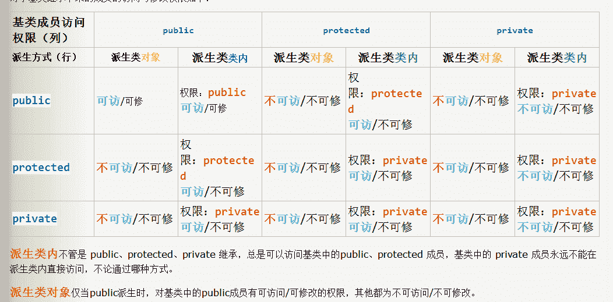

发表于 2017-09-07 11:21:53

* * *

[不想做程序猿](https://www.nowcoder.com/profile/4245015)

类 A1、A2 和 A3 中的成员函数 show1、show2 和 show3 都是 public（公开的），因此，各个类都可以通过对象调用该成员函数，即选项 A、B 和 C；又因为这个属于类的多继承关系，即 A1（基类）-->A2--->A3，由于 A3 继承 A2 的继承方式是 protected(受保护的），所以类 A1 中的 show1 函数在派生类 A3 中是 protected，因此，不能通过类 A3 的对象访问 类 A1 中的 show1，故 D 选项错。

编辑于 2017-07-18 22:32:48

* * *

[Offer 怎么还没有](https://www.nowcoder.com/profile/863719)

```cpp
基类 public 成员, 在子类中仍然是 public 成员，在子类中可以使用， 在子类的对象中也可以调用
基类的 protected 成员，在子类中仍然是 protected 成员，在子类中可以使用，在子类的对象中不能直接调用
private 成员，只能在基类中使用，在基类对象，子类，子类对象中都不能使用
```

发表于 2017-10-28 09:57:59

* * *

## 14

在通常的语法分析中，（）特别使用于表达式的分析

正确答案: B   你的答案: 空 (错误)

```cpp
LL（1）分析法
```

```cpp
算符优先分析法
```

```cpp
递归下降分析法
```

```cpp
LR 分析法
```

本题知识点

编译和体系结构 C++工程师 爱奇艺 2017

讨论

[早起的蜗牛](https://www.nowcoder.com/profile/3699215)

自底向上的语法分析方法，也称为***移动归约分析法***。

*   最易于实现的一种移动归约分析方法，叫做***算符优先分析法***，
*   而更一般的移动归约分析方法叫做***LR 分析法***，LR 分析法可以用作许多自动的语法分析器的生成器。

发表于 2017-09-10 18:27:56

* * *

## 15

下推自动识别机的语言是（）

正确答案: C   你的答案: 空 (错误)

```cpp
1 型语言
```

```cpp
3 型语言
```

```cpp
2 型语言
```

```cpp
0 型语言
```

本题知识点

小众语言 C++工程师 爱奇艺 2017

讨论

[666 的佩奇爸爸](https://www.nowcoder.com/profile/7670357)

答案：C。

计算机中一共定义了四种文法，分别如下：

① 0 型文法（短语结构文法）。0 型文法的能力相当于图灵机（Turing）。任何 0 型语言都是递归可枚举的；反之，递归可枚举集必定是一个 0 型语言。

② 1 型文法（上下文相关文法）。αAβ->αBβ一样的形式。这里的 A 是非终结符号，而α、β和 B 是包含非终结符号与终结符号的字串，即：A 只有出现在α1α2 的上下文中，才允许用 B 替换。

③ 2 型文法（上下文无关文法）。文法的产生式为：A->α，其中，A 是非终结符号，α是包含非终结符号与终结符号的字串。

④ 3 型文法（正规文法）。这种文法要求产生式的左侧只能包含一个非终结符号，产生式的右侧只能是空串、一个终结符号或者一个非终结符号后随一个终结符号；如果所有产生式的右侧都不含初始符号 S ，规则 S->ε也允许出现。这种文法规定的语言可以被有限状态自动机接受，也可以通过正则表达式来获得。正规语言通常用来定义检索模式或者程序设计语言中的词法结构。

在四种文法的基础上定义了四种语言：

① 0 型文法产生的语言称为 0 型语言。

② 1 型文法产生的语言称为 1 型语言，也称作上下文有关语言。

③ 2 型文法产生的语言称为 2 型语言，也称作上下文无关语言。

④ 3 型文法产生的语言称为 3 型语言，也称作正规语言。

下表给出四种文法的特点以及对应的语言：

| 文法 | 语言类型 | 语言 | 自动机 |
| 0-型 | 0-型 |        递归可枚举语言 |                    图灵机 |
| 1-型 | 1-型   |       上下文相关语言 |          线性有界非确定图灵机 |
| 2-型 | 2-型 |        上下文无关语言 |             非确定下推自动机 |
| 3-型 | 3-型 |          正规语言 |               有限状态自动机 |

从上表的分析可知，下推自动机属于 2 型语言。所以，选项 C 正确。

编辑于 2018-07-07 17:43:01

* * *

## 16

大整数 845678992357836701 转话为 16 进制的表示，最后两位字符是（）

正确答案: B   你的答案: 空 (错误)

```cpp
AB
```

```cpp
9D
```

```cpp
8B
```

```cpp
EF
```

本题知识点

编程基础 *C++工程师 爱奇艺 2017* *讨论

[RenaissanceWhy](https://www.nowcoder.com/profile/2491161)

100%4 = 01000%8 = 0          16*375=6000
10000%16 = 0      16*625=10000
845678992357836701%16 = 6701%16 = 701%16 = 13
所以最后一位是 D

编辑于 2017-08-30 22:12:41

* * *

[三五大汉](https://www.nowcoder.com/profile/510346)

大数÷2=******3350 …… 13350÷2=1675……01675÷2=837……1837÷2=418……1 转换成二进制的话，最后 4 位就是 1101，转换成 16 进制，最后一位就是 D，选 B

发表于 2017-08-31 14:19:11

* * *

[天蓝何](https://www.nowcoder.com/profile/9858360)

845678992357836701 除以 16 的余数为 13，即 16 进制中个位数为 13，D，可知答案为 B，如果不确定还可以验证除以 16 的商再除以 16 求余数，可知是 9

发表于 2017-07-29 21:10:15

* * *

## 17

存在 int 类型变量 x，y，z，其对应值为 x=0x59，y=0x39，z=0x6E，则 x*y+z 的值为（）

正确答案: B   你的答案: 空 (错误)

```cpp
‘1001001110011
```

```cpp
‘1010000111111
```

```cpp
‘1001001110111
```

```cpp
‘1011001111111
```

本题知识点

C 语言

讨论

[看到我请叫我去刷题](https://www.nowcoder.com/profile/5673088)

    5 9 x 3 9-----------   3 2 11 0 b----------1 3 d 1+    6 E-----------0x  1 4 3 f 

发表于 2017-08-01 11:14:20

* * *

[匿名用户 1789](https://www.nowcoder.com/profile/7996284)

```cpp
正常的做乘法计算， 只不过 10 进制换成 16 进制。比如 59 *39 中， 9*9=81， 81 / 16 得 5 余 1，那么把 5 进位
5*9 = 45 + 进位 5=50， 50/16=3...2 ，所以到 59 * 9 这部分就是 321.
```

编辑于 2017-08-01 18:49:12

* * *

[扈亥取園逧](https://www.nowcoder.com/profile/300082)

以下演算是基于前两个回答的，多谢！package com.nowcoder.二进制;
public class 十六进制 {
public static void main(String[] args) {
int x = 0x59, y = 0x39, z = 0x6E;
System.out.println(x * y + z);

int ret = x * y + z;
System.out.println(Integer.valueOf(ret));
System.out.println(0b1010000111111);
System.out.println(0x143f);
}
}
/*

0x59 * 0x39 + 0x6e
演算过程:
5 9
x 3 9
3 5  => 表示进位数
------------
[3 2 1]=> 9*9=81 => 81/16=5……1(表示商为 5 余数为 1,以下同理) => 1 留下做结果,进位上 5
=> 5*9=45 => 45+5=50(加上进位再做运算) => 50/16=3……2 => 2 留下做结果,进位上 3 => 3 直接落下做头
=> 综上两步,0x59*0x9=0x321

1 1    => 表示进位数
[1 0 b]  => 9*3=27 => 27/16=1……11 => 11 即 b 留下做结果,进位上 1
=> 5*3=15 => 15+1=16(加上进位再做运算) => 16/16=1……0 => 0 留下做结果,进位上 1 => 1 直接落下做头
=> 综上两步,0x59*0x3=0x10b
3 2 1
1 0 b
------------
1 3 d 1 =>2+b=2+11=13=d
+       6 E
-----------
0x  1 4 3 f => 1+E=1+14=15=f,最终结果是 0x143f

下面转换二进制(基于 8421 码转换,注意:十六进制每位相当于 4 位二进制):
0x 1    4    3    f
1    4    3    15
0001 0100 0011 1111
综上,结果就是:0001010000111111,取出首部 0 即:1010000111111
*/由于排版问题，附上截图方便查阅：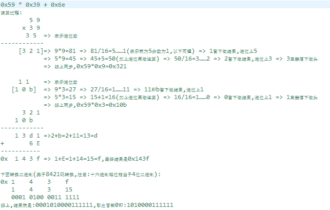

编辑于 2017-12-14 00:05:27

* * *

## 18

关于 RSA 加密过程和解密过程说法正确的是（）

正确答案: B C   你的答案: 空 (错误)

```cpp
加密过程中，使用私钥对信息进行加密
```

```cpp
加密过程中，使用公钥对信息进行加密
```

```cpp
解密过程中，使用私钥对信息进行解密
```

```cpp
解密过程中，使用公钥对信息进行解密
```

本题知识点

加密和安全 C++工程师 爱奇艺 2017

讨论

[纽扣电池](https://www.nowcoder.com/profile/743878845)

A 给 B 发送数据，AB 各生成公钥和私钥，A 用 B 的公钥进行加密，用 A 的私钥进行加签。B 收到后用 B 的私钥进行解密，用 A 的公钥进行验签。

发表于 2018-12-26 16:18:28

* * *

[参宿](https://www.nowcoder.com/profile/1998005)

加解密: 加密使用公钥，解密使用私钥 签名: 使用私钥进行加密，使用公钥进行解密

发表于 2017-07-28 19:12:45

* * *

## 19

一个局域网中某台主机的 ip 地址为 176.68.160.12，使用 22 位作为网络地址，最多可以连接的主机数为（）

正确答案: D   你的答案: 空 (错误)

```cpp
254
```

```cpp
1024
```

```cpp
512
```

```cpp
1022
```

本题知识点

网络基础 C++工程师 爱奇艺 2017

讨论

[长生](https://www.nowcoder.com/profile/1600108)

有 22 位作为网络地址那么说明有 10 位是主机号(32-22)，其中全零全一的不能用，故最多的主体数为：2¹⁰ - 2 = 1022

发表于 2017-08-18 00:41:39

* * *

[rs 勿忘初心](https://www.nowcoder.com/profile/7491640)

```cpp
22 位网络地址，按二进制计算：11111111.11111111.11111100.00000000，十进制：255.255.252.0，主机位有 10 位（10 个 0），因此主机数为 2 的 10 次方减去 2(网络地址 IP 和广播 IP）：2¹⁰-2=1022，最多可以连接 1022 台主机，若再出去网关 IP，则最大可以接 1021 台主机。
```

发表于 2017-07-15 16:16:13

* * *

[牛客 017](https://www.nowcoder.com/profile/2123017)

有 32-22 位主机号，其中全 0 全 1 是保留地址，即有 2¹⁰-2=1022Note：全 0 是网络地址，表示一个网；全 1 是广播地址，广播地址被应用程序和主机用来将信息发送到网络上所有结点的地址：比如 192.168.100.255，它用于指向 192.168.100 的所有主机。

发表于 2019-03-11 20:42:20

* * *

## 20

675 、 225 、 90 、 45 、 30 、30、（）

正确答案: A   你的答案: 空 (错误)

```cpp
60
```

```cpp
124
```

```cpp
38
```

```cpp
27
```

本题知识点

数学运算

讨论

[牛客 3380542 号](https://www.nowcoder.com/profile/3380542)

分别是除以 3、2.5、2、1.5、1
类推 下一个除以 0.5
30/0.5=60

发表于 2017-07-11 20:41:57

* * *

[香帅⊙ε⊙](https://www.nowcoder.com/profile/6699417)

都有因子 5

发表于 2017-08-02 10:11:13

* * *

[蓝天无云](https://www.nowcoder.com/profile/1266101)

其实感觉递减也可以说得过去呀！！=-=

发表于 2018-09-15 20:15:12

* * *

## 21

问号中应填写的数字是（）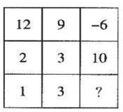

正确答案: A   你的答案: 空 (错误)

```cpp
11
```

```cpp
26
```

```cpp
17
```

```cpp
13
```

本题知识点

判断推理

讨论

[ShaoXiaobao](https://www.nowcoder.com/profile/4765842)

三列相加 = 15 三行相加 = 15

发表于 2017-07-24 16:32:36

* * *

[中国城管头儿](https://www.nowcoder.com/profile/3328825)

....三列相加分别等于 15

发表于 2017-07-17 17:08:33

* * *

[对方正在输入..........](https://www.nowcoder.com/profile/845254012)

行列相加都等于 15

发表于 2020-04-02 10:08:51

* * *

## 22

定义新运算：对于任意自然数 A ， B ，若 A ， B 奇偶性相同，则 A*B=(A+B)/2; 若 A 、 B 奇偶性不同，则 A*B=(A+B+1)/2 ，那么 1*2*5= （）（ “  * ” 代表是一个符号，不是乘积的意思。）

正确答案: A   你的答案: 空 (错误)

```cpp
4
```

```cpp
8
```

```cpp
12
```

```cpp
2
```

本题知识点

数学运算

讨论

[凌晨 20180312](https://www.nowcoder.com/profile/207159249)

之前没反应过来：1*2 奇偶性不同，则 A*B=(A+B+1)/2 ， = 22*5 奇偶性不同，则 A*B=(A+B+1)/2 ， = 4

发表于 2020-11-08 11:12:56

* * *

[karaysn](https://www.nowcoder.com/profile/7759354)

写一下就行了

发表于 2017-12-17 19:53:55

* * *

[juding](https://www.nowcoder.com/profile/5260293)

太简单

发表于 2017-07-13 21:39:07

* * *

## 23

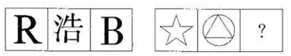 问号处应当是：A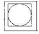
B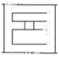
C
D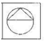

正确答案: D   你的答案: 空 (错误)

```cpp
如图
```

```cpp
如图
```

```cpp
如图
```

```cpp
如图
```

本题知识点

智力题 C++工程师 爱奇艺 2017

讨论

[流川枫爱樱木花道](https://www.nowcoder.com/profile/4193842)

选 A，根据方框内封闭空间个数，1+1=2,1+4=5,所以选 A（）同意的支持一票

发表于 2017-09-18 16:08:29

* * *

[FQQ](https://www.nowcoder.com/profile/7212602)

这种题目有什么意义？怎么解释都可以说是有道理

发表于 2017-08-10 11:20:43

* * *

[中国城管头儿](https://www.nowcoder.com/profile/3328825)

还有这种操作？！

发表于 2017-07-11 20:09:07

* * *

## 24

在某次税务检查后，四个工商管理人员各自做出了结论。甲说;”所有个体户都没纳税。”。乙说：”服装个体户陈老板没纳税。”丙说：”个体户不都没税”，丁说：”有的个体户没税”。如果四个人中只有一个断定属实，那么以下哪项是真的？（）

正确答案: D   你的答案: 空 (错误)

```cpp
丁断定属实，但陈老板纳了税
```

```cpp
甲断定属实，陈老板没纳税
```

```cpp
乙断定属实，陈老板没纳税
```

```cpp
丙断定属实，但陈老板纳了税
```

本题知识点

判断推理

讨论

[快说我这信号好](https://www.nowcoder.com/profile/8528154)

这个不都没税 是什么意思？ (总感觉丙和丁说的是一个意思)

发表于 2017-10-22 17:08:33

* * *

[谁在喊我帅？](https://www.nowcoder.com/profile/8597178)

反逻辑：甲、所有个体户都已经纳税乙、陈老板已纳税丙、个体户都没有税丁、有的个体户有税，有的个体户没税。只有丙和其余人的话都矛盾，因为条件只有一个人是判定属实，反过来就只有一个人的话是错误的。丙。陈老板已经纳税。

发表于 2017-11-16 17:40:40

* * *

[quanllong](https://www.nowcoder.com/profile/195148040)

甲：所有人都没有纳税乙：服装店陈老板没纳税丙：不都没税，即至少有一个人纳税丁：有的个体没税，即至少有一个人没纳税题目只允许一个人的说法成立，即四个人的说法中有且仅有一个成立甲乙丁都说没税，丙说有税，若肯定丙并将它扩大为全部都已经纳税，就可以推翻甲乙丁

编辑于 2019-02-21 14:25:12

* * *

## 25

看下列资料描述，回答 1-4 题
根据统计，1985 年北京市建筑企业共完成生产总值 47.2 亿元，比上年增长 31.5%（扣除价格因素的影响，实际增长 22.2%），其中，中央在京施工企业完成 8.2 亿元，比上年增长 28%，地方全民所有制工企完成 24.1 亿元，比上年增长 24.4%，特别是地方集体所有制施工企业发展更快，完成总产值 14.9 亿元，比上年增长 47.3%，全市建筑企业按总产值计算的全员劳动生产率为 7743 元，比上年提高 13.4%（扣除价格因素影响则提高 6%），全员平均产值达到万元以上的企业，由上年的 20 个增加到 55 个。市建筑工程总公司所属二公司，四公司和设备安装公司，门头沟区建筑公司，市水利工程二处，水利机械施工等 12 个企业的全员劳动生产超过 15000 元，扣除价格因素影响，
1、北京市 1985 年建筑企业生产总值比 1984 年实际增长多少？
A22.%
B 24.4%
C 31.5%
D 28%

2、与 1984 今年相比，1985 年北京市哪种类型的施工企业其产值增长速度最快？（）
A 地方全民所有制企业
B 无法确定
C 地方集体所有制施工企业
D 中央在京施工企业
3、1985 年，全员平均产值达到万元以上的施工企业比 1984 年增加了多少个？（）
A 20           B 55           C 35          D 12

4、北京市建筑工程总公司所属公司 1985 今年全员劳动生产率为（）。
A10000 元             B 7743 元          C 接近 15000 元         D 15000 元以上

你的答案

本题知识点

C++工程师 爱奇艺 2017

讨论

[香帅⊙ε⊙](https://www.nowcoder.com/profile/6699417)

我靠！干脆参考答案都略了。我做的是 ACCD

发表于 2017-08-02 10:04:02

* * *

[feelinghappy](https://www.nowcoder.com/profile/6136320)

ACCC 就是最后一题没有把握

发表于 2017-08-02 17:18:49

* * *

## 26

世博南美馆

**题目描述：**世博会期间，小明计划玩一遍所有南美国家的国家馆。南美一共有 10 个国家，他们的国家馆一字排开分布在南美大道上，按顺序编号分别为 0-9。

小明的游玩方案是这样的

如果玩的人太多，就把馆分成两批，分的方式是在相邻的某两个馆之间插一个牌子；

任选其中一批先玩，另一批以后玩；

如果一批馆还是玩不玩，则继续分为两批；

一批中的馆全部玩完之后，才能玩下一个批馆；

每批馆玩的时候，只能从这批当中编号最小的馆开始，按照相邻的编号逐个玩；

一天至少可以玩一个馆。

十个馆都玩完之后，小明拿出在十个馆盖章的册子，请你根据册子上盖章的顺序，判断小明是否遵守了自己的游玩方案。

**输入**

0-9 十个数字的排列

**输出**

符合小明玩法的，输出 yes，不符合的，输出 no

**样例输入**

3287956401

4130279856

**样例输出**

yes

no

你的答案

本题知识点

PHP Python Java C++ C++工程师 爱奇艺 2017

讨论

[香帅⊙ε⊙](https://www.nowcoder.com/profile/6699417)

小明****啊，同感的点个赞

发表于 2017-08-02 10:17:54

* * *

[meantell](https://www.nowcoder.com/profile/2489469)

```cpp
 #include <iostream>

using namespace std;

int fun1(int a[])
{
	int i = 1;
	while (i<10)
	{
		if (a[i] - a[i - 1]>1)
		{
			if ((i == 1) || (a[i - 1] > a[i - 2]))
			{
				int j = 0;
				int flag = a[i] - a[i - 1] - 1;
				int count = 0;
				while (j < i - 1)
				{
					if (a[j]<a[i] && a[j]>a[i - 1])
						count++;
					j++;
				}
				if (count != flag)
					return 0;
			}
		}
		i++;
	}
	return 1;
}
int main()
{
	int a[10];
	for (int i = 0; i < 10; i++)
		cin >> a[i];
	int res = fun1(a);
	if (res == 0)
	{
		cout << "no" << endl;
	}
	else
	{
		cout << "yes" << endl;
	}
	system("pause");
	return 0;
}
```

编辑于 2017-09-01 19:20:18

* * *

[Mr.谭](https://www.nowcoder.com/profile/6264100)

不知所谓。。

发表于 2017-08-24 03:11:28

* * *

## 27

相似单词变换

**题目描述：**英文单词有很多非常相似，比如：see 和 seek、cat 和 cut 等，现在提供 3 种编辑操作：insert、remove、replace，通过在单词 1 上进行这些操作，可以让单词 1 变成单词 2

那么问题来了，如何只用最小次数的编辑操作，可以让字符串 1 变成字符串 2？

说明：

1）3 种编辑操作的代价是一样的

2）并且每次只能操作一个字符串的一个字母

3）只需要考虑在字符串 1 上进行编辑操作即可

**输入**

输入一行，有两个字符串，以空格分隔。

**输出**

输出为最小编辑次数。

**样例输入**

geek gesek

**样例输出**

1

你的答案

本题知识点

Python Java C++ C++工程师 爱奇艺 2017

讨论

[破戒鸟](https://www.nowcoder.com/profile/9767995)

```cpp
#include <string>
#include<algorithm>
#include <vector>
#include <iostream>
#include <cmath>
using namespace std;

int main()
{
	string str1, str2;
	while (cin >> str1 >> str2){
		int len1 = str1.size();
		int len2 = str2.size();
		vector<vector<int>> dp(len1 + 1, vector<int>(len2 + 1,0));
		for (int i = 0; i <= len1; i++){
			dp[i][0] = i;
		}
		for (int j = 0; j <= len2; j++){
			dp[0][j] = j;
		}
		for (int i = 1; i <= len1; i++){
			for (int j = 1; j <= len2; j++){
				if (str1[i - 1] == str2[j - 1])
					dp[i][j] = dp[i - 1][j - 1];
				else
					dp[i][j] = min(min(dp[i - 1][j] + 1, dp[i][j - 1] + 1), dp[i - 1][j - 1] + 1);
			}
		}
		cout << dp[len1][len2] << endl;
	}
	return 0;
}
```

发表于 2017-09-09 17:09:31

* * *

[火鸡不会飞](https://www.nowcoder.com/profile/5428799)

```cpp
# coding:utf8
def count_opera():
	hey = raw_input()
	while (not hey or len(hey.split(' '))!=2):
		print "Input Correct String"
		hey = raw_input()
	need_change, porpose = hey.split(' ')
	need_change_length = len(need_change)
	porpose_length = len(porpose)
	if need_change_length == porpose_length:
		print same_length(need_change, porpose)
	if need_change_length < porpose_length:
		print need_insert(need_change, porpose)
	if need_change_length > porpose_length:
		print need_delete(need_change, porpose)

def same_length(string_A, string_B):
	count = 0
	for index in xrange(len(string_B)):
		if string_A[index] != string_B[index]:
			count += 1
	return count

def need_insert(string_A, string_B):
	count = 0
	a_list = list(string_A)
	for index in xrange(len(string_B)):
		if a_list[index] != string_B[index]:
			a_list.insert(index, string_B[index])
			count += 1
		if len(a_list) == len(string_B):
			string_A = ''.join(a_list)
			break
	change_cnt = same_length(string_A, string_B)
	count += change_cnt
	return count

def need_delete(string_A, string_B):
	count = 0
	a_list = list(string_A)
	while (len(a_list) != len(string_B)):
		a_list = delete_and_judge(a_list, string_B)
		count += 1
	string_A = ''.join(a_list)
	change_cnt = same_length(string_A, string_B)
	count += change_cnt
	return count

def delete_and_judge(a_list, string_B):
	length = len(a_list)
	for index in xrange(length):
		if a_list[index] != string_B[index]:
			del a_list[index]
			return a_list

if __name__ == "__main__":
	count_opera()
```

发表于 2017-08-02 10:58:52

* * *

[Deep_Blue](https://www.nowcoder.com/profile/6794293)

应该就是将两个字符串中较长的长度减去两个字符串的最长公共子序列，因为公共子序列不需要操作，剩下的可以全部看成 replace 操作，剩下的长度不同时，可以看成空格，比如 geek -> gesek 的最长公共子序列为 geek,剩余的为'sp'(space)->s,主需要一次 replace 操作

发表于 2018-04-18 16:38:00

* * ***