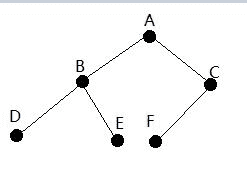

# 五十八、同城 2017 秋招研发工程师笔试试卷

## 1

某 App 共有 iOS、Android 两个平台，两个平台的用户比例为 3:4 ，据 历史统计， ios 平台的日访问率为 0.012% ， android 平台的用户每日访问率为 0.008% ，现有一个 App 的用户访问，该访问发生在 ios 平台的可能性为 ______.

你的答案

本题知识点

概率统计 *讨论

[摩登大西瓜](https://www.nowcoder.com/profile/1194229)

假设 ios 用户有 3000 人，安卓有 4000 人，可得 ios 日均人数为 36 个，安卓日均日数为 32.这样可得 36/（36+32）=9/17

发表于 2017-07-29 15:50:44

* * *

[ベ●＇..＇●ベ](https://www.nowcoder.com/profile/1307102)

(3/7 × 0.012%) ÷ (3/7 × 0.012% + 4/7 ×0.008%) = 9/17

发表于 2017-08-22 14:58:47

* * *

[自律使我快乐](https://www.nowcoder.com/profile/787569616)

总用户为 X,ios3/7 *0.012%x,Android 4/7 *0.008%x,两个相除，得出 9/8

发表于 2021-03-25 16:31:05

* * *

## 2

三台服务器 A,B,C， 独立运转时发生故障的概率分别为 0.1,0.2,0.3， 三台服务器同时运行，则至少有一台出现故障的概率为 ______.

你的答案

本题知识点

概率统计 *讨论

[天涯 __](https://www.nowcoder.com/profile/6482770)

1-0.9*0.8*0.7  ，对不对

发表于 2017-07-10 15:21:57

* * *

[Jun94](https://www.nowcoder.com/profile/5850214)

三台服务器 A,B,C， 独立运转时发生故障的概率分别为 0.1,0.2,0.3， 三台服务器同时运行，则至少有一台出现故障的概率为 ______.P（i）代表服务器 i 独立运行不发生故障的概率，则有 P(A)=0.9,P(B)=0.8,P(C)=0.7 服务器运行是否发生是独立事件,则三台服务器均不发生故障的概率 P(ABC)=P(A)*P(B)*P(C)=0.9*0.8*0.7 至少有一台服务器出故障是三台服务器都不出故障的对立事件,所以概率为 1-0.9*0.8*0.7 = 0.496 

发表于 2017-08-22 14:26:39

* * *

[赛博迷航](https://www.nowcoder.com/profile/812627039)

1—（1—0.1）（1—0.2）（1—0.3）

发表于 2020-07-06 10:41:52

* * *

## 3

 二叉树的先序遍历序列为 ABDECF，中序遍历序列为 DBEAFC，则后序遍历序列为：______.

你的答案

本题知识点

树

讨论

[壹个人](https://www.nowcoder.com/profile/7109441)

1、由先序遍历可知，A 为根节点，由中序可知以 A 为根节点的左子树为 DBE，右子树为 FC；2、再看先序遍历，以 A 为根节点的左子树为 BDE，此时，该左子树的根节点为 B，即，A 节点的做孩子为 B，再通过中序遍历，可知：B 节点的左孩子为 D，右孩子为 E；3、如第二步分析方式，同理可得 A 节点的右孩子为 C，C 的左孩子为 F，C 没有右孩子。如图：因此，结果为：DEBFCA

发表于 2017-08-22 14:49:51

* * *

[zhr4](https://www.nowcoder.com/profile/6215537)

```cpp
DEBFCA
```

发表于 2017-08-05 08:51:47

* * *

[发言人](https://www.nowcoder.com/profile/3080961)

BDEFCHAZ 或 BDFECHAZ

发表于 2017-07-31 14:01:16

* * *

## 4

有 n 个无序整数（ n>10000）， 则找出其中最大的 M 个数字（ 5<M<10）， 所需要的最小时间复杂度为： ________.

你的答案

本题知识点

复杂度

讨论

[zhr4](https://www.nowcoder.com/profile/6215537)

*   NLOG(m)

发表于 2017-08-21 16:04:59

* * *

[啊啊啊 62](https://www.nowcoder.com/profile/7551327)

O(N)可以修改数组情况，类似快速排序 O(NlogM)首先将前 M 个数存入数组，然后后面 M+1...N 的数，都比较已有的 M 个数的最小的数，如果比最小数大，则替换具体解析：剑指 offer

发表于 2017-08-22 12:29:39

* * *

[孙强 Jimmy](https://www.nowcoder.com/profile/791455)

将 n 个整数排成大根堆，取堆顶，然后再处理成大根堆，重复 M 次，时间复杂度为 O(MlogN)。

发表于 2017-08-21 09:21:02

* * *

## 5

以下程序的输出结果为 _____.

```cpp
#include
int a[3][3]={1,2,3,4,5,6,7,8,9,},*p;
main()
{
p=(int *)malloc(sizeof(int));
f(p,a);
printf(“%d\n”,*p);
}
f(int *s,int p[][3])
{
*s=p[1][1];
}
```

你的答案

本题知识点

C++

讨论

[甚是无聊](https://www.nowcoder.com/profile/762536)

函数 f 的声明在调用后面，所以编译失败

发表于 2018-04-15 15:44:18

* * *

[斗气化胸](https://www.nowcoder.com/profile/9595094)

#include 这里都没写完整。。。明显编译都不通过。。。

发表于 2018-04-14 13:14:15

* * *

[同桌向宇](https://www.nowcoder.com/profile/2078521)

a[3][3]= {1,2,3               4,5,6               7,8,9}
a[1][1] = 5

发表于 2017-08-22 14:29:53

* * *

## 6

设有 n 个待排序的记录关键字，则在堆排序中需要 ___ 个额外存储 空间.

你的答案

本题知识点

堆 排序 *讨论

[sichengLv](https://www.nowcoder.com/profile/253572)

0 个

发表于 2018-03-31 23:43:44

* * *

[喵咪咪～喵咪咪～](https://www.nowcoder.com/profile/9035859)

```cpp
堆排序(Heapsort)是指利用堆积树（堆）这种数据结构所设计的一种排序算法，它是选择排序的一种。
可以利用数组的特点快速定位指定索引的元素。堆分为大根堆和小根堆，是完全二叉树。
大根堆的要求是每个节点的值都不大于其父节点的值，即 A[PARENT[i]] >= A[i]。
在数组的非降序排序中，需要使用的就是大根堆，因为根据大根堆的要求可知，最大的值一定在堆顶。
```

发表于 2017-08-21 20:10:24

* * *

[锅锅锅](https://www.nowcoder.com/profile/4370596)

1 个，他需要一个额外的储存空间来进行比较

发表于 2020-12-14 11:00:36

* * *

## 7

现有一组数字（ 26,84,18,36,60,72,48 ），当使用 48 作为快速排序基准排序一趟后，得到的排序结果为 ______.

你的答案

本题知识点

排序 *讨论

[maoger](https://www.nowcoder.com/profile/8532495)

请问为什么不是 26,18,36,48,60,72,84 呢？

发表于 2017-08-18 19:26:06

* * *

[同桌向宇](https://www.nowcoder.com/profile/2078521)

26,84,18,36,60,72,48 26,48,18,36,60,72,8426,36,18,48,60,72 84  第一次结束

发表于 2017-08-22 14:33:21

* * *

[Mr_DoubleDragon 毛](https://www.nowcoder.com/profile/6014672)

26,36,18,48,60,72,84

发表于 2017-08-04 15:32:22

* * *

## 8

下列函数的输出结果为 ______.

```cpp
#define add(a+b) a+b
int main(){
    printf(“%d”,5*add(3+4));
    return 0;
}
```

你的答案

本题知识点

C++

讨论

[龙战风云](https://www.nowcoder.com/profile/8034447)

宏直接替换，所以是 5*3+4=19

发表于 2017-07-11 07:37:34

* * *

[楊婧](https://www.nowcoder.com/profile/6592605)

在 VS2012 编译了，题目是错的，应该写成#define add(a,b) a+bint main(){printf("%d",5*add(3,4));return 0;}结果为 19

发表于 2017-07-13 17:07:25

* * *

[Monster_Girl](https://www.nowcoder.com/profile/5967449)

宏替换时，只对参数进行了替换，不牵扯符号，所以 5*3+4=19

发表于 2017-07-29 09:49:31

* * *

## 9

假设整数乘法运算时间复杂度为 O(1)， 计算整数的 n 次幂( n>0)， 最快算法的时间复杂度为 ____.

你的答案

本题知识点

复杂度

讨论

[喵咪咪～喵咪咪～](https://www.nowcoder.com/profile/9035859)

第一种：直接一个 for 循环将 n 个 x 相乘,时间复杂度明显是 O(x)
第二种：利用递归（其实不是递归也行的）,举例 2⁹,那个变成 2⁴ * 2⁵,2⁴ 变成 2² * 2²,此时 2² 只需算一次,即是求 x^n,若 n 是奇数,则 x^(n/2) * x^((n+1)/2),若是偶数,则 t=x^(n/2),t*t,并且可通过备忘录方法,即定义一个数组,每计一次,把其存进数组,如 2²=4,那么 array[2]=4,因为 array[2]可能会出现多次,所以使用递归前先看一看该数组位是否为 0,是则正常递归,不是则直接用那个数据不用递归了.时间复杂度是 O(logn)

发表于 2017-08-21 20:13:46

* * *

[sichengLv](https://www.nowcoder.com/profile/253572)

使用快速幂，O(logn)。

发表于 2018-03-31 23:47:13

* * *

[kindly](https://www.nowcoder.com/profile/8751701)

使用左移

发表于 2017-07-12 16:23:04

* * *

## 10

58 无线平台里面有 A,B,C 三个同事，一个是出生在北京，一个是 出生在上海，一个是出生在青岛。他们中一个是 iOS RD, 一个是 Android RD ，一个是 QA ，其中

（ 1 ） A 不是 IOS RD,B 不是 QA ；

（ 2 ）学 ios 的不是上海人；

（ 3 ） QA 是出生在北京；（ 4 ） B 不出生在青岛；

请根据上述条件，判断 A 的职业是 _____.

你的答案

本题知识点

智力题

讨论

[*翎](https://www.nowcoder.com/profile/5860867)

B 不是 QA,QA 生在北京，B 又不生在青岛，所以 B 是上海人。 学 ios 的不是上海人，所以 B 学安卓。 A 不学 ios,所以 A 学 QA

发表于 2017-08-18 14:59:45

* * *

[半夏微风](https://www.nowcoder.com/profile/6336415)

B 是上海人，Android A 是北京人，QA C 是青岛人，iOS

发表于 2017-09-19 22:08:50

* * *

[starfishYin](https://www.nowcoder.com/profile/9773107)

QA

发表于 2017-08-21 23:00:23

* * *

## 11

甲乙丙三人是 58 集团开发人员， ABC 三人是 58 集团测试人员，每个开发都有对应的测试人员，主管介绍说：“ A 对应的开发是甲的好友，并在三个开发中最年轻；丙的年龄比 C 对应的开发大。”则开发和测试对应的关系是什么 ?

你的答案

本题知识点

智力题

讨论

[♓](https://www.nowcoder.com/profile/2215453)

甲丙不是最年轻的，所以 A→乙。因为 C 对应甲或乙，所以 C→甲。所 B→丙

发表于 2017-07-26 00:12:04

* * *

[*翎](https://www.nowcoder.com/profile/5860867)

A 只能对应乙丙，丙又不是最年轻的，所以 A 对应乙。 C 原本只能对应甲乙，乙被用了，那就是甲。 所以 B 对应丙

发表于 2017-08-18 15:05:22

* * *

[猫九先森](https://www.nowcoder.com/profile/5810742)

a 不是甲 c 不是丙 且 a 对应的年龄最小丙又不是年龄最小的所以 a 只能是乙 c 就只能是甲 b 自然就是丙。。。。。

发表于 2017-07-23 00:02:01

* * *

## 12

桌面上有六张扣着的牌，其中三张牌的信息是有效的，三张牌的信息是无效的。一个人在不知道有多少张有效信息牌数的情况下，让他一次性选择 N 张牌，请问他一次性选出所有有效牌且没有无效牌的概率是多少？

你的答案

本题知识点

概率统计 *讨论

[Jun94](https://www.nowcoder.com/profile/5850214)

桌面上有六张扣着的牌，其中三张牌的信息是有效的，三张牌的信息是无效的。一个人在不知道有多少张有效信息牌数的情况下，让他一次性选择 N 张牌，请问他一次性选出所有有效牌且没有无效牌的概率是多少？
一次性选出所有有效牌，并且没有无效牌的情况是选 3 张牌，3 张牌都是有效牌，事件分为两步：第一步：选牌数量决策:可以决定选 1～6 张牌，选 3 张牌的概率 1/6；第二步，从 6 张牌中抽 3 张牌，恰好抽中 3 张有效牌的概率，1/C36 两个步骤相互独立，所以整个事件概率用乘法。P = 1/6 * 1/C36 =  1 / 120。

编辑于 2017-08-22 14:58:18

* * *

[大庆 V5](https://www.nowcoder.com/profile/6239225)

难道不是，每次选择有两种:要么不选，要么选,有 2⁶ 种去掉都不选的情况（假设正常情况下 N 是大于 0 的）选对的可能只有 1 种 1/(2⁶-1)=1/63

编辑于 2017-08-22 16:38:53

* * *

[IDMer](https://www.nowcoder.com/profile/7944798)


发表于 2017-08-21 20:43:36

* * *

## 13

给定两个升序排列的单向链表 a、 b ，请设计一个方法合并 a 和 b 且合并后保持降序有序。

例如： a ： 5->10->15->20; b: 6->7->25

合并后为： 25->20->15->10->7->6->5

你的答案

本题知识点

链表 *讨论

[什么时候才能成为红名大佬](https://www.nowcoder.com/profile/7882577)

每次比较这两个升序链表的当前第一个结点，谁小，谁就先被摘下，实施头插入法插入到新链表的表头？

发表于 2017-08-21 10:47:17

* * *

[拉卡里](https://www.nowcoder.com/profile/919081260)

struct ListNode {
    int val;
    ListNode* next;
};

ListNode* mergeList(ListNode* la, ListNode* lb) {
    if (la == NULL && lb == NULL) return NULL;
    if (la == NULL)
        return lb;
    else if (lb == NULL)
        return la;
    ListNode* lc = NULL;

    if (la->val > lb->val) {
        lc = la;
        lc->next = mergeList(la->next, lb);
    }
    else {
        lc = lb;
        lc->next = mergeList(la, lb->next);
    }
    return lc;
}

发表于 2021-10-09 11:07:06

* * *

[同桌向宇](https://www.nowcoder.com/profile/2078521)

代码运行正确#include<stdio.h>  #include<stdlib.h>  typedef struct node{      char data;      struct node *next;  }LNode;  LNode *creat_linklist()  {      LNode *p,*q,*head;      int i,n;      head=(LNode*)malloc(sizeof(LNode));      head->next=NULL;      p=head;      q=p;      //printf("请输入单链表长度：\n");      scanf("%d",&n);      //printf("请输入值：\n");      for(i=1;i<=n;i++)      {          p=(LNode*)malloc(sizeof(LNode));          scanf("%d",&p->data);          p->next=NULL;          q->next=p;          q=p;      }      return head;  }  void merge(LNode *A,LNode *B,LNode **C)  {      LNode *p,*q,*s;      p=A->next;      q=B->next;      *C=A;      (*C)->next=NULL;      free(B);      while(p!=NULL&&q!=NULL)      {          if(p->data<q->data)          {              s=p;              p=p->next;          }          else          {              s=q;              q=q->next;          }          s->next=(*C)->next;          (*C)->next=s;      }      if(p==NULL)          p=q;      while(p!=NULL)      {          s=p;          p=p->next;          s->next=(*C)->next;          (*C)->next=s;      }  }  void print(LNode *p)  {      p=p->next;      while(p!=NULL)      {          printf("%5d",p->data);          p=p->next;      }      printf("\n");  }  int main()  {      LNode *A,*B,*C;      //printf("*** 创建单链表 A ***\n");      A=creat_linklist();      //printf("您创建的单链表 A 为：\n");      //print(A);      //printf("\n");      //printf("*** 创建单链表 B ***\n");      B=creat_linklist();     // printf("您创建的单链表 B 为：\n");      //print(B);      //printf("\n 合并之后的单链表 C 为：\n");      merge(A,B,&C);      print(C);      return 0; }  

编辑于 2017-08-22 14:36:15

* * *

## 14

下面的代码是否有正确的预期结果？为什么？如何改正？

```cpp
void FuncT(int iNum，char *asIP[])
{
   for(int i=0;i<iNum;i++)
   {
    printf("%s\n",asIP[i]);
   } 
}
int main(int
argc,char argv[])
{
       char asIP[20][16];
       strcpy(asIP[0],"172.2.2.1");
       strcpy(asIP[1],"172.23.3.2");
       FuncT(2,asIP);
       exit(0);
}
```

你的答案

本题知识点

C++

讨论

[匿名用户 1789](https://www.nowcoder.com/profile/7996284)

FUNcT 的第二个参数改成  char asIP[][16]  就可以了

发表于 2017-08-21 13:34:50

* * *

[随便来一个 offer](https://www.nowcoder.com/profile/3150677)

vs2013，编译时 FuncT 第二个参数类型不匹配，然后我强转成 char*，在函数 FuncT 中的 printf 输出时，因为第二个参数是 char** ，所以 asIP[i]并不知道行结尾的位置。

发表于 2017-08-20 23:36:12

* * *

[gogogo1234](https://www.nowcoder.com/profile/4025167)

类型不对编译过不了

发表于 2017-07-23 10:04:53

* * *

## 15

搜索提示或者说智能提示，就是用户在输入框敲一个字符会弹出下拉列表提示候选词给用户，方便用户输入，提升用户体验。假设我们的提示只支持前缀提示，支持汉字、拼音和英文提示。待提示的所有记录以及存在一个文本文件中，每行包含两部分：词和出现频率；同时我们有一个汉字和拼音转换表。不要求关注关注前端页面如何展示，请你给出实现方案、思路和核心数据结构。

搜索提示功能如下： 

你的答案

本题知识点

高级算法

讨论

[岁月为痕](https://www.nowcoder.com/profile/8934573)

字典树

发表于 2017-07-22 08:38:56

* * *

[刘先森 202007272300471](https://www.nowcoder.com/profile/446265491)

为了这个，花了两三个小时写了个相对还算符合要求的代码，肯定是用字典树了，数据结构也不知道这样子写是好还是不好

```cpp
public class TreeNode {
    public char word;  //当前字符
    public String val; //跟节点到当前节点的完整信息 
    //例如首节点是 a,第二节点是 b,本节点为第三节点 c 则 val ="abc"
    public HashMap<Character,TreeNode> childs;  //子节点，用 map 存储，方便查询
    public int hot = 0;  //热度
}
```

完整代码一百多行，就不贴了

发表于 2020-10-09 19:59:24

* * *

[喵咪咪～喵咪咪～](https://www.nowcoder.com/profile/9035859)

字典树又称单词查找树，[Trie 树](https://baike.baidu.com/item/Trie%E6%A0%91)，是一种[树形结构](https://baike.baidu.com/item/%E6%A0%91%E5%BD%A2%E7%BB%93%E6%9E%84)，是一种哈希树的变种。典型应用是用于统计，排序和保存大量的[字符](https://baike.baidu.com/item/%E5%AD%97%E7%AC%A6)串（但不仅限于字符串），所以经常被搜索引擎系统用于文本词频统计。它的优点是：利用字符串的公共前缀来减少查询时间，最大限度地减少无谓的字符串比较，查询效率比[哈希](https://baike.baidu.com/item/%E5%93%88%E5%B8%8C)树高。

发表于 2017-08-21 20:19:31

* * *

## 16

【编程题】

给定一个数组，设计一个既高效又公平的方法随机打乱这个数组。

你的答案

本题知识点

C# Javascript Java C++

讨论

[jiutianmuzi](https://www.nowcoder.com/profile/103312)

将原数组的值，存入 vec，vec 为 Vector 的实例 Math.Random 类随机生成下标 index,范围在[0,vec.size()-1], 将 vec.get(index)依次存入原数组，然后 vec.remove(index), 直到 vec.size()==0 结束。

发表于 2017-07-25 12:43:37

* * *

[zhr4](https://www.nowcoder.com/profile/6215537)

```cpp
import java.util.Random;
import java.util.Scanner;
```

```cpp
public class Main {

  static Random random = new Random();
 public static void main(String[] args) {
  // TODO Auto-generated method stub
     Scanner sc = new Scanner(System.in);
     int count = sc.nextInt();
     int number[] = new int[count];
     for(int i = 0; i < count; i++)
     {
      number[i] = sc.nextInt();
     }
     for(int j = number.length-1; j > 1; j--)
     {
      shuffe(number,j);
     }
     for(int i = 0; i < number.length; i++)
     {
      System.out.println(number[i]);
     }

 }
 public static void shuffe(int[] b,int w)
 {
  swap(b,w,random.nextInt(w));
 }
 public static void swap(int[] a, int i, int j)
 {
  int temp; 
  temp = a[i];
  a[i] =  a[j];
  a[j] = temp;
 }
```

```cpp
} 
```

发表于 2017-08-21 16:35:09

* * *

[Orange。](https://www.nowcoder.com/profile/608812)

```cpp
//JavaScript 实现
//通过随机产生 0 到 1 的数，然后判断是否大于 0.5 从而影响排序，产生随机性的效果。
function randomSort(arr){
	arr.sort(function(value1, value2){
		return Math.random() > 0.5 ? 1 : -1;
	});
	return arr;
}
console.log(randomSort([1,2,3,4,5,6,7,8,9,10]));
```

编辑于 2017-08-04 09:42:19

* * *

## 17

【编程题】从一副扑克牌中随机抽出 5 张牌，判断是否可以组成顺子（即这 3 张牌是连续的），其中 2-10 为数字本身，A,J,Q,K 在数组中分包由 1、11、12、13 表示，而大小王在数组中由 0 表示，并可以当成任意一张牌使用。

bool  IsContinue(int *number,int length){

}

你的答案

本题知识点

C# Javascript Java C++

讨论

[装逼小王子](https://www.nowcoder.com/profile/344533)

如果按先排序，再判断相邻元素差值为 1、2、3 的做法，就算不考虑排序的时间复杂度，程序写起来也会很麻烦，需要判断多种情况。 如果换个思路，如果抽到的五张牌除了面值为 0 的牌可以重复，其余都不重复的话，有三种情况，第一种无 0，最大值减去最小值等于 4；第二种情况，有一个 0，由于王牌可以替成两边和中间，替成两边的话，最大值减去最小值是 3，替成中间为 4，第三种情况同理，最大值减去最小值可以为 4、3、2。 综上，要判断顺子，只需数字除 0 外不重复且最大值减去最小值的值小于等于 4。

发表于 2017-07-30 08:26:01

* * *

[闭眼听风 3](https://www.nowcoder.com/profile/1804852)

```cpp
#include<stdio.h>
#include<stdlib.h> 
#include<time.h> 
```

void bubblesort(int *a,int n)
{
int i,j,flag=1;
int temp;
for(i=1;i<n&&flag==1;i++) { flag=0; for(j=0;j<n-i;j++) { if(a[j]>a[j+1])
{
flag=1;
temp=a[j];
a[j]=a[j+1];
a[j+1]=temp;
}
}
}
}

int main()
{
int a[5],j;
int c=0,c1=0,c2=0;
srand((int)time(NULL));
for(int i=0;i<5;i++)
{
a[i]=(rand() % (14));
printf("%d\n",a[i]);
}
bubblesort(a,5);//给 5 个数排序

if(a[0]==0)//因为给定数组长度，然后排序过，所以直接判断 a[0],有一个 0
{
for(int i=1;i<5;i++)
{
j=a[i+1]-a[i];
if(j==1)
c++;//记录两个相邻数组元素出现 1 的次数
if(j==2)
c1++;
}
if(c==4&&c1==0)
printf("这是一个顺子\n");
else if(c==3&&c1==1)
printf("这是一个顺子\n");
else
printf("这不是一个顺子\n");

}

else if(a[0]==0&&a[1]==0)//有两个 0
{
for(int i=2;i<5;i++)
{
j=a[i+1]-a[i];
if(j==1)
c++;
if(j==2)
c1++;
if(j==3)
c2++;
}
if(c==2)
printf("这是一个顺子\n");
else if(c==1&&c1==1)
printf("这是一个顺子\n");
else if(c==1&&c2==1)
printf("这是一个顺子\n");
else
printf("这不是一个顺子\n");
}

else{//没有 0

for(int i=0;i<5;i++)
{
j=a[i+1]-a[i];
if(j==1)
c++;
}
if(c==5)
{
printf("这是一个顺子\n");
}
else
printf("这不是一个顺子\n");

}
return 0;
}
我的思路是，在 0-13 中随机生成 5 个数，然后排序，因为排序过后，数组有 0 的话，肯定是最小的，而且一副牌只有两个王，所以判断 a[0]和 a[1],当只有一个 0 的时候，记录相邻元素之差 1 和 2 出现的次数，其他情况不可能是顺子，然后判断，当只有两个 0 的时候，记录相邻元素之差 1，2，3 出现的次数，其他情况不可能，然后判断，都不满足条件，就说明数组中没有 0，然后就记录 1 出现的次数，判断是否等于 5，如果不满足，就说明不是顺子，但我写的代码有一个缺点，就是可能生出 3 个 0 或者 5 个 1，随机生成的，但是生出相同 5 个数的概率是 1/13⁵；觉得有点低，小概率事件，新手写的代码，欢迎大家指出问题

编辑于 2017-07-28 19:19:55

* * *

[Lkafs](https://www.nowcoder.com/profile/4943728)

先排序，然后看有没有零，如果没有零，就得严格按照顺子的排序从左到右查看是否逐一增一；如果有零，大于等于两个零就可以确定了；有一个零就需要看从非零的那一张开始，是否相邻两张之间的间隔是一或者二。 这样就可以了吧？

发表于 2017-07-27 07:54:55

* * *******