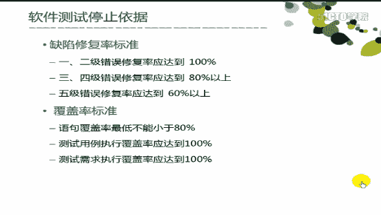

# 华为 2017 秋招测试工程师笔试试卷

## 1

软件测试的目的是尽可能多的找出软件的错误。请判断这句话的正确与否。

正确答案: A   你的答案: 空 (错误)

```cpp
T
```

```cpp
F
```

本题知识点

软件测试 腾讯

讨论

[gxynikita](https://www.nowcoder.com/profile/910946)

选 A

```cpp
1、测试的目的是为
```

  查看全部)

编辑于 2015-02-04 11:32:55

* * *

[欢欢咯](https://www.nowcoder.com/profile/9505217)

软件测试是为了保证软件质量，不是以发现 bug 为目的进行测试

发表于 2017-08-27 23:40:46

* * *

[牛客 691576 号](https://www.nowcoder.com/profile/691576)

我认为软件测试的目的是尽可能多的发现软件缺陷，并确保其得以修复；我觉得上述题目的描述并不全面，所以选择了 B；

发表于 2016-03-14 11:27:36

* * *

## 2

Beta 测试是验收测试的一种。请判断这句话的正确与否。

正确答案: A   你的答案: 空 (错误)

```cpp
T
```

```cpp
F
```

本题知识点

软件测试 腾讯

讨论

[gxynikita](https://www.nowcoder.com/profile/910946)

选 A。Beta 测试是一  查看全部)

编辑于 2015-02-04 11:34:45

* * *

[你岸 0417](https://www.nowcoder.com/profile/373612)

     Beta 测试是一种验收测试。所谓验收测试是软件产品完成了功能测试和系统测试之后，在产品发布之前所进行的软件测试活动，它是技术测试的最后一个阶段，通过了验收测试，产品就会进入发布阶段。验收测试一般根据产品规格说明书严格检查产品，逐行逐字地对照说明书上对软件产品所做出的各方面要求， 确保所开发的软件产品符合用户的各项要求。 通过综合测试之后，软件已完全组装起来，接口方面的错误也已排除，软件测试的最后一步——验收测试即可开始。验收测试应检查软件能否按合同要求进行工作，即是否满足软件需求说明书中的确认标准。

验收测试是部署软件之前的最后一个测试操作。在软件产品完成了 [单元测试](http://baike.baidu.com/view/106237.htm) 、 [集成测试](http://baike.baidu.com/view/106652.htm) 和 [系统测试](http://baike.baidu.com/view/170112.htm) 之后，产品发布之前所进行的 [软件测试](http://baike.baidu.com/view/16563.htm) 活动。它是技术测试的最后一个阶段，也称为 [交付测试](http://baike.baidu.com/view/15018974.htm) 。验收测试的目的是确保软件准备就绪，并且可以让最终用户将其用于执行软件的既定功能和任务。

验收测试是向未来的用户表明系统能够像预定要求那样工作。经 [集成测试](http://baike.baidu.com/view/106652.htm) 后，已经按照设计把所有的模块组装成一个完整的 [软件系统](http://baike.baidu.com/view/8343.htm) ，接口错误也已经基本排除了，接着就应该进一步验证软件的有效性，这就是验收测试的任务，即软件的功能和性能如同用户所合理期待的那样。

发表于 2016-04-01 22:34:22

* * *

[天凤](https://www.nowcoder.com/profile/1645455)

Beta 测试是验收测试的一种。α测试是指软件开发公司组织内部人员模拟各类用户行对即将面市软件产品（称为α版本）进行测试，试图发现错误并修正。α测试的关键在于尽可能逼真地模拟实际运行环境和用户对软件产品的操作并尽最大努力涵盖所有可能的 用户操作方式。经过α测试调整的软件产品称为β版本。β测试是软件的多个用户在一个或多个用户的实际使用环境下进行的测试。开发者通常不在测试现场，Beta 测试不能由程序员或测试员完成。

发表于 2017-09-01 21:38:13

* * *

## 3

验收测试是由最终用户来实施的。请判断这句话的正确与否。

正确答案: B   你的答案: 空 (错误)

```cpp
T
```

```cpp
F
```

本题知识点

软件测试 腾讯

讨论

[gxynikita](https://www.nowcoder.com/profile/910946)

选 B。Acceptan  查看全部)

编辑于 2015-01-07 21:00:18

* * *

[小鸡炖蘑菇 YA](https://www.nowcoder.com/profile/265612)

二楼回复有错吧~~~验收测试有 alpha 和 beta 两种，且都由用户来实施，区别在于是否为最终用户 alpha 测试是由一个用户在开发环境下进行的测试，也可以是公司内部用户在模拟实际操作环境进行的受控测试 beta 测试是由软件的多个用户在一个或多个实际使用环境下进行的测试

发表于 2015-09-09 14:23:34

* * *

[じ☆veRunning](https://www.nowcoder.com/profile/807066298)

验收测试是在功能测试和系统测试之后进行的，所以验收测试的前提条件是系统或软件产品已通过了内部测试。然后和用户一起验收软件，在真实环境下运行软件，看是否存在与用户需求不一致的问题或违背产品规格书的要求。由于测试人员不可能完全用户实际使用情况，所以软件是否真正满足最终用户的要求，应由用户进行一系列的验收测试。

（1）验收测试定义：

检查软件是否符合合同要求，包括需求规格说明、设计规格说明和用户手册等。

（2）测试内容：

易用性测试（用户界面和可用性测试）
兼容性测试（软件兼容性测试、数据共享兼容性测试、硬件兼容性测试）
安装测试和可恢复性测试
文档测试（如用户手册、操作手册）

（3）测试人员：
用户和测试部门共同完成

（4）测试依据：
国家规范、行业标准、合同条款、用户确认的需求规格说明书。

（5）α，β测试
α测试是指软件开发公司组织内部人员模拟各类用户行对即将面市软件产品（称为α版本）进行测试，试图发现错误并修正。
经过α测试调整的软件产品称为β版本。紧随其后的β测试是指软件开发公司组织各方面的典型用户在日常工作中实际使用β版本，并要求用户报告异常情况、提出批评意见。然后软件开发公司再对β版本进行改错和完善。

（6）用户界面测试的要素：

上面纯粹是理论，这里用一个具体的测试直观地看待验收测试。下面是用户界面测试的要素：

符合标准和规范：良好的用户界面应该遵守操作系统的界面标准，比如在 windows 系统中，出现红色叉号对话框意味着严重警告或错误。
直观性：这里有一个直观地例子（[www.jaspermorrison.com/](http://www.jaspermorrison.com/)），其中的链接或功能都是通过直观地图形展示给用户的。一致性
灵活性
舒适性
正确性
实用性

（7）向前和向后兼容：
向后兼容是指可以使用以前版本的软件，而向前兼容是指可以使用未来版本的软件。如 word2003 能向后兼容以前的 word2000 甚至 MS-DOS 下的字处理软件的所有版本的文件格式。而向前兼容指 windows XP 能否运行将来的 word 2007，或者说 word 2003 能否打开 word 2007 文件。

（8）文档测试的重要性：
软件文档是软件的重要组成部分，文档错误也是软件缺陷。
错误的解释可能会引导用户无法完成某些软件已有的功能。
用户通过文档可以掌握具体的使用方法，提高了易用性。
原文：[`blog.csdn.net/bluecloudmatrix/article/details/32081673`](https://blog.csdn.net/bluecloudmatrix/article/details/32081673) 

发表于 2018-10-19 14:52:27

* * *

## 4

项目立项前测试人员不需要提交任何工件。请判断这句话的正确与否。

正确答案: A   你的答案: 空 (错误)

```cpp
T
```

```cpp
F
```

本题知识点

软件测试 腾讯

讨论

[gxynikita](https://www.nowcoder.com/profile/910946)

选 A。工件是加工过程中  查看全部)

编辑于 2015-02-04 11:35:06

* * *

[╮](https://www.nowcoder.com/profile/8612104)

项目立项前还没有决定好，所以不需要测试人员提供任何报告

发表于 2017-04-01 14:39:49

* * *

[你岸 0417](https://www.nowcoder.com/profile/373612)

工件是加工过程中的生产对象。项目立项前，测试人员是不需要提供任何工件的。

发表于 2016-04-01 23:17:27

* * *

## 5

代码评审是检查源代码是否达到模块设计的要求。请判断这句话的正确与否。

正确答案: B   你的答案: 空 (错误)

```cpp
T
```

```cpp
F
```

本题知识点

软件工程 腾讯

讨论

[单程车票](https://www.nowcoder.com/profile/384290)

Ｂ代码评审不只是检查模  查看全部)

编辑于 2015-02-04 11:32:20

* * *

[RichardD](https://www.nowcoder.com/profile/7876308)

评

代码评审不负责检查功能、逻辑是否正确，这些要靠[单元测试](https://baike.baidu.com/item/%E5%8D%95%E5%85%83%E6%B5%8B%E8%AF%95)和 QA 工作来解决。
代码评审内容：编码规范问题：命名不规范、magic number、 System.out……代码结构问题：重复代码、巨大的方法和类、分层不当、[紧耦合](https://baike.baidu.com/item/%E7%B4%A7%E8%80%A6%E5%90%88)工具、框架使用不当：Spring、Hibernate、AJAX 实现问题：错误验证、[异常处理](https://baike.baidu.com/item/%E5%BC%82%E5%B8%B8%E5%A4%84%E7%90%86)、[事务](https://baike.baidu.com/item/%E4%BA%8B%E5%8A%A1)划分、[线程](https://baike.baidu.com/item/%E7%BA%BF%E7%A8%8B)、性能、安全、实现过于复杂、代码可读性不佳、扩展性不好测试问题：[测试覆盖](https://baike.baidu.com/item/%E6%B5%8B%E8%AF%95%E8%A6%86%E7%9B%96)度不够、[可测试性](https://baike.baidu.com/item/%E5%8F%AF%E6%B5%8B%E8%AF%95%E6%80%A7)不好

发表于 2018-10-09 18:11:57

* * *

[牛客 478347 号](https://www.nowcoder.com/profile/478347)

代码评审也称代码复查，是指通过阅读代码来检查源代码与编码标准的符合性以及代码质量的活动。

发表于 2015-11-03 18:47:41

* * *

## 6

自底向上集成需要测试员编写驱动程序。请判断这句话的正确与否。

正确答案: A   你的答案: 空 (错误)

```cpp
T
```

```cpp
F
```

本题知识点

软件测试 腾讯

讨论

[牛客-007](https://www.nowcoder.com/profile/394118)

答案：A 自底向上测试是  查看全部)

编辑于 2015-02-04 11:30:46

* * *

[50 位呵呵](https://www.nowcoder.com/profile/1518731)

  自底向上集成是从最低层的模块开始集成,因测试到较高层模块时,所需求的下层模块功能均已具备,所以不再需要桩模块,测试用例的设计也相对简单,缺点是程序最后一个查勘块加入时才具有整体形象.

  自底向上集成测试的步骤为:
1.把低层模块组织成实现某个子功能的模块群;
2.开发一个测试驱动模块,控制测试数据的输入和测试结果的输出;
3.对每个模块群进行测试;
4.删除测试使用的驱动模块,用较高层模块把模块群组织成为完成更大功能的新模块群.

发表于 2016-08-22 20:43:43

* * *

[藤和艾莉欧。](https://www.nowcoder.com/profile/134888353)

**1、自顶向下**的集成是从主控模块（主程序，即根结点）开始，按照系统程序结构，沿着控制层次从上而下，逐渐将各模块组装起来。在从上向下的集成测试过程中，需对那些未经集成的模块开发**桩模块**。在集成过程中，可以采用宽度优先或深度优先的策略向下推进。
**优点**：较早地验证了主要控制和判断点；           按深度优先可以首先实现和验证一个完整的软件功能；           功能较早证实，带来信心；           只需一个驱动，减少驱动器开发的费用；支持故障隔离。**缺点**：柱的开发量大；底层验证被推迟；          底层组件测试不充分。**适用于**产品控制结构比较清晰和稳定；高层接口变化较小；底层接口未定义或经常可能被修改；产口控制组件具有较大的技术风险，需要尽早被验证；希望尽早能看到产品的系统功能行为。
**2、自底向上**的集成是从最底层模块（即叶子结点）开始，按照调用图的结构，从下而上，逐层将各模块组装起来。在从下而上的集成测试环境中，需对那些未经集成测试的模块开发驱动模块。**优点**：对底层组件行为较早验证；          工作最初可以并行集成，比自顶向下效率高；          减少了桩的工作量；          支持故障隔离。**缺点**：驱动的开发工作量大；           对高层的验证被推迟，设计上的错误不能被及时发现。**适用于**底层接口比较稳定；高层接口变化比较频繁；底层组件较早被完成。

发表于 2019-07-25 16:41:40

* * *

## 7

负载测试是验证要检验的系统的能力最高能达到什么程度。请判断这句话的正确与否。

正确答案: A   你的答案: 空 (错误)

```cpp
T
```

```cpp
F
```

本题知识点

软件测试 腾讯

讨论

[飞鸟 0707](https://www.nowcoder.com/profile/244055)

负载测试的目标是确定并确保系统在超出最大预期工作量的情况下仍能正常运行

发表于 2015-08-26 10:11:20

* * *

[牛客 923242 号](https://www.nowcoder.com/profile/923242)

系统的最高能力是压力测试，而负载测试是在超荷情况下的性能测试

发表于 2016-03-18 09:42:54

* * *

[牛客 824152579 号](https://www.nowcoder.com/profile/824152579)

选对的但看了讨论，却越来越晕，索性说下我的理解呢，求指正： 负载测试就是测车子在装了东西的情况下跑得怎么样，压力测试就是测车子超载的情况下跑得怎么样，性能测试就是测车子最多能装多少东西跑。

编辑于 2019-12-23 11:01:42

* * *

## 8

测试人员要坚持原则，缺陷未修复完坚决不予通过。请判断这句话的正确与否。

正确答案: B   你的答案: 空 (错误)

```cpp
T
```

```cpp
F
```

本题知识点

软件测试 腾讯

讨论

[小妖 _Pixy](https://www.nowcoder.com/profile/432146)

B 缺陷分两种：1  查看全部)

编辑于 2016-10-04 00:25:29

* * *

[En.Perfunctory.](https://www.nowcoder.com/profile/119642177)

本小白觉得此题应放入面试题中而不应在笔试题中。

发表于 2018-09-08 21:17:56

* * *

[ygzn 朱雀](https://www.nowcoder.com/profile/848297)

缺陷是否修复是需要听取测试人员的意见，但测试人员的意见非决定性。所以还是要看一个企业赋予测试人员有多大的权力。错

发表于 2016-10-04 19:37:56

* * *

## 9

代码评审员一般由测试员担任，请判断这句话的正确与否。

正确答案: B   你的答案: 空 (错误)

```cpp
T
```

```cpp
F
```

本题知识点

软件测试 腾讯

讨论

[eagle](https://www.nowcoder.com/profile/603476)

B 一般都是开发人  查看全部)

编辑于 2015-01-07 20:49:03

* * *

[yangu1992](https://www.nowcoder.com/profile/456894)

代码评审的内容：编码规范问题：命名不规范、magic number、 System.out……代码结构问题：重复代码、巨大的方法和类、分层不当、紧耦合工具、框架使用不当：Spring、Hibernate、AJAX 实现问题：错误验证、异常处理、事务划分、线程、性能、安全、实现过于复杂、代码可读性不佳、扩展性不好测试问题：测试覆盖度不够、可测试性不好代码评审不负责检查功能、逻辑是否正确，这些要靠单元测试和 QA 工作来解决

发表于 2015-09-07 21:24:37

* * *

[Zoey11](https://www.nowcoder.com/profile/1421512)

代码评审的工作，测试人员大多对代码熟悉度和理解度不够高，这一项工作更倾向于同组的其他开发人员担任，效果更佳

发表于 2016-09-04 11:55:38

* * *

## 10

软件验收测试的合格通过准则是：

正确答案: A B C D   你的答案: 空 (错误)

```cpp
软件需求分析说明书中定义的所有功能已全部实现，性能指标全部达到要求。
```

```cpp
所有测试项没有残余一级、二级和三级错误。
```

```cpp
立项审批表、需求分析文档、设计文档和编码实现一致。
```

```cpp
验收测试工件齐全。
```

本题知识点

软件测试 腾讯

讨论

[新雪兰](https://www.nowcoder.com/profile/465030)

在公司的要求就只是是 p1 和 p2 级的 bug 必须修复呀

发表于 2015-11-07 08:57:54

* * *

[你正年轻](https://www.nowcoder.com/profile/968362)

ABCD

```cpp
1、软件需求分析说明书中定义的所有功能已全部实现，性能指标全部达到要求。    
2、所有测试项没有残余的一级二级三级的错误。   
3、立项审批表、需求分析文档、设计文档和编码实现一致。 
4、验收测试工件齐全（测试计划，测试用例，测试日志，测试通知单，测试分析报告）
```

发表于 2015-03-31 13:16:15

* * *

[停停走走 _123](https://www.nowcoder.com/profile/424739)

 为啥我看到的是这样的

发表于 2015-08-29 16:59:19

* * *

## 11

软件测试计划评审会需要哪些人员参加？

正确答案: A B C D   你的答案: 空 (错误)

```cpp
项目经理
```

```cpp
SQA 负责人
```

```cpp
配置负责人
```

```cpp
测试组
```

本题知识点

软件测试 腾讯

讨论

[gxynikita](https://www.nowcoder.com/profile/910946)

选 ABCD。软件测试计  查看全部)

编辑于 2015-01-07 21:20:00

* * *

[公众号:重温新知](https://www.nowcoder.com/profile/126819)

软件质量保证（SQA-Software Quality Assurance）是建立一套有计划，有系统的方法，来向管理层保证拟定出的标准、步骤、实践和方法能够正确地被所有项目所采用。

发表于 2017-01-24 14:00:38

* * *

[披着虎皮的喵](https://www.nowcoder.com/profile/101106109)

测试组，这一项有些误导。可以理解为测试人员，也可以理解为测试经理。而测试人员，是不需要参加测试计划的评审的。

发表于 2019-03-04 08:35:45

* * *

## 12

测试设计员的职责有哪些？

正确答案: B C   你的答案: 空 (错误)

```cpp
制定测试计划
```

```cpp
设计测试用例
```

```cpp
设计测试过程、脚本
```

```cpp
评估测试活动
```

本题知识点

软件测试 腾讯

讨论

[gxynikita](https://www.nowcoder.com/profile/910946)

选 BC。测试设计人员主  查看全部)

编辑于 2015-02-04 11:21:13

* * *

[蜕变与成长](https://www.nowcoder.com/profile/415646)

*   制定测试计划应是测试经理来做的，评估测试活动测试经理组织召集开发和测试的相关人员来做

发表于 2015-04-21 20:47:53

* * *

[Amour1018](https://www.nowcoder.com/profile/306342)

制定测试计划是测试经理来做的；评估测试活动是测试经理组织开发人员来进行的。

发表于 2015-09-22 20:05:35

* * *

## 13

软件实施活动的进入准则是哪些？

正确答案: A B C   你的答案: 空 (错误)

```cpp
需求工件已经被基线化
```

```cpp
详细设计工件已经被基线化
```

```cpp
构架工件已经被基线化
```

```cpp
项目阶段成果已经被基线化
```

本题知识点

软件工程 腾讯

讨论

[被杨超越附体了](https://www.nowcoder.com/profile/240229443)

```cpp
项目阶段成果是已经有阶段性成果了，所以是正在对软件实施活动，而不是进入
```

发表于 2018-10-18 10:22:32

* * *

[金陵广陵姑苏余杭](https://www.nowcoder.com/profile/403184)

软件实施活动的进入准则:A．需求工件已经被基线化 B．详细设计工件已经被基线化 C．构架工件已经被基线化

发表于 2015-11-01 10:14:11

* * *

[妞妞加油](https://www.nowcoder.com/profile/401965)

项目阶段成果，可以包含软件实施阶段，不好判断

发表于 2015-09-07 23:56:57

* * *