# 字节跳动 2017 秋招开发工程师笔试试卷

## 1

变量 a 是一个 64 位有符号的整数，初始值用 16 进制表示为：0x7FFFFFFFFFFFFFFF;变量 b 是一个 64 位有符号的整数，初始值用 16 进制表示为：0x8000000000000000。则 a+b 的结果用 10 进制表示为多少？

正确答案: B   你的答案: 空 (错误)

```cpp
1
```

```cpp
-1
```

```cpp
2⁶³+2⁶²+…+2²+2¹+2⁰
```

```cpp
–(2⁶³+2⁶²+…+2²+2¹+2⁰)
```

本题知识点

编译和体系结构

讨论

[revivedSuN](https://www.nowcoder.com/profile/141075)

0x7FFFFFFFFFFFF  查看全部)

编辑于 2017-05-23 18:19:57

* * *

[别拿青椒不当菜](https://www.nowcoder.com/profile/4350942)

（1）a+b 的 16 进制表示为：OxFFFFFFFFFFFFFFF（16 位 F），转为 2 进制为 111……111（64 位 1，每个 F->4 位 2）。（2）有符号数：是针对二进制来讲的。用最高位作为符号位，“0”代表“+”，“1”代表“-”。所以 a+b 的结果是一个负数。（3）计算机中负数是以补码的形式保存的，将补码转换成原码的计算方式如下：        ①. 对于正数，原码与补码相同。
        ②.对于负数，将补码除符号位之外，按位取反，末位加 1，即得到原码。
（4）a + b = 111……111（64 位 1）          取反：100……000（1 位 1，后面 63 位 0）          加一：100……00（中间 62 位 0）      10 进制：-1。

发表于 2017-05-09 10:51:16

* * *

[蔡蔡蔡蔡姬丶](https://www.nowcoder.com/profile/5671733)

感觉三位同学说的不太清晰，我来补充清晰版的，有问题欢迎指正。a+b=0xFFFFFFFFFFFFFFFF，十六进制的 F 对应十进制的 15，再转换成二进制则为 1111。所以 a+b 得 1111 1111 1111 1111，二进制的首尾为符号位，1 位负数，0 则为正数，这里为 1 所以 a+b 的结果是负数。负数在内存中存储以补码的形式，所以求原码的步骤为：1.补码-1 得反码（变为 1111 1111 1111 1110）2.反码按位取反得原码（1000 0000 0000 0001）3.转换成二进制结果为-1 这道题我也做错了 QAQ

编辑于 2018-08-29 21:12:13

* * *

## 2

TCP 建立连接的三次握手中，第二次握手发送的包会包含的标记，最正确的描述是？

正确答案: B   你的答案: 空 (错误)

```cpp
ACK
```

```cpp
SYN,ACK
```

```cpp
SYN,PSH
```

```cpp
SYN
```

本题知识点

网络基础

讨论

[sniperlife](https://www.nowcoder.com/profile/6551980)

附上 tcp 建立连接的三次握手过程图（第二次握手包含的标记是 SYN，ACK），所以选 B：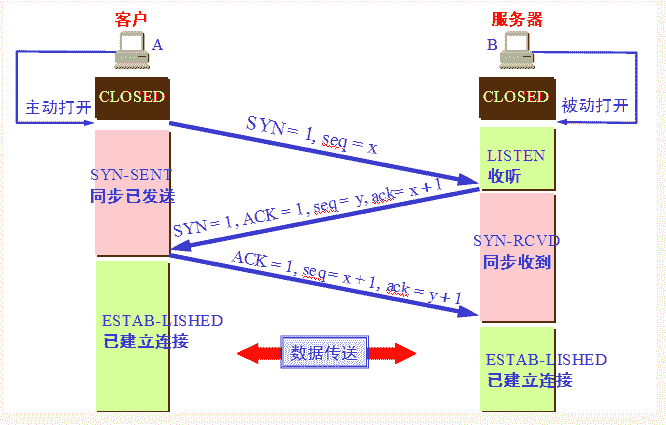

发表于 2017-01-27 20:34:59

* * *

[牛牛和多多](https://www.nowcoder.com/profile/345501966)

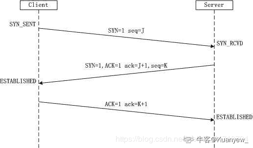
第一次握手：Client 将 SYN（同步序列编号 Synchronize Sequence Numbers）置 1，随机产生一个初始序列号 seq 发送给 Server，进入 SYN_SENT 状态；第二次握手：Server 收到 Client 的 SYN=1 之后，知道客户端请求建立连接，将自己的 SYN 置 1，ACK（确认字符 Acknowledge Character）置 1，产生一个 acknowledge number=sequence number+1，并随机产生一个自己的初始序列号，发送给客户端；进入 SYN_RCVD 状态；
第三次握手：客户端检查 acknowledge number 是否为序列号+1，ACK 是否为 1，检查正确之后将自己的 ACK 置为 1，产生一个 acknowledge number=服务器发的序列号+1，发送给服务器；进入 ESTABLISHED 状态；服务器检查 ACK 为 1 和 acknowledge number 为序列号+1 之后，也进入 ESTABLISHED 状态；完成三次握手，连接建立。

发表于 2020-06-22 14:47:46

* * *

[牛客 504357922 号](https://www.nowcoder.com/profile/504357922)

1） TCP 的三次握手：  ① client:  SYN=1, seq=J  ----->  SYN_SENT;  ② serve: SYN=1,ACK=1,ack=J+1,seq=K -----> SYN_RCVD  ③ client: ACK=1,seq=K+1 ----->ESTABLISHED       serve: ------>ESTABLISHED

发表于 2022-01-08 11:53:07

* * *

## 3

栈是先进后出的数据结构。给定一个大小为 3 的初始状态为空的栈，已知一组数据经过这个栈后，最终的数据顺序依次为：1 3 2 4 ，问原始的进栈数据不可能是以下的那组?

正确答案: C   你的答案: 空 (错误)

```cpp
2 3 1 4
```

```cpp
1 4 2 3
```

```cpp
4 2 3 1
```

```cpp
3 1 2 4
```

本题知识点

栈 *讨论

[zzchan](https://www.nowcoder.com/profile/146127)

注意栈的大小为 3

发表于 2017-04-18 11:23:05

* * *

[blackwidow](https://www.nowcoder.com/profile/8157021)

快一点解决的话，可以看输出里面第一个数，也就是 1 的位置。因为栈的大小只有 3，所以 1 想第一个出栈的话，它的入栈位置必须保证在前三位。则 C 错

编辑于 2017-03-12 11:52:10

* * *

[带着小板凳写代码](https://www.nowcoder.com/profile/5387280)

有人和我一样没看到栈的大小是 3，直接选的 D 嘛

发表于 2017-08-17 17:33:13

* * *

## 4

电路中其中三个门电路非门，与门，或门的示意图及性质分别如下所示：

非门，使输入的电平编程相反电平：

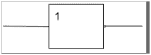 

与门，使输入两个高电平，输出高电平，其他情况下输出低电平：

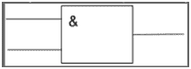 

或门。当且仅当输入两个低电平时，输出低电平，否则输出高电平：

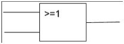 

现在对以下的电路中的 A 和 B 引脚分别持续输入一个高电平（ 1 ）和一个低电平（ 0 ），问最终电路的引脚 C 、 D 、 E 、 F 分别输出的电平是什么？

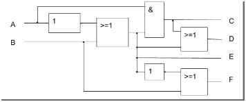 

正确答案: D   你的答案: 空 (错误)

```cpp
C=0,D=1,E=0,F=1
```

```cpp
C=1,D=1,E=1,F=0
```

```cpp
C=1,D=1,E=0,F=1
```

```cpp
C=0,D=0,E=0,F=1
```

本题知识点

判断推理

讨论

[丨太阳与月亮丨](https://www.nowcoder.com/profile/9415270)

D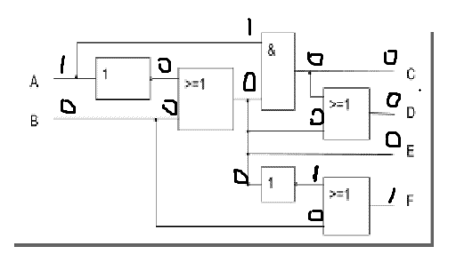

发表于 2017-01-27 14:39:22

* * *

[南亭·琴瑟](https://www.nowcoder.com/profile/739114151)

0001

发表于 2021-07-11 19:10:00

* * *

[elonkou](https://www.nowcoder.com/profile/6320011)

0001

发表于 2016-12-05 20:37:18

* * *

## 5

下面这个 C++ 进程运行时，描述正确的是（） ```cpp
#include <iostream>
using namespace std;
int a = 1;
const char* str = "abc";
class Obj {};
int f(int lhs, int rhs) {
    Obj* obj = new Obj();
    Obj obj2;
    int aa = a;
    delete obj;
    return aa + lhs + rhs;
}

int main() {
    int *b = new int(2);
    int c = f(a, *b);
    delete b;
    return 0;
}
``` 

正确答案: A   你的答案: 空 (错误)

```cpp
保存在堆中的数据有：*b,*obj;保存在栈中的数据有：c,lhs,rhs,obj2,aa
```

```cpp
保存在堆中的数据有：*b,*obj;保存在栈中的数据有：str,c,lhs,rhs,obj2,aa
```

```cpp
保存在堆中的数据有：*b,*obj2;保存在栈中的数据有：c,lhs,rhs,obj,aa
```

```cpp
保存在堆中的数据有：*b,*obj,*str;保存在栈中的数据有：c,lhs,rhs, aa
```

本题知识点

C++

讨论

[琉璃の璀璨](https://www.nowcoder.com/profile/8782996)

在 C++中，内存分成 5 个区，他们分别是堆、栈、自由存储区、全局/静态 存储区和常量存储区。       

栈，就是那些由编译器在需要的时候分配，在不需要的时候自动清楚的变量 的存储区。里面的变量通常是局部变量、函数参数等。      

**堆，就是那些由 new 分配的内存块**，他们的释放编译器不去管，由我们的应 用程序去控制，一般一个 new 就要对应一个 delete。如果程序员没有释放掉， 那么在程序结束后，操作系统会自动回收。      

自由存储区，就是那些由 malloc 等分配的内存块，他和堆是十分相似的， 不过它是用 free 来结束自己的生命的。      

全局/静态存储区，全局变量和静态变量被分配到同一块内存中，在以前的 C 语言中，全局变量又分为初始化的和未初始化的（初始化的全局变量和静态变 量在一块区域，未初始化的全局变量与静态变量在相邻的另一块区域，同时未被 初始化的对象存储区可以通过 void*来访问和操纵，程序结束后由系统自行释 放），在 C++里面没有这个区分了，他们共同占用同一块内存区。      

常量存储区，这是一块比较特殊的存储区，他们里面存放的是常量，不允许 修改（当然，你要通过非正当手段也可以修改，而且方法很多）

编辑于 2017-07-26 16:27:02

* * *

[joeyu](https://www.nowcoder.com/profile/3854179)

a 是全局变量，放在全局区*str 是常量字符串放在文字常量区，str 指针放在全局区*b 和*obj 对象都是 new 出来的，放在堆区,指针 b 和 obj 放在栈区 c,obj2,aa 是局部变量，lhs 和 rhs 是函数参数值，都放在栈区

编辑于 2017-07-29 19:29:35

* * *

[走走 22](https://www.nowcoder.com/profile/2736242)

一个由 c/C++编译的程序占用的内存分为以下几个部分 1、栈区（stack）— 程序运行时由编译器自动分配，存放函数的参数值，局部变量的值等。其操作方式类似于数据结构中的栈。程序结束时由编译器自动释放。 2、堆区（heap） — 在内存开辟另一块存储区域。一般由程序员分配释放， 若程序员不释放，程序结束时可能由 OS 回收 。注意它与数据结构中的堆是两回事。用 malloc, calloc, realloc 等分配内存的函数分配得到的就是在堆上 3、全局区（静态区）（static）—编译器编译时即分配内存。全局变量和静态变量的存储是放在一块的。对于 C 语言初始化的全局变量和静态变量在一块区域.data， 未初始化的全局变量和未初始化的静态变量在相邻的另一块区域.bss。而 C++则没有这个区别 - 程序结束后由系统释放 4、文字常量区 —常量字符串就是放在这里的。 程序结束后由系统释放 5、程序代码区—存放函数体的二进制代码。

编辑于 2017-12-06 16:24:05

* * *

## 6

操作系统中可以使用 LRU(least recently used)内存淘汰旧数据的策略，如果内存需要加载新数据但空间又不足，则会按照最近访问时间进行排序，并将最老的数据淘汰，假设现在内存空间大小为 5，原本内存中没有数据，对内存中数据的访问顺序如下： 1,2,5,3,4,6,1,4,3,6,7,8,3,9

正确答案: C   你的答案: 空 (错误)

```cpp
缺页次数：9
```

```cpp
缺页次数：4
```

```cpp
缺页次数：10
```

```cpp
缺页次数：5
```

本题知识点

操作系统

讨论

[小水 vv](https://www.nowcoder.com/profile/6119589)

第一次读满数据 1，2，5，3，4

读取 6 为新数据 ，淘汰 1 数据序列为 2，5，3，4，6 ————第一次缺页

读取 1 为新数据 ，淘汰 2 数据序列为 5，3，4，6，1 ————第二次缺页

读取 4 为已有数据 ，注意更新数据序列为 5，3，6，1，4

读取 3 为已有数据 ，注意更新数据序列为 5，6，1，4，3

读取 6 为已有数据 ，注意更新数据序列为 5，1，4，3，6

读取 7 为新数据 ，淘汰 5 数据序列为 1，4，3，6，7 ————第三次缺页

读取 8 为新数据 ，淘汰 1 数据序列为 4，3，6，7，8 ————第四次缺页

读取 3 为已有数据 ，注意更新数据序列为  4，6，7，8，3

读取 9 为新数据 ，淘汰 4 数据序列为 6，7，8，3，9 ————第五次缺页

原本内存中没有数据，直到读满数据，每一次读取数据都是缺页，共五次

加上后续的 5 次缺页，共十次。

发表于 2018-06-08 11:17:42

* * *

[aiainui_jr](https://www.nowcoder.com/profile/7470857)

直接命中的次数为 4 次，缺页 10 次，下面为调用的过程：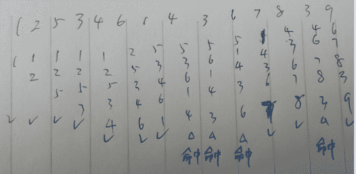

发表于 2017-03-01 12:55:02

* * *

[一只老风铃](https://www.nowcoder.com/profile/9973952)

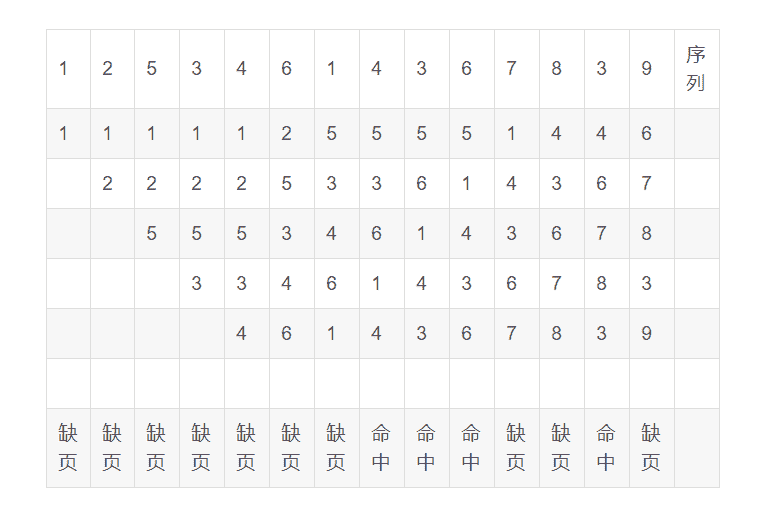            共 10 次缺页

发表于 2019-03-05 12:29:07

* * *

## 7

下面的程序中， int32-t 表示一个有符号的 32 位整数，程序的入口是 main 函数，问最终 res 的结果是多少？ ```cpp
#include <stdint.h>
#include <stdio.h>
int32_t f(int32_t a, int32_t b) {
	while (a + b > 0) {
		a = a + 1;
		b = b - 1;
	}
	return a + b;
}
int32_t main() {
	int32_t res = f(1, 0);
	return 0;
}
``` 

正确答案: D   你的答案: 空 (错误)

```cpp
–(2³¹+2³⁰+…+2²+2¹+2⁰)
```

```cpp
0
```

```cpp
-1
```

```cpp
程序会死循环
```

本题知识点

C 语言

讨论

[TheBestIsYetToCome-](https://www.nowcoder.com/profile/868259)

@ [羽落长安](https://www.nowcoder.com/profile/416341)  的解析不错，以 char 为例
f(1,0):
        a=2  b=-1
        a=3  b=-2
        ......
        a=127 b=-126
        a=128 b=-127  溢出-->a=-128 b=-127     char 范围:-128~127       
 return a+b:-128-127 实际上是 1(char 范围)，继续循环而原例为 int_32t,临界情况 a+b:      -2³²+(-2³²+1)=1,也继续循环。因此死循环。

发表于 2017-02-18 13:27:13

* * *

[观赏](https://www.nowcoder.com/profile/5302027)

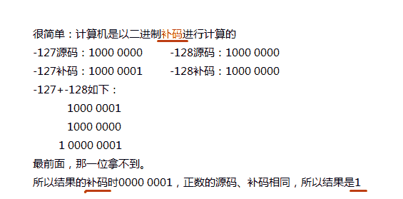

发表于 2017-08-16 00:51:44

* * *

[羽落长安](https://www.nowcoder.com/profile/416341)

这题是不是有问题???
感觉答案是 1:
将题目中的 int32 改为 char 分析:
f(1,0):
        a=2  b=-1
        a=3  b=-2
        ......
        a=127 b=-126
        a=128 b=-127  溢出-->a=-128 b=-127     char 范围:-128~127      
 return a+b:-128-127 实际上是 1(char 范围)   
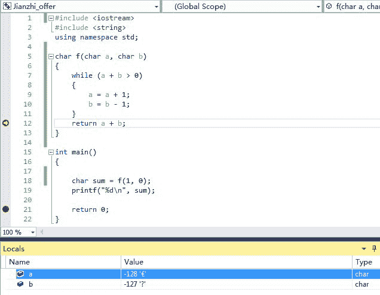
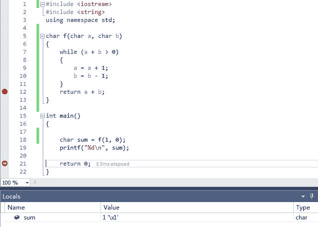

发表于 2017-01-17 10:35:50

* * *

## 8

给定一个如下所示的图，图中的边代表了两个节点间的距离。如果使用迪杰斯特拉算法对节点 1 和节点 8 求最短路径，则当完成计算时，算得节点 1 到节点 8 的最短路径是？同时当完成节点 1 到节点 8 的最短路径计算时，节点 1 到哪些节点（除了 1 和 8 ）的最短路径也已经计算完毕？（　）

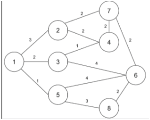 

正确答案: C   你的答案: 空 (错误)

```cpp
最短路径：７；已经算得最短路的节点：３，５，６
```

```cpp
最短路径：４；已经算得最短路的节点：５
```

```cpp
最短路径：４；已经算得最短路的节点：２，３，５，４
```

```cpp
最短路径：４；已经算得最短路的节点：５，６
```

本题知识点

图

讨论

[学不会的 IT 小渣](https://www.nowcoder.com/profile/335026)

初始状态：路径长度 0：（1）路径长度 1：（1,5）路径长度 2：（1,3）路径长度 3：（1,3,4），（1,2）路径长度 4：（1,5,8）节点 1 到 8 的最短路径长度为 4；     2，3,4,5 节点的最短路径已经计算完毕；   其中到 5 节点的最短路径最小为 1；应该选 C，感觉出题人玩文字游戏把自己绕进去了

编辑于 2017-07-22 10:54:56

* * *

[捧碗](https://www.nowcoder.com/profile/3333874)

由迪杰特斯拉算法的步骤可以得出 d[ ]变化为： ｛1｝ ｛1，5｝ ｛1，5，3｝ ｛1，5，3，2｝ ｛1，5，3，2，4｝ ｛1，5，3，2，4，8｝

发表于 2018-04-12 17:22:09

* * *

[跪求靠谱 offer](https://www.nowcoder.com/profile/2536333)

2,3,4,5,6 都求出了最短把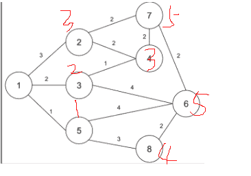

发表于 2017-08-17 22:08:26

* * *

## 9

x86 CPU 在实模式下解释代码时看到一个地址为 2330H:5041H,请问它最终在内存中要找的地址是多少？

正确答案: A   你的答案: 空 (错误)

```cpp
28341H
```

```cpp
5374H
```

```cpp
52740H
```

```cpp
7371H
```

本题知识点

编译和体系结构

讨论

[牛客 504357922 号](https://www.nowcoder.com/profile/504357922)

【01 先说结论】2330H:5041H2330 << 4 + 5041 = 23300 + 5041 = 28341【02 相关知识点】1） **其实左移 n 位，就相当于乘以 2 的 n 次方。**  2 的 4 次方就是 16， 2330H 指的是 0x2330 << 4 = 增加一位，类似 十进制的乘以 10， 所以为 0x233002)实模式工作原理

实模式出现于早期 8088CPU 时期。当时由于 CPU 的性能有限，一共只有 20 位地址线（所以地址空间只有 1MB），以及 8 个 16 位的通用寄存器，以及 4 个 16 位的段寄存器。所以为了能够通过这些 16 位的寄存器去构成 20 位的主存地址，必须采取一种特殊的方式。当某个指令想要访问某个内存地址时，它通常需要用下面的这种格式来表示：

(段基址：段偏移量)

其中第一个字段是段基址，它的值是由段寄存器提供的(一般来说，段寄存器有 6 种，分别为 cs，ds，ss，es，fs，gs，这几种段寄存器都有自己的特殊意义，这里不做介绍)。

第二字段是段内偏移量，代表你要访问的这个内存地址距离这个段基址的偏移。它的值就是由通用寄存器来提供的，所以也是 16 位。那么两个 16 位的值如何组合成一个 20 位的地址呢？CPU 采用的方式是把段寄存器所提供的段基址先向左移 4 位。这样就变成了一个 20 位的值，然后再与段偏移量相加。

即：

物理地址 = 段基址<<4 + 段内偏移

所以假设段寄存器中的值是 0xff00，段偏移量为 0x0110。则这个地址对应的真实物理地址是 0xff00<<4 + 0x0110 = 0xff110。

发表于 2022-01-09 14:31:43

* * *

[xiaoyuyzx](https://www.nowcoder.com/profile/3793071)

实模式下内存空间的访问
8086 处理器（CPU）内的寄存器都是 16 位的，地址线上的地址由 CPU 提供。CPU 用两个 16 位的值合成一个 20 位的值：将一个 16 位的值乘以 16（相当于这个 16 位的值保存在 20 位寄存器的低 16 位中，然后将低 16 位往高位移动了 4 位）再加上另一个 16 位的值。将这个由 2 个 16 位合成的值提供给 20 根地址线作为访问内存的地址值。被乘以 16 的那个值被称为段基址，没有被乘以 16 的那个值被称为偏移地址。

CPU 在实模式下，段寄存器中的值就是段基址，如果想要通过汇编程序访问某个内存单元，那么就需要指定一个段寄存器和一个偏移地址或以“段基址值：偏移地址值”的格式。CPU 会将段寄存器的值乘以 16 再与偏移地址相加后，才将这个结果提供给地址线;用段基址和偏移地址的形式给出的表达式，CPU 也会给段基址乘以 16 与偏移地址相加后，才将这个结果提供给地址线。

Figure 2\. 实模式下访问内存（得出内存地址）的方式

这就是说，在汇编程序中，得用段基址：偏移地址的方式访问内存，因为 CPU 形成内存地址的方式是“段基址* 16 + 偏移地址”。

按照“段：偏移地址”的方式访问内存是 CPU 对内存的一种管理方式

发表于 2017-08-22 10:23:57

* * *

[张飞-⭕nline🚀](https://www.nowcoder.com/profile/2569957)

应该是 A 吧，我记得实模式下的算法是 cs 偏移 4 位(16 进制偏移 1 位)+ip，也就是 2330 0 +5041

发表于 2017-02-26 00:54:45

* * *

## 10

有三个程序Ｊ１，Ｊ２，Ｊ３。程序在单核ＣＰＵ执行时，三个程序需要的资源如下所示：

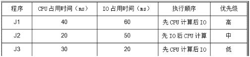 

优先级高的程序可以抢占优先级低的程序的ＣＰＵ，但不能抢占ＩＯ。问当所有任务执行完毕时，共消耗的时间是？

正确答案: D   你的答案: 空 (错误)

```cpp
170ｍｓ
```

```cpp
160ｍｓ
```

```cpp
120ｍｓ
```

```cpp
130ｍｓ
```

本题知识点

操作系统

讨论

[评估未通过](https://www.nowcoder.com/profile/3272421)

D 130ms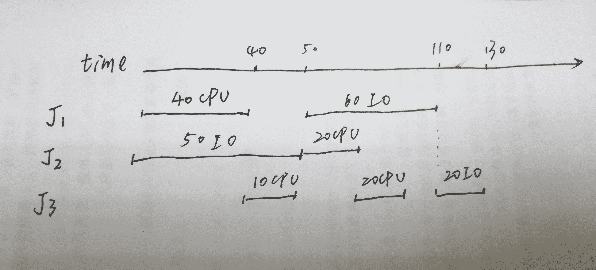

编辑于 2017-05-05 12:00:10

* * *

[NowaCoder](https://www.nowcoder.com/profile/2356667)

更正一下，应该是 130

发表于 2017-02-03 11:22:33

* * *

[networkcpx](https://www.nowcoder.com/profile/246646)

因为优先级高的程序可以抢占优先级低的程序的ＣＰＵ，但不能抢占ＩＯ，所以 J1 在 CPU 之后不能抢占 J2 的 IO，J2 在 IO 之后可以抢占 J3 的 CPU。CPU：J1 40ms + J3 10ms + J2 20ms +J1 20msIO：J2 50ms + J1 60ms + J3 20ms 所以共消耗时间为 130ms，选 D。

发表于 2017-03-03 12:34:22

* * *

## 11

头条客户端内有大量的图片展示需求，比如列表页，文章详情页，图集等，图片 size 大小不等，用户在列表页滑动根据标题或配图寻找自己喜欢的文章，然后点击进入图文详情页或图集，请设计一个图片下载器，满足对于快速加载内容和系统流畅度的需求。

你的答案

本题知识点

Android

讨论

[牛客 8805036 号](https://www.nowcoder.com/profile/8805036)

1.内存缓存 2.磁盘缓存 3.工作线程池，大小可参考机型 cpu 核心数 4.图片处理组件，包括转码、裁剪、翻转等

发表于 2017-10-27 15:01:28

* * *

[牛客 6861221 号](https://www.nowcoder.com/profile/6861221)

异步下载图片，线程池放两三个线程下载即可，下完后缓存到内存

发表于 2017-09-08 12:40:49

* * *

## 12

头条的 2017 校招开始了！为了这次校招，我们组织了一个规模宏大的出题团队，每个出题人都出了一些有趣的题目，而我们现在想把这些题目组合成若干场考试出来，在选题之前，我们对题目进行了盲审，并定出了每道题的难度系统。一场考试包含 3 道开放性题目，假设他们的难度从小到大分别为 a,b,c，我们希望这 3 道题能满足下列条件：
a<=b<=c
b-a<=10
c-b<=10
所有出题人一共出了 n 道开放性题目。现在我们想把这 n 道题分布到若干场考试中（1 场或多场，每道题都必须使用且只能用一次），然而由于上述条件的限制，可能有一些考试没法凑够 3 道题，因此出题人就需要多出一些适当难度的题目来让每场考试都达到要求，然而我们出题已经出得很累了，你能计算出我们最少还需要再出几道题吗？

本题知识点

贪心

讨论

[卷积神经网络哦](https://www.nowcoder.com/profile/8684256)

划窗 O(n) 分支挺多 代码有点乱 3 个一组分 4 种情况 先从小到大排个序 O(nlogn) 下标永远指向第一个数第 1 种： 这三个都满足要求 下标直接+3
第 2 种： 第二个比第一个大超过 20 那么第一个后面添加 2 个数 下标+1
第 3 种：第二个比第一个大超过 10 但不大于 20  中间加 1 个即可 下标+2 第 4 种：第一第二满足 第三个第二个不满足 不管怎样 第二个后面添加 1 个 下标+2 第 3 第 4 可以合并 但是原理不一样

```cpp
#include<iostream>
#include<algorithm>
using namespace std;
const int maxn = 1e5 + 3;
int a[maxn];
int main(){
    int n;
    scanf("%d", &n);
    for(int i = 0; i < n; i++) scanf("%d", &a[i]);
    if(n == 1) printf("%d\n", 2);  
    sort(a, a + n);
    else if(n == 2) {
        if(a[1]-a[0] > 20) printf("%d\n", 4);
        else printf("%d\n", 1);
    }
    else{
        int l = 0, add = 0;
        while(l < n - 2){ 
            if(a[l+1]-a[l] <= 10 && a[l+2] - a[l+1] <= 10) l += 3;
            else if(a[l+1] - a[l] > 20) {add += 2; l += 1;}
            else if(a[l+1]-a[l] <= 20 && a[l+1]-a[l] > 10) {add++;l+=2;}
            else if(a[l+1]-a[l] <= 10 && a[l+2]-a[l+1] > 10) {add++;l+=2;}
            if(l == n - 1) add += 2;
            if(l == n - 2) {
                if(a[l+1]-a[l] > 20) add += 4;
                else add += 1;
            } 
        }
        printf("%d\n", add);
    } 
}
```

编辑于 2018-09-21 12:55:19

* * *

[潇潇古月](https://www.nowcoder.com/profile/7878855)

```cpp
//简单题目，一次搞定
import java.util.Arrays;
import java.util.Scanner;

public class Main {
    public static void main(String[] args) {
        Scanner sc = new Scanner(System.in);
        while (sc.hasNext()) {
            int n = sc.nextInt();
            int[] a = new int[n];
            for (int i = 0; i < n; i++) {
                a[i] = sc.nextInt();
            }
            Arrays.sort(a);
            int t = 1;
            int cnt = 0;
            for (int i = 1; i < n; i++) {
                if(t < 3) {
                    if(a[i] - a[i-1] <= 10)
                        t++;
                    else if(t == 1 && a[i] - a[i-1] <= 20) {
                        cnt ++;
                        t = 3;
                    } else {
                        cnt += 3 - t;
                        t = 1;
                    }
                } else
                    t = 1;
            }
            cnt += 3 - t;
            System.out.println(cnt);
        }
    }
}

```

编辑于 2017-08-02 16:02:03

* * *

[岚の风](https://www.nowcoder.com/profile/646602)

```cpp
//看了好多种 dp 解法。。。感觉好像不太对，对于 10 30 50 这种样例
//或者 21 40 69 77 这种在中间加入一个数的问题，不能正确输出，只是数据太弱了，
//都能通过。
//仔细想了下 1 ≤ di ≤ 100 排序之后间距大于 10 的（input[i]-input[i-1]>10）
//数据，最多只会有 10 个，因此直接暴力+贪心即可，
//每次发现间距大于 10 并且前面那些数不是 3 的整数倍，
//就直接加一个数，显然要加最后那个数+10 的那个数字，
//因为这是最后可能让新加的数可能跟后面的数据重新连接起来的情况，
//然后 extra 计数++，重新排序，重新再看是否符合要求，
//因为前面说的 di 的范围问题，暴力循环即可，不会超时

#include <iostream>
#include <vector>
#include <algorithm>
using namespace std;
int main()
{
    int n;
    while(cin>>n)
    {
        vector<int> input(n,0);
        for(int i=0; i<n; i++)
        {
            cin>>input[i];
        }
        int extra=0;
        while(true)
        {
            sort(input.begin(),input.end());
            bool flag=true;
            int now=1;
            for(int i=1;i<=input.size();++i)
            {
                if( (input[i]-input[i-1]>10 || i==input.size() )&& now%3 )
                {
                    input.insert( input.begin()+i, input[i-1]+10 );
                    extra++;
                    flag=false;
                    break;
                }
                now++;
                now%=3;
            }
            if(flag)
                break;
        }
        cout<<extra<<endl;
    }
    return 0;
}

```

编辑于 2018-05-21 13:03:56

* * *

## 13

给定整数 m 以及 n 各数字 A1,A2,..An，将数列 A 中所有元素两两异或，共能得到 n(n-1)/2 个结果，请求出这些结果中大于 m 的有多少个。

本题知识点

高级结构

讨论

[潇潇古月](https://www.nowcoder.com/profile/7878855)

直接计算肯定是超时的，所以这问题不能使用暴力破解，考虑到从高位到地位，依次进行位运算，如果两个数异或结果在某高位为 1，而 m 的对应位为 0，则肯定任何这两位异或结果为 1 的都会比 m 大。由此，考虑使用字典树（TrieTree）从高位到第位建立字典，再使用每个元素依次去字典中查对应高位异或为 1， 而 m 为 0 的数的个数，相加在除以 2 既是最终的结果；直接贴出代码如下，非原创，欢迎讨论；补充：queryTrieTree 在搜索的过程中，是从高位往低位搜索，那么，如果有一个数与字典中的数异或结果的第 k 位大于 m 的第 k 位，那么该数与对应分支中所有的数异或结果都会大于 m， 否则，就要搜索在第 k 位异或相等的情况下，更低位的异或结果。queryTrieTree 中四个分支的作用分别如下：1\. aDigit=1， mDigit=1 时，字典中第 k 位为 0，异或结果为 1，需要继续搜索更低位，第 k 位为 1，异或结果为 0，小于 mDigit，不用理会；2\. aDigit=0， mDigit=1 时，字典中第 k 位为 1，异或结果为 1，需要继续搜索更低位，第 k 位为 0，异或结果为 0，小于 mDigit，不用理会；3\. aDigit=1， mDigit=0 时，字典中第 k 位为 0，异或结果为 1，与对应分支所有数异或，结果都会大于 m，第 k 位为 1，异或结果为 0，递归获得结果；4\. aDigit=0， mDigit=0 时，字典中第 k 位为 1，异或结果为 1，与对应分支所有数异或，结果都会大于 m，第 k 位为 0，异或结果为 0，递归获得结果；

```cpp
import java.util.Scanner;

public class Main {
    private static class TrieTree {
        TrieTree[] next = new TrieTree[2];
        int count = 1;
    }

    public static void main(String[] args) {
        Scanner sc = new Scanner(System.in);
        while (sc.hasNext()){
            int n = sc.nextInt();
            int m = sc.nextInt();
            int[] a = new int[n];
            for (int i = 0; i < n; i++) {
                a[i] = sc.nextInt();
            }
            System.out.println(solve(a, m));
        }
    }

    private static long solve(int[] a, int m) {
        TrieTree trieTree = buildTrieTree(a);
        long result = 0;
        for (int i = 0; i < a.length; i++) {
            result += queryTrieTree(trieTree, a[i], m, 31);
        }
        return result / 2;
    }

    private static long queryTrieTree(TrieTree trieTree, int a, int m, int index) {
        if(trieTree == null)
            return 0;

        TrieTree current = trieTree;
        for (int i = index; i >= 0; i--) {
            int aDigit = (a >> i) & 1;
            int mDigit = (m >> i) & 1;
            if(aDigit == 1 && mDigit == 1) {
                if(current.next[0] == null)
                    return 0;
                current = current.next[0];
            } else if (aDigit == 0 && mDigit == 1) {
                if(current.next[1] == null)
                    return 0;
                current = current.next[1];
            } else if (aDigit == 1 && mDigit == 0) {
                long p = queryTrieTree(current.next[1], a, m, i - 1);
                long q = current.next[0] == null ? 0 : current.next[0].count;
                return p + q;
            } else if (aDigit == 0 && mDigit == 0) {
                long p = queryTrieTree(current.next[0], a, m, i - 1);
                long q = current.next[1] == null ? 0 : current.next[1].count;
                return p + q;
            }
        }
        return 0;
    }

    private static TrieTree buildTrieTree(int[] a) {
        TrieTree trieTree = new TrieTree();
        for (int i = 0; i < a.length; i++) {
            TrieTree current = trieTree;
            for (int j = 31; j >= 0; j--) {
                int digit = (a[i] >> j) & 1;
                if(current.next[digit] == null) {
                    current.next[digit] = new TrieTree();
                } else {
                    current.next[digit].count ++;
                }
                current = current.next[digit];
            }
        }
        return trieTree;
    }
}
```

编辑于 2017-08-02 17:09:35

* * *

[哇咔哇咔](https://www.nowcoder.com/profile/5760775)

```cpp
/*
C++
思路来源：潇潇古月
思路：
    直接计算肯定是超时的，所以这问题不能使用暴力破解，考虑到从高位到地位，依次进行位运算，
    如果两个数异或结果在某高位为 1，而 m 的对应位为 0，则肯定任何这两位异或结果为 1 的都会比 m 大。
    由此，考虑使用字典树（TrieTree）从高位到第位建立字典，再使用每个元素依次去字典中查对应
    高位异或为 1， 而 m 为 0 的数的个数，相加在除以 2 既是最终的结果；直接贴出代码如下，非原创，欢迎讨论；
    补充：queryTrieTree 在搜索的过程中，是从高位往低位搜索，那么，如果有一个数与字典中的数异或结果
    的第 k 位大于 m 的第 k 位，那么该数与对应分支中所有的数异或结果都会大于 m， 否则，就要搜索在第 k 位异或
    相等的情况下，更低位的异或结果。queryTrieTree 中四个分支的作用分别如下：
    1\. aDigit=1， mDigit=1 时，字典中第 k 位为 0，异或结果为 1，需要继续搜索更低位，第 k 位为 1，异或结果为 0，小于 mDigit，不用理会；
    2\. aDigit=0， mDigit=1 时，字典中第 k 位为 1，异或结果为 1，需要继续搜索更低位，第 k 位为 0，异或结果为 0，小于 mDigit，不用理会；
    3\. aDigit=1， mDigit=0 时，字典中第 k 位为 0，异或结果为 1，与对应分支所有数异或，结果都会大于 m，第 k 位为 1，异或结果为 0，递归获得结果；
    4\. aDigit=0， mDigit=0 时，字典中第 k 位为 1，异或结果为 1，与对应分支所有数异或，结果都会大于 m，第 k 位为 0，异或结果为 0，递归获得结果；

改进：
    1.字典树 17 位即可保证大于 100000，移位范围为 1~16 位，则字典树构建时从 16~0 即可。
       字典树第一层不占位，实际上是 15~-1 层有数据，这也是数据中 next 的用法。
    2.queryTrieTree 函数需要考虑到 index 为-1 时的返回值。

时间复杂度：O(n)；
空间复杂度 O(k),k 为常数(trie 树的高度)，因此可以认为 O(1)。
 */
#include <iostream>
#include <vector>
using namespace std;

struct TrieTree
{
    int count;//每个节点存的次数
    struct TrieTree* next[2]{NULL,NULL};//每个节点存储两个节点指针
    TrieTree():count(1){}
};

TrieTree* buildTrieTree(const vector<int>& array)
{
    TrieTree* trieTree = new TrieTree();
    for(int i=0;i<(int)array.size();++i)
    {
        TrieTree* cur = trieTree;
        for(int j=16;j>=0;--j)
        {
            int digit = (array[i] >> j) & 1;
            if(NULL == cur->next[digit])
                cur->next[digit] = new TrieTree();
            else
                ++(cur->next[digit]->count);
            cur = cur->next[digit];
        }
    }
    return trieTree;
}

//查询字典树
long long queryTrieTree(TrieTree*& trieTree, const int a, const int m, const int index)
{
    if(NULL == trieTree)
        return 0;

    TrieTree* cur = trieTree;

    for(int i=index;i>=0;--i)
    {
        int aDigit = (a >> i) & 1;
        int mDigit = (m >> i) & 1;

        if(1==aDigit && 1==mDigit)
        {
            if(NULL == cur->next[0])
                return 0;
            cur = cur->next[0];
        }
        else if(0 == aDigit && 1==mDigit)
        {
            if(NULL == cur->next[1])
                return 0;
            cur = cur->next[1];
        }
        else if(1 == aDigit && 0 == mDigit)
        {
            long long val0 =  (NULL == cur->next[0]) ? 0 : cur->next[0]->count;
            long long val1 =  queryTrieTree(cur->next[1],a,m,i-1);
            return val0+val1;
        }
        else if(0 == aDigit && 0 == mDigit)
        {
            long long val0 =  queryTrieTree(cur->next[0],a,m,i-1);
            long long val1 =  (NULL == cur->next[1]) ? 0 : cur->next[1]->count;
            return val0+val1;
        }
    }    
    return 0;//此时 index==-1,这种情况肯定返回 0（其他情况在循环体中都考虑到了）
}

//结果可能超过了 int 范围，因此用 long long
long long solve(const vector<int>& array, const int& m)
{
    TrieTree* trieTree = buildTrieTree(array);
    long long result = 0;
    for(int i=0;i<(int)array.size();++i)
    {
        result += queryTrieTree(trieTree,array[i],m,16);
    }
    return result /2;
}

int main()
{
    int n,m;
    while(cin>>n>>m)
    {
        vector<int> array(n);
        for(int i=0;i<n;++i)
            cin>>array[i];
        cout<< solve(array,m) <<endl;
    }
    return 0;
}
```

发表于 2017-08-06 15:58:24

* * *

[卷积神经网络哦](https://www.nowcoder.com/profile/8684256)

这题 C++直接暴力都有 80%

发表于 2018-10-05 17:09:50

* * **