# 字节跳动 2017 秋招前端工程师笔试试卷

## 1

变量 a 是一个 64 位有符号的整数，初始值用 16 进制表示为：0Xf000000000000000； 变量 b 是一个 64 位有符号的整数，初始值用 16 进制表示为：0x7FFFFFFFFFFFFFFF。 则 a-b 的结果用 10 进制表示为多少？（）

正确答案: C   你的答案: 空 (错误)

```cpp
1
```

```cpp
-(2⁶²+2⁶¹+2⁶⁰+1)
```

```cpp
2⁶²+2⁶¹+2⁶⁰+1
```

```cpp
2⁵⁹+(2⁵⁵+2⁵⁴+…+2²+2¹+2⁰)
```

本题知识点

编译和体系结构

讨论

[BTreeNewBee](https://www.nowcoder.com/profile/7241388)

0Xf00000000000  查看全部)

编辑于 2017-05-23 13:52:06

* * *

[努力努力再努力 max](https://www.nowcoder.com/profile/1261634)

0x7FFFFFFFFFFFFFFF+1=0X8000000000000000，那么 a-b=0Xf000000000000000-0X8000000000000000+1=0X7000000000000001=16¹⁵*7+16⁰*1=2⁶⁰*7+1=2⁶⁰*(2²+2¹+2⁰)+1=2⁶²+2⁶¹+2⁶⁰+1

发表于 2017-08-04 13:23:41

* * *

[一起拥有阳光](https://www.nowcoder.com/profile/737767385)

首先：负数，原码转补码：取反加 1。如果补码的符号位为“0”，表示是一个正数，所以补码就是该数的原码。 如果补码的符号位为“1”，表示是一个负数，求原码的操作可以是：符号位为 1，其余各位取反，然后再整个数加 1。 计算：a 初始值为 0Xf000000000000000，如果这是原码。求出补码 1001 00。。00b 初始值 0x7FFFFFFFFFFFFFFF，原码且正数，补码就是本身，但是题目是减，所以-b 的原码：FFFFFFFFFFFFFFFF.求其补码：1000 00000000。。0001，计算机只能计算补码。因此补码相加得 0001 0000000。。000001 发现没有结果。说明是题目给的是补码。那么现在：a 补码 1111000000000000000000000000000000000000000000000000000000000000b 需要先转为原码才能加负号，而 b 为正数，所以原码就是补码，现在-b 原码为 FFFFFFFFFFFFFFFF，求补码得 1000 0.。。01 现在相加：0111 0000000000000000000000000000000001，这样算是对的。

编辑于 2019-01-20 11:07:41

* * *

## 2

```cpp
console.log(([])?true:false); 
console.log(([]==false?true:false)); 
console.log(({}==false)?true:false) 
```

上面这段代码运行后得到的结果分别是什么？

正确答案: D   你的答案: 空 (错误)

```cpp
false true true
```

```cpp
true true true
```

```cpp
true false true
```

```cpp
true true false
```

本题知识点

Javascript 前端工程师 字节跳动 2017

讨论

[人生还有多少个二十年](https://www.nowcoder.com/profile/8733038)

答案选 C：“true、true

  查看全部)

编辑于 2017-05-23 13:55:47

* * *

[Miloer .](https://www.nowcoder.com/profile/8256809)

```cpp
第一题
Boolean([]) //true
```

```cpp
布尔类型里只有这几参数个返回 false，其它都为 true
Boolean(undefined) // false

Boolean(null) // false 

Boolean(0) // false 

Boolean(NaN) // false 

Boolean('') // false
```

第二题，和第三题

布尔类型与其它任何类型进行比较，布尔类型将会转换为 number 类型。Number([])返回 0 所以第二题为 trueNumber 转换类型的参数如果为对象返回的就是 NaN,那么 Number({})返回的就是 NaN。通过 Object.prototype.toString.call({})来判断类型，0 与 NaN 相比为 false 所以 true  true false

编辑于 2017-03-22 15:06:00

* * *

[牛客 9327762 号](https://www.nowcoder.com/profile/9327762)

第一个([])布尔转换成 true. 第二个，==相等比较时，允许类型转换。 其他类型值和布尔值==比较时，先将布尔值强制转换为对应数字，再进行比较。顾[]==false-->[]==0-->[]和数字相等比较时转数字 0--->0==0---->true 第三个同上，{}==false--->{}==0-->NaN==0-->false

编辑于 2017-05-23 13:55:47

* * *

## 3

下列哪些是块级元素（）

正确答案: B C D E F   你的答案: 空 (错误)

```cpp
input
```

```cpp
ul
```

```cpp
hr
```

```cpp
li
```

```cpp
div
```

```cpp
form
```

本题知识点

HTML 前端工程师 字节跳动 2017

讨论

[啊 hi 哈哟](https://www.nowcoder.com/profile/9963150)

input 是行内替换元素

编辑于 2017-03-03 10:23:01

* * *

[菜鸟腾飞](https://www.nowcoder.com/profile/8242197)

1.  块元素一般都从新行开始，它可以容纳内联元素和其他块元素,常见块元素是段落标签'P"。“form"这个块元素比较特殊，它只能用来容纳其他块元素。   

3.  如果没有 css 的作用，块元素会顺序以每次另起一行的方式一直往下排。而有了 css 以后，我们可以改变这种 html 的默认布局模式，把块元素摆放到你想要 的位置上去。而不是每次都愚蠢的另起一行。需要指出的是，table 标签也是块元素的一种，table based layout 和 css based layout 从一般使用者（不包括视力障碍者、盲人等）的角度来看这两种布局，除了页面载入速度的差别外，没有其他的差别。但是如果普通使用者不经意点了 查看页面源代码按钮后，两者所表现出来的差异就非常大了。基于良好重构理念设计的 css 布局页面源码，至少也能让没有 web 开发经验的普通使用者把内容快 速的读懂。从这个角度来说，css layout code 应该有更好的美学体验吧。   

5.  你能够把块容器元素 div 想象成一个个 box，或者如果你玩过剪贴文载的话，那就更加容易理解了。我们先把需要的文章从各种报纸、杂志总剪 下来。每块剪下来的内容就是一个 block。然后我们把这些纸块按照自己的排版意图，用胶水重新贴到一张空白的新纸上。这样就形成了你自己独特的文摘快报 了。作为一种技术的延伸，网页布局设计也遵循了同样的模式。.   

7.  内联元素(inline element)一般都是基于语义级(semantic)的基本元素。内联元素只能容纳文本或者其他内联元素，常见内联元素 “a”。   

9.  块元素(block element)和内联元素(inline element)都是 html 规范中的概念。块元素和内联元素的基本差异是块元素一般都从新行开始。而当加入了 css 控制以后，块元素和内联元素的这种属 性差异就不成为差异了。比如，我们完全可以把内联元素 cite 加上 display:block 这样的属性，让他也有每次都从新行开始的属性。   

11.  可变元素的基本概念就是他需要根据上下文关系确定该元素是块元素或者内联元素。可变元素还是属于上述两种元素类别，一旦上下文关系确定了他的类别，他就要遵循块元素或者内联元素的规则限制。大致的元素分类见全文。   

13.  关于 inline element 的中文叫法，有多种内联元素、内嵌元素、行内元素、直进式元素。基本上没有统一的翻译，爱怎么叫怎么叫吧。另外提到内联元素，我们会想到有个 display 的属性是 display:inline;这个属性能够修复著名的 IE 双倍浮动边界问题。   

15.  块元素(block element)   

17.  * address - 地址   
18.  * blockquote - 块引用   
19.  * center - 举中对齐块   
20.  * dir - 目录列表   
21.  * div - 常用块级容易，也是 css layout 的主要标签   
22.  * dl - 定义列表   
23.  * fieldset - form 控制组   
24.  * form - 交互表单   
25.  * h1 - 大标题   
26.  * h2 - 副标题   
27.  * h3 - 3 级标题   
28.  * h4 - 4 级标题   
29.  * h5 - 5 级标题   
30.  * h6 - 6 级标题   
31.  * hr - 水平分隔线   
32.  * isindex - input prompt   
33.  * menu - 菜单列表   
34.  * noframes - frames 可选内容，（对于不支持 frame 的浏览器显示此区块内容   
35.  * noscript - 可选脚本内容（对于不支持 script 的浏览器显示此内容）   
36.  * ol - 排序表单   
37.  * p - 段落   
38.  * pre - 格式化文本   
39.  * table - 表格   
40.  * ul - 非排序列表   

42.  内联元素(inline element)   

44.  * a - 锚点   
45.  * abbr - 缩写   
46.  * acronym - 首字   
47.  * b - 粗体(不推荐)   
48.  * bdo - bidi override   
49.  * big - 大字体   
50.  * br - 换行   
51.  * cite - 引用   
52.  * code - 计算机代码(在引用源码的时候需要)   
53.  * dfn - 定义字段   
54.  * em - 强调   
55.  * font - 字体设定(不推荐)   
56.  * i - 斜体   
57.  * img - 图片   
58.  * input - 输入框   
59.  * kbd - 定义键盘文本   
60.  * label - 表格标签   
61.  * q - 短引用   
62.  * s - 中划线(不推荐)   
63.  * samp - 定义范例计算机代码   
64.  * select - 项目选择   
65.  * small - 小字体文本   
66.  * span - 常用内联容器，定义文本内区块   
67.  * strike - 中划线   
68.  * strong - 粗体强调   
69.  * sub - 下标   
70.  * sup - 上标   
71.  * textarea - 多行文本输入框   
72.  * tt - 电传文本   
73.  * u - 下划线   
74.  * var - 定义变量   

发表于 2017-08-26 14:40:02

* * *

[UnKid](https://www.nowcoder.com/profile/4493306)

  （1）行内元素有：a b span img input select strong   （2）块级元素有：div ul ol li dl dt dd h1 h2 h3 h4…p  （3）常见的空元素：  <br> <hr>  <input> <link> <meta>  鲜为人知的是：  <area> <base> <col> <command> <embed> <keygen> <param> <source> <track> <wbr>

发表于 2017-08-22 22:02:41

* * *

## 4

下面关于跨域问题的说法正确的是？

正确答案: B   你的答案: 空 (错误)

```cpp
可以利用 flash 的 http 请求，来处理跨域问题
```

```cpp
通过 iframe 设置 document.domain 可以实现跨域
```

```cpp
一般情况下，m.toutiao.com 可以 ajax 请求 www.toutiao.com 域名下的接口并获得响应
```

```cpp
通过 jsonp 方式可以发出 post 请求其他域名下的接口
```

本题知识点

Javascript 前端工程师 字节跳动 2017

讨论

[kingrychen](https://www.nowcoder.com/profile/546456522)

javascript 中实现跨域的方式总结

*   第一种方式：jsonp 请求；jsonp 的原理是利用<script>标签的跨域特性，可以不受限制地从其他域中加载资源，类似的标签还有.
*   第二种方式：document.domain；这种方式用在主域名相同子域名不同的跨域访问中
*   第三种方式：window.name；window 的 name 属性有个特征：在一个窗口(window)的生命周期内,窗口载入的所有的页面都是共享一个 window.name 的，每个页面对 window.name 都有读写的权限，window.name 是持久存在一个窗口载入过的所有页面中的，并不会因新页面的载入而进行重置。
*   第四种方式：window.postMessage；window.postMessages 是 html5 中实现跨域访问的一种新方式，可以使用它来向其它的 window 对象发送消息，无论这个 window 对象是属于同源或不同源。
*   第五种方式：CORS；CORS 背后的基本思想，就是使用自定义的 HTTP 头部让浏览器与服务器进行沟通，从而决定请求或响应是应该成功还是应该失败。
*   第六种方式：Web Sockets；web sockets 原理：在 JS 创建了 web socket 之后，会有一个 HTTP 请求发送到浏览器以发起连接。取得服务器响应后，建立的连接会使用 HTTP 升级从 HTTP 协议交换为 web sockt 协议。

发表于 2018-09-12 08:58:43

* * *

[Rainy_K11](https://www.nowcoder.com/profile/2736418)

JSONP 的优点是：它不像 XMLHttpRequest 对象实现的 Ajax 请求那样受到同源策略的限制；它

的兼容性更好，在更加古老的浏览器中都可以运行，不需要 XMLHttpRequest 或 ActiveX 的支

持；并且在请求完毕后可以通过调用 callback 的方式回传结果。

JSONP 的缺点则是：它只支持 GET 请求而不支持 POST 等其它类型的 HTTP 请求；它只支持跨域

HTTP 请求这种情况，不能解决不同域的两个页面之间如何进行 JavaScript 调用的问题。

发表于 2017-08-18 11:01:25

* * *

[guopeng112997](https://www.nowcoder.com/profile/1833271)

1.flash，不会
2.正确
3.域名不同不能使用 ajax4.jsonp 方式不可以发出 post 请求其他域名下的接口。

发表于 2017-10-03 12:19:53

* * *

## 5

以下符合 ES6 写法的有：（）

正确答案: C   你的答案: 空 (错误)

```cpp
class Foo
{
	constructor() {return Object.create(null);}
}
Foo()
```

```cpp
var m=1;
export m;
```

```cpp
export var firstName=’Michael’;
```

```cpp
在 A 模块中 export{readFile}后，在 B 模块中 import readFile from ‘A’可以获取到 readFile
```

本题知识点

Javascript 前端工程师 字节跳动 2017

讨论

[HereChen](https://www.nowcoder.com/profile/515894)

选 CA、Fun  查看全部)

编辑于 2017-05-23 14:07:58

* * *

[jexica](https://www.nowcoder.com/profile/554037988)

ES6

*   A:类必须使用 new 调用，否则会报错。这是它跟普通构造函数的一个主要区别，后者不用 new 也可以执行。
*   B:export 命令规定的是对外的接口，必须与模块内部的变量建立一一对应关系。

    ```cpp
    // 报错
    export 1;
    // 报错
    var m = 1;
    export m;
    ```

    上面两种写法都会报错，因为没有提供对外的接口。第一种写法直接输出 1，第二种写法通过变量 m，还是直接输出 1。1 只是一个值，不是接口。正确的写法是下面这样。

    ```cpp
    // 写法一
    export var m = 1;
    // 写法二
    var m = 1;
    export {m};
    // 写法三
    var n = 1;
    export {n as m};
    ```

*   D:A 模块对外暴露了一个对象，引入的时候需要使用解构赋值

```cpp
import {readFile} from ‘A'
```

编辑于 2021-03-17 09:48:39

* * *

[HduSy](https://www.nowcoder.com/profile/6318884)

A.定义了一个类，类的使用。而不是构造函数 B.不符合 MDN 中单个导出，应为导出列表写法，即 export {m}D.命名导出时，导入时必须相同的名称

发表于 2020-03-17 10:51:48

* * *

## 6

可继承的样式属性包括（）

正确答案: A C   你的答案: 空 (错误)

```cpp
color
```

```cpp
background-color
```

```cpp
font-size
```

```cpp
border
```

```cpp
margin
```

本题知识点

HTML 前端工程师 字节跳动 2017 CSS

讨论

[菜鸟葫芦娃](https://www.nowcoder.com/profile/415611)

不可继承的：display、m  查看全部)

编辑于 2017-02-17 13:42:54

* * *

[lorretta](https://www.nowcoder.com/profile/6965617)

[CSS 中可以和不可以继承的属性](http://www.cnblogs.com/thislbq/p/5882105.html)

**一、无继承性的属性**

1、display：规定元素应该生成的框的类型

2、文本属性：

vertical-align：垂直文本对齐

text-decoration：规定添加到文本的装饰

text-shadow：文本阴影效果

white-space：空白符的处理

unicode-bidi：设置文本的方向

3、盒子模型的属性：width、height、margin 、margin-top、margin-right、margin-bottom、margin-left、border、border-style、border-top-style、border-right-style、border-bottom-style、border-left-style、border-width、border-top-width、border-right-right、border-bottom-width、border-left-width、border-color、border-top-color、border-right-color、border-bottom-color、border-left-color、border-top、border-right、border-bottom、border-left、padding、padding-top、padding-right、padding-bottom、padding-left

4、背景属性：background、background-color、background-image、background-repeat、background-position、background-attachment

5、定位属性：float、clear、position、top、right、bottom、left、min-width、min-height、max-width、max-height、overflow、clip、z-index

6、生成内容属性：content、counter-reset、counter-increment

7、轮廓样式属性：outline-style、outline-width、outline-color、outline

8、页面样式属性：size、page-break-before、page-break-after

9、声音样式属性：pause-before、pause-after、pause、cue-before、cue-after、cue、play-during

**二、有继承性的属性**

1、字体系列属性

font：组合字体

font-family：规定元素的字体系列

font-weight：设置字体的粗细

font-size：设置字体的尺寸

font-style：定义字体的风格

font-variant：设置小型大写字母的字体显示文本，这意味着所有的小写字母均会被转换为大写，但是所有使用小型大写字体的字母与其余文本相比，其字体尺寸更小。

font-stretch：对当前的 font-family 进行伸缩变形。所有主流浏览器都不支持。

font-size-adjust：为某个元素规定一个 aspect 值，这样就可以保持首选字体的 x-height。

2、文本系列属性

text-indent：文本缩进

text-align：文本水平对齐

line-height：行高

word-spacing：增加或减少单词间的空白（即字间隔）

letter-spacing：增加或减少字符间的空白（字符间距）

text-transform：控制文本大小写

direction：规定文本的书写方向

color：文本颜色

3、元素可见性：visibility

4、表格布局属性：caption-side、border-collapse、border-spacing、empty-cells、table-layout

5、列表布局属性：list-style-type、list-style-image、list-style-position、list-style

6、生成内容属性：quotes

7、光标属性：cursor

8、页面样式属性：page、page-break-inside、windows、orphans

9、声音样式属性：speak、speak-punctuation、speak-numeral、speak-header、speech-rate、volume、voice-family、pitch、pitch-range、stress、richness、、azimuth、elevation

三、**所有元素可以继承的属性**

1、元素可见性：visibility

2、光标属性：cursor

四、**内联元素可以继承的属性**

1、字体系列属性

2、除 text-indent、text-align 之外的文本系列属性

五、**块级元素可以继承的属性**

1、text-indent、text-align 参考:[`www.cnblogs.com/thislbq/p/5882105.html`](http://www.cnblogs.com/thislbq/p/5882105.html)

发表于 2017-09-25 09:23:04

* * *

[大曼儿](https://www.nowcoder.com/profile/631685)

答案应该是 AC css 中，边框，盒子模型，背景属性属于不可继承属性 字体，文本样式属性属于可继承属性

发表于 2017-01-31 16:08:50

* * *

## 7

堆的数据结构能够使得堆顶总是维持最大（对于大根堆）或最小（对于小根堆），给定一个数组，对这个数组进行建堆，则平均复杂度是多少？如果只是用堆的 push 操作，则一个大根堆依次输入 3,7,2,4,1,5,8 后，得到的堆的结构示意图是下述图表中的哪个？（）A.O(n) 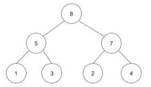 B.O(n) ,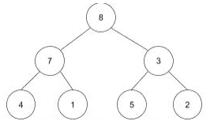 C.O(logn)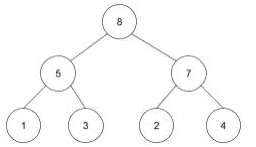 D.O(n), 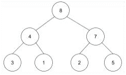

正确答案: D   你的答案: 空 (错误)

```cpp
A
```

```cpp
B
```

```cpp
C
```

```cpp
D
```

本题知识点

堆 前端工程师 字节跳动 2017

讨论

[pku_coder](https://www.nowcoder.com/profile/7266147)

```cpp
答案是:D 初始建堆操作复杂度
```

  查看全部)

编辑于 2017-05-23 14:12:00

* * *

[彤彤是个大美女](https://www.nowcoder.com/profile/6553109)

堆的插入操作就是将元素插入到堆的最后，然后继续将其调整为堆。本题中

发表于 2017-08-01 13:52:18

* * *

[李爱辉](https://www.nowcoder.com/profile/195311403)

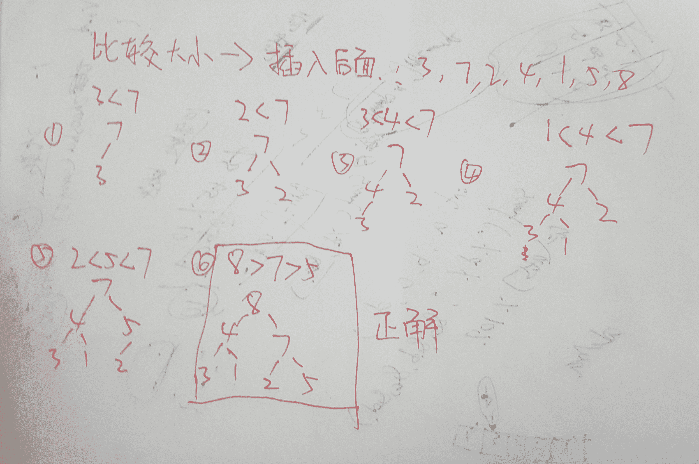

发表于 2018-07-14 16:15:06

* * *

## 8

http 请求方式 get 和 post 的区别包括（）

正确答案: A B   你的答案: 空 (错误)

```cpp
get 和 post 的可传输内容大小不一样，一个有限制一个没有限制
```

```cpp
get 和 post 传输的内容存放的位置不一样，一个放在 header，一个放在 body
```

```cpp
get 请求 Content-type 只能是 text/html
```

```cpp
get 请求可以跨域、post 请求不能跨域
```

本题知识点

WebServer PHP 前端工程师 字节跳动 2017

讨论

[freewheel370](https://www.nowcoder.com/profile/925796)

答案： A,B 至  查看全部)

编辑于 2017-05-23 14:12:34

* * *

[gcj_ever](https://www.nowcoder.com/profile/642936888)

如果考虑比较深的话，个人并不同意 A 的观点。实质上是有限制的，因为发送的数据包大小是有限制的。

发表于 2019-03-23 21:09:41

* * *

[Cross18](https://www.nowcoder.com/profile/5896878)

post 理论上是没有的限制的，只是 php.ini 设置默认 2M

发表于 2017-06-29 10:16:01

* * *

## 9

下面哪些属于 JavaScript 的 typeof 运算符的可能结果：（）

正确答案: A C F G   你的答案: 空 (错误)

```cpp
symbol
```

```cpp
int
```

```cpp
boolean
```

```cpp
null
```

```cpp
array
```

```cpp
undefined
```

```cpp
string
```

本题知识点

Javascript 前端工程师 字节跳动 2017

讨论

[我属猫](https://www.nowcoder.com/profile/8018242)

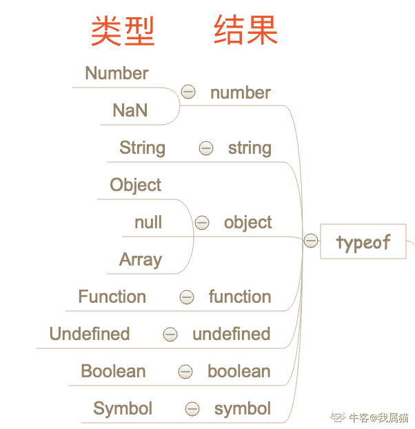

发表于 2019-09-03 10:58:20

* * *

[弱智的克星](https://www.nowcoder.com/profile/555879)

typeof Symbol()    //"symbol"typeof Number()    //"number"typeof String()    //"string"typeof Function()    //"function"typeof Object()    //"object"typeof Boolean()    //"boolean"typeof null    //"object"typeof undefined    //"undefined"

编辑于 2017-05-23 14:14:58

* * *

[牛客 9327762 号](https://www.nowcoder.com/profile/9327762)

string number boolean undefined object function symbol(es6 新增)

发表于 2017-02-01 18:00:18

* * *

## 10

老王有两个孩子，已知至少有一个孩子是在星期二出生的男孩。问：两个孩子都是男孩的概率是多大？

正确答案: A   你的答案: 空 (错误)

```cpp
13/27
```

```cpp
7/9
```

```cpp
1/2
```

```cpp
1/3
```

本题知识点

概率统计 *前端工程师 字节跳动 2017 概率论与数理统计* *讨论

[SunburstRun](https://www.nowcoder.com/profile/557336)

答案是 A  查看全部)

编辑于 2017-05-23 14:20:07

* * *

[晨风 20](https://www.nowcoder.com/profile/2672387)

你可以这样理解:小学版:老王俩孩子,有那几种可能？男男 1/4，女女 1/4，男女 1/2。初中版:老王俩孩子,不是俩闺女,有几种可能？ 去掉女女，男男 1/4,男女 1/2，归一化男男 1/3，男女 2/3。（此处换个问法就是，至少一个男孩，那么俩都是男孩的概率：1/3。震惊，竟然不是 1/2）高中版本：老王俩孩子，一个是周二生的孩子，请问算上星期孩子有哪些可能情况？如上思路大学版：老王俩孩子，请问俩孩子和隔壁邻居同姓的概率是多少？

编辑于 2017-08-04 19:59:07

* * *

[兔子先生 9326](https://www.nowcoder.com/profile/7463986)

条件概率男，周二：1/14 男，非周二：6/14 女，周二：1/14 女，非周二：6/17 两个孩子至少一个是周二生的男孩：1/14+1/14-1/14*1/14=27/196 两个孩子都是男孩且至少一个是周二生的：1/14*1/14+1/14*6/14+6/14*1/14=13/196 条件概率：13/27

发表于 2017-03-23 14:12:03

* * *

## 11

下列说法正确的有：（）

正确答案: A B   你的答案: 空 (错误)

```cpp
visibility:hidden; 所占据的空间位置仍然存在，仅为视觉上的完全透明；
```

```cpp
display:none; 不为被隐藏的对象保留其物理空间；
```

```cpp
visibility:hidden; 与 display:none; 两者没有本质上的区别；
```

```cpp
visibility:hidden; 产生 reflow 和 repaint（回流与重绘）；
```

本题知识点

前端工程师 字节跳动 2017 CSS

讨论

[栗子唐](https://www.nowcoder.com/profile/186478)

**display：non**  查看全部)

编辑于 2017-03-19 10:08:03

* * *

[大曼儿](https://www.nowcoder.com/profile/631685)

AB visiblity:看不见，摸的着. display:看不见，摸不着. display 是 dom 级别的，可以渲染和重绘。 visiblity 不是 dom 级别的，不能重绘，只能渲染

编辑于 2017-01-31 16:36:12

* * *

[等风来 2017](https://www.nowcoder.com/profile/7323234)

Reflow 的成本比 Repaint 的成本高得多的多。DOM Tree 里的每个结点都会有 reflow 方法，一个结点的 reflow 很有可能导致子结点，甚至父点以及同级结点的 reflow。 
当你增加、删除、修改 DOM 结点时，会导致 Reflow 或 Repaint。 
当你移动 DOM 的位置，或是搞个动画的时候。 
当你修改 /删除 CSS 样式的时候。 
当你 Resize 窗口的时候（移动端没有这个问题），或是滚动的时候。 
当你修改网页的默认字体时。 
当你设置 style 属性的值 （Setting a property of the style attribute）。 
注：display:none 会触发 reflow，而 visibility:hidden 只会触发 repaint，因为没有发现位置变化。

发表于 2017-10-10 10:02:20

* * *

## 12

TCP 断开连接的四次挥手中，第四次挥手发送的包会包含的标记，最正确的描述是？（）

正确答案: C   你的答案: 空 (错误)

```cpp
FIN
```

```cpp
FIN,PSH
```

```cpp
ACK
```

```cpp
FIN,ACK
```

本题知识点

网络基础 前端工程师 字节跳动 2017

讨论

[美团到店招聘](https://www.nowcoder.com/profile/3472441)

本题答案选 C。我们假设由 c  查看全部)

编辑于 2017-05-23 14:22:05

* * *

[小七 201809242255482](https://www.nowcoder.com/profile/744723081)

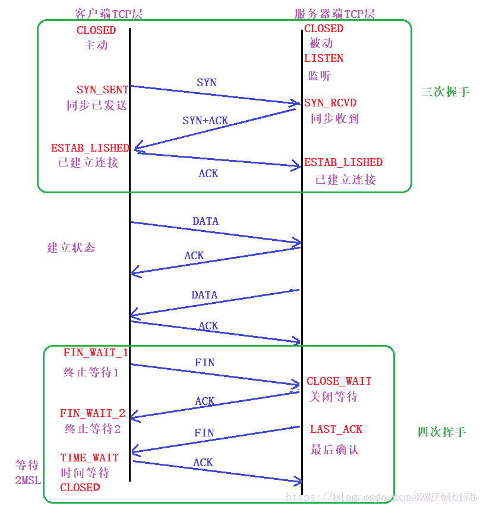

发表于 2019-03-08 12:14:09

* * *

[YoJay](https://www.nowcoder.com/profile/3444207)

TCP 连接建立(“三次握手”)分为三步：（1）客户机的 TCP 向服务器的 TCP 发送一个连接请求报文段，其中不含应用层数据，首部中的 SYN 标志位被置为 1。客户机会随机选择一个起始序号 seq=x(连接请求报文不携带数据，但要消耗一个序号)。(SYN = 1, seq = x)（2）服务器的 TCP 收到连接请求报文段后，如同意建立连接，就向客户机发回确认，并为该 TCP 连接分配 TCP 缓存和变量。确认报文段中 SYN 和 ACK 位都被置为 1，确认号字段的值为 x+1，并且服务器随机产生起始序号 seq = y(确认报文不携带数据，但也要消耗掉一个序号)。确认报文段同样不包含应用层数据。(SYN = 1, ACK = 1, seq = y, ack = x+1)（3）当客户机收到确认报文段后，还要向服务器给出确认，并且也要分配缓存和变量。报文段的 ACK 标志位被置 1，序号字段为 x+1，确认号字段为 ack = y+1。该报文段可以携带数据，如果不携带数据则不消耗序号。(ACK = 1, seq = x+1, ack = y+1)    在成功完成以上三步之后，TCP 连接就建立了，接下来就可以传送应用层数据了。TCP 提供的是全双工通信，因此通信双方的应用进程在任何时候都能发送数据。    另外，服务器端的资源是在完成第二次握手时分配的，而客户端的资源是在完成第三次握手时分配的。这使得服务器易于受到 SYN 洪泛攻击 TCP 连接的释放(“四次挥手”)分为四步：（1）客户机打算关闭连接，就向其 TCP 发送一个连接释放报文段，并停止再发送数据，主动关闭 TCP 连接，该报文段的 FIN 标志位被置 1，seq = u，它等于前面已传送过的数据的最后一个字节的序号加 1(FIN 报文段即使不携带数据，也要消耗掉一个序号)。TCP 是全双工的，可以想象成是一条 TCP 连接上有两条数据通路。当发送 FIN 报文时，发送 FIN 的一端就不能再发送数据，也就是关闭了其中一条数据通路，但对方还可以发送数据。(FIN = 1, seq = u)（2）服务器收到连接释放报文段后即发出确认，确认号是 ack = u+1，而这个报文段自己的序号是 v，等于它前面已传送过的数据的最后一个字节的序号加 1。此时，从客户机到服务器方向的连接就释放了，TCP 连接处于半关闭状态。但服务器若发送数据，客户机任要接收，即从服务器到客户机方向的连接没有关闭。(ACK = 1, seq = v, ack = u+1)（3）若服务器已经没有要向客户机发送的数据，就通知 TCP 释放连接，此时其发出 FIN = 1 的连接释放报文段。(FIN = 1, ACK = 1, seq = w, ack = u+1)（4）客户机收到连接释放报文段后，必须发出确认。在确认报文段中，ACK 字段被置为 1，确认号 ack = w+1，序号 seq = u+1。此时 TCP 连接还没有释放掉，必须经过时间等待计时器设置的时间 2MSL 后，客户机才进入到连接关闭状态。(ACK = 1, seq = u+1, ack = w+1)因此，服务器端结束 TCP 连接的时间要比客户端早一些。

发表于 2018-06-19 10:59:29

* * *

## 13

页面有一个按钮 button id 为 button1，通过原生的 js 如何禁用？（）

正确答案: B D   你的答案: 空 (错误)

```cpp
document.getElementById(“button1”).setAttribute(“Readolny”,true);
```

```cpp
document.getElementById(“button1”).setAttribute(“disabled”,”true”);
```

```cpp
document.getElementById(“button1”).Readonly=true;
```

```cpp
document.getElementById(“button1”).disabled=true;
```

本题知识点

Javascript 前端工程师 字节跳动 2017

讨论

[HarveyTS](https://www.nowcoder.com/profile/6971030)

  查看全部)

编辑于 2017-05-23 14:23:26

* * *

[℡青依飘然](https://www.nowcoder.com/profile/9208041)

Readonly 只针对 input(text/password)和 textarea 有效，而 disabled 对于所有的表单元素有效，包括 select,radio,checkbox,button 等。

发表于 2017-08-04 10:40:23

* * *

[齐天大圣哔哔哔](https://www.nowcoder.com/profile/6517112)

Readonly 和 Disabled 是用在表单中的两个属性，它们**都能够做到使用户不能够更改表单域中的内容**。但是它们之间有着微小的差别，总结如下：

Readonly 只针对 input(text / password)和 textarea 有效，而 disabled 对于所有的表单元素都有效，包括 select, radio, checkbox, button 等。

但是表单元素在使用了 disabled 后，当我们将表单以 POST 或 GET 的方式提交的话，这个元素的值**不会被传递出去**，而 readonly**会将该值传递出去**（这种情况出现在我们将某个表单中的 textarea 元素设置为 disabled 或 readonly，但是 submit button 却是可以使用的）。

发表于 2017-04-13 10:01:58

* * *

## 14

关于下列 CSS 选择器：ID 选择器、类选择器、伪类选择器、标签名称选择器，排序正确的是：（）

正确答案: D   你的答案: 空 (错误)

```cpp
ID 选择器 > Class 选择器 > 伪类=标签名称选择器
```

```cpp
ID 选择器 > 伪类 > Class 选择器 > 标签名称选择器
```

```cpp
ID 选择器 > Class 选择器 > 伪类 > 标签名称选择器
```

```cpp
ID 选择器 > Class 选择器 = 伪类 > 标签名称选择器
```

本题知识点

前端工程师 字节跳动 2017 CSS

讨论

[墨裳花开](https://www.nowcoder.com/profile/994851)

答案：D 解析：一般来说，选择器的优先级（从上往下依次降低）是：

1.  在属性后面使用 !important 会覆盖页面内任何位置定义的元素样式。
2.  作为 style 属性写在元素内的样式
3.  id 选择器
4.  类选择器
5.  标签选择器
6.  通配符选择器

所以选项 B 和 D 可以确定答案肯定是从这两个里面出，那么究竟是 class 选择器优先级高，还是伪类选择器优先级高呢？来段代码效果，一目了然：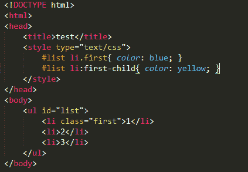
效果：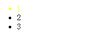
注意一样的样式代码，前后顺序不同，导致的效果变化：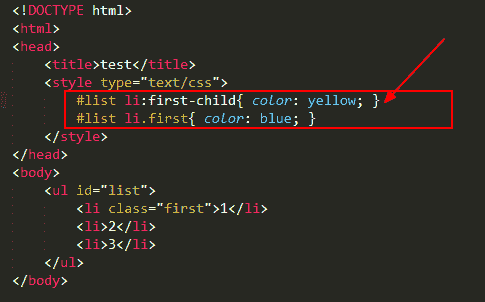
效果：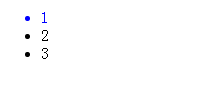
也就是说：伪类选择器和类选择器的优先级是一样的，谁在后面谁起作用，因为我们知道后面的样式会覆盖前面的样式

编辑于 2017-05-23 14:27:09

* * *

[自带 BMG 的小菇凉](https://www.nowcoder.com/profile/5889016)

答案：D
解析：
优先级由高到低可分为：

1.  在属性后面使用`!important`会覆盖页面内任何位置定义的元素样式。
2.  作为`style`属性写在元素内的样式
3.  `id`选择器
4.  类选择器 = 伪类选择器=属性选择器 （后面的样式会覆盖前面的样式）
5.  标签选择器
6.  通配符选择器
7.  浏览器自定义的样式 ​

发表于 2018-05-11 15:46:08

* * *

[天天打游戏梦毕业吗？](https://www.nowcoder.com/profile/791230386)

权重的等级
1、!important，加在样式属性值后，权重值为 10000
2、内联样式，如：style=””，权重值为 1000
3、ID 选择器，如：#content，权重值为 100
4、类，伪类和属性选择器，如： content、:hover 权重值为 10
5、标签选择器和伪元素选择器，如：div、p、:before 权重值为 1
6、通用选择器（*）、子选择器（>）、相邻选择器（+）、同胞选择器（~）、 权重值为 0

发表于 2019-12-01 20:56:13

* * *

## 15

假设 a 是一个由线程 1 和线程 2 共享的初始值为 0 的全局变量，则线程 1 和线程 2 同时执行下面的代码，最终 a 的结果不可能是（）

```cpp
boolean isOdd = false;
for(int i=1;i<=2;++i){
    if(i%2==1)isOdd = true;
    else isOdd = false;
    a+=i*(isOdd?1:-1);
}
```

正确答案: D   你的答案: 空 (错误)

```cpp
-1
```

```cpp
-2
```

```cpp
0
```

```cpp
1
```

本题知识点

Java 前端工程师 字节跳动 2017

讨论

[Likwind](https://www.nowcoder.com/profile/995326)

易知：每个线程对 a 均做了两次读写操作，分别是 “ +1 ” 和 “ -2 ”而题目问了是最终 a 的结果，所以 a 的结果取决于各自线程对 a 的先后读写的顺序结论：a 的可能取值为-1、0、-2 如图：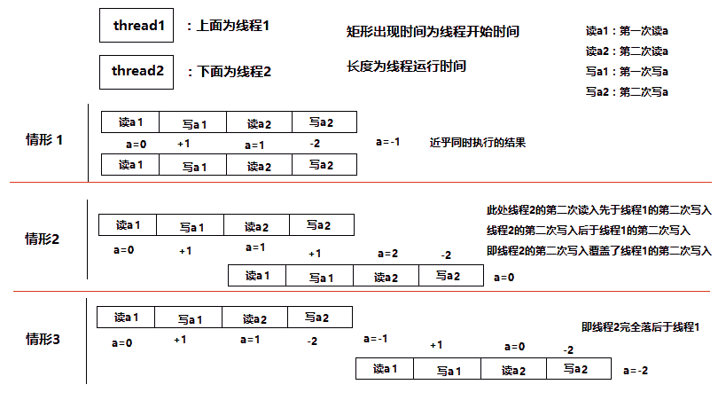

发表于 2017-07-01 12:46:01

* * *

[郑经](https://www.nowcoder.com/profile/700018092)

不管怎样线程对 a 的操作就是+1 后-21.线程 1 执行完再线程 2 执行，1-2+1-2=-22.线程 1 和 2 同时+1，再-2 不同时，1-2-2=-33.线程 1 和 2 不同时+1，同时-2，1+1-2=04.线程 1 和 2 既同时+1 又同时-2，1-2=-1 没有结果为 1 的情况

发表于 2019-06-11 20:02:33

* * *

[leozam](https://www.nowcoder.com/profile/320048)

假设两线程为 A、B，设有 3 种情况：1.AB 不并发：此时相当于两个方法顺序执行。A 执行完后 a=-1，B 使用-1 作为 a 的初值，B 执行完后 a=-2
2.AB 完全并发：此时读写冲突，相当于只有一个线程对 a 的读写最终生效。相同于方法只执行了一次。此时 a=-1
3.AB 部分并发：假设 A 先进行第一次读写，得到 a=1;之后 A 的读写被 B 覆盖了。B 使用用 1 作为 a 的初值，B 执行完后 a=0

发表于 2017-08-07 12:18:22

* * *

## 16

使用 HTML+CSS 实现如图布局，border-width:5px，格子大小是 50px*50px，hover 时

边框变成红色，需要考虑语义化。

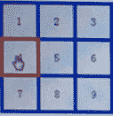  

你的答案

本题知识点

HTML 前端工程师 字节跳动 2017

讨论

[for 前端](https://www.nowcoder.com/profile/5190987)

<!DOCTYPE html><html lang="en"><head><meta charset="UTF-8"><title>Document</title><style type="text/css">table{/*  border-collapse:separate;*/border: none;border-spacing: 0;}td{position: relative;width: 50px;height: 50px;border: 5px solid blue;background: #fff;color: green;text-align: center;line-height: 50px;display: inline-block;}tr:not(:first-child) td{margin-top: -5px;}tr td:not(:last-child){margin-right: -5px;}td:hover{border-color: red;cursor: pointer;z-index: 2;}</style></head><body><table><tr><td>1</td><td>2</td><td>3</td></tr><tr><td>4</td><td>5</td><td>6</td></tr><tr><td>7</td><td>8</td><td>9</td></tr></table></body></html>z-index 仅能在定位元素上奏效（position 属性值设置除默认值 static 以外的元素，包括 relative，absolute，fixed 样式）

编辑于 2017-08-01 14:23:25

* * *

[好运快来](https://www.nowcoder.com/profile/9168702)

flex 布局。为了中间间距是 5px，采用负边距。

```cpp
<!DOCTYPE html>
<html lang="en">
<head>
  <meta charset="UTF-8">
  <meta name="viewport" content="width=device-width, initial-scale=1.0">
  <meta http-equiv="X-UA-Compatible" content="ie=edge">
  <title>Document</title>
  <style>
    * {
      margin: 0;
      padding: 0;
    }
    .container {
      display: flex;
      width: 180px;
      height: 180px;
      flex-wrap: wrap;
    }
    .box {
      width: 50px;
      height: 50px;
      border: 5px solid blue;
      background-color:aqua;
      text-align: center;
      line-height: 50px;
      margin-right: -5px;
    }
    .box:hover {
      border: 5px solid red;
      z-index:9999;
    }
  </style>
</head>
<body>
  <div class="container">
    <div class="box">1</div>
    <div class="box">2</div>
    <div class="box">3</div>
    <div class="box">4</div>
    <div class="box">5</div>
    <div class="box">6</div>
    <div class="box">7</div>
    <div class="box">8</div>
    <div class="box">9</div>
  </div>
</body>
</html>
```

发表于 2017-08-22 17:58:50

* * *

[Catherine001_](https://www.nowcoder.com/profile/8894352)

```cpp
<!doctype html> <html lang="en"> <head> <meta charset="UTF-8"> <meta name="Generator" content="EditPlus®"> <meta name="Author" content=""> <meta name="Keywords" content=""> <meta name="Description" content=""> <title>nine box</title> <style type="text/css"> table{border-collapse:collapse; margin:50px;text-align:center; } table tr {border:none;} table.tb2 td{width:50px;height:50px;border:5px  inset blue;} table.tb2 td:hover{border:5px solid red;cursor: pointer;} </style>  </head>  <body>  <table class="tb2">  <tr><td>1</td><td>2</td><td>3</td></tr>  <tr><td>4</td><td>5</td><td>6</td></tr>  <tr><td>7</td><td>8</td><td>9</td></tr>  </table>  </body>  </html>  
```

编辑于 2017-07-30 10:32:29

* * *

## 17

给出一个上传文件时不用刷新页面的方案，要求写出关键部分的 js 代码。

你的答案

本题知识点

Javascript 前端工程师 字节跳动 2017

讨论

[牛客 382450 号](https://www.nowcoder.com/profile/382450)

```cpp
<input id="upload" type="file" />
<button id="upload-btn"> upload </button>
```

```cpp
document.getElementById('upload-btn').onclick = function(){

	varinput = document.getElementById('upload');

	varfile = input.files[0];

	varformData = newFormData();

	forData.append('file',file);

	fetch({

	url:'/upload',

	mothod:'POST',

	body:formData

	})

	.then((d)=>{

	console.log('result is',d);

	alert('上传完毕');

	})

}
```

编辑于 2017-07-30 16:34:43

* * *

[何必讨好✘๊](https://www.nowcoder.com/profile/505354704)

js 的 能过七题内存就超了 ```cpp
var lines = readline().split(' ');
var n = parseInt(lines[0]);
var m = parseInt(lines[1]);

var resultArr = new Array(n);
for(var i = 1; i <= n; i++) {
    resultArr[i - 1] = i;
}

console.log(resultArr.sort()[m-1]);
``` 

发表于 2022-02-28 22:16:50

* * *

[考拉 812](https://www.nowcoder.com/profile/788742377)

获取文件对象
var fileObj = document.getElementById("file").files[0];
// 接收上传文件的后台地址
var url =  "http://localhost:8088/upload";
var form = new FormData();
form.append("file", fileObj);
xhr = new XMLHttpRequest();

xhr.open("post", url, true);
// 上传完成
xhr.onload = uploadComplete;
// 上传失败
xhr.onerror =  uploadFailed;

//开始上传，发送 form 数据
xhr.send(form);

//上传成功响应
function uploadComplete(evt) {
    //服务断接收完文件返回的结果

    var data = JSON.parse(evt.target.responseText);
if(data.success) {
    alert("上传成功！");
}else{
    alert("上传失败！");
}

发表于 2021-08-17 20:43:46

* * *

## 18

给定整数 n 和 m, 将 1 到 n 的这 n 个整数按字典序排列之后, 求其中的第 m 个数。
对于 n=11, m=4, 按字典序排列依次为 1, 10, 11, 2, 3, 4, 5, 6, 7, 8, 9, 因此第 4 个数是 2\.
对于 n=200, m=25, 按字典序排列依次为 1 10 100 101 102 103 104 105 106 107 108 109 11 110 111 112 113 114 115 116 117 118 119 12 120 121 122 123 124 125 126 127 128 129 13 130 131 132 133 134 135 136 137 138 139 14 140 141 142 143 144 145 146 147 148 149 15 150 151 152 153 154 155 156 157 158 159 16 160 161 162 163 164 165 166 167 168 169 17 170 171 172 173 174 175 176 177 178 179 18 180 181 182 183 184 185 186 187 188 189 19 190 191 192 193 194 195 196 197 198 199 2 20 200 21 22 23 24 25 26 27 28 29 3 30 31 32 33 34 35 36 37 38 39 4 40 41 42 43 44 45 46 47 48 49 5 50 51 52 53 54 55 56 57 58 59 6 60 61 62 63 64 65 66 67 68 69 7 70 71 72 73 74 75 76 77 78 79 8 80 81 82 83 84 85 86 87 88 89 9 90 91 92 93 94 95 96 97 98 99 因此第 25 个数是 120…

本题知识点

高级结构 数学 模拟 前端工程师 字节跳动 2017

讨论

[潇潇古月](https://www.nowcoder.com/profile/7878855)

既然是字典序，那么很自然，我们可以考虑使用字典树来实现，但是，这里并不需要真的生成这个字典树，而只需要计算对应分支的节点数就行了。计算分支节点数，那么很简单，节点数就是上级节点*10，总的节点数= 1 + （1 * 10） + （1 * 10 * 10） + （1 * 10  * 10 * 10） +……，这里需要注意最后的边界，n 以内的节点数，那么，最后相加的时候必须要把 n+1 ~ (1 * 10 * 10 *……)这几个数去掉。既然知道了如何计算字典树分支的节点数，要想知道第 m 个数是什么，那么也就是找第 m 个节点，首先从 1 开始，如果 1 分支的节点数>m，那么第 m 个数肯定是以 1 开头，进一步搜索其子节点，搜索子节点时不用再搜索 1 了，所以是搜索 1 分支的第 m-1 个节点。如果 1 分支的节点数<m， 那么所查找的数肯定不是 1 开头，那么开始搜索 2 分支，在 2 分支中，所要找的数应该是第（m-（1 分支节点数））个数。重复这个过程，要么搜索子节点，要么搜索兄弟节点，知道最终 m==0，也就是当前节点就是所要搜索的节点。为了便于理解，简单修改了下 java 代码：

```cpp
import java.util.Scanner;

public class Main {
    public static void main(String[] args) {
        Scanner sc = new Scanner(System.in);
        while (sc.hasNext()) {
            long n = sc.nextLong();
            long m = sc.nextLong();
            System.out.println(solve(n, m));
        }
    }

    private static long solve(long n, long m) {
        long ans = 1;
        while (m != 0) {
            long cnt = getCntOfPre(ans, n);
            if(cnt >= m) {
                m --;
                if(m == 0)
                    break;
                ans *= 10;
            } else {
                m -= cnt;
                ans ++;
            }
        }
        return ans;
    }

    private static long getCntOfPre(long pre, long n) {
        long cnt = 1;
        long p = 10;
        for (; pre * p <= n; p *= 10) {
            if (pre * p - 1 + p < n)
                cnt += p;
            else
                cnt += n - pre * p + 1;

//          cnt += Math.min(n, pre * p - 1 + p) - pre * p + 1;
        }
        return cnt;
    }
}
```

编辑于 2017-08-17 09:46:00

* * *

[graper](https://www.nowcoder.com/profile/3896787)

```cpp
//将字典序视作一个树，寻找 m 次则循环 m 次来找寻结果
//如果在这个区间内则 M 在这个区间内查找，否则让梯度乘以 10 向上查找，知道找寻一个区间内，让 i+1 一个一个查找
//第一步 while 循环是判断是否查到这个位置，第二次则是写出 num 在这个区间内有多少个数
//本题不用构造一颗字典序树，却用到树的概念
//以十个十个数为区间计算
//此上均是自己的一点看法，本人不才，望指教
#include <iostream>
#include <algorithm>

using namespace std;

int main()
{
    long n, m;
    cin >> n >> m;
    long i = 1;
    m--;
    while (m != 0){
        long start = i, end = i + 1;
        long num = 0;
        while (start <= n)
        {
            num += min(n+1,end)- start;
            start *= 10;
            end *= 10;
        }
        if (num > m)
        {
            i *= 10;
            m--;
        }
        else
        {
            m -= num;
            i++;
        }
    }
    cout << i << endl;
    return 0;

}

```

发表于 2017-11-27 16:45:02

* * *

[卷积神经网络哦](https://www.nowcoder.com/profile/8684256)

虽然只有 50 分但是这绝壁是最快的方法 不想思考的时候可以用着试试拿一些保底分

暴力生成字典序 哈哈哈

```cpp
#include <iostream>
#include <cstring>
#include <string>
#include <vector>
#include <algorithm>
using namespace std;
vector<string> ve;
int main(){
    int n, m;
    cin>>n>>m;
    for(int i = 1; i <= n; i++)
        ve.push_back(to_string((long long)i));
    sort(ve.begin(), ve.end());
    cout<<ve[m-1]<<endl;
    return 0;
} 
```

发表于 2018-10-05 16:56:52

* * **