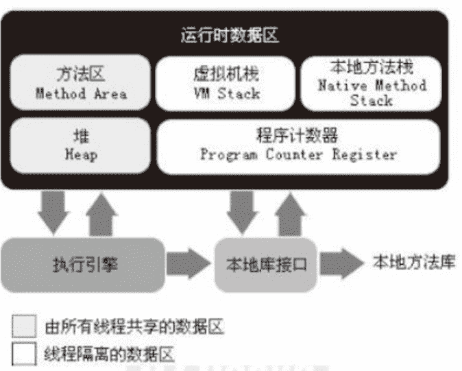
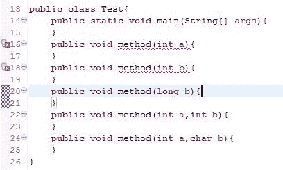
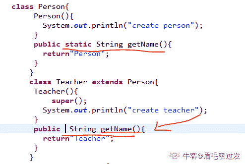
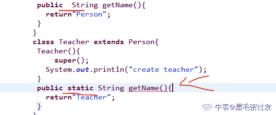
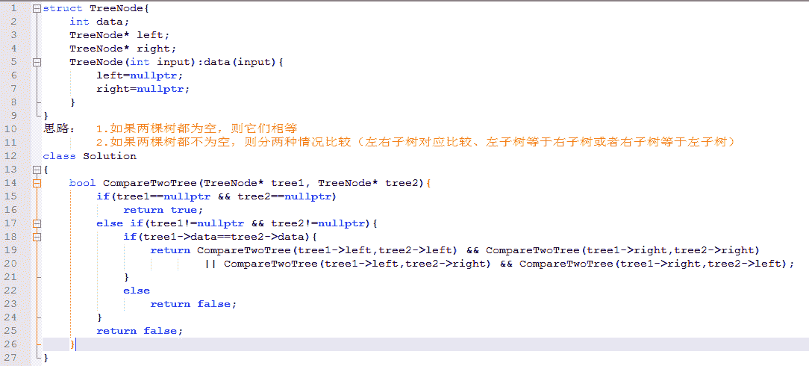

# 凹凸科技 2017 秋招 java 工程师笔试卷

## 1

GC 是什么？为什么要有 GC？

你的答案

本题知识点

Java Java 工程师 凹凸科技 2017

讨论

[冰封无痕](https://www.nowcoder.com/profile/266593)

```cpp
 在 java 语言中，垃圾回收（
```

  查看全部)

编辑于 2017-05-24 13:51:18

* * *

[艾尔森](https://www.nowcoder.com/profile/9655262)

garbage collection 中文名叫垃圾回收机制 。GC 的作用在于回收程序中由编码人员从堆中申请的内存 减少内存泄漏的可能

编辑于 2017-07-29 10:31:37

* * *

[倩如](https://www.nowcoder.com/profile/6335038)

GC 是垃圾回收。内存处理是编程人员容易出现问题的地方，忘记或错误的内存回收，会导致程序或系统不稳，甚至崩溃。Java 的 GC 功能可自动监控对象是否超过作用域，从而达到自动回收内存的目的。Java 语言没有提供释放已分配的显示操作方法。

发表于 2017-07-29 21:04:39

* * *

## 2

简述 final，finalize，finally 的区别？

你的答案

本题知识点

Java Java 工程师 凹凸科技 2017

讨论

[冰封无痕](https://www.nowcoder.com/profile/266593)

```cpp
1\. final 是关键字，fi
```

  查看全部)

编辑于 2017-05-24 13:53:04

* * *

[好端端的猫和猫](https://www.nowcoder.com/profile/2716436)

final 可以作为修饰符修饰变量、方法、类。被 final 修饰的变量只能赋值一次，被 final 修饰的方法不能在子类中被重写，被 final 修饰的类不能被继承。finalize（）方法是 Object 类中定义的方法，当垃圾回收器将无用的对象从内存中清除时，该对象将调用该方法，由于该方法被 protected 修饰，子类可以通过重写来实现资源的整合及其他清理工作。finally 是在异常处理中定义总是处理的代码。

发表于 2017-08-05 19:22:32

* * *

[liberty201911051035384](https://www.nowcoder.com/profile/296466762)

final 是最终的意思,用它修饰的变量就变成了常量,常量的值不可以变
修饰的类不能被继承
修改的方法不能被重写，但是子类可以继承过来
修饰的普通成员,必须在定义的时候初始化,或在构造函数里初始化若在构造函数初始化，必须在每个构造函数都要初始化。
修改的静态成员,必须在声明的时候初始化用 final 修饰的引用型变量，这个变量的引用可变，变量本身不可变。finalize() 是来自 Object 类中的一个方法,我们可以重写这个方法在堆上的对象被垃圾回收器回收的时候,会自动调用这个方法 
finally 和 try catch() 块连用,主要用来做一些清理资源的工作
放在  finally 中的语句,不管程序运行出现异常没有,都会执行到

发表于 2020-06-25 21:59:38

* * *

## 3

Abstract class 和 interface 有什么区别？

你的答案

本题知识点

编程基础 *Java 工程师 凹凸科技 2017* *讨论

[丑的要命](https://www.nowcoder.com/profile/9927432)

相同点：  A. 两者  查看全部)

编辑于 2017-05-24 13:53:50

* * *

[石头孩儿](https://www.nowcoder.com/profile/842004)

```cpp
接口是公开的，里面不能有私有的方法或变量，是用于让别人使用的，而抽象类是可以有私有方法或私有变量的，

另外，实现接口的一定要实现接口里定义的所有方法，而实现抽象类可以有选择地重写需要用到的方法，一般的应用里，最顶级的是接口，然后是抽象类实现接口，最后才到具体类实现。

还有，接口可以实现多重继承，而一个类只能继承一个超类，但可以通过继承多个接口实现多重继承，接口还有标识（里面没有任何方法，如 Remote 接口）和数据共享（里面的变量全是常量）的作用.
```

发表于 2017-02-05 20:46:05

* * *

[养乐多か](https://www.nowcoder.com/profile/344468247)

|  | Abstract class | Interface |
| 实例化 | 不能 | 不能 |
| 类 | 一种继承关系，一个类只能使用一次继承关系。可以通过继承多个接口实现多重继承 | 一个类可以实现多个 interface |
| 数据成员 | 可有自己的 | 静态的不能被修改即必须是 static final，一般不在此定义 |
| 方法 | 可以私有的，非 abstract 方法，必须实现 | 不可有私有的，默认是 public，abstract 类型 |
| 变量 | 可有私有的，默认是 friendly 型，其值可以在子类中重新定义，也可以重新赋值 | 不可有私有的，默认是 public static final 型，且必须给其初值，实现类中不能重新定义，不能改变其值。 |
| 设计理念 | 表示的是“is-a”关系 | 表示的是“like-a”关系 |
| 实现 | 需要继承，要用 extends | 要用 implements |

发表于 2020-06-22 00:11:00

* * *

## 4

Java 内存管理 （1）请描述 java 的内存管理原理 （2）请描述 java 的内存分区 （3）请描述 java 的对象生命周期，以及对象的访问？

你的答案

本题知识点

Java Java 工程师 凹凸科技 2017

讨论

[马克 123](https://www.nowcoder.com/profile/8308810)

**（1）请描述 java 的内存管理原理**

```cpp
Java 的内存管理就是对象的分配和释放
在 Java 中，内存的分配是由程序完成的，而内存的释放是由垃圾收集器(Garbage Collection，GC)
完成的 
```

**（2）请描述 java 的内存分区**
每个区干嘛的，百度都有详细讲解，自行百度吧**（3）请描述 java 的对象生命周期，以及对象的访问？**

```cpp
生命周期：  
1.创建阶段(Created)
2.应用阶段(In Use)：一旦对象被创建，并被分派给某些变量赋值，这个对象的状态就切换到了应用阶段
3.不可见阶段(Invisible)：例如我在 for 里面定义了 i for 循环 break 了就不能访问 i
4.不可达阶段(Unreachable)：对象处于不可达阶段是指该对象不再被任何强引用所持有。
5.收集阶段(Collected)：当垃圾回收器发现该对象已经处于“不可达阶段”并且垃圾回收器已经对该对象的内存空间重新分配做好准备时，则对象进入了“收集阶段”。
6.终结阶段(Finalized)：当对象执行完 finalize()方法后仍然处于不可达状态时，则该对象进入终结阶段。在该阶段是等待垃圾回收器对该对象空间进行回收。
7.对象空间重分配阶段(De-allocated)：垃圾回收器对该对象的所占用的内存空间进行回收或者再分配了，则该对象彻底消失了，称之为“对象空间重新分配阶段”
```

```cpp
句柄访问方式：java 堆中将划分出一块内存来作为句柄池，reference 中存储的就是对象的句柄地址，而句柄中包含了对象实例数据和类型数据各自的具体地址信息。 指针访问方式：reference 变量中直接存储的就是对象的地址，而 java 堆对象一部分存储
了对象实例数据，另外一部分存储了对象类型数据
```

编辑于 2017-02-21 13:40:19

* * *

[青春渐离](https://www.nowcoder.com/profile/883163570)

java 的内训管理是由 java 虚拟机 jvm 进行的，不需要程序员管理，而将精力更多的放在业务逻辑上，而同时也限制对内存的手动干预。

发表于 2020-03-05 22:26:10

* * *

[Holiday_12138](https://www.nowcoder.com/profile/461586)

这问的太多了。。新生代 Eden Survivor * 2  Eden 区 和 fromSurvivor Minor GC 使用 Copy 算***复制到另一个 ToSurvivor，如果放不下则会进入老年代，大对象直接进入老年代，存活代数高的对象进入老年代，存活对象中相同年龄的对象超过 Survivor 一半进入老年代老年代 Full GC 采用标记清除算法或者标记整理算法。方法区，java 堆，常量池，虚拟机栈，程序计数器，本地方法栈加载， 验证，准备， 解析， 初始化，使用，卸载

发表于 2017-08-01 15:10:07

* * *

## 5

指出以下程序的输出或错误。

```cpp
public class Test{
    public static void main(String[] args){
    }
    public void method(int a){
    }
    public void method(int b){
    }
    public void method(long b){
    }
    public void method(int a,int b){
    }
    public void method(int a,char b){
    }
}
```

你的答案

本题知识点

Java 工程师 凹凸科技 2017

讨论

[小雨 123](https://www.nowcoder.com/profile/750768)

这个是考查方法重写与方法重载的区别吧。方法重写是发生在继承的时候，这里都是在一个 Test 类里的，是方法重载。而方法重载的要求是方法名称相同，参数列表不同（可以是参数的类型、个数、顺序不同）。 出错信息：Duplicate method method(int) in type Test

发表于 2017-07-28 21:49:00

* * *

[青春渐离](https://www.nowcoder.com/profile/883163570)

参数虽然名字不同但类型相同，会被视为同一方法，而不重写

发表于 2020-03-05 22:42:17

* * *

[Holiday_12138](https://www.nowcoder.com/profile/461586)

```cpp

	publicvoidmethod(inta){

	    }

	publicvoidmethod(intb){

	    }

	不属于方法重载，重名方法报错

```

发表于 2017-08-01 15:11:23

* * *

## 6

指出以下程序的输出或者错误

```cpp
class Person{
 Person(){
   System.out.println("create person");  
 }
 public static String getName(){
   return"Person";
 }
}
class Teacher extends Person{
 Teacher(){
   System.out.println("create teacher");  
   super();
 }
 public static String getName(){
   return"Teacher";
 }
}
public class Test{
 public static void main(String[] args){
   Person person = new Person();
   Person teacher = new Teacher();
   System.out.println(person.getName());
   System.out.println(teacher.getName());
 }
}
```

你的答案

本题知识点

Java 工程师 凹凸科技 2017

讨论

[眉毛密过发](https://www.nowcoder.com/profile/204442994)

首先需要理解为什么要定义成 Person teacher = new Teacher()；这是一种多态性的**向上转型**，为了更好的封装子类中的方法，Person 类型的引用是可以指向 Teacher 类型的对象的。那么这样做有什么意义呢？因为子类是对父类的一个改进和扩充，所以一般子类在功能上较父类更强大，属性较父类更独特，父类中的一个方法只有在在父类中定义而在**子类中没有重写的情况下，才可以被父类类型的引用调用**；**对于父类中定义的方法，如果子类中重写了该方法，那么父类类型的引用将会调用子类中的这个方法，这就是*动态连接*****，但是如果父类的方法是 static 类型（类方法），那么子类无法重写父类方法**** 。（注意：如果子类也想尝试重写该方法，并且不是 static 类型，那么将会报错）****** **如果子类中的方法没有由 static 修饰，那么子类可以重写父类方法（注意：如果子类该方法是类方法，那么将会报错）****** **对于多态，可以总结它为：

一、使用父类类型的引用指向子类的对象；
二、该引用只能调用父类中定义的方法和变量；
三、如果子类中重写了父类中的一个方法，那么在调用这个方法的时候，将会调用子类中的这个方法；（动态连接、动态调用）
四、变量不能被重写（覆盖），”重写“的概念只针对方法，如果在子类中”重写“了父类中的变量，那么在编译时会报错。****成员变量，静态方法--看左边；非静态方法：编译--看左边，运行--看右边。** 

发表于 2019-09-23 00:11:28

* * *

[小雨 123](https://www.nowcoder.com/profile/750768)

程序出错，super()语句调用了父类的无参数的构造方法，它必须放在子类的构造方法的有效代码的第一句。调整后程序输出结果为：create person create person create teacher Person PersonPerson person = new  Person()生成一个父类的 Person 类对象实例，所以调用父类的构造方法，输出 create person。然后 Person teacher = new  Teacher()生成一个子类的 Teacher 为对象实例，因为它的构造方法第一句是调用父类的构造方法，所以会先输出 create person，然后执行构造方法中下面的语句输出 create teacher。因为 teacher 这个实例的引用是赋给 Person 类的，所以最后它的 getName 返回的是 Person。（为会么 teacher 这个实例的引用是赋给 Person 类的，最后它的 getName 返回的是 Person？）

编辑于 2017-07-31 15:34:17

* * *

[牛课 007](https://www.nowcoder.com/profile/9787881)

super 要在构造函数第一行使用

发表于 2017-08-06 12:26:47

* * *

## 7

假设树的节点的 data 类型为 int 型，请实现两棵树是否相等的比较？ 注:A,B 两棵树相等且当 rootA->data==rootB->data，而且 A 和 B 的左右子树相等或者左右互换后相等。 （1）给出树节点的结构定义 （2）写出实现思路，以及复杂度估计 （3）用你习惯的语言或者伪代码实现该算法

你的答案

本题知识点

树 Java 工程师 凹凸科技 2017

讨论

[石头孩儿](https://www.nowcoder.com/profile/842004)

 typedef stru   查看全部)

编辑于 2017-05-24 13:55:32

* * *

[若云散](https://www.nowcoder.com/profile/2442959)

```cpp
public  class Test {
	private static boolean flag = true;

	public static void main(String [] args){
		//根据输入参数构建树
		//comparePre(root1, root2);

		System.out.println(flag);
	}

	public static void comparePre(Node root1, Node root2){
		if(root1.data != root2.data){
			flag = false;
			return;
		}
		compare(root1, root2);
	}

	public static void compare(Node n1, Node n2){
		if(!flag)
			return;
		if(nodeEqual(n1.left, n2.left) &&nodeEqual(n1.right, n2.right)){
			if(n1.left != null)
				compare(n1.left, n2.left);
			if(n1.right != null)
				compare(n1.right, n2.right);
		} else if(nodeEqual(n1.left, n2.right) && nodeEqual(n1.right, n2.left)){
			if(n1.left != null)
				compare(n1.left, n2.right);
			if(n1.right != null)
				compare(n1.right, n2.left);
		} else {
			flag = false;
		}
	}

	public static boolean nodeEqual(Node n1, Node n2){
		if(n1 == n2)
			return true;
		if(n1 != null && n2 != null){
			if(n1.equals(n2)){
				return true;
			} else {
				return false;
			}
		} else {
			return false;
		}
	}
}

class Node{
	int data;
	Node left;
	Node right;
	public Node(int data){
		this.data = data;
	}

	@Override
	public boolean equals(Object node){
		if(node == null)
			return false;
		Node nodeTemp = (Node) node;
		if(nodeTemp.data != data)
			return false;
		return true;
	}
}
```

编辑于 2017-07-31 11:18:27

* * *

[发言人](https://www.nowcoder.com/profile/3080961)



发表于 2017-08-04 10:18:32

* * *

## 8

假设基本数据为整型，输入为一串无序的整数，请用堆排序的方式对该整数串排序（增序），有重复时保留重复的数。 测试数据:[3,6,23,4,3,2,9,10,18,11] （1）堆排序的思想，使用情况一般是什么？（2）算法所需要的数据结构？ （3）用你习惯的语言或者伪代码实现你的算法？

你的答案

本题知识点

堆 排序 *Java 工程师 凹凸科技 2017* *讨论

[autoria](https://www.nowcoder.com/profile/7742045)

1.堆排序的目的是建立一种树  查看全部)

编辑于 2017-05-24 13:55:59

* * *

[fantasy_](https://www.nowcoder.com/profile/9024047)

```cpp
   ①根据初始数组去**构造初始堆**（构建一个完全二叉树，保证所有的父结点都比它的孩子结点数值大）。 
   ②每次**交换第一个和最后一个元素，输出最后一个元素**（最大值），然后把剩下元素**重新调整**为大根堆。当输出完最后一个元素后，这个数组已经是按照从小到大的顺序排列了。 
   **（2）算法所需要的数据结构？ ** 
 涉及到二叉堆的数据结构 

```

                **import** java.util.Arrays;           
           **public**  **class** HeapSort {     
            **public**  **static**  **void** main(String[] args) {     
            **int**[] a={3,6,23,4,3,2,9,10,18,11};     
            **int**  arrayLength=a.length;      
            //循环建堆      
            **for**(**int**  i=0;i<arrayLength-1;i++){      
            //建堆      
            *buildMaxHeap*(a,arrayLength-1-i);      
            //交换堆顶和最后一个元素      
            *swap*(a,0,arrayLength-1-i);      
            System.***out***.println(Arrays.*toString*(a));      
            }     
            System.***out***.println(Arrays.*toString*(a));      
            }     
            //对 data 数组从 0 到 lastIndex 建大顶堆     
            **public**  **static**  **void** buildMaxHeap(**int**[] data, **int**  lastIndex){     
            //从 lastIndex 处节点（最后一个节点）的父节点开始      
            **for**(**int**  i=(lastIndex-1)/2;i>=0;i--){     
            //k 保存正在判断的节点      
            **int**  k=i;     
            //如果当前 k 节点的子节点存在      
            **while**(k*2+1<=lastIndex){     
            //k 节点的左子节点的索引      
            **int**  biggerIndex=2*k+1;     
            //如果 biggerIndex 小于 lastIndex，即 biggerIndex+1 代表的 k 节点的右子节点存在     
            **if**(biggerIndex<lastIndex){      
            //若果右子节点的值较大      
            **if**(data[biggerIndex]<data[biggerIndex+1]){      
            //biggerIndex 总是记录较大子节点的索引      
            biggerIndex++;      
              }      
            }      
            //如果 k 节点的值小于其较大的子节点的值      
            **if**(data[k]<data[biggerIndex]){      
            //交换他们      
            *swap*(data,k,biggerIndex);      
            //交换后小的值会被换下来，需要将 biggerIndex 赋予 k，     
            //开始 while 循环的下一次循环，重新保证 k 节点（被换下来）的值仍然大于其左右子节点的值      
            k=biggerIndex;      
            }**else**{      
            **break**;      
            }      
            }     
            }     
            }     
            //交换     
            **private**  **static**  **void** swap(**int**[] data, **int**  i, **int**  j) {      
            **int**  tmp=data[i];      
            data[i]=data[j];      
            data[j]=tmp;      
            }      
           }     
     |

```cpp

            发表于 2017-07-30 21:48:19

        9
          输入一个已经按升序排序过的数组和一个数字，在数组中查找两个数，使得它们的和是输入的那个数字，要求时间复杂度为 O(n)，如果有多对数字的和等于输入的数字，输出任意一对即可。  

    你的答案

本题知识点

                                                            数组 
                                                排序 *Java 工程师 
                                                凹凸科技 
                                                2017*  *讨论

[⎝≧⏝⏝≦⎠|](https://www.nowcoder.com/profile/1326162)

```
private static void findAns(int[] data, int sum) {
    int size = data.length;
    int begin = 0;
    int end = size-1;
    while (begin < size && end >=0 && begin < end) {
        int cu = data[begin] + data[end];
        if (cu > sum) {
            end --;
        } else if (cu < sum) {
            begin ++;
        } else {
            System.out.println(data[begin] + " " + data[end]);
            return;
        }
    }
    System.out.println("无匹配项");
} 
```cpp

发表于 2017-07-30 10:37:54

* * *

[王占伟](https://www.nowcoder.com/profile/5239538)

```
publicvoidfind(int[] a,inttarget){
    intsmall=0;
    intbig=a.length-1;
    while(small<big){
         if(a[small]+a[big]>target){
             big--;
          }
          if(a[small]+a[big]<target){
              small++;
          }
          if(a[small]+a[big]==target){
              System.out.println(a[small]+" "+a[big]);
                break;
          }
    }
} 
```cpp

因为是升序排列
两个标志位，最小值 small，和最大值 big.
如果最小值的位置加最大值的位置和大于目标值，说明 big 值太大了，所以--
如果最小值位置加最大值位置小于目标值，说明 small 值太小
所以++
直到找到或没找到

编辑于 2017-08-01 11:39:47

* * *

[眉毛密过发](https://www.nowcoder.com/profile/204442994)

```
public int[] findSumToNum(int[] nums,int target){
    Map<Integer,Integer> map=new HashMap<>();
    for(int i=0;i<nums.length;i++){
        if(map.containsKey(target-nums[i])){
            return new int[]={map.get(target-nums[i],i)};                             
        }
        else map.put(nums[i],i);
    }
    return new int[]={};
}
```cpp

发表于 2019-09-23 00:13:06

* * *

## 10

  输入一个英文句子，翻转句子中的顺序，但单词内字符的顺序不变，句子中单词以空格隔开，为简单起见。标点符号和普通字母一样处理，例如输入”i am a student”.则输出”student a am I”.  

你的答案

本题知识点

                                                            Java 
                                                Java 工程师 
                                                凹凸科技 
                                                2017 

讨论

[小雨 123](https://www.nowcoder.com/profile/750768)

                                                                      publicclassMain { 
       publicstaticvoidmain(String[] args) { 
           String s="i am a student"; 
           String[] str=s.split(" "); 
           for(inti=str.length-1;i>=0;i--){ 
               System.out.print(str[i]+" "); 
           } 
       } 
   } 

发表于 2017-07-28 22:03:12

* * *

[52 黑曼巴 forever](https://www.nowcoder.com/profile/490640115)

                                                                    也来评论下，题的本意绝不是让你们使用 api，

发表于 2021-01-19 19:54:15

* * *

[眉毛密过发](https://www.nowcoder.com/profile/204442994)

```
public Class Main{
     public static void main(String[] argv){
          Scanner sc=new Scanner(System.in);
         String str=  sc.next();
        String temp;
        String[] strs=str.split(" ");
        int len=strs.length;
       for(int i=0;i<len/2;i++){
              temp=strs[i];
              strs[i]=strs[len-i];
              strs[len-i]=temp;
      }
      return strs.toString();
   }
}
```cpp

发表于 2019-09-23 00:13:59

* * *

## 11

  请用 java，实现 Stack 类或者 Queue 类，支持该数据结构的基本操作。  

你的答案

本题知识点

                                                            Java 
                                                Java 工程师 
                                                凹凸科技 
                                                2017 

讨论

[feelinghappy](https://www.nowcoder.com/profile/6136320)

1.  import java.util.LinkedList;      

3.  public class MyStack {      

5.  private LinkedList ll = new LinkedList();      

7.  public void push(Object obj){      

8.  //将指定元素插入此列表的开头。      

9.  ll.addFirst(obj);      

10.  }      

12.  public Object pop(){      

13.  //移除并返回此列表的第一个元素.      

14.  return ll.removeFirst();      

15.  }      

17.  public Object peek(){      

18.  // 返回此列表的第一个元素。      

19.  return ll.getFirst();      

20.  }      

22.  public boolean empty(){      

23.  return ll.isEmpty();      

24.  }      

25.  }     

发表于 2017-07-29 08:38:03

* * *

[王占伟](https://www.nowcoder.com/profile/5239538)

```

	publicclassStack{ 

	    intdata[];  

	    inttop;  

	    intsize;   

	    publicStack() { 

	        this(16);  

	    } 

	    publicStack(intsize){ 

	        this.data=newint[size];  

	        this.size=size;  

	    } 

	    publicvoidpush(intelement){ 

	        this.data[this.top++]=element;  

	        if(this.top==this.data.length){ 

	            intnewdata[]=newint[this.size*2];  

	            this.size*=2;  

	            for(inti=0;i<this.top;i++){

	                newdata[i]=this.data[i];  

	            } 

	            this.data=newdata;  

	         }

	    } 

	    publicintpop(){ 

	        intelement=this.data[--top];   

	        if(this.top<=this.size/4){ 

	            intnewdata[]=newint[this.size/2];  

	            this.size/=2;  

	            for(inti=0;i<this.top;i++){

	                newdata[i]=this.data[i];  

	            } 

	            this.data=newdata;  

	        } 

	        returnelement;  

	    } 

	    publicintpeek(){ 

	        returnthis.data[top-1];  

	    }

	}

```cpp

发表于 2017-08-01 11:43:59

* * *

## 12

  设计线程类 WorkThead，其构造函数接收一个 message 字符串作为参数，把该字符串打印到 console 上，同时，在 WorkThread 的 main 函数中启动该线程  

你的答案

本题知识点

                                                            Java 
                                                Java 工程师 
                                                凹凸科技 
                                                2017 

讨论

[feelinghappy](https://www.nowcoder.com/profile/6136320)

                                                                    public class WorkThread extends Thread{
  private String message;
  public WorkThread(String message)
  {
   this.message = message;
  }
  public void run()
  {
   System.out.println(message);
  }
  public static void main(String[] args)
  {
   new WorkThread("hello world！").start();
  }

 }

发表于 2017-07-29 08:51:53

* * *

[眉毛密过发](https://www.nowcoder.com/profile/204442994)

```
public Class WorkThead extends Thread{
    String message;
    public WorkThead(Stirng message){
        this.message=message;
        System.Out.PrintIn(message);
    }
    public void run(){

    }
    public static void main(String[] argv){
        WorkThead（"hello world!"）.start();
    }
}
```cpp

发表于 2019-09-23 00:15:27

* * *

[王占伟](https://www.nowcoder.com/profile/5239538)

```

	public WorkThread implements Runnable{

	    private String message;

	    public WorkThred(String message){

	         this.message=message;

	   }

	    public void run(){

	         synchronized(this){  

	                System.out.println(message);

	          }

	     }

	    public static void main(String args[]){

	        Thread t=new Thread(newWorkThread("Hello World!"));

	        t.start();

	    }

	}

```cpp

编辑于 2017-08-01 11:45:06

* * ** 
```

```cpp

```**