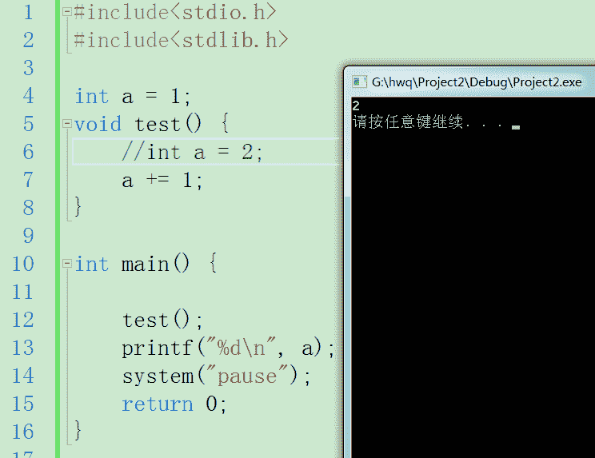
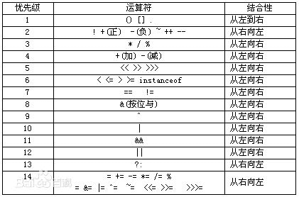

# 比格基地 2017 秋招 java 笔试试卷

## 1

在终端输入”ping [www.baidu.com](http://www.baidu.com)”发出的是什么报文：

正确答案: C   你的答案: 空 (错误)

```cpp
TCP 请求报文
```

```cpp
TCP 应答报文
```

```cpp
ICMP 请求报文
```

本题知识点

网络基础 Java 工程师 比格基地 2017

讨论

[华中第一狠人程德彪](https://www.nowcoder.com/profile/616662)

**答案为：C**Ping 程序的实现
   1 实现方法是主机向远程计算机发出 ICMP 回显请求以后，远程计算机会拦截这个请求，然后生成一条一条回显应答信息，再通过网络传回给主机。
   2 假如某些原因，不能抵达目标主机，就会生成对应的 ICMP 错误消息("比如 目标主机访问不可达"),由原先打算建立通信的那个路径上某处的一个路由器返回。
   3 假定与主机的物理性连接并不存在问题，但远程主机已经关机或没有设置对网路事件作出相应，便需由自己的程序来执行超时检测，侦测出这样的情况。

发表于 2017-03-18 09:31:39

* * *

[青稞 gxf](https://www.nowcoder.com/profile/7633532)

C 可直接 man ping 自己查看手册，有详细说明。

编辑于 2016-12-20 14:27:52

* * *

## 2

以下关于 C++的描述中哪一个是正确的：

正确答案: C   你的答案: 空 (错误)

```cpp
任何指针都必须指向一个实例
```

```cpp
子类指针不可以指向父类实例
```

```cpp
任何引用都必须指向一个实例
```

```cpp
引用所指向的实例不可能无效
```

本题知识点

C++ Java 工程师 比格基地 2017

讨论

[ncuneu](https://www.nowcoder.com/profile/699015)

答案 C
这里主要说一下 B 选项，在已有知识结构中。我们仅仅知道父类指针可以指向子类对象。
但是反过来，利用子类指针指向父类对象其实也是可以的。仅仅限于编译成功。但是使用时会有问题。比如下面代码：

```cpp
#include <iostream> 
using namespace std;
class Base {
public:
    int a = 2;
    void pr() {
        cout << "Base::pr" << endl;    
    }
};

class Derive: public Base {
public:
    int b = 3;
    void pr() {
        cout << "Derive::pr" << endl;    
    }
};
int main (int argc, char ** argv) {
 Base Bp1;
    Derive *D1 = (Derive*)(&Bp1); // 这种强制类型转换可以
    Bp1.pr();
    D1->pr();
    cout << "D1->b:" << D1->b << endl;
    cout << "D1->a:" << D1->a << endl;
    return 0;
}
```

编译器版本： `g++ (Ubuntu 5.4.0-6ubuntu1~16.04.10) 5.4.0 20160609`
此时编译成功。如果上面利用 `dynamic_cast` 进行强制转换，此时会失败。
运行结果：

```cpp
Base::pr
Derive::pr
D1->b:0
D1->a:2
```

从结果可以看出。B 选项中实际上子类指针可以指向父类实例的。但是这里可以发现，我们打印 `D1->b`变量时，此时变量为 0。然后我们调用 `D1->pr()` 时，能够打印出子类 pr 函数。我们打印 `D1->a` 时，也能顺利打印为 2。
下面解释原因：
1）为什么子类能够打印函数 pr()？

> 因为子类成员函数归类所有，不是归实例所有

2）为什么子类打印 b 成员变量时，为 0。（这里也可能是其他数）？

> 因为实例本身是父类对象。而成员变量是归实例对象所有。因此这里实际上内存中的成员变量就有 a =2 变量。但是这里又能成功访问 b。是因为编译器在编译子类指针 D1 时，认为内存中有 b 这个变量。所以编译能够成功。但是实际上，这块内存是父类对象的。根本没有 b 这个变量。因此，这里打印 b 时，结果就是随机值。

发表于 2019-02-21 22:29:35

* * *

[牛客 2755833 号](https://www.nowcoder.com/profile/2755833)

引用指向局部对象就可能无效

发表于 2017-03-27 08:59:05

* * *

[是萌萌的前辈呀](https://www.nowcoder.com/profile/649256)

引用就是其他变量或对象的别名，所以不能只有声明

发表于 2017-06-21 18:23:27

* * *

## 3

以下哪一项不属于浏览器 Response Headers 字段：

正确答案: A   你的答案: 空 (错误)

```cpp
Referer
```

```cpp
Connection
```

```cpp
Content-Type
```

```cpp
Server
```

本题知识点

Javascript Java 工程师 比格基地 2017

讨论

[墨裳花开](https://www.nowcoder.com/profile/994851)

答案：a 解析：说一说常见的请求头和相应头都有什么呢？1)请求(客户端->服务端[request])
    GET(请求的方式) /newcoder/hello.html(请求的目标资源) HTTP/1.1(请求采用的协议和版本号)
    Accept: */*(客户端能接收的资源类型)
    Accept-Language: en-us(客户端接收的语言类型)
    Connection: Keep-Alive(维护客户端和服务端的连接关系)
    Host: localhost:8080(连接的目标主机和端口号)
    Referer: http://localhost/links.asp(告诉服务器我来自于哪里)
    User-Agent: Mozilla/4.0(客户端版本号的名字)
    Accept-Encoding: gzip, deflate(客户端能接收的压缩数据的类型)
    If-Modified-Since: Tue, 11 Jul 2000 18:23:51 GMT(缓存时间) 
    Cookie(客户端暂存服务端的信息)

    Date: Tue, 11 Jul 2000 18:23:51 GMT(客户端请求服务端的时间)

2)响应(服务端->客户端[response])
    HTTP/1.1(响应采用的协议和版本号) 200(状态码) OK(描述信息)
    Location: http://www.baidu.com(服务端需要客户端访问的页面路径) 
    Server:apache tomcat(服务端的 Web 服务端名)
    Content-Encoding: gzip(服务端能够发送压缩编码类型) 
    Content-Length: 80(服务端发送的压缩数据的长度) 
    Content-Language: zh-cn(服务端发送的语言类型) 
    Content-Type: text/html; charset=GB2312(服务端发送的类型及采用的编码方式)
    Last-Modified: Tue, 11 Jul 2000 18:23:51 GMT(服务端对该资源最后修改的时间)
    Refresh: 1;url=http://www.it315.org(服务端要求客户端 1 秒钟后，刷新，然后访问指定的页面路径)
    Content-Disposition: attachment; filename=aaa.zip(服务端要求客户端以下载文件的方式打开该文件)
    Transfer-Encoding: chunked(分块传递数据到客户端）  
    Set-Cookie:SS=Q0=5Lb_nQ; path=/search(服务端发送到客户端的暂存数据)
    Expires: -1//3 种(服务端禁止客户端缓存页面数据)
    Cache-Control: no-***(服务端禁止客户端缓存页面数据)  
    Pragma: no-***(服务端禁止客户端缓存页面数据)   
    Connection: close(1.0)/(1.1)Keep-Alive(维护客户端和服务端的连接关系)  

    Date: Tue, 11 Jul 2000 18:23:51 GMT(服务端响应客户端的时间)**在服务器响应客户端的时候，带上 Access-Control-Allow-Origin 头信息，解决跨域的一种方法。**

发表于 2017-02-14 10:39:30

* * *

[alisbirds](https://www.nowcoder.com/profile/960143)

A，理由：Referer 是 request Header 里的内容，不是 response header 里的内容。

发表于 2017-02-09 10:57:34

* * *

[lxd19931107](https://www.nowcoder.com/profile/838204920)

说一说常见的请求头和相应头都有什么呢？1)请求(客户端->服务端[request]) 
    GET(请求的方式) /newcoder/hello.html(请求的目标资源) HTTP/1.1(请求采用的协议和版本号) 
    Accept: */*(客户端能接收的资源类型) 
    Accept-Language: en-us(客户端接收的语言类型) 
    Connection: Keep-Alive(维护客户端和服务端的连接关系) 
    Host: localhost:8080(连接的目标主机和端口号) 
    Referer: http://localhost/links.asp(告诉服务器我来自于哪里) 
    User-Agent: Mozilla/4.0(客户端版本号的名字) 
    Accept-Encoding: gzip, deflate(客户端能接收的压缩数据的类型) 
    If-Modified-Since: Tue, 11 Jul 2000 18:23:51 GMT(缓存时间)  
    Cookie(客户端暂存服务端的信息) 

    Date: Tue, 11 Jul 2000 18:23:51 GMT(客户端请求服务端的时间)

2)响应(服务端->客户端[response])
    HTTP/1.1(响应采用的协议和版本号) 200(状态码) OK(描述信息)
    Location: [`www.baidu.com`](http://www.baidu.com)(服务端需要客户端访问的页面路径) 
    Server:apache tomcat(服务端的 Web 服务端名)
    Content-Encoding: gzip(服务端能够发送压缩编码类型) 
    Content-Length: 80(服务端发送的压缩数据的长度) 
    Content-Language: zh-cn(服务端发送的语言类型) 
    Content-Type: text/html; charset=GB2312(服务端发送的类型及采用的编码方式)
    Last-Modified: Tue, 11 Jul 2000 18:23:51 GMT(服务端对该资源最后修改的时间)
    Refresh: 1;url=[`www.it315.org`](http://www.it315.org)(服务端要求客户端 1 秒钟后，刷新，然后访问指定的页面路径)
    Content-Disposition: attachment; filename=aaa.zip(服务端要求客户端以下载文件的方式打开该文件)
    Transfer-Encoding: chunked(分块传递数据到客户端）  
    Set-Cookie:SS=Q0=5Lb_nQ; path=/search(服务端发送到客户端的暂存数据)
    Expires: -1//3 种(服务端禁止客户端缓存页面数据)
    Cache-Control: no-***(服务端禁止客户端缓存页面数据)  
    Pragma: no-***(服务端禁止客户端缓存页面数据)   
    Connection: close(1.0)/(1.1)Keep-Alive(维护客户端和服务端的连接关系)  

    Date: Tue, 11 Jul 2000 18:23:51 GMT(服务端响应客户端的时间)在服务器响应客户端的时候，带上 Access-Control-Allow-Origin 头信息，解决跨域的一种方法。

发表于 2019-04-09 17:18:58

* * *

## 4

以下代码的运行结果为：

```cpp
class Base {
    public:
        Base() {
            echo();
        }
        virtual void echo() {
            printf("Base");
        }
};

class Derived:public Base {
    public:
        Derived() {
            echo();
        }
        virtual void echo() {
            printf("Derived");
        }
};

int main() {
    Base* base = new Derived();
    base->echo();
    return 0;
}
```

正确答案: D   你的答案: 空 (错误)

```cpp
Derived
Derived
Derived
```

```cpp
Derived
Base
Derived
```

```cpp
Base
Derived
Base
```

```cpp
Base
Derived
Derived
```

本题知识点

C++

讨论

[R0b1n](https://www.nowcoder.com/profile/9885630)

先说结论：不要在构造函数和析构函数中调用虚函数下面说说原理：假如基类有个虚函数那么编译器会为其创建虚函数表 vtbl 并在对象的内存空间创建虚函数指针 vptr 虚函数表的原理是每个类会在里面有自己的所能调用到的虚函数地址对象的内存空间一般只有两样东西：虚函数指针 vptr 和 数据成员（包括直接基类和间接基类的）在对象初始化过程中先构造基类对象再构造派生类对象也就是说当前正在执行基类的构造函数时执行完初始化列表之后 执行构造函数体之前编译器插入了初始化 vptr 的逻辑令对象的 vptr 指向是基类的 vtbl 所以此时无论如何也访问不到派生类的 vtbl 也就无法调用派生类中覆盖（overrided）了的虚函数只有执行到派生类的构造函数时才能更新 vptr 指向派生类的 vtbl 此后调用的虚函数才是派生类中覆盖了的虚函数析构函数函数是构造函数的逆过程所以在派生类的析构函数中的 vptr 基类析构函数中的 vptr 是不同的同样是执行析构函数体之前就被改为了对应当前类的 vptr 下面我们做个实验验证一下

```cpp
struct Base {
    void printVPTR() {
        void (***pvptr)() = reinterpret_cast<void (***)()>(this);
        void (**vptr)() = *pvptr;
        printf("%p\n%p\n", this, vptr);
    }
    Base() {printVPTR();}
    virtual ~Base() {printVPTR();}
};
struct Derived : Base {
    Derived() {printVPTR();}
    ~Derived() override {printVPTR();}
};
int main() {
    Derived d;
}
```

打印结果：

**0x7fff5fbff748**

**0x1000010a8**

**0x7fff5fbff748**

**0x100001060**

**0x7fff5fbff748**

**0x100001060**

**0x7fff5fbff748****0x1000010a8**各位可以看到构造/析构过程中 this 指针是没变的因为基类子对象和派生类子对象的区域是重叠的都是从对象的基地址开始偏移为 0 的内存**如果是非第一直接基类的指针****偏移就不是 0 了****而是要加上在其之前的基类的成员的 size****回到正题****我们看 vptr 的值在不同的构造函数中是不同的****基类是****0x1000010a8****派生类是****0x100001060****中间有 72bytes 也就是 9 个 ptr 的间隔****这段空间是派生类 vtbl 所占用的****主要存储了重载的虚函数和 type_info 指针****对于每种编译器 vtbl 的内容千差万别千奇百怪****一般都会有虚函数和 type_info 指针****感兴趣的朋友可以用示例代码中得到的 vptr 解引用得到的函数指针来遍历这段内存****看看你所用的编译器在里面究竟存了什么玩意儿****我在另一个问题里详细地讨论了继承模型的内存布局****[`www.nowcoder.com/questionTerminal/d372baa5e8954ac6b51e297a89a3f404?toCommentId=764869`](https://www.nowcoder.com/questionTerminal/d372baa5e8954ac6b51e297a89a3f404?toCommentId=764869)** **回到正题****这两个指针说明构造和析构会及时地修改 vptr 以匹配当前的类****由此证明了开头的论点：**不要在构造函数和析构函数中调用虚函数因为基类构造函数执行时对象的 vptr 是指向基类的 vtbl 而不是你所要创建的派生类的 vtbl 因此你无法获得预期的虚函数多态

编辑于 2017-09-27 12:32:19

* * *

[木头疼人](https://www.nowcoder.com/profile/4906226)

Base* base = new  Derived();//首先将上面的语句分成两部分：//前一部分是基类指针指向子类对象实现动态绑定，后一部分是 new 了一个子类对象；//语句执行时，先执行后一部分 new Derived()这句话，它会调用 Derived() {echo();}//而执行派生类的构造函数时，会先去执行基类的构造函数，所以会调用 Base() {echo();}，此时不涉及到虚函数的动态绑定，//因为我们现在才执行了后一部分，还没有动态绑定，所以正常调用基类的 echo()函数，执行完后返回到子类的构造函数，执行子类的 echo()；//然后执行前一部分，实现虚函数的动态绑定。base->echo();//此时考察的就是虚函数的使用了，基类 echo 申明为虚函数，所以调用时会去子类寻找对应的虚函数执行。

发表于 2017-09-11 10:01:35

* * *

[Hustlion](https://www.nowcoder.com/profile/974398)

首先声明 Base 类型的指针指向实际类型为 Derived 的对象，先调用基类构造函数，再调用派生类构造函数。输出 Base, Derived.base->echo(); 指针是 base 类型，但是因为有关键词 virtual，所以不是隐藏而是重写.调用的是 Derived 的方法，输出 Derived。1.重载：重载从 overload 翻译过来，是指同一可访问区内被声明的几个具有不同参数列（参数的类型，个数，顺序不同）的同名函数，根据参数列表确定调用哪个函数，重载不关心函数返回类型。2.隐藏：隐藏是指派生类的函数屏蔽了与其同名的基类函数。注意只要同名函数，不管参数列表是否相同，基类函数都会被隐藏。3.重写：重写翻译自 override，也翻译成覆盖（更好一点），是指派生类中存在重新定义的函数。其函数名，参数列表，返回值类型，所有都必须同基类中被重写的函数一致。只有函数体不同（花括号内），派生类调用时会调用派生类的重写函数，不会调用被重写函数。重写的基类中被重写的函数必须有 virtual 修饰。

发表于 2017-05-15 18:11:43

* * *

## 5

MySQL 主从架构的主数据库中不可能出现的日志为：

正确答案: C   你的答案: 空 (错误)

```cpp
错误日志
```

```cpp
事物日志
```

```cpp
中继日志
```

```cpp
重做日志
```

本题知识点

数据库 Java 工程师 比格基地 2017

讨论

[qiqi715](https://www.nowcoder.com/profile/8507123)

**主服务器**将改变记录到二进制日志文件（binary log)中，**从服务器**将主服务器的二进制文件拷贝到它的中继日志（relay log)中，并重新开启线程处理中继日志中的事件。

发表于 2017-01-18 10:49:36

* * *

[phoenixfrank](https://www.nowcoder.com/profile/969156946)

实话说这道题我是排除法蒙的...

编辑于 2021-08-18 12:50:11

* * *

[openmind.](https://www.nowcoder.com/profile/539390139)

**从服务器的 slave 进程从主服务器处获取二进制日志的内容并写入中继日志，然后由 IO 进程读取并执行中继日志中的语句。**
MySQL 中日志类型 a、错误日志：记录启动、运行或停止 mysqld 时出现的问题。b、通用日志：记录建立的客户端连接和执行的语句。c、更新日志：记录更改数据的语句。该日志在 MySQL 5.1 中已不再使用。d、二进制日志：记录所有更改数据的语句。还用于复制。e、慢查询日志：记录所有执行时间超过 long_query_time 秒的所有查询或不使用索引的查询。f、Innodb 日志：innodb redo logg、中继日志(relay log)**: 用于主从复制架构中的从服务器上**

发表于 2021-03-09 18:28:23

* * *

## 6

下列选项中，不属于 JavaScript 数据类型的一项是（）

正确答案: D   你的答案: 空 (错误)

```cpp
String
```

```cpp
Boolean
```

```cpp
Undefined
```

```cpp
Integer
```

本题知识点

Javascript Java 工程师 比格基地 2017

讨论

[略略略 321](https://www.nowcoder.com/profile/1745790)

5 个基本(简单)类型:string boolean number null undefined 1 个复杂类型:object

发表于 2017-03-20 10:12:54

* * *

[ipofss](https://www.nowcoder.com/profile/593228)

在 JavaScript 中有 5 种不同的数据类型：string 、number 、boolean 、object 、function3 种对象类型：Object 、Date 、Array2 个不包含任何值的数据类型：null 、undefined

发表于 2017-02-26 10:13:03

* * *

[最讨厌晚上 9 点半，钉钉响起的声音](https://www.nowcoder.com/profile/303433)

Integer 是整数 int 的全称。在 js 中数值只有 number 类型。在其它语言中会区分 int 和 float 和 double

发表于 2017-04-14 22:17:06

* * *

## 7

以下不属于 Linux 系统命令的是：

正确答案: D   你的答案: 空 (错误)

```cpp
kill
```

```cpp
ifconfig
```

```cpp
mv
```

```cpp
remove
```

本题知识点

Linux Java 工程师 比格基地 2017

讨论

[佛系 IT 女](https://www.nowcoder.com/profile/626994839)

我现在做的题是 remove 不是 rename，呃(~_~;)

发表于 2018-10-11 22:30:01

* * *

[潜伏者～～～](https://www.nowcoder.com/profile/9467213)

答案:D kill 命令用法： 1.作用 kill 命令用来中止一个进程。 2.格式 kill [ －s signal | －p ] [ －a ] pid ... kill －l [ signal ] 3.参数 －s：指定发送的信号。 －p：模拟发送信号。 －l：指定信号的名称列表。 pid：要中止进程的 ID 号。 Signal：表示信号。 ifconfig 命令用法: 1．命令格式： ifconfig [网络设备] [参数] 2．命令功能： ifconfig 命令用来查看和配置网络设备。当网络环境发生改变时可通过此命令对网络进行相应的配置。 3．命令参数： up 启动指定网络设备/网卡。 down 关闭指定网络设备/网卡。该参数可以有效地阻止通过指定接口的 IP 信息流，如果想永久地关闭一个接口，我们还需要从核心路由表中将该接口的路由信息全部删除。 arp 设置指定网卡是否支持 ARP 协议。 -promisc 设置是否支持网卡的 promiscuous 模式，如果选择此参数，网卡将接收网络中发给它所有的数据包 -allmulti 设置是否支持多播模式，如果选择此参数，网卡将接收网络中所有的多播数据包 -a 显示全部接口信息 -s 显示摘要信息（类似于 netstat -i） add 给指定网卡配置 IPv6 地址 del 删除指定网卡的 IPv6 地址 <硬件地址> 配置网卡最大的传输单元 mtu<字节数> 设置网卡的最大传输单元 (bytes) netmask<子网掩码> 设置网卡的子网掩码。掩码可以是有前缀 0x 的 32 位十六进制数，也可以是用点分开的 4 个十进制数。如果不打算将网络分成子网，可以不管这一选项；如果要使用子网，那么请记住，网络中每一个系统必须有相同子网掩码。 tunel 建立隧道 dstaddr 设定一个远端地址，建立点对点通信 -broadcast<地址> 为指定网卡设置广播协议 -pointtopoint<地址> 为网卡设置点对点通讯协议 multicast 为网卡设置组播标志 address 为网卡设置 IPv4 地址 txqueuelen<长度> 为网卡设置传输列队的长度 mv 命令用法: 1．命令格式： mv [选项] 源文件或目录 目标文件或目录 2．命令功能： 视 mv 命令中第二个参数类型的不同（是目标文件还是目标目录），mv 命令将文件重命名或将其移至一个新的目录中。当第二个参数类型是文件时，mv 命令完成文件重命名，此时，源文件只能有一个（也可以是源目录名），它将所给的源文件或目录重命名为给定的目标文件名。当第二个参数是已存在的目录名称时，源文件或目录参数可以有多个，mv 命令将各参数指定的源文件均移至目标目录中。在跨文件系统移动文件时，mv 先拷贝，再将原有文件删除，而链至该文件的链接也将丢失。 3．命令参数： -b ：若需覆盖文件，则覆盖前先行备份。 -f ：force 强制的意思，如果目标文件已经存在，不会询问而直接覆盖； -i ：若目标文件 (destination) 已经存在时，就会询问是否覆盖！ -u ：若目标文件已经存在，且 source 比较新，才会更新(update) -t ： --target-directory=DIRECTORY move all SOURCE arguments into DIRECTORY，即指定 mv 的目标目录，该选项适用于移动多个源文件到一个目录的情况，此时目标目录在前，源文件在后。

编辑于 2017-02-08 15:51:33

* * *

[蒟蒻的菜鸡](https://www.nowcoder.com/profile/779405)

kill 杀死进程 ifconfig 显示网卡相关信息 mv 移动文件

发表于 2017-12-30 22:00:25

* * *

## 8

使用命令 vi/etc/inittab 查看该文件的内容，不小心改动了一些内容，为了防止系统出错，不想保存所修改的内容，应该如何操作（）

正确答案: B   你的答案: 空 (错误)

```cpp
在末行模式下，键入 :wq
```

```cpp
在末行模式下，键入 :q!
```

```cpp
在末行模式下，键入 :x!
```

```cpp
在编辑模式下，键入 ESC 键直接退出 vi
```

本题知识点

Linux Java 工程师 比格基地 2017

讨论

[ご一粒沙尘/ty](https://www.nowcoder.com/profile/6660514)

正确答案：B 理由：A :wq   强制性写入文件并退出。即使文件没有被修改也强制写入，并更新文件的修改时间。B  q！ 直接强制退出 C  x！  写入文件并退出。仅当文件被修改时才写入，并更新文件修改时间，否则不会更新文件修改时间。D 在编辑模式下，键入”ESC”键不退出 vi 直接进入命令模式

发表于 2017-02-25 14:12:10

* * *

[牛客 192645698 号](https://www.nowcoder.com/profile/192645698)

w 为保存，q 为退出，！为强制执行

发表于 2020-11-17 16:20:46

* * *

[sughur](https://www.nowcoder.com/profile/791206879)

Linux 下的 /etc/inittab 解释：此文件描述 init 进程应如何在特定的运行级别中设置系统。inittab 文件描述在启动时和正常操作期间启动的进程。etc: and so on

发表于 2019-03-05 09:47:25

* * *

## 9

下列哪个 git 命令不是合并代码用的：

正确答案: D   你的答案: 空 (错误)

```cpp
git pull --rebase
```

```cpp
git merge
```

```cpp
git cherry-pick
```

```cpp
git blame
```

本题知识点

Linux Java 工程师 比格基地 2017

讨论

[后劲好大](https://www.nowcoder.com/profile/4013442)

使用 git merge 命令； 使用 git pull 命令；
使用 git cherry-pick 命令
都可以合并 执行*git* *blame*;命令时,会逐行显示文件,并在每一行的行首显示 commit 号,提交者,最早的提交日期等

发表于 2017-06-07 11:20:52

* * *

[Aspiration2020~2021](https://www.nowcoder.com/profile/817600253)

git 命令合并代码：（1）git merge；（2）git pull；（3）git cherry-pick**git blame：***执行该*命令时,会逐行显示文件,并在每一行的行首显示 commit 号,提交者,最早的提交日期等

发表于 2020-03-29 17:13:39

* * *

[牛客 95270 号](https://www.nowcoder.com/profile/5571543)

应该是 D 吧。如果你要查看文件的每个部分是谁修改的, 那么 [git blame](http://www.kernel.org/pub/software/scm/git/docs/git-blame.html) 就是不二选择. 只要运行'git blame [filename]', 你就会得到整个文件的每一行的详细修改信息:包括 SHA 串,日期和作者。（http://gitbook.liuhui998.com/5_5.html）pull 当然算是合并代码啊

发表于 2017-01-11 21:48:33

* * *

## 10

以下程序输出为（）

```cpp
#include<stdio.h>
#include<stdlib.h>

int a = 1;
void test(){
    int a = 2;
    a += 1;
}

int main(){
    test();
    printf("%d\n", a);
    return 0;
}
```

正确答案: A   你的答案: 空 (错误)

```cpp
1
```

```cpp
2
```

```cpp
3
```

```cpp
4
```

本题知识点

C++

讨论

[向日葵的旅行](https://www.nowcoder.com/profile/961382)

如果 test()再新建了变量 a（如题），那么会屏蔽掉全局变量 a，即 test()里面的 a 和全局变量 a 是两个不同的 a。如果 test()没有新建变量 a，那么使用的是全局变量的 a。即，如果改为：#include<stdio.h>#include<stdlib.h>int a=1;void test(){a=2;//题中为 int a=2a+=1;}int main(){test();printf("%d\n",a);return 0;}这样的话结果为 3

编辑于 2018-04-08 16:38:06

* * *

[诩 201907172220452](https://www.nowcoder.com/profile/633998327)

printf 打印是在 main 函数里面，定义的 test 函数并没有返回值，所以并不能影响 main 函数里面 a 的值，因此 main 函数中打印出来的是全局变量定义的 int a=1

发表于 2019-07-19 23:13:56

* * *

[aci201801221525540](https://www.nowcoder.com/profile/9061552)



发表于 2018-04-10 21:03:58

* * *

## 11

以下程序的 k 最终值是：

```cpp
int i = 10;
int j = 20;
int k = 3;
k *= i + j;
```

正确答案: A   你的答案: 空 (错误)

```cpp
90
```

```cpp
50
```

```cpp
70
```

```cpp
30
```

本题知识点

C++

讨论

[菜鸟葫芦娃](https://www.nowcoder.com/profile/415611)

*=表示将第一个操作数的值与  查看全部)

编辑于 2016-12-13 21:26:35

* * *

[rs 勿忘初心](https://www.nowcoder.com/profile/7491640)

```cpp
主要考优先级：+的优先级高于*=，所以 k*=i+j 等价于 k*=（i+j）。
```



发表于 2017-07-07 21:14:38

* * *

[sunshine193](https://www.nowcoder.com/profile/2551444)

k *= i + j;这句代码就等价于 k=k*(i+j)，所以应该为 90

发表于 2017-04-07 09:02:50

* * *

## 12

下列正则表达式不能匹配”[www.innotechx.com](http://www.innotechx.com)”的是：

正确答案: A D   你的答案: 空 (错误)

```cpp
^w+.w+.w+$
```

```cpp
[w]{0,3}.[a-z]*.[a-z]+
```

```cpp
^w.*com$
```

```cpp
[w]{3}.[a-z]{11}.[a-z]
```

本题知识点

Java 工程师 比格基地 2017

讨论

[小白 111](https://www.nowcoder.com/profile/1459401)

首先来看 A 选项，^表示匹配字符串的开始，而 w 和 . 是没有特殊意义的，千万不要看错成是“\w（匹配字母或数字或下划线或汉字）”了，+ 表示重复一次或者多次，$是匹配字符串的结束。所以该选项会匹配 [www.www.www](http://www.www.www)（其中 w 可重复一次以上）。B 选项，[w]{0,3}限定符，表示将 w 重复 0 到 3 次，  “ . ”无特殊意义，* 表示重复任意次，包括零次，[a-z]表示匹配 a 到 z 的字母，所以就是匹配 a 到 z 中的某一字母任意次重复。后面这个相同意思，就是+号是重复一次以上。连起来看，是可以匹配选项的。C 选项，与上述选项相同，^先匹配字符串开始，然后包含一个 w ，和 " . "重复任意次，最后以 com 结尾。这个正则会匹配包含了 “wcom”的字符串，但是 w 要是开头，com 要是结尾，所以可以匹配选项，大家可以自己试试看。D 选项，重复三次 w，然后一个" . ",但是后面这里要重复 11 次 a 到 z 中的某一字母，数了下题目中选项只有 9 个字母，后面就不要看啦，已经错啦~废话 有点多吼，有说错了请指出，刚学也不怎么懂~。

发表于 2017-08-03 16:14:54

* * *

[向宇隔壁](https://www.nowcoder.com/profile/5161568)

| 特别字符 | 说明 |
| $ | 匹配输入字符串的结尾位置。如果设置了 RegExp 对象的 Multiline 属性，则 $ 也匹配 ‘\n’ 或 ‘\r’。要匹配 $ 字符本身，请使用 \$。 |
| ( ) | 标记一个子表达式的开始和结束位置。子表达式可以获取供以后使用。要匹配这些字符，请使用 \( 和 \)。 |
| * | 匹配前面的子表达式零次或多次。要匹配 * 字符，请使用 \*。 |
| + | 匹配前面的子表达式一次或多次。要匹配 + 字符，请使用 \+。 |
| . | 匹配除换行符 \n 之外的任何单字符。要匹配 .，请使用 \。 |
| [ | 标记一个中括号表达式的开始。要匹配 [，请使用 \[。 |
| ? | 匹配前面的子表达式零次或一次，或指明一个非贪婪限定符。要匹配 ? 字符，请使用 \?。 |
| \ | 将下一个字符标记为或特殊字符、或原义字符、或向后引用、或八进制转义符。例如， ‘n’ 匹配字符 ‘n’。’\n’ 匹配换行符。序列 ‘\\’ 匹配 “\”，而 ‘\(’ 则匹配 “(”。 |
| ^ | 匹配输入字符串的开始位置，除非在方括号表达式中使用，此时它表示不接受该字符集合。要匹配 ^ 字符本身，请使用 \^。 |
| { | 标记限定符表达式的开始。要匹配 {，请使用 \{。 |
| &#124; | 指明两项之间的一个选择。要匹配 &#124;，请使用 \&#124;。 |

发表于 2017-08-02 14:42:34

* * *

[#pragma mark](https://www.nowcoder.com/profile/734920)

A 和 D 都匹配失败

发表于 2017-02-28 17:58:09

* * *

## 13

袋中有红球，黄球，白球各一个，每次任意取一个放回，如此连续 3 次，则 3 次取到的颜色不全相同的概率是：

正确答案: A   你的答案: 空 (错误)

```cpp
8/9
```

```cpp
1/9
```

```cpp
1/3
```

```cpp
1/27
```

本题知识点

概率统计 *Java 工程师 比格基地 2017 概率论与数理统计* *讨论

[梦境迷离](https://www.nowcoder.com/profile/759736)

看来只有我把题目看成了完全不相同。。

发表于 2018-03-01 13:36:22

* * *

[SunburstRun](https://www.nowcoder.com/profile/557336)

答案是 A           我们先算三次都相同的概率,那么第一次取球可以随便,不计算,第二次和第一次相同的概率为 1/3,第三次和第二次又相同的概率也为 1/3,那么三次都相同为 1/9,那么不全相同为 8/9

发表于 2016-12-21 21:05:17

* * *

[offerヾ+++](https://www.nowcoder.com/profile/580795079)

不全相同的情况有很多，从对立事件出发即全相同，共三种情况，红红红、黄黄黄、绿绿绿；则 1—3/3³=8/9

发表于 2019-04-18 21:16:30

* * *

## 14

当前有若干个请求者等待访问磁盘，访问的磁道顺序为：86,134,78,177,101,150,102,175,130，当前磁头正在 125 柱面，如果使用最短寻道间优先算法，那么访问顺序应该为：

正确答案: B   你的答案: 空 (错误)

```cpp
86,134,78,177,101,150,102,175,130
```

```cpp
130,134,150,175,177,102,101,86,78
```

```cpp
78,86,101,102,177,175,150,134,130
```

```cpp
177,102,101,86,78,175,150,134,130
```

本题知识点

操作系统 Java 工程师 比格基地 2017

讨论

[Myopia](https://www.nowcoder.com/profile/8875399)

 选 B， 最短寻找时机优先算法选择调度处理的磁道是与当前磁头所在磁道距离最近的磁道，以使每次的寻找时间最短。当然，总是选择最小寻找时间并不能保证平均寻找时间最小，但是能提供比先来先服务算法更好的性能。这种算***产生“饥饿”现象。

编辑于 2017-02-22 12:43:48

* * *

[computer001](https://www.nowcoder.com/profile/819420031)

sstf

发表于 2019-08-09 17:14:45

* * *

## 15

钟表的时针和分针一天之内会重合多少次：

正确答案: B   你的答案: 空 (错误)

```cpp
19
```

```cpp
22
```

```cpp
24
```

```cpp
26
```

本题知识点

智力题 Java 工程师 比格基地 2017

讨论

[SunburstRun](https://www.nowcoder.com/profile/557336)

答案是 B           这个问题起来很简单,因为分针每小时走一圈,它每走一圈就要跟时针重叠一次；一天有 24 小时,分针与时针起不是要重叠 24 次吗?初听起来,这个说法似乎很对,但事实上,分针与时针一天里只重叠 22 次.为什麼呢?怎麼会少了两次呢?仔细的想一下,就可以明白了.虽然分针走一圈,会和时针重叠一次,但是分针走的时候,时针并不是静止不动的；原来分针每走 12 圈,时针自己也要走一圈；因此,对时针来说,分针只绕时针走了 11 圈.当分针走了 24 圈的时候,时针也走了 2 圈；因此,分针绕时针只走了 22 圈,所以只重叠 22 次.

发表于 2016-12-21 22:56:26

* * *

[菜鸟四号](https://www.nowcoder.com/profile/1366555)

```cpp
#include<cstdio>
#include<cstdlib>
#include<cmath>
#include<iostream>
#include <cstring>
#include<algorithm>
using namespace std;
int main() {
    int cnt=0;
    for(int i=1;i<60;i++)
    {
        for(int j=0;j<24;j++)
        {
            if((int)((i/60.0+j)*5)==i)
                cnt++;
        }
    }
    cout<<2*cnt<<endl;
    return 0;
} 
```

发表于 2017-08-05 09:28:09

* * *

[Moon_Knight](https://www.nowcoder.com/profile/8714524)

只看 12 小时，起初时针和分针都在 12 的位置，这次重合不算，(12,1]时针和分针没有重合，(1,2]，(2,3]，...，(11,12]这 11 个区间都有重合，其中(11,12]这个区间时针和分针重合在 12 的位置。
所以 24 小时就是 11*2=22.

发表于 2017-07-30 22:44:40

* * *

## 16

有 7 本书，需要从中选出 4 本书来，并满足以下条件：若选 R，则一定要选 T，若选 S，则一定要选 U，若选 X 和 Y，则一定不选 T，如果同时选 S 和 Z，下面哪本书不能被选中？

正确答案: C   你的答案: 空 (错误)

```cpp
U
```

```cpp
T
```

```cpp
R
```

```cpp
X
```

本题知识点

组合数学 *Java 工程师 比格基地 2017* *讨论

[InGodWeTrust](https://www.nowcoder.com/profile/2178882)

选择 SZ 则一定选 U,若再选 R 则一定选 T，就 5 本了。。。

发表于 2017-01-02 15:51:51

* * *

[~火车头~](https://www.nowcoder.com/profile/4059609)

脑筋急转弯

发表于 2018-02-09 22:47:30

* * *

## 17

有 3 台复印机，平均每台每周工作 42 小时，每台每周最少工作 35 小时，那么一台复印机每周最多会工作多少小时：

正确答案: A   你的答案: 空 (错误)

```cpp
56
```

```cpp
49
```

```cpp
50
```

```cpp
52
```

本题知识点

组合数学 *Java 工程师 比格基地 2017* *讨论

[美团到店招聘](https://www.nowcoder.com/profile/3472441)

本题选择 A。因为每台机器至少工作 35 小时，所以对于机器 3 来说，要想使得机器 3 工作最长时间，则机器 1，机器 2 工作最短时间。所以：42*3-35*2 = 56(小时)

发表于 2017-03-17 14:52:33

* * *

[冲上顶峰](https://www.nowcoder.com/profile/189892324)

注意这里是一台复印机最多而不是三台复印机平均最多

发表于 2019-02-06 10:50:08

* * *

[炸鸡推广大使](https://www.nowcoder.com/profile/974839087)

注意最多！

发表于 2018-08-22 17:30:26

* * *

## 18

十进制数 9&5 的结果为：

正确答案: A   你的答案: 空 (错误)

```cpp
1
```

```cpp
2
```

```cpp
4
```

```cpp
5
```

本题知识点

编译和体系结构

讨论

[蒲之未落](https://www.nowcoder.com/profile/2380499)

9 的二进制为：1001,5 的二进制为：0101 所以 9&5 就相当于：1001&0101=0001；（&操作是按照与操作的，0&1 为 0,1&1 为 1）忧伤就可得 9&5 的二进制为：0001；将二进制转换成十进制，0001----2 的零次方（也就是 1）

发表于 2017-10-11 22:34:51

* * *

[🍃Ljx](https://www.nowcoder.com/profile/6858933)

9 的二进制为：1001,5 的二进制为：0101 所以 9&5 就相当于：1001&0101=0001；

发表于 2019-04-15 22:27:55

* * *

[warpar](https://www.nowcoder.com/profile/1756076)

9 的二进制为：1001,5 的二进制为：0101 所以 9&5 就相当于：1001&0101=0001；（&操作是按照与操作的，0&1 为 0,1&1 为 1）忧伤就可得 9&5 的二进制为：0001；将二进制转换成十进制，0001----2 的零次方（也就是 1）

发表于 2017-08-03 17:33:17

* * *

## 19

假设一个游乐场的游客到达速率为每分钟 30 人，平均每个游客在游乐场内的停留时间为 30 分钟，那么这个游乐场至少需要容纳多少人：

正确答案: D   你的答案: 空 (错误)

```cpp
600
```

```cpp
700
```

```cpp
800
```

```cpp
900
```

本题知识点

组合数学 *Java 工程师 比格基地 2017* *讨论

[小颜少颜](https://www.nowcoder.com/profile/793436)

D 900 假设最开始每人，到第 30 分钟前没人离开，共来了 900 人。之后来的人与离开的人数量一致维持平衡。

发表于 2017-02-21 09:13:42

* * *

[给口饭吃吧求求了](https://www.nowcoder.com/profile/222508282)

这题。。让我怀疑真的是这么算的吗，是不是哪里有坑。。然而并没有🤣

发表于 2019-05-17 10:34:22

* * *

## 20

假设我们每天 80%的访问集中在 20%的时间里（峰值），如果每天有 300 万的 pv，而 我们的单台机器的 QPS 为 58，那么大概需要几台这样的机器：

正确答案: A   你的答案: 空 (错误)

```cpp
3 台
```

```cpp
4 台
```

```cpp
5 台
```

```cpp
6 台
```

本题知识点

WebServer 软件测试 Java 工程师 比格基地 2017

讨论

[SunburstRun](https://www.nowcoder.com/profile/557336)

答案是 A          原理：每天 80%的访问集中在 20%的时间里，这 20%时间叫做峰值时间公式：( 总 PV 数 * 80% ) / ( 每天秒数 * 20% ) = 峰值时间每秒请求数(QPS)
机器：峰值时间每秒 QPS / 单台机器的 QPS = 需要的机器

问：每天 300w PV 的在单台机器上，这台机器需要多少 QPS？
答：( 3000000 * 0.8 ) / (86400 * 0.2 ) = 139 (QPS)

问：如果一台机器的 QPS 是 58，需要几台机器来支持？
答：139 / 58 = 3

发表于 2016-12-21 23:04:16

* * *

[spound](https://www.nowcoder.com/profile/9547739)

术语说明：
QPS = req/sec = 请求数/秒

【QPS 计算 PV 和机器的方式】

QPS 统计方式 [一般使用 http_load 进行统计]
QPS = 总请求数 / ( 进程总数 *   请求时间 )
QPS: 单个进程每秒请求服务器的成功次数

单台服务器每天 PV 计算
公式 1：每天总 PV = QPS * 3600 * 6
公式 2：每天总 PV = QPS * 3600 * 8

服务器计算
服务器数量 =   ceil( 每天总 PV / 单台服务器每天总 PV )

【峰值 QPS 和机器计算公式】

原理：每天 80%的访问集中在 20%的时间里，这 20%时间叫做峰值时间
公式：( 总 PV 数 * 80% ) / ( 每天秒数 * 20% ) = 峰值时间每秒请求数(QPS)
机器：峰值时间每秒 QPS / 单台机器的 QPS   = 需要的机器

问：每天 300w PV 的在单台机器上，这台机器需要多少 QPS？
答：( 3000000 * 0.8 ) / (86400 * 0.2 ) = 139 (QPS)

问：如果一台机器的 QPS 是 58，需要几台机器来支持？
答：139 / 58 = 3

发表于 2017-08-03 14:59:37

* * *

[仲夏 zj](https://www.nowcoder.com/profile/6856138)

QPS:每秒处理的查询数目 pv:页面浏览量每天 80%的访问集中在 20%的时间里，即访问时间为 0.2*24=4.8h=17280s，访问量为：300*0.8=240 万
单台机器处理的总的查询数目为：17280*58=1002240，约为 100 万题目中说明每天总的访问量为 240 万，即至少需要 3 台处理器。

发表于 2018-08-06 11:35:20

* * *

## 21

已知一个 0 到 99999999 之间的正整数，找到一个指定数字在该正整数中出现的次数。

DigitOccurrence 类的构造方法是 findDigitOccurrence。该方法的输入应包含两个正整数，  num1 和 num2，0<=num1<=9 and 0<=num2<=99999999。

该方法应返回一个整数变量，变量值等于 num1unm2 中的出现次数。

例如：如果 num1=2，num2=123228，则此方法应返回 3，即 num1 在 num2 中的出现次  数。

确保类和方法为 public。不要从控制台接受任何输入。应将输入作为参数传递给该方法  本身。

有用的命令：

a%b 返回 a 除以 b 的余数。

你的答案

本题知识点

Python C# Javascript Java C++ Java 工程师 比格基地 2017

讨论

[Zn 微凉](https://www.nowcoder.com/profile/6020390)

```cpp
public static void main(String[] args) {
        Scanner scanner = new Scanner(System.in);
        long giveNum;
        int forNum;
        while (true) {
            System.out.println("请输入一个整数(0-99999999)：");
            giveNum = scanner.nextLong();
            if (giveNum<0||giveNum>99999999){
                System.out.println("你输入的数字不符合要求，请重新输入！");
                continue;
            }
            System.out.println("请输入指定数字(0-9)；");
            forNum=scanner.nextInt();
            if (forNum<0||forNum>9){
                System.out.println("你要指定的数字不符合要求，请重新输入！");
                continue;
            }
            break;
        }
        System.out.println(forNum+"在"+giveNum+"中出现的次数为"+getTimes(giveNum,forNum)+"次");
    }

    private static int getTimes(long giveNum,int forNum){
        String str=giveNum+"";
        int count=0;

        for (int i = 0; i < str.length(); i++) {
            if ((forNum+"").equals(str.charAt(i)+"")){
                count++;
            }
        }
        return count;
    }
```

请输入一个整数(0-99999999)：
9416030
请输入指定数字(0-9)；
0
0 在 9416030 中出现的次数为 2 次

发表于 2019-09-08 18:45:39

* * *

[*迷离＊](https://www.nowcoder.com/profile/9173786)

```cpp
public class DigitOccurrence {
	private int num1;
	private int num2;

	public DigitOccurrence(int num1, int num2) {
		this.num1 = num1;
		this.num2 = num2;
	}

	public int demo() {
		int sum = 0;
		String num = String.valueOf(this.num2);
		char[] num3 = num.toCharArray();
		String temp = String.valueOf(num1);
		char num4 = temp.charAt(0);
		for (int i = 0; i < num3.length; i++) {
			if (num4 == num3[i]) {
				sum = sum + 1;
			}
		}
		return sum;
	}

	public static void main(String args[]) {
		DigitOccurrence d = new DigitOccurrence(2, 231924);
		System.out.println(d.demo());
	}

}
```

发表于 2017-08-04 16:27:26

* * *

[周 mu](https://www.nowcoder.com/profile/78960334)

```cpp

```
def getr(num1,num2):
   s1 = str(num1)
   s2 = str(num2)
   r = 0  for i in range(len(s2)): if s1 == s2[i]:
             r +=1  return r
c = getr(1,123211111) print(c)
```cpp

```

发表于 2018-07-08 12:22:20

* * *

## 22

给定一个整数 n，以下列方式打印 n 行。

如果 n=4，生成的阵列将为

1*2*3*4

9*10*11*12

13*14*15*16

5*6*7*8

SquarePattern 类的构造方法为 squarePatternPrint。该函数的输入是一个整数  n(0<=n<=100)。

不要从该方法返回任何内容。使用 System out.print()或 System out.println()打印所需的阵  列。

各输出行只能由“数字”和“*”组成。不应有空格。

确保你的类和方法是公共的(public)。不要接受来自控制台的任何输入。应将其作为参  数传递到方法自身。

有用的命令：

System.out.print()可将括号内的内容打印到屏幕上。

你的答案

本题知识点

Python C# Javascript Java C++ Java 工程师 比格基地 2017

讨论

[Zn 微凉](https://www.nowcoder.com/profile/6020390)

java 实现：

```cpp
public static void main(String[] args) {
        System.out.println("打印结果为：");
        int[][] print = print(5);
        for (int i = 0; i < print.length; i++) {
            for (int j = 0; j < print.length; j++) {
                if (j!=print.length-1){
                    System.out.print(print[i][j]+"*");
                }else {
                    System.out.print(print[i][j]);
                }
            }
            System.out.println();
        }
    }
    private static int[][] print(int n){
        int[] arrNum = new int[n * n];
        for (int i = 0; i < arrNum.length; i++) {
            arrNum[i]=i+1;
        }
        int[][] arr = new int[n][n];
        int start=0;
        int end =n-1;
        int index=0;
        while (true){
            for (int i = 0; i < n; i++) {
                arr[start][i]=arrNum[index++];
            }
            for (int i = 0; i < n; i++) {
                arr[end][i]=arrNum[index++];
            }
            start++;
            end--;
            if (start>end){
                break;
            }else if (start==end){
                for (int i = 0; i < n; i++) {
                    arr[start][i]=arrNum[index++];
                }
                break;
            }
        }
        return arr;
    }
```

打印结果为：
1*2*3*4*5
11*12*13*14*15
21*22*23*24*25
16*17*18*19*20
6*7*8*9*10

发表于 2019-09-08 18:17:43

* * *

[岁月为痕](https://www.nowcoder.com/profile/8934573)

按规律将数字存入二维数组中，然后按要求输出

发表于 2017-08-01 09:58:21

* * *

[*迷离＊](https://www.nowcoder.com/profile/9173786)

```cpp
public class SquarePattern {
```

private int n;public SquarePattern(int n) {this.n = n;}public void demo() {for (int i = 1; i <= n; i++) {for (int j = 1; j <= n; j++) {if (i == 1) {if (j != n) {System.out.print(j + "*");} else {System.out.print(n);System.out.println();}} else if (i == n) {if (j != n) {System.out.print(n + j + "*");} else {System.out.print(2 * n);System.out.println();}}else {if (j != n) {System.out.print(i * n + j + "*");} else {System.out.print((i + 1) * n);System.out.println();}}}}}public static void main(String args[]) {SquarePattern s = new SquarePattern(4);s.demo();}}

发表于 2017-08-04 16:33:30

* * *****