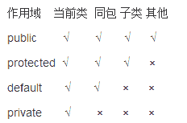
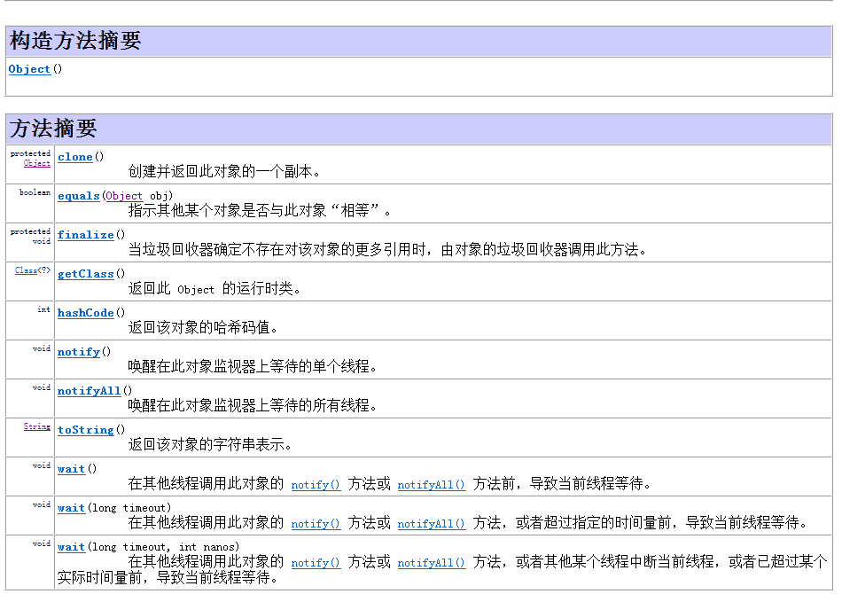
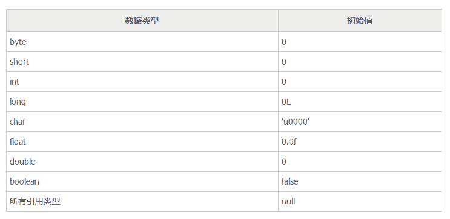

# 斐讯 2017 秋招 java 笔试试卷

## 1

在 java 中，一个类可同时定义为许多同名的方法，这些方法的形式参数个数，类型或顺序各不相同，传回的值可能各不相同，这种面向对象的特性称为（）

正确答案: C   你的答案: 空 (错误)

```cpp
隐藏
```

```cpp
覆盖
```

```cpp
重载
```

```cpp
无此特性
```

本题知识点

Java Java 工程师 斐讯 2017

讨论

[bbblemon](https://www.nowcoder.com/profile/3807435)

**选 C。****重载，多态在编译期的表现形式。出现在一个类中，判定重载的条件只有方法名一致，方法形参列表不同。其他的（如返回值，访问修饰符）都不可以判定。****重写，多态在运行期的表现形式。出现在子父类，实现类与接口中。判定重载有一个规律：“两同两小一大****”****两同：方法名和形参列表一致；****两小：抛出的异常和返回值相容于被重写的方法。（一旦返回值是基本数据类型，那重写的方法返回值必须一致或者是 Object）****一大：访问修饰符大于等于被重写方法。****注意：对于重写而言，只有可见的实例方法才可以被重写。静态方法和私有方法都是隐藏，不是重写！！！****《深入理解 JVM 虚拟机》，重载就是在编译期根据方法形参的静态类型确定方法版本，重写就是在运行期根据实际调用者的实际类型确定方法把版本。**

发表于 2018-06-29 11:33:46

* * *

[阿森先生](https://www.nowcoder.com/profile/4775155)

这是 java 重载（overload）的解释说明，用最为简单的一句话来解释重载：同名不同参，与返回值类型无关。

编辑于 2017-05-26 15:33:16

* * *

[请叫我码农](https://www.nowcoder.com/profile/908837333)

重载(Overload)

什么是重载？在一个类中定义了两个或两个以上的方法，我们就称之为重载

重载的要求：方法名必须保持一致，参数列表不一致，与返回值无关

注意：构造函数可重载！并且可以有 private 等修饰符

重写(Override)

重写的前提：必须存在继承关系

什么是重写？子类和父类中出现了同名的方法名，我们就称之为重写

什么情况下需要重写？父类中的方法无法满足于子类的需求

重写的要求：方法名和参数列表必须一致，子类方法的修饰符必须大于或等于父类方法的修饰符，子类方法的返回值必须小于或等于父类方法的返回值，子类方法抛出的异常必须小于或等于父类方法抛出的异常！

注：声明为 final 的方法不能重写但可重载

编辑于 2019-08-25 23:47:26

* * *

## 2

下面哪一项不是 java 类访问控制关键字

正确答案: B   你的答案: 空 (错误)

```cpp
public
```

```cpp
this
```

```cpp
private
```

```cpp
protected
```

本题知识点

Java Java 工程师 斐讯 2017

讨论

[可别逗了](https://www.nowcoder.com/profile/584812)


this 代表的是当前类的实例对象，可以在类的实例化方法中作为对象来使用，不能用来修饰类或者方法。

```cpp
public class Foo{
   //所有类可见
   public void bar1()
    {}
   //仅自己可见
   private void bar2()
    {}
   //包内可见
   void bar3()
    {}  
   //子类可见 
   protected void bar4()
    {}   
   public void bar5()
    {
       this.bar2();
    }

   public static void bar6()
    {
       //不能使用 this
    }
}

```

发表于 2017-01-03 14:47:05

* * *

[openmind.](https://www.nowcoder.com/profile/539390139)

类修饰符有： public、friendly(默认)、static(静态内部类)、final(最终类表示该类无法被继承)

发表于 2021-09-02 17:14:01

* * *

[鱼泡泡-菜鸟成长记](https://www.nowcoder.com/profile/504722264)

this 是当前类的引用，不可以用来修饰类

发表于 2019-06-04 19:17:00

* * *

## 3

在异常处理中，以下描述不正确的有

正确答案: D   你的答案: 空 (错误)

```cpp
try 块不可以省略
```

```cpp
可以使用多重 catch 块
```

```cpp
finally 块可以省略
```

```cpp
catch 块和 finally 块可以同时省略
```

本题知识点

Java

讨论

[挥映在点格里的斑斓”💎](https://www.nowcoder.com/profile/1202442)

  查看全部)

编辑于 2017-03-04 15:54:07

* * *

[刘棵](https://www.nowcoder.com/profile/1340737)

。用 try-catch 捕获异常;
。用 try-finally 清除异常;
。用 try-catch-finally 处理所有的异常. 三者选一种即可

发表于 2018-06-12 00:16:59

* * *

[noobcoder](https://www.nowcoder.com/profile/7861362)

1.try 块中放置可能引发异常的代码 故不可被省略 2.Jdk1.7 中新增了多个 catch 块的功能，用以捕获多异常， 捕获顺序为先小后大 3.finally 块用作回收无法被 JVM 回收的物理资源 例如数据库链接 网络链接等 Jdk1.7 中虽增强了 try()的功能，使得其中的代码在程序执行完毕后自动关闭代码 相当与隐含 finally 块 4.catch 块用作捕获异常总结异常处理语法结构中只有 try 块是必须的，但不能只有 try 块，1.7 中的增强 try 除外 **因为其中的 try()已经隐含了 finally 了 **所以本题答案应该是没有正确答案？

发表于 2018-01-01 15:30:30

* * *

## 4

以下叙述正确的是

正确答案: D   你的答案: 空 (错误)

```cpp
实例方法可直接调用超类的实例方法
```

```cpp
实例方法可直接调用超类的类方法、
```

```cpp
实例方法可直接调用子类的实例方法
```

```cpp
实例方法可直接调用本类的实例方法
```

本题知识点

Java Java 工程师 斐讯 2017

讨论

[sniperlife](https://www.nowcoder.com/profile/6551980)

A 错误，类的实例方法是与该类  查看全部)

编辑于 2016-12-28 10:11:40

* * *

[低头先生](https://www.nowcoder.com/profile/7291268)

在 java 中我们称超类为父类。这题涉及父子类关系，如果父类里被 private 修饰，则子类是无法继承和访问的，而父类访问子类，需要 new 一个对象才能访问，不能直接访问。本题中只有 d 选项是正确的，一个类访问本类是绝对可行的。

发表于 2017-01-28 15:12:59

* * *

[牛客 hw](https://www.nowcoder.com/profile/8648683)

首先，实例成员包括实例变量和实例方法，也就是我们平时说的成员变量和成员方法。其次，静态变量也叫做类变量，静态方法也叫类方法，静态变量和静态方法统称静态成员也叫作类成员。类成员是可以用类名.类变量或类方法的。最后，这道题就是考你父类子类之间变量区分。答案是 D

编辑于 2017-03-30 00:45:54

* * *

## 5

java 语言使用的字符码集是

正确答案: D   你的答案: 空 (错误)

```cpp
ASCII
```

```cpp
BCD
```

```cpp
DCB
```

```cpp
Unicode
```

本题知识点

Java Java 工程师 斐讯 2017

讨论

[你好再见](https://www.nowcoder.com/profile/7777632)

Java 语言使用的是 Unico  查看全部)

编辑于 2017-03-03 08:42:41

* * *

[牛客 143068 号](https://www.nowcoder.com/profile/143068)

java   语言使用的字符码集是 Unicode。 Unicode（[统一码](http://baike.baidu.com/view/3688170.htm) 、万国码、单一码）是计算机科学领域里的一项业界标准,包括字符集、编码方案等。Unicode 是为了解决传统的字符编码方案的局限而产生的，它为每种语言中的每个字符设定了统一并且唯一的[二进制](http://baike.baidu.com/view/18536.htm) 编码，以满足跨语言、跨平台进行文本转换、处理的要求。Unicode 是国际组织制定的可以容纳世界上所有文字和符号的字符编码方案。目前的 Unicode 字符分为 17 组编排，0x0000 至 0x10FFFF，每组称为平面（Plane），而每平面拥有 65536 个码位，共 1114112 个。然而目前只用了少数平面。[UTF-8](http://baike.baidu.com/view/25412.htm) 、[UTF-16](http://baike.baidu.com/view/497266.htm) 、[UTF-32](http://baike.baidu.com/view/1453325.htm) 都是将数字转换到程序数据的编码方案。

发表于 2016-12-27 16:01:55

* * *

[咸鱼 joe](https://www.nowcoder.com/profile/6797058)

最早只有 127 个字母被编码到计算机里，也就是大小写英文字母、数字和一些符号，这个编码表被称为 ASCII 编码，比如大写字母 A 的编码是 65，小写字母 z 的编码是 122。

但是要处理中文显然一个字节是不够的，至少需要两个字节，而且还不能和 ASCII 编码冲突，所以，中国制定了 GB2312 编码，用来把中文编进去。

你可以想得到的是，全世界有上百种语言，日本把日文编到 Shift_JIS 里，韩国把韩文编到 Euc-kr 里，各国有各国的标准，就会不可避免地出现冲突，结果就是，在多语言混合的文本中，显示出来会有乱码。

因此，Unicode 应运而生。Unicode 把所有语言都统一到一套编码里，这样就不会再有乱码问题了。

Unicode 标准也在不断发展，但最常用的是用两个字节表示一个字符（如果要用到非常偏僻的字符，就需要 4 个字节）。现代操作系统和大多数编程语言都直接支持 Unicode。

新的问题又出现了：如果统一成 Unicode 编码，乱码问题从此消失了。但是，如果你写的文本基本上全部是英文的话，用 Unicode 编码比 ASCII 编码需要多一倍的存储空间，在存储和传输上就十分不划算。

所以，本着节约的精神，又出现了把 Unicode 编码转化为“可变长编码”的 UTF-8 编码。UTF-8 编码把一个 Unicode 字符根据不同的数字大小编码成 1-6 个字节，常用的英文字母被编码成 1 个字节，汉字通常是 3 个字节，只有很生僻的字符才会被编码成 4-6 个字节。如果你要传输的文本包含大量英文字符，用 UTF-8 编码就能节省空间。

UTF-8 编码有一个额外的好处，就是 ASCII 编码实际上可以被看成是 UTF-8 编码的一部分，所以，大量只支持 ASCII 编码的历史遗留软件可以在 UTF-8 编码下继续工作。**以上百度得到~**

发表于 2018-02-05 16:42:46

* * *

## 6

java 中哪个关键字可以对对象加互斥锁？

正确答案: B   你的答案: 空 (错误)

```cpp
transient
```

```cpp
synchronized
```

```cpp
serialize
```

```cpp
static
```

本题知识点

Java Java 工程师 斐讯 2017

讨论

[冷色探戈](https://www.nowcoder.com/profile/907563)

选 B： synchronizedsynchronized  关键字 : 用来给对象和方法或者代码块加锁，当它锁定一个方法或者一个代码块的时候，同一时刻最多只有一个线程执行这个段代码。volatile：用来确保将变量的跟新操作通知到其他线程，当把变量声明为 volatile 类型后，编译器与运行时都会注意到这个变量是共享的，因此不会将该变量上的操作与其他内存操作一起重排序。然而，在访问 volatile 变量时不会执行加锁操作，因此也就不会使执行线程阻塞，因此 volatile 变量是一种比 synchronized 关键字更轻量级的同步机制。serialize：Java 对象序列化为二进制文件。static 关键字： static 关键字可以修饰变量，方法，静态代码块。                          静态变量:                                          由 static 修饰的变量称为静态变量                                          静态变量属于类，而不属于某个对象                                          静态变量它的副本只有一个(静态变量在类中只加载一)                         静态方法：                                          在静态方法中只能调用静态变量和静态方法                                          在非静态方法中，可以调用静态方法或者变量。                                          在静态方法中不能使用 this 和 super 关键字。                        静态代码块                                          作用:用来给静态成员变量初始化

发表于 2017-01-07 21:43:07

* * *

[VagrantYang](https://www.nowcoder.com/profile/6863719)

1.  **static 修饰符**，用来创建类方法和类变量。
2.  **final 修饰符**，用来修饰类、方法和变量，final 修饰的类不能够被继承，修饰的方法不能被继承类重新定义，修饰的变量为常量，是不可修改的。
3.  **abstract 修饰符**，用来创建抽象类和抽象方法。
4.  **synchronized** 用于多线程的同步。用来给对象和方法或者代码块加锁，各线程互斥访问。
5.  **volatile** 修饰的成员变量在每次被线程访问时，都强制从共享内存中重新读取该成员变量的值。而且，当成员变量发生变化时，会强制线程将变化值回写到共享内存。这样在任何时刻，两个不同的线程总是看到某个成员变量的同一个值。
6.  **transient：**序列化的对象包含被 transient 修饰的实例变量时，java 虚拟机(JVM)跳过该特定的变量。
    关于以上修饰哪些能修饰类，哪些能修饰接口等等，参考：[`blog.csdn.net/dawn_after_dark/article/details/74527137`](http://blog.csdn.net/dawn_after_dark/article/details/74527137)

发表于 2017-07-09 10:36:53

* * *

[bbblemon](https://www.nowcoder.com/profile/3807435)

**选 B****A、transient，反序列化修饰符，序列化的时候，类中的属性都会被复制，但是被 transient 和 static 修饰的属性不会被复制。****B、synchronized，同步锁，被 synchronized 修饰的方法或者代码块，同一时刻只允许被一个线程访问。****C、serialize，序列化****D、static，静态修饰符。可修饰成员变量和方法，内部类/接口，不可修饰局部变量和外部类/接口。**

发表于 2018-07-13 10:51:43

* * *

## 7

以下 _____ 不是 Object 类的方法

正确答案: D   你的答案: 空 (错误)

```cpp
clone（）
```

```cpp
finalize()
```

```cpp
toString()
```

```cpp
hasNext()
```

本题知识点

Java Java 工程师 斐讯 2017

讨论

[SadOnMyOwn](https://www.nowcoder.com/profile/8207485)

object 类的方法：

发表于 2016-12-18 09:10:57

* * *

[TracyDragon](https://www.nowcoder.com/profile/5168521)

1．clone 方法

保护方法，实现对象的浅复制，只有实现了 Cloneable 接口才可以调用该方法，否则抛出 CloneNotSupportedException 异常。

2．getClass 方法

final 方法，获得运行时类型。

3．toString 方法

该方法用得比较多，一般子类都有覆盖。

4．finalize 方法

该方法用于释放资源。因为无法确定该方法什么时候被调用，很少使用。

5．equals 方法

该方法是非常重要的一个方法。一般 equals 和==是不一样的，但是在 Object 中两者是一样的。子类一般都要重写这个方法。

6．hashCode 方法

该方法用于哈希查找，重写了 equals 方法一般都要重写 hashCode 方法。这个方法在一些具有哈希功能的 Collection 中用到。

一般必须满足 obj1.equals(obj2)==true。可以推出 obj1.hash- Code()==obj2.hashCode()，但是 hashCode 相等不一定就满足 equals。不过为了提高效率，应该尽量使上面两个条件接近等价。

7．wait 方法

wait 方法就是使当前线程等待该对象的锁，当前线程必须是该对象的拥有者，也就是具有该对象的锁。wait()方法一直等待，直到获得锁或者被中断。wait(long timeout)设定一个超时间隔，如果在规定时间内没有获得锁就返回。

调用该方法后当前线程进入睡眠状态，直到以下事件发生。

（1）其他线程调用了该对象的 notify 方法。

（2）其他线程调用了该对象的 notifyAll 方法。

（3）其他线程调用了 interrupt 中断该线程。

（4）时间间隔到了。

此时该线程就可以被调度了，如果是被中断的话就抛出一个 InterruptedException 异常。

8．notify 方法

该方法唤醒在该对象上等待的某个线程。

9．notifyAll 方法

该方法唤醒在该对象上等待的所有线程。

发表于 2017-02-25 19:41:02

* * *

[爱吃青菜皮卷面的 byr](https://www.nowcoder.com/profile/1411365)

这种类型的题一般考察点有两个：1.Object 中没有 hasNext（） 方式，这个方法是迭代器中的 2.Object 没有 copy 方法，但是有 clone()方法， 用于创建并返回该对象的一个副本

发表于 2017-05-04 22:05:29

* * *

## 8

jre 判断程序是否执行结束的标准是（）

正确答案: A   你的答案: 空 (错误)

```cpp
所有的前台线程执行完毕
```

```cpp
所有的后台线程执行完毕
```

```cpp
所有的线程执行完毕
```

```cpp
和以上都无关
```

本题知识点

Java Java 工程师 斐讯 2017

讨论

[持剑的龙套](https://www.nowcoder.com/profile/8020282)

来源百度： 后台线程：指为其他线程提供服务的线程，也称为守护线程。JVM 的垃圾回收线程就是一个后台线程。 前台线程：是指接受后台线程服务的线程，其实前台后台线程是联系在一起，就像傀儡和幕后操纵者一样的关系。傀儡是前台线程、幕后操纵者是后台线程。由前台线程创建的线程默认也是前台线程。可以通过 isDaemon()和 setDaemon()方法来判断和设置一个线程是否为后台线程。

发表于 2017-04-29 19:43:07

* * *

[阿森先生](https://www.nowcoder.com/profile/4775155)

     main()函数即主函数，是一个前台线程，前台进程是程序中必须执行完成的，而后台线程则是 java 中所有前台结束后结束，不管有没有完成，后台线程主要用与内存分配等方面。                                                                                          
前台线程和后台线程的区别和联系：1、后台线程不会阻止进程的终止。属于某个进程的所有前台线程都终止后，该进程就会被终止。所有剩余的后台线程都会停止且不会完成。
2、可以在任何时候将前台线程修改为后台线程，方式是设置 Thread.IsBackground 属性。
3、不管是前台线程还是后台线程，如果线程内出现了异常，都会导致进程的终止。

4、托管线程池中的线程都是后台线程，使用 new Thread 方式创建的线程默认都是前台线程。
说明：   
        应用程序的主线程以及使用 Thread 构造的线程都默认为前台线程                      
    使用 Thread 建立的线程默认情况下是前台线程，在进程中，只要有一个前台线程未退出，进程就不会终止。主线程就是一个前台线程。而后台线程不管线程是否结束，只要所有的前台线程都退出（包括正常退出和异常退出）后，进程就会自动终止。一般后台线程用于处理时间较短的任务，如在一个 Web 服务器中可以利用后台线程来处理客户端发过来的请求信息。而前台线程一般用于处理需要长时间等待的任务，如在 Web 服务器中的监听客户端请求的程序，或是定时对某些系统资源进行扫描的程序

发表于 2017-01-02 14:40:11

* * *

[bbblemon](https://www.nowcoder.com/profile/3807435)

**选 A****其实这个题，就是在说守护线程和非守护（用户）线程的问题。后台线程就是守护线程，前台线程就是用户线程。****守护线程：是指在程序运行时在后台提供一种通用服务的线程，这种线程并不是必须的。同时守护线程的线程优先级都很低的。JVM 中的 GC 线程就是一个守护线程，只要 JVM 启动，GC 线程就启动了。****用户线程和守护线程几乎没有什么区别，唯一的区别就在于，如果用户线程都已经退出了，只剩下了守护线程，那么 JVM 直接就退出了。****下面举个例子：**

```cpp
class ThreadDemo extends Thread{
    public void run(){
        System.out.println(Thread.currentThread().getName()+" : begin");
        try{
            Thread.sleep(2000);
        }catch(Exception e){
            e.printStackTrace();
        }
        System.out.println(Thread.currentThread().getName()+" : end");
    }
}

public class Test{
    public static void main(String[] args){
         System.out.println("test : begin");
         Thread t = new ThreadDemo();
          t.setDaemon(true);
          t.start();
          System.out.println("test : end");
    }
}

/**
    程序输出： 
        test : begin
        test : end
        Thread-0 ：begin

运行结果中不会有 Thread-0 ： end，是因为，守护线程开启之后，中间睡了 2s，这个时候又没有锁，主线程直接就执行完了，
一旦主线程结束，那么 JVM 中就只剩守护线程了，JVM 直接就退出了，不管你守护线程有没有执行完。  */

```

编辑于 2018-07-04 12:09:49

* * *

## 9

下面关于构造方法的说法不正确的是 ()

正确答案: B   你的答案: 空 (错误)

```cpp
构造方法也属于类的方法，可以创建对象的时候给成员变量赋值
```

```cpp
构造方法不可以重载
```

```cpp
构造方法没有返回值
```

```cpp
构造方法一定要和类名相同
```

本题知识点

Java Java 工程师 斐讯 2017 C++

讨论

[sniperlife](https://www.nowcoder.com/profile/6551980)

1.构造方法也是类的方法，可  查看全部)

编辑于 2017-03-19 20:01:03

* * *

[一流风沙](https://www.nowcoder.com/profile/3648146)

所谓构造方法， 1，使用关键字 new 实例化一个新对象的时候默认调用的方法； 2，构造方法所完成的主要工作是对新创建对象的数据成员赋初值。 使用构造方法时需注意以下几点 1.构造方法名称和其所属的类名必须保持一致； 2.构造方法没有返回值，也不可以使用 void； 3.构造方法也可以像普通方法一样被重载； 4.构造方法不能被 static 和 final 修饰； 5.构造方法不能被继承，子类使用父类的构造方法需要使用 super 关键字

编辑于 2017-03-11 19:51:27

* * *

[vayne_Huang](https://www.nowcoder.com/profile/874237)

这种题真没意思。  构造方法明明有返回值的，只不过返回值是一个隐含的对象的引用而已。破题不明不白的

编辑于 2017-08-20 14:05:46

* * *

## 10

在面向对象的程序设计中，关于数组，下列说法正确的有（）

正确答案: B   你的答案: 空 (错误)

```cpp
数组属于一种原生类
```

```cpp
数组是一种对象
```

```cpp
int number=[]={31,23,33,43,35,63}
```

```cpp
数组的大小可以任意改变
```

本题知识点

数组 Java 工程师 斐讯 2017

讨论

[新蜂](https://www.nowcoder.com/profile/7552163)

A.原生类指未被实例化的类,数组一般指实例化,被分配空间的类,不属于原生类.B.对象的特点是封装了一些数据，同时提供了一些属性和方法，从这个角度来讲，数组是对象 C.格式有误 D.数组的大小确定之后不可改变

发表于 2017-01-22 16:27:43

* * *

[嗷嗷 _](https://www.nowcoder.com/profile/9731083)

```cpp
原生类指的是原生数据类型，又叫做基本数据类型，主要有 byte,short,int,long,float,double,char,boolean
```

发表于 2019-04-13 10:48:42

* * *

[过道](https://www.nowcoder.com/profile/5760563)

在 java 语言中，，，万事万物都是对象，，所以，在 java 中 "XXX 是不是对象" 都是对的，如果不对，题那么 java 的核心思想就错了。

发表于 2018-04-25 09:21:00

* * *

## 11

下列说法正确的是

正确答案: B   你的答案: 空 (错误)

```cpp
在类方法中可用 this 来调用本类的类方法
```

```cpp
在类方法中调用本类的类方法可直接调用
```

```cpp
在类方法中只能调用本类的类方法
```

```cpp
在类方法中绝对不能调用实例方法
```

本题知识点

Java Java 工程师 斐讯 2017

讨论

[牛客 143068 号](https://www.nowcoder.com/profile/143068)

```cpp
在类方法中调用本类的类方法可直
```

  查看全部)

编辑于 2017-03-03 09:56:12

* * *

[编程小司机](https://www.nowcoder.com/profile/8087331)

最简单的想法就是，，，想一想主函数，Java 中的 main 函数不就是 static 的吗？……………………，这样想一直使用的 main 可以做什么，不能做什么…………这样答案不就出来了吗？

发表于 2017-04-30 20:43:23

* * *

[呆尐兔兔](https://www.nowcoder.com/profile/6638666)

A this 指当前对象只能在实际方法和构造函数中调用。C 可以调用其他类的非私有类方法。D 不能直接调用，到先生成对象。通过对象即可调用实例方法。

发表于 2017-03-06 22:00:33

* * *

## 12

选项中哪一行代码可以替换 //add code here 而不产生编译错误

```cpp
public abstract class MyClass {
     public int constInt = 5;
     //add code here
     public void method() {
     } 
```

}  

正确答案: A   你的答案: 空 (错误)

```cpp
public abstract void method(int a);
```

```cpp
consInt=constInt+5;
```

```cpp
public int method();
```

```cpp
public abstract void anotherMethod(){}
```

本题知识点

Java

讨论

[BrainerGao](https://www.nowcoder.com/profile/516342)

A 是抽象方法，抽象类可以包含

  查看全部)

编辑于 2017-03-03 09:58:58

* * *

[zfg336k](https://www.nowcoder.com/profile/5600283)

A：抽象类可以包含抽象方法 B：类中定义成员和方法，不能直接进行运算，可以写在代码块{}或者静态代码块中 static{}中 C: 与第四行想要构成重载，二者区别是返回类型，但是返回类型不能作为重载的依据 D: 该方法使用 abstract 修饰，是抽象方法，但是他有方法体(带有{}的就是方法体，即使里面是空的)，就不能作为抽象方法

发表于 2017-12-04 12:10:12

* * *

[a_dream](https://www.nowcoder.com/profile/6290541)

**A**

B.类中不能直接进行运算，可以写在代码块和静态代码块中

C.和 method()重复了

D.abstract 不能有{}

发表于 2017-04-03 15:56:58

* * *

## 13

以下程序的输出结果为

```cpp
class Base{
    public Base(String s){
        System.out.print("B");
    }
}
public class Derived extends Base{
    public Derived (String s) {
        System.out.print("D");
    }
    public static void main(String[] args){
        new Derived("C");
    }
}
```

正确答案: D   你的答案: 空 (错误)

```cpp
BD
```

```cpp
DB
```

```cpp
C
```

```cpp
编译错误
```

本题知识点

Java

讨论

[风影行客](https://www.nowcoder.com/profile/144767)

```cpp
子类构造方法在调用时必须先调用
```

  查看全部)

编辑于 2017-03-03 10:03:40

* * *

[紫旋](https://www.nowcoder.com/profile/795206)

在调用子类构造器之前，会先调用父类构造器，当子类构造器中没有使用"super(参数或无参数)"指定调用父类构造器时，是默认调用父类的无参构造器，如果父类中包含有参构造器，却没有无参构造器，则在子类构造器中一定要使用“super(参数)”指定调用父类的有参构造器，不然就会报错。

发表于 2016-12-27 13:47:06

* * *

[沉漠得剑客](https://www.nowcoder.com/profile/7825646)

java 初始化顺序。初始化子类必先初始化父类。子类的构造方***隐式去调用 父类无参的构造方法（不会在代码中显示）。但如果父类没有无参的构造方法，就必须在子类构造方法第一行显示调用父类的有参构造方法。否则编译失败

发表于 2017-01-17 08:11:41

* * *

## 14

以下代码运行输出的是

```cpp
public class Person{
	private String name = "Person";
	int age=0;
}
public class Child extends Person{
	public String grade;
	public static void main(String[] args){
		Person p = new Child();
		System.out.println(p.name);
	}
}
```

正确答案: C   你的答案: 空 (错误)

```cpp
输出：Person
```

```cpp
没有输出
```

```cpp
编译出错
```

```cpp
运行出错
```

本题知识点

Java

讨论

[明日边缘](https://www.nowcoder.com/profile/7609788)

  查看全部)

编辑于 2017-01-09 19:47:11

* * *

[非洲小白脸-nO](https://www.nowcoder.com/profile/998457)

1.一个 java 文件里，public 的类只能出现一个，只能出现一个，只能出现一个，否则，不管你用哪一个类名命名文件名编译器都会报错 2.关于多态。子类继承了父类的所有成员，包括 private 权限的成员变量，但是继承的子类具有私有变量的拥有权但是没有使用权。3.private 的成员变量，根据权限修饰符的访问控制范围，只有在类内部才能被访问，就算是他的子类，也不能访问。

编辑于 2017-06-27 10:11:40

* * *

[Bless_Xu](https://www.nowcoder.com/profile/9170217)

首先不能两个 public 类，其次 child 类中无法访问父类的私有变量  

发表于 2017-01-06 20:26:51

* * *

## 15

下列哪些语句关于 java 内存回收的说明是正确的？

正确答案: B   你的答案: 空 (错误)

```cpp
程序员必须创建一个线程来释放内存
```

```cpp
内存回收程序负责释放无用内存
```

```cpp
内存回收程序允许程序员直接释放内存
```

```cpp
内存回收程序可以在指定的时间释放内存对象
```

本题知识点

Java Java 工程师 斐讯 2017

讨论

[focusOn](https://www.nowcoder.com/profile/5314570)

答案选 BA：垃圾回收程序是一般是在堆上分配空间不够的时候会自己进行一次 GC，程序员不需要也不能主动释放内存。B：Java 的内存释放由垃圾回收程序来进行释放 C：在 Java 里，内存的释放由垃圾回收程序进行管理，程序员不能直接进行释放。D：程序员可以调用 System.gc()运行垃圾回收器，但是不能指定时间。

发表于 2016-12-14 18:27:27

* * *

[LeoLiu940214](https://www.nowcoder.com/profile/5253812)

靠，每次都把 B 看成“由程序员负责”。。。。

发表于 2017-05-19 13:07:46

* * *

[ぃ___ 过客┏◑▂◑](https://www.nowcoder.com/profile/8012583)

把 b 看成程序员负责的。。。。点赞

发表于 2018-01-10 14:10:35

* * *

## 16

在 java 中 , 以下 _____ 类的对象以键 - 值的方式存储对象

正确答案: C   你的答案: 空 (错误)

```cpp
java,util.List
```

```cpp
java,util.ArrayList
```

```cpp
java,util.HashMap
```

```cpp
java,util.LinkedList
```

本题知识点

Java Java 工程师 斐讯 2017

讨论

[hexiaosa](https://www.nowcoder.com/profile/9067338)

C。Map 以 key-v  查看全部)

编辑于 2017-03-19 20:12:43

* * *

[focusOn](https://www.nowcoder.com/profile/5314570)

答案选 C 在 Java 类里，继承 Map 接口的类以键值对的方式来进行存储（键值对是以内部类 Entry 来实现的，），继承 Collection 的接口用来进行值的存储(List 接口继承自 Collection 接口)。

发表于 2016-12-14 18:34:20

* * *

[bbblemon](https://www.nowcoder.com/profile/3807435)

**选 C****A、List 是个接口。****B、ArrayList 底层是动态数组****D、LinkedList 底层是双向链表。Node 节点。**

发表于 2018-07-02 15:40:10

* * *

## 17

以下程序的输出结果是

```cpp
public class Print{
	static boolean out(char c){
		System.out.print(c);
		return true;
	}
	public static void main(String[] argv){
		int i = 0;
		for(out('A');out('B') && (i<2);out('C')){
			i++;
			out('D');
		}
	}
}
```

正确答案: A   你的答案: 空 (错误)

```cpp
ABDCBDCB
```

```cpp
BCDABCD
```

```cpp
编译错误
```

```cpp
运行错误
```

本题知识点

Java Java 工程师 斐讯 2017

讨论

[金嗓子喉片](https://www.nowcoder.com/profile/363194)

答案选 A  解释：这道题考 f  查看全部)

编辑于 2017-01-09 20:02:21

* * *

[focusOn](https://www.nowcoder.com/profile/5314570)

答案选 Afor 循环执行开始首先执行 out('A') 输出 A；然后执行 out('B')&&(i<2)此时输出 B，i=0，判断条件为真，执行 for 循环的循环体；执行 i++，out('D')，输出 D i=1；执行 out('C'),输出 C 然后执行 out('B')&&(i<2) 此时输出 B，i=1 判断条件为真 ，执行 for 循环的循环体；执行 i++，out('D')，输出 D i=2；执行 out('C'),输出 C 然后执行 out('B')&&(i<2) 此时输出 B，i=2，不满足 i<2  判断条件为假 ，跳出循环；所以结果为 ABDCBDCB

发表于 2016-12-14 18:42:07

* * *

[阿森先生](https://www.nowcoder.com/profile/4775155)

其实这题考察的是 for(int i=0;i<10;i++){}循环的执行顺序：
1.int i=0;初始化这一步只执行一次；
2.i<10；进行条件判断；条件达成返回 true 否则 false 不往下执行，跳出 for 循环圈
3.i++ ；  是最后执行的，当循环体内的代码执行完它才进行赋值。

发表于 2017-01-06 10:12:04

* * *

## 18

当你编译和运行下面的代码时，会出现下面选项中的哪种情况？

```cpp
public class Pvf{
    static boolean Paddy;
    public static void main(String args[]){
        System.out.println(Paddy);
    }
}
```

正确答案: B   你的答案: 空 (错误)

```cpp
编译时错误
```

```cpp
编译通过并输出结果 false
```

```cpp
编译通过并输出结果 true
```

```cpp
编译通过并输出结果 null
```

本题知识点

Java

讨论

[牛客 143068 号](https://www.nowcoder.com/profile/143068)

类中声明的变量有默认初始值；  查看全部)

编辑于 2017-03-03 10:14:04

* * *

[helloworldtoo](https://www.nowcoder.com/profile/7010483)



发表于 2017-03-31 22:11:56

* * *

[瓦塔西瓦 TOTO](https://www.nowcoder.com/profile/5094881)

成员变量有默认初始值，可以不用赋值，boolean 的默认值为 false， 局部变量必须赋值。否则编译错误。

发表于 2017-03-22 18:30:08

* * *

## 19

关于以下程序代码的说明正确的

```cpp
class HasStatic{
    private static int x = 100;
    public static void main(String args[ ]){
        HasStatic hs1 = new HasStatic();
        hs1.x++;
        HasStatic hs2 = new HasStatic();
        hs2.x++;
        hs1=new HasStatic();
        hs1.x++;
        HasStatic.x--;
        System.out.println( "x=" +x);
    }
}
```

正确答案: D   你的答案: 空 (错误)

```cpp
5 行不能通过编译，因为引用了私有静态变量
```

```cpp
10 行不能通过编译，因为 x 是私有静态变量
```

```cpp
程序通过编译，输出结果为：x=103
```

```cpp
程序通过编译，输出结果为：x=102
```

本题知识点

Java

讨论

[focusOn](https://www.nowcoder.com/profile/5314570)

答案选 D 因为 x 的 修饰  查看全部)

编辑于 2017-03-18 08:52:44

* * *

[Tapping](https://www.nowcoder.com/profile/7945507)

我感觉主要原因应该是 main 方法和静态私有变量处在同一个类中，变量对 main 方法是可见的，所以可以访问，如果不在同一个类里面的话，是不可以访问私有变量的

发表于 2017-03-28 19:55:40

* * *

[Leebeen](https://www.nowcoder.com/profile/9813964)

如果变量被 static 修饰，那么该变量属于类，该类的所有对象操作的都是同一个变量。

发表于 2017-02-27 00:01:37

* * *

## 20

编写程序实现将一个文件复制到另一个文件中。

你的答案

本题知识点

编程基础 *Java C++ Java 工程师 斐讯 2017* *讨论

[MissNull](https://www.nowcoder.com/profile/1200590)

```cpp

				楼上的也叫简洁？

		import  java.io.File;

		import  java.nio.file.Files;

		public  class  copy {

		  public  static  void  main(String[] args)throws  Exception{

		  if (args.length  <  2){

		  System.out.println("请输入正确的参数");

		  System.exit(1);

		 }

		  Files.copy(new  File(args[0]).toPath(), new  File(args[1]).toPath());

		 }

		}

```

发表于 2017-08-19 17:53:21

* * *

[哔狗大师](https://www.nowcoder.com/profile/5286069)

import java.io.* ;public class Copy{public static void main(String args[]){if(args.length!=2){// 判断是否是两个参数 System.out.println("输入的参数不正确。") ;System.out.println("例：java Copy 源文件路径 目标文件路径") ;System.exit(1) ;// 系统退出}File f1 = new File(args[0]) ;// 源文件的 File 对象 File f2 = new File(args[1]) ;// 目标文件的 File 对象 if(!f1.exists()){System.out.println("源文件不存在！") ;System.exit(1) ;}InputStream input = null ;// 准备好输入流对象，读取源文件 OutputStream out = null ;// 准备好输出流对象，写入目标文件 try{input = new FileInputStream(f1) ;}catch(FileNotFoundException e){e.printStackTrace() ;}try{out = new FileOutputStream(f2) ;}catch(FileNotFoundException e){e.printStackTrace() ;}if(input!=null && out!=null){// 判断输入或输出是否准备好 int temp = 0 ;try{while((temp=input.read())!=-1){// 开始拷贝 out.write(temp) ;// 边读边写}System.out.println("拷贝完成！") ;}catch(IOException e){e.printStackTrace() ;System.out.println("拷贝失败！") ;}try{input.close() ;// 关闭 out.close() ;// 关闭}catch(IOException e){e.printStackTrace() ;}}}}复制命令格式为：java Copy 源文件路径 目标文件路径采用字节输入输出流，边读边写的方式。

发表于 2017-01-22 13:52:04

* * *

[aqqje](https://www.nowcoder.com/profile/6037778)

/**
     * 
     * @param oldFile 源文件的绝对路径
     * @param newDir 目标目录
     * @return true:复制成功    false:复制失败
     */
    public static boolean copyFile(String oldFile,String newDir) {
        boolean flag = false;
        // 需要复制的源文件
        File source = new File(oldFile);
        InputStream input = null;
        OutputStream out = null;

        try {
            input = new FileInputStream(source);
            // 创建与源文件同名的目标文件
            out = new FileOutputStream(new File(newDir+"\\"+source.getName()));
             // 设置每次读取的字符数
             byte[] b = new byte[1024];
             int byteRead;
             // 读取源文件内容
             while((byteRead=input.read(b)) > 0) {
                // 将源文件内容写入目标文件
                out.write(b, 0, byteRead);
             }
             flag = true;
        } catch (Exception e) {
            e.printStackTrace();
        } finally {
            try {
                // 关闭流
                input.close();
                out.close();
            } catch (Exception e) {
                e.printStackTrace();
            }
        }
        return flag;    
    }

发表于 2019-03-07 14:41:42

* * *

## 21

设计 4 个线程，其中两个线程每次对 j 增加 1 ，另外两个线程对 j 每次减少 1. 写出程序。

你的答案

本题知识点

编程基础 *Java C++ Java 工程师 斐讯 2017* *讨论

[冰封无痕](https://www.nowcoder.com/profile/266593)

```cpp
class Resource
{
	private int j=0;
	//j 增加 1
	public synchronized void add(){
		j++;
		System.out.println(Thread.currentThread().getName()+"...add..."+"目前 j 的值为："+j);

	}
	//j 减少 1
	public synchronized void des(){
		j--;
		System.out.println(Thread.currentThread().getName()+"-des-"+"目前 j 的值为："+j);
	}
}

class FourThreadTest 
{
	//创建 Resource 对象
	private Resource resource = new Resource();
	public static void main(String[] args) 
	{
		FourThreadTest fourThread = new FourThreadTest();
		fourThread.test();
	}

	public void test(){
		for(int i=0;i<2;i++){
			new Thread(new Runnable(){
				public void run(){
					while(true){
						try
						{
							Thread.sleep((long)(Math.random()*1000));
						}
						catch (InterruptedException e)
						{
							e.printStackTrace();
						}
						resource.add();
					}
				}
			}).start();

			new Thread(new Runnable(){
				public void run(){
					while(true){
						try
						{
							Thread.sleep((long)(Math.random()*1000));
						}
						catch (InterruptedException e)
						{
							e.printStackTrace();
						}
						resource.des();
					}
				}	
			}).start();
		}
	}
}
```

发表于 2017-01-15 22:35:05

* * *

[focusOn](https://www.nowcoder.com/profile/5314570)

```cpp
public class Main{
    private int j=0;//定义变量 j
    public synchronized add(){
        j++;//定义同步方法每次只有一个线程对 j 进行 j++操作
    }
    public synchronized dec(){
      j--;//定义同步方法每次只有一个线程对 j 进行 j--操作
    }
   public static void main(String[] args){
         for(int i=0;i<2;i++){
              new Thead(new Runnable(){//使用匿名内部类进行线程的创建，重写 run()方法，调用 add()方法
            public void run(){
           while(true){
                 add();
           }
         }
         }).start();
         new Thead(new Runnable(){//使用匿名内部类进行线程的创建，重写 run()方法，调用 dec()方法
           public void run(){
              while(true){
                dec();
           }
          }
        }).start();
        }
   }
}
```

发表于 2016-12-14 19:06:25

* * *

## 22

编译 java 源程序文件将产生响应的字节码文件，这些字节码文件的扩展名为

正确答案: A   你的答案: 空 (错误)

```cpp
.class
```

```cpp
.java
```

```cpp
.html
```

```cpp
.exe
```

本题知识点

Java Java 工程师 斐讯 2017

讨论

[在干嘛·](https://www.nowcoder.com/profile/7263598)

写好的 java 文件后缀名为 xxx.java

编译 java 文件：输入 javac xxx.java 回车,编译会生成.class 文件

运行 java 文件：java xxx.class；

发表于 2017-08-08 17:10:20

* * *

[w31002](https://www.nowcoder.com/profile/1458984)

.java 为源文件后缀 .class 为编译后的文件 虚拟机运行.class 文件

发表于 2017-07-24 16:55:22

* * *

[好好学习 201804041118388](https://www.nowcoder.com/profile/2254608)

Java 虚拟机不和包括 Java 在内的任何语言绑定,它只与“Class 文件”这种特定的二进制文件格式所关联虚拟机只认 CLass 文件，不管什么语言只要能编译成符合格式的.Class 都能被虚拟机接受

发表于 2018-05-24 10:25:37

* * ***