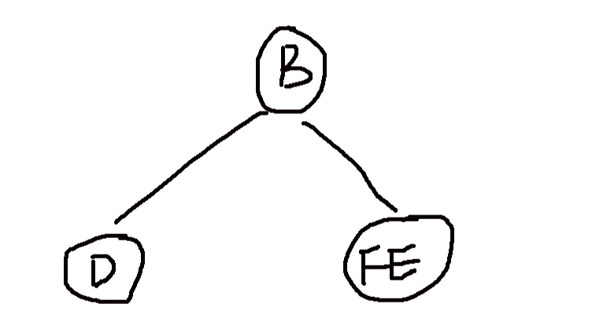

# 职能类模拟题 1

## 1

灰度等级为 256 级，分辨率为 1024*1024 的显示器，至少需要的帧缓存容量为（）

正确答案: C   你的答案: 空 (错误)

```cpp
4MB
```

```cpp
2MB
```

```cpp
1MB
```

```cpp
512KB
```

本题知识点

操作系统 C++工程师 Java 工程师 销售 4399 游戏 2017

讨论

[丨太阳与月亮丨](https://www.nowcoder.com/profile/9415270)

C256 灰度需要 8 比特表示 8*1K*1K=8Mbit=1MB

编辑于 2017-05-24 14:54:18

* * *

[曾经飞翔过](https://www.nowcoder.com/profile/7157111)

现在的显示器都是彩色的吧  RGB 三通道加透明度 H 通道 4*8*1024*1024=4MB

编辑于 2017-08-06 22:55:40

* * *

[舒意意 123](https://www.nowcoder.com/profile/1973064)

C256 灰度需要 8 比特表示 8*1K*1K=8Mbit=1MB

编辑于 2017-08-05 16:43:54

* * *

## 2

设一组初始记录关键字序列为(65,56,72,99,86,25,34,66)，则以第一个关键字 65 为基准而得到的一趟快速排序结果是（）

正确答案: A   你的答案: 空 (错误)

```cpp
34，56，25，65，86，99，72，66
```

```cpp
25，34，56，65，99，86，72，66
```

```cpp
34，56，25，65，66，99，86，72
```

```cpp
34，56，25，65，99，86，72，66
```

本题知识点

排序 *C++工程师 Java 工程师 销售 4399 游戏 2017* *讨论

[Deep-learning 算法工程师](https://www.nowcoder.com/profile/3544018)

这题有问题。。。不一定这样排

发表于 2019-03-13 18:52:11

* * *

[宫保鸡丁没萝卜](https://www.nowcoder.com/profile/6075174)

根据快速排序算法，选择第一个关键字 65 作为基准，最终把 65 放在它应该在的位置，65 左边的数小于 65，右边的大于 65。 我们把这八个数字的位置标记为从 1 到 8.high 指向最后的 66，low 指向第一个 65。从后向前比较，遇到比 65 小的数就放在 low 处，然后 low 向前移动，遇到比 65 大的数，把这个数放在 high 处，然后 high 继续向左移动，以此类推。排序过程开始：先保存下来基准数 65，然后从后向前比较，66>65，不动，high 向前移动指向 34，34<65，然后把 34 放在 low，low 向右移动指向 56，56<65,不动，low 继续右移指向 72，72>65,把 72 放在 high 指向的位置，即第 7 个数的位置，然后 high 向前移动指向 25.25<65，所以把 25 放在 low 指向的位置，即第三个位置，然后 low 向前移动一位，指向第四个数 99.99>65，所以把 99 放在 high 的位置，即第 6 个数的位置。high 左移一位指向第五个数 86，86>65 不动，high 继续左移，此时 high 和 low 重合都指向了第四个数，跳出循环。第四个数的位置就是基准 65 的位置，把 65 放在第四个数的位置，即完成了第一趟快速排序。序列变化过程：65 56 72 99 86 25 34 6634 56 72 99 86 25      6634 56      99 86 25 72 6634 56 25 99 86      72 6634 56 25      86 99 72 6634 56 25 65 86 99 72 66 即选项 A 为正确答案。

编辑于 2017-01-24 19:34:16

* * *

[fghfghggh](https://www.nowcoder.com/profile/5708802)

为啥有两种快排思想从前往后比 65 小的放到 left 数组，比 65 大的放在 right 数组，然后递归，这样的快排思想不对吗？被牛客上的快排搞晕了，到底哪个是对的

发表于 2018-10-07 14:26:55

* * *

## 3

在下列几种排序方法中，空间复杂度最高的是（）

正确答案: A   你的答案: 空 (错误)

```cpp
归并排序
```

```cpp
快速排序
```

```cpp
插入排序
```

```cpp
选择排序
```

本题知识点

复杂度 排序 *C++工程师 Java 工程师 销售 4399 游戏 2017* *讨论

[kkk_123](https://www.nowcoder.com/profile/872256)

正确答案选 A 归并排序空  查看全部)

编辑于 2017-05-24 14:55:59

* * *

[一切都会好起来的吧](https://www.nowcoder.com/profile/8289471)

 关于快速排序的空间复杂度的问题并不是简单的 nlogn 首先就地快速排序使用的空间是 O(1)的，也就是个常数级；而真正消耗空间的就是递归调用了，因为每次递归就要保持一些数据；    最优的情况下空间复杂度为：O(logn)  ；每一次都平分数组的情况    最差的情况下空间复杂度为：O( n )      ；退化为冒泡排序的情况

发表于 2018-06-12 21:02:09

* * *

[食货](https://www.nowcoder.com/profile/5853015)

归并涉及到合并问题，需要申请临时空间存放临时结果

发表于 2016-12-20 17:37:53

* * *

## 4

下面哪些是重载的基本条件（）

正确答案: A B D   你的答案: 空 (错误)

```cpp
参数的类型不同
```

```cpp
参数类型的顺序不同(比如 int a , float b 与 float b , int a)
```

```cpp
函数的返回值类型不同
```

```cpp
参数的个数不同
```

本题知识点

C++

讨论

[tofu](https://www.nowcoder.com/profile/9015733)

重载的概念是：

方法名称相同，参数个数、次序、类型不同

因此重载对返回值没有要求，可以相同，也可以不同

但是如果参数的个数、类型、次序都相同，方法名也相同，仅返回值不同，则无法构成重载

编辑于 2018-05-07 15:46:54

* * *

[chenxd](https://www.nowcoder.com/profile/9798897)

一 重载（overload）

基本条件：

*   函数名必须相同；
*   函数参数必须不相同，可以是参数类型或者参数个数不同；
*   函数返回值可以相同，也可以不相同；

二 重写（override）

基本条件：

*   重写的函数和被重写的函数必须为 virtual 函数，分别位于基类和派生类中；
*   重写的函数和被重写的函数函数名和函数参数必须一致；
*   重写的函数和被重写的函数返回值相同，或者都返回指针或引用，并且派生类虚函数所返回的指针或引用的类型是基类中被替换的虚函数所返回的
*   指针或引用的类型的子类型。

三 隐藏

基本条件：

*   子类和父类的函数名称相同，但参数不同，此时不管父类函数是不是 virtual 函数，都将被隐藏。
*   子类和父类的函数名称相同，参数也相同，但是父类函数不是 virtual 函数，父类的函数将被隐藏。

发表于 2017-06-16 22:04:14

* * *

[草戊](https://www.nowcoder.com/profile/5807442)

参数的顺序不同这个无法苟同。我认为类型和个数就决定了。所谓顺序怎么重载 method（int a,int b）和 method（int b,int a）换了顺序也不能叫做重载

发表于 2018-05-27 11:52:29

* * *

## 5

为了保证连接的可靠建立，TCP 通常采用（）

正确答案: A   你的答案: 空 (错误)

```cpp
三次握手法
```

```cpp
自动重发机制
```

```cpp
窗口控制机制
```

```cpp
端口机制
```

本题知识点

网络基础 C++工程师 Java 工程师 4399 游戏 2017

讨论

[larrysea](https://www.nowcoder.com/profile/5430709)

答案是 A 问题是如何建立可靠的连接，这个建立就是通过 tcp 的三次握手机制实现，客户端说你在吗，然后服务端发送过来说我在呢，然后客户端向服务端确认我也在呢，这就是确保一个通信流程能够正常 的建立，如果这么一个过程可以通信，那说明已经建立起了连接，可以正式发送数据。

发表于 2017-01-25 17:10:36

* * *

[华中第一狠人程德彪](https://www.nowcoder.com/profile/616662)

答案为：A
**为保证 TCP 连接建立和终止的可靠性，TCP 使用了三次握手协议**；B：自动重发机制可以保证数据的传输的可靠性。C：窗口和窗口通告可以有效控制 TCP 的数据传输流量，发送方发送的数据永远不会溢出接收方的缓冲空间。D：端口机制主要是用来实现点对点进行通信。

发表于 2017-03-18 09:42:37

* * *

[KKFC](https://www.nowcoder.com/profile/7237269)

 I think the answer is A

发表于 2017-11-01 13:22:04

* * *

## 6

下列有关计算机网络叙述正确的是（）

正确答案: A B C   你的答案: 空 (错误)

```cpp
建立计算机网络的最主要的目的是实现资源共享
```

```cpp
计算机网络是在通信协议控制下实现的计算机互联
```

```cpp
利用 Internet 网可以使用远程的超级计算机中心的计算机资源
```

```cpp
TCP/IP 的网络接口层对应的 OSI 的物理层
```

本题知识点

网络基础 C++工程师 Java 工程师 销售 4399 游戏 2017

讨论

[~火车头~](https://www.nowcoder.com/profile/4059609)

请看下图，TCP/IP 的网络接口层对应 OSI 参考模型的数据链路层和物理层。

编辑于 2018-01-07 13:32:42

* * *

[wrc](https://www.nowcoder.com/profile/9408800)

```cpp
TCP/IP 的网络接口层对应的 OSI 的物理层和链路层

对应网络层吧
如果这句话的意思是 TCP/IP 的网络接口层对应的是 OSI 的物理层和链路层

```

发表于 2017-02-15 20:42:52

* * *

[冷色探戈](https://www.nowcoder.com/profile/907563)

D 错在哪儿？ 已上报纠错

发表于 2017-02-11 09:36:23

* * *

## 7

小明的游戏账号密码是一串 8 位数字，只记前面 5 个数字为 38034.但他肯定，后面 3 个数字全是奇数，最后一个数字是 5，且后 3 个数字中相邻数字不相同，小明至少要试多少次才能保证登入（）

正确答案: C   你的答案: 空 (错误)

```cpp
20
```

```cpp
18
```

```cpp
16
```

```cpp
15
```

本题知识点

组合数学 *智力题 C++工程师 Java 工程师 销售 4399 游戏 2017* *讨论

[侯卿](https://www.nowcoder.com/profile/8037781)

组合数学中应该先确定限定条件多的，再依次确定其他的。例如本题如果先确定倒数第三个，那么结果很容易算成 5*3，意思是每一个倒数第三位都对应 3 个倒数第二位。。其实不是的，当倒数第三位和倒数第一个一样为 5 的时候，此时的倒数第二位有 4 个选择！就会少算了一个。但是先确定倒数第二个就不会出错 4*4。

编辑于 2018-05-14 11:31:17

* * *

[SunburstRun](https://www.nowcoder.com/profile/557336)

答案是 C 倒数第 2 个数可能性为 1 3 7 9,倒数第 3 个数可能性为 1 3 5 7 9,但是:倒数第 2 个数与 倒数第 3 个数也不相同,所以总共有 4*4=16

编辑于 2016-12-15 14:48:05

* * *

[弱楓](https://www.nowcoder.com/profile/272340785)

因为最后一位是 5，所以倒数第二位只能是 1，3，7，9 总共 4 个数，而倒数第三位可以是 1，3，5，7，9 总共 5 个数，所以 4*5=20 中，但是要排除倒数二三位相同的情况（11，33，77，99）总共 4 种，即 20-4=16 种

编辑于 2020-03-11 12:04:24

* * *

## 8

五个球从盒子里拿出来，打乱顺序放回去，均不在原位的排列数是多少（）

正确答案: B   你的答案: 空 (错误)

```cpp
36
```

```cpp
44
```

```cpp
32
```

```cpp
42
```

本题知识点

组合数学 *C++工程师 Java 工程师 销售 4399 游戏 2017* *讨论

[美团到店招聘](https://www.nowcoder.com/profile/3472441)

错排公式：D(n) = (n-1) * ( D(n-1) + D(n-2) )，n>=3 且：D(1) = 0 , D(2) = 1 

发表于 2017-04-19 17:05:58

* * *

[lemoNMM](https://www.nowcoder.com/profile/5747772)

假设原排列为 ABCDE，都不在原位的情况下，A 的选座方式有四种，当 A 占了 B 的座时，B 的选座方式分两种，1.B 选 A。 则余下的 CDE 有两种排列方式  。2.B 不选 A。则有 3*3 种排列方式。因此答案为 4*（2+3*3）=44 种

发表于 2017-08-03 14:35:57

* * *

[朱血糕](https://www.nowcoder.com/profile/773965346)

下面大神的讨论我看得有点晕，所以我也来补充说明好了，假设原来顺序是 ABCDE

第一种情况：A 选任意位置，有 4 种可能。

------------------------------------------------------------

第二种情况：AB 互换位置。

**表示从****AB_ _ _****变成了****BA_ _ _**

剩下的 CDE 只可能有 BADEC 跟 BAECD 两种可能

第三种情况：A 选了 B 的位置，但是 B 不选 A 的位置。表示为 _ A B B B

因为不选 A 的位置只有三种可能，同时 C 在不选自己的位置加上两个位置已有人的情况下也有三种可能，在三个位置都决定的情况下剩下两个只能互换。

所以最终是 4*(2+3*3)

发表于 2018-07-21 14:30:57

* * *

## 9

数据在计算机内有链式和顺序两种存储方式，在存储空间使用的灵活性上，链式存储比顺序存储要（）

正确答案: D   你的答案: 空 (错误)

```cpp
不好说
```

```cpp
低
```

```cpp
相同
```

```cpp
高
```

本题知识点

操作系统 C++工程师 Java 工程师 销售 4399 游戏 2017

讨论

[泡面加鸡蛋](https://www.nowcoder.com/profile/761584)

使用一般分为查询和修改吧？要是只是访问不修改呢？

发表于 2017-08-30 22:49:57

* * *

[笑以](https://www.nowcoder.com/profile/1333690)

在存储空间使用的灵活性上，数组一开始就要分配好内存

发表于 2018-10-22 00:09:12

* * *

[认真做毕设的男孩子](https://www.nowcoder.com/profile/3726160)

```cpp
如果各自都只有一个元素呢，这个时候在使用的灵活性上一样。
```

发表于 2018-01-08 11:26:04

* * *

## 10

入栈序列是：a1,a3,a5,a2,a4,a6,出栈序列是：a5,a4,a2,a6,a3,a1，则栈的容量最小是（）

正确答案: D   你的答案: 空 (错误)

```cpp
5
```

```cpp
3
```

```cpp
6
```

```cpp
4
```

本题知识点

栈 *C++工程师 Java 工程师 销售 4399 游戏 2017* *讨论

[hexiaosa](https://www.nowcoder.com/profile/9067338)

D. 出入栈情况是，a1,a3,a5 入栈(栈容量 3)，a5 出栈，a2,a4 入栈(栈容量 4)，a4,a2 出栈，a6 入栈(栈容量 3)，a6,a3,a1 出栈。 所以栈容量要至少为 4 才满足上述情况。

发表于 2017-03-05 09:44:23

* * *

[美团到店招聘](https://www.nowcoder.com/profile/3472441)

分析过程：要想弹出 a5，则 a1，a3 已经在栈中；要想弹出 a4，则 a2 也得在栈中，外加 1 个栈顶，所以是容量是 4\.该过程为：push(a1),push(a3),push(a5),pop(a5),push(a2),push(a4),pop(a4),pop(a2),push(a6),pop(a6),pop(a3),pop(a1)

发表于 2017-02-13 23:36:47

* * *

[Laanyuue](https://www.nowcoder.com/profile/960304638)

白给

发表于 2020-03-10 19:39:39

* * *

## 11

对某二叉树进行先序遍历的结果是 ABDEFC,中序遍历的结果是 DBFEAC，则后序遍历的结果是（）

正确答案: B   你的答案: 空 (错误)

```cpp
DBFEAC
```

```cpp
DFEBCA
```

```cpp
CFEDBA
```

```cpp
CEFBDA
```

本题知识点

树 C++工程师 Java 工程师 销售 4399 游戏 2017

讨论

[agjsytt](https://www.nowcoder.com/profile/2736253)

  查看全部)

编辑于 2017-03-18 09:23:36

* * *

[小白同学](https://www.nowcoder.com/profile/806271)

知道先序是根->左->右，中序是左->根->右，后序是左->右->根，但是以前一直没整明白怎么根据已知两个序遍历求第三种遍历（前提是一定要知道中序遍历），今天做这个题的时候忽然脑袋开窍了。
最重要的一点就是：找到根->找到左右子树
一直重复这个操作，直到最后一个子节点。
先序遍历的结果是 ABDEFC，根据先序得到根节点是 A.
中序遍历的结果是 DBFEAC，根据中序得到 A 之前的节点都是左子树，A 之后的节点都是右子树，所以可以得出：

接着分析左子树的情况，先序排列是 BDEF,根节点是 B，中序排列是 DBFE，B 之前的节点是它的左子树，B 之后的节点是它的右子树，可以得出：

最后分析右子树的情况，先序排列是 EF，中序排列是 FE，所以 E 是根节点，F 是左节点。
最后就是：

得到后序遍历：DFEBCA

发表于 2017-11-29 12:04:11

* * *

[敲代码的咸鱼](https://www.nowcoder.com/profile/3624642)

B 先序遍历第一个元素是头节点，然后中序遍历中 A 的左边是 DBFE 右边是 C 画好了头，然后先序 BDEFC，B 为头

发表于 2018-05-14 22:20:15

* * *

## 12

对于有 n 个结点的二叉树，其高度为（）(第一层高度 1)

正确答案: D   你的答案: 空 (错误)

```cpp
nlog2(n)
```

```cpp
log2(n+1)
```

```cpp
log2(n)
```

```cpp
不确定
```

本题知识点

树 C++工程师 Java 工程师 销售 4399 游戏 2017

讨论

[shiyan 娃娃](https://www.nowcoder.com/profile/612398)

二叉树高度最高的情况是每一个层只有一个结点，此时高度为 N，
最小的情况是完全二叉树，高度是[log2N]+1，以 2 为底的对数取整后+1，
所以高度是[log2N]+1 到 N。

发表于 2017-08-18 15:38:08

* * *

[嘿就你](https://www.nowcoder.com/profile/9900714)

答案选 D，举例如果是完全二叉树，则高度为 log2(n+1)向上取整，如果该树，除叶子节点外其他节点只有左子树，没有右子树，则高度为 n

发表于 2017-03-06 22:44:16

* * *

[路过的熊](https://www.nowcoder.com/profile/5639504)

题目里只说是二叉树，答案应该选 D

发表于 2017-02-25 10:27:26

* * *

## 13

设输入序列为 1,2,3，则经过栈的作用后可以得到（）中不同的输出序列。

正确答案: D   你的答案: 空 (错误)

```cpp
3
```

```cpp
7
```

```cpp
8
```

```cpp
5
```

本题知识点

栈 *C++工程师 Java 工程师 销售 4399 游戏 2017* *讨论

[SunburstRun](https://www.nowcoder.com/profile/557336)

答案是 D  查看全部)

编辑于 2016-11-30 22:24:55

* * *

[程序猿 Go 师傅](https://www.nowcoder.com/profile/242025553)

f(3) = 5

编辑于 2019-10-21 16:53:28

* * *

[加油可以的](https://www.nowcoder.com/profile/4145997)

选 D。1 2 3/1 3 2/2 1 3/ 2 3 1/3 2 1，3 1 2 错误。

发表于 2017-02-28 15:18:58

* * *

## 14

一棵完全二叉树第六层有 9 个叶结点（根为第一层），则结点个数最多有（）

正确答案: D   你的答案: 空 (错误)

```cpp
112
```

```cpp
111
```

```cpp
107
```

```cpp
109
```

本题知识点

树 C++工程师 Java 工程师 销售 4399 游戏 2017

讨论

[SunburstRun](https://www.nowcoder.com/profile/557336)

答案是 D  查看全部)

编辑于 2016-11-30 22:22:56

* * *

[美团到店招聘](https://www.nowcoder.com/profile/3472441)

第一层：1 第二层：2 第三层：4 第四层：8 第五层：16 第六层：32 第七层：2*(32-9)共计：109 个结点

发表于 2017-02-23 10:58:46

* * *

[牛客小小菜鸟](https://www.nowcoder.com/profile/6392441)

第六层有 9 个叶结点，题目要求最多的结点数，可以推测还有第 7 层。第 6 层一共的结点数为 32，减去 9 个叶子结点，（考虑最多结点情况下）剩下 23 个结点都有左右子树，故第 7 层一共有 23*2=46 个结点，最后加上前 6 层的结点数 2⁶-1=63,  46+63=109，因此最多的结点数为 109.

发表于 2017-08-12 20:20:19

* * *

## 15

i 为整型变量，则以下循环语句的循环次数是（）？

```cpp
for(i = 2;i < 2;) 
    printf("%d", i--);
```

正确答案: B   你的答案: 空 (错误)

```cpp
无限次
```

```cpp
0 次
```

```cpp
2 次
```

```cpp
1 次
```

本题知识点

C 语言

讨论

[华中第一狠人程德彪](https://www.nowcoder.com/profile/616662)

**答案：B**for 语句的执行流程描述如下：
（1） 计算表达式 1 的值；
（2） 计算表达式 2 的值，若表达式的值为真（或非 0），则执行循环体；
（3） 计算表达式 3 的值；
（4） 再次计算表达式 2 的值，并重复以上过程；
（5） 直到表达式 2 的值为假（或为 0），则结束该循环。可知，第一次执行语句 2 时为假，故一次循环也不执行。

发表于 2017-01-29 16:43:30

* * *

[哈哈哈 zyy](https://www.nowcoder.com/profile/4500278)

不满足循环条件，所以一次也不会循环

发表于 2016-12-03 11:00:53

* * *

[环 201711251539622](https://www.nowcoder.com/profile/4500186)

for 语句的执行流程描述如下： 
（1） 计算表达式 1 的值； 
（2） 计算表达式 2 的值，若表达式的值为真（或非 0），则执行循环体； 
（3） 计算表达式 3 的值； 
（4） 再次计算表达式 2 的值，并重复以上过程； 
（5） 直到表达式 2 的值为假（或为 0），则结束该循环。可知，第一次执行语句 2 时为假，故一次循环也不执行

发表于 2017-11-25 16:03:58

* * *

## 16

64 位系统上，定义的变量 int* a[3][2]占据（）字节

正确答案: D   你的答案: 空 (错误)

```cpp
12
```

```cpp
24
```

```cpp
8
```

```cpp
48
```

本题知识点

操作系统 C++工程师 Java 工程师 销售 4399 游戏 2017

讨论

[cancer 大魔王](https://www.nowcoder.com/profile/7941730)

[]优先级高，先与 p 结合成为一个数组，再由 int*说明这是一个整型指针数组所以归根结底这是个数组，64 位上一个指针是占 8 字节，8*3*2 选 D 如果定义 int (*p)[n];()优先级高，首先说明 p 是一个指针，指向一个整型的一维数组这个就是数组指针

发表于 2017-04-15 00:05:17

* * *

[叮咚呛](https://www.nowcoder.com/profile/6693677)

64 位上一个指针是占 8 字节，但是答案却是 B,24。不理解谁能给解惑一下么

发表于 2016-12-23 09:04:58

* * *

[浩劫风浪](https://www.nowcoder.com/profile/6360212)

一个指针占的字节数目与编译器的位数有关，64 位占 8 个字节，32 位占 4 个字节；int *p[m][n]；（1）因为 [] 的优先级比 * 高，所以 p 先与 [ ][ ] 结合，构成一个有 m*n 个元素的二维数组，（2）再与*结合，表示这个数组是指针类型的，即数组中的每个元素都是一个指针变量；所以 一个占 m*n*8 个字节，此时 m=3,n=2，结果为 48 个字节。

发表于 2018-06-19 12:41:32

* * *

## 17

当一进程运行时，系统可基于某种原则，强行将其擞下，把处理器分配给其他进程，这种调度方式是（）

正确答案: D   你的答案: 空 (错误)

```cpp
中断方式
```

```cpp
查询方式
```

```cpp
非剥夺方式
```

```cpp
剥夺方式
```

本题知识点

操作系统 4399 游戏 2017

讨论

[sgbs](https://www.nowcoder.com/profile/953324)

这道题选 D 中断：指当出现需要时，CPU 暂时停止当前程序的执行转而执行处理新情况的程序和执行过程。即在程序运行过程中，系统出现了一个必须由 CPU 立即处理的情况，此时，CPU 暂时中止程序的执行转而处理这个新的情况的过程就叫做中断。剥夺方式：当一个进程正在运行时，系统可以基于某种原则，剥夺已分配给它的 [处理机](http://baike.baidu.com/item/%E5%A4%84%E7%90%86%E6%9C%BA) ，将之分配给其它进程。

发表于 2017-07-04 07:30:09

* * *

[不思进取的我](https://www.nowcoder.com/profile/995805)

不是剥夺方式吗？

发表于 2016-12-01 18:02:38

* * *

[不做人了](https://www.nowcoder.com/profile/250145)

*擞* sǒu

发表于 2021-01-28 10:27:51

* * *

## 18

i 的初值为 0，i++在两个进程里面分别执行 100 次，能得到可能的值包括（）

正确答案: A C D   你的答案: 空 (错误)

```cpp
2
```

```cpp
1
```

```cpp
5
```

```cpp
100
```

本题知识点

操作系统

讨论

[小迷糊 0](https://www.nowcoder.com/profile/5380033)

题目里是不是应该是两个线程。感觉两个进程。i++是独立的。必然是 100

发表于 2017-09-25 18:04:21

* * *

[oOffer 快](https://www.nowcoder.com/profile/8259028)

感觉进程的话是 100,线程是 1~200

发表于 2017-10-03 18:04:52

* * *

[xiaomin@qq.com](https://www.nowcoder.com/profile/6908334)

链接：[`www.nowcoder.com/questionTerminal/92cc3ae6a6d143bd96127650ace7100c`](https://www.nowcoder.com/questionTerminal/92cc3ae6a6d143bd96127650ace7100c)
来源：牛客网
最大值 200，最小值 2；i++只需要执行一条指令，并不能保证多个线程 i++，操作同一个 i，可以得到正确的结果。因为还有寄存器的因素，多个 cpu 对应多个寄存器。每次要先把 i 从内存复制到寄存器，然后++，然后再把 i 复制到内存中，这需要至少 3 步。从这个意义上讲，说 i++是原子的并不对。

如此，假设两个线程的执行步骤如下：

1\. 线程 A 执行第一次 i++，取出内存中的 i，值为 0，存放到寄存器后执行加 1，此时 CPU1 的寄存器中值为 1，内存中为 0；

2\. 线程 B 执行第一次 i++，取出内存中的 i，值为 0，存放到寄存器后执行加 1，此时 CPU2 的寄存器中值为 1，内存中为 0；

3\. 线程 A 继续执行完成第 99 次 i++，并把值放回内存，此时 CPU1 中寄存器的值为 99，内存中为 99；

4\. 线程 B 继续执行第一次 i++，将其值放回内存，此时 CPU1 中的寄存器值为 1，内存中为 1；

5\. 线程 A 执行第 100 次 i++，将内存中的值取回 CPU2 的寄存器，并执行加 1，此时 CPU2 的寄存器中的值为 2，内存中为 1；

6\. 线程 B 执行完所有操作，并将其放回内存，此时 CPU1 的寄存器值为 100，内存中为 100；

7\. 线程 A 执行 100 次操作的最后一部分，将 CPU2 中的寄存器值放回内存，内存中值为 2；

8\. 结束！

所以该题目便可以得出最终结果，最小值为 2，最大值为 200。

发表于 2018-04-11 19:48:21

* * *

## 19

在操作系统中同时存在多个进程，它们（）

正确答案: B C   你的答案: 空 (错误)

```cpp
不可以共享系统资源
```

```cpp
可以共享允许共享的系统资源
```

```cpp
可以调用同一段程序代码
```

```cpp
不能调用同一段程序代码
```

本题知识点

操作系统 C++工程师 Java 工程师 4399 游戏 2017

讨论

[larrysea](https://www.nowcoder.com/profile/5430709)

答案是  BC ：进程间可以共享的数据有以下几类，进程代码段、进程的公有数据(利用这些共享的数据，线程很容易的实现相互之间的通讯)、进程打开的文件描述符、信号的处理器、进程的当前目录和进程用户 ID 与进程组 ID。

发表于 2017-01-25 17:31:35

* * *

[小六喜欢赵小刀](https://www.nowcoder.com/profile/860595925)

理解错了，可以调用同一段程序代码，但不可以同时调用最近正在学操作系统。进程间可以共享的数据有以下几类，进程代码段、进程的公有数据(利用这些共享的数据，线程很容易的实现相互之间的通讯)、进程打开的文件描述符、信号的处理器、进程的当前目录和进程用户 ID 与进程组 ID。

发表于 2020-10-13 20:57:22

* * *

[舒意意 123](https://www.nowcoder.com/profile/1973064)

答案是  BC ：进程间可以共享的数据有以下几类，进程代码段、进程的公有数据(利用这些共享的数据，线程很容易的实现相互之间的通讯)、进程打开的文件描述符、信号的处理器、进程的当前目录和进程用户 ID 与进程组 ID。

发表于 2017-04-23 15:09:14

* * *

## 20

【4399 论述题】大学期间除了课程作业外做了哪些开发？用的什么语言？目的是什么？

你的答案

本题知识点

前端工程师 4399 游戏 C++工程师 Java 工程师 销售 2017

讨论

[printf(Pluto)](https://www.nowcoder.com/profile/376107408)

无

发表于 2021-08-21 15:03:07

* * *

[烟笼寒水月胧沙](https://www.nowcoder.com/profile/252751453)

** 类 PS 程序**

1.通过对 OpenCV 库的初使用，浅析计算机视觉处理方式

2.统合小组成员间各功能进行黑盒测试

3.汇总问题，进行讨论语言：Python ；目的：初步了解计算机视觉处理方式，接触较前沿技术。 **坦克大战游戏** **Java 实现**

1.实践 Java 面向对象思想，对各个类进行设计、封装

2.通过对 ActionListener 接口的实现继而实现多个事件的反应语言：Java ；目的：体会实践 Java 封装特性，加深面向对象编程的理解 

发表于 2021-04-22 15:44:45

* * *

## 21

【4399 论述题】周围朋友一般因为你的什么特质而佩服你？

你的答案

本题知识点

前端工程师 4399 游戏 C++工程师 Java 工程师 销售 2017

讨论

[KKFC](https://www.nowcoder.com/profile/7237269)

因为我很长

发表于 2017-11-01 12:22:03

* * *

[我是小栗子](https://www.nowcoder.com/profile/1809063)

帅

发表于 2017-09-15 23:57:51

* * *

[熊猫小智](https://www.nowcoder.com/profile/489989318)

对于自己喜欢的活着感兴趣的事能马上去做，这是我的朋友们比较欣赏我的一点。

发表于 2019-11-20 10:46:24

* * *

## 22

【4399 论述题】请描述一个例子，你曾经解决过一个别的同学解决不了的技术问题，你是如何做到的

你的答案

本题知识点

前端工程师 4399 游戏 C++工程师 Java 工程师 销售 2017

## 23

【4399 论述题】大学期间，你是如何学习提升技术能力的，目前积累程度如何，请举例说明

你的答案

本题知识点

前端工程师 4399 游戏 C++工程师 Java 工程师 销售 2017

## 24

描述一个例子，你曾经给自己设定了一个很高的目标，并且很努力的去完成的一件事

你的答案

本题知识点

前端工程师 4399 游戏 C++工程师 Java 工程师 销售 2017

讨论

[乌拉西](https://www.nowcoder.com/profile/410849866)

目标：呼吸到最后一刻。
过程：无论是在东北的寒夜还是在夏日的酷暑中，从未停止呼吸。
结果：现在仍在呼吸。

发表于 2020-07-25 14:46:50

* * *

## 25

【4399 论述题】在工作中，你是更注重团队协作还是个人想法？请举例说明。

你的答案

本题知识点

前端工程师 4399 游戏 C++工程师 Java 工程师 销售 2017

讨论

[半雨微凉](https://www.nowcoder.com/profile/406780863)

个人愚见，觉得这两个不矛盾呀~

发表于 2019-08-29 14:22:48

* * *

[handling](https://www.nowcoder.com/profile/6746755)

我可能更注重个人想法，团队协作固然好，但是我发现团队协作时更容易出现意见分歧，导致矛盾，处理矛盾花费的时间精力以及以后的开发阶段，都会给团队中的个人造成很大的影响，我觉得个人想法比较好，因为我觉得一个人的执行能力（想到就立马去实现）更好

发表于 2019-08-28 21:44:25

* * *

## 26

小陆所在的公司实行周末单双休，即一周只休周日，下一周休周六日，如此轮换。已知 2016 年 8 月 13-14 日是双休，输入年月日，以 yyyymmdd 的格式，如 20160814，输出当天是否休息，（不考虑法定节假日）

要求：不能使用时间、日期相关的库函数

你的答案

本题知识点

C++工程师 Java 工程师 销售 4399 游戏 2017

讨论

[凯凯姚](https://www.nowcoder.com/profile/7836850)

#include <stdio.h>int main(){
  int date,year,month,day;
  scanf("%d",&date);
  year=date/10000;
  month=date%10000/100;
  day=date%100;
  int z[7]={7,6,5,4,3,2,1};
  int mon[12]={31,28,31,30,31,30,31,31,30,31,30,31};
  if(year%100!=0&&year%4==0||year%400==0)
    mon[1]=29;
  else
    mon[1]=28;
  int dou=2;
  int zhou=7;
  int t=0;
  if(date>20160814) //双休周日
  {
      while(year!=2016||month!=8||day!=14){
        day--;
        t++;
        if(day<1){
                month--;
            day=mon[month];
        }
        if(month<1){
            year--;
            month=12;
            if(year%100!=0&&year%4==0||year%400==0)
             mon[1]=29;
             else
             mon[1]=28;
        }
      }
      //---------------------------------------
  if(t%7!=0){
    dou=t/7+1;
  }else{
    dou=t/7;
  }
    dou=dou%2; //0 为双休 1 为单休
    zhou=t%7;  //周几，0 为周日
   // printf("dou=%d zhou=%d",dou,zhou);

  }else{  //20160814 之前
  while(year!=2016||month!=8||day!=14){
        day++;
        t++;
        if(day>mon[month]){
                month++;
            day=1;
        }
        if(month>12){
            year++;
            month=1;
            if(year%100!=0&&year%4==0||year%400==0)
             mon[1]=29;
             else
             mon[1]=28;
        }
      }
      //-------------------
  if(t%7!=0){
    dou=t/7;
  }else{
    dou=t/7;
  }
    dou=dou%2; //0 为双休 1 为单休
    zhou=z[t%7];  //周几，0 为周日
  //  printf("dou=%d zhou=%d",dou,zhou);

  }
  //printf("%d %d %d",year,month,day);
 // printf("t=%d",t);

  if(dou==1){
    if(zhou!=6)
        printf("工作");
    else
        printf("休息");
    }else if(dou==0){
    if(zhou==0||zhou==6){
        printf("休息");
    }else
        printf("工作");
    }
}

发表于 2019-08-27 16:37:12

* * *

[敖星星](https://www.nowcoder.com/profile/705137015)

```cpp
/*思路  首先给的日期是一个字符串  建立一个日期类 Date  内含属性  年月日  构造函数将字符串转为年月日
```

```cpp
  *  然后(日期  -  给定日期) 得到的总天数取余 14 结果为 6  12  13 的日子为休息日
```

```cpp
  *  其中有两个注意点  一个是闰年二月天数+1  一个是计算日期差值天数为旧年天数  加上  新年天数 */ ```
class Date
{
public:
  Date();
  Date(QString str)
  {
      int n1=1000;
      int n2=10;
      int n3 =10;
      QString strTemp;
      numYear = 0;
      numMonth = 0;
      numDay = 0;

      int i;
      for(i=0;i<4;i++)
      {
          strTemp = str[i];
          numYear += strTemp.toInt()*n1;
          n1/=10;
      }
      for(i=4;i<6;i++)
      {
          strTemp = str[i];
          numMonth += strTemp.toInt()*n2;
          n2/=10;
      }
      for(i=6;i<8;i++)
      {
          strTemp = str[i];
          numDay += strTemp.toInt()*n3;
          n3/=10;
      }
  }
//计算差值
  int getDay(Date* d)
  {
      int sum=0;
      switch (d->numMonth)
      {
      case 12:
          sum+=30;
      case 11:
          sum+=31;
      case 10:
          sum+=30;
      case 9:
          sum+=31;
      case 8:
          sum+=31;
      case 7:
          sum+=30;
      case 6:
          sum+=31;
      case 5:
          sum+=30;
      case 4:
          sum+=31;
      case 3:
          sum+=getYearDays(d->numYear)-365+28;
      case 2:
          sum+=31;
      case 1:
          sum+=0;
      }
      sum+=d->numDay;
      //以上为求出该年的新年天数

      if(d->numYear == 2016)
      {
        return sum - 227;//227 为 20160814 的该年的前八个+14 天的天数
      }
      else if(d->numYear>2016)
      {
          for(int i=2017;i<d->numYear;i++)
          {
              sum+=getYearDays(i);
          }
          sum+=365-227;
      }
      return sum;//返回日期和给定日期的总差值天数
  }

  //判断闰年
  int getYearDays(int year)
  {
      if((year%4 == 0 && year %100!=0) || (year%400 == 0))
      {
          return 366;
      }
      else
      {
          return 365;
      }
  }

  bool isRest(Date *one)
  {
      switch(one->getDay(one)%14)
      {
      case 6:
      case 12:
      case 13:
          qDebug()<<one->getDay(one);
          return true;
      default:            return false;
      }
  }
private:
  int numYear;
  int numMonth;
  int numDay;

};

//调用
void MainWindow::on_pushButton_clicked()
{
  Date *d1 = new Date("20210920");
  qDebug()<< d1->isRest(d1);
}
```cpp 
```

发表于 2021-09-15 16:45:31

* * *

## 27

将 20 个球放进 12 个不同的袋子，每个袋子可以放 0-20 个球，有多少种放法？分析如何计算，然后编程解答。

进阶问题：每个袋子只能放 0 个、2 个或 3 个球，该如何计算？

你的答案

本题知识点

C++工程师 Java 工程师 销售 4399 游戏 2017

讨论

[[微笑]](https://www.nowcoder.com/profile/634119056)

import java.util.Scanner;
public class Main {    public static void main(String[] args) {
//        写入球的个数
         int ball;
//        写入袋子的个数
         int pack;
         Scanner scan = new Scanner(System.in);
         System.out.println("请输入球的个数");
         ball = Integer.parseInt(scan.next());
         System.out.println("袋子个数");
         pack = Integer.parseInt(scan.next());
         System.out.println(getban(ball, pack));

    }

//    隔板法
    public static long getban(int ball,int pack)
    {
//        由于无法保证每个袋子都能装上一个球，无法使用隔板法，
//        所以故意往每个袋子加 1 个球，当排序的时候可以往每个袋子里减一个球就可以了
        long result = 1;
        int newball = ball + pack;
//        所以每个球的空隙有 newball -1 个
        int newballair = newball -1;
//        因为需要放入 12-1 个袋子（插入 12-1 块板），所以用公式 C（newballair,pack-1）
        /*
         * C(m,n) = m!/n!*(m-n)!
         */
        for(int i = newballair - (pack - 1) + 1; i <= newballair ; i++)
        {
            result *= i; 
        }
        return result / factorial(pack-1);
    }

//    阶乘方法
    public static long factorial(int num)
    {
        if(num == 1)
        {
            return 1;
        }
        else
        {
            return num * factorial(num-1);
        }
    }
}

发表于 2019-09-11 02:34:06

* * *

[蘑菇炭改](https://www.nowcoder.com/profile/873563729)

数学方法：如果我们把单个小球放入某个袋子设为 x1, x2, ... , x12，则 x1 + x2 + ... + x12 = 1，其中 x1, x2, ... , x12 的值为 0 或 1，那么单个小球放入 12 个袋子的种类数即为这个方程解的个数。那么 20 个小球即可看做 x1 + x2 + ... + x12 = 20，其解的个数即为我们所求的种类数。根据隔板法可以得出种类数为 C(20+12-1, 20)。另一方面，如果我们把 20 个小球的种类数，看做(x1 + x2 + ... + x12)²⁰ 展开式的项数，也可以得到相同的结论。非数学方法：DP。
进阶问题：DP。进阶问题反而运算量减少了。

发表于 2020-04-28 14:40:58

* * *

[Laanyuue](https://www.nowcoder.com/profile/960304638)

```cpp
public int ballBag(int bag, int ball) {
        int[][] dp = new int[bag + 1][ball + 1];
        int i, j, k, sum;

        for (i = 1; i <= bag; i++) {
            dp[i][0] = 1;
        }//无论几个包，放入 0 个球的方法只有一种

        for (j = 0; j <= ball; j++) {
            dp[1][j] = 1;
        }//无论几个球，放入 1 个包的方法也只有一种

        for (i = 2; i <= bag; i++) {
            for (j = 1; j <= ball; j++) {
                sum = 0;
                for (k = 0; k <= j; k++) {
                    sum += dp[i - 1][k];
                }
                dp[i][j] = sum;
            }
        }
        return dp[bag][ball];
    }
```

发表于 2020-03-11 18:01:57

* * *

## 28

关键字过滤：输入字符串 s1 和 s2，判断 s1 中是否顺序包含 s2 中所有字符（大小写敏感），如果否，输出 s1，如果是，输出“不可描述”

例：输入 ABCde，Ad，输出：不可描述

输入 ABCde，AA 输出：ABCde

要求：不能使用字符相关的库函数

你的答案

本题知识点

C++工程师 Java 工程师 销售 4399 游戏 2017

讨论

[NoOfferException](https://www.nowcoder.com/profile/1554976)

```cpp
import java.util.Scanner;

public class solution {

        public String findit(String str){
        Scanner scanner = new Scanner(System.in);
        String str1 = scanner.next();
        String str2 = scanner.next();
        char[] char1 = str1.toCharArray();
        char[] char2 = str2.toCharArray();
        int p1 = 0;
        int p2 = 0;
        while(p1<str1.length() && p2<str2.length()){
            while(p1<str1.length() && p2<str2.length() && char1[p1]!=char2[p2]){
                p1++;
            }
            p1++;
            p2++;
        }
        if(p2 >= char2.length){
            return new String("不可描述");
        }else{
            return str1;
        }        
    }
}
```

发表于 2019-09-12 16:56:57

* * *

[清清兀商](https://www.nowcoder.com/profile/753011821)

| import java.util.Scanner;public class a4399 {        public static void main(String args[]){            Scanner sc = new Scanner(System.in);            String str = sc.nextLine();            String str1 = sc.nextLine();            String arr[] = new String[str.length()];  //第一次输入的数            String arr1[] = new String[str1.length()];//第二次输入得数            int count=0;            for(int i=0;i<str.length();i++){                arr[i]= str.substring(i,i+1);            }            for(int j=0;j<str1.length();j++){                arr1[j]= str1.substring(j,j+1);            }            for(int k =0;k<str1.length();k++){                for(int n =0;n<str.length();n++){                    if(arr1[k].equals(arr[n])){                        arr[n]="*";                        count++;                        break;                    }                }            }            if(str1.length()==count){                System.out.println("不可描述");            }else{                System.out.println(str);            }        }} |

发表于 2019-08-21 20:40:18

* * *

[菠萝吹水](https://www.nowcoder.com/profile/562101446)

bool isMatch(string& s1, string& s2){    int index(0);    for (int i = 0; i < s1.size(); i++)    {        if (s1[i] == s2[index])            ++index;        if (index == s2.size())            return true;    }    return false;}

发表于 2020-08-20 11:19:23

* * *

## 29

【附加题】n 男 n 女去相亲，活动结束时两两异性间产生匹配值，用 1-100 整数表示。为了使活动完美，主办方希望找到一种匹配方案，使得所有异性两两匹配，并且中匹配值最大。

1）编程实现匹配算法，并分析时间算法复杂度，估算在你的计算机上 n 能支持到多大

2）当 n 比较大时，可能接受次优解，请描述可以怎么优化你的算法或使用别的算法

你的答案

本题知识点

C++工程师 Java 工程师 销售 4399 游戏 2017

讨论

[-半`城烟`沙つ](https://www.nowcoder.com/profile/479402810)

简易算法可以使用二分图最大匹配算法：KM 算法用 O(n³)的复杂度解决； 优化方法是考虑用网络流来处理男的作为二分图左部节点，女的作为二分图右部节点，把男女匹配值连边，在左部建立超级源点 S，把 S 连向所有的左部节点，右部建立超级汇点 T，把所有右部节点连向 T，用 Dinic 算法可以用 O(n²√n)的复杂度实现，大概能跑过 5*10³ 的数据

发表于 2019-10-11 14:20:44

* * *

[tanqb](https://www.nowcoder.com/profile/97349723)

二分图的最大权匹配，KM 算法。。

发表于 2019-10-11 11:30:54

* * *</stdio.h>******