# 四千三百九十九、公司 2017 秋招前端笔试试卷

## 1

关于数据结构，下列描述当中，正确的是（）

正确答案: C   你的答案: 空 (错误)

```cpp
在深度为 5 的满二叉树中，叶子节点的个数为 32
```

```cpp
队列，栈以及二叉树都是线性结构
```

```cpp
算法的复杂度主要包括时间复杂度和空间复杂度
```

```cpp
在待排序的元素序列基本有序的前提下，效率最高的排序方法是堆排序
```

```cpp
队列的操作方式是先进后出
```

本题知识点

复杂度 排序 *讨论

[Jae 旻 Hyun](https://www.nowcoder.com/profile/926763253)

A. 满二叉树中，叶子节点个数 = 2 ^ (深度 - 1)，即 2 ^ (5 - 1) = 16；B. 队列、栈属于线性结构，二叉树属于非线性结构中的树型结构；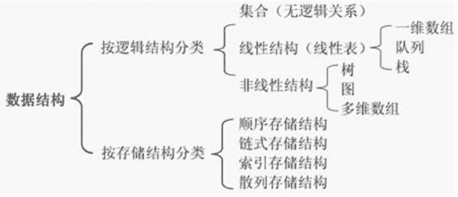
D. 在待排序的元素序列基本有序的前提下，效率最高的排序方法是插入排序；【合并排序时间复杂度是θ(nlogn)，空间复杂度是θ(n)；插入排序时间复杂度是θ(n²)，空间复杂度是θ(1)；堆排序时间复杂度是θ(nlogn)，空间复杂度是θ(1)】E. 队列的操作方式是先进先出，栈的操作方式是先进后出。

发表于 2018-08-07 21:33:25

* * *

[cscv2011](https://www.nowcoder.com/profile/3857016)

这题选 C A 错误 深度为 5 的满二叉树有 2^k-1 个叶子结点，所以为 16 个叶子节点。 B 错误 二叉树不是线性结构。 C 正确 D 错误 在带排序列基本有序的情况下插入排序效率最高 E 错误 队列是先进先出

发表于 2017-03-27 17:41:45

* * *

[人海追风](https://www.nowcoder.com/profile/896834337)

初始根节点深度为 1

编辑于 2020-09-03 09:50:22

* * *

## 2

执行以下 JavaScript 代码，输出结果为（）

```cpp
var a = 4399 < 0 || typeof(4399 + '');
console.log(a);
```

正确答案: B   你的答案: 空 (错误)

```cpp
true
```

```cpp
string
```

```cpp
undefined
```

```cpp
false
```

```cpp
number
```

本题知识点

Javascript 前端工程师 4399 游戏 2017

讨论

[LinEE](https://www.nowcoder.com/profile/6566026)

  查看全部)

编辑于 2017-03-19 19:31:50

* * *

[peng.tan](https://www.nowcoder.com/profile/3111850)

||  这个是短路或，也就是||前面为 true 的话就直接等于前面的值了，不会再看||后面。这里 4399<0 是 false，所以还需要往后看，4399+''是字符串类型，typeof 返回的是值的类型所以在控制台输出的是 String

发表于 2017-03-17 19:13:44

* * *

[tfciw](https://www.nowcoder.com/profile/2518954)

&&左为真返回右边，|| 左为假返回右边，比较好记

发表于 2018-01-17 21:25:59

* * *

## 3

下列关于 http 状态码描述正确的是（）

正确答案: C   你的答案: 空 (错误)

```cpp
404 读取浏览器缓存，502 错误网关
```

```cpp
404 找不到资源，403 服务器错误
```

```cpp
500 服务器错误，304 读取浏览器缓存
```

```cpp
304 服务器错误，200 请求成功
```

```cpp
500 找不到资源，200 请求成功
```

本题知识点

网络基础 前端工程师 4399 游戏 2017

讨论

[菜鸟葫芦娃](https://www.nowcoder.com/profile/415611)

常见的 HTTP 状态码：

  查看全部)

编辑于 2016-12-18 15:31:53

* * *

[崔洪振 367](https://www.nowcoder.com/profile/606942)

选 C100 服务请求中；200 服务请求成功；304 没有被修改，读取的内容为缓存；403 禁止访问(Forbidden)；404 没有找到要访问的内容（Not Found)；500 内部服务器错误。

发表于 2017-02-15 21:12:23

* * *

[karaysn](https://www.nowcoder.com/profile/7759354)

A 中 404 是指找不到资源，A 错，B 中 403 是禁止访问，B 错 D 中 304 是指读取缓存，D 错 E 中 500 是服务器错误，E 错

发表于 2017-10-11 16:39:21

* * *

## 4

 ```cpp
var arrTemp = [1,2,3];
arrTemp.shift();
arrTemp.push(1);
arrTemp.unshift(2);
var arrNew = arrTemp.concat([1,2]);
console.log(arrNew);
``` 以上 JavaScript 代码，在浏览器中运行的结果是

正确答案: A   你的答案: 空 (错误)

```cpp
[2,2,3,1,1,2]
```

```cpp
[2,1,2,1,1,2]
```

```cpp
[2,2,3,1,[1,2]]
```

```cpp
[2,1,2,1,[1,2]]
```

本题知识点

Javascript 前端工程师 4399 游戏 2017

讨论

[Z 皓](https://www.nowcoder.com/profile/4718208)

很简单，shift 删除数组第一个元素，此时 arrTemp 变成[2,3]；push 在数组后面添加一个元素，此时 arrTemp 变成[2,3,1]；unshift 在数组前面添加一个元素，此时 arrTemp 变成[2,2,3,1]；concat 是将两个数组进行连接，此时 arrTemp 变成[2,2,3,1,1,2]。

发表于 2018-07-10 09:42:47

* * *

[青ツ玉](https://www.nowcoder.com/profile/9067279)

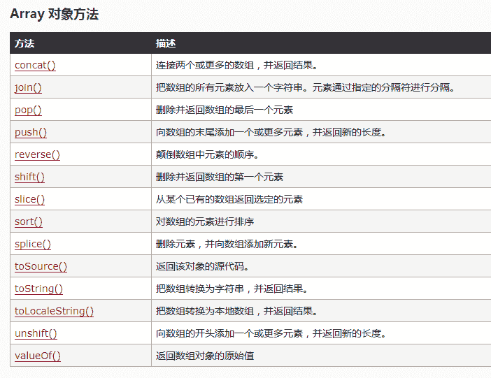

发表于 2017-08-01 17:33:51

* * *

[MGT](https://www.nowcoder.com/profile/6594908)

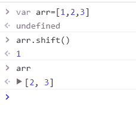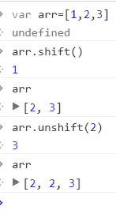

编辑于 2017-08-25 15:52:00

* * *

## 5

关于操作系统，下列描述当前，错误的是（）

正确答案: C   你的答案: 空 (错误)

```cpp
进程间的基本关系为同步与互斥
```

```cpp
并发性是指若干事件在同一时间内间隔内发生
```

```cpp
如果某一进程在运行时，因某种原因暂停，此时将脱离运行状态，而进入自由状态
```

```cpp
产生死锁的必要条件：互斥条件，请求与保持条件，不剥夺条件以及循环等待条件
```

```cpp
进程的特性包括：动态性，并发性以及异步性
```

本题知识点

操作系统 前端工程师 4399 游戏 2017

讨论

[舒意意 123](https://www.nowcoder.com/profile/1973064)

C，进程因为时间片轮状而暂停，可能进入就绪态，就绪挂起态。因为等待某个资源，可能进入阻塞态，阻塞挂起态。

发表于 2017-04-23 15:05:47

* * *

[@追风小青年](https://www.nowcoder.com/profile/838172)

链接：[`www.nowcoder.com/questionTerminal/bc677290d49547288bf528ced3c8d4d2`](https://www.nowcoder.com/questionTerminal/bc677290d49547288bf528ced3c8d4d2)
来源：牛客网

当进程在运行过程中由于某种原因停止运行（1）当进程调度采用的是时间片轮转的调度算法，当时间片结束后：该进程为就绪状态，进入就绪队列；（2）当进程是由于请求某种资源而停止运行时；分为静止阻塞和活动阻塞两种状态；     a:当进程停止运行且没有被挂起（执行 Blocked 原语）时，为活动阻塞状态；     b.当进程停止运行且被挂起时，为静止阻塞状态；（3）当进程停止是由于用户或者其他原因强行结束时，为终止状态

发表于 2017-08-05 21:10:55

* * *

[牛客 280646 号](https://www.nowcoder.com/profile/280646)

C 当进程在运行过程中由于某种原因停止运行（1）当进程调度采用的是时间片轮转的调度算法，当时间片结束后：该进程为就绪状态，进入就绪队列；（2）当进程是由于请求某种资源而停止运行时；分为静止阻塞和活动阻塞两种状态；     a:当进程停止运行且没有被挂起（执行 Blocked 原语）时，为活动阻塞状态；     b.当进程停止运行且被挂起时，为静止阻塞状态；（3）当进程停止是由于用户或者其他原因强行结束时，为终止状态。

发表于 2017-03-15 19:28:12

* * *

## 6

在浏览器控制台中执行以下代码，输出的结果是

```cpp
function test() {
    var n = 4399;
    function add(){
        n++;
        console.log(n);
    }
    return {n:n,add:add}
}
var result = test();
var result2 = test();
result.add();
result.add();
console.log(result.n);
result2.add();
```

正确答案: A   你的答案: 空 (错误)

```cpp
4400 4401 4399 4400
```

```cpp
4400 4401 4401 4402
```

```cpp
4400 4400 4399 4400
```

```cpp
4400 4401 4399 4402
```

```cpp
4400 4401 4401 4400
```

本题知识点

Javascript 前端工程师 4399 游戏 2017

讨论

[牛客 794076 号](https://www.nowcoder.com/profile/794076)

这个题其实挺有难度的不知道为  查看全部)

编辑于 2017-03-19 19:32:41

* * *

[Librae](https://www.nowcoder.com/profile/2337833)

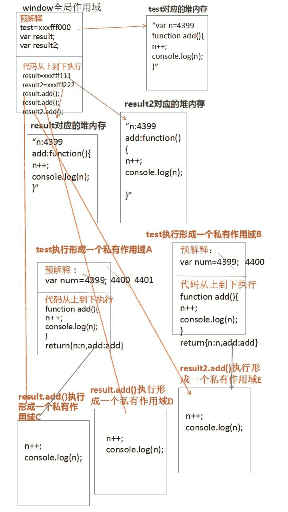js 在执行之前，会将所有带 var 和 function 的进行提前定义和声明。（带 var 的提前声明，function 声明和定义都完成了）首先，在全局作用域下，进行**预解释：**test=xxxfff000（开辟一个堆内存，里面存的是代码字符串）var result（声明一个变量 result）var  result2（声明一个变量 result2）-------------------------------**代码执行：**result=test()  -->将 test 执行的返回结果赋值给 result，是一个对象，再开辟一个堆内存，test 执行，形成一个私有作用域 A 再进行预解释和代码执行等一系列操作 result2=test()  同理 result.add()  -->方法执行形成一个私有作用域 n++  顺着作用域链向上寻找到 test 作用域 A**（****A 这个作用域不销毁，因为被全局变量 result 占用了****）**中的 n 为 4399，n++ 》4400（这时 test 这个作用域 A 下的 n 变成 4400）**(1)   console.log(n)  //4400   **==============================result.add()   -->方法执行形成一个**新的**私有作用域 n++  顺着作用域链向上寻找到 test 作用域（A）中的 n 为 4400，n++ 》4401**(2)   console.log(n)  //4401**  ===============================(3)   **console.log(result.n)  /****/4399****此时找的只是 result 对应的那个堆内存中的 n**===============================result2.add()  -->方法执行形成一个私有作用域 n++ 顺着作用域链向上寻找到 test 作用域（B）中的 n 为 4399，n++ 》4400**(3)   console.log(n)  //4400** 个人理解，有哪个地方写的不对希望多多指教~~~

发表于 2017-08-03 22:04:13

* * *

[Summer_15](https://www.nowcoder.com/profile/8482097)

首先，题中定义了一个函数，名为 test，这个函数内部分别又定义了一个数值变量 n 和一个闭包函数 add，test 函数的最后一行代码 return{n:n,add:add}，实际上是返回了一个 object，而这个 object 中有一个属性 n，它的值是 n，还有一个方法 add，它的值是 add。好了，函数解释清楚，再来看输出的问题。函数外部分别定义了两个变量，result 和 result2，他们都指向 test 函数，但是分属两个不同的作用域，这也就解释了答案中 1 和 4,4 不会在 2 的基础上继续 n++。1 和 2 属于闭包函数的问题，可参考阮一峰老师的一篇博文（http://www.ruanyifeng.com/blog/2009/08/learning_javascript_closures.html），简单易懂，借用阮老师博客中所写，闭包的两个最大的用处：一个是可以读取到函数内部的变量，另一个就是让这些变量的值始终保持在内存中，具体可以测试。第二个用途就解释了同一个作用域中答案 2 会在 1 的基础上进行+1 操作。答案 3 是比较令人困惑的一项，追本溯源，前面提到过第 6 行代码返回了一个有着值为 n 的属性 n 和值为 add 的方法 add 的匿名对象，在这里，在这个匿名对象中，属性 n 和方法 add 是互不相关的，即使在闭包 add 中改变了变量 n 的值，result.n 的值依然不变。以上，首答，说了下自己的理解，有不对的地方还望指正。

发表于 2017-04-27 22:03:06

* * *

## 7

关于计算机网络，下列描述当中，正确的是（）

正确答案: C   你的答案: 空 (错误)

```cpp
在同一信道上同一时刻，可进行双向数据传送的通信方式是半双工
```

```cpp
TCP 协议是无连接的；UDP 协议是面向连接的
```

```cpp
假设一个主机的 ip 地址为 192.168.8.123，而子网掩码为 255.255.255.248，那么该主机的网络号是 192.168.8.120
```

```cpp
计算机网络中的 OSI 结构分别是：物理层，数据链路层，传输层，会话层，表示层，应用层
```

本题知识点

网络基础 前端工程师 4399 游戏 2017

讨论

[黛玛葛](https://www.nowcoder.com/profile/2964502)

A：同一信道同一时刻通信的是全双工，半双工是是指在通信过程的任意时刻，信息既可由 A 传到 B，又能由 B 传 A，但只能 由一个方向上的传输存在。B：TCP 协议是有连接的，UDP 是无连接的。C：IP 和子网掩码相与得到网络号，应该是 192.168.8.120.D：OSI 七层协议，少了网络层

编辑于 2017-04-08 14:18:30

* * *

[花开花落情](https://www.nowcoder.com/profile/5485093)

子网掩码转换成二进制最后 8 位为 11111000，所以网络位为 29，主机位为 3，把主机 ip123 转换为二进制为 01111011，因为后 3 位为主机位所以为 01111000 转为十进制为 120

发表于 2017-10-22 16:03:01

* * *

[梦境迷离](https://www.nowcoder.com/profile/759736)

主机&子网掩码= 网络号

发表于 2018-03-04 20:47:56

* * *

## 8

关于数据库，下列描述中，正确的是

正确答案: A D   你的答案: 空 (错误)

```cpp
having 和 where 都是用来筛选用的，having 是筛选组，而 where 是筛选记录
```

```cpp
在 sql 中，关键字 delete 表示直接删除表，而 drop 表示删除表中数据
```

```cpp
主键是能确定一条记录的唯一标识，不能有重复，允许为空
```

```cpp
在数据库设计中，一个多对多的关系可通过一个中间表分为两个一对多的关系
```

```cpp
数据库设计的三大范式当中，第二范式要求一个数据库表中不包含已在其他表中包含的非主关键字信息
```

本题知识点

数据库 前端工程师 4399 游戏 2017

讨论

[dreamy_yue](https://www.nowcoder.com/profile/6025378)

第二范式：首先是 1NF，另外包含两部分内容，一是表必须有一个主键；二是没有包含在主键中的列必须完全依赖于主键，而不能只依赖于主键的一部分。 第三范式（3NF）：首先是 2NF，另外非主键列必须直接依赖于主键，不能存在传递依赖。即不能存在：非主键列 A 依赖于非主键列 B，非主键列 B 依赖于主键的情况。 

发表于 2017-08-16 19:33:59

* * *

[猪猪侠～](https://www.nowcoder.com/profile/1372260)

1、delete：删除表中的行，用法：delete from 表明 where 列名=值。2、drop：删除整个表，drop table 表名。3、truncate:删除表中的数据，相当于 delete 不加 where 条件。

发表于 2018-04-27 15:43:58

* * *

[拉普拉斯变换 666](https://www.nowcoder.com/profile/7403797)

```cpp
当你不再需要该表时， 用 drop;
当你仍要保留该表，但要删除所有记录时， 用 truncate;
当你要删除部分记录时（always with a WHERE clause), 用 delete.
```

发表于 2017-12-01 20:43:06

* * *

## 9

在 css 选择器当中，优先级排序正确的是

正确答案: B   你的答案: 空 (错误)

```cpp
id 选择器>标签选择器>类选择器
```

```cpp
id 选择器>类选择器>标签选择器
```

```cpp
类选择器>标签选择器>id 选择器
```

```cpp
标签选择器>类选择器>id 选择器
```

本题知识点

前端工程师 4399 游戏 2017 CSS

讨论

[、白衬衫ャ](https://www.nowcoder.com/profile/4423542)

```cpp
答案 B
CSS 选择器如下：
　　1\. 标签名选择器     div { color：Red;}         /即页面中的各个标签名的 css 样式
　　2.类选择器          .divClass {color:Red;}       /即定义的每个标签的 class 中的 css 样式
　　3.ID 选择器         #myDiv  {color:Red;}        /即页面中的标签的 id
　　4.后代选择器（类选择器的后代选择器）  .divClass  span { color:Red;}   /即多个选择器以逗号的格式分隔 命名找到准确的标签
　　5.群组选择器   div,span,img {color:Red}    /即具有相同样式的标签分组显示
　　选择器的优先级 1.最高优先级是 (直接在标签中的设置样式，假设级别为 1000)<div style="color:Red;"></div>
　　2.次优先级是（ID 选择器 ,假设级别为 100）   #myDiv{color:Red;}
　　3.其次优先级是（类选择器，假设级别为 10） .divClass{color:Red;}
　　4.最后优先级是 （标签选择器，假设级别是 1）  div{color:Red;}
　　5.那么后代选择器的优先级就可以计算了啊
　　比如 .divClass  span { color:Red;}   优先级别就是：10+1=11

```

发表于 2016-12-13 17:41:15

* * *

[熊在匣子里](https://www.nowcoder.com/profile/2046212)

4 个等级的定义如下： 第一等：代表内联样式，如: style=””，权值为 1000。 第二等：代表 ID 选择器，如：#content，权值为 100。 第三等：代表类，伪类和属性选择器，如.content，权值为 10。 第四等：代表类型选择器和伪元素选择器，如 div p，权值为 1。

发表于 2017-03-28 11:22:06

* * *

[我才是晴天](https://www.nowcoder.com/profile/5496356)

B，越精确优先级越高

发表于 2017-02-07 21:16:59

* * *

## 10

关于 CSS 布局中的 BFC ，描述错误的是

正确答案: A   你的答案: 空 (错误)

```cpp
BFC 的区域会与 float 的元素区域重叠
```

```cpp
计算 BFC 的高度时，浮动子元素也参与计算
```

```cpp
BFC 就是页面上的一个隔离的独立容器，容器里面的子元素是不会影响到外面的元素
```

```cpp
BFC 意为「块级格式化上下文」
```

本题知识点

前端工程师 4399 游戏 2017 CSS

讨论

[.H.′](https://www.nowcoder.com/profile/9128555)

       BFC 就是“块  查看全部)

编辑于 2017-03-19 09:13:38

* * *

[阿胜 4K](https://www.nowcoder.com/profile/8887390)

百度了很多 BFC 的内容，总结了一篇笔记。

[`www.cnblogs.com/asheng2016/p/7281784.html`](http://www.cnblogs.com/asheng2016/p/7281784.html)

发表于 2017-08-03 20:45:35

* * *

[Merlin_ 淼](https://www.nowcoder.com/profile/890975)

[`www.jianshu.com/p/76484dff1cb5`](http://www.jianshu.com/p/76484dff1cb5)很详细的解释

发表于 2017-06-29 10:46:57

* * *

## 11

下列的关于 ajax 描述当中，错误的是

正确答案: C   你的答案: 空 (错误)

```cpp
ajax 是异步 javascript 和 xml，用于在 web 页面中实现异步数据交互
```

```cpp
ajax 的核心对象是 xmlhttprequest
```

```cpp
ajax 的状态码 1 代表正在发送请求，2 代表正在解析响应内容，可通过 ajax.status 获取
```

```cpp
ajax 的缺点是对搜索引擎不友好，并且存在跨域问题限制
```

```cpp
要实现 ajax 下的前后退功能成本较大
```

本题知识点

Jquery 前端工程师 4399 游戏 2017

讨论

[oneday1](https://www.nowcoder.com/profile/4023361)

选 C，**状态值是****使用“ajax.readyState”获得。（由数字 1~4 单位数字组成） ，本题说的状态码应该是表述有误**0 ：未初始化，还没有调用[send()](http://www.so.com/s?q=send()&ie=utf-8&src=internal_wenda_recommend_text)方法 1 ：载入，已调用 send()方法，正在发送请求
2 ：载入完成，send()方法执行完成，已经接收到全部响应内容
3 ：交互，正在解析响应内容
4 ：完成，响应内容解析完成，可以在客户端调用了**AJAX 状态值与状态码区别  AJAX 状态值是指，运行 AJAX 所经历过的几种状态，无论访问是否成功都将响应的步骤，可以理解成为 AJAX 运行步骤。如：正在发送，正在响应等，由 AJAX 对象与服务器交互时所得；使用“ajax.readyState”获得。（由数字 1~4 单位数字组成）  AJAX 状态码是指，无论 AJAX 访问是否成功，由 HTTP 协议根据所提交的信息，服务器所返回的 HTTP 头信息代码，该信息使用“ajax.status”所获得；（由数字 1XX,2XX 三位数字组成，详细查看 RFC）** 

发表于 2017-08-04 15:00:42

* * *

[yy 呀](https://www.nowcoder.com/profile/7790785)

0：未初始化，没调用 send（）方法 1：载入 调用 send（）方法 2：send 方法调用完成 3：正在解析交互内容 4：解析内容完成 

发表于 2017-08-09 20:06:36

* * *

[梦在起航 1](https://www.nowcoder.com/profile/5778273)

C 应该是能根据 readystate 属性获取

发表于 2017-08-01 18:30:16

* * *

## 12

```cpp
var foo = {n:1};
(function(foo){
    console.log(foo.n);
    foo.n = 3;
    var foo = {n:2};
    console.log(foo.n);
})(foo);
console.log(foo.n);
```

以上 JavaScript 代码，在浏览器中运行的结果是

正确答案: A   你的答案: 空 (错误)

```cpp
1 2 3
```

```cpp
undefined 2 1
```

```cpp
报错
```

```cpp
1 2 1
```

本题知识点

Javascript 前端工程师 4399 游戏 2017

讨论

[demo 亮](https://www.nowcoder.com/profile/7715802)

A

*   第一步：进行预编译

  查看全部)

编辑于 2016-12-25 22:13:22

* * *

[君寻不惑](https://www.nowcoder.com/profile/8320631)

```cpp

```
var foo = {n:1};
(function(foo){            //形参 foo 同实参 foo 一样指向同一片内存空间，这个空间里的 n 的值为 1
    var foo;               //优先级低于形参，无效。
    console.log(foo.n);    //输出 1
    foo.n = 3;             //形参与实参 foo 指向的内存空间里的 n 的值被改为 3
    foo = {n:2};           //形参 foo 指向了新的内存空间，里面 n 的值为 2.
    console.log(foo.n);    //输出新的内存空间的 n 的值
})(foo);
console.log(foo.n);        //实参 foo 的指向还是原来的内存空间，里面的 n 的值为 3.
```cpp

```

编辑于 2017-02-07 17:31:53

* * *

[SuperluminalSnalis](https://www.nowcoder.com/profile/3962359)

知识点:JavaScript 的 hoisting 机制

本质:只提升声明部分

例子

1.我是变量声明，我会被提升在作用域顶端！

```cpp
var a; 
```

2.我是变量定义，我的声明部分会被提升，赋值部分不会被提升！

```cpp
var b = 'test'; 
```

3.我是函数定义，或者叫我函数表达式。其实我就是变量定义，只不过恰好被赋值的类型是函数，所以也`只提升变量名`，`不提升函数值`！

```cpp
var c = function() {
    console.log('test');
} 
```

4.`我是函数声明，所以我全部被提升了`，包括函数名和函数体。另外，我的优先级比变量声明要高，名字和我相同的变量声明会被忽略！

```cpp
function d() {
    console.log('test');
} 
```

题目

参数是引用参数

```cpp
var foo={n:1};
(function (foo) {
    console.log(foo.n);
    foo.n=3;
    var foo={n:2};
    console.log(foo.n);
})(foo);
console.log(foo.n); 
```

结果: 1 2 3

参数是传值参数

```cpp
var foo=1;
(function (foo) {
    console.log(foo);
    foo=3;
    var foo=2;
    console.log(foo);
})(foo);
console.log(foo); 
```

结果:1 2 1

解释:

```cpp
var foo={n:"我是形参或全局变量"};
(function (foo) {
    console.log(foo.n);
    foo.n="我改变了参数和全局变量";
    var foo={n:"我是局部变量"};
    console.log(foo.n);
})(foo);
console.log(foo.n); 
```

发表于 2017-01-10 20:28:38

* * *

## 13

在 javascript 中，不属于基本类型的是

正确答案: A   你的答案: 空 (错误)

```cpp
date
```

```cpp
number
```

```cpp
null
```

```cpp
undefined
```

```cpp
string
```

```cpp
boolean
```

本题知识点

Javascript 前端工程师 4399 游戏 前端工程师 4399 游戏 2017

讨论

[可别逗了](https://www.nowcoder.com/profile/584812)

[图]参考地址：ht  查看全部)

编辑于 2016-12-24 17:26:03

* * *

[意滔](https://www.nowcoder.com/profile/3509977)

JS 里的类型有 null, undefine, string, number, boolean, symbol 和 object。其中前 6 个是基础数据类型，而 object 是复杂数据类型。

发表于 2017-10-06 22:09:49

* * *

[小灵仙](https://www.nowcoder.com/profile/7996147)

js 中基本数据类型有六种：string,number,null,undefined,boolean，symbol（2015 年新增）

发表于 2017-09-04 20:26:21

* * *

## 14

下列关于 js 函数定义方式的描述正确的是

正确答案: C   你的答案: 空 (错误)

```cpp
function add(a,b){return a+b;}函数表达式
```

```cpp
var add=new Function(‘a’,’b’,’return a+b’)函数表达式
```

```cpp
function add(a,b){return a+b;}函数声明
```

```cpp
var add=function(a,b){return a+b;}函数声明
```

```cpp
var add=new Function(‘a’,’b’,’return a+b’);函数声明
```

本题知识点

Javascript 前端工程师 4399 游戏 2017

讨论

[凯撒 12345](https://www.nowcoder.com/profile/6531542)

C 一.函数声明语法定义  查看全部)

编辑于 2017-03-17 23:18:12

* * *

[小月儿圆](https://www.nowcoder.com/profile/5847379)

摘自《JavaScript 高级程序设计》函数声明

```cpp
function sum(a,b){
    return a+b
}

```

函数表达式

```cpp
var sum = function(a,b){
    return a+b
}
```

Function 构造函数【从技术角度讲，这是一个函数表达式】

```cpp
var sum = new Function('a','b','return a+b')//不推荐使用，影响函数解析性能
```

发表于 2017-12-17 16:17:18

* * *

[daipi173](https://www.nowcoder.com/profile/3869378)

b 答案不属于函数表达式，而是属于函数构造器，因此 b 是错误的

发表于 2019-03-01 14:25:44

* * *

## 15

 ```cpp
var color = 'green';
var test4399 = {
    color: 'blue',
    getColor: function(){
        var color = "red";
        alert(this.color);
    }
}
var getColor = test4399.getColor;
getColor();
test4399.getColor();
``` 以上 JavaScript 代码执行后， 浏览器 alert 出来的结果分别是

正确答案: B   你的答案: 空 (错误)

```cpp
undefined,red
```

```cpp
green,blue
```

```cpp
undefined,blue
```

```cpp
green,undefined
```

```cpp
blued,undefined
```

本题知识点

Javascript 前端工程师 4399 游戏 2017

讨论

[凯撒 12345](https://www.nowcoder.com/profile/6531542)

  查看全部)

编辑于 2017-03-19 12:06:12

* * *

[bigding](https://www.nowcoder.com/profile/948236)

知识点一:js 函数调用时加括号和不加括号的区别.不加括号相当于把函数代码赋给等号左边,加括号是把函数返回值赋给等号左边.参考[`www.zhihu.com/question/31044040`](https://www.zhihu.com/question/31044040)知识点二:js 中 this 的用法,this 总是指向调用它的对象,倒数第二行的 getColor 为 windows 调用的,倒数第一行的 getColor 是 test4399 对象调用的.参考 http://www.cnblogs.com/painsOnline/p/5102359.html

发表于 2017-03-04 13:16:01

* * *

[肉哥爱学习](https://www.nowcoder.com/profile/8902700)

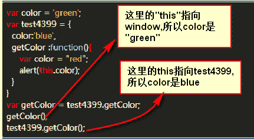

发表于 2017-07-05 00:32:20

* * *

## 16

下列描述中，错误的是

正确答案: C   你的答案: 空 (错误)

```cpp
SQL 语言又称为结构化查询语言
```

```cpp
java 中”static”关键字表明一个成员变量或者是成员方法可以在没有所属的类的实例变量的情况下被访问
```

```cpp
面向对象开发中，引用传递意味着传递的并不是实际的对象，而是对象的引用，因此，外部对引用对象所做的改变不会反映到所引用的对象上
```

```cpp
java 是强类型语言，javascript 是弱类型语言
```

```cpp
面向对象的三大特性包括：封装，继承，多态
```

本题知识点

面向对象 Javascript Java 数据库 前端工程师 4399 游戏 2017

讨论

[妞妞闯天关](https://www.nowcoder.com/profile/388524)

  查看全部)

编辑于 2017-02-16 11:48:56

* * *

[bbblemon](https://www.nowcoder.com/profile/3807435)

**选 C****值传递，传递的是原来值的副本。****引用传递，除了一些特殊的（String，包装类属于不可变类），一般的引用类型在进行传递的时候，一开始形参和实参都是指向同一个地址的，这个时候形参对对象的改变会影响到实参。**

发表于 2018-07-17 09:59:31

* * *

[shawnshone](https://www.nowcoder.com/profile/3917461)

传值传参的时候，我们在函数中改变了参数的值，其对应的变量的值并不改变，值类型传参就是将变量保存的内容复制到函数的形参中，他们是两个不同的变量，值不过保存的内容相同不了.引用传参保存的是一个地址，这个地址里保存的是变量的具体值，而引用类型作为参数的时候，是将变量保存的地址值赋值到参数变量里，这样他们都指向了同一个内容，这样我们改变参数的成员的话，那么相应的变量的成员也会改变。

发表于 2016-12-27 15:06:56

* * *

## 17

下列关于 JavaScript 模块化的描述,错误的是

正确答案: C   你的答案: 空 (错误)

```cpp
模块化有利于管理模块间的依赖，更依赖模块的维护
```

```cpp
主流的模块化包括 CommonJS,AMD,CMD 等
```

```cpp
Sea.js 遵循 AMD 规范，RequireJS 遵循 CMD 规范
```

```cpp
AMD 推崇依赖前置，CMD 推崇依赖就近
```

本题知识点

Javascript 前端工程师 4399 游戏 2017

讨论

[汤又歌](https://www.nowcoder.com/profile/4307638)

[AMD](https://github.com/amdjs/amdjs-api/wiki/AMD)是"Asynchronous Module Definition"的缩写，意思就是"异步模块定义"。它采用异步方式加载模块，模块的加载不影响它后面语句的运行。所有依赖这个模块的语句，都定义在一个回调函数中，等到加载完成之后，这个回调函数才会运行。
AMD 也采用 require()语句加载模块，但是不同于 CommonJS。
主要有两个 Javascript 库实现了 AMD 规范：[require.js](http://requirejs.org/)和[curl.js](https://github.com/cujojs/curl)。
参考链接：http://www.ruanyifeng.com/blog/2012/10/asynchronous_module_definition.html

AMD 是 RequireJS 在推广过程中对模块定义的规范化产出。
CMD 是 SeaJS 在推广过程中对模块定义的规范化产出。
区别：
1\. 对于依赖的模块，AMD 是**提前执行**，CMD 是**延迟执行**。
2\. CMD 推崇**依赖就近**，AMD 推崇**依赖前置**。
// CMD
define(function(require, exports, module) {
var a = require('./a')
a.doSomething()
// 此处略去 100 行
var b = require('./b') // 依赖可以就近书写
b.doSomething()
// ...
})
// AMD 默认推荐的是
define(['./a', './b'], function(a, b) { // 依赖必须一开始就写好
a.doSomething()
// 此处略去 100 行
b.doSomething()
...
})

发表于 2017-02-24 15:27:11

* * *

[我有一只小坛子](https://www.nowcoder.com/profile/2230838)

sea.js----CMDrequire.js---AMD

发表于 2017-02-09 18:05:58

* * *

[GDragonPuls](https://www.nowcoder.com/profile/1265731)

AMD："异步模块定义"；它采用异步方式加载模块，模块的加载不影响它后面语句的运行。所有依赖这个模块的语句，都定义在一个回调函数中，等到加载完成之后，这个回调函数才会运行。AMD 也采用 require()语句加载模块，但是不同于 CommonJS。
主要有两个 Javascript 库实现了 AMD 规范：[require.js](http://requirejs.org/)和[curl.js](https://github.com/cujojs/curl)。 AMD 是 RequireJS 在推广过程中对模块定义的规范化产出。require.js---AMDCMD 是 SeaJS 在推广过程中对模块定义的规范化产出。sea.js----CMD 区别：
1\. 对于依赖的模块，AMD 是**提前执行**，CMD 是**延迟执行**。
2\. CMD 推崇**依赖就近**，AMD 推崇**依赖前置**。

编辑于 2017-09-19 20:35:32

* * *

## 18

关于 W3C 制定的 JavaScript 标准事件模型，以下正确的顺序以及描述是

正确答案: B   你的答案: 空 (错误)

```cpp
事件捕获>事件冒泡
```

```cpp
事件捕获->事件处理->事件冒泡
```

```cpp
事件冒泡->事件处理
```

```cpp
事件冒泡->事件处理->事件捕获
```

```cpp
事件处理->事件捕获->事件冒泡
```

本题知识点

Javascript 前端工程师 4399 游戏 2017

讨论

[禹](https://www.nowcoder.com/profile/5898181)

B   先事件捕获从 wind  查看全部)

编辑于 2017-03-17 23:15:59

* * *

[ListADT](https://www.nowcoder.com/profile/9124108)

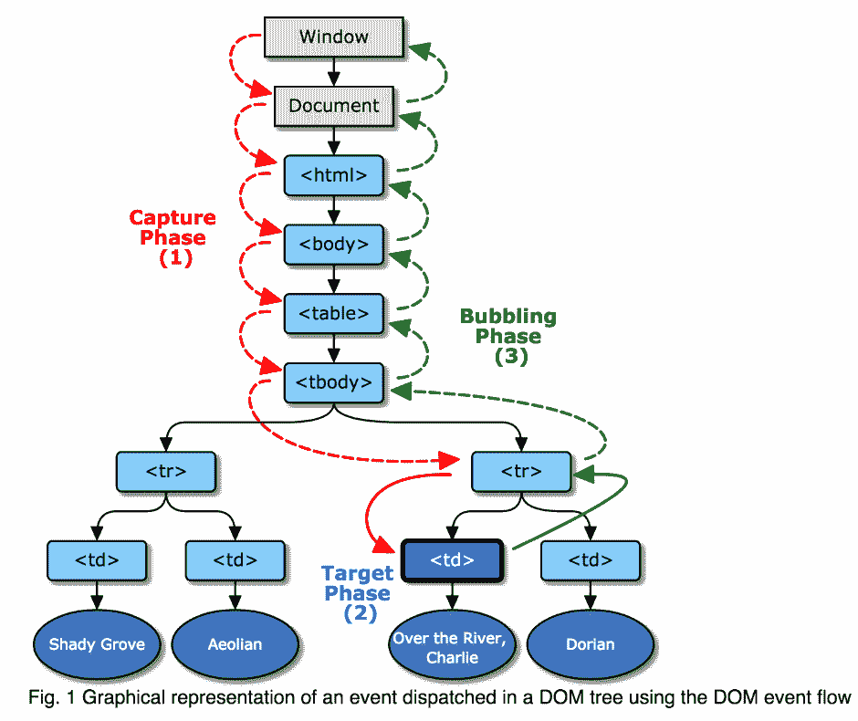

发表于 2017-03-26 00:50:26

* * *

[最讨厌晚上 9 点半，钉钉响起的声音](https://www.nowcoder.com/profile/303433)

dom2 规定的事件流包括 3 个阶段：①事件捕获，②处于目标阶段（事件处理 ），③事件冒泡阶段。

发表于 2017-03-30 23:02:03

* * *

## 19

以下描述错误的是

正确答案: A   你的答案: 空 (错误)

```cpp
cookie 以及 loaclStorage 都会伴随着 http 请求发送到服务器
```

```cpp
get 提交的 url 会有长度的限制，而 post 提交的数据则可以比较大
```

```cpp
在 javascript 中可以操作 cookie
```

```cpp
javascript 在浏览器的执行是单线程的
```

```cpp
html5 中的新增存储方式包括 localStorage/sessionStorage
```

本题知识点

Javascript 网络基础 前端工程师 4399 游戏 2017

讨论

[nogamenolife](https://www.nowcoder.com/profile/891246)

A,  cookie 会被 Htt  查看全部)

编辑于 2017-03-18 09:27:31

* * *

[熊在匣子里](https://www.nowcoder.com/profile/2046212)

sessionStorage 、localStorage 和 cookie 之间的区别 共同点：都是保存在浏览器端，且同源的。 区别： 1:cookie 数据始终在同源的 http 请求中携带（即使不需要），即 cookie 在浏览器和服务器间来回传递。而 sessionStorage 和 localStorage 不会自动把数据发给服务器，仅在本地保存。cookie 数据还有路径（path）的概念，可以限制 cookie 只属于某个路径下。 2:存储大小限制也不同，cookie 数据不能超过 4k，同时因为每次 http 请求都会携带 cookie，所以 cookie 只适合保存很小的数据，如会话标识。sessionStorage 和 localStorage 虽然也有存储大小的限制，但比 cookie 大得多，可以达到 5M 或更大。 3:数据有效期不同，sessionStorage：仅在当前浏览器窗口关闭前有效，自然也就不可能持久保持；localStorage：始终有效，窗口或浏览器关闭也一直保存，因此用作持久数据；cookie 只在设置的 cookie 过期时间之前一直有效，即使窗口或浏览器关闭。 4:作用域不同，sessionStorage 不在不同的浏览器窗口敏感词享，即使是同一个页面；localStorage 在所有同源窗口中都是共享的；cookie 也是在所有同源窗口中都是共享的。 5:Web Storage 支持事件通知机制，可以将数据更新的通知发送给监听者。 6:Web Storage 的 api 接口使用更方便。 GET 和 POST 的区别： 　　1.GET 请求的数据会附在 URL 之后（就是把数据放置在 HTTP 协议头中），以?分割 URL 和传输数据，参数之间以&amp;amp;相连，如：login.action?name=hyddd&amp;amp;password=idontknow&amp;amp;verify=%E4%BD%A0%E5%A5%BD。如果数据是英文字母/数字，原样发送，如果是空格，转换为+，如果是中文/其他字符，则直接把字符串用 BASE64 加密，得出如：%E4%BD%A0%E5%A5%BD，其中％XX 中的 XX 为该符号以 16 进制表示的 ASCII。 　　POST 把提交的数据则放置在是 HTTP 包的包体中。 2.&amp;quot;GET 方式提交的数据最多只能是 1024 字节，理论上 POST 没有限制，可传较大量的数据，IIS4 中最大为 80KB，IIS5 中为 100KB&amp;quot;？？！ 3.在 ASP 中，服务端获取 GET 请求参数用 Request.QueryString，获取 POST 请求参数用 Request.Form。在 JSP 中，用 request.getParameter(\&amp;quot;XXXX\&amp;quot;)来获取，虽然 jsp 中也有 request.getQueryString()方法，但使用起来比较麻烦，比如：传一个 test.jsp?name=hyddd&amp;amp;password=hyddd，用 request.getQueryString()得到的是：name=hyddd&amp;amp;password=hyddd。在 PHP 中，可以用$_GET 和$_POST 分别获取 GET 和 POST 中的数据，而$_REQUEST 则可以获取 GET 和 POST 两种请求中的数据。值得注意的是，JSP 中使用 request 和 PHP 中使用$_REQUEST 都会有隐患，这个下次再写个文章总结。 4.POST 的安全性要比 GET 的安全性高。注意：这里所说的安全性和上面 GET 提到的“安全”不是同个概念。上面“安全”的含义仅仅是不作数据修改，而这里安全的含义是真正的 Security 的含义，比如：通过 GET 提交数据，用户名和密码将明文出现在 URL 上，因为(1)登录页面有可能被浏览器缓存，(2)其他人查看浏览器的历史纪录，那么别人就可以拿到你的账号和密码了，除此之外，使用 GET 提交数据还可能会造成 Cross-site request forgery 攻击。 cookie 机制。正统的 cookie 分发是通过扩展 HTTP 协议来实现的，服务器通过在 HTTP 的响应头中加上一行特殊的指示以提示浏览器按照指示生成相应的 cookie。然而纯粹的客户端脚本如 JavaScript 或者 VBScript 也可以生成 cookie。而 cookie 的使用是由浏览器按照一定的原则在后台自动发送给服务器的。浏览器检查所有存储的 cookie，如果某个 cookie 所声明的作用范围大于等于将要请求的资源所在的位置，则把该 cookie 附在请求资源的 HTTP 请求头上发送给服务器。 因为 JS 运行在浏览器中，是单线程的，每个 window 一个 JS 线程，既然是单线程的，在某个特定的时刻只有特定的代码能够被执行，并阻塞其它的代码。而浏览器是事件驱动的（Event driven），浏览器中很多行为是异步（Asynchronized）的，会创建事件并放入执行队列中。javascript 引擎是单线程处理它的任务队列，你可以理解成就是普通函数和回调函数构成的队列。当异步事件发生时，如 mouse click, a timer firing, or an XMLHttpRequest completing（鼠标点击事件发生、定时器触发事件发生、XMLHttpRequest 完成回调触发等），将他们放入执行队列，等待当前代码执行完成。 HTML5 提供了两种在客户端存储数据的新方法： localStorage - 没有时间限制的数据存储 sessionStorage - 针对一个 session 的数据存储 之前，这些都是由 cookie 完成的。但是 cookie 不适合大量数据的存储，因为它们由每个对服务器的请求来传递，这使得 cookie 速度很慢而且效率也不高。 localStorage 和 sessionStorage 都具有相同的操作方法，例如 setItem()、getItem()和 removeItem()等 localStorage 和 sessionStorage 的方法： setItem 存储 value 用途：将 value 存储到 key 字段 用法：.setItem( key, value)

编辑于 2017-03-26 19:08:06

* * *

[星鸿](https://www.nowcoder.com/profile/2143176)

get 传送的数据量较小，不能大于 2KB。post 传送的数据量较大，一般被默认为不受限制。但理论上，IIS4 中最大量为 80KB，IIS5 中为 100KB。来自:[`zhinan.sogou.com/guide/detail/?id=316512367078`](https://zhinan.sogou.com/guide/detail/?id=316512367078)

发表于 2018-09-11 16:05:39

* * *

## 20

以下 jquery 对象方法中，使用了事件委托的是

正确答案: E   你的答案: 空 (错误)

```cpp
bind
```

```cpp
mousedown
```

```cpp
click
```

```cpp
change
```

```cpp
on
```

本题知识点

Jquery 前端工程师 4399 游戏 2017

讨论

[IRV_ 梁海杰](https://www.nowcoder.com/profile/9009821)

**jQuery 中实现事件委托的三种方法：**

*   $.on: 基本用法:$('.parent').on('click', 'a', function () { console.log('click event on tag a'); })，它是 .parent 元素之下的 a 元素的事件***到$('.parent')之上，只要在这个元素上有点击事件，就会自动寻找到.parent 元素下的 a 元素，然后响应事件；
*   $.delegate: 基本用法:$('.parent').delegate('a', 'click', function () { console.log('click event on tag a'); })，同上，并且还有相对应的$.delegate 来删除***的事件；

*   $.live: 基本使用方法:$('a', $('.parent')).live('click', function () { console.log('click event on tag a'); })，同上，然而如果没有传入父层元素$(.parent)，那事件会默认委托到$(document)上；(已废除)

**事件委托原理：**
事件委托是通过事件冒泡的原理，利用父级去触发子级的事件。
如果不用事件委托，将 ul 下每一个 li 都去添加 click 事件监听，非常麻烦，而且对于内存消耗是非常大的，效率上需要消耗很多性能；
另外就是如果通过 js 动态创建的子节点，需要重新绑定事件。

而利用事件委托的话，只需要给父级绑定一个事件监听，即可让每个 li 都绑定上相应的事件，让你避免对特定的每个节点添加事件***；事件***是被添加到它们的父元素上。事件***会分析从子元素冒泡上来的事件，找到是哪个子元素的事件。

> 更多内容——[JavaScript 事件委托详解](https://zhuanlan.zhihu.com/p/26536815)

编辑于 2017-08-31 21:17:50

* * *

[来🍃俊熙](https://www.nowcoder.com/profile/6593696)

Eon 一般是点击父元素上，父元素***子元素 BCD 都属于事件 A 已被淘汰

发表于 2017-05-13 15:08:56

* * *

[leonkwok](https://www.nowcoder.com/profile/3292575)

只能是**D**，用**on**方法绑定事件，里面可以填一个选择器参数，实现**事件委托**

```cpp
$("ul").on("click","li",function(){}) 
```

以上就是将 li 的事件委托给父级 ul

发表于 2017-03-04 11:10:42

* * *

## 21

以下 json 格式数据，错误的是

正确答案: A C   你的答案: 空 (错误)

```cpp
{company：4399}
```

```cpp
{"company":{"name":[4399,4399,4399]}}
```

```cpp
{[4399,4399,4399]}
```

```cpp
{"company":[4399,4399,4399]}
```

```cpp
{"company":{"name":4399}}
```

本题知识点

Java 前端工程师 4399 游戏 2017

讨论

[cyanlong](https://www.nowcoder.com/profile/8977519)

A:错误  {company  查看全部)

编辑于 2017-03-17 23:40:44

* * *

[ThinkingOverflow](https://www.nowcoder.com/profile/165701207)

  JSON 由{键:值}组成，需要注意的是：
1）键用引号(单双都行)引起来，也可以不使用引号；
2）值得取值类型：
1\. 数字（整数或浮点数）
2\. 字符串（在双引号中）
3\. 逻辑值（true 或 false）
4\. 数组（在方括号中） {"persons":[value1 , value2]}
5\. JSON 对象（在花括号中） {"address":{"province"："陕西"....}}
6\. null

据此分析，BDE 是对的，A 中冒号是中文冒号（...尼玛这样出题），C 中没有键

发表于 2020-03-19 23:33:11

* * *

[zhisheng_blog](https://www.nowcoder.com/profile/616717)

看选项猜答案。 应该是需要加引号，并且是一对一对出现的。

发表于 2017-03-23 10:33:28

* * *

## 22

以下 JavaScript 代码，在浏览器中运行的结果是

 ```cpp
function foo(){
    console.log('first');
    setTimeout(function (){
        console.log('second');
    },5);
}
for(var i=0;i< 4399999999;i++) {
    foo();
}
``` 

正确答案: B   你的答案: 空 (错误)

```cpp
first,second,first,second..依次顺序输出
```

```cpp
首先全部输出 first，然后全部输出 second
```

```cpp
first，second 无顺序输出
```

```cpp
首先输出 first，超出 5ms 输出所有 second，最后输出余下的 first
```

本题知识点

Javascript 前端工程师 4399 游戏 2017

讨论

[迷途的马尔斯](https://www.nowcoder.com/profile/839231)

JavaScript 是单线程的，setTimeout 设置的是异步任务，会放在 macrotask 里面，等待执行栈的代码执行完毕之后才会执行 macrotask 里面的异步任务，所以这里会等待 for 循环执行完毕才会执行定时器设置的任务。

发表于 2017-09-24 14:48:37

* * *

[李孟杰](https://www.nowcoder.com/profile/8586084)

B:首先 js 是运行于单线程环境中，定时器作用是在规定时间内将事件加入执行队列，而加入的前提是当前事件队列没有任何东西

发表于 2016-12-28 22:39:27

* * *

[意滔](https://www.nowcoder.com/profile/3509977)

答案是 B。这里考察的知识点是回调的运行机制。回调时，被回调的函数会被放在 event loop 里，等待线程里的任务执行完后才执行 event loop 里的代码。因此，上述代码会先把线程里的 console.log('first')执行完后，再执行 event loop 里的 console.log('second')。因此，答案选 B。

编辑于 2016-12-31 16:44:15

* * *

## 23

以下 jquery 方法中，实现跨域的是

正确答案: B   你的答案: 空 (错误)

```cpp
get
```

```cpp
getJSON
```

```cpp
load
```

```cpp
post
```

```cpp
each
```

本题知识点

Jquery 前端工程师 4399 游戏 2017

讨论

[shuson](https://www.nowcoder.com/profile/341864)

我怎么读不懂题呢，jquery 自己又不能 cross domain，都是借助其他技术实现

发表于 2017-01-03 22:11:01

* * *

[那年一纸花开](https://www.nowcoder.com/profile/173157)

JQ 中的 getJSON 可以。大多数还是 JSONP 用的多

发表于 2018-03-06 15:35:42

* * *

[Surin](https://www.nowcoder.com/profile/8943261)

B.在 jQuery 1.2 中，您可以通过使用 [JSONP](http://bob.pythonmac.org/archives/2005/12/05/remote-json-jsonp/) 形式的回调函数来加载其他网域的 JSON 数据，如 "myurl?callback=?"。jQuery 将自动替换 ? 为正确的函数名，以执行回调函数。 注意：此行以后的代码将在这个回调函数执行前执行。

发表于 2017-01-02 16:36:48

* * *

## 24

在 JavaScript 中，用于阻止默认事件的默认操作的方法是

正确答案: E   你的答案: 空 (错误)

```cpp
stopDeafault()
```

```cpp
stopPropagation()
```

```cpp
preventPropagation()
```

```cpp
preventDefaultEven()
```

```cpp
preventDefault()
```

本题知识点

Javascript 前端工程师 4399 游戏 2017

讨论

[两年...](https://www.nowcoder.com/profile/6315643)

  查看全部)

编辑于 2017-03-19 19:43:13

* * *

[天秤](https://www.nowcoder.com/profile/1085746)

下面三个事件都是事件对象的方法：

*   `stopPropagation()` 阻止事件冒泡。 这个事件不会阻止定义在元素上的其他事件。

*   `stopImmediatePropagation()` 会彻底的阻止事件， 在其之后的绑定在元素上的其他监听事件都不会触发

*   `preventDefault()` 阻止事件的默认动作

js 没有选项中的其他事件

发表于 2018-05-15 19:46:29

* * *

[liamW](https://www.nowcoder.com/profile/6981871)

楼下说的都对

编辑于 2017-02-05 12:26:05

* * *

## 25

 ```cpp
var A = {n:4399};
var B = function(){this.n = 9999};
var C = function(){var n = 8888};
B.prototype = A;
C.prototype = A;
var b = new B();
var c = new C();
A.n++;
console.log(b.n);
console.log(c.n);
``` 以上代码，在浏览器中执行的结果是

正确答案: D   你的答案: 空 (错误)

```cpp
9999 8889
```

```cpp
10000 8888
```

```cpp
4400 8889
```

```cpp
9999 4400
```

```cpp
4400 4400
```

本题知识点

Javascript 前端工程师 4399 游戏 2017

讨论

[liyixiaobai](https://www.nowcoder.com/profile/9391499)

console.log(b  查看全部)

编辑于 2017-01-09 19:41:20

* * *

[要小心 Nijat 哦](https://www.nowcoder.com/profile/9595159)

new 运算的具体执行过程：    1)创建一个空对象
    2)把这个空对象的 __proto__ 指向构造函数的 prototype
    3)把这个空对象赋值给 this
    4)执行构造函数内的代码，注意此时的 this 指向新对象，this.n=9999 等价于 b.n=9999;
然后访问 b.n，存在，直接输出 b.n。再去访问 c.n，不存在，通过原型链 __proto__ 向上寻找，c.__proto__ 指向 C.prototype 也就是 A，所以就是输出 A.n

发表于 2017-05-03 19:20:05

* * *

[我是传奇！](https://www.nowcoder.com/profile/4910186)

```cpp
var c = new C();
```

上面这个语句的实际运行过程是这样的。

```cpp
var c = function() {
    var o = new Object();
    //第一个参数改变函数的作用域，即相当于在函数内部设置 this = o
    C.apply(o, argumens);
    return o;
}
```

这样，由于 C()函数中

```cpp
var n = 8888;
```

这样只是在函数中创建了一个私有变量，并没有为对象执行任何操作，因此 C 的实例中不存在名字为“n”的属性。所以，c.n 会访问原型中的属性名为“n”的值。

编辑于 2017-02-20 17:18:44

* * *

## 26

以下关于 JavaScript 的描述中错误的是

正确答案: D   你的答案: 空 (错误)

```cpp
在原型上扩展的可枚举方法，会被 for in 循环出来
```

```cpp
使用 object.defineProperty 可向对象添加或者修改属性
```

```cpp
每个对象都有 prototype 属性，返回对象类型原型的引用
```

```cpp
通过 hasOwnProperty 可判断一个对象以及其原型链上是否具有指定名称的属性
```

```cpp
原型链是 JS 实现继承的一种模型
```

```cpp
For 循环是按顺序的，for in 循环是不一定按顺序的
```

本题知识点

Javascript 前端工程师 4399 游戏 2017

讨论

[ltaoo](https://www.nowcoder.com/profile/504726)

自己的一些思考

B、C、D 都是错误的。

B:使用 object.defineProperty 可向对象添加或者修改属性

这里是小写的 object 而非 Object，所以错误。

C: 每个对象都有 prototype 属性，返回对象类型原型的引用

```cpp
var obj = Object.create(null)
console.log(obj) 
```

如果使用 chrome 浏览器控制台输入上面代码，可以看到打印了一个空对象，展开看到 No Properties，而随便自己用字面量声明一个对象，都能看到**proto**属性。

所以，不是每个对象都有 prototype 属性。后面这句，严格来说是不是每个对象都会返回 Object.prototype？，但实际应该是**这个对象的原型**的引用，加个“类型”是什么意思，所以这个选项考点到底是第一句话还是第二句话？

D: 通过 hasOwnProperty 可判断一个对象以及其原型链上是否具有指定名称的属性

这个很明显，从该方法名称就能看出，所以是无法判断原型链上是否有的。在《你不知道的 JavaScript》(上卷) p119 也提到了这个：

> 相比之下， hasOwnProperty(..) 只会检查属性是否在 myObject 对象中，不会检查[[Prototype]] 链。

E 和 F

都不敢相信网站的答案了。。。这两个到底是对的还是错的，求解答。

编辑于 2017-02-08 14:27:54

* * *

[SunYshine](https://www.nowcoder.com/profile/5151218)

```cpp
hasOwnProperty 方法是用来检测给定的属性是否在当前对象的实例中。
```

发表于 2017-07-23 10:40:24

* * *

[幸福＜＞回忆](https://www.nowcoder.com/profile/1975467)

var obj=Object.create(null)
obj 他的原型是 null，所以 obj 是没有 prototype 属性的

发表于 2017-03-15 20:19:46

* * *

## 27

下列 html 语义化标签中，描述存在错误的是

正确答案: E   你的答案: 空 (错误)

```cpp
<em>强调文字，<blockquote>长文本引用
```

```cpp
<strong>强调文字，<h1>文章栏目标题
```

```cpp
<a>超链接，<p>文章段落
```

```cpp
<section>定义文档中的节，<nav>导航
```

```cpp
<ul>有序列表。<ol>无序列表
```

本题知识点

HTML 前端工程师 4399 游戏 2017

讨论

[宇智波尹](https://www.nowcoder.com/profile/9867125)

ul:unordered ol:ordered

发表于 2017-02-06 15:05:19

* * *

[熊在匣子里](https://www.nowcoder.com/profile/2046212)

> 标签定义块引用。 <h1> - <h6> 标签可定义标题。 <strong> 标签和 <em> 标签一样，用于强调文本，但它强调的程度更强一些。 <a>标签定义超链接，用于从一张页面链接到另一张页面。 <p>标签定义段落。 <section> 标签定义文档中的节（section、区段）。<nav> 标签定义导航链接的部分。 <ul> 标签定义无序列表。 <ol> 标签定义有序列表。
> 
> 发表于 2017-03-24 11:12:52
> 
> * * *
> 
> [曹艳杰](https://www.nowcoder.com/profile/975707)
> 
> **ul:unordered list**
> **ol:ordered list**
> 
> 发表于 2017-12-01 08:59:41
> 
> * * *
> 
> ## 28
> 
> 以下选择中，都属于 mvvm/mvc 框架的是
> 
> 正确答案: B   你的答案: 空 (错误)
> 
> ```cpp
> jquery，zepto
> ```
> 
> ```cpp
> angular，vue
> ```
> 
> ```cpp
> zepto，angular
> ```
> 
> ```cpp
> query，underscore
> ```
> 
> ```cpp
> jquery，react
> ```
> 
> ```cpp
> zepton，node
> ```
> 
> 本题知识点
> 
> WebServer 前端工程师 4399 游戏 2017
> 
> 讨论
> 
> [ichengzi_me](https://www.nowcoder.com/profile/6957224)
> 
> 送分题，选 B，两个都是前端经典的 MVVM 框架
> 
> 发表于 2017-02-23 19:15:07
> 
> * * *
> 
> ## 29
> 
> 下列 html 元素当中，都属于块级元素的是
> 
> 正确答案: A   你的答案: 空 (错误)
> 
> ```cpp
> h3，ul，form，table，p
> ```
> 
> ```cpp
> h2，table，ul，a，input
> ```
> 
> ```cpp
> p，ul，form，div，strong
> ```
> 
> ```cpp
> div，p，h1，table，span
> ```
> 
> 本题知识点
> 
> HTML 前端工程师 4399 游戏 2017
> 
> 讨论
> 
> [六月熊](https://www.nowcoder.com/profile/7492130)
> 
> 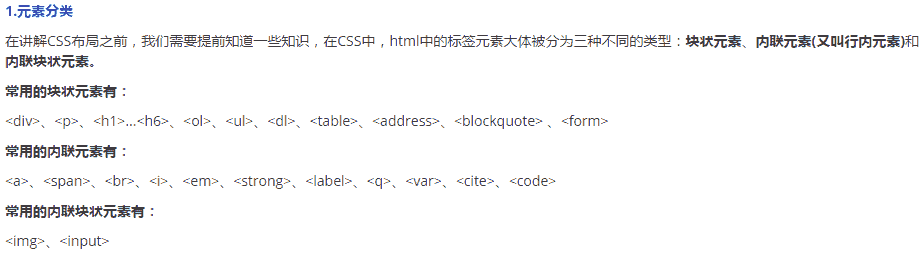
> 
> 编辑于 2017-03-19 09:17:33
> 
> * * *
> 
> [尤元辉](https://www.nowcoder.com/profile/6475964)
> 
> | **块级元素列表** |
> | <address> | 定义地址 |
> | <caption> | 定义表格标题 |
> | <dd> | 定义列表中定义条目 |
> | <div> | 定义文档中的分区或节 |
> | <dl> | 定义列表 |
> | <dt> | 定义列表中的项目 |
> | <fieldset> | 定义一个框架集 |
> | <form> | 创建 HTML 表单 |
> | <h1> | 定义最大的标题 |
> | <h2> | 定义副标题 |
> | <h3> | 定义标题 |
> | <h4> | 定义标题 |
> | <h5> | 定义标题 |
> | <h6> | 定义最小的标题 |
> | <hr> | 创建一条水平线 |
> | <legend> | 元素为 fieldset 元素定义标题 |
> | <li> | 标签定义列表项目 |
> | <noframes> | 为那些不支持框架的浏览器显示文本，于 frameset 元素内部 |
> | <noscript> | 定义在脚本未被执行时的替代内容 |
> | <ol> | 定义有序列表 |
> | <ul> | 定义无序列表 |
> | <p> | 标签定义段落 |
> | <pre> | 定义预格式化的文本 |
> | <table> | 标签定义 HTML 表格 |
> | <tbody> | 标签表格主体（正文） |
> | <td> | 表格中的标准单元格 |
> | <tfoot> | 定义表格的页脚（脚注或表注） |
> | <th> | 定义表头单元格 |
> | <thead> | 标签定义表格的表头 |
> | <tr> | 定义表格中的行 |
> 
> | **行内元素列表** |
> | <a> | 标签可定义锚 |
> | <abbr> | 表示一个缩写形式 |
> | <acronym> | 定义只取首字母缩写 |
> | <b> | 字体加粗 |
> | <bdo> | 可覆盖默认的文本方向 |
> | <big> | 大号字体加粗 |
> | <br> | 换行 |
> | <cite> | 引用进行定义 |
> | <code> | 定义计算机代码文本 |
> | <dfn> | 定义一个定义项目 |
> | <em> | 定义为强调的内容 |
> | <i> | 斜体文本效果 |
> |  | 向网页中嵌入一幅图像 |
> | <input> | 输入框 |
> | <kbd> | 定义键盘文本 |
> | <label> | 标签为 input 元素定义标注（标记） |
> | <q> | 定义短的引用 |
> | <samp> | 定义样本文本 |
> | <select> | 创建单选或多选菜单 |
> | <small> | 呈现小号字体效果 |
> | <span> | 组合文档中的行内元素 |
> | <strong> | 语气更强的强调的内容 |
> | <sub> | 定义下标文本 |
> | <sup> | 定义上标文本 |
> | <textarea> | 多行的文本输入控件 |
> | <tt> | 打字机或者等宽的文本效果 |
> | <var> | 定义变量 |
> 
>   
> 
> | **可变元素素列表** **--** **可变元素为根据上下文语境决定该元素为块元素或者内联元素** |
> | <button> | 按钮 |
> | <del> | 定义文档中已被删除的文本 |
> | <iframe> | 创建包含另外一个文档的内联框架（即行内框架） |
> | <ins> | 标签定义已经被插入文档中的文本 |
> | <map> | 客户端图像映射（即热区） |
> | <object> | object 对象 |
> | <script> | 客户端脚本 |
> 
> 编辑于 2017-06-18 23:17:13
> 
> * * *
> 
> [左手废](https://www.nowcoder.com/profile/7531876)
> 
> 常用的块状元素有：
> 
> > <div>、<p>、<h1>...<h6>、<ol>、<ul>、<dl>、<table>、<address>、<blockquote> 、<form>
> 
> 常用的内联元素有：
> 
> > <a>、<span>、<br>、<i>、<em>、<strong>、<label>、<q>、<var>、<cite>、<code>
> 
> 常用的内联块状元素有：
> 
> > 、<input>
> 
> 发表于 2018-01-20 11:22:25
> 
> * * *
> 
> ## 30
> 
> CSS 中可继承的属性有哪些
> 
> 正确答案: B E   你的答案: 空 (错误)
> 
> ```cpp
> height
> ```
> 
> ```cpp
> font-size
> ```
> 
> ```cpp
> border
> ```
> 
> ```cpp
> width
> ```
> 
> ```cpp
> color
> ```
> 
> 本题知识点
> 
> 前端工程师 4399 游戏 2017 CSS
> 
> 讨论
> 
> [大星星和小猩猩](https://www.nowcoder.com/profile/9374535)
> 
> 肯定有很多人不知道什么是继承，继承就是指子节点默认使用父节点的样式属性。不可继承的属性太多了不要背，记住可以继承的属性有哪些就行了。可以继承的属性很少，只有颜色，文字，字体间距行高对齐方式，和列表的样式可以继承。这么来记很轻松的呀！不要被下边的吓到了哦~
> 
> ```cpp
> 所有元素可继承：visibility 和 cursor。
> 内联元素可继承：letter-spacing、word-spacing、white-space、line-height、color、font、font-family、font-size、font-style、font-variant、font-weight、text-decoration、text-transform、direction。
> 终端块状元素可继承：text-indent 和 text-align。
> 列表元素可继承：list-style、list-style-type、list-style-position、list-style-image。
> ```
> 
> 发表于 2017-04-13 21:44:03
> 
> * * *
> 
> [笑着闯荡江湖](https://www.nowcoder.com/profile/9854669)
> 
> 完美的避过了所有答案
> 
> 发表于 2017-03-06 23:53:09
> 
> * * *
> 
> [牛客 958379 号](https://www.nowcoder.com/profile/958379)
> 
> Bd 不可继承的：display、margin、border、padding、background、height、min-height、max-height、width、min-width、max-width、overflow、position、left、right、top、bottom、z-index、float、clear、table-layout、vertical-align、page-break-after、page-bread-before 和 unicode-bidi。 所有元素可继承：visibility 和 cursor。 内联元素可继承：letter-spacing、word-spacing、white-space、line-height、color、font、font-family、font-size、font-style、font-variant、font-weight、text-decoration、text-transform、direction。 终端块状元素可继承：text-indent 和 text-align。 列表元素可继承：list-style、list-style-type、list-style-position、list-style-image。
> 
> 发表于 2016-12-21 01:22:41
> 
> * * *
> 
> ## 31
> 
> 在前端数据访问过程中，由于同源策略的限制，往往会遇到一些跨域的问题，以下哪些手段可以解决跨域的问题
> 
> 正确答案: A B C D E   你的答案: 空 (错误)
> 
> ```cpp
> 利用 HTML5 postMessage
> ```
> 
> ```cpp
> 利用 document.domain+iframe 的设置
> ```
> 
> ```cpp
> 通过服务端 niginx 配置跨域
> ```
> 
> ```cpp
> 利用 iframe+location.hash
> ```
> 
> ```cpp
> windows,name 实现跨域数据传输
> ```
> 
> 本题知识点
> 
> WebServer 前端工程师 4399 游戏 2017
> 
> 讨论
> 
> [（り璎释。](https://www.nowcoder.com/profile/2172503)
> 
> b 
> 
> 只有在主域相同的时候才能使用该方法
> 
> 发表于 2017-03-10 16:51:22
> 
> * * *
> 
> ## 32
> 
> 常见的浏览器及其内核对应关系正确的有（）
> 
> 正确答案: A B   你的答案: 空 (错误)
> 
> ```cpp
> chrome--WebKit
> ```
> 
> ```cpp
> Safari--WebKit
> ```
> 
> ```cpp
> IE-Gecko
> ```
> 
> ```cpp
> Opera--Presto
> ```
> 
> ```cpp
> Firefox--Trident
> ```
> 
> 本题知识点
> 
> WebServer 前端工程师 4399 游戏 2017
> 
> 讨论
> 
> [南邮 kd](https://www.nowcoder.com/profile/449686)
> 
> 个人感觉这道题目答案应该是 ABD
> 
> 发表于 2017-08-03 15:24:15
> 
> * * *
> 
> [迎风~起](https://www.nowcoder.com/profile/4012988)
> 
> webkit 是之前谷歌和苹果共同参与的项目，后来意见不同谷歌就自己跑路在 webkit core 上做了 blink。opera 以前用的 presto，后来（13 年？）和 chrome 一样改成了 blink，IE 的 trident 和 firefox 的 gecko 就不用说了，这题的时间线有点老啊。
> 
> 发表于 2017-08-11 18:12:24
> 
> * * *
> 
> [ppdxf](https://www.nowcoder.com/profile/3956071)
> 
> A B IE 的内核是 Tridentopera 的内核是 WebKitFirefox 的内核是 Gecko
> 
> 发表于 2016-12-25 10:57:31
> 
> * * *
> 
> ## 33
> 
> 以下适合在客户端做数据持久化存储的数据的有
> 
> 正确答案: B D   你的答案: 空 (错误)
> 
> ```cpp
> redis
> ```
> 
> ```cpp
> localStorage
> ```
> 
> ```cpp
> sessionStorage
> ```
> 
> ```cpp
> userData
> ```
> 
> 本题知识点
> 
> iOS Android 前端工程师 4399 游戏 2017
> 
> 讨论
> 
> [A.大飞](https://www.nowcoder.com/profile/940558088)
> 
> 这题打上 Android 的标签就过分了
> 
> 发表于 2018-11-29 20:54:35
> 
> * * *
> 
> [修之竹](https://www.nowcoder.com/profile/3797059)
> 
> redis 是一个开源使用 ANSI C 语言编写、支持网络、可基于内存亦可持久化的日志型、Key-Value 数据库。所以 A 选项中 redis 数据就是一个干扰项，直接排除。localStorage 和 sessionStorage 一样都是用来存储客户端临时信息的对象。
> 
> **不同：**localStorage 生命周期是永久，这意味着除非用户显示在浏览器提供的 UI 上清除 localStorage 信息，否则这些信息将永远存在。
> 
> sessionStorage 生命周期为当前窗口或标签页，一旦窗口或标签页被永久关闭了，那么所有通过 sessionStorage 存储的数据也就被清空了。所以选 B 不选 CD 选项用户数据当然适合做持久化存储，免登陆就是获取之前存储的用户数据来实现的。资料来自百度以及[`adamed.iteye.com/blog/1698740`](http://adamed.iteye.com/blog/1698740)
> 
> 发表于 2017-08-04 15:25:46
> 
> * * *
> 
> [larrysea](https://www.nowcoder.com/profile/5430709)
> 
> 答案是 BD 连个选项，b 选项 localstorage 代表本地存储，这个又可以分为手机存储和内存卡存储，这两种方式都是持久性保存，D 选项 UserData 代表用户的数据这个也可以进行保存，这个一般存储在用户的手机存储中。
> 
> 发表于 2017-02-09 21:23:21
> 
> * * *
> 
> ## 34
> 
> 前端常见的打包工具有（）
> 
> 正确答案: B C D   你的答案: 空 (错误)
> 
> ```cpp
> ant
> ```
> 
> ```cpp
> webpack
> ```
> 
> ```cpp
> gulp
> ```
> 
> ```cpp
> grunt
> ```
> 
> ```cpp
> bower
> ```
> 
> 本题知识点
> 
> WebServer 前端工程师 4399 游戏 2017
> 
> 讨论
> 
> [御坂美琴的贩卖机](https://www.nowcoder.com/profile/3738937)
> 
> 1.ant 是 java 构建工具
> 2.webpack 感觉最常用的打包工具
> 3.gulp 是工具链做各种 js css 压缩
> 4.grunt 是基于 nodejs 的打包
> 5.bower 包管理器主要管理外部依赖
> 
> 发表于 2016-12-27 14:06:47
> 
> * * *
> 
> ## 35
> 
> 在 es6 中，下面程序运行结果输出，选项结果正确的是
> 
> ```cpp
> for(let i=0;i<12;i++){} console.log(i);
> const a = 12;a=13;
> console.log(a);
> const g = {b:3};
> console.log(g.b);
> g.b=12;console.log(g.b);
> let [head,...tail] = [1,2,3,4];
> conole.log(tail);
> ```
> 
> 正确答案: D   你的答案: 空 (错误)
> 
> ```cpp
> 11,13,3,12，[3,4]
> ```
> 
> ```cpp
> i not defined ,TypeError,TypeErrpr,4
> ```
> 
> ```cpp
> 11,12,3,3,4
> ```
> 
> ```cpp
> i not defined,TypeError,3,12,[2,3,4]
> ```
> 
> 本题知识点
> 
> Javascript 前端工程师 4399 游戏 2017
> 
> 讨论
> 
> [。boom](https://www.nowcoder.com/profile/6330875)
> 
> 1.let 与 var 不同，存在块级作用域，在 for 循环中声明，循环之外销毁 所以 i not defined2.const 声明一个常量无法更改，所以 TypeError3.const 声明的是一个常量所以是无法更改的
> 
> ```cpp
> const a={x:1};
>     console.log(a.x);
>     a.x=5;
>     console.log(a);//Object {x: 5}
> 
> ```
> 
>  在这里打印出来 a 是一个对象 且他的属性 x 的值为 5,但是！！如果 const 出来的是一个对象他的属性是可以更改的，别问为啥~[`developer.mozilla.org/zh-CN/docs/Web/JavaScript/Reference/Statements/const`](https://developer.mozilla.org/zh-CN/docs/Web/JavaScript/Reference/Statements/const)4.我打印的只有一个 4
> 
> 发表于 2017-02-17 20:29:04
> 
> * * *
> 
> [cquptli](https://www.nowcoder.com/profile/913077)
> 
> ```cpp
> 
> 	1、数组的解构赋值
> 
> 	基本用法
> 
> 	ES6 允许按照一定模式，从数组和对象中提取值，对变量进行赋值，这被称为解构（Destructuring）。
> 
> 	以前，为变量赋值，只能直接指定值。
> 
> 	
> 
> ```
> var a = 1; var b = 2; var c = 3;
> ```cpp
> 
> 	ES6 允许写成下面这样。
> 
> ```
> var [a, b, c] = [1, 2, 3];
> ```cpp
> 
> ```
> let [foo, [[bar], baz]] = [1, [[2], 3]];
> foo // 1 bar // 2 baz // 3 
> ```cpp
> 
> ```
> let [x, , y] = [1, 2, 3];
> x // 1 y // 3
> ```cpp
> 
> ```
> let [x, y, ...z] = ['a'];
> x // "a" y // undefined z // []
> ```cpp
> 
> ```
> let [head, ...tail] = [1, 2, 3, 4];
> head // 1 tail // [2, 3, 4] 
> ```cpp
> 
> 	
> 
> ```
>  let [ , , third] = ["foo", "bar", "baz"];
> third // "baz"     
> ```cpp
> 
> ```
> 
> ```cpp
> 	
> 		上面代码表示，可以从数组中提取值，按照对应位置，对变量赋值。
> 	
> 
> 	
> 		本质上，这种写法属于“模式匹配”，只要等号两边的模式相同，左边的变量就会被赋予对应的值。下面是一些使用嵌套数组进行解构的例子。
> 	
> 
> ```
> 
> 编辑于 2017-03-26 20:13:43
> 
> * * *
> 
> [Rainy_K11](https://www.nowcoder.com/profile/2736418)
> 
> 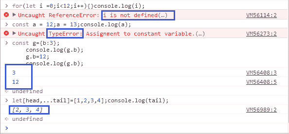
> 
> 发表于 2017-08-18 09:59:00
> 
> * * *
> 
> ## 36
> 
> 进程主要组成部分包括（）
> 
> 正确答案: A B F   你的答案: 空 (错误)
> 
> ```cpp
> 数据
> ```
> 
> ```cpp
> PCB
> ```
> 
> ```cpp
> 指令指针
> ```
> 
> ```cpp
> 堆栈
> ```
> 
> ```cpp
> 寄存器集合
> ```
> 
> ```cpp
> 程序
> ```
> 
> 本题知识点
> 
> 操作系统 前端工程师 4399 游戏 2017
> 
> 讨论
> 
> [Xg 青翎づ](https://www.nowcoder.com/profile/4548900)
> 
>   查看全部)
> 
> 编辑于 2017-02-16 11:22:54
> 
> * * *
> 
> [舒意意 123](https://www.nowcoder.com/profile/1973064)
> 
> ①程序。作用：描述进程要完成的功能。
> ②数据。作用：程序在执行时所需要的数据和工作区。
> ③ PCB。作用：包含进程的描述信息和控制信息。它是进程存在的唯一标志。 进程控制块
> 
> 发表于 2017-04-20 20:50:22
> 
> * * *
> 
> [心存蓝天](https://www.nowcoder.com/profile/2690446)
> 
> 在 UNIX 系统中进程由以下三部分组成：①进程控制块 PCB；②数据段；③正文段。        UNIX 系统为了节省进程控制块所占的内存空间，把每个进程控制块分成两部分。一部分常驻内存，不管进程是否正占有处理器运行，系统经常会对这部分内容进行查询和处理，常驻部分内容包括：进程状态、优先数、过程特征、数据段始址、等待原因和队列指针等，这是进行处理器调度时必须使用的一些主要信息。另一部分非常驻内存，当进程不占有处理器时，系统不会对这部分内容进行查询和处理，因此这部分内容可以存放在磁盘的对换区中，它随用户的程序和数据部分换进或换出内存。        UNIX 系统把进程的数据段又划分成三部分:用户栈区(供用户程序使用的信息区)；用户数据区(包括用户工作数据和非可重入的程序段)；系统数据区(包括系统变量和对换信息)。        正文段是可重入的程序，能被若干进程共享。为了管理可共享的正文段，UNIX 设置了一张正文表，每个正文段都占用一个表目，用来指出该正文段在内存和磁盘上的位置、段的大小以及调用该段的进程数等情况。
> 
> 发表于 2016-12-31 16:15:40
> 
> * * *
> 
> ## 37
> 
> 一个简单的计算机网络 3 个主要组成部分是
> 
> 正确答案: A C E   你的答案: 空 (错误)
> 
> ```cpp
> 一个通信子网
> ```
> 
> ```cpp
> 大量终端
> ```
> 
> ```cpp
> 一系列通信协议
> ```
> 
> ```cpp
> 若干数据库
> ```
> 
> ```cpp
> 若干主机
> ```
> 
> 本题知识点
> 
> 网络基础 前端工程师 4399 游戏 2017
> 
> 讨论
> 
> [🍃miss 晴天🌴](https://www.nowcoder.com/profile/4689736)
> 
> 计算机网络通常由三个部分组成，它们是资源子网、通信子网和通信协议.所谓通信子网就是计算机网络中负责数据通信的部分；资源子网是计算机网络中面向用户的部分，负责全网络面向应用的数据处理工作；而通信双方必须共同遵守的规则和约定就称为通信协议，它的存在与否是计算机网络与一般计算机互连系统的根本区别。所以从这一点上来说，我们应该更能明白计算机网络为什么是计算机技术和通信技术发展的产物了。
> 
> 发表于 2017-01-18 16:51:33
> 
> * * *
> 
> [走位崴了脚](https://www.nowcoder.com/profile/4695029)
> 
> 现在智能终端种类越来越多，资源子网只是”若干主机”的定义是不是应该与时俱进地改一改了？
> 
> 发表于 2018-05-16 08:31:28
> 
> * * *
> 
> [舒意意 123](https://www.nowcoder.com/profile/1973064)
> 
> 计算机网络通常由三个部分组成，它们是资源子网、通信子网和通信协议
> 
> 发表于 2017-04-12 15:08:44
> 
> * * *
> 
> ## 38
> 
> 如果让你来设计一个批处理多道系统，首先要考虑的是
> 
> 正确答案: C D   你的答案: 空 (错误)
> 
> ```cpp
> 实时性
> ```
> 
> ```cpp
> 交互性
> ```
> 
> ```cpp
> 吞吐量
> ```
> 
> ```cpp
> 系统效率
> ```
> 
> ```cpp
> 响应时间
> ```
> 
> ```cpp
> 可靠性
> ```
> 
> 本题知识点
> 
> 操作系统 前端工程师 4399 游戏 2017
> 
> 讨论
> 
> [imalwayshere](https://www.nowcoder.com/profile/6054106)
> 
> 都说了让我来设计了，哪有什么标准答案，***
> 
> 发表于 2017-04-03 14:14:54
> 
> * * *
> 
> [AndrewJoe](https://www.nowcoder.com/profile/5664681)
> 
> 其实就是问批处理多道系统的特点。响应时间本身就是多道的缺点。
> 
> 发表于 2018-08-01 23:32:14
> 
> * * *
> 
> [一厘米天气晴](https://www.nowcoder.com/profile/9991577)
> 
> 多道批处理系统有两个特点： 1\. 多道：系统内可同时容纳多个作业。这些作业放在外存中，组成一个后备队列，系统按一定的调度原则每次从后备作业队列中选取一个或多个作业进入内存运行，运行作业结束、退出运行和后备作业进入运行均由系统自动实现，从而在系统中形成一个自动转接的、连续的作业流。 2\. 成批：在系统运行过程中，不允许用户与其作业发生交互作用，即：作业一旦进入系统，用户就不能直接干预其作业的运行。
> 
> 发表于 2017-08-08 11:55:23
> 
> * * *
> 
> ## 39
> 
> 下列叙述正确的是
> 
> 正确答案: A C E   你的答案: 空 (错误)
> 
> ```cpp
> 一次 I/0 请求对应一个 I/O 请求包
> ```
> 
> ```cpp
> 多次 I/0 请求对应一个 I/O 请求包
> ```
> 
> ```cpp
> 每次 I/0 请求都对应一个 I/O 请求包
> ```
> 
> ```cpp
> 两次 I/0 操作可对应一个 I/O 请求包
> ```
> 
> ```cpp
> 每次 I/0 操作都会有对应 I/O 请求包
> ```
> 
> 本题知识点
> 
> 操作系统 前端工程师 4399 游戏 2017
> 
> 讨论
> 
> [larrysea](https://www.nowcoder.com/profile/5430709)
> 
> 答案是 ACE 这个打个比方例如在银行办理业务之前需要先填单，这个每一个人在办理业务的时候都需要填一张单，不同人填不同的单，这个单不能被多个人使用，或者是重复使用，这样就可以理解了。
> 
> 发表于 2017-02-09 21:36:03
> 
> * * *
> 
> [我是小栗子](https://www.nowcoder.com/profile/1809063)
> 
> 完美。。避过正确答案
> 
> 发表于 2017-09-15 23:50:24
> 
> * * *
> 
> [fwv](https://www.nowcoder.com/profile/810991076)
> 
> 请问猝发传送符不符合 B 选项的情况呢？一次猝发传送请求，设备就能从首地址开始连续的进行多个数据块的传送。
> 
> 发表于 2019-12-08 01:42:37
> 
> * * *
> 
> ## 40
> 
> 已知一个二叉树的后序遍历的结果为 AEFDHZMG，那么它的中序遍历可能为（），前序遍历可能为（）
> 
> 正确答案: B D   你的答案: 空 (错误)
> 
> ```cpp
> ADEFHMGZ
> ```
> 
> ```cpp
> ADEFGHMZ
> ```
> 
> ```cpp
> GDAEFMHZ
> ```
> 
> ```cpp
> GDAFEMHZ
> ```
> 
> 本题知识点
> 
> 树 前端工程师 4399 游戏 2017
> 
> 讨论
> 
> [迎风~起](https://www.nowcoder.com/profile/4012988)
> 
> 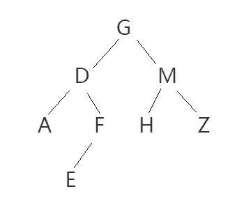树结构如图，思路为：寻找共同项，分别对比 AB 和 CD 得到大致结构——前序遍历：GDA _ _ MHZ 中序遍历：ADEF _ _ _ Z 后序遍历：AEFDHZMG 然后画个图往里填空就行
> 
> 发表于 2017-08-11 19:30:52
> 
> * * *
> 
> [雾 z~霭](https://www.nowcoder.com/profile/9075613)
> 
> 由后序遍历知 M 一定是 G 的右孩子；故中序遍历一定是 B。
> 由后续遍历知 E 一定是 F 的孩子，故前序遍历中 F 一定在 E 前，选 D
> 
> 发表于 2018-03-08 22:36:19
> 
> * * *
> 
> [InGodWeTrust](https://www.nowcoder.com/profile/2178882)
> 
> 答案为：BD 先假定一个中序遍历，如 A 由于根节点是 G，若为 A 则右子树为 Z，则找不到前序遍历。因此中序遍历为 B，推得前序遍历为 D
> 
> 发表于 2017-04-06 16:08:17
> 
> * * *
> 
> ## 41
> 
> linux 创建文件的命令有（）
> 
> 正确答案: B D E   你的答案: 空 (错误)
> 
> ```cpp
> ls
> ```
> 
> ```cpp
> touch
> ```
> 
> ```cpp
> cat
> ```
> 
> ```cpp
> vi/vim
> ```
> 
> ```cpp
> >
> ```
> 
> 本题知识点
> 
> Linux 前端工程师 4399 游戏 2017 Java 工程师 C++工程师 PHP 工程师 golang 工程师 安卓工程师 iOS 工程师 算法工程师 大数据开发工程师 运维工程师 安全工程师 数据库工程师 游戏研发工程师 测试开发工程师 测试工程师 2021 远景能源有限公司
> 
> 讨论
> 
> [qq_w](https://www.nowcoder.com/profile/557377)
> 
> ls -查看当前目录下的文件
> touch filename 新建文件 cat : 三个功能：1.一次显示整个文件 -----cat filename                         2.创建新文件，不能 编辑已有文件 -----cat > filename                         3.将几个文件合并为一个文件 -----cat file1 file2 > filevi/vim filename 表示用 vi 或 vim 打开文件，如果不存在该文件则新建文件
> 
> 发表于 2017-01-02 09:21:08
> 
> * * *
> 
> [爱运动的肖大叔天天敲代码](https://www.nowcoder.com/profile/4819107)
> 
> ls 用来显示目标列表
> 当前位置：首页 » 文件和目录管理 » ls ls 命令 目录基本操作 ls 命令用来显示目标列表
> 
> 来自: [`man.linuxde.net/ls`](http://man.linuxde.net/ls)当前位置：首页 » 文件和目录管理 » ls ls 命令 目录基本操作 ls 命令用来显示目标列表
> 
> 来自: [`man.linuxde.net/ls`](http://man.linuxde.net/ls) touch 命令
> 创建空白文件或修改文件时间
> 
> cat 主要有三大功能：1.一次显示整个文件。
> 2.从键盘创建一个文件。
>    只能创建新文件,不能编辑已有文件. 3.将几个文件合并为一个文件
> 
> vi/vim 可用来创建文件编辑文件并保存 > 是定向输出到文件，如果文件不存在，就创建文件；如果文件存在，就将其清空；
> 
> 答案：BCDE
> 
> 编辑于 2018-06-19 15:32:45
> 
> * * *
> 
> [happylearnlife](https://www.nowcoder.com/profile/9120875)
> 
> 个人感觉 cat 不算。如果说 cat 借助>也算的话，那么只要是有输出的命令都算了?_?
> 
> 发表于 2017-10-04 19:13:36
> 
> * * *
> 
> ## 42
> 
> 在数据结构中，以下不适合用树来表示的有（）
> 
> 正确答案: A D   你的答案: 空 (错误)
> 
> ```cpp
> 元素之前无联系的数据
> ```
> 
> ```cpp
> 有序数据元素
> ```
> 
> ```cpp
> 元素之间具有分支层次关系的数据
> ```
> 
> ```cpp
> 无序数据元素
> ```
> 
> 本题知识点
> 
> 树 前端工程师 4399 游戏 2017
> 
> 讨论
> 
> [丨太阳与月亮丨](https://www.nowcoder.com/profile/9415270)
> 
> AD 无联系、无序的数据  查看全部)
> 
> 编辑于 2017-03-18 09:17:11
> 
> * * *
> 
> [繁星的夜空 2012](https://www.nowcoder.com/profile/2920593)
> 
> 有序数据元素----层次遍历存储元素之间具有分支层次之间的关系----可以用树的前序、后序、中序遍历存储
> 
> 发表于 2016-12-28 14:35:54
> 
> * * *
> 
> [Rico123](https://www.nowcoder.com/profile/1303438)
> 
> ```cpp
> 有序数据元素: 二叉搜索树(二叉排序树)
> 元素之间具有分支层次关系的数据：正是树的特点
> ```
> 
> 发表于 2017-06-29 09:28:00
> 
> * * *
> 
> ## 43
> 
> 数据链路层主要功能包括（）
> 
> 正确答案: A B D   你的答案: 空 (错误)
> 
> ```cpp
> 差错控制
> ```
> 
> ```cpp
> 提供对物理层的控制
> ```
> 
> ```cpp
> 决定传输报文的最佳路由
> ```
> 
> ```cpp
> 流量控制
> ```
> 
> 本题知识点
> 
> 网络基础 前端工程师 4399 游戏 2017
> 
> 讨论
> 
> [达克文](https://www.nowcoder.com/profile/175330967)
> 
> 个人整理：
> 
> **数据链路层**
> 
> **主要功能（前五个为重点）：用于两个设备(同一种数据链路节点)之间进行信息传递。**
> 
> **1.成帧(帧同步)：了避免接收到的位数量以及数值发生异常。**
> 
> **2. 差错控制：为了确保数据通信的准确，降低错误发生的几率。**
> 
> **3. 流量控制：了确保数据通信的有序进行，避免通信过程中不会出现接收方来不及接收而造成数据丢失。**
> 
> **4. 链路控制：包括数据链路的建立、链路的维持和释放，**
> 
> **5\. MAC 寻址：寻找地址是计算机网卡的*MAC*地址，与寻址 ip 地址不同**
> 
> **6. 区分数据和控制信息：在许多情况下，数据和控制信息处于同一帧中**
> 
> **7. 透明传输：可以让无论是哪种比特组合的数据，都可以在数据链路上进行有效传输。**
> 
> **三个基本问题：**
> 
> **1、封装成帧（在一段数据的前后分别添加首部和尾部，这样就构成了一个帧）**
> 
> **2、透明传输（发送端的数据链路层在数据中出现控制字符”SOH”和”EOT”的前面插入一个转义字符”ESC”(其十六进制编码是 1B)。而在接收端的数据链路层在将数据送往网络层之前删除这个插入的转义字符。这种方法称为字节填充或字符填充。）**
> 
> **3、差错检测（循环冗余检验 CRC）**
> 
> 发表于 2020-05-23 23:00:36
> 
> * * *
> 
> [走过路过见过记得](https://www.nowcoder.com/profile/2702149)
> 
> 2、设计数据链路层的主要目的就是在原始的、有差错的物理传输线路的基础上，采取差错检测、差错控制与流量控制等方法，将有差错的物理线路改进成逻辑上无差错的数据链路，向网络层提供高质量的服务。
> 
> 发表于 2017-08-07 15:08:57
> 
> * * *
> 
> [YoJay](https://www.nowcoder.com/profile/3444207)
> 
> **    流量控制**涉及***对链路上的帧的发送速率的控制***，以使接收方有足够的缓冲空间来接收每一个帧。**基本方法**是由接收方控制发送方发送数据的速率，常见的方式有两种：**停止-等待协议**和**滑动窗口协议**。    两个结点之间如果规定了数据链路层协议，就可以检测出这些差错，然后把收到的错误信息丢弃，这就是**差错控制**功能。通常**利用编码技术进行差错控制**，主要有两类：**自动重传请求(ARQ)**和**前向纠错(FEC)**。在 ARQ 方式中，接收端检测出差错时，就设法通知发送端重发，直到接收到正确的码字为止。在 FEC 方式中，接收端不但能发现差错，而且能确定二进制数码的错误位置，从而加以纠正。因此，差错控制主要分为检错编码和纠错编码
> 
> 发表于 2018-08-29 22:06:29
> 
> * * *
> 
> ## 44
> 
> 以下选项中哪些属于原生 js 操作数组的方法
> 
> 正确答案: A B D E F G   你的答案: 空 (错误)
> 
> ```cpp
> splice
> ```
> 
> ```cpp
> shift
> ```
> 
> ```cpp
> resort
> ```
> 
> ```cpp
> sort
> ```
> 
> ```cpp
> pop
> ```
> 
> ```cpp
> push
> ```
> 
> ```cpp
> unshift
> ```
> 
> 本题知识点
> 
> Javascript 前端工程师 4399 游戏 2017
> 
> 讨论
> 
> [熊在匣子里](https://www.nowcoder.com/profile/2046212)
> 
> Array 对象方法 方法 concat() 连接两个或更多的数组，并返回结果。 join() 把数组的所有元素放入一个字符串。元素通过指定的分隔符进行分隔。 pop() 删除并返回数组的最后一个元素 push() 向数组的末尾添加一个或更多元素，并返回新的长度。 reverse() 颠倒数组中元素的顺序。 shift() 删除并返回数组的第一个元素 slice() 从某个已有的数组返回选定的元素 sort() 对数组的元素进行排序 splice() 删除元素，并向数组添加新元素。 toSource() 返回该对象的源代码。 toString() 把数组转换为字符串，并返回结果。 toLocaleString() 把数组转换为本地数组，并返回结果。 unshift() 向数组的开头添加一个或更多元素，并返回新的长度。 valueOf() 返回数组对象的原始值
> 
> 发表于 2017-03-29 13:51:26
> 
> * * *
> 
> [聪明的脑残](https://www.nowcoder.com/profile/984941422)
> 
> 在控制台输入 new Array 回车，就能看到数组的所有方法啦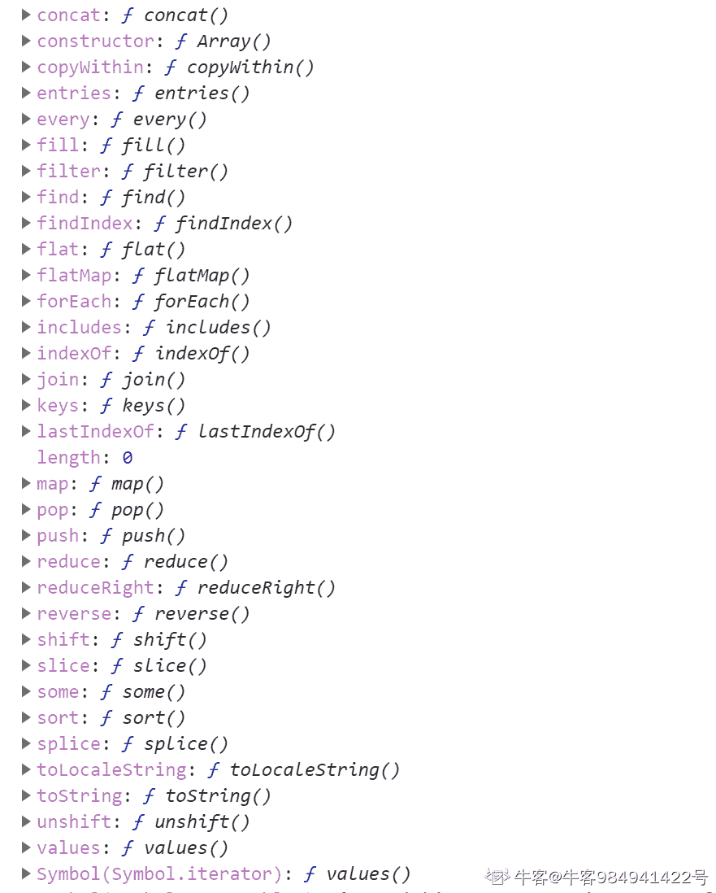
> 
> 发表于 2020-07-07 13:51:56
> 
> * * *
> 
> [Orange。](https://www.nowcoder.com/profile/608812)
> 
> resort 和 reverse 记混了==js 数组方法中只有 sort 方法对数组进行排序，排序规则可以是添加自定义排序方法
> 
> 发表于 2017-08-02 22:02:08
> 
> * * *
> 
> ## 45
> 
> 请描述一下 cookies ， sessionStorage 和 localStorage 的区别
> 
> 你的答案
> 
> 本题知识点
> 
> WebServer 前端工程师 4399 游戏 2017
> 
> 讨论
> 
> [@追风小青年](https://www.nowcoder.com/profile/838172)
> 
> 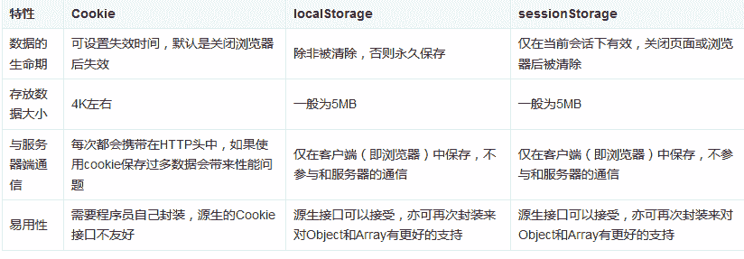
> 
> 应用场景
> 
> 有了对上面这些差别的直观理解，我们就可以讨论三者的应用场景了。
> 
> 因为考虑到每个 HTTP 请求都会带着 Cookie 的信息，所以 Cookie 当然是能精简就精简啦，比较常用的一个应用场景就是判断用户是否登录。针对登录过的用户，服务器端会在他登录时往 Cookie 中插入一段加密过的唯一辨识单一用户的辨识码，下次只要读取这个值就可以判断当前用户是否登录啦。曾经还使用 Cookie 来保存用户在电商网站的购物车信息，如今有了 localStorage，似乎在这个方面也可以给 Cookie 放个假了~
> 
> 而另一方面 localStorage 接替了 Cookie 管理购物车的工作，同时也能胜任其他一些工作。比如 HTML5 游戏通常会产生一些本地数据，localStorage 也是非常适用的。如果遇到一些内容特别多的表单，为了优化用户体验，我们可能要把表单页面拆分成多个子页面，然后按步骤引导用户填写。这时候 sessionStorage 的作用就发挥出来了。
> 
> 安全性的考虑
> 
> 需要注意的是，不是什么数据都适合放在 Cookie、localStorage 和 sessionStorage 中的。使用它们的时候，需要时刻注意是否有代码存在 XSS 注入的风险。因为只要打开控制台，你就随意修改它们的值，也就是说如果你的网站中有 XSS 的风险，它们就能对你的 localStorage 肆意妄为。所以千万不要用它们存储你系统中的敏感数据。
> 
> 编辑于 2017-08-05 22:19:15
> 
> * * *
> 
> [oneday1](https://www.nowcoder.com/profile/4023361)
> 
> cookies 由服务器生成，可设置失效时间，如果浏览器端生成了 cookies，则浏览器关闭时 cookies 默认失效。sessionStorage 仅存在于当前会话下，页面或浏览器关闭后就会被清除。 localStorage 除非被清除，否则永久存在。cookies 的容量比 sessionStorage 和 localStorage 小， cookies 大约 4k, localStorage 大约 4M. 
> 
> 发表于 2017-08-04 16:06:33
> 
> * * *
> 
> [VimMing](https://www.nowcoder.com/profile/148754)
> 
> 1\. 大小    cookies 的容量比 sessionStorage 和 localStorage 小， cookies 大约 4k, localStorage 大约 4M. 2\. 在 http 请求上    cookies 会被附件到 http 请求上 3\. api 接口   cookies 的 api 不亲民， sessionStorage 和 localStorage 的更简洁 4\. 持久化   localStorage 上的数据 会在本地持久化， sessionStorage 会随着本次会话， 数据清除。
> 
> 发表于 2017-08-03 11:27:33
> 
> * * *
> 
> ## 46
> 
> 请列举 html5 本地存储（ localStorage ）相关 api ，并实现 getAll 方法，获取本地存储
> 
> 你的答案
> 
> 本题知识点
> 
> HTML 前端工程师 4399 游戏 2017
> 
> 讨论
> 
> [油炸热咖啡 wayne](https://www.nowcoder.com/profile/8473222)
> 
> localStorage API 主要有这几个操作：         设置数据：localStorage.setItem(key,value)          获取数据：localStorage.getItem(key,value)           删除数据：localStorage.removeItem(key)            清空所有数据：localStorage.clear()获取本地存储数据数量：localStorage.length 获取第 N 个数据的 key 键值 localStorage.getAll = function() {    var obj = [];
>     for(var i = 0;i < localStorage.length;i++) {        obj.push(localStorage.key(i));    }
>     return obj;
> }
> 
> 发表于 2017-08-03 15:05:30
> 
> * * *
> 
> [小白同学](https://www.nowcoder.com/profile/806271)
> 
> setItem(key,value) 添加数据 getItem(key) 根据 key 获取值 key(index) 根据索引获取 keyremoveItem(key) 根据 key 删除一条数据 clear() 清空数据 length:获取总数据的长度 getAll()这个方法我没太明白想获取什么，所以我采用了 key()和 getItem()方法结合获取键值对
> 
> ```cpp
> function() {
>     for (let i = 0; i < localStorage.length; i++) {
>         let key = localStorage.key(i)
>         let value = localStorage.getItem(key)
>         console.log(key + ":" + value)
>     }
> }
> ```
> 
> |  |  |
> 
> 编辑于 2017-08-04 15:24:54
> 
> * * *
> 
> [LiJunHao](https://www.nowcoder.com/profile/730485455)
> 
> 设置数据：localStorage.setItem(key,value)获取数据：localStorage.getItem(key,value)删除数据：localStorage.removeItem(key,value)清空数据：localStorage.clear()获取第 N 个数据的 key 值 localStorage.getAll = function(){
>     var obj = [];
>     for(let i = 0;i < localStorage.length;i++){        obj.push(localStorage.key(i));}
>     return obj;
> }
> 
> 发表于 2021-03-13 18:48:15
> 
> * * *
> 
> ## 47
> 
> css3 有哪些新特性
> 
> 你的答案
> 
> 本题知识点
> 
> HTML 前端工程师 4399 游戏 2017
> 
> 讨论
> 
> [_sikosiko](https://www.nowcoder.com/profile/3986143)
> 
> CSS3 实现圆角（border-radius），阴影（box-shadow），
>    对文字加特效（text-shadow、），线性渐变（gradient），旋转（transform）
>   transform:rotate(9deg) scale(0.85,0.90) translate(0px,-30px) skew(-9deg,0deg);//旋转,缩放,定位,倾斜
>   增加了更多的 CSS 选择器  多背景 rgba 
>    在 CSS3 中唯一引入的伪元素是::selection.
>   媒体查询，多栏布局
>   border-image
> 
> 发表于 2016-12-19 16:05:53
> 
> * * *
> 
> [meiyoumingzine](https://www.nowcoder.com/profile/918467309)
> 
> 1.圆角 border-radius2.背景 background-image、background-size、background-origin、background-clip3.渐变 gradients    liner-gradients、radial-gradients4.用户界面：resize、box-sizing、outline-offset5.边框：border-image6.2d 3d：transfrom：translate（）、rotate（）、scale（）、skew()transform:translate3d()、rotate3d()、scale3d()、skew3d（）7.文本效果： word-wrap、box-shadow、text-shadow、text-overflow、word-break8.自定义字体@font-face 规则 9.动画 ： @keyframes 规则   元素是 animation 属性 10.过渡：transition11.多媒体查询：@media  自适应更多地媒体 12.弹性盒子 flex box：分为容器以及容器中的元素具有的属性 direction、justify-content（横轴排列）、align-items（纵轴排列）、flex（分配元素占比）13.多列布局：column-count、column-gap、column-width、column-rule-style、column-rule-color、column-rule-width、column-span 等。
> 
> 发表于 2020-02-01 21:53:02
> 
> * * *
> 
> [牛客 134720814 号](https://www.nowcoder.com/profile/134720814)
> 
> 1.CSS3 的选择器
> 
> 1）E:last-child 匹配父元素的最后一个子元素 E。
> 2）E:nth-child(n)匹配父元素的第 n 个子元素 E。 
> 
> 3）E:nth-last-child(n) CSS3 匹配父元素的倒数第 n 个子元素 E。2\. 边框
> 
> *   圆角   border-radius:15px
> *   阴影   shadow
> *   border-image:设置边框图像，该属性是一个简写属性，用于设置以下属性：
> 
> 3\. 背景
> 
> *   background-size：背景图片的尺寸
> *   background-origin：规定 background-position 属性相对于什么位置来定位
> *   background-clip：规定背景的绘制区域
> 
> 4\. 渐变
> 
> *   linear-gradient():线性渐变
> *   radial-gradinet():径向渐变
> 
> 5.文本效果
> 
> *   work-break：定义如何换行
> *   word-wrap：允许长的内容可以自动换行
> *   text-overflow：指定文本溢出包含他的元素应该发生什么
> *   text-shadow：文字阴影
> 
> 发表于 2020-08-20 16:41:21
> 
> * * *
> 
> ## 48
> 
> 以下 JavaScript 代码,返回 false 的是
> 
> 正确答案: B   你的答案: 空 (错误)
> 
> ```cpp
> var test=1;typeof test=='number';
> ```
> 
> ```cpp
> var test=1.2;typeof test=='float';
> ```
> 
> ```cpp
> var test=undefined;typeof test=='undefined';
> ```
> 
> ```cpp
> var test={};typeof test=='object';
> ```
> 
> ```cpp
> var test='4399'-0;typeof test=='number';
> ```
> 
> ```cpp
> var test=null;typeof test=='object';
> ```
> 
> 本题知识点
> 
> Javascript 前端工程师 4399 游戏 2017
> 
> 讨论
> 
> [黄桃罐头甜甜甜](https://www.nowcoder.com/profile/6634976)
> 
> typeofundefined        值未定义 boolean           布尔值 string               字符串 number            数值（整形和浮点）object                对象或 nullfunction            函数
> 
> 发表于 2018-03-15 09:49:32
> 
> * * *
> 
> [@追风小青年](https://www.nowcoder.com/profile/838172)
> 
> ```cpp
>    
>  
>  ***考察 运算符 typeof, typeof 用来检查 JS 中基本数据类型***
>  
>  A 选项 变量 test 中存储的数字类型 1,  typeof tset 返回 'number', 'number' == 'number',返回 true  
>  题目中应该是"=="(相等运算符)
>  B 选项 变量 test 中存储的数字类型 1.2,  typeof tset 返回 'number', 'number' !== 'number',返回 false  
>  C 选项 变量 test 中存储的 undefined,  typeof tset 返回 'undefined', 'undefined' == 'undefined',返回 true
>  D 选项 变量 test 中存储的对象,  typeof tset 返回 'object', 'object' == 'object',返回 true
>  E 选项 变量 test 中存储的数字类型 4399(js 解释器会将字符串'4399'调用 Number()转换为 4399,再去计算),  typeof tset 返回 'number', 'number' == 'number',返回 true
>  D 选项 变量 test 中存储 null,  typeof tset 返回 'object', 'object' == 'object',返回 true 
>                                                             
>             发表于 2017-08-05 22:39:17
>             
>         
>             [蠢得没朋友](https://www.nowcoder.com/profile/8136486)
>             
>                                                                       b
>  答案是 B typeof 只返回 string  number object 还有 undefined function
>   ，number 就包含了 float ,所以
>  选项 b typeof test 应该返回的是 "number"
>   ,所以 "number"=="float" ==>false
> 
>                                                             
>             编辑于 2017-07-14 20:04:06
>             
>         
>     
>         49
>           html5 和 css3 实现下面效果，总宽度是页面的 90%，1,2,3 宽度相等，注意移动端不同分辨率宽度自适应。  
>  
>      
>  
>         
>     你的答案
>             
>         
>         
>          
> 
>     
>     
> 
>         
>         
>             
> 
> 本题知识点
> 
>             
>                                                             HTML 
>                                                 前端工程师 
>                                                 4399 游戏 
>                                                 2017 
>                         
>         
>         
> 
> 讨论
> 
>             
> 
> [VimMing](https://www.nowcoder.com/profile/148754)
> 
>             
>                                                                     
> 
> ```
> <!DOCTYPE html>
> <html>
> <head>
> <style>
> .container{
>   width: 90vw;
>   height: 50px;
>   display: flex;
> }
> .child{
>   display: flex;
>   border: 1px solid #CCC;
>   flex: 1;
>   justify-content: center;
>   align-item: flex-start;
> }
> </style>
> </head>
> <body>
> <div class="container">
> 	<div class="child">
> 		<span>1</span>
> 	</div>
> 	<div class="child">
> 		<span>2</span>
> 	</div>
> 	<div class="child">
> 		<span>3</span>
> 	</div> 
> </div>
> </body>
> <html>
> ```cpp
> 
>  
> 
>                                                             
>             
> 
> 发表于 2017-08-04 11:36:15
> 
>             
> 
> * * *
> 
>         
>             
> 
> [4O4NotFound](https://www.nowcoder.com/profile/134614659)
> 
>             
>                                                                     
> 
> ```
> <!DOCTYPE html>
> <html lang="en">
> <head>
>     <meta charset="UTF-8">
>     <meta http-equiv="X-UA-Compatible" content="IE=edge">
>     <meta name="viewport" content="width=device-width, initial-scale=1.0">
>     <title>Document</title>
>         <style>
>             #main{
>                 display:grid;
>                 width: 90%;
>                 height: 50px;
>                 grid-template-columns: 1fr 1fr 1fr;
>             }
>             #main > *{
>                 text-align: center;
>                 border: 1px solid #ccc;
>             }
>         </style>
> </head>
> <body>
>     <div id="main">
>         <div id="box1">1</div>
>         <div id="box2">2</div>
>         <div id="box3">3</div>
>     </div>
> </body>
> </html>
> ```cpp
> 
>  
> 
>                                                             
>             
> 
> 编辑于 2021-08-19 16:14:08
> 
>             
> 
> * * *
> 
>         
>             
> 
> [不完美卡卡](https://www.nowcoder.com/profile/4516985)
> 
>             
>                                                                       .box{ 
>            width: 90%; 
>            height: 100px; 
>            margin: 0 auto; 
>        } 
>        .box ul{ 
>            width: 100%; 
>            height: 100%; 
>            display: flex; 
>            align-items: center; 
>        } 
>        .box ul li{ 
>            box-sizing: border-box; 
>            list-style: none; 
>            flex: 1; 
>            height: 50px; 
>            border: 1px solid #ccc; 
>        } 
>       <div class="box">  
>          <ul>  
>              <li></li>  
>              <li></li>  
>              <li></li>  
>          </ul>  
>      </div>  
>  
>                                                             
>             
> 
> 发表于 2018-04-09 17:20:51
> 
>             
> 
> * * *
> 
>         
>     
>         
> 
> ## 50
> 
>         
> 
>   在一个 html 静态网站里 A 页面需要跳转并传递相关数据到 B 页面（两个页面处于同个域名下）请按照你对此场景的理解写出 N 中页面之前传参的代码（只需写出 A 页面传递参数及 B 页面接收参数的 js 关键代码）  
> 
>         
>     
> 
> 你的答案
> 
>             
>         
>         
>          
> 
>     
>     
> 
>         
>         
>             
> 
> 本题知识点
> 
>             
>                                                             HTML 
>                                                 前端工程师 
>                                                 4399 游戏 
>                                                 2017 
>                         
>         
>         
> 
> 讨论
> 
>             
> 
> [xingfei_happy](https://www.nowcoder.com/profile/272608)
> 
>             
>                                                                     
> 
> > 方法 1:使用 cookie
> > A 页面
> > document.cookie = "user="+username;
> > B 页面
> > var username = document.cookie.split("=")[1];//简略版
> 
>                                                             
>             
> 
> 发表于 2017-08-01 22:02:32
> 
>             
> 
> * * *
> 
>         
>             
> 
> [南邮 kd](https://www.nowcoder.com/profile/449686)
> 
>             
>                                                                     A 页面
>    <input type="text" id="txt" /> 
>    <button id="submit">submit</button> 
>    <script> 
>    var  val=document.getElementById("txt").value; 
>    var button=document.getElementById("submit"); 
>    button.onclick=function(){ 
>    location.href="b.html?"+"txt="+encodeURI(val); 
>    }; 
>    </script> 
>    B 页面： 
>       <script language="javascript" type="text/javascript">  
>        var loc = location.href;  
>        var n1 = loc.length;//地址的总长度  
>        var n2 = loc.indexOf("=");//取得=号的位置  
>        var id = decodeURI(loc.substr(n2+1, n1-n2));//从=号后面的内容  
>        alert( id);  
>        //document.write(id)  
>        </script>  
>  
>                                                             
>             
> 
> 发表于 2017-08-03 15:38:55
> 
>             
> 
> * * *
> 
>         
>             
> 
> [不完美卡卡](https://www.nowcoder.com/profile/4516985)
> 
>             
>                                                                       A 页面中 
>    
> 
>        
>             function setCookie(name, value, expires, path) {      |
>     
>     
>             |
>             var oDate = new Date();      |
>     
>     
>             |
>             oDate.setDate(oDate.getDate() + expires);      |
>     
>     
>             |
>             document.cookie = name + '=' + encodeURIComponent(value) + ';expires=' + oDate + ';path=' + path;      |
>     
>     
>             |
>             }      |
>     
>    
>   
> 
>  
>  
>    B 页面中 
>    
> 
>        
>             function getCookie(name) {      |
>     
>     
>             |
>             var aCookie = document.cookie.split('; ');      |
>     
>     
>             |
>             for(var i =0; i < aCookie.length; i++) {      |
>     
>     
>             |
>             var aTemp = aCookie[i].split('=');      |
>     
>     
>             |
>             if(aTemp[0] === name) {      |
>     
>     
>             |
>             return decodeURIComponent(aTemp[1]);      |
>     
>     
>             |
>             }      |
>     
>     
>             |
>             }      |
>     
>     
>             |
>             }      |
>     
>    
>   
> 
>  
>  
>    也可以用 localstorage.setItem(name,value); localstorage.getItem(name) 
>                                                             
>             
> 
> 发表于 2018-04-11 16:40:02
> 
>             
> 
> * * *
> 
>         
>     
>         
> 
> ## 51
> 
>         【4399 论述题】大学期间除了课程作业外做了哪些开发？用的什么语言？目的是什么？  
>         
>     
> 
> 你的答案
> 
>             
>         
>         
>          
> 
>     
>     
> 
>         
>         
>             
> 
> 本题知识点
> 
>             
>                                                             前端工程师 
>                                                 4399 游戏 
>                                                 C++工程师 
>                                                 Java 工程师 
>                                                 销售 
>                                                 2017 
>                         
>         
>         
> 
> 讨论
> 
>             
> 
> [printf(Pluto)](https://www.nowcoder.com/profile/376107408)
> 
>             
>                                                                     无
>                                                             
>             
> 
> 发表于 2021-08-21 15:03:07
> 
>             
> 
> * * *
> 
>         
>             
> 
> [烟笼寒水月胧沙](https://www.nowcoder.com/profile/252751453)
> 
>             
>                                                                     
> 
>   ** 类 PS 程序 ** 
> 
>  
> 
>   1.通过对 OpenCV 库的初使用，浅析计算机视觉处理方式 
> 
>  
> 
>   2.统合小组成员间各功能进行黑盒测试 
> 
>    3.汇总问题，进行讨论 
>  
>    语言：Python ；目的：初步了解计算机视觉处理方式，接触较前沿技术。 
>      
> 
>    **坦克大战游戏** **Java 实现**  
> 
>   
> 
>    1.实践 Java 面向对象思想，对各个类进行设计、封装  
> 
>      2.通过对 ActionListener 接口的实现继而实现多个事件的反应       语言：Java ；目的：体会实践 Java 封装特性，加深面向对象编程的理解   
>   
>                                                             
>             
> 
> 发表于 2021-04-22 15:44:45
> 
>             
> 
> * * *
> 
>         
>     
>         
> 
> ## 52
> 
>         
> 
>   【4399 论述题】周围朋友一般因为你的什么特质而佩服你？  
> 
>         
>     
> 
> 你的答案
> 
>             
>         
>         
>          
> 
>     
>     
> 
>         
>         
>             
> 
> 本题知识点
> 
>             
>                                                             前端工程师 
>                                                 4399 游戏 
>                                                 C++工程师 
>                                                 Java 工程师 
>                                                 销售 
>                                                 2017 
>                         
>         
>         
> 
> 讨论
> 
>             
> 
> [KKFC](https://www.nowcoder.com/profile/7237269)
> 
>             
>                                                                     因为我很长
>                                                             
>             
> 
> 发表于 2017-11-01 12:22:03
> 
>             
> 
> * * *
> 
>         
>             
> 
> [我是小栗子](https://www.nowcoder.com/profile/1809063)
> 
>             
>                                                                     帅
>                                                             
>             
> 
> 发表于 2017-09-15 23:57:51
> 
>             
> 
> * * *
> 
>         
>             
> 
> [熊猫小智](https://www.nowcoder.com/profile/489989318)
> 
>             
>                                                                     对于自己喜欢的活着感兴趣的事能马上去做，这是我的朋友们比较欣赏我的一点。
>                                                             
>             
> 
> 发表于 2019-11-20 10:46:24
> 
>             
> 
> * * *
> 
>         
>     
>         
> 
> ## 53
> 
>         
> 
>   【4399 论述题】请描述一个例子，你曾经解决过一个别的同学解决不了的技术问题，你是如何做到的  
> 
>         
>     
> 
> 你的答案
> 
>             
>         
>         
>          
> 
>     
>     
> 
>         
>         
>             
> 
> 本题知识点
> 
>             
>                                                             前端工程师 
>                                                 4399 游戏 
>                                                 C++工程师 
>                                                 Java 工程师 
>                                                 销售 
>                                                 2017 
>                         
>         
>         
>     
>         
> 
> ## 54
> 
>         
> 
>   【4399 论述题】大学期间，你是如何学习提升技术能力的，目前积累程度如何，请举例说明  
> 
>         
>     
> 
> 你的答案
> 
>             
>         
>         
>          
> 
>     
>     
> 
>         
>         
>             
> 
> 本题知识点
> 
>             
>                                                             前端工程师 
>                                                 4399 游戏 
>                                                 C++工程师 
>                                                 Java 工程师 
>                                                 销售 
>                                                 2017 
>                         
>         
>         
>     
>         
> 
> ## 55
> 
>         
> 
>   描述一个例子，你曾经给自己设定了一个很高的目标，并且很努力的去完成的一件事  
> 
>         
>     
> 
> 你的答案
> 
>             
>         
>         
>          
> 
>     
>     
> 
>         
>         
>             
> 
> 本题知识点
> 
>             
>                                                             前端工程师 
>                                                 4399 游戏 
>                                                 C++工程师 
>                                                 Java 工程师 
>                                                 销售 
>                                                 2017 
>                         
>         
>         
> 
> 讨论
> 
>             
> 
> [乌拉西](https://www.nowcoder.com/profile/410849866)
> 
>             
>                                                                     目标：呼吸到最后一刻。
>  过程：无论是在东北的寒夜还是在夏日的酷暑中，从未停止呼吸。
>  结果：现在仍在呼吸。
>                                                             
>             
> 
> 发表于 2020-07-25 14:46:50
> 
>             
> 
> * * *
> 
>         
>     
>         
> 
> ## 56
> 
>         
> 
>   【4399 论述题】在工作中，你是更注重团队协作还是个人想法？请举例说明。  
> 
>         
>     
> 
> 你的答案
> 
>             
>         
>         
>          
> 
>     
>     
> 
>         
>         
>             
> 
> 本题知识点
> 
>             
>                                                             前端工程师 
>                                                 4399 游戏 
>                                                 C++工程师 
>                                                 Java 工程师 
>                                                 销售 
>                                                 2017 
>                         
>         
>         
> 
> 讨论
> 
>             
> 
> [半雨微凉](https://www.nowcoder.com/profile/406780863)
> 
>             
>                                                                     个人愚见，觉得这两个不矛盾呀~
>                                                             
>             
> 
> 发表于 2019-08-29 14:22:48
> 
>             
> 
> * * *
> 
>         
>             
> 
> [handling](https://www.nowcoder.com/profile/6746755)
> 
>             
>                                                                     我可能更注重个人想法，团队协作固然好，但是我发现团队协作时更容易出现意见分歧，导致矛盾，处理矛盾花费的时间精力以及以后的开发阶段，都会给团队中的个人造成很大的影响，我觉得个人想法比较好，因为我觉得一个人的执行能力（想到就立马去实现）更好
>                                                             
>             
> 
> 发表于 2019-08-28 21:44:25
> 
>             
> 
> * * *
> 
>         
>     
> 
> ```*