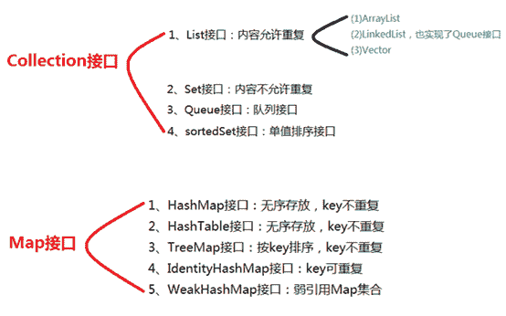
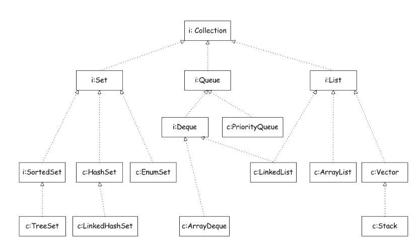
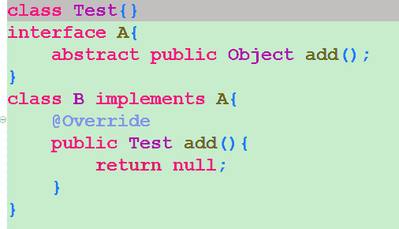
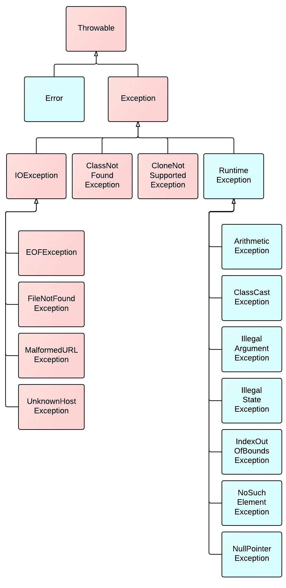

# 德邦 2017 秋招 java 工程师笔试试卷

## 1

final、finally、finalize 三个关键字的区别是（）

正确答案: A B C   你的答案: 空 (错误)

```cpp
final 是修饰符（关键字）可以修饰类、方法、变量
```

```cpp
finally 在异常处理的时候使用，提供 finally 块来执行任何清除操作
```

```cpp
finalize 是方法名，在垃圾收入集器将对象从内存中清除出去之前做必要的清理工作
```

```cpp
finally 和 finalize 一样都是用于异常处理的方法
```

本题知识点

Java

讨论

[levine](https://www.nowcoder.com/profile/372089)

final：可用来定义变量、方法传入的参数、类、方法。finally：只能跟在 try/catch 语句中，并且附带一个语句块，表示最后执行。finalize：是垃圾回收器操作的运行机制中的一部分，进行垃圾回收器操作时会调用 finalize 方法，因为 finalize 方法是 object 的方法，所以每个类都有这个方法并且可以重写这个方法，在这个方法里实现释放系统资源及其他清理工作，JVM 不保证此方法总被调用。答案：ABC

发表于 2017-08-02 10:13:05

* * *

[offer 已拿到](https://www.nowcoder.com/profile/5267745)

B 选项有点争议吧，catch 是异常处理的时候用的吧，后半句的任何是不是太绝对了

发表于 2017-08-05 17:06:44

* * *

[我想静静！](https://www.nowcoder.com/profile/9359484)

任何清除工作...什么鬼

发表于 2018-10-26 08:52:18

* * *

## 2

当编译并运行下面程序时会发生什么结果（）

```cpp
public class Bground extends Thread{
    public static void main(String argv[]){
        Bground b = new Bground();
        b.run();
    }
    public void start(){
        for(int i=0;i<10;i++){
            System.out.println("Value of i = "+i);
        }
    }
}
```

正确答案: D   你的答案: 空 (错误)

```cpp
编译错误，指明 run 方法没有定义
```

```cpp
运行错误，只鞥呢 run 方法没有定义
```

```cpp
编译通过并输出 0 到 9
```

```cpp
编译通过，但无输出
```

本题知识点

Java Java 工程师 德邦 2017

讨论

[bbblemon](https://www.nowcoder.com/profile/3807435)

**选 D****对于线程而言，start 是让线程从 new 变成 runnable。run 方法才是执行体的入口。****但是在 Thread 中，run 方法是个空方法，没有具体实现。****Bground 继承了 Thread，但是没有重写 run 方法，那么调用 run 方法肯定是无输出。**

发表于 2018-06-29 11:19:58

* * *

[有梦为马，随处可栖](https://www.nowcoder.com/profile/5537586)

说一说我自己的理解。
这题可以用面向对象的思想即可解决
首先继承 Thread，然后调用 run 方法，bgroud 并没有重写 run 方法，那么就是调用父类 Thread 的 run 方法。
然后查看父类代码

```cpp
@Override
    public void run() {
        if (target != null) {
            target.run();
        }
    } 
```

private Runnable target;
其中 target 是 Runnable 对象
明显 target 并没有显示初始化。
所以不会有显示。
一般 target 的初始化是这样的，将 runnable 对象作为 thread 参数进行线程的创建

```cpp
public Thread(Runnable target) {
        init(null, target, "Thread-" + nextThreadNum(), 0);
    } 
```

再看 init()

```cpp
private void init(ThreadGroup g, Runnable target,String name,long stackSize) {
        init(g, target, name, stackSize, null);
    } 
```

在 init(g, target, name, stackSize, null)，可以找到 this.target = target;
此时进行了初始化。

最后说一说，Thread 的执行过程，Theard 的启动方法是 start().线程类调用 start();然后执行 start0()本地方法，然后就没办法再追溯下去了。
start 我听过别人说，是一个准备工作（比如你要吃苹果，不得先洗一下，真正吃时间是洗完后），并没有获得 cpu，调用 run()才是获得了 cpu。

发表于 2017-08-03 18:01:33

* * *

[LSur](https://www.nowcoder.com/profile/8137592)

```cpp

	public class Bground extends Thread{

	    public static void main(String argv[]){

	        Bground b = new Bground();

	        b.start();

	    }

	    public void run(){

	        for(inti=0;i<10;i++){

	            System.out.println("Value of i = "+i);

	        }

	    }

	}

```

如果是这样子，就可以选 C 了

发表于 2018-06-13 08:56:03

* * *

## 3

以下哪些表达式返回为真（）

```cpp
String a="My field1";
String b="My field1";
    String c=new String("My field1");
    String d=new String("My field1");
```

正确答案: A D E   你的答案: 空 (错误)

```cpp
a==b
```

```cpp
a==c
```

```cpp
c=d
```

```cpp
a.equals(b)
```

```cpp
a.equals(c)
```

本题知识点

Java

讨论

[朱云龙](https://www.nowcoder.com/profile/442177909)

==，如果作用于基本数据类型的变量，则直接比较其存储的 “值”是否相等; 如果作用于引用类型的变量，则比较的是所指向的对象的地址 　 equals 方法，注意：equals 方法不能作用于基本数据类型的变量。 ①Object 类中，equals 方法是用来比较两个对象的引用是否相等，即是否指向同一个对象。 ②String 类对 equals 方法进行了重写，用来比较指向的字符串对象所存储的字符串是否相等。其他的一些类诸如 Double，Date，Integer 等，都对 equals 方法进行了重写用来比较指向的对象所存储的内容是否相等

编辑于 2019-01-23 22:49:44

* * *

[石头之巅](https://www.nowcoder.com/profile/7560410)

编译期间 "My field1" 产生在常量池中；所以 b 在编译期间就指向常量池的"My field1"；c 是 new 的对象，所以在堆里也创建了一个"My field1"；d 也在堆里 new 了一个"My field1"；所以 c 和 d 是不同的地址

发表于 2017-08-08 19:34:17

* * *

[加油吧少年💪](https://www.nowcoder.com/profile/505004590)

1.==，如果作用于基本数据类型的变量，则直接比较其存储的 “值”是否相等; 如果作用于引用类型的变量，则比较的是所指向的对象的地址 
2.String 类对 equals 方法进行了重写，用来比较指向的字符串对象所存储的字符串是否相等
3.equals 不能作用于基本数据类型的变量。

发表于 2019-02-21 20:58:32

* * *

## 4

在 java 语言中，如果你编写一个多线程序，可以使用的方法是（）

正确答案: A B   你的答案: 空 (错误)

```cpp
扩展类 Thread
```

```cpp
实现 Runnable 接口
```

```cpp
扩展类 Runnable
```

```cpp
实现接口 Thread
```

本题知识点

Java Java 工程师 德邦 2017

讨论

[豪 92](https://www.nowcoder.com/profile/2889221)

1.继承 Thread 类（Override 它的 run 方法）
2.实现 Runnable 接口（实现 run 方法）
3.使用 ExecutorService、Callable、Future 实现有返回结果的多线程

发表于 2017-08-01 11:40:15

* * *

[美团到店招聘](https://www.nowcoder.com/profile/3472441)

[Java](http://lib.csdn.net/base/javaee)多线程实现方式主要有四种：继承 Thread 类、实现 Runnable 接口、实现 Callable 接口通过 FutureTask 包装器来创建 Thread 线程、使用 ExecutorService、Callable、Future 实现有返回结果的多线程。其中前两种方式线程执行完后都没有返回值，后两种是带返回值的。

发表于 2018-03-01 15:54:30

* * *

[百夜](https://www.nowcoder.com/profile/779519174)

[Java](http://lib.csdn.net/base/javaee)多线程实现方式主要有四种：1、继承 Thread 类 2、实现 Runnable 接口 3、实现 Callable 接口通过 FutureTask 包装器来创建 Thread 线程 4、使用 ExecutorService、Callable、Future 实现有返回结果的多线程。

发表于 2018-09-27 10:25:45

* * *

## 5

下面哪些接口直接继承自 Collection 接口（）

正确答案: A C   你的答案: 空 (错误)

```cpp
List
```

```cpp
Map
```

```cpp
Set
```

```cpp
Iterator
```

本题知识点

Java Java 工程师 德邦 2017

讨论

[爱吃米线的吴彦祖](https://www.nowcoder.com/profile/4154422)



发表于 2017-10-08 15:07:11

* * *

[April 丶](https://www.nowcoder.com/profile/6577016)



发表于 2017-08-17 10:15:45

* * *

[薪火传](https://www.nowcoder.com/profile/4843936)

terator()方法是 java.lang.Iterable 接口,被 Collection 继承。其余的楼上说的很清楚了的；

发表于 2018-10-03 09:34:42

* * *

## 6

关于 HashMap 和 Hashtable 正确的说法有（）

正确答案: A C   你的答案: 空 (错误)

```cpp
都实现了 Map 接口
```

```cpp
Hashtable 类不是同步的，而 HashMap 类是同步的
```

```cpp
Hashtable 不允许 null 键或值
```

```cpp
HashMap 不允许 null 键或值
```

本题知识点

Java Java 工程师 德邦 2017

讨论

[辣椒啊我的女神](https://www.nowcoder.com/profile/9718813)

1、继承不同。public classHashtable extendsDictionary implements Map

 public classHashMap extendsAbstractMap implements Map

2、Hashtable 中的方法是同步的，而 HashMap 中的方法在缺省情况下是非同步的。在多线程并发的环境下，可以直接使用 Hashtable，但是要使用 HashMap 的话就要自己增加同步处理了。

3、Hashtable 中，key 和 value 都不允许出现 null 值。

在 HashMap 中，null 可以作为键，这样的键只有一个；可以有一个或多个键所对应的值为 null。当 get()方法返回 null 值时，即可以表示 HashMap 中没有该键，也可以表示该键所对应的值为 null。因此，在 HashMap 中不能由 get()方法来判断 HashMap 中是否存在某个键， 而应该用 containsKey()方法来判断。

4、两个遍历方式的内部实现上不同。

Hashtable、HashMap 都使用了 Iterator。而由于历史原因，Hashtable 还使用了 Enumeration 的方式 。

5、哈希值的使用不同，HashTable 直接使用对象的 hashCode。而 HashMap 重新计算 hash 值。

6、Hashtable 和 HashMap 它们两个内部实现方式的数组的初始大小和扩容的方式。HashTable 中 hash 数组默认大小是 11，增加的方式是 old*2+1。HashMap 中 hash 数组的默认大小是 16，而且一定是 2 的指数 

发表于 2017-08-02 09:54:05

* * *

[Sakura 彡](https://www.nowcoder.com/profile/4026047)

Collection

    -----List

               -----LinkedList    非同步

                ----ArrayList      非同步，实现了可变大小的元素数组

                ----Vector          同步           

-----Set 不允许有相同的元素

 Map

-----HashTable 同步，实现一个 key--value 映射的哈希表，key 和 value 都不允许出现 null 值

    -----HashMap          非同步，

-----WeakHashMap 改进的 HashMap，实现了“弱引用”，如果一个 key 不被引用，则被 GC 回收注：

List 接口中的对象按一定顺序排列，允许重复 
Set 接口中的对象没有顺序，但是不允许重复 
Map 接口中的对象是 key、value 的映射关系，key 不允许重复

编辑于 2017-08-25 15:55:29

* * *

[来来来来来 _](https://www.nowcoder.com/profile/9705449)

总结一下 HashMap 和 Hashtable 的区别：    （1）HashMap 是 Hashtable 的轻量级实现，它们都实现了 Map 接口，主要区别在于**HashMap 允许空（null****）键值（key）**，而**Hashtalbe 不允许**。
    （2）HashMap 没有 contains 方法，而是**containsValue 和 containsKey**。
    （3）**Hashtable 的方法是线程安全的，而 HashMap 不是线程安全的。**
    （4）HashMap 使用 Iterator，Hashtable 使用 Enumeration。
    （5）HashMap 和 Hashtable 采用的 hash/rehash 算法都几乎一样，所以性能不会有很大的差异。
    （6）在 Hashtable 中，hash 数组默认大小是 11，增加的方式是 old*2+1。在 Has 和 Map 中，hash 数组的默认大小是 16，而且一定是 2 的倍数。
    （7）hash 值的使用不同，Hashtable 直接使用对象的 hashCode。

发表于 2018-06-26 09:47:30

* * *

## 7

在 java 中，已定义两个接口 B 和 C，要定义一个实现这两个接口的类，以下语句正确的是（）

正确答案: C   你的答案: 空 (错误)

```cpp
interface  A extends B，C
```

```cpp
interface  A eimplements  B，C
```

```cpp
class  A implements  B，C
```

```cpp
class  A implements  B，implements C
```

本题知识点

Java Java 工程师 德邦 2017

讨论

[jamal11](https://www.nowcoder.com/profile/661697087)

***选 D，蠢哭

发表于 2018-07-13 12:51:23

* * *

[IDEA2022.4.2](https://www.nowcoder.com/profile/181223548)

类实现多个接口的时候，只需要一个 implements，多个接口通过逗号进行隔开，先继承类再实现接口

发表于 2020-04-08 10:39:21

* * *

[JacobGo！](https://www.nowcoder.com/profile/6196880)

蠢哭，看成是接口继承接口

发表于 2017-08-13 23:54:40

* * *

## 8

在数据库系统中，空值是（）

正确答案: D   你的答案: 空 (错误)

```cpp
0
```

```cpp
空格
```

```cpp
空字符串
```

```cpp
不确定
```

本题知识点

数据库 Java 工程师 德邦 2017

讨论

[豪 92](https://www.nowcoder.com/profile/2889221)

所谓的 NULL 就是什么都没有，连\0 都没有，\0 在字符串中是结束符，但是在物理内存是占空间的，等于一个字节，而 NULL 就是连这一个字节都没有。在数据库里是严格区分的，任何数跟 NULL 进行运算都是 NULL, 判断值是否等于 NULL，不能简单用=，而要用 IS 关键字， 空 (NULL) 值表示数值未知（在实际意义中，如果使用 null，就是代表变量值是未知的，比如手机号码设为 null，说明不知道手机号码是什么）。空值不同于空白或零值。没有两个相等的空值。比较两个空值或将空值与任何其它数值相比均返回未知，这是因为每个空值均为未知。在写入数据的时候，空字符串” 也是一个确定的值，所以就算你定义了 NOT NULL 也可以被写入。 

发表于 2017-08-02 11:47:12

* * *

## 9

SQL 语言是（）的语言。

正确答案: B   你的答案: 空 (错误)

```cpp
过程化
```

```cpp
非过程化
```

```cpp
格式化
```

```cpp
导航化
```

本题知识点

数据库 Java 工程师 德邦 2017

讨论

[Felix_as](https://www.nowcoder.com/profile/2900642)

B
SQL 语言是非过程化语言，不要求用户指定数据的存放方法，也不需要妖狐了解具体的数据存放方式，故具有完全不同底层结构的不同数据库系统可以使用相同的结构化查询语言作为数据输出和管理的接口。

发表于 2017-02-16 22:43:29

* * *

[小六喜欢赵小刀](https://www.nowcoder.com/profile/860595925)

sql 的特点：
1.综合统一
2.高度非过程化
3.面向集合的操作方式
4.以同一种语法结构提供多种使用方式
5.语言简洁，易学易用

发表于 2020-07-07 08:16:17

* * *

[晓 201911161928123](https://www.nowcoder.com/profile/984846497)

过程式语言即整个是构建在动词上的语言。比如，最常见的经典过程式语言- C 语言，打印一条语句的语法是 printf(), 这个方法的名字本身就是一个动词

编辑于 2020-07-29 15:29:32

* * *

## 10

SQL 语言具有的功能是（）

正确答案: B   你的答案: 空 (错误)

```cpp
关系规范化
```

```cpp
数据定义、数据操纵、数据控制、数据查询
```

```cpp
数据库系统设计
```

```cpp
能绘制 E-R 图
```

本题知识点

数据库 Java 工程师 德邦 2017

讨论

[ja 了个 va](https://www.nowcoder.com/profile/7282310)

功能？也就是 sql 的基本操作吗？

发表于 2017-08-01 23:59:15

* * *

## 11

SQL 语言中实现数据库检索的语句是（）

正确答案: A   你的答案: 空 (错误)

```cpp
SELECT
```

```cpp
INSERT
```

```cpp
UPDATE
```

```cpp
DELETE
```

本题知识点

数据库 Java 工程师 德邦 2017

讨论

[胖醒](https://www.nowcoder.com/profile/1088883)

当执行 select 语句的时候，数据库会自动进行全库检索，找出匹配你选择结果的数据，比如我们经常写的 select * from table，当然全文检索也很影响效率，也就是说为什么要把字段写上的好处。

发表于 2018-06-27 22:47:05

* * *

[追梦人 11](https://www.nowcoder.com/profile/8251779)

检索，即检查索取。不就是查询嘛，哎呦，说得怎么晦涩难懂。

发表于 2017-08-05 09:36:23

* * *

## 12

下列的 SQL 语句中，（）不是数据定义语句

正确答案: D   你的答案: 空 (错误)

```cpp
CREATE TABLE
```

```cpp
DROP VIEW
```

```cpp
CREATE VIEW.
```

```cpp
GRANT
```

本题知识点

数据库 Java 工程师 德邦 2017

讨论

[有梦为马，随处可栖](https://www.nowcoder.com/profile/5537586)

DML（data manipulation language）：
       它们是 SELECT、UPDATE、INSERT、DELETE，就象它的名字一样，这 4 条命令是用来对[数据库](http://lib.csdn.net/base/mysql)里的数据进行操作的语言
DDL（data definition language）：
       DDL 比 DML 要多，主要的命令有 CREATE、ALTER、DROP 等，DDL 主要是用在定义或改变表（TABLE）的结构，数据类型，表之间的链接和约束等初始化工作上，他们大多在建立表时使用
DCL（Data Control Language）：
       是数据库控制功能。是用来设置或更改数据库用户或角色权限的语句，包括（grant,deny,revoke 等）语句。在默认状态下，只有 sysadmin,dbcreator,db_owner 或 db_securityadmin 等人员才有权力执行 DCL

发表于 2017-08-03 18:06:29

* * *

[VvoO](https://www.nowcoder.com/profile/2115222)

GRANT DCL

发表于 2018-08-27 07:42:30

* * *

[ja 了个 va](https://www.nowcoder.com/profile/7282310)

grant 是数据控制语句

发表于 2017-08-02 00:01:20

* * *

## 13

关系数据库管理系统能实现的专门运算包括选择、连接和 1

你的答案 (错误)

1 参考答案 (1) 投影

本题知识点

数据库 Java 工程师 德邦 2017

讨论

[Cynthiac](https://www.nowcoder.com/profile/6637866)

投影

编辑于 2017-07-26 17:40:29

* * *

[灵宝小科比](https://www.nowcoder.com/profile/339110413)

有人给我点赞吗

发表于 2019-07-24 18:39:09

* * *

[全键盘打字才帅](https://www.nowcoder.com/profile/427184584)

投影

发表于 2018-10-19 15:13:03

* * *

## 14

命令 LEN(“THIS IS MY BOOK”) 的结果是 1

你的答案 (错误)

1 参考答案 (1) 15

本题知识点

数据库 Java 工程师 德邦 2017

讨论

[Cynthiac](https://www.nowcoder.com/profile/6637866)

15

编辑于 2017-07-26 17:43:12

* * *

[风卷云舒](https://www.nowcoder.com/profile/6572657)

SQL 中 LEN（）函数返回文本的长度

发表于 2017-08-01 22:10:24

* * *

[牛客 120821308 号](https://www.nowcoder.com/profile/120821308)

LEN(“THIS IS MY BOOK”) 空格也算一个文本长度 LEN 是函数返回文本的长度

发表于 2020-01-21 23:16:35

* * *

## 15

SQL SELECT 语句为了将查询结果存放到临时表中应使用 1 短语。

你的答案 (错误)

1 参考答案 (1) INTO CURSOR

本题知识点

数据库 Java 工程师 德邦 2017

讨论

[Cynthiac](https://www.nowcoder.com/profile/6637866)

INTO CURSOR

编辑于 2017-07-26 17:45:41

* * *

[飞将军](https://www.nowcoder.com/profile/1961241)

在 SQL 查询语句的尾部添加 INTO CURSOR＜临时表名＞可以将查询的结果放入指定的临时表中。此操作通常是将一个复杂的查询分解，临时表通常不是最终结果，可以接下来对临时表操作得到最终结果。生成的临时表是当前被打开的并且是只读的，关闭该文件时将自动删除。

发表于 2017-08-02 12:45:41

* * *

[牛客 9792607 号](https://www.nowcoder.com/profile/9792607)

INTO CURSOR  存储到临时表当中去

发表于 2019-02-21 10:31:36

* * *

## 16

用来定义一个类指定继承父类的关键字 1 , 用来指定接口的继承的关键字是 2 .

你的答案 (错误)

12 参考答案 (1) extends
(2) implements

本题知识点

编程基础 *Java 工程师 德邦 2017* *讨论

[牛客 4145991 号](https://www.nowcoder.com/profile/4145991)

  查看全部)

编辑于 2017-07-26 17:48:33

* * *

[晨光.朝阳](https://www.nowcoder.com/profile/5900726)

+1，答案错了，大家留意，把我顶上去，接口继承接口也是用 extends，类实现接口使用 implements

发表于 2017-08-02 22:01:17

* * *

[Young201807061837944](https://www.nowcoder.com/profile/650939503)

定义一个类指定继承父类的关键字是 extends，用来指定接口的继承的关键字也是 extends。定义一个类实现接口的关键字是 implements，接口与接口之间是 extends 继承关系。

发表于 2018-07-17 15:43:08

* * *

## 17

1 属性是专门定义常值变量的保留字。

你的答案 (错误)

1 参考答案 (1) final

本题知识点

编程基础 *Java 工程师 德邦 2017* *讨论

[牛客 4145991 号](https://www.nowcoder.com/profile/4145991)

final

编辑于 2017-07-26 17:49:52

* * *

[追梦人 11](https://www.nowcoder.com/profile/8251779)

关键字和保留字是有区别的，关键字是 final，保留字是 const

发表于 2017-08-05 09:48:32

* * *

[不问茜东](https://www.nowcoder.com/profile/189912842)

难道不是 const?

发表于 2019-03-07 12:13:36

* * *

## 18

字符变量以 1 类型表示，它在内存中占 2 个 bit 。

你的答案 (错误)

12 参考答案 (1) char
(2) 16

本题知识点

编程基础 *Java 工程师 德邦 2017* *讨论

[Cynthiac](https://www.nowcoder.com/profile/6637866)

char16

编辑于 2017-07-26 17:51:28

* * *

[任我行哟](https://www.nowcoder.com/profile/1687517)

char,2 个字节，16 位

发表于 2017-09-03 00:10:09

* * *

[牛客 9792607 号](https://www.nowcoder.com/profile/9792607)

char,2 个字节，16 位，byte 字节，   bit  位数，要搞清楚

发表于 2019-02-21 10:34:09

* * *

## 19

过滤字节流输出都是 1 类的子类

你的答案 (错误)

1 参考答案 (1) FilterOutputStream

本题知识点

Java Java 工程师 德邦 2017

讨论

[半杯冷咖啡](https://www.nowcoder.com/profile/2128036)

FilterOutputStream

发表于 2017-08-01 17:05:38

* * *

[牛客 9792607 号](https://www.nowcoder.com/profile/9792607)

过滤，所以前边一定要加上过滤这层衣裳

发表于 2019-02-21 10:35:29

* * *

[辛巴 201807171056710](https://www.nowcoder.com/profile/149858543)

FilterOutStream

发表于 2018-09-16 11:12:13

* * *

## 20

Java 源文件最多只能有一个 1 类，其他的类个数不限。

你的答案 (错误)

1 参考答案 (1) public

本题知识点

Java Java 工程师 德邦 2017

讨论

[﹋千年以后√"](https://www.nowcoder.com/profile/6470604)

填公共两个字不对吗

发表于 2017-08-02 10:52:40

* * *

[Tianwu](https://www.nowcoder.com/profile/501536)

Java 源文件最多只能有一个 【与文件名相同名字的】 类，其他的类个数不限。

发表于 2017-08-09 20:58:17

* * *

[浮森若思](https://www.nowcoder.com/profile/314027779)

不应该是与文件名相同的外部类？

发表于 2019-04-17 00:09:33

* * *

## 21

StringBuffer 类对象创建之后可以再修改和变动.

正确答案: A   你的答案: 空 (错误)

```cpp
正确
```

```cpp
错误
```

本题知识点

Java Java 工程师 德邦 2017

讨论

[老黑 NO1](https://www.nowcoder.com/profile/730771)

1.String 对象不可变、StringBuffer 对象可变的含义： 举个例子：String str = "aa"; str = "aa"+"bb"; 此时 str 的值为"aabb"，但是"aabb"不是在开始的字符串"aa"后面直接连接的"bb"，而是又新生成了字符串"aabb"，字符串"aa"一旦被初始化，那么它的值不可能再改变了。 StringBuffer strb = StringBuffer("aa"); strb.append("bb"); 此时的 strb 的值也为"aabb"，但是"aabb"是直接在开始的字符串"aa"后面连接的“bb”，并没有生成新的字符串。

发表于 2017-11-17 16:48:26

* * *

[bbblemon](https://www.nowcoder.com/profile/3807435)

**选 A****String，StringBuffer，StringBuilder，都实现了 CharSequence 接口。****String 是个不可继承类（final 修饰），也是个不可变类（内部 char 数组被 final 修饰）。****StringBuffer 和 StringBuilder 内部都是一般的动态数组，所以可变。前者是线程安全的，因为方法基本都被 synchronized 修饰了。**

发表于 2018-07-10 09:47:22

* * *

[一笑奈何^^](https://www.nowcoder.com/profile/8435827)

stringbuffer 是可变长度的，可通过 append,insert,remove 等方法改变其长度

发表于 2017-07-27 08:27:33

* * *

## 22

非抽象类实现接口后，必须实现接口中的所有抽象方法，除了 abstract 外，方法头必须完全一致.

正确答案: B   你的答案: 空 (错误)

```cpp
正确
```

```cpp
错误
```

本题知识点

Java Java 工程师 德邦 2017

讨论

[colining](https://www.nowcoder.com/profile/6589111)

实际上这道题考查的是**两同两小一大**原则：方法名相同，参数类型相同子类返回类型小于等于父类方法返回类型，
子类抛出异常小于等于父类方法抛出异常，
子类访问权限大于等于父类方法访问权限。

编辑于 2017-09-01 18:11:23

* * *

[Buffoon 丶果](https://www.nowcoder.com/profile/4583267)

方法头指：修饰符+[返回类型](https://www.baidu.com/s?wd=%E8%BF%94%E5%9B%9E%E7%B1%BB%E5%9E%8B&tn=SE_PcZhidaonwhc_ngpagmjz&rsv_dl=gh_pc_zhidao) +方法名（形参列表）接口的访问权限：public，abstract 两同两小一大原则返回值和参数列表相同返回值类型小于等于父类的返回值类型异常小于等于父类抛出异常访问权限大于等于父类 

发表于 2019-02-13 14:19:18

* * *

[僕の姫](https://www.nowcoder.com/profile/2893747)

看图

编辑于 2017-08-10 08:59:32

* * *

## 23

Continue 语句跳出整个循环.

正确答案: B   你的答案: 空 (错误)

```cpp
正确
```

```cpp
错误
```

本题知识点

Java Java 工程师 德邦 2017 C++

讨论

[Albertnet](https://www.nowcoder.com/profile/9020120)

1）continue 是跳出本次循环，比如

```cpp
(for i = 0; i < 5; i++){
    if(i == 2){
        continue;
    }
    System.out.println("i = " + i);
}
//则结果应该是：
//i = 0
//i = 1
//i = 3
//i = 4

```

即当遇到 continue 时，本次循环结束，直接开始下一次循环；2）break 是跳出本循环体比如

```cpp
(for i = 0; i < 4; i++){
(for j = 0; j < 4; j++){
    if(j == 2){
        break;
    }
    System.out.println("i = " + i + ", j = " + j);
}
//则结果应该是：
//i = 0, j = 0
//i = 0, j = 1
//i = 1, j = 0
//i = 1, j = 1
//i = 2, j = 0
//i = 2, j = 1
//i = 3, j = 0
//i = 3, j = 1

```

即当遇到 break 时，本循环体结束。这些就是区别。

发表于 2017-08-07 09:36:42

* * *

[bbblemon](https://www.nowcoder.com/profile/3807435)

**选 B****基本的语法，****continue 是结束本次循环，****本次循环中 continue 下面代码不再执行，****直接进入下次循环。****break，直接跳出当前循环。**

发表于 2018-07-16 21:20:23

* * *

[阿拉山口](https://www.nowcoder.com/profile/2626037)

continue 是停止本次循环，回到循环起始处，进入下一循环操作。break 是直接跳出当前循环。如果需要跳出多重循环，需要在多重循环外面设一个标识 flag，然后使用带有标识的 break flag，这样就可以跳出多重循环。

发表于 2017-10-13 23:22:10

* * *

## 24

程序文件名必须与公共外部类的名称完全一致（包括大小写）.

正确答案: A   你的答案: 空 (错误)

```cpp
正确
```

```cpp
错误
```

本题知识点

Java Java 工程师 德邦 2017

讨论

[zl52074](https://www.nowcoder.com/profile/712340977)

一个 java 文件里可以有多个 class,但是只能有一个 public class 外部类，并且类名必须和.java 文件名相同

发表于 2019-10-23 00:16:28

* * *

[Me1237](https://www.nowcoder.com/profile/7107709)

公共外部类必须与源文件名一致，且一个源文件只能有一个公共外部类。

发表于 2018-02-06 02:11:13

* * *

[Tianwu](https://www.nowcoder.com/profile/501536)

我想说，外部类没说错，但是不一定非得是 PUBLIC。不写，即 DEFAULT，完全没有问题。。。。

发表于 2017-08-09 21:01:00

* * *

## 25

This 调用语句必须是构造函数中的第一个可执行语句。

正确答案: B   你的答案: 空 (错误)

```cpp
正确
```

```cpp
错误
```

本题知识点

Java Java 工程师 德邦 2017

讨论

[安稳](https://www.nowcoder.com/profile/4009741)

this()才必须是构造函数中的第一个可执行语句，用 this 调用语句并不需要。

发表于 2017-09-03 13:22:55

* * *

[bbblemon](https://www.nowcoder.com/profile/3807435)

**选 B****1\. 构造器中第一行默认是 super()，一旦直接父类的构造器中没有无参的，那么必须显式调用父类的某个有参构造。****2\. 构造器中第一行的 super()可以换成 this()，但是 this()和 super()只能出现一个。**
**3\. super，this 关键字与 super()，this()不是一回事，前者表示当前调用者的父类与其本身，后者是为了构造器相互调用。**

发表于 2018-06-28 09:32:10

* * *

[嶷如秋山·令出不返](https://www.nowcoder.com/profile/5937865)

**this()和 super()为构造方法，作用是在 JVM 堆中构建出一个对象。因此避免多次创建对象，同一个方法内只能调用一次 this()或 super()。同时为了避免操作对象时对象还未构建成功，需要 this()和 super()的调用在第一行实现【以此来创建对象】，防止异常。**

发表于 2017-08-26 14:32:52

* * *

## 26

如果子类要调用父类的无参构造函数，则通过 super（）调用来实现。

正确答案: A   你的答案: 空 (错误)

```cpp
正确
```

```cpp
错误
```

本题知识点

Java Java 工程师 德邦 2017

讨论

[hmyixiu](https://www.nowcoder.com/profile/6815295)

这种类似的题目太尴尬了，总觉得题目说的不准确；如果父类没有无参构造的话呢？子类当然得使用 super(参数列表)手动调用父类构造器。
其实题目对错无所谓吧，关键是你知道这么回事就可以了

发表于 2017-08-17 11:22:12

* * *

[蔷薇花儿](https://www.nowcoder.com/profile/497578631)

  子类的每一个构造方法都必须显式或隐式调用父类的一个构造方法。如果不显式调用, 则系统隐式调用 super(),即父类的无参构造方法(如果父类无任何构造方法, 则系统为父类自动提供一个无参构造方法; 如果父类已经有一个构造方法, 系统不会额外提供无参的构造方法，此时, 如果父类仅定义了有参构造方法, 并且子类没有定义任何的构造方法(系统会为它提供一个无参构造方法, 然后隐式调用父类无参构造方法), 或子类定义的构造方法中没有显式调用父类的有参构造方法(会隐式调用父类的无参构造方法), 就都会因为父类没有无参构造方法而报错。

发表于 2018-09-10 06:46:27

* * *

[清风明月...](https://www.nowcoder.com/profile/4755749)

super 关键字在子类内部使用，代表父类对象。 访问父类的属性 super.属性名 访问父类的方法 super.方法名() 子类构造方法需要调用父类的构造方法时，在子类的构造方法体里最前面的位置：super()

发表于 2017-09-24 19:48:47

* * *

## 27

对于非运行时异常，程序中一般可不做处理，由 java 虚拟机自动进行处理。

正确答案: B   你的答案: 空 (错误)

```cpp
正确
```

```cpp
错误
```

本题知识点

Java Java 工程师 德邦 2017

讨论

[karaysn](https://www.nowcoder.com/profile/7759354)

运行异常，可以通过 java 虚拟机来自行处理。非运行异常，我们应该捕获或者抛出

发表于 2017-08-01 16:09:35

* * *

[雨杉](https://www.nowcoder.com/profile/837161)

Java 异常都继承自类 Throwable，Throwable 子类有 Error 和 Exception，其中 Exception 又分为运行时异常和编译时异常。编译时异常是未雨绸缪性质的异常，是防范，需要显示处理。运行时异常是程序员问题造成，并不强制进行显示处理。

发表于 2017-08-14 00:23:19

* * *

[bbblemon](https://www.nowcoder.com/profile/3807435)

**选 B****受检异常，必须被处理，必须 try...catch。**

编辑于 2018-07-23 10:35:04

* * *

## 28

/*..................*/中可以嵌套//注释，也能嵌套/*..........*/注释。

正确答案: B   你的答案: 空 (错误)

```cpp
正确
```

```cpp
错误
```

本题知识点

Java Java 工程师 德邦 2017 C++

讨论

[反手一个 EXE](https://www.nowcoder.com/profile/6322406)

在 Java 中规定，多行注释可以嵌套单行注释，但是不能嵌套多行注释。 不太能理解原因的朋友不妨这样想，如果多行注释/*A//B*/完全可以将内部的 A//B 作为普通字符串来理解，没有所谓单行不单行之说，所以可以嵌套单行注释。 但是如果是嵌套多行注释呢可以看看/*A/*B*/C*/，到编译器遇到多行注释的时候会以’/*A/*B*/’来作为匹配的字符串，从而 C*/会被理解为程序语句，而 C*/显然不符合程序语法，因此这样想就能理解为什么不能多行注释嵌套多行注释了

发表于 2017-09-23 22:18:17

* * *

[胡子就不刮](https://www.nowcoder.com/profile/5762366)

嵌***的注释+1

发表于 2017-08-21 09:20:27

* * *

[菜鸟更要虚心学习](https://www.nowcoder.com/profile/9429283)

注释嵌套注释，请问有什么意义吗？难道程序员 A 看到程序员 B 的注释后怕程序员 C 看不懂程序员 A 的注释，而把程序员 A 的注释嵌套注释一下好让程序员 C 看得懂吗？哈哈，没意义吗

发表于 2017-08-04 21:08:53

* * *

## 29

对于 application，主线程 main（）方法执行的线索，对于 applet，主线程是浏览器加载并执行 java 小程序。

正确答案: A   你的答案: 空 (错误)

```cpp
正确
```

```cpp
错误
```

本题知识点

Java Java 工程师 德邦 2017

讨论

[本命年的 Offer！](https://www.nowcoder.com/profile/6344483)

建议去除这一类的题目。。。

发表于 2017-08-06 22:10:03

* * *

[豆包马铃薯](https://www.nowcoder.com/profile/1557427)

题目都没看懂，难受

发表于 2017-11-03 09:59:30

* * *

[JacobGo！](https://www.nowcoder.com/profile/6196880)

jdk9 将废除浏览器插件 applet

发表于 2017-08-13 23:53:57

* * *

## 30

编写程序时，最好使用数组的 length（）方法获得数组大小，从而使下标不超出其取值范围，使程序更健壮，修改也更方便。

正确答案: B   你的答案: 空 (错误)

```cpp
正确
```

```cpp
错误
```

本题知识点

Java 工程师 德邦 2017

讨论

[厚积薄发 4](https://www.nowcoder.com/profile/5215869)

String 是 length 方法(length())，数组 Array 是 length 属性，集合是 size()方法

发表于 2017-08-04 15:24:56

* * *

[phXu](https://www.nowcoder.com/profile/2037126)

数组的 length 叫做属性。集合的叫 size（）方法。

发表于 2017-08-02 10:46:18

* * *

[L201906261639669](https://www.nowcoder.com/profile/312279415)

真的服气考一些方法名字的题，length 和 size 都表示长度，要是真考定义也行呀，这个方法名都考也是醉了

发表于 2019-09-06 01:29:29

* * *

## 31

用 java 实现选择排序算法

你的答案

本题知识点

Java 排序 *Java 工程师 德邦 2017* *讨论

[Fanxiaolin](https://www.nowcoder.com/profile/8025188)

public class SelectionSort {

    public static void seletionSort(int nums[]){
        int size = nums.length;

        for (int i = 0; i < size-1; i++) {
            int minIndex = i;
            for (int j = i+1; j < size; j++) {
                if(nums[j] < nums[minIndex]){
                    minIndex = j;
                }
            }
            if(minIndex != i){
                int temp = nums[i];
                nums[i] = nums[minIndex];
                nums[minIndex] = temp;
            }
        }
        for (int i = 0; i < size; i++) {
            System.out.print(nums[i]+" ");
        }
    }

    public static void main(String[] args) {
        int nums[] = {1,3,5,7,4,2,9,8};
        seletionSort(nums);
    }
}

发表于 2017-09-16 18:47:39

* * *

[josh_xiong](https://www.nowcoder.com/profile/2653972)

public int[] selectSort(int[] arr){    int tem=0;
    for(int i=0;i<arr.length;i++){        for(int j=i+1;j<arr.length;j++){            if(arr[i]>arr[j]){                tem=arr[j];
                arr[j]=arr[i];
                arr[i]=tem;
            }        }    }
}

发表于 2017-10-15 14:37:15

* * *

[Zn 微凉](https://www.nowcoder.com/profile/6020390)

```cpp
public static void main(String[] args) {
        int[] arr = {12, 65, 1, 0, 58, 46, 21};
        int[] sort = pickSort(arr);
        for (int i = 0; i < sort.length; i++) {
            System.out.print(arr[i] + "\t");
        }
    }
    private static int[] pickSort(int[] arr) {
        for (int i = 0; i < arr.length; i++) {
            for (int j = i + 1; j < arr.length; j++) {
                if (arr[i] > arr[j]) {
                    int temp=arr[i];
                    arr[i] = arr[j];
                    arr[j]=temp;
                }
            }
        }
        return arr;
    }
```

结果：0    1    12    21    46    58    65    

发表于 2019-09-08 16:33:11

* * *****