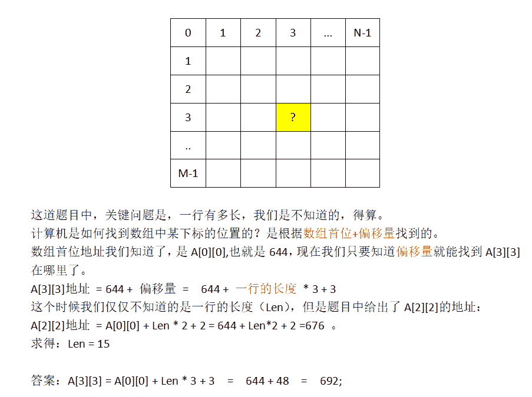
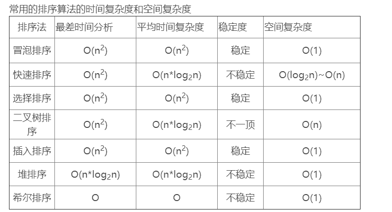
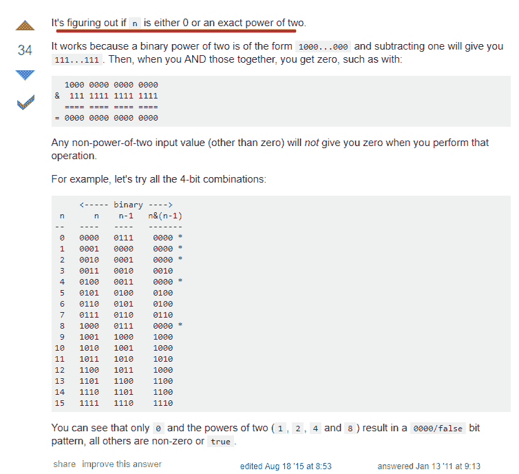

# 吉比特 2017 秋招技术类笔试试卷

## 1

两个进程合作完成一个任务。在并发执行中，一个进程要等待其合作伙伴发来信息，或者建立某个条件后再向前执行，这种制约性合作关系被称为进程的（ ）。

正确答案: B   你的答案: 空 (错误)

```cpp
互斥
```

```cpp
同步
```

```cpp
调度
```

```cpp
伙伴
```

本题知识点

操作系统 C++工程师 Java 工程师 吉比特 2017

讨论

[白杨树下繁花落尽](https://www.nowcoder.com/profile/1767727)

互斥：是指某一资源同时只允许一个访问者对其进行访问，具有唯一性和排它性。但互斥无法限制访问者对资源的访问顺序，即访问是无序的。

同步：是指在互斥的基础上（大多数情况），通过其它机制实现访问者对资源的有序访问。在大多数情况下，同步已经实现了互斥，特别是所有写入资源的情况必定是互斥的。少数情况是指可以允许多个访问者同时访问资源。

发表于 2017-08-03 10:46:17

* * *

[gdut17](https://www.nowcoder.com/profile/279358190)

同步即协同步调，按预定的先后次序运行。线程同步，指一个线程发出某一功能调用时，在没有得到结果之前，该调用不返回。同时其它线程为保证数据一致性，不能调用该功能。进程同步类似。

发表于 2020-08-05 22:34:28

* * *

[小姜同学](https://www.nowcoder.com/profile/7723005)

互斥：是指某一资源同时只允许一个访问者对其进行访问，具有唯一性和排它性。但互斥无法限制访问者对资源的访问顺序，即访问是无序的。 同步：是指在互斥的基础上（大多数情况），通过其它机制实现访问者对资源的有序访问。在大多数情况下，同步已经实现了互斥，特别是所有写入资源的情况必定是互斥的。少数情况是指可以允许多个访问者同时访问资源。

发表于 2018-09-14 12:10:41

* * *

## 2

以下二叉树前序遍历的顺序是（ ）。

a

/  \

b    d

/  \

e   f

正确答案: A   你的答案: 空 (错误)

```cpp
abefd
```

```cpp
abdef
```

```cpp
ebfad
```

```cpp
efbda
```

本题知识点

树 C++工程师 Java 工程师 吉比特 2017

讨论

[一厘米天气晴](https://www.nowcoder.com/profile/9991577)

前序：根左右中序：左根右后序：左右根

发表于 2017-08-26 15:31:30

* * *

[牛客 532972599 号](https://www.nowcoder.com/profile/532972599)

前/中/后序指的是根的前中后

发表于 2020-10-29 10:06:59

* * *

[ChrisZZ](https://www.nowcoder.com/profile/2159092)

a

发表于 2017-08-28 15:39:48

* * *

## 3

若进栈序列为：a，b，c，d，则下列哪一个不可能是出栈序列（ ）。

正确答案: D   你的答案: 空 (错误)

```cpp
a，b，c，d
```

```cpp
c，d，b，a
```

```cpp
a，c，d，b
```

```cpp
c，a，b，d
```

本题知识点

栈 *C++工程师 Java 工程师 吉比特 2017* *讨论

[llllllldddd](https://www.nowcoder.com/profile/9491237)

这种题最快的速度就是，先看第一个出栈的元素，如果在这个元素的后面出栈的连续几个元素在入栈的时候都是该元素之前入栈的，那么这些连续的几个元素必须是与入栈顺讯相反的顺序出栈。由此 D 选项 ab 在 c 的前面入栈，所以必须 b 在 a 之前出栈，也就是 c,b,a,d

发表于 2018-04-21 11:41:08

* * *

[Zoctopus](https://www.nowcoder.com/profile/9975795)

先看第一个选项，a 进 a 出，b 进 b 出，c 进 c 出，d 进 d 出，所以最后的出栈系列为 a，b，c，d。

第二个选项，abc 进，c 先出，d 进 d 出，b 出，a 出，所以最后的出栈系列为 c，d，b，a。

第三个选项，a 进 a 出，bc 进，c 出，d 进 d 出，b 出，所以最后的出栈系列为 a，c，d，b。

第四个选项，abc 进，c 出，b 出，a 出，d 进 d 出，所以 b 应该在 a 前面就出去了，正确的出栈系列为 c，b，a，d。

发表于 2018-03-30 11:55:32

* * *

[猪猪侠来啦](https://www.nowcoder.com/profile/621374)

D

发表于 2017-10-19 20:35:30

* * *

## 4

某算法的语句执行频度为（3n+nlog2(n)+n²+8）,其时间复杂度表示（ ）。

正确答案: C   你的答案: 空 (错误)

```cpp
O(n)
```

```cpp
O(nlog2(n))
```

```cpp
O(n²)
```

```cpp
O(log2(n))
```

本题知识点

复杂度 C++工程师 Java 工程师 吉比特 2017

讨论

[奋斗的小蜗牛@](https://www.nowcoder.com/profile/4735292)

时间复杂度主要取决于 N 的最高次幂数，即最大影响因子

发表于 2017-08-19 01:33:20

* * *

[codeor](https://www.nowcoder.com/profile/433036625)

找最大的

发表于 2019-07-16 18:45:29

* * *

[surperdan](https://www.nowcoder.com/profile/8102445)

时间复杂度主要取决于 N 的最高次幂数

发表于 2017-12-28 22:15:06

* * *

## 5

设有一个二维数组 A[m][n]，假设 A[0][0]存放位置在 644，A[2][2]存放位置在 676，每个元素占一个空间，问 A[3][3]存放的位置在（ ）。

正确答案: C   你的答案: 空 (错误)

```cpp
688
```

```cpp
678
```

```cpp
692
```

```cpp
696
```

本题知识点

数组 C++工程师 Java 工程师 吉比特 2017

讨论

[小白 9527](https://www.nowcoder.com/profile/664399)

676-644=32=2*Len+2，可以知道 Len=15。 因此，答案 [3][3]=[0][0]+3*Len+3=644+48=692-----------------------------------------------------------------------------------------------------------好吧，看到这么多人赞我，我就详细的说下思路吧：

编辑于 2018-10-11 17:44:16

* * *

[么得感情的 Robot](https://www.nowcoder.com/profile/9582890)

c,对的.676+(676-644)/2
A[2][2]与 A[0][0] 相差两排零 2 个元素
A[3][3]与 A[2][2] 相差一排零 1 个元素
因为元素的地址是连续的
所以 A[2][2]与 A[0][0] 的地址差是 A[3][3]与 A[2][2]地址差的 2 倍
A[2][2]与 A[0][0] 的地址差是 676-644
A[3][3]与 A[2][2]地址差是(676-644)/2
所以 A[3][3]的地址是 676+(676-644)/2

发表于 2017-10-08 21:44:09

* * *

[--sgf--](https://www.nowcoder.com/profile/8882859)

根据地址偏移量计算，从 A[0][0]到 A[3][3]的偏移量是从 A[0][0]到 A[2][2]的 1.5 倍。所以 644+1.5*(676-644)=692

发表于 2022-01-24 09:10:34

* * *

## 6

下列叙述中正确的是（ ）。

正确答案: D   你的答案: 空 (错误)

```cpp
一个算法的空间复杂度大，则其时间复杂度也必定大
```

```cpp
一个算法的空间复杂度大，则其时间复杂度必定小
```

```cpp
一个算法的时间复杂度大，则其空间复杂度必定小
```

```cpp
算法的时间复杂度与空间复杂度没有直接关系
```

本题知识点

复杂度 C++工程师 Java 工程师 吉比特 2017

讨论

[Zoctopus](https://www.nowcoder.com/profile/9975795)

算法的时间复杂度是指执行算法所需要的计算工作量，可以用执行算法过程中所需基本运算的执行次数来度量；算法的空间复杂度是指执行这个算法所需要的内存空间。由此可知，算法的时间复杂度与空间复杂度并不相关。

发表于 2018-03-30 12:15:16

* * *

[solidht](https://www.nowcoder.com/profile/2748392)

D

发表于 2017-12-28 20:03:30

* * *

[Dragon201711271425569](https://www.nowcoder.com/profile/4716339)

d

发表于 2017-11-27 23:30:24

* * *

## 7

冒泡排序的时间复杂度（ ）。

正确答案: B   你的答案: 空 (错误)

```cpp
O(n)
```

```cpp
O(n²)
```

```cpp
O(nlog2(n))
```

```cpp
O(log2(n))
```

本题知识点

复杂度 排序 *C++工程师 Java 工程师 吉比特 2017* *讨论

[么得感情的 Robot](https://www.nowcoder.com/profile/9582890)



发表于 2017-10-08 21:55:33

* * *

[solidht](https://www.nowcoder.com/profile/2748392)

B

发表于 2017-12-28 20:03:19

* * *

[wcq123](https://www.nowcoder.com/profile/9173160)

b

发表于 2017-11-14 11:24:47

* * *

## 8

若一棵二叉树有 81 个结点，且没有度为 1 的结点，则非叶结点的个数为（ ）。

正确答案: C   你的答案: 空 (错误)

```cpp
38
```

```cpp
39
```

```cpp
40
```

```cpp
41
```

本题知识点

树 C++工程师 Java 工程师 吉比特 2017

讨论

[牛客小小菜鸟](https://www.nowcoder.com/profile/6392441)

  查看全部)

编辑于 2018-05-06 22:55:47

* * *

[arrnos](https://www.nowcoder.com/profile/6915265)

二叉树的所有节点数 n =d（1）+d（2）+d(0) 其中，度为 0 的节点(叶子结点)比度为 2 的节点数多一个。因此，81= 40 +41

发表于 2017-08-03 23:27:15

* * *

[牛客 9944389 号](https://www.nowcoder.com/profile/9944389)

观察可得，二叉树的结点数比度数多 1，所以二叉树的结点数 n = d + 1,其中 d 为树的所有度数。 由于度数是由度为 2 的结点产生的，所以 d=0*n0 + 0 * n1 +  2*n2， 得到 n = 2*n2 + 1;     代入公式 81 = 2*n2 + 1, 解得 n2 = 40\. 又由 n = n0 + n1 + n2 , 其中 n = 81,n1 = 0,n2=40 得 n0 = 41,

编辑于 2017-10-31 10:22:33

* * *

## 9

已知表 A 中每个元素距其最终位置不远，则以下哪种排序最省时间（ ）。

正确答案: B   你的答案: 空 (错误)

```cpp
冒泡排序
```

```cpp
直接插入排序
```

```cpp
快速排序
```

```cpp
堆排序
```

本题知识点

排序 *讨论

[刘明宇](https://www.nowcoder.com/profile/982925)

答案 B     那就是基本有序的情况下，插入排序只需要比较 n-1 次               A:n²
               C:n²
               D:nlogn

编辑于 2017-08-02 22:30:42

* * *

[牛客 527161027 号](https://www.nowcoder.com/profile/527161027)

冒泡排序、插入排序和希尔排序的最佳时间复杂度都是 O(n)但是我理解的是冒泡排序只有在完全有序的情况下才能达到这个程度。希尔排序也是。只有插入排序可以一轮排完。冒泡排序和希尔排序都要多轮。尽管插入排序存在内循环，但是内循环在题中条件下影响不大

发表于 2021-08-25 17:14:41

* * *

## 10

设有 6 个结点的无向图，该图至少应有（ ）条边才能是一个连通图。

正确答案: A   你的答案: 空 (错误)

```cpp
5
```

```cpp
6
```

```cpp
7
```

```cpp
8
```

本题知识点

图 C++工程师 Java 工程师 吉比特 2017

讨论

[卸不下的喜欢](https://www.nowcoder.com/profile/7346661)

这题错了，问的是确保，答案应该是 C（5,2）+1=11，问至少多少边才是 5 条

发表于 2017-08-13 01:19:24

* * *

[pig12345](https://www.nowcoder.com/profile/114069)

连通 n 个节点的有向图，至少需要 n 条边；连通 n 个节点的无向图，至少需要（n-1）条边；答案不是应该是 5 吗？

发表于 2017-08-10 10:58:02

* * *

[啥也不会做](https://www.nowcoder.com/profile/1654029)

有向图是单向的，有箭头，例如路径可以从 A 节点到 B 节点，但不可以从 B 节点到 A 节点；无向图是双向的，没有箭头，路径可以从 A 到 B，也可以从 B 到 A

发表于 2018-02-23 14:35:40

* * *

## 11

怎样遍历二叉查找树可以得到一个从小到大的有序序列（ ）。

正确答案: B   你的答案: 空 (错误)

```cpp
前序遍历
```

```cpp
中序遍历
```

```cpp
后序遍历
```

```cpp
都不行
```

本题知识点

树 C++工程师 Java 工程师 吉比特 2017

讨论

[mumure](https://www.nowcoder.com/profile/4890863)

二叉查找树：对于一个父节点，左边的子节点比它小，右边的子节点比它大。中序遍历：左-中-右后序遍历：左-右-中前序遍历：中-左-右

发表于 2018-06-06 21:20:23

* * *

[左庶长](https://www.nowcoder.com/profile/6941563)

二叉搜索树一个很重要的特性就是：树中任何结点的左子树中所有结点的值均比该结点小，右子树中所有结点的值均比该结点大。对二叉搜索树进行中序遍历即得到一个递增排序的序列。

检查一个树是否是二叉搜索树可以使用中序遍历，根据递增排序的序列生成二权搜索树也可以使用中序遍历。

发表于 2017-11-15 13:57:23

* * *

[拿个 offer](https://www.nowcoder.com/profile/458560)

二叉查找树不就二叉排序树么  

发表于 2017-08-09 20:33:49

* * *

## 12

一种既有利于短小作业又兼顾到长作业的作业调度算法是（ ）。

正确答案: C   你的答案: 空 (错误)

```cpp
先来先服务
```

```cpp
轮转
```

```cpp
最高响应比优先
```

```cpp
均衡调度
```

本题知识点

操作系统 C++工程师 Java 工程师 吉比特 2017

讨论

[点点叉](https://www.nowcoder.com/profile/6183252)

最高响应比优先算法等待时间相同时，要求服务时间愈短，优先权愈高，因而该算法有利于短作业，对于长作业，作业的优先级可以随等待时间的增加而提高，当其等待时间足够长时，其优先级便可升到很高，从而获得处理机，因此该算法即有利于短作业又兼顾到了长作业。——百度文库

发表于 2017-08-04 16:37:34

* * *

[赵翔](https://www.nowcoder.com/profile/5926751)

**时间片轮转调度算法（RR）**：给每个进程固定的执行时间，根据进程到达的先后顺序让进程在单位时间片内执行，执行完成后便调度下一个进程执行，时间片轮转调度不考虑进程等待时间和执行时间，属于抢占式调度。**优点是兼顾长短作业**；缺点是平均等待时间较长，上下文切换较费时。适用于分时系统。**高响应比优先调度算法**：优先算法在等待时间相同的情况下，作业执行的时间越短，响应比越高，满足段任务优先，同时响应比会随着等待时间增加而变大，优先级会提高，能够避免饥饿现象。**优点是兼顾长短作业**，缺点是计算响应比开销大，适用于批处理系统。**因此这道题 BC 应该都正确！**

发表于 2017-08-16 21:45:57

* * *

## 13

传输层可以通过（ ）标识不同的应用。

正确答案: B   你的答案: 空 (错误)

```cpp
物理地址
```

```cpp
端口号
```

```cpp
IP 地址
```

```cpp
逻辑地址
```

本题知识点

网络基础 C++工程师 Java 工程师 吉比特 2017

讨论

[七月 66](https://www.nowcoder.com/profile/3439419)

端口号

发表于 2017-09-07 17:17:54

* * *

[Ethane](https://www.nowcoder.com/profile/790326682)

端口号

发表于 2019-03-13 19:21:16

* * *

[SuT2i](https://www.nowcoder.com/profile/1889247)

d

发表于 2017-08-01 19:20:30

* * *

## 14

对长度为 n 的线性表作快速排序，在最坏情况下，比较次数为（ ）。

正确答案: D   你的答案: 空 (错误)

```cpp
n
```

```cpp
n-1
```

```cpp
n(n-1)
```

```cpp
n(n-1)/2
```

本题知识点

排序 *C++工程师 Java 工程师 吉比特 2017* *讨论

[彤彤是个大美女](https://www.nowcoder.com/profile/6553109)

快速排序最坏的情况是对有序数列排序，那么第一个元素需要比较 n-1 次，第 2 个元素需要比较 n-2 次，以此来推需要比较 1，，，，n-1 次等差数列求和得到（n）*（n-1）/2;

发表于 2017-08-04 22:02:27

* * *

## 15

为了对某序列进行二分查找，则要求其（ ）。

正确答案: B   你的答案: 空 (错误)

```cpp
可以是乱序
```

```cpp
必须已排序
```

```cpp
可以已排序也可以是乱序
```

```cpp
必须转化为二叉树
```

本题知识点

查找 *C++工程师 Java 工程师 吉比特 2017* *讨论

[天凉好个秋 201909031811464](https://www.nowcoder.com/profile/696370373)

二分查找要求：顺序存储，元素有序

发表于 2019-09-11 00:35:32

* * *

[Nearme](https://www.nowcoder.com/profile/3749733)

二分查找必须要求关键字有序

发表于 2018-01-08 21:59:07

* * *

[Sc0tt](https://www.nowcoder.com/profile/9132034)

B

发表于 2018-05-02 17:53:37

* * *

## 16

某二叉树的前序序列为 ABCDEFG，中序序列为 DCBAEFG，则该二叉树的后序序列为（ ）。

正确答案: C   你的答案: 空 (错误)

```cpp
EFGDCBA
```

```cpp
DCBEFGA
```

```cpp
DCBGFEA
```

```cpp
BCDGFEA
```

本题知识点

树 C++工程师 Java 工程师 吉比特 2017

讨论

[无敌摸鱼君](https://www.nowcoder.com/profile/4248469)

            A           /   \
        B      E        /          \
      C           F
     /                \   D                 G

发表于 2018-05-25 19:40:01

* * *

[牛客 2752645 号](https://www.nowcoder.com/profile/2752645)

·1 先序遍历的第一个节点总是根节点。
·2 中序遍历中根节点左侧的节点全是根节点左子树的节点，根节点右侧的节点全是根节点的右子树。
递归的使用上述两条规则画出整个二叉树。
对于这个问题：
1.先得出 A 是根节点，
2.DCB 是 A 左子树中的点，EFG 是 A 右子树中的点
1.B 是 A 左子树的根节点，E 是 A 右子树的根节点
2.CD 是 B 左子树中的点，FG 是 B 右子树中的点
1.C 是 B 左子树的根节点，F 是 B 右子树的根节点
2.D 是 C 左子树中的点，G 是 F 右子树中的点
递归结束
A
/ \
B E
/ \
C F
/ \
D G
后序遍历为 DCBGFEA。答案是 C。

发表于 2017-08-05 21:01:55

* * *

[Litehsuer](https://www.nowcoder.com/profile/1648400)

这题目没有问题么？

发表于 2017-08-05 18:55:11

* * *

## 17

对于线性表（7，34，55，25，64，46，20，10）进行散列存储时，若选用 H(K)=K % 9 作为散列函数，则计算的散列地址为 1 的元素有（ ）个。

正确答案: D   你的答案: 空 (错误)

```cpp
1
```

```cpp
2
```

```cpp
3
```

```cpp
4
```

本题知识点

链表 *C++工程师 Java 工程师 吉比特 2017* *讨论

[四六级大神](https://www.nowcoder.com/profile/6947126)

答案选 D， 4 个。分别是：55，64，46，10\. H（K）= K%9，表示除以 9 的余数。由于地址重叠造成冲突，所以散列存储时，通常还要有解决冲突的办法，如线性探查法等等。

发表于 2017-09-07 17:28:28

* * *

[Sc0tt](https://www.nowcoder.com/profile/9132034)

我的 天，我居然还看漏了一个

发表于 2018-04-28 12:37:29

* * *

[。为你而战](https://www.nowcoder.com/profile/1226377)

为啥是 4 个？不是 3 个吗？7-->734-->755-->164-->846-->120-->210-->1 求解答。

发表于 2017-08-04 09:42:26

* * *

## 18

下面函数的功能是（ ）

```cpp
int sss(char s[], char t[])
{
    int i = 0;
    while(s[i] && t[i] && (t[i] == s[i])) i++;
    return (s[i] - t[i]);
}
```

正确答案: B   你的答案: 空 (错误)

```cpp
求字符串的长度
```

```cpp
比较两个字符串的大小
```

```cpp
将字符串 s 复制到字符串 t 中
```

```cpp
将字符串 s 接续到字符串 t 中
```

本题知识点

C++工程师 2017 C 语言

讨论

[菜鸟更要虚心学习](https://www.nowcoder.com/profile/9429283)

是 Java 的吗？不过，聪明的程序员应该答对吧，while 循环找出字符数组中第一个不相等的字符，然后做差，是想比较大小。

发表于 2017-08-04 20:58:40

* * *

[望天树](https://www.nowcoder.com/profile/2466172)

1.这段程序的写法是存在问题的。在 java 中，逻辑运算符&&只能和 boolean/Boolean 的值 true 或者 false 做运算，不能和 char 类型的做运算。

```cpp
public class Test
{ public static void main(String arg[])
    { char[] a = {'a','b','c'}; char[] b = {'a','b','e'};
        System.out.println(sss(a,b));
    } static int sss(char s[],char t[])
    { int i=0; while(s[i]&&t[i]&&(t[i]==s[i]))
            i++; return (s[i]-t[i]);
    }
}

所以，上述测试程序在编译器中就会标红，报错。

```

```cpp
.2.根据程序的功能，t[i]==s[i],就比较下一个；如果不同，就作减，说明比较的是大小。
```

发表于 2017-08-02 17:28:58

* * *

[leozam](https://www.nowcoder.com/profile/320048)

本代码编译错误

发表于 2017-08-03 11:26:47

* * *

## 19

有如下程序 ```cpp
#include <stdio.h>
void main()
{
    char ch[80] = "123abcdEFG*&";
    int j;
    puts(ch);
    for(j = 0; ch[j] != '\0'; j++)
        if(ch[j] >= 'A' && ch[j] <= 'Z')
            ch[j] = ch[j] + 'e' - 'E';
    puts(ch); 
}
``` 

该程序的功能是（ ）

正确答案: D   你的答案: 空 (错误)

```cpp
测字符数组 ch 的长度
```

```cpp
将数字字符串 ch 转换成十进制数
```

```cpp
将字符数组 ch 中的小写字母转换成大写
```

```cpp
将字符数组 ch 中的大写字母转换成小写
```

本题知识点

C++ C++工程师 Java 工程师 吉比特 2017 C 语言

讨论

[FreeLoop201909292343456](https://www.nowcoder.com/profile/737430612)

一个字母对应的大写和小写之间的 ASCII 码值相差 32，而且小写的大于大写的。所以题中'e'和'E'之间的 ASCII 码值相差 32（ ch[j]+'e'-'E'  相当于  ch[j]+32  ）。一个字母从大写转化为小写就是在它自身上+32，小写转大写则是-32。

发表于 2019-12-31 19:40:58

* * *

[java 吧](https://www.nowcoder.com/profile/9036967)

在 ASCII 中 小写字母在大写字母之后 即 小写字母对应的 ASCII 的值大于大写字母

发表于 2018-04-23 16:39:13

* * *

[MaCter](https://www.nowcoder.com/profile/657947041)

一个字母的大写和小写的 ASCII 差异 32，小写的数值大于大写！

发表于 2021-12-01 14:46:15

* * *

## 20

下面程序的输出是（ ） ```cpp
#include <stdio.h>
int fun3(int x)
{
    static int a = 2;
    a += x;
    return(a);
}
void main()
{
    int k = 2, m = 1, n;
    n = fun3(k);
    n += fun3(m);
    printf("%d\n", n);
}
``` 

正确答案: D   你的答案: 空 (错误)

```cpp
3
```

```cpp
5
```

```cpp
7
```

```cpp
9
```

本题知识点

C++工程师 2017 C 语言

讨论

[OuouTu](https://www.nowcoder.com/profile/2546952)

static int a 是静态的，即为全局变量第一次进入 fun3( )，退出时 a=4 第二次进入 fun3( )时，再次对 a 初始化是无效的

发表于 2017-08-31 12:30:46

* * *

[轻舟已过万重 3](https://www.nowcoder.com/profile/5260075)

static int：字面意思理解，静态整形变量。因为是静态，初始化后就不会再初始化第二次了。在这道题，初始化就是第一次进入的时候。初始化 a=2，第一次返回值 2+2=4。第二次，a 的值还是 4，然后返回 5\.4+5，选 D

发表于 2018-08-11 01:38:19

* * *

[一朵云云云](https://www.nowcoder.com/profile/8044291)

a 是全局静态变量，第一次调用后会保存新的赋值

发表于 2018-03-24 17:59:33

* * *

## 21

若干个等待访问磁盘者依次要访问的磁道为 19、43、40、4、79、11、76，当前磁头位于 40 号柱面，若用最短寻道时间优先磁盘调度算法，则磁头移动总距离（道数）为（ ）。

正确答案: B   你的答案: 空 (错误)

```cpp
271
```

```cpp
117
```

```cpp
110
```

```cpp
129
```

本题知识点

操作系统 C++工程师 Java 工程师 吉比特 2017

讨论

[starry-](https://www.nowcoder.com/profile/4491477)

根据最短寻道优先(SSTF)磁盘调度算法的原理可知寻找与自身最近的磁道进行访问，所以他的访问顺序为：40-43-19-11-4-76-79；所以移动总距离为：3+24+8+7+72+3=117

发表于 2017-08-04 08:37:36

* * *

[叫我大头](https://www.nowcoder.com/profile/4423738)

选择与当前磁头距离最短磁道，

发表于 2017-08-02 21:04:38

* * *

[我是个小白菜](https://www.nowcoder.com/profile/544582976)

当前位于 40，寻道顺序为寻找下一个离自己最近的磁道，也就是题目说的最短寻道时间优先磁盘调度算法，顺序为 40-》43-》19-》11-》4-》76-》79

发表于 2018-11-12 17:11:10

* * *

## 22

下列哪个排序算法不是稳定的（ ）。

正确答案: B   你的答案: 空 (错误)

```cpp
冒泡排序
```

```cpp
选择排序
```

```cpp
插入排序
```

```cpp
归并排序
```

本题知识点

排序 *C++工程师 Java 工程师 吉比特 2017* *讨论

[小威羊](https://www.nowcoder.com/profile/8805884)

选堆快希不稳，选堆归基不变。口诀很容易记，记住就再也不会坐错啦！

发表于 2017-08-10 10:30:11

* * *

[美团校招情报站](https://www.nowcoder.com/profile/8918859)

快希选堆 是不稳定的排序方式，谐音：“快些选队”

发表于 2017-09-17 21:02:56

* * *

[华科平凡](https://www.nowcoder.com/profile/4939096)

发表于 2017-09-13 09:33:37

* * *

## 23

10 个并发进程使用同一个共享变量，如果最多允许 4 个进程同时进入其临界区，则互斥信号量的变化范围应是（）。

正确答案: D   你的答案: 空 (错误)

```cpp
4,3,2,1,0
```

```cpp
4,3,2,1,0,……,-4
```

```cpp
4,3,2,1,0,-1,……,-5
```

```cpp
4,3,2,1,0,-1,……,-6
```

本题知识点

操作系统 C++工程师 Java 工程师 吉比特 2017

讨论

[一厘米天气晴](https://www.nowcoder.com/profile/9991577)

设有 n 个进程共享一个互斥段，对于如下两种情况使用信号量，信号量的值的变化怎样？
(1) 如果每次只允许一个进程进入互斥段。(2) 如果每次最多允许 m 个进程（m<n）同时进入互斥段。（1）互斥信号量初值为 1 ，变化范围为［ -n ＋ l , 1 ］。（2）互斥信号量初值为 m ，变化范围为［ -n ＋ m , m ］。以上引用：[`www.nowcoder.com/questionTerminal/3e25265f1fbd4fa1a5e8d0704851263b`](https://www.nowcoder.com/questionTerminal/3e25265f1fbd4fa1a5e8d0704851263b)

发表于 2017-08-26 15:23:22

* * *

[点点叉](https://www.nowcoder.com/profile/6183252)

本题考查操作系统进程管理中进程同步和进程互斥的基础知识。
在操作系统的进程管理中经常使用信号量(Semaphore)机制。其中“P 操作”是检测信号量是否为正值，若不是，则阻塞调用进程；“v 操作”是唤醒一个阻塞进程恢复执行。根据用途不同，信号量分为公用信号量和私用信号量。公用信号量用于实现进程问的互斥，初值通常设为 1，它所联系的一组并行进程均可对它实施 P、v 操作；私用信号量用于实现进程间的同步，初始值通常设为 0 或 n。
根据题意，有 10 个进程共享一个互斥段，而互斥段最多允许 4 个进程同时进入，所以系统资源有 4 个可被调用，信号量 S 可置初值为 4。
同时信号量是一个整数，当信号量大于等于零时，表示可供并发进程使用的资源实体数；当信号量小于零时，其绝对值表示正在等待使用临界区的进程数。
因此，当第一个申请资源的进程访问时，对信号量 S 执行一次 P 操作，信号量 S 减 1 后等于 3，大于零，进程可继续执行；……，当第十个申请资源的进程访问时，对信号量 S 执行 P 操作，信号量 S 减 1 后等于-6，小于零，进程进入阻塞队列等待。即信号量 S 的变化范围是-6～4。——来自百度题库答案解析

发表于 2017-08-04 17:19:40

* * *

[rppp](https://www.nowcoder.com/profile/9542322)

（１）若每次只允许一个进程进入互斥段互斥信号量初值为１，变化范围为【-n+1,1】；（2）若每次最多只允许 m 个进程（m < n）同时进入互斥段           互斥信号量初值为 m，变化范围为【-n+m,m】；则此题互斥信号量的变化范围为【-10+4,4】 = {-6，-5，。。。3,4}；

发表于 2017-09-11 22:03:09

* * *

## 24

若有一个顺序有序表 A[1:18] 中有 18 个元素，现进行二分查找，则查找 A［3］的比较序列的下标依次为（ ）。

正确答案: D   你的答案: 空 (错误)

```cpp
1，2，3
```

```cpp
9，5，2，3
```

```cpp
9，5，3
```

```cpp
9，4，2，3
```

本题知识点

查找 *讨论

[ShaoXiaobao](https://www.nowcoder.com/profile/4765842)

假设[1:18]是单调递增，设 A[3] = x。先查找[1:18]的中间值 mid=（1+18）/2=9.5，向下取整为**9,**A[**9**] > x，于是范围变成了中值左边的取值，左右值变成了[1:9-1]即为[1:8]mid =（1+8）/2=4.5，取值**4**A[**4**] > x，于是范围变成了中值左边的取值，左右值变成了[1:4-1]即为[1:3]mid = (1+3)/2 = **2**A[**2**] < x，于是范围变成了中值右边的取值，范围变成[2+1:3]即为[3:3]A[**3**] = X 由上：查找 A［3］的比较序列的下标依次为（9,4,2,3 ）。

发表于 2017-08-04 09:19:48

* * *

[DanielTYL](https://www.nowcoder.com/profile/7401116)

记住是向下取整，不然容易出错了

发表于 2017-09-15 00:22:34

* * *

[Given](https://www.nowcoder.com/profile/4383483)

[a,b] 的中间元素为  （a+b）/2 向下取整 1~18： （1+18）/2 向下取整=93<9，因此下一次范围是 1~8，（1+8）/2 向下取整=43<4，因此下一次范围是 1~3，得 22>3，因此下一次范围是 3~3，的 3

发表于 2017-08-03 23:30:46

* * *

## 25

红黑树的插入复杂度为（ ）。

正确答案: D   你的答案: 空 (错误)

```cpp
O(n)
```

```cpp
O(1)
```

```cpp
O(n²)
```

```cpp
O(log(n))
```

本题知识点

复杂度 树

讨论

[残阳舞墨](https://www.nowcoder.com/profile/6039312)

复杂度同二叉查找树，logn

发表于 2017-08-17 22:09:28

* * *

[拜拜 201808061617810](https://www.nowcoder.com/profile/266051793)

红黑树就是一种平衡的二叉查找树，查找复杂度等同于二叉查找树

发表于 2019-04-21 17:46:09

* * *

[史壳郎](https://www.nowcoder.com/profile/5577746)

d

发表于 2017-08-03 11:21:14

* * *

## 26

若序列 X={1, 2, -2, 3, -3, 1, -3, 2, 2, -2, 3, -2, 3, -2}，则该序列的所有连续子序列中，连续子序列内各元素和的最大值为 1。(说明: 连续子序列指原序列中若干连续元素构成的序列，所有子序列中最短长度 1，最大长度即原序列的长度。例如第 3，4，5 号连续的元素就是一个连续子序列，其元素为{-2, 3, -3}，各元素和为-2+3-3=-2)

你的答案 (错误)

1 参考答案 (1) 6

本题知识点

动态规划 C++工程师 Java 工程师 吉比特 2017

讨论

[NewPerson](https://www.nowcoder.com/profile/844016)

用一个 max 记录最大连续和，用一个 sum 记录遍历的和，从左到右遍历数组，遍历到下标 i 时，sum += arr[i]，如果 sum>0，则 sum = sum，如果 sum 小于 0，则 sum = 0，判断更新 max 的值，遍历结束后的 max 即为所求。

```cpp
int max = Integer.MIN_VALUE;
int sum = 0;
for (int i = 0; i < arr.length; i++) {
    sum += arr[i];
    if (max < sum) {
         max = sum;
   }
   sum = sum > 0 ? sum : 0;
}
```

发表于 2017-09-02 22:34:17

* * *

[DGZI](https://www.nowcoder.com/profile/3896009)

取两个指针，一个从小到大，一个从大到小，进行遍历，这样时间复杂度最低

发表于 2018-06-15 18:39:03

* * *

[一厘米天气晴](https://www.nowcoder.com/profile/9991577)

1, 2, -2, 3, -3, 1, -3, **2, 2, -2, 3, -2, 3**, -2

发表于 2017-08-26 15:09:24

* * *

## 27

下列程序的输出是 1。

```cpp
#include <stdio.h>
void func(int a)
{
 int b=0,c,d;
 d=a;
 while(d!=0)
 {
 c=d%10;
 b=b*10+c;
 d/=10;
 }
 if(b==a)
 printf("%d",a);
}
void main( )
{
 int i;
 for(i=12300;i<12400;i++)
 func(i);
 printf("\n");
}
```

你的答案 (错误)

1 参考答案 (1) 12321

本题知识点

C++ C++工程师 Java 工程师 吉比特 2017

讨论

[surperdan](https://www.nowcoder.com/profile/8102445)

先试 2 个数就能知道了，找回文数的

发表于 2017-12-26 23:23:34

* * *

[秒速 __ 五厘米](https://www.nowcoder.com/profile/301791)

找的是回文数

发表于 2017-08-08 16:59:48

* * *

[快说我这信号好](https://www.nowcoder.com/profile/8528154)

12321

发表于 2017-08-06 00:51:19

* * *

## 28

请问运行以下代码输出的结果是 1

```cpp
#include <stdio.h>
int func(int n)
{
 return n>0&&(n&(n-1))==0&&(n&0x55555555);
}
void main( )
{
 printf("%d\n",func(4096)+func(8192)*10+func(16384)*100);
}
```

你的答案 (错误)

1 参考答案 (1) 101

本题知识点

C++ C++工程师 Java 工程师 吉比特 2017

讨论

[毕业后****去大理](https://www.nowcoder.com/profile/304824)

个人理解是这样 n>0&&(n&(n-1))==0 用于判断是否为 2 的幂数 ，(n&0x55555555) 判断幂数的奇偶数 func(4096)+func(8192)*10+func(16384)*1004096 为 2 的 12 次幂，为偶数  boolean 值成立 为 18192 为 2 的 13 次幂 ，为奇数  boolean 值不成立  为 016384 为 2 的 14 次幂 ，为偶数  boolean 成立 为 11+0*10+1*100=101

发表于 2017-08-05 20:20:28

* * *

[L⃣eeY⃣oung](https://www.nowcoder.com/profile/8280382)

n & (n-1) what does this expression do?



0x55555555 是 16 进制，2 进制是 1010101010101010101010101010101, 即判断是否为偶数次幂

发表于 2018-03-27 21:00:10

* * *

[yeel](https://www.nowcoder.com/profile/9771568)

n&(n-1) : 将 n 的第一个低位 1 置 0n&(n-1)==0 : n 只有一个 1，即最高位为 1 其他为 0，即 2 的幂 （或者 0）0x55555555 = 0101 0101 0101 0101 0101 0101 0101 0101 (奇数位为 1，偶数位为 0)n&0x55555555 : 如果 n 中唯一的 1 在奇数位（2 的偶数次幂），则相与得 n，n!=0，即 n&0x55555555 为 true                            如果 n 中唯一的 1 在偶数位（2 的奇数次幂），则相与得 0，即 n&0x55555555 为 false

编辑于 2017-08-05 20:03:53

* * *

## 29

输入 M、N，1 < M < N < 1000000，求区间[M,N]内的所有素数的个数。素数定义：除了 1 以外，只能被 1 和自己整除的自然数称为素数

本题知识点

模拟 C++工程师 Java 工程师 吉比特 2017

讨论

[牛客 9668967 号](https://www.nowcoder.com/profile/9668967)

```cpp
//通过时间:8ms  占用内存:1400kb
#include<iostream>
#define K 1000001
using namespace std;
char p[K+1] = {1,1,0};
int main() {
    int i,j;
    for(i = 2; i <= K/10; ++i)
        if(!p[i])
            for(j = 2; i*j <=K ; ++j)
                p[i*j] = 1;
    int M,N,count;
    cin>>M;
    cin>>N;
    count=0;
    for(i=M; i<=N; i++)
        if(!p[i])
            count++;
    cout<<count;
}
```

编辑于 2017-09-12 14:38:10

* * *

[元气の悟空](https://www.nowcoder.com/profile/392974)

```cpp
#include<stdio.h>
#include<vector>
#include<algorithm>
using namespace std;
vector<int> isp;
int a[1000001],l,r,m,n;
void init(){
    a[0]=a[1]=1;
    for(int i=2;i<=1000000;i++)
        if(!a[i]){
            for(int j=2*i;j<=1000000;j+=i) a[j]=1;
            isp.push_back(i);
        }
}
int main(){
    init();
    while(scanf("%d%d",&m,&n)!=EOF){
        l=lower_bound(isp.begin(),isp.end(),m)-isp.begin();
        r=upper_bound(isp.begin(),isp.end(),n)-isp.begin();
        printf("%d\n",r-l);
    }
}

```

发表于 2017-11-09 21:03:48

* * *

[多米@璟](https://www.nowcoder.com/profile/955933)

```cpp
import java.util.ArrayList;
import java.util.Scanner;
public class Main {
    private static int calPrimeNumber(int begin,int end){
        boolean[] prime=new boolean[end+1];
        for(int i=begin;i<prime.length;i++){
            if(i%2 == 0){
                prime[i]=false;
            }else{
                prime[i]=true;
            }
        }
        for(int i=3;i<=Math.sqrt(1.00*end);i+=2){
            for(int j=i+i;j<=end;j+=i){
                prime[j]=false;
            }
        }
        prime[2]=true;

        int count=0;
        for(int i=begin;i<=end;i++){
            if(prime[i]){
                count++;
            }
        }
        return  count;
    }
    public static void main(String[] args) {
        Scanner in=new Scanner(System.in);
        int m=in.nextInt();
        int n=in.nextInt();
        int sum=calPrimeNumber(m,n);
        System.out.println(sum);
    }
}

```

编辑于 2017-09-26 21:49:49

* * *

## 30

给定一个未排序的数列，找到此数列在已排序状态下的两个相邻值的最大差值，少于两个值时返回 0。例如：给定数列 [1,3,2,0,1,6,8] 则 最大差值为 3。注意：请尽量使用时间复杂度为 O(n)的方案。

本题知识点

数组 C++工程师 Java 工程师 吉比特 2017

讨论

[曦姐跟班](https://www.nowcoder.com/profile/1399304)

[`ask.julyedu.com/question/751`](http://ask.julyedu.com/question/751)

```cpp
#include<iostream>
#include<vector>
using namespace std;
//
//来自邹博
//设 n 个数最大值 max,最小值 min
//n 个数  分布 max,min 共有 n-1 个区间
//每个区间内只需要统计最大和最小值即可
//每个区间[a,b),n 个桶，最大数单独一个区间

int main()
{
	int n; cin >> n;
	vector<int> a(n, 0);
	int max = 0, min = 2100000000;
	vector<int> bucket_min(n, 2100000000), bucket_max(n, 0);

	for (auto &i : a)
	{
		cin >> i;
		if (i < min)min = i;
		if (i > max)max = i;
	}
	if (n == 1) { cout << 0; return 0; }
	double delta = ((double)max - min) / (n - 1);
	if (delta == 0) { cout << 0; return 0; }
	for (auto i : a)
	{
		int index = (i - min) / delta ;
		if (bucket_min.at(index) >= i)bucket_min.at(index) = i;
		if (bucket_max.at(index) <= i)bucket_max.at(index) = i;
	}
	int max_delta = 0;
	int begin_1 = bucket_max[0];
	for (int i = 1; i < n; i++)
	{
		if (bucket_min[i] != 2100000000 && (bucket_min[i] - begin_1 > max_delta))//这个区间有数
			max_delta = bucket_min[i] - begin_1;
		if(bucket_max[i]!=0)begin_1 = bucket_max[i];
	}
	cout << max_delta;

}
```

编辑于 2017-08-29 23:58:59

* * *

[Mongolia-Duck-king](https://www.nowcoder.com/profile/834147370)

思路就是排序后对每两个相邻元素做差，然后比较
N=int(input())ls=list(map(int,input().split(' ')))ls.sort(reverse=False)       #排序
res = ls[1] - ls[0]         #首先算出前两个的差
for i in range(len(ls)-1):      #比较后续相邻的差，比 res 大就替换
    if ls[i+1]-ls[i] > res:        res = ls[i+1] - ls[i]print(res)

发表于 2019-09-02 17:54:00

* * *

[starboycn](https://www.nowcoder.com/profile/512227589)

用优先队列来代替排序

```cpp
#include <bits/stdc++.h>

using namespace std;

int main(){
    int N;
    scanf("%d", &N);
    if(N < 0) return 0;
    priority_queue<int, vector<int>, greater<int>> heap;
    int tmp;
    while(~scanf("%d", &tmp)){
        heap.push(tmp);
    }

    int cur = heap.top();
    heap.pop();
    int res = 0;
    while(!heap.empty()){
        tmp = heap.top();
        heap.pop();
        res = max(res,tmp - cur);
        cur = tmp;
    }
    cout<<res;
    return 0;

}
```

发表于 2021-07-05 16:10:40

* * *********