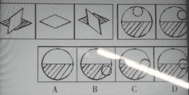
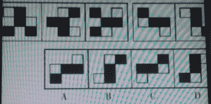

# 富士康 2017 秋招工程师岗位笔试试卷

## 1

782，733，697，672，（  ）

正确答案: A   你的答案: 空 (错误)

```cpp
656
```

```cpp
648
```

```cpp
662
```

```cpp
658
```

本题知识点

数学运算

讨论

[牛客 6919869 号](https://www.nowcoder.com/profile/6919869)

A782-733=49=7*7733-697=36=6*6697-672=25=5*5672-4*4=672-16=656

发表于 2017-01-11 20:47:58

* * *

[Leonardo10](https://www.nowcoder.com/profile/2297345)

不算难，但是前面那句但其中缺少一项或两项 是个什么意思？？

发表于 2018-02-09 12:01:01

* * *

[hexiaosa](https://www.nowcoder.com/profile/9067338)

A. 相邻两个数分别相差 49,36,25，分别为 7²,6²,5²，下一个应该是 4²(16)。

发表于 2017-03-09 22:16:45

* * *

## 2

一个圆形的屋子，每隔 3 米摆放一盆花，屋子周长 90 米，则共需要 多少盆花？

正确答案: A   你的答案: 空 (错误)

```cpp
30
```

```cpp
31
```

```cpp
60
```

```cpp
62
```

本题知识点

组合数学 *数据分析师 牛客 2021* *讨论

[何博明](https://www.nowcoder.com/profile/2621707)

这道题***：圆形的屋子，如果按周长 90 米摆花盆摆 30 盆，每两盆之间的圆弧距离为 3 米，直线距离小于 3 米，题目给出的   每隔 3 米摆一盆花，这句话非常不严谨，因此不考虑是否有正确答案

发表于 2017-01-13 13:33:08

* * *

[牛客 607958 号](https://www.nowcoder.com/profile/607958)

题目不理解，为什么非要在边上摆呢？中间不行吗？计算可以 80 多

发表于 2017-08-14 21:38:10

* * *

[花开满楼](https://www.nowcoder.com/profile/4866322)

为什么只在圆周算，中间也可以的啊

发表于 2018-04-16 14:19:32

* * *

## 3

租用仓库堆放 2 吨货物，每月租金 6000 元，这批货物原计划要销售两个月，但因为降低了价格，结果一个月就销售完了，由于节省了仓库租金，结算下来，反而比预计多赚了 1000 元，那么每千克货物降低了（）元。

正确答案: D   你的答案: 空 (错误)

```cpp
0.5
```

```cpp
5
```

```cpp
3
```

```cpp
2.5
```

本题知识点

组合数学 *讨论

[果粒陳 sam](https://www.nowcoder.com/profile/8107257)

原来赚的钱：2000x-2*6000 现在赚的钱：2000y-6000 差价=1000=（2000y-6000）-（2000x-2*6000）解得 y=x-2.5

发表于 2018-10-19 22:15:50

* * *

[SunburstRun](https://www.nowcoder.com/profile/557336)

答案是 D 实际比预计节省了一个月的租金 6000 元，但实际比预计多赚了 1000 元，由此可知，这批货物共降价了 6000-1000=5000(元)。1 吨=1000 千克，那么每千克货物降价了 5000÷(2×1000)=2．5(元)。故本题答案为 D。

编辑于 2016-12-11 20:59:34

* * *

[rs 勿忘初心](https://www.nowcoder.com/profile/7491640)

1 吨=1000 千克。设每千克降价 x 元；6000-2*1000*x=1000 解得：x=2.5

发表于 2017-08-16 10:05:32

* * *

## 4

小李和小王各有书籍若干本，小李对小王说：“我如果给你 2 本，我们的书将一样多。”小王说：“我如果给你 2 本，我的书籍数量将只有你的三分之一。”请问，小李和小王共有书籍多少本?

正确答案: C   你的答案: 空 (错误)

```cpp
13
```

```cpp
14
```

```cpp
16
```

```cpp
22
```

本题知识点

数学运算

讨论

[慢乌龟](https://www.nowcoder.com/profile/6633822)

根据小王的话推出书一定是 4 的倍数，答案只有 16

发表于 2017-10-03 13:33:51

* * *

[菜鸟葫芦娃](https://www.nowcoder.com/profile/415611)

```cpp
设:小李=x,小王=y;
x-2=y+2
x+2=(y-2)*3   

解得小王有 6 本，小李有 10 本，二人共有 16 本
```

发表于 2016-12-19 08:27:45

* * *

[ThinkTalkAct](https://www.nowcoder.com/profile/3230960)

根据小李的话推出，书数是某个数的 2 倍；根据小王的话推出，书数是某个数的 4 倍。
同时符合这两个条件的，只有 16

编辑于 2019-04-22 10:48:02

* * *

## 5

某单位组织党员参加党史，党风廉政建设，科学发展观和业务能力四项培训，要求每名党员参加且只能参加其中的两项，无论如何安排，都至少有 5 名党员参加的培训完全相同，请问该单位至少有多少名党员？

正确答案: C   你的答案: 空 (错误)

```cpp
17
```

```cpp
21
```

```cpp
25
```

```cpp
29
```

本题知识点

数学运算

讨论

[万敏感词](https://www.nowcoder.com/profile/6045621)

4 门课程，每人选 2 门，有 6 中选法；此时根据抽屉原理，将这 6 中选法想象为 6 个抽屉，在每个抽屉中放入 4 个党员，则有 24 名党员；此时，再多来一名党员，则无论将其安排在哪个抽屉，6 个抽屉中都必有一个里面装的是 5 名党员。所以，该机关至少有 24+1=25 名党员，（ps：我也是上网搜的）

编辑于 2017-02-22 19:10:39

* * *

[静女 23333](https://www.nowcoder.com/profile/7196273)

**鸽巢定理**：n 个鸽子巢，若有 n+1 只鸽子在里面，则必有一个巢里至少有 2 只鸽子。
**鸽巢定理的推广**：设 k 和 n 都是任意的正整数，若至少有 kn+1 只鸽子分配在 n 个鸽巢里，则至少存在一个鸽巢中有不少于 k+1 只鸽子。
（1）4 项培训任选 2 项的组合数有 4*3/2=6，即 n=6，
（2）无论如何安排，都至少有 5 名党员参加的培训完全相同，即 k+1=5，k=4
（3）所以 kn+1=25

发表于 2018-06-25 19:43:08

* * *

[亢亢 201801280026202](https://www.nowcoder.com/profile/5355380)

四门课，两两结合，一共有六种选择的方式。假设每种结合方式都有 4 个人选，那么当再来一个人的话，则必有一种情况下有五个人。也就是 4 4 4 4 4 5

发表于 2018-03-13 15:16:10

* * *

## 6

-1，0，31，80，63 ，（ ），5

正确答案: B   你的答案: 空 (错误)

```cpp
35
```

```cpp
24
```

```cpp
26
```

```cpp
37
```

本题知识点

数学运算

讨论

[Hell9](https://www.nowcoder.com/profile/4685969)

B0⁷-1=-1,1⁶-1=0,2⁵-1=31,3⁴-1=80,4³-1=63,5²-1=24,6¹-1 =5

发表于 2017-01-22 20:42:38

* * *

[左庶长](https://www.nowcoder.com/profile/6941563)

0-(-1)=1=1⁶
31-(-1)=32=2⁵
80-(-1)=81=3⁴
63-(-1)=64=4³
24-(-1)=25=5²
5-(-1)=6=6¹

发表于 2017-12-26 10:09:23

* * *

[qwe312](https://www.nowcoder.com/profile/529623)

选 B0⁷-1=-1 1⁶-1=0 2⁵-1=31 3⁴-1=80 4³-1=63 5²-1=24 6¹-1=5

发表于 2017-05-03 19:38:13

* * *

## 7

3，8，11，20，33，56，（ ）

正确答案: A   你的答案: 空 (错误)

```cpp
93
```

```cpp
233
```

```cpp
91
```

```cpp
304
```

本题知识点

数学运算

讨论

[我思故我在 aa](https://www.nowcoder.com/profile/2047692)

f[i]=f[i-1]+f[i-2]+t;t 一开始等于 0，比如 3+8+0=11，8+11+1=20，11+20+2=33，以此类推所以答案 93=33+56+4;

发表于 2018-06-28 21:42:55

* * *

[fighting--](https://www.nowcoder.com/profile/9367783)

11 = 3 + 8 + （0）20 = 8 + 11 + （1）33 = 11 + 20 + （2）56 = 33 + 20 + （3）93 =  33 + 56 + （4）

编辑于 2018-08-13 09:20:22

* * *

[美团到店招聘](https://www.nowcoder.com/profile/3472441)

看半天，愣是看不出来。

发表于 2017-03-19 18:20:48

* * *

## 8

4 ， 9 ， 6 ， 8 ， 10 ， 17 ， ()

正确答案: C   你的答案: 空 (错误)

```cpp
18
```

```cpp
13
```

```cpp
16
```

```cpp
15
```

本题知识点

数学运算

讨论

[牛客 9102681 号](https://www.nowcoder.com/profile/9102681)

```cpp
题目中是跳着一个相加的，就如 4+6=10,8+9=17,6+10=16，故选 C
```

发表于 2016-12-28 16:24:42

* * *

[hexiaosa](https://www.nowcoder.com/profile/9067338)

C. 从 10 可以知道，若该位置下标为 n，该数的值是 n-2 的数加上 n-4 的数。

发表于 2017-03-09 22:24:12

* * *

[牛客 394883163 号](https://www.nowcoder.com/profile/394883163)

隔着看：4，6，10 递增等差数列：2，4，则下一个是 6，所以 10+6=16，选 C

发表于 2021-09-22 10:23:20

* * *

## 9

8 ， 11 ， 16 ， (),32

正确答案: D   你的答案: 空 (错误)

```cpp
25
```

```cpp
22
```

```cpp
24
```

```cpp
23
```

本题知识点

数学运算

讨论

[黑条纹大狸猫](https://www.nowcoder.com/profile/4630651)

我觉得 22 也是可以的，8*2=16，16*2=32，所以空格是 11*2=22

发表于 2017-03-09 19:58:43

* * *

[focusOn](https://www.nowcoder.com/profile/5314570)

答案：D8      11       16         ()         32    3         5         7           9 相邻两数之差为 3 5 7 9 所以括号的值为 23

发表于 2016-12-14 19:23:00

* * *

[hexiaosa](https://www.nowcoder.com/profile/9067338)

D. 相邻的数的差分别为 3,5,7,9

发表于 2017-03-09 22:25:26

* * *

## 10

在计算机语言中有一种逻辑运算，如果两个数同一位上都是 0 时，其和为 0 ，一个为 0 ，一个为 1 时或者两个都是 1 时，其和为 1 ，那么（）。

正确答案: B   你的答案: 空 (错误)

```cpp
如果和为 1，则两数必然都是 1
```

```cpp
如果和为 0，则两数必然都是 0
```

```cpp
如果和为 0，则两数中可能有一个为 1
```

```cpp
如果和为 1，则两数中至少有一个为 0
```

本题知识点

编译和体系结构

讨论

[haogeop](https://www.nowcoder.com/profile/340697497)

异或也行啊

发表于 2021-03-18 15:58:43

* * *

[牛客 415902230 号](https://www.nowcoder.com/profile/415902230)

有 1 出 1，逻辑运算？

发表于 2020-03-14 14:15:44

* * *

[MY_bmy](https://www.nowcoder.com/profile/890156273)

或运算 B

发表于 2018-10-11 20:41:17

* * *

## 11

下列选项中正确的是哪一个？

正确答案: C   你的答案: 空 (错误)

```cpp
A
```

```cpp
B
```

```cpp
C
```

```cpp
D
```

本题知识点

判断推理

讨论

[刘东荣](https://www.nowcoder.com/profile/8648630)

我居然能把图 1 看成立体 的。。。

发表于 2018-01-21 20:50:39

* * *

[開心就好](https://www.nowcoder.com/profile/9311520)

白色菱形绕着中心每次顺时针转 45 度，然后白点就是绕圆心每次顺时针旋转 45 度，这是我猜的.然后 c 和 d 的区别就是 c 中的白色圆点可以把网格遮住，而 d 中不行，参考例子可知应该选 c

编辑于 2017-08-06 20:56:28

* * *

[SEU…](https://www.nowcoder.com/profile/6497168)

我看着像旋转 60 度

发表于 2017-09-05 01:59:56

* * *

## 12

下列选项中正确的是哪一个？

正确答案: B   你的答案: 空 (错误)

```cpp
A
```

```cpp
B
```

```cpp
C
```

```cpp
D
```

本题知识点

智力题

讨论

[rs 勿忘初心](https://www.nowcoder.com/profile/7491640)

第一行中，左边三个一组，找出其中规律，然后根据这个规律找出右面的两个图的下一个图形。**规律就是：**中心位置保持不变，然后最外面的一圈图形按顺时针每次移动一个位置。

编辑于 2017-08-16 09:57:31

* * *

[開心就好](https://www.nowcoder.com/profile/9311520)

图中中心的格子不变，周围的格子(最多有 8 个)按顺时针方向跑动

发表于 2017-08-06 20:36:47

* * *

[鹏流火](https://www.nowcoder.com/profile/2326930)

嗯

发表于 2017-08-09 07:47:41

* * ***