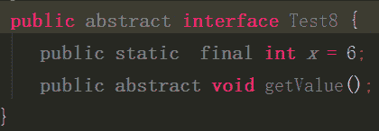
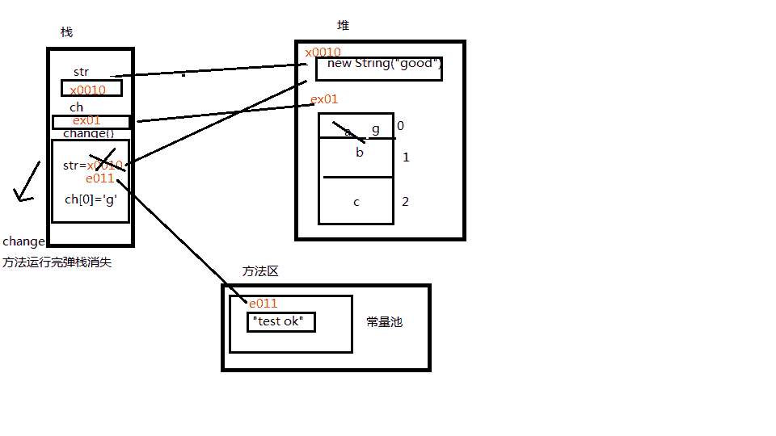

# 科陆集团 2017 秋招 java 工程师试卷

## 1

在 java 中 , 一个类（）

正确答案: B   你的答案: 空 (错误)

```cpp
可以继承多个类
```

```cpp
可以实现多个接口
```

```cpp
在一个程序中只能有一个子类
```

```cpp
只能实现一个接口
```

本题知识点

Java Java 工程师 科陆集团 2017

讨论

[孙校川](https://www.nowcoder.com/profile/2208498)

一个爹，多个儿子。

发表于 2018-05-02 21:25:51

* * *

[暗夜行路](https://www.nowcoder.com/profile/2459844)

B Java 单继承，多实现：一个类可以同时实现多个接口，但是只能继承自一个类，但它可以被多个类继承，也就是说一个类只有一个直接父类，但是可以有多个子类

发表于 2017-01-06 19:27:46

* * *

[~小纸条~](https://www.nowcoder.com/profile/9210301)

B  java 中的类是单继承 ，多实现。

发表于 2017-12-08 16:52:29

* * *

## 2

以下的 c# 代码段：

```cpp
Public struct Person{
 String Name;
 Int Age;
}
Public  static void Main()
{
 Hashtable A;
 Person B;
 // 其他处理代码
}
```

以下说法正确的是（）

正确答案: A   你的答案: 空 (错误)

```cpp
A 为引用类型的变量，B 为值类型的变量
```

```cpp
A 为值类型的变量 ，B 为引用类型的变量
```

```cpp
A 和 B 都是值类型的变量
```

```cpp
A 和 B 都是引用类型的变量
```

本题知识点

C# Java 工程师 科陆集团 2017

讨论

[VicQ](https://www.nowcoder.com/profile/3639020)

在 C# 中，结构是值类型数据结构。它使得一个单一变量可以存储各种数据类型的相关数据。 **struct**  关键字用于创建结构。 为了定义一个结构，必须使用 struct 语句。struct 语句为程序定义了一个带有多个成员的新的数据类型。 例如，声明 Book 结构：struct Books

```cpp
{  public  string title;  public  string author;  public  string subject;  public  int book_id;  };  
```

发表于 2017-04-19 15:20:05

* * *

[罗年生](https://www.nowcoder.com/profile/991744802)

值类型：基本数据类型，枚举类型，结构类型

发表于 2020-02-25 23:08:57

* * *

[牛客 4902522 号](https://www.nowcoder.com/profile/4902522)

struct 为值类型

发表于 2017-05-24 10:58:49

* * *

## 3

以下关于 ref 和 out 描述哪些项是正确的？（）

正确答案: A C D   你的答案: 空 (错误)

```cpp
使用 ref 参数，传递到 ref 参数的参数必须是最先初始化
```

```cpp
使用 out 参数，传递到 out 参数的参数必须最先初始化
```

```cpp
使用 ref 参数，必须将参数作为 ref 参数显式传递到方法
```

```cpp
使用 out 参数，必须将参数作为 out 参数显示传递到方法
```

本题知识点

C# Java 工程师 科陆集团 2017

讨论

[HorBipper](https://www.nowcoder.com/profile/6996337)

```cpp
out、ref 都是引用传递，传递后使用都会改变原有的值，引用传递都需要显示传递到方法。
ref 是有进有出，即能将参数传进去，函数里对变量的改变在函数结束时会改变值，因此需要在传递进去前初始化。
out 是只出不进，即将参数传进去时值是无效的，out 会把参数清空，所以无法将一个值从 out 传递进去。

```

发表于 2017-01-08 21:54:35

* * *

[LauZyHou](https://www.nowcoder.com/profile/8203811)

out 在方法内部做了分配地址的操作，然后把地址赋给外部的变量，所以原来的值用不上，一定被盖掉，所以可以传没初始化的。ref 直接传递外部地址进方法，也就是上面有人说的有进有出了，因为原来的值一定会用上，所以需要传初始化了的。

发表于 2020-07-16 09:24:35

* * *

[啥问题找我](https://www.nowcoder.com/profile/5497577)

out 和 ref 的差别是, ref 的变量初始化了, out 的变量不需初始化

发表于 2018-05-24 10:43:09

* * *

## 4

在 java 当中，下列关于数组的说法错误的有（）

正确答案: B C D   你的答案: 空 (错误)

```cpp
数组是一种对象
```

```cpp
数组属于一种原生类
```

```cpp
int number=[]={31,23,33,43,35,63}
```

```cpp
数组的大小可以任意改变
```

本题知识点

数组 Java 工程师 科陆集团 2017

讨论

[武汉孙一峰](https://www.nowcoder.com/profile/6638059)

答案：BCDa、数组是  查看全部)

编辑于 2017-01-09 19:58:08

* * *

[枫桥林葉](https://www.nowcoder.com/profile/7962143)

原生类有 8 种， int double boolean float byte short long char

发表于 2017-03-06 14:28:30

* * *

[胖三斤 66](https://www.nowcoder.com/profile/2847966)

就对 A 选项进行解释，对象是某类事物中具体的一个实例，是在内存中一块内存块，存放在一些数据。对象可以封装数据，可以访问属性，也可以调用方法。在 java 中

```cpp
		int[] a = new int[4];
		//a.length;  //对属性的引用不能当成语句
		int len = a.length;  //数组中保存一个字段, 表示数组的长度

		//以下方法说明数组可以调用方法,java 中的数组是对象.这些方法是 Object 中的方法,所以可以肯定,数组的最顶层父类也是 Object
		a.clone();
		a.toString(); 
```

而在 C++中，数组虽然封装了数据，但数组名只是一个指针，指向数组中的首个元素，既没有属性，也没有方法可以调用。

发表于 2017-02-01 12:14:35

* * *

## 5

java 接口的修饰符可以为（）

正确答案: D   你的答案: 空 (错误)

```cpp
private
```

```cpp
protected
```

```cpp
final
```

```cpp
abstract
```

本题知识点

Java Java 工程师 科陆集团 2017

讨论

[focusOn](https://www.nowcoder.com/profile/5314570)

答案为 D 接口是通用的  查看全部)

编辑于 2017-01-09 20:03:57

* * *

[Z4Knight](https://www.nowcoder.com/profile/4914197)

记住就行 **接口** 只能用 **public** 和 **abstract** 修饰。**only public & abstract are permitted** 。**内部接口** **only public, protected, private, abstract & static are permitted**

编辑于 2017-07-24 20:28:31

* * *

[朱大葱](https://www.nowcoder.com/profile/1957281)


上图即为 IDE 下定义接口的形式，灰色部分代表默认修饰符，不写的话，默认为以上修饰符。如果用户添加这些修饰符，IDE 会提醒重复定义。所以在定义接口时，只要记住三点:1.接口必须为 public abstract，因为接口是高度抽象的类，它的存在就是被其他类实现。2.接口中声明的变量必须为 public static final。3.接口中定义的方法必须为 public abstract，且没有方法体。

编辑于 2017-07-27 08:57:54

* * *

## 6

0.6332 的数据类型是（）

正确答案: B   你的答案: 空 (错误)

```cpp
flaot
```

```cpp
double
```

```cpp
Float
```

```cpp
Double
```

本题知识点

编程基础 *Java 工程师 科陆集团 2017* *讨论

[vino8](https://www.nowcoder.com/profile/8342682)

B 小数的默认存储类型是 double

发表于 2017-01-11 15:56:24

* * *

[ZZZZ661](https://www.nowcoder.com/profile/3120927)

一般情况整数默认为 int,小数默认为 double

发表于 2018-03-12 13:10:40

* * *

[胡子就不刮](https://www.nowcoder.com/profile/5762366)

BC 和 D 是基本类型的包装类，排除。A 是四个字节，B 是八个字节，题目中有 5 个数字和 1 个标点应该占 6 个字节

发表于 2017-01-11 09:22:27

* * *

## 7

指出下列程序运行的结果（）

```cpp
public class Example{
    String str = new String("good");
    char[ ] ch = { 'a' , 'b' , 'c' };
    public static void main(String args[]){
        Example ex = new Example();
        ex.change(ex.str,ex.ch);
        System.out.print(ex.str + " and ");
        System.out.print(ex.ch);
    }
    public void change(String str,char ch[ ]){
        str = "test ok";
        ch[0] = 'g';
    }
}
```

正确答案: B   你的答案: 空 (错误)

```cpp
good and  abc
```

```cpp
good and gbc
```

```cpp
test ok and abc
```

```cpp
test ok and gbc
```

本题知识点

Java

讨论

[清风随我心](https://www.nowcoder.com/profile/7172803)

**简单总结一下：****直接赋值而不是使用 new 关键字给字符串初始化，在编译时就将 String 对象放进字符串常量池中；使用 new 关键字初始化字符串时，是在堆栈区存放变量名和内容；****字符串的拼接操作在程序运行时，才在堆中创建对象。一般，可以认为****使用****"****=="比较的是引用，equals 比较的是内容****。**对于上面的题，看完下面的几个例子，你就会有所感悟：String str = new  String("good");是在编译时在堆栈中创建对象和分配内容，而在传参的时候，传递的是地址，把外面的 str 引用地址复制了一份给方法内的 str 而不是里面的内容。看例子：；例子 A：
String str1 = "java";
String str2 = "java";
System.out.print(str1==str2);
大部分人也许认为会输出 false，因为**==比较的是引用，equals 比较的是内容**。可以在自己的机子上运行一 下，结果是 true！原因很简单，**String 对象被放进常量池里了，再次出现“java”字符串的时候，JVM 很兴奋地把 str2 的引用也指向了 “java”对象**，它认为自己**节省了内存开销**。不难理解吧 呵呵
例子 B：
String str1 = new String("java");
String str2 = new String("java");
System.out.print(str1==str2);
看过上例的都学聪明了，这次肯定会输出 true！很不幸，JVM 并没有这么做，结果是 false。原因很简单，例子 A 中**那种直接赋值（而没有通过 new 关键字实例化的字符串变量）声明的方式确实是在 String 常量池创建“java”对象，但是一旦看到 new 关键字，JVM 会在堆中为 String 分配空间。**两者声明方式貌合神离，这也是我把“如何创 建字符串对象”放到后面来讲的原因。大家要沉住气，还有一个例子。
例子 C：
String str1 = "java";            //直接赋值而不是使用 new 关键字给字符串初始化，在编译时就将 String 对象放进字符串常量池中
String str2 = "blog"; //直接赋值而不是使用 new 关键字给字符串初始化，在编译时就将 String 对象放进字符串常量池中
String s = str1+str2;            //字符串的拼接操作在程序运行时，才在堆中创建对象，
System.out.print(s=="javablog");
再看这个例子，很多同志不敢妄言是 true 还是 false 了吧。爱玩脑筋急转弯的人会说是 false 吧……恭喜你，你会抢答了！把那个“吧”字去掉你就完 全正确。原因很简单，**JVM 确实会对型如 String str1 = "java"; 的 String 对象放在字符串常量池里，但是它是在编译时刻那么做的，而 String s = str1+str2; 是在运行时刻才能知道（我们当然一眼就看穿了，可是 Java 必须在运行时才知道的，人脑和电脑的结构不同），也就是说 str1+str2 是在堆里创建的， s 引用当然不可能指向字符串常量池里的对象。**没崩溃的人继续看例子 D。
例子 D：
String s1 = "java";
String s2 = new String("java");
System.out.print(s1.intern()==s2.intern());
intern()是什么东东？反正结果是 true。如果没用过这个方法，而且训练有素的程序员会去看 JDK 文档了。简单点说就是**用 intern()方法就可以用“==”比较字符串的内容了。在我看到 intern()方法到底有什么用之前，我认为它太多余了。其实我写的这一条也很多余，intern()方法 还存在诸多的问题，如效率、实现上的不统一……**
例子 E：
String str1 = "java";
String str2 = new String("java");
System.out.print(str1.equals(str2));
**无论在常量池还是堆中的对象，用 equals()方法比较的就是内容**，就这么简单！

以上内容引用自:[`hi.baidu.com/dairywg/blog/item/495f81b11885fa500823027f.html`](http://hi.baidu.com/dairywg/blog/item/495f81b11885fa500823027f.html)

编辑于 2018-04-02 18:12:41

* * *

[NullPnt](https://www.nowcoder.com/profile/7146820)



发表于 2017-09-28 10:02:39

* * *

[四月是木鱼的满分作文](https://www.nowcoder.com/profile/5026655)

首先说下 String 确实是个不可变对象，这个不可变是 JDK 特有的，写 JAVA 的人特意针对的但是这与本题无关，题目中的形参 str 只是原引用 ex.str 的一个引用副本，传的是一个副本地址值，这个值与 ex.str 地址值是不一样的,但是它们同时指向了堆中的对象 new String("good")，当你在函数中改变形参也就是地址的副本值也就是这句 str="test ok"只是将副本地址指向常量"test ok"，并没有改变原 ex.str 的指向方向，它还是指向对象 new String("good")的 char 数组与 String 一样传的也是地址的副本，但是关键是形参 ch 它没有新的指向 ch[0]只是 ch 在指向原对象时改变了对象的内部结构, 所以在 ex.ch 指向与它是同一个对象的情况下当然也会随之变化

编辑于 2021-09-16 11:06:44

* * *

## 8

创建线程有哪些方式？

你的答案

本题知识点

Java Java 工程师 科陆集团 2017

讨论

[陈农村](https://www.nowcoder.com/profile/7336052)

继承 thread 类
实现 Runnable 接口
实现 Callable 接口

发表于 2017-08-07 22:34:45

* * *

[levine](https://www.nowcoder.com/profile/372089)

1\. 继承 Thread 类，重写 run()函数 2\. 实现 Runnable 接口，重写 run()函数 3\. 实现 Callable 接口，重写 call()函数

发表于 2017-04-07 15:21:38

* * *

[尤花厘](https://www.nowcoder.com/profile/919172724)

继承 Thread 类 实现 Runnable 接口 用 Excutor 线程池创建 实现 Callable 接口

发表于 2019-03-04 10:57:42

* * *

## 9

在 c 语言中，若要定义一个只允许本源文件所有函数使用的全局变量，则该变量应该加关键字 1 修饰。

你的答案 (错误)

1 参考答案 (1) static

本题知识点

C++ Java 工程师 科陆集团 2017

讨论

[牛客 42846359 号](https://www.nowcoder.com/profile/42846359)

static

发表于 2022-03-03 16:02:23

* * *

[快说我这信号好](https://www.nowcoder.com/profile/8528154)

static

发表于 2017-08-06 00:15:19

* * *

## 10

在 c++ 的语法中有友元函数 friend （一个类的成员函数可以作为另一个类的友元，前者可以访问后者对象的私有成员）。但后期的高级语言 java 和 c# 却没有这方面的语法支持，为什么要去掉友元函数，谈谈你的理解 。

你的答案

本题知识点

C++ C# Java Java 工程师 科陆集团 2017

讨论

[闪电⚡晨晨](https://www.nowcoder.com/profile/1804475)

由于友元函数可以访问本类的私有成员，这大大破坏了类的封装特性（即外界不能直接访问类的私有成员）。而且完全可以将友元函数至于本类的 public 成员中，降低编程的复杂性。

发表于 2017-02-05 22:40:44

* * *

[Karson](https://www.nowcoder.com/profile/4636323)

也可以通过设置一个公开方法来调用，像单例模式那样

发表于 2017-08-05 00:24:24

* * *

## 11

请填写 BOOL,float ，指针变量与 ” 零值 ” 比较的 if 语句。

提示：这里 ” 零值 ” 可以是 0,0,0 ， FALSE 或者 ” 空指针 ” 。例如 int 变量 n 与 ” 零值 ” 比较的 if 语句为： if(n==0)

If(n!=0)

以此类推。

请写出 BOOL flag 与 ” 零值 ” 比较的 if 语句：

你的答案

本题知识点

编程基础 *C++ Java 工程师 科陆集团 2017* *讨论

[华中第一狠人程德彪](https://www.nowcoder.com/profile/616662)

**C 语言不通类型和 0 值比较总结****1.对于 bool 型变量**

对于 bool 型变量来说，它的逻辑值只有两种，TRUE 和 FALSE。C 语言中将非零值定义为了 TRUE，0 定义为 FALSE。

但是对于有些编译器来讲，TURE 有可能等于 1，也可能等于-1。

因此，显然 if(Bool == 1)或者 if(Bool == TRUE)这样的形式都不太好

应该选择**if(BOOL)**的形式来判断 bool 型变量。

**2.对于浮点型（float）变量**

因为对于浮点型变量都是有精度限制的，所以**不能够用==来判断两个浮点型变量是否相等**。

比较普遍的做法是，判断的两个变量做差，然后和精度相比较

eg. **if(val1 <= EPSINON && val1 >= -EPSINON)**，其中，EPSINON 为判断的精度

**3.指针变量**

对于指针变量，零值（即空指针）在编译器中一般都会被定义为 NULL。

因此判断指针变量是否为空，一般的写法是**if(NULL == P)**

把 NULL 放在前面的目的是防止出现 p = NULL 赋值的情况。

编辑于 2017-01-26 14:25:49

* * *

[xiaoguang](https://www.nowcoder.com/profile/752985)

if(flag==true)if(flag)都可

发表于 2017-01-24 11:10:40

* * ***