# 凤凰网 2017 秋招研发工程师练习试卷

## 1

下列类定义代码，当用来声明对象 car，并用 Car car=new Car();实例化后，可以通过 car 对象直接赋值的字段是（）

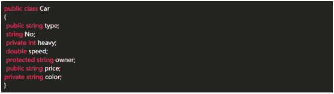

正确答案: B   你的答案: 空 (错误)

```cpp
type,No
```

```cpp
type,price
```

```cpp
heavy,owner
```

```cpp
type,owner,price
```

本题知识点

Java

讨论

[人间过客，月下会客](https://www.nowcoder.com/profile/55607102)

这题目就不严谨，题目说:可以通过 car 对象给变量赋值，还考虑个锤子的控制符作用域。我认为 public，protect，default 都可以。除了 prive 因为不是在本类中。垃圾题目。

发表于 2021-11-03 09:43:28

* * *

[songtzh](https://www.nowcoder.com/profile/267991864)

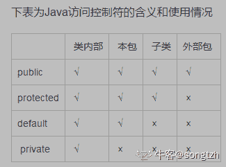

发表于 2020-10-20 17:14:54

* * *

[iProg](https://www.nowcoder.com/profile/161145)

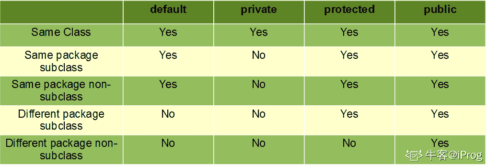

编辑于 2020-08-21 14:30:19

* * *

## 2

假定一个类的构造函数为 A(int aa,int bb) {a=aa--;b=a*bb;},则执行 A×(4,5);语句后，x.a 和 x.b 的值分别为（）

正确答案: D   你的答案: 空 (错误)

```cpp
3 和 15
```

```cpp
20 和 5
```

```cpp
5 和 4
```

```cpp
4 和 20
```

本题知识点

C++ 编程基础 *讨论

[这个好玩吗？](https://www.nowcoder.com/profile/864589)

D，注意将 aa 赋值给 a 后，aa--，此时 a 还是 4

发表于 2017-02-22 11:21:05

* * *

[阿黄啦啦](https://www.nowcoder.com/profile/3607617)

这个题目大意了，没看清楚，，，，小心驶得万年船啊

发表于 2017-06-19 11:29:05

* * *

[丨太阳与月亮丨](https://www.nowcoder.com/profile/9415270)

D 由于--在后，首先执行 a=aa，这时 a=4，然后执行 aa--，这时 aa 变成 3 然后 b=a*bb=4*5=20

发表于 2017-03-19 20:05:23

* * *

## 3

Redhat9 所支持的安装方式有（）

正确答案: A C D   你的答案: 空 (错误)

```cpp
从本地硬盘驱动器进行安装
```

```cpp
通过 Telnet 进行网络安装
```

```cpp
通过 NFS 进行网络安装
```

```cpp
通过 HTTP 进行网络安装
```

本题知识点

Linux

讨论

[Richardliu007](https://www.nowcoder.com/profile/1182836)

ACD，其中 NFS 和 HTTP 适合于大量安装服务器，结合 kickstart 使用

发表于 2017-01-24 10:32:30

* * *

[ceeeeeeeeeeeb](https://www.nowcoder.com/profile/542410100)

**没用过红帽好伐，所以百度鸟解了一哈🤣** 从安装启动方式可以分为:软盘启动 光盘启动 [U 盘启动](https://www.baidu.com/s?wd=U%E7%9B%98%E5%90%AF%E5%8A%A8&tn=SE_PcZhidaonwhc_ngpagmjz&rsv_dl=gh_pc_zhidao)(红帽 9 还支持制作安装启动软盘的,只是软盘现在基本见不到了)从软件安装来源可以分为:光盘、硬盘、nfs 服务器、[ftp 服务器](https://www.baidu.com/s?wd=ftp%E6%9C%8D%E5%8A%A1%E5%99%A8&tn=SE_PcZhidaonwhc_ngpagmjz&rsv_dl=gh_pc_zhidao)、http 服务器
最简单的方式就是光盘引导，光盘安装。
其他安装方式还有 KickStart 无人值守安装等。

发表于 2019-06-12 10:21:20

* * *

[走位崴了脚](https://www.nowcoder.com/profile/4695029)

NFS(Network File System):网络文件系统

发表于 2018-07-18 07:03:01

* * *

## 4

以下代码定义了一个变量，如何输出这个变量的值？


正确答案: A C D   你的答案: 空 (错误)

```cpp
A.<% String myBean = (String)pageContext.getAttribute(“stringBean”,PageContext.PAGE_SCOPE);
%>
<%=myBean%>
```

```cpp
<bean:write name=“helloworld”/>
```

```cpp
<bean:write name=“stringBean”/>
```

```cpp
<%=stringBean%>
```

本题知识点

Java

讨论

[祖传地沟油](https://www.nowcoder.com/profile/6890164)

**---------------看完秒懂---------------------------**

*   A 选项：
    *   通过 pageContext（PageContext 类的实例，提供对 JSP 页面所有对象以及命名空间的访问） 获取 stringBean 的值，赋给 String 类型的变量 myBean，然后通过 Jsp 表达式 处理该值。
*   bean:define
    *   题目中的 Struts 的 bean:define 标签定义了一个字符串变量 stringBean ,它的值为 helloworld。
*   bean:write
    *   bean:write 相当于 <%=request.getAttribute("something")%> 其中 something 是属性的名字。所以 B 错，C 对。
*   D 选项：
    *   通过 Jsp 表达式 获取变量 stringBean 的值

发表于 2017-08-04 13:30:11

* * *

[牛客 5301536 号](https://www.nowcoder.com/profile/5301536)

刚刚才做过一题 D 也是对的，现在就不对了？？？

发表于 2017-02-21 15:45:25

* * *

[牛客 81252365 号](https://www.nowcoder.com/profile/81252365)

靠这个意义在哪里？

发表于 2020-12-08 08:38:41

* * *

## 5

现有一手推车类程序（cart.inc）其中包含有一添加物品的方法（add_item）,下面哪个选项可以正确使用方法 add_item。（）

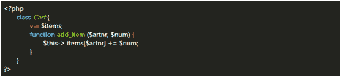

正确答案: A B C   你的答案: 空 (错误)

```cpp
<?php
      include(“cart.inc”);
      $cart=new Cart();
      $cart->add_item(“10”,1);
  ?>
```

```cpp
<?php
      require(“cart.inc”);
      $cart=new Cart();
      $cart->add_item(“10”,1);
  ?>
```

```cpp
<?php
      require(“cart.inc”);
      $cart=new Cart;
      $cart->add_item(“10”,1);
  ?>
```

```cpp
<?php
      require(“cart.inc”);
      $cart=new Cart
      $cart->add_item(“10”,1)
  ?>
```

本题知识点

PHP

讨论

[牛客 1694151 号](https://www.nowcoder.com/profile/1694151)

亲们，你们仔细点，abc 都是可以的，include 和 require 都可以，类名后面那个小括号可以带也可以不带。OK

发表于 2017-02-21 08:50:14

* * *

[IKaxio](https://www.nowcoder.com/profile/60291450)

这道题是在考验我的眼力

发表于 2019-07-04 12:30:15

* * *

[Atao1](https://www.nowcoder.com/profile/5090611)

Ab ； c 实例化错误 D 运行报错 缺少符号

发表于 2017-02-09 20:58:03

* * *

## 6

如果您想列出当前目录以及子目录下所有扩展名为“.txt”的文件，那么您可以使用的命令是（）

正确答案: C   你的答案: 空 (错误)

```cpp
ls -d.txt
```

```cpp
ls *.txt
```

```cpp
find -name“*.txt”
```

```cpp
find“.txt”
```

本题知识点

Linux

讨论

[Smart_Maggie](https://www.nowcoder.com/profile/8653996)

在当前目录及子目录下查找所有以 file 开头的文件名。
find . -name 'file*'. 可以省略不写

发表于 2019-05-29 11:51:45

* * *

[牛客-120 抢救中心](https://www.nowcoder.com/profile/6165623)

ls 列出当前目录或者指定目录的列表

发表于 2018-07-30 15:13:02

* * *

[VagrantYang](https://www.nowcoder.com/profile/6863719)

find 若没有指定路径时，默认为. 即在当前目录

发表于 2018-01-31 22:38:15

* * *

## 7

下列哪种情况可以终止当前线程的运行？

正确答案: D   你的答案: 空 (错误)

```cpp
当一个优先级高的线程进入就绪状态时
```

```cpp
当该线程调用 sleep()方法时
```

```cpp
当创建一个新线程时
```

```cpp
抛出一个异常时
```

本题知识点

Java

讨论

[Rober_Lin](https://www.nowcoder.com/profile/647694)

答案：D 优先级高的并不  查看全部)

编辑于 2017-03-19 20:09:26

* * *

[柚子皮 Uzipi](https://www.nowcoder.com/profile/5056050)

要想答对这道题，要区分“终止” 和 “阻塞”：

*   终止：这个线程不会在进入“就绪态”，宣告死亡，即“死亡状态”。
*   阻塞：进入阻塞态的线程还可以再进入“就绪态”，等待下一次 CPU 时间。

然后是对线程的 5 个状态的理解：1\. 新建，刚刚新建的线程，还未进入就绪队列 2\. 就绪，进入就绪队列的线程拥有了获得 CPU 时间的机会，但不是一定会马上执行，与线程调度有关。3\. 运行，获得了 CPU 时间，正在被执行的线程。4\. 阻塞，进入阻塞状态的线程只是暂时失去了 CPU 时间，该类线程没有结束，“阻塞态”的线程只能进入到“就绪态”。5\. 死亡，死亡的线程即彻底结束了。下面总结下使一个线程进入阻塞状态的方法：1\. sleep() / suspend()2\. 发生 IO 阻塞 3\. 等待同步锁 4\. 等待通知解除一个线程的阻塞状态，使之进入就绪态的方法：1\. sleep() 指定的睡眠时间到了 2\. IO 阻塞解除 3\. 获得同步锁 4\. 收到通知 5\. 调用了 suspend() 的线程阻塞后，再调用 resume() 解除阻塞

发表于 2018-02-24 14:22:51

* * *

[牛客 9000057 号](https://www.nowcoder.com/profile/9000057)

这个问题有点坑  可以终止  太含糊了

发表于 2016-12-14 13:36:46

* * *

## 8

若 k 是 int 型变量，且有下面的程序段：

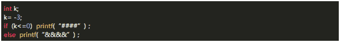

上面程序段的输出结果是（）

正确答案: D   你的答案: 空 (错误)

```cpp
&&&&
```

```cpp
####&&&&
```

```cpp
有语法错误，无输出结果
```

```cpp
####
```

本题知识点

C++ 编程基础 *讨论

[Littleluck](https://www.nowcoder.com/profile/4838891)

看这么简单的题目，习惯性的想了好久，有没有坑

发表于 2017-01-04 17:43:04

* * *

[麦克斯韦妖薛定谔的猫](https://www.nowcoder.com/profile/7251219)

k 是 int，-3 就是小于 0，没问题。
如果 k 的类型是 unsigned int，k 的实际值大于 0，那答案就是 &&&& 了。

发表于 2018-05-17 13:57:49

* * *

[hestyle](https://www.nowcoder.com/profile/126329220)

写这题我想的老半天，以为有 printf(“%%”)这种坑，看了好几遍没有，又检查 else 有没有 if 配对，检查没毛病，又 TM 检查分号是不是写多或写少，竟然一个毛病都没有😑

发表于 2018-06-26 11:18:28

* * *

## 9

将光盘/dev/hdc 卸载的命令是（）

正确答案: D   你的答案: 空 (错误)

```cpp
unmount/dev/hdc
```

```cpp
umount/mnt/cdrom/dev/hdc
```

```cpp
unmount/mnt/cdrom/dev/hdc
```

```cpp
umount/dev/hdc
```

本题知识点

Linux

讨论

[觉醒之力](https://www.nowcoder.com/profile/184838)

linux 的硬件设备在 /

  查看全部)

编辑于 2017-03-18 09:58:53

* * *

[没没、](https://www.nowcoder.com/profile/9253752)

挂载设备使用 mount，卸载设备使用 umount 有三种方式 1.通过设备名 2\. 挂载点 3\. 设备名和挂载点 A C 命令错误 B 不仔细看会看成第三种方式 但是设备名和挂载点是区分开来的应该是 umount/mnt/cdrom /dev/hdc 所以选 D

编辑于 2017-04-28 14:52:08

* * *

[album](https://www.nowcoder.com/profile/3572443)

卸载设备有三中方式

*   根据设备名，存在于 /dev 目录下
*   根据挂载点，一般存在与 /mnt 目录下
*   根据设备名和挂载点，两个都写，但是实际测试下，代表先卸载第一个设备（可能是设备名，也可能是挂载点），在卸载第二个设备（可能是设备码，也可能是挂载点），如果两个代表的是同一个设备，那么就会显示第二个设备没有挂载，所以此时可以卸载，但是第二个参数多余

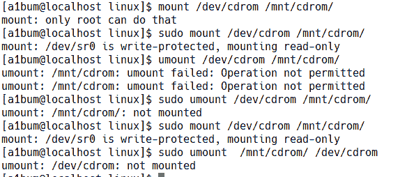

发表于 2018-06-05 21:47:16

* * *

## 10

在下面的 C#类声明中，属于私有字段的是（）

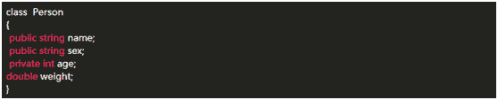

正确答案: D   你的答案: 空 (错误)

```cpp
weight
```

```cpp
name sex
```

```cpp
age
```

```cpp
age weight
```

本题知识点

编程基础 *C#* *讨论

[潘洛斯上的手](https://www.nowcoder.com/profile/6284814)

定义字段，默认是私有

发表于 2017-02-03 23:54:21

* * *

[cndongse](https://www.nowcoder.com/profile/3186874)

构造函数默认修饰符为 public，析构函数不能使用修饰符且默认为 private，成员变量默认修饰符为 private

发表于 2017-02-09 11:29:52

* * *

[被遗忘者灬](https://www.nowcoder.com/profile/4063292)

类或结构的默认访问类型是 internal.

类中所有的成员，默认均为 private。

发表于 2017-07-21 11:29:03

* * *

## 11

以下代码执行结果是（）

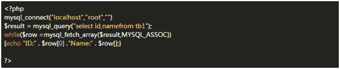

正确答案: C   你的答案: 空 (错误)

```cpp
循环换行打印全部记录
```

```cpp
只打印第一条记录
```

```cpp
报错
```

```cpp
无任何结果
```

本题知识点

编程基础 *PHP* *讨论

[默默的学习](https://www.nowcoder.com/profile/330910)

  查看全部)

编辑于 2017-02-13 11:02:42

* * *

[zzliux](https://www.nowcoder.com/profile/379023)

首先，给的题目是没有选择数据库的，毫无疑问答案是 C，但是如果选择了数据库，然后表没有问题的话，是 A，可以全部输出的，在使用 fetch 的时候是逐条取数据的，还有一点，在 5.3 版本已提示这个函数已废弃，不建议使用，在 PHP7 中已经完全取消了对该函数的支持

发表于 2017-02-28 18:48:02

* * *

[Coreα](https://www.nowcoder.com/profile/439100511)

C

发表于 2018-07-03 09:07:46

* * *

## 12

运行下面程序段，输出结果为（）


正确答案: B   你的答案: 空 (错误)

```cpp
3
```

```cpp
9
```

```cpp
7
```

```cpp
5
```

本题知识点

PHP

讨论

[=.XU.=](https://www.nowcoder.com/profile/9823704)

9

发表于 2016-12-05 15:54:55

* * *

[牛客 615850598 号](https://www.nowcoder.com/profile/615850598)

key is 3

发表于 2020-08-16 08:27:49

* * *

[Coreα](https://www.nowcoder.com/profile/439100511)

B

发表于 2018-07-03 09:08:26

* * *

## 13

假定所有变量均已正确定义，则下列程序段运行后 x 的值是（）

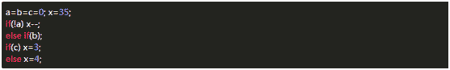

正确答案: C   你的答案: 空 (错误)

```cpp
35
```

```cpp
34
```

```cpp
4
```

```cpp
3
```

本题知识点

C++ 编程基础 *讨论

[鹿鹿鹿](https://www.nowcoder.com/profile/9700550)

```cpp
//主要考察 if 的作用域 if
```

  查看全部)

编辑于 2017-03-19 11:43:28

* * *

[大星星和小猩猩](https://www.nowcoder.com/profile/9374535)

我觉得这道题考的是眼力，因为 else if(b)；这句后面有一个分号！太坑了有木有啊！

发表于 2018-01-20 09:43:45

* * *

[汪文魁](https://www.nowcoder.com/profile/3306830)

if 能进入的条件是非零也就是值为 1 或者!0

发表于 2017-03-02 14:56:57

* * *

## 14

设有 C#语句如下，

```cpp
int a=5，b=4；
```

则下列表示条件的表达式中值为“假”的是（）

正确答案: A   你的答案: 空 (错误)

```cpp
a>0 && !(b>0)
```

```cpp
(b>=0) && (a<=b?A+b:a-b)>0
```

```cpp
(a>b) && (b>0 && a>0)
```

本题知识点

C#

讨论

[╭王家小西](https://www.nowcoder.com/profile/6595329)

&&属于“”与”算法，只有式子两边都对才是真，若有一个不对就是假。 答案 A 中 a>0 是对的，b>0 为 true.但是!(b>0)表示(b>0)==false 所以是错的。故为假 答案 B 中 b>=0 是对的，a<=b?a+b:a-b 表示 a<=b 若对则执行 a+b 若不对则执行 a-b，显然 5<=4 错的执行 a-b=1>0 所以真 答案 c 中格式都成立故也为真。

发表于 2017-02-03 19:15:46

* * *

## 15

下列程序的输出结果是（）

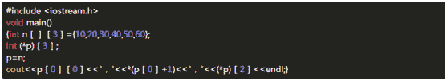

正确答案: C   你的答案: 空 (错误)

```cpp
10，30，60
```

```cpp
20，40，60
```

```cpp
10，20，30
```

```cpp
10，30，50
```

本题知识点

C++ 编程基础 *讨论

[WTRE_IOF](https://www.nowcoder.com/profile/8736418)

```cpp
int *p[4];        //表示指针数组，有四个元素，每个元素都是整型指针。
int (*p)[4];     //表示行指针，所指对象一行有四个元素。
int *p(void);  //表示函数，此函数无参，返回整型指针。
int(*P)(void) ;//表示函数指针，可以指向无参，且返回值为整型指针的函数。
```

发表于 2018-06-01 15:22:09

* * *

[丨太阳与月亮丨](https://www.nowcoder.com/profile/9415270)

Cn 是一个 2 行 3 列的数组，p 首先指向 n 的第一个元素 p[0][0]=n[0][0]=10p[0]为数组第一行首地址，p[0]+1 即为&p[0][1]，*(p[0]+1)即为 n[0][1]=20p 为二级指针，*p 为数组第一行首地址即为 p[0],(*p)[2]即为 p[0][2]=n[0][2]=30

发表于 2017-02-08 13:39:47

* * *

[Test112233445566](https://www.nowcoder.com/profile/407557)

n[][3] 会确定为 n[2][3] 结构，int(*p)[3] 其中 p 的含义是，就是指向一个含有 3 个元素的数组指针令 p=n,即 p=&n[0]

发表于 2016-12-09 22:16:29

* * *

## 16

在下面程序横线处填上适当字句，以使该程序执行结果为：

50 4 34 21 10

0 7.1 8.1 9.1 10.1 11.1

（多项填空填写格式：分号+空格或其他明显的分隔标识，区分开即可）

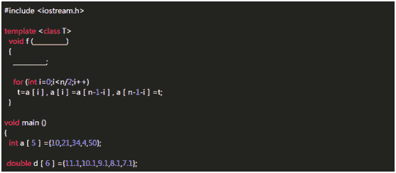

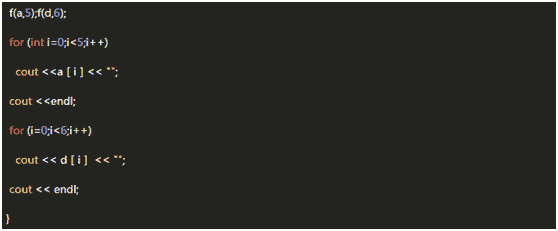

你的答案

本题知识点

C++

讨论

[Croyal](https://www.nowcoder.com/profile/160089)

答案：第一处：T a[],int n      第二处：T t 解题思路：f 函数的功能是使数组逆序，这里因为传递的数组类型不确定，所以使用类模版。

发表于 2017-01-23 15:59:07

* * *

## 17

在下面程序的底画线处填上适当的字句，使该程序执行结果为 40 （多项填空填写格式：分号 + 空格或其他明显的分隔标识，区分开即可）

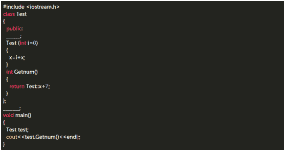

你的答案

本题知识点

C++

讨论

[Croyal](https://www.nowcoder.com/profile/160089)

答案：static int x，int Test::x=33 解题思路：从成员函数访问方式类名::成员可知是 static int。因为结果是 40，且在类外进行初始化，所以 int Test::x=33。

发表于 2017-01-23 17:44:52

* * *

## 18

下面是一个三角形三边，输出其面积 C++程序，在下划线处填上正确的语句。 （多项填空填写格式：分号 + 空格或其他明显的分隔标识，区分开即可）

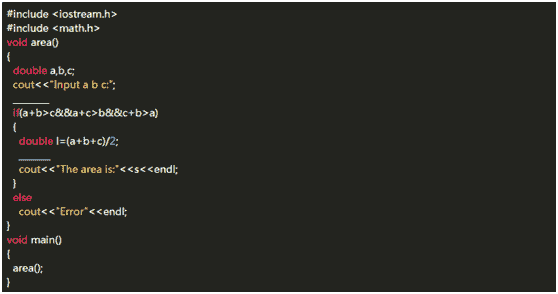

你的答案

本题知识点

C++

讨论

[jfyh5388](https://www.nowcoder.com/profile/3234361)

cin>>a>>b>>c; double s=sqrt(l*(l-a)*(l-b)*(l-c));

发表于 2017-01-25 11:43:27

* * *

[GGMU](https://www.nowcoder.com/profile/9636777)

 cin>>a>>b>>c;s=sqrt(l*(l-a)*(l-b)*(l-c));

发表于 2017-08-16 15:10:53

* * *

[沧海一粟智者一失](https://www.nowcoder.com/profile/8941010)

三角形求面积海伦公式 s=1/2 的周长*内切圆半径

发表于 2017-03-31 14:58:22

* * *

## 19

请设计一台能制作各种口味咖啡的自动售卖机的 app 应用，可以在附近点单，然后以 app 为凭证去机器取走咖啡。分析目标用户的常见使用场景，总结方案设计的要点。

你的答案

本题知识点

系统设计

讨论

[牛客 920560 号](https://www.nowcoder.com/profile/920560)

享受咖啡，缓解压力，享受工作每一刻——而咖啡深受上班一族的青睐，是上班人士调节生活、聚会、缓解工作压力等的首选饮品，咖啡自动售卖机或咖啡室更是大型公司不可或缺的服务，所以此次 app 的应用场景定位为大型公司的服务区域内；

**目标人群：**大型公司里的各阶级员工

**使用场景：**a 多种样式可综合比较选购或推荐；b 单人或多人如聚会、商讨项目等时预约选购；c 定时设置如提前提醒拿取咖啡；d 通过评价分享心得促进交流等

**设计要点：**a 多种花式咖啡查看选择；b 借鉴淘宝等常用购买平台设计方式符合人们的常规思维习惯；c app 应用与自售机交互方式采用常见的二维码形式；d 用户可根据需要预定咖啡以及分享推荐等

**题 2.方案**

**设计 app 的信息结构和主要流程界面，并阐述重要的设计细节和为什么这么做。请提交流程设计图、界面草图和简单说明来描述你的方案，充分、精确、简要为佳。** 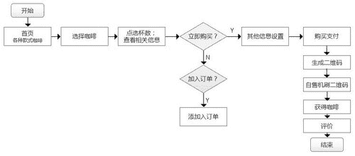


发表于 2017-02-15 17:29:10

* * *

[崔洪振 367](https://www.nowcoder.com/profile/606942)

设计各种口味咖啡的自动售卖机的 app 应用的简单流程如下图所示。每个模块直接在流程图中给出了简单描述。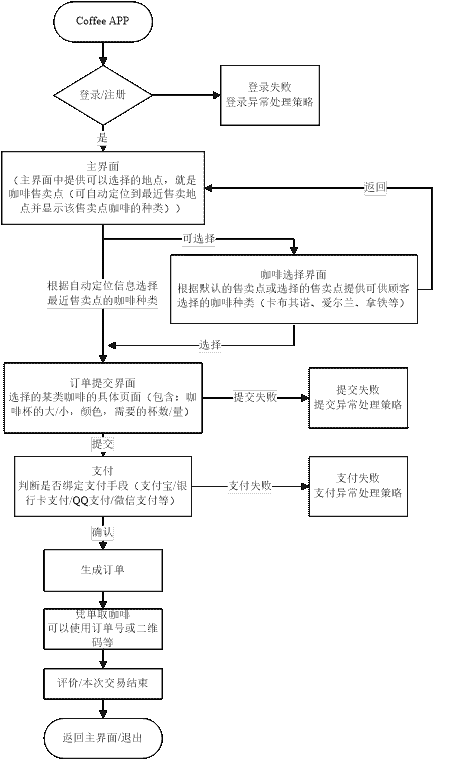 

编辑于 2017-02-15 20:50:30

* * *

## 20

设矩阵 A 存在可逆矩阵 P ，求出 P 及相应的对角矩阵（体验公式编辑器如何使用） 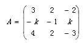

你的答案

本题知识点

高级结构

讨论

[丞相之炎](https://www.nowcoder.com/profile/9907886)

```cpp
publicMatrix inverseMatrix() {
```

|     if(!this.isSquareMatrix()) { |

|         System.out.println("不是方阵没有逆矩阵！"); |

|         returnnull; |

|     } |

|     // 先在右边加上一个单位矩阵。 |

|     Matrix tempM =this.appendUnitMatrix(); |

|     // 再进行初等变换，把左边部分变成单位矩阵 |

|     double[][] tempData = tempM.getMatrixData(); |

|     inttempRow = tempData.length; |

|     inttempCol = tempData[0].length; |

|     // 对角线上数字为 0 时，用于交换的行号 |

|     intline =0; |

|     // 对角线上数字的大小 |

|     doublebs =0; |

|     // 一个临时变量，用于交换数字时做中间结果用 |

|     doubleswap =0; |

|     for(inti =0; i < tempRow; i++) { |

|         // 将左边部分对角线上的数据等于 0，与其他行进行交换 |

|         if(tempData[i][i] ==0) { |

|             if(++line >= tempRow) { |

|                 System.out.println("此矩阵没有逆矩阵！"); |

|                 returnnull; |

|             } |

|   |

|             for(intj =0; j < tempCol; j++) { |

|                 swap = tempData[i][j]; |

|                 tempData[i][j] = tempData[line][j]; |

|                 tempData[line][j] = swap; |

|             } |

|   |

|             // 当前行（第 i 行）与第 line 行进行交换后，需要重新对第 i 行进行处理 |

|             // 因此，需要将行标 i 减 1，因为在 for 循环中会将 i 加 1。 |

|             i--; |

|             // 继续第 i 行处理，此时第 i 行的数据是原来第 line 行的数据。 |

|             continue; |

|         } |

|   |

|         // 将左边部分矩阵对角线上的数据变成 1.0 |

|         if(tempData[i][i] !=1) { |

|             bs = tempData[i][i]; |

|             for(intj = tempCol -1; j >=0; j--) { |

|                 tempData[i][j] /= bs; |

|             } |

|             // 将左边部分矩阵变成上对角矩阵， |

|             // 所谓上对角矩阵是矩阵的左下角元素全为 0 |

|             for(intiNow = i +1; iNow < tempRow; iNow++) { |

|                 for(intj = tempCol -1; j >= i; j--) { |

|                     tempData[iNow][j] -= tempData[i][j] * tempData[iNow][i]; |

|                 } |

|             } |

|         } |

|     } |

|   |

|     // 将左边部分矩阵从上对角矩阵变成单位矩阵，即将矩阵的右上角元素也变为 0 |

|     for(inti =0; i < tempRow -1; i++) { |

|         for(intiNow = i; iNow < tempRow -1; iNow++) { |

|             for(intj = tempCol -1; j >=0; j--) { |

|                 tempData[i][j] -= tempData[i][iNow +1] |

|                         * tempData[iNow +1][j]; |

|             } |

|         } |

|     } |

|   |

|     // 右边部分就是它的逆矩阵 |

|     Matrix c =null; |

|     intcRow = tempRow; |

|     intcColumn = tempCol /2; |

|     double[][] cData =newdouble[cRow][cColumn]; |

|     // 将右边部分的值赋给 cData |

|     for(inti =0; i < cRow; i++) { |

|         for(intj =0; j < cColumn; j++) { |

|             cData[i][j] = tempData[i][cColumn + j]; |

|         } |

|     } |

|     // 得到逆矩阵，返回 |

|     c =newMatrix(cData); |

|     returnc; |

}

发表于 2017-02-15 22:06:06

* * *

## 21

求数列的和

**题目描述：**

数列的定义如下：  数列的第一项为 n，以后各项为前一项的平方根，求数列的前 m 项的和。

**输入**

输入数据有多组，每组占一行，由两个整数 n（n<10000）和 m(m<1000)组成，n 和 m 的含义如前所述。

**输出**

对于每组输入数据，输出该数列的和，每个测试实例占一行，要求精度保留 2 位小数。

**样例输入**

81 4  2 2

**样例输出**

94.73  3.41

你的答案

本题知识点

Python C# Javascript Java C++

讨论

[林某人](https://www.nowcoder.com/profile/733425463)

```cpp
import sys

for line in sys.stdin:
    if len(line.split(' ')) == 2:
        data,numb = [i.strip() for i in line.split(' ')]
        if data.isdigit() and numb.isdigit():
            data,numb = int(data),int(numb)
        else:
            break
        if data < 0:
            break
        sum_b = []
        total = 0
        for i in range(numb):
            sum_b.append(data)
            data = data**0.5
        for x in sum_b:
            total += x
        total = '%.2f'%total
        sys.stdout.write(total)
    else:
        break
```

题目不难，主要是注意输入的特殊情况。

发表于 2019-09-10 13:45:55

* * *

[Zn 微凉](https://www.nowcoder.com/profile/6020390)

```cpp
public static void main(String[] args) {
        System.out.println(getSum(81,4));
    }
    private static double getSum(double n,int m){
        double sum=0;
        int count=0;
        while (true){
            if (count>=m){
                break;
            }
            sum+=n;
            n=Math.sqrt(n);
            count++;
        }
        return sum;
    }
```

结果：94.73205080756888

发表于 2019-09-08 15:32:29

* * *

[肚子不大的🆑](https://www.nowcoder.com/profile/1013841)

```cpp
def f(n,m):
    sum = 0
    for i in range(m):
         x = n**((0.5)**i)
         sum += x
    return "the result is %.2f" % sum

```

发表于 2018-06-05 20:50:03

* * *

## 22

【编程】

N 个人参加比赛，进行排名，每个名次都可以并列，总共有多少种排列方法。例如：ABC 个人参加比赛，比赛名次可以如下：1） A 第一名、B 第二名、C 第三名 2）AB 并列第一名，C 第二名，等等。总共有 13 种排列方法。**输入，例如**  2   //第一行为测试用例数目  1   //参加的人数 1  3   //参加的人数 3  **输出****(结果对 10000 取模)**  1  13

你的答案

本题知识点

Python C# Javascript Java C++

讨论

[⎝≧⏝⏝≦⎠|](https://www.nowcoder.com/profile/1326162)

排列组合题，输入 n，最后的结果为 A（n,1）+A（n,2）+...+A（n,n）

发表于 2017-08-05 16:25:21

* * *

[秒速 __ 五厘米](https://www.nowcoder.com/profile/301791)

排列组合 1 A（1，1） 2 A（2，2） 3 A（3，3）+C（3，1）*A（2，2）+A（1，1） 4 A（4，4）+C（4，2）*A（3，3） +C（4，1）*A（2，2）+A（1，1）

发表于 2017-08-07 16:22:32

* * *

[刘二毛](https://www.nowcoder.com/profile/5759933)

//动态规划 int fij(int i, int j){int res = 1;if (i == 0 || j == 0 || i > j) return 0;if (i == j){while (i > 1){res = i*res;i--;}return res;}res = i * fij(i, j - 1) + i * fij(i - 1, j - 1);return res;}int kindnums(int n){if (n == 0) return 0;if (n == 1) return 1;int times = n;int res = 0;int i = 1;while (i <= n){res = res + fij(i, n);if (res >= 10000) res = res % 10000;i++;}return res;}int main(){int len, tmp;cin >> len;vector<int> nums;for (int i = 0; i < len; i++){cin >> tmp;nums.push_back(tmp);}for (int i = 0; i < len; i++){tmp = nums[i];cout << kindnums(tmp) << endl;;}system("pause");}//////////////////////////////////////////////////////////////long long dp[10000][10000];long fact(int n){if (n == 0) return 0;long res = 1;while (n > 0){res = n * res;n--;}return res;}int solve(int n){if (n > 10000) return 0;for (int j = 1; j <= n; j++){for (int i = 1; i <= j; i++){if (i == 1) dp[i][j] = 1;else if (i == j) dp[i][j] = fact(i);else dp[i][j] = i*dp[i][j - 1] + i * dp[i - 1][j - 1];}}}int main(){int len, tmp;cin >> len;int res = 0;vector<int> nums;for (int i = 0; i < len; i++){cin >> tmp;nums.push_back(tmp);}for (int i = 0; i < len; i++){solve(nums[i]);int tmp = nums[i], n = nums[i];while (tmp > 0){res = res + dp[tmp--][n] % 10000;res = res % 10000;}cout << res << endl;}system("pause");return 0;}

编辑于 2017-08-06 11:24:22

* * *******