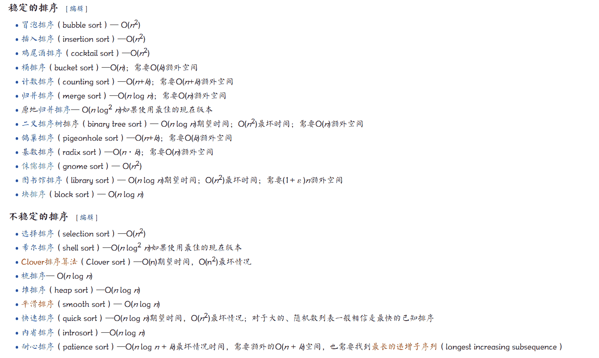
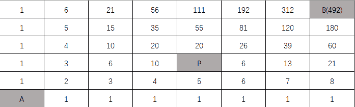
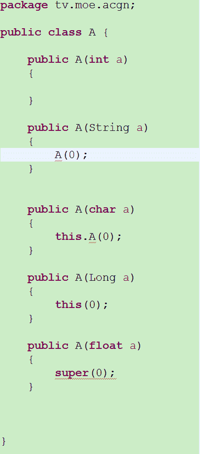
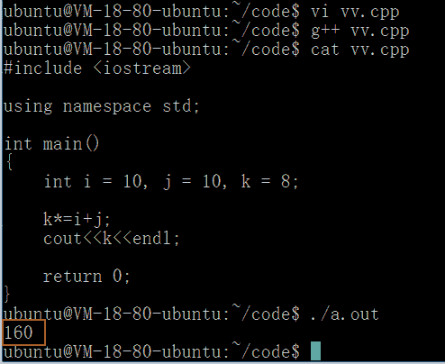
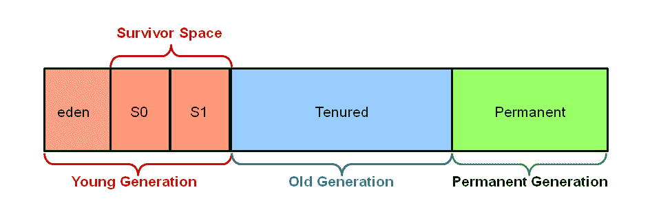

# 凤凰网 2017 秋招研发工程师笔试试卷

## 1

下列排序方法中，稳定的排序方法是（）

正确答案: A B E   你的答案: 空 (错误)

```cpp
直接插入排序
```

```cpp
归并排序
```

```cpp
希尔排序
```

```cpp
快速排序
```

```cpp
基数排序
```

本题知识点

排序 *讨论

[白杨树下繁花落尽](https://www.nowcoder.com/profile/1767727)



发表于 2017-08-08 13:33:54

* * *

[Howie_m](https://www.nowcoder.com/profile/891356743)

不稳定： 快（快速）些（shell 希尔）选（选择）队（堆）

发表于 2019-08-26 14:25:19

* * *

[丨太阳与月亮丨](https://www.nowcoder.com/profile/9415270)

ABE 排序稳定是指排序前后值相同的两个数前后位置不变，直接插入、冒泡、归并、基数排序是稳定的，其余是不稳定的

发表于 2017-02-22 11:42:04

* * *

## 2

在计算机网络中，下列叙述正确的是（）

正确答案: A C D   你的答案: 空 (错误)

```cpp
IP 电话使用的数据交换技术是分组交换
```

```cpp
在以太网中，是根据 IP 地址来区分不同的设备的
```

```cpp
中继器属于物理层设备
```

```cpp
IP 协议是无连接的，其信息传输方式是数据报
```

本题知识点

网络基础

讨论

[冷色探戈](https://www.nowcoder.com/profile/907563)

选 B1、IP 电话使用的数据交换技术是分组交换 2、在以太网中，是根据**MAC 地址**来区分不同的设备的 3、中继器属于物理层设备 4、IP 协议是无连接的，其信息传输方式是数据报

编辑于 2017-04-25 12:18:52

* * *

[D_Rider](https://www.nowcoder.com/profile/1821305)

以太网根据 mac 地址来区分不同设备，mac 地址是唯一的

发表于 2016-12-12 10:08:10

* * *

[上岸东南冲冲冲](https://www.nowcoder.com/profile/710563260)

都 ip 了还不分组交换

发表于 2020-11-29 19:22:53

* * *

## 3

有一个正整数序列 1,2,3，......，n 和一个最多能容纳 m 个数字的栈，数字按序列顺序进栈，但出栈顺序是随机的；例如，n=2，m=3，则出栈顺序可能是 1,2 或者 2,1；若 n=7，m=5 时，则出栈序列可能是下列的哪些选项（）

正确答案: B D   你的答案: 空 (错误)

```cpp
1，7，6，5，4，3，2
```

```cpp
1，2，3，4，5，6，7
```

```cpp
7，6，5，4，3，2，1
```

```cpp
5，6，4，3，7，2，1
```

本题知识点

栈 *讨论

[笑以](https://www.nowcoder.com/profile/1333690)

别忽略了栈的大小了！

发表于 2018-11-15 20:47:29

* * *

[侯卿](https://www.nowcoder.com/profile/8037781)

7 不能出现在前两个，6 不能出现在第一个。然后和之前的题判别一样。

编辑于 2018-01-15 14:01:01

* * *

[changan2018](https://www.nowcoder.com/profile/9119564)

答案错了吧，应该全选

发表于 2017-08-08 08:10:48

* * *

## 4

某大型晚会的导演组在对节目进行终审时，有六个节目尚未确定通过，这六个节目分别是歌曲 A、歌曲 B、相声 C、相声 D、舞蹈 E 和魔术 F。综合考虑各种因素，导演组确定了如下方案

（1） 歌曲 A 和歌曲 B 至少要上一个；

（2） 如果相声 C 不能通过或相声 D 不能通过，则歌曲 A 也不能通过；

（3） 如果相声 C 不能通过，那么魔术 F 也不能通过；

（4） 只有舞蹈 E 通过，歌曲 B 才能通过；

导演组最终确定舞蹈 E 不能通过；由此可以推出（）

正确答案: C   你的答案: 空 (错误)

```cpp
歌曲 B 能通过
```

```cpp
无法确定两个相声节目是否能通过
```

```cpp
无法确定魔术 F 是否能通过
```

```cpp
歌曲 A 不能通过
```

本题知识点

判断推理

讨论

[丨太阳与月亮丨](https://www.nowcoder.com/profile/9415270)

C 舞蹈 E 没有通过推出歌曲 B 没有通过以为歌曲必须上一个，推出歌曲 A 通过由 2 的逆否命题推出相声 CD 都通过只有 3 提到魔术 F，但相声 C 通过了，因此魔术无法确定

发表于 2017-01-31 16:36:08

* * *

[岛大仙](https://www.nowcoder.com/profile/615578819)

有一点疑惑，“如果相声 C 不能通过或相声 D 不能通过，则歌曲 A 也不能通过”这句话不能说明 A 通过，cd 就一定通过吧？

发表于 2020-03-04 10:34:13

* * *

[chensongchao](https://www.nowcoder.com/profile/8619562)

AorB NotA or (CandD) NotF or C NotB or E E=1=> B=0 => A=1 => C=1 D=1 得不出 F

发表于 2017-04-12 10:55:42

* * *

## 5

在计算机网络中，TCP 和 UDP 协议的相似之处是（）

正确答案: D   你的答案: 空 (错误)

```cpp
面向非连接的协议
```

```cpp
面向连接的协议
```

```cpp
其余选项都不对
```

```cpp
传输层协议
```

本题知识点

网络基础

讨论

[精分大师莫教授](https://www.nowcoder.com/profile/529993)

这不简直胡扯么。。。虽说都是传输层协议，这也不是相似点把。。

发表于 2017-08-11 21:12:42

* * *

[dragonlogin](https://www.nowcoder.com/profile/2071677)

传输层俩大协议，tcp 可靠的面向连接 udp 不可靠的非面向连接

发表于 2017-02-24 12:53:30

* * *

[丨太阳与月亮丨](https://www.nowcoder.com/profile/9415270)

D 都是传输层协议，但是 TCP 面向连接，UDP 面向非连接

发表于 2017-03-20 18:19:34

* * *

## 6

A、 B 文件中各存放 50 亿条 URL，每条 URL 占用 64 字节，在内存限制是 4G 的情况下，以下哪种方法能够找到 A、B 文件之间的重复 URL（）

正确答案: A   你的答案: 空 (错误)

```cpp
哈希表
```

```cpp
布隆过滤器
```

```cpp
字典树
```

```cpp
红黑树
```

本题知识点

海量数据

讨论

[Nickqiao](https://www.nowcoder.com/profile/5239043)

可以估计每个文件的大小为 5G*64=300G ，远大于 4G 。所以不可能将其完全加载到内存中处理。考虑采取分而治之的方法。  遍历文件 a ，对每个 url 求取 hash(url)%1000 ，然后根据所得值将 url 分别存储到 1000 个小文件（设为 a0,a1,...a999 ）当中。这样每个小文件的大小约为 300M 。遍历文件 b ，采取和 a 相同的方法将 url 分别存储到 1000 个小文件 (b0,b1....b999) 中。这样处理后，所有可能相同的 url 都在对应的小文件 (a0 vs b0, a1 vs b1....a999 vs b999) 当中，不对应的小文件（比如 a0 vs b99 ）不可能有相同的 url 。然后我们只要求出 1000 对小文件中相同的 url 即可。  比如对于 a0 vs b0 ，我们可以遍历 a0 ，将其中的 url 存储到 hash_map 当中。然后遍历 b0 ，如果 url 在 hash_map 中，则说明此 url 在 a 和 b 中同时存在，保存到文件中即可。  如果分成的小文件不均匀，导致有些小文件太大（比如大于 2G ），可以考虑将这些太大的小文件再按类似的方法分成小小文件即可

发表于 2017-03-18 12:19:20

* * *

## 7

两个市区 C1 和 C2，其人口比率是 1:3，从今年的患病统计来说，C1 市区由于污染严重，患病的概率是 0.1%，而 C2 市区的患癌概率是 0.02%，现在医院接收到一位患癌病人，他是 C1 市区的概率是（）

正确答案: B   你的答案: 空 (错误)

```cpp
50%
```

```cpp
62.5%
```

```cpp
77.5%
```

```cpp
70%
```

```cpp
25%
```

```cpp
75%
```

本题知识点

概率统计 *讨论

[牛客 186969 号](https://www.nowcoder.com/profile/186969)

这里运用了概率论中的贝叶斯公式，只是换了一种方式，通过一直结果找寻原因假设 C1 市区有 100 人，C2 市区有 300 人，假设患病事件记为 Y。现在医院接收到一位患癌病人，他是 C1 市区来的概率 P（C1|Y）=(100*0.1%)/(100*0.1%+300*0.02%)=0.625

发表于 2017-03-02 12:03:06

* * *

[longdawan](https://www.nowcoder.com/profile/1343911)

假设 c1 区 10000 人，c2 区 30000 人，那么 c1 区患病 10 人，c2 区患病 6 人，那么来自 c1 区的概率为 10 / (10 + 6) = 0.625 = 62.5%，这样就可以不用贝叶斯公式,当然贝叶斯公式也是可以做出来的,喜欢的话就点个赞呗。

编辑于 2020-05-04 21:38:05

* * *

[DataCoder](https://www.nowcoder.com/profile/111284)

简单的贝叶斯公式的应用。

发表于 2016-12-13 17:16:52

* * *

## 8

若有 18 个元素的有序表存放在一维数组 A[19]中，第一个元素放 A[1]中，现进行二分查找，则查找 A[3]的比较序列的下标依次为（）

正确答案: D   你的答案: 空 (错误)

```cpp
1，2，3
```

```cpp
9，5，3
```

```cpp
9，5，2，3
```

```cpp
9，4，2，3
```

本题知识点

数组 查找 *讨论

[爱吃青菜皮卷面的 byr](https://www.nowcoder.com/profile/1411365)

注意第一个元素是放在 A【1】  查看全部)

编辑于 2017-02-16 10:29:22

* * *

[llllzzz](https://www.nowcoder.com/profile/3633142)

这种题没什么意义，题目没有明确说二分查找过程中 low 和 high 是如何更新的。事实上，根据二分查找实现的方式不同，比较过程的下标也完全不同。

发表于 2017-09-15 20:26:23

* * *

[胖三斤 66](https://www.nowcoder.com/profile/2847966)

1\. left = 1 right = 18 mid = 9 （向下取整） 2\. left = 1 right = 8（mid-1） mid = 4 （向下取整） 3\. left = 1 right = 3 （mid-1） mid = 2 4\. left = 3 （mid+1） right = 3 mid = 3

发表于 2017-02-10 10:36:49

* * *

## 9

学生关系模式 S(S#,Sname,Sex,Age)，S 的属性分别表示学生的学号、姓名、性别、年龄。要在表 S 中删除一个属性“年龄”，可选用的 SQL 语句是（）

正确答案: A   你的答案: 空 (错误)

```cpp
ALTER TABLE S DROP Age
```

```cpp
ALTER TABLE S ‘Age’
```

```cpp
UPDATE S Age
```

```cpp
DELETE Age from S
```

本题知识点

数据库

讨论

[心静、世界就静](https://www.nowcoder.com/profile/818881)

更新表 alter table 【最常用的就是定义外键】

// alter table vendors add vend_phone char(20);

//alter table vendors drop column vend_phone;

// alter table stu change stu_name stunames char(2);

//alter table orderitems add constraint fk_orderitems_orders foreign key(order_num) references orders(order_num);

删除表 drop table tname;    // 删除的是整个表，删除表没有确认，也不能撤销，

重命名表   rename table tname1 to tname2 , tname3 to tname4; 

// 表的重命名，可以多个同时重命名。

发表于 2017-01-30 20:34:58

* * *

[Eason_01](https://www.nowcoder.com/profile/7251371)

更新表 alter table     【最常用的就是定义外键】
// alter table vendors add vend_phone char(20);
//alter table vendors drop column vend_phone;
// alter table stu change stu_name stunames char(2);
//alter table orderitems add constraint fk_orderitems_orders foreign key(order_num) references orders(order_num);

删除表 drop table tname;    // 删除的是整个表，删除表没有确认，也不能撤销，

重命名表   rename table tname1 to tname2 , tname3 to tname4; 
// 表的重命名，可以多个同时重命名。sql server 中删除约束的语句是：
alter table 表名 drop constraint 约束名

发表于 2017-10-19 08:59:05

* * *

[点滴快乐](https://www.nowcoder.com/profile/5634458)

sql server 中删除约束的语句是：
alter table 表名 drop constraint 约束名

发表于 2017-08-08 11:17:49

* * *

## 10

在 C 语言中，若有定义：int a[4]10;则下列选项中对数组元素 a[i][j]引用错误的是（）

正确答案: A   你的答案: 空 (错误)

```cpp
*(a+i)+j
```

```cpp
*(&a[0][0]+10*i+j)
```

```cpp
*(a[i]+j)
```

```cpp
*(*(a+i)+j)
```

本题知识点

数组 C 语言

讨论

[丨太阳与月亮丨](https://www.nowcoder.com/profile/9415270)

AA 是 a[i][j]的  查看全部)

编辑于 2017-03-18 09:07:02

* * *

[牛客 9944389 号](https://www.nowcoder.com/profile/9944389)

一维数组：
a[i]=>**(a+ i) //算出 A[i]的地址，取值
二维数组：
A[i][j] => (A[i])[j] => (**(A+i))[j] =>**(**(A+i) + j)

A.*(*A+i) + j => &A[i][j]* 

编辑于 2017-09-10 08:07:09

* * *

[chenxd](https://www.nowcoder.com/profile/9798897)

说到点子上就是：

🌟🌟🌟对于二维数组

a[i]就是：a 加 i 取值—取到的值是地址，记为 p。

a[i][j]就是：p 加 j 取值—取到的值是数值，就是最后的结果！

而*(a+i)和 a[i]等价；

*(*(a+i)+j)和 a[i][j]等价。

发表于 2018-10-21 12:54:25

* * *

## 11

关于数据结构，下面叙述中正确的是（）

正确答案: B D   你的答案: 空 (错误)

```cpp
直接选择排序是一种稳定的排序方法
```

```cpp
哈弗曼树带权路径长度最短的树，路径上权值较大的结点离根较近
```

```cpp
拓扑排序是指结点值得有序排序
```

```cpp
当从一个最小堆中删除一个元素时，需要把堆尾元素填补到堆顶位置，然后再按条件把它逐层向下调整到合适位置
```

本题知识点

堆 排序 *讨论

[北执啊](https://www.nowcoder.com/profile/582476)

A:直接选择排序中存在着不相邻元素之间的互换，因此，直接选择排序是一种不稳定的排序方法。 A 错
B:哈夫曼树定义 给定 n 个权值作为 n 个[叶子](http://baike.baidu.com/item/%E5%8F%B6%E5%AD%90/11999973)结点，构造一棵二叉树，若带权路径长度达到最小，称这样的二叉树为最优二叉树，也称为哈夫曼树(Huffman Tree)。哈夫曼树是带权路径长度最短的树，权值较大的结点离根较近。B 对
C:我查找资料说有序指的是 不是结点的值有序,是结点的逻辑先后关系保持有序 C 错
D:属于堆排序过程 D 对 

发表于 2017-06-01 19:24:01

* * *

[ShaoXiaobao](https://www.nowcoder.com/profile/4765842)

排序算法的稳定意思是：在待排序的记录序列中，存在多个相同的关键字的记录，经过排序以后，相同关键字的顺序若不变，则称此排序算法是稳定的。直接选择排序是不稳定的。例如 5  9  5  2  8 进行排序，第一趟，2 和第一个 5 交换，变成 2  9  5  5  8 两个 5 的位置交换了，因此是不稳定的。详情可戳[`blog.csdn.net/u012770189/article/details/74012204`](http://blog.csdn.net/u012770189/article/details/74012204)

发表于 2017-07-18 16:36:49

* * *

[你的 offer 对我打了烊](https://www.nowcoder.com/profile/598309941)

A 选项：不稳定的排序有：快（快速排序）些（希尔排序）选（选择排序）堆（堆排序）

发表于 2020-03-19 18:49:22

* * *

## 12

在 C++中，一个函数功能不太复杂，但要求被频繁调用，则应该把它定义为（）

正确答案: D   你的答案: 空 (错误)

```cpp
递归函数
```

```cpp
嵌套函数
```

```cpp
重载函数
```

```cpp
内联函数
```

本题知识点

C++

讨论

[丨太阳与月亮丨](https://www.nowcoder.com/profile/9415270)

D 内联函数直接将函数内容替换到函数调用位置，因此适合于调用次数多函数内部简单的函数

发表于 2017-02-16 13:22:20

* * *

[王霄](https://www.nowcoder.com/profile/1156194)

内联函数就是 c++用来替换 c 的宏定义提出来的，通过在编译时将函数内容整个替换到调用的地方这种方式，以空间换取时间的方式来实现简单的函数的反复调用.

发表于 2018-07-03 19:10:25

* * *

[不仰望，自己就是信仰](https://www.nowcoder.com/profile/8163124)

内联函数是在编译时展开的，它要被频繁的调用，那么函数里面的代码量就不能太复杂，否则很消耗时间

发表于 2018-06-15 20:07:03

* * *

## 13

在操作系统中，下列有关死锁的说法正确的是（）

正确答案: A B   你的答案: 空 (错误)

```cpp
采用“按序分配”策略可以破坏产生死锁的环路等待条件
```

```cpp
产生死锁的现象是每个进程等待某一个不能得到且不可释放的资源
```

```cpp
在资源动态分配过程中，防止系统进入安全状态，可避免发生死锁
```

```cpp
银行家算法是最有代表性的死锁解除算法
```

本题知识点

操作系统

讨论

[W.sl](https://www.nowcoder.com/profile/428368)

银行家算法是避免死锁的方法

发表于 2017-01-06 14:36:56

* * *

[双ゾ翅膀飞翔](https://www.nowcoder.com/profile/6282567)

银行家算法是死锁避免算法

发表于 2017-08-24 10:26:11

* * *

[舒颖初-](https://www.nowcoder.com/profile/7215846)

c 选项在这跟我玩文字游戏呢

发表于 2020-04-11 08:09:09

* * *

## 14

下列有关 JAVA 异常处理的叙述中正确的是（）

正确答案: A B D   你的答案: 空 (错误)

```cpp
finally 是为确保一段代码不管是否捕获异常都会被执行的一段代码
```

```cpp
throws 是用来声明一个成员方法可能抛出的各种非运行异常情况
```

```cpp
final 用于可以声明属性和方法，分别表示属性的不可变及方法的不可继承
```

```cpp
throw 是用来明确地抛出一个异常情况
```

本题知识点

Java

讨论

[一个哇塞的小伙](https://www.nowcoder.com/profile/8966131)

throws 用于在方法上声明  查看全部)

编辑于 2017-03-19 22:31:08

* * *

[csajob](https://www.nowcoder.com/profile/457026)

A：明显正确，不懂的可以去看看网上博客 B：throws 是用来声明一个成员方法可能抛出的各种异常情况，错误！因为很多运行时异常，不会显示的抛出（当然你愿意的话，也可以，只不过你的代码会乱成翔）C：final 用于可以声明属性和方法，分别表示属性的不可变及方法的不可覆盖。不是方法的不可继承 D：throw 是用来明确地抛出一个异常情况。错误，throw 不仅仅可以抛出异常，还可以抛出 Error 以及 Throwable.感觉正确可以点赞，谢谢大家~

编辑于 2017-03-28 21:41:11

* * *

[清风浊酒](https://www.nowcoder.com/profile/5335262)

这题我他妈昨天写 abd 错了，告诉我选 a，今天在做一遍，选 a 错了，告诉我选 ABC，***

发表于 2017-03-20 08:51:01

* * *

## 15

查找哈希表，解决冲突的方法包括（）

正确答案: A D   你的答案: 空 (错误)

```cpp
链地址法
```

```cpp
除留余数法
```

```cpp
直接地址法
```

```cpp
线性探测再散列法
```

本题知识点

哈希 *Java 工程师 C++工程师 PHP 工程师 golang 工程师 前端工程师 安卓工程师 iOS 工程师 算法工程师 大数据开发工程师 运维工程师 安全工程师 数据库工程师 游戏研发工程师 测试开发工程师 测试工程师 2021 远景能源有限公司* *讨论

[丨太阳与月亮丨](https://www.nowcoder.com/profile/9415270)

答案是 AD。链地址法：  查看全部)

编辑于 2017-02-13 11:01:30

* * *

[公众号「我不是匠人」](https://www.nowcoder.com/profile/936070)

哈希函数的构造方法：①数字分析法                                     ②平方取中法                                     ③除留取余法                                     ④分段叠加法处理冲突的方法：①开放地址法（包括线性探测法、二次探测法、伪随机探测法）                              ②链地址法

发表于 2017-01-11 12:44:44

* * *

[YoJay](https://www.nowcoder.com/profile/3444207)

散列函数构造方法：1.直接定址法：H(key) = a*key + b2.除留余数法：H(key) = key % p(p 为不大于散列表表长，但最接近或等于表长的质数 p)3.数字分析法：选取 r 进制数数码分布较为均匀的若干位作为散列地址 4.平方取中法：取关键字的平方值的中间几位作为散列地址 5.折叠法：将关键字分割成位数相同的几部分，然后取这几部份的叠加和作为散列地址处理冲突的方法：1.开放定址法(闭哈希表)    H[i] = (H(key)+d[i]) % m(m 表示散列表表长，d[i]为增量序列)
    1）线性探测法    2）平方探测法
    3）再散列法
    4）伪随机数法
    注：在开放定址的情形下，不能随便物理删除表中已有元素，若删除元素将会截断其他具有相同散列地址的元素的查找地址。若想删除一个元素，给它做一个删除标记，进行逻辑删除。
2.拉链法(开哈希表)    把所有的同义词存储在一个线性链表中，线性链表由其散列地址唯一标识。拉链法适用于经常进行插入和删除的情况

发表于 2018-06-17 22:17:49

* * *

## 16

进程和线程是操作系统中最基本的概念，下列有关描述不正确的是（）

正确答案: D   你的答案: 空 (错误)

```cpp
进程是具有一定独立功能的程序关于某个数据集合上的一次运行活动，进程是系统进行资源分配和调度的一个独立单位
```

```cpp
线程之间的通信简单（共享内存即可，但须注意互斥访问的问题），而不同进程之间的通信通常需要调用内核实现
```

```cpp
由于线程没有独立的地址空间，因此同一个进程的一组线程可以访问该进程资源，这些线程之间的通信也很高效
```

```cpp
线程有独立的虚拟地址空间，但是拥有的资源相对进程来说，只有运行所必须的堆栈，寄存器等。
```

本题知识点

操作系统

讨论

[爱吃青菜皮卷面的 byr](https://www.nowcoder.com/profile/1411365)

**答案：D**进程和线程的主  查看全部)

编辑于 2017-03-18 09:36:45

* * *

[全能](https://www.nowcoder.com/profile/8720975)

        这个题很莫名其妙 牛客还有个题和这个很相似，D 选项是对的        1 地址已经表明为虚拟地址，就是不存在的地址，我们想象一下线程在交互时，是怎么知道对方是谁的，肯定也需要一个“”地址来说明”
        2 错误的是 c 没有因果关系，而且线程交互在某些时候还没有单进程高效（超多线程进行上下文的切换和交换信息）
       3  好多同学说安全性，进程更加健壮是没错，但是说**一个线程死掉了就等于整个进程死掉这个是不对的，只有在主线程崩掉的情况下才会 gg  不信你试试 在 main 线程中 new 一个报错的线程，后边照样运行**

发表于 2017-08-04 22:46:34

* * *

[a_dream](https://www.nowcoder.com/profile/6290541)

**D**

进程是进行分配资源的最小单位，线程没有独立资源

发表于 2017-04-03 15:44:40

* * *

## 17

深度学习是当前很热门的机器学习算法，在深度学习中，涉及到大量的矩阵相乘，现在需要计算三个稠密矩阵 A,B,C 的乘积 ABC,假设三个矩阵的尺寸分别为 m*n，n*p，p*q，且 m<n<p<q，以下计算顺序效率最高的是（）

正确答案: A   你的答案: 空 (错误)

```cpp
(AB)C
```

```cpp
AC(B)
```

```cpp
A(BC)
```

```cpp
所以效率都相同
```

本题知识点

机器学习

讨论

[魅影骑士](https://www.nowcoder.com/profile/841834)

首先，根据简单的矩阵知识，因为 A*B ， A 的列数必须和 B 的行数相等。因此，可以排除 B 选项，

然后，再看 A 、 C 选项。在 A 选项中， m*n 的矩阵 A 和 n*p 的矩阵 B 的乘积，得到 m*p 的矩阵 A*B ，而 A*B 的每个元素需要 n 次乘法和 n-1 次加法，忽略加法，共需要 m*n*p 次乘法运算。同样情况分析 A*B 之后再乘以 C 时的情况，共需要 m*p*q 次乘法运算。因此， A 选项 (AB)C 需要的乘法次数是 m*n*p+m*p*q 。同理分析， C 选项 A (BC) 需要的乘法次数是 n*p*q+m*n*q 。

由于 m*n*p< m*n*q ， m*p*q<n*p*q ，显然 A 运算次数更少，故选 A 。

发表于 2017-01-10 20:03:56

* * *

[SunburstRun](https://www.nowcoder.com/profile/557336)

答案是 A        a*b,b*c 两矩阵相乘效率为 a*c*bABC=(AB)C=A(BC).(AB)C = m*n*p + m*p*q,A(BC)=n*p*q + m*n*q.

m*n*p<m*n*q,m*p*q< n*p*q, 所以 (AB)C 最小

发表于 2016-12-08 19:18:37

* * *

[1238159358265](https://www.nowcoder.com/profile/2732654)

AB 两个矩阵相乘乘法运算次数：（A:m*n,B:n*p） 从结果来考虑，AB 结果是 m*p 的矩阵，AB 中每一个元素都经过 n 次乘法运算得到的。 为什么这样子呢？ AB 中 ABij 元素是由 A 中第 i 行和 B 中第 j 列逐个元素相乘再想加。又因为 A 中每一行 n 个元素，B 中每一列 n 个元素。所以，ABij 都经过 n 次乘法运算得到的。 一共 m*p 个元素，每个元素 n 次乘法运算，所以 AB 相乘一共 m*n*p 次乘法运算。

发表于 2017-09-25 10:44:18

* * *

## 18

观察数字序列：1,3,4,8,16，（？）的规律；给出最合适填充到问号处的选项：（）

正确答案: A   你的答案: 空 (错误)

```cpp
32
```

```cpp
24
```

```cpp
26
```

```cpp
16
```

本题知识点

数学运算

讨论

[ciphersaw](https://www.nowcoder.com/profile/543695)

从第三项开始，第 n 项的值等于  查看全部)

编辑于 2017-03-03 08:49:34

* * *

[chunleal](https://www.nowcoder.com/profile/6673104)

1+3=4 1+3+4=8 1+3+4+8=16

发表于 2017-03-03 19:43:24

* * *

[粥童](https://www.nowcoder.com/profile/245527104)

1+3=4；4+4=8；8+8=16；16+16=32；32+32=64.....

发表于 2020-07-18 20:24:42

* * *

## 19

在 JAVA 中，下列哪些是 Object 类的方法（）

正确答案: B C D   你的答案: 空 (错误)

```cpp
synchronized()
```

```cpp
wait()
```

```cpp
notify()
```

```cpp
notifyAll()
```

```cpp
sleep()
```

本题知识点

Java

讨论

[遇见更美的自己](https://www.nowcoder.com/profile/1906862)

A    synchroni  查看全部)

编辑于 2017-03-03 09:36:05

* * *

[牛牛 1113](https://www.nowcoder.com/profile/665418)

```cpp
Object 中有的方法： 
```

发表于 2016-12-15 11:57:45

* * *

[a_dream](https://www.nowcoder.com/profile/6290541)

**BCD**

A.Synchronized 是一个关键字不是方法

E.sleep()是 Thread 的方法。对了，sleep 与 wait 的区别经常出题

发表于 2017-04-03 15:47:31

* * *

## 20

有一位百岁老人出生于二十世纪，2015 年他的年龄各数字之和正好是他在 2012 年的年龄的各数字之和的三分之一，问该老人出生的年份各数字之和是多少（出生当年算作 0 岁）?

正确答案: A   你的答案: 空 (错误)

```cpp
14
```

```cpp
17
```

```cpp
15
```

```cpp
16
```

本题知识点

数学运算

讨论

[牛客 7708277 号](https://www.nowcoder.com/profile/7708277)

1.百岁老人，二十世纪，2015：2015-100≤老人年龄≤2015-1900 即老人年龄在 100-115 之间，那么老人在 2015-100 年前出生，即 1915 年前出生 2.三分之一：即被 3 整除，所以年龄的两位数或三位数每位的和是 3 的倍数那么：当 2015 年为两位数年龄时，最大为 99，则 2015 年为 99，那么 2012 年是 96 岁，18≠5，所以不符。故 2015 年开始年龄猜测如下：111/105/114/108，111 符合，所以 2015 年 111 岁，老人 1904 年出生

发表于 2017-03-22 00:45:30

* * *

[三千繁华不及你眉眼](https://www.nowcoder.com/profile/7545565)

1.老人出生于 20 世纪 ，而且是百岁老人，极限情况是 1900 年出生 115 岁和 1915 年年出生 100 岁 2.2012 年的年龄各位之和一定可以被 3 整除或者说是 3 的倍数，100-115 之间最大的和是 109 也就是 10，所以和只能是 3，6, 93,6，9 对应 1,2,33:102,111     1:1006:105,114     2:101,1109:108           3:102,111 筛选只有 9 中的 108 和 3 中的 111 相差 3 年 2012 年 108，三年后 1112015 减去 111 得到出生年份 1904

编辑于 2018-04-08 18:22:43

* * *

[xxixixi](https://www.nowcoder.com/profile/2485905)

百岁老人，所以 2015-100=1915，是 1915 年前出生的，年龄在 100-115，因为 2015 年他的年龄各数字之和正好是他在 2012 年的年龄的各数字之和的三分之一，所以这 3 岁得是退一个十位才能做到的。2012 年也是百岁老人，所以试了几个之后就能得出 2015 年是 111 岁，再推出出生年龄就可以啦

发表于 2017-03-05 23:29:13

* * *

## 21

以下哪些算法可用于遍历网络图（）

正确答案: A C   你的答案: 空 (错误)

```cpp
深度优先遍历
```

```cpp
线性规划策略
```

```cpp
广度优先遍历
```

```cpp
决策树
```

本题知识点

图

讨论

[JessciaChow](https://www.nowcoder.com/profile/4270268)

看到没有解析，把别人的搬过来啦：C:线性规划用来在线性约束条件下求极值 D:决策树是机器学习的方法

发表于 2016-12-19 11:38:53

* * *

[天尊墨宇](https://www.nowcoder.com/profile/667959477)

在数据结构中带权图就是网(络图)本题选择 AC 对于图用 DFS 和 BFS

发表于 2020-08-09 10:35:13

* * *

[牛客 9278050 号](https://www.nowcoder.com/profile/9278050)

c

发表于 2017-03-22 08:33:41

* * *

## 22

假设你只有 100MB 的内存，需要对 1GB 的数据进行排序，最合适的算法是（）

正确答案: A   你的答案: 空 (错误)

```cpp
归并排序
```

```cpp
插入排序
```

```cpp
冒泡排序
```

```cpp
快速排序
```

本题知识点

排序 *讨论

[Hell9](https://www.nowcoder.com/profile/4685969)

A 首先内存只有 100Mb，而数据却有 1Gb，所以肯定没法一次性放到内存去排序，只能用外部排序，而外排序通常是使用多路归并排序，即将原文件分解成多个能够一次性装入内存的部分（如这里的 100Mb），分别把每一部分调入内存完成排序（根据情况选取适合的内排算法），然后对已经排序的子文件进行多路归并排序（胜者树或败者树）。

发表于 2017-01-23 11:45:28

* * *

[天天吃糖](https://www.nowcoder.com/profile/4558936)

插入，冒泡，选择三个都需要把所有的数据一次性加入到内存中，才能进行。而并归排序可以完成。

发表于 2017-02-20 09:51:09

* * *

[点滴快乐](https://www.nowcoder.com/profile/5634458)

只有 100MB 的内存，需要对 1GB 的数据进行排序，此时应该使用外部排序，而外部排序中经常使用的是归并排序。

发表于 2017-08-08 14:01:13

* * *

## 23

在如下 8*6 的矩阵中，请计算从 A 移动到 B 一共有多少种走法，要求每次只能向上或向右移动一格，并且不能通过 P（）

|  |  |  |  |  |  |  | B |
|  |  |  |  |  |  |  |  |
|  |  |  |  |  |  |  |  |
|  |  |  |  | P |  |  |  |
|  |  |  |  |  |  |  |  |
| A |  |  |  |  |  |  |  |

正确答案: F   你的答案: 空 (错误)

```cpp
702
```

```cpp
626
```

```cpp
456
```

```cpp
680
```

```cpp
568
```

```cpp
492
```

本题知识点

数学运算

讨论

[慢慢哒](https://www.nowcoder.com/profile/8314683)

8*6 的矩阵，从左下角 A 到右上角 B，一共需要走 12 步，其中 5 步向上，7 步向右，因此总的走法一共有 C(12,5)=792 种，但题目规定不能经过 P，因此需要减去经过 P 点的走法。 经过 P 的路径分为两部分，从 A 到 P，从 P 到 B。 同理，从 A 到 P 的走法：C(6,2)=15； 同理，从 P 到 B 的走法：C(6,3)=20； 因此从 A 到 B 经过 P 点的走法有 15*20=300 种， 所以从 A 到 B 不经过 P 点的走法有 792-300=492 种。 A(m,n)=n*(n-1)*...*(n-m+1) C(m,n)=A(m,n)%A(m,m)=n*(n-1)*(n-m+1)%m*(m-1)*1

发表于 2017-03-05 17:57:42

* * *

[love_truth](https://www.nowcoder.com/profile/259223425)

据说这叫动态规划....


发表于 2019-05-19 17:15:24

* * *

[Croyal](https://www.nowcoder.com/profile/160089)

F**解题思路：dfs 计算从 A 到 B 的总方案数，P 点标记为不可走的。**

```cpp
#include<iostream>
#include<cstdio>
#include<cstring>
#include<cstdlib>
#include<algorithm>
#include<cmath>
using namespace std;

int g[6][8];
bool vis[6][8];
int ans;
int dir[2][2]={{-1,0},{0,1}};

void dfs(int x,int y)
{
    if(x==0&&y==7){
        ans++;
        return;
    }
    vis[x][y]=true;
    for(int i=0;i<2;i++){
        int xx=x+dir[i][0];
        int yy=y+dir[i][1];
        if(xx>=0&&xx<6&&yy>=0&&yy<8&&!vis[xx][yy]&&!g[xx][yy]){
            dfs(xx,yy);
        }
    }
    vis[x][y]=false;
}

int main()
{
    memset(g,0,sizeof(g));
    memset(vis,false,sizeof(vis));
    g[3][4]=1;
    ans=0;
    dfs(5,0);
    cout<<ans<<endl;
    return 0;
}

```

发表于 2017-01-23 13:37:01

* * *

## 24

下列关于 JAVA 多线程的叙述正确的是（）

正确答案: B C   你的答案: 空 (错误)

```cpp
调用 start()方法和 run()都可以启动一个线程
```

```cpp
CyclicBarrier 和 CountDownLatch 都可以让一组线程等待其他线程
```

```cpp
Callable 类的 call()方法可以返回值和抛出异常
```

```cpp
新建的线程调用 start()方法就能立即进行运行状态
```

本题知识点

Java

讨论

[bbblemon](https://www.nowcoder.com/profile/3807435)

**A，start 是开启线程，run 是线程的执行体，run 是线程执行的入口。****B，****CyclicBarrier 和 CountDownLatch 都可以让一组线程等待其他线程。前者是让一组线程相互等待到某一个状态再执行。后者是一个线程等待其他线程结束再执行。****C，Callable 中的 call 比 Runnable 中的 run 厉害就厉害在有返回值和可以抛出异常。同时这个返回值和线程池一起用的时候可以返回一个异步对象 Future。****D，start 是把线程从 new 变成了 runnable**

发表于 2018-06-26 21:11:47

* * *

[惨绿青年](https://www.nowcoder.com/profile/5391426)

A. start()方法来启动线程，真正实现了多线程运行，调用了 run()方法；run()方法当作普通方法的方式调用。B. CyclicBarrier 让一组线程等待其他线程；CountDownLatch 让一组线程等待某个事件发生。C. Callable 能够抛出 checked exception。D. start()方法让 thread 进去可运行状态（runnable），等待获取 CPU 的使用权。

编辑于 2017-07-22 10:09:49

* * *

[牛客 4101404 号](https://www.nowcoder.com/profile/4101404)

答案 C CyclicBarrier(栅栏)：可以让一组线程等待其他线程。 CountDownLatch(闭锁)： 可以让一组线程等待某个事件发生。

发表于 2016-12-12 18:02:59

* * *

## 25

折半查找有序表（4,6,10,12,20,30,50,70,88,100）。若查找表中元素 58，则它将依次与表中哪些元素比较大小，查找结果失败（）

正确答案: D   你的答案: 空 (错误)

```cpp
20，50
```

```cpp
30，88，70，50
```

```cpp
30，88，50
```

```cpp
20，70，30，50
```

本题知识点

查找 *讨论

[丨太阳与月亮丨](https://www.nowcoder.com/profile/9415270)

D10 个数首先和中间值  查看全部)

编辑于 2017-03-03 10:02:28

* * *

[我们都是大好青年](https://www.nowcoder.com/profile/1845433)

注意第一个数值的选择应靠前

发表于 2018-07-09 12:08:35

* * *

[AvalonGwenda](https://www.nowcoder.com/profile/6083072)

经典二分查找中确定中间值的代码是

```cpp
middle = (low+high)/2

```

因此这里应当取 20 为中间值

发表于 2019-11-08 09:51:56

* * *

## 26

在 JAVA 中，假设 A 有构造方法 A(int a)，则在类 A 的其他构造方法中调用该构造方法和语句格式应该为（）

正确答案: B   你的答案: 空 (错误)

```cpp
this.A(x)
```

```cpp
this(x)
```

```cpp
super(x)
```

```cpp
A(x)
```

本题知识点

Java

讨论

[LilithBristol](https://www.nowcoder.com/profile/3555485)

看图

编辑于 2017-03-18 08:57:53

* * *

[hexiaosa](https://www.nowcoder.com/profile/9067338)

B。this 的作用其中一个就是在一个构造方法中调用另一个构造方法，格式为 this(参数)；super 是调用父类的方法；A(a)这种形式是在 new 一个类时使用。

发表于 2017-03-09 11:10:07

* * *

[a_dream](https://www.nowcoder.com/profile/6290541)

**B**

A.这是调用普通方法的写法

C.这时显示调用父类构造方法

D.调用静态方法

发表于 2017-04-03 19:20:31

* * *

## 27

如果要从数据库中删除触发器，应该使用 SQL 语言的命令（）

正确答案: B   你的答案: 空 (错误)

```cpp
DELETE TRIGGER
```

```cpp
DROP TRIGGER
```

```cpp
DISABLE TRIGGER
```

```cpp
REMOVE TRIGGER
```

本题知识点

数据库

讨论

[暖心.](https://www.nowcoder.com/profile/1814605)

drop trigger 删除触发器 Drop 用于删除数据表或数据库，或删除数据表字段。remove：删除数据库文件 Truncate：删除数据表中的数据（仅数据表中的数据，不删除表）。

发表于 2017-03-02 23:33:32

* * *

[Cara123](https://www.nowcoder.com/profile/505323583)

delete 和 drop 最本质的区别在于，delete 是数据操纵语言，即 DML，而 drop 是数据定义语言，即 DDL。因此，当我们需要删除或者创建一个东西，如表/视图/触发器等等，用的是数据定义语言。当我们对已经存在的表/视图/触发器进行修改/更新时，用的是数据操纵语言。以表为例，如果你不想将表真的删掉，只是想删除其中某些特定的记录，则应该用 delete，此时，表的其他数据以及表的结构还在。反之，如果你是整个表都不想要了，则可以用 drop。

发表于 2019-03-12 19:39:55

* * *

[十二维生物](https://www.nowcoder.com/profile/889677)

删除触发器: DROP TRIGGER ON

发表于 2016-12-18 09:58:12

* * *

## 28

你有两个罐子 AB，需要放入两种颜色的球。现共有 50 个红色弹球，50 个蓝色弹球。随机选出一个罐子，随机从中选取出一个弹球，要使取出的是红球的概率最大，一开始 A 罐子应放（）个红球；B 罐子应放（）个蓝球。（说明：多项填空填写格式：分号+空格 或 其他明显的分割标识，区分开即可）

你的答案

本题知识点

概率统计 *讨论

[原木小白](https://www.nowcoder.com/profile/7187029)

: a25, b25

发表于 2017-10-09 17:00:51

* * *

[只恐夜深花睡去](https://www.nowcoder.com/profile/9474850)

1； 50

发表于 2017-03-25 13:13:43

* * *

[秋白露谈](https://www.nowcoder.com/profile/9447006)

1；50

发表于 2017-03-02 13:42:56

* * *

## 29

每份考卷都有一个 8 位二进制序列号，当且仅当一个序列号含有偶数个 1 时，它才是有效的。例如，00000000、01010011 都是有效的序列号，而 11111110 不是。那么，有效的序列号共有（）个。

你的答案

本题知识点

组合数学 *讨论

[Nickqiao](https://www.nowcoder.com/profile/5239043)

1 的个数可以是 0、2、4、6、8
从 8 个中取 2 个、取 4 个、取 6 个，即 C82、C84、C86，所以最终答案就是 1 + C82 + C84 + C86 + 1 = 128

发表于 2017-01-22 16:08:38

* * *

[白杨树下繁花落尽](https://www.nowcoder.com/profile/1767727)

所有位置全为 08 个里面选两个位置放 18 个位置里面选四个位置放 18 个位置里面选 6 个位置放 18 个位置全放 11 + 8 * 7 / 2 + 8 * 7 * 6 * 5 / （4 * 3 * 2 * 1） + 8 * 7 / 2 + 1 = 128

编辑于 2017-08-08 13:48:08

* * *

## 30

观察一下 C 代码片段

int i=10,j=10,k=8;

k*=i+j;

请问 k=()

你的答案

本题知识点

C++

讨论

[changan2018](https://www.nowcoder.com/profile/9119564)

*=的优先级，小于+的

发表于 2017-08-09 08:34:01

* * *

[ideafighter](https://www.nowcoder.com/profile/385461)

160k = k*（i+j）

编辑于 2017-08-07 20:11:16

* * *

[arrnos](https://www.nowcoder.com/profile/6915265)

(10+10)*8=80 赋值运算符优先级别更低

发表于 2017-08-04 23:37:58

* * *

## 31

（1） 当一个对象被当做一个参数传递到方法后，此方法可改变这个对象的属性，并可返回变化后的结果，那么这里到底是值传递还是引用传递？（）

（2） 对于 JVM 内存配置参数：-Xmn10240m -Xmx10240m -Xmx5120m -XXSurvivorRatio=3 Survivor 区总大小分别为（）、（）

（3） JAVA 中为了保证线程对共享资源操作的完整性，用关键字（）为共享资源加锁来解决这个问题。（说明：多项填空填写格式：分号+空格 或 其他明显的分割标识，区分开即可）

你的答案

本题知识点

Java

讨论

[cyanlong](https://www.nowcoder.com/profile/8977519)

(1)：Java 永远是**值传递(pass-by-value)，包括传递对象**。看下面的例子:

```cpp
public static void main(String[] args){
    Dog dog = new Dog("dog1");
    foo(dog);
   if (dog.getName().equals("dog1")){ //true
        System.out.println("Java pass by value");
    } else if (dog.getName().equals("dog2")){ //false
        System.out.println("Java pass by reference");
    }
}

void foo(Dog d){
    d = new Dog("dog2");
}

```

在这里，main 函数中的 dog 变量是一个引用（地址），我们将其传递给 foo(Dog d)函数时，是将 dog 的地址变量值赋给了 foo(Dog d) 函数中的局部变量 d**. 如果是引用传递的话，传参不会有对另一个变量的赋值动作，形参仅仅是实参的一个别名(** *alias* **).使用形参和使用实参没有任何区别。**这时，**函数 foo 对 d 的重新赋值就是对函数 main 中 dog 变量的重新赋值。（d 和 dog 本质上都是地址变量，不是一个存储数据的对象）。**具体可参考以下资料:    [`stackoverflow.com/questions/40480/is-java-pass-by-reference-or-pass-by-value`](http://stackoverflow.com/questions/40480/is-java-pass-by-reference-or-pass-by-value)    [`javadude.com/articles/passbyvalue.htm`](http://javadude.com/articles/passbyvalue.htm)(2).题目应该有问题，前三个 jvm 参数应该为：-Xms 10240m -Xmx 10240m -Xmn 5120m。否则，没办法做。先来解释这四个参数： 1：-Xms 10240m：指定 JVM 堆(heap) 最小值为 10240m. 2：-Xmx 10240m：指定 JVM 堆(heap) 最大值为 10240m. 即最小和最大值 相同，指定堆不可扩展。 3：-Xmn 5120m：指定新生代(Young Generation)大小为 5120m。4：-XX:SurvivorRatio = 3：指定新生代中 Eden 区和一个 Survivor 区的空间比例为：3:1。下图为 JVM Heap 简单的内存分布图： 
简单说一下：整个 Java 堆分为三个区域：新生代，老年代，永久代(新版的 Hotspot JVM 去了永久代)，本题只涉及新生代。**新生代分为一个 Eden 区和两个大小相同的 Survivor 区，用来实现复制 GC 算法**。根据上面的参数，新生代为 5120m，Eden 区和一个 Survivor 区为 3 ： 1。可算得一个 Survivor 区大小为： 5120/5 = 1024m。两个 Survivor 区的大小相同，答案为：1024m 1024m。关于 JVM 内存布局是重点，上面只是简单介绍，可参考周志明大大的<<深入理解 Java 虚拟机>>。(3).synchronized 关键字用来加互斥锁。若有问题，望大神指正。谢谢。

发表于 2017-01-23 17:20:46

* * *

[有 pp 才有真相](https://www.nowcoder.com/profile/149394)

第一个问题 容易错

发表于 2017-11-03 09:59:47

* * *

## 32

设一棵完全二叉树具有 1000 个结点，则此完全二叉树有（）叶子结点，有（）个度为 2 的结点，有（）个结点只有非空左子树。（说明：多项填空填写格式：分号+空格 或 其他明显的分割标识，区分开即可）

你的答案

本题知识点

树

讨论

[JaxHIn](https://www.nowcoder.com/profile/189974)

500 499 1 解析  查看全部)

编辑于 2017-03-18 08:53:18

* * *

[agjsytt](https://www.nowcoder.com/profile/2736253)

500,499,1 题 1.叶子节点+非叶子节点=1000.将节点编号 a1,...,a1000.那么 a1000 的父亲节点也就是最后一个非叶子节点，即 a500。说明有 500 个非叶子节点(编号 1-500) //题 2\. 节点总数为偶数，说明最后的非叶子节点缺少右孩子，所以度为 2 的节点数 500-1=499。 // 题 3.由 2 可知，最后非叶子节点缺少右孩子，只有左子树 //用到的理论 * 节点总数为偶数，则最后一个非叶子节点缺少右孩子 * 节点从 1 开始编号，节点 an 的父亲节点是 a/2 向下去整。节点 ai 的左孩子，右孩子分别为 a2i,a2i+1

编辑于 2017-03-17 23:20:07

* * *

[默默考研人](https://www.nowcoder.com/profile/939636371)

500,499,1 遇到此类题目，可以这样考虑，因为是完全二叉树，就只存在度为 0,1,2 的点，又因为度为 2 的加一即为度为 0 的，而度为 1 的要么没有，要么只有一个，这样，1000/2=500,500-1=499，多出来那个就是度为 1 的

发表于 2021-11-19 14:50:29

* * *

## 33

请补全下面的快速排序代码

```cpp
void qsort(int *array,intlen)
{
int value,start,end;
if(len<=1) return;
value=array[0];
start=0;
end=len-1;
while(start<end) {
for(;start<end;--end) {
if(array[end]<value) {
____________________
break;
}
}
for(;start<end;++start) {
if(array[start]>value){
____________________
break;
}
}
}
____________________
qsort(array,start);
qsort(array+start+1,);___________________
}
```

（说明：多项填空填写格式：分号+空格 或 其他明显的分割标识，区分开即可）

你的答案

本题知识点

编程基础 *排序* **讨论

[RootKeeper](https://www.nowcoder.com/profile/9694781)

array[start]=array[end];array[end]=array[start];array[end]=value;intlen-start;

发表于 2017-08-11 16:33:47

* * *

[牛客 8974617 号](https://www.nowcoder.com/profile/8974617)

array[start++]=array[end];
array[end--]=array[start];
array[start]=value;
len-start-1;

发表于 2017-01-24 12:10:03

* * *

## 34

假设我们通过对凤凰新闻日志的清理获取到一亿条新闻的 URL 地址，现在需要统计出一亿条新闻 URL 中最热门的五十条新闻 URL（这些新闻 URL 重复度比较高，虽然总数是一亿，如果去重之后，大约有三千万条新闻 URL,URL 去重过程不需要考虑，一条新闻 URL 的重复度越高，说明阅读该新闻的用户越多，也就是越热门，每条新闻 URL 长度限制不超过 255 字节），要求使用的内存不超过 8G，请写出基本思路与步骤。（该题不计入试卷得分，有时间则完成）

你的答案

本题知识点

海量数据

讨论

[cyanlong](https://www.nowcoder.com/profile/8977519)

首先用 HashMap 表映射出每条 URL 对应的重复值，key 为 URL，值为重复值。

```cpp
//伪代码
String url;
HashMap<String, Integer> map = new HashMap<String, Integer>();
while (fileStream.hasNext()){
    url = read();
   if (map.containsKey(url)){
        map.get(url)++;
    }else{
        map.put(url, 1);
    }
}

```

之后， 我们使用长度为 50 的最小堆来找到最热的 50 条数据。就是一个 top-k 问题。

```cpp
PriorityQueue<Map.Entry<String, Integer>> queue = 
	new PriorityQueue<Map.Entry<String, Integer>>(50, 
           new Comparator<Map.Entry<String, Integer>>(){
	        @Override public int compare(Entry<String, Integer> o1, Entry<String, Integer> o2) {
	    	    return o1.getValue() - o2.getValue();
                }
	    });

int k = 50;
for (Map.Entry<String, Integer> entry : map.entrySet()){
    if (queue.size() < k){
        queue.add(entry);
    } else {
        if (entry.getValue() > queue.peek().getValue()){
            queue.poll();
	    queue.add(entry);
        }
    }
}

```

ok，我们最后来算一算是否满足 8G 内存的要求。这里，内存耗用最大的时候为有三千万条数据的 hash 表，三千万条 url 大小为：30, 000, 000 * 255 byte = 7.124G，3000 万个 int 值为：30,000,000 * 4 = 0.118G。当我们使用 PriorityQueue 过滤数据时，可以将以过滤掉的 HashMap 中的值 remove 掉。这样，内存耗用最大时大约为：7.12G + 0.11G  < 8G。基本满足题目。我们在来分析分析时间复杂度吧，第一步统计重复次数的时间复杂度为 O(n)，第二部用 PriorityQueue 过滤时时间复杂度为 O(mlgK)，这里，n 为原始数据量即 1 亿，m 为去重后的三千万，k 为二叉堆的长度 50。

编辑于 2017-01-23 20:00:46

* * *************