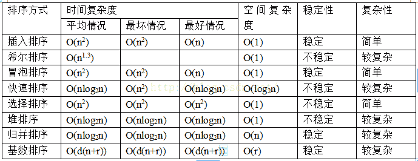
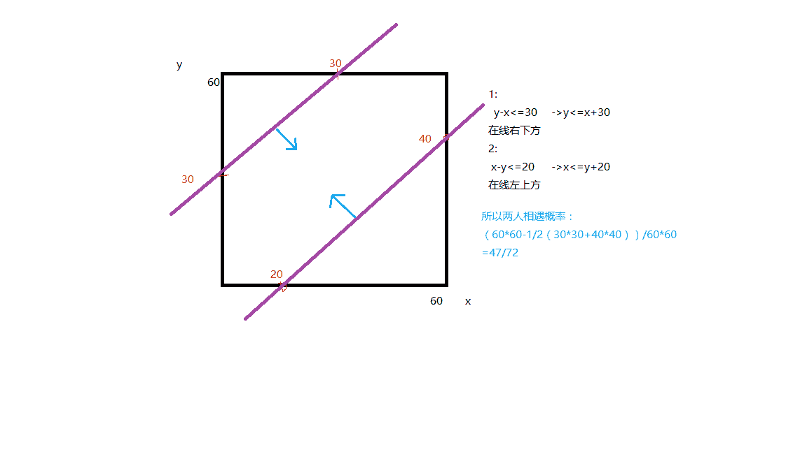
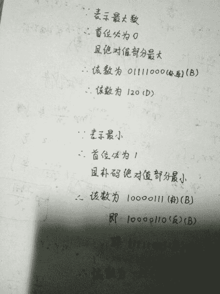

# 七牛云 2017 秋招开发工程师笔试试卷

## 1

假定一枚硬币抛出落地后，正面及反面出现的概率分别为 1/2，那么抛 10 次和抛 100 次硬币（分别称为 P10 和 P100）相比，以下正确的说法是：

正确答案: B   你的答案: 空 (错误)

```cpp
P100 出现正面多于反面的概率比 P10 出现正面多于反面的概率大
```

```cpp
P100 正面次数的方差小于 P10 出现正面次数的方差
```

```cpp
P100 出现连续 10 次以上正面的概率约为 1%
```

```cpp
P100 前 10 次都是正面的概率比 P10 前 10 次都是正面的可能性大
```

本题知识点

概率统计 *概率论与数理统计* *讨论

[你好，阳光 201803211123427](https://www.nowcoder.com/profile/5611573)

感觉这道题的答案有问题，B 应该是错的，根据二项分布，投掷 n 次正面向上的次数方差是 np(1-p)，中心极限定理适用的对象应该是正面向上次数的频率，C 选项我算的结果是(100-10+1)*0.5¹⁰≈0.9%

发表于 2018-07-08 11:25:02

* * *

[李子初的ɹǝɟɟo](https://www.nowcoder.com/profile/85373000)

这题明显 B。首先二项分布的方差是 N*P*(1-P)。我们先按下不表我们再看，根据中心极限定理：Y=N*P=E(X)这个随机变量是正面出现次数。var(Y)=var(X*(1/N))=1/N²*var(X)=1/N² *N*P*(1-P).所以 N 越大，方差越小

发表于 2019-06-07 13:34:00

* * *

[指间梦](https://www.nowcoder.com/profile/183172554)

b 选项由中心极限定理 c 选项从 100 次中选连续的 10 次，有 91 种，乘以概率，的 91×0.5√10≈0.9

发表于 2019-01-04 11:12:30

* * *

## 2

关于排序算法下列说法正确的是：

正确答案: A   你的答案: 空 (错误)

```cpp
快速排序在被排序的数据完全无序时最易发挥其长处
```

```cpp
快速排序是稳定的排序算法
```

```cpp
堆排序最好情况和最坏情况下时间复杂度不同
```

```cpp
快速排序所需的辅助空间少于堆排序
```

本题知识点

排序 *讨论

[bbblemon](https://www.nowcoder.com/profile/3807435)



发表于 2018-07-10 10:28:52

* * *

[spenglu](https://www.nowcoder.com/profile/116670)

A.快速排序在排序的序列无序时，时间复杂度为 O(nlogn)，在对已有序的序列进行排序时时间复杂度为 O(N²)，所以 A 正确
B.快速排序不是稳定的排序算法
C.堆排序的时间复杂度在任何情况都是 O(nlogn)
D.快速排序的空间复杂度为 O(logn)，堆排序为 O(1)

发表于 2017-02-14 10:13:39

* * *

[武培轩](https://www.nowcoder.com/profile/5033606)

正确答案
A
答案解析
A、快速排序在排序的序列无序时复杂度最低，时间复杂度为 O(nlogn)，在对已有序的序列进行排序时复杂度最高，时间复杂度 O(n²)。
B、快速排序是不稳定的，排序过程中需要进行前后交换，会打乱相同数字顺序。
C、堆排序的时间复杂度在任何情况都是 O(nlogn)。
D、快速排序的空间复杂度为 O(logn)，堆排序为 O(1)。

发表于 2018-04-13 17:39:21

* * *

## 3

下面关于 Linux 文件系统的 inode 描述错误的是：

正确答案: A   你的答案: 空 (错误)

```cpp
inode 和文件是一一对应的
```

```cpp
inode 描述了文件大小和指向数据块的指针
```

```cpp
通过 inode 可获得文件占用的块数
```

```cpp
通过 inode 可实现文件的逻辑结构和物理结构的转换
```

本题知识点

Linux

讨论

[潜伏者～～～](https://www.nowcoder.com/profile/9467213)

答案:A 一般情况下，文件名和 inode 号码是"一一对应"关系，每个 inode 号码对应一个文件名。但是，Unix/Linux 系统允许，多个文件名指向同一个 inode 号码。这意味着，可以用不同的文件名访问同样的内容；对文件内容进行修改，会影响到所有文件名；但是，删除一个文件名，不影响另一个文件名的访问。这种情况就被称为"硬链接"（hard link）。 除了硬链接以外，还有一种特殊情况。文件 A 和文件 B 的 inode 号码虽然不一样，但是文件 A 的内容是文件 B 的路径。读取文件 A 时，系统会自动将访问者导向文件 B。因此，无论打开哪一个文件，最终读取的都是文件 B。这时，文件 A 就称为文件 B 的"软链接"（soft link）或者"符号链接（symbolic link）。 这意味着，文件 A 依赖于文件 B 而存在，如果删除了文件 B，打开文件 A 就会报错："No such file or directory"。这是软链接与硬链接最大的不同：文件 A 指向文件 B 的文件名，而不是文件 B 的 inode 号码，文件 B 的 inode"链接数"不会因此发生变化。

发表于 2017-02-07 23:12:23

* * *

[期待最好的自己](https://www.nowcoder.com/profile/7696607)

硬链接 指向的是 inode 号，删了一个文件名 其他文件名**不会**报错
软链接 指向的是文件名，删了源文件名 其他文件名**会**报错

发表于 2017-07-03 12:03:25

* * *

[牛客-120 抢救中心](https://www.nowcoder.com/profile/6165623)

inode(发音：eye-node)译成中文就是索引节点，它用来存放档案及目录的基本信息，包含时间、档名、使用者及群组等。

发表于 2018-07-30 10:21:11

* * *

## 4

在 TCP/IP 中，ICMP 属于哪一层协议？

正确答案: A   你的答案: 空 (错误)

```cpp
IP
```

```cpp
PPP
```

```cpp
UDP
```

```cpp
TCP
```

本题知识点

网络基础

讨论

[华中第一狠人程德彪](https://www.nowcoder.com/profile/616662)

**答案为：A**ICMP 协议是 IP 层的附属协议，是介于 IP 层和 TCP 层之间的协议，一般认为属于 IP 层协议。IP 协议用它来 与其他主机或路由器交换错误报文和其他的一些网络情况。在 ICMP 包重携带了控制信息和故障恢复信 息。主要用于路由器主机向其他路由器或者主机发送出错报文的控制信息

编辑于 2017-03-18 09:47:04

* * *

[笑以](https://www.nowcoder.com/profile/1333690)

虽然选项都对应着所在的某一层，但你也不能用协议来表示某一层吧。。

发表于 2019-04-25 17:16:56

* * *

[武培轩](https://www.nowcoder.com/profile/5033606)

**正确答案**

A

**答案解析**

ICMP 协议是 IP 层的附属协议，是介于 IP 层和 TCP 层之间的协议，一般认为属于 IP 层协议。IP 协议用它来与其他主机或路由器交换错误报文和其他的一些网络情况。在 ICMP 包重携带了控制信息和故障恢复信息。主要用于路由器主机向其他路由器或者主机发送出错报文的控制信息。

编辑于 2018-04-13 17:47:32

* * *

## 5

假定 Qiniuome 是一个类，执行下面这些语句之后，内存里创建了几个 Qiniuome 对象。

```cpp
Qiniuome a();
Qiniuome b(2);
Qiniuome c[3];
Qiniuome &ra = b;
Qiniuome *pA = c;
Qiniuome *p = new Qiniuome(4);
```

正确答案: A   你的答案: 空 (错误)

```cpp
5
```

```cpp
6
```

```cpp
7
```

```cpp
8
```

本题知识点

C++

讨论

[SunburstRun](https://www.nowcoder.com/profile/557336)

答案是 A  查看全部)

编辑于 2016-12-22 16:13:06

* * *

[海洋天堂](https://www.nowcoder.com/profile/6220626)

```cpp
CSomething a();//只是定义一个方法，方法返回一个 CSomething 对象 
CSomething b（2）;//增加 1 个对象
CSomething c[3];//对象数组，增加 3 个对象
CSomething &ra=b;//引用不增加对象

CSomething *pA=c;//地址赋值，不增加对象
CSomething *p=new CSomething;//在堆上构造一个对象，增加 1 个对象

所以最后一共有： 1+3+1 =5 个对象。
```

注： 
在 C++语言里， 
String s2(s1); 
String s3 = s1; 只是语法形式的不同，意义是一样的，都是定义加初始化，都调用拷贝构造函数。 
下一个并非调用赋值运算符。

```cpp
CSomething d=b;//调用拷贝构造函数，增加 1 个对象
```

发表于 2018-05-10 22:58:40

* * *

[NopLL](https://www.nowcoder.com/profile/5138096)

a 是个函数声明！一不小心就搞错了

发表于 2017-01-04 20:29:53

* * *

## 6

男女两人相亲，约定晚上 19 点至 20 点见面，但是两人并不情愿。男方的等待容忍时间为 30 分钟，女方的等待容忍时间为 20 分钟，请问两人有缘见面的概率为？

正确答案: A   你的答案: 空 (错误)

```cpp
47/72
```

```cpp
39/72
```

```cpp
25/36
```

```cpp
3/5
```

本题知识点

概率统计 *概率论与数理统计* *讨论

[0914](https://www.nowcoder.com/profile/5945629)



发表于 2017-09-14 12:05:48

* * *

[三撮毛](https://www.nowcoder.com/profile/1581497)

设男方 x 点到，女方 y 点到 0≤x,y≤60 当 x≤y 时，即男方先到，则能见面的时间为 0≤y－x≤30； 同理，当 y≤x 时，有 0≤x－y≤20； 这是几何概率，在边长为 60 的正方形中作出上述两个范围相交的部分，用相交部分面积比上正方形总面积即为所求。 但是，一般情侣下相交部分面积不好直接求，要通过 1-除相交部分外正方形其余部面积/正方形总面积。本题就是这样，用 1-0.5*（30*30+40*40）/(60*60)=47/72 第一次用不会上传图片，有图很容易理解。

发表于 2017-03-30 19:15:19

* * *

[有理想的咕咕](https://www.nowcoder.com/profile/589065582)

为什么女生只当等 20 分钟？嗯？男生什么时候才能够站起来？嗯？气！抖！冷！

发表于 2020-12-21 11:03:17

* * *

## 7

字符串 "qiniu" 根据顺序不同有多少种排列组合的方式？

正确答案: C   你的答案: 空 (错误)

```cpp
96
```

```cpp
72
```

```cpp
60
```

```cpp
24
```

本题知识点

字符串 *讨论

[SunburstRun](https://www.nowcoder.com/profile/557336)

答案是 C  查看全部)

编辑于 2016-12-22 16:24:34

* * *

[ycy_sky](https://www.nowcoder.com/profile/3253174)

答案是 C。由于有两个 i，可以看成是有 5 个位置，只要确定了 q，n，u 的位置，字符串就确定了，因此，是 5×4×3=60

发表于 2017-02-08 10:36:58

* * *

[洛月さ](https://www.nowcoder.com/profile/124021)

答案 C 先不看有没有重复的，共 5 个字母，有 5×4×3×2×1 = 120 种组合.然后有两个重复的 i，所以应该除以 2，120 / 2 = 60,所以答案 C

发表于 2017-03-09 11:13:52

* * *

## 8

由 4 个 "1" 和 4 个 "0" 组成的 8 位二进制补码，能表示的最小整数是：

正确答案: C   你的答案: 空 (错误)

```cpp
-125
```

```cpp
-32
```

```cpp
-121
```

```cpp
-3
```

本题知识点

字符串 *讨论

[SunburstRun](https://www.nowcoder.com/profile/557336)

答案是 C  查看全部)

编辑于 2017-03-18 09:12:09

* * *

[Ma_Hong_Kai](https://www.nowcoder.com/profile/3652695)

。。忘选了

发表于 2017-04-28 10:51:25

* * *

[zhisheng_blog](https://www.nowcoder.com/profile/616717)

答案是 C 这里我们需要知道的是: 正数： 原码 = 反码 = 补码 负数：原码          反码 = 原码除符号位之外的各位求反          补码 = 反码 +1 （如果 +1 之后有进位的，要一直往前进位，包括符号位） 最小的一定是负数，为 1000111，-121（10）； 最大的一定是正数，为 01111000

发表于 2017-03-13 09:40:12

* * *

## 9

以下描述错误的是：

正确答案: B   你的答案: 空 (错误)

```cpp
KMP 算法的时间复杂度是 O(m+n)，m,n 分别为主串和子串长度
```

```cpp
最长路径问题有多项式时间解
```

```cpp
最大流问题和最小割问题是等价的
```

```cpp
PageRank 算法总是会收敛
```

本题知识点

复杂度

讨论

[美团到店招聘](https://www.nowcoder.com/profile/3472441)

A：KMP 时间复杂度是 O(m+n)，m,n 是主串，子串长度。B：最长路径问题是 NP 问题，还没证实存在多项式时间复杂度。C：正确。D：大名鼎鼎的 PageRank 算法，由 google 扛把子发明。数学上可以证明是收敛的。反正那个证明我是看不懂。记住结论就好。**知道各个选项就好，不要局限于答案。**

编辑于 2021-02-24 15:00:54

* * *

[LauZyHou](https://www.nowcoder.com/profile/8203811)

【最长路径问题有多项式时间解】这个命题现在是**没法判断真伪**的，这题把这一项**视为“错误的”就已经不对了**。

如果你没法理解，我给你举个例子：

> 以下描述错误的是：
> A.略
> B.宇宙中存在其它生命
> C.略
> D.略

这种提问方式下选 B 合适吗？？？一个没法判断真伪的东西，用【错误】/【正确】这种词本身就是一种错误。

编辑于 2020-08-04 16:41:59

* * *

[武培轩](https://www.nowcoder.com/profile/5033606)

**正确答案**

B

**答案解析**

最长路径问题是著名的 NP 难问题。

发表于 2018-04-13 18:11:50

* * *

## 10

36 个人参加田径比赛，场地只有 6 个赛道，请问至少需要几次比赛，才能评出跑的最快的前 3 名？

你的答案

本题知识点

组合数学 *讨论

[人生还有多少个二十年](https://www.nowcoder.com/profile/8733038)

题目没有指明是否测定时间，故做分类讨论。

（１）如果能够测定时间，那么答案是 6 次，思路很简单，每一位选手都跑一次就行了，耗时从短到长排列的前三名依次就是冠军...亚军...季军。

```cpp
                            36 / 6 = 6
```

（２）反之，如果只能得出选手的快慢，那么答案是 8 次。理由如下：

*   36 人随机分成 6 组，进行 6 次比赛，这是第一轮。
*   然后取各小组比赛的第一名（共 6 人）进行第二轮比赛，选出前三名（依次命名为 A,B,C），此时已经可以确定 A 就是该次田径比赛的冠军。
*   由于第一轮中跟 A 同组第二名 D、第三名 E 有可能实力比 B、C 强 , 跟 B 同组的第二名 F 也可能实力比 C 强，故让 B,C,D,E，F 总共 5 人进行第三轮比赛。
*   第三轮比赛的第一名和第二名分别为该次田径比赛的亚军和季军。

```cpp
                            6+1+1=8
```

编辑于 2017-03-02 12:18:37

* * *

[阿狸不是猫](https://www.nowcoder.com/profile/3644424)

肯定是 6 次！（吐槽一波题目描述不清）拿个表计时一下，大家每个人跑一次就搞定了~吐槽归吐槽，题目的意思肯定是没有表计时的情况，光用赛道需要几次来搞定，答案应该是 8 次思路：先分成 6 个赛区，比赛 6 次：取出 6 个赛区 ABCDEF 的第一名 6 个人出来第 7 次比赛——对这 6 个人进行比赛：取出其中的前三名，因为所有人中的前三名一定是在这三个人所以对应的赛区中产生（其它赛区的最高名次也只是第四名，因此不可能产生前三名）第 8 次比赛——取出第一赛区的前三名和第二赛区的前二名和第三赛区的前一名比赛：决出的前三名就是最快的前三名

发表于 2017-08-09 14:04:56

* * *

[秋隽](https://www.nowcoder.com/profile/3930516)

如果是按每个人跑一次的成绩结果来比较得出前 3 名的话，则只需要跑 6 次，即随机分成 6 组，在赛道上跑 6 次即可。如果是按每个人的成绩要是在同一次比赛里才可以比较来计算的话，则需要跑 7 次。一，随机分成 6 组，在赛道上跑 6 次；二，上一次各组的冠军再跑，分出前 3 名。

发表于 2018-03-25 14:29:14

* * *

## 11

已知模块类 Hashtable<KeyT, ValueT>支持 get(key)，set(key,value)和 delete(key)的操作，请使用该 Hashtable 作为唯一成员变量，实现一个栈（Stack）类，支持入栈（push）和出栈（pop）的操作。请简单描述思路：

你的答案

本题知识点

栈 *讨论

[阿狸不是猫](https://www.nowcoder.com/profile/3644424)

思路：模拟一个过程：入栈 set（1，value），再入栈则 set（2，value），出栈 delete（2），其中存在的问题是还需要用一个成员变量来存储当前应该 set 的 key 值，由于题目要求只使用 Hashtable 作为成员变量，因此可以将该成员变量也储存到 Hashtable 中去，即 set（0，对应的 key）入栈：int key =get（0）+1——找到此时应该增加的 key 值 set（key，value）
set（0，key）——修改 0 中的 key 值出栈 int key =get（0）——找到此时应该删除的 key 值 delete（key） set（0，key-1）——修改 0 中的 key 值

编辑于 2017-08-09 14:49:13

* * *

[qsima](https://www.nowcoder.com/profile/6723333)

```cpp
public class Stack<V>{
    private Hashtable<Integer,V> map = new Hashtable<Integer,V>();
    public V pop(){
        //查找 map 中最大的 key 值
       int max = Integer.MIN_VALUE;
        Iterator<Integer> iter = map.keySet().iterator();
        while (iter.hasNext()){
            max = Math.max(max,iter.next());
        }
        //删除 key 为 max 的记录
        V ans = map.get(max);
        map.delete(max);
        return ans;
    }
    public void push(V val){
        //查找 map 中最大的 key 值
       int max = Integer.MIN_VALUE;
        Iterator<Integer> iter = map.keySet().iterator();
        while (iter.hasNext()){
            max = Math.max(max,iter.next());
        }
        //添加 key 为 max+1 的记录
        map.set(max+1,val);  }
}

```

发表于 2017-03-20 09:20:01

* * *

[三丶斤](https://www.nowcoder.com/profile/731793533)

```cpp
class Main<E>{

    Hashtable<Integer,E> map = new Hashtable<>();

    // 记录栈顶的 key
    int top = 0;
    void push(E data) {
        map.set(top++,data);
    }

    E pop() {
        E data = map.get(top);
        map.delete(top--);
        return data;
    }

}
```

发表于 2019-09-29 16:29:50

* * *

## 12

请实现入栈和出栈的操作，规格如下：

```cpp
class Stack {
    public:
        Stack();
        voidpush(string value);
        stringpop();//throw
        PopEmptyStackException if stack is empty
}
```

你的答案

本题知识点

栈 *讨论

[dorademon](https://www.nowcoder.com/profile/2761910)

//用 map 的大小作为 keyclass Stack{private Hashtable <KeyT,ValueT> table;
Stack(){table=new Hashtable<KeyT,ValueT>();
}public void push(ValueT x){table.set(table.size()+1,x);}public ValueT pop(){if(table.size()==0) return  -1;else{ValueT top=table.get(table.size());table.delete(table.size());return top;}}}

发表于 2017-10-13 22:09:41

* * *

[三丶斤](https://www.nowcoder.com/profile/731793533)

```cpp
class Stack{
    List<String> datas = new ArrayList<>();

    int top = -1;

    void push(String val) {
        datas.add(0,val);
    }

    String pop() {
        if(datas.size() == 0) {
            throw new RunTimeException("栈空");
        }
        String pop = datas.get(0);
        datas.remove(0);
        return pop;
    }
}
```

发表于 2019-09-29 16:29:47

* * *

[诗人吟游](https://www.nowcoder.com/profile/3943198)

```cpp
class Stack {
    private int top=-1;
    private  String[] array=new String[MAX_LEN];
    public:
        Stack();
        void push(String value)throws StackOverFlowException{
            int index=++top;
            if(index>=MAX_LEN){
                throw New StackOverFlowException();
                return ;
            }
            array[index]=value;
        }
        String pop()throws PopEmptyStackException{
            if(top==-1){
                throw new PopEmptyStackException();
                return null;
            }
            return array[top--];    
        }
} 
```

发表于 2019-03-05 17:03:21

* * *

## 13

实现一个 mergeArray 函数，对两个已经排好序（从小到大）的数组进行排序（从小到大），数组里面是数字均为整数，在 0,100000) 之间，数组长度不超过 10000 。

输入数据有三行，第一行两个数字表示每个数组数字个数，后面两行分别表示两个数组

5,3

9,6,5,3,1

7,4,2

输出

1,2,3,4,5,6,7,9

你的答案

本题知识点

数组 [排序 *讨论

[三丶斤](https://www.nowcoder.com/profile/731793533)

```cpp
import java.util.Arrays;
import java.util.Collections;
import java.util.Scanner;

/**
 * @author: sanjin
 * @date: 2019/9/29 15:34
 */
public class Main {
    public static void main(String[] args) {
        Scanner s = new Scanner(System.in);
        String s1 = s.nextLine();
        int n1 = Integer.parseInt(s1.split(",")[0]);
        int n2 = Integer.parseInt(s1.split(",")[1]);
        String s2 = s.nextLine();
        int[] nums1 = new int[n1];
        int[] nums2 = new int[n2];
        for (int i = 0; i < nums1.length; i++) {
            nums1[i] = Integer.parseInt(s2.split(",")[i]);
        }
        String s3 = s.nextLine();

        for (int i = 0; i < nums2.length; i++) {
            nums2[i] = Integer.parseInt(s3.split(",")[i]);
        }

        if (nums1.length > 1 && nums1[0] > nums1[1]) {
            reverse(nums1);
        }

        if (nums2.length > 1 && nums2[0] > nums2[1]) {
            reverse(nums2);
        }

        int[] ints = mergeArray(nums1, nums2);
        System.out.println(Arrays.toString(ints));

    }

    static void reverse(int[] nums) {
        int l = 0, r = nums.length - 1;
        while (l < r) {
            int t = nums[r];
            nums[r] = nums[l];
            nums[l] = t;
            l++;
            r--;
        }
    }

    static int[] mergeArray(int[] n1, int[] n2) {
        int p1 = 0, p2 = 0;
        if (n1.length == 0) return n2;
        if (n2.length == 0) return n1;
        int[] res = new int[n1.length + n2.length];
        int cur = 0;
        while (p1 < n1.length && p2 < n2.length) {
            if (n1[p1] < n2[p2]) {
                res[cur] = n1[p1];
                p1++;
            } else {
                res[cur] = n2[p2];
                p2++;
            }
            cur++;
        }

        while (p1 < n1.length) {
            res[cur] = n1[p1];
            p1++;
            cur++;
        }
        while (p2 < n2.length) {
            res[cur] = n2[p2];
            p2++;
            cur++;
        }
        return res;
    }
}

```

发表于 2019-09-29 16:29:42

* * *

[无根生.](https://www.nowcoder.com/profile/1705944)

应该是归并排序

发表于 2018-04-14 17:58:16

* * *

[牛客 8584667 号](https://www.nowcoder.com/profile/8584667)

```cpp
#include <stdio.h>
int main(int argc, char *argv[])
{
    int a[10000],b[10000], r[20000], i,j,k,n,m;
    scanf("%d%d", &n, &m);
    for (i = 0; i < n; i++){
        scanf("%d", &a[i]);
    }
    for (i = 0; i < m; i++){
        scanf("%d", &b[i]);
    }
    i = j = k = 0;

    while(1) {
        if (j >= m){
            while(i < n){
                r[k++] = a[i++];
            }
            break;
        }
        if (i >= n){
            while(j < m){
                r[k++] = b[j++];
            }
            break;
        }

        if (a[i] > b[j]){
            r[k++] = a[i++];
        } else {
            r[k++] = b[j++];
        }

    }
    while(k--){
        printf("%d", r[k]);
        if (k > 0) {
            printf(",");
        }
    }
    return 0;
}
```

按测试用例写的，空间换时间

发表于 2018-03-12 16:56:16

* * *

## 14

假设有一个有 n 个元素的数组，求该数组右移 k 个元素后的数组，要求算法的空间复杂度为 O(1) 。

输入数据右三行，第一行表示数组元素个数 n ，第二行表示数组，第三行表示 k

7

1,2,3,4,5,6,7

3

输出

5,6,7,1,2,3,4

你的答案

本题知识点

数组

讨论

[黑色灬的天ˇ](https://www.nowcoder.com/profile/3653222)

思路是，从最后一位开始，找到它要填的位置，再去寻找那个位置的数的新位置，重复直到找到某个数的新位置为最后一位。//右移数组 void moveArray(int arr[], int n,int k) {k = k%n;//取当前变换的一位,从最后一位开始 int currentIndex = n - 1, currentVal = arr[n - 1];do {//取到要变换的位置 currentIndex = (currentIndex + k) % n;//交换当前值 int temp = arr[currentIndex];arr[currentIndex] = currentVal;currentVal = temp;} while (n - 1 != currentIndex);}

发表于 2017-08-08 19:14:44

* * *

[Realself](https://www.nowcoder.com/profile/831729261)

*   分享下我的思路：时间复杂度 O(n),空间复杂度 O(1)
*   核心代码

    ```cpp
    void rightMoveK(vector<int>& arr, int k)
    {
      int n = arr.size();
      if (n == 0)
          return;
      int i = 0;
      while (i < n-1)
      {
          int j = n - k;//每次都从 n-k 位置开始右移
          while (j < n)//每次右移 k 个数
          {
              swap(arr[j++], arr[i++]);//就地交换
          }
      }
    }
    ```

    思路解释：
*   保证右移后的元素不需要再移动，所以从下标为 n-k 的元素开始右移 k 个元素，保证右移后的数字位于数组的最前面，并且不需要再移动
*   每次右移，就是与下标为 i 的元素交换位置，一趟右移 k 个元素后， i 也前进了 k 个位置，不断的从 n-k 位置开始右移 k 个元素，直到 i 移动到数组尾部，此时整个数组右移完成

发表于 2020-05-03 09:59:06

* * *

[Galliano、](https://www.nowcoder.com/profile/346143718)

两次翻转：第一次：分别原地翻转数组的后 k 个元素和前 n-k 个元素；第二次：原地翻转整个数组。时间复杂度为 O(n)，空间复杂度 O(1)。

发表于 2020-03-23 12:08:14

* * *

## 15

输入 n 个未排序的数字组成的数组，求排序之后相邻元素之间最大的差值。

要求：算法的时间复杂度为 O(n) ，数字取值区间为 [-2³²,2³²-1] 。

输入数据有两行，第一行表示数组的数字量 n ，第二行表示数组

4

4,1,7,5

输出

3

你的答案

本题知识点

数组 排序 *讨论

[雪斗无知](https://www.nowcoder.com/profile/6761032)

```cpp
//不太明白桶方法为什么那么除，不过既然只要求时间复杂度，那可以偷空间的懒
import java.util.Scanner;

public class Main{
    public static void main(String[] args){
        Scanner sc = new Scanner(System.in);
        while(sc.hasNext()){
            int n = sc.nextInt();
            int[] array = new int[n];
            int max = Integer.MIN_VALUE;
            int min = Integer.MAX_VALUE;
            for(int i = 0;i<n;i++){
                int a = sc.nextInt();
                array[i] = a;
                max = Math.max(max,a);
                min = Math.min(min,a);
            }
            boolean[] array2 = new boolean[max-min+1];
            for(int i = 0;i<n;i++){
                array2[array[i]-min] = true;
            }
            int count = 0;
            int maxCount = 0;
            for(int i = 0;i<array2.length;i++){
                if(array2[i]==false){
                    count++;
                    maxCount = Math.max(count,maxCount);
                }else{
                    count = 0;
                }
            }
            if(n>=2){
                maxCount++;
            }
            System.out.println(maxCount);
        }
    }
}

```

发表于 2017-03-17 16:26:07

* * *

[Paraia](https://www.nowcoder.com/profile/257896882)

[`juejin.im/post/5a44acaa6fb9a0451d41c850`](https://juejin.im/post/5a44acaa6fb9a0451d41c850) 这篇文章讲到位了

发表于 2019-03-15 16:45:41

* * *

[牛客 823431 号](https://www.nowcoder.com/profile/823431)

用一个新数组 arr 长度为原来数组最大值，然后对于原来数组依次求余最大值然后放入 arr 中。这样得到的 arr 就是有序的但是内存不一定连续，然后遍历找最大值即可。

发表于 2017-08-26 10:53:41

* * *

## 16

随着实体经济对互联网的依赖越来越高，我们生活的方方面面都不知不觉地享受这互联网服务带来的便利，这同时也对互联网服务的高可用提出了越来越高的要求。如同停电一样，互联网服务的不可用可能会重大的经济损失，甚至影响生命安全。作为一个技术人员，请阐述如果去保证一个服务的高可用，你能够考虑到哪些方面？并请简要描述这方面你认为通过什么样的手段可以进行改善。

你的答案

本题知识点

WebServer

讨论

[一枚后浪](https://www.nowcoder.com/profile/5168471)

摘抄《大型网站技术架构核心原理与案例分析》1，分级管理：    运维上将服务器进行分级管理，核心应用和服务优先使用更好的硬件。同时在服务部署上也要进行必要的隔离，避免故障的连锁反应。低优先级的服务通过启动不同的线程或部署在不同的虚拟机上进行隔离，而高优先级的服务则部署在不同的物理机上，核心服务和数据甚至要部署在不同地域的数据中心。2，超时设置    由于服务器宕机、线程死锁等原因，可能导致应用程序对服务端的调用失去响应，进而导致用户请求长时间得不到响应，同时还占用应用程序的资源，不利于及时将访问请求转移到正常的服务器上。    在应用程序中设置服务调用超时时间，一旦超时，通信框架就抛出异常，应用程序根据调度策略，可选择继续重试或将请求转移到提供相同服务的其他服务器上。3，异步调用    应用对服务的调用通过消息队列等异步方式完成。避免一个服务失败导致整个应用请求失败。    如用户注册请求，应用需要调用三个服务：写入数据库，发送账户注册成功邮件，开通对应权限。如果采用同步服务调用，则如果邮件服务阻塞，会导致整个请求无法继续执行，最终导致用户注册失败。4，服务降级    在高峰期将非核心服务降级或关闭 5，幂等性设计    幂等性：用户对于同一个操作发起的一次请求或多次请求的结果是一致的。

发表于 2017-08-07 17:26:57

* * ***********