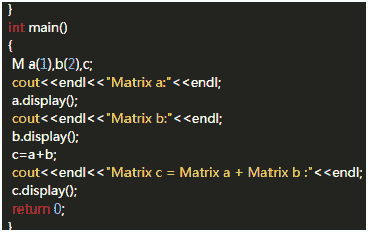

# 乐视 2017 秋招开发工程师笔试试卷

## 1

设栈 S 和队列 Q 的初始状态为空，元素 ABCDEF 依次进栈 S，出栈后立即进入队列 Q，若 6 个元素出列的顺序为 CDBFEA,则栈 S 的容量至少为（）

正确答案: A   你的答案: 空 (错误)

```cpp
3
```

```cpp
4
```

```cpp
6
```

```cpp
2
```

本题知识点

栈 *讨论

[Gentleman201711111559701](https://www.nowcoder.com/profile/8885393)

ABCDEF 依次进栈，出列的顺序为 CDBFEA，栈的特点是后进先出 A 进栈，（栈内为 A）B 进栈，（栈内为 A，B）C 进栈，（栈内为 A，B，C）C 出栈，（栈内为 A，B）B 出栈，（栈内为 A）E 进栈，（栈内为 A，E）F 进栈，（栈内为 A，E，F）F 出栈，（栈内为 A，E）E 出栈，（栈内为 A）A 出栈，所以容量至少要有 3

发表于 2017-12-29 11:41:37

* * *

[稻香](https://www.nowcoder.com/profile/1598493)

A 进 B 进 C 进  栈中有三个元素 C 出             栈中有两个元素(A,B)D 进 D 出       进后栈中三个元素，出后栈中两个元素 B 出             栈中剩余一个元素（A）E 进 F 进       栈中三个元素（A,E,F）F—E—A     依此出栈 ，栈空由此可见，栈中元素最多时时盛 3 个元素，故而栈最小容量为 3。 

发表于 2018-04-09 21:33:11

* * *

[上善若水 0716](https://www.nowcoder.com/profile/8919817)

本题可以直接考虑，根据栈和队列的规则，队列由 c 开始出，所以可能是三个，在这个基础上再做测试得到答案

发表于 2017-08-09 15:43:40

* * *

## 2

岳阳酒店新聘用一名机房管理人员，该用户能且仅能对后台 SQL Server 数据库 HOTEL 中任何表执行 SELECT 操作，以下操作合理的是：（）

正确答案: B   你的答案: 空 (错误)

```cpp
USE HOTEL
  EXEC SP_ADDLOGIN ‘HOTEL’,’W’
  EXEC SP_GRANTDBACCESS ‘AK’,’W’
  EXEC SP_ADDROLEMEMBER ‘DB_DATAREADER’,’W’
```

```cpp
USE HOTEL
  SP_GRANTDBACCESS ‘AK’,’W’
  EXEC SP_ADDROLEMEMBER ‘DB_DATAREADER’,’W’
```

```cpp
USE HOTEL
  EXEC SP_ADDLOGIN ’W’,’123’,’HOTEL’
  EXEC SP_ADDROLEMEMBER ‘DB_DATAREADER’,’W’
```

```cpp
USE HOTEL
  EXEC SP_ADDLOGIN ’W’,’123’,’HOTEL’
  EXEC SP_GRANTDBACCESS ‘AK’,’W’
  EXEC SP_ADDROLEMEMBER ‘DB_DATAREADER’,’W’
```

本题知识点

数据库

讨论

[Tianwu](https://www.nowcoder.com/profile/501536)

```cpp
USE HOTEL
使用数据库
  SP_GRANTDBACCESS ‘AK’,’W’ 当前数据库中添加一个安全帐户，并使其能够被授予在数据库中执行活动的权限。 EXEC SP_ADDROLEMEMBER ‘DB_DATAREADER’,’W’
为用户添加读权限
```

发表于 2017-08-08 22:44:23

* * *

[Molly 猫侠喵哩酱](https://www.nowcoder.com/profile/3663682)

Grant 添加安全账户，sp_addrolemember 是一个将安全帐户作为当前数据库中现有《Microsoft SQL Server》数据库角色的成员进行添加的功能函数。

发表于 2018-03-29 13:00:18

* * *

## 3

n 皇后最坏情况下的时间复杂度为：（）

正确答案: C   你的答案: 空 (错误)

```cpp
O(n)
```

```cpp
O(n²)
```

```cpp
O(n^n)
```

```cpp
O(n³)
```

本题知识点

复杂度

讨论

[天涯咫尺](https://www.nowcoder.com/profile/891535)

[`blog.csdn.net/ustcjackylau/article/details/39670861`](http://blog.csdn.net/ustcjackylau/article/details/39670861)一个 n*n 的棋盘，要在上面放 n 个皇后。规则：两个皇后之间如果是同列、同行、同对角线它们会互相攻击。也就是说：棋盘上的任意两个皇后皇后不能为同列、同行、同对角线。对于这个问题、当 n 不大的时候，可以用穷举法实现。对于 n 皇后，每一行有 n 个位置可以放，一共 n 行。就会有 n 的 n 次方种情况。对于这些情况、再一一判断是不是满足情况。

发表于 2017-08-14 10:37:07

* * *

[乐砂](https://www.nowcoder.com/profile/517903666)

回溯法的话，应该不是哦 o（n！），因为是一棵完全 n 叉树，感觉是 o（n^n）非递归算法的话是 O（n！）

发表于 2020-08-18 13:01:23

* * *

## 4

一个队列的进队顺序是 1,2，....n，若进队和出队可以交替进行，则出队顺序可能是（）

正确答案: A   你的答案: 空 (错误)

```cpp
1,2,........,n
```

```cpp
1,2,4,3,5,6,.....,n
```

```cpp
n,n-1,....,1
```

```cpp
以上均有可能
```

本题知识点

队列 *讨论

[程序猿小胡](https://www.nowcoder.com/profile/6164504)

队列进出的顺序不会因为进出的交替进行而有所改变。

发表于 2017-08-09 12:24:01

* * *

[一江春水向东流](https://www.nowcoder.com/profile/2324880)

该题说的是队列，不是栈，看清楚题目

发表于 2017-08-26 16:01:03

* * *

[永不言弃😊](https://www.nowcoder.com/profile/7696135)

队列，和栈搞清楚

发表于 2021-02-05 14:22:53

* * *

## 5

某种排序方法对关键字序列（33,12,44,10,6,8,17）进行排序时，前三趟排序的结果如下：

6，12，44，10，33，8，17

6，8，44，10，33，12，17

6，8，10，44，33，12，17 则采用的排序方法是（）

正确答案: D   你的答案: 空 (错误)

```cpp
希尔排序
```

```cpp
归并排序
```

```cpp
快速排序
```

```cpp
选择排序
```

本题知识点

排序 *讨论

[HDU_ducker](https://www.nowcoder.com/profile/5303747)

 选择排序：比如在一个长度为 N 的无序数组中，在第一趟遍历 N 个数据，找出其中最小的数值与第一个元素交换，第二趟遍历剩下的 N-1 个数据，找出其中最小的数值与第二个元素交换......第 N-1 趟遍历剩下的 2 个数据，找出其中最小的数值与第 N-1 个元素交换，至此选择排序完成

发表于 2018-12-13 20:56:44

* * *

[牛客-120 抢救中心](https://www.nowcoder.com/profile/6165623)

33 12 44 10 6 8 17

6 12 44 10 33 8 17

6 8 44 10 33 12 17

6 8 10 44 33 12 17

6 8 10 12 33 44 17

6 8 10 12 17 44 33

6 8 10 12 17 33 44

发表于 2018-07-17 15:49:46

* * *

[你永远得不到的祖奶奶](https://www.nowcoder.com/profile/855996890)

首先观察排序的特点：会发现，最小的数值会被依次挪到最前面，一看就可以知道：选择排序。选择排序：就是从待排序数中找出最小的数，然后将最小的数字所在的位置和第一位数进行交换即可，之后找出次小的数字，同样交换位置即可。

发表于 2020-05-26 17:19:04

* * *

## 6

下列关于异常的说法，正确的是（）

正确答案: A   你的答案: 空 (错误)

```cpp
RuntimeException 及其子类的异常可以不做处理
```

```cpp
Catch 段中的语句，不允许再次出现异常
```

```cpp
在方法定义中以 throws 标识出的异常，在调用该方法中的方法必须处理
```

```cpp
程序中所有的可能出现的异常必须在 catch 中捕获，否则将引起编译错误
```

本题知识点

Java

讨论

[dong1234](https://www.nowcoder.com/profile/662644)

异常分为两种，一种为运行异常 RuntimeException，另一种为检查异常 CheckedException。对于运行异常，编译器没有强制对其进行捕获。会把异常一直往上层抛出，直到遇到处理代码为止。常见的运行异常有：nullpointexception(空指针异常)，indexoutofboundexception(越界异常)。。。。。检查异常，所有继承自 Exception 并且不是运行异常的都是检查异常，在程序中需要用 try catch 进行捕获。常见的有 IO 异常和 SQL 异常。

发表于 2017-08-12 09:58:48

* * *

[kuiblog.com](https://www.nowcoder.com/profile/622184)

C 选项中，调用该方法的方法可以再次进行抛出。

发表于 2017-08-09 08:36:43

* * *

[Tianwu](https://www.nowcoder.com/profile/501536)

```cpp
在调用此方法的时候 也可以再次申明 以将异常交由更高一级处理
```

发表于 2017-08-08 22:49:35

* * *

## 7

下列程序的功能是求两个 2 行 3 列的数组的和，即数组对应位置的元素—相加，请为横线处选择合适的程序（）   

正确答案: D   你的答案: 空 (错误)

```cpp
void M::
```

```cpp
friend M
```

```cpp
M
```

```cpp
M M::
```

本题知识点

C++

讨论

[侯卿](https://www.nowcoder.com/profile/8037781)

java 一脸懵逼🐒

发表于 2017-12-12 13:05:02

* * *

[dreamy_yue](https://www.nowcoder.com/profile/6025378)

M M::中，第一个 M 的表示返回值的类型，第二个 M 是类名，该函数最后 return c，c 又是类 M 的对象，所以返回值的类型是类 M

发表于 2017-08-30 14:43:45

* * *

[锦鲤超越保佑我](https://www.nowcoder.com/profile/234430431)

这个题考察的是 C++中的运算符重载。

return 的 c 是 M 类的，A 错；

friend M 我不知道，c++小白；

重点在 C 和 D：

C 中，M operator+()是全局的运算符重载，参数应该有 2 个，因为加法是要有 2 个加数的，而代码中参数只有 1 个；

D 中，M M::operator+()是 M 类中的，只需要 1 个参数，因为默认自己就是其中一个加数，去加参数中的那个加数。对于题中代码来说，M 类的 a 去加 b，相当于 a.operator+(b)。

所以选 D。

但是其实不用想这么多...class M 中都写了这个函数了...

发表于 2018-11-17 23:25:03

* * *

## 8

流水线中有 3 类数据相关冲突：写后读相关，读后写相关，写后写相关，那么下列 3 组指令中存在读后写相关的是（）

正确答案: A   你的答案: 空 (错误)

```cpp
I1 STA M,R2;(R2)-M,M 为主存单元
 I2 AND R2,R4,R5;(R4)+(R5)-R2
```

```cpp
I1 SUB R1,R2,R3;(R2)-(R3)-R1
 I2 AND R4,R5,R1;(R5)+(R1)-R4
```

```cpp
I1 MUL R3,R2,R1;(R2)*(R1)-R3
 I2 SUB R3,R4,R5;(R4)-(R5)-R3
```

```cpp
其它选项都不对
```

本题知识点

编译和体系结构

讨论

[阿狸不是猫](https://www.nowcoder.com/profile/3644424)

讲真，面对这种题目我可能只能拿 0 分了，一窍不通 T-T

发表于 2017-08-09 13:03:54

* * *

[tgu85](https://www.nowcoder.com/profile/3900825)

```cpp
A 选项：指令 I1 是要读出 R2 的内容，并存入存储单元 M ； 指令 I2 是要读出 R4、R5 的内容进行运算，将结果写入 R2。如果指令 I2 先进入流水线，变成 I2 指令在 I1 指令读出 R2 之前，先写入 R2，发生了读后写（WAR，write after read）相关。（应该先读再写）
B 选项：写后读相关（RAW，read after write）
C 选项：写后写相关（WAW，write after write） 
```

发表于 2017-09-07 21:52:45

* * *

[观察者 xyd](https://www.nowcoder.com/profile/761620113)

SAT 指令是将寄存器内值写入内存单元，速度相交于寄存器之间的操作要慢，导致第一条指令还没读取 R2 寄存器内容的时候，第二条指令已经把 R4 和 R5 寄存器内数据相与写入 R2 了，导致了先写后读，实际应该是先读后写，产生了先读后写的相关

发表于 2020-04-02 22:37:46

* * *

## 9

若已有一个栈，进栈顺序为 ABCD，出栈顺序序列是 BCDA，若用 I 表示进栈，O 表示出栈，则进操作的顺序是（）

正确答案: C   你的答案: 空 (错误)

```cpp
IOIOIIOO
```

```cpp
IIOOIIOO
```

```cpp
IIOIOIOO
```

```cpp
IIOIOOIO
```

本题知识点

栈 *讨论

[R.cZzzz](https://www.nowcoder.com/profile/9549467)

ABCD 顺序进的话，先 AB 进，B 出，C 进，C 出，D 进，D 出，A 出。

发表于 2018-08-13 21:20:40

* * *

[心有主见](https://www.nowcoder.com/profile/847621481)

C A 最后出所以先排除选项 A 然后 BCD 分别进出最后 A 出去

发表于 2021-03-18 14:05:08

* * *

[世界的终结](https://www.nowcoder.com/profile/7497712)

c

发表于 2017-02-19 12:11:37

* * *

## 10

邻接表存储结构适合存储（）

正确答案: C   你的答案: 空 (错误)

```cpp
有向图
```

```cpp
稠密图
```

```cpp
稀疏图
```

```cpp
无向图
```

本题知识点

图

讨论

[我的天鸭](https://www.nowcoder.com/profile/243498)

想当然地看成邻接矩阵了..

发表于 2019-01-27 21:34:44

* * *

[阿狸不是猫](https://www.nowcoder.com/profile/3644424)

邻接表只需要存储非零结点，而稀疏图的非零节点是真滴少

发表于 2017-08-09 13:05:23

* * *

[11 路行江湖](https://www.nowcoder.com/profile/442119490)

邻接矩阵较适合存储边数多的图（不绝对），邻接表较适合存储边数少的图（不绝对）

发表于 2020-06-18 22:33:12

* * *

## 11

下列程序的运行结果是 0.请为横线处选择合适的程序（）  

```cpp
#include <iostream>
#include <cmath>
using namespace std;
class Base {
public:
	Base(int X = 0);
	Base(Base &p);
	static void GetC(Base a1, Base a2) {
		cout << a2.X - a1.X;
	}
private:
	int X;
};
Base::Base(int XX) {
	X = XX;
}
Base::Base(Base &p) {
	X = p.X;
}
int main() {
	Base a1(5);
	Base a2(a1);
	__________ = Base::GetC;
	(*q)(a1, a2);
	return 0;
}
```

正确答案: D   你的答案: 空 (错误)

```cpp
void (Base::*q)(Base,Base)
```

```cpp
void *q(Base,Base)
```

```cpp
void *q()
```

```cpp
void (*q)(Base,Base)
```

本题知识点

C++

讨论

[赵翔](https://www.nowcoder.com/profile/5926751)

**C++指向函数的指针定义方式为：**返回类型  (*指针名）  (函数参数列表)  ，例如 void （*p）（int）是指向一个返回值为 void 参数为 int 类型的函数**对于指向成员函数的指针略有不同：****1.指向非静态成员函数：**定义方式：返回类型 （类名::*指针名）（函数参数列表）例如 void （A::*p）（int）是一个指向 A 类中成员函数的函数指针。

赋值方式：p=&A::函数名，而一般的函数指针的赋值是 p=函数名即可，注意区别。（成员函数必须是 public 类型的）

调用方式：成员函数指针的调用必须通过类对象进行调用，a.*p(int)即可调用成员函数（该成员函数是 public 类型的）

**1.静态成员函数**

对于静态成员函数的定义和使用方法都与普通函数指针的相同，只是在赋值的时候和非静态成员们函数指针的赋值方法相同。

因为静态成员函数的指针类型是与普通函数指针类型相同的。因此，选项 A 为指向非静态成员函数时的写法；B、C 格式错误；D 为指向静态成员函数时的写法

发表于 2017-08-21 22:34:10

* * *

[8 说了，开冲](https://www.nowcoder.com/profile/4318516)

榜首说的挺好，做一下补充。静态与普通变量即函数的区别就是在声明部分有无类名，即：**普通成员变量：**返回类型 （类名::*指针名）=**静态成员变量：**返回类型 （*指针名）=需要注意，**初始化静态成员变量要在类外初始化，不能在声明时直接赋值**。并且，**调用静态成员变量的时候，不需要加对象名，直接*指针，**另外，**因为优先级的原因，调用成员函数指针的时候括号不能少**。举例说明：

```cpp
class Class
{
public:
	int i = 1;
	static int j;
	static const int k= 3;
	void fun()
	{
		cout << "成员函数" << endl;
	}
	static void staticfun()
	{
		cout << "静态成员函数" << endl;
	}

};
int Class::j = 2;                       //静态成员变量初始化
void main()
{
	Class c;
	//变量指针
	int (Class::*p1) = &Class::i;		//普通成员变量指针
	int (*p2) = &Class::j;				//静态成员变量指针
	const int (*p3) = &Class::k;		//静态成员常量指针
	//函数指针
	void(Class::*p4)() = &Class::fun;	//普通成员函数指针
	void(*p5)() = &Class::staticfun;	//静态成员函数指针
    //指针调用
	cout << c.*p1 << endl << *p2 << endl << *p3 << endl;
	(c.*p4)();
	(*p5)();
}
```

编辑于 2019-08-10 15:59:31

* * *

[牛客 571626675 号](https://www.nowcoder.com/profile/571626675)

静态成员函数不用加作用域非静态成员函数要加作用域

发表于 2021-07-02 16:49:30

* * *

## 12

设无向图 G 中的边的集合 E={(a,b)，(a,e)，(a,c)，(b,e)，(e,d)，(d,f)，(f,c)},则顶点 a 出发进行广度优先遍历可以得到的一种顶点序列为（）

正确答案: B   你的答案: 空 (错误)

```cpp
abedfc
```

```cpp
abcefd
```

```cpp
acfdeb
```

```cpp
aedfcb
```

本题知识点

图

讨论

[wanano](https://www.nowcoder.com/profile/313239)

按照 BFS 原则：先遍历与顶点 a 邻接的顶点，因此前面是 abce，直接排除 ACD，选 B

发表于 2017-08-14 11:03:17

* * *

[Harmonia](https://www.nowcoder.com/profile/593664207)

提问：为什么 f 可以在 d 前面？ 这题的答案为什么不是 abcedf？

发表于 2021-05-04 19:43:53

* * *

[翻红的番茄](https://www.nowcoder.com/profile/809140863)

广度和深度遍历有区别。广度是队列形式；深度是靠左遍历的形式

发表于 2020-02-14 17:25:27

* * *

## 13

设一个 32 位微处理器配有 16 位的外部数据总线，若时钟频率为 100MHZ，总线周期为 5 个时钟周期传输一个字，则总线的带宽是（）

正确答案: C   你的答案: 空 (错误)

```cpp
16MB/S
```

```cpp
4MB/S
```

```cpp
40MB/S
```

```cpp
64MB/S
```

本题知识点

编译和体系结构

讨论

[梅花♧](https://www.nowcoder.com/profile/7312796)

总线带宽=总线频率*总线宽度 总线频率=1/总线周期 =1/（5*时钟周期） =1/（5/时钟频率） =时钟频率/5 总线带宽=100MHz/5*（16/8）MB/s

发表于 2017-08-08 17:02:57

* * *

## 14

下列程序编译时会产生错误，请根据编号选择错误的位置（）

```cpp
#include <iostream>
using namespace std;
class Point {
public:
    Point(int xx, int yy);
    Point(Point &p);
    Point();
    int GetX() { return X; }
    int GetY() { return Y; }
private:
    int X, Y;
};
Point::Point(int xx = 0, int yy = 0) //1 
{
    X = xx;
    Y = yy;
}
Point::Point(Point &p) //2
{
    X = p.X;
    Y = p.Y;
}
Point::Point() //3
{
    X = 0;
    Y = 0;
}
int main() {
    Point A; //4
    Point B(1, 2); //5
    Point C(B); //6
    cout << A.GetX();
    return 0;
}
``` 

正确答案: A   你的答案: 空 (错误)

```cpp
1,4
```

```cpp
5,6
```

```cpp
2,3
```

```cpp
1
```

本题知识点

C++

讨论

[是萌萌的前辈呀](https://www.nowcoder.com/profile/649256)

1、3 处分别为带参构造函数和不带参构造函数，其中带参构造函数中参数都有默认值，所以 4 处构造对象时不知道调用 1、3 中哪个构造函数

发表于 2017-08-08 09:38:35

* * *

[无心 z](https://www.nowcoder.com/profile/9463107)

1 处也是错误的，默认参数只有在声明时才注明默认的值，在定义时不用注明默认参数值。类似于：class Point{public:Point(int xx = 0,int yy = 0);//声明时}Point::Point(int xx,int yy);   //此处不用显示默认值，否则会报错**重新试了一下，1 处没有错误，倒是学艺不精了。默认参数在定义和声明的地方同时只能出现一次，在声明的地方有则定义没有，反之亦然。**

编辑于 2020-07-30 16:17:39

* * *

[令 U=5🐳](https://www.nowcoder.com/profile/645121134)

有么有人和我一样的，2 处 p 直接使用了私有成员赋值，难道这也没有错？不是应该调用函数返回值给它赋值的吗？？？

发表于 2019-03-02 10:16:40

* * *

## 15

已知 有 5 个区域，其关系如图：黑色的表示 5 个区域，连线表示是否相邻，若要用最少的颜色将五个区域分开，则最少的颜色数为（） 

正确答案: B   你的答案: 空 (错误)

```cpp
5
```

```cpp
3
```

```cpp
2
```

```cpp
4
```

本题知识点

数学运算

讨论

[沃克儿](https://www.nowcoder.com/profile/4291352)

可以转换为最少断掉几条线变成无环图

发表于 2017-08-09 11:17:16

* * *

[打工人罢了](https://www.nowcoder.com/profile/578255511)

这个题目是什么意思我都没太懂，什么颜色不颜色的不太懂

发表于 2021-08-18 09:47:51

* * *

[ZEOPrear](https://www.nowcoder.com/profile/926215909)

可以自己用符号代替圆点画图，两种符号必然有同符号连线，三种符号就不存在同符相连的情况了

发表于 2018-08-30 15:25:52

* * *

## 16

以下语句输出的结果是（） 

正确答案: B   你的答案: 空 (错误)

```cpp
233
```

```cpp
223
```

```cpp
221
```

```cpp
222
```

本题知识点

Java

讨论

[程序猿小胡](https://www.nowcoder.com/profile/6164504)

i++是先输出 i 再++

发表于 2017-08-09 12:28:01

* * *

[执梗](https://www.nowcoder.com/profile/450534637)

******评论不要再说什么 i++是先输出再++了！其实 value++是一个表达式，它在执行完毕后会返回 value 加 1 之前的值。从下面的反编译我们很容易就能看出来，var10001 这个变量是用来保存 value 之前的值，然后让 value+1 了，再把 i 之前的值也就是我们保存的 var10001 返回给打印语句。从这个流程其实我们看得出是 value 先加 1 再打印，但是打印的是 var10001，并不是 value。所以应该是 value 先+1 在打印。**

编辑于 2021-12-10 10:09:00

* * *

[游戈](https://www.nowcoder.com/profile/2429491)

疏忽了

发表于 2018-05-29 00:44:53

* * *

## 17

设指针变量 p 指向单链表的某中间结点，则删除该结点的后序结点需要的操作为（）

正确答案: D   你的答案: 空 (错误)

```cpp
p-next=p-next;free(p-next)
```

```cpp
free(p-next);p-next=p-next-next
```

```cpp
p-next=p-next-next
```

```cpp
t=p-next;p-next=t-next;free(t)
```

本题知识点

链表 *讨论

[侯卿](https://www.nowcoder.com/profile/8037781)

D 相对于 C 只是多了个释放节点内存。 C 从题目意思来讲也没错，等管理员改选项吧。

编辑于 2017-12-21 00:56:23

* * *

[加油呀](https://www.nowcoder.com/profile/7748675)

提要求的是删除节点之后指针是怎样的，要删除的节点处的指针是 p-next，所以下一个是 p-next-next 也就是。p-next=t-next，在释放需要删除的节点 t.

发表于 2017-11-12 15:43:49

* * *

[shaning](https://www.nowcoder.com/profile/8077043)

d

发表于 2017-10-12 10:21:32

* * *

## 18

以下说法哪个是正确的（）

正确答案: A B C D   你的答案: 空 (错误)

```cpp
IOException 在编译时会被发现
```

```cpp
NullPointerEception 在编译时不被发现
```

```cpp
SQLException 在编译时会被发现
```

```cpp
FileNotFoundException 在编译时会被发现
```

本题知识点

Java

讨论

[计算机小霸王](https://www.nowcoder.com/profile/348470426)


编辑于 2021-10-28 22:36:22

* * *

[不土不豆](https://www.nowcoder.com/profile/4193467)

编译时能被发现的是必须加上 try catch 的异常，这些异常在编译时可以被发现，如果异常编译时不一定发生，如除以 0 异常，指针为空异常。

发表于 2018-04-03 00:29:28

* * *

[roottttt](https://www.nowcoder.com/profile/122770)

借图： 

编辑于 2018-01-06 17:17:13

* * *

## 19

在 TCP/IP 网络中，为各种公共服务保留的端口范围是（）

正确答案: C   你的答案: 空 (错误)

```cpp
256-1023
```

```cpp
1024-65535
```

```cpp
1 -1023
```

```cpp
1-255
```

本题知识点

网络基础

讨论

[捂耳听风](https://www.nowcoder.com/profile/3761220)

C 知名端口 1~1023 临时端口：1024~5000>5000 为其他服务器预留

发表于 2017-04-27 14:47:17

* * *

[poiiop](https://www.nowcoder.com/profile/3395090)

公认端口 0-1023 注册端口 1024-49151 动态或私有端口 49162-65535

发表于 2018-05-09 09:31:56

* * *

[JamesShao](https://www.nowcoder.com/profile/2971729)

熟知端口应该是 0——1023

发表于 2018-04-29 21:53:05

* * *

## 20

已知文法 G[S]:

G[S]:S-aAd|A

A-bAc|bc

则下列 L（G）成立的是：（）

正确答案: D   你的答案: 空 (错误)

```cpp
{a^m b^m c^n d^n}
```

```cpp
{a^m b^n c^m d^m}
```

```cpp
{a^m b^n c^m d^n}
```

```cpp
{a^n b^m c^m d^n}
```

本题知识点

编译和体系结构

讨论

[梅花♧](https://www.nowcoder.com/profile/7312796)

看了很久，感觉还是 D,不知道有木有人和我想法是一样的

发表于 2017-08-09 15:23:55

* * *

[xingy](https://www.nowcoder.com/profile/425608575)

文法的产生规则是：S 产生 aAd|A  A 产生 bAc|bc 从产生式中可以看出，产生 a 一定会有一个对应的 d 产生，因此 a 的幂与 d 的幂相同，同理产生 b 一定会产生一个 c 因此 b 的幂与 c 的幂相同索引选型中只有 D 选项 a 与 d 的幂相同，b 与 c 的幂相同。

发表于 2020-08-26 10:03:42

* * *

[jokervsbat](https://www.nowcoder.com/profile/6400373)

编译原理，完全不懂

发表于 2017-08-17 10:09:13

* * *

## 21

一个 802.11b 无线局域网系统采用停止等待 ARQ 协议，已知：数据发送速率为 11Mbps，最大传输距离为 100m，数据帧长度为 1500B，则协议效率约等于（）

正确答案: D   你的答案: 空 (错误)

```cpp
0.6
```

```cpp
0.4
```

```cpp
0.8
```

```cpp
1
```

本题知识点

网络基础

讨论

[JamesShao](https://www.nowcoder.com/profile/2971729)

我认为，效率约等于 1 根据 ARQ 协议传输流程，利用率=（数据帧发送时间）/ （数据帧发送时间+2*传播时延+处理时延+确认帧发送时间）约等于   （数据帧发送时间）/ （数据帧发送时间+2*传播时延）  （根据已知条件，只能算出数据帧发送时间和传播时延）因为传播时延的数量级在 10 的-7 次方，远小于数据帧发送时间 10 的-3 次方数量级，所以，我得出的效率约为 1

发表于 2018-05-09 23:05:46

* * *

[征途是一百级大牛](https://www.nowcoder.com/profile/803324974)

发送帧拉满了，也就是说确认帧的发送时延几乎不计，且 100m 的距离，传播时延也几乎不计，所以是 1

发表于 2021-12-28 14:11:21

* * *

[GYT0313](https://www.nowcoder.com/profile/309324317)

完全蒙的。。。🤣1500B / 100m = 15B/m11Mbps / 15B/m = 0.733

编辑于 2019-05-15 10:44:02

* * *

## 22

以下说法错误的是（）

正确答案: B C D   你的答案: 空 (错误)

```cpp
其他选项均不正确
```

```cpp
java 线程类优先级相同
```

```cpp
Thread 和 Runnable 接口没有区别
```

```cpp
如果一个类继承了某个类，只能使用 Runnable 实现线程
```

本题知识点

Java

讨论

[Sky_ 廖若星辰](https://www.nowcoder.com/profile/729416)

B 选项，在 java 中线程是有分优先等级的所以优先级不能相同，错误 C 选项，Thread 实现了 Runnable 接口是一个类不是接口，错误 D 选项，实现多线程的三种方式，一种是继承 Thread 类使用此方式就不能继承其他的类了。还有两种是实现 Runnable 接口或者实现 Callable 接口，所以 D 错误。A 选项，综上 A 说其余三项都是错误的，所以 A 选项所述为真，不是错误的。

编辑于 2017-10-22 13:22:24

* * *

[闫冰](https://www.nowcoder.com/profile/3837005)

此题考查逻辑，题目是选择错误的选项，A 明显是正确的，所以不选。题出的没问题。

发表于 2017-08-15 17:29:13

* * *

[多多多拿 offer](https://www.nowcoder.com/profile/6318404)

D 错在  不是只能使用 Runable 实现线程实现线程的方式有：继承 Thread 类，重现 run()方法；                                 实现 Runable 接口，实现 run()方法；                                 实现 Callable 接口，线程结束后有返回值。

发表于 2017-08-21 14:57:20

* * *

## 23

利用回溯法求下列不等式的所有整数解的个数为：（）3*1+4*2+2*3<=12,其中 x1，x2，x3 为非负整数

正确答案: A   你的答案: 空 (错误)

```cpp
34
```

```cpp
30
```

```cpp
32
```

```cpp
31
```

本题知识点

dfs

讨论

[Vanellope](https://www.nowcoder.com/profile/93389833)

1、什么时回溯法？

回溯法按深度优先策略搜索问题的解空间树。首先从根节点出发搜索解空间树，当算法搜索至解空间树的某一节点时，先利用剪枝函数判断该节点是否可行（即能得到问题的解）。如果不可行，则跳过对该节点为根的子树的搜索，逐层向其祖先节点回溯；否则，进入该子树，继续按深度优先策略搜索。

2、回溯法 java 代码实现：

```cpp
/**  * Created by FHY on 2019/3/19\.  
* 回溯法实现 
*/ 
public class BackDateDemo { 
    public static void main(String[] args){ 
        //定义一个布尔矩阵，用于判断该 x1, x2, x3 序列是否已存在  
        boolean[][][] visited = new boolean[5][4][7]; 
        int count = getCount(0, 0, 0, visited);
        System.out.println("符合条件的结果共："+count);
    } 

    //回溯法实现所有结果的列出  
    public static int getCount(int x1, int x2, int x3, boolean[][][] visited){ 
        int result = 0; 
        if(x1 > 4 || x2 > 3 || x3 > 6 || visited[x1][x2][x3]) 
            return result; 
        if(3 * x1 + 4 * x2 + 2 * x3 12){
            visited[x1][x2][x3] = true;
            System.out.println("3*"+x1+"+4*"+x2+"+5*"+x3+"="+(3 * x1 + 4 * x2 + 2 * x3));
            result = 1+ getCount(x1+1, x2, x3, visited) + 
                        getCount(x1, x2+1, x3, visited) + 
                        getCount(x1, x2, x3+1, visited);
        } 
        return result;
    }
}
```

```cpp
部分输出结果如下：
 3*0+4*0+5*0=0
 3*1+4*0+5*0=3
 3*2+4*0+5*0=6
 3*3+4*0+5*0=9
 3*4+4*0+5*0=12
 3*3+4*0+5*1=11
 3*2+4*1+5*0=10
 3*2+4*1+5*1=12
```

编辑于 2019-03-19 17:16:58

* * *

[视觉算法工程师](https://www.nowcoder.com/profile/5925178)


发表于 2017-09-06 17:40:59

* * *

[luffymaika](https://www.nowcoder.com/profile/9990354)

```cpp
sum = 0
for i in range(5):
    for j in range(4):
         for x in range(7):
             if 3*i+4*j+2*x<=12:
                sum++; 
```

发表于 2018-03-27 12:34:00

* * *

## 24

设某散列表的长度为 1000，散列函数为除留余数法，H(K)=K%P,则 P 通常情况下最好选择（）。

正确答案: A   你的答案: 空 (错误)

```cpp
997
```

```cpp
998
```

```cpp
999
```

```cpp
1000
```

本题知识点

哈希 *讨论

[sunshina 黑白格](https://www.nowcoder.com/profile/9012463)

除留余数法，小于等于长度的质数

发表于 2017-10-31 10:53:29

* * *

[FORBETTERLIFE](https://www.nowcoder.com/profile/2502175)

使用除留余数法的一个经验是，若散列表表长为 m，通常 p 为小于或等于表长（最好接近 m)的最小质数或不包含小于 20 质因子的合数。

发表于 2017-08-08 21:10:03

* * *

[牛客 651205 号](https://www.nowcoder.com/profile/651205)

小于等于表长的最大质数

发表于 2018-08-01 20:53:52

* * *

## 25

下列程序的运行结果是 13，请为横线处选择合适的程序（）

```cpp
#include <iostream>
#include <cmath>
using namespace std;
class A {
public:
    A(int X = 0, int Y = 0);
    A(A &p);
    ~A();
    int GetX() { return X; }
    int GetY() { return Y; }
    static int countP;
private:
    int X, Y;
};
A::A(int X, int Y) {
    this->X = X;
    this->Y = Y;
}
A::A(A &p) {
    X = p.X;
    Y = p.Y;
}
A::~A() {
    countP--;
}
int A::countP = 0;
int main() {
    A D(3, 4), *p;
    int *count = &A::countP;
    cout << *count;
    A E(D);
    p = &E;
    int(A::*j)() = A::GetX;
    cout << (p->*j)() << endl;
    return 0;
}
```

正确答案: C   你的答案: 空 (错误)

```cpp
int(*j )
```

```cpp
int *j
```

```cpp
int(A::*j)（）
```

```cpp
int(A::*j)
```

本题知识点

C++

讨论

[菜*鱼](https://www.nowcoder.com/profile/2682071)

此题考的就是一个函数指针的声明，函数指针的声明格式为：函数反回类型（指针）（参数列表）。此题代码值得学习，涉及到了拷贝构造函数

编辑于 2018-04-12 12:54:24

* * *

[这世界我来了](https://www.nowcoder.com/profile/7642615)

主要是横线后面的一句是关键：p->*j 说明*j 是 A 的成员变量，后面还带了（）,说明是函数。

发表于 2017-10-21 11:36:14

* * *

[赵江涛](https://www.nowcoder.com/profile/646131293)

横线在哪呢，我怎么没有找到！！

发表于 2022-03-13 17:20:28

* * *

## 26

下列关于 Adapter 模式哪些说法是正确的（）

正确答案: B C   你的答案: 空 (错误)

```cpp
其他选项均不正确
```

```cpp
Adapter 适配器模式适于将两个不相干的类组合在一起使用
```

```cpp
Adapter 适配器设计模式有两种，has-a 和 is-a 关系
```

```cpp
Adapter 可以用 Proxy 代替
```

本题知识点

系统设计

## 27

编译方法中，动态存储分配的含义是：（）

正确答案: B   你的答案: 空 (错误)

```cpp
在编译阶段为源程序中的量进行分配
```

```cpp
在运行阶段为源程序中的量进行分配
```

```cpp
在编译阶段为源程序中的量进行分配，运行时可动态调整
```

```cpp
其他几项都不正确
```

本题知识点

编译和体系结构

## 28

输入一个字符串，长度不得大于 6，第一个必须为字母，首字母必须大写，那么根据黑盒测试中的等价划分技术，得到的无效等价类是：（）

正确答案: A B C   你的答案: 空 (错误)

```cpp
{字符串第一个字符为大写，长度>6}
```

```cpp
{字符串第一个字符为小写，1<=长度<<6}
```

```cpp
{字符串第一个字符为数字，1<=长度<=6}
```

```cpp
{字符串第一个字符为大写，1<=长度<=6}
```

本题知识点

软件测试

讨论

[牛客小小菜鸟](https://www.nowcoder.com/profile/6392441)

*   无效等价类：指对程序的规格说明是不合理的或无意义的输入数据所构成的集合。对于具体的问题，无效等价类至少应有一个，也可能有多个。

发表于 2017-08-09 14:45:57

* * *

[koki 程序员进阶中](https://www.nowcoder.com/profile/214888365)

从满足的两个条件中，修改其中的一个条件为不满足的，那么这个一个满足，和另一个不满足的条件就是无效等价类。 两个条件都满足为有效等价类。

发表于 2021-07-14 08:42:28

* * *

[舞墨春秋](https://www.nowcoder.com/profile/9667516)

ABC 吗？？

发表于 2017-03-20 10:01:33

* * *

## 29

动态规划算法的基本步骤为：（）

正确答案: A B C D   你的答案: 空 (错误)

```cpp
根据计算最优值得到的信息，构造最优解
```

```cpp
递归的定义最优解
```

```cpp
找出最优解的性质，并刻画其结构特征
```

```cpp
自底向上的方式填表计算出最优值
```

本题知识点

动态规划

讨论

[阿狸不是猫](https://www.nowcoder.com/profile/3644424)

这题目本身就是一个知识点？

发表于 2017-08-09 13:17:06

* * *

[牛客 1436931 号](https://www.nowcoder.com/profile/1436931)

D

发表于 2017-03-10 09:33:13

* * *

## 30

现今互联网发展迅速，带动了物流配送的发展，某大型物流公司更好的利用有限的中转站提高货物配送速度，专门请技术人员设计了控制物流编号清单的数据库，一旦超出容纳最高限度，将转到就近的其他配送站，如何实现这一想法，给出合理建议：（）

正确答案: D   你的答案: 空 (错误)

```cpp
在 inventory 表上创建更新触发器，如果 inserted 表中的数量小于重新存储量，使用 xp_sendmail 系统存储过程来翻页
```

```cpp
创建 INSTEAD OF UPDATE 触发器，如果 inserted 表中的数量小于重新存储量，使用 SQLAgentMail 来发送 e-mail 信息给翻页者
```

```cpp
创建存储过程用来更新 inventory 表，结果发现小于重新存储量，使用 xp_logevent 存储过程翻页
```

```cpp
FOR UPDATE 触发器可用来检测 INSERT 和 UPDATE 语句提供的数量，一旦达到某个值时可以发送一个 e-mail 信息
```

本题知识点

数据库

讨论

[linanwx](https://www.nowcoder.com/profile/6107328)

A B C 都是小于存储量，没有超出存储量。

发表于 2018-01-29 17:51:15

* * *

[琴酒 09](https://www.nowcoder.com/profile/432394541)

虽然本题不会，但是没想到只是考了是否超出存储量，有大佬有更加专业的解答吗？比如 inventory 表，SQLAgentMail 等方面，而不是文字描述错误，实在没啥意义。

发表于 2021-10-03 17:16:31

* * *

## 31

给定权值{1,6,7,8,8,10}构建哈夫曼树，带权路径长度为（）

正确答案: B   你的答案: 空 (错误)

```cpp
99
```

```cpp
101
```

```cpp
100
```

```cpp
113
```

本题知识点

树

讨论

[牛客 1042593 号](https://www.nowcoder.com/profile/1042593)


发表于 2018-02-23 13:54:19

* * *

[Fengzhi 志](https://www.nowcoder.com/profile/1883420)

求哈夫曼树的带权路径长度：[`blog.csdn.net/u013011841/article/details/38226099`](http://blog.csdn.net/u013011841/article/details/38226099)

发表于 2018-01-29 17:53:29

* * *

[梅花♧](https://www.nowcoder.com/profile/7312796)

一开始要构造哈夫曼树， 1.先找权值最小的二个节点，构造二叉树 2.将这二个节点之和，放入这些权值中 3.继续找权值最小的二个节点，， 40 / \ 24 16 / \ / \ 14 10 8 8 / \ 7 7 / \ 6 1 结果就是 （1+6）*4+7*3+（10+8+8）*2=101

发表于 2017-08-09 15:36:27

* * *

## 32

设完全二叉树的第 5 层上有 10 个叶子结点，则二叉树最少有（）个结点

正确答案: D   你的答案: 空 (错误)

```cpp
20
```

```cpp
32
```

```cpp
50
```

```cpp
25
```

本题知识点

树

讨论

[方法的方式为嘚瑟的](https://www.nowcoder.com/profile/203756859)

二叉树第 5 层上有 10 个叶子结点，结点最少时只有 5 层，即前四层为满二叉树，有 2⁴-1=15 个结点，前四层结点加上第五层结点共 15+10=25 个结点。结点最多时二叉树有 6 层，第 5 层有 10 个叶子结点，剩余结点为分支结点，第 5 层最多有 2^(5-1)=16 个结点，分支结点个数为 16-10=6 个，即第 6 层有 2*6=12 个叶子结点，前 5 层结点加上第 6 层结点共 2⁵-1+12=31+12=43 个结点第六层可以有一个结点只生一个孩子，所以应该是：2⁵-1+12=31+11=42 个结点
最后答案就是：25 42 43 这是多选题的话

发表于 2019-02-13 13:56:32

* * *

[小王子 x](https://www.nowcoder.com/profile/470378439)

深度为 k 的二叉树最多有 2^k-1 个结点，本题要求结点数最少，那么第五层应该全为叶子结点，则前四层的结点数为 2⁴-1=15,因此总结点数最少为 10+15=25

发表于 2019-02-19 15:52:18

* * *

[墨辰+lyb;](https://www.nowcoder.com/profile/509070494)

做这这题目应该要先了解清楚最少和最多的情况，这题是问最少有多少个节点，所以这里是总共 5 层，这是一个完全二叉树结点数最少的情况，所以前 4 层是一个满二叉树 2⁴-1=15 个结点，前四层结点加上第五层的叶子结点共 15+10=25 个结点。

而最多的情况下，是第 5 层为倒数第二层，即 1~5 层构成一个满二叉树，第 5 层有(2⁵)-1=31 个结点，因为第 5 层有 10 个叶子结点，而 2^(5-1)=16,第 5 层最多结点的时候是 16 个，现在有 10 个叶子结点，也就是还有 6 个非叶子结点，这个非叶子结点在第 6 层有 12 个叶子结点，所以最多的时候就是 31+12=43

发表于 2020-04-30 18:07:35

* * *

## 33

下列程序的运行结果是 B1 1&B2&B1 2&B2&C 3 ，请为横线处选择合适的程序（）

```cpp
#include<iostream>
using namespace std;
class B1
{
    public:B1(int i)
    {
    cout<<"B1"<<" "<<i<<"&";
    }
};
class B2
{
public:
    B2()
    {
        cout<<"B2"<<"&";
    }
};
class C: public B1, public B2{
public:
    C(int a, int b, int c):____
    {
    indiv=c;
    cout<<"C"<<" "<<indiv<<"&";
    }
    private:
    B1 ml;
    B2 m2;
    int indiv;
};
int main()
{
    Cc(1,2,3);
}

```

正确答案: A   你的答案: 空 (错误)

```cpp
B1(a),m1(b)
```

```cpp
B2(a),m2(b)
```

```cpp
B1(a),B2(b)
```

```cpp
m1(a),m2(b)
```

本题知识点

C++

讨论

[赵翔](https://www.nowcoder.com/profile/5926751)

**首先分析类 B1 和 B2 的构造函数：**B1 有显式的构造函数且有参数，因此构造 B1 时必须使用带参形式   B1 ( i )；B2 有显式的构造函数但是无参数，因此构造 B2 可以使用   B2 b2()或 B2 b2，两者均调用显示定义的构造函数;**其次分析类 C：**C 有两个基类 B1、B2，因此首先需要执行 B1 和 B2 的构造函数；C 有两个成员对象 m1,m2，因此需要分别执行 B1 和 B2 对这两个对象进行初始化；所以按顺序执行以下构造函数**B1 -> B2 -> B1 -> B2 -> C**；观察输出结果**B1** 1&**B2**&**B1** 2&**B2**&**C** 3 与前面结论相符；考虑输出中的 1 和 2 两个参数值，所以带参构造顺序如下：B1(1) -> B2() -> B1(2) -> B2() -> C(1,2,3）**最后结合以上两点分析结果：**将 B2 的构造函数省略即可得到 **B1(a), m1(b)**

发表于 2017-08-21 21:14:39

* * *

[程序员鱼皮](https://www.nowcoder.com/profile/5077378)

初始化父类后初始化自己的成员

发表于 2018-09-03 07:50:15

* * *

[大龙 201805111621618](https://www.nowcoder.com/profile/9608103)

先构造自己的父类 B1(a).B2,然后构造自己的成员 m1.m2

发表于 2018-12-11 12:05:42

* * *

## 34

有软件结构图如下所示。该结构图的深度是（） 

正确答案: A   你的答案: 空 (错误)

```cpp
4
```

```cpp
5
```

```cpp
2
```

```cpp
3
```

本题知识点

图

讨论

[守༺࿈༻候](https://www.nowcoder.com/profile/4732195)

没注意到 G 是 C 的孩子

发表于 2017-09-12 00:56:21

* * *

[karaysn](https://www.nowcoder.com/profile/7759354)

小心 G 那里

发表于 2017-11-28 11:12:13

* * *

[学术废物](https://www.nowcoder.com/profile/6473476)

图怎么看深度？ 拿生成树又没得选

发表于 2022-03-12 09:52:50

* * *

## 35

跳跃的蚂蚱

【题目描述】

小 B 对脑筋急转弯问题很有兴趣，她觉得这种问题的挑战能够反映一个人的应急反应能力。她正在开发一个智力测试的游戏，游戏的主角是一个蚂蚱。蚂蚱最初位于 0 点处，可以在直线上向正向或反向两个方向跳跃。比较特别的是，蚂蚱每次跳跃的距离比前一次跳跃多一个单位，第一次跳跃的距离为一个单位。

小 B 的问题是，如果让蚂蚱跳跃到 x 处，需要经过多少次跳跃，你能解决这个问题吗？

**输入**

输入中有多组测试数据。每组测试数据为单独的一行，包含一个整数 x（-10⁹ =< x =< 10⁹）。

**输出**

对每组测试数据，在单独的行中输出蚂蚱最少需要跳跃的次数。

**样例输入**

2

6

0

**样例输出**

3

3

0

你的答案

本题知识点

Python C# Javascript Java C++

讨论

[Tianwu](https://www.nowcoder.com/profile/501536)

```cpp
import java.util.Scanner;  /**  * Created by Administrator on 2017-08-08\. */ public class Main{ public static void main(String[] args) {
        Scanner in = new Scanner(System.in);  String str;  while((str=in.nextLine()) != null && str.length() != 0) { int n = Integer.parseInt(str); int i = (int) Math.sqrt(1 + 8*n);  System.out.println( i*i == 1 + 8*n ? (i-1)/2 :2*(n-1) + 1);  }
        in.close();  }
}

```

发表于 2017-08-08 22:35:08

* * *

[Aji](https://www.nowcoder.com/profile/9260897)

```cpp
import java.util.Scanner;
/**
蚂蚱最初位于 0 点处，可以在直线上向正向或反向两个方向跳跃。比较特别的是，
蚂蚱每次跳跃的距离比前一次跳跃多一个单位，第一次跳跃的距离为一个单位。           
小 B 的问题是，如果让蚂蚱跳跃到 x 处，需要经过多少次跳跃，你能解决这个问题吗？   
  输入     输入中有多组测试数据。每组测试数据为单独的一行，包含一个整数 x（-10⁹ =< x =< 10⁹）。     
  输出     对每组测试数据，在单独的行中输出蚂蚱最少需要跳跃的次数。

  样例输入     2     6     0     
  样例输出     3     3     0        

 *
 * 思路：
 * 定义一个记录蚂蚱当前所在位置的比变量 location，一个当前能够跳跃的距离 step。
 * 开始让蚂蚱一直往 x 所在方向向前跳，在跳下一步之前先判断当前所处的位置加上下一步要跳的距离是否会超过所要到的位置，
 *  要是不超过（location < x），继续向前跳：location += step；step++
 *  要是超过了(location > x), 就反方向跳：location -= step；step++
 *  直到 location == x.
 */
public class GrassShopperJump {

	public static void main(String[] args) {
		Scanner in = new Scanner(System.in);

		while(in.hasNext()) {
			int x = in.nextInt(); //蚂蚱要跳到的位置

			countJump(x);
		}
		in.close();
	}

	private static void countJump(int x) {

		int location = 0; //当前蚂蚱所处的位置
		int step = 1; //当前跳跃的距离
		x = Math.abs(x); //正、负方向都换到正方向来计算
		while(location < x) {
			if(location + step > x) { //如果超过 x 的位置
				location -= step; //向反方向跳
				step++;
			} 
			//一直向 x 所在的方向跳
			location += step; 			
			step++; //每次跳跃距离加 1
			if(location == x)
				break;
		}
		System.out.println(step-1);
	}

}
```

发表于 2017-08-09 15:43:43

* * *

[Zn 微凉](https://www.nowcoder.com/profile/6020390)

java 实现：

```cpp
public static void main(String[] args) {
        Scanner scanner = new Scanner(System.in);
        System.out.println("请输入要到达的点 x：");
        long x = scanner.nextLong();
        System.out.println("需要跳"+jumpTimes(x)+"次才能到达"+x+"点");
    }
    private static int jumpTimes(long x){
        int time=0;
        for (int i = 0; i <= x; i++) {
            if (i*(i+1)/2<=x){
                time=i;
            }else {
                time+=(x-(i*(i-1)/2))*2;
                break;
            }
        }
        return time;
    }
```

请输入要到达的点 x：
34
需要跳 19 次才能到达 34 点

发表于 2019-09-08 11:11:36

* * *

## 36

数字游戏

【题目描述】

真是一个无聊的夜晚啊，小 B 和小 C 在宿舍中实在无聊之极，因此决定玩一个数字游戏打发时间。小 B 首先开始，她给小 C 的问题是：

给定任意一个整数，小 C 可以交换该数中任意的不同位，能够得到的最小数值是多少？前提是不能有前导 0。

小 C 很快就给出了一个答案，小 B 希望你来帮她检验答案的正确性，你能帮忙吗？

**输入**

输入中有多组测试数据。每组测试数据的第一行为一个没有前导 0 的整数 n（0=< n =< 10⁹），第二行为另一个整数 m（0=<m=<10⁹），小 C 给出的问题答案。

**输出**

对每组测试数据，在单独的行中输出结果，若小 C 的答案是正确的，输出 YES，否则输出 NO。

**样例输入**

3310

1033

4

5

**样例输出**

YES

NO

你的答案

本题知识点

Python C# Javascript Java C++

讨论

[ゞ](https://www.nowcoder.com/profile/209849)

```cpp
<script type="text/javascript">
	function numGame(a,b){
		var newArr = [];
		for(var i = 0;i<a.length;i++){
			var q= a.substring(i,i+1);
			newArr.push(q);
		}
		newArr.sort();
		if(newArr[0] == 0){
			var temp = newArr[0];
			newArr[0] = newArr[1];
			newArr[1] = temp;
		}
		var c = newArr.join("");
		if(c == b){
			console.log("YES");
		}else{
			console.log("NO");
		}
	}
	numGame("8902","2089");
</script>
```

发表于 2017-08-10 17:05:22

* * *

[jiutianmuzi](https://www.nowcoder.com/profile/103312)

```cpp
 package test2;

import java.util.Arrays;
import java.util.Scanner;

/**
 * Created by lixusheng on 2017/8/7.
 */
public class Main10 {

    public static void main(String[] args){
        Scanner input = new Scanner(System.in);
        String a,b;
        char[] arr1,arr2;
        while(input.hasNext()){
            a=input.next();
            b=input.next();
            arr1=a.toCharArray();
            arr2=b.toCharArray();
            Arrays.sort(arr1);
            int i=0;
            while(arr1[i]=='0'){
                i++;
            }
            char temp =arr1[i];
            arr1[i]=arr1[0];
            arr1[0]=temp;
            int flag=0;
            for(int j=0;j<arr1.length;j++){
                if(arr1[j]!=arr2[j]){
                  flag=1;
                }
            }

            if(flag==1){
                System.out.println("NO");
            }else {
                System.out.println("YES");
            }
        }
    }
}

```

发表于 2017-08-07 21:29:05

* * *

[Zn 微凉](https://www.nowcoder.com/profile/6020390)

java 实现：

```cpp
public static void main(String[] args) {
        Scanner scanner = new Scanner(System.in);
        System.out.print("请输入一个整数：");
        long num = scanner.nextLong();
        System.out.println("最小的数是："+findMinNum(num));
    }

    private static long findMinNum(long num) {
        char[] chars = (num + "").toCharArray();
        Arrays.sort(chars);
        for (int i = 0; i < chars.length; i++) {
            if (chars[0] == '0') {
                for (int j = i + 1; j < chars.length; j++) {
                    if (chars[j] != 0) {
                        char temp = chars[0];
                        chars[0] = chars[j];
                        chars[j] = temp;
                        break;
                    }
                }
            }
        }
        String str = new String(chars);
        long minNum=Long.parseLong(str);
        return minNum;
    }
```

请输入一个整数：141840329031540
最小的数是：100011233444589

发表于 2019-09-07 21:02:30

* * *

## 37

数正方形

【题目描述】

小 B 正在做一个关于图像理解方面的研究，她的目标是识别图像中的轮廓。当前阶段，她希望能够识别正方形。图像用一个矩阵表示，矩阵的每个元素对应于图像中的一个像素点，值为 0 或 1，0 表示背景，1 表示前景。需要寻找的正方形必须满足线宽为单像素，且大小至少为 2x2。她希望你能帮她找出图像中满足如下条件的两类正方形：

正方形的边与矩阵边缘平行；

正方形的边与矩阵对角线平行；

如以下矩阵中只有一个第一类正方形：

0000000

0111100

0100100

0100100

0111100

以下的矩阵中只有一个第二类正方形：

0000000

0010000

0101000

0010000

0000000

此外，不管何种类型的正方形，其每条边必须等长，且不能有任何边或顶点的像素与不属于该正方形的像素相连接。

**输入**

输入中有多组测试数据。第一行为一个整数 t（1 =< t =< 10000），表示测试数据的组数，接下来是 t 组测试数据。每组测试数据的第一行为两个整数 n 和 m（2<=n, m<=250），n 和 m 分别为矩阵的行数和列数，接下来是 n 行数据，每行由 m 个 0 或 1 构成。

每个测试输入中的字符数不超过 10⁶ 个。

**输出**

对每组测试数据，在单独的行中输出矩阵中符合要求的正方形的数量。

**样例输入**

3

8 8

00010001

00101000

01000100

10000010

01000100

00101000

11010011

11000011

10 10

1111111000

1000001000

1011001000

1011001010

1000001101

1001001010

1010101000

1001001000

1000001000

1111111000

12 11

11111111111

10000000001

10111111101

10100000101

10101100101

10101100101

10100000101

10100000101

10111111101

10000000001

11111111111

00000000000

**样例输出**

1

2

3

你的答案

本题知识点

Python C# Javascript Java C++

讨论

[牛客 892061601 号](https://www.nowcoder.com/profile/892061601)

```cpp
package cn.ty.algo.algo.huawei;  import java.util.*;  /** * 数正方形 */ public class Test4 { static int[][] quard12X11 = new int[][]{
            {1, 1, 1, 1, 1, 1, 1, 1, 1, 1, 1},  {1, 0, 0, 0, 0, 0, 0, 0, 0, 0, 1},  {1, 0, 1, 1, 1, 1, 1, 1, 1, 0, 1},  {1, 0, 1, 0, 0, 0, 0, 0, 1, 0, 1},  {1, 0, 1, 0, 1, 1, 0, 0, 1, 0, 1},  {1, 0, 1, 0, 1, 1, 0, 0, 1, 0, 1},  {1, 0, 1, 0, 0, 0, 0, 0, 1, 0, 1},  {1, 0, 1, 0, 0, 0, 0, 0, 1, 0, 1},  {1, 0, 1, 1, 1, 1, 1, 1, 1, 0, 1},  {1, 0, 0, 0, 0, 0, 0, 0, 0, 0, 1},  {1, 1, 1, 1, 1, 1, 1, 1, 1, 1, 1},  {0, 0, 0, 0, 0, 0, 0, 0, 0, 0, 0}
    };    static int[][] quard10X10 = new int[][]{
            {1, 1, 1, 1, 1, 1, 1, 0, 0, 0},  {1, 0, 0, 0, 0, 0, 1, 0, 0, 0},  {1, 0, 1, 1, 0, 0, 1, 0, 0, 0},  {1, 0, 1, 1, 0, 0, 1, 0, 1, 0},  {1, 0, 0, 0, 0, 0, 1, 1, 0, 1},  {1, 0, 0, 1, 0, 0, 1, 0, 1, 0},  {1, 0, 1, 0, 1, 0, 1, 0, 0, 0},  {1, 0, 0, 1, 0, 0, 1, 0, 0, 0},  {1, 0, 0, 0, 0, 0, 1, 0, 0, 0},  {1, 1, 1, 1, 1, 1, 1, 0, 0, 0}
    };   static int[][] quard8X8 = new int[][]{
            {0,0,0,1,0,0,0,1},  {0,0,1,0,1,0,0,0},  {0,1,0,0,0,1,0,0},  {1,0,0,0,0,0,1,0},  {0,1,0,0,0,1,0,0},  {0,0,1,0,1,0,0,0},  {1,1,0,1,0,0,1,1},  {1,1,0,0,0,0,1,1}
    };   /**  * 矩阵对象  */  static class Martix {  int[][] martix;  int n;//行数   int m;//列数   List<Quard> quards = new ArrayList<>();  public Martix(int n, int m) {  this.m = m;  this.n = n;  martix = new int[n][m];  }  //往矩阵中添加一行数据  public void addLine(int lineNum, String line) {  char[] pixes = line.toCharArray(); for (int i = 0; i < pixes.length; i++) {  martix[lineNum][i] = Integer.parseInt(String.valueOf(pixes[i]));  }
    }  public int[][] getMartix() { return martix;  } public void setArray(int[][] array){ this.martix = array;  }
} /** * 正方形对象  */  static class Quard {  /**
     *0 表示非正方形  * 1 表示 1 类正方形，即边与矩阵平行  * 2 表示 2 类正方形，即边与矩阵对角线平行  */  int type = 0;  boolean hasBeenAdjoin = false;   Map<String, Point> points = new HashMap<>();   /** * 正方形四条边上的节点不能有不属于该正方形的相邻节点  */  boolean hasOtherPointAdjoin(int[][] matrix) { int n= matrix.length; int m = matrix[0].length;  Iterator<Map.Entry<String, Point>> it = points.entrySet().iterator(); while (it.hasNext()) {
                Point p = it.next().getValue(); int x = p.getX(); int y = p.getY();  //遍历周围八个节点  for (int i = -1; i < 2; i++) { for (int k = -1; k < 2; k++) {  if(x+i<0||x+i>=n)continue;  if(y+k<0||y+k>=m)continue; int px = matrix[x + i][y + k];  String key = (x + i) + "-" + (y + k); if (px > 0 && !points.containsKey(key)) {  return true;   }
                    }
                }
        }  return false;  }  /**  * 正方形四条边总像素符合 4n-4 规律 * @param n 矩阵较短的一条边  **/  boolean pointSumInRegular(int n){  for(int i=2;i<=n;i++){ int sum = 4*i-4;  if(points.size()==sum) return true;  }  return false;  } public int getType(){ return type;  } public void setPoint(int x, int y) {
         String key = x + "-" + y;  points.put(key, new Point(x, y));  } public void setType(int t) { this.type = t;  }  /**  * 判断给定的节点是否与 points 容器中的节点相邻  */  public boolean adjoiningPoints(int x, int y) { int type = 0;  //正方位关系  if (points.containsKey((x - 1) + "-" + y)) type++; if (points.containsKey((x + 1) + "-" + y)) type++; if (points.containsKey(x + "-" + (y - 1))) type++; if (points.containsKey(x + "-" + (y + 1))) type++;  //斜方位关系  if (points.containsKey((x - 1) + "-" + (y + 1))) type++; if (points.containsKey((x - 1) + "-" + (y - 1))) type++; if (points.containsKey((x + 1) + "-" + (y - 1))) type++; if (points.containsKey((x + 1) + "-" + (y + 1))) type++;  return type>0?true:false;  } public void setHasBeenAdjoin(boolean b){ this.hasBeenAdjoin = b;  } public boolean getHasBeenAdjoin(){ return this.hasBeenAdjoin;  }

    }  /**  * 组成正方形的点对象  */  static class Point { int x; int y;  public boolean equals(Object o) { if (o instanceof Point) {
                Point p = (Point) o; if (p.getX() == x && p.getY() == y) {  return true;   }
            }  return false;  } public int hashCode() { return (x + "-" + y).hashCode();  } public Point(int x, int y) {  this.x = x;  this.y = y;  } public int getX() { return x;  } public int getY() { return y;  }
    } public static void main(String[] args) {
        List<Martix> martixes = new ArrayList<>();   //接收数据---start  if(false){
            Scanner sc = new Scanner(System.in); if (sc.hasNext()) { int groupNum = sc.nextInt(); for (int i = 0; i < groupNum; i++) { if (sc.hasNext()) {
                        String n_m = sc.nextLine();  String[] nmStr = n_m.split(" "); int n = Integer.parseInt(nmStr[0]);//行数  int m = Integer.parseInt(nmStr[1]);  Martix martix = new Martix(n, m);  martixes.add(martix); for (int k = 0; k < n; k++) { if (sc.hasNext()) {
                                String line = sc.nextLine();  martix.addLine(k, line);  }
                        }
                    }
                }
            }  //接收数据---end  for (int i = 0; i < martixes.size(); i++) {  countQuard(martixes.get(i));  }
        } else {  //本地测试   Martix martix = new Martix(quard12X11.length,quard12X11[1].length);  martix.setArray(quard12X11);  countQuard(martix);  }

    }  /**  * 统计正方形  */  public static void countQuard(Martix martix) {
        List<Quard> unconfirmedQuard = new ArrayList<>();//用于存储可能是正方形的容器  List<Quard> confirmedQuard = new ArrayList<>();//用于存储最后符合条件的正方形容器  //按行遍历矩阵  int[][] martixArray = martix.getMartix(); for (int i = 0; i < martix.n; i++) {  int[] line = martixArray[i]; for (int j = 0; j < line.length; j++) { int p = line[j]; if (p == 0) continue;  if(!pointInQuard(i,j,unconfirmedQuard)){  //像素不属于已探测到的正方形  Quard quard = new Quard();  unconfirmedQuard.add(quard); int type = 0;  if(j==0) type=1;//第一列的像素探测到的要么是一类正方形，要么是非正方形  if(j==line.length-1) continue;//最后一列跳过，要么是孤点，要么是归属已检测到正方形  if(i==martixArray.length-1)continue;//最后一行跳过，要么是孤点，要么是归属已检测到正方形  if(i==0&&j>0&&line[j+1]==0) type=2;//第一行位置大于 0 的像素，右边是背景的话一定是二类正方形  if(i>0&&j>0&&martixArray[i][j+1]==1&&martixArray[i+1][j]==1) type=1;  if(i>0&&j>0&&martixArray[i+1][j-1]==1&&martixArray[i+1][j+1]==1) type=2;  quard.setType(type);  quard.setPoint(i,j);  }
            }
        }  //过滤，正方形不能相邻,正方形节点数符合条件 4n-4(n>2)  for(int i=0;i<unconfirmedQuard.size();i++){
            Quard quard = unconfirmedQuard.get(i);  if((quard.getType()==1||quard.getType()==2)
                    &&!quard.hasOtherPointAdjoin(martixArray)
                    &&quard.pointSumInRegular(Math.min(martix.m, martix.n))
                    &&!quard.getHasBeenAdjoin()
            ){
                confirmedQuard.add(quard);  }
        }
        System.out.println(confirmedQuard.size());  }  /**  * 判断当前像素是否属与某个 Quard 对象存在相邻关系  */  public static boolean pointInQuard(int x, int y, List<Quard> quards) {
        List<Quard> adjoinQuards = new ArrayList<>(); for (int i = 0; i < quards.size(); i++) {
            Quard quard = quards.get(i); if (quard.adjoiningPoints(x, y)) {  //只要存在相邻关系，就认为这个像素属于这个 Quard 对象  quard.setPoint(x, y);  adjoinQuards.add(quard); }
        }  if(adjoinQuards.size()>1){  for(int i=0;i<adjoinQuards.size();i++){
                adjoinQuards.get(i).setHasBeenAdjoin(true);  }
        } return adjoinQuards.size()>0?true:false;   }
}

```

编辑于 2021-04-06 22:16:57

* * *

[牛客 535157718 号](https://www.nowcoder.com/profile/535157718)

不会

发表于 2021-04-01 08:37:47

* * *******