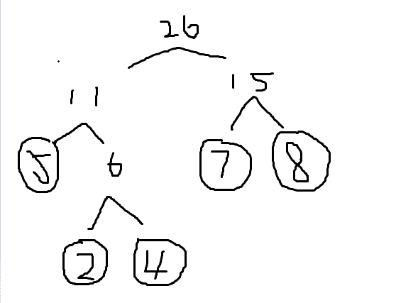

# 顺丰 2017 校招研发工程师笔试试卷

## 1

关于虚拟地址空间理解正确的是（）

正确答案: C   你的答案: 空 (错误)

```cpp
虚拟空间和物理空间的映射是有一定的规律的
```

```cpp
在同一个 X86 兼容的主机上，进程最大寻址空间都是一样的
```

```cpp
通过多级页表来实现虚拟空间到物理空间的映射
```

```cpp
进程最大可寻址的空间时：从 0 开始到 2 的 CPU 地址位数幂的线性空间
```

本题知识点

操作系统

讨论

[linux_ever](https://www.nowcoder.com/profile/141135)

答案：C 解析：A：虚拟空间和物理空间的映射是通过页表进行的，操作系统根据页表映射和置换算法进行操作，无一定的规律可循 B： 在同一个 X86 兼容的主机上，如果 CPU 是 64 位的，最大虚拟空间在 32 位系统下是 2³² 字节，在 64 位下是 2⁶⁴ 字节。D: 进程最大可寻址的空间时：和操作系统的位数也有关系。

发表于 2017-02-13 15:44:49

* * *

[代号 9527](https://www.nowcoder.com/profile/5209018)

万事万物都有其规律                                - 鲁迅

发表于 2018-06-19 17:03:26

* * *

[Lavenderllp](https://www.nowcoder.com/profile/655130036)

为什么感觉这道题一看 A 就是正确的，可能来自于生活经验

发表于 2020-06-22 16:54:38

* * *

## 2

关于虚拟内存管理正确的是（）

正确答案: D   你的答案: 空 (错误)

```cpp
进程的机器代码内存页是不可以交换到磁盘的
```

```cpp
只有进程用于存储数据的数据页才可以交换到磁盘
```

```cpp
为了保证进程的正常运行，进程的执行代码是一次性加载到内存里的
```

```cpp
为了节省物理内存使用，进程不是一次性加载到内存中
```

本题知识点

操作系统

讨论

[我有一个小梦想](https://www.nowcoder.com/profile/419882553)

传统内存管理 一次性 驻留性

虚拟内存管理 无需一次全部加载 随加随用

发表于 2018-11-14 09:36:00

* * *

[梦境迷离](https://www.nowcoder.com/profile/759736)

进程是一个运行的程序 是程序的一个实体当然不能一个进程全部进内存，不然为什么 4g 内存的电脑可以运行 10 多个 G 的网游和单机。那样的话可能需要不停的置换谁受得了这速度。。

发表于 2018-02-27 17:05:50

* * *

[改个名字哈](https://www.nowcoder.com/profile/1564508)

程序处理数据时存在顺序性和局部性，执行时仅调入当前运行使用的页面，根据进程运行的需要，动态加载其它页面

发表于 2017-09-05 20:03:51

* * *

## 3

对递归程序的优化的一般的手段为（）

正确答案: A   你的答案: 空 (错误)

```cpp
尾递归优化
```

```cpp
循环优化
```

```cpp
堆栈优化
```

```cpp
停止值优化
```

本题知识点

递归

讨论

[胖榨菜](https://www.nowcoder.com/profile/9361963)

A  尾递归是指，在函数返回的时候，调用自身本身，并且，return 语句不能包含表达式。这样，编译器或者解释器就可以把尾递归做优化，使递归本身无论调用多少次，都只占用一个栈帧，不会出现栈溢出的情况。 尾递归调用时，如果做了优化，栈不会增长，因此，无论多少次调用也不会导致栈溢出。 遗憾的是，大多数编程语言没有针对尾递归做优化，

发表于 2017-01-12 14:52:58

* * *

[武汉孙一峰](https://www.nowcoder.com/profile/6638059)

**A、B**常见的优化手段有**尾递归**，**迭代**，**循环****尾递归**：在每一次递归的过程中保持了上一次计算的状态，也就是“线性迭代过程”尾递归和一般的递归不同在对内存的占用，普通递归创建 stack 累积而后计算收缩，尾递归只会占用恒量的内存（和迭代一样）举一个简单的例子：

```cpp

	//尾递归，进入下一个函数不再需要上一个函数的环境了，得出结果以后直接返回。 

	string story() {
    从前有座山，山上有座庙，庙里有个老和尚，

	    一天老和尚对小和尚讲故事：story() 
} 

	//非尾递归，下一个函数结束以后此函数还有后续，

	//所以必须保存本身的环境以供处理返回值。  

	string story() { 

	    从前有座山，山上有座庙，庙里有个老和尚，

	    一天老和尚对小和尚讲故事：story(),

	    小和尚听了，觉得还是上牛客网刷题靠谱 。
}

```

编辑于 2017-01-12 14:27:00

* * *

[ggjggs](https://www.nowcoder.com/profile/4704483)

以斐波那契数列为例子普通的递归版本 int fab(int n){    if(n<3)        return 1;    else        return fab(n-1)+fab(n-2);  }具有"线性迭代过程"特性的递归---尾递归过程 int fab(int n,int b1=1,int b2=1,int c=3){    if(n<3)        return 1;    else {        if(n==c)             return b1+b2;        else             return fab1(n,b2,b1+b2,c+1);    }}以 fab(4)为例子普通递归 fab(4)=fab(3)+fab(2)=fab(2)+fab(1)+fab(2)=3  6 次调用尾递归 fab(4,1,1,3)=fab(4,1,2,4)=1+2=3                         2 次调用

编辑于 2017-05-23 15:22:04

* * *

## 4

以 30 为基准,设一组初始记录关键字序列为 (30,15,40,28,50,10,70), 则第一趟快速排序结果为（）

正确答案: B   你的答案: 空 (错误)

```cpp
10，28，15，30，50，40，70
```

```cpp
10，15，28，30,50，40，70
```

```cpp
10，28，15，30，40，50，70
```

```cpp
10，15，28，30，40，50，70
```

本题知识点

排序 *讨论

[机智且英俊的 8 岁少年](https://www.nowcoder.com/profile/5105432)

这个应该和分区算法有关吧，不同的分区算法只保证最终结果，不保证怎么交换的吧

发表于 2017-08-10 14:14:53

* * *

[这个好玩吗？](https://www.nowcoder.com/profile/864589)

选择 B 快排的基本思想是：1.先从数列中取出一个数作为基准数。2.分区过程，将比这个数大的数全放到它的右边，小于或等于它的数全放到它的左边。3.再对左右区间重复第二步，直到各区间只有一个数。可以设置两个指针，一个从前往后遍历，一个从后往前遍历。先从后往前遍历，找到比基准小的和基准交换，然后从前往后遍历，找到比基准大的和基准交换......这道题一趟排序的具体交换过程如下：初始序列：30 15 40 28 50 10 70，注意先从后往前找。第一次交换 30 和 10，因为 10 比 30 小，此时序列：10 15 40 28 50 30 70，然后再从前向后找第二次交换 40 和 30，因为 40 比 30 大，此时序列：10 15 30 28 50 40 70，然后再从后向前找第三次交换 30 和 28，因为 28 比 30 小，此时序列：10 15 28 30 50 40 70，一趟排序结束。具体可以参考：http://blog.csdn.net/morewindows/article/details/6684558

发表于 2017-03-03 17:54:41

* * *

[dragonaxz](https://www.nowcoder.com/profile/1015516)

答案是 b？以 30 为基准，却把 28 排在 30 右面？所以说，我就知道是一道没答案的坑爹题

发表于 2016-12-18 16:25:11

* * *

## 5

下列算法段中，时间复杂度为（）

```cpp
for(i=1;i<=n;i++)
{
    for(j=1;j<=i;j++)
    {
        x=0;
        for(k=1;k<=n;k++)
            x+=a*b;
    }
}
```

正确答案: D   你的答案: 空 (错误)

```cpp
O(n²)
```

```cpp
O(n²*(n+1))
```

```cpp
O(n*(n+1))
```

```cpp
O(n³)
```

本题知识点

复杂度

讨论

[何博明](https://www.nowcoder.com/profile/2621707)

  查看全部)

编辑于 2017-03-18 09:05:34

* * *

[##](https://www.nowcoder.com/profile/570406)

三层循环，每层最多都是 n，所以一共的时间复杂度为 n³，选 D

发表于 2017-01-13 10:11:13

* * *

[哎呦呦呦呦丁](https://www.nowcoder.com/profile/8524281)

n(n+1)/2*n~o(n³)

发表于 2017-01-13 17:28:30

* * *

## 6

假设用于通信的电文由 5 个字母组成，字母在电文中出现的频率分别为 2,4,5,7,8 （根为第一层），用这 5 个字母设计哈弗曼树带权路径长度为（）

正确答案: A   你的答案: 空 (错误)

```cpp
58
```

```cpp
105
```

```cpp
96
```

```cpp
84
```

本题知识点

树

讨论

[丨太阳与月亮丨](https://www.nowcoder.com/profile/9415270)

A 哈夫曼树如图所示
带权路径长度=（2+4）*3+（5+7+8）*2=58

发表于 2017-01-26 19:46:38

* * *

[繁星的夜空 2012](https://www.nowcoder.com/profile/2920593)

**关于哈夫曼树的构造：
首先，对这些已知的数进行排序---从小到大
然后，在这些数中找到两个最小的数字（哈夫曼树是从下往上排列的）
然后，用一个类似于树杈的“树枝”连接上两个最小的数。在顶点处计算出这两个数字的和并写在上面。然后再比较剩下的数字和这个和的大小，再取出两个最小的数字进行排列
然后，如果两个数的和正好是下一步的两个最小数的其中的一个那么这个树直接往上生长就可以了。如果这两个数的和比较大不是下一步的两个最小数的其中一个那么，就并列生长**

发表于 2016-12-24 21:12:51

* * *

[被遗忘的左手](https://www.nowcoder.com/profile/6800856)

26+11+15+6=58，这样计算会快一点

发表于 2017-08-12 09:50:09

* * *

## 7

在上下文及头文件均正常的情况下，下列代码的运行结果是（）

```cpp
int main() {
    Stack S;
    Char x, y;
    InitStack(S);
    x = 'n';
    y = 'g';
    Push(S, x);
    Push(S, 'i');
    Push(S, y);
    Pop(S, x);
    Push(S, 'r');
    Push(S, 't');
    Push(S, x);
    Pop(S, x);
    Push(S, 's');
    while (!StackEmpty(S)) {
        Pop(S, y);
        printf(y);
    };
    printf(x);
}
```

正确答案: B   你的答案: 空 (错误)

```cpp
gstrin
```

```cpp
string
```

```cpp
srting
```

```cpp
stirng
```

本题知识点

C++

讨论

[能卖萌能编程](https://www.nowcoder.com/profile/5789886)

考察的是栈：(1)Push(S,x);Push(S,'i');Push(S,y);执行结果：nig。(2)Pop(S,x);Push(S,'r');Push(S,'t');Push(S,x);执行结果：ni（g）rtg 因为后进先出原则，x 变量存储最近入栈的值 g。(3)Pop(S,x);Push(S,' s');执行结果 ni(g)rt(g)s 同理括号里的的内容弹出，写在这里方便理解。(4) while(!StackEmpty(S)){Pop(S,y);printf(y);}执行结果 strin，就是讲栈 s 尾的内容赋值给变量 y，并打印，根据后进先出原则，将上面的结果倒序。(5)在第(2)中，x 的变量为 g，所以不难猜出，最后打印 g。(6)结果就是：string

发表于 2017-11-04 11:51:38

* * *

[牛客 4199402 号](https://www.nowcoder.com/profile/4199402)

B 根据栈操作 POP（s,x）是出栈 ，把栈 S**栈一个元素给到 x。Push（s,r）是进栈，让 r 进入 s 栈。栈服从先进后出原则。所以这道题最后里面是从栈顶到栈尾是 string，最后一个 while 循环把元素输出出来，所以选 B

发表于 2017-01-14 09:49:09

* * *

[雾切响子](https://www.nowcoder.com/profile/211202)

因为只有 string 是正确的单词，其他的都不是英文单词，而出题人费这么大劲编题目肯定就是为了凑一个单词，所以选 B

发表于 2017-08-11 15:33:36

* * *

## 8

主机 A 向主机 B 连续发送了两个 TCP 报文段，其序号分包是 70 和 100 ，如果 A 发送的第一个报文段丢失了，但第二个报文段达到了 B ， B 在第二个报文段到达后向 A 发送确认，那么这个确认号是多少？

正确答案: C   你的答案: 空 (错误)

```cpp
100
```

```cpp
101
```

```cpp
70
```

```cpp
71
```

本题知识点

网络基础

讨论

[爱豆儿](https://www.nowcoder.com/profile/3365426)

答案是 70，确认号指的是接收方想要接收的报文段的序号，比如我想要 1-5 的报文，在接收过程中我收到了 2-5，而 1 丢了，这时候我肯定跟你说，再发一遍 1，就是这个意思。在这里序号 70 的丢了，所以确认号就是 70，和后面的没关系。

发表于 2017-08-14 14:38:42

* * *

[2016-10-20](https://www.nowcoder.com/profile/5866441)

**    答案为 70，收发两端各有两个字节流，TCP 报文的序列号可以看作向对方发送字节流的起始位置，确认号可以看作他确认对方当前序号之前的字节已经全部接收。这道题是发端同时发送序号从 70 到 99 的字节流和从 100 到 100+n 的字节流，而收端只接受到了 100 到 100+n 的字节流，所以确认号是 70，意思是我确认 70 之前的接收到了，而发端遇到这种情况会重发 70 到 99 的字节流（选择重传）或重发 70 到 99 以及 100 到 100+n 的字节流（退后 n 帧）。**

发表于 2017-04-25 17:05:26

* * *

[HelloSmallKitty](https://www.nowcoder.com/profile/3122997)

答案错了，由于第一个没收到。确认序列号为 70.

发表于 2017-02-13 16:17:39

* * *

## 9

SQL 语句中修改表结构的命令是（）

正确答案: B   你的答案: 空 (错误)

```cpp
MODIFYTALE
```

```cpp
ALTER TABLE
```

```cpp
ALTER STRUCTURE
```

```cpp
MODIFY STRUCTURE
```

本题知识点

数据库

讨论

[牛客 225907 号](https://www.nowcoder.com/profile/225907)

B

修改表结构包括：增加字段、删除字段、增加约束、删除约束、修改缺省值、修改字段数据类型、重命名字段、重命名表。所有的这些动作都是用 alter table 命令执行的。

发表于 2016-12-19 12:14:37

* * *

[同桌冋宇](https://www.nowcoder.com/profile/487105)

> 答案为：B

发表于 2017-01-15 13:54:11

* * *

[沐雪 er](https://www.nowcoder.com/profile/299089)

d 打开表设计器修改表结构

发表于 2019-08-02 21:01:43

* * **