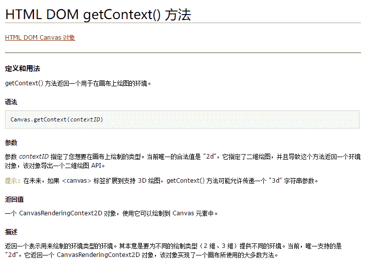
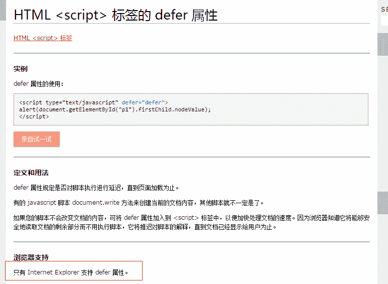
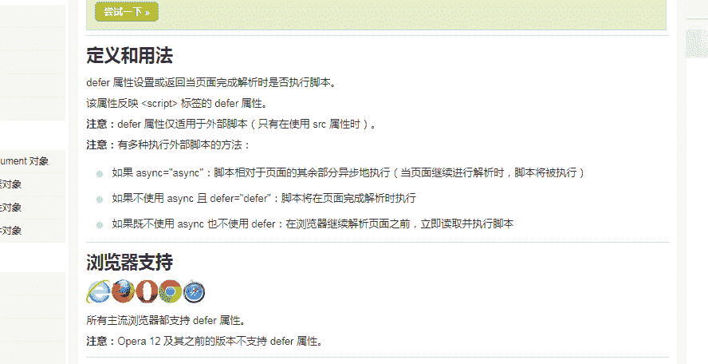
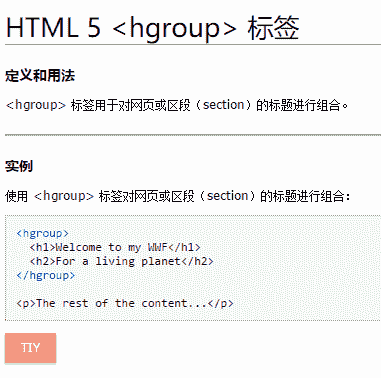

# 盛趣游戏 2017 校招前端工程师笔试试卷

## 1

下面 js 数组的方法中，哪些方法不能改变自身数组？

正确答案: D   你的答案: 空 (错误)

```cpp
pop
```

```cpp
splice
```

```cpp
sort
```

```cpp
concat
```

本题知识点

Javascript 前端工程师 盛趣 Java 工程师 PHP 工程师 算法工程师 大数据开发工程师 信息技术岗 安全工程师 数据分析师 数据库工程师 游戏研发工程师 区块链 测试开发工程师 测试工程师 伴鱼少儿英语 2021

讨论

[Wendy-lxq](https://www.nowcoder.com/profile/802395)

答案应该是 D。因为：  查看全部)

编辑于 2017-05-23 14:29:10

* * *

[白小羊羊羊](https://www.nowcoder.com/profile/2123106)

**pop 方法：**用于删除并返回数组的最后一个元素，把数组长度减 1，并且返回它删除的元素的值。如果数组已经为空，则 pop()不改变数组，并返回 undefined 值**splice()方法：**向/从数组中添加/删除项目，然后返回被删除的项目，该方***改变原始数组**sort()方法**：用于对数组的元素进行排序。返回对数组的引用。请注意，数组在原数组上进行排序，不生成副本。**concat()方法：** 用于连接两个或多个数组。该方法不会改变现有的数组，而仅仅会返回被连接数组的一个副本。综上所述，只有 concat()方法不会改变数组，故选 D

编辑于 2017-05-23 14:29:10

* * *

[还不简单吗](https://www.nowcoder.com/profile/4222073)

Array 对象中的方法：**不改变原数组的有**concat（）：连接数组 join（）：数组=>字符串 slice（）：截取数组的一部分**改变原数组的有：**pop（）删除并返回数组最后一个元素，shift（）与其相反，删除第一个 push（）向数组末添加>=1 个元素，返回数组新长度，unshift（）与其相反，向开头添加 sort（函数）对数组元素排序 splice（）改变（删除、替换）数组内部元素，返回由被删除项目组成的新数组（如果有的话）

编辑于 2019-09-04 21:52:46

* * *

## 2

调用 canvas 对象的哪个方法来获取绘图环境（）

正确答案: B   你的答案: 空 (错误)

```cpp
getContent
```

```cpp
getContext
```

```cpp
getGraphics
```

```cpp
getCanvas
```

本题知识点

HTML 前端工程师 盛趣 2017

讨论

[空空以空空](https://www.nowcoder.com/profile/479441)

1.html5 中没有 getContent()和 getCanvas 方法
2.调用 canvas 对象的 getContext()方法来获取绘图环境

发表于 2017-03-26 16:32:27

* * *

[DannyZhao](https://www.nowcoder.com/profile/1991078)

Canvas 对象的方法

| 方法 | 描述 |
| [getContext()](http://www.w3school.com.cn/jsref/met_canvas_getcontext.asp) | 返回一个用于在画布上绘图的环境。 |

发表于 2017-03-02 15:35:45

* * *

[BenBenBenBenBen](https://www.nowcoder.com/profile/8968625)



发表于 2016-12-20 09:32:01

* * *

## 3

```cpp
for(var i=0;i<5;++i){
    setTimeout(function(){
        console.log(i+ ' ');
    },100);
}
```

以上代码执行的结果是?

正确答案: A   你的答案: 空 (错误)

```cpp
5 5 5 5 5
```

```cpp
0 0 0 0 0
```

```cpp
0 1 2 3 4
```

```cpp
1 2 3 4 5
```

本题知识点

Javascript 前端工程师 盛趣 2017

讨论

[牛客 2353469 号](https://www.nowcoder.com/profile/2353469)

https://www.  查看全部)

编辑于 2017-03-19 19:33:28

* * *

[最强发动机](https://www.nowcoder.com/profile/312167331)

setTimeout() 是异步的，只有等到主线上的都执行完，才会执行异步的，此时 i 已经变成 5。由于共循环了 5 次,异步队列中存放了 五次 setTimeout()，会按照队列的顺序依次执行，且共同访问的是同一个变量。所以每次结果都是 5，特别强调一下，这里和 setTimetou(function,100)中的 100 无关，假如：setTimeout(function,0)，变成 0 结果也是一样的。

发表于 2018-07-05 11:02:51

* * *

[二大爷 ol](https://www.nowcoder.com/profile/3110042)

每次循环进来之后，由于 setTimeout()，内部的匿名函数并没有立即执行，而是等到 100ms 后，而此时 i 早已变为 5。1）可以利用匿名函数创建立即执行函数（或者叫模仿跨级作用域）来解决这个问题；for(var i=0;i<5;++i){(function(num){setTimeout(function(){console.log(num+ ' ');},100);})(i);}创建立即执行函数并传入参数 i。 因为函数的参数是按值传递的，所以 i 的当前值就赋值给了 num，并传递给了 setTimeout 中的闭包，在闭包中保存了 i 当前值的一个副本。看到这里是不是要给我点个赞呢！2）也可以使用 ES6 中的 let 命令 for(let i=0;i<5;++i){    setTimeout(function(){        console.log(i+'');    },100);}

编辑于 2017-08-22 10:59:56

* * *

## 4

下列 js 延迟加载的方式中，只有 IE 浏览器支持的是哪一种方式？（）备注：该题可能过时，请按照之前的知识选择。

正确答案: B   你的答案: 空 (错误)

```cpp
async
```

```cpp
defer
```

```cpp
动态创建 DOM 方式
```

```cpp
按需异步载入
```

本题知识点

Javascript 前端工程师 盛趣 2017

讨论

[jjjjssssss](https://www.nowcoder.com/profile/9460551)

B 

编辑于 2017-05-23 14:32:42

* * *

[麦冬 Mondo](https://www.nowcoder.com/profile/2149927)

这道题答案是错误的，请各位注意，参考链接[`developer.mozilla.org/en-US/docs/Web/HTML/Element/script`](https://developer.mozilla.org/en-US/docs/Web/HTML/Element/script)[`caniuse.com/#search=defer`](https://caniuse.com/#search=defer)

发表于 2017-11-23 13:03:03

* * *

[Ewarm](https://www.nowcoder.com/profile/3870948)



发表于 2017-10-22 14:11:02

* * *

## 5

下列定义的 CSS 选择器中，哪个权重是最低的？（）

正确答案: C   你的答案: 空 (错误)

```cpp
#game div.name
```

```cpp
#game .name
```

```cpp
#game div
```

```cpp
#game .name span
```

本题知识点

前端工程师 盛趣 2017 CSS

讨论

[codpoe](https://www.nowcoder.com/profile/7088724)

  查看全部)

编辑于 2021-08-18 16:35:04

* * *

[、白衬衫ャ](https://www.nowcoder.com/profile/4423542)

```cpp
　选择器的优先级 1.最高优先级是 (直接在标签中的设置样式，假设级别为 1000)<div style="color:Red;"></div>
　　2.次优先级是（ID 选择器 ,假设级别为 100）   #myDiv{color:Red;}
　　3.其次优先级是（类选择器，假设级别为 10） .divClass{color:Red;}
　　4.最后优先级是 （标签选择器，假设级别是 1）  div{color:Red;}
　　5.那么后代选择器的优先级就可以计算了啊
　　比如 .divClass  span { color:Red;}   优先级别就是：10+1=11

```

编辑于 2021-08-18 16:35:04

* * *

[我才是晴天](https://www.nowcoder.com/profile/5496356)

C,越精确，优先级越高

发表于 2017-02-05 21:30:38

* * *

## 6

关于 jsonp 的优缺点的表述中，哪一项是错误的？（）

正确答案: C   你的答案: 空 (错误)

```cpp
它不像 XMLHttpRequest 对象实现的 Ajax 请求那样受到同源策略的限制
```

```cpp
兼容性更好，在更加古老的浏览器中都可以运行，不需要 XMLHttpRequest 或 ActiveX 的支持
```

```cpp
只支持 GET、POST 两种 HTTP 请求，不支持其它类型的 HTTP 请求
```

```cpp
只支持跨域 HTTP 请求，不能解决不同域的两个页面之间如何进行 JavaScript 调用的问题
```

本题知识点

WebServer 前端工程师 盛趣 2017

讨论

[jjjjssssss](https://www.nowcoder.com/profile/9460551)

选 C

*   JSONP 的优点

  查看全部)

编辑于 2017-05-23 14:34:23

* * *

[1nNocзлt](https://www.nowcoder.com/profile/9022343)

**JSONP 的优缺点**
        **1.优点**
                1.1 它不像 XMLHttpRequest 对象实现的 Ajax 请求那样受到同源策略的限制，JSONP 可以跨越同源策略；
                1.2 它的兼容性更好，在更加古老的浏览器中都可以运行，不需要 XMLHttpRequest 或 ActiveX 的支持
                1.3 在请求完毕后可以通过调用 callback 的方式回传结果。将回调方法的权限给了调用方。这个就相当于将 controller 层和 view 层终于分开了。我提供的 jsonp 服务只提供纯服务的数据，至于提供服务以 后的页面渲染和后续 view 操作都由调用者来自己定义就好了。如果有两个页面需要渲染同一份数据，你们只需要有不同的渲染逻辑就可以了，逻辑都可以使用同 一个 jsonp 服务。
        **2.缺点**
                2.1 它只支持 GET 请求而不支持 POST 等其它类型的 HTTP 请求
                2.2 它只支持跨域 HTTP 请求这种情况，不能解决不同域的两个页面之间如何进行 JavaScript 调用的问题。
                2.3 jsonp 在调用失败的时候不会返回各种 HTTP 状态码。
                2.4 缺点是安全性。万一假如提供 jsonp 的服务存在页面注入漏洞，即它返回的 javascript 的内容被人控制的。那么结果是什么？所有调用这个 jsonp 的网站都会存在漏洞。于是无法把危险控制在一个域名下…所以在使用 jsonp 的时候必须要保证使用的 jsonp 服务必须是安全可信的。

发表于 2017-08-16 16:19:29

* * *

## 7

下面哪个不是 RegExp 对象的方法？（）

正确答案: B   你的答案: 空 (错误)

```cpp
test
```

```cpp
match
```

```cpp
exec
```

```cpp
compile
```

本题知识点

Javascript 前端工程师 盛趣 2017

讨论

[蒲蒲蒲爱吃芋头](https://www.nowcoder.com/profile/4351930)

match 是支持正则表达式的 String 对象的方法

发表于 2017-01-05 16:11:43

* * *

[牛客 7387066 号](https://www.nowcoder.com/profile/7387066)

JavaScript RegExp 对象有 3 个方法：test()、exec() 和 compile()。
(1) test() 方法用来检测一个字符串是否匹配某个正则表达式，如果匹配成功，返回 true ，否则返回 false；
(2) exec() 方法用来检索字符串中与正则表达式匹配的值。exec() 方法返回一个数组，其中存放匹配的结果。如果未找到匹配的值，则返回 null；
（3）compile() 方法可以在脚本执行过程中编译正则表达式，也可以改变已有表达式。

转载自 http://www.itxueyuan.org/view/6441.html

编辑于 2017-08-15 15:38:02

* * *

[藍裙子的百合魂](https://www.nowcoder.com/profile/7046624)

**JavaScript RegExp** 对象有 3 个方法：**test()、exec()、compile()**

*   **test()：**检测一个字符串是否匹配某个正则表达式，如果匹配成功，返回 true，否则返回 false；
*   **exec()：**检索字符串中与正则表达式匹配的值，返回一个数组，存放匹配的结果；如果未找到，返回 null；
*   **compile()**:可以在脚本执行过程中编译正则表达式，也可以改变已有表达式。

注：**match 是支持正则表达式的 String 对象的方法**

编辑于 2017-06-19 09:19:50

* * *

## 8

在 HTML5 中，哪个元素用于组合标题元素？（）

正确答案: D   你的答案: 空 (错误)

```cpp
<group>
```

```cpp
<header>
```

```cpp
<headings>
```

```cpp
<hgroup>
```

本题知识点

HTML 前端工程师 盛趣 2017

讨论

[BenBenBenBenBen](https://www.nowcoder.com/profile/8968625)



编辑于 2017-05-23 14:37:00

* * *

[t2gy](https://www.nowcoder.com/profile/724082)

hgroup 已经被废除，这类题过于老旧。建议删除。

发表于 2017-02-03 12:15:02

* * *

[Sunshine211](https://www.nowcoder.com/profile/8044822)

注意:  本元素已经从 HTML5（W3C）规范中删除，但是它仍旧在 WHATWG 的 HTML 版本里。大多数浏览器都部分地实现，所以它不太可能消失。 但是其轮廓算法(outline algorithm)未在任何浏览器中实现，因此  <hgroup> 语义仍旧是理论的。HTML5 (W3C) 规范提供了如何处理 [副标题，小标题，可选标题和标语](http://www.w3.org/TR/html5/common-idioms.html#sub-head) （Subheadings, subtitles, alternative titles and taglines）的建议。

发表于 2017-04-05 15:52:38

* * *

## 9

下面关于 this 工作原理的描述,哪一个是错误的？

正确答案: C   你的答案: 空 (错误)

```cpp
在全局范围内，this 指向全局对象（浏览器下指 window）
```

```cpp
对象函数调用时，this 指向当前对象
```

```cpp
全局函数调用时，this 指向全局函数
```

```cpp
使用 new 实例化对象时，this 指向新创建的对象
```

本题知识点

Javascript 前端工程师 盛趣 2017

讨论

[大星星和小猩猩](https://www.nowcoder.com/profile/9374535)

函数里的 this 可以分为两种来记忆：如果是使用 new 方式创建对象，this 指向新建的那个对象；如果只是普通的调用，谁调用这个函数，函数里的 this 就指向谁~

发表于 2017-06-21 18:30:03

* * *

[我疯癫我自由](https://www.nowcoder.com/profile/5969520)

this 有四种情况！1)当在函数调用的时候指向 widow2)当方法调用的时候指向调用对象 3)当用 apply 和 call 上下文调用的时候指向传入的第一个参数 4)构造函数调用指向实例对象

发表于 2017-07-12 11:22:48

* * *

[六月熊](https://www.nowcoder.com/profile/7492130)

 JS 中 this 关键字， 它代表函数运行时，自动生成的一个内部对象，只能在函数内部使用。c， 全局函数调用时，this 指向全局函数； 应该是指向调用全局函数的对象。关于 JS 中的 this，详解请看博客：http://www.cnblogs.com/kongxy/p/4581223.html

发表于 2016-12-17 23:10:54

* * *

## 10

下面哪一种不属于 js 的六种基本数据类型？

正确答案: D   你的答案: 空 (错误)

```cpp
undefined
```

```cpp
string
```

```cpp
null
```

```cpp
Object
```

本题知识点

Javascript 前端工程师 盛趣 2017

讨论

[拯救世界大超人](https://www.nowcoder.com/profile/7861776)

  查看全部)

编辑于 2017-05-23 14:39:35

* * *

[miao123](https://www.nowcoder.com/profile/241335)

ECMAScript 中有 5 中简单数据类型（也称为基本数据类型）： Undefined、Null、Boolean、Number 和 string。还有一种复杂数据类型——Object。（摘自高级程序设计）

发表于 2017-06-21 23:05:17

* * *

[stone88](https://www.nowcoder.com/profile/5699390)

es2017 中的说明：

4.3.2primitive value

member of one of the types Undefined, Null, Boolean, Number, Symbol, or String as defined in clause [6](http://www.ecma-international.org/ecma-262/8.0/index.html#sec-ecmascript-data-types-and-values)

链接：[`www.ecma-international.org/ecma-262/8.0/index.html`](http://www.ecma-international.org/ecma-262/8.0/index.html)#sec-terms-and-definitions

编辑于 2017-08-12 15:07:05

* * *

## 11

```cpp
var arr=[{a:1},{}];
arr.forEach(function(item,idx){
    item.b=idx;
});
```

上面代码执行后，  arr  的值是：（）

正确答案: B   你的答案: 空 (错误)

```cpp
[{a:1},{}]
```

```cpp
[{a:1,b:0},{b:1}]
```

```cpp
[{a:1,b:1},{b:1}]
```

```cpp
[{a:!,b:0},{b:0}]
```

本题知识点

Javascript 前端工程师 盛趣 2017

讨论

[Orange。](https://www.nowcoder.com/profile/608812)

应该选 B。forEach()方法是对数组中的每一项运行给定函数。回调函数的参数 item 为数组当前项，idx 为当前索引。本题就是把数组每一项添加属性 b，并且属性 b 的值为当前项的数组索引值。另外，forEach()方法没有返回值，所以不能将 arr.foreach()像其他数组迭代方法那样赋值给某一个变量。

编辑于 2017-08-09 21:41:02

* * *

[易 _ 刺猬](https://www.nowcoder.com/profile/8385943)

```cpp

	var arr = [{a:1}, {}];

	arr.forEach (function (item, idx) {

	    item.b = idx;

	});

```

首先，forEach 没有返回值第一次，item 值为 {a:1}第一次运行后 item 值为 {a:1,b:0}第二次，item 值为 {}第二次运行后 item 值为 {b:1} item 的变化会影响 arr ，因为对象的浅拷贝

发表于 2018-10-11 20:44:54

* * *

[內啡肽](https://www.nowcoder.com/profile/2977017)

arr.forEach（a,b,c）这个函数用于数组的遍历，其中三个参数 abc 意义如下 a 代表 arr[0]---arr[arr.length-1]b 代表 0---arr.length-1c 代表 arr//参数 c 被省略了所以第一次循环 a={a:1} , b=0;执行 a.b = 0 后，以为 a 是一个对象，即给对象啊添加一个 b 属性，值为 0 得到[{a:1,b:0},{}]第二次循环也是这个意思

发表于 2017-08-17 15:45:56

* * *

## 12

哪一个不是浏览器默认的天生 inline-block 标签（拥有内在尺寸，可设置高宽，不会自动换行）？

正确答案: C   你的答案: 空 (错误)

```cpp
<button>
```

```cpp
<input>
```

```cpp
<label>
```

```cpp

```

本题知识点

HTML 前端工程师 盛趣 2017

讨论

[最讨厌晚上 9 点半，钉钉响起的声音](https://www.nowcoder.com/profile/303433)

1.常见的块级元素( **自动换行**  查看全部)

编辑于 2017-05-23 14:41:57

* * *

[熊在匣子里](https://www.nowcoder.com/profile/2046212)

要理解 display:inline、block、inline-block 的区别，需要先了解 HTML 中的块级（block）元素和行级（inline）元素的特点，行内元素也叫内联元素。 块级元素 总是另起一行开始； 高度，行高以及顶、底边距都可以控制； 宽度缺省是它所在容器的 100%，除非设定一个宽度。 块级元素通常作为其他元素的容器，可以容纳内联元素和其他块元素。block element 的 HTML 标签如下： address-地址 blockquote-块引用 center-居中对齐块 div-常用块级元素 dl-定义列表 form-交互表单 fieldset-form 控制组 hr-水平分隔线 ol-排序表单 ul-非排序列表 dir-目录列表 p-段落 pre-格式化文本 isindex-input prompt menu-菜单列表 table-表格 h1...h6-标题 noframes-frames 可选内容（对于不支持 frame 的浏览器显示此区块内容） noscript-可选脚本内容（对于不支持 script 的浏览器显示此内容） 行级元素 和其他元素都在一行上； 高度，行高以及顶、底边距不可改变； 高度就是它所容纳的文字或图片的宽度，不可改变。 一般都是基于语义级（semantic）的基本元素，只能容纳文本或者其他内联元素，内联元素的 HTML 标签分类如下： a-锚点 abbr-缩写 acronym-首字 font-字体设定（不推荐） b-粗体（不推荐） big-bidi override em-强调 br-换行 small-小字体文本 strong-粗体强调 i-斜体 img-图片 input-输入框 label-表格标签 select-项目选择 textarea-多行文本输入框 u-下划线 var-定义变量 cite-引用 code-计算机代码（在引用源码的时候需要） dfn-定义字段 kbd-定义键盘文本 q-短引用 s-中划线（不推荐） strike-中划线 sub-下标 sup-上标 tt-电传文本 HTML 中有些元素是可变元素，可根据上下文语境决定该元素为块元素或者内联元素。 applet-java applet button-按钮 del-删除文本 iframe-inline frame ins-插入的文本 map-图片区块（map） object-object 对象 script-客户端脚本 display:block 就是将元素显示为块级元素，display:inline 则将元素显示为行内元素。 display：inline-block 将元素显示为行内元素，但是元素的内容作为块元素处理。旁边的内联元素和该对象显示在同一行，并且允许空格，但是该元素具有块元素的特性，可以设置其高度，宽度等属性。在同一行内有不同高度内容的元素时，通常要设置对齐方式如 vertical-align: top;来使元素顶部对齐。 兼容性 CSS 中使用 display:inline-block;来样式化，在 Firefox, Safari, Google Chrome 和 IE 8 及以上是有效的。但是在早期的 IE，比如 IE 7，对行内元素设置 inline-block 无法实现 inline-block 的效果。只是触发了块元素的 layout，而行内元素本身就是行布局，所以触发后，依然是行布局。 对 IE8 以下的版本，可以采用以下两种方法来实现 inline-block 的效果： 先用 display:inline-block 属性触发块元素，然后再定义 display:inline，让块元素呈递为内联对象（原理：这是 IE 的一个经典 bug，如果先定义了 display:inline-block，然后再设置 display 回 inline 或 block，layout 不会消失），代码如下： 1 div {display:inline-block;}2 div {display:inline;} 将块元素设置为内联对象(display:inline)，然后通过 zoom:1 触发块元素的 layout，代码如下： div {display:inline; zoom:1;}

发表于 2017-03-24 10:07:19

* * *

[大曼儿](https://www.nowcoder.com/profile/631685)

行内块元素有，input textarea object img select，默认属性是 inline-block

发表于 2017-02-07 13:35:48

* * *

## 13

超链接访问过后 hover 样式就不出现了，被点击访问过的超链接样式不再具有 hover 和 active 了，解决方法是改变 CSS 属性的排列顺序？（）

正确答案: A   你的答案: 空 (错误)

```cpp
a:link {} a:visited {} a:hover {} a:active {}
```

```cpp
a:visited {} a:link {} a:hover {} a:active {}
```

```cpp
a:active {} a:link {} a:hover {} a:visited {}
```

```cpp
a:link {} a:active {} a:hover {} a:visited {}
```

本题知识点

前端工程师 盛趣 2017 CSS

讨论

[最讨厌晚上 9 点半，钉钉响起的声音](https://www.nowcoder.com/profile/303433)

Link,visited,hover,active. L o v e h a t e  爱与恨

发表于 2017-04-10 23:18:12

* * *

[痴心布偶](https://www.nowcoder.com/profile/4418564)

固定顺序驴 lv 哈 ha

发表于 2017-01-31 07:59:42

* * *

[准了](https://www.nowcoder.com/profile/5672215)

为了符合浏览器解析 CSS 所遵循的就近原则，将一般的放在上面，将特殊的放在下面。a:link; a:visited; a:hover; a:active;a:hover 必须放在 a:link 和 a:visited 之后；a:active 必须放在 a:hover 之后。

编辑于 2017-05-23 14:43:50

* * *

## 14

表示新开一个标签页的超链接代码是：（）

正确答案: C   你的答案: 空 (错误)

```cpp
<a href=URL target=_new>..</a>
```

```cpp
<a href=URL target=_self>..</a>
```

```cpp
<a href=URL target=_blank>..</a>
```

```cpp
<a href=URL target=_parent>..</a>
```

本题知识点

HTML 前端工程师 盛趣 2017

讨论

[熊在匣子里](https://www.nowcoder.com/profile/2046212)

  查看全部)

编辑于 2017-05-23 14:45:00

* * *

[summer_1996](https://www.nowcoder.com/profile/6486677)

_blank:在新窗口打开 _self:在当前窗口打开 _parent:在父级窗口打开 _top:在最顶级窗口打开

发表于 2018-03-16 10:19:07

* * *

[小白白油](https://www.nowcoder.com/profile/486558638)

标签的 target 属性有 5 个值： _self：在当前框架中打开链接 _blank：在一个全新的空白窗口中打开链接 _top：在顶层框架中打开链接 _parent：在当前框架的上一层打开链接 framename：在指定的框架或浮动框架内打开链接

发表于 2019-09-25 17:27:03

* * *

## 15

在实际使用中，下面哪一个可以很方便的获得页面中定义的 HTML 对象？（）

正确答案: D   你的答案: 空 (错误)

```cpp
document.GetElementsByTagName
```

```cpp
document.getElementByTagNames
```

```cpp
document.getElementsById
```

```cpp
document.getElementById
```

本题知识点

HTML 前端工程师 盛趣 2017

讨论

[one154](https://www.nowcoder.com/profile/8495710)

A 错在首字母大写，应为 get……，后面是对的； B 错在 s，正确应为 getElementsByTagName； C 也错在 s，正确应为 getElementById； 记住首字母小写，Id 无 s，TageName 有 s 就好了。

编辑于 2017-05-23 14:46:24

* * *

[顾惜朝](https://www.nowcoder.com/profile/8621215)

Id 是唯一的，所以是 Element，Tag 不一定是唯一，所以是 Elements

发表于 2017-02-27 15:33:06

* * *

[Sunshine211](https://www.nowcoder.com/profile/8044822)

套路啊， 啊啊，啊， 啊， 啊， 啊， ，啊，啊， ，啊，啊， 啊， 啊， ，啊， 啊， 啊， ，啊，啊， 啊， ，啊，啊， 啊， 啊， ，啊

发表于 2017-03-07 11:35:31

* * *

## 16

```cpp
var F=function(){};
Object.prototype.a=function(){};
Function.prototype .b=function(){};
var f=new F();
```

关于这段代码的描述,正确的是：

正确答案: A   你的答案: 空 (错误)

```cpp
f 能取到 a，但取不到 b
```

```cpp
f 能取到 a,b
```

```cpp
F 能取到 b，不能取到 a
```

```cpp
F 能取到 a，不能取到 b
```

本题知识点

Javascript 前端工程师 盛趣 2017

讨论

[夏🌸樱](https://www.nowcoder.com/profile/729425994)

```cpp
（注：从网上找到了一个很详细的答案）

网上有一道美团外卖的面试题是这样的： Function.prototype.a = 'a';
Object.prototype.b = 'b';
function Person(){};
var p = new Person();
console.log('p.a: '+ p.a); // p.a: undefined
console.log('p.b: '+ p.b); // p.b: b 问为什么？

有不少同学第一眼看上去就觉得很疑惑，p 不是应该继承了 Function 原型里面的属性吗，为什么 p.a 返回值是 undefined 呢？
其实，只要仔细想一想就很容易明白了，Person 函数才是 Function 对象的一个实例，所以通过 Person.a 可以访问到 Function
原型里面的属性，但是 new Person()返回来的是一个对象，它是 Object 的一个实例,是没有继承 Function 的，所以无法访问
Function 原型里面的属性。但是,由于在 js 里面所有对象都是 Object 的实例，所以，Person 函数可以访问到 Object 原型里面的
属性，Person.b => 'b' 
```

发表于 2018-07-19 20:05:48

* * *

[亭亭如盖矣](https://www.nowcoder.com/profile/6540381)

浅显一点的方法(非考点):  用 instanceof 判别，f instanceof Object  // true ; f instanceof Function //false ;由此可见用 new 操作符创建的 f 只是对象,所以只能继承于 Object.prototype. 但是 F 是多继承，可以通过 F.a , F.b 拿到 a,b 的值, 具体原因得用原型链解释

发表于 2017-08-12 17:27:29

* * *

[牛客 526366 号](https://www.nowcoder.com/profile/526366)

这个问题涉及到 js 的原型继承 1\.  f.__proto__ === f[的构造函数].prototype === F.prototype2\.  F.prototype.__proto__ ===  (F.prototype)[的构造函数].prototype ===   Object.prototype (所以 a 能够 通过 f.a 访问)3\. f.constructor === F4\. F.__proto__ === F[的构造函数].prototype === Function.prototype (所以 b 可以通过, f.constructor.b 访问到)注意: **(F.prototype)[的构造函数] === Object****F[的构造函数] === Function**多啰嗦一句( js 的继承靠的是 __proto__ ,并不是 prototype)

发表于 2017-01-21 18:28:39

* * *

## 17

下列哪一项不是 HTML5 中新增加的标签？（）

正确答案: C   你的答案: 空 (错误)

```cpp
nav
```

```cpp
article
```

```cpp
caption
```

```cpp
video
```

本题知识点

HTML 前端工程师 盛趣 2017

讨论

[老腊肉学长](https://www.nowcoder.com/profile/8463423)

caption 标签是定义表格标题

发表于 2017-10-24 20:41:27

* * *

[熊在匣子里](https://www.nowcoder.com/profile/2046212)

HTML5 新增加的标签标签定义外部的内容（结构元素）