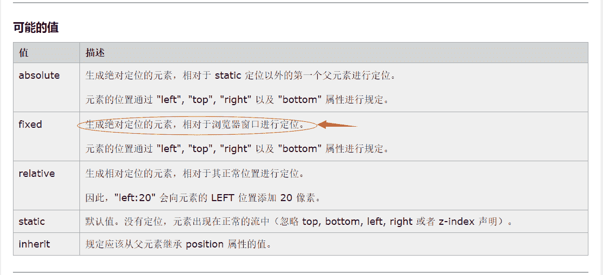
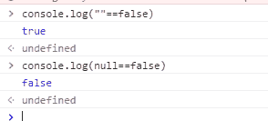
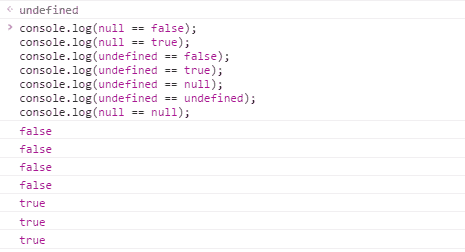
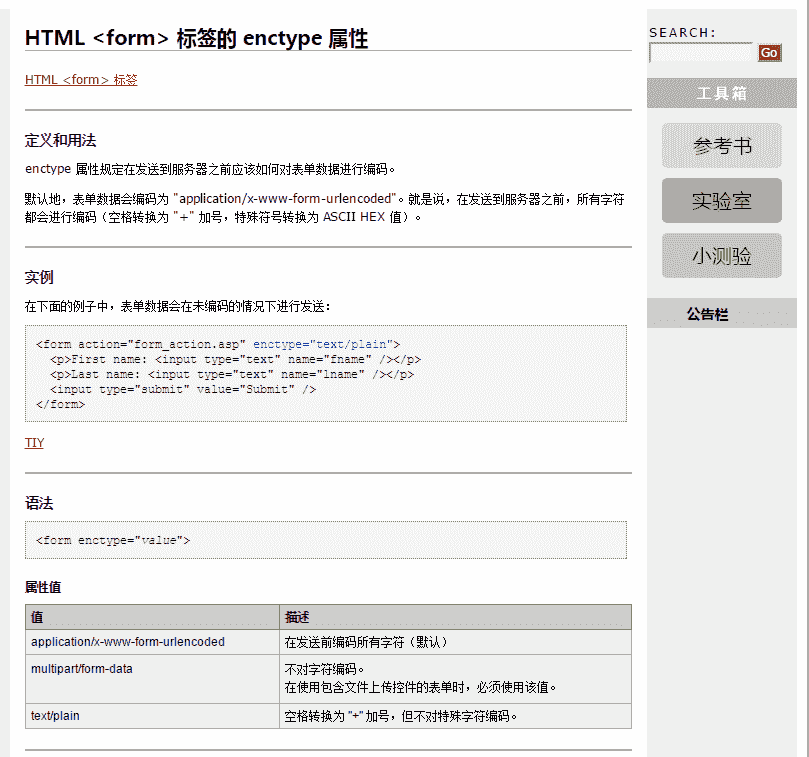

# 深圳锐明 2017 校招 java 工程师笔试试卷

## 1

在一个 mysql 查询中，使用哪一个关键字能去除重复列值（）

正确答案: C   你的答案: 空 (错误)

```cpp
group by
```

```cpp
order by
```

```cpp
distinct
```

```cpp
limit
```

本题知识点

数据库 Java 工程师 锐明技术 2017

讨论

[丨太阳与月亮丨](https://www.nowcoder.com/profile/9415270)

C 关键词 DISTINCT 用于返回唯一不同的值。SELECT DISTINCT 列名称 FROM 表名称

发表于 2017-01-28 12:35:54

* * *

[Scheaven](https://www.nowcoder.com/profile/2065035)

SQL SELECT DISTINCT 语句在表中，可能会包含重复值。这并不成问题，不过，有时您也许希望仅仅列出不同（distinct）的值。关键词 DISTINCT 用于返回唯一不同的值。语法：SELECT DISTINCT 列名称 FROM 表名称

发表于 2016-12-27 09:45:27

* * *

[闲鱼总算翻了身](https://www.nowcoder.com/profile/909589300)

关键词 DISTINCT 用于返回唯一不同的列值。
SELECT DISTINCT 列名称 FROM 表名称

发表于 2021-07-21 09:31:08

* * *

## 2

指出以下程序运行的结果是

```cpp
public class Example{
    String str=new String("good");
    char[]ch={'a','b','c'};
    public static void main(String args[]){
        Example ex=new Example();
        ex.change(ex.str,ex.ch);
        System.out.print(ex.str+" and ");
        System.out.print(ex.ch);
    }
    public void change(String str,char ch[]){
   //引用类型变量，传递的是地址，属于引用传递。
        str="test ok";
        ch[0]='g';
    }
}
```

正确答案: B   你的答案: 空 (错误)

```cpp
good and abc
```

```cpp
good and gbc
```

```cpp
test ok and abc
```

```cpp
test ok and gbc
```

本题知识点

Java Java 工程师 锐明技术 2017

讨论

[Eric.锦](https://www.nowcoder.com/profile/4846733)

  查看全部)

编辑于 2017-03-19 20:02:33

* * *

[Linsanity](https://www.nowcoder.com/profile/7457652)

注意：1、**java 语言参数之间只有值传递，包括按值调用和按引用调用。** **一个方法可以修改传递引用所对应的变量值，而不能修改传递值调用所对应的变量值。**按值调用：包括八大基本数据类型都是按值调用。传值的时候，也就是说方法得到的是所有参数值的一个**拷贝。**按引用调用：数组、对象。传值时候，传递的是引用地址的拷贝，但是都是指向同一个对象。2、**String 是不可变类（final and Immutable）**,这里只是把副本的指向修改成指向“test ok”，原地址 str 的指向的值没有发生改变。

发表于 2017-02-26 22:36:00

* * *

[狮锅艺](https://www.nowcoder.com/profile/8283509)

在[Java](http://lib.csdn.net/base/java)中，每一个 new 语句返回的都是一个指针的引用，只不过在大多数情况下 Java 不关心如何操作这个指针，**唯一需要注意的是在给函数传递对象的时候**

传值和引用中有静态变量，私有变量，clone 等问题，对于基本数据类型和对象变量，存在不一样的操作：

*   基本类型变量：传递**值**的副本（副本变，本身不变）
*   对象变量：传递**引用**的副本（副本变，本身也变）【即复制指向地址的指针】

    **不论 Java 参数的类型是什么，一律传递的都是参数的副本**

在 Java 中存在一个比较特殊的类型，String，也是对象型变量，只不过 String 是一个非可变类，使得值传递和引用传递没有区别

发表于 2017-07-04 19:49:50

* * *

## 3

当窗口上下滚动时，能始终固定在视野顶端的是（div 的直接父级元素是 ）（）

正确答案: A   你的答案: 空 (错误)

```cpp
<div style=”position:fixed;top:0;”></div>
```

```cpp
<div style=”position:absolute;top:0;”></div>
```

```cpp
<div style=”position:relative;top:0;”></div>
```

```cpp
<div style=”margin-top:0;”></div>
```

本题知识点

锐明技术 2017 CSS

讨论

[丨小确幸丨](https://www.nowcoder.com/profile/1657851)



编辑于 2017-03-19 09:27:25

* * *

[wenorwen](https://www.nowcoder.com/profile/9115670)

fixed 和 absolute 在没有滚动条的时候无差异；在有滚动条的时候，fixed 不会随滚动条的移动而移动，而 absolute 则会随之移动。

发表于 2018-06-18 16:39:40

* * *

[徐子墨](https://www.nowcoder.com/profile/695443501)

定义中主要学习了，两个定位，一个是相对定位，relative  一个是绝对定位，absolute。如果想定位在一个部位，如果没有给一个作为相对的定位，那么会默认按照 body，作为父级定位。所以应用 position：absolute。但是想让目标随着视窗移动而定位，所以要定位视窗，学习了一下。fixed 以视窗为目标，所以选择 fixed

编辑于 2019-01-03 20:29:15

* * *

## 4

以下 js 表达式返回 false 的是（）

正确答案: C   你的答案: 空 (错误)

```cpp
1==true
```

```cpp
“”==false
```

```cpp
false==null
```

```cpp
null==undefined
```

本题知识点

Javascript Java 工程师 锐明技术 2017

讨论

[NextStationHH](https://www.nowcoder.com/profile/6386641)

正确答案是 C，不要被误导了。

编辑于 2017-03-19 19:36:34

* * *

[1988coding](https://www.nowcoder.com/profile/313317)

undefined 和 null 与任何有意义的值比较返回的都是 false，但是 null 与 undefined 之间互相比较返回的是 true。

```cpp
console.log(null == false); 
console.log(null == true);
console.log(undefined == false);
console.log(undefined == true); 
console.log(undefined == null);
console.log(undefined == undefined);
console.log(null == null); 
```



编辑于 2017-08-28 10:24:18

* * *

[黄浩群](https://www.nowcoder.com/profile/9518774)

null 与 undefined 在与其他数相等运算时不进行类型转换

发表于 2017-03-02 00:15:11

* * *

## 5

当表单中包含文件上传控件时，需要将 enctype 设置为（）

正确答案: B   你的答案: 空 (错误)

```cpp
application/x-www-form-urlencoded
```

```cpp
multipart/form-data
```

```cpp
text/explain
```

```cpp
file-data
```

本题知识点

HTML Java 工程师 锐明技术 2017

讨论

[大星星和小猩猩](https://www.nowcoder.com/profile/9374535)

```cpp
enctype 属性规定在发送到服务器之前应该如何对表单数据进行编码。

属性值

application/x-www-form-urlencoded 
在发送前编码所有字符（默认） 

multipart/form-data 
不对字符编码。 在使用包含文件上传控件的表单时，必须使用该值。

text/plain 
空格转换为 "+" 加号，但不对特殊字符编码。
```

发表于 2017-03-19 09:57:32

* * *

[jjjjssssss](https://www.nowcoder.com/profile/9460551)



发表于 2016-12-27 22:05:54

* * *

[我不是刘鑫琦](https://www.nowcoder.com/profile/3430248)

enctype 属性规定在发送到服务器之前应该如何对表单数据进行编码。 属性值 application/x-www-form-urlencoded 在发送前编码所有字符（默认） multipart/form-data 不对字符编码。 在使用包含文件上传控件的表单时，必须使用该值。 text/plain 空格转换为 "+" 加号，但不对特殊字符编码。

发表于 2017-11-29 14:36:48

* * *

## 6

欲构造 ArrayList 类的一个实例，此类实现了 List 接口，下列哪个方法是正确的？

正确答案: B   你的答案: 空 (错误)

```cpp
ArrayList myList=new Object（）
```

```cpp
List myList=new ArrayList()
```

```cpp
ArrayList myList=new List()
```

```cpp
List myList=new List()
```

本题知识点

Java Java 工程师 锐明技术 2017

讨论

[SunburstRun](https://www.nowcoder.com/profile/557336)

答案是 B          本题考查在 Java 中如何实现接口。选项 A 错误，只是实例化了一个 ArrayList 类的对象 myList，而没有实现接口；选项 B 正确，用 List 来声明 MyList 实现接口，并用 ArrayList 构造出一个实例；选项 C 错误，List 并不是一个类，不能用 new 关键字；选项 D 错误，接口不能实例化—个接口。故本题的答案是 B。

发表于 2016-12-21 14:50:44

* * *

[Sishuo](https://www.nowcoder.com/profile/1490527)

属于面向接口编程，是 java 语言的一大优点。ArrayList 虽然是一个具体的类，按照 ArrayList myList=new ArrayList();的确也可以生成一个 myList 对象，而且编译也不会报错。但是在实际开发中时不采用这样的方式即实际开发时都是 接口名 xxx=new 接口某实现类（）。这样便于
1、便于程序规范化设计 
2、便与团队协同开发 
3、便于转换为组件 
4、方便的代码复用，无需了解技术细节。

发表于 2017-12-11 14:35:15

* * *

[我才是方枪枪](https://www.nowcoder.com/profile/4386854)

题目就错了，类继承了接口？

发表于 2017-06-06 17:27:46

* * *

## 7

有一段 html 代码：
<div style="color:red; text-color:blue;"><span   style="color:green;text-color:black;">Hello</span></div>,
那么"Hello"的字体颜色是（）

正确答案: C   你的答案: 空 (错误)

```cpp
red
```

```cpp
blue
```

```cpp
green
```

```cpp
black
```

本题知识点

HTML 锐明技术 2017

讨论

[我才是晴天](https://www.nowcoder.com/profile/5496356)

C,text-color 不存在这个，用 color

发表于 2017-02-07 20:04:14

* * *

[大曼儿](https://www.nowcoder.com/profile/631685)

没有 text-color 这个属性，文字颜色统一用 color.再加上就近原则

发表于 2017-01-31 11:13:45

* * *

[冷色探戈](https://www.nowcoder.com/profile/907563)

CSS 的**就近原则** 。

发表于 2017-01-21 17:58:14

* * *

## 8

以下代码符合 html5 规范的是

正确答案: B   你的答案: 空 (错误)

```cpp
<div><span></div>
```

```cpp
<input type=”text” disabled>
```

```cpp
<label id=”mylabel”></label>
```

```cpp
<div myname=”javk”></div>
```

本题知识点

HTML 锐明技术 2017

讨论

[小北风.](https://www.nowcoder.com/profile/4674341)

A：span 标签需要双闭合 B：disabled 可以单独写，也可以 disabled=“disabled”；C:label 只有两个属性 for（规定 label 绑定到哪个表单元素）和 form（规定 label 字段所属的一个或多个表单）D：直接错误

发表于 2017-12-24 18:59:21

* * *

[人间失格 _](https://www.nowcoder.com/profile/9663314)

**html5 规范不允许加 id，但是浏览器厂商却实现了这个功能,**label 标签只有两个属性 for（ 规定 label 绑定到哪个表单元素。 ）form（规定 label 字段所属的一个或多个表单）

发表于 2017-04-15 19:59:17

* * *

[来自大海的呼唤](https://www.nowcoder.com/profile/5205845)

input 不需要自闭合吗？

发表于 2017-03-20 00:35:47

* * *

## 9

以下表达式中，正确的是（）

正确答案: C D   你的答案: 空 (错误)

```cpp
byte i=128
```

```cpp
boolean i=null
```

```cpp
long i=0xfffL
```

```cpp
double i=0.9239d
```

本题知识点

Java

讨论

[牛客 8858064 号](https://www.nowcoder.com/profile/8858064)

null 表示没有地址；null 可以赋值给引用变量，不能将 null 赋给基本类型变量，例如 int、double、float、boolean

发表于 2017-05-10 09:49:09

* * *

[呆尐兔兔](https://www.nowcoder.com/profile/6638666)

A byte ，1 字节，值域-128 至 127 B boolean 并非包装对象 Boolean，不能赋值为 null

发表于 2017-01-05 09:28:44

* * *

[bbblemon](https://www.nowcoder.com/profile/3807435)

**选 C、D****A、byte：-128~127。直接给个 128，编译器会认为是 int 值，这个时候需要强转成 byte。****B、boolean：这可是基本数据类型啊，只有 false，true。默认值是 false。一旦是包装类 Boolean，那默认值是 null。ojbk****C、十六进制没毛病****D、double 这个东西本来就可以写成有 d 的形式。**

发表于 2018-07-01 13:31:52

* * *

## 10

var arr=[1,2,3];arr.splice(1,1,3,4).arr=____.

你的答案

本题知识点

Java 工程师 锐明技术 2017

讨论

[dong1234](https://www.nowcoder.com/profile/662644)

```cpp
arrayObject.splice(index,howmany,item1,.....,itemX)
index：要删除的其实下标位置
howmany: 要删除多少个
以上两个参数必须有。
item1，.....,itemx:在要删除的位置上新增这几个数据
本题中 arr.splice(1,1,3,4)：删掉下标为 1 开始的元素，并在该位置上新增 3,4.所以结果为 1,3,4,3
```

发表于 2017-08-10 11:37:36

* * *

[牛客 963702424 号](https://www.nowcoder.com/profile/963702424)

Arr.splice(开始删除的下标，要删除的个数，在删除的地方加上其他的元素)

发表于 2022-01-04 16:05:56

* * *

[笑看一生ね](https://www.nowcoder.com/profile/907435578)

var arr=[1,2,3];arr.splice(1,1,3,4).arr=____. ```cpp
arrayObject.splice(index,howmany,item1,.....,itemX)
index：要删除的其实下标位置
howmany: 要删除多少个
以上两个参数必须有。
item1，.....,itemx:在要删除的位置上新增这几个数据
本题中 arr.splice(1,1,3,4)：删掉下标为 1 开始的元素，并在该位置上新增 3,4.所以结果为 1,3,4,3
```

多余的后面就覆盖了 

发表于 2020-07-18 15:31:34

* * *

## 11

在数据库中，删除表操作的关键字是 1。

你的答案 (错误)

1 参考答案 (1) drop

本题知识点

数据库 Java 工程师 锐明技术 2017

讨论

[梧桐下冬眠](https://www.nowcoder.com/profile/985873)

drop

发表于 2017-08-08 21:37:06

* * *

[CANG@](https://www.nowcoder.com/profile/7623980)

删除数据库，删除数据表都用 drop 关键字 删除表中的字段元素，使用 delete 关键字

发表于 2017-09-26 19:52:26

* * *

[Czhou](https://www.nowcoder.com/profile/2026816)

drop

发表于 2017-12-20 13:55:39

* * *

## 12

若某二叉树的前序遍历访问顺序是 abdgcefh，中序遍历顺序为 dbgaechf，则后序遍历顺序为 1。

你的答案 (错误)

1 参考答案 (1) dgbehfca

本题知识点

树 Java 工程师 锐明技术 2017

讨论

[*迷离＊](https://www.nowcoder.com/profile/9173786)

dgbehfca 没啥好说的，根据前序中序把树画出来在写后序就可以了。

发表于 2017-08-10 14:17:30

* * *

[ChrisZZ](https://www.nowcoder.com/profile/2159092)

dgbehfca 先递归处理数据以造树 再由树写岀

发表于 2017-08-28 00:22:35

* * *

[来来](https://www.nowcoder.com/profile/2407963)

前序遍历：      1.访问根节点      2.前序遍历左子树      3.前序遍历右子树  中序遍历：      1.中序遍历左子树      2.访问根节点      3.中序遍历右子树  后序遍历：      1.后序遍历左子树      2.后序遍历右子树      3.访问根节点 还是需要画图

发表于 2017-08-11 15:28:38

* * *

## 13

Java 中能够产生事件的对象都可以称为 1，如文本框，按钮，键盘等。

你的答案 (错误)

1 参考答案 (1) 事件源

本题知识点

Java Java 工程师 锐明技术 2017

讨论

[RootLocalhost](https://www.nowcoder.com/profile/8047172)

事件源

发表于 2018-07-28 14:57:14

* * *

[霏微物像移](https://www.nowcoder.com/profile/8624649)

java 中能产生事件的对象是事件源

发表于 2017-10-25 23:53:20

* * *

[牛客 963702424 号](https://www.nowcoder.com/profile/963702424)

Java 中能产生事件的对象叫做事件源

发表于 2022-01-04 16:02:51

* * *

## 14

一颗二叉树第 5 层节点数最多是 1

你的答案 (错误)

1 参考答案 (1) 16

本题知识点

树 Java 工程师 锐明技术 2017

讨论

[ChrisZZ](https://www.nowcoder.com/profile/2159092)

n=5, 2^(n-1)=16

编辑于 2017-08-28 00:19:02

* * *

[Java 小白神](https://www.nowcoder.com/profile/1743081)

最大 :2^n-1

发表于 2017-08-10 11:57:13

* * *

[HONGLEI](https://www.nowcoder.com/profile/4620635)

16

发表于 2017-08-08 00:40:53

* * *

## 15

有了解过哪些 web 前端框架(jQuery,bootstrap,jquery,JQuery,Ui 等)?请简要介绍。

你的答案

本题知识点

Jquery Java 工程师 锐明技术 2017

讨论

[coderClam](https://www.nowcoder.com/profile/9862964)

jQuery

jQuery 是一

  查看全部)

编辑于 2017-05-24 14:13:47

* * *

[autoria](https://www.nowcoder.com/profile/7742045)

jQuery 是一套跨浏览器的 JavaScript 库，简化 HTML 与 JavaScript 之间的操作。
特点是轻量级，丰富的 DOM 选择器，事件、样式、动画支持，Ajax 操作支持，可扩展性强

boostrap 是一套追求一致性的框架。
特点是跨设备，跨浏览，响应布局，支持 html5 css3，支持 less 动态样式扩展

jquery ui 是 jquery 对桌面端的扩展，可以通过可视化界面进行配置。

发表于 2017-03-17 15:38:20

* * *

[软件 20-8 张晓旭](https://www.nowcoder.com/profile/820615922)

JQuery 是一套跨浏览器的 JavaScript 库，简化 HTML 与 Javascript 之间的操作。特点是轻量级，丰富的 DOM 选择器，事件，样式，动画支持，，Ajax 操作支持，可扩展性强。
Booststrap 是一套追求一致性的框架。
特点是跨设备，跨浏览，响应布局，支持 H5C3，支持 less 动态样式扩展
jQuery ui 是 jquery 对桌面端的扩展，可以通过可视化界面进行配置

发表于 2022-03-21 15:40:46

* * *

## 16

【编程】打印出当前时刻

你的答案

本题知识点

Python C# Javascript Java C++ Java 工程师 锐明技术 2017

讨论

[levine](https://www.nowcoder.com/profile/372089)

```cpp
import java.util.Date;
import java.text.SimpleDateFormat;

public class Main {
	public static void main(String[] args) {
		Date now = new Date();
		SimpleDateFormat simpleDateFormat = new SimpleDateFormat("yyyy/MM/dd HH:mm:ss");
		System.out.println(simpleDateFormat.format(now));
	}
}
```

发表于 2017-08-10 11:35:30

* * *

[振兴 kp](https://www.nowcoder.com/profile/6142220)

```cpp
 Date d = new Date();
        SimpleDateFormat sdf = new SimpleDateFormat("yyyy 年 MM 月 dd 日 HH:mm:ss");
        String now =sdf.format(d);
        System.out.println(now);
```

发表于 2017-08-10 14:09:57

* * *

[智能风暴来袭](https://www.nowcoder.com/profile/9568372)

```cpp

	publicclassMain{

	    publicstaticvoidmain(String[] agrs){

	      Calendar cal = cal.getIntance();

	      System.out.println(cal.get(Calendar.YEAR));  

	       System.out.println(cal.get(Calendar.month)+1); 

	        System.out.println(cal.get(Calendar.date));  

	        System.out.println(cal.get(Calendar.HOUR));  

	       System.out.println(cal.get(Calendar.MINUTE)); 

	        System.out.println(cal.get(Calendar.SECOND)); 

	} 

	}

```

编辑于 2017-08-10 13:18:31

* * *

## 17

【编程】写入一个方法，输入一个文件名和一个字符串，统计这个字符串在这个文件中出现的次数。

你的答案

本题知识点

Python C# Javascript Java C++ Java 工程师 锐明技术 2017

讨论

[TorresYY](https://www.nowcoder.com/profile/3423147)

```cpp
import java.io.BufferedReader;
import java.io.File;
import java.io.FileReader;

public class Main{

	/**
	 * @param args
	 * @throws Exception 
	 */
	public static void main(String[] args) throws Exception {
         String fileName = "aaa.txt";
		String str = "ab";
		int num = Count(fileName, str);
		System.out.println(num);
	}

	public static int Count(String  fileName , String str) throws Exception{
		//获取文件中的字符
		FileReader fr = new FileReader(new File(fileName));
		BufferedReader br = new BufferedReader(fr);
		StringBuffer sb = new StringBuffer();
		String line;
		while((line = br.readLine()) != null ){
			sb.append(line);
		}
		String filestr = sb.toString();  //文件中的字符
		System.out.println(filestr);
		//统计这个字符串在这个文件中出现的次数

		int num = 0;
		while(filestr.length() > str.length()){
			int index  = filestr.indexOf(str);
			if(index>-1){  			 //存在字符串 str
				num++;
				filestr = filestr.substring(index+str.length());
			}
			else{
				break;
			}

		}
		return num;
	}

}

```

发表于 2017-08-11 11:52:30

* * *

[彭怀涛](https://www.nowcoder.com/profile/124394945)

采用递归的方法，首先获取子串在原串中的首次出现的位置，然后截取掉子串，再从剩下的字符串中获取子串的位置，直到最后在剩下的字符串中找不到子串的位置，最后打印次数

发表于 2020-02-20 00:07:09

* * *

[Pcject](https://www.nowcoder.com/profile/397067568)

逐字符遍历，比较与字符串首字符是否相等，相等则比较下个字符，否则结束当前遍历，下个字符再从首字符开始，那些说用 count 和正则表达式的是认真的吗？算法题还能用高级函数的吗

发表于 2018-06-19 11:21:45

* * *