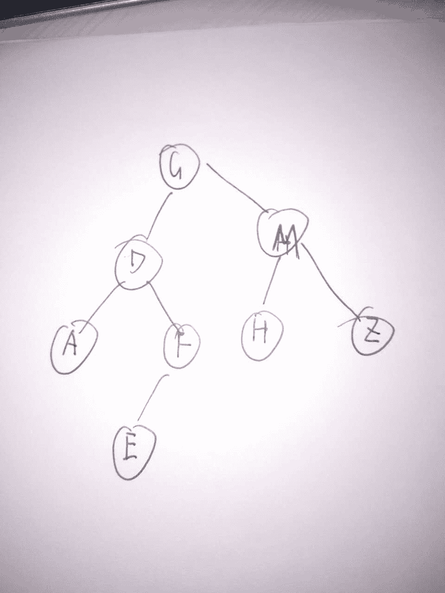
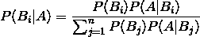
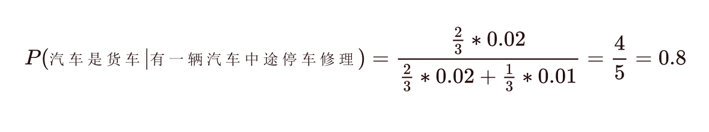

# 搜狐 2017 秋招研发工程师笔试试卷（一）

## 1

已知一棵树的前序遍历是”GDAFEMHZ”，而中序遍历是”ADEFGHMZ”，求后序遍历？

正确答案: C   你的答案: 空 (错误)

```cpp
ADEFGHMZ
```

```cpp
DAEFHZMG
```

```cpp
AEFDHZMG
```

```cpp
AFEDHMZG
```

本题知识点

树

讨论

[Richardliu007](https://www.nowcoder.com/profile/1182836)

选 C，具体二叉树请查看附件的图片

发表于 2017-01-24 11:21:41

* * *

[handling](https://www.nowcoder.com/profile/6746755)

首先：**前序遍历的第一个的值**就是**二叉树的根结点**，也就是该树的根节点为 G。这时中序遍历的结果根据**根节点将树划分为左右子树**(这时就可以把数据先分隔开了)。其次：前序遍历的特点是**DLR（先输出，再****遍历****左孩子****，再遍历右孩子****）**，中序遍历的特点是**LDR（先遍历左孩子，再输出****，再遍历右孩子****）**，因此可以通过这样根据先序遍历一个结点一个画图放上去，之后根据中序遍历结过判断是否符合。

发表于 2019-06-15 21:29:46

* * *

[菜小](https://www.nowcoder.com/profile/8238725)

从前序遍历找父节点，从中序遍历找左右子树

发表于 2017-08-25 10:41:11

* * *

## 2

局域网的网络地址 192.168.1.0/24，局域网络连接其他网络的网关地址是 192.168.1.1。主机 192.168.1.20 访问 172.16.1.0/24 网络时，其路由设置正确的是？

正确答案: C   你的答案: 空 (错误)

```cpp
route add default 192.168.1.0 netmask 172.168.1.1 metric 1
```

```cpp
route add -net 192.168.1.0 gw 192.168.1.1 netmask 255.255.255.0 metric 1
```

```cpp
route add -net 172.16.1.0 gw 192.168.1.1 netmask 255.255.255.0 metric 1
```

```cpp
route add -net 172.16.1.0 gw 172.16.1.1 netmask 255.255.255.0 metric 1
```

本题知识点

Linux

讨论

[networkcpx](https://www.nowcoder.com/profile/246646)

Croute add -net [目的子网] gw [网关地址] netmask [子网掩码] metric [路由跳数]这里添加的静态路由信息应该是从网关 192.168.1.1 到达目的子网 172.16.1.0 所需路由跳数为 1 跳。

编辑于 2017-02-08 21:00:05

* * *

[牛客-120 抢救中心](https://www.nowcoder.com/profile/6165623)

解释一下 ip 地址后面的/24，表示的是子网掩码，这个值取数区间 1-32，表示子网掩码中网络标识位的长度。24 对应的就是前 24 位为 1，即 11111111.11111111.11111111.00000000，亦即 255.255.255.0

发表于 2018-07-30 10:17:21

* * *

[NowaCoder](https://www.nowcoder.com/profile/2356667)

正确答案应该选 C，-net 后面跟的是目标网络，gw 就是 gateway（网关入口）就是你从哪个网关去到那个目标网络。明白这两项这题就能选了。

编辑于 2017-04-05 18:47:45

* * *

## 3

在给定文件中查找与设定条件相符字符串的命令为？

正确答案: B   你的答案: 空 (错误)

```cpp
gzip
```

```cpp
grep
```

```cpp
sort
```

```cpp
find
```

本题知识点

Linux

讨论

[潜伏者～～～](https://www.nowcoder.com/profile/9467213)

答案:B. A 选项:gzip 是解压缩命令 B 选项:grep 命令可以查找文件内容的字符 C 选项:sort 是排序命令 D 选项:find 命令是查找对应的文件名，并不能查找文件内容

编辑于 2017-02-08 22:35:06

* * *

[rppp](https://www.nowcoder.com/profile/9542322)

选项 B：grep 可以查找文件内容的字符选项 D：find 命令式查找对应的文件名

发表于 2017-08-02 22:41:50

* * *

[AllisonLiu](https://www.nowcoder.com/profile/6384773)

加深印象- -！
B：grep 可以查找文件内容的字符 D：find 命令式查找对应的文件名

发表于 2018-04-15 09:42:43

* * *

## 4

某地每天有流星雨的概率是相等的，一个人每天晚上都去观察，发现一个月能够看到流星的概率是 91%，请问半个月中能够看到流星的概率是多少？（一个月可以认为是 30 天）

正确答案: B   你的答案: 空 (错误)

```cpp
97%
```

```cpp
70%
```

```cpp
66.7%
```

```cpp
87%
```

本题知识点

概率统计 *概率论与数理统计* *讨论

[SunburstRun](https://www.nowcoder.com/profile/557336)

答案是 B 每天晚上出来流星出来的概率为 x
则一个月不出来流星的概率为（1-x)³⁰=1-0.91=0.09
半个月不出来流星的概率为（1-x)¹⁵=(1-x)³⁰⁰.5=0.3
半个月看得到流星的概率为 70%

发表于 2016-12-17 17:20:29

* * *

[昊 offer](https://www.nowcoder.com/profile/2067915)

答案是 B 设半个月能够看中流星雨的概率为 p，那么 1-p 代表半个月看不到流星雨，(1-p)² 代表一个月看不到流星雨则(1-p)²=1-0.91 于是 1-p=0.3，所以 p=0.7

发表于 2018-03-24 17:32:50

* * *

[牛客 949404618 号](https://www.nowcoder.com/profile/949404618)

这个题不好想，我刚开始蒙对了，但是看到不到解析，这里简单跟大家交流下，设每天发生流星雨概率为 x，则原题中（x）＾29*（1-x）=0.91，然后这样半个月的就是（x）¹⁴*(1-x)=?，然后发现我这渣渣没有办法处理了，直到看到网上的一个思路，豁然开朗，一个月看到流星雨的概率，就等于 1-一个月看不到流星雨的概率，那么就是（1-x）³⁰=1-0.91=0.09，然后半个月看不到的概率就是（1-x）¹⁵=(1-x)^(30*1/2)=0.3，相应的，半个月看得到的概率就是 0.7，完毕

发表于 2021-12-30 09:36:16

* * *

## 5

某种产品中，合格品率为 85%，一个合格品被检查成次品的概率是 10%，一个次品被检查成合格品的概率为 5%。问题：求一个被检查成合格品的产品确实为合格品的概率为（）

正确答案: B   你的答案: 空 (错误)

```cpp
0.75
```

```cpp
0.99
```

```cpp
0.915
```

```cpp
0.85
```

本题知识点

概率统计 *概率论与数理统计* *讨论

[小白猫](https://www.nowcoder.com/profile/2315358)

假设有 100 件产品，那么按题意有 85 件合格品，15 件残次品，那么按条件得到的合格品为 85*90%+15*5%=77.25，而按条件得到的合格品数量就为 85*90%=76.5，则合格概率为 76.5/77.2=0.9903

发表于 2017-08-25 16:18:47

* * *

[等候稻香](https://www.nowcoder.com/profile/1062660)

A:产品本身合格 B:检验合格

```cpp
p(A|B)=P(AB)/P(B)=P(AB)/(P(BA)+P(B 非 A))=（0.85*0.9）/（0.85*0.9+0.15*0.05）约等于 0.99
```

发表于 2017-03-21 10:18:17

* * *

[YCYCY](https://www.nowcoder.com/profile/9725992)

利用贝叶斯公式求解设：A=1 为产品合格，A=0，产品不合格      B=1 表示产品检测合格，B=0 表示产品检测不合格。本题要求：  在检测合格的情况下，是合格产品的概率，即求 P(A=1|B=1)         P(A=1|B=1)  = P（AB）/ P(B|A)                            = P(AB) / ( P(B=1|A=0)*P(A=0) + P(B=1|A=1)*P(A=1))                            = (0.85*0.9) / (0.05*0.15+0.9*0.85)= 0.99 

发表于 2018-09-05 20:34:46

* * *

## 6

关于 java 的异常处理机制的叙述哪些正确？

正确答案: A B   你的答案: 空 (错误)

```cpp
通常情况下，不论程序是否发生错误及捕捉到异常情况，都会执行 finally 部分
```

```cpp
当 try 区段的程序发生异常时，才会执行 catch 区段的程序
```

```cpp
catch 部分捕捉到异常情况时，才会执行 finally 部分
```

```cpp
其它选项都不正确
```

本题知识点

Java

讨论

[..---](https://www.nowcoder.com/profile/2553700)

try {int i = 1/0;} catch (Exception e) {System.out.println("Exception");System.exit(0);  }finally{System.out.println("finally");}结果控制台就只会输出 Exception,那是因为在 finally 之前已经正常退出程序了

发表于 2016-11-30 17:18:31

* * *

[不想学习的小鬼](https://www.nowcoder.com/profile/4583991)

B 选项，万一 try 块正常运行并使用 throw 抛出异常呢？

发表于 2017-04-03 11:10:05

* * *

[梅毒菊花茶](https://www.nowcoder.com/profile/6000127)

在 try 中执行 System.exit(0)后当然不会执行 finally.
但是规范中
[`docs.oracle.com/javase/specs/jls/se10/html/jls-14.html#jls-14.20.2`](https://docs.oracle.com/javase/specs/jls/se10/html/jls-14.html#jls-14.20.2)
以及
SS 关于这个的讨论[`stackoverflow.com/questions/65035/does-finally-always-execute-in-java`](https://stackoverflow.com/questions/65035/does-finally-always-execute-in-java)
我大概这么理解。
finally 是永远会执行的，比如说 return 的例子。
但是特殊情况
比如说 System.exit(0)
执行的好好的 JVM 进程被杀了，或者电脑断电了，都不会执行了。
但是此时已经和 Java 无关的是吗?
总之就这样，懂就好，又不是考研题，没必要那么严谨。

发表于 2018-06-07 23:05:35

* * *

## 7

对于函数中以下代码，

```cpp
char* p=new char[100]; 
```

正确的是（）

正确答案: D   你的答案: 空 (错误)

```cpp
p 和 new 出来的内存都在栈上
```

```cpp
p 在堆上，new 出来的在栈上
```

```cpp
p 和 new 出来的内存都在堆上
```

```cpp
p 在栈上，new 出来的在堆上
```

本题知识点

C++

讨论

[brew121](https://www.nowcoder.com/profile/6228007)

所有的局部变量在栈区，所以 p 在栈上，栈区是动态存储区，自动分配内存、自动回收；堆区：人工分配、释放，所以 new 出来的在堆上；

发表于 2017-04-08 10:30:42

* * *

[筱晨](https://www.nowcoder.com/profile/8983702)

   栈：就是那些由编译器在需要的时候分配，在不需要的时候自动清楚的变量的存储区。里面的变量通常是**局部变量、函数参数**等。   堆：就是那些由 new 分配的内存块，他们的释放编译器不去管，由我们的应用程序去控制，一般一个 new 就要对应一个 delete 。   通过题目我们不难发现 p（临时的变量）在栈上，

发表于 2017-04-12 15:21:42

* * *

[这个好玩吗？](https://www.nowcoder.com/profile/864589)

Dp 是定义的指针在栈上 new 出来的控件在堆上

发表于 2017-03-14 15:47:42

* * *

## 8

Linux 文件权限一共 10 位长度，从前数第 5-7 位表示的内容是（）。

正确答案: B   你的答案: 空 (错误)

```cpp
其他用户的权限
```

```cpp
文件所有者所在组的权限
```

```cpp
文件类型
```

```cpp
文件所有者的权限
```

本题知识点

Linux

讨论

[后劲好大](https://www.nowcoder.com/profile/4013442)

第一位表示是文件或者目录，2~4 是用户权限， 5~7 是组权限 ，8~10 是其他用户权限

发表于 2017-06-08 19:28:25

* * *

[云守护](https://www.nowcoder.com/profile/1581173)

例子: lrwxrwxrwxl rwx rwxrwx 文件类型  文件所有者的权限  文件所有者所在组的权限其他用户的权限

发表于 2017-02-21 22:08:58

* * *

[ceeeeeeeeeeeb](https://www.nowcoder.com/profile/542410100)

文件权限：10 个字符 ls 查看

第一个字符：文件（-），目录（d），链接（l）

剩余每三个读 r 写 w 执行 x；第一组文件所有者，第二组文件所有者同一组用户，不同组的其他用户。

数字表示，读 4 写 2 执行 1

所有者 u，所有组 g，其他 o

--zai

发表于 2019-06-12 09:23:07

* * *

## 9

下列选项中，降低进程优先级的合理时机是？

正确答案: B   你的答案: 空 (错误)

```cpp
进程刚完成 I/O，进入就绪列队
```

```cpp
进程的时间片用完
```

```cpp
进程从就绪态转为运行态
```

```cpp
进程长期处于就绪队列中
```

本题知识点

操作系统

讨论

[SunburstRun](https://www.nowcoder.com/profile/557336)

答案是 B         进程时间片用完可以降低其优先级，完成 I／O 的进程应该提升其优先级，处于就绪队列等待调度的进程一般不会改变其优先级。

发表于 2016-12-17 17:33:45

* * *

[Lmf_1407](https://www.nowcoder.com/profile/721081045)

时间片用完代表处理的时间较长让短点的先处理

发表于 2019-04-04 00:13:14

* * *

[LauZyHou](https://www.nowcoder.com/profile/8203811)

为什么完成 I/O 的进程可以提升其优先级？

发表于 2018-09-24 19:15:02

* * *

## 10

```cpp
std::vector::iterator
```

没有重载下面哪个运算符

正确答案: D   你的答案: 空 (错误)

```cpp
==
```

```cpp
++
```

```cpp
*
```

```cpp
>>
```

本题知识点

C++

讨论

[华中第一狠人程德彪](https://www.nowcoder.com/profile/616662)

迭代器可以看成一个指针，指针没有移位运算

发表于 2017-01-01 10:06:00

* * *

[朱珠](https://www.nowcoder.com/profile/143224)

对于 std::vector::iterator1）++、--用于双向迭代，迭代器最基本的功能 2）*用于复引迭代器，用于引用迭代器对应的元素，也是基本操作 3）==用于判断两个迭代器是否相等，迭代的时候需要判断迭代器是否到某个位置

发表于 2017-06-11 11:12:18

* * *

[中发大美妞](https://www.nowcoder.com/profile/553623611)

对于 std::vector::iterator1）++、--用于双向迭代，迭代器最基本的功能 2）*用于复引迭代器，用于引用迭代器对应的元素，也是基本操作 3）==用于判断两个迭代器是否相等，迭代的时候需要判断迭代器是否到某个位置迭代器可以看成一个指针，指针没有移位运算
来自：朱珠，程小二

发表于 2018-06-08 11:26:58

* * *

## 11

一个栈的入栈序列是 ABCDE，则出栈序列不可能是（）

正确答案: B   你的答案: 空 (错误)

```cpp
DECBA
```

```cpp
DCEAB
```

```cpp
ABCDE
```

```cpp
EDCBA
```

本题知识点

栈 *讨论

[丨太阳与月亮丨](https://www.nowcoder.com/profile/9415270)

答案 BA 选项，将 ABCD 入栈，D 出栈，E 入栈，E 出栈，CBA 依次出栈 C 选项，A 入栈，A 出栈，B 入栈，B 出栈，C 入栈，C 出栈，D 入栈，D 出栈，E 入栈，E 出栈 D 选项，ABCDE 依次全部入栈，EDCBA 依次出栈 B 选项，ABCD 入栈，D 出栈，C 出栈，E 入栈，E 出栈，此时栈底为 A 栈顶为 B，B 出栈一定在 A 之前，不可能

发表于 2017-01-26 17:05:39

* * *

## 12

两个人抛硬币，规定第一个抛出正面的人可以吃到苹果，请问先抛的人能吃到苹果的概率多大？

正确答案: A   你的答案: 空 (错误)

```cpp
2/3
```

```cpp
1/2
```

```cpp
1/3
```

```cpp
5/6
```

本题知识点

概率统计 *概率论与数理统计* *讨论

[gorden](https://www.nowcoder.com/profile/995367)

先抛的人能吃到苹果的概率：第一次吃到苹果 P1：1/2;正第二次吃到苹果 P2：1/2 * 1/2 * 1/2;(反反正)第三次吃到苹果 P2：1/2 * 1/2 * 1/2 * 1/2 * 1/2;(反反反反正)第四次吃到苹果 P4： 1/2 * 1/2 * 1/2 * 1/2 * 1/2 * 1/2 * 1/2 ;(反反反反反反正)...第 N 次吃到苹果 Pn： 1/2 * 1/2 * 1/2 * ... * 1/2 * 1/2 * 1/2 ;先抛的人能吃到苹果的概率：P = P1+P2+...+Pn = 1/2 + 1/2 * （1/4） + 1/2 * (1/4)² + ... + 1/2 * (1/4)^(n-1)= 1/2 * （1 + （1/4）¹ + （1/4）² + （1/4）³ + （1/4）^(n-1) ）<= 1/2 * （1 + 1/4 / (1-1/4)）(n->无穷大)<= 1/2 * 4/3 = 2/3

编辑于 2017-04-23 17:05:53

* * *

[256785](https://www.nowcoder.com/profile/2864605)

记住第二个人吃苹果是在第一个人失手的情况下发生的，所以 p2=1/2 p1    可知 p1=2/3

发表于 2017-08-27 22:35:43

* * *

[SunburstRun](https://www.nowcoder.com/profile/557336)

答案是 A 第一种解法容易：举例排序，正，反反正，这样子之后可以得到一个 [等比数列](https://www.baidu.com/s?wd=%E7%AD%89%E6%AF%94%E6%95%B0%E5%88%97&tn=44039180_cpr&fenlei=mv6quAkxTZn0IZRqIHckPjm4nH00T1YkPW01PHwhPWn4uWDzmHTL0ZwV5Hcvrjm3rH6sPfKWUMw85HfYnjn4nH6sgvPsT6KdThsqpZwYTjCEQLGCpyw9Uz4Bmy-bIi4WUvYETgN-TLwGUv3EnHRknH6vnH0sPH63njb3PHRYn0) ，由此可以得到概率第二种解法：假设概率为 P，等于第一次为正，和第一次为反，第二次为反，接下来的概率仍然为 P,所以 P=1/2+1/4*P; P=2/3

编辑于 2016-12-17 21:01:08

* * *

## 13

下列关键字序列中，（）是堆。

正确答案: B   你的答案: 空 (错误)

```cpp
16,72,31,23,94,53
```

```cpp
16,23,53,31,94,72
```

```cpp
94,23,31,72,16,53
```

```cpp
16,53,23,94,31,72
```

本题知识点

堆

讨论

[牛客 130471 号](https://www.nowcoder.com/profile/130471)

把这个序列看成数组型的二叉树，若根节点是 i，左子树是 2*i，右子树是 2*i+1。

堆分成最大堆和最小堆

1、 最大堆中所有父节点都比左子树、右子树大

2、 最小堆中所有父节点都比左子树、右子树小。

发表于 2017-01-08 20:38:26

* * *

[ChopinXBP](https://www.nowcoder.com/profile/9528572)

            16     23         5331          94    72

发表于 2018-08-08 13:36:34

* * *

[灰灰 _ 两个人儿](https://www.nowcoder.com/profile/102728819)

那为什么 D 不行呢？D 不是也可以排出最小堆吗？

发表于 2019-07-22 08:08:46

* * *

## 14

该某公路上经过的货车与客车的数量之比为 2:1，货车中途停车修理的概率为 0.02， 客车为 0.01，今有一辆汽车中途停车修理，求该汽车是货车的概率（）

正确答案: C   你的答案: 空 (错误)

```cpp
0.832
```

```cpp
0.9
```

```cpp
0.8
```

```cpp
0.788
```

本题知识点

概率统计 *讨论

[⎝≧⏝⏝≦⎠|](https://www.nowcoder.com/profile/1326162)

货车 200 辆，客车 100 辆，货车停下 200×0.02=4 辆客车停下 100×0.01=1 辆货车停下概率：4/5=80%

发表于 2017-08-17 17:48:55

* * *

[迈杰](https://www.nowcoder.com/profile/109107)

根据贝叶斯公式可知:
选 C,0.8

发表于 2017-02-05 17:14:30

* * *

[Oliver？](https://www.nowcoder.com/profile/3729030)

首先我们把题目用表达式的方式表示出来：货车与客车的数量之比为 2:1，意思是 p(货车)=2/3;p(客车)=1/3；货车中途停车修理的概率为 0.02， 客车为 0.01，注意题目描述，货车中途坏了，前提是货车，其次是坏了，因此这句话等价形式为 p(坏|货车)=0.02;p(坏|客车)=0.01;再看问题，今有一辆汽车中途停车修理，求该汽车是货车的概率？等价于求 p(货车|坏).根据条件概率公式 p(B|A) = p(AB)/P(A)，以及其变形 P(AB)=P(A)*p(B|A).p(货车|坏)=P(货车坏)/p(坏)=p(坏|货车)*p(货车)/p(坏)=p(坏|货车)*p(货车)/(p(坏|客车)p(客车)+p(坏|货车)p(货车))=0.8\.

发表于 2017-05-23 12:24:21

* * *

## 15

下面程序的运行结果是：

```cpp
#define N 2
#define M N + 1
#define NUM (M + 1) * M / 2
main(){
    printf("%d\n", NUM);
}
```

正确答案: C   你的答案: 空 (错误)

```cpp
4
```

```cpp
9
```

```cpp
8
```

```cpp
6
```

本题知识点

C++ C 语言

讨论

[华中第一狠人程德彪](https://www.nowcoder.com/profile/616662)

宏定义只是简单的文本替换，(2+1+1)*2+1/2=8

发表于 2016-12-30 23:03:24

* * *

[cwsxwj](https://www.nowcoder.com/profile/926985858)

宏定义是简单的字符串替换，也就是说 (M+1)*M/2 中的 M 都是 N+1，所以 NUM 等价于(N+1+1)*N+1/2
带入计算，（2+1+1）*2+1/2 = 4*2+0 = 8

发表于 2019-08-19 19:30:22

* * *

[月之书￠](https://www.nowcoder.com/profile/2235013)

1/2，表示用整数 1 除以整数 2，因为两者都是整数，其运算结果为 0。
如果想使运算结果为小数，可以使用 1.0/2，这样计算的结果就可以自动转换为 0.5。

发表于 2017-03-26 22:19:00

* * *

## 16

快速排序在下列哪种情况下最易发挥其长处？

正确答案: C   你的答案: 空 (错误)

```cpp
被排序的数据已基本有序
```

```cpp
被排序的数据中含有多个相同排序码
```

```cpp
被排序的数据完全无序
```

```cpp
被排序的数据中的最大值和最小值相差悬殊
```

本题知识点

排序 *讨论

[GreatGeek](https://www.nowcoder.com/profile/358890110)

我只想知道到底排序码是什么东西？？？？

发表于 2018-08-07 16:12:37

* * *

[_ 大米 VS_ 小米](https://www.nowcoder.com/profile/5928650)

基本有序的时候选择插入排序

发表于 2017-08-28 14:29:17

* * *

[小白 J 牛客 1588314 号](https://www.nowcoder.com/profile/1588314)

c 当初始序列整体或局部有序时，快速排序性能下降，将退化为冒泡排序

发表于 2017-06-27 16:36:58

* * *

## 17

C++中，能作为函数重载判断依据的是？

正确答案: B C D   你的答案: 空 (错误)

```cpp
返回类型
```

```cpp
const
```

```cpp
参数个数
```

```cpp
参数类型
```

本题知识点

C++

讨论

[华中第一狠人程德彪](https://www.nowcoder.com/profile/616662)

为什么返回值不能作为重载依据？ 编译器在编译时，不会去判断函数的返回类型，也就是说，你的返回值虽然不同，函数只有调用后，编译器才会去验证类型，所以返回值不能做为重载依据。

发表于 2017-01-02 15:53:26

* * *

[Yuning](https://www.nowcoder.com/profile/9818294)

c，d 不用说 对 b，重载［］运算符时，有没有 const 区别是:有 const 只读。没有 const 读写都可以

发表于 2016-12-24 16:39:27

* * *

[oscarwin](https://www.nowcoder.com/profile/9602113)

1\. 重载函数依据形参取判定是否可以重载；2\. 形参个数不同，或者类型不同都是可以重载的类型；3\. 对于形参为引用或者指针的情况下，const 版本和非 const 版本是有区别的，因为传引用是有可能改变原来的参数的。

发表于 2017-07-26 16:57:03

* * *

## 18

建立一条 TCP 连接需要（）个步骤，关闭一个 TCP 连接需要（）个步骤。

正确答案: B   你的答案: 空 (错误)

```cpp
4,4
```

```cpp
3,4
```

```cpp
3,3
```

```cpp
4,3
```

本题知识点

网络基础

讨论

[陈旭升](https://www.nowcoder.com/profile/962881)

tcp 建立连接需要经过三次握手的过程，tcp 释放连接需要经历四次挥手的过程

发表于 2016-12-22 17:36:18

* * *

## 19

C++ 中，关于 new 运算符的错误的描述是？

正确答案: A B   你的答案: 空 (错误)

```cpp
使用 new 运算符创建的对象使用完成后会自动销毁并回收
```

```cpp
使用运算符 new 创建对象数组时必须定义初始值
```

```cpp
使用运算符 new 创建对象时，会调用类的构造函数
```

```cpp
运算符 new 可以用来动态创建对象和对象数组
```

本题知识点

C++

讨论

[丨太阳与月亮丨](https://www.nowcoder.com/profile/9415270)

ABnew 创建的对象需要使用 delete 进行释放 new 创建对象不一定需要定义初始值 new 会调用构造函数 new 可以用来创建对象和对象数组，且调用构造函数

发表于 2017-03-20 20:36:50

* * *

[v 特仑苏 v](https://www.nowcoder.com/profile/8462982)

new 表达式与 operator new 函数（运算符 new）不一样吧
一条 new 表达式的执行过程总分是先调用 operator new 函数以获取内存空间，然后在得到的内存空间中构造对象。<C++ Prime 第五版 P728>

发表于 2018-08-09 09:12:16

* * *

[龙小弟呀](https://www.nowcoder.com/profile/433784541)

由程序员分配/回收的内存,通常为 new/delete 和 malloc/free 得到的一段动态分配内存,由指针指向, 因此属于堆区上的数据.

A. 堆区内存数据需要手动销毁,上面的操作符和函数需要成对出现；

B. new 得到的内存空间由指针指向,不需要初始化,可以之后直接赋值；

C. new 创建的对象虽然不同于类直接定义的对象(属于 main 的局部变量,保存在栈上),但都属于类的实例化,当然也会产生结构体了；

D. new 动态创建在堆上的对象和数组格式为 new 类[],释放内存的格式为 delete []p.注意一般的变量则可以不指明数组大小,直接 delete p 即可

发表于 2020-03-01 22:11:52

* * *

## 20

以下开源软件中经常被用作队列的是哪个：

正确答案: A B   你的答案: 空 (错误)

```cpp
kafka
```

```cpp
Redis
```

```cpp
MongoDB
```

```cpp
Memcached
```

本题知识点

开发工具

讨论

[cccser](https://www.nowcoder.com/profile/491796)

“Redis 提供了两种方式来作消息队列。一个是使用生产者消费模式模式，另外一个方法就是发布订阅者模式。前者会让一个或者多个客户端监听消息队列，一旦消息到达，消费者马上消费，谁先抢到算谁的，如果队列里没有消息，则消费者继续监听。后者也是一个或多个客户端订阅消息频道，只要发布者发布消息，所有订阅者都能收到消息，订阅者都是平等的。”

作者：人世间
链接：[`www.jianshu.com/p/9c04890615ba`](http://www.jianshu.com/p/9c04890615ba)
來源：简书

编辑于 2017-08-27 21:14:05

* * *

[陨星 Cass](https://www.nowcoder.com/profile/8694208)

redis 是一种 key-value 是数据库吧？怎么会是用作队列？kafka 和阿里的 rocketMq 是一种消息队列。

发表于 2017-08-25 22:58:04

* * *

[lc4t](https://www.nowcoder.com/profile/808421)

B.Redis 和 RabbitMQ 是常用的两种（消息/事务）队列管理器

发表于 2017-02-08 18:06:11

* * *

## 21

给定一个十进制的正整数 number，选择从里面去掉一部分数字，希望保留下来的数字组成的正整数最大。

本题知识点

贪心 模拟

讨论

[吉事有祥](https://www.nowcoder.com/profile/6927347)

```cpp
 nums = list(input())
cnt = int(input())
n, j, i= len(nums), cnt, 0
while j > 0 and i < n-1:
    if nums[i]>= nums[i+1]:
        i += 1
    else:
        nums.pop(i)
        j -= 1
        n -= 1
        i = i-1 if i > 0 else 0
if j > 0:
    nums = nums[:-j]
print(''.join(nums))  
```

复杂度 O(n)，从左至右，删除小于下一位的数，最后不够删除结尾数

编辑于 2017-09-22 17:24:30

* * *

[一匹努力的千里马](https://www.nowcoder.com/profile/3909795)

case 没问题吧！我的是 100% ac
思路：删除的数肯定是该位的数比后一位小的数字 。比如，325 删除的 2 比 后一位的 5 小，所以删除之。
要删除多少数，就有多少次循环。

```cpp
import java.util.Scanner;

public class Main{

    public static void main(String[] args) {

        Scanner sc = new Scanner(System.in);
        while(sc.hasNext()) {
            StringBuilder sb = new StringBuilder();
            sb.append(sc.next());
            int cnt = sc.nextInt();

            for(int i = 0;i < cnt;i++) {
                int j = 0;
                while(j + 1< sb.length() && sb.charAt(j) >= sb.charAt(j+1)) {
                    j++;
                }
                sb.deleteCharAt(j);
            }
            System.out.println(sb.toString());
        }
    }
}
```

发表于 2018-05-08 10:31:34

* * *

[元气の悟空](https://www.nowcoder.com/profile/392974)

```cpp
//AC 代码:
#include<string>
#include<iostream>
using namespace std;
int main(){
    string s;
    int len,i;
	while(cin>>s>>len){
        i=1;
		while(len--){
            int slen=s.length();
			for(i--;i<slen-1;i++)
				if(s[i]<s[i+1]){
					s.erase(s.begin()+i);
					break;
				}
			if(i==slen-1) s.erase(s.end()-1);
		}
		cout<<s<<endl;
	}
}//总算过了这道题，至今也没想明白为什么用 c 版的 char *字符串就过不去
 //换成 c++的 string 就过去了.......  有毒   有毒
```

发表于 2017-08-18 10:22:02

* * *

## 22

有一条彩色宝石项链，是由很多种不同的宝石组成的，包括红宝石，蓝宝石，钻石，翡翠，珍珠等。有一天国王把项链赏赐给了一个学者，并跟他说，你可以带走这条项链，但是王后很喜欢红宝石，蓝宝石，紫水晶，翡翠和钻石这五种，我要你从项链中截取连续的一小段还给我，这一段中必须包含所有的这五种宝石，剩下的部分你可以带走。如果无法找到则一个也无法带走。请帮助学者找出如何切分项链才能够拿到最多的宝石。

本题知识点

队列 *讨论

[元气の悟空](https://www.nowcoder.com/profile/392974)

```cpp
#include<iostream>
#include<string>
#include<algorithm>
#include<map>
using namespace std;
int main(){
	string s;
	int i,j,num,len;
	while(cin>>s){
		len=s.length();
		s=s+s; 
		i=0,j=0,num=0;
		int Min=len;
		map<char,int> book;
		while(true){
			while(i<s.length()&&num<5){
				if((s[i]=='A'||s[i]=='B'||s[i]=='C'||s[i]=='D'||s[i]=='E')
					&&book[s[i]]++==0)
					num++;
				i++;
			}
			if(num<5) break;
			Min=min(Min,i-j);
			if((s[j]=='A'||s[j]=='B'||s[j]=='C'||s[j]=='D'||s[j]=='E')
				&&--book[s[j]]==0) num--;
			j++;
		}
		printf("%d\n",len-Min);
	}
}//尺取法，求包含 ABCDE 的最短字串
```

编辑于 2017-08-26 11:15:48

* * *

[不知火](https://www.nowcoder.com/profile/758215)

```cpp
#通过每位右移来找到最短子串
while True:
    try:
        s = input()
        l = len(s)
        min = l
        for i in range(l) :
            x = []
            for j in 'ABCDE' :
                x.append(s.find(j))
            x.sort()
            if min > x[-1] :
                min = x[-1]
            s = s[1:] + s[0]
        print(l-min-1)
    except:
        break
```

发表于 2017-09-04 16:24:08

* * *

[我也支持](https://www.nowcoder.com/profile/6206174)

```cpp
#include<iostream>
#include<string>
#include<vector>
using namespace std;
//判断 str 从 start 开始长度为 length 的子串中是否包括了 ABCDE
bool isPerfect(string str, int start, int length)
{
    vector<bool> vec(5, false);//5 个 bool 标记 ABCDE 是否找到
    for(int i = 0; i < length; i++)
    {
        int index = str[start + i] - 'A';
        if(index < 5)
            vec[index] = true;
    }
    return vec[0] && vec[1] && vec[2] && vec[3] && vec[4];
}
int main()
{
    string str;
    while(cin >> str)
    {
        bool find = false;
        int n = str.size();
        if(n <= 5)
        {
            cout << 0 << endl;
            continue;
        }

        str = str + str;//省去环处理
        for(int length = 5; length <= n; length++)//长度
        {
            for(int i = 0; i < n; i++)//起点
            {
                if(isPerfect(str, i, length))
                {
                    cout <<  n - length << endl;
                    find = true;
                    break;
                }
            }
            if(find)
                break;
        }
    }
}

```

发表于 2017-09-29 22:09:49

* * *

## 23

一只袋鼠要从河这边跳到河对岸，河很宽，但是河中间打了很多桩子，每隔一米就有一个，每个桩子上都有一个弹簧，袋鼠跳到弹簧上就可以跳的更远。每个弹簧力量不同，用一个数字代表它的力量，如果弹簧力量为 5，就代表袋鼠下一跳最多能够跳 5 米，如果为 0，就会陷进去无法继续跳跃。河流一共 N 米宽，袋鼠初始位置就在第一个弹簧上面，要跳到最后一个弹簧之后就算过河了，给定每个弹簧的力量，求袋鼠最少需要多少跳能够到达对岸。如果无法到达输出-1

本题知识点

模拟

讨论

[元气の悟空](https://www.nowcoder.com/profile/392974)

```cpp
#include<stdio.h>
#include<algorithm>
using namespace std;
int a[10005],dp[10005];
const int MAX=99999999;
int main(){
    int N,i,j;
    while(scanf("%d",&N)!=EOF){
        for(i=0;i<10005;i++) dp[i]=MAX;
        dp[0]=0;
        for(i=0;i<N;i++) scanf("%d",&a[i]);
        int step[10005];
        for(i=1;i<=N;i++)
            for(j=0;j<i;j++)
                if(a[j]+j>=i)
                    dp[i]=min(dp[i],dp[j]+1);
        printf("%d\n",dp[N]==MAX?-1:dp[N]);
    }
}
```

发表于 2017-08-18 15:44:50

* * *

[Leoric](https://www.nowcoder.com/profile/963099)

*下文中，斜体加下划线的文字有误。*（1）先遍历一遍数组，求出**有价值**的弹簧。所谓**有价值**是指从该弹簧跳向的最远弹簧比在它之前的弹簧跳向的最远弹簧都要远，即对于第 i 个弹簧，i+ jump[ i ]比小于 i 的弹簧都要大。将这些“有价值”的弹簧加入到队列中。*（对于最后一个弹簧，将其的 jump 值改为无穷大使其必定****有价值****）*
（增加一个弹簧，其 jump 值为无穷大，则其必定**有价值**)
（2）贪心。每次从当前的**有价值**的弹簧跳向最远的**有价值**的弹簧，直到跳到最后一个弹簧为止。若某次跳跃无法跳到下个弹簧，则失败。
步骤（1）和（2）的时间复杂度均为 O（n），所以总时间复杂度是 O（n）。
*看样例的答案是 4，于是将结果+1，提交一看，只过了 20%。 不+1 提交，过了 90%。没过的用例是题目给的示例。搞不懂什么情况。-  -！*看了其他的回答，终于明白问题出在哪了，原来题目中说的“**要跳到最后一个弹簧之后就算过河了**”的意思是所在的位置要大于最后一个弹簧的位置，也不知道是不是我语文太拙计了。ps：dp 的方法我一开始就想到了，只不过题目中 n 最大是 10000，所以感觉 dp O（n² )的复杂度会超时，于是就想了一个 O（n）的方法。下面的代码中，被注释的那个 baoli () 函数就是 dp 的方法，居然也能过。。

```cpp
#include<iostream>
#include<stdio.h>
#include<algorithm>
#include<cmath>
#include<cstring>
#include<stack>
#include<queue>
#include<fstream>
#include<stdlib.h>
#include<ctime>
#include<vector>
using namespace std;
#define FOR(i,N) for(i=0;i<N;++i)
#define MEM(x,i) memset(x,i,sizeof(x))
#define COUT(DATA,ED) printf("%d%c",DATA,ED)
#define CIN(val)  scanf("%d",&val)
#define FCIN(val) fscanf(fp,"%d",&val)
#define LL long long
FILE *fp;
int n,zz;
int list[12000],newlist[12000],newposlist[12000];
int cur_pos,sum;

void read(){
	int i,j;
	CIN(n);
	FOR(i,n){
		CIN(list[i]);
	}
	list[n++]=120000;

}
bool one_set(){
	bool pd=false;
	int tar_pos=cur_pos;
	for(int i=cur_pos+1;i<zz;++i){
		if(newlist[cur_pos]>=newposlist[i]){
			tar_pos=i;
			pd=true;
		}else{
			break;
		}
	}
	cur_pos=tar_pos;
	++sum;
	return pd;
}
void set(){
	int i,j;
	zz=0;
	newposlist[zz]=0;
	newlist[zz++]=list[0];
	for(i=1;i<n;++i){
		int alt=list[i]+i;
		if(alt>newlist[zz-1]){
			newposlist[zz]=i;
			newlist[zz++]=alt;
		}
	}

	bool pd=true;
	cur_pos=0;
	sum=0;
	while(cur_pos<(zz-1)){
		pd=one_set();
		if(!pd)break;
	}

	if(!pd) sum=-1;
	 printf("%d\n",sum);

}

/*
int dp[12000];
void baoli(){
	int i,j;
	for(i=0;i<n;++i) dp[i]=120000;
	dp[0]=0;
	for(i=0;i<n;++i){
		int tar=min(i+list[i]+1,n);
		for(j=i+1;j<tar;++j){
			dp[j]=min(dp[j],dp[i]+1);
		}
	}

	if(dp[n-1]>n+10) dp[n-1]=-1;
	printf("%d\n",dp[n-1]);
}
*/

int main(){
	fp=fopen("1.txt","r");
	read();
	//baoli();
	set();
    return 0;
}

```

编辑于 2017-08-28 14:45:35

* * *

[yuhaouestc](https://www.nowcoder.com/profile/3016596)

```cpp
#include<iostream>
#include<vector>
using namespace std;
int GetCount(vector<int>& num)
{
	int n = num.size();
	vector<int> dp(n + 1, 10000);
	dp[0] = 1;
	for (int i = 1; i <= n; i++)
	{
		for (int j = i - 1; j >= 0; j--)
		{
			if (num[j] == 0)
				continue;
			if (j + num[j] >= i)
				dp[i] = min(dp[i], dp[j] + 1);
		}
	}
	if (dp[n] == 10000)
		return -1;
	else
		return dp[n] - 1;
}

int main()
{
	int N = 0;
	cin >> N;
	vector<int> num(N,0);
	for (int i = 0; i < N; i++)
		cin >> num[i];
	cout << GetCount(num) << endl;
	return 0;
}

```

动态规划问题，和求最大递增序列差不多，每次遍历前面的数看是否能够到达当前位置，遇到则 0 跳过

发表于 2017-08-07 17:20:19

* * ********