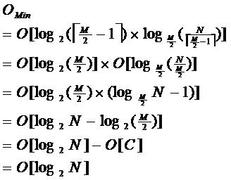

# 搜狗 2017 校招 C++工程师笔试试卷

## 1

```cpp
class t_classA {
public:
    t_classA() {};
    ~t_classA() {};
};

class t_classB {
public:
    t_classB() {};
    virtual ~t_classB() {};
};

class t_classC : public t_classA, public t_classB {
public:
    t_classC() {};
    virtual ~t_classC() {};
};

int nLenA = sizeof(t_classA);
t_classA oA;
int nLenAObject = sizeof(oA);

int nLenB = sizeof(t_classB);
t_classB oB;
int nLenBObject = sizeof(oB);

int nLenC = sizeof(t_classC);
t_classC oC;
int nLenCObject = sizeof(oC);
```

请问：nLenA、nLenAObject、nLenB、nLenBObject、nLenC、nLenCObject 的值（32 位机器）分别为（）

正确答案: D   你的答案: 空 (错误)

```cpp
1，1，4，4，8，8
```

```cpp
0，0，4，4，4，4
```

```cpp
0，0，4，4，8，8
```

```cpp
1，1，4，4，4，4
```

本题知识点

C++ C++工程师 搜狗 2017 C 语言

讨论

[yeseary](https://www.nowcoder.com/profile/4992075)

根据网上相关资料整理，供大家学习。  C++标准规定类的大小不为 0，空类的大小为 1，当类不包含虚函数和非静态数据成员时，其对象大小也为 1，所以 nLenA 和 nLenAObject 的值为 1； 如果在类中声明了虚函数（不管是 1 个还是多个），那么在实例化对象时，编译器会自动在对象里安插一个指针指向虚函数表 VTable，在 32 位机器上，一个对象会增加 4 个字节来存储此指针，它是实现面向对象中多态的关键。因此，LenB 和 nLenBObject 的值为 4； 对于普通继承，派生类和基类共享虚函数指针，派生类对象的存储空间=基类存储空间+派生类特有的非 static 数据成员的空间，由于 t_classA 为空类，t_classB 和 t_classC 共享虚函数指针，因此 LenC 和 nLenCObject 的值为 4；

编辑于 2017-08-15 15:57:03

* * *

[wanano](https://www.nowcoder.com/profile/313239)

C++中只有构造函数和析构函数或其成员函数时所占内存为 1（不含虚函数），带有虚函数的时候内存为 4，普通继承都是公用一张虚函数表，指针大小不增加。（当然有成员变量要加上成员变量的内存）

发表于 2017-08-11 14:50:06

* * *

[warrior_shadow](https://www.nowcoder.com/profile/172321)

nLenA = sizeof(t_classA) ,t_classA 中只有一个构造函数和一个析构函数，所以大小为 1。nLenAObject=sizeof(oA),oA 是实例化后的对象，也只有一个构造函数和一个析构函数，所以大小为 1。nLenB = sizeof(t_classB),t_classB 中的析构函数是一个虚函数，编译器会设置一个指针来指向虚函数表 vtable,这个指针实际是个地址，在 32 位机器上就是 4 字节，所以，大小为 4.nLenBObject 也是 4。t_classA 为空类，t_classB 和 t_classC 共享虚函数指针，因此 LenC 和 nLenCObject 的值为 4；

发表于 2018-07-11 10:40:56

* * *

## 2

对中缀表达式 3*2^(4+2*2-6*3)-5 进行求值，求值过程中当扫描到 6 时，对象栈和算符栈分别为（），其中^为乘幂。

正确答案: D   你的答案: 空 (错误)

```cpp
3，2，8; *^-
```

```cpp
3，2，4，2，2; *^+*-
```

```cpp
3，2，4，2，2; *^(+*-
```

```cpp
3，2，8; *^(-
```

本题知识点

栈 *C++工程师 搜狗 2017* *讨论

[请叫我猿叔叔](https://www.nowcoder.com/profile/6316247)


编辑于 2017-08-24 20:53:56

* * *

[初来乍](https://www.nowcoder.com/profile/4486242)

找资料之后的结果~和运算符的优先级有关，

1、操作数栈置空，将表达式起始符"#"作为运算符栈的栈底元素

2、依次读入每个字符，若是操作数则入操作数栈；若是运算符 s1 则和运算符栈顶元素 s2 比较优先级后进行相应的操作，直至整个表达式求完。

i)若优先级 s1>s2，s1 入栈

ii）若 s1<s2，当前栈顶运算符 s2 退栈，操作数栈顶的两个操作数退栈与操作符一起运算，并将运算结果入操作数栈；

过程如下：（1）操作数 3，入栈 s1；

 （2）运算符*，入栈 s2；

 （3）操作数 2，入栈 s1；

 （4）运算符^ ，入栈 s2；（^的优先级比 *高）

 （5）运算符（，入栈 s2；

 （6）操作数 4，入栈 s1；

 （7）运算符+，入栈 s2；

 （8）操作数 2，入栈 s1；

 （9）运算符*，入栈 s2；（理由是：*的优先级比+高）

 （10）操作数 2，入栈 s1；

 （11）运算符 -，（ -的优先级低于*）栈顶字符 * 出栈，完成 2*2=4 的运算，将结果 4 存入 s1 中；---s1：3,2,4,4；

                             （ -的优先级低于+）栈顶字符+出栈，完成 4+4=8 的运算，将结果 8 存入 s1 中；---s1:3,2,8；

 此时，- 成为了（后的运算符，则直接入栈 s2；---s2：*^（-；

       （12）操作数 6 扫描；

发表于 2017-08-13 15:34:48

* * *

[牛客 130478570 号](https://www.nowcoder.com/profile/130478570)

准备两个栈 s、t。 从左向右扫描，遇到数字入栈 s，遇到运算符 c 入栈 t，运算符 c 与 t 栈顶的比较规则如下： 运算符 c > t 栈顶（优先级），则入栈 运算符 c <= t 栈顶（优先级），则 t 出栈一个元素，s 出栈 2 个元素并计算后将计算后的值入栈 s，直到 t 栈顶优先级小于 c 运算符 c 为( ，则入栈，遇到) 时出栈( ) 之间的所有运算符 ———————————————— 运算符优先级： () [] . ->3 * / %+ -

发表于 2022-03-11 21:15:43

* * *

## 3

现有 N 条词以及对应的拼音串，对其排序，排序规则：首先按拼音串的字母序排序，如果拼音串相同，则按当前词所在的顺序排序，下列哪些排序算法符合条件？（    ）

正确答案: A D   你的答案: 空 (错误)

```cpp
插入排序
```

```cpp
快速排序
```

```cpp
堆排序
```

```cpp
冒泡排序
```

本题知识点

排序 *C++工程师 搜狗 2017* *讨论

[初来乍](https://www.nowcoder.com/profile/4486242)

按当前词所在顺序排序即排序算法要稳定。选择排序，快速排序，希尔排序，堆排序 都不稳定冒泡排序，插入排序，归并排序，基数排序 都稳定

发表于 2017-08-13 15:27:45

* * *

[侯卿](https://www.nowcoder.com/profile/8037781)

大概意思就是，原来顺序是 意思,一丝。排序时二者拼音相同，而按照之前的相对顺序排序，其实就是问的稳定的排序算法。

编辑于 2018-03-16 00:53:05

* * *

[喵喵狂吠](https://www.nowcoder.com/profile/969895020)

这个要求先前排序不会因为后面的排序而混乱 也就是要求后面的排序需要稳定

发表于 2019-12-16 19:52:17

* * *

## 4

若二叉树有 32 个结点且度为 1 的节点个数有 7 个，问叶结点有（）个？

正确答案: A   你的答案: 空 (错误)

```cpp
13
```

```cpp
14
```

```cpp
12
```

```cpp
15
```

本题知识点

树 C++工程师 搜狗 2017

讨论

[Master89](https://www.nowcoder.com/profile/8773681)

N0=N2+1 N0+N1+N2=32 联立，其中 N1=7 解得:N0=13

发表于 2017-08-14 19:35:00

* * *

[我也支持](https://www.nowcoder.com/profile/6206174)

```cpp
度数=节点数-1
度数=度数为 1 的节点数*1 + 度数为 2 的节点数*2 + 叶节点数 * 0
总节点数=度数为 1 的节点数+度数为 2 的节点数+叶节点
32-1=7*1+2*x     x=12     计算出度数为 2 的节点数
32-7-12 = 13
```

发表于 2017-08-28 14:34:28

* * *

[程序猿 Go 师傅](https://www.nowcoder.com/profile/242025553)

由公式 n0=n2+1 可得 n0+n1+n2=2n2+1+n1=32 得 n2=12，所以 n0=13 公式证明解析可以看图。

编辑于 2019-10-21 17:04:46

* * *

## 5

下列说法错误的是（）

正确答案: A B D   你的答案: 空 (错误)

```cpp
已知一颗二叉树的前序遍历顺序和后序遍历顺序，可以唯一确定这棵二叉树
```

```cpp
将一个递归算法改为非递归算法时，通常使用队列作为辅助结构
```

```cpp
快速排序和堆排序都是不稳定排序
```

```cpp
二分查找法，平均时间复杂度为 O(n)
```

本题知识点

树 排序 *C++工程师 搜狗 2017* *讨论

[若只如初见 201803011505196](https://www.nowcoder.com/profile/6150571)

考研好痛苦，情绪不稳定，快(快速排序)些(希尔排序)选(选择排序)一堆(堆排序)朋友来聊天吧，我这样记的，其余的都是稳定排序

发表于 2018-08-29 22:49:40

* * *

[路人 43](https://www.nowcoder.com/profile/2940486)

前序 中序 后序    这三个两辆组合 必须要有  中序 才能唯一确定一棵二叉树     前与后 不能唯一确定  

```cpp
递归算法改为非递归算法时，通常使用队列作为辅助结构   是栈  递归调用肯定是需要栈啊   先进后出啊是不是 

一次二分剩下：n/2

```
两次二分剩下：n/2/2 = n/4
。。。
m 次二分剩下：n/(2^m)
在最坏情况下是在排除到只剩下最后一个值之后得到结果，所以为
```cpp

```
 n/(2^m)=1;
2^m=n;
所以时间复杂度为：log2(n)
```cpp

```

发表于 2017-08-11 18:17:44

* * *

[striving_qi](https://www.nowcoder.com/profile/1915665)

A：已知一颗二叉树的前序遍历顺序和后序遍历顺序不能唯一确定这棵二叉树，确定一颗二叉树必须知道这一颗二叉树的中序遍历，知道前序中序或者知道后序和中序才可以确定这颗二叉树；B：递归算法改为非递归算法不是采用队列做辅助结构，而是栈；D：二分查找平均时间复杂度是 O(logn)，只有在最坏的情况下才是 O(n)，所以通常情况下是快于顺序查找，但是不能绝对的说二分查找就一定优于顺序查找，在最坏的情况下是不优于顺序查找的。所以，答案是 ABD

编辑于 2017-08-11 22:23:57

* * *

## 6

下列哪些容器可以使用数组，但不能使用链表来实现?

正确答案: D   你的答案: 空 (错误)

```cpp
队列
```

```cpp
栈
```

```cpp
优先级队列
```

```cpp
Map 或者 Dict
```

本题知识点

链表 *C++工程师 搜狗 2017* *讨论

[lishuhuakai](https://www.nowcoder.com/profile/8668912)

优先队列一般利用堆来实现,堆用数组来做的话,确实可以快很多,体现在用数组可以很快定位到父子节点,而链表的话,就没有那么方便了,但是这并不意味着链表不能做,可以,只是时间复杂度会比较高而已.说一下字典吧,字典一般要求最好能在 O(1)的时间就定位到要查询的值,如果采用链表的话,是不可能有这个好的时间复杂度的,字典一般用 hash 表来实现,在不碰撞的情况下,能够达到这么好的复杂度,用红黑树实现的 map,查找的复杂度在 log(N)左右. 用链表的话,硬要说的话,可以实现字典,但是效率不够,它在查找,插入等各种操作上都没有优势.

编辑于 2017-08-15 23:49:23

* * *

[小威羊](https://www.nowcoder.com/profile/8805884)

Map 或者 Dict 是可以按 key 索引值，这个只有数组能实现，链表不能

发表于 2017-08-15 09:34:25

* * *

[大星星和小猩猩](https://www.nowcoder.com/profile/9374535)

**优先队列是带自动排序功能的队列，一般用大根堆（小根堆）来实现**，因此可以使用链表来实现。而 Map/Dic 是一种**映射**关系，根据 key 值找到 value 值，一般**使用****hash 表****来实现**，然后有一种**解决哈希地址冲突**的数据结构叫做**HashMap**，这里面需要用到链表的知识，但这已经不是原本意义的那个链表了~

发表于 2018-05-07 16:11:35

* * *

## 7

请问这是什么数据结构？ 

正确答案: C   你的答案: 空 (错误)

```cpp
B-树
```

```cpp
B 树
```

```cpp
B*树
```

```cpp
B+树
```

本题知识点

树 C++工程师 搜狗 2017

讨论

[rs 勿忘初心](https://www.nowcoder.com/profile/7491640)

原文出处：[`www.cnblogs.com/hellowooorld/p/7344866.html`](http://www.cnblogs.com/hellowooorld/p/7344866.html)

|  
**B 树**

       即二叉搜索树：

       1.所有非叶子结点至多拥有两个儿子（Left 和 Right）；

       2.所有结点存储一个关键字；

       3.非叶子结点的左指针指向小于其关键字的子树，右指针指向大于其关键字的子树；

       如：


       B 树的搜索，从根结点开始，如果查询的关键字与结点的关键字相等，那么就命中；

否则，如果查询关键字比结点关键字小，就进入左儿子；如果比结点关键字大，就进入

右儿子；如果左儿子或右儿子的指针为空，则报告找不到相应的关键字；

       如果 B 树的所有非叶子结点的左右子树的结点数目均保持差不多（平衡），那么 B 树

的搜索性能逼近二分查找；但它比连续内存空间的二分查找的优点是，改变 B 树结构

（插入与删除结点）不需要移动大段的内存数据，甚至通常是常数开销；

       如：


   但 B 树在经过多次插入与删除后，有可能导致不同的结构：


   右边也是一个 B 树，但它的搜索性能已经是线性的了；同样的关键字集合有可能导致不同的

树结构索引；所以，使用 B 树还要考虑尽可能让 B 树保持左图的结构，和避免右图的结构，也就

是所谓的“平衡”问题；      

       实际使用的 B 树都是在原 B 树的基础上加上平衡算法，即“平衡二叉树”；如何保持 B 树

结点分布均匀的平衡算法是平衡二叉树的关键；平衡算法是一种在 B 树中插入和删除结点的

策略；

**B-树**

       是一种多路搜索树（并不是二叉的）：

       1.定义任意非叶子结点最多只有 M 个儿子；且 M>2；

       2.根结点的儿子数为[2, M]；

       3.除根结点以外的非叶子结点的儿子数为[M/2, M]；

       4.每个结点存放至少 M/2-1（取上整）和至多 M-1 个关键字；（至少 2 个关键字）

       5.非叶子结点的关键字个数=指向儿子的指针个数-1；

       6.非叶子结点的关键字：K[1], K[2], …, K[M-1]；且 K[i] < K[i+1]；

       7.非叶子结点的指针：P[1], P[2], …, P[M]；其中 P[1]指向关键字小于 K[1]的

子树，P[M]指向关键字大于 K[M-1]的子树，其它 P[i]指向关键字属于(K[i-1], K[i])的子树；

       8.所有叶子结点位于同一层；

       如：（M=3）


       B-树的搜索，从根结点开始，对结点内的关键字（有序）序列进行二分查找，如果

命中则结束，否则进入查询关键字所属范围的儿子结点；重复，直到所对应的儿子指针为

空，或已经是叶子结点；

B-树的特性：

       1.关键字集合分布在整颗树中；

       2.任何一个关键字出现且只出现在一个结点中；

       3.搜索有可能在非叶子结点结束；

       4.其搜索性能等价于在关键字全集内做一次二分查找；

       5.自动层次控制；

       由于限制了除根结点以外的非叶子结点，至少含有 M/2 个儿子，确保了结点的至少

利用率，其最底搜索性能为：



       其中，M 为设定的非叶子结点最多子树个数，N 为关键字总数；

       所以 B-树的性能总是等价于二分查找（与 M 值无关），也就没有 B 树平衡的问题；

       由于 M/2 的限制，在插入结点时，如果结点已满，需要将结点分裂为两个各占

M/2 的结点；删除结点时，需将两个不足 M/2 的兄弟结点合并；

**B+树**

       B+树是 B-树的变体，也是一种多路搜索树：

       1.其定义基本与 B-树同，除了：

       2.非叶子结点的子树指针与关键字个数相同；

       3.非叶子结点的子树指针 P[i]，指向关键字值属于[K[i], K[i+1])的子树

（B-树是开区间）；

       5.为所有叶子结点增加一个链指针；

       6.所有关键字都在叶子结点出现；

       如：（M=3）


   B+的搜索与 B-树也基本相同，区别是 B+树只有达到叶子结点才命中（B-树可以在

非叶子结点命中），其性能也等价于在关键字全集做一次二分查找；

       B+的特性：

       1.所有关键字都出现在叶子结点的链表中（稠密索引），且链表中的关键字恰好

是有序的；

       2.不可能在非叶子结点命中；

       3.非叶子结点相当于是叶子结点的索引（稀疏索引），叶子结点相当于是存储

（关键字）数据的数据层；

       4.更适合文件索引系统；

**B*树**

       是 B+树的变体，在 B+树的非根和非叶子结点再增加指向兄弟的指针；


   B*树定义了非叶子结点关键字个数至少为(2/3)*M，即块的最低使用率为 2/3

（代替 B+树的 1/2）；

       B+树的分裂：当一个结点满时，分配一个新的结点，并将原结点中 1/2 的数据

复制到新结点，最后在父结点中增加新结点的指针；B+树的分裂只影响原结点和父

结点，而不会影响兄弟结点，所以它不需要指向兄弟的指针；

       B*树的分裂：当一个结点满时，如果它的下一个兄弟结点未满，那么将一部分

数据移到兄弟结点中，再在原结点插入关键字，最后修改父结点中兄弟结点的关键字

（因为兄弟结点的关键字范围改变了）；如果兄弟也满了，则在原结点与兄弟结点之

间增加新结点，并各复制 1/3 的数据到新结点，最后在父结点增加新结点的指针；

       所以，B*树分配新结点的概率比 B+树要低，空间使用率更高；

**小结**

       B 树：二叉树，每个结点只存储一个关键字，等于则命中，小于走左结点，大于

走右结点；

       B-树：多路搜索树，每个结点存储 M/2 到 M 个关键字，非叶子结点存储指向关键

字范围的子结点；

       所有关键字在整颗树中出现，且只出现一次，非叶子结点可以命中；

       B+树：在 B-树基础上，为叶子结点增加链表指针，所有关键字都在叶子结点

中出现，非叶子结点作为叶子结点的索引；B+树总是到叶子结点才命中；

       B*树：在 B+树基础上，为非叶子结点也增加链表指针，将结点的最低利用率

从 1/2 提高到 2/3；

 |

发表于 2017-08-15 15:07:11

* * *

[手搭凉棚 _](https://www.nowcoder.com/profile/312316)

[`www.cnblogs.com/hellowooorld/p/7344866.html`](http://www.cnblogs.com/hellowooorld/p/7344866.html) 里面有关于 B 树、B-树、B+树、B*树相关的简要介绍。

发表于 2017-08-11 13:25:15

* * *

[木板与钉子](https://www.nowcoder.com/profile/5421988)

B 树非叶子节点有数据。B+数据非叶子节点没有数据，数据都在叶子节点，且叶子节点有指向下一个叶子节点的指针。B*树在 B+树的基础上增加了非叶子节点指向兄弟非叶子节点的指针，用于在分裂时减少提高分裂效率。所以本题是 B*树，选 C。

发表于 2018-08-13 10:49:01

* * *

## 8

在存储对称矩阵时，为了节省空间，通常可以用一个数组以行优先方式只存储上三角阵来实现。请问如果一个 100*100 的矩阵用上述方法来实现存储，在原矩阵中位置为选项中哪一项的元素可以通过访问数组下标为 2017 的位置来获得?(   )数组和矩阵下标均从 0 开始。

正确答案: A   你的答案: 空 (错误)

```cpp
(70，22)
```

```cpp
(47，22)
```

```cpp
(20，17)
```

```cpp
(22，71)
```

本题知识点

高级算法 C++工程师 搜狗 2017

讨论

[xfei](https://www.nowcoder.com/profile/8436581)

答案应该选 A 吧
根据等差数列求和得公式为(100+100-(i-1))*i/2+j-i，即(201-i)*i/2+j-i 坐标在上三角的时候使用该公式，由对称矩阵可以将(70,22)坐标转换为(22,70)，带入公式得（201-22）*11+70-22=2017

编辑于 2017-08-12 13:47:52

* * *

[solid_](https://www.nowcoder.com/profile/4731864)

选 A(22 70) 前提应为对角线存储数值，否则矩阵缺失对角线信息，不可取。 下标从 0 开始，因此下标 2017 为第 2018 个元素，则前 n 行元素总数 + (n+1)行的列元素数 = 2018。 取前 22 行元素的个数利用等差数列可知(100+(100-21))/2*22=1969 第 23 行首个元素的坐标为(22，22)，到(22，70)之间有 70 - 22 + 1 = 49 个元素。 1969 + 49 = 2018 个元素。因此选 A(22 70) 。

发表于 2017-08-13 12:39:57

* * *

[kobbe](https://www.nowcoder.com/profile/653410323)

大致猜测一下，因为计算出来的是（22,70），没有这个选项，但是因为是对称矩阵，这个数可以在对称的位置找到。

发表于 2019-08-09 09:56:44

* * *

## 9

以下哪种操作更适合使用排序处理(   )

正确答案: C   你的答案: 空 (错误)

```cpp
找最大，最小值
```

```cpp
找出现次数最多的值
```

```cpp
找中间值
```

```cpp
求算术平均值
```

本题知识点

排序 *C++工程师 搜狗 2017* *讨论

[小白 9527](https://www.nowcoder.com/profile/664399)

只有排了序，只有取 中间下标那个数才是中间值，其余的选项不是必须排序。中间值定义：指将若干数值以递增（或递减）的次序依次排列时，若数值的数目是奇数，中间的那个值；若数值的数目是偶数，中间两个数值的平均值。

发表于 2017-08-22 00:15:16

* * *

[小松 nino](https://www.nowcoder.com/profile/174373)

找最大值最小值直接用一个 max 或者 min 记录结果，遍历一遍即可，不需要排序这么复杂；找出现次数最多的数也只需要用 map<int,int>，first 为数组中的数，second 为出现的次数，最后找出 second 最大的即可；算数平均值更不用说了，直接计算就行

发表于 2017-08-15 12:45:20

* * *

[ting9210120](https://www.nowcoder.com/profile/340725186)

A、最大值或最小值可以通过一次遍历得到。
B、可以参考计数排序的思路，用一个数组记录次数。只需一次遍历。C、只有排序后中间下标的值才是中间值。D、一次遍历就可以直接计算。

发表于 2018-12-26 17:13:12

* * *

## 10

集合中任何两个元素都可以比较大小，但比较不满足传递性，则以下说法正确的有(  )

正确答案: D   你的答案: 空 (错误)

```cpp
可以通过建立二叉搜索树索引使得在集合中查找元素的时间复杂度降到 O(logN)
```

```cpp
可以进行快排，排序后使用二分查找可以使得在集合中查找元素的时间复杂度降到 O(logN)
```

```cpp
可以通过 B 树索引使得在集合中查找元素的时间复杂度降到 O(logN)
```

```cpp
可以通过 hash 索引使得在集合中查找元素的时间复杂度降到 O(1)
```

本题知识点

树 C++工程师 搜狗 2017

讨论

[小威羊](https://www.nowcoder.com/profile/8805884)

排除法，ABC 都需要比较大小的传递性，否则无法实现，而哈希所以可以认为是单纯的数值计算，并没有大小比较操作，故选 D

发表于 2017-08-15 10:21:44

* * *

[yeleits](https://www.nowcoder.com/profile/4826660)

搬运，与君共享…………

发表于 2018-07-05 20:03:43

* * *

[求求蚂蚁 Offer](https://www.nowcoder.com/profile/9669487)

是否可以这样理解：通过比较的排序算法都满足传递性。不通过比较的，比如：hash，基数排序都不是通过相互比较来排序的

发表于 2018-08-26 16:51:24

* * *

## 11

代码段

```cpp
int func(int x) {
    return 2 == x ? 1 : x + func(x - 2);
}
```

则 func(10)的返回值为（）

正确答案: B   你的答案: 空 (错误)

```cpp
30
```

```cpp
29
```

```cpp
55
```

```cpp
54
```

本题知识点

C++ C++工程师 搜狗 2017 C 语言

讨论

[慧慧牛](https://www.nowcoder.com/profile/3409064)

10+8+6+4+1

发表于 2017-08-10 23:17:40

* * *

[牛客小丑 C](https://www.nowcoder.com/profile/410104169)

10++8+6+4+2 犯错集合。。。。。。

发表于 2021-04-23 13:31:27

* * *

[ronincccc](https://www.nowcoder.com/profile/30800095)

网页没图

发表于 2019-06-18 19:03:39

* * *

## 12

 ```cpp
using namespace std;

class A {
public:
    void FunctionA() {cout << "FunctionA" << endl;}
    virtual void FunctionB() {cout << "FunctionB" << endl;}
    static void FunctionC() {cout << "FunctionC" << endl;}
};

class B : public A {
public:
    void FunctionB() {cout << "FunctionB" << endl;}
    int FunctionD() {cout << "FunctionD" << endl;}
};

int main() {
    B *b = nullptr;
    b->FunctionA();
    b->FunctionB();
    b->FunctionC();
    b->FunctionD();
    return 0;
}
``` 以上程序中，下列哪个函数调用会有问题（）

正确答案: B   你的答案: 空 (错误)

```cpp
b->FunctionD();
```

```cpp
b->FunctionB();
```

```cpp
b->FunctionA();
```

```cpp
b->FunctionC();
```

本题知识点

C++ C++工程师 搜狗 2017 C 语言

讨论

[opps_li](https://www.nowcoder.com/profile/449210)

因为虚函数本质上是通过类对象的虚表进行访问，而且类的成员函数除了虚函数，其他都不存储在类当中，因此类对象不存在的情况下，无法使用虚函数，其他函数都可以正常访问（前提是这些函数都没有存取类对象的成员变量）

发表于 2017-09-06 16:51:22

* * *

[Onedayyy](https://www.nowcoder.com/profile/6112134)

搬运别人的答案，链接在下，其实《C++对象模型》有讲，奈何没能灵活理解啊。。。[`zhidao.baidu.com/question/587862719317264485.html`](https://zhidao.baidu.com/question/587862719317264485.html)要理解这个的话。。。成员函数其实可以认为是一个普通的函数，比如

| 1234 | class A{public:    void func(int x) { cout<<"hello, A. x="<<x<<endl; }}; |

在编译器看来，大概就长这个样子吧：

| 1 | void A_func(A* this, int x) { cout<<"hello, A. x="<<x<<endl; } |

你平时使用成员函数的时候，大概就是这样的：

| 12 | A a;a.func(2); |

其实在编译器看来，是这个样子的：

| 1 | A_func(&a, 2); |

如果这么说的话，也许你就理解了，为什么对象是 NULL 的时候还可以调成员函数：

| 123456 | A *pa = NULL;pa->func(2);//在编译器看来就好像是 A_func(pa, 2);且 pa==NULL((A*)NULL)->func(2);//在编译器看来就好像是 A_func( ((A*)NULL), 2); |

-----我是分割线-----

上面的例子中 func 函数里并没有使用成员变量。考虑有成员变量并且在成员函数里使用的情况，就会不一样了：

| 123456 | class A{private:    int y;public:    void func(int x) { y = x; }}; |

注意此时 y 是成员变量，编译器会自动给它加上 this->，也就是

| 1 | void A_func(A* this, int x) { this->y = x; } |

此时正常的情况就不用说了，说说用 NULL 对象指针调用成员函数的情况：

| 12345678 | A *pa = NULL;pa->func(2);//在编译器看来就好像是 A_func(pa, 2);且 pa==NULL((A*)NULL)->func(2);//在编译器看来就好像是 A_func( ((A*)NULL), 2);//好吧我承认这段代码跟上面的一毛一样啦！ |

此时程序会崩溃！为什么？因为 this 指针是 NULL，而你访问了它的 y 变量！

----又是我哈哈哈-----

结论：

1.  通过对象调用成员函数，对象的指针会被传入函数中，指针名称为 this

2.  因此 NULL 对象指针也可以调用成员函数

3.  NULL 对象指针调用成员函数时，只要不访问此对象的成员变量，则程序正常运行

4.  NULL 对象指针调用成员函数时，一旦访问此对象的成员变量，则程序崩溃

**下面是我加的****同理，当在调用虚函数时，对于一个虚拟函数调用****如 b->FunctionB();****将会被转化成 （*b->vptr[1]）(b),vptr 表示由编译器产生的指针，指向 virtual table，而 1 是 virtual table slot 的索引值，关联到 FunctionB 函数，此时 b 为 NULL，因此肯定无法访问，出现错误。**

发表于 2017-09-03 22:11:25

* * *

[rs 勿忘初心 Nick_24](https://www.nowcoder.com/profile/7491640)

参考：[`blog.163.com/zhuandi_h/blog/static/18027028820129169538815/`](http://blog.163.com/zhuandi_h/blog/static/18027028820129169538815/)与@[Nick_24](https://www.nowcoder.com/profile/3040306)**一、new 创建类对象与不 new 区别**下面是自己总结的一些关于 new 创建类对象特点：new 创建类对象需要指针接收，一处初始化，多处使用 new 创建类对象使用完需 delete 销毁 new 创建对象直接使用堆空间，而局部不用 new 定义类对象则使用栈空间 new 对象指针用途广泛，比如作为函数返回值、函数参数等频繁调用场合并不适合 new，就像 new 申请和释放内存一样二、new 创建类对象实例 1、new 创建类对象例子：CTest* pTest = new CTest();delete pTest;pTest 用来接收类对象指针。不用 new，直接使用类定义申明：CTest mTest;此种创建方式，使用完后不需要手动释放，该类析构函数会自动执行。而 new 申请的对象，则只有调用到 delete 时再会执行析构函数，如果程序退出而没有执行 delete 则会造成内存泄漏。2、只定义类指针这跟不用 new 申明对象有很大区别，类指针可以先行定义，但类指针只是个通用指针，在 new 之前并为该类对象分配任何内存空间。比如：CTest* pTest = NULL;但使用普通方式创建的类对象，在创建之初就已经分配了内存空间。而类指针，如果未经过对象初始化，则不需要 delete 释放。3、new 对象指针作为函数参数和返回值

```cpp
#include <iostream>
using namespace std;
class A
{
public:
	void FunctionA() { cout << "FunctionA" << endl; }
	virtual void FunctionB() { cout << "FunctionB" << endl; }
	static void FunctionC() { cout << "FunctionC" << endl; }
};
class B :public A
{
public:
	void FunctionB() { cout << "FunctionB2" << endl; }
	void FunctionD() { cout << "FunctionD" << endl; }
};
class E
{
public:
	void FunctionE() { cout << "FunctionE" << endl; }
};
int main()
{
	//B *b = NULL;
	B *b = new B();
	b->FunctionA();
	//new B()，会将虚函数表头指针放在内存首地址处,这里并没有 new B()，
	//所以，表头指针指向未知区域，找 FunctionB 所对应的偏移从而调用 FunctionB
	//显然会报错
	b->FunctionB();
	b->FunctionC();
	b->FunctionD();
	return 0;
}
```

编辑于 2017-08-28 22:09:00

* * *

## 13

下列代码的输出是（） ```cpp
int main() {
    char *c[] = {"HELLO", "NEW", "WORLD", "SAYHI"};
    char **cp[] = {c + 3, c + 2, c + 1, c};
    char ***cpp = cp;
    printf("%s,", **++cpp);
    printf("%s,", *--*++cpp + 3);
    printf("%s,", *cpp[-2] + 3);
    printf("%s\n", cpp[-1][-1] + 1);
    return 0;
}
``` 

正确答案: D   你的答案: 空 (错误)

```cpp
WORLD,LO,SAYHI,EW
```

```cpp
WORLD,LO,HI,NEW
```

```cpp
NEW,LO,SAYHI,EW
```

```cpp
WORLD,LO,HI,EW
```

本题知识点

C++ C++工程师 搜狗 2017 C 语言

讨论

[striving_qi](https://www.nowcoder.com/profile/1915665)

答案：D；第一个 printf：由于 char***cpp，可以读成 cpp 为一个指向 char**类型的指针，并且初始化为 cp，而 cp 是一个指针数组，数组里面存储的类型为 char**，也就是 cpp 指向 cp[0]，故*cpp=cp[0]；因此++cpp 使得 cpp 指向 cp[1]，故*++cpp=cp[1]；而 cp[1]是一个指向 c[2]的指针，因此*cp[1] = c[2]，故**++cpp=*cp[1]=c[2]，故输出 WORLD;第二个 printf：由优先级可得知，单目运算符高于算术运算符；而*和++是单目运算符，+是算术运算符，又 cpp 本身是指向的 cp[1]，故++cpp 使得 cpp 指向 cp[2]，故*++cpp 则为 cp[2]，而此时的 cp[2]是一个指向 c[1]的地址，故对指向 c[1]的指针 cp[2]进行--，故使得 cp[2]指向的是 c[0]，故*--*++cpp+3=*--cp[2]+3=c[0]+3，而这里的 c[0]，其实存放的是指向 HELLO 字符串的指针故 c[0]+3，使得该指针指向 HELLO 中的第二个 L 的位置，故输入 LO；第三个 printf：由于 cpp 目前指向的是 cp[2]，而 cpp[-2]是等于*(cpp-2)，而在第二个 printf 时 cpp 指向 cp[2]，则*(cpp-2) = cp0,又 cp[0]是一个指向 c[3]的指针，对 cp[0]进行*运算，使得*cp[0]=c[3]，故**(cpp-2)=*cpp[-2]=c[3]，同时 c[3]是一个指向 SAYHI 的指针，故 c[3]+3，使得指向 H 的位置，故输出 HI；第四个 printf：在第三个 printf 并没有改变 cpp 的地址，故 cpp 依旧是指向 cp[2]，又 cpp[-1][-1]+1=*(*(cpp-1)-1)+1，故 cpp-1，则 cpp 指向 cp[2]，故*(cpp-1)=cp[1]；此时的 cp[1]是一个指针，指向 c[2]，故 cp[1]-1 是从指向 c[2]的指针地址-1，故是指向 c[1]，则*(*(cpp-1)-1)=*(cp[1]-1)=c[1]，故 cpp[-1][-1]+1=*(*(cpp-1)-1)+1=c[1]+1，此时的 c[1]同样是一个指针，故 c[1]+1 是指向 NEW 中的 E 的位置，故输出 EW。故答案是 D。

编辑于 2017-08-11 23:09:50

* * *

[opps_li](https://www.nowcoder.com/profile/449210)

实际代码中这么写会被砍(⊙﹏⊙)

发表于 2017-09-06 16:54:05

* * *

[石俊涛](https://www.nowcoder.com/profile/8243944)


发表于 2017-08-21 00:29:05

* * *

## 14

下面的代码输出是（）

```cpp
int main() {
    union Data {
        struct {
            int x;
            int y;
        } s;
        int x;
        int y;
    } d;
    d.x = 1;
    d.y = 2;
    d.s.x = d.x * d.x;
    d.s.y = d.y + d.y;
    printf("%d %d\n", d.s.x, d.s.y);
    return 0;
}
```

正确答案: D   你的答案: 空 (错误)

```cpp
1 4
```

```cpp
4 4
```

```cpp
1 2
```

```cpp
4 8
```

本题知识点

C++ C++工程师 搜狗 2017 C 语言

讨论

[启航 _](https://www.nowcoder.com/profile/2283702)

union 中的所有成员相对于基地址的偏移量都为零。d.x,d.y 和 d.s.x 的起始地址都相同,共享内存空间，给任意一个变量赋值，其他两个变量也会赋相同的值。
注：由于 d 是局部变量， d.s.y 未初始化之前输出应该是个随机值，而不是 0\.

编辑于 2017-08-14 20:17:13

* * *

[rs 勿忘初心 小松 nino](https://www.nowcoder.com/profile/7491640)

来自@[小松 nino](https://www.nowcoder.com/profile/174373)union 中各成员共享一段内存空间，一个 union 的长度等于各成员中最长的长度。所以本题中，d 的长度等于 struct  s 的长度，为八字节（假设是 32 位）。具体如图所示：
**d.x，d.y 以及 d.s.x 都是前四个字节，所以他们的值永远相等，**d.x=1；///d.x=d.y=d.s.x=1;d.y=2;///d.x=d.y=d.s.x=2;d.s.x=d.x*d.x;///d.x=d.y=d.s.x=2*2=4;d.s.y=d.y*d.y;///d.x=d.y=d.s.x=4+4=8;

编辑于 2018-05-20 15:18:55

* * *

[小松 nino](https://www.nowcoder.com/profile/174373)

union 中各成员共享一段内存空间，一个 union 的长度等于各成员中最长的长度。所以本题中，d 的长度等于 struct  s 的长度，为八字节（假设是 32 位）。具体如图所示： d.x，d.y 以及 d.s.x 都是前四个字节，所以他们的值永远相等，d.x=1；///d.x=d.y=d.s.x=1;d.y=2;///d.x=d.y=d.s.x=2;d.s.x=d.x*d.x;///d.x=d.y=d.s.x=2*2=4;d.s.y=d.y*d.y;///d.x=d.y=d.s.x=4*4=8;

发表于 2017-08-15 12:12:18

* * *

## 15

以下哪个选项是使用 select 函数检查读超时的正确用法（）

正确答案: A   你的答案: 空 (错误)

```cpp
if (select(sockfd + 1,&fs,NULL,NULL,&timeout) == 0)
```

```cpp
if (select(sockfd,NULL,&fs,NULL,&timeout) == 0)
```

```cpp
if (select(sockfd + 1,NULL,&fs,NULL,&timeout) == 0)
```

```cpp
if (select(sockfd ,&fs,NULL,NULL,&timeout) == 0)
```

本题知识点

C++ C++工程师 搜狗 2017 C 语言

讨论

[Asoiaf](https://www.nowcoder.com/profile/699334)

放弃

发表于 2017-08-15 21:53:03

* * *

[初来乍](https://www.nowcoder.com/profile/4486242)

**找的资料共享~哈哈****select 函数原型**int select(int n,fd_set * readfds,fd_set * writefds,fd_set * exceptfds,struct timeval * timeout);1) int n:是一个整数值，是指集合中所有文件描述符的范围，即所有文件描述符的最大值加 1，不能错！在 Windows 中这个参数的值无所谓，可以设置不正确。 2) fd_set*readfds 是指向 fd_set 结构的指针，这个集合中应该包括文件描述符，我们是要监视这些文件描述符的读变化的，即我们关心是否可以从这些文件中读取数据了，如果这个集合中有一个文件可读，select 就会返回一个大于 0 的值，表示有文件可读，如果没有可读的文件，则根据 timeout 参数再判断是否超时，若超出 timeout 的时间，select 返回 0，若发生错误返回负值。可以传入 NULL 值，表示不关心任何文件的读变化。 3) fd_set*writefds 是指向 fd_set 结构的指针，这个集合中应该包括文件描述符，我们是要监视这些文件描述符的写变化的，即我们关心是否可以向这些文件中写入数据了，如果这个集合中有一个文件可写，select 就会返回一个大于 0 的值，表示有文件可写，如果没有可写的文件，则根据 timeout 参数再判断是否超时，若超出 timeout 的时间，select 返回 0，若发生错误返回负值。可以传入 NULL 值，表示不关心任何文件的写变化。 4) fd_set *errorfds 同上面两个参数的意图，用来监视文件错误异常。 5)struct timeval *timeout 是 select 的超时时间，这个参数至关重要，它可以使 select 处于三种状态，第一，若将 NULL 以形参传入，即不传入时间结构，就是将 select 置于阻塞状态，一定等到监视文件描述符集合中某个文件描述符发生变化为止；第二，若将时间值设为 0 秒 0 毫秒，就变成一个纯粹的非阻塞函数，不管文件描述符是否有变化，都立刻返回继续执行，文件无变化返回 0，有变化返回一个正值；第三，timeout 的值大于 0，这就是等待的超时时间，即 select 在 timeout 时间内阻塞，超时时间之内有事件到来就返回了，否则在超时后不管怎样一定返回，**返回值同上述。**

发表于 2017-08-14 13:11:41

* * *

[scorpion91](https://www.nowcoder.com/profile/7069988)

这题还是比较简单，select 第一个参数是 fd 个数就是我们设置的最大的 sockfd 再+1(fd 从 0 起)，排除 B、D，select 第二、三、四个参数分别是可读、可写、出错的 fdset，检查读超时就该放在第二个参数，所以 C 错 A 对。

发表于 2019-06-11 19:58:50

* * *

## 16

在高性能、高并发的网络应用的主路径上，进行下面哪项操作是合理的？（）

正确答案: C   你的答案: 空 (错误)

```cpp
主动 sleep 1 秒
```

```cpp
访问同一内网中的 memcached，超时时间设为 5 秒
```

```cpp
调用 getaddrinfo 进行域名解析
```

```cpp
访问同一内网中的外存数据库，超时时间设为 1 秒
```

本题知识点

网络基础 C++工程师 搜狗 2017

讨论

[全能](https://www.nowcoder.com/profile/8720975)

首先 A   2b 做法 B  如果设置成 5 秒，如果性能在 5 秒内处理不了的话那么会有大量阻塞的连接导致整个崩溃，一般缓存设置都是 1 到 2 秒之间 C  内置的 api 函数 把 dns 的功能做了 然后包装成 sockaddr 结构的信息块 D  在高并发的情景下，就不允许直接访问数据库，目前大多数的数据库都满足不了高并发的读写，只是作为预备方案来做，比如缓存崩了的情况下，

编辑于 2018-01-05 23:37:37

* * *

[响亮的名字 02](https://www.nowcoder.com/profile/4792853)

看到带有时间的都不选，竟然蒙对了

发表于 2019-08-03 17:14:32

* * *

## 17

```cpp
int i=0;
const int ci=i;
auto b=ci; //(1)
int *p=&i;
decltype(*p) c=i;//(2)
```

以上（1）（2）中变量 b，c 类型为（）

正确答案: B   你的答案: 空 (错误)

```cpp
const int ,int
```

```cpp
int，int&
```

```cpp
const int，int*
```

```cpp
int，int*
```

本题知识点

C++工程师 搜狗 2017 C 语言

讨论

[HelloWord。](https://www.nowcoder.com/profile/5908104)

(1)auto 会忽略顶层 const，所以 b 的类型为 int(2) 如果表达式的内容是解引用操作，则 decltype 将得到引用类型

发表于 2017-08-13 16:33:14

* * *

[走位崴了脚](https://www.nowcoder.com/profile/4695029)

decltype 和 auto 都可以用来推断类型，但是二者有几处明显的差异：**1.auto 忽略顶层 const，decltype 保留顶层 const；****2.对引用操作，auto 推断出原有类型，decltype 推断出引用；****3.对解引用操作，auto 推断出原有类型，decltype 推断出引用；****4.auto 推断时会实际执行，decltype 不会执行，只做分析。总之在使用中过程中和 const、引用和指针结合时需要特别小心。**

发表于 2019-06-06 21:44:56

* * *

[lovely 妮儿](https://www.nowcoder.com/profile/2304857)

decltype 推导四规则 1.如果 e 是一个没有带括号的标记符表达式或者类成员访问表达式，那么的 decltype（e）就是 e 所命名的实体的类型。此外，如果 e 是一个被重载的函数，则会导致编译错误。 2.否则 ，假设 e 的类型是 T，如果 e 是一个将亡值，那么 decltype（e）为 T&& 3.否则，假设 e 的类型是 T，如果 e 是一个左值，那么 decltype（e）为 T& 4.否则，假设 e 的类型是 T，则 decltype（e）为 T 本题：decltype(*p)=i 符合规则 3 *p 不是一个标识符表达式，且是一个左值(可以取地址 )，(e)的类型是 int,即 T，所以推导类型为 INT&

编辑于 2017-11-29 10:08:54

* * *

## 18

请问实际运行结果是哪个？（） ```cpp
#include<iostream>

class Base
{
public:
Base(const char* p_szName):m_szName(p_szName) {std::cout << m_szName << ",";}
virtual ~Base() { std::cout <<"~"<<m_szName << ", ";}
private:
const char* m_szName;
};

class Derived : public Base
{
public:
    Derived(const char*p_szName): m_szName(p_szName)
    ,m_objA((const char*)"A")
    ,m_objB((const char*)"B")
    ,Base((const char*)"C")
    {
        std::cout << m_szName << ",";
    }
    virtual ~Derived()
    {
        std::cout <<"~"<<m_szName << ",";
    }
private:
const char* m_szName;
Base m_objB;
Base m_objA;
};
int main()
{
    Base* p = new Derived("D");
    delete p;
    return 0;
}

``` 

正确答案: B   你的答案: 空 (错误)

```cpp
B,A,C,D,~D,~C,~A,~B
```

```cpp
C,B,A,D,~D,~A,~B,~C
```

```cpp
C,A,B,D,~D,~B,~A,~C
```

```cpp
A,B,C,D,~D,~C,~B,~A
```

本题知识点

C++ C++工程师 搜狗 2017

讨论

[青白 201806202157571](https://www.nowcoder.com/profile/281608638)

 构造函数调用顺序：基类构造函数->子类成员变量构造函数->子类构造函数    析构函数调用顺序：子类析构函数->子类成员变量析构函数->基类析构函数  组合派生类的构造函数构造顺序为：初始化基类成员->初始化新增对象成员->初始化新增非对象成员同时组合派生类具有多个新增对象成员的时候，按照类中的声明顺序来初始化对象成员。

发表于 2018-09-19 11:10:10

* * *

[wanano](https://www.nowcoder.com/profile/313239)

两个考点：1.构造函数的调用顺序是：基类》对象》派生类，析构顺序相反；2.构造函数里初始化列表初始化顺序由成员变量的声明顺序决定。所以选 B

发表于 2017-08-11 15:06:23

* * *

[叶诗风吟](https://www.nowcoder.com/profile/360911)

两个考点： 1.构造函数的调用顺序是：基类》对象》派生类，析构顺序相反； 2.构造函数里初始化列表初始化顺序由成员变量的声明顺序决定。

发表于 2019-07-22 21:04:15

* * *

## 19

只要在无向有权图中存在 1 个环（回路）的权值之和为负值，我们就称此无向图存在“负权回路”下面哪个算法可以检验一个无向图是否存在负权回路？

正确答案: A   你的答案: 空 (错误)

```cpp
最短路径 Bellman-Ford 算法
```

```cpp
最小生成树 Kruskal 算法
```

```cpp
最小生成树 Prim 算法
```

```cpp
最短路径 Dijkstra 算法
```

本题知识点

图 C++工程师 搜狗 2017

讨论

[小威羊](https://www.nowcoder.com/profile/8805884)

Bellman Ford [算法](http://lib.csdn.net/base/datastructure)  可以存在负权边的情况下解决单源最短路问题和,当出现负权回路时返回布尔值 0，不然，则返回 1，并可以源点到各点输出最短路径

发表于 2017-08-15 10:37:36

* * *

[言午 111111111](https://www.nowcoder.com/profile/2162073)

B,C,D 都是生成树的，自然测不出回路

发表于 2017-09-07 19:50:23

* * *

[女。。。](https://www.nowcoder.com/profile/9659297)

大题没办法选择选项吗？

发表于 2017-11-26 20:17:33

* * *

## 20

定义函数模板 add，以下说法正确的有：（）

```cpp
template<typename T>
T add(T &x,T &y)
{
    return x+y;
}
const int (*pfun1)(const int &a ,const int &b);
const int (*pfun2)(int &a ,int &b);
int(*pfun3)(const int &a ,const int &b);
int(*pfun4)(int &a, int &b);

```

正确答案: B C   你的答案: 空 (错误)

```cpp
pfun2 = add 失败，需要显示定义为 pfun2 = add<int>
```

```cpp
pfun1 = add
```

```cpp
pfun3 = add 失败，add 无法正确推导
```

```cpp
pfun4 = add<int>失败,函数指针不可赋值
```

本题知识点

C++ C++工程师 搜狗 2017

讨论

[solid_](https://www.nowcoder.com/profile/4731864)

注意返回值和参数的类型一致，const int 与 int 不是同一类型。另外，函数模板调用时不需要显式指定类型，系统自动匹配参数类型，若没有合适的，会进行报错。而类模板使用需要显式指定类型。

发表于 2017-08-13 13:34:47

* * *

[雪狼 11](https://www.nowcoder.com/profile/1071119)

A：pfun2 = add 的错误提示不是 pfun2 = add，而是 no matches converting function 'add' to type 'const int (*)(int&, int&)；

B：pfun1 的参数和返回值一致，可以自动推导，正确赋值；

C：pfun3 = add 赋值失败，失败原因和 A 一样；

D：pfun4 = add 显示的指定类型 T 为 int 型，赋值正确。

发表于 2017-11-28 11:44:17

* * *

[Tauruschill](https://www.nowcoder.com/profile/152468017)

模版推断的时候 int 可以转换为 const int，反过来不行。另外数组可以转换为指针。

发表于 2019-09-08 12:45:25

* * *

## 21

下列关于 stl 的说法正确的是（）

正确答案: A C   你的答案: 空 (错误)

```cpp
map 的迭代器的 key 是 const 类型，无法对其进行修改
```

```cpp
stl 的排序算法一般比较传统的快速排序快是因为其选取中值的算法好
```

```cpp
list 是双链表实现，插入的元素的复杂度为 O(1)
```

```cpp
vector 的大小会增大或者减少，但容量只会增大不会减少
```

本题知识点

C++ C++工程师 搜狗 2017

讨论

[爱豆儿](https://www.nowcoder.com/profile/3365426)

  查看全部)

编辑于 2017-08-11 14:01:15

* * *

[炮祺泡祺君](https://www.nowcoder.com/profile/1994385)

std::sort 先采用快排，若递归深度过大，则转用堆排，与选取中值无关，故 B 错；std::vector 可以调用 shrink_to_fit()归还多余的空间，故 D 错，选 AC。

编辑于 2018-11-28 22:23:26

* * *

[哈迪斯龙](https://www.nowcoder.com/profile/1896205)

关于 D：有一个间接缩减 vector 容量的小窍门：采用 swap 让两个同期交换内容后，两者的容量也会互换：

有 vector<int> v1;//经过大起大落、删删减减之后，原先有上万条内容，现在只剩下寥寥数十条

它的 size 不大，但是 capcity 由于只是删除元素，仍然保持者上万条的规模

vector<int>v2(v1);//v2 中保存的是 v1 中的副本，但是 v2 是按需构建的，也就是说 v2 的 size 和它的 capcity 是比较相配的。

v1.swap(v2)//这样一来 v1 和 v2 不仅交换了内容（其实两者的内容是完全一模一样的），而且把 capcity 都交换了。

发表于 2018-05-27 14:06:01

* * *

## 22

距离的总和

**题目描述：**

定义两个大于 2 的偶数之间的距离，为这两个数之间质数的个数。从小到大输入 n 个大于 2 的偶数，输出所有数两两之间距离的总和（应该有 n*(n-1)/2 个距离，输出总和就好)。

**输入**

第一行是输入偶数的个数，最小为 2，最大可能到几万。之后每行为一个偶数，最小是 4，最大可能是几百万，不重复的升序排列。

**输出**

输入数据两两间距离的总和，这应该是一个不小于 0 的整数。

**样例输入**

3  4  6  12

**样例输出**

6

你的答案

本题知识点

Python C# Javascript Java C++ C++工程师 搜狗 2017

讨论

[kimshaw](https://www.nowcoder.com/profile/4542385)

```cpp

	//假设有 n 个数，每相邻两个数有一个区间，则有 n-1 个相邻区间。设每个区间的距离（质数个数）为 di，i=0,1,n-2.  

	//在计算所有数据两两之间的距离总和时，会发现第一个距离 d0 被包含了 n-1 次（第一个数分别和之后所有 n-1 个数构成区间）；  

	//第二个距离 d1 则被包含了 2*（n-2）次；  

	//第三个距离 d2 被包含了 3*（n-3）次；  

	//...  

	//第 n-1 个距离 d(n-2)被包含了(n-1)*(n-(n-1))=n-1 次  

	//对这些距离求和，即为总距离之和 ans=1*(n-1)*d0+...+i*(n-i)*d(i-1)+...+(n-1)*(n-(n-1))*d(n-2)  

	#include <stdio.h>  

	#include <vector> 

	#include <iostream> 

	#include <math.h> 

	using namesapce std; 

	int getprimenum(int a, int b) 

	{ 

	    int count=0;

	for(int i=a+1; i<b; i++) 

	{ 

	int j=2; 

	for(; j<=sqrt(double(i)); j++) 

	        {

	if(i%j == 0) 

	break; 

	} 

	if(j>sqrt(double(i))) 

	count++; 

	} 

	    return count;

	} 

	int main(int argc, char** argv)

	{

	    int n;

	    cin>>n;

	    vector<int> data(n);

	    for(int i=0; i<n; i++)

	        cin>>data[i];

	    //统计每两个相邻偶数区间的质数个数（n 个质数，有 n-1 个区间）

	    vector<int> count(n-1);

	    for(int i=1; i<n; i++)

	        count[i-1] = getprimenum(data[i-1], data[i]);

	    //计算所有数据两两之间的距离总和

	    int ans=0;

	    for(int i=1; i<n; i++)

	        ans += i*(n-i)*count[i-1];

	    cout<<ans<<endl;

	    return 0;

	}  

```

编辑于 2017-08-18 11:46:53

* * *

[rs 勿忘初心](https://www.nowcoder.com/profile/7491640)

```cpp

	#include<iostream>
#include<vector>
using namespace std;

int primeCount(vector<int> vec, int num1, int num2)
{
	int count = 0;
	for (int i = vec[num1]+1; i < vec[num2]; i++)
	{
		int j;
		bool flag = true;
		for (j = 2; j <= sqrt(i); j++)
		{
			if (i % j == 0)
			{
				flag = false;
				break;
			}
		}
		if (flag)
			count++;
	}
    return count;
}

int sumOfTwonumber(vector<int> vec, int num1, int num2)
{
	int sum = 0;
	for (int i = num1; i <=num2; i++)
		sum += vec[i];
	return sum;
}
int main()
{
	int n;
	cin >> n;
	vector<int> vec;
	vector<int> primeNumber;
	for (int i = 0; i < n; i++)
	  {
		int number;
		cin >> number;
		vec.push_back(number);
	   }
	int count = 0;
	int p1 = 0;
	int p2 = 1;
	while (p1 < n&&p2 < n)
	  { 
		count = primeCount(vec, p1, p2);
		primeNumber.push_back(count);
		p1++;
		p2++;
	  }
    int result=0;
	for (int i = 0; i < n-1; i++)
	  {
		for (int j = i ; j < n-1; j++)
		{
			int temp = sumOfTwonumber(primeNumber, i, j);
			result += temp;
		}
	  }
	cout << result << endl;
	return 0;
}

```

编辑于 2017-08-15 12:03:41

* * *

[DIDCJS](https://www.nowcoder.com/profile/7655365)

#pragma comment(linker, "/STACK:1024000000,1024000000")
//#include<bits/stdc++.h>
#include <algorithm>
#include <iostream>
#include <cstdlib>
#include <cstring>
#include <string>
#include <cstdio>
#include <climits>
#include <cmath>
#include <vector>
#include <set>
#include <queue>
#include <stack>
#include <map>
#include <sstream>
#define inf 0x3f3f3f3f
#define ll long long
#define fora(i,a,n) for(int i=a;i<=n;i++)
#define fors(i,n,a) for(int i=n;i>=a;i--)
#define sci(x) scanf("%d",&x)
#define scl(x) scanf("%lld",&x)
const int maxn = 100024;
const int mod = 1e9 + 7;
const double eps = 1e-8;
using namespace std;
typedef pair<int, int> pr;
int n;
int a[maxn];
int isNP[maxn];
int allP[maxn];
int tot;
void getPrime() {
    for (int i = 2; i <= a[n]; i++) {
        if (!isNP[i]) {
            allP[tot++] = i;
            //printf("i : %d\n", i);
                for (int j = i << 1; j <= a[n]; j += i) {
                    isNP[j] = 1;
                }
        }
    }

}
int  main(){
#ifdef CDZSC_OFFLINE
    freopen("in.txt", "r", stdin);
    //freopen("out.txt","w",stdout);
#endif

    tot = 0;
    memset(isNP, 0, sizeof(isNP));
    sci(n);
    fora(i, 1, n) {
        sci(a[i]);
    }    
    getPrime();
    int now = 1;
    int sum = 0;

    fora(i, 0, tot - 1) {
        while(a[now]<allP[i] && now <=n){
            now++;
            break;
        }
        sum += (now - 1)*(n - now + 1);
        //printf("%d\n", sum);
    }
    //printf("tot : %d\n", tot);
    printf("%d\n", sum);
    return 0;
}

发表于 2019-03-12 12:38:22

* * *

## 23

一个字符串的最大回文前缀长度

**题目描述：**

求一个字符串的最大回文前缀长度。回文是指正反方向读起来都一样的字符串，比如“abcdcba”就是一个回文。

**输入**

一个文本文件，至少包含一个字节。每个字节是一个字符。最大长度可能有几十万字节。

**输出**

最大回文前缀的长度。

**样例输入**

Sogou

**样例输出**

1

你的答案

本题知识点

Python C# Javascript Java C++ C++工程师 搜狗 2017

讨论

[guansdu](https://www.nowcoder.com/profile/7275268)

```cpp
// 只写两个函数说明思路
bool is_palindrome(const string& s, int left, int right)
{
	while (left++ < right--)
	{
		if (s[left] != s[right])
			return false;
	}
	return true;
}

int find_max_prefix_palindrome(const string& s)
{
	// 根据前缀的特点，找到所有与第一个字符相等的元素下标，放到 vec 中
	vector<int> vec;
	for (int i = 1; i < s.length(); ++i)
	{
		if (s[i] == s[0])
			vec.push_back(i);
	}
	// 从后开始，找到回文就返回
	for (int i = vec.size() - 1; i >= 0; i--) 
	{
		if (is_palindrome(s, 0, vec[i]))
			return (vec[i] + 1);
	}
	return 1;
}
```

编辑于 2017-08-17 16:02:48

* * *

[CLASS201711141907753](https://www.nowcoder.com/profile/7606020)

把字符串切成数组，数组 reverse()指向一个新的数组，新旧数组遍历对比。遇到相等时标记数字加 1

发表于 2017-11-14 20:02:51

* * *

[chensongchao](https://www.nowcoder.com/profile/8619562)

//manacher 算法

```cpp
#include <iostream>
#include <string>
#include <vector>
#include <algorithm>

using namespace std;

vector<char> manacherString(const string &str){
    string::size_type len = str.size();
    vector<char> res(2 * len + 1);
    string::size_type index = 0;
    for (string::size_type i = 0; i < res.size(); i++){
        res[i] = (i & 1) == 0 ? '#' : str[index++];
    }
}

int maxLcpsLength(const string &str){
    if (str.length() == 0)
        return -1;
    vector<char> charArr = manacherString(str);
    vector<int> pArr(charArr.size());

    int index = -1;
    int pR = -1;
    int max = INT_MIN;
    for (int i = 0; i != charArr.size(); i++){
        pArr[i] = pR > i ? min(pArr[2 * index - i], pR - i) : 1;
        while (i + pArr[i]<charArr.size() && i - pArr[i]>-1){
            if (charArr[i + pArr[i]] == charArr[i - pArr[i]])
                pArr[i]++;
            else
                break;
        }
        if (i + pArr[i] > pR){
            pR = i + pArr[i];
            index = i;
        }
        max = max > pArr[i] ? max : pArr[i];
    }
    return max - 1;
}

int main()
{
    string str;
    while (cin >> str){
        cout << maxLcpsLength(str) << endl;
    }
    return 0;
} 
```

发表于 2017-08-10 23:50:30

* * ******