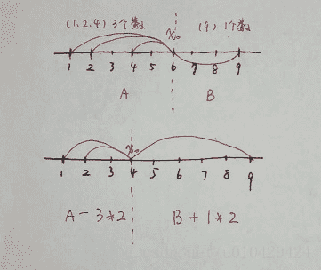
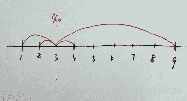
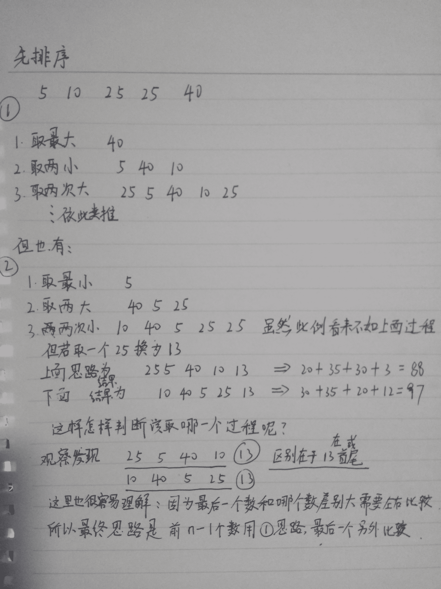

# 网易 2018 校招内推编程题集合

## 1

小易有一些彩色的砖块。每种颜色由一个大写字母表示。各个颜色砖块看起来都完全一样。现在有一个给定的字符串 s,s 中每个字符代表小易的某个砖块的颜色。小易想把他所有的砖块排成一行。如果最多存在一对不同颜色的相邻砖块,那么这行砖块就很漂亮的。请你帮助小易计算有多少种方式将他所有砖块排成漂亮的一行。(如果两种方式所对应的砖块颜色序列是相同的,那么认为这两种方式是一样的。)
例如: s = "ABAB",那么小易有六种排列的结果:
"AABB","ABAB","ABBA","BAAB","BABA","BBAA"
其中只有"AABB"和"BBAA"满足最多只有一对不同颜色的相邻砖块。

本题知识点

Java 工程师 C++工程师 安卓工程师 iOS 工程师 运维工程师 前端工程师 算法工程师 PHP 工程师 网易 模拟 字符串 *golang 工程师 测试工程师 2018* *讨论

[为了工作](https://www.nowcoder.com/profile/1019059)

思想就是看字符串里有几种字符，超过两种就不可能只有一对相邻的不同字符，有两种字符就是两种正确的排列，有一种字符自然就是一种正确的排列。

```cpp
package sort;

import java.util.HashSet;
import java.util.Scanner;

public class Main {
	public static void main(String[] args) {
		Scanner scanner = new Scanner(System.in);
		String string = scanner.nextLine();
		// 用 hashSet 记录字符串中有几种字符
		HashSet<String> hashSet = new HashSet<>();
		for (int i = 0; i < string.length(); i++) {
			hashSet.add(string.substring(i, i + 1));
			// 如果一旦有两种以上的字符就输出 0
			if (hashSet.size() > 2) {
				System.out.println(0);
				return;
			}
		}
		// 有两种字符就输出 2，有一种字符就输出 1
		System.out.println(hashSet.size());
	}
}
```

发表于 2017-08-13 10:05:35

* * *

[华科平凡](https://www.nowcoder.com/profile/4939096)

python 解法

水出天际的一道题目，刷新了认知下限。

* * *

思路

对每种颜色砖块个数做统计：

1.  如果出现了两种以上的颜色，肯定最少有两种相邻，直接输出 0.
2.  如果出现了一种，那就只有一种。
3.  如果出现了两种，那就只有两种。

```cpp
from collections import Counter

arr = Counter(input()).values()
if len(arr) > 2:
    print(0)
elif len(arr) == 1:
    print(1)
else:
    print(2)
```

发表于 2019-02-24 18:55:47

* * *

[笑忘书生](https://www.nowcoder.com/profile/4687592)

```cpp
#include <iostream>
#include <string>
#include <algorithm>
using namespace std;
int main()
{
	string str;
	int res = 0;
	cin >> str;
	sort(str.begin(), str.end());
	//cout << str << endl;
	str.erase(unique(str.begin(), str.end()),str.end());
	if (str.size() == 1)
		res = 1;
	else if (str.size() == 2)
		res = 2;
	cout << res << endl;
	return 0;
}
```

发表于 2017-08-12 22:13:46

* * *

## 2

如果一个数列 S 满足对于所有的合法的 i,都有 S[i + 1] = S[i] + d, 这里的 d 也可以是负数和零,我们就称数列 S 为等差数列。
小易现在有一个长度为 n 的数列 x,小易想把 x 变为一个等差数列。小易允许在数列上做交换任意两个位置的数值的操作,并且交换操作允许交换多次。但是有些数列通过交换还是不能变成等差数列,小易需要判别一个数列是否能通过交换操作变成等差数列

本题知识点

Java 工程师 C++工程师 安卓工程师 iOS 工程师 运维工程师 前端工程师 算法工程师 PHP 工程师 网易 贪心 数学 排序 *golang 工程师 测试工程师 2018* *讨论

[keep 丶 busy](https://www.nowcoder.com/profile/4526121)

//输入一个数字表示数组的长度，再依次输入数组的每一个元素，采纳率最高的那个答案不全面，在测试用例的通过率只有 80％

```cpp
import java.util.Scanner;
import java.util.Arrays;

public class Main{
    public static void main(String[] args){
        Scanner in = new Scanner(System.in);
        int num = in.nextInt();
        int[] arr = new int[num];
        for(int i = 0; i < num ;i++){
            arr[i] = in.nextInt();
        }
        Arrays.sort(arr);
        //需要定义一个布尔变量标记是否成功
        boolean flag = true;
        int d = arr[1] - arr[0];
        for(int i = 2;i<arr.length;i++){
            if(arr[i] - arr[i-1] != d){

                flag = false;
            }
        }
        if(flag){
            System.out.println("Possible");
        }else{
            System.out.println("Impossible");
        }

    }
} 
```

发表于 2017-08-31 16:02:27

* * *

[牛客 5941543 号](https://www.nowcoder.com/profile/5941543)

```cpp
/*
 *时间复杂度 O(n),空间复杂度 O(n)
 *1、找到等差数列的差值 dif
 *2、判断每个数对应差值 dif 的倍数(arr-min)/dif
 */
import java.util.Scanner;

public class Main {

	public static void main(String[] args) {
		Scanner sc = new Scanner(System.in);
		int n = Integer.valueOf(sc.nextLine());
		int[] arr = new int[n];
		int min = Integer.MAX_VALUE, max = Integer.MIN_VALUE;
		String[] str = sc.nextLine().split(" ");
		for (int i = 0; i < n; i++) {
			arr[i] = Integer.valueOf(str[i]);
			min = arr[i] > min ? min : arr[i];
			max = arr[i] < max ? max : arr[i];
		}
		if (min == max) {
			System.out.println("Possible");
			return;
		}
		int dif = (max - min) / (n - 1);
		for (int i = 0; i < n; i++) {
			int tmp = (max - Math.abs(arr[i])) / dif;
			if (tmp < 0 || tmp >= n) {
				System.out.println("Impossible");
				return;
			}
			arr[tmp] = -Math.abs(arr[tmp]);
		}
		for (int i : arr) {
			if (i > 0) {
				System.out.println("Impossible");
				return;
			}
		}
		System.out.println("Possible");
	}

}

```

编辑于 2017-08-14 21:06:31

* * *

[但求八月九月好运！](https://www.nowcoder.com/profile/942452840)

```cpp
/*排序判断是否差值相同*/
#include <iostream>
#include<algorithm>
using namespace std;
int num[51];
int main()
{
    int n,i,flag=1;
    cin>>n;
    for(i=0;i<n;++i)
        cin>>num[i];
    sort(num,num+n);
    if(n<=2) cout<<"Possible";
    if(n>2)
    {
        for(i=0;i<n-2;++i)
          if(num[i]-num[i+1]!=num[i+1]-num[i+2]) {cout<<"Impossible";flag=0;break;}
        if(flag) cout<<"Possible";
    }
    return 0;
}

```

发表于 2019-03-20 18:54:34

* * *

## 3

如果一个 01 串任意两个相邻位置的字符都是不一样的,我们就叫这个 01 串为交错 01 串。例如: "1","10101","0101010"都是交错 01 串。
小易现在有一个 01 串 s,小易想找出一个最长的连续子串,并且这个子串是一个交错 01 串。小易需要你帮帮忙求出最长的这样的子串的长度是多少。

本题知识点

Java 工程师 C++工程师 安卓工程师 iOS 工程师 运维工程师 前端工程师 算法工程师 PHP 工程师 网易 字符串 *golang 工程师 测试工程师 2018* *讨论

[小学作业多](https://www.nowcoder.com/profile/264534)

大家写的都好麻烦，遍历一遍数组记录最长的 01 交错子串长度就完了

```cpp
import java.util.Scanner;

public class Main {
    public static void main(String[] args) {
        Scanner in = new Scanner(System.in);

        while (in.hasNext()) {
            String str = in.next();
            int maxLen = 1;
            int len = 1;
            for (int i = 1; i < str.length(); i++) {
                if (str.charAt(i - 1) != str.charAt(i)) {
                    len++;
                    if (len > maxLen) {
                        maxLen = len;
                    }
                } else {
                    len = 1;
                }
            }
            System.out.println(maxLen);
        }
    }
} 

```

编辑于 2017-08-13 10:01:02

* * *

[卷积神经网络哦](https://www.nowcoder.com/profile/8684256)

笔试遇到这种送分题一定要做对而且不能浪费时间。。扫一遍 O(n)即可

```cpp
#include<iostream>
#include<string>
#include<algorithm>
using namespace std;

string s;
int main(){
    cin>>s;
    int max_len = 1, len = 1;
    for(int i=0; i<s.length()-1; i++){
        if(s[i+1] != s[i]) {len++; max_len = max(max_len, len);}
        else len = 1;
    }
    cout<<max_len<<endl;
    return 0;
}
```

发表于 2019-03-01 20:53:47

* * *

[华科平凡](https://www.nowcoder.com/profile/4939096)

python 解法

遍历字符串，记录每个位置的最大 01 串长度。

```cpp
string = input()
res, tmp_max = 1, 1
for i in range(len(string) - 1):
    if string[i] != string[i + 1]:
        tmp_max += 1
        res = max(res, tmp_max)
    else: # 如果下个位置组不成 01 串，则从下个位置重新开始记录当前最大长度
        tmp_max = 1
print(res) 
```

发表于 2019-03-02 11:04:36

* * *

## 4

小易有一个长度为 n 的整数序列,,...,。然后考虑在一个空序列 b 上进行 n 次以下操作:
1、将  放入 b 序列的末尾
2、逆置 b 序列
小易需要你计算输出操作 n 次之后的 b 序列。

本题知识点

Java 工程师 C++工程师 安卓工程师 iOS 工程师 运维工程师 前端工程师 算法工程师 PHP 工程师 网易 模拟 队列 *golang 工程师 测试工程师 2018* *讨论

[lqqqdu](https://www.nowcoder.com/profile/1161720)

```cpp
//规律题
//n = 1,b = 1    n = 1 直接输出
//n = 2,b = 2,1
//n = 3,b = 3,1,2
//n = 4,b = 4,2,1,3
//n = 5,b = 5,3,1,2,4
//n = 6,b = 6,4,2,1,3,5
//由上述可推，当 n 为奇数时，
//先从后向前输出奇数位置的数字，再从前向后输出偶数位置的数字  
//当 n 为偶数时
//先从后向前输出偶数位置的数字，再从前向后输出奇数位置的数字

import java.util.ArrayList;
import java.util.Arrays;
import java.util.List;
import java.util.Scanner;

public class test4 {

    public static void main(String[] args) {
        // TODO Auto-generated method stub
        Scanner scanner = new Scanner(System.in);
        int n = scanner.nextInt();
        int [] array = new int [n];
        for(int i = 0;i < n;i++){
            array[i] = scanner.nextInt();
        }
        if(n == 1){
            System.out.println(array[0]);
        }
        if(n % 2 == 0){
            for(int i = n-1;i >= 0;i -= 2){
                System.out.print(array[i] + " ");
            }
            for(int i = 0;i < n - 2;i += 2){
                System.out.print(array[i] + " ");

            }
            System.out.print(array[n-2]);
        }
        else { //n % 2 == 1
            for(int i = n-1;i >= 0;i -= 2){
                System.out.print(array[i] + " ");
            }
            for(int i = 1;i < n - 2;i += 2){
                System.out.print(array[i] + " ");
            }
            System.out.print(array[n-2]);
        }
    }

}

```

有评论讲我固定在了 12345 的顺序输入规律上面，其实不是的。第二行的输入是随意的，该方法适用于所有随意数字的输入。

编辑于 2019-05-05 22:43:32

* * *

[卷积神经网络哦](https://www.nowcoder.com/profile/8684256)

我的理解是从 a 数组第一个数开始 第奇数个放 b 最后面 第偶数个放 b 最前面 这样就不用逆序然后如果 n 为偶数就正向输出 n 为奇数就反向输出 用 deque 双向队列实现

```cpp
#include<iostream>
#include<deque>
using namespace std;

const int maxn = 2 * 1e5 + 5;
int arr[maxn], n;
deque<int> dp;
int main(){
    cin>>n;
    for(int i=0;i<n;i++) scanf("%d", &arr[i]);
    for(int i=0;i<n;i++){
        if(i % 2 == 0) dp.push_back(arr[i]);
        else dp.push_front(arr[i]);
    }
    if(n % 2 == 1){
        deque<int> dp_rev(dp.rbegin(), dp.rend());
        dp = dp_rev;
    }
    for(int i = 0; i < dp.size(); i++){
        printf("%d", dp[i]);
        if(i != dp.size() - 1) printf(" ");
    }
    printf("\n");
    return 0;
}
```

编辑于 2019-03-01 21:22:48

* * *

[改个名字解解毒...](https://www.nowcoder.com/profile/866538)

```cpp
#!/usr/bin/env python
#-*- coding:utf8 -*-
def findNum(nums, n):
    for i in range(n-1, -1, -2):
        print nums[i],
    if n&1 == 0:
        for i in range(0, n, 2):
            print nums[i],
    else:
        for i in range(1, n ,2):
            print nums[i],

if __name__ == '__main__':
    n = input()
    nums = map(int, raw_input().split())
    findNum(nums, n)

```

发表于 2017-08-14 14:47:12

* * *

## 5

小易为了向他的父母表现他已经长大独立了,他决定搬出去自己居住一段时间。一个人生活增加了许多花费: 小易每天必须吃一个水果并且需要每天支付 x 元的房屋租金。当前小易手中已经有 f 个水果和 d 元钱,小易也能去商店购买一些水果,商店每个水果售卖 p 元。小易为了表现他独立生活的能力,希望能独立生活的时间越长越好,小易希望你来帮他计算一下他最多能独立生活多少天。

本题知识点

Java 工程师 C++工程师 安卓工程师 iOS 工程师 运维工程师 前端工程师 算法工程师 PHP 工程师 网易 模拟 数学 贪心 golang 工程师 测试工程师 2018

讨论

[神山极客](https://www.nowcoder.com/profile/579233)

```cpp
//只有两种情况,已有水果个数比现有的钱除以房钱的次数多，此时以开房天数来算，
//否则，就把水果卖了换钱，再用钱除以水果加房钱总和
#include 
using namespace std;
int main()
{
    long x, f, d, p;
    cin >> x >> f >> d >> p;
    long day;
    if (d / x > f) day = (d + p * f) / (x + p);
    else day = d / x;
    cout << day << endl;
    return 0;
} 
```

编辑于 2017-08-12 18:52:51

* * *

[莫慌](https://www.nowcoder.com/profile/8832709)

```cpp

	x,f,d,p = map(int,raw_input().split())

	day = (f*p+d)/(x+p)

	print min(day,d/x)

	#每次看大家提交的代码，都觉得 python 是最简洁的

	#哈哈，人生苦短，我用 python

```

发表于 2017-08-13 15:32:26

* * *

[卷积神经网络哦](https://www.nowcoder.com/profile/8684256)

如果开始持有的水果够吃 直接算 d/x 就是天数
如果不够吃 则可以等效为一开始没有水果 而是多了 p**f 块钱
由于一开始不知道水果够不够吃， 所以比较这两种那个天数少就是哪个。
ps：这种应该是最简单的编程方法
注意：题目给到了 2**10⁹ 的数量级 也就是 int 型的最大数量级 如果再做乘法加法运算就会爆了 所以用 long long 型（此题的测试样例很温和，没有给大数）

```cpp
#include <iostream>
#include <algorithm>
using namespace std;
int main(){
    long long x, f, d, p; cin>>x>>f>>d>>p;
    int ans = min((d + p*f) / (x + p), d/x);
    printf("%d\n", ans);
    return 0;
}
```

编辑于 2019-03-01 21:38:45

* * *

## 6

小易将 n 个棋子摆放在一张无限大的棋盘上。第 i 个棋子放在第 x[i]行 y[i]列。同一个格子允许放置多个棋子。每一次操作小易可以把一个棋子拿起并将其移动到原格子的上、下、左、右的任意一个格子中。小易想知道要让棋盘上出现有一个格子中至少有 i(1 ≤ i ≤ n)个棋子所需要的最少操作次数.

本题知识点

Java 工程师 C++工程师 安卓工程师 iOS 工程师 运维工程师 前端工程师 算法工程师 PHP 工程师 网易 模拟 golang 工程师 测试工程师 2018

讨论

[吴鹏 _2016](https://www.nowcoder.com/profile/3270776)

```cpp
#include <bits/stdc++.h>

using namespace std;

// 计算曼哈顿距离
int manhattan_dist(int x1, int y1, int x2, int y2) {
	return abs(x2 - x1) + abs(y2 - y1);
}
/*
求，让某一个格子(x0,y0)上有 k 个棋子所需要的最少操作次数

1\. 求出所有棋子到某一点的曼哈顿距离，得到一个 n 维 vector
2\. 将 vector 从小到大排序
3\. 对 vector 中第 0 个元素到第 k - 1 个元素求和，即前 k 个元素
*/
int get_dist_sum(int x0, int y0, const vector<int> &X, const vector<int> &Y, int k) {
	int n = X.size();
	// 1\. 计算所有棋子到点(x0, y0)的曼哈顿距离，得到 n 维向量 dists
	vector<int> dists(n);
	for (int i = 0; i < n; ++i)
		dists[i] = manhattan_dist(x0, y0, X[i], Y[i]);
	// 2\. 将 dists 从小到大排序
	sort(dists.begin(), dists.end());
	// 3\. 对 vector 中第 0 个元素到第 k - 1 个元素求和
	int dist_sum = 0;
	for (int i = 0; i < k; ++i)
		dist_sum += dists[i];
	return dist_sum;
}
/*
求，让棋盘上出现有一个格子上有 k 个棋子所需要的最少次数

这个函数是这道题的关键。由于计算曼哈顿距离时可以通过对 x 和 y 分别计算再求和来得到，
所以使 dist_sum 最小的格子的 x 坐标一定是 X 中的一个，y 坐标一定是 Y 中的一个。

1\. 遍历每一个备选格子(X[i], Y[j])，并分别计算 dist_sum
2\. 求得它们的最小值
*/
int min_move(int k, const vector<int> &X, const vector<int> &Y) {
	int min_dist_sum = INT_MAX, n = X.size();
	for (int i = 0; i < n; ++i) {
		for (int j = 0; j < n; ++j) {
			int dist_sum = get_dist_sum(X[i], Y[j], X, Y, k);
			min_dist_sum = min(min_dist_sum, dist_sum);
		}
	}
	return min_dist_sum;
}
vector<int> min_moves(int n, const vector<int> &X, const vector<int> &Y) {
	vector<int> res(n, 0);
	for (int k = 2; k <= n; ++k)
		res[k - 1] = min_move(k, X, Y);
	return res;
}

int main() {
    int n = 0;
    cin >> n;
    vector<int> X(n), Y(n);
    for (int i = 0; i < n; ++i) cin >> X[i];
    for (int i = 0; i < n; ++i) cin >> Y[i];   
    vector<int> res = min_moves(n, X, Y);   
    for (int i = 0; i < n - 1; ++i) cout << res[i] << ' ';
    cout << res.back() << endl;
    return 0;
}
```

编辑于 2017-08-15 09:20:17

* * *

[蟹粉馅大糖包](https://www.nowcoder.com/profile/8917280)

```cpp
暴力枚举法居然过了，关键在于，最后堆棋子的那个格子，横纵坐标必然在棋子初始的横纵坐
标中间
用反证法，xy 轴其实是独立的，先只考虑 x 坐标，假设把 k 个棋子堆到 x0 格子所用的步骤最少，
a 个棋子初始在 x0 的左边，b 个棋子初始在 x0 的右边，且 a>b,那么必然存在横坐标为 x0-1 的格
子，这 k 个棋子到 x0-1 的步数会更少，b>a 的情况，那么 x0+1 的目标将比 x0 更优，至于 a=b，
x0-1 和 x0 的步数是一样的。因此，最终汇聚棋子的 x 坐标只要在棋子初始的 x 个坐标中考虑

import java.util.*;

public class Main {
    public static void main(String[] args) {
        Scanner in = new Scanner(System.in);
        while (in.hasNext()) {
            int n = in.nextInt();
            int[] x = new int[n];
            int[] y = new int[n];
            for (int i = 0; i < n; i ++) {
                x[i] = in.nextInt();
            }
            for (int i = 0; i < n; i ++) {
                y[i] = in.nextInt();
            }
            List<Long> res = new ArrayList<>();
            long min, sum;
            for (int i = 1; i <= n; i ++) {
                min = Long.MAX_VALUE;
                for (int row = 0; row < n; row ++) {
                    for (int col = 0; col < n; col ++) {
                        sum = 0;
                        PriorityQueue<Integer> pq = new PriorityQueue<>(i, new Comparator<Integer>() {
                            @Override
                            public int compare(Integer o1, Integer o2) {
                                return o2 - o1;
                            }
                        });
                        for (int c = 0; c < n; c ++) {
                            int xc = x[c];
                            int yc = y[c];
                            int distance = Math.abs(xc - x[row]) + Math.abs(yc - y[col]);
                            sum += distance;
                            pq.add(distance);
                            if (pq.size() > i) {
                                sum -= pq.poll();
                            }
                        }
                        min = Math.min(min, sum);
                    }
                }
                res.add(min);
            }
            for (int i = 0; i < n - 1; i ++) System.out.print(res.get(i) + " ");
            System.out.println(res.get(n - 1));
        }
    }
}

```

编辑于 2017-08-12 21:13:44

* * *

[gggv123](https://www.nowcoder.com/profile/3654702)

下面的思路参考了[@蟹粉馅大糖包](https://www.nowcoder.com/questionTerminal/27f3672f17f94a289f3de86b69f8a25b)本题的关键是找到一个最优的聚合点，使得各个棋子到这个聚合点的距离最短。由于 x 和 y 轴是相互独立的，互不影响，因此可以先分析 x 轴再分析 y 轴。以【1，2，4，9】为例，根据[@蟹粉馅大糖包](https://www.nowcoder.com/questionTerminal/27f3672f17f94a289f3de86b69f8a25b)的证明，最优聚合点的 x 坐标一定是【1，2，4，9】这几个数之一，同理 y 坐标一定是【1，1，1，1】这几个数之一。有了这个结论，就可以使用暴力法，一一枚举每一个可能的点并计算距离，求出距离最小的那个点。

**为了证明上面的结论，我们使用反证法：**

假设存在点 x0 使得其余各点到 x0 的距离最短，并且 x0 不是【1，2，4，9】之一。以 x0=6 为例，在 x0 左边有【1，2，4】共 3 个数，我们把 3 记为 a；在 x0 右边有【9】共 1 个数，把 1 记为 b。【1，2，4】到 x0 的距离记为 A；【9】到 x0 的距离记为 B；那么总距离就为 A+B。

当 a > b 时，我们发现 x0 左边第一个在【1，2，4，9】集合中的数，会得到更小的距离。即：x0 等于 4 时，总距离是：A+B-a * 2 + b * 2，其中 a 等于 3，b 等于 1。所以我们之前的假设不成立~

同理，当 a < b 时，x0 右边第一个在【1，2，4，9】集合中的数，也会使总距离变小。当 a == b 时，“x0 等于 3”与 “x0 等于 2” 或者 “x0 等于 4”时的总距离相等，因此“x0 等于 3”就可以被“x0 等于 3”或“x0 等于 4”替代。**总结一下，** 我们最开始的假设不成立，当 x0 为【1，2，4，9】之一，必可以取到最小值，同理 y0 应该为【1，1，1，1】之一。  -----谢谢@[牛客 109788 号](https://www.nowcoder.com/profile/109788)的提醒-----有了上面的结论，就可以写出代码了，具体可见下面的博客：[`blog.csdn.net/u010429424/article/details/77198486`](http://blog.csdn.net/u010429424/article/details/77198486)

编辑于 2017-08-17 22:19:23

* * *

## 7

小易老师是非常严厉的,它会要求所有学生在进入教室前都排成一列,并且他要求学生按照身高不递减的顺序排列。有一次,n 个学生在列队的时候,小易老师正好去卫生间了。学生们终于有机会反击了,于是学生们决定来一次疯狂的队列,他们定义一个队列的疯狂值为每对相邻排列学生身高差的绝对值总和。由于按照身高顺序排列的队列的疯狂值是最小的,他们当然决定按照疯狂值最大的顺序来进行列队。现在给出 n 个学生的身高,请计算出这些学生列队的最大可能的疯狂值。小易老师回来一定会气得半死。

本题知识点

Java 工程师 C++工程师 安卓工程师 iOS 工程师 运维工程师 前端工程师 算法工程师 PHP 工程师 网易 贪心 数学 golang 工程师 测试工程师 2018

讨论

[小学作业多](https://www.nowcoder.com/profile/264534)

将原数列排好序，每次取数列中的最大与最小值加入到疯狂队列中（想象一下疯狂队列从中间向两边扩展），与上一次加入的最小与最大值交叉做差，直到原数列中仅剩最后一个值，把它放到疯狂队列合适的位置上保证疯狂值最大即可。

```cpp
import java.util.Arrays;
import java.util.Scanner;

public class Main {
    public static void main(String[] args) {
        Scanner in = new Scanner(System.in);

        while (in.hasNextInt()) {
            int n = in.nextInt();
            int[] nums = new int[n];
            for (int i = 0; i < n; i++) {
                nums[i] = in.nextInt();
            }
            Arrays.sort(nums);
            int min = nums[0];      // 上一次加入疯狂队列的那个最小值
            int max = nums[n - 1];  // 上一次加入疯狂队列的那个最大值
            int diff = max - min;
            int minIndex = 1;       // 未加入疯狂队列的最小值索引
            int maxIndex = n - 2;   // 未加入疯狂队列的最大值索引
            while (minIndex < maxIndex) {
                diff += max - nums[minIndex];
                diff += nums[maxIndex] - min;
                min = nums[minIndex++];
                max = nums[maxIndex--];
            }
            // 原数列中最后一个数 minIndex == maxIndex，将它放到合适的位置上
            diff += Math.max(nums[maxIndex] - min, max - nums[minIndex]);
            System.out.println(diff);
        }
    }
}

```

编辑于 2017-08-13 14:56:59

* * *

[烤糊的蛋挞](https://www.nowcoder.com/profile/4112248)

代码如下：#include <iostream>
#include <vector>
#include <deque>
#include <algorithm>
using namespace std;
int main()
{
    int n;
    while(cin >> n){
        vector<int> vec(n);
        for(auto& v:vec) cin >> v;
        sort(vec.begin(),vec.end());
        deque<int> que;       //存储疯狂数列结果
        bool b=false;            //定义取排序偏大的数，还是小数
        int off = 2;                 //大数和小数都连续取两个
        bool fore = true;       //定义放 que 的前面还是 push_back 到后面
        int iend = n-2;          //定义大数的游标位置
        int ist = 0;                //定义小数的游标位置
        que.push_back(vec[n-1]);    //先把最大的数放进去
        for(int i=0; i < vec.size()-2; i++){        //只取 n-1 个数
            if(b){
                if(fore) que.push_front(vec[iend]);
                else que.push_back(vec[iend]);
                iend--;
            }
            else{
                if(fore) que.push_front(vec[ist]);
                else  que.push_back(vec[ist]);
                ist++;
            }
            off --;
            fore = !fore;
            if(off == 0){
                off = 2;
                b = !b;
           }
        }
        int result = 0;
        for(int i=1; i < que.size(); i++) result = result + abs(que[i]-que[i-1]);
        if(abs(que[0]-vec[ist]) > abs(que[que.size()-1] -vec[ist])) cout << result +abs(que[0]-vec[ist]) << endl;
        else cout << result + abs(que[que.size()-1] -vec[ist]) << endl;;
    }
    return 0;
}

发表于 2018-08-05 23:17:03

* * *

[它喵的我的 offer 呢](https://www.nowcoder.com/profile/5048270)

```cpp
分享一个不一样的思路吧：
/*首先要清楚这个最终结果序列 从左往右看一定是高低不平的 这是什么意思呢  ？（已 5 个为例，它的最优解要么是 低高低高低的形式 要么是
高低高低高的形式）可以发现 对于低高低高低(字母 M 形式).. 计算疯狂值的时候高的这部分是每个数都是加了两次的
低的部分除了最左端和最右端的两个低 只减了一次  其他的都是减了两次   因为可以先对整体排序 取大的一半作为 M 中的峰（和为 temp1）
小的一半（和为 temp2）作为 M 中的谷  那么疯狂值应该是 temp1-temp2+最左端和最右端两个低，当最端和最右端取 小的那一半的最大两个时
即可取最大疯狂值 ，对于 W 形式和 偶数的形式 依次推导 */
```

```cpp
#include
#include
#include
#include
#include
#include
#include
#include
using  namespace std;
int main()
{
    int N;
    cin >> N;
    int res = 0;
    vector  vec;
    int data;
    for (int i = 0; i <N ; i++)
    {
        cin >> data;
        vec.push_back(data);
    }
    sort(vec.begin(), vec.end());
    if (vec.size() == 1)
        return vec[0];
    if (vec.size() == 2)
        return vec[1] - vec[0];
    if (N % 2 == 1)
    {
        int temp1 = 2*accumulate(vec.begin() + N / 2, vec.end(), 0);
        int temp2 = 2 *accumulate(vec.begin(), vec.begin() + N / 2, 0);
        res = temp1 - temp2-vec[N/2]-vec[N/2+1];//排成 W 型
        temp1=2*accumulate(vec.begin()+N/2+1,vec.end(),0);
        temp2=2*accumulate(vec.begin(),vec.begin()+N/2+1,0);//排成 M 型
        res=max(res,temp1-temp2+vec[N/2]+vec[N/2-1]);

    }
    else
    {
        int temp1 = 2 * accumulate(vec.begin() + N / 2, vec.end(), 0);
        int temp2 = 2 * accumulate(vec.begin(), vec.begin() + N / 2, 0);
        res = temp1 - temp2 - vec[N / 2] + vec[N / 2 - 1];//取大的一半最小的   和小的部分最大的放到只算了一次的位置
    }
    cout << res << endl;
    system("pause");
    return 0;
}
```

发表于 2017-08-14 09:16:15

* * *

## 8

小易非常喜欢拥有以下性质的数列:
1、数列的长度为 n
2、数列中的每个数都在 1 到 k 之间(包括 1 和 k)
3、对于位置相邻的两个数 A 和 B(A 在 B 前),都满足(A <= B)或(A mod B != 0)(满足其一即可)
例如,当 n = 4, k = 7
那么{1,7,7,2},它的长度是 4,所有数字也在 1 到 7 范围内,并且满足第三条性质,所以小易是喜欢这个数列的
但是小易不喜欢{4,4,4,2}这个数列。小易给出 n 和 k,希望你能帮他求出有多少个是他会喜欢的数列。

本题知识点

Java 工程师 C++工程师 安卓工程师 iOS 工程师 运维工程师 前端工程师 算法工程师 PHP 工程师 网易 动态规划 golang 工程师 测试工程师 2018

讨论

[童山公爵](https://www.nowcoder.com/profile/2085590)

state[i][j]表示整个状态空间，其中 i(1<=i<=n)表示数列的长度，j(1<=j<=k)表示数列长度为 i 且以数字 j 结尾。递推关系有：state[i][j] += state[i-1][m] (1<=m<=k, 并且(m,j)是个合法的数列)，但是直接按照递推关系，用三层 for 循环会超时。为此可以先将长度为 i-1 的合法数列求和(记为 sum)。然后对于数列长度为 i 的每一个 j，求出数列长度为 i-1 时非法的序列个数（记为 invalid）,即有 state[i][j] = sum - invalid。对于 invalid 求取，可以参照素数筛选。算法的时间复杂度大概为 O(nkloglogk)

```cpp
import java.util.Scanner;

public class Main {
	static final int mod = 1000000007;

	public static void main(String[] args) {
		Scanner scanner = new Scanner(System.in);
		int n = scanner.nextInt();
		int k = scanner.nextInt();
		int[][] state = new int[n+1][k+1];

		state[0][1] = 1;

		for(int i=1; i<=n; i++) {
			int sum = 0;
			for(int j=1; j<=k; j++) {
				sum = (sum + state[i-1][j]) % mod;
			}
			for(int j=1; j<=k; j++) {
				int invalid = 0;
				int p = 2;
				while(p*j <= k) {
					invalid = (invalid + state[i-1][p*j]) % mod;
					p++;
				}
				state[i][j] = (sum - invalid + mod) % mod;
			}
		}

		int sum = 0;
		for(int i=1; i<=k; i++) {
			sum = (sum + state[n][i]) % mod;
		}
		System.out.println(sum);

		scanner.close();
	}
}
```

编辑于 2017-08-12 23:45:33

* * *

[此广告位出租](https://www.nowcoder.com/profile/4739294)

虽然想想还是不会做，但是为大家撸来了测试数据

```cpp
if(n==6&& k == 34951)
            System.out.println(512466752);
        if(n==3&& k == 16267)
            System.out.println(813344752);
        if(n==10&& k == 62418)
            System.out.println(560469948);
        if(n==6&& k == 90238)
            System.out.println(719200441);
        if(n==6&& k == 76199)
            System.out.println(584614085);
        if(n==10&& k == 100000)
            System.out.println(526882214);
        if(n==2&& k == 1234)
            System.out.println(1515011);
        if(n==3&& k == 3)
            System.out.println(15);
        if(n==2&& k == 2)
            System.out.println(3);
        if(k == 1){
            System.out.println(1);
        }
```

编辑于 2017-08-16 10:50:22

* * *

[元气の悟空](https://www.nowcoder.com/profile/392974)

```cpp
//AC 代码：
#include<stdio.h>
#include<string.h>
int dp[15][100005];
const int mod=1000000007;
int main(){
    int n,k,i,j,q;
    //freopen("input.txt","r",stdin);
    while(scanf("%d%d",&n,&k)!=EOF){
        memset(dp,0,sizeof(dp));
        for(i=1;i<=k;i++) dp[1][i]=1;
        for(i=2;i<=n;i++){
            int sum=0;
            for(j=1;j<=k;j++) sum=(sum+dp[i-1][j])%mod;
            for(j=1;j<=k;j++){
                dp[i][j]=sum;
                for(q=j*2;q<=k;q+=j) dp[i][j]=(dp[i][j]-dp[i-1][q]+mod)%mod;
            }
        }
        int res=0;
        for(i=1;i<=k;i++) res=(res+dp[n][i])%mod;
        printf("%d\n",res);
    }
}//用 dp[i][j]表示长度为 i 且必须以 j 结尾的方法
```

发表于 2017-08-23 17:56:36

* * *****