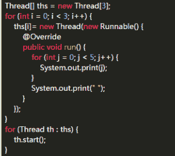

# 携程 2017 校招开发工程师客观题汇总

## 1

有关静态初始化块说法正确的是？

正确答案: A B C   你的答案: 空 (错误)

```cpp
无法直接调用静态初始化块
```

```cpp
在创建第一个实例前或引用任何静态成员之前，将自动调用静态初始化块来初始化
```

```cpp
静态初始化块既没有访问修饰符，也没有参数
```

```cpp
在程序中，用户可以控制何时执行静态初始化块
```

本题知识点

Java

讨论

[万叶飞花](https://www.nowcoder.com/profile/497663331)

**java 对象初始化顺序**
先说结论：

1.  父类静态代码块，父类静态成员变量（同级，按代码顺序执行）
2.  子类静态代码块，子类静态成员变量（同级，按代码顺序执行）
3.  父类普通代码块，父类普通成员变量（同级，按代码顺序执行）
4.  父类构造方法
5.  子类普通代码块，子类普通成员变量（同级，按代码顺序执行）
6.  子类构造方法

注意点：

1.  静态内容只在类加载时执行一次，之后不再执行。
2.  默认调用父类的无参构造方法，可以在子类构造方法中利用 super 指定调用父类的哪个构造方法。

代码测试：

```cpp
/**
 * Description: Java 对象初始化顺序
 * Created by yangyz on 2018/12/25
 */
class Father {
    public Father() {
        System.out.println("父类无参构造方法");
    }
    static {
        System.out.println("父类静态代码块 1");
    }
    private static int a = Help.fatherStaticMemberVarInit();
    static {
        System.out.println("父类静态代码块 2");
    }
    {
        System.out.println("父类普通代码块 1");
    }
    private int b = Help.fatherMemberVarInit();
    {
        System.out.println("父类普通代码块 2");
    }
    public Father(int v) {
        System.out.println("父类带参构造方法");
    }
}

class Son extends Father {
    static {
        System.out.println("子类静态代码块 1");
    }
    private static int a = Help.sonStaticMemberVarInit();
    static {
        System.out.println("子类静态代码块 2");
    }
    {
        System.out.println("子类普通代码块 1");
    }
    private int b = Help.sonMemberVarInit();
    {
        System.out.println("子类普通代码块 2");
    }
    public Son() {
        // super(2018);
        System.out.println("子类构造方法");
    }
}

class Help {
    public static int fatherStaticMemberVarInit() {
        System.out.println("父类静态成员变量");
        return 0;
    }
    public static int fatherMemberVarInit() {
        System.out.println("父类普通成员变量");
        return 0;
    }
    public static int sonStaticMemberVarInit() {
        System.out.println("子类静态成员变量");
        return 0;
    }
    public static int sonMemberVarInit() {
        System.out.println("子类普通成员变量");
        return 0;
    }
}

public class Test {
    public static void main(String[] args) {
        Son son1 = new Son();
        System.out.println("===================");
        Son son2 = new Son();
    }
}
```

测试结果：


编辑于 2018-12-25 16:23:15

* * *

[江松展](https://www.nowcoder.com/profile/2069737)

JAVA 的初始化顺序：

父类的静态成员初始化>父类的静态代码块>子类的静态成员初始化>子类的静态代码块>父类的代码块>父类的构造方法>子类的代码块>子类的构造方法

注意：

1.静态成员和静态代码块只有在类加载的时候执行一次，再次创建实例时，不再执行，因为只在方法区存在一份，属于一整个类。

2.上述的是通用的加载顺序，如果没有则省略。


发表于 2017-10-26 18:50:50

* * *

[柚子皮 Uzipi](https://www.nowcoder.com/profile/5056050)

题目改正了，静态初始化块。1\. 静态初始化块在类加载时完成，无法人为调用，A 对。2\. 关于初始化顺序，参考 江展松 的回答：父类的静态成员初始化 > 父类的静态代码块 > 子类的静态成员初始化 > 子类的静态代码块 > 父类的代码块 > 父类的构造方法 > 子类的代码块 > 子类的构造方法。且静态成员初始化和静态代码块只有在类加载的时候执行一次，再次创建实例对象时，不再执行，因为只在方法区存在一份，属于整个类共享。因此 B 对。
3\. 静态初始化块的标准写法，没有访问修饰符、参数：

```cpp
static {
    // 初始化内容
}
```

4\. 如果有多个静态块，分别写在代码的不同位置，算不算控制了执行时间？

发表于 2018-02-24 13:04:10

* * *

## 2

运行下面代码，输出的结果是： 

正确答案: A   你的答案: 空 (错误)

```cpp
1
```

```cpp
0
```

```cpp
-1
```

```cpp
-2
```

本题知识点

C 语言

讨论

[牛客 4700144 号](https://www.nowcoder.com/profile/4700144)

无符号号整数和有符号整数相加，有符号整数转化为无符号整数，signed int b 变成了一个很大的数，所以 a + b 是＞0 的，选 A

发表于 2017-08-15 16:27:06

* * *

[图图的一天](https://www.nowcoder.com/profile/814861951)

编译器认为：有符号数+无符号数=无符号数

发表于 2021-06-28 20:04:49

* * *

[゛一花一世界づ](https://www.nowcoder.com/profile/5094586)

有符号数和无符号数进行比较运算时（==，<,>,<=,>=）,有符号数隐式转换成了无符号数（即底层的补码不变，但是此数从有符号数变成了无符号数），比如上面 (a+b)>0 这个比较运算，a+b=-2。此数进行比较运算时，被当成了无符号数，它远远大于 0，所以得到上述结果。

发表于 2017-08-24 20:06:59

* * *

## 3

运行下面代码，输出的结果是： 

正确答案: B   你的答案: 空 (错误)

```cpp
17,70
```

```cpp
17,72
```

```cpp
16,72
```

```cpp
30,60
```

本题知识点

C++

讨论

[loveInternet](https://www.nowcoder.com/profile/3673693)

当 i=16 时，q=72;然后先进行 i++;接着再去判断 q>60.因此 i=17.

发表于 2017-08-23 16:44:02

* * *

[华谨舞](https://www.nowcoder.com/profile/230533336)

i=16 的时候 i%2==0,所以 q=72,i++(i=17),q>60,break;

发表于 2018-10-23 19:36:12

* * *

[牛客 4700144 号](https://www.nowcoder.com/profile/4700144)

i=17 : 2 4 6 8 10 12 14 16、i++ q=72 :2+4+...+16

发表于 2017-08-15 16:14:39

* * *

## 4

CLR 为.NET 提供以下方面的功能或者服务，除了（）？

正确答案: A   你的答案: 空 (错误)

```cpp
自动消除程序中的逻辑错误
```

```cpp
代码验证和类型安全
```

```cpp
代码访问安全
```

```cpp
无用存储单元收集
```

本题知识点

.NET

讨论

[Arvid](https://www.nowcoder.com/profile/8376707)

A 代码逻辑错误怎么可能自动消除

发表于 2017-09-30 09:31:36

* * *

[牛客小小菜鸟](https://www.nowcoder.com/profile/6392441)

CLR(公共语言运行库,Common Language Runtime)和 Java[虚拟机](https://baike.baidu.com/item/%E8%99%9A%E6%8B%9F%E6%9C%BA)一样也是一个运行时环境，是一个可由多种编程语言使用的运行环境。CLR 的核心功能包括：[内存管理](https://baike.baidu.com/item/%E5%86%85%E5%AD%98%E7%AE%A1%E7%90%86)、[程序集](https://baike.baidu.com/item/%E7%A8%8B%E5%BA%8F%E9%9B%86)加载、安全性、[异常处理](https://baike.baidu.com/item/%E5%BC%82%E5%B8%B8%E5%A4%84%E7%90%86)和[线程同步](https://baike.baidu.com/item/%E7%BA%BF%E7%A8%8B%E5%90%8C%E6%AD%A5)，可由面向 CLR 的所有语言使用。并保证应用和底层操作系统之间必要的分离。CLR 是.NET Framework 的主要执行引擎。

发表于 2017-08-17 21:20:10

* * *

## 5

关于哈弗曼树，下列说法错误的是？

正确答案: A   你的答案: 空 (错误)

```cpp
为字符编码需要从叶节点开始再向上
```

```cpp
哈弗曼树可以通过在优先级队列中的插入和移除操作来创建
```

```cpp
最常出现的字符总是在靠近树顶附近出现
```

```cpp
通常，信息解码需要重复的顺着根到叶的路径走
```

本题知识点

树

讨论

[ishare20](https://www.nowcoder.com/profile/5184817)

哈夫曼编码和解码都是从根节点到叶子节点的哈夫曼编码过程：字符串“AAAABBBBBCCDDDDDDE”，字符出现的频率为 A4，B5，C2，D6，E1 构建哈夫曼树**编码就是从根节点开始，往左走就是 0，往右走就是 1**
最终字符编码为：A:01B:10C:001D:11E:000 字符串“AAAABBBBBCCDDDDDDE”  ---->  01010101101010101000100111111111111000 解码也是使用上面的哈夫曼树来，**从根节点开始，****遇到 0 就往左走，遇到 1 就往右走，走到叶子节点就是该字符了，完成一个字符解码，下一个字符解码又从根节点开始走。**

编辑于 2017-09-24 13:20:43

* * *

[FLKID](https://www.nowcoder.com/profile/200170217)

A 选项写的是编码，不是构造。别看错了

发表于 2020-07-01 16:54:21

* * *

[寒月照三更](https://www.nowcoder.com/profile/122796058)

优先队列可以达到排序的效果

发表于 2019-10-18 18:09:56

* * *

## 6

在一颗平衡二叉树中，下列说法正确的是？

正确答案: D   你的答案: 空 (错误)

```cpp
在查找过程中需要改变树的结构
```

```cpp
所有子树的高度都受严格控制
```

```cpp
所有左子树的高度和所有右子树的高度都相等
```

```cpp
左右两棵子数的高度差的绝对值不能超过 1
```

本题知识点

树

讨论

[2FA0](https://www.nowcoder.com/profile/6103754)

我胖虎觉得 b 也正确！

发表于 2017-09-08 16:25:20

* * *

[jokervsbat](https://www.nowcoder.com/profile/6400373)

这 sb 题目

发表于 2017-08-27 18:38:12

* * *

[--sgf--](https://www.nowcoder.com/profile/8882859)

B 选项要将高度改成高度差才正确，D 选项要加上“所有”两个字才正确。

发表于 2022-02-19 15:02:13

* * *

## 7

如果进栈的顺序为 X、Y、Z 则下列哪个出栈顺序是不可能的？（）

正确答案: C   你的答案: 空 (错误)

```cpp
XYZ
```

```cpp
XZY
```

```cpp
ZXY
```

```cpp
ZYX
```

本题知识点

栈 *讨论

[小**2018](https://www.nowcoder.com/profile/5355123)

C,Z 出栈的时候，序列一定为 xyz.y 一定先于 x 出栈的

发表于 2017-08-15 15:47:30

* * *

[Daxong](https://www.nowcoder.com/profile/4082427)

画决策树

发表于 2019-04-06 21:46:04

* * *

[wei 智](https://www.nowcoder.com/profile/869582688)

Z 第一个出栈的话，先与 Z 进栈的一定还在栈里，后续只能按先进后出的顺序出栈

发表于 2019-04-15 21:35:41

* * *

## 8

Http 协议的应答中，哪一个应答码表示请求处理成功？（ ）

正确答案: A   你的答案: 空 (错误)

```cpp
200
```

```cpp
100
```

```cpp
400
```

```cpp
300
```

本题知识点

网络基础

讨论

[一瓢之饮](https://www.nowcoder.com/profile/4057885)

1xx：指示信息--表示请求已接收，继续处理
2xx：成功--表示请求已被成功接收、理解、接受
3xx：重定向--要完成请求必须进行更进一步的操作
4xx：客户端错误--请求有语法错误或请求无法实现
5xx：服务器端错误--服务器未能实现合法的请求

发表于 2017-08-19 16:12:39

* * *

[小**2018](https://www.nowcoder.com/profile/5355123)

A,200，http 状态码

发表于 2017-08-15 15:45:09

* * *

[阿明 8](https://www.nowcoder.com/profile/3513516)

a

发表于 2017-10-13 13:45:49

* * *

## 9

设顺序循环队列 Q[0，M-1]的头指针和尾指针分别为 F 和 R，头指针 F 总是指向队头元素的前一位，尾指针 R 总是指向队尾元素的当前位置，则该循环队列职工的元素个数为（ ）？

正确答案: B   你的答案: 空 (错误)

```cpp
(F-R)%M
```

```cpp
(R-F+M)%M
```

```cpp
(F-R+M)%M
```

```cpp
R-F-1
```

本题知识点

队列 *讨论

[゛一花一世界づ](https://www.nowcoder.com/profile/5094586)

借来：[`www.nowcoder.com/questionTerminal/0103f64025ba4110a1f0bf51a4c06cbb?toCommentId=114473`](https://www.nowcoder.com/questionTerminal/0103f64025ba4110a1f0bf51a4c06cbb?toCommentId=114473)

发表于 2017-08-24 20:23:08

* * *

[suikin66](https://www.nowcoder.com/profile/6551230)

书中定义的队列长度为：(rear-front++QueueSize)%QueueSize 1.rear: 定义中是指向末尾元素的下一个位置， 本题中是直接指向末尾元素， 所以将 rear 向后移动一个位置， R-1 2.front：定义中是指向首元素， 而本题中是指向首元素的前一个元素， 因此向后移动一个位置， F-1 rear = R-1 front = F-1 所以： [ (R - 1) - ( F - 1) + M]%M = (R-F+M)%M

发表于 2018-02-01 04:11:18

* * *

[不做人了](https://www.nowcoder.com/profile/250145)

一般来说 尾指针指向 队尾元素的下一个结点 因为使用了空结点判断队列满或空
F = front -1
R = rear +1

发表于 2020-07-07 11:01:32

* * *

## 10

下面哪个不是操作系统常用的批处理作业调度算法（ ）？

正确答案: B   你的答案: 空 (错误)

```cpp
先来先服务(FCFS)
```

```cpp
时间片轮转算法(RR)
```

```cpp
短作业优先调度算法(SPF)
```

```cpp
基于优先数调度算法(HPF)
```

本题知识点

操作系统

讨论

[2FA0](https://www.nowcoder.com/profile/6103754)

常见的批处理作业调度算法

1.**先来先服务调度算法（FCFS）**:就是按照各个作业进入系统的自然次序来调度作业。这种调度算法的优点是实现简单，公平。其缺点是没有考虑到系统中各种资源的综合使用情况，往往使短作业的用户不满意，因为短作业等待处理的时间可能比实际运行时间长得多。

2.**短作业优先调度算法(SPF)**: 就是优先调度并处理短作业，所谓短是指作业的运行时间短。而在作业未投入运行时，并不能知道它实际的运行时间的长短，因此需要用户在提交作业时同时提交作业运行时间的估计值。

3.**最高响应比优先算法(HRN)：**FCFS 可能造成短作业用户不满，SPF 可能使得长作业用户不满，于是提出 HRN，选择响应比最高的作业运行。响应比=1+作业等待时间/作业处理时间。

4.**基于优先数调度算法(HPF)**：每一个作业规定一个表示该作业优先级别的整数，当需要将新的作业由输入井调入内存处理时，优先选择优先数最高的作业。

5.**均衡调度算法**，即多级队列调度算法**

*   基本概念：

    ```cpp
    作业周转时间（Ti）＝完成时间(Tei)－提交时间(Tsi)
     作业平均周转时间(T)＝周转时间/作业个数
     作业带权周转时间（Wi）＝周转时间/运行时间
     响应比＝（等待时间＋运行时间）/运行时间 
    ```

进程调度算法

1.**先进先出算法(FIFO)：**按照进程进入就绪队列的先后次序来选择。即每当进入进程调度，总是把就绪队列的队首进程投入运行。

2.**时间片轮转算法(RR)：**分时系统的一种调度算法。轮转的基本思想是，将 CPU 的处理时间划分成一个个的时间片，就绪队列中的进程轮流运行一个时间片。当时间片结束时，就强迫进程让出 CPU，该进程进入就绪队列，等待下一次调度，同时，进程调度又去选择就绪队列中的一个进程，分配给它一个时间片，以投入运行。

1.  **最高优先级算法(HPF)：**进程调度每次将处理机分配给具有最高优先级的就绪进程。最高优先级算法可与不同的 CPU 方式结合形成可抢占式最高优先级算法和不可抢占式最高优先级算法。

4.**多级队列反馈法：**几种调度算法的结合形式多级队列方式。

空闲分区分配算法

1.**首先适应算法：**当接到内存申请时，查找分区说明表，找到第一个满足申请长度的空闲区，将其分割并分配。此算法简单，可以快速做出分配决定。

2.**最佳适应算法：**当接到内存申请时，查找分区说明表，找到第一个能满足申请长度的最小空闲区，将其进行分割并分配。此算法最节约空间，因为它尽量不分割到大的空闲区，其缺点是可能会形成很多很小的空闲分区，称为“碎片”。

3.**最坏适应算法：**当接到内存申请时，查找分区说明表，找到能满足申请要求的最大的空闲区。该算法的优点是避免形成碎片，而缺点是分割了大的空闲区后，在遇到较大的程序申请内存时，无法满足的可能性较大。

虚拟页式存储管理中的页面置换算法

1.**理想页面置换算法(OPT)：**这是一种理想的算法，在实际中不可能实现。该算法的思想是：发生缺页时，选择以后永不使用或在最长时间内不再被访问的内存页面予以淘汰。

2.**先进先出页面置换算法(FIFO)：**选择最先进入内存的页面予以淘汰。

3.**最近最久未使用算法（LRU）：**选择在最近一段时间内最久没有使用过的页，把它淘汰。

**4.最少使用算法（LFU）：**选择到当前时间为止被访问次数最少的页转换。

磁盘调度

**1.先来先服务（FCFS）**

**2.最短寻道时间优先（SSTF）**：让离当前磁道最近的请求访问者启动磁盘驱动器，即是让查找时间最短的那个作业先执行，而不考虑请求访问者到来的先后次序，这样就克服了先来先服务调度算法中磁臂移动过大的问题

**3.扫描算法（SCAN）或电梯调度算法：**总是从磁臂当前位置开始，沿磁臂的移动方向去选择离当前磁臂最近的那个柱面的访问者。如果沿磁臂的方向无请求访问时，就改变磁臂的移动方向。在这种调度方法下磁臂的移动类似于电梯的调度，所以它也称为电梯调度算法。

**4.循环扫描算法（CSCAN）：**循环扫描调度算法是在扫描算法的基础上改进的。磁臂改为单项移动，由外向里。当前位置开始沿磁臂的移动方向去选择离当前磁臂最近的哪个柱面的访问者。如果沿磁臂的方向无请求访问时，再回到最外，访问柱面号最小的作业请求。

编辑于 2017-09-08 16:40:24

* * *

[lilinl](https://www.nowcoder.com/profile/3431580)

**常见的批处理作业调度算法：**        先来先服务调度算法（FCFS）        短作业优先调度算法（SPF）        最高响应比优先算法（HRN）        基于优先数调度算法（HPF）        均衡调度算法**进程调度算法：**先进先出算法（FIFO）        时间片轮转算法（RR）        最高优先级算法（HPF）       多级队列反馈法**空闲分区分配算法：**首先适应算法        最佳适应算法        最坏适应算法**虚拟页式存储管理中页面置换算法：** 理想页面置换算法        先进先出页面置换算法        最近最久未使用算法（LRU）        最少使用算法（LFU）**磁盘调度算法：**先来先服务（FCFS）        最短寻道优先（SSTF）        扫描算法/电梯调度算法（SCAN）        循环扫描算法（CSACN）

发表于 2018-08-31 10:19:57

* * *

[水水水水水水水水水水水水水](https://www.nowcoder.com/profile/3133806)

时间片轮转是进程调度算法

发表于 2017-12-30 19:16:34

* * *

## 11

数据库职工有一张表 person，表结构与数据如图所示： 执行 SQL 语句 Insert into person(id_card_num ,first_name,last_name,gender,age)value(310001,banana,yellow,1,13)update on duplicate key update age=13 以下描述正确的是（）？

正确答案: A   你的答案: 空 (错误)

```cpp
第一条数据（id=1）first_name,last_name,age 分别是 banana，yellow，13，其他均保持不变
```

```cpp
第二条数据（id=2）age 置为 13，其他均保持不变
```

```cpp
第一条数据（id=1）age 置为 12，其他均保持不变
```

```cpp
第二条数据（id=2）id_cart_num,gender,age 分别置为 310001,1,13，其他均保持不变
```

本题知识点

数据库

讨论

[諦めないで](https://www.nowcoder.com/profile/4181987)

首先题目中的 SQL 语句有问题，vaLues 写成了 value, 后面还多了个 update: 

> ...,age)value(310001,banana,yellow,1,13)update on duplicate...

然后答案也是错的，在 mysql 中试了，sql 语句如下：use test;DROP TABLE IF EXISTS person;CREATE TABLE person(id int(11) NOT NULL AUTO_INCREMENT,id_card_num int(11) NOT NULL,first_name VARCHAR(50),last_name VARCHAR(50),gender TINYINT(1),age INT(11),PRIMARY KEY(id));SHOW INDEX FROM person;ALTER TABLE person ADD UNIQUE(id_card_num);ALTER TABLE person ADD INDEX(first_name, last_name);ALTER TABLE person ADD INDEX(gender);INSERT INTO person(id_card_num, first_name, last_name,gender,age)VALUES(310001,'apple','red',1,12);INSERT INTO person(id_card_num, first_name, last_name,gender,age)VALUES(310002,'banana','yellow',0,12);INSERT INTO person(id_card_num, first_name, last_name,gender,age)VALUES(310003,'cucumber','green',0,12);INSERT INTO person(id_card_num, first_name, last_name,gender,age)VALUES(310001,'banana','yellow',1,13) ON DUPLICATE KEY UPDATE age=13;SELECT * FROM person;结果如下图：

发表于 2017-08-28 10:52:18

* * *

[牛客 239168888 号](https://www.nowcoder.com/profile/239168888)

`on duplicate key update` 可以达到以下目的:
向数据库中插入一条记录：

*   若该数据的主键值/ UNIQUE KEY 已经在表中存在,则执行更新操作, 即 UPDATE 后面的操作。
*   否则插入一条新的记录。

本题中`id_card_num`为 UNIQUE KEY，`310001`已存在，所以应该执行`on duplicate key update`后的操作，将该条记录的`age`更新为`13`。

```cpp
//本题 sql
Insert into person(id_card_num ,first_name,last_name,gender,age)value(310001,banana,yellow,1,13) update on duplicate key update age=13
//正确 sql，更新单条记录时使用 values，更新多条记录时使用 value
Insert into person(id_card_num ,first_name,last_name,gender,age)values(310001,banana,yellow,1,13) on duplicate key update age=13
```

发表于 2020-05-05 17:01:28

* * *

[哒哒哒 sun](https://www.nowcoder.com/profile/2824111)

on duplicate key, id_card_num 是 unique 的，所以 310001 在原表中是重复键，应该执行后面的 update，仅更新 age=13

发表于 2018-03-20 20:44:26

* * *

## 12

以下描述不正确的是（ ）？

正确答案: C D   你的答案: 空 (错误)

```cpp
CPU 访问的存储中，寄存器最快，其次是 cache，内存
```

```cpp
一般来说 RAM 速度高于 ROM 速度
```

```cpp
机械硬盘的随机访问速度比顺序访问速度快
```

```cpp
中断的优点是可以减少磁盘的读写
```

本题知识点

操作系统

讨论

[遇于北](https://www.nowcoder.com/profile/5559800)

中断的优点： 1.提高 CPU 的效率; 2.实时处理; 3.故障处理; 4.实现时分操作。

发表于 2017-10-10 00:40:26

* * *

[伊翁迪杰斯](https://www.nowcoder.com/profile/3678938)

不是中间还有个 Cache 吗？

编辑于 2019-12-04 20:10:04

* * *

[饼干不干](https://www.nowcoder.com/profile/728079)

顺序访问的数据是连续的。硬盘的磁头是按一定的顺序访问磁片，磁头不做频繁的寻道，这样带来的结果是速度很快。因为寻道时间是影响磁盘读写速度的主要原因。在平常的应用中顺序访问的应用很少。大文件的连续备份，是顺序读写的。随机访问主要是磁头在做频繁的移动，原因是数据在磁盘的不连续性，这和数据存放到磁盘的过程有关系，随机访问的速度要比顺序访问慢很多

发表于 2018-04-23 20:41:14

* * *

## 13

有关结构体和类的说法不正确的是（ ）？

正确答案: B   你的答案: 空 (错误)

```cpp
结构体直接继承于 System.ValueType
```

```cpp
结构体不可以声明构造函数
```

```cpp
结构是值类型的，而类是引用类型的
```

```cpp
结构体可以继承接口
```

本题知识点

C#

讨论

[darkwood](https://www.nowcoder.com/profile/1986894)

*   结构可带有方法、字段、索引、属性、运算符方法和事件。
*   结构可定义构造函数，但不能定义析构函数。但是，您不能为结构定义默认的构造函数。默认的构造函数是自动定义的，且不能被改变。
*   与类不同，结构不能继承其他的结构或类。
*   结构不能作为其他结构或类的基础结构。
*   结构可实现一个或多个接口。
*   结构成员不能指定为 abstract、virtual 或 protected。
*   当您使用 **New** 操作符创建一个结构对象时，会调用适当的构造函数来创建结构。与类不同，结构可以不使用 New 操作符即可被实例化。

*   如果不使用 New 操作符，只有在所有的字段都被初始化之后，字段才被赋值，对象才被使用。
*   *   类是引用类型，结构是值类型。
    *   结构不支持继承。
    *   结构不能声明默认的构造函数。

发表于 2018-05-03 16:45:14

* * *

[裏帥™](https://www.nowcoder.com/profile/8623346)

结构体没有默认构造函数，但可以声明构造函数，结构体是值类型 System.ValueType

发表于 2017-09-12 02:39:19

* * *

[小女孩 litt](https://www.nowcoder.com/profile/2878681)

结构体和类很像 区别: 1.结构体对象给函数使用时，只是作为一个值传递，而类属于引用。 2.结构体的对象使用 new 运算符创建，也可以直接创建单个元素赋值(obj2)这是与类不同的因为类只能使用 new 创建对象

发表于 2017-11-03 22:19:31

* * *

## 14

下列描述正确的是（ ）？

正确答案: A C   你的答案: 空 (错误)

```cpp
类不可以多继承而接口可以多实现
```

```cpp
抽象类自身可以定义成员而接口不可以
```

```cpp
抽象类和接口都不能被实例化
```

```cpp
一个类可以有多个基类和多个基接口
```

本题知识点

Java

讨论

[moer](https://www.nowcoder.com/profile/6732388)

1.java 支持单继承，却可以实现多个接口。a 对 d 错
2.接口没有构造方法，所以不能实例化，抽象类有构造方法，但是不是用来实例化的，是用来初始化的。c 对
3.抽象类可以定义普通成员变量而接口不可以，但是抽象类和接口都可以定义静态成员变量，只是接口的静态成员变量要用 static final public 来修饰。b 错

发表于 2017-08-17 18:26:57

* * *

[侯卿](https://www.nowcoder.com/profile/8037781)

基类就是父类。。而不是子类。

发表于 2017-12-06 16:04:17

* * *

[牛客-120 抢救中心](https://www.nowcoder.com/profile/6165623)

a 这说法有歧义

发表于 2017-08-20 10:50:55

* * *

## 15

解决哈希冲突的链地址算法中，关于插入新数据项的时间表述正确的是（）？

正确答案: C   你的答案: 空 (错误)

```cpp
和哈希表中项数成正比
```

```cpp
和数组已占用单元的百分比成正比
```

```cpp
随装载因子线性增长
```

```cpp
和链表数目成正比
```

本题知识点

哈希 *讨论

[cyrmeat](https://www.nowcoder.com/profile/280029669)

哈希表的装填因子

装填因子 = （哈希表中的记录数） /  （哈希表的长度）

装填因子是哈希表装满程度的标记因子。值越大，填入表中的数据元素越多，产生冲突的可能性越大。

发表于 2019-02-03 16:49:46

* * *

[zfun](https://www.nowcoder.com/profile/6980225)

个人理解：装载因子越大哈希表越满，新数据冲突可能性越大，加入同义的单链表的可能性越大，插入所花时间更长

发表于 2018-06-04 21:22:17

* * *

[一座孤岛](https://www.nowcoder.com/profile/2568310)

链地址算法的基本思想是将所有哈希地址为 i 的元素构成一个称为同义词链的单链表，并将单链表的头指针存在哈希表的第 i 个单元中，因而查找、插入和删除主要在同义词链中进行。链地址法适用于经常进行插入和删除的情况。插入新数据项的时间随装载因子线性增长。

发表于 2017-09-11 14:05:30

* * *

## 16

执行以下程序，最终输出可能是： *代表空格

正确答案: C   你的答案: 空 (错误)

```cpp
010 2123012 3434
```

```cpp
01201 340124 2334
```

```cpp
0012314 01223344**
```

```cpp
12345 12345 12345
```

本题知识点

Java

讨论

[new-coder](https://www.nowcoder.com/profile/7467857)

每个线程输出 0，1，2，3，4，’空格， 输出空格前必有线程输出了 0-4，所以选 C、

发表于 2017-08-15 16:30:06

* * *

[Z4Knight](https://www.nowcoder.com/profile/4914197)

虽然每次结果不同，但是**第一个**空格之前必然有 **0 1 2 3 4** 这四个数字，这是因为第一个空格出现，意味着第一个线程执行完毕，必然会打印这四个数字。又因为线程并发执行，所以后面两个线程个别数字可能会提前打印，这就导致了答案有很多。

编辑于 2017-08-18 10:03:58

* * *

[Juc](https://www.nowcoder.com/profile/2928065)

线程间是异步的，也就是随机调用的；而线程内部是同步的，也就是顺序执行的。

发表于 2018-09-25 01:14:55

* * *

## 17

请问以下代码运行结果是： 

正确答案: D   你的答案: 空 (错误)

```cpp
try catch
```

```cpp
try finally  catch
```

```cpp
try finally
```

```cpp
try catch finally
```

本题知识点

Java

讨论

[bbblemon](https://www.nowcoder.com/profile/3807435)

**选 D****throws：写在方法声明之后，表示方法可能抛出异常，调用者需要处理这个异常。****throw：写在方法体中，表示方法一定会抛出一个异常，要么 try...catch 处理，要么 throws 抛出。****本题正是有了 throw，所以才会顺序执行，否则不执行 catch 块中的语句。**

发表于 2018-06-27 08:49:30

* * *

[璟 _Indigo](https://www.nowcoder.com/profile/8235911)

为什么混进了 C#.....

发表于 2017-08-31 10:06:52

* * *

[当梦不远](https://www.nowcoder.com/profile/1799137)

结果为 try catch finally,运行过程如下： 在执行到 try 代码块中，首先输出 try，然后抛出异常，直接跳转到 catch 中，输出 catch，然后跳转到 finally 块中，输出 finally。

发表于 2017-08-16 20:51:30

* * *

## 18

在 c 语言程序中，当调用函数时，正确的是（）

正确答案: C   你的答案: 空 (错误)

```cpp
全局变量开始占用存储单元
```

```cpp
形参不需要分配存储单元
```

```cpp
内部变量开始占用存储单元
```

```cpp
外部变量开始占用存储单元
```

本题知识点

C 语言

讨论

[kilin 小张](https://www.nowcoder.com/profile/8162190)

D 项  extern 是外部变量，这个变量在程序外部定义，在调用函数前后是始终存在的。A 项  全局变量在函数调用前后始终是占用内存的。B 项   形参本来是不占用存储单元的   **但是** 只有当函数调用时，发生实参向形参的数据传递时，系统才分配给形参存储单元，调用完之后就释放。

发表于 2018-07-02 09:41:43

* * *

[Puyo](https://www.nowcoder.com/profile/841020205)

答案：CA 选项：全局变量始终占用存储单元；B 选项：当发生函数调用时，系统需要对形参分配存储单元；当没有发生调用时，则不需要分配；C 选项：可以将内部变量等同于函数形参，当函数发生调用时，系统对内部变量分配空间；D 选项：外部变量在程序外部定义，与函数是否调用无关，始终占用内存单元。

发表于 2020-04-16 12:14:32

* * *

[牛客 7334267 号](https://www.nowcoder.com/profile/7334267)

调用函数时，是程序的运行阶段，调用函数时会生成活动记录表，此时局部变量开始入栈，也就是开始分配空间。

发表于 2018-03-01 22:39:30

* * *

## 19

下列代码的运行结果是（）？ 

正确答案: B   你的答案: 空 (错误)

```cpp
Base.Func Sub.Func
```

```cpp
Sub.Func Sub.Func Sub.Func
```

```cpp
Sub.Func Sub.Func
```

```cpp
Base.Func Sub.Func Sub.Func
```

本题知识点

C#

讨论

[坚持坚持坚持](https://www.nowcoder.com/profile/4133679)

1、首先我们要知道由于 sub()继承于 base(),所以 sub.Func()也继承于 base.Func(),如果不重写这个方法，那么 sub.Func()=base.Func(),输出 Base.Func。但是题目中用 override void Func()对基类的方法重写，导致基类中 base.Func()被赋值 sub.Func(),即 base.Func()=sub.Func()2、再让我们看代码的运行过程，在实例化子类时，先运行基类的构造参数，再运行子类的构造参数（参考 c#入门经典），但是基类的构造参数中的方法已经变了，所以相当于运行了两次 sub.Func()。最后实例化对象 obj 再一次调用 sub.Func(),共输出了三次 sub.Func()注：这道题主要是类的继承和方法重写及构造参数调用顺序

发表于 2017-09-14 10:32:44

* * *

[胡晓东](https://www.nowcoder.com/profile/9397434)

```cpp
Base obj = new Sub();

运行顺序为：进入 Sub()类-运行 Sub()构造函数-运行 Base()构造函数-运行 Sub()中 override 重写 Func()函数-
输出 Sub.Func-继续运行 Sub()构造函数-运行 Sub()构造函数中的 Func()函数-输出 Sub.Func-运行 obj.Func()-进入 Sub()-运行 Func()-输出 Sub.Func()

如果 Sub()中的 Func()不加 override,则
 运行顺序为：
进入 Sub()类-运行 Sub()构造函数-运行 Base()构造函数-运行 Base()构造函数中 Func()函数-输出 Base.Func-
继续运行 Sub()构造函数中的 Fun()-输出 Sub.Func-运行 obj.Func()-进入 Base()-运行 Func()-输出 Base.Func()

若 Sub()中保持 override,但是实例化如下，则：
Base obj = new Base(); 
运行顺序为: 进入 Sub()类-运行 Sub()构造函数-运行 Base()构造函数-运行 Func()-输出 Base.Func-运行 obj.Func()-
进入 Base()类-运行 Base.Func()-输出 Base.Func

若实例化方式为：
Sub obj = new Sub(); 

则：

进入 Sub()类-运行 Sub()构造函数-运行 Base()构造函数-运行 Sub()中 override 重写 Func()函数-输出 Sub.Func-继续运行 Sub()构造函数-
运行 Sub()构造函数中的 Func()函数-输出 Sub()-运行 obj.Func()-进入 Sub()-运行 Func()-输出 Sub.Func()

```

发表于 2017-12-26 01:57:07

* * *

[梦境迷离](https://www.nowcoder.com/profile/759736)

有子类覆盖的前提下，基类不会再 使用自身的虚方法了。参考 Servlet 加载器

发表于 2018-02-28 14:20:13

* * ****