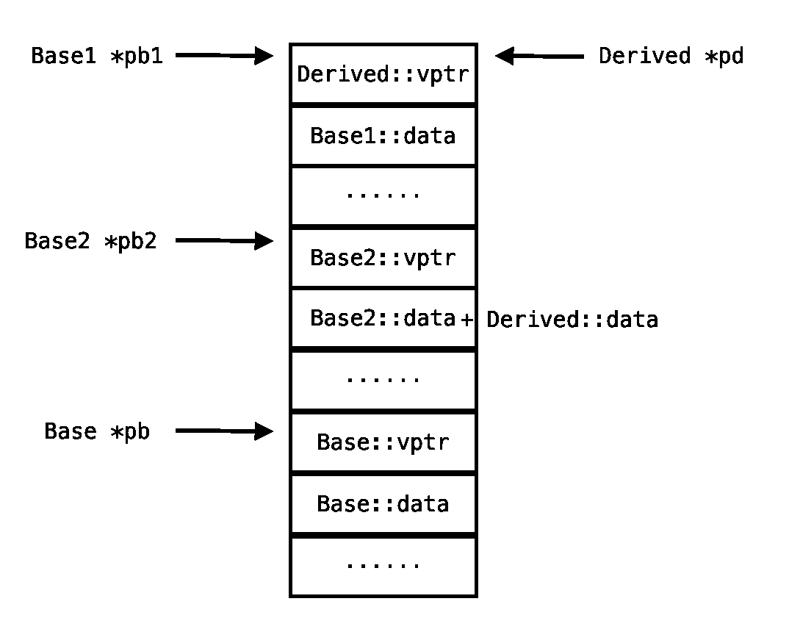

# 完美世界 2017 校招技术综合 B 卷

## 1

有如下一段代码： ```cpp
int nCount = 0;
while (x) {
    nCount++;
    x = x & (x - 1);
}
``` 假设 x 初始为 9999，则执行完 nCount 值为（）

正确答案: C   你的答案: 空 (错误)

```cpp
32
```

```cpp
999
```

```cpp
8
```

```cpp
1
```

本题知识点

C++ C 语言

讨论

[殷帅](https://www.nowcoder.com/profile/5428142)

求下面函数的返回值(微软) -- 统计 1 的个数 -------------------------------------
int func(int x)
{
    int countx = 0;
    while(x)
    {
        countx++;
        x = x&(**x-1**);
    }
    return countx;
}

假定 x = 9999
10011100001111
答案: 8

思路: 将 x 转化为 2 进制，看含有的 1 的个数。 注: **每执行一次 x = x&(**x-1**)，会将 x 用二进制表示时最右边的一个 1 变为 0，因为**x-1**将会将该位(x 用二进制表示时最右边的一个 1)变为 0。**

发表于 2017-08-19 16:55:01

* * *

[KronosChan](https://www.nowcoder.com/profile/978480030)

把 9999 化为二进制，每进行一次 x&（x－1）的结果就会少一个 1（按位与后变为 0），因此原来 x 的 1 的个数就是答案

发表于 2019-01-19 16:14:03

* * *

[loveInternet](https://www.nowcoder.com/profile/3673693)

X=X&(X-1)这算的是 X 写成二进制数后其中 1 的个数

发表于 2017-08-23 16:51:54

* * *

## 2

下列不属于网络层协议的是（）？

正确答案: A   你的答案: 空 (错误)

```cpp
TCP
```

```cpp
IPX
```

```cpp
IP
```

```cpp
TCMP
```

本题知识点

网络基础

讨论

[殷帅](https://www.nowcoder.com/profile/5428142)

TCP 在传输层，IP 在网络层。一个是端到端，一个是点到点。TCP 报文是封装在 IP 包里的。TCP 面向连接，具有校验纠错功能，IP 无连接，只对数据头部进行校验。**端到端与点到点是针对网络中传输的两端设备间的关系而言的。**端到端传输指的是在数据传输前，经过各种各样的交换设备，在两端设备问建立一条链路，就像它们是直接相连的一样，链路建立后，发送端就可以发送数据，直至数据发送完毕，接收端确认接收成功点到点系统指的是发送端把数据传给与它直接相连的设备，这台设备在合适的时候又把数据传给与之直接相连的下一台设备，通过一台一台直接相连的设备，把数据传到接收端。

发表于 2017-08-19 16:58:26

* * *

[JamesShao](https://www.nowcoder.com/profile/2971729)

D 选项应该是 ICMP

发表于 2018-05-30 21:55:33

* * *

[异想天开 4](https://www.nowcoder.com/profile/7951045)

Tcp 在传输层

发表于 2018-04-01 02:05:45

* * *

## 3

以下程序的功能是（） ```cpp
#include <stdio.h>
int main(void) {
    FILE *fp;
    long int n;
    fp = fopen("wj.txt", "rb");
    fseek(fp, 0, SEEK_END);
    n = ftell(fp);
    fclose(fp);
    printf("%ld", n);
}
``` 

正确答案: D   你的答案: 空 (错误)

```cpp
计算文件的起始地址
```

```cpp
计算文件的终止地址
```

```cpp
将文件指针定位到文件末尾
```

```cpp
计算文件内容的字节数
```

本题知识点

C 语言

讨论

[殷帅](https://www.nowcoder.com/profile/5428142)

函数 ftell 用于得到文件位置指针当前位置相对于文件首的偏移字节数。

发表于 2017-08-19 17:01:19

* * *

[走位崴了脚](https://www.nowcoder.com/profile/4695029)

fseek(fp,0,SEEK_END)，将文件指针 fp 定位到文件末尾，ftell(fp)，计算当前文件指针 fp 相对于文件头的距离

编辑于 2018-10-08 16:51:48

* * *

[牛 11](https://www.nowcoder.com/profile/621754124)

int fseek(FILE *stream, long offset, int fromwhere);   函数 fseek 将文件位置指针重定位到 fromwhere（SEEK_SET 文件头 0,SEEK_CUR 文件当前位置 1,SEEK_END 文件末尾 2）开始偏移 offset 个字节的位置；返回成功 0，失败-1；long ftell(FILE *stream);
  返回文件位置指针当前位置相对于文件首的偏移字节数；

发表于 2019-05-11 20:20:31

* * *

## 4

下列哪种方法不能用于文本加密（）

正确答案: C   你的答案: 空 (错误)

```cpp
RSA
```

```cpp
RC4
```

```cpp
MD5
```

```cpp
DES
```

None

讨论

[囧~超](https://www.nowcoder.com/profile/1181170)

1.RSA：由 RSA 公司发明，是一个支持变长密钥的公共密钥算法，需要加密的文件块的长度也是可变的，非对称算法； 2.RC2 和 RC4：对称算法，用变长密钥对大量数据进行加密，比 DES 快；3.DES（Data Encryption Standard）：对称算法，数据加密标准，速度较快，适用于加密大量数据的场合； 4.MD5：严格来说不算加密算法，只能说是摘要算法；

发表于 2018-03-12 22:34:34

* * *

[一樽寒月](https://www.nowcoder.com/profile/3039109)

MD5 由于是单向不可逆的，所以不可以解密，不能用来对文本进行加密，可以用来签名，校验数据的完整性链接：[`www.nowcoder.com/questionTerminal/230f7e53031945dba1240ef83c16bd04?from=14pdf`](https://www.nowcoder.com/questionTerminal/230f7e53031945dba1240ef83c16bd04?from=14pdf)
来源：牛客网

MD5 即 Message-Digest Algorithm 5（信息-摘要算法 5），用于确保信息传输完整一致。是计算机广泛使用的杂凑算法之一（又译[摘要算法](http://baike.baidu.com/view/10961371.htm)、[哈希算法](http://baike.baidu.com/view/273836.htm)），主流编程语言普遍已有 MD5 实现。将数据（如汉字）运算为另一固定长度值，是杂凑算法的基础原理，MD5 的前身有 MD2、[MD3](http://baike.baidu.com/view/2535629.htm)和[MD4](http://baike.baidu.com/view/444142.htm)。MD5 算法具有以下特点：1、压缩性：任意长度的数据，算出的 MD5 值长度都是固定的。2、容易计算：从原数据计算出 MD5 值很容易。3、抗修改性：对原数据进行任何改动，哪怕只修改 1 个字节，所得到的 MD5 值都有很大区别。4、弱抗碰撞：已知原数据和其 MD5 值，想找到一个具有相同 MD5 值的数据（即伪造数据）是非常困难的。5、强抗碰撞：想找到两个不同的数据，使它们具有相同的 MD5 值，是非常困难的。MD5 的作用是让大容量信息在用[数字签名](http://baike.baidu.com/view/7626.htm)软件签署私人[密钥](http://baike.baidu.com/view/934.htm)前被"[压缩](http://baike.baidu.com/subview/786588/12546221.htm)"成一种保密的格式（就是把一个任意长度的字节串变换成一定长的[十六进制](http://baike.baidu.com/view/230306.htm)数字串）。除了 MD5 以外，其中比较有名的还有[sha-1](http://baike.baidu.com/view/94209.htm)、[RIPEMD](http://baike.baidu.com/view/260854.htm)以及[Haval](http://baike.baidu.com/view/3931643.htm)等。**RSA**公开密钥密码体制。所谓的公开密钥密码体制就是使用不同的加密密钥与解密密钥，是一种“由已知加密密钥推导出解密密钥在计算上是不可行的”密码体制。RC4 加密算法是大名鼎鼎的 RSA 三人组中的头号人物 Ronald Rivest 在 1987 年设计的密钥长度可变的流加密算法簇。之所以称其为簇，是由于其核心部分的 S-box 长度可为任意，但一般为 256 字节。该算法的速度可以达到 [DES](http://baike.baidu.com/view/7510.htm) 加密的 10 倍左右，且具有很高级别的非线性。**DES** 全称为 Data Encryption Standard，即数据加密标准，是一种使用密钥加密的块算法 

发表于 2018-06-04 09:06:02

* * *

[THE_LIN](https://www.nowcoder.com/profile/680957182)

单向加密：通过对数据进行摘要计算生成密文，密文不可逆推还原。算法代表：Base64，MD5，SHA;

发表于 2020-05-14 22:56:38

* * *

## 5

有如下一段代码：

```cpp
#define ADD(x,y) x+y
int m=3;
m+=m*ADD(m,m);
```

最后 m 的值为（）？

正确答案: A   你的答案: 空 (错误)

```cpp
15
```

```cpp
21
```

```cpp
58
```

```cpp
18
```

本题知识点

C++

讨论

[突然之间](https://www.nowcoder.com/profile/1996623)

#define ADD(a,b) a+b  只是定义了一个操作，并不能当成函数来用，用时直接把 ADD(a,b) 部分替换成 a+b，直接替换，没有括号

发表于 2017-09-05 09:49:18

* * *

[CODEBIRD91](https://www.nowcoder.com/profile/7737829)

m+=m*ADD(m,m) <-> m+=m*m+m

发表于 2017-08-19 12:28:41

* * *

[牛 6 牛 6 牛 6](https://www.nowcoder.com/profile/91664247)

宏定义是直接替换，所以 m*ADD(m,m)<->m*m+m, 等号右边算出来是 12，m+=12，即 m=m+12，m=3，所以最终结果是 m=15

发表于 2018-06-24 09:28:11

* * *

## 6

假设矢量 a 和 b 不平行，对于它们的叉积(a×b)，以下描述正确的是（）？

正确答案: A   你的答案: 空 (错误)

```cpp
其结果是矢量
```

```cpp
其结果是标量
```

```cpp
a×b 等于 b×a
```

```cpp
(a×b)×c 等于 a×(b×c)
```

本题知识点

组合数学 *讨论

[Beaver_](https://www.nowcoder.com/profile/1757434)

不平行的两个矢量叉积也是矢量。若 a 与 b 共面，则 a×b 的矢量方向符合右手螺旋规律，即右手从 a 握向 b，大拇指指向的方向。

发表于 2017-08-22 14:40:36

* * *

[每天一顿大太阳](https://www.nowcoder.com/profile/158101)

叉乘结果是矢量，点乘结果是标量，也就是一个具体的数

发表于 2018-08-31 14:33:45

* * *

[友人说 201904171536944](https://www.nowcoder.com/profile/319430692)

a

发表于 2019-04-27 14:55:43

* * *

## 7

对静态成员的不正确描述是（）？

正确答案: D   你的答案: 空 (错误)

```cpp
静态数据成员要在类外定义和初始化
```

```cpp
非静态成员函数也可以操作静态数据成员
```

```cpp
静态成员不属于对象，是类的共享成员
```

```cpp
调用静态成员函数时要通过类或对象激活，所以静态成员函数拥有 this 指针
```

本题知识点

C++

讨论

[鬼|刀](https://www.nowcoder.com/profile/5564786)

1、静态成员是属于类的，不是属于对象的，而 this 是当前对象的指针，所以静态成员没有 this 指针。2、在 C++中，类的静态成员（static member）必须在类内声明，在类外初始化，像下面这样。class A 
{ 
private: 
static int count ; // 类内声明 
};
int A::count = 0 ; // 类外初始化，不必再加 static 关键字
为什么**？因为静态成员属于整个类，而不属于某个对象，如果在类内初始化，会导致每个对象都包含该静态成员，这是矛盾的**。
《c++primer》里面说在类外定义和初始化是保证 static 成员变量只被定义一次的好方法。 但为什么 static const int 就可以在类里面初始化呢？ 
想起 C 中一个函数里定义一个 static 变量是为了保证只初始化一次。 那么，是否可以这样理解: static 数据成员在类外定义和初始化是为了保证只被定义和初始化一次,这样编译器就不必考虑类的函数里面第一个对 static 变量的’=’操作是赋值还是初始化了。 static const int 可以在类里面初始化，是因为它既然是 const 的，那程序就不会再去试图初始化了。
2、什么东西能在类内初始化 
能在类中初始化的成员只有一种，那就是静态常量成员。
**这样不行 **
class A 
{ 
private: 
static int count = 0; // 静态成员不能在类内初始化 
};
**这样也不行 **
class A 
{ 
private: 
const int count = 0; // 常量成员也不能在类内初始化 
};
**但是这样可以** 
class A 
{ 
private: 
static const int count = 0; // 静态整型常量成员可以在类内初始化，但是 static const float count 就不行了 
};

编辑于 2018-11-07 11:00:20

* * *

[殷帅](https://www.nowcoder.com/profile/5428142)

```cpp
类的静态数据成员在 类内只能声明，定义和初始化必须在类外
可以这样
class a
{
int aa;
static int aaa; //静态数据成员声明
};
int a::aaa=10; //静态数据成员的定义和初始化
```

发表于 2017-08-19 17:04:03

* * *

[Sailing19](https://www.nowcoder.com/profile/1899760)

静态成员是属于类的，不是属于对象的，而 this 是当前对象的指针，所以静态成员没有 this 指针。

发表于 2017-10-07 19:26:17

* * *

## 8

下列有关运算法重载的叙述中，正确的是（）？

正确答案: D   你的答案: 空 (错误)

```cpp
C++中所有运算符都可以作为非成员函数重载
```

```cpp
重载运算符时可以改变其结合性
```

```cpp
C++中可以通过运算符重载创造新的运算符
```

```cpp
运算符重载是多态的一种表现
```

本题知识点

C++

讨论

[cancer 大魔王](https://www.nowcoder.com/profile/7941730)

C++中运算符重载是多态性的一种表现运算符重载是针对 C++原有运算符进行的，不可能通过重载创造出新的运算符除了.             （成员访问运算符）

.*            （成员指针访问运算符）

::             （域运算符）

sizeof    （长度运算符）

?:            （条件运算符）这 5 个运算符外，其他运算符都可以重载运算符重载不可改变其结合性，操作数个数和优先级。

发表于 2017-08-19 10:50:05

* * *

[路人 43](https://www.nowcoder.com/profile/2940486)

我在解释下 A 有几个运算符必须在类内部重载 （）【】 new delete =

发表于 2017-08-22 23:52:08

* * *

[我想找一个女朋友](https://www.nowcoder.com/profile/6434488)

记得在哪本书里看见过它的结合性是可以改变的啊！

发表于 2017-09-07 16:11:19

* * *

## 9

在 C++里，堆中存储的数据是（）

正确答案: D   你的答案: 空 (错误)

```cpp
局部变量
```

```cpp
函数返回值
```

```cpp
函数参数
```

```cpp
new 和 malloc 申请的内存
```

本题知识点

C++

讨论

[hume](https://www.nowcoder.com/profile/1888958)

一个由 C/C++编译的程序占用的内存分为以下几个部分: 动态内存分配 1.栈区(stack) 由编译器自动分配释放，存放为运行函数而分配的局部变量、函数参数、返回数据、返回地址等。其操作方式类似于数据结构中的栈。 2.堆区(heap) 一般由程序员分配释放，若程序员不释放，程序结束时可能由 OS 回收。分配方式类似于链表。 3.全局区(静态区) (static)存放全局变量、静态数据、常量。程序结束后由系统释放。 4.文字常量区 常量字符串就是放在这里的。程序结束后由系统释放。 5.程序代码区 存放函数体(类成员函数和全局函数) 的二进制代码。

发表于 2018-05-13 19:58:24

* * *

[Felix_s](https://www.nowcoder.com/profile/2526121)

C++中堆中存取的数据由程序员分配和释放，是由 new，malloc 申请，delete，free 释放局部变量，函数参数是存放在栈中

发表于 2018-03-01 10:52:53

* * *

[不要浮于表面](https://www.nowcoder.com/profile/4131613)

栈区，堆区，全局区，文字常量区，程序代码区

发表于 2018-04-04 13:44:41

* * *

## 10

有一组数据“42,31,12,68,16”，用选择法由小到大排序，第 2 趟交换数据后数据的顺序是（）？

正确答案: A   你的答案: 空 (错误)

```cpp
12，16，42，68，31
```

```cpp
12，31，16，68，42
```

```cpp
12，68，31，16，42
```

```cpp
12，42，16，68，31
```

本题知识点

排序 *讨论

[斗一斗](https://www.nowcoder.com/profile/5435401)

简单选择排序法：就是通过 n-1 次关键字间的比较，从 n-i+1 个记录中选出关键字最小的记录，并和第 i（1<=i<=n）个记录交换之。第一趟交换后为 12 31 42 68 16 ，第二趟为 31 和 16 交换 ，故为 12 16 42 68  31

发表于 2017-08-23 19:46:35

* * *

[maxplus2](https://www.nowcoder.com/profile/4014421)

A，每次遍历数据选出最小的排到首位并交换位置。

发表于 2017-08-21 12:29:18

* * *

[牛客-120 抢救中心](https://www.nowcoder.com/profile/6165623)

42 31 12 68 16

12 31 42 68 16

12 16 42 68 31

12 16 31 68 42

12 16 31 42 68

发表于 2018-07-17 15:51:24

* * *

## 11

下列等式正确的是（）？

```cpp
class Af{virtual ~A(){}};
class Bf{virtual ~B(){}};
class C:public A,public B{
};
C* pC = new C();
A*pA=(A*)pC;
B*pB=(B*)pC;
```

正确答案: A   你的答案: 空 (错误)

```cpp
pA==pC&&pB!=pC
```

```cpp
pA==pC&&pB==pC
```

```cpp
pA!=pC&&pB!=pC
```

```cpp
pA!=pC&&pB==pC
```

本题知识点

C++

讨论

[炮祺泡祺君](https://www.nowcoder.com/profile/1994385)

在多继承中，派生类和被继承的第一个基类的地址相同，和第二个基类的地址不同，故选 A。

发表于 2018-11-28 17:34:30

* * *

[R0b1n](https://www.nowcoder.com/profile/9885630)

下面我以 Clang++编译器为例阐述一下 C++继承模型的内存布局对于多继承情况考虑示例代码

```cpp
struct Base1 {...};
struct Base2 {...};
struct Derived : Base1, Base2 {...};
```

有如下内存布局
首先出现的是派生类 Derived 类的虚表指针 vptr（这里插入一个提醒：一直以来 vptr 都被国人翻译为虚函数表指针但是 vtbl 英文原文是 virtual table 并非 virtual function table 为什么呢因为这个表不只是为了虚函数而准备的一切虚拟化技术都会用这个表 包括 虚继承 RTTI 等所以当类本身与其直接间接基类内都未定义任何虚函数时也是有可能有虚表的典型就是当前类继承了一个虚基类..提醒结束）其次是第一直接基类的数据成员然后是第二直接基类的虚表指针 vptr 再次是第二直接基类的数据成员如果还有后继直接基类 那么依此类推也许有朋友会困惑为何偏移 0 处是 Derived 类的 vptr 而不是 Base1 的 vptr 因为非虚继承第一直接基类 Base1 与派生类 Derived 的基地址是一致的 Derived 的内存结构正是从 Base1 开始而对于

```cpp
Base1 *pb1 = new Derived;
pb1->polymorphicFunction();
```

这样的多态引用事实上我们也是用的 Derived 的虚表 vtbl 因为 Derived 的 vtbl 和 Base1 的 vtbl 已经融为一体了也就是说从 Derived 的 vtbl 中完全可以查到从 Base1 继承下来的虚函数以及覆盖 Base1 的虚函数而对于 Base2 来说事实上图中所示的 Base2::vptr 并不是指向 Base2 类的 vtbl 而是指向 Derived 类的 vtbl 中的一个 thunk 地址这个所谓的 thunk 地址又指向一段汇编码这段 thunk 汇编码负责做两件事：1.跳转到 vtbl 中正确的虚函数(也就是 Derived 的虚函数)地址所在的内存单元 2.修改 this 指针使其指向 Derived 对象，并传入上一步检索到的虚函数中通过这个 thunk 策略编译器实现了 C++的多态性举个例子

```cpp
Base2 *pb2 = new Derived;
delete pb2;
```

此时使用 pb2 调用虚析构函数时通过 Base2::vptr 跳转到了 thunk 汇编代码执行 thunk 后跳转到 vtbl 中 Derived::~Derived()所在的槽位然后把当前指向 Base2 子对象部分的的 this 指针添加适当偏移使其指向 Derived 对象的内存首地址然后传入并调用 Derived::~Derived()从而实现了 Base2 *pb2 和事实对象类 Derived 的动态绑定由此我们不妨思考一下为何动态绑定需要用指针或引用而不能通过实例对象来实现已知

```cpp
Derived d;
Base2 b2 = d;
```

这里相当于拷贝了 d 对象中的 Base2::vptr+Base2::data 到新对象中并且修改原先指向 Dervied::vtbl 的 vptr，使其重新指向 Bae2::vtbl 这可区别大了原来使用 Base2 *pb2 时，Base2::vptr 指针仍旧指向 Dervied::vtbl 中（的 thunk 码）而赋值给 b2 对象后，Base2::vptr 指向的就是一个完全不同类的虚表 Base2::vtbl 了回到正题最后 Derived 类自己定义的成员会放在所有直接基类成员的后面但是这个说法是有待商榷的下面的例子会进一步说明对于虚继承+多继承的套路有些许变招考虑示例代码

```cpp
struct Base {...};
struct Base1 : virtual Base {...};
struct Base2 : virtual Base {...};
struct Derived : Base1, Base2 {...};
```

有如下内存布局
此时注意到几个变化：1\. 虚基类 Base 的内存空间位于 Dervied 类成员的下面也就是位于整个内存空间的最后即使它是所有类的共同祖先大家不妨进一步思考这样做的目的正常来说 非直接基类是不该出现在派生类内存中的但编译器正是通过这样的举措才得以实现虚基类在所有子子孙孙派生类都共享一个共同虚基类的语法特性此时不论是把这个 Derived 对象赋予 Base1 指针还是 Base2 指针他们都只需要把按照自己既定的惯例加上一个固定的偏移就能在对象的尾部访问到那个唯一的虚基类 2.Derived 的成员事实上是位于所有***非虚***直接基类的后面位于所有继承链上的虚基类的前面大家可以看到 C++标准***会和编译器大厂设计这一套布局的良苦用心他们并未因为 Derived::vptr 在 Base1 的子对象域中而就盲目地把 Derived::data 也挪过去而是把 data 放在了所有非虚直接基类的后面这样就保证了其每个非虚直接基类的完整性和模块化并且方便在动态绑定时计算指针偏移例如

```cpp
struct Derived: Base1,Base2,...,BaseN {...}
BaseN *pbn = new Derived;
```

此时只需要令 this+=sizeof(Base1+Base2+...+Base[N-1])即可指向 BaseN 的起始位置非常方便 当然 this 是个 Derived * const 类型 所以不能被修改这里只是意会转为汇编后的寄存器操作 3.有一个需要特别注意的地方就是如果继承链上的某个类既没有虚指针也没有数据成员也就是说它没有内存分配这个时候就要小心了其指针将指向 Derived 对象的首地址！也就是该类的指针将会与 pb1、pd 存储同样的地址这样做的原因就是避免它指向位于其指定内存区域下方的一个与他无关的对象的首地址-----------------------------------------------------作为附加福利这里扩展讲解 thunk 技术在动态绑定也就是多态的实现中 thunk 技术发挥了至关重要的作用但是 thunk 并不适用于所有虚函数让我们考虑如下代码

```cpp
struct Base1 {
    virtual ~Base1() {}
    virtual void v1() {}
    virtual void v() {}
};
struct Base2 {
    virtual ~Base2() {}
    virtual void v2() {}
    virtual void v3() {}
    virtual void v() {}
};
struct Derived : Base1, Base2 {
    ~Derived() override {}
    void v3() override {}
    void v() override {}
};
```

所得到的 Derived 类的 vtbl 如下
此例中的成员函数全是虚函数并且各种覆盖和继承方式都有简直是虚函数的饕餮大餐我们说一下 Derived 类的 vtbl 布局以及其构造过程 1.虚表中首先出现的是第一直接基类的 Base1::vtbl 编译器会先把 Base1 的虚函数指针按声明顺序写在对应偏移的槽位上 2.替换 Base1 中相应被覆盖的虚函数为 Derived 类中的虚函数 3.而派生类除了覆盖了第一直接基类的虚函数外 还覆盖了后继直接基类的于是将后继直接基类被覆盖的虚函数补到第一直接基类虚函数区域的后面所以大家会在后面看到覆盖了 Base2 的 Derived::v3()4.接着添上了 Derived 类的 type_info 类对象的地址这个对象为了实现 RTTI 特性的也就是说 dynamic_cast 和 typeid 这俩运算符是通过 type_info 对象实现的 5.然后把 Base2 的虚函数按声明顺序填入 vtbl6.为了解决上文提到的

```cpp
Base2 *pb2 = new Derived;
delete pb2;
```

这类典型问题编译器搜索 Base2 区域中的被派生类覆盖了的虚函数并将其槽位中的函数地址修改为 thunk 地址这样当发生相应的 Base2 调用时事实上会先跳转到 thunk 码执行 最终如图中的箭头所示跳转到之前铺设好的 Derived 区域的覆盖虚函数总结一下虚表布局设计思想：1.表结构保护了 Base1 和 Base2 这些直接基类的 vtbl 结构这样就能保持执行多态操作时的一致性按照相应基类中虚函数的声明顺序完成固定偏移就能寻址到想要的虚函数 2.将派生类覆盖了的虚函数叠加到第一直接基类 Base1 上面符合 Derived 和 Base1 内存空间偏移一致的设计惯例同时也使得 Base1 中不需要 thunk 来完成跳转 3.非第一直接基类的 vtbl 区域里被覆盖的虚函数都需要 thunk 来处理跳转以及 this 指针的重定位

编辑于 2017-09-27 11:14:00

* * *

[追...忆](https://www.nowcoder.com/profile/5952058)

C 继承自 A 和 B，A 和 B 各有一个虚函数表，所以 C 和 A 首地址相同，和 B 首地址不同

发表于 2017-09-07 21:04:26

* * *

## 12

Web 程序通常采用 MVC 架构来设计，数据库相关操作属于（）？

正确答案: A   你的答案: 空 (错误)

```cpp
Model
```

```cpp
Controller
```

```cpp
都不属于
```

```cpp
View
```

本题知识点

数据库

讨论

[warpar](https://www.nowcoder.com/profile/1756076)

MVC 框架是三层架构：模式层、视图层、控制层模式层：表示企业数据和业务逻辑，是应用程序的主体部分；视图层：是用户看到的并与之交互的界面；控制层：接收用户的输入并调用模型和视图去完成用户的需求；属于和数据库相关操作是在模式层。

发表于 2017-08-23 20:47:57

* * *

[猪场老大](https://www.nowcoder.com/profile/1650527)

a

发表于 2018-01-12 22:53:30

* * *

[✟idiot 丶伟伟](https://www.nowcoder.com/profile/6026869)

A

发表于 2017-12-17 02:46:53

* * *

## 13

下列函数中，不能声明为虚函数的是（）？

正确答案: A   你的答案: 空 (错误)

```cpp
构造函数
```

```cpp
析构函数
```

```cpp
私有成员函数
```

```cpp
公有成员函数
```

本题知识点

C++

讨论

[Lingck](https://www.nowcoder.com/profile/8213135)

虚函数表示在调用的时候才知道调用的是子类的还是父类的函数，而构造函数在对象创建的时候就已经调用了，所以构造函数不能声明为虚函数

发表于 2018-07-06 09:33:00

* * *

[靠着莪哋肩嫎ヽ](https://www.nowcoder.com/profile/7735618)

虚函数必须是类的成员函数，其中，静态成员函数和构造函数不能定义为虚函数，析构函数可以

发表于 2017-12-07 15:19:49

* * *

[殷帅](https://www.nowcoder.com/profile/5428142)

一般情况下类的析构函数里面都是释放内存资源，而析构函数不被调用的话就会造成内存泄漏。所以存在虚析构函数．

编辑于 2017-08-19 17:08:47

* * *

## 14

类 B 是类 A 的公有派生类，类 A 和类 B 中都定义了虚函数 func(),p 是一个指向类 A 对象的指针，则 p->A::func()将（）？

正确答案: C   你的答案: 空 (错误)

```cpp
调用类 B 中函数 func()
```

```cpp
即调用类 A 中函数，也调用类 B 中的函数
```

```cpp
调用类 A 中函数 func()
```

```cpp
根据 p 所指的对象类型而确定调用类 A 中或类 B 中的函数 func()
```

本题知识点

C++

讨论

[牛客职导官方账号](https://www.nowcoder.com/profile/897353)

【正确答案】C
【解析】这边  查看全部)

编辑于 2021-11-18 08:18:54

* * *

[毕不了业的程序猿](https://www.nowcoder.com/profile/4169435)

加了作用域，当然调用该域内函数

发表于 2017-08-24 15:52:27

* * *

[liuZJ](https://www.nowcoder.com/profile/342240222)

因为加了作用于限定符，所以调用的是 A 里面的函数。如果是父类的指针或引用指向子类，则会产生多态，贴上测试代码：

发表于 2019-01-06 19:37:27

* * *

## 15

考虑函数原型 void test(int a,int b=7,char* p=”*”)下面的调用中，属于不合法调用的是（）？

正确答案: B   你的答案: 空 (错误)

```cpp
test(6,’$’)
```

```cpp
test(5,”8”)
```

```cpp
test(0,0,0)
```

```cpp
test(5)
```

本题知识点

C++

讨论

[特立独行 MVP](https://www.nowcoder.com/profile/4717461)

函数缺省参数 只能从右往左缺省 所以 B 实际编译器认为缺省的是第三个参数，而将字符串赋值给一个 int 型是不合法的。

发表于 2017-09-21 16:48:55

* * *

[一路有你陪伴](https://www.nowcoder.com/profile/7538604)

A 中 test(6,’$’) 第二个参数相当于传入了$的 ascii 码值，默认实参只能省去后面的；B 中 test(5,”8”) 第二个参数是一个字符串，写成这样的话，test(5,0,”8”) 就可以了。

发表于 2017-09-04 09:04:26

* * *

[大山猫](https://www.nowcoder.com/profile/269431238)

1：参数给缺省值只能从右往左给定

```cpp
void Funtest（int a ,int b;int c=30）*可以
void Funtest（int a =10,int b;int c）*不行
void Funtest（int a =10,int b;int c=30）*不行
```

2：缺省值必须是常量或者全局变量

3：C 语言不支持缺省参数

此外： 
①:在调用函数时，有实参使用实参，且从左边开始传实参

```cpp
void Funtest（int a=10 ,int b=20;int c=30）
{
Printf(“a=%d\n”,a);
Printf(“b=%d\n”,b);
Printf(“c=%d\n”,c);
}
Int main()
{
Funtest（）；//    10,20,30
Funtest（1,2,3）；//   1,2,3
Funtest（1）；//1,20,30
Funtest（1,2）；//1,2,30
}

②半缺省中，函数调用时每个参数必须都给定值才能编译通过
例：
void Funtest（int a ,int b;int c=30）                 
{                                                               
Printf(“a=%d\n”,a);                             
Printf(“b=%d\n”,b);
Printf(“c=%d\n”,c);
}
int main()
{               结果： 
Funtest（）；//编译不通过
Funtest（1,2,3）；// 1，2，3
Funtest（1）；// 编译不通过
Funtest（1,2）；// 1,2,30
}
```

发表于 2018-12-07 16:16:56

* * *

## 16

以下数据结构中哪个既能实现高效的查询又能实现高效的插入（）？

正确答案: C   你的答案: 空 (错误)

```cpp
有序数组
```

```cpp
队列
```

```cpp
平衡二叉树
```

```cpp
有序链表
```

本题知识点

高级结构

讨论

[空空以空空](https://www.nowcoder.com/profile/479441)

选 C
排除法，A,虽说数组可用二分法查找，但是其插入效率并不高效 B.队列只能在队尾队头进行操作，一端入队，一端出队，显然不能进行高效的插入，查找效率也不高 C.平衡二叉树属于动态查找表，可以在查找的时候进行插入操作，时间复杂度是 O(nlogn);D.有序链表，应该是顺序链表吧，如果是顺序链表，那么可以随机访问，但是插入操作出了头尾节点，都不好操作。单链表不能随机访问，，可以方便的插入删除，但是查找效率就低了

发表于 2017-08-30 15:54:56

* * *

[牛哥 k](https://www.nowcoder.com/profile/5792605)

存储结构的区别！？

发表于 2018-03-06 17:56:03

* * *

[ChrisZZ](https://www.nowcoder.com/profile/2159092)

C 都是 O(log n)

发表于 2017-08-27 23:43:31

* * *

## 17

C++当中，若局部变量和全局变量重名，会发生什么？

正确答案: B   你的答案: 空 (错误)

```cpp
只能访问局部变量
```

```cpp
局部变量会屏蔽全局变量，要使用全局变量，需要使用“::”
```

```cpp
全局变量会屏蔽局部变量，要使用局部变量，需要使用“::”
```

```cpp
只能访问全局变量
```

本题知识点

C++

讨论

[派派大星](https://www.nowcoder.com/profile/1171088)

局部变量会覆盖掉全局变量，如果想要使用的是全局变量，则在使用哪个变量之前使用“::”，这个是全局命名空间的意思，因为是自己的全局空间，所以名字为空，但::这个必须要加

发表于 2018-08-24 17:28:00

* * *

[苦弦](https://www.nowcoder.com/profile/2185577)

缺少提示，让人 误解

发表于 2018-05-31 21:57:22

* * *

[Chen7006](https://www.nowcoder.com/profile/233010047)

局部变量会覆盖掉全局变量，如果想要使用的是全局变量，则在使用哪个变量之前使用“::”，这个是全局命名空间的意思，因为是自己的全局空间，所以名字为空，但::这个必须要加

发表于 2018-12-26 11:24:56

* * *

## 18

 ```cpp
int a = 5, b = -5;
printf("%d,%d", a%(-4), b%(-4));
``` 上面代码段的输出为（）

正确答案: A   你的答案: 空 (错误)

```cpp
1,-1
```

```cpp
1,1
```

```cpp
-1,1
```

```cpp
-1,-1
```

本题知识点

C 语言

讨论

[快手内推官](https://www.nowcoder.com/profile/7247388)

（-m)/n 和 m/(-n) 等于-(m/n)  m%(-n) 等于 m%n  (-m)%n 等于-(m%n)

发表于 2017-08-18 15:11:01

* * *

[一直猫猫兔](https://www.nowcoder.com/profile/6379850)

除号的正负取舍和一般的算数一样，符号相同为正，相异为负
求余符号的正负取舍和被除数符号相同
-3/16=0     16/-3=-5     -3%16=-3      16%-3=1

发表于 2017-08-22 09:04:39

* * *

[头条快捞我](https://www.nowcoder.com/profile/7062529)

例-8%3=-2
-8%-3=-2
8%-3=2
负数求余主要看的是被除数，与除数无关。
如果被除数是负数那么其结果一定为负。如果被除数和除数都为负则结果还是为负。
如果被除数为正，除数为负，结果为正。

发表于 2018-03-25 12:58:17

* * *

## 19

一个栈的入栈序列为 ABCDE，则栈的不可能的输出序列为（）

正确答案: A   你的答案: 空 (错误)

```cpp
DCEAB
```

```cpp
EDCBA
```

```cpp
DECBA
```

```cpp
ABCDE
```

本题知识点

栈 *讨论

[牛客 8928871 号](https://www.nowcoder.com/profile/8928871)

答案是 A, 栈是先进后出，D 先出栈，必定 ABCD 都已入栈，然后 C 出栈，E 进栈再出栈，后面只能是 B 出栈，最后是 A

编辑于 2017-08-21 00:42:32

* * *

[Evan 丶.](https://www.nowcoder.com/profile/6090029)

这题好绕。。。A 选项错误：既然 D 先出栈，表示 ABC 一定已经入栈了，那么出栈顺序中，B 一定比 A 先出栈！B 选项：ABCDE 先全部入栈，再全部出栈；C 选项：ABCD 先入栈，再将 D 出栈，再将 E 入栈，再将所有数据以此出栈；D 选项：A 入栈马上出栈，B 入栈马上出栈，C 入栈马上出栈。。。

发表于 2019-06-29 18:09:08

* * *

[Smithermin](https://www.nowcoder.com/profile/9717640)

原来不一定非得按照 ABCDE 的连续入栈，可以先入一点，再出一点

发表于 2018-05-21 10:19:01

* * *

## 20

用 SQL 语言描述“在教师表中查找女教师的全部信息”，以下描述正确的是（）？

正确答案: B   你的答案: 空 (错误)

```cpp
SELECT *FROM 性别 WHERE  (性别=”女”)
```

```cpp
SELECT *FROM 教师表 WHERE  (性别=”女”)
```

```cpp
SELECT  FROM 教师表 IF  (性别=”女”)
```

```cpp
SELECT  性别 FROM 教师表 IF (性别=”女”)
```

本题知识点

数据库

讨论

[你快乐吗](https://www.nowcoder.com/profile/5271388)

select * from teacher where sex='女'；

发表于 2019-05-27 11:17:53

* * *

[侯小强](https://www.nowcoder.com/profile/926489784)

答案 B

发表于 2018-09-13 23:19:04

* * *

[爱豆豆的米粒](https://www.nowcoder.com/profile/7600629)

B

发表于 2018-02-23 15:01:29

* * *

## 21

以下设备中哪个是工作在物理层（）？

正确答案: B   你的答案: 空 (错误)

```cpp
路由器
```

```cpp
集线器
```

```cpp
交换机
```

```cpp
AP
```

本题知识点

网络基础

讨论

[Beaver_](https://www.nowcoder.com/profile/1757434)

IP 地址和路由器 工作在网络层，MAC 地址和交换机，网卡，网桥，AP 工作在数据链路层，集线器和网线 工作在物理层。

发表于 2017-08-22 16:25:37

* * *

[牛客 441367 号](https://www.nowcoder.com/profile/441367)

b

发表于 2018-01-21 09:50:08

* * *

[暖风不暖(｡･ω･｡)](https://www.nowcoder.com/profile/7655136)

B

发表于 2017-11-28 20:09:12

* * *

## 22

字符串“a+b=20\n”的长度是（）

正确答案: A   你的答案: 空 (错误)

```cpp
7
```

```cpp
8
```

```cpp
5
```

```cpp
6
```

本题知识点

C++ C 语言

讨论

[技术小咔](https://www.nowcoder.com/profile/9842786)

是求字符串长度，没有问占用的内存长度

发表于 2017-09-21 08:13:15

* * *

[TP 调皮](https://www.nowcoder.com/profile/689424784)

求长度，用 strlen； 求内存空间大小，用 sizeof

发表于 2018-08-20 10:09:00

* * *

[牛客 930946477 号](https://www.nowcoder.com/profile/930946477)

7 个。a,+,b,=,2,0,\n

发表于 2020-01-10 14:36:24

* * *

## 23

以下数据结构中哪一个是非线性结构（）？

正确答案: A   你的答案: 空 (错误)

```cpp
二叉树
```

```cpp
栈
```

```cpp
线性表
```

```cpp
队列
```

本题知识点

高级结构

讨论

[一颗站着的心的模样](https://www.nowcoder.com/profile/4924570)

a

发表于 2018-06-02 23:05:24

* * *

[趴在网上的猿](https://www.nowcoder.com/profile/4643816)

d

发表于 2018-05-09 16:48:55

* * *

[及格](https://www.nowcoder.com/profile/7514597)

A

发表于 2018-05-01 16:49:04

* * *

## 24

假设下面的函数 foo 会被多线程调用，那么函数里面使用的变量 i，j，k 哪些因为线程间共享访问需要加密保护（）？ 

正确答案: C   你的答案: 空 (错误)

```cpp
j 和 k
```

```cpp
i
```

```cpp
i 和 j
```

```cpp
i，j，k 都需要
```

本题知识点

C++

讨论

[我也支持](https://www.nowcoder.com/profile/6206174)

```cpp
线程有自己的栈，局部变量存储在栈中。所以局部变量以外的变量都需要设置保护。
```

发表于 2017-08-18 20:59:25

* * *

[恋曲 15](https://www.nowcoder.com/profile/251763)

i 和 j 存储在全局静态区。属于共享资源。要加锁

发表于 2017-08-29 15:11:49

* * *

[大星星和小猩猩](https://www.nowcoder.com/profile/9374535)

k 是局部变量，河水不犯井水，所以不需要保护

发表于 2018-03-23 19:55:01

* * *

## 25

C 语言字符串以\0 结束，\0 在内存中的表示为（）?

正确答案: B   你的答案: 空 (错误)

```cpp
\0 由\和 0 两个字符组成
```

```cpp
在内存中实际表示为 0
```

```cpp
ASCII 码为 0×2A
```

```cpp
\0 不同的操作系统表示方法不一样，依赖实现
```

本题知识点

C++

讨论

[rewrite_terra](https://www.nowcoder.com/profile/336226)

‘\0’ 是 c/c++ 语言中的字符串结束符，在 ASCII 字符集中对应空字符 NULL，数值为 0。其作用是识别字符串，简化字符串处理过程。在使用过程中要为其分配内存空间，但不计入字符串长度。（摘自百度百科，百度是个好东西.jpg）

发表于 2017-08-29 11:28:38

* * *

[梁聪聪](https://www.nowcoder.com/profile/9849603)

字符在内存中的存储是 ASCII 值存储 '\0'的 ASCII 为 0，所以其存储为 0x00，所以说'\0'在内存中存储为 0 也对。 '0'的 ASCII 为 48，所以存储为 0x30 数字 0 按数字存储 以整型为例 就是 32 个 0。

发表于 2018-02-04 10:39:12

* * *

[if_when](https://www.nowcoder.com/profile/4221794)

选 B

发表于 2017-12-05 11:07:11

* * *

## 26

下列代码输出为（）

```cpp
class Test {
    int a;
public:
    Test() : a(0) {cout << "void";}
    explicit Test(int i) : a(i) {cout << "int";}
    Test(short s) : a(s) {cout << "short";}
    Test &operator=(int n) {a = n; cout << "operator=";}
};

int main() {
    int n;
    Test a = n;
}
```

正确答案: B   你的答案: 空 (错误)

```cpp
int
```

```cpp
short
```

```cpp
void
```

```cpp
void operator=
```

本题知识点

C++ C 语言

讨论

[八戒哥](https://www.nowcoder.com/profile/7609523)

构造函数的调用发生在以 n 为参数创建临时变量期间。由于 int 参数的构造函数声明为 explicit，所以不能够调用这个函数，于是，会调用 short 参数的构造函数

发表于 2017-08-21 16:56:17

* * *

[cancer 大魔王](https://www.nowcoder.com/profile/7941730)

explicit 构造函数的作用
解析：
explicit 构造函数是用来防止隐式转换的。请看下面的代码：

```cpp
class Test1
{
public:
    Test1(int n)
    {
        num=n;
    }//普通构造函数
private:
    int num;
};
class Test2
{
public:
    explicit Test2(int n)
    {
        num=n;
    }//explicit(显式)构造函数
private:
    int num;
};
int main()
{
    Test1 t1=12;//隐式调用其构造函数,成功
    Test2 t2=12;//编译错误,不能隐式调用其构造函数
    Test2 t2(12);//显式调用成功
    return 0;
} 
```

Test1 的构造函数带一个 int 型的参数，代码 23 行会隐式转换成调用 Test1 的这个构造函数。而 Test2 的构造函数被声明为 explicit（显式），这表示不能通过隐式转换来调用这个构造函数，因此代码 24 行会出现编译错误。
普通构造函数能够被隐式调用。而 explicit 构造函数只能被显式调用。
所以此处不能调用参数为 int 的构造函数。我认为此时编译器应该在所有带参构造函数中寻找适合的。因为上述中的 n 可以被转换为 short，所以选择了参数是 short 的构造函数。 如果把参数 short 改为 string，编译器就会报错，因为 n 转换不为 string。所以选 B

编辑于 2017-08-25 15:23:08

* * *

[helloabobo](https://www.nowcoder.com/profile/627220368)

接受**一个参数**的构造函数允许使用**赋值语句****隐式调用**来初始化对象; 而**explicit 构造函数只能被显式调用**。

发表于 2018-09-24 22:50:15

* * *

## 27

下面代码会输出什么（）

```cpp
class A {
public:
    int m;
    void print() {cout << "A\n";}
};

int main() {
    A *pa = 0;
    pa->print();
}
```

正确答案: B   你的答案: 空 (错误)

```cpp
什么都没输出
```

```cpp
A
```

```cpp
编译报错
```

```cpp
其余选项都错
```

本题知识点

C 语言

讨论

[Snow~](https://www.nowcoder.com/profile/1337186)

初始化为 NULL(0)的类指针可以安全的调用不涉及类成员变量的类成员函数而不出错，但是如果类成员函数中调用了类成员变量则会出错，原因是调用成员函数的时候，函数地址是编译期间确定的，成员函数不通过对象指针去调用，对象指针仅仅作为参数传入函数然后去调用成员变量。而如果是虚函数，需要通过 this 去计算 vptr，然后找到 vtable，而 this 为 NULL，因此会报错。

发表于 2017-09-05 21:48:51

* * *

[来个吧 baby](https://www.nowcoder.com/profile/4467777)

[`longzxr.blog.sohu.com/213486896.html`](http://longzxr.blog.sohu.com/213486896.html)  这个分析的不错

发表于 2017-12-02 20:57:40

* * *

[铁汁](https://www.nowcoder.com/profile/6478245)

**初始化为 NULL 的类指针可以安全的调用不涉及类成员变量的类成员函数而不出错**

发表于 2018-08-30 10:15:30

* * *

## 28

char 类型值的数值区间为（）

正确答案: C   你的答案: 空 (错误)

```cpp
0~32767
```

```cpp
0~65535
```

```cpp
-128~127
```

```cpp
-2¹⁵~2¹⁵-1
```

本题知识点

C++ C 语言

讨论

[牛客职导官方账号](https://www.nowcoder.com/profile/897353)

【正确答案】C
【解析】ch  查看全部)

编辑于 2021-11-19 10:21:56

* * *

[牛客 1465584 号](https://www.nowcoder.com/profile/1465584)

char 的字节数为 1，占 8 位，一般 char 型默认为[signed] char，表示有符号的。指定为[signed] char，则数值以补码形式存放，存储单元中的最高位用来表示数值的符号。故大小为-128-127

发表于 2018-06-26 17:25:34

* * *

[唐龙 3bf](https://www.nowcoder.com/profile/5140297)

感觉不太严谨，因为在不同环境下 char 有可能是 signed char 也有可能是 unsigned char，视编译器与系统而定。在《C++ Primer》2.1 节有相关论述。

发表于 2018-08-29 23:42:08

* * *

## 29

以下#pragma 预处理命令哪个是改变编译器的对齐方式（）

正确答案: B   你的答案: 空 (错误)

```cpp
#pragma comment
```

```cpp
#pragma pack
```

```cpp
#pragma data_seg
```

```cpp
#pragma once
```

本题知识点

C++ C 语言

讨论

[shine 高小小](https://www.nowcoder.com/profile/3465147)

**#pragma comment**。将一个注释记录放置到对象文件或可执行文件中。**#pragma pack**。用来改变编译器的字节对齐方式。**#pragma code_seg**。它能够设置程序中的函数在 obj 文件中所在的代码段。如果未指定参数，函数将放置在默认代码段.text 中 **#pragma once**。保证所在文件只会被包含一次，它是基于磁盘文件的，而#ifndef 则是基于宏的。 

发表于 2017-10-11 20:39:09

* * *

[牛客 314738475 号](https://www.nowcoder.com/profile/314738475)

#pragma data_seg()

1，#pragma data_seg()一般用于 DLL 中。也就是说，在 DLL 中定义一个共享的，有名字的数据段。最关键的是：这个数据段中的全局变量可以被多个进程共享。否则多个进程之间无法共享 DLL 中的全局变量。  2，共享数据必须初始化，否则微软编译器会把没有初始化的数据放到.BSS 段中，从而导致多个进程之间的共享行为失败。  3，你所谓的结果正确是一种错觉。如果你在一个 DLL 中这么写：  #pragma data_seg("MyData")

int g_Value; // Note that the global is not initialized.

#pragma data_seg()

DLL 提供两个接口函数：  int GetValue()
{
     return g_Value;
}

void SetValue(int n)
{
     g_Value = n;
} 然后启动两个进程 A 和 B，A 和 B 都调用了这个 DLL，假如 A 调用了 SetValue(5); B 接着调用 int m = GetValue(); 那么 m 的值不一定是 5，

发表于 2021-05-14 10:22:54

* * *

[秒速 __ 五厘米](https://www.nowcoder.com/profile/301791)

C

发表于 2017-08-18 13:54:36

* * *

## 30

根据所给出的一组数空缺位置依次为（）?

(1).CFI DHL EJ_   (2).1 3 2 4 6 5 7 _   (3).9 7 8 6 7 5 _

正确答案: D   你的答案: 空 (错误)

```cpp
(1).O (2).9 (3).7
```

```cpp
(1).Q (2).6 (3).7
```

```cpp
(1).Q(2).11 (3).6
```

```cpp
(1).O (2).9 (3).6
```

本题知识点

C++

讨论

[不要浮于表面](https://www.nowcoder.com/profile/4131613)

这不行测的么 怎么跑 C++里面来了

发表于 2019-07-17 20:53:51

* * *

[殷帅](https://www.nowcoder.com/profile/5428142)

(1).CFI DHL EJ_   每组之间相差分别为 2 3 4(2) 1 3 2 4 6 5 7 _   差值序列为　2 -1 2 , 2 -1 2, xxxx(3)
9 7 8 6 7 5 _ 差值序列为 -2, 1, -2, 1, -2 ,1 .... 

发表于 2017-08-19 17:21:33

* * *

[~火车头~](https://www.nowcoder.com/profile/4059609)

逻辑题最难了，对我来说。

发表于 2017-11-20 16:57:12

* * *

## 31

对于变换矩阵的平移矩阵，以下说法正确的是（）?

正确答案: A B   你的答案: 空 (错误)

```cpp
平移矩阵属于仿射变换
```

```cpp
平移矩阵可逆
```

```cpp
平移矩阵是正交矩阵
```

```cpp
平移矩阵属于线性变换
```

本题知识点

图像处理

讨论

[Suthite_lee](https://www.nowcoder.com/profile/8604840)

seriously？这真的是 C/C++知识点？

发表于 2018-02-05 11:21:31

* * *

[一一后](https://www.nowcoder.com/profile/4618740)

好吧……题中说的是变换矩阵中的平移矩阵，而不是平移操作。首先，所有的矩阵运算都是线性变换，所以是仿射、线性变换；其次，平移矩阵相当于机器人学中的位移矩阵（暴露我是自动化出身了…），可逆，但是逆不等于其转置，所以满秩非正交

发表于 2018-06-27 08:31:09

* * *

[Nero-](https://www.nowcoder.com/profile/3243856)

答案错了吧应该是 AB,没有 D，平移矩阵是仿射变换不是线性变换，仿射变换是线性变换的超集
另外平移矩阵格式如下：可逆，非正交

发表于 2019-04-14 14:46:33

* * *

## 32

下面哪些运算符不能被重载（）

正确答案: A B C   你的答案: 空 (错误)

```cpp
三目运算符“?:”
```

```cpp
作用域运算符“::”
```

```cpp
对象成员运算符“.”
```

```cpp
指针成员运算符“->”
```

本题知识点

C 语言

讨论

[牛客 1465584 号](https://www.nowcoder.com/profile/1465584)

不能被重载的运算符只有五个，分别是 1\.  .  （成员访问运算符）2\.  *    （成员指针访问运算符）3\.  ::  （域运算符）4\.  sizeof  （长度运算符）5\. ?:    （条件运算符）前两个运算符不能重载是为了保证访问成员的功能不被改变 ，域运算符和 sizeof 运算符的运算对象是类型而不是变量或者一般表达式，不具备重载的特征。

发表于 2018-07-05 10:02:38

* * *

[gogogo1234](https://www.nowcoder.com/profile/4025167)

.，.*，：：，？：，sizeof

发表于 2017-09-14 20:50:55

* * *

[学海无涯 _](https://www.nowcoder.com/profile/972399196)

不能重载的运算符只有 5 个：

.             （成员访问运算符）

.*            （成员指针访问运算符）

::             （域运算符）

sizeof    （长度运算符）

?:            （条件运算符）

发表于 2021-01-25 18:06:44

* * *

## 33

通过 TCP 协议建立连接的两方，如果一方突然发生故障（比如断电）断开了连接，那么一下说法错误的是（）?

正确答案: A B D   你的答案: 空 (错误)

```cpp
TCP 协议会自动检测连接是否断开，经过一段时间后另外一段会收到 TCP 连接断开的通知
```

```cpp
如果设置了 TCP_KEEPALIVE，那么对端能够马上收到断开的信息
```

```cpp
可以自己实现心跳检测的方法来确定对方是不是已经断开连接
```

```cpp
另外一方能够马上知道连接已经断开
```

None

讨论

[koeichen](https://www.nowcoder.com/profile/7248596)

TCP 连接不能自动差别断连的现象; 所以 A 选项错误 TCP 中 KEEPALIVE 机制是默认不打开的，需要通过 setsockopt 将 SOL_SOCKET.SO_KEEPALIVE 设置为 1 则是打开，打开后会定时向连接对方发送 ACK 包(linux 下默认是 7200s 即 2 小时发生一次发送一次握手信息)，如果在发送 ACK 包后对方不回应才能检测道对方的断开信息，所以 B 错误;Heartbeat 机制是客户端每个一段时间向服务器发送数据包，来通知服务端该客户端保持连接。所以 C 正确综合 AB，D 是错误的

发表于 2017-12-12 05:30:16

* * *

[走位崴了脚](https://www.nowcoder.com/profile/4695029)

一方断电，已经发不出信号了(A 错)，要想知道断开连接，只能是另一方发送试探信号，超过约定时间收不到反馈或连续若干次收不到反馈，才能判断连接断开，所以 BD 能够立刻判断连接断开是不正确的

编辑于 2018-08-20 06:33:35

* * *

[炮祺泡祺君](https://www.nowcoder.com/profile/1994385)

TCP 不能自动检测对端断开连接，故 AD 说法错误；TCP 中的 keep-alive 机制需要通过 setsockopt()将 SOL_SOCKET.SO_KEEPALIVE 置为 1 后开启，开启后会定时向对端发送 ACK 包，故 B 说法错误；C 相当于定时向对端发送心跳包，故 C 说法正确，选 ABD。

编辑于 2018-12-02 18:33:28

* * *

## 34

以下多线程对 int 型变量 x 的操作，哪几个需要进行同步（）

正确答案: A B D   你的答案: 空 (错误)

```cpp
x=y
```

```cpp
++x
```

```cpp
x=1
```

```cpp
x++
```

本题知识点

C 语言

讨论

[Serious 熊](https://www.nowcoder.com/profile/5342031)

A，因为 y 的初值不确定，所以要加锁。B 和 D 需要执行 2 步操作，所以也需要加锁。C 为赋值操作，且“1”已知，无需加锁。
所以选 ABD

发表于 2017-08-26 16:00:19

* * *

[viccto](https://www.nowcoder.com/profile/843714614)

题意：同时有多个线程对 x 变量进行如下操作时，哪些操作会使结果可能出现错误？A. x = y            // 每个线程使用的 y 值可能不同，因此可能出现覆盖写的情况；B. ++x              // 先读出 x，再将 x+1 的值，写入 x。同时存在两个线程读取 x，并写入 x+1，将导致覆盖写；C. x = 1            // 多个线程的赋值是一样的，因此出现异常情况；D. x++              // 先保存旧的 x 值，之后将 x+1 的值，写入 x，并返回旧值。同 B 选项，多步操作，可能导致异常。

发表于 2019-07-27 16:04:15

* * *

[gogogo1234](https://www.nowcoder.com/profile/4025167)

赋值为未知加锁

发表于 2017-09-01 21:25:12

* * *

## 35

关于虚函数和纯虚函数，以下说法正确的是（）

正确答案: C D   你的答案: 空 (错误)

```cpp
子类必须重载父类里的虚函数
```

```cpp
子类必须重载父类里的纯虚函数
```

```cpp
虚基类的构造函数在非虚基类之前调用
```

```cpp
带有纯虚函数的类不能直接实例化
```

本题知识点

C++ C 语言

讨论

[雲灬](https://www.nowcoder.com/profile/1272055)

子类实现父类虚函数叫重写，不叫重载；父类有纯虚函数，子类可以不实现，此时子类仍是抽象类。

编辑于 2017-09-02 18:35:57

* * *

[Ashilis](https://www.nowcoder.com/profile/2262005)

c 选项，最终继承类构造函数中，成员初始化列表同时出现对虚基类和非虚基类构造函数的调用时，虚基类的构造函数先于非虚基类的构造函数执行

发表于 2018-04-18 16:20:45

* * *

[殷帅](https://www.nowcoder.com/profile/5428142)

定义一个函数为虚函数，不代表函数为不被实现的函数。
定义他为虚函数是为了允许用基类的指针来调用子类的这个函数。
定义一个函数为纯虚函数，才代表函数没有被实现。
定义纯虚函数是为了实现一个接口，起到一个规范的作用，规范继承这个类的程序员必须实现这个函数。

发表于 2017-08-19 17:24:09

* * *

## 36

以下方法中哪些是内存管理的方法（）?

正确答案: A D   你的答案: 空 (错误)

```cpp
垃圾回收（GC）
```

```cpp
反射
```

```cpp
多态
```

```cpp
引用计数
```

本题知识点

C++工程师 Java 工程师

讨论

[哈迪斯龙](https://www.nowcoder.com/profile/1896205)

题有问题，C++没有反射机制，需要的话只能自己实现，大家不要被题误导，已纠错，大家顶我上去，让更多的人看到，谢谢大家啦

发表于 2018-05-31 15:27:19

* * *

[走位崴了脚](https://www.nowcoder.com/profile/4695029)

在引用计数中，每一个对象负责维护对象所有引用的计数值。当一个新的引用指向对象时，引用计数器就递增，当去掉一个引用时，引用计数就递减。当引用计数到零时，该对象就将释放占有的资源。

发表于 2018-04-11 09:59:48

* * *

[视觉算法工程师](https://www.nowcoder.com/profile/5925178)

求这题正确答案！呜呜呜....

发表于 2017-09-02 19:48:28

* * *

## 37

2 个同名成员函数，可以重载的是（）?

正确答案: B C   你的答案: 空 (错误)

```cpp
int A::f() 和 double A::f()
```

```cpp
void A::f(int) 和 void A::f(short)
```

```cpp
void A::f() 和 void A::f() const
```

```cpp
void A::f(int) 和 void A::f(const int)
```

```cpp
const int A::f() 和 int A::f()
```

本题知识点

C++

讨论

[R0b1n](https://www.nowcoder.com/profile/9885630)

各项分别考察如下知识点 A.B.E.选项：不同的返回值不能区分重载函数，只有函数名、形参个数、形参类型可以 C.选项：常成员函数的 const 限定符用于修饰隐式第一形参 thisthis 的原类型为

```cpp
Type * const this; 
```

是一个指针常量成员函数加上 const 修饰后 this 的类型变为

```cpp
const Type * const this; 
```

是一个指向常量的指针常量编译器通过这个手段令常成员函数作用于一个常量对象实现了常成员函数内不能修改当前对象的数据成员的语言特性 C++规定重载函数的指针形参如果要以 const 进行区分只有当修饰的 const 为底层 const 而非顶层 const 时才可以区分也就是说 const 必须修饰指针指向的对象而非指针本身所以假如 this 指针是由原类型变为

```cpp
Type * this; 
```

那么是不能区分该参数的 D.选项也是一个很好的顶层 const 的例子对于一个普通的非复合类型其 const 总是顶层 const（修饰本身）对于一个引用其 const 总是底层 const（修饰所引用的对象）

编辑于 2017-09-10 12:07:34

* * *

[大星星和小猩猩](https://www.nowcoder.com/profile/9374535)

1.  A.返回值不能区分重载函数，只有形参的个数、类型或者顺序可以
2.  B.int 和 short 不一样，所以可以重载
3.  C.const 放在函数后面是指这个成员函数为常成员函数，不能修改类里的成员变量，可以起到重载的作用。
4.  D.int 和 const int 都是 int 类型，区别是后者不能对形参进行修改而已，这样写不可以重载，编译会报错。
5.  E.函数前面加 const 也起不来重载的作用，其作用在于声明返回的值为 cosnt 不可修改，绝大多数情况下没啥意义。

        PS：**声明一个成员函数的时候用****const****关键字是用来说明这个函数是****"****只读****(read-only)"****函数，也就是说明这个函数不会修改任何数据成 员****(object)****。****为了声明一个****const****成员函数，****把****const****关键字放在函数括号的后面。声明和定义的时候都应该放****const****关键字。****                任何不会修改数据成员的函数都应该声明为****const****类型，如果在编写****const****成员函数时，不慎修改了数据成员，或者调用了其它非****const****成员函数，编译器将指出错误，这可以提高程序的健壮性。**

编辑于 2020-10-31 20:55:03

* * *

[helloabobo](https://www.nowcoder.com/profile/627220368)

关于 const & 重载

传值

void fun(int a)和 void fun(const int a); ——**不可以重载**。

> **二者实际上没有区别**，因为函数调用的时候，存在形实结合的过程，所以**不管有没有 const 都不会改变实参的值**。

传指针

void fun(const char *a) 和 void fun(char *a) ——**可以重载**

> 二者参数不同： 一个是“指向字符的指针”，另一个是“指向 const char 的指针”。

void fun(char * const a) 和 void fun(char * a) —— **不可重载**

> 这个和上面的“int”类似。

深入探究

(In C)传参类似赋值——**parameter = argument**,
在 ANSI C 中有一句话，大意是“如果两个***作数是指针，但是限定符（qualifiers）不同，那么左边那个必须拥有‘所有右边那哥们拥有的限定符”。

> 上面那句话有点绕， 例如:
> 
> > const char * ccp = char * cp —— 是对的；
> > 反过来，char * cp = const char * ccp ——不对，需要显式转换。(**根据我在 linux 上的实测，gcc 只是 Warning——discard 'const')**

发表于 2018-09-25 13:00:49

* * *

## 38

若有如下定义： ```cpp
class sam {
public:
    int num;
    void print() {cout << num;}
};

sam x, *p = &x;
``` 则下列表达式中，正确的是（）

正确答案: B C D   你的答案: 空 (错误)

```cpp
p.num
```

```cpp
(*p).print()
```

```cpp
x.num=5
```

```cpp
p->num=10
```

本题知识点

C 语言

讨论

[山人骑士](https://www.nowcoder.com/profile/774757626)

箭头（->）：左边必须为指针；点号（.）：左边必须为实体。

发表于 2018-08-29 15:24:23

* * *

[ZeroOnet](https://www.nowcoder.com/profile/3134792)

我竟然选出了错误的项！！欲哭无泪

发表于 2017-09-28 21:42:39

* * *

[恋曲 15](https://www.nowcoder.com/profile/251763)

对象和指针的使用形式

发表于 2017-08-29 14:57:09

* * *

## 39

有以下语句： ```cpp
char str[4][12] = {"aaa", "bbbb", "ccccc", "dddddd"}, *strp[4];
for (int i = 0; i < 4; i++)
    strp[i] = str[i];
``` 

对字符串的正确引用是（），其中 0≤k<4

正确答案: A C D   你的答案: 空 (错误)

```cpp
*strp
```

```cpp
strp
```

```cpp
str[k]
```

```cpp
strp[k]
```

本题知识点

C 语言

讨论

[laymond](https://www.nowcoder.com/profile/5728437)

题目问的是 对字符串正确引用，就是是字符串地址的！答案 B 是数组的地址，其余都是字符串的地址！

发表于 2018-01-05 19:47:03

* * *

[truedream](https://www.nowcoder.com/profile/2692071)

A：*strp = strp[0] = str[0]。B：strp  = &strp[0] =  &str[0]C：str[k] = strp[k] = *(strp + k)D：strp[k] = *(strp + k) = str[k]题目是对字符串引用正确的是（不定项选择），由上分析可以看出 ACD 是等价的，所以答案是：ACD

编辑于 2018-12-24 10:38:41

* * *

[woeM](https://www.nowcoder.com/profile/4085226)

B：strp 的类型是 char**其它三个的类型都是 char*

发表于 2017-08-19 16:24:38

* * *

## 40

下列函数中，能声明为虚函数的是（）?

正确答案: B C D   你的答案: 空 (错误)

```cpp
构造函数
```

```cpp
公有成员函数
```

```cpp
析构函数
```

```cpp
私有成员函数
```

本题知识点

C++

讨论

[Punch](https://www.nowcoder.com/profile/1012498)

声明虚函数不是为了派生类对基类成员函数的覆盖 既然无论哪种继承方式派生类都不能访问基类的私有成员 那么声明私有成员函数为虚函数还有必要么？

发表于 2018-03-15 09:53:26

* * *

[人海追风](https://www.nowcoder.com/profile/896834337)

什么样的函数不能声明为虚函数？

> 1.  不能被继承的函数。
> 2.  不能被重写的函数。

1）普通函数

普通函数不属于成员函数，是不能被继承的。普通函数只能被重载，不能被重写，因此声明为虚函数没有意义。因为编译器会在编译时绑定函数。

而多态体现在运行时绑定。通常通过基类指针指向子类对象实现多态。

2）友元函数

友元函数不属于类的成员函数，不能被继承。对于没有继承特性的函数没有虚函数的说法。

3）构造函数

首先说下什么是构造函数，构造函数是用来初始化对象的。假如子类可以继承基类构造函数，那么子类对象的构造将使用基类的构造函数，而基类构造函数并不知道子类的有什么成员，显然是不符合语义的。从另外一个角度来讲，多态是通过基类指针指向子类对象来实现多态的，在对象构造之前并没有对象产生，因此无法使用多态特性，这是矛盾的。因此构造函数不允许继承。

4）内联成员函数

我们需要知道内联函数就是为了在代码中直接展开，减少函数调用花费的代价。也就是说内联函数是在编译时展开的。而虚函数是为了实现多态，是在运行时绑定的。因此显然内联函数和多态的特性相违背。

5）静态成员函数

首先静态成员函数理论是可继承的。但是静态成员函数是编译时确定的，无法动态绑定，不支持多态，因此不能被重写，也就不能被声明为虚函数。

发表于 2020-09-24 22:14:11

* * *

[救救我吧失业了](https://www.nowcoder.com/profile/355986647)

虚函数依赖于虚函数表，而虚函数表依赖于构造函数初始化

发表于 2019-05-28 00:23:27

* * *

## 41

小萌的副本生涯

**【题目描述】**

在主城站街很久之后，小萌决定不能就这样的浪费时间虚度青春，他打算去打副本。

这次的副本只有一个 BOSS，而且 BOSS 是不需要击杀的，只需要和它比智力…….

BOSS 会列出一正整数的序列，由小萌先开始，然后两个人轮流从序列的任意一端取数，取得的数累加到积分里，当所有数都取完，游戏结束。

假设小萌和 BOSS 都很聪明，两个人取数的方法都是最优策略，问最后两人得分各是多少。

**输入**

第一行：一个正整数 N（2 ≤ N ≤ 100），表示序列中正整数的个数。

第二行至末尾：用空格隔开的 N 个正整数（1 ≤ a[i] ≤ 200）

**输出**

只有一行，用空格隔开的两个数，小萌的得分和 BOSS 的得分。

**样例输入**

6

4 7 2 9 5 2

**样例输出**

18 11

你的答案

本题知识点

Python C# Javascript Java C++

讨论

[TX 游戏客户端开发内推](https://www.nowcoder.com/profile/2477440)

```cpp
#include <iostream>
#include <algorithm>
using namespace std;

//res 矩阵用于记录已求出的值，便于今后在遇到重复的（又可叫相同的）子问题时使用
int res[105][105];//ACM 竞赛中，习惯性声明比 N 的上限=100 大的空间，以防意外溢出
int a[105];//直接取比 N 的上限 大的数，不用根据 n 为多少取多少，因为 n 是变量不是常量
int n;
//left 为剩余字符串最左边那个元素的索引，right 同理，isTurn 用于控制该谁取数（比如剩奇数个时，该玩家取）
int CalSum(int left,int right,bool isTurn)
{    
    if(res[left][right])//如果已存在这个值，那直接使用，这是动态规划的核心思想
        return res[left][right];
    if(left==right)//如果只剩一个数了
    {
        if(!isTurn)//如果该玩家取数，直接取走并存入 res，待其它递归使用
            return res[left][right]=a[left];
        else//如果该 BOSS 取数，那玩家啥也不取（即取 0），但要把 0 存入 res 待用
            return res[left][right]=0;
    }  
    if(!isTurn)//如果该玩家取数，那就取从长远来看的 max，而不是取当前的 max 咯~
        return res[left][right]=max(CalSum(left+1,right,!isTurn)+a[left],CalSum(left,right-1,!isTurn)+a[right]);
    else//如果该 BOSS 取数，那玩家不取数,那被 BOSS 取数后剩下的，肯定是从长远来看的 min 咯~
        return res[left][right]=min(CalSum(left+1,right,!isTurn),CalSum(left,right-1,!isTurn));
}

int main()
{
    cin>>n;
    int sum=0;
    for(int i=0;i<n;++i)
    {
        cin>>a[i];
        sum+=a[i];
    }
    int res=CalSum(0,n-1,false);//传入第一位的索引 0 和最后一位的索引 n-1
    cout<<res<<" "<<sum-res<<endl;
    return 0;
}

```

发表于 2018-01-10 20:54:54

* * *

[WangQJ](https://www.nowcoder.com/profile/499526465)

这道题给的样例存在一个问题，那就是当左右两边都是 2 的时候应该取哪边的 2，我个人认为样例的输出应该是 15 14

发表于 2018-08-31 09:13:58

* * *

[握爪](https://www.nowcoder.com/profile/952035277)

import java.io.BufferedReader;
import java.io.IOException;
import java.io.InputStreamReader;
import java.util.LinkedList;
import java.util.Queue;

public class Main {
public static void main(String[] args) throws IOException {
BufferedReader bf = new BufferedReader(new InputStreamReader(System.in));
int n = Integer.parseInt(String.valueOf(bf.readLine()));
String[] ss = bf.readLine().split(" ");
Queue<Integer> queue = new LinkedList<Integer>();
for (int i = 0; i < ss.length; i++) {
queue.offer(Integer.parseInt(String.valueOf(ss[i])));
}
int boss = 0;
int xm = 0;
for (int i = 1; i <= ss.length; i++) {
if (i % 2 != 0) {
if (((LinkedList<Integer>) queue).getFirst() >= ((LinkedList<Integer>) queue).getLast()) {
xm += Integer.parseInt(String.valueOf(((LinkedList<Integer>) queue).getFirst()));
((LinkedList<Integer>) queue).removeFirst();
} else {
xm += Integer.parseInt(String.valueOf(((LinkedList<Integer>) queue).getLast()));
((LinkedList<Integer>) queue).removeLast();
}
} else {
if (((LinkedList<Integer>) queue).getFirst() >= ((LinkedList<Integer>) queue).getLast()) {
boss += Integer.parseInt(String.valueOf(((LinkedList<Integer>) queue).getFirst()));
((LinkedList<Integer>) queue).removeFirst();
} else {
boss += Integer.parseInt(String.valueOf(((LinkedList<Integer>) queue).getLast()));
((LinkedList<Integer>) queue).removeLast();
}
}
}
System.out.println(xm + " " + boss);
}
}

编辑于 2019-04-03 13:29:21

* * *

## 42

计算最大获益时机

**【题目描述】**

假设你能重返过去，现在让你回到 2015 年，你能选择一支股票进行投资，你拥有这支股票未来 n 天的价格走势图，为了躲避证监会的监控，你只有一次买入卖出机会。现在要求实现一个程序计算哪天买入哪天卖出能获得最大收益。

**输入**

第一行为天数 n

接下来 n 行 为数组的 n 个整数元素，代表第 n 天该股票的价格

**输出**

输出为 b，s      #代表第 b 天买入，第 s 天卖出

天数从 0 开始

如果没有适合的买入卖出输出-1,-1

同样收益时越晚买入越早卖出更符合需要

**样例输入**

5

2

1

4

5

3

**样例输出**

1, 3

你的答案

本题知识点

Python C# Javascript Java C++

讨论

[牛客 3857197 号](https://www.nowcoder.com/profile/3857197)

```cpp
void  search(vector<int > num,int & In,int& out){
     int min=num[0]; //初始化买入最低价
     int buyIn=min;  //买入最低价
     int buyOut=0;   //卖出最高价
     int max_profit=-1; //最大利润
     int profit=0;      //当前利润
     for(int i=1;i<num.size();i++){
         profit=num[i]-min;
         if(profit>max_profit)
         {
             max_profit=profit;
             buyIn=min;
             buyOut=num[i];
         }
         if(num[i]<min)
         {
             min=num[i];
         }
     }
         In=buyIn;
         out=buyOut;
 }
```

编辑于 2018-03-30 12:32:51

* * *

[于家成](https://www.nowcoder.com/profile/805347658)

```cpp
function searchBig(arr) {
        var min = 0,
            max = 0,
            buyIn= 0,
            max_profit = 0,
            length = arr.length;
        for (var i = 1; i < length; i++) {
            if (max_profit < arr[i] - arr[min]) {
                max_profit = arr[i] - arr[min];
                buyIn = min;
                max = i;
            }
            if (arr[i] < arr[min]) {
                min = i;
            }

        }
        console.log("第" + (buyIn || max ? buyIn : -1) + "天买入,第" + (buyIn || max ? max : -1) + "天卖出");
    } 
```

发表于 2018-07-03 10:26:54

* * *

[BataWaLi](https://www.nowcoder.com/profile/2058467)

发表于 2017-08-19 14:32:57

* * ****