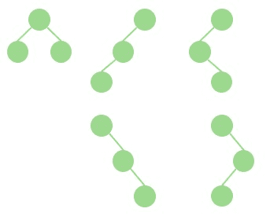
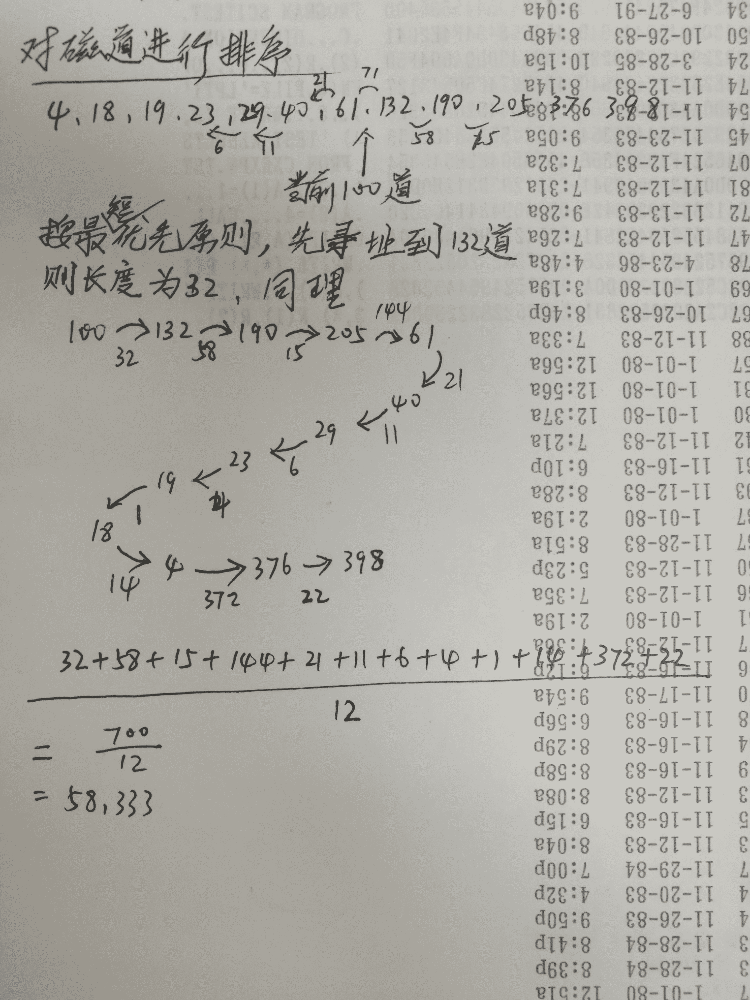

# 腾讯 2017 校招开发工程师笔试试卷（一）

## 1

在 vs 编译环境下，以下代码的运行情况：

```cpp
#include <iostream>
using namespace std;
int f(int a, int b, int c){
    return 0;
}
int main(){
    return  f(printf("a"), printf("b"), printf("c"));
}
```

正确答案: D   你的答案: 空 (错误)

```cpp
编译不过
```

```cpp
运行错误
```

```cpp
abc
```

```cpp
cba
```

本题知识点

C++ C 语言

讨论

[zz1229](https://www.nowcoder.com/profile/7214650)

该题考察函数的参数传递：当用函数做实参时，编译器一般会根据参数传递顺序，先计算出函数的返回值，然后将返回值传递给原来的函数。在 x86 架构（Linux 或 Unix 系统）上，函数的参数是通过栈传递的。因此参数从右往左入栈顺序是：printf("c")，printf("b")，printf("a")。依次计算出结果：cba 在 x86_64 架构（Linux 或 Unix 系统）上，函数的前 6 个参数是通过寄存器传递的，超出 6 个的部分（如第 7 个参数，第 8 个参数等等）通过栈传递。因此参数进寄存器顺序是：printf("a")，printf("b")，printf("c")。依次计算出结果：abc

编辑于 2017-08-18 18:48:04

* * *

[努力努力再努力 max](https://www.nowcoder.com/profile/1261634)

什么破题

发表于 2017-08-12 01:21:47

* * *

[nancy1024](https://www.nowcoder.com/profile/1604707)

乍一看应该选 A，编译不过。因为 f(printf("a"),printf("b"),printf("c"))根本不满足 f(int a,int b,int c)嘛！但是 printf 也是有返回值的，而且正好是整型。这个返回值就是它所输出的字符串的长度。所以编译通过是没问题的。那么顺序为什么是 cba 呢？因为参数传递是通过栈实现的，从右向左依次压栈。

发表于 2018-07-14 10:17:49

* * *

## 2

具有 3 个节点的二叉树有几种形态？

正确答案: C   你的答案: 空 (错误)

```cpp
3
```

```cpp
4
```

```cpp
5
```

```cpp
6
```

本题知识点

树

讨论

[安大爷写代码](https://www.nowcoder.com/profile/1455003)



发表于 2017-08-19 15:53:40

* * *

[阿诺 41](https://www.nowcoder.com/profile/8089149)

n 个结点的二叉树的形态：C（2*n,n）/n+1

发表于 2017-09-04 16:48:10

* * *

[留术子](https://www.nowcoder.com/profile/8304578)

用画图画了个丑图 大概就是这样子

发表于 2017-08-18 15:27:16

* * *

## 3

已知一棵二叉树的前序遍历为 CABEFDHG，中序遍历为 BAFECHDG，那么它的后续遍历是：

正确答案: B   你的答案: 空 (错误)

```cpp
BFEACHDG
```

```cpp
BFEAHGDC
```

```cpp
BEFACHDG
```

```cpp
BEFAHGDC
```

本题知识点

树

讨论

[QuewangLiu](https://www.nowcoder.com/profile/419323)

先根据前序找出根和左右子树，画出相应的树的结构，以此类推，完成树的结构，然后写出后序

发表于 2017-08-28 10:33:19

* * *

[Jon_Chen](https://www.nowcoder.com/profile/626022)

前:根左右 中:左根右 后:左右根 已知前中求后: 前序遍历知道第一个为根节点是 A，根据根节点 A 在中序遍历的位置划分左右子树… 已知中后求前： 后序遍历最后一个为根节点，然后在中午遍历中划分左右子树…

发表于 2017-08-28 01:42:37

* * *

[Harling](https://www.nowcoder.com/profile/452435)

前序结点是中序结点的根结点，把中序遍历划分为左右子树。根据两种顺序写出树的结构，再写出后序的顺序。

发表于 2019-04-10 16:55:51

* * *

## 4

```cpp
var foo=”Hello”;
(function(){
    var bar=”World”;
    alert(foo+bar);
})();
alert(foo+bar);
```

上面这段代码中 alert 两次输出结果为

正确答案: A   你的答案: 空 (错误)

```cpp
hello world 报错
```

```cpp
hello world hello world
```

```cpp
hello world hello
```

本题知识点

Javascript

讨论

[lorretta](https://www.nowcoder.com/profile/6965617)

```cpp

	(function(){

	    var bar=”World”;

	    alert(foo+bar);

	})();

	//此函数是一个匿名自执行函数，会先调用并执行一次，即 alert (foo+bar)的字符串拼接；

	// var bar=”World”是函数内部声明的局部变量，外部无法调用，所以外部的 alert(foo+bar)会报错。

```

发表于 2017-09-22 14:11:01

* * *

[fghfghggh](https://www.nowcoder.com/profile/5708802)

bar is not defined,由于 bar 没有被全局定义，仅在局部被定义的变量属于局部变量，若去掉 bar 前面的 var 声明变成全局变量就可以正常 alert

编辑于 2018-07-23 17:22:10

* * *

[Tonedoony](https://www.nowcoder.com/profile/1301242)

bar 为局部变量，第一次函数调用输出 hello world 第二次报错。

发表于 2017-08-21 13:05:01

* * *

## 5

下列程序数据结果是多少（大 A 的 ascii 码是 65 ）？

```cpp
#include <stdio.h>
enum etest{
    eparam1,
    eparam2,
    eparam3 = 10,
    eparam4,
    eparam5 = 'a',
    eparam6
}epr;
int main()
{
    printf("%d,%d", eparam4, eparam6);
    return 0;
}
```

正确答案: C   你的答案: 空 (错误)

```cpp
3,98
```

```cpp
11,34
```

```cpp
11,98
```

```cpp
3,34
```

本题知识点

C++ C 语言

讨论

[大黑熊](https://www.nowcoder.com/profile/7845491)

C
枚举赋值问题，从上一个定义开始逐个低增
'a'=97
'A'=65

发表于 2017-04-03 12:53:27

* * *

[runnin](https://www.nowcoder.com/profile/6531875)

"大 A 的 ascii 码是 65"跟大 A 有什么关系？ 

发表于 2017-08-26 15:41:14

* * *

[QT 菜鸡弟弟](https://www.nowcoder.com/profile/132714808)

这题居然是不定项选择？😂😂😂

发表于 2019-06-24 11:20:48

* * *

## 6

哪种数据结构用于执行递归调用（）

正确答案: C   你的答案: 空 (错误)

```cpp
数组
```

```cpp
链表
```

```cpp
堆栈
```

```cpp
二叉树
```

本题知识点

递归

讨论

[Tiket](https://www.nowcoder.com/profile/7751754)

建议改为单选题

发表于 2017-10-02 16:50:25

* * *

[北城北](https://www.nowcoder.com/profile/5090344)

注意题目意思，是用于执行，而不是这种数据结构本身需要递归。递归的展开和回归就是栈的特点，即先进后处，最里层的递归后返回。

发表于 2017-08-17 23:11:53

* * *

[一瓢之饮](https://www.nowcoder.com/profile/4057885)

递归的过程就是压栈的过程，先把数据压进栈，递归结束时，开始一一出栈

发表于 2017-08-19 09:23:00

* * *

## 7

在 Linux 上，对于 fork 多进程，下列哪些内容是子进程可以从父进程继承的（）

正确答案: B C D   你的答案: 空 (错误)

```cpp
进程地址空间
```

```cpp
共享内存
```

```cpp
信号掩码
```

```cpp
已打开的文件描述符
```

```cpp
以上都不是
```

本题知识点

Linux

讨论

[我有一个响亮的名字啊](https://www.nowcoder.com/profile/1208652)

正确答案是 BCD

*   参考[CSDN Blog](http://blog.csdn.net/xiaojun111111/article/details/51764389)和[CSDN](http://blog.csdn.net/ygm_linux/article/details/50683877)了解更多。
*   子进程继承父进程
    *   用户号 UIDs 和用户组号 GIDs
    *   环境 Environment
    *   堆栈
    *   共享内存
    *   打开文件的描述符
    *   执行时关闭（Close-on-exec）标志
    *   信号（Signal）控制设定
    *   进程组号
    *   当前工作目录
    *   根目录
    *   文件方式创建屏蔽字
    *   资源限制
    *   控制终端
*   子进程独有

    *   进程号 PID
    *   不同的父进程号
    *   自己的文件描述符和目录流的拷贝
    *   子进程不继承父进程的进程正文（text），数据和其他锁定内存（memory locks）
    *   不继承异步输入和输出
*   父进程和子进程拥有独立的地址空间和 PID 参数。

*   子进程从父进程继承了用户号和用户组号，用户信息，目录信息，环境（表），打开的文件描述符，堆栈，（共享）内存等。
*   经过 fork()以后，父进程和子进程拥有相同内容的代码段、数据段和用户堆栈，就像父进程把自己克隆了一遍。事实上，父进程只复制了自己的 PCB 块。而代码段，数据段和用户堆栈内存空间并没有复制一份，而是与子进程共享。只有当子进程在运行中出现写操作时，才会产生中断，并为子进程分配内存空间。由于父进程的 PCB 和子进程的一样，所以在 PCB 中断中所记录的父进程占有的资源，也是与子进程共享使用的。这里的“共享”一词意味着“竞争”                                  转自脱缰的哈士奇

发表于 2017-08-13 20:57:50

* * *

[安大爷写代码](https://www.nowcoder.com/profile/1455003)

父进程和子进程拥有独立的地址空间和 PID 参数，所以子进程不会继承父进程的地址空间，故排除 A。

发表于 2017-08-19 16:26:21

* * *

[ceeeeeeeeeeeb](https://www.nowcoder.com/profile/542410100)

子进程独有：进程号 PID，不同的父进程号，自己的文件描述符和目录流的拷贝，不继承父进程的进程正文，数据，和其他锁定内存，不继承异步输出输入。子进程继承父进程：UID GID，环境，堆栈，共享内存，打开文件的描述符，执行时关闭标志，信号控制设定，进程组号，当前工作目录，根目录，文件方式创建屏蔽字，资源限制，控制终端。子父进程拥有独立的地址空间和 PID。经过 fork()以后，父进程和子进程拥有相同内容的代码段、数据段和用户堆栈，就像父进程把自己克隆了一遍。事实上，父进程只复制了自己的 PCB 块。而代码段，数据段和用户堆栈内存空间并没有复制一份，而是与子进程共享。只有当子进程在运行中出现写操作时，才会产生中断，并为子进程分配内存空间。由于父进程的 PCB 和子进程的一样，所以在 PCB 中断中所记录的父进程占有的资源，也是与子进程共享使用的。

发表于 2019-07-31 22:46:15

* * *

## 8

若磁头的当前位置在第 100 磁道，现在有一磁盘读写请求序列如下：23,376,205,132,19,61,190,398,29,4,18,40。若采用最短寻道时间优先算法，则平均寻道长度是多少？

正确答案: B   你的答案: 空 (错误)

```cpp
133
```

```cpp
58.3
```

```cpp
57.7
```

```cpp
70.9
```

本题知识点

操作系统

讨论

[牛客-68](https://www.nowcoder.com/profile/7634665)



发表于 2017-08-18 22:05:12

* * *

[Asoiaf](https://www.nowcoder.com/profile/699334)

先排序 4.18.19.23\.   29.40.61.132\.   190.205.376.398 然后分别计算相邻之间的大小关系。寻道较短时间的进行排序得到 100 132 190 205     61 40 29 23      19 18 4 376      398 然后求出递增和递减临界点 100 205 4 398 计算相邻之差和 105 + 201 + 394 = 700 最后求平均值

编辑于 2017-08-28 22:31:11

* * *

[武培轩](https://www.nowcoder.com/profile/5033606)

**正确答案**B**答案解析**

最短寻道时间优先算法(SSTF)：从等待的访问者中挑选寻找时间最短的那个请求执行。当前位置为 100，则顺序为(100),132,190,205,61,40,29,23,19,18,4,376,398，因此磁头移动磁道总数为(132-100)+(190-132)+(205-190)+(205-61)+(61-40)+(40-29)+(29-23)+(23-19)+(19-18)+(18-4)+(376-4)+(398-376)=700，平均移动磁道数为 700/12 =58.3。

发表于 2018-09-09 18:41:01

* * *

## 9

文件系统管理的最小磁盘空间单位是（）

正确答案: C   你的答案: 空 (错误)

```cpp
扇区
```

```cpp
页面
```

```cpp
簇
```

```cpp
文件
```

本题知识点

操作系统

讨论

[phoenixlx](https://www.nowcoder.com/profile/5649016)

扇区是**磁盘最小的物理存储单元**，一般而言是每个扇区 512B 大小，但是**操作通常不直接管理每一个扇区**，而是通过将若干个扇区组成的一个更大的集合来去进行操作管理。    这个比扇区更大的集合，在 Windows 下叫做**簇**；在 Linux 下叫做块（block）。

发表于 2018-02-22 16:36:35

* * *

[大黑熊](https://www.nowcoder.com/profile/7845491)

C
微软操作系统（DOS、WINDOWS 等）中磁盘文件存储管理的最小单位叫做“簇”
**扇区：**硬盘不是一次读写一个字节而是一次读写一个扇区（512 个字节）
**簇**：系统读读写文件的基本单位，一般为 2 的 n 次方个扇区(由文件系统决定)

```cpp
块可以包含若干页，页可以包含若干簇，簇可以包含若干扇区
```

发表于 2017-04-03 13:04:11

* * *

[编程的渣渣啊啊啊](https://www.nowcoder.com/profile/8501721)

扇区是磁盘的最小物理存储单元，最小磁盘空间单位是簇，扇区发表于 2018-04-09 21:20:50

* * *

## 10

IP 地址为 140.123.0.0 的地址是 B 类地址，若要切割为 10 个子网，而且都要连接上 Internet，请问子网掩码应设为（）

正确答案: D   你的答案: 空 (错误)

```cpp
255.0.0.0
```

```cpp
255.255.0.0
```

```cpp
255.255.128.0
```

```cpp
255.255.240.0
```

本题知识点

网络基础

讨论

[Diveny](https://www.nowcoder.com/profile/8549648)

*   **IP 地址**：类似于你这台电脑的标志，但在网络上是靠 IP 地址识别的。如果利用 TCP/IP 协议组网，那么一个网段内的所有电脑都必须有一个 IP 地址，并且不能重复。

*   **子网掩码**和 IP 地址是配合一起的，将 IP 地址分成两段，**网络段**和**主机段**。

    *   例如你的 IP 地址是 192.168.1.2,子网掩码是 255.255.255.0,那么子网掩码全是 255 的对应的 IP 地址段表示网络段，是 0 的对应的 IP 地址段表示主机段，以上为例，则 192.168.1 表示网络，2 表示主机。

    *   如果需要在这个网络内新增一台主机，则只要改变仅也只能改变最后一位。这样才能保证在同一网络。

> B 类地址中，后 16 位为主机地址，255.255.0.0，二进制为 11111111 11111111 00000000 00000000
> 
> 要想切割成 10 个子网，至少要向主机位借 4 位，2⁴＝16>10
> 
> 则子网掩码设置成 20 位，即二进制为 11111111 11111111 **11110000** 00000000，再换算成十进制之后为：255.255.240.0

编辑于 2017-09-04 19:15:54

* * *

[ac 从 0 开始](https://www.nowcoder.com/profile/6481713)

```cpp
默认 B 类地址的子网掩码是/16，也就是 255.255.0.0
切割成 10 个子网的话，就得向主机位借 2 的四次方=16＞10，即向主机位借 4 位。
所以子网掩码要设置成/20，也就是 255.255.240.0
```

发表于 2017-04-03 13:46:57

* * *

[安大爷写代码](https://www.nowcoder.com/profile/1455003)

B 类地址中，后 16 位为主机地址，要想切割成 10 个子网（8<10<16）则至少要向主机位借 4 位（2⁴＝16），则子网掩码设置成／20，换算之后为：255.255.240.0

发表于 2017-08-19 16:49:32

* * *

## 11

以下关于栈的说法错误的是：

正确答案: B C D   你的答案: 空 (错误)

```cpp
在栈空的情况下，一定不能作出栈操作，否则产生溢出。
```

```cpp
栈一定是顺序存储的线性结构。
```

```cpp
空栈是所有元素都为 0 的栈。
```

```cpp
一个栈的输入序列为：A,B,C,D，可以得到输出序列：C,A,B,D。
```

本题知识点

栈 *讨论

[cct](https://www.nowcoder.com/profile/3167413)

数据结构： 1\. 逻辑结构：线性、树形、图形结构 2\. 存储结构： （a）顺序存储结构，如数组 （b）链式存储结构，如链表 （c）索引存储，如线索树 （d）散列存储 栈，可以用顺序存储实现，（其实就是数组加一个 top 指针），也可以用链式存储结构实现，如链栈

发表于 2017-08-26 23:30:45

* * *

[安大爷写代码](https://www.nowcoder.com/profile/1455003)

首先题目是要求选描述错误的。A：栈空的情况下出栈属于下溢出；A 正确。B：栈可以顺序存储，也可以是链式存储的线性结构；B 错误。C：元素为 0 和无元素是两个不同的概念，当有 n 个元素为 0 的栈，拥有 n 个元素；C 错误。D：输出 C 时，并定有 ABC 进栈，然后 C 出栈。接下来有两种输出结果，一是 B 出栈，即输出 C 的后面输出 B；而是 D 进栈后立即出栈，即输出 C 的后面输出 D。所以 C 的后面要么是 B 要么是 D，不可能输出 A；D 错误。

编辑于 2017-09-10 11:48:24

* * *

[牛客 3590024 号](https://www.nowcoder.com/profile/3590024)

```cpp
栈一定是顺序存储的线性结构?????????可以是链式存储啊
```

发表于 2017-08-17 20:01:05

* * *

## 12

设有一个递归算法如下

```cpp
int f(int n) {
    if(n<=3) return 1;
    else return f(n-2)+f(n-6)+1;
}
```

试问计算 f(f(9))时需要计算（）次 f 函数。

正确答案: C   你的答案: 空 (错误)

```cpp
10
```

```cpp
11
```

```cpp
12
```

```cpp
14
```

本题知识点

递归

讨论

[華曲秦殇](https://www.nowcoder.com/profile/1356289)


发表于 2017-09-10 16:40:25

* * *

[赤默 Windy](https://www.nowcoder.com/profile/1012072)

看备选答案数目不太多，就直接笔算了，不知还有没有更简便方法：一、先算内层 f(9)    [1] 计算 f(9) = f(7) + f(3) + 1;    [2] 计算[1]中 f(7) = f(5) + f(1) + 1;    [3] 计算[2]中 f(5) = f(3) + f(-1) + 1;    [4] 计算[3]中 f(3) = 1;    [5] 计算[3]中 f(-1) = 1;        {至此 f(5)可计算得： f(5) = 1 + 1 + 1 = 3}    [6] 计算(1)中 f(1) = 1;        {至此 f(7)可计算得 ：f(7) = 3 + 1 + 1 = 5}    [7] 计算[1]中 f(3) = 1;        {至此 f(9)可计算得：f(9) = 5 + 1 + 1 = 7}计算 f(9)一共调用了 7 次函数二、计算外层 f(7)    由上面步骤可知，计算 f(7)调用了 5 次函数所以一共调用了函数 7+5=12 次

发表于 2017-08-18 21:07:06

* * *

[城枫墨凉](https://www.nowcoder.com/profile/1004093)

(1)内层：  f(9)
                   |
              return [f(7)+f(3)+1] = 5+1+1 = 7
                            |
                       return [f(5)+f(1)+1] = 3+1+1 = 5
                                     |
                                 return [f(3)+f(-1)+1] = 1+1+1 = 3

调用了 f(9),f(7),f(3),f(5),f(1),f(3),f(-1),共 7 次。

(2)外层
因为 f(9)=7  => f(f(9)) = f(7)
         f(7)
           |
        return  f(5)+f(1)+1 = 5
                      |
                return  f(3)+f(0)+1 = 3

调用了 f(7),f(5),f(1),f(3),f(0),共 5 次。
加起来 7+5=12 次。答案 C。

发表于 2018-01-11 10:21:26

* * *

## 13

寝室有 6 个同学打 dota，分为对立的两方，一方是天灾军团，一方是近卫军团。现请你设置赛程以及每场的对阵（每方最少 1 人、最多 5 人），请问至少得进行多少场比赛，才能使得赛程结束后每位同学都和其他同学做过对手（）

正确答案: B   你的答案: 空 (错误)

```cpp
2
```

```cpp
3
```

```cpp
4
```

```cpp
5
```

本题知识点

智力题

讨论

[天行有常](https://www.nowcoder.com/profile/527049)

关于二进制，总觉得大家的描述有一丝丝问题。我认真读了几遍，总算明白是在说什么。我再复述一下，希望能帮助到更多的朋友。 1、用一串二进制数字，代表一个人，所参加的比赛中属于的阵营，如 0000 代表这个人 4 场比赛都属于 0 阵营，01010 代表这个人第 2 场和第 4 场属于 1 阵营其余属于 0 阵营。0 可以代表天灾，也可以代表另外一个阵营。 2、要求每个人互相之间做过对手，即代表每个人的二进制数字，只要有 1 位不同就满足条件。 题目要求 6 个人互相之间做过对手，就需要 6 个不同的二进制数字，那么多少位二进制能容纳 6 个不同数字呢，答案是至少 3 位，即至少 3 场比赛。 发散一下，4 个人只需要 2 场比赛，5、6、7、8 个人都是 3 场，9～16 人就得 4 场，17～32 人就得 5 场。 再发散一下，假定有 3 个阵营呢？8 个阵营呢？是不是用相应的 3 进制、8 进制就能解决问题呢？

发表于 2018-04-26 16:23:05

* * *

[zhenlang-huo](https://www.nowcoder.com/profile/5841342)

我看见很多人说不理解为什么可以把比赛的场数转换成二进制来表示，我觉得需要说明一下的就是，用三位二进制来表示某个人三场比赛各场比赛所在的一方，比如我们用 0 代表在天灾，1 代表在近卫，那么 000 就代表这个人三场比赛都在天灾，而 001 表示这个人前两场比赛在天灾，第三场比赛在近卫。那么三位二进制可以有 8 种表示，而每一种表示都与其他 7 种的表示至少在一个位置上的数字是不一样的，所以最多 8 人至少三场可以每个人都做过对手。

发表于 2017-08-27 22:28:47

* * *

[joc](https://www.nowcoder.com/profile/759160)

6 位同学不是天灾就是近卫，可以看成是使用多少位二进制可以唯一标识 6 位同学的问题。
三位二进制可以唯一标识 8 个人，000,001,010,011,100,101,110,111
每两个二进制之间至少有一位是不同的，达成条件。如果人再多一些还要考虑每队最多人数限制。

发表于 2017-08-18 13:38:34

* * *

## 14

在上下文及头文件均正常的情况下，以下代码打印的结果是（假设运行在 64 位计算机上）：

```cpp
struct st_t {
    int status;
    short *pdata;
    char errstr[32]; 
};
st_t st[16];
char *p = (char *)(st[2].esstr + 32);
printf("%d", (p - (char *)(st)));
```

正确答案: D   你的答案: 空 (错误)

```cpp
32
```

```cpp
120
```

```cpp
114
```

```cpp
144
```

本题知识点

C++ C 语言

讨论

[flyzhong](https://www.nowcoder.com/profile/9802179)

根据字节对齐，在 64 位系统下 struct  st_t 结构体占用的字节为 48 个。struct st_t {int status;  //占用 8 个（后面的 4 个为对齐位）short *pdata;//占用 8 个 char errstr[32];//占用 32 个};char  *p=(char  *)(st[2].esstr+32)，p 实际指向了 st[3]则 p-(char  *)(st))，即为&st[3]-&st[0],占用空间为 3 个结构体的大小，即 3*48=144，选 D

编辑于 2018-01-12 11:19:16

* * *

[爱。在心口难开](https://www.nowcoder.com/profile/4994507)

回答都是千篇一律，估计都是各种复制粘贴。。。就没人奇怪**char**  *p=(char  *)(st[2].**esstr**+32);中的 esstr 是啥吗？个人感觉是题目给错了，应该是**char**  *p=(char  *)(st[2].**errstr**+32);才对。理由：1、esstr，C/C++中并没有这个操作或关键字；2、st 是由结构体初始化的，st[2]中包含有结构体中的成员{int status;short* pdata;char errstr[32];}而符号“.”就是对象调用成员的符号，即"."后面应该是对象的成员。所以我猜测正确的应该就是 errstr。知道了这一点，题目就好理解了，st[2].**errstr**表示指向 errstr 的首地址，因为 errstr 占 32 位空间，所以(st[2].**errstr**+32)表示指向 st[2].errstr 的最后一个元素的下一个地址，即 st[3]的首地址。所以 p-(char *)(st))，即为&st[3]-&st[0],占用空间为 3 个结构体的大小，即 3*48=144，

发表于 2018-08-03 13:18:29

* * *

[ArcherSaber](https://www.nowcoder.com/profile/4363298)

这个是题目的地址分配
32 位环境  4 字节对齐 指针占 4 字节 64 位环境  8 字节对齐 指针占 8 字节
因为是 64 位环境下
int status;虽然 int 只占用 4 个 由于后面的指针八个字节放不下 填补不了空位 所以对其要八个字节
short *pdata; 这个指针会占用 8 个字节
char errstr[32]; 占用 32 个字节
所以一共占用 8+8+32=48 个字节
char *p=(char *)(st[2].esstr+32)，p 实际指向了 st[3]
则 p-(char *)(st))，即为&st[3]-&st[0],占用空间为 3 个结构体的大小，即 3*48=144，

编辑于 2017-11-20 11:42:33

* * *

## 15

设有 2 条路由 21.1.193.0/24 和 21.1.194.0/24，如果进行路由汇聚，汇聚这两条路由的地址是（）

正确答案: C   你的答案: 空 (错误)

```cpp
21.1.200.0/22
```

```cpp
21.1.192.0/23
```

```cpp
21.1.192.0/21
```

```cpp
21.2.224.0/20
```

本题知识点

网络基础

讨论

[脱缰的哈士奇～](https://www.nowcoder.com/profile/542028)

参考[路由汇聚算法](http://baike.baidu.com/item/%E8%B7%AF%E7%94%B1%E6%B1%87%E8%81%9A)了解该知识点。 193 = 1100,0001 194 = 1100,0010 193 和 194 的前 6 位相同，因此掩码长度为 8+8+6 = 22。而 1100,0000 = 192。 因此，最终答案为 21.1.192.0/22。

但是题目选项中没有该选项，因此，需要找一个包含正确答案的最佳选项，即 21.1.192.0/21。正确答案是 C。

编辑于 2017-03-27 08:35:24

* * *

[风清扬゛](https://www.nowcoder.com/profile/39783518)

路由汇聚，看网络段不一样的地方，这里是 193 和 194，我们将其转为二进制进行比较 193 = 1100 0001  194 = 1100 0010，可以看到 193 和 194 最大可看作 6 位是一样的，所以掩码最大可以是 8+8+6 = 22，将不匹配的地方替换成 0 后得 1100 0000 = 192，所以汇聚后为 21.1.192.0/22，题目不包含此答案，我们此时将匹配长度看作是 5，那么掩码是 8+8+5=21，将不匹配的地方替换成 0 后得 1100 0000 = 192，所以汇聚后是 21.1.192.0/21 路由汇聚就是找到两路由不同地方，换算成二进制后找到能匹配的最大长度，则能匹配的最大长度再换算成的十进制便是汇聚后的结果，新掩码的最大长度= 原掩码长度-不匹配的长度。

发表于 2019-04-05 10:45:58

* * *

[Liamcoder](https://www.nowcoder.com/profile/2351238)

193 = 1100,0001 194 = 1100,0010 193 和 194 的前 6 位相同，因此掩码长度为 8+8+6 = 22。 
而 1100,0000 = 192。 因此，最终答案为 21.1.192.0/22。 
但是题目选项中没有该选项，使用 22 个网络位的话，会在选择路由时，符合“最长前缀匹配”这一规则，即 21.1.192.0/21。

发表于 2018-12-10 15:59:59

* * *

## 16

从一副标准扑克牌中抽牌，抽到黑色牌就继续抽（不取出），直至抽到红色牌，则停止。按照概率算，平均下来每次能抽到多少张黑牌？

正确答案: A   你的答案: 空 (错误)

```cpp
1
```

```cpp
1.2
```

```cpp
0.8
```

```cpp
0.9
```

本题知识点

数学运算

讨论

[脱缰的哈士奇～](https://www.nowcoder.com/profile/542028)

正确答案是 A（1）。

**抽到黑色牌之后继续抽，表示黑色牌仍放入总扑克牌中，并不取出。**因此，每次抽牌，红色和黑色牌的数目都是相同的，每次抽中黑色牌的概率都是 1/2。

抽中 0 张黑色牌概率：a0 = 1/2 抽中 1 张黑色牌概率：a1 = (1/2) *(1/2) = 1/4 = (1/2)^(1+1)**抽中 2 张黑色牌概率：a2 = (1/2)* (1/2) * (1/2) = 1/8 = (1/2)^(2+1)抽中 3 张黑色牌概率：a3 = 1/16 = (1/2)^(3+1)因此，抽中 n 张牌的概率为 an = (1/2)^(n+1)。

则平均每次抽中牌的张数（即得到牌数的期望值）为 Sn = 1*a1+2*a2+...+n*an = 1*(1/2)+2*(1/4)+...+n*(1/2)^(n+1)

上式是一个差比数列求和问题。

```cpp
Sn = 1*a1+2*a2+...+n*an = 1*(1/4)+2*(1/8)+...+n*(1/2)^(n+1)
(1/2)*Sn = 1*(1/8)+2*(1/16)+...+n*(1/2)^(n+1)+n*(1/2)^(n+2)
作差有，
(1/2)*Sn = (1/4)+(1/8)...+(1/2)^(n+1) - n*(1/2)^(n+2)  （使用等比数列求和公式求解）
(1/2)*Sn = (1/2) - (1/2)^(n+1) - n*(1/2)^(n+2)
最终得到，
Sn = 1 - (1/2)^(n) - n*(1/2)^(n+1)
Sn = 1 - (n+2)*(1/2)^(n+1)
```

因此，得到牌的期望值是 Sn = 1 - (n+2)*(1/2)^(n+1)。当牌数很多的时候，期望值趋向于 1。

编辑于 2017-03-31 13:21:13

* * *

[跪求 offer_](https://www.nowcoder.com/profile/6813930)

抽到黑色牌之后继续抽，表示黑色牌仍放入总扑克牌中，并不取出。 假设期望为 E，第一次抽中的概率为 1/2 ,因此等式为:1/2（1+E） = E 得出 E=1

发表于 2017-08-19 17:00:09

* * *

[墨海](https://www.nowcoder.com/profile/9719851)

第一次抽到黑色概率为 1/2，黑牌数期望为 1*0.5=0.5 第二次抽到黑牌概率为 1/4, 黑牌数期望为 1*1/4=0.25.....第 n 次，黑牌期望为 1/2^nn 趋于无穷大的时候，0.5+0.25+0.125+......=1

发表于 2017-08-23 17:46:56

* * *

## 17

下面关于 DNS 说法正确的是（）

正确答案: A B C   你的答案: 空 (错误)

```cpp
DNS 的作用是域名和 IP 地址的相互映射
```

```cpp
DNS 协议大多数运行在 UDP 协议之上
```

```cpp
DNS 协议端口号为 53
```

```cpp
DNS 的默认缓存时间为 1 小时
```

本题知识点

网络基础

讨论

[安大爷写代码](https://www.nowcoder.com/profile/1455003)

A：DNS 就是将域名翻译成 IP 地址。B：主要用 UDP，但是当请求字节过长超过 512 字节时用 TCP 协议，将其分割成多个片段传输。C：DNS 协议默认端口号是 53。D：操作系统的 DNS 缓存：windows DNS 缓存的默认值是 MaxCacheTTL，它的默认值是 86400s，也就是一天。macOS 严格遵循 DNS 协议中的 TTL。游览器的 DNS 缓存：chrome 对每个域名会默认缓存 60s；IE 将 DNS 缓存 30min；Firefox 默认缓存时间只有 1 分钟；Safari 约为 10S。＝>综上所述，选择 BC。

编辑于 2017-10-02 12:20:36

* * *

[牛客 958379 号](https://www.nowcoder.com/profile/958379)

DNS 是域名系统的缩写，他是由解析器和域名服务器组成的。域名服务器是保存有该网络中所有主机的域名和对应的 ip 地址。域名必对应一个 ip 地址，而 ip 地址不一定有域名。将域名映射为 ip 地址的过程就称为域名解析。域名虽便于人们记忆，但计算机只能互相认识 ip 地址。DNS 就是进行域名解析的服务器。 DNS 主要是 UDP 协议，但是当请求字节过长超过 512 字节时，是用 TCP 协议，它可以分割成多个片段。 所以选 C

编辑于 2017-02-13 14:45:30

* * *

[旧时光 111](https://www.nowcoder.com/profile/8035243)

A：DNS 就是将域名翻译成 IP 地址。 单向解析。 B：主要用 UDP，但是当请求字节过长超过 512 字节时用 TCP 协议，将其分割成多个片段传输。 C：DNS 协议默认端口号是 53。 D：操作系统的 DNS 缓存：windows DNS 缓存的默认值是 MaxCacheTTL，它的默认值是 86400s，也就是一天。macOS 严格遵循 DNS 协议中的 TTL。 游览器的 DNS 缓存：chrome 对每个域名会默认缓存 60s；IE 将 DNS 缓存 30min；Firefox 默认缓存时间只有 1 分钟；Safari 约为 10S。 mark 下

发表于 2018-01-12 22:49:27

* * *

## 18

假设就绪队列中有 10 个线程，系统将时间片设置为 200ms，CPU 进行线程切换要花费 10ms。则系统开销所占的比例约为（）

正确答案: B   你的答案: 空 (错误)

```cpp
0.01
```

```cpp
0.05
```

```cpp
0.1
```

```cpp
0.2
```

本题知识点

操作系统

讨论

[脱缰的哈士奇～](https://www.nowcoder.com/profile/542028)

正确答案是 B（0.05）。

*   参考[操作系统的系统开销比率计算](https://www.zhihu.com/question/29209855/answer/43549181)了解更多。
*   操作系统调度耗时本身要算到时钟的时间片里。


上图的理解是错误的。因为操作系统调度耗时本身要算到时钟的时间片里。下图所示 的理解才是正确的。


*   操作系统的调度逻辑是：**发生中断->处理调度->发生中断->处理调度...**
*   一个时间片长度就是两次中断发生之间的间隔。因此，**系统开销比率 = 调度耗时/时间片长度**
*   本题中，系统开销比率 = 10/200 = 5% = 0.05

发表于 2017-03-30 10:44:20

* * *

[牛客 5569330 号](https://www.nowcoder.com/profile/5569330)

系统开销比率 = 调度耗时/时间片长度

发表于 2017-09-09 21:22:53

* * *

[九斤 ing](https://www.nowcoder.com/profile/5228614)

系统开销比率=调度耗时/时间片长度

发表于 2019-03-24 22:15:34

* * *

## 19

请选择下列程序的输出结果是（）

```cpp
#include <stdio.h>
int main() {
    const int N = 10;
    const int M = 2;
    int *a = new int[N];
    for (int i = 0; i < N; ++i)
        a[i] = (0 == i % 2) ? (i + 2) : (i + 0);
    int(*b)[N / M] = (int(*)[N / M]) a;
    for (int i = 0; i < M; ++i)
        for (int j = 0; j < N / M; ++j)
            printf("%d", b[i][j]);
    return 0;
}

```

正确答案: A   你的答案: 空 (错误)

```cpp
21436587109
```

```cpp
224466881010
```

```cpp
03254769811
```

```cpp
21436687101
```

本题知识点

C 语言

讨论

[。。221](https://www.nowcoder.com/profile/5379102)

```cpp
for(inti=0;i<N;++i)
        a[i]=(0==i%2)?(i+2):(i+0);
```

结果为
[2,1,4,3,6,5,8,7,10,9]

```cpp
int (*b)[N/M]=(int (*)[N/M])a;
//int (*b)[5]=(int (*)[5])a;
```

b 是数组指针,数组指针是指向一大块内存
现在对于 b,数据是这样的

```cpp
[[2,1,4,3,6],[5,8,7,10,9]]
//b[0]-->[2,1,4,3,6]
//b[1]-->[5,8,7,10,9]
```

```cpp
//顺序打印
for(int i=0;i<M;++i)
        for(int j=0;j<N/M;++j)
            printf(“%d”,b[i][j]);
```

编辑于 2017-09-13 09:30:28

* * *

[大黑熊](https://www.nowcoder.com/profile/7845491)

A
int (*b)[N / M] = ( int (*)[N / M])a; ==> int (*b)[5] = ( int (*)[5])a;

b 为指向 a 的前五个元素

但是输出的时候，第二层外循环越界输出 a 后五个元素 

```cpp
#pragma warning(disable:4996)
#include <stdio.h>
int main(){
	const int N = 10;
	const int M = 2;
	int* a = new int[N];
	for (int i = 0; i < N; ++i)
		a[i] = (0 == i % 2) ? (i + 2) : (i + 0);
	int(*b)[N / M] = (int(*)[N / M])a;
	for (int i = 0; i < M; ++i)
	for (int j = 0; j < N / M; ++j)
		printf("%d", b[i][j]);
	return 0;
} 
```

发表于 2017-04-03 12:27:17

* * *

[笨笨的程序猿](https://www.nowcoder.com/profile/7683489)

   int a[] = {2,1,4,3,6,5,8,7,10,9};  //一维数组 a   int (*b)[N/M]=(int (*)[N/M])a;    //将一维数组 a 强制转化为数组指针并赋值给数组指针 b；  //上面两句可以拆分为以下几句理解；    int a[2][N/M] = {2,1,4,3,6,5,8,7,10,9};    int (*b)[N/M];   //b 是数组指针，指向具有 N/M 个元素的一维数组；    b = a;

发表于 2017-08-29 10:38:30

* * *

## 20

在 C++语言中，以下说法正确的是（）

正确答案: A D   你的答案: 空 (错误)

```cpp
动态多态是通过虚表实现的
```

```cpp
构造函数可以声明为虚函数
```

```cpp
析构函数不可以声明为虚函数
```

```cpp
抽象类中至少包含一个纯虚函数
```

本题知识点

C++

讨论

[Jacob000](https://www.nowcoder.com/profile/1062575)

C++中 的虚函数的作用主要是实现了多态的机制。而虚函数是通过虚函数表(V-Table)实现的。构造函数不能声明为虚函数，析构函数可以声明为虚函数，而且有时是必须声明为虚函数。构造函数为什么不能声明为虚函数？1 构造一个对象的时候，必须知道对象的实际类型，而虚函数行为是在运行期间确定实际类型的。而在构造一个对象时，由于对象还未构造成功。编译器无法知道对象的实际类型，是该类本身，还是该类的一个派生类，或是更深层次的派生类。无法确定。 2 虚函数的执行依赖于虚函数表。而虚函数表在构造函数中进行初始化工作，即初始化 vptr，让他指向正确的虚函数表。而在构造对象期间，虚函数表还没有被初 始化，将无法进行。 析构函数执行时先调用派生类的析构函数，其次才调用基类的析构函数。析构函数为什么声明为虚函数？如果析构函数不是虚函数，而程序执行时又要通过基类的指针去销毁派生类的动态对象，那么用 delete 销毁对象时，只调用了基类的析构函数，未调用派生类的析构函数。这样会造成销毁对象不完全。包含至少一个纯虚函数的类视为抽象类答案：ＡＤ参考：[`blog.csdn.net/chen825919148/article/details/8020550`](http://blog.csdn.net/chen825919148/article/details/8020550)

编辑于 2017-08-14 16:49:58

* * *

[平地一声雷哈哈](https://www.nowcoder.com/profile/3097414)

a 说法一点都不严谨,多态还可以通过函数重载实现额😓

发表于 2018-07-25 11:20:14

* * *

[BoomerangNebula](https://www.nowcoder.com/profile/3886832)

这篇博客讲得很详细，易懂[`blog.csdn.net/wswifth/article/details/5741687`](http://blog.csdn.net/wswifth/article/details/5741687)

发表于 2017-08-21 20:18:32

* * *

## 21

有代码如下所示，则在执行 delete p 时，控制台会输出什么内容（）

```cpp
class Base
{
     public:
         virtual ~Base(){
         	std::out<<"Base Destructor"<<std::endl;
       	}
}
class Derived: public Base
{
    public :
        ~Derived(){
        	std::out<<"Derived Destructor"<<std::endl;
        }
}
Base* p=new Derived();
delete p;
```

正确答案: D   你的答案: 空 (错误)

```cpp
Base Destructor
```

```cpp
Derived Destructor
```

```cpp
Base Destructor
Derived Destructor
```

```cpp
Derived Destructor
Base Destructor
```

本题知识点

C++

讨论

[大星星和小猩猩](https://www.nowcoder.com/profile/9374535)

我觉得最高票答案，把问题简单化了，析构的时候，的确是先调用派生类的析构函数、然后调用基类的析构函数。但是我们要看这道题，这里还考了一个虚析构函数的考点，如果基类的析构函数不是虚函数，那么，像这种定义一个基类的指针，指向一个派生类的对象，当你 delete 这个基类的指针时，它仅调用基类的析构函数，并不调用派生类的析构函数。**如果基类的析构函数是虚函数，delete 基类的指针时，不仅会调用基类的析构函数，还会调用派生类的析构函数。**而调用的顺序是先调用派生类的析构函数、然后调用基类的析构函数。

发表于 2018-03-07 20:17:34

* * *

[牛客 6675896 号](https://www.nowcoder.com/profile/6675896)

```cpp
析构的时候：先调用派生类的析构函数、然后调用基类的析构函数；与构造函数相反。
```

发表于 2017-08-11 20:27:53

* * *

[齐零](https://www.nowcoder.com/profile/1428236)

这是纯 C＋＋好嘛

发表于 2017-08-13 09:05:39

* * *

## 22

下列说法错误的是？

正确答案: B   你的答案: 空 (错误)

```cpp
struct 声明的类型是值类型
```

```cpp
值类型是在堆上分配的
```

```cpp
值类型不会被垃圾回收
```

```cpp
值类型不需要指针来引用
```

```cpp
引用类型在堆上分配，值类型在栈上分配
```

本题知识点

堆

讨论

[郭璺](https://www.nowcoder.com/profile/4392231)

[`www.cnblogs.com/zengming/p/6037048.html`](http://www.cnblogs.com/zengming/p/6037048.html)**值类型与引用类型区别：**

|  | 值类型 | 引用类型 |
| 存储方式 | 直接存储数据本身 | 存储的是数据的引用，数据存储在数据堆中 |
| 内存分配 | 分配在栈中的 | 分配在堆中 |
| 效率 | 效率高，不需要地址转换 | 效率较低，需要进行地址转换 |
| 内存回收 | 使用完后立即回收 | 使用完后不立即回收，而是交给 GC 处理回收 |
| 赋值操作 | 创建一个新对象 | 创建一个引用 |
| 类型扩展 | 不易扩展，所有值类型都是密封(seal)的，所以无法派生出新的值类型 | 具有多态的特性方便扩展 |
| 实例分配 | 通常是在线程栈上分配的（静态分配），但是在某些情形下可以存储在堆中 | 总是在进程堆中分配（动态分配） |

编辑于 2017-09-10 10:31:34

* * *

[混吃等死的废物](https://www.nowcoder.com/profile/6825819)


发表于 2020-08-22 17:33:22

* * *

[安大爷写代码](https://www.nowcoder.com/profile/1455003)

参考博客：[`blog.csdn.net/qiaoquan3/article/details/51202926`](http://blog.csdn.net/qiaoquan3/article/details/51202926)#comments1、值类型和引用类型的主要区别在于：**1）范围方面** C#的值类型包括：结构体（数值类型、bool 型、用户定义的结构体），枚举，可空类型。
C#的引用类型包括：数组，用户定义的类、接口、委托，object，字符串。

**2）内存分配方面：**

数组的元素不管是引用类型还是值类型，都存储在托管堆上。 

引用类型在栈中存储一个引用，其实际的存储位置位于托管堆。简称引用类型部署在托管推上。而值类型总是分配在它声明的地方：作为字段时，跟随其所属的变量（实 例）存储；作为局部变量时，存储在栈上。（栈的内存是自动释放的，堆内存是.NET 中会由 GC 来自动释放）

**3）适用场合**

值类型在内存管理方面具有更好的效率，并且不支持多态，适合用做存储数据的载体；引用类型支持多态，适合用于定义应用程序的行为。

*   引用类型可以派生出新的类型，而值类型不能，因为所有的值类型都是密封（seal）的；
*   引用类型可以包含 null 值，值类型不能（可空类型功能允许将 null 赋给值类型，如   int? a = null;  ）；
*   引用类型变量的赋值只复制对对象的引用，而不复制对象本身。而将一个值类型变量赋给另一个值类型变量时，将复制包含的值。

2、回到本题，得到结论：1\. struct 声明的是值类型；2\. 值类型在栈上分配，引用类型在堆上分配；3\. 值类型不需要指针来引用。    另外再补充一点，垃圾回收不会回收值类型，只会在引用类型上动手，回收无效空间。3、所以，本题只有 B 是错的。

编辑于 2017-08-20 15:07:53

* * *

## 23

假设有如下这样一个类：

```cpp
class X
{
    public:
        void xoo(){}
};
```

请问 sizeof(X)的值为多少？

正确答案: B   你的答案: 空 (错误)

```cpp
0
```

```cpp
1
```

```cpp
2
```

```cpp
4
```

```cpp
8
```

本题知识点

C 语言

讨论

[线上幽灵 007](https://www.nowcoder.com/profile/4039680)

C++标准规定类的大小不为 0，空类的大小为 1，当类不包含虚函数和非静态数据成员时，其对象大小也为 1。对有虚函数的类来说，必须为它的对象提供运行时类型信息(RTTI，Run-Time Type Information)和关于虚函数表的信息，常见的做法是在对象中放置一个指向虚函数表的指针，此外，为了支持 RTTI，许多编译器都把该类型信息放在虚函数表中。但是，是否必须采用这种实现方法，C++标准没有规定，主流编译器均采用的一种方案。 虚函数、成员函数[包括静态与非静态]、和静态数据成员都是不占用对象的存储空间的对象大小  =  虚函数指针  +   所有非静态数据成员大小   +   因对齐而多占的字节
例子：

```cpp

	#include <iostream>  
using namespace std;

class A
{
};

class B
{
    char ch;
    void func() {}
};

class C
{
    char ch1;    //占用 1 字节  
    char ch2;    //占用 1 字节  
    virtual void func() {}
};

class D
{
    int in;
    virtual void func() {}
};

int main()
{
    A a;
    B b;
    C c;
    D d;
    cout << sizeof(a) << endl;//result=1  
    cout << sizeof(b) << endl;//result=1  
    cout << sizeof(c) << endl;//result=8     
    cout << sizeof(d) << endl;//result=8     
}

```

编辑于 2018-05-14 14:42:47

* * *

[linchuanfeng](https://www.nowcoder.com/profile/2516364)

[`www.cnblogs.com/BeyondTechnology/archive/2010/09/21/1832369.html`](http://www.cnblogs.com/BeyondTechnology/archive/2010/09/21/1832369.html)

发表于 2017-08-24 10:21:41

* * *

[Hamber201802222016803](https://www.nowcoder.com/profile/8747794)

类的大小与它的构造函数、析构函数以及其他成员函数无关，只与它的数据成员相关。当一个类中包含虚函数时，会有一个指向其虚函数表的指针 vptr，系统为类指针分配大小为 4 个字节(即使有多个虚函数)。 

发表于 2018-05-09 17:24:16

* * *

## 24

针对二分查找算法，假设一个有序数组有 136 个元素，那么要查找到第 10 个元素， 需要比较的元素为（）

正确答案: B   你的答案: 空 (错误)

```cpp
68,34,17,9,13,11,10
```

```cpp
68,34,17,8,12,10
```

```cpp
69,35,18,10
```

```cpp
68,34,18,9,13,11,10
```

本题知识点

查找 *讨论

[Ctrl+F5](https://www.nowcoder.com/profile/3142081)

1\. 看选项最后，是 10，题目给的是“查找第 10 个元素”，也就是说，就是从 1 开始的。。。。。1+（136-1）/2=682\. 10<68， 下次从 1~67 中找：1+(67-1)/2=34;3\. 10<34， 下次从 1~33 中找：1+(33-1)/2=17;4\. 10<17， 下次从 1~16 中找：1+(16-1)/2=8;5\. 10>8，    下次从 9~16 中找：9+(16-9)/2=12;6\. 10<12，   下次从 9~11 中找：9+(11-9)/2=10;7\. 10==10     return;68--34--17--8--12--10

发表于 2017-09-06 11:07:10

* * *

[大黑熊](https://www.nowcoder.com/profile/7845491)

B
看二分法实现细节，取中值时：mid=low+((high-low)/2);是取左中值

发表于 2017-04-03 13:31:28

* * *

[666 的佩奇爸爸](https://www.nowcoder.com/profile/7670357)


发表于 2018-08-30 19:55:18

* * *

## 25

以下哪些属于线性结构？

正确答案: A B C   你的答案: 空 (错误)

```cpp
队列
```

```cpp
栈
```

```cpp
线性表
```

```cpp
树
```

```cpp
图
```

本题知识点

栈 *队列 *树 图** **讨论

[pp123456](https://www.nowcoder.com/profile/4326814)

线性结构是一个有序数据元素的集合。[1] 常用的线性结构有：线性表，栈，队列，双队列，数组，串。关于广义表，是一种非线性的数据结构。常见的非线性结构有：二维数组，***数组，广义表，树(二叉树等)，图。特征 1．集合中必存在唯一的一个"第一个元素"；2．集合中必存在唯一的一个"最后的元素"；3．除最后元素之外，其它数据元素均有唯一的"后继"；4．除第一元素之外，其它数据元素均有唯一的"前驱"。数据结构中线性结构指的是数据元素之间存在着“一对一”的线性关系的数据结构。如（a0,a1,a2,.....,an）,a0 为第一个元素，an 为最后一个元素，此集合即为一个线性结构的集合。相对应于线性结构，非线性结构的逻辑特征是一个结点元素可能对应多个直接前驱和多个后继。

发表于 2017-08-19 10:27:17

* * *

[Sc0tt](https://www.nowcoder.com/profile/9132034)

常见的线性结构：线性表、栈、队列、数组、串；常见的非线性结构：图、树、***数组、广义表。

发表于 2018-05-07 09:21:00

* * *

[goolong](https://www.nowcoder.com/profile/921327)

ABC

发表于 2017-04-11 15:59:56

* * *

## 26

在上下文和头文件正常的情况下，以下代码输出的值是：

```cpp
int x = 4;
void incre() {
    static int x = 1;
    x *= x + 1;
    printf("%d", x);
}
int _tmain(int argc, _TCHAR *argv[]) {
    int I;
    for (i = 1; i < x; i++) {
        incre();
    }
    return 0;
}
``` 

正确答案: A   你的答案: 空 (错误)

```cpp
2642
```

```cpp
2
```

```cpp
4
```

```cpp
5
```

本题知识点

C 语言

讨论

[Krfsky<3Offer](https://www.nowcoder.com/profile/1769695)

static 初始化一次，使得函数结束时局部变量 x 不被释放，下一次使用函数时 x 使用上次的值此外局部变量会覆盖全局变量

发表于 2017-09-12 09:19:57

* * *

[广工仔 dayson](https://www.nowcoder.com/profile/2236103)

static 只会初始化一次。首先是 1*2 输出 2，然后 2*3 输出 6，最后是 6*7 输出 42。

也就是说，其实局部变量的作用域只是在 incre 这个函数里面而已。

编辑于 2017-08-21 16:20:03

* * *

[城枫墨凉](https://www.nowcoder.com/profile/1004093)

int x=4 不变，for 循环执行 3 次，调用 3 次 incre()方法，在 incre()方法里面的 x 变量的值一直在变。每次调用 incre()就执行一次 x=x*(x+1);第一次：x=1*(1+1)=2 第二次：x=2*(2+1)=6 第三次：x=6*(6+1)=42

发表于 2018-01-16 14:33:44

* * *

## 27

C 语言，设有宏定义：

```cpp
#define A 4+5
#define B A*A
```

则表达式 B*B 的值为

正确答案: B   你的答案: 空 (错误)

```cpp
81
```

```cpp
69
```

```cpp
6561
```

```cpp
33
```

本题知识点

C 语言

讨论

[雾切响子](https://www.nowcoder.com/profile/211202)

需要注意的是，宏是完全按照顺序逐字逐句替代，不要先计算出答案再替换进去

发表于 2017-09-01 15:18:03

* * *

[望月知圆](https://www.nowcoder.com/profile/941967)

4+5*4+5*4+5*4+5=69

发表于 2017-04-27 15:19:39

* * *

[KeMoing](https://www.nowcoder.com/profile/5332789)

B*B=A*A*A*A=4+5*4+5*4+5*4+5*4+5=69

发表于 2018-04-04 21:40:09

* * *

## 28

二叉树的节点的对称序列是 ABCDEFG，后序序列是 BDCAFGE，则该二叉树的前序序列是（）

正确答案: B   你的答案: 空 (错误)

```cpp
EGFACDB
```

```cpp
EACBDGF
```

```cpp
EAGCFBD
```

```cpp
EGACDFB
```

本题知识点

树

讨论

[邹小波](https://www.nowcoder.com/profile/7927300)

只需要注意对称序列其实就是中序序列即可解此题

发表于 2017-08-30 14:28:25

* * *

[Kaztha](https://www.nowcoder.com/profile/4986155)

已知对称序列是 ABCDEFG，后序序列是 BDCAFGE 后序遍历最后一个结点一定是根结点，这里是 E 在中序遍历中进行划分，ABCD-E-FG，分成左子树和右子树再看后序 BDCA -FG- E，A 是左子树的根，根据中序 ABCD 得出 A 没有左子树。以此类推，得到结构-----E-A------G-C------FB-D 先序遍历则是 EACBDGF

编辑于 2017-08-25 16:52:48

* * *

[当时只道是寻常 6](https://www.nowcoder.com/profile/3993587)

真贱，对称序列？鬼知道什么东西，干嘛不说是中序序列？

发表于 2017-09-18 23:27:44

* * *

## 29

下面代码的执行结果是（）

```cpp
#include <stdio.h>
int main(void) {
    char *p[] = {"TENCENT", "CAMPUS", "RECRUITING"};
    char **pp[] = {p + 2, p + 1, p};
    char ***ppp = pp;
    printf("%s ", **++ppp);
    printf("%s", *++*++ppp);
    return 0;
}

``` 

正确答案: C   你的答案: 空 (错误)

```cpp
CAMPUS RECRUITING
```

```cpp
RECRUITING CAMPUS
```

```cpp
CAMPUS CAMPUS
```

```cpp
RECRUITING RECRUITING
```

本题知识点

C 语言

讨论

[起风啦~](https://www.nowcoder.com/profile/4129176)


从题干当中，我们可以画出这样的一个图，这样就比较直观的看出了 p,pp,ppp 都指向哪里了，关键是最后两个 printf 语句。
（1）printf(“%s”,**++ppp);即，ppp 当前所指向的位置，再往下移一个位置，即 pp 的位置 2，而 pp 的位置 2 指向的是 p 的位置 2，p 的位置 2 指向的是 CAMPUS，所以先输出 CAMPUS（2）printf(“%s”,*++*++ppp);这个语句等价于 printf(“%s”,*++（*++ppp)）;所以我们首先看,++ppp，第一个 printf 语句中 ppp 已经指向了 pp 的位置 2，所以再往下移一个，指向了 pp 的位置 3，而（*++ppp）则代表 pp 位置 3 所指向的内容，即 p 的位置 1（pp 的位置 3 指向的是 p 的位置 1），在此基础上前面再加上一个++，则代表指针 p 在位置 1 的基础上再往下移动，即指针 p 的位置 2，而 p 的位置 2 所指向的内容是 CAMPUS，所以第二行输出的也是 CAMPUS。
所以正确答案是：CAMPUS CAMPUS

发表于 2018-03-03 15:42:43

* * *

[是萌萌的前辈呀](https://www.nowcoder.com/profile/649256)

记住第二条 printf 语句是在第一条的基础上的，此时 ppp 是执行一次++ppp 后的值，就不会出错了，答案 c 没问题

发表于 2017-08-18 17:45:51

* * *

[月未到清河](https://www.nowcoder.com/profile/6004512)

运算从右到左。 第一个 prinf,ppp 自增 1 地址指向 p+1,p+1 又指向中间字符串，通过双层取值即得到。 第二个 printf,上个语句已经指向 p+1,再次自增，地址指向 p。取值得到地址 p，再自增，即 p+1,指向中间字符串。取值即得到。

发表于 2017-08-15 13:46:13

* * *

## 30

64 位机上，一个结构体有三个成员，分别是 char、int、short 类型，三个成员位于结构体中不同位置时整个结构体的大小可能是下面哪些值？

正确答案: A C   你的答案: 空 (错误)

```cpp
12
```

```cpp
7
```

```cpp
8
```

```cpp
16
```

本题知识点

C 语言

讨论

[我也支持](https://www.nowcoder.com/profile/6206174)

```cpp
三个数据，一共 6 种排列：
int 4B   char 1B   short 2B
根据内存对齐原则：
1\. char int short   char1 + 空 3 + int4 + short2 + 空 2 = 12
2\. char short int   char1 + 空 1 + short2 + int4 = 8
3\. int short char   int4 + short2 + char1 + 空 1 = 8
4\. int char short   int4 + char1 + 空 1 + short2 = 8
5\. short int char   short2 + 空 2 + int4 + char1 + 空 3 = 12
6\. short char int   short2 + char1 + 空 1 + int4 = 8

```

编辑于 2017-08-17 14:03:04

* * *

[NB 响当当](https://www.nowcoder.com/profile/8714452)

虽然开始我也认为这道题答案是有异议的，但是通过编译器编译发现确实是正确的。然后在网上找了一些资料，结合自己的实验给评论区各位疑惑“为毛是 4 字节不是 8 字节对齐”进行解答。首先说一下实验平台，VS2017 X64 的编译器，然后进行如下代码运行：

1.  #include <iostream>
2.  using namespace std;
3.  struct st1
4.  {
5.  char a ;
6.  int  b ;
7.  short c ;
8.  };
9.  struct st2
10.  {
11.  short c ;
12.  char  a ;
13.  int   b ;
14.  };
15.  int main()
16.  {
17.  cout<<"sizeof(st1) is "<<sizeof(st1)<<endl;
18.  cout<<"sizeof(st2) is "<<sizeof(st2)<<endl;
19.  return 0 ;
20.  }

**得到的结果是 12  8**。不用多说了，答案确实是正确的。那为什么它最后是按 4 字节对齐而不是 8 字节呢？
--------------------------------------------------------------------------------------------------------------------------------内存对接法则：我们这里只来讲没有#pragma pack(n)加持的情况。经过资料查阅，确实。对于 32 位编译器它默认的对齐方式是 4，而 64 位默认对齐方式是 8。但是如果大家去仔细阅读内存对齐的四条对齐法则，你会发现**整体对齐法则是按照结构体内最大的内存对齐方式进行对齐的**，而**并没有说一定要按给定的对齐方法进行对齐**。网上有一部分解释是说需要对齐的，那这里我就不清楚是不是不同的 C++标准得到了不同的结果，我这里只有 VS2017 环境，所以我以此为平台，在 X86（因为这样默认是 4，大家不会有异议，而且用 GCC 可以重现）进行如下实验：

1.  #include <iostream>
2.  //#pragma pack(4) //注意，这里注释掉了，后续实验需要
3.  using namespace std;
4.  struct st1
5.  {
6.  char a;
7.  //double b;  //同样先注释掉
8.  };
9.  struct st2
10.  {
11.  char a;
12.  char b;
13.  };
14.  int main()
15.  {
16.  cout << "sizeof(st1) is " << sizeof(st1) << endl;
17.  cout << "sizeof(st2) is " << sizeof(st2) << endl;
18.  return 0;
19.  }

按照对齐方式，st1 的大小应该是 1（3）=4，而 st2 应该是 2（2）=4。由于默认是 4，本身不足 4，补齐为 4，没问题吧？但是运行结果大跌眼镜！！——1  2 看到没有，是按照 1 对齐的。---------------------------------------------------------------------------------------------------------------------------------关于 pack：网上的教程上说#pragma pack(n)是可以强制改变对齐方式的，是不是这样呢？经过试验，**如果结构体内有大于 n 的值，它确实是可用的。如果没有，跟注释掉是一样的**。所以网上很多人云亦云的一些说法是错误的。它们只是 copy 了别人的博客而没有亲自试验。还是上述代码，按照网上那些说法，如果去掉#pragma pack(4)的注释那结果应该是——4 4。进行实验，结果依然惊人！！——1  2 所以，网上说**#pragma pack(n)可以强制改变对齐方式不是任何条件下的，是有条件的。如果没有大于 n 的数据，这句话是无效的**。如果大家讲 st1 种 double 去掉，然后运行，会发现#pragma pack(4)效果是生效的。-----------------------------------------------------------------------------------------------------------------------------------实验结论：经过上述实验，我们得到结论。1.在内存对齐中，最后对齐是按照 struct 中最大的内存对齐方式对齐的，而并不会受默认对齐方式的影响。即默认对齐方式和编译器大小对于 struct 最后的大小是没有任何关系的。2.在存在 pack 的情况下， 如果有内存大小超过了默认对齐方式，默认方式才会起作用。**例如，struct 中如果存在 double 类型，而此时 pack(4)存在，那最后 struct 大小是按 4 对齐而非 8。但是如果没有超过 4 的，比如最大的是 short，那最后的对齐方式是 2 而非 4****。**3.**网上许多关于默认对齐解释虽然结果与分析一致，只是因为巧合。例如有人说 64 位最后按 8 对齐，给出示例确实如此。并非其分析正确，而是他给的实例中含有 double 类型，一次变为 8。**4.此题答案确实是 BC，无任何异议。-------------------------------------------------------------------------------------------------------------------------------------最后说明：再次强调，本人使用的实验平台是 VS2017，不排除老的 C++标准或者其他实验平台(如 GCC)能得到本人的同样结论。这是本人原创，因此并不能保证逻辑一定正确或者实验一定无误。如果您有任何不同结论或者任何异议欢迎回复区讨论。谢谢个位！

编辑于 2018-01-18 10:45:11

* * *

[opps_li](https://www.nowcoder.com/profile/449210)

https://levphy.github.io/2017/03/23/memory-alignment.html 内存对齐的 3 大规则:

1.  **对于结构体的各个成员，第一个成员的偏移量是 0，排列在后面的成员其当前偏移量必须是当前成员类型的整数倍**
2.  **结构体内所有数据成员各自内存对齐后，结构体本身还要进行一次内存对齐，保证整个结构体占用内存大小是结构体内最大数据成员的最小整数倍**
3.  **如程序中有#pragma pack(n)预编译指令，则所有成员对齐以 n 字节为准(即偏移量是 n 的整数倍)，不再考虑当前类型以及最大结构体内类型**

编辑于 2017-09-12 10:07:57

* * *

## 31

小明想自己做一个简单的网上商店，请帮他设计一个最简单的数据库系统，需要具备管理商品、管理客户及订单等功能。

你的答案

本题知识点

数据库

讨论

[諦めないで](https://www.nowcoder.com/profile/4181987)

设计商品表，客户表以及订单表。商品表记录商品信息，如 id 号，名称，类别，类别编码，库存，入库时间，单价；客户表记录客户信息，如 id 号，用户名，密码 MD5 值，手机号，邮箱，信用评分；订单表记录订单信息，如 id 号，商品 id（外键），客户 id(外键），商品数量，折扣，成交价格，成交时间。

发表于 2017-08-29 10:51:10

* * *

[今天也要加油呀呀](https://www.nowcoder.com/profile/950430)

**个人感觉是不是要四个表：****商品表：主键 goodsID,商品名称，类别，批次，库存数量，采购价，销售单价等****客户表：主键 customerID，用户名，密码，手机号，收货地址等****订单表：主键 orderID,还应包括 customerID，下单时间，订单总金额，整单折扣，订单状态等****订单明细表：主键（orderID+goodsID）,购买数量，实售单价，折扣等**

发表于 2017-08-30 10:59:32

* * *

[学习学习学习啦啦啦啦啦](https://www.nowcoder.com/profile/789894778)

DBMS 设置商品表：商品名，商品 ID 用户表：用户 ID，用户名订单；订单号，时间，用户 ID，商品 ID

发表于 2019-03-09 19:19:31

* * *

## 32

腾讯大厦有 39 层，你手里有两颗一抹一眼的玻璃珠。当你拿着玻璃珠在某一层往下扔的时候，一定会有两个结果，玻璃珠碎了或者没碎。大厦有个临界楼层。低于它的楼层，往下扔玻璃珠，玻璃珠不会碎，等于或高于它的楼层，扔下玻璃珠，玻璃珠一定会碎。玻璃珠碎了就不能再扔。现在让你设计一种方式，使得在该方式下，最坏的情况扔的次数比其他任何方式最坏的次数都少。也就是设计一种最有效的方式。

你的答案

本题知识点

动态规划

讨论

[﹋千年以后√"](https://www.nowcoder.com/profile/6470604)

这道题有点没素质了吧，39 楼往下扔玻璃球，砸到人脑袋的话直接能砸出一个坑

发表于 2017-08-24 11:13:23

* * *

[Dan2](https://www.nowcoder.com/profile/1546427)

```cpp
用户随机选一层 i，扔下去，有两个结果：

碎掉，或者没有碎掉。

1.如果碎掉，去试验前 i-1 层，那么最多需要 i-1 次再加上碎掉的那一次，最多就是 i 次。

2.如果没有碎掉，等于说从第 i+1 层往后，也还是有两个弹珠，这就回到了递归的思路上了。
在这种没有碎掉的情况下，假如总共有 N 层，那么 N 层的最多次数等于 N-i 层的最多次数。所以

针对用户随机选择的这一层 i， 以上 1 和 2 两种情况， 求其最大值就是最差情况下的次数。

用户随机选择的这个 i，也可以变化的，取值 1,2,3...N. 那么我们就会得到不同的值。
针对 1,2,3...N. 会有 N 个，所有这些值中取最小，就是最优解。  用 F（N）表示这个最优解，那么 F（0）由于没有楼层，所以一定等于 0，也就是说不需要实验。
F（0） = 0;
F（N）= min（max（1, F(N-1) + 1)， max（2， F（N-2）+ 1)... max(N, F（0）+ 1））

F（0） = 0;
F（1） = 1;
F (2) = min(max(1, F(1）+ 1）， max（2， F（0） + 1）） = 2；

可以使用递归算法求得其值，最终的结果是 9 次。

package interview;

import java.util.ArrayList;

public class ThrowPinballFrom30Layer {
	/**
	 * 腾讯大厦有 39 层，你手里有两颗一抹一眼的玻璃珠。当你拿着玻璃珠在某一层往下扔的时候，一定会有两个结果，玻璃珠碎了或者没碎。大厦有个临界楼层。低于它的楼层，往下扔玻璃珠，玻璃珠不会碎，
	 * 等于或高于它的楼层，扔下玻璃珠，玻璃珠一定会碎。玻璃珠碎了就不能再扔。现在让你设计一种方式，使得在该方式下，最坏的情况扔的次数比其他任何方式最坏的次数都少。也就是设计一种最有效的方式来确定临界楼层
	 * 
	 * @param 39
	 *            layer
	 * @return the optimal step for the first ball.
	 */
	public static int getOptimalStep(int N, int[] results, int[] selection) {

		if (N == 0) {
			results[N] = 0;
			return 0;
		}
		if (results[N - 1] >= 0) {
			return results[N - 1];
		}

		int selectedIndex = 0;
		int min = -1;
		for (int i = 0; i < N; i++) {
			int max = Math.max(i + 1, getOptimalStep(N - i - 1, results, selection) + 1);
			if (min < 0) {
				min = max;
				selectedIndex = i;
			} else {
				if (min > max) {
					selectedIndex = i;
					min = max;
				}
			}
		}
		selection[N - 1] = selectedIndex;
		results[N - 1] = min;
		return min;
	}

	public static void main(String[] args) {

		int N = 39;
		int[] results = new int[N];
		for (int i = 0; i < results.length; ++i) {
			results[i] = -1;
		}
		int[] selection = new int[N];

		System.out.println("optimal steps:" + getOptimalStep(N, results, selection));

		ArrayList<Integer> steps = new ArrayList<>();
		int current = N - 1;
		int selectPosition = 0;
		while (true) {
			if (current < 0) {
				break;
			}
			selectPosition = selectPosition + selection[current];
			steps.add(selectPosition);

			selectPosition = selectPosition + 1;

			current = N - 1 - selectPosition;
		}

		StringBuilder sb = new StringBuilder();

		sb.append("selections:");
		sb.append("[");
		for (int i = 0; i < steps.size(); ++i) {
			if (i != 0) {
				sb.append(",");
			}
			sb.append(steps.get(i) + 1);
		}
		sb.append("]");

		System.out.println(sb.toString());
	}
}

```

打印結果為：
optimal steps:9
selections:[3,11,18,24,29,33,36,38,39]

最多 9 步。

编辑于 2017-08-20 00:09:07

* * *

[。。221](https://www.nowcoder.com/profile/5379102)

这是道动态规划
设函数 F(x)为 X 层大厦时,最坏情况的最小值
比 39 层大厦,假设我再 5 楼仍两种结果
1.碎了,那么临界楼就在 5 楼内,接下来从 1 楼一层层往上试验。
2.没碎,此时问题相当于在 34 层大厦中找临界楼即 F(34),最后再+1(这是 dp 的特征:**最优子结构**)
从 5 楼仍珠子的最坏情况:max(5,F(34)+1)
那么问题是怎么找最优,其实 5 楼是我自己随便挑的,我可以把每一楼都试过去
max(1,F(38)+1),max(2,F(37)+1)...max(39,F(0)+1)
恩,我列出了所有方案的最坏情况,接着从他们中找到"**最坏的情况扔的次数比其他任何方式最坏的次数都少**"
min(max(1,F(38)+1),max(2,F(37)+1)...max(39,F(0)+1))
整理公式(状态转移方程)
F（N）=Min（Max（1，1+F（N-1）），Max（2，1+F（N-2）），……，Max（N-1，1+F（1）））

发表于 2017-09-13 13:20:35

* * *

## 33

给定一个正整数，编写程序计算有多少对质数的和等于输入的这个正整数，并输出结果。输入值小于 1000\. 如，输入为 10，程序应该输出结果为 2。（共有两对质数的和为 10，分别为（5,5）,（3,7））

你的答案

本题知识点

编程基础 *讨论

[牛客 3897179 号](https://www.nowcoder.com/profile/3897179)

#include <iostream>using namespace std;bool IsZhiShu(int m){for (int i = 2; i < sqrt((float)m); i++){if ((m % i) == 0)return false;}return true;}int Solve(int n){int sum = 0;int i = 0;for (i = 2; i <= n/2; i++){if (IsZhiShu(i) && IsZhiShu(n - i))sum++;}return sum;}int main(){int n = 0;cin >> n;cout << Solve(n) << endl;system("pause");return 0;}

发表于 2017-08-21 10:47:15

* * *

[VanishDust](https://www.nowcoder.com/profile/4668888)

```cpp
import java.util.ArrayList;
import java.util.HashMap;
import java.util.HashSet;
import java.util.Iterator;
import java.util.Map;
import java.util.Map.Entry;
import java.util.Scanner;
import java.io.*;
import java.nio.file.SimpleFileVisitor;
public class TwoSum
{
	public static void main(String[] args)
	{
		int a=10;
		System.out.println(count(a));
	}

	static int count(int num)
	{
	    int length=num/2+1;
	    int max=0;
	    for (int i = 1; i < length; i++)
	    {
	        if(IsPrime(i)&&IsPrime(num-i))
	        {
	        	max++;
	        }
	    }
	    return max;
	}
	static boolean IsPrime(int num)
	{
	    boolean ret = true;
	    int ubound =(int) (Math.sqrt(num)+1);
	    for (int i = 2; i < ubound; i++)
	    {
	        if (num % i == 0)
	        {
	            ret = false;
	            break;
	        }
	    }
	    return ret;
	}

}

```

发表于 2017-09-10 12:42:07

* * *

[KeMoing](https://www.nowcoder.com/profile/5332789)

import java.util.Scanner;

public class Test7 {

    public static void main(String[] args) {
        Scanner in = new Scanner(System.in);
        int n = in.nextInt();
        int count  = 0;
        for(int i=2;i<=n/2;i++){
            if(IsPrime(i) && IsPrime(n-i))
                count++;
        }
        System.out.println(count);
    }

    public static boolean IsPrime(int num) {
        if (num <= 1)
            return false;
        if (num == 2)
            return true;

        boolean flag = false;
        for (int i = 2; i <= Math.sqrt(num); i++) {
            if(num % i == 0){
                flag = true;
                break;
            }
        }
        if(flag){
            return false;
        }else{
            return true;
        }
    }
}

发表于 2018-04-04 23:04:50

* * *

## 34

geohash 编码： geohash 常用于将二维的经纬度转换为字符串，分为两步：第一步是经纬度的二进制编码，第二部是 base32 转码。

此题考察唯独的二进制编码：算法对维度 [-90,90] 通过二分法进行无限逼近（取决于所需精度，本题精度为 6 ）。注意，本题进行二分法逼近过程中只采用向下取整来进行二分，针对二分中间值属于右区间。算法举例如下：

（1） 区间 [-90,90] 进行二分为 [-90,0),[0,90] ，成为左右区间，可以确定 80 为右区间，标记为 1 ；

（2） 针对上一步的右区间 [0,90] 进行二分为 [0,45),[45,90] ，可以确定 80 是右区间，标记为 1 ；

（3） 针对 [45,90] 进行二分为 [45,67),[67,90] ，可以确定 80 为右区间，标记为 1 ；

（4） 针对 [67,90] 进行二分为 [67,78),[78,90] ，可以确定 80 位右区间，标记为 1 ；

（5） 针对 [78,90] 进行二分为 [89,84),[84,90] ，可以确定 80 位左区间，标记为 0 ；

（6） 针对 [78,84) 进行二分为 [78,81),[81,84) ，可以确定 80 位左区间，标记为 0 ；

已达精度要求，编码为 111100

样本输入： 80

样本输出： 111100

你的答案

本题知识点

Python

讨论

[逗比请来的猴子](https://www.nowcoder.com/profile/5312575)

```cpp
public class Geohash {
    public String geohash(int n) {
        StringBuilder stringBuilder = new StringBuilder();
        int left = -90;
        int right = 90;
        for (int i = 0; i < 6; i++) {
            int mid = (left + right) / 2;
            if (n < mid) {
                right = mid;
                stringBuilder.append(0);
            } else if (n >= mid) {
                left = mid;
                stringBuilder.append(1);
            }
        }
        return stringBuilder.toString();
    }

    public static void main(String[] args){
        Geohash geohash = new Geohash();
        System.out.println(geohash.geohash(80));
    }
} 
```

发表于 2018-03-25 21:36:27

* * *

[）演自己~](https://www.nowcoder.com/profile/93969281)

#include<stdio.h>int main(){    float val=0;    int bin[6];
    int min=-90;
    int max=90;
    scanf("%f",&val);
    for(int i=0;i<6;i++){
        if((min+max)/2>val){
            max=(min+max)/2;
            bin[i]=0;
        }
        else{
            min=(min+max)/2;
bin[i]=1; } } for(int i=0;i<6;i++){ printf("%d",bin[i]); } return 0; }

发表于 2020-02-04 22:18:53

* * *

[GilgameshCaesar](https://www.nowcoder.com/profile/327777227)

```cpp
#include <cstdio>  int main() { int n;  while (~(scanf("%d", &n))) { int left = -90, right = 90;  int mid;  char *str = new char[8];  int count = 0;  do {
            mid = (left + right) / 2;  if (n >= left && n < mid) {
                str[count++] = '0';  right = mid;  } else if (n >= mid && n <= right) {
                str[count++] = '1';  left = mid;  }
        } while (count < 6 && mid != n);  str[count] = '\0';  printf("%s\n", str);  } return 0; }
```

发表于 2019-03-09 18:24:20

* * ******